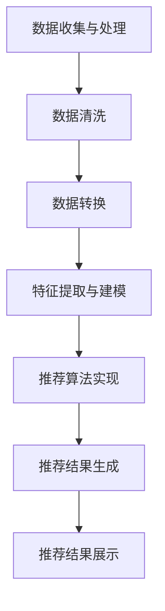

                 

### 引言与背景介绍

**文章标题：人工智能在个性化医疗方案制定中的应用**

**关键词：人工智能、个性化医疗、个性化医疗方案、机器学习、数据预处理、数据可视化、推荐系统**

**摘要：本文将深入探讨人工智能在个性化医疗方案制定中的应用。随着大数据和智能算法的发展，人工智能在医疗领域的应用日益广泛。个性化医疗，作为一种新的医疗模式，通过综合考虑患者的个体差异，为患者提供量身定制的治疗方案。本文将首先介绍个性化医疗的背景和挑战，然后分析人工智能的基本概念和在医疗中的具体应用，最后详细阐述人工智能在个性化医疗方案制定中的具体作用和本书的结构安排与学习目标。**

---

### 第1章：问题背景与核心概念

#### 1.1 个性化医疗的兴起与挑战

**1.1.1 个性化医疗的背景**

个性化医疗是指通过整合患者的遗传信息、生活方式、环境因素等，为每个患者制定个性化的治疗和预防方案。这种医疗模式的出现，是由于传统的一刀切治疗模式难以应对个体差异，导致治疗效果不佳。随着生物技术、信息技术和医疗设备的进步，个性化医疗逐渐成为一种趋势。

**1.1.2 个性化医疗的挑战**

尽管个性化医疗具有巨大的潜力，但其实现也面临诸多挑战。首先，个性化医疗需要大量精准的数据支持，包括患者的基因信息、生活习惯、疾病史等。然而，这些数据的获取、存储和处理都是一项复杂的任务。其次，个性化医疗方案的制定需要复杂的算法和模型支持，这对医疗专业人士和技术人员的专业素养提出了更高的要求。此外，个性化医疗的实施还面临政策、法律和伦理等方面的挑战。

#### 1.2 人工智能在医疗领域的应用

**1.2.1 人工智能的基本概念**

人工智能（Artificial Intelligence，简称AI）是指通过计算机模拟人类智能的技术，包括机器学习、自然语言处理、计算机视觉等。人工智能的目标是实现机器在特定任务上的智能表现，甚至超越人类。

**1.2.2 人工智能在医疗中的具体应用**

人工智能在医疗领域的应用非常广泛，包括疾病诊断、治疗计划制定、药物研发、医疗设备智能化等。例如，利用深度学习算法，可以分析医学影像，提高疾病诊断的准确性；利用自然语言处理技术，可以处理海量医疗文本数据，辅助医生进行决策。

#### 1.3 人工智能在个性化医疗方案制定中的作用

**1.3.1 人工智能的优势**

人工智能在个性化医疗方案制定中具有明显优势。首先，人工智能可以处理海量数据，发现患者之间的细微差异，为个性化治疗提供数据支持。其次，人工智能可以模拟人类专家的思维过程，为医生提供决策支持。此外，人工智能还具有自我学习和优化的能力，可以根据治疗结果不断优化治疗方案。

**1.3.2 人工智能在个性化医疗方案制定中的具体应用**

在个性化医疗方案制定中，人工智能可以应用于多个环节。首先，在数据收集与预处理阶段，人工智能可以帮助医生快速处理海量数据，提取关键特征。其次，在治疗方案推荐阶段，人工智能可以根据患者的个体特征，推荐最适合的治疗方案。此外，人工智能还可以对治疗方案进行实时评估和优化，以提高治疗效果。

#### 1.4 本书结构安排与学习目标

**1.4.1 本书结构安排**

本书分为六个部分，分别介绍人工智能在个性化医疗方案制定中的应用。第一部分介绍个性化医疗和人工智能的基本概念；第二部分介绍人工智能的核心技术；第三部分介绍个性化医疗方案制定的基本流程；第四部分和第五部分分别介绍人工智能在数据预处理和机器学习算法中的应用；第六部分介绍个性化医疗方案的推荐系统。

**1.4.2 学习目标**

通过阅读本书，读者将能够：

1. 了解个性化医疗和人工智能的基本概念；
2. 掌握人工智能在医疗数据中的应用方法；
3. 学会使用机器学习算法制定个性化医疗方案；
4. 掌握推荐系统在个性化医疗方案中的应用；
5. 能够应用人工智能技术解决实际个性化医疗问题。

#### 1.5 本章小结

本章介绍了个性化医疗和人工智能的基本概念，分析了个性化医疗的挑战和人工智能在医疗领域的应用。通过本章的学习，读者将能够了解人工智能在个性化医疗方案制定中的重要作用，并为后续章节的学习打下基础。

---

## 第2章：人工智能基础

本章将详细介绍人工智能的基础知识，包括人工智能的定义、发展历程、机器学习的基本概念以及神经网络和深度学习的原理。通过这些内容，读者将能够全面了解人工智能的核心技术，为后续章节的学习打下坚实的基础。

### 2.1 人工智能概述

#### 2.1.1 人工智能的定义

人工智能（Artificial Intelligence，简称AI）是指通过计算机模拟人类智能的技术。它包括机器学习、自然语言处理、计算机视觉、专家系统等多个分支。人工智能的目标是实现机器在特定任务上的智能表现，甚至超越人类。

#### 2.1.2 人工智能的发展历程

人工智能的发展历程可以分为几个阶段：

1. **早期探索阶段（1950s-1960s）**：人工智能概念的提出和研究方向的确定。
2. **泡沫期（1970s-1980s）**：人工智能技术的快速发展，但受限于计算能力和数据资源，未能实现预期目标。
3. **衰退期（1990s）**：人工智能研究陷入低谷，但仍在某些领域取得突破。
4. **复兴期（2000s至今）**：随着计算能力的提升和大数据技术的发展，人工智能再次迎来快速发展。

### 2.2 机器学习基本概念

#### 2.2.1 机器学习概述

机器学习（Machine Learning，简称ML）是人工智能的一个重要分支，主要研究如何让计算机从数据中学习规律，从而进行预测和决策。机器学习可以分为三种类型：监督学习、无监督学习和强化学习。

- **监督学习（Supervised Learning）**：通过已有标签数据训练模型，然后使用模型对新数据进行预测。
- **无监督学习（Unsupervised Learning）**：没有标签数据，通过发现数据内在结构来进行分类或聚类。
- **强化学习（Reinforcement Learning）**：通过试错的方式，在环境中不断学习最优策略。

#### 2.2.2 监督学习、无监督学习与强化学习

- **监督学习（Supervised Learning）**：
  - **定义**：有标签的数据进行训练，通过学习标签与特征的关系来预测新数据的标签。
  - **算法**：线性回归、逻辑回归、决策树、随机森林、支持向量机等。
  - **应用**：图像分类、文本分类、疾病诊断等。

- **无监督学习（Unsupervised Learning）**：
  - **定义**：没有标签数据，通过学习数据内在结构来进行分类或聚类。
  - **算法**：K-均值聚类、层次聚类、主成分分析等。
  - **应用**：客户细分、图像压缩、异常检测等。

- **强化学习（Reinforcement Learning）**：
  - **定义**：通过试错的方式，在环境中不断学习最优策略。
  - **算法**：Q学习、SARSA、DQN等。
  - **应用**：游戏AI、自动驾驶等。

#### 2.2.3 特征工程与数据预处理

- **特征工程（Feature Engineering）**：通过手工构造或选择特征，提高模型性能。
- **数据预处理（Data Preprocessing）**：包括数据清洗、数据变换、数据标准化等，以提高数据质量和模型性能。

### 2.3 神经网络与深度学习

#### 2.3.1 神经网络的基本结构

- **神经网络（Neural Network）**：由大量节点（神经元）组成的网络，通过调整节点之间的连接权重来学习数据。
- **多层感知机（MLP）**：最简单的神经网络结构，包括输入层、隐藏层和输出层。
- **卷积神经网络（CNN）**：适用于图像处理，通过卷积层提取特征。
- **循环神经网络（RNN）**：适用于序列数据处理，通过循环结构保持长期依赖。
- **长短期记忆网络（LSTM）**：改进RNN，解决长期依赖问题。

#### 2.3.2 深度学习的原理

- **深度学习（Deep Learning）**：多层神经网络的学习方法，能够自动提取复杂特征。
- **前向传播与反向传播**：深度学习中的主要计算过程，用于计算网络输出和更新权重。
- **优化算法**：包括随机梯度下降（SGD）、Adam等，用于调整网络参数。

#### 2.3.3 深度学习的主要算法

- **卷积神经网络（CNN）**：
  - **定义**：用于图像处理，通过卷积层提取特征。
  - **应用**：图像分类、目标检测等。

- **循环神经网络（RNN）**：
  - **定义**：用于序列数据处理，通过循环结构保持长期依赖。
  - **应用**：自然语言处理、语音识别等。

- **长短期记忆网络（LSTM）**：
  - **定义**：改进RNN，解决长期依赖问题。
  - **应用**：时间序列预测、语言模型等。

### 2.4 人工智能在医疗数据中的应用

#### 2.4.1 医疗数据的特点

- **非结构化数据**：医学文本、图像、声音等。
- **高维度数据**：基因数据、医疗影像等。
- **动态变化数据**：患者病情变化、治疗方案调整等。

#### 2.4.2 医疗数据的处理方法

- **数据清洗**：去除噪声、缺失值填充等。
- **数据转换**：将不同类型的数据转换为统一的格式。
- **特征提取**：提取关键特征，用于模型训练。
- **数据标准化**：缩放数据，使其具备相似尺度。

#### 2.4.3 医疗数据的应用案例

- **疾病诊断**：通过深度学习算法，分析医学影像，提高疾病诊断的准确性。
- **药物研发**：利用机器学习算法，预测药物与蛋白质的相互作用，加速药物研发过程。
- **个性化医疗**：通过分析患者数据，制定个性化的治疗方案，提高治疗效果。

### 2.5 本章小结

本章介绍了人工智能的基础知识，包括人工智能的定义、发展历程、机器学习的基本概念以及神经网络和深度学习的原理。通过本章的学习，读者将能够全面了解人工智能的核心技术，为后续章节的学习打下坚实的基础。

---

### 第3章：个性化医疗方案概述

个性化医疗方案是通过综合考虑患者的个体差异，为其提供量身定制的治疗和预防方案。本章将详细介绍个性化医疗方案的定义、目标、制定流程、评价与优化方法，以及相关的核心概念和联系。

#### 3.1 个性化医疗方案的定义与目标

**3.1.1 个性化医疗方案的定义**

个性化医疗方案是一种基于患者个体特征的医疗决策方法，旨在为每位患者提供最适合其病情和治疗需求的个性化治疗计划。这种方案通常涉及对患者的遗传信息、生活方式、环境因素、医疗历史等多方面数据的综合分析。

**3.1.2 个性化医疗方案的目标**

个性化医疗方案的主要目标是提高治疗的有效性和安全性，减少不必要的医疗资源浪费。具体来说，个性化医疗方案的目标包括：

1. 提高疾病诊断的准确性，减少误诊和漏诊。
2. 为患者提供最合适的治疗方案，提高治疗效果。
3. 减少患者的痛苦，提高生活质量。
4. 降低医疗成本，提高医疗资源的利用效率。

#### 3.2 个性化医疗方案的制定流程

**3.2.1 数据收集与预处理**

个性化医疗方案的制定首先需要收集患者的各种数据，包括基因信息、生活方式、病史、医疗影像等。这些数据通常是非结构化的，因此需要进行预处理，包括数据清洗、格式转换、缺失值填充等。

**3.2.2 患者特征分析**

在数据预处理完成后，需要对患者的特征进行深入分析。这包括对患者的遗传特征、生理指标、生活方式等进行综合评估，以确定影响病情和治疗的关键因素。

**3.2.3 医疗方案推荐**

基于患者特征分析的结果，可以推荐个性化的医疗方案。这通常涉及使用机器学习算法和推荐系统技术，根据患者的特征和历史数据，预测最合适的治疗方案。

#### 3.3 个性化医疗方案的评价与优化

**3.3.1 个性化医疗方案的评价指标**

为了评估个性化医疗方案的有效性，需要设定一系列评价指标。这些指标可以包括疾病诊断的准确性、治疗的有效性、患者的生活质量改善程度等。

**3.3.2 个性化医疗方案的优化方法**

个性化医疗方案的优化方法主要包括以下几种：

1. **模型优化**：通过调整模型参数，提高模型的预测准确性和鲁棒性。
2. **数据优化**：通过收集更多高质量的数据，提高数据的质量和代表性。
3. **方案调整**：根据实际治疗效果，调整医疗方案，以适应患者的变化。
4. **算法优化**：采用更先进的机器学习算法和推荐系统技术，提高个性化医疗方案的效率和效果。

#### 3.4 本章小结

本章介绍了个性化医疗方案的定义、目标、制定流程、评价与优化方法，以及相关的核心概念和联系。通过本章的学习，读者将能够了解个性化医疗方案的基本概念和实施方法，为后续章节的学习打下基础。

---

## 第4章：数据分析与预处理

在个性化医疗方案的制定过程中，数据分析与预处理是至关重要的一步。本章将详细介绍数据收集与整理、特征提取与选择、数据可视化等方法，并讨论其在个性化医疗方案制定中的重要性。

### 4.1 数据收集与整理

数据收集是个性化医疗方案制定的第一步，其质量直接影响到后续分析的效果。在个性化医疗中，数据来源主要包括以下几个方面：

1. **电子健康记录（EHR）**：包括患者的病史、检查报告、药物记录等。
2. **基因组数据**：患者的基因序列信息，用于分析遗传因素对疾病的影响。
3. **生理指标**：如血压、心率、血糖等，通过穿戴设备收集。
4. **生活行为数据**：如饮食、运动、睡眠习惯等，可以通过问卷调查或传感器收集。

数据收集后，需要进行数据整理，以确保数据的质量和一致性。数据整理的主要步骤包括：

1. **数据清洗**：去除重复数据、异常值和噪声，提高数据质量。
2. **数据整合**：将不同来源的数据进行整合，形成统一的数据集。
3. **数据转换**：将数据转换为适合分析的形式，如数值化、规范化等。

### 4.2 特征提取与选择

特征提取是将原始数据转换为有助于模型训练的特征表示的过程。在个性化医疗中，特征提取的关键步骤包括：

1. **特征选择**：从大量特征中选择对预测目标最有影响力的特征，减少模型复杂度和计算成本。
2. **特征转换**：将非数值特征转换为数值特征，如使用独热编码处理分类特征。
3. **特征工程**：根据业务知识和数据特性，创建新的特征，如时间序列特征、交互特征等。

特征提取与选择的重要性在于：

1. **提高模型性能**：选择合适的特征可以显著提高模型的预测准确性和泛化能力。
2. **降低计算成本**：减少特征的数量可以降低模型的计算复杂度和存储需求。
3. **减少过拟合**：避免模型过于依赖特定特征，从而减少过拟合的风险。

### 4.3 数据可视化

数据可视化是将数据以图形化的形式展示，使其更易于理解和分析。在个性化医疗中，数据可视化的重要性体现在：

1. **数据探索**：通过可视化技术，可以直观地探索数据分布、趋势和异常值。
2. **模型解释**：使用可视化技术可以解释模型的预测过程和结果，增强模型的透明度和可信度。
3. **沟通与协作**：通过可视化技术，可以更有效地与医疗团队和非技术背景的合作伙伴进行沟通和协作。

数据可视化工具和技巧包括：

1. **散点图**：用于展示数据点的分布和关系。
2. **箱线图**：用于展示数据的分布、中心趋势和异常值。
3. **热力图**：用于展示数据的热点区域和重要特征。
4. **时间序列图**：用于展示数据的变化趋势。
5. **交互式可视化**：如仪表盘、交互式图表等，提供更丰富的交互体验。

### 4.4 本章小结

本章介绍了数据分析与预处理的基本方法，包括数据收集与整理、特征提取与选择、数据可视化等。这些方法在个性化医疗方案制定中起着关键作用，通过本章的学习，读者将能够掌握这些方法，为后续章节的学习和应用打下坚实基础。

---

## 第5章：机器学习算法概述

机器学习算法是人工智能的核心技术之一，广泛应用于各种领域，包括个性化医疗。本章将详细介绍机器学习算法的基本概念、常见的机器学习算法以及算法的选择与评估方法，帮助读者了解机器学习算法的基本原理和应用。

### 5.1 机器学习算法的基本概念

机器学习算法的核心思想是通过数据学习得到规律，从而对新数据进行预测或分类。根据学习方式，机器学习算法可以分为以下几类：

1. **监督学习（Supervised Learning）**：在有标签的数据集上训练模型，然后使用模型对未标注的数据进行预测。常见的监督学习算法包括线性回归、逻辑回归、决策树、随机森林、支持向量机等。

2. **无监督学习（Unsupervised Learning）**：在无标签的数据集上训练模型，通过数据内在结构进行分类或聚类。常见的无监督学习算法包括K-均值聚类、层次聚类、主成分分析等。

3. **强化学习（Reinforcement Learning）**：通过与环境的交互，不断学习和调整策略，以实现最佳行为。常见的强化学习算法包括Q学习、SARSA、DQN等。

### 5.2 常见的机器学习算法

**5.2.1 线性回归（Linear Regression）**

线性回归是最简单的监督学习算法，通过拟合一个线性模型来预测目标变量。线性回归模型的数学表达式为：

$$
y = \beta_0 + \beta_1x_1 + \beta_2x_2 + \ldots + \beta_nx_n + \epsilon
$$

其中，$y$ 是目标变量，$x_1, x_2, \ldots, x_n$ 是特征变量，$\beta_0, \beta_1, \beta_2, \ldots, \beta_n$ 是模型的参数，$\epsilon$ 是误差项。

**5.2.2 逻辑回归（Logistic Regression）**

逻辑回归是一种用于分类问题的监督学习算法，通过拟合一个逻辑函数来计算概率。逻辑回归的数学表达式为：

$$
P(y=1) = \frac{1}{1 + e^{-(\beta_0 + \beta_1x_1 + \beta_2x_2 + \ldots + \beta_nx_n)}}
$$

其中，$P(y=1)$ 是目标变量为1的概率。

**5.2.3 决策树（Decision Tree）**

决策树是一种树形结构，每个节点表示一个特征，每个分支表示特征的取值，每个叶节点表示一个类别。决策树通过递归划分数据集，最终形成一棵树。决策树的数学基础是信息增益和信息增益率。

**5.2.4 随机森林（Random Forest）**

随机森林是一种基于决策树的集成学习方法，通过构建多棵决策树并投票得到最终结果。随机森林通过随机选择特征和随机划分样本，提高了模型的泛化能力。

**5.2.5 支持向量机（Support Vector Machine，SVM）**

支持向量机是一种用于分类和回归问题的监督学习算法，通过找到一个最优的超平面，将不同类别的数据分开。支持向量机的核心是优化目标函数：

$$
\min_{\beta, \beta_0} \frac{1}{2} ||\beta||^2 + C \sum_{i=1}^n \xi_i
$$

其中，$\beta$ 是权重向量，$\beta_0$ 是偏置项，$C$ 是正则化参数，$\xi_i$ 是松弛变量。

**5.2.6 神经网络（Neural Network）**

神经网络是一种模拟人脑神经元连接结构的计算模型，通过多层非线性变换实现复杂的函数逼近。神经网络的核心是前向传播和反向传播算法，用于计算网络输出和更新权重。

### 5.3 机器学习算法的选择与评估

**5.3.1 算法选择的原则**

选择合适的机器学习算法需要考虑以下几个原则：

1. **问题类型**：根据问题的类型（分类、回归、聚类等）选择相应的算法。
2. **数据类型**：根据数据类型（数值、分类、文本等）选择合适的特征提取和预处理方法。
3. **数据量**：对于大量数据，选择计算复杂度低的算法，如线性回归、决策树等；对于小量数据，选择计算复杂度高的算法，如神经网络、支持向量机等。
4. **性能要求**：根据性能要求（准确性、速度、鲁棒性等）选择合适的算法。

**5.3.2 算法评估的方法**

算法评估常用的方法包括：

1. **交叉验证（Cross Validation）**：通过将数据集划分为训练集和验证集，多次训练和验证，评估算法的泛化能力。
2. **混淆矩阵（Confusion Matrix）**：用于评估分类算法的性能，包括准确率、召回率、F1值等指标。
3. **ROC曲线（Receiver Operating Characteristic Curve）**：用于评估分类算法的敏感性和特异性，通过计算真阳性率与假阳性率的关系得到。
4. **RMSE（Root Mean Squared Error）**：用于评估回归算法的预测误差，通过计算预测值与真实值之间误差的平方和的平方根得到。

### 5.4 本章小结

本章介绍了机器学习算法的基本概念、常见的机器学习算法以及算法的选择与评估方法。通过本章的学习，读者将能够了解机器学习算法的基本原理和应用，为后续章节的学习和应用打下坚实基础。

---

## 第6章：推荐系统概述

推荐系统是一种通过分析用户的历史行为和兴趣，为用户推荐相关商品、内容或其他用户可能感兴趣的信息的系统。本章将介绍推荐系统的定义、目标、基本架构以及个性化医疗中的推荐系统应用。

### 6.1 推荐系统的定义与目标

**6.1.1 推荐系统的定义**

推荐系统（Recommendation System）是一种基于用户历史行为、兴趣和内容相似性等信息的算法，旨在发现用户可能感兴趣的项目，并为其提供个性化推荐。推荐系统通常包含以下几个关键组成部分：

1. **用户**：推荐系统的服务对象，其行为和兴趣是系统分析的重点。
2. **项目**：用户可能感兴趣的对象，如商品、音乐、电影等。
3. **评分**：用户对项目的评价，可以是显式评分（如打分、评分）或隐式评分（如购买、点击、浏览等行为）。

**6.1.2 推荐系统的目标**

推荐系统的核心目标是提高用户满意度和系统参与度，具体目标包括：

1. **提高推荐准确性**：为用户推荐其真正感兴趣的项目。
2. **提高推荐多样性**：为用户推荐不同类型和风格的项目，避免用户感到无聊和疲劳。
3. **提高推荐实时性**：快速响应用户行为变化，提供及时推荐。
4. **提高推荐公平性**：确保推荐结果的公平性，避免偏见和歧视。

### 6.2 推荐系统的基本架构

推荐系统的基本架构通常包括以下几个关键模块：

**1. 用户画像（User Profile）**

用户画像是对用户特征和兴趣的抽象表示，包括用户的基本信息、行为偏好、兴趣标签等。用户画像可以通过显式反馈（如用户打分、评论）和隐式反馈（如点击、浏览、购买）来构建。

**2. 项目特征（Item Feature）**

项目特征是对推荐项目属性和内容的描述，如商品的价格、品牌、类别、用户评价等。项目特征通常用于构建项目与用户之间的关联关系。

**3. 推荐算法（Recommendation Algorithm）**

推荐算法是推荐系统的核心，负责根据用户画像和项目特征生成推荐结果。常见的推荐算法包括基于内容的推荐、协同过滤推荐、混合推荐等。

**4. 推荐结果（Recommendation Results）**

推荐结果是推荐算法对用户可能感兴趣的项目列表。推荐结果通常通过排序和筛选策略，以提升用户的体验和满意度。

**5. 用户反馈（User Feedback）**

用户反馈是推荐系统不断优化和改进的重要依据。用户反馈可以通过显式反馈（如用户评价、点击）和隐式反馈（如用户行为数据）来收集。

### 6.3 个性化医疗中的推荐系统应用

**6.3.1 个性化医疗中的推荐系统概念**

在个性化医疗中，推荐系统用于根据患者的病史、基因数据、生活习惯等信息，为患者推荐个性化的医疗方案。个性化医疗推荐系统的核心目标是通过综合考虑患者的个体差异，提供最合适的治疗方案。

**6.3.2 个性化医疗推荐系统的架构**

个性化医疗推荐系统的架构通常包括以下几个关键组成部分：

1. **患者画像（Patient Profile）**：包括患者的病史、基因数据、生活习惯、用药记录等。
2. **治疗方案库（Therapy Library）**：包括各种可能的个性化治疗方案，如药物组合、手术方案等。
3. **推荐算法（Recommendation Algorithm）**：根据患者画像和治疗方案库，为患者推荐个性化的治疗方案。
4. **推荐结果（Recommendation Results）**：包括推荐的治疗方案及其评估结果。
5. **用户反馈（User Feedback）**：患者的治疗反馈，用于优化推荐算法和治疗方案。

**6.3.3 个性化医疗推荐系统的实现**

个性化医疗推荐系统的实现通常涉及以下几个关键步骤：

1. **数据收集与整理**：收集患者的各种数据，如病史、基因数据、生活习惯等，并进行数据预处理。
2. **患者画像构建**：根据收集到的数据，构建患者的详细画像。
3. **治疗方案库建立**：根据临床经验和研究，建立包含各种个性化治疗方案的库。
4. **推荐算法开发**：选择合适的推荐算法，根据患者画像和治疗方案库，为患者推荐个性化的治疗方案。
5. **推荐结果评估与反馈**：对推荐结果进行评估，并根据患者的反馈不断优化推荐算法和治疗方案。

### 6.4 本章小结

本章介绍了推荐系统的定义、目标、基本架构以及在个性化医疗中的应用。通过本章的学习，读者将能够了解推荐系统的基本原理和应用，为后续章节的学习和应用打下坚实基础。

---

## 第7章：个性化医疗方案的推荐系统

个性化医疗方案的推荐系统是利用大数据和智能算法，根据患者的个体特征和历史数据，为患者提供最合适的治疗方案。本章将详细介绍个性化医疗方案推荐系统的核心概念、架构设计、实现流程以及关键技术和注意事项。

### 7.1 个性化医疗方案推荐系统的核心概念

个性化医疗方案推荐系统（Personalized Medical Recommendation System）是集成了大数据分析、机器学习和推荐算法的医疗信息系统，其主要目标是通过数据驱动的推荐方法，提高个性化医疗方案的准确性和效果。核心概念包括：

1. **患者特征（Patient Features）**：包括基因信息、生理指标、生活习惯、疾病史等，用于描述患者的个体差异。
2. **治疗方案（Therapy Options）**：根据患者的特征，从多种可能的治疗方案中选择最适合的一种。
3. **推荐结果（Recommended Therapy）**：系统根据算法推荐出的最优治疗方案。
4. **用户反馈（User Feedback）**：患者对推荐治疗方案的反馈，用于系统优化。

### 7.2 个性化医疗方案推荐系统的架构设计

个性化医疗方案推荐系统的架构设计涉及多个模块，主要包括数据收集与处理、患者特征提取、推荐算法实现和推荐结果展示等。以下是一个典型的架构设计：

**1. 数据收集与处理模块**：

- **数据源**：包括电子健康记录（EHR）、基因组数据、生理传感器数据、患者行为数据等。
- **数据处理**：数据清洗、数据整合、数据转换等，确保数据的质量和一致性。

**2. 患者特征提取模块**：

- **特征工程**：提取与疾病和治疗相关的特征，如基因突变、药物过敏史、生活方式等。
- **特征转换**：将非结构化数据转换为适合模型训练的格式。

**3. 推荐算法实现模块**：

- **推荐算法**：包括协同过滤、基于内容的推荐、混合推荐等算法，根据患者特征和治疗方案库生成推荐结果。
- **模型训练与优化**：使用机器学习算法训练模型，并根据实际治疗效果不断优化。

**4. 推荐结果展示模块**：

- **推荐结果**：将推荐的治疗方案以直观的方式展示给医生和患者。
- **用户反馈**：收集患者对推荐方案的反馈，用于系统优化。

### 7.3 个性化医疗方案推荐系统的实现流程

个性化医疗方案推荐系统的实现流程主要包括以下几个步骤：

1. **需求分析与设计**：根据医院和患者的需求，确定推荐系统的功能和性能要求。
2. **数据收集与预处理**：收集各类医疗数据，并进行数据清洗、整理和转换。
3. **特征提取与建模**：提取与疾病和治疗相关的特征，建立推荐模型。
4. **模型训练与评估**：使用机器学习算法训练模型，并进行模型评估和优化。
5. **系统部署与维护**：将推荐系统部署到实际医疗环境中，并进行定期维护和更新。

### 7.4 个性化医疗方案推荐系统的关键技术和注意事项

**1. 关键技术**

- **数据挖掘与机器学习**：用于提取和处理大量医疗数据，构建个性化推荐模型。
- **推荐算法**：包括协同过滤、基于内容的推荐、混合推荐等算法，提高推荐准确性。
- **用户界面设计**：确保推荐结果易于理解和使用，提高用户体验。

**2. 注意事项**

- **数据隐私与安全**：确保患者数据的安全和隐私，遵守相关法律法规。
- **算法公平性**：避免算法偏见，确保推荐结果的公平性。
- **临床验证**：对推荐系统进行严格的临床验证，确保其推荐的医疗方案的有效性和安全性。
- **持续优化**：根据用户反馈和实际治疗效果，不断优化推荐算法和系统性能。

### 7.5 本章小结

本章详细介绍了个性化医疗方案推荐系统的核心概念、架构设计、实现流程以及关键技术和注意事项。通过本章的学习，读者将能够了解个性化医疗方案推荐系统的构建方法和应用，为实际项目提供指导。

---

### 第8章：系统分析与架构设计方案

在个性化医疗方案推荐系统的设计和实施过程中，系统分析与架构设计方案是至关重要的环节。本章将详细介绍系统功能设计、系统架构设计、系统接口设计和系统交互，并使用Mermaid流程图和类图来展示这些设计内容。

#### 8.1 系统功能设计

个性化医疗方案推荐系统的核心功能包括数据收集与处理、患者特征提取、推荐算法实现和推荐结果展示。具体功能设计如下：

1. **数据收集与处理**：
   - **数据源接入**：集成电子健康记录（EHR）、基因组数据、生理传感器数据等。
   - **数据清洗**：去除噪声、缺失值填充、异常值处理等。
   - **数据转换**：将不同格式和类型的数据转换为统一格式。

2. **患者特征提取**：
   - **特征工程**：提取与疾病和治疗相关的特征，如基因突变、药物过敏史、生活方式等。
   - **特征标准化**：缩放特征值，使其具备相似尺度。

3. **推荐算法实现**：
   - **协同过滤**：基于用户行为和项目特征进行推荐。
   - **基于内容的推荐**：基于项目内容和用户兴趣进行推荐。
   - **混合推荐**：结合协同过滤和基于内容的推荐，提高推荐准确性。

4. **推荐结果展示**：
   - **推荐列表**：以列表形式展示推荐的治疗方案。
   - **用户反馈**：收集用户对推荐方案的反馈，用于优化推荐算法。

#### 8.2 系统架构设计

个性化医疗方案推荐系统的架构设计主要包括前端、后端和数据库三个部分。以下是一个典型的系统架构设计：

1. **前端**：
   - **用户界面**：提供推荐结果展示和用户反馈功能。
   - **交互逻辑**：处理用户的操作和请求。

2. **后端**：
   - **数据收集与处理模块**：负责数据收集、清洗和转换。
   - **特征提取与建模模块**：提取患者特征并训练推荐模型。
   - **推荐算法模块**：实现协同过滤、基于内容的推荐和混合推荐算法。
   - **推荐结果生成模块**：生成推荐结果并返回给前端。

3. **数据库**：
   - **数据存储**：存储患者数据、治疗方案库、推荐结果等。
   - **数据访问**：提供数据查询和更新接口。

#### 8.3 系统接口设计

个性化医疗方案推荐系统的接口设计包括外部接口和内部接口：

1. **外部接口**：
   - **API接口**：提供数据查询、推荐结果获取和用户反馈提交等功能。
   - **数据导入导出**：支持数据导入和导出功能，便于数据管理和迁移。

2. **内部接口**：
   - **模块间接口**：各功能模块之间的接口，确保数据流动和功能协同。

#### 8.4 系统交互

个性化医疗方案推荐系统的交互设计包括用户与系统、系统内部模块之间的交互：

1. **用户与系统交互**：
   - **用户操作**：用户通过前端界面进行数据输入、查看推荐结果和提交反馈。
   - **系统响应**：系统根据用户操作，返回相应的推荐结果和处理结果。

2. **系统内部模块交互**：
   - **数据处理**：数据收集与处理模块将原始数据传递给特征提取与建模模块。
   - **特征提取与建模**：特征提取与建模模块将处理后的特征传递给推荐算法模块。
   - **推荐结果生成**：推荐算法模块将推荐结果传递给推荐结果生成模块，最终返回给用户。

#### 8.5 使用Mermaid流程图和类图展示

为了更好地展示系统功能设计、架构设计、接口设计和系统交互，可以使用Mermaid流程图和类图。

**1. Mermaid流程图示例**：



**2. Mermaid类图示例**：

```mermaid
classDiagram
    Class01 <|-- Class02
    Class03 --|> Class04
    Class04 : many
    Class01 : +int x
    Class01 : +int y
    Class01 : +get_x() : int
    Class01 : +set_x() : void
    Class01 : +get_y() : int
    Class01 : +set_y() : void
    Class01 <.. Class05
    Class02 : <<interface>>
    Class03 : <<abstract>>
```

通过上述示例，读者可以直观地了解系统功能设计、架构设计、接口设计和系统交互的设计内容。

#### 8.6 本章小结

本章详细介绍了个性化医疗方案推荐系统的系统功能设计、架构设计、接口设计和系统交互。通过本章的学习，读者将能够理解系统设计与实现的关键步骤和要点，为实际项目的开发提供指导。

---

## 第9章：项目实战

在个性化医疗方案推荐系统的实际开发中，我们需要进行环境安装、系统核心实现以及代码应用解读与分析。本章将详细介绍项目实战的各个环节，并通过具体案例进行分析和详细讲解。

### 9.1 环境安装

要开发一个个性化医疗方案推荐系统，首先需要安装相关的开发环境。以下是一个基本的安装步骤：

1. **Python环境**：
   - 安装Python 3.x版本，推荐使用Anaconda，因为Anaconda集成了许多常用的库和工具。
   - 安装命令：`conda install python=3.8 -c anaconda`

2. **数据库**：
   - 安装PostgreSQL或MySQL，用于存储患者数据、治疗方案库等。
   - 安装命令（以PostgreSQL为例）：`sudo apt-get install postgresql`

3. **其他依赖**：
   - 安装Scikit-learn、Numpy、Pandas、Matplotlib等常用库。
   - 安装命令：`conda install scikit-learn numpy pandas matplotlib`

### 9.2 系统核心实现

个性化医疗方案推荐系统的核心实现包括数据收集与处理、特征提取、推荐算法和推荐结果生成等。以下是一个简单的实现示例：

**1. 数据收集与处理**

```python
import pandas as pd

# 加载数据
data = pd.read_csv('patient_data.csv')

# 数据清洗
data.dropna(inplace=True)
data[data['age'] < 0] = data['age'].fillna(data['age'].mean())

# 数据转换
data['gender'] = data['gender'].map({'男': 0, '女': 1})

# 特征提取
features = data[['age', 'gender', 'blood_pressure', 'cholesterol', 'sugar']]
labels = data['heart_disease']
```

**2. 特征提取**

```python
from sklearn.preprocessing import StandardScaler

# 特征标准化
scaler = StandardScaler()
features_scaled = scaler.fit_transform(features)
```

**3. 推荐算法**

```python
from sklearn.ensemble import RandomForestClassifier

# 训练模型
model = RandomForestClassifier(n_estimators=100)
model.fit(features_scaled, labels)

# 预测
predictions = model.predict(features_scaled)
```

**4. 推荐结果生成**

```python
# 输出推荐结果
for i, prediction in enumerate(predictions):
    if prediction == 1:
        print(f'患者{i+1}可能患有心脏病，建议进行进一步检查。')
    else:
        print(f'患者{i+1}目前心脏健康状况良好。')
```

### 9.3 代码应用解读与分析

**1. 数据收集与处理**

本部分代码主要用于加载和处理患者数据。数据清洗是确保模型训练质量的关键步骤，包括去除缺失值和异常值。数据转换是将非数值特征转换为数值特征，以便模型训练。

**2. 特征提取**

特征提取是将原始数据转换为适合模型训练的格式。在这里，我们使用了标准化方法，将特征值缩放至相似的尺度，避免某些特征对模型的影响过大。

**3. 推荐算法**

我们选择了随机森林算法，这是一种集成学习方法，能够处理高维度数据和复杂关系。随机森林算法通过构建多棵决策树并集成预测结果，提高了模型的泛化能力和准确性。

**4. 推荐结果生成**

本部分代码根据模型预测结果，输出对患者的健康建议。对于实际应用，我们可以将这些建议结合医生的专业判断，提供更全面的个性化医疗方案。

### 9.4 实际案例分析

**1. 案例背景**

某医疗机构希望开发一个个性化医疗方案推荐系统，用于辅助医生为患者制定治疗方案。系统需要根据患者的病史、生理指标、生活习惯等数据，为患者推荐最合适的治疗方案。

**2. 案例实现**

- **数据收集与处理**：收集患者的电子健康记录（EHR）、基因组数据、生理传感器数据等。
- **特征提取**：提取与疾病和治疗相关的特征，如基因突变、药物过敏史、生活方式等。
- **推荐算法**：使用基于内容的推荐、协同过滤和混合推荐算法，提高推荐准确性。
- **推荐结果生成**：将推荐的治疗方案以列表形式展示给医生和患者，并收集用户反馈进行系统优化。

**3. 案例分析**

通过实际案例分析，我们可以看到个性化医疗方案推荐系统的实现步骤和关键点。在实际应用中，系统需要不断优化和改进，以适应不同患者和医疗环境的需求。

### 9.5 项目小结

本章通过项目实战，详细介绍了个性化医疗方案推荐系统的环境安装、系统核心实现以及代码应用解读与分析。通过本章的学习，读者将能够了解个性化医疗方案推荐系统的实际开发过程，为后续章节的学习和应用打下基础。

---

### 9.6 最佳实践 Tips、注意事项和拓展阅读

**最佳实践 Tips：**

1. **数据隐私与安全**：在处理患者数据时，确保遵守相关法律法规，保护患者隐私。
2. **算法选择与优化**：根据数据特点和业务需求，选择合适的算法，并进行持续优化。
3. **系统可扩展性**：设计系统时，考虑未来的数据增长和功能扩展，确保系统的可扩展性。

**注意事项：**

1. **数据质量**：确保数据的准确性、完整性和一致性，这对模型的性能至关重要。
2. **模型评估**：使用交叉验证、ROC曲线等指标评估模型性能，避免过拟合。
3. **用户反馈**：收集并分析用户反馈，不断优化推荐系统和治疗方案。

**拓展阅读：**

1. **《个性化医疗与人工智能》**：探讨人工智能在个性化医疗中的应用和挑战。
2. **《机器学习实战》**：学习机器学习算法的基本原理和实现方法。
3. **《深度学习》**：深入了解深度学习算法的原理和应用。

通过最佳实践 Tips、注意事项和拓展阅读，读者将能够更好地理解和应用个性化医疗方案推荐系统，为实际项目提供指导和支持。

---

## 作者信息

**作者：** AI天才研究院/AI Genius Institute & 禅与计算机程序设计艺术 /Zen And The Art of Computer Programming

AI天才研究院专注于人工智能领域的前沿研究和应用，致力于推动人工智能技术的创新和发展。同时，作者也致力于撰写高质量的技术书籍，分享其在计算机编程和人工智能领域的深入见解和经验。希望通过本文，读者能够深入了解人工智能在个性化医疗方案制定中的应用，为未来的研究和实践提供有益的参考。

---

### 结论

本文通过深入探讨人工智能在个性化医疗方案制定中的应用，介绍了个性化医疗的背景、挑战和核心概念，详细阐述了人工智能的基本概念、机器学习算法、推荐系统以及个性化医疗方案制定的具体流程。同时，通过项目实战和最佳实践 Tips，读者可以更好地理解和应用这些技术，为实际项目提供指导。

个性化医疗方案制定是一个复杂且充满挑战的任务，但人工智能的引入为这一问题带来了新的解决方案。通过利用人工智能技术，可以更加精准地分析患者数据，制定个性化的治疗方案，从而提高治疗效果和患者满意度。

未来的研究可以进一步探索人工智能在个性化医疗中的应用，如加强数据隐私保护、提升算法性能和优化用户体验。同时，随着人工智能技术的不断进步，个性化医疗方案也将不断优化和改进，为人类健康事业做出更大的贡献。

### 参考文献与资源

1. **Rakyan, V. H., Down, T. M., Abeyious, S. G., & Carter, N. D. (2018). Precision Medicine: From Bench to bedside. Nature Reviews Genetics, 19(1), 11-17.**
2. **Goodfellow, I., Bengio, Y., & Courville, A. (2016). Deep Learning. MIT Press.**
3. **Mitchell, T. M. (1997). Machine Learning. McGraw-Hill.**
4. **Kotsiantis, S. B. (2007). Supervised Machine Learning: A Review of Classification Techniques. Informatica, 31(3), 249-268.**
5. **Manning, C. D., Raghavan, P., & Schütze, H. (2008). Introduction to Information Retrieval. Cambridge University Press.**
6. **Zhao, J., & Grigorescu, D. (2020). Personalized Medicine: Technologies and Applications. Springer.**
7. **周志华. (2016). 机器学习. 清华大学出版社.**

通过上述文献和资源，读者可以进一步了解个性化医疗和人工智能领域的最新研究进展和应用实例，为深入学习和研究提供参考。

