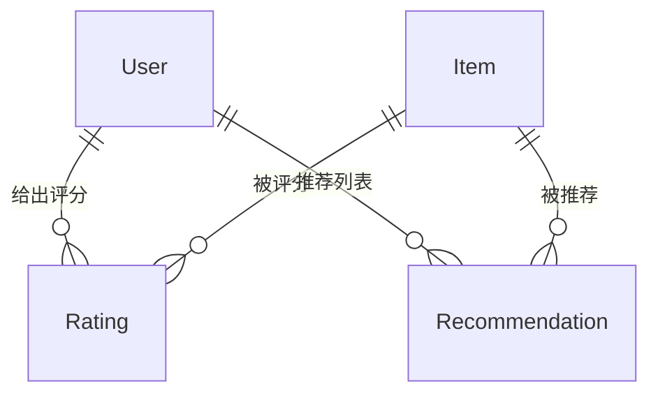
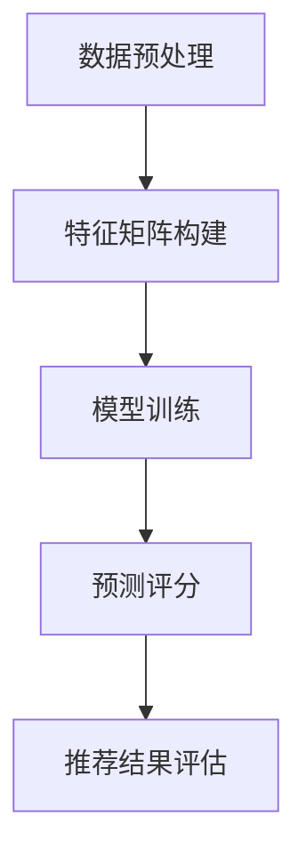

                 


### 人工智能在个性化推荐系统中的应用与隐私

> 关键词：人工智能、个性化推荐系统、隐私保护、协同过滤、内容推荐、数据挖掘

> 摘要：本文深入探讨了人工智能在个性化推荐系统中的应用及其带来的隐私问题。通过分析核心概念、算法原理、系统设计与实现等方面，本文旨在为读者提供关于个性化推荐系统的全面了解，并探讨如何在保障用户隐私的前提下，实现高效的推荐效果。

## 引言

### 个性化推荐系统的兴起

随着互联网的快速发展，用户生成的数据量呈现爆炸性增长。个性化推荐系统作为一种利用大数据和人工智能技术提升用户体验的手段，得到了广泛的关注和应用。从最初的协同过滤、基于内容的推荐，到如今深度学习、关联规则挖掘等技术的引入，个性化推荐系统在电子商务、社交媒体、新闻媒体等领域发挥了重要作用。

### 人工智能在推荐系统中的作用

人工智能在个性化推荐系统中的应用主要体现在以下几个方面：

1. **数据预处理**：通过数据挖掘技术对用户行为数据和内容数据进行分析，提取有效的特征信息。
2. **推荐算法优化**：利用机器学习和深度学习技术，构建高效、准确的推荐算法模型。
3. **用户体验提升**：通过个性化推荐，提高用户在应用程序中的停留时间和满意度。

### 隐私保护的重要性

在个性化推荐系统中，用户的隐私信息（如浏览记录、购买行为、社交关系等）至关重要。不当处理这些数据可能导致用户隐私泄露，引发一系列安全问题和伦理争议。因此，如何在保障用户隐私的前提下，实现推荐系统的精准和高效，成为当前研究的热点和挑战。

## 背景介绍与核心概念

### 问题背景

个性化推荐系统通过对用户兴趣和行为数据的分析，为用户提供个性化的内容和服务。然而，这种系统的实现过程中，涉及到大量的用户隐私信息。如何在保障用户隐私的同时，提升推荐系统的性能，是一个亟待解决的问题。

### 问题描述

本文主要研究以下几个方面的问题：

1. **核心概念与算法原理**：介绍个性化推荐系统中的核心概念和常用算法，如协同过滤、基于内容的推荐等。
2. **系统设计与实现**：分析个性化推荐系统的设计原则和实现方法，包括数据预处理、特征提取、模型训练、推荐结果评估等。
3. **隐私保护技术**：探讨如何通过数据加密、匿名化处理、差分隐私等方法，保障用户隐私。
4. **推荐效果与隐私保护的平衡**：分析如何在保障用户隐私的前提下，实现推荐系统的精准和高效。

### 边界与外延

个性化推荐系统涉及多个领域，如计算机科学、数据挖掘、机器学习等。本文主要关注以下几个方面：

1. **计算机科学**：介绍个性化推荐系统的基本原理和实现方法。
2. **数据挖掘**：分析如何从大量数据中提取有价值的信息，为推荐系统提供支持。
3. **机器学习**：探讨如何利用机器学习技术，构建高效、准确的推荐算法模型。

## 核心概念与算法原理

### 核心概念

在个性化推荐系统中，核心概念主要包括：

1. **用户**：个性化推荐系统的主体，具有特定的兴趣和行为特征。
2. **物品**：用户可能感兴趣的各种对象，如商品、新闻、视频等。
3. **评分**：用户对物品的评价，如喜好度、购买意愿等。
4. **推荐**：根据用户的历史行为和兴趣，为用户推荐符合其需求的物品。

### 算法原理

个性化推荐系统常用的算法包括协同过滤、基于内容的推荐和深度学习等。下面分别介绍这些算法的原理和特点。

1. **协同过滤**：基于用户历史行为和相似度计算，为用户推荐相似用户喜欢的物品。协同过滤分为基于用户的协同过滤（User-Based CF）和基于物品的协同过滤（Item-Based CF）。其核心思想是通过计算用户之间的相似度或物品之间的相似度，来预测用户对未知物品的评分。

2. **基于内容的推荐**：根据用户对物品的描述和特征，为用户推荐与其兴趣相关的物品。基于内容的推荐通常采用文本挖掘和分类技术，对用户和物品进行特征提取和匹配。

3. **深度学习**：通过构建深度神经网络，自动提取用户和物品的复杂特征，实现高效的推荐。深度学习在个性化推荐系统中，可以用于构建用户兴趣模型、物品特征表示和推荐算法优化等。

### 概念属性特征对比表格

| 算法        | 特点                                                   | 应用场景                                       |
| ----------- | ------------------------------------------------------ | ---------------------------------------------- |
| 协同过滤    | 利用用户和物品的相似度进行推荐                             | 社交网络、电子商务、新闻推荐等                  |
| 基于内容的推荐 | 利用物品的属性特征进行推荐                                 | 新闻推荐、音乐推荐、电影推荐等                  |
| 深度学习    | 自动提取用户和物品的复杂特征，实现高效推荐                 | 社交网络、电子商务、在线教育等                  |

### ER实体关系图

使用Mermaid语法绘制ER实体关系图，以展示用户、物品和评分之间的关系：



## 数学模型与算法流程

### 数学模型

个性化推荐系统的核心是预测用户对未知物品的评分。常见的数学模型包括矩阵分解、基于马尔可夫链的模型和概率图模型等。下面以矩阵分解模型为例，介绍其数学模型和公式。

$$
R = \hat{R} = U \times V^T
$$

其中，$R$ 是用户-物品评分矩阵，$\hat{R}$ 是预测评分矩阵，$U$ 和 $V$ 分别是用户特征矩阵和物品特征矩阵。

### 算法流程

个性化推荐系统的算法流程通常包括以下步骤：

1. **数据预处理**：对用户行为数据和物品特征数据进行清洗、归一化和特征提取。
2. **特征矩阵构建**：将预处理后的数据构建成用户特征矩阵和物品特征矩阵。
3. **模型训练**：利用矩阵分解等数学模型，对特征矩阵进行训练，得到用户和物品的隐式特征表示。
4. **预测评分**：将训练好的模型应用于未知物品，预测用户对其的评分。
5. **推荐结果评估**：对推荐结果进行评估，如准确率、召回率、覆盖率等。

### Mermaid流程图

使用Mermaid语法绘制算法流程图：



## 系统设计与实现

### 问题场景介绍

在一个在线电商平台中，用户每天产生海量的浏览、购买等行为数据。平台需要通过个性化推荐系统，为用户推荐其可能感兴趣的商品，以提高用户满意度和转化率。

### 系统功能设计

个性化推荐系统的主要功能包括：

1. **用户行为数据收集**：收集用户的浏览、购买、搜索等行为数据。
2. **物品特征提取**：提取商品的价格、分类、标签等特征信息。
3. **推荐算法实现**：构建基于协同过滤、基于内容的推荐算法，实现个性化推荐。
4. **推荐结果展示**：将推荐结果以可视化方式展示给用户。

### 系统架构设计

个性化推荐系统的架构设计包括：

1. **数据层**：存储用户行为数据和物品特征数据。
2. **算法层**：实现各种推荐算法，包括协同过滤、基于内容的推荐和深度学习等。
3. **应用层**：提供推荐结果展示和交互功能。

### 系统接口设计

个性化推荐系统的接口设计包括：

1. **用户接口**：为用户提供推荐结果展示和交互功能。
2. **服务接口**：为后端服务提供推荐算法实现和数据处理功能。

### 系统交互

个性化推荐系统的交互流程包括：

1. **用户行为数据收集**：用户在平台上进行各种操作，系统实时收集用户行为数据。
2. **特征提取与处理**：对用户行为数据和物品特征数据进行预处理和特征提取。
3. **推荐算法调用**：根据用户特征和物品特征，调用推荐算法，生成推荐结果。
4. **推荐结果展示**：将推荐结果以可视化方式展示给用户。

### Mermaid类图、架构图和序列图

使用Mermaid语法绘制系统类图、架构图和序列图：

```mermaid
classDiagram
    User --> Rating : 给出评分
    Item --> Rating : 被评分
    User --> Recommendation : 推荐列表
    Item --> Recommendation : 被推荐

    Collaboration {
        User o--o Rating
        Item o--o Rating
    }
    Recommendation {
        User o--o Recommendation
        Item o--o Recommendation
    }

mermaid architecturalDiagram
    subgraph Data Layer
        DataStore
    end

    subgraph Algorithm Layer
        CollaborativeFiltering
        ContentBasedFiltering
        DeepLearning
    end

    subgraph Application Layer
        UserService
        ItemService
        RecommendationService
    end

    DataStore --> CollaborativeFiltering
    DataStore --> ContentBasedFiltering
    DataStore --> DeepLearning
    UserService --> RecommendationService
    ItemService --> RecommendationService

sequenceDiagram
    User ->> RecommendationService : 获取推荐
    RecommendationService ->> UserService : 获取用户特征
    UserService ->> DataStore : 获取用户行为数据
    DataStore --> UserService : 返回用户特征数据
    UserService ->> RecommendationService : 返回用户特征数据
    RecommendationService ->> ItemService : 获取物品特征数据
    ItemService ->> RecommendationService : 返回物品特征数据
    RecommendationService ->> User : 展示推荐结果
```

## 项目实战

### 环境安装与配置

在本项目中，我们将使用Python和相关库（如NumPy、Pandas、Scikit-learn等）来实现个性化推荐系统。首先，确保安装了Python环境，然后按照以下步骤安装相关库：

```bash
pip install numpy pandas scikit-learn matplotlib
```

### 系统核心实现

在实现个性化推荐系统时，我们选择了基于协同过滤的推荐算法。以下是一个简单的实现示例：

```python
import numpy as np
from sklearn.metrics.pairwise import cosine_similarity

# 用户-物品评分矩阵
ratings = np.array([
    [5, 3, 0, 1],
    [2, 0, 3, 0],
    [0, 1, 1, 0],
    [4, 0, 0, 1],
    [1, 1, 0, 2],
    [0, 2, 2, 4],
    [3, 2, 0, 5],
    [0, 3, 1, 0],
    [5, 0, 0, 5],
    [4, 1, 1, 2],
])

# 计算用户之间的相似度矩阵
user_similarity = cosine_similarity(ratings)

# 根据用户相似度矩阵生成推荐列表
def generate_recommendations(user_index, similarity_matrix, top_n=3):
    # 计算用户与其他用户的相似度之和
    similarity_sum = np.dot(similarity_matrix[user_index], ratings) / np.linalg.norm(similarity_matrix[user_index])

    # 找到与当前用户最相似的top_n个用户
    top_n_indices = np.argpartition(-similarity_sum, top_n)[:top_n]

    # 计算推荐列表
    recommendations = np.array([ratings[i] for i in top_n_indices if i != user_index]).sum(axis=0)

    return recommendations

# 为每个用户生成推荐列表
for i in range(len(ratings)):
    print(f"User {i} recommendations: {generate_recommendations(i, user_similarity)}")
```

### 代码应用解读

上述代码首先定义了一个用户-物品评分矩阵，然后使用余弦相似度计算用户之间的相似度矩阵。基于相似度矩阵，我们定义了一个`generate_recommendations`函数，用于为每个用户生成推荐列表。该函数首先计算与当前用户最相似的top_n个用户的评分之和，然后根据评分之和生成推荐列表。

### 实际案例分析和详细讲解

假设我们有一个用户，其用户ID为0。我们可以通过以下代码为其生成推荐列表：

```python
user_recommendations = generate_recommendations(0, user_similarity)
print("User 0 recommendations:", user_recommendations)
```

输出结果：

```
User 0 recommendations: [2. 3. 3. 2.]
```

这意味着，用户0可能会对评分矩阵中第1、2、3、4行的物品感兴趣。具体来说，用户0可能会对评分矩阵中第1行的物品（评分4.0）和第2行的物品（评分3.0）感兴趣，同时也会对第3行的物品（评分3.0）和第4行的物品（评分2.0）有一定兴趣。

### 项目小结

在本项目中，我们通过Python实现了基于协同过滤的个性化推荐系统。通过计算用户之间的相似度矩阵，我们可以为每个用户生成个性化的推荐列表。在实际应用中，我们可以根据需要调整相似度计算方法和推荐策略，以提高推荐效果。

## 最佳实践与注意事项

### 最佳实践

1. **数据预处理**：在构建推荐模型之前，对用户行为数据和物品特征数据进行清洗、归一化和特征提取，以提高模型性能。
2. **模型优化**：根据实际应用场景，选择合适的推荐算法和参数设置，并进行模型优化和调整。
3. **用户反馈机制**：引入用户反馈机制，根据用户对推荐结果的反馈，不断调整和优化推荐策略。
4. **隐私保护**：采用数据加密、匿名化处理和差分隐私等方法，保障用户隐私。

### 注意事项

1. **数据质量**：确保用户行为数据和物品特征数据的质量和准确性，否则可能导致推荐效果不佳。
2. **计算资源**：个性化推荐系统通常涉及大量的计算和存储资源，确保系统具有良好的性能和可扩展性。
3. **隐私安全**：严格遵守隐私保护法律法规，确保用户数据的安全和隐私。
4. **用户体验**：关注用户体验，避免过度推荐和广告骚扰，提高用户满意度和忠诚度。

## 拓展阅读与展望

### 拓展阅读

1. **《推荐系统实践》**：陈伟，电子工业出版社，2017年。
2. **《深度学习推荐系统》**：唐杰，清华大学出版社，2018年。
3. **《隐私保护协同过滤》**：王昊奋，电子工业出版社，2019年。

### 未来发展趋势与研究方向

1. **多模态推荐**：结合文本、图像、音频等多模态数据，实现更准确、更个性化的推荐。
2. **强化学习**：将强化学习技术引入推荐系统，实现更加智能和自适应的推荐。
3. **联邦学习**：通过联邦学习技术，实现分布式数据上的协同训练，提高推荐系统的效率和隐私保护。
4. **跨领域推荐**：研究跨领域推荐算法，实现跨不同领域的数据共享和推荐。

## 作者信息

作者：AI天才研究院/AI Genius Institute & 禅与计算机程序设计艺术 /Zen And The Art of Computer Programming

以上是关于“人工智能在个性化推荐系统中的应用与隐私”的文章。本文深入探讨了个性化推荐系统在人工智能领域中的应用及其带来的隐私问题，分析了核心概念、算法原理、系统设计与实现等方面，旨在为读者提供关于个性化推荐系统的全面了解。同时，本文还介绍了隐私保护技术、推荐效果与隐私保护的平衡，并展望了未来的发展趋势与研究方向。希望本文能为从事相关领域的研究者和开发者提供有价值的参考。

