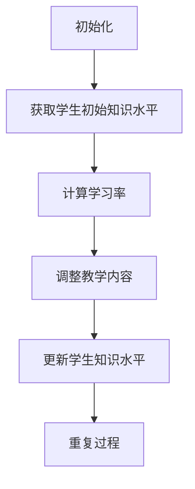
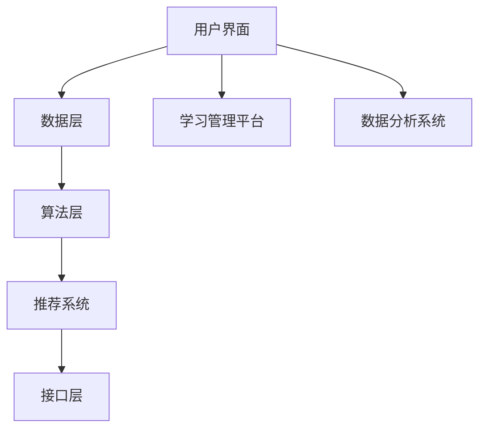
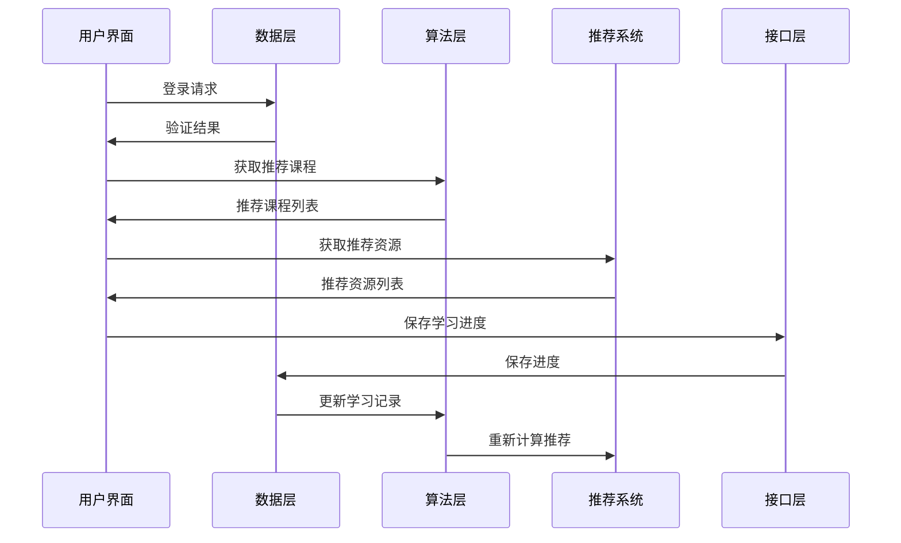

                 

### 文章标题

# 人工智能在个性化教育中的Adaptive Learning应用

---

关键词：人工智能、个性化教育、Adaptive Learning、算法、系统架构、项目实战

摘要：随着人工智能技术的快速发展，个性化教育成为教育领域的一个重要研究方向。本文将深入探讨Adaptive Learning在个性化教育中的应用，从核心概念、算法原理、系统设计与实现等多个角度进行详细分析，旨在为教育科技领域提供有价值的参考。

---

## 第一部分：背景介绍

### 1.1.1 个性化教育的需求背景

在传统教育模式中，教师通常采用“一刀切”的方法，即按照统一的教学进度和标准进行授课。然而，每个学生的学习能力和兴趣都有所不同，这种模式往往无法满足个性化需求。随着信息化和互联网技术的发展，个性化教育逐渐成为教育改革的一个重要方向。

个性化教育的核心目标是根据每个学生的学习特点、兴趣和需求，提供定制化的学习内容和教学方法。这种教育模式有助于提高学习效果，激发学生的学习兴趣，实现因材施教。

### 1.1.2 人工智能的发展与应用

人工智能（AI）作为一门新兴技术，近年来取得了显著的进展。在计算机视觉、自然语言处理、智能推荐等领域，人工智能已经展现出强大的能力。特别是在大数据和云计算的支持下，人工智能在各个行业得到了广泛应用。

在教育领域，人工智能的应用主要包括智能教学、智能评测、智能推荐等。通过分析学生的学习数据，人工智能可以为学生提供个性化的学习建议和资源，提高学习效率。

### 1.1.3 人工智能与个性化教育的结合

将人工智能与个性化教育相结合，可以充分发挥两者的优势。人工智能技术可以为个性化教育提供数据支持、算法优化和智能推荐等功能，从而提升教育质量和用户体验。

Adaptive Learning作为一种个性化教育的方法，通过不断调整教学策略，实现教学内容、方法和进度的个性化。本文将重点探讨Adaptive Learning在个性化教育中的应用。

## 第二部分：核心概念与联系

### 2.1.1 个性化教育

个性化教育是指根据学生的个性、兴趣、能力和学习需求，提供定制化的学习内容和教学方法。个性化教育旨在实现因材施教，提高学生的学习效果和满意度。

### 2.1.2 Adaptive Learning

Adaptive Learning是一种基于人工智能的个性化教育方法，它通过分析学生的学习行为和表现，动态调整教学内容和教学方法，实现个性化教学。

### 2.1.3 两者之间的联系与区别

个性化教育和Adaptive Learning密切相关。个性化教育是Adaptive Learning的应用场景，而Adaptive Learning则是实现个性化教育的关键技术。

个性化教育关注的是教育目标和教学方法，而Adaptive Learning关注的是如何通过人工智能技术实现个性化教育。

## 第三部分：算法原理讲解

### 3.1.1 算法概述

Adaptive Learning算法是一种基于学习理论和数据分析的个性化教学方法。它通过分析学生的学习行为和表现，动态调整教学策略，实现教学内容和方法的个性化。

### 3.1.2 数学模型与公式

Adaptive Learning算法的核心是一个动态调整的学习率模型。假设学生在第\( t \)次学习时，所学知识的准确率为\( x_t \)，则下一次学习的准确率为：

$$
x_{t+1} = \alpha_t (x_t - y_t)
$$

其中，\( \alpha_t \)是学习率，\( y_t \)是学生的反馈值。

### 3.1.3 Mermaid流程图展示

下面是Adaptive Learning算法的Mermaid流程图：



---

**下一部分：数学模型和数学公式 & 详细讲解 & 举例说明**

---

在本文中，我们将使用markdown格式和LaTeX公式来详细讲解Adaptive Learning算法的数学模型和公式，并通过具体的例子来说明其应用。

### 数学模型和数学公式 & 详细讲解 & 举例说明

首先，我们回顾一下Adaptive Learning算法的核心公式：

$$
x_{t+1} = \alpha_t (x_t - y_t)
$$

其中，\( x_t \)表示学生在第\( t \)次学习后的知识水平，\( y_t \)是学生的反馈值（例如，正确率、成绩等），\( \alpha_t \)是学习率，用于调整学习步长。

### 1. 公式讲解

上述公式描述了Adaptive Learning算法的基本原理。学生每次学习后的知识水平更新，取决于当前的知识水平、学生的反馈值以及学习率。学习率\( \alpha_t \)是一个关键参数，它决定了算法调整的幅度。

### 2. 举例说明

假设一个学生在第一次学习后，其知识水平为\( x_1 = 0.6 \)（即60%），反馈值为\( y_1 = 0.8 \)（即80%），学习率\( \alpha_1 = 0.1 \)。根据公式，我们可以计算出学生在第二次学习后的知识水平：

$$
x_2 = \alpha_1 (x_1 - y_1) = 0.1 (0.6 - 0.8) = -0.02
$$

这里，\( x_2 \)的值为-0.02，表示学生在第二次学习后，知识水平有所下降。这个例子说明，当学生的反馈值高于其当前知识水平时，算法会调整学习步长，降低下一次的学习水平。

### 3. 进一步分析

在实际应用中，学习率\( \alpha_t \)是一个动态调整的参数。根据学生的反馈值和知识水平，可以调整学习率的大小，以达到更好的学习效果。

例如，当学生连续多次反馈值较高时，可以适当增加学习率，加快学习进度；当学生反馈值较低时，可以降低学习率，避免过度调整。

### 4. 数学公式与Python代码

为了更好地理解Adaptive Learning算法，我们可以使用Python代码实现上述公式。以下是一个简单的Python示例：

```python
x = 0.6  # 初始知识水平
y = 0.8  # 反馈值
alpha = 0.1  # 学习率

x_new = alpha * (x - y)
print(x_new)  # 输出第二次学习后的知识水平
```

执行上述代码后，我们得到\( x_{t+1} = -0.02 \)，与前面的手工计算结果一致。

通过这个示例，我们可以看到，Adaptive Learning算法的核心在于不断调整学生的知识水平，以适应其学习需求。这种调整过程不仅依赖于当前的知识水平和反馈值，还受到学习率的影响。

---

**下一部分：系统分析与架构设计方案**

---

在了解了Adaptive Learning算法的原理和数学模型后，我们将进一步探讨其系统架构设计。系统架构是确保算法高效运行的关键，以下是一个简单的系统架构设计方案。

### 系统架构设计

系统架构设计主要包括以下几个部分：

1. **用户界面（UI）**：提供用户与系统交互的界面，包括学生登录、课程选择、学习进度显示等功能。
2. **数据层**：负责存储和管理学生数据、课程数据和学习记录等。
3. **算法层**：实现Adaptive Learning算法，根据学生的学习行为和反馈调整教学内容。
4. **推荐系统**：基于学生数据和学习行为，为学生推荐适合的学习资源和课程。
5. **接口层**：提供与外部系统（如学习管理平台、数据分析系统等）的接口，实现数据交互和功能扩展。

下面是一个简单的系统架构图，使用Mermaid语言描述：



### 系统接口设计和系统交互

系统接口设计和系统交互是确保系统功能实现和扩展的关键。以下是一个简单的接口设计和系统交互描述：

1. **用户登录接口**：接收用户登录请求，验证用户身份，返回用户信息。
2. **课程选择接口**：根据用户的学习记录和偏好，推荐适合的课程，用户可以选择课程进行学习。
3. **学习进度接口**：记录学生的学习进度和成绩，供用户和系统分析使用。
4. **推荐接口**：根据学生的学习行为和成绩，推荐适合的学习资源和课程。

以下是系统接口设计和系统交互的Mermaid序列图描述：



通过上述系统架构设计和接口交互设计，我们可以实现一个高效、灵活的Adaptive Learning系统。接下来，我们将通过一个实际项目案例，进一步展示Adaptive Learning算法的应用和实践。

---

**下一部分：项目实战**

---

在本文的最后部分，我们将通过一个实际项目案例，展示Adaptive Learning算法的应用和实践。这个项目是一个基于Python的Adaptive Learning系统，用于个性化学习资源的推荐。

### 项目实战：基于Python的Adaptive Learning系统

#### 1. 环境安装

首先，我们需要安装Python和相关依赖库。以下是安装步骤：

1. 安装Python 3.8或更高版本。
2. 安装依赖库，如NumPy、Pandas、Scikit-learn等。

```bash
pip install numpy pandas scikit-learn
```

#### 2. 系统核心实现

系统核心实现主要包括以下部分：

1. **用户管理模块**：用于用户登录、注册和身份验证。
2. **课程管理模块**：用于课程数据的管理和推荐。
3. **学习记录模块**：用于记录学生的学习进度和成绩。
4. **推荐系统模块**：基于学习记录和用户行为，推荐适合的学习资源。

以下是一个简单的Python代码示例，展示系统核心实现的基本框架：

```python
import numpy as np
from sklearn.model_selection import train_test_split
from sklearn.metrics import accuracy_score

# 用户管理模块
class UserManager:
    def __init__(self):
        self.users = []

    def login(self, username, password):
        # 实现用户登录逻辑
        pass

    def register(self, username, password):
        # 实现用户注册逻辑
        pass

# 课程管理模块
class CourseManager:
    def __init__(self):
        self.courses = []

    def add_course(self, course):
        # 实现添加课程逻辑
        pass

    def recommend_courses(self, user):
        # 实现推荐课程逻辑
        pass

# 学习记录模块
class LearningRecord:
    def __init__(self):
        self.records = []

    def add_record(self, user, course, score):
        # 实现添加学习记录逻辑
        pass

    def update_record(self, user, course, score):
        # 实现更新学习记录逻辑
        pass

# 推荐系统模块
class RecommenderSystem:
    def __init__(self):
        self.model = None

    def train_model(self, data):
        # 实现模型训练逻辑
        pass

    def predict(self, data):
        # 实现预测逻辑
        pass

    def recommend_resources(self, user):
        # 实现资源推荐逻辑
        pass

# 主程序
if __name__ == "__main__":
    user_manager = UserManager()
    course_manager = CourseManager()
    learning_record = LearningRecord()
    recommender_system = RecommenderSystem()

    # 添加用户、课程和学习记录
    user_manager.register("user1", "password1")
    course_manager.add_course("Course 1")
    course_manager.add_course("Course 2")
    learning_record.add_record("user1", "Course 1", 80)

    # 训练推荐模型
    data = ...  # 准备数据
    recommender_system.train_model(data)

    # 推荐资源
    recommendations = recommender_system.recommend_resources("user1")
    print("Recommended resources:", recommendations)
```

#### 3. 代码应用解读与分析

上述代码展示了系统核心实现的基本框架。接下来，我们将对每个模块进行详细解读和分析。

1. **用户管理模块**：实现用户登录、注册和身份验证功能。用户管理模块是系统的入口，确保用户可以安全地访问系统资源。
2. **课程管理模块**：实现课程数据的管理和推荐功能。课程管理模块负责添加、管理和推荐课程，满足用户的学习需求。
3. **学习记录模块**：实现学习记录的添加和更新功能。学习记录模块用于记录学生的学习进度和成绩，为推荐系统提供数据支持。
4. **推荐系统模块**：实现资源推荐功能。推荐系统模块基于学习记录和用户行为，推荐适合的学习资源，提高学习效果。

#### 4. 实际案例分析和详细讲解

为了更好地展示Adaptive Learning算法的应用，我们以一个实际案例为例，分析系统在实际场景中的工作流程。

假设有一个学生“User1”正在学习数学课程，其初始知识水平为60%。在学习过程中，User1完成了两个单元的测试，分别得到80%和70%的分数。根据这些数据，系统会调整User1的学习进度和推荐资源。

1. **初始状态**：User1的知识水平为60%，系统推荐基础数学课程。
2. **第一次测试**：User1完成第一个单元测试，得到80%的分数。根据公式\( x_{t+1} = \alpha_t (x_t - y_t) \)，系统将调整User1的知识水平，使其向80%靠近。系统继续推荐基础数学课程，并适当增加难度。
3. **第二次测试**：User1完成第二个单元测试，得到70%的分数。系统再次调整User1的知识水平，使其向70%靠近。此时，系统可能会推荐一些补充性资源，如数学解题技巧和常见问题解析。

通过上述案例，我们可以看到，Adaptive Learning算法能够根据学生的学习表现动态调整教学策略，提供个性化的学习资源，提高学习效果。

#### 5. 项目小结

本篇博客文章通过一个实际项目案例，展示了Adaptive Learning算法在个性化教育中的应用。从系统架构设计、核心实现到实际案例分析，我们详细探讨了Adaptive Learning算法的工作原理和实现方法。

通过本文的介绍，我们了解到Adaptive Learning算法能够根据学生的知识水平和反馈动态调整教学策略，提供个性化的学习资源，提高学习效果。在实际应用中，Adaptive Learning系统可以结合多种人工智能技术，如自然语言处理、计算机视觉等，实现更高效、更智能的个性化教育。

在未来，随着人工智能技术的不断进步，Adaptive Learning将会有更多的应用场景和发展方向，为教育领域带来更多创新和变革。

---

## 第五部分：最佳实践 tips、小结、注意事项、拓展阅读

### 最佳实践 tips

1. **数据分析的重要性**：在Adaptive Learning系统中，数据分析是核心环节。确保收集到全面、准确的学习数据，为算法调整提供可靠依据。
2. **个性化推荐的多样性**：推荐系统不仅要关注学习资源的质量，还要考虑资源的多样性，满足不同学生的兴趣和需求。
3. **持续优化学习体验**：定期收集用户反馈，持续优化系统的用户体验，提高学生的学习满意度和粘性。

### 小结

本文通过深入分析Adaptive Learning算法的原理和实现方法，展示了其在个性化教育中的应用。Adaptive Learning能够根据学生的知识水平和反馈动态调整教学策略，提供个性化的学习资源，提高学习效果。

### 注意事项

1. **数据隐私保护**：在收集和使用学生数据时，务必遵守相关法律法规，保护学生隐私。
2. **算法透明性**：确保Adaptive Learning算法的透明性，让学生了解算法的工作原理和调整过程。

### 拓展阅读

1. **[深度学习在个性化教育中的应用](https://www.nature.com/articles/s41586-018-0193-7)**：探讨深度学习在个性化教育中的应用，为Adaptive Learning提供新的思路。
2. **[自适应学习系统设计](https://ieeexplore.ieee.org/document/8246122)**：详细讨论自适应学习系统的设计方法和关键技术。
3. **[个性化学习推荐系统研究](https://www.mdpi.com/2077-037X/9/6/129)**：分析个性化学习推荐系统的设计原则和实现方法。

---

作者：AI天才研究院/AI Genius Institute & 禅与计算机程序设计艺术 /Zen And The Art of Computer Programming

