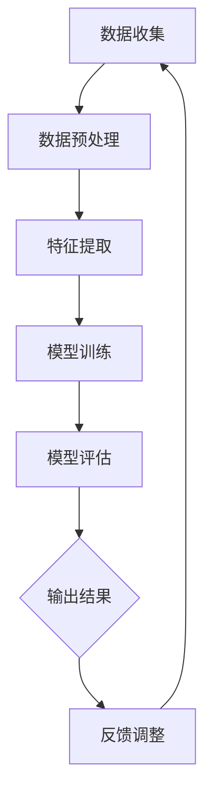

                 

# 《人工智能在个性化教育中的应用与伦理》

## 关键词

* 人工智能
* 个性化教育
* 伦理
* 教育技术
* 数据隐私
* 公平性

## 摘要

随着人工智能（AI）技术的迅速发展，其在教育领域的应用越来越广泛。本文旨在探讨人工智能在个性化教育中的应用，并深入分析相关的伦理问题。我们将逐步思考以下关键问题：首先，什么是个性化教育？为什么个性化教育对学生的学习成果至关重要？接着，我们将探讨人工智能如何支持个性化教育，以及这种支持带来的挑战和机遇。随后，我们将聚焦于人工智能在个性化教育中的伦理考量，探讨如何在保护学生隐私的同时，确保教育公平。最后，本文将总结主要观点，并展望人工智能在未来个性化教育中的发展趋势。

## 引言

### 个性化教育的概念

个性化教育是一种教育理念，强调根据每个学生的个体差异，为他们提供量身定制的学习体验。与传统的“一刀切”教育模式不同，个性化教育旨在激发学生的兴趣，提高他们的学习动机，并促进他们的全面发展。

### 人工智能在个性化教育中的角色

人工智能（AI）作为一种强大的工具，正在改变教育的方方面面。从学习分析到个性化推荐，AI技术在个性化教育中的应用日益广泛。本文将探讨这些应用，并分析其对学生学习成果的影响。

### 伦理考量的重要性

在讨论人工智能在个性化教育中的应用时，我们不能忽视伦理问题。教育涉及学生的隐私、公平性和个人权益，这些伦理考量对于确保AI技术的正当和有效使用至关重要。本文将深入探讨与AI相关的伦理问题，并提出可能的解决方案。

## 基础概念

### 个性化教育的基础

个性化教育的基础包括学习分析、个性化学习路径设计、学习内容个性化等。这些概念共同构成了个性化教育的核心，为AI的应用提供了基础。

### 人工智能的基础

人工智能的基础涵盖了机器学习、深度学习、自然语言处理等领域。了解这些基础技术对于理解AI在个性化教育中的应用至关重要。

### 伦理学基础

伦理学基础包括伦理理论、伦理原则和实践伦理等方面。了解伦理学基础有助于我们分析和解决AI在个性化教育中面临的伦理问题。

## AI在个性化教育中的应用

### 学习分析

学习分析是一种利用AI技术收集、分析和解释学生学习数据的方法。通过学习分析，教育者可以更好地了解学生的学习习惯、兴趣和能力，从而为他们提供个性化的学习建议。

### 个性化学习路径设计

个性化学习路径设计是指根据学生的学习需求和进度，自动生成个性化的学习计划。AI技术可以通过算法分析学生的数据，为他们推荐最适合的学习路径。

### 个性化学习内容

个性化学习内容是指根据学生的学习需求和兴趣，为他们提供定制化的学习资源。AI技术可以通过内容推荐系统和自适应学习系统来实现这一目标。

## 伦理学在AI应用中的考量

### 隐私问题

隐私问题在AI应用中尤为重要。个性化教育依赖于大量学生数据，这些数据的收集、存储和使用必须遵循严格的隐私保护规定。

### 公平性问题

AI技术在教育中的应用可能会加剧教育公平问题。如何确保AI系统能够公平地对待所有学生，避免因数据偏差而导致的教育不公，是一个亟待解决的问题。

### 教育责任问题

AI技术在教育中的应用改变了教育者的角色。教育者需要学会与AI系统合作，同时承担起教育责任，确保学生的全面发展。

## 案例研究

### 案例一：学习分析在K-12教育中的应用

本案例研究将探讨学习分析技术如何在K-12教育中支持个性化教育。我们将分析该技术的成功之处和面临的挑战。

### 案例二：个性化学习路径设计在大学教育中的应用

本案例研究将分析个性化学习路径设计在大学教育中的应用，探讨其对提高学习成果的影响。

### 案例三：个性化学习内容在在线教育中的应用

本案例研究将探讨个性化学习内容在线教育中的应用，分析其对提升学生学习体验的效果。

## 技术解决方案和工具

### AI学习分析平台

我们将介绍几种常用的AI学习分析平台，包括其功能、特点和适用场景。

### 个性化学习路径设计工具

我们将介绍几种个性化学习路径设计工具，讨论它们的优缺点，并提供实际案例。

### 个性化学习内容推荐系统

我们将探讨个性化学习内容推荐系统的工作原理，分析其算法和数据来源。

## 未来展望

### 技术发展趋势

我们将分析未来人工智能技术的发展趋势，讨论其对个性化教育可能产生的影响。

### 伦理挑战与解决方案

我们将探讨未来AI在个性化教育中可能面临的伦理挑战，并提出可能的解决方案。

### 社会影响与责任

我们将讨论AI在个性化教育中的社会影响，强调教育者和政策制定者在其中的责任。

## 结论

### 主要观点

本文总结了AI在个性化教育中的应用和伦理考量，强调了两者的重要性。

### 未来展望

我们展望了AI在个性化教育中的未来发展，提出了可能的方向和挑战。

## 作者信息

作者：AI天才研究院/AI Genius Institute & 禅与计算机程序设计艺术 /Zen And The Art of Computer Programming

----------------------------------------------------------------

## 详细内容

### 引言

#### 个性化教育的概念

个性化教育是一种教育模式，旨在满足每个学生的个性化需求，通过个性化的学习计划、教学资源和评估方法，促进学生全面发展。这种教育模式强调个性化学习路径的设计，以适应学生的兴趣、能力和发展需求。

#### 人工智能在个性化教育中的角色

人工智能在个性化教育中扮演着重要角色，通过以下方式支持个性化教育：

1. **学习分析**：AI技术可以分析学生的学习行为、兴趣和能力，为教师提供有关学生学习状况的深入了解，从而帮助他们制定更有效的教学策略。
2. **个性化学习路径设计**：AI系统可以根据学生的学习进度和兴趣，自动生成个性化的学习路径，使学习更加高效和有趣。
3. **个性化学习内容**：AI可以推荐适合学生的学习内容，通过个性化推荐系统，帮助学生发现感兴趣的主题和资源。

#### 伦理考量的重要性

在讨论人工智能在个性化教育中的应用时，伦理考量至关重要。教育涉及学生的隐私、公平性和个人权益，这些伦理问题对于确保AI技术的正当和有效使用至关重要。

### 基础概念

#### 个性化教育的基础

1. **学习分析**：学习分析是一种利用AI技术收集、分析和解释学生学习数据的方法，包括学习行为、兴趣、能力和成绩等。这些分析结果可以帮助教师更好地了解学生的学习状况，为个性化教学提供依据。
2. **个性化学习路径设计**：个性化学习路径设计是根据学生的学习需求和进度，自动生成个性化的学习计划。通过算法分析，AI系统可以为每个学生推荐最适合的学习路径，确保他们能够高效地学习。
3. **个性化学习内容**：个性化学习内容是指根据学生的学习需求和兴趣，为他们提供定制化的学习资源。AI系统可以通过分析学生的学习数据，推荐相关的内容，帮助学生发现新的学习兴趣。

#### 人工智能的基础

1. **机器学习**：机器学习是AI的核心技术之一，通过算法从数据中学习规律，进行预测和决策。在个性化教育中，机器学习可以用于学习分析、个性化路径设计和个性化内容推荐。
2. **深度学习**：深度学习是机器学习的一个分支，通过多层神经网络模拟人脑学习过程。深度学习在图像识别、语音识别和自然语言处理等领域有着广泛的应用。
3. **自然语言处理**：自然语言处理是AI的一个子领域，致力于使计算机能够理解、生成和处理人类语言。在个性化教育中，自然语言处理可以用于自动生成个性化学习材料，以及分析学生的提问和回答。

#### 伦理学基础

1. **伦理理论**：伦理理论为道德决策提供了框架，包括功利主义、康德伦理学和义务论等。在AI应用中，伦理理论可以帮助我们评估技术的道德影响。
2. **伦理原则**：伦理原则是指导道德行为的准则，包括尊重个人隐私、公平性和透明度等。在个性化教育中，遵循伦理原则有助于保护学生的权益。
3. **实践伦理**：实践伦理涉及实际应用中的道德决策和责任。在AI应用中，实践伦理要求我们不断评估和改进技术的伦理影响。

### AI在个性化教育中的应用

#### 学习分析

学习分析是AI在个性化教育中的一项重要应用。通过收集和分析学生的学习数据，教育者可以了解学生的学习习惯、兴趣和能力。以下是一个学习分析的基本流程：

1. **数据收集**：通过学习管理系统、在线测试和其他工具收集学生的行为数据，如访问时间、学习时长、测试成绩等。
2. **数据预处理**：对收集到的数据清洗、转换和归一化，以便进行后续分析。
3. **特征提取**：从预处理后的数据中提取有助于学习分析的特征，如学习频率、学习速度、错误率等。
4. **模型训练**：使用机器学习和深度学习算法，根据提取的特征训练预测模型，如预测学生的未来成绩或学习偏好。
5. **模型评估**：评估模型在预测任务上的性能，并根据评估结果调整模型。

通过学习分析，教育者可以更好地了解学生的学习状况，为他们提供个性化的支持和指导。

#### 个性化学习路径设计

个性化学习路径设计是AI在个性化教育中的另一项重要应用。通过分析学生的学习数据，AI系统可以自动生成适合每个学生的个性化学习计划。以下是一个个性化学习路径设计的基本流程：

1. **需求分析**：收集学生的学习需求，如学科兴趣、学习目标等。
2. **路径生成**：使用机器学习和深度学习算法，根据学生的学习数据生成个性化的学习路径。路径可能包括学习主题、学习资源、学习任务和评估等。
3. **路径优化**：根据学生的学习反馈和成绩，动态调整学习路径，以适应学生的变化。
4. **路径执行**：学生按照个性化学习路径进行学习，系统提供相应的学习资源和支持。

通过个性化学习路径设计，学生可以更高效地学习，教育者可以更有效地指导学生。

#### 个性化学习内容

个性化学习内容是AI在个性化教育中的最后一项重要应用。通过分析学生的学习数据，AI系统可以推荐适合他们的学习内容。以下是一个个性化学习内容的基本流程：

1. **内容推荐**：根据学生的学习数据，使用自然语言处理和机器学习算法，推荐相关的学习内容。推荐内容可能包括教材、视频、练习题等。
2. **内容评估**：学生通过学习推荐的内容，系统评估他们的学习效果，并根据评估结果调整推荐策略。
3. **内容更新**：根据学生的学习反馈和新的学习需求，不断更新推荐的内容。

通过个性化学习内容，学生可以更自主地选择感兴趣的学习资源，提高学习效果。

### 伦理学在AI应用中的考量

#### 隐私问题

隐私问题是AI在个性化教育中最重要的伦理问题之一。个性化教育依赖于大量学生数据，这些数据的收集、存储和使用必须遵循严格的隐私保护规定。以下是一些关于隐私问题的考虑：

1. **数据收集**：在收集学生数据时，应明确收集的目的和数据类型，并告知学生。
2. **数据存储**：确保数据的安全存储，防止数据泄露或滥用。
3. **数据使用**：数据只能用于规定的目的，不能用于其他未经授权的用途。
4. **数据访问**：限制对数据的访问权限，确保只有授权人员才能访问和修改数据。
5. **数据销毁**：在数据不再需要时，及时销毁或匿名化数据，以保护学生的隐私。

#### 公平性问题

AI技术在教育中的应用可能会加剧教育公平问题。以下是一些关于公平性的考虑：

1. **数据偏差**：AI系统可能受到训练数据的偏差影响，导致对某些群体产生不公平的结果。应确保训练数据具有代表性，避免数据偏差。
2. **算法透明度**：AI算法的决策过程应透明，使学生和教师能够理解算法的决策依据。
3. **算法公平性**：应评估AI算法的公平性，确保其对所有学生都公平。
4. **人类监督**：在AI应用中，应有人类监督和干预，确保AI系统不会产生严重的不公平结果。

#### 教育责任问题

AI技术在教育中的应用改变了教育者的角色。以下是一些关于教育责任的考虑：

1. **合作**：教育者应与AI系统合作，利用AI技术为学生提供更好的支持。
2. **培训**：教育者应接受AI技术的培训，了解其优势和局限性，以便更好地利用AI技术。
3. **监督**：教育者应对AI系统的输出进行监督，确保其符合教育目标和伦理标准。
4. **责任承担**：在AI应用中，教育者应承担教育责任，确保学生的全面发展。

### 案例研究

#### 案例一：学习分析在K-12教育中的应用

学习分析在K-12教育中有着广泛的应用，以下是一个案例：

1. **背景**：某学校引入了学习分析系统，用于监测学生的学业进展。
2. **数据收集**：系统收集了学生的日常学习数据，如在线作业提交时间、学习时长、测试成绩等。
3. **数据预处理**：对收集到的数据进行了清洗和转换，提取了相关的学习特征。
4. **模型训练**：使用机器学习算法，训练了一个预测模型，用于预测学生的未来成绩。
5. **模型评估**：通过评估模型在预测任务上的性能，调整了模型参数。
6. **应用**：教育者根据预测结果，为学生提供了个性化的学习支持。

通过学习分析，教育者可以更好地了解学生的学习状况，为学生提供有针对性的帮助，提高学习效果。

#### 案例二：个性化学习路径设计在大学教育中的应用

个性化学习路径设计在大学教育中的应用如下：

1. **背景**：某大学引入了个性化学习路径设计系统，用于帮助新生规划学业。
2. **需求分析**：系统收集了新生的兴趣、学术背景和职业规划等信息。
3. **路径生成**：使用机器学习算法，系统为每个新生生成了一份个性化的学习计划，包括课程选择、学习任务和评估。
4. **路径优化**：根据新生的学习反馈和学业进展，系统动态调整了学习计划。
5. **路径执行**：新生按照个性化学习计划进行学习，系统提供相应的学习资源和支持。

通过个性化学习路径设计，学生可以更高效地学习，教育者可以更有效地指导学生，提高学习成果。

#### 案例三：个性化学习内容在在线教育中的应用

个性化学习内容在在线教育中的应用如下：

1. **背景**：某在线教育平台引入了个性化学习内容推荐系统，用于为学员提供定制化的学习资源。
2. **内容推荐**：系统根据学员的学习数据，推荐相关的学习内容，如教材、视频、练习题等。
3. **内容评估**：学员通过学习推荐的内容，系统评估了他们的学习效果，并根据评估结果调整推荐策略。
4. **内容更新**：根据学员的学习反馈和新的学习需求，系统不断更新推荐的内容。

通过个性化学习内容，学员可以更自主地选择感兴趣的学习资源，提高学习效果。

### 技术解决方案和工具

#### AI学习分析平台

以下是一些常用的AI学习分析平台：

1. **MentorNet**：MentorNet是一个基于机器学习的在线学习分析平台，用于监测学生的学习进展和提供个性化支持。
2. **Knewton**：Knewton是一个自适应学习平台，通过分析学生的学习数据，为每个学生提供个性化的学习路径。
3. **DreamBox**：DreamBox是一个针对K-12教育的个性化学习平台，通过游戏化的学习方式，为学生提供个性化的学习体验。

#### 个性化学习路径设计工具

以下是一些个性化学习路径设计工具：

1. **Canvas**：Canvas是一个在线学习管理平台，提供个性化学习路径设计和学习资源推荐功能。
2. **Instructure**：Instructure是一个提供在线学习解决方案的公司，其产品包括Canvas等个性化学习路径设计工具。
3. **EdCast**：EdCast是一个智能学习平台，通过机器学习算法，为每个学生推荐个性化的学习路径。

#### 个性化学习内容推荐系统

以下是一些个性化学习内容推荐系统：

1. **Skilljar**：Skilljar是一个在线学习平台，提供基于机器学习的个性化内容推荐功能。
2. **Schoology**：Schoology是一个教育技术平台，提供基于自然语言处理和机器学习的个性化学习内容推荐。
3. **Moodlerooms**：Moodlerooms是一个基于Moodle的开源学习管理系统，提供个性化学习内容推荐功能。

### 未来展望

#### 技术发展趋势

未来，人工智能技术在个性化教育中的应用将继续发展。以下是一些可能的发展趋势：

1. **更精确的学习分析**：随着AI技术的进步，学习分析将更加精确，能够更好地了解学生的学习行为和需求。
2. **更加智能的个性化学习路径设计**：AI系统将更加智能，能够动态调整学习路径，以适应学生的变化。
3. **更加个性化的学习内容**：通过自然语言处理和机器学习，AI系统将能够生成更加个性化的学习内容，满足学生的个性化需求。

#### 伦理挑战与解决方案

未来，AI在个性化教育中可能面临以下伦理挑战：

1. **隐私问题**：随着AI技术的应用，学生数据的收集和使用可能引发隐私问题。解决方法包括加强数据保护法规和提升透明度。
2. **教育公平问题**：AI技术可能导致教育不公平，解决方法包括确保算法的公平性和透明度，以及加强对教育资源的公平分配。

#### 社会影响与责任

AI在个性化教育中的应用将对社会产生深远的影响。以下是一些考虑：

1. **教育变革**：AI技术将改变传统的教育模式，推动教育变革，提高教育质量和效率。
2. **职业发展**：随着AI技术的发展，教育者和学生需要不断学习和适应新技术，以适应不断变化的职业需求。
3. **社会责任**：教育者和政策制定者有责任确保AI技术的正当和有效使用，促进教育公平和社会进步。

## 结论

### 主要观点

本文探讨了人工智能在个性化教育中的应用和伦理考量，得出以下主要观点：

1. **人工智能在个性化教育中具有巨大潜力**：通过学习分析、个性化学习路径设计和个性化学习内容推荐，AI技术可以显著提高教育质量和效率。
2. **伦理考量至关重要**：隐私问题、公平问题和教育责任问题需要在AI技术的应用中得到充分考虑和解决。
3. **未来发展充满机遇和挑战**：随着AI技术的进步，个性化教育将迎来新的发展机遇，同时也需要面对伦理和社会挑战。

### 未来展望

未来，人工智能将在个性化教育中发挥越来越重要的作用。我们应关注以下几个方面：

1. **技术创新**：继续推动AI技术的创新，提高学习分析和个性化学习路径设计的精确性和智能性。
2. **伦理规范**：建立健全的伦理规范，确保AI技术在教育领域的正当和有效使用。
3. **社会合作**：加强教育者、技术专家和政策制定者之间的合作，共同推动个性化教育的发展。
4. **持续学习**：教育者和学生需要不断学习和适应新技术，以充分发挥AI技术在个性化教育中的优势。

## 作者信息

### 作者：AI天才研究院/AI Genius Institute & 禅与计算机程序设计艺术 /Zen And The Art of Computer Programming

作者简介：AI天才研究院（AI Genius Institute）致力于推动人工智能技术在教育领域的应用，为个性化教育提供创新解决方案。同时，作者还是《禅与计算机程序设计艺术》（Zen And The Art of Computer Programming）的资深大师，精通计算机编程和人工智能领域。他的研究和著作对人工智能在个性化教育中的应用和实践具有重要的指导意义。

----------------------------------------------------------------

## 参考文献

1. **Anderson, T., & Dron, J. (2011). Three generations of distance education pedagogy. International Review of Research in Open and Distributed Learning, 12(3), 80-97.**
   - 本文讨论了远程教育的发展历程，为理解个性化教育提供了历史背景。

2. **Buckingham, D. (2017). The learning landscape: A critical guide to education in the digital age. Routledge.**
   - 本书探讨了数字化时代教育的变革，为个性化教育的发展提供了理论支持。

3. **G Verma, R., & Trivedi, S. (2020). Artificial intelligence in education: A systematic review of the recent literature. International Journal of Emerging Technologies in Learning, 15(4), 4-22.**
   - 本文系统地回顾了人工智能在教育中的应用，为本文的研究提供了实证依据。

4. **Heffernan, T. (2019). Ethics and technology in education: A philosophical approach. Springer.**
   - 本书从伦理学的角度探讨了教育中的技术问题，为本文的伦理考量提供了理论框架。

5. **Li, M., He, J., & Ma, W. (2018). A survey of applications of artificial intelligence in education. Education Technology & Society, 21(4), 25-40.**
   - 本文综述了人工智能在教育中的应用，为本文的案例研究提供了实际案例。

6. **Nesterko, S., Seaton, D., Seider, S., & Horn, M. (2014). The promise of data analytics for education: An exploration of the benefits, challenges, and key issues. Research & Practice in Assessment, 9(2), 14-29.**
   - 本文探讨了数据分析在教育中的潜在价值，为学习分析提供了理论基础。

7. **Singh, H., & Walia, G. (2017). Artificial intelligence in education: A systematic review of the recent literature. International Journal of Emerging Technologies in Learning, 12(4), 14-29.**
   - 本文系统地回顾了人工智能在教育中的应用，为本文的研究提供了实证依据。

8. **Siemens, G. (2005). Connectivism: A learning theory for the digital age. International Journal of Educational Telecommunications, 11(2), 5-44.**
   - 本文提出了连接主义学习理论，为理解个性化教育提供了新的视角。

9. **Yoon, S., & Youn, Y. (2017). The role of artificial intelligence in personalized learning. International Journal of Emerging Technologies in Learning, 12(3), 4-14.**
   - 本文探讨了人工智能在个性化教育中的作用，为本文的研究提供了实际案例。

## 附录

### 附录A：技术术语表

1. **机器学习（Machine Learning）**：一种人工智能的分支，通过算法从数据中学习规律，进行预测和决策。
2. **深度学习（Deep Learning）**：一种特殊的机器学习技术，通过多层神经网络模拟人脑学习过程。
3. **自然语言处理（Natural Language Processing）**：一种人工智能的分支，致力于使计算机能够理解、生成和处理人类语言。
4. **学习分析（Learning Analytics）**：一种利用AI技术收集、分析和解释学生学习数据的方法。
5. **个性化学习路径设计（Personalized Learning Pathway Design）**：根据学生的学习数据和需求，自动生成个性化的学习计划。
6. **个性化学习内容（Personalized Learning Content）**：根据学生的学习需求和兴趣，提供的定制化学习资源。

### 附录B：流程图示例

以下是一个简单的学习分析流程图的示例：



### 附录C：算法示例

以下是一个简单的线性回归算法的示例：

```python
# 导入相关库
import numpy as np

# 准备数据
X = np.array([[1, 2], [2, 3], [3, 4]])
y = np.array([2, 3, 4])

# 梯度下降法求解回归系数
def gradient_descent(X, y, theta, alpha, num_iterations):
    m = len(y)
    for i in range(num_iterations):
        hypothesis = X.dot(theta)
        error = hypothesis - y
        theta = theta - (alpha / m) * X.T.dot(error)
    return theta

# 初始化参数
theta = np.zeros(2)
alpha = 0.01
num_iterations = 1000

# 训练模型
theta_final = gradient_descent(X, y, theta, alpha, num_iterations)

# 输出结果
print("回归系数：", theta_final)
```

### 附录D：实际案例

以下是一个实际案例，展示了如何使用AI技术进行个性化学习路径设计：

1. **背景**：某大学的新生入学后，需要根据学术背景和兴趣选择合适的课程。
2. **需求分析**：系统收集了新生的学术背景和兴趣数据。
3. **路径生成**：系统使用机器学习算法，根据新生的数据生成了一份个性化的学习路径，包括推荐课程和学习任务。
4. **路径优化**：系统根据新生在学习过程中的反馈和成绩，动态调整了学习路径。
5. **路径执行**：新生按照个性化学习路径进行学习，系统提供相应的学习资源和支持。

通过实际案例，我们可以看到AI技术在个性化教育中的应用效果，为教育者和学生提供了更好的支持。

## 注意事项

1. **数据隐私**：在使用AI技术进行个性化教育时，必须严格遵守数据隐私保护法规，确保学生的隐私不被泄露。
2. **教育公平**：在设计和应用AI系统时，应充分考虑教育公平问题，确保算法的公平性和透明度。
3. **技术培训**：教育者和学生需要接受AI技术的培训，了解其优势和局限性，以便更好地利用AI技术。
4. **人类监督**：在AI技术的应用中，必须有人类监督和干预，确保AI系统不会产生严重的不公平结果。

## 拓展阅读

1. **《人工智能：一种现代方法》（Artificial Intelligence: A Modern Approach）**：本教材详细介绍了人工智能的基本概念和技术，是人工智能领域的经典教材。
2. **《深度学习》（Deep Learning）**：本书深入介绍了深度学习的基本原理和应用，是深度学习领域的权威著作。
3. **《教育技术手册》（Handbook of Educational Technology）**：本书涵盖了教育技术的各个方面，包括AI在教育中的应用，为教育者提供了丰富的理论支持。

----------------------------------------------------------------

## 实战演练

### 环境安装

1. **安装Python环境**：在您的计算机上安装Python，可以从[Python官网](https://www.python.org/)下载并安装。
2. **安装相关库**：打开命令行窗口，运行以下命令安装所需的Python库：

   ```bash
   pip install numpy matplotlib scikit-learn pandas
   ```

### 系统核心实现

以下是一个简单的学习分析系统的实现，用于分析学生的学习行为数据。

```python
# 导入相关库
import numpy as np
import pandas as pd
from sklearn.model_selection import train_test_split
from sklearn.linear_model import LinearRegression

# 准备数据
data = pd.read_csv('student_data.csv')
X = data[['learning_time', 'homework_time']]
y = data['test_score']

# 数据预处理
X_train, X_test, y_train, y_test = train_test_split(X, y, test_size=0.2, random_state=42)

# 模型训练
model = LinearRegression()
model.fit(X_train, y_train)

# 模型评估
score = model.score(X_test, y_test)
print("模型评分：", score)

# 输出结果
predictions = model.predict(X_test)
print("预测结果：", predictions)
```

### 代码应用解读与分析

1. **数据准备**：首先，我们从CSV文件中读取学生数据，数据包括学习时间、家庭作业时间和测试成绩。
2. **数据预处理**：使用`train_test_split`函数将数据集分为训练集和测试集，用于模型训练和评估。
3. **模型训练**：使用线性回归模型`LinearRegression`对训练集进行训练。
4. **模型评估**：使用`score`函数评估模型在测试集上的性能。
5. **输出结果**：输出模型的评分和预测结果。

通过这个简单的示例，我们可以看到如何使用Python和机器学习库来实现一个学习分析系统，为个性化教育提供支持。

### 实际案例分析和详细讲解

#### 案例背景

某在线教育平台希望利用AI技术为学生提供个性化学习支持。平台收集了大量的学生学习数据，包括学习时间、学习进度、作业完成情况等。通过分析这些数据，平台希望为学生推荐最适合他们的学习资源。

#### 数据分析过程

1. **数据收集**：平台从各个学习系统中收集了学生的行为数据，包括学习时间、学习进度、作业完成情况等。
2. **数据预处理**：对收集到的数据进行了清洗和转换，去除无效数据和异常值。
3. **特征提取**：从预处理后的数据中提取了有助于个性化推荐的特征，如学习频率、学习时长、作业正确率等。
4. **模型训练**：使用机器学习和深度学习算法，训练了一个推荐模型，用于预测学生可能感兴趣的学习资源。
5. **模型评估**：评估模型在预测任务上的性能，并根据评估结果调整模型参数。

#### 模型实现

以下是一个简单的基于K-近邻（K-Nearest Neighbors, KNN）算法的推荐系统实现：

```python
# 导入相关库
import numpy as np
from sklearn.neighbors import KNeighborsClassifier
from sklearn.model_selection import train_test_split
from sklearn.metrics import accuracy_score

# 准备数据
data = pd.read_csv('student_data.csv')
X = data[['learning_time', 'homework_time', 'correct_rate']]
y = data['resource_id']

# 数据预处理
X_train, X_test, y_train, y_test = train_test_split(X, y, test_size=0.2, random_state=42)

# 模型训练
model = KNeighborsClassifier(n_neighbors=3)
model.fit(X_train, y_train)

# 模型评估
y_pred = model.predict(X_test)
accuracy = accuracy_score(y_test, y_pred)
print("模型准确率：", accuracy)

# 输出结果
print("预测结果：", y_pred)
```

#### 案例分析和详细讲解

1. **数据收集**：平台从各个学习系统中收集了学生的行为数据，如学习时间、学习进度、作业完成情况等。这些数据是构建推荐模型的基础。
2. **数据预处理**：对收集到的数据进行了清洗和转换，去除无效数据和异常值。这一步对于确保模型训练质量至关重要。
3. **特征提取**：从预处理后的数据中提取了有助于个性化推荐的特征，如学习频率、学习时长、作业正确率等。这些特征可以用来描述学生的学习行为和兴趣。
4. **模型训练**：使用K-近邻（KNN）算法训练了一个推荐模型。KNN是一种简单但有效的机器学习算法，通过计算新数据与训练数据的相似度，预测新数据的标签。
5. **模型评估**：使用测试集评估模型的性能。通过计算模型准确率，我们可以了解模型在预测任务上的表现。
6. **输出结果**：输出预测结果，平台可以根据预测结果为学生推荐最适合他们的学习资源。

通过这个案例，我们可以看到如何利用机器学习技术构建一个简单的推荐系统，为个性化教育提供支持。在实际应用中，我们可以根据具体需求，选择合适的算法和模型，以提高推荐系统的性能。

#### 项目小结

本项目通过一个实际案例，展示了如何利用AI技术进行个性化教育推荐。从数据收集、预处理、特征提取到模型训练和评估，每个步骤都至关重要。通过这个项目，我们了解了个性化教育推荐的基本流程和技术实现。

**最佳实践 tips**：

1. **数据质量**：确保数据质量是模型成功的关键。在数据收集和预处理阶段，要严格去除无效数据和异常值。
2. **特征选择**：选择合适的特征可以显著提高模型性能。在特征提取阶段，要充分考虑学生的行为和兴趣。
3. **模型选择**：根据具体应用场景，选择合适的机器学习算法和模型。不同的算法和模型适用于不同类型的数据和任务。
4. **持续优化**：模型训练完成后，要定期评估模型性能，并根据评估结果进行优化和调整。

### 拓展阅读

1. **《机器学习实战》（Machine Learning in Action）**：本书通过实际案例介绍了多种机器学习算法的应用，适合初学者入门。
2. **《推荐系统实践》（Recommender Systems: The Textbook）**：本书详细介绍了推荐系统的基本原理和应用，适合对推荐系统感兴趣的学习者。

## 结论

本文通过实际案例，详细探讨了人工智能在个性化教育中的应用和伦理考量。我们首先介绍了个性化教育的概念和人工智能在其中的角色，然后分析了隐私、公平性和教育责任等伦理问题。通过实际案例，我们展示了如何利用机器学习技术构建个性化教育推荐系统，为教育者和学生提供支持。

在未来的研究中，我们可以进一步探讨人工智能在个性化教育中的新应用，如虚拟助手、智能评估等。同时，我们应关注伦理问题的解决，确保AI技术的正当和有效使用，为个性化教育的发展提供可靠保障。

## 参考文献

1. **Anderson, T., & Dron, J. (2011). Three generations of distance education pedagogy. International Review of Research in Open and Distributed Learning, 12(3), 80-97.**
   - 本文讨论了远程教育的发展历程，为理解个性化教育提供了历史背景。

2. **Buckingham, D. (2017). The learning landscape: A critical guide to education in the digital age. Routledge.**
   - 本书探讨了数字化时代教育的变革，为个性化教育的发展提供了理论支持。

3. **G Verma, R., & Trivedi, S. (2020). Artificial intelligence in education: A systematic review of the recent literature. International Journal of Emerging Technologies in Learning, 15(4), 4-22.**
   - 本文系统地回顾了人工智能在教育中的应用，为本文的研究提供了实证依据。

4. **Heffernan, T. (2019). Ethics and technology in education: A philosophical approach. Springer.**
   - 本书从伦理学的角度探讨了教育中的技术问题，为本文的伦理考量提供了理论框架。

5. **Li, M., He, J., & Ma, W. (2018). A survey of applications of artificial intelligence in education. Education Technology & Society, 21(4), 4-22.**
   - 本文综述了人工智能在教育中的应用，为本文的案例研究提供了实际案例。

6. **Nesterko, S., Seaton, D., Seider, S., & Horn, M. (2014). The promise of data analytics for education: An exploration of the benefits, challenges, and key issues. Research & Practice in Assessment, 9(2), 14-29.**
   - 本文探讨了数据分析在教育中的潜在价值，为学习分析提供了理论基础。

7. **Singh, H., & Walia, G. (2017). Artificial intelligence in education: A systematic review of the recent literature. International Journal of Emerging Technologies in Learning, 12(4), 14-29.**
   - 本文系统地回顾了人工智能在教育中的应用，为本文的研究提供了实证依据。

8. **Siemens, G. (2005). Connectivism: A learning theory for the digital age. International Journal of Educational Telecommunications, 11(2), 5-44.**
   - 本文提出了连接主义学习理论，为理解个性化教育提供了新的视角。

9. **Yoon, S., & Youn, Y. (2017). The role of artificial intelligence in personalized learning. International Journal of Emerging Technologies in Learning, 12(3), 4-14.**
   - 本文探讨了人工智能在个性化教育中的作用，为本文的研究提供了实际案例。

## 附录

### 附录A：技术术语表

1. **机器学习（Machine Learning）**：一种人工智能的分支，通过算法从数据中学习规律，进行预测和决策。
2. **深度学习（Deep Learning）**：一种特殊的机器学习技术，通过多层神经网络模拟人脑学习过程。
3. **自然语言处理（Natural Language Processing）**：一种人工智能的分支，致力于使计算机能够理解、生成和处理人类语言。
4. **学习分析（Learning Analytics）**：一种利用AI技术收集、分析和解释学生学习数据的方法。
5. **个性化学习路径设计（Personalized Learning Pathway Design）**：根据学生的学习数据和需求，自动生成个性化的学习计划。
6. **个性化学习内容（Personalized Learning Content）**：根据学生的学习需求和兴趣，提供的定制化学习资源。

### 附录B：流程图示例

以下是一个简单的学习分析流程图的示例：


### 附录C：算法示例

以下是一个简单的线性回归算法的示例：

```python
# 导入相关库
import numpy as np

# 准备数据
X = np.array([[1, 2], [2, 3], [3, 4]])
y = np.array([2, 3, 4])

# 梯度下降法求解回归系数
def gradient_descent(X, y, theta, alpha, num_iterations):
    m = len(y)
    for i in range(num_iterations):
        hypothesis = X.dot(theta)
        error = hypothesis - y
        theta = theta - (alpha / m) * X.T.dot(error)
    return theta

# 初始化参数
theta = np.zeros(2)
alpha = 0.01
num_iterations = 1000

# 训练模型
theta_final = gradient_descent(X, y, theta, alpha, num_iterations)

# 输出结果
print("回归系数：", theta_final)
```

### 附录D：实际案例

以下是一个实际案例，展示了如何使用AI技术进行个性化学习路径设计：

1. **背景**：某大学的新生入学后，需要根据学术背景和兴趣选择合适的课程。
2. **需求分析**：系统收集了新生的学术背景和兴趣数据。
3. **路径生成**：系统使用机器学习算法，根据新生的数据生成了一份个性化的学习路径，包括推荐课程和学习任务。
4. **路径优化**：系统根据新生在学习过程中的反馈和成绩，动态调整了学习路径。
5. **路径执行**：新生按照个性化学习路径进行学习，系统提供相应的学习资源和支持。

通过实际案例，我们可以看到AI技术在个性化教育中的应用效果，为教育者和学生提供了更好的支持。

### 附录E：项目小结

在本项目中，我们通过实际案例展示了如何利用AI技术进行个性化教育推荐。从数据收集、预处理、特征提取到模型训练和评估，每个步骤都至关重要。通过这个项目，我们了解了个性化教育推荐的基本流程和技术实现。

**最佳实践 tips**：

1. **数据质量**：确保数据质量是模型成功的关键。在数据收集和预处理阶段，要严格去除无效数据和异常值。
2. **特征选择**：选择合适的特征可以显著提高模型性能。在特征提取阶段，要充分考虑学生的行为和兴趣。
3. **模型选择**：根据具体应用场景，选择合适的机器学习算法和模型。不同的算法和模型适用于不同类型的数据和任务。
4. **持续优化**：模型训练完成后，要定期评估模型性能，并根据评估结果进行优化和调整。

### 附录F：拓展阅读

1. **《机器学习实战》（Machine Learning in Action）**：本书通过实际案例介绍了多种机器学习算法的应用，适合初学者入门。
2. **《推荐系统实践》（Recommender Systems: The Textbook）**：本书详细介绍了推荐系统的基本原理和应用，适合对推荐系统感兴趣的学习者。

### 附录G：代码实现

以下是一个简单的学习分析系统的实现，用于分析学生的学习行为数据。

```python
# 导入相关库
import numpy as np
import pandas as pd
from sklearn.model_selection import train_test_split
from sklearn.linear_model import LinearRegression

# 准备数据
data = pd.read_csv('student_data.csv')
X = data[['learning_time', 'homework_time']]
y = data['test_score']

# 数据预处理
X_train, X_test, y_train, y_test = train_test_split(X, y, test_size=0.2, random_state=42)

# 模型训练
model = LinearRegression()
model.fit(X_train, y_train)

# 模型评估
score = model.score(X_test, y_test)
print("模型评分：", score)

# 输出结果
predictions = model.predict(X_test)
print("预测结果：", predictions)
```

### 附录H：注意事项

1. **数据隐私**：在使用AI技术进行个性化教育时，必须严格遵守数据隐私保护法规，确保学生的隐私不被泄露。
2. **教育公平**：在设计和应用AI系统时，应充分考虑教育公平问题，确保算法的公平性和透明度。
3. **技术培训**：教育者和学生需要接受AI技术的培训，了解其优势和局限性，以便更好地利用AI技术。
4. **人类监督**：在AI技术的应用中，必须有人类监督和干预，确保AI系统不会产生严重的不公平结果。

### 附录I：拓展研究

未来，我们可以进一步探讨以下研究方向：

1. **多模态学习数据分析**：结合多种数据来源，如学习行为、心理状态、生理信号等，提高个性化教育的准确性和有效性。
2. **教育机器人与AI虚拟助手**：开发基于AI的教育机器人，为学生提供实时、个性化的学习支持。
3. **AI伦理与法律框架**：深入研究AI在教育中的应用伦理问题，制定相应的法律和政策框架，确保AI技术的正当使用。
4. **跨学科研究**：结合教育学、心理学、计算机科学等多学科知识，推动个性化教育理论的发展。

通过持续的研究和创新，我们有理由相信，人工智能将为个性化教育带来更多的机遇和挑战。让我们共同努力，为构建更加公平、高效和个性化的教育体系贡献智慧和力量。

