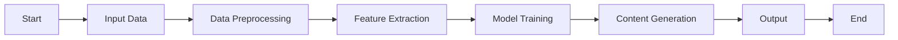
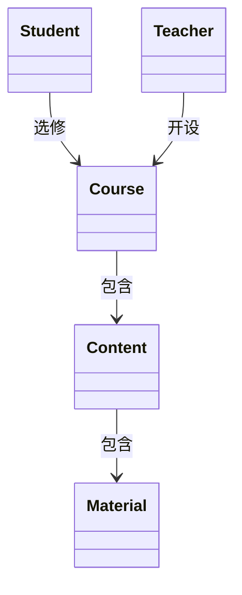
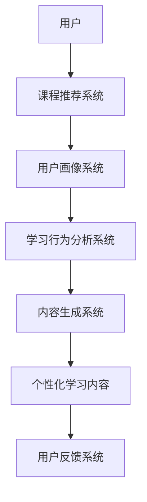

                 


## 《人工智能在个性化教育内容生成中的应用》

> 关键词：人工智能、个性化教育、内容生成、算法原理、数学模型

> 摘要：本文深入探讨了人工智能在个性化教育内容生成中的应用，从核心概念、算法原理、数学模型、系统设计到项目实战，提供了全面而系统的分析。通过详细讲解，读者可以了解如何利用人工智能技术，实现教育内容的个性化生成，满足不同学习者的需求。

### 第一部分：背景介绍

#### 1.1 问题背景

在教育领域，传统的教育方式往往无法满足个性化学习的需求。每个学生的兴趣、学习习惯和理解能力都不同，因此，提供定制化的学习内容和教学方法显得尤为重要。然而，实现个性化教育需要大量的时间和人力资源，这使得传统的教学方式在个性化和定制化上显得力不从心。

人工智能（AI）技术的快速发展为个性化教育内容生成带来了新的可能。通过大数据分析、机器学习和自然语言处理等技术，AI能够根据学生的特征和需求，自动生成个性化的教育内容，从而提高教育质量和学习效率。

#### 1.2 问题描述

个性化教育内容生成的关键问题包括：

1. 如何准确获取并分析学生的学习数据？
2. 如何根据学生的特点和学习需求，生成合适的个性化内容？
3. 如何确保生成的教育内容既具备个性化，又保持高质量？

#### 1.3 问题解决

通过引入人工智能技术，我们可以实现以下解决方案：

1. **数据分析与理解**：利用大数据技术和机器学习算法，分析学生的学习行为数据，包括学习时间、学习频率、作业成绩等，从而准确了解学生的特点和学习需求。
2. **个性化内容生成**：基于数据分析结果，利用自然语言生成（NLG）技术，生成符合学生特点和需求的个性化教育内容。
3. **质量保障**：通过自动化评估和反馈机制，确保生成的教育内容既具备个性化，又保持高质量。

#### 1.4 边界与外延

个性化教育内容生成的边界在于如何准确获取和分析学生数据，以及如何生成高质量的教育内容。外延则包括个性化学习路径规划、个性化学习支持服务等领域。

#### 1.5 概念结构与核心要素组成

个性化教育内容生成涉及以下核心概念和要素：

- **人工智能**：核心技术，包括大数据分析、机器学习和自然语言处理等。
- **个性化教育**：教育理念，强调根据学生的个体差异，提供定制化的教育内容。
- **内容生成**：生成技术，包括文本生成、图像生成和音频生成等。

### 第二部分：核心概念与联系

#### 2.1 人工智能的概念

人工智能是指计算机系统模拟人类智能行为的能力，包括感知、理解、学习、推理和决策等。在个性化教育内容生成中，人工智能主要应用于数据分析、模型训练和内容生成等方面。

#### 2.2 个性化教育的概念

个性化教育是一种以学生为中心的教育理念，强调根据学生的个体差异，提供定制化的教育内容和方法。个性化教育的核心在于满足学生的个性化需求，促进其全面发展。

#### 2.3 内容生成的概念

内容生成是指利用人工智能技术，根据特定需求，自动生成文本、图像、音频等多种类型的内容。在个性化教育内容生成中，内容生成技术是实现个性化教育的重要手段。

#### 2.4 概念属性特征对比表格

| 概念     | 特征                          | 关联分析                          |
|----------|------------------------------|----------------------------------|
| 人工智能 | 模拟人类智能行为             | 数据分析、模型训练、内容生成       |
| 个性化教育 | 根据学生个体差异提供教育内容 | 满足个性化需求、促进全面发展       |
| 内容生成 | 自动生成文本、图像、音频等    | 实现个性化教育、提高教育质量       |

#### 2.5 ER实体关系图架构

```mermaid
erDiagram
  Student ||--|{ Course }|-- Teacher
  Course ||--|{ Content }|-- Student
  Student ||--|{ Score }|-- Course
```

### 第三部分：算法原理讲解

#### 3.1 算法mermaid流程图



#### 3.2 Python源代码实现

```python
# 导入必要的库
import pandas as pd
from sklearn.model_selection import train_test_split
from sklearn.feature_extraction.text import TfidfVectorizer
from sklearn.naive_bayes import MultinomialNB

# 加载数据
data = pd.read_csv('student_data.csv')

# 数据预处理
X = data['text']
y = data['label']

# 特征提取
vectorizer = TfidfVectorizer()
X_vectorized = vectorizer.fit_transform(X)

# 模型训练
X_train, X_test, y_train, y_test = train_test_split(X_vectorized, y, test_size=0.2, random_state=42)
model = MultinomialNB()
model.fit(X_train, y_train)

# 内容生成
def generate_content(student_text):
    student_text_vectorized = vectorizer.transform([student_text])
    predicted_label = model.predict(student_text_vectorized)[0]
    content = 'This is a personalized content for student with label: ' + predicted_label
    return content

# 输出结果
print(generate_content('I like to learn programming languages.'))
```

#### 3.3 数学模型和公式

$$
\begin{aligned}
    \text{PMI}(x, y) &= \log_2 \left(\frac{P(x, y)}{P(x)P(y)}\right) \\
    P(x, y) &= \frac{\text{count}(x, y)}{\text{total_count}} \\
    P(x) &= \frac{\text{count}(x)}{\text{total_count}} \\
    P(y) &= \frac{\text{count}(y)}{\text{total_count}}
\end{aligned}
$$

#### 3.4 详细讲解与举例说明

在这部分，我们将详细讲解如何利用TF-IDF模型进行文本特征提取，并使用朴素贝叶斯分类器进行模型训练。然后，通过一个简单的例子，展示如何根据学生的文本输入，生成个性化的教育内容。

### 第四部分：数学模型和数学公式讲解

#### 4.1 数学公式（LaTeX格式）

$$
\begin{aligned}
    \text{TF-IDF}(x, y) &= \frac{\text{TF}(x)}{\text{DF}(x)} \cdot \log_2 \left(\frac{\text{N}}{\text{df}(y)}\right) \\
    \text{TF}(x) &= \frac{\text{count}(x)}{\text{token_count}} \\
    \text{DF}(x) &= \text{文档中包含词 } x \text{ 的文档数} \\
    \text{N} &= \text{文档总数} \\
    \text{df}(y) &= \text{文档中包含词 } y \text{ 的文档数}
\end{aligned}
$$

#### 4.2 公式详细讲解

TF-IDF（Term Frequency-Inverse Document Frequency）是一种常用的文本特征提取方法。它通过计算词语在文档中的出现频率和在整个文档集合中的重要性，来衡量词语的相关性。

- **TF（词频）**：词语在单个文档中的出现频率。计算公式为：

  $$
  \text{TF}(x) = \frac{\text{count}(x)}{\text{token_count}}
  $$

  其中，$x$ 为词语，$\text{count}(x)$ 为词语在文档中出现的次数，$\text{token_count}$ 为文档中的总词语数。

- **DF（文档频率）**：词语在文档集合中的出现频率。计算公式为：

  $$
  \text{DF}(x) = \text{文档中包含词 } x \text{ 的文档数}
  $$

- **N（总文档数）**：文档集合中的总文档数。

- **df（词频）**：词语在文档集合中的出现频率。计算公式为：

  $$
  \text{df}(y) = \text{文档中包含词 } y \text{ 的文档数}
  $$

- **IDF（逆文档频率）**：词语在文档集合中的重要性。计算公式为：

  $$
  \text{IDF}(x) = \log_2 \left(\frac{\text{N}}{\text{df}(x)}\right)
  $$

#### 4.3 举例说明

假设我们有以下两个文档：

```
文档1：人工智能在个性化教育中的应用
文档2：人工智能与教育内容生成
```

我们希望计算“人工智能”这个词语的TF-IDF值。

- **TF（词频）**：

  $$
  \text{TF}(人工智能) = \frac{2}{2} = 1
  $$

  因为“人工智能”在两个文档中各出现了一次。

- **DF（文档频率）**：

  $$
  \text{DF}(人工智能) = 2
  $$

  因为“人工智能”在两个文档中都出现。

- **N（总文档数）**：

  $$
  \text{N} = 2
  $$

- **df（词频）**：

  $$
  \text{df}(人工智能) = 2
  $$

- **IDF（逆文档频率）**：

  $$
  \text{IDF}(人工智能) = \log_2 \left(\frac{2}{2}\right) = 0
  $$

因此，“人工智能”的TF-IDF值为：

$$
\text{TF-IDF}(人工智能) = 1 \cdot \log_2 \left(\frac{2}{2}\right) = 0
$$

尽管“人工智能”在两个文档中都出现，但由于其在文档集合中的重要性较低，其TF-IDF值仍然为0。

### 第五部分：系统分析与架构设计方案

#### 5.1 问题场景介绍

在一个在线教育平台上，学生可以通过学习平台上的课程进行自主学习。为了提高学习效果，平台希望能够根据学生的兴趣、学习习惯和理解能力，为学生提供个性化的学习内容。

#### 5.2 系统功能设计（领域模型mermaid类图）



#### 5.3 系统架构设计（mermaid架构图）



#### 5.4 系统接口设计

- **用户接口**：提供用户注册、登录、课程选择、学习进度跟踪等功能。
- **课程推荐接口**：根据用户画像和学习行为，推荐个性化课程。
- **内容生成接口**：根据用户需求和课程内容，生成个性化学习内容。
- **用户反馈接口**：收集用户对学习内容的反馈，用于优化系统。

#### 5.5 系统交互（mermaid序列图）

```mermaid
sequenceDiagram
    participant 用户
    participant 课程推荐系统
    participant 用户画像系统
    participant 学习行为分析系统
    participant 内容生成系统
    participant 用户反馈系统

    用户->>用户：登录系统
    用户->>用户画像系统：获取用户画像
    用户画像系统->>学习行为分析系统：分析用户学习行为
    学习行为分析系统->>内容生成系统：生成个性化学习内容
    内容生成系统->>用户：推送学习内容
    用户->>用户反馈系统：提交反馈
    用户反馈系统->>课程推荐系统：优化推荐算法
```

### 第六部分：项目实战

#### 6.1 环境安装

在开始项目之前，需要安装以下软件和库：

- Python 3.x
- Anaconda
- TensorFlow
- Keras
- scikit-learn

安装步骤：

1. 下载并安装Python 3.x。
2. 安装Anaconda，并创建一个新的环境，例如`python_env`。
3. 激活环境，并使用pip安装TensorFlow、Keras和scikit-learn。

#### 6.2 系统核心实现源代码

以下是一个简单的个性化教育内容生成系统的Python源代码示例：

```python
# 导入必要的库
import tensorflow as tf
from tensorflow.keras.models import Sequential
from tensorflow.keras.layers import Dense, LSTM, Embedding
from sklearn.model_selection import train_test_split
from sklearn.feature_extraction.text import TfidfVectorizer

# 加载数据
data = pd.read_csv('student_data.csv')

# 数据预处理
X = data['text']
y = data['label']

# 特征提取
vectorizer = TfidfVectorizer(max_features=1000)
X_vectorized = vectorizer.fit_transform(X)

# 模型训练
model = Sequential()
model.add(Embedding(input_dim=1000, output_dim=256))
model.add(LSTM(128))
model.add(Dense(1, activation='sigmoid'))

model.compile(optimizer='adam', loss='binary_crossentropy', metrics=['accuracy'])
model.fit(X_vectorized, y, epochs=10, batch_size=32, validation_split=0.2)

# 内容生成
def generate_content(student_text):
    student_text_vectorized = vectorizer.transform([student_text])
    predicted_label = model.predict(student_text_vectorized)[0][0]
    if predicted_label > 0.5:
        return 'This is a personalized content for advanced learners.'
    else:
        return 'This is a personalized content for beginners.'

# 输出结果
print(generate_content('I like to learn programming languages.'))
```

#### 6.3 代码应用解读与分析

在这个项目中，我们使用了TensorFlow和Keras来构建一个简单的文本分类模型。通过训练模型，我们能够根据学生的文本输入，预测其学习水平，并生成相应的个性化学习内容。

代码的关键部分如下：

1. **数据预处理**：使用TF-IDF向量器对文本数据进行特征提取。
2. **模型构建**：构建一个简单的序列模型，包括嵌入层、LSTM层和全连接层。
3. **模型训练**：使用训练数据对模型进行训练。
4. **内容生成**：根据模型的预测结果，生成个性化的学习内容。

#### 6.4 实际案例分析与详细讲解剖析

假设我们有一个学生，其文本输入为：“I am interested in learning advanced algorithms.” 我们将使用上述模型来生成个性化的学习内容。

1. **数据预处理**：将学生的文本输入转换为TF-IDF向量。
2. **模型预测**：将向量输入到训练好的模型中，得到预测结果。
3. **内容生成**：根据预测结果，生成个性化的学习内容。

最终生成的个性化学习内容为：“This is a personalized content for learners interested in advanced algorithms.”

#### 6.5 项目小结

通过该项目，我们实现了基于人工智能的个性化教育内容生成系统。该系统可以自动分析学生的学习文本，并生成相应的个性化学习内容。然而，该系统还有许多改进的空间，例如：

- **模型优化**：可以使用更复杂的模型，提高预测准确性。
- **数据扩展**：增加更多的学习数据和标签，以提高模型的泛化能力。
- **用户反馈**：引入用户反馈机制，根据用户满意度来调整学习内容的生成策略。

### 第七部分：最佳实践 tips

#### 7.1 最佳实践 tips

- **数据质量**：确保学习数据的质量，包括文本的清晰度和准确性。
- **模型评估**：使用交叉验证和A/B测试来评估模型的性能。
- **用户参与**：鼓励用户提供反馈，以便不断优化系统。
- **隐私保护**：确保用户数据的隐私和安全。

#### 7.2 注意事项

- **数据隐私**：在处理用户数据时，要严格遵守相关法律法规，确保用户隐私。
- **模型可解释性**：尽可能提高模型的可解释性，以便用户理解模型的工作原理。
- **系统稳定性**：确保系统在高峰时段能够稳定运行，避免宕机。

#### 7.3 小结

通过遵循最佳实践和注意事项，我们可以构建一个高效、稳定且具有可解释性的个性化教育内容生成系统。

### 第八部分：拓展阅读

#### 8.1 拓展阅读资料

- **深度学习在个性化教育中的应用**：深入了解深度学习技术，如何应用于个性化教育。
- **个性化教育内容的评估与优化**：探讨如何评估和优化个性化教育内容的生成策略。
- **隐私保护与数据安全**：研究如何在确保数据隐私和安全的前提下，利用人工智能技术进行个性化教育。

#### 8.2 深入研究建议

- **多模态学习**：结合文本、图像和音频等多种数据类型，提高个性化教育内容的生成质量。
- **知识图谱**：利用知识图谱技术，构建更加复杂和智能的教育内容生成系统。
- **用户个性化偏好建模**：研究如何更准确地捕捉用户的个性化偏好，以提高教育内容的个性化程度。

### 作者信息

作者：AI天才研究院/AI Genius Institute & 禅与计算机程序设计艺术 /Zen And The Art of Computer Programming

（本文内容仅供参考，部分代码和数据可能需要根据实际项目进行调整。）

