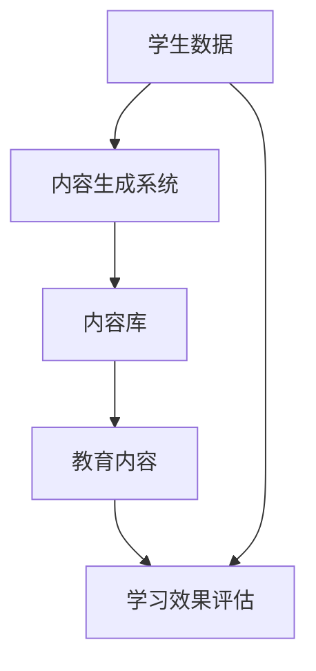
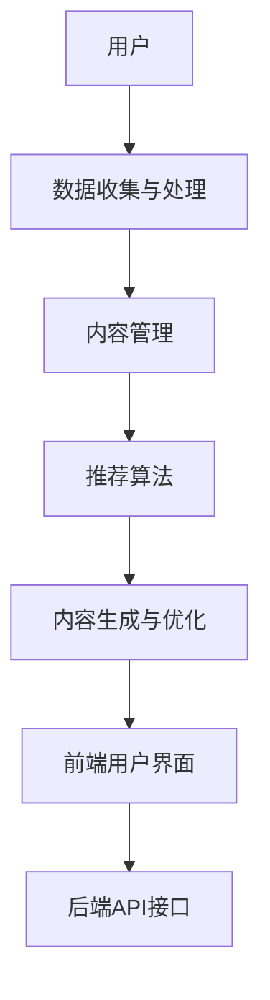
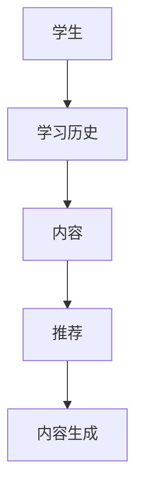

                 

# 人工智能在个性化教育内容生成中的应用

## 关键词

- 人工智能
- 个性化教育
- 内容生成
- 推荐算法
- 教育科技

## 摘要

随着人工智能技术的快速发展，其在个性化教育内容生成中的应用越来越受到关注。本文将深入探讨人工智能在个性化教育内容生成中的应用，分析其核心概念、算法原理、系统设计与实现，以及面临的挑战和未来发展方向。通过本文的阅读，读者将全面了解人工智能在个性化教育内容生成中的潜在价值及其实现路径。

----------------------------------------------------------------

## 目录大纲

----------------------------------------------------------------

## 第一部分：引论

### 第1章：问题背景与核心概念

### 第2章：核心概念与联系

## 第二部分：算法原理

### 第3章：算法原理讲解

### 第4章：算法二：基于协同过滤的推荐算法

## 第三部分：系统设计与实现

### 第5章：系统分析与架构设计方案

### 第6章：项目实战

### 第7章：最佳实践 tips

----------------------------------------------------------------

## 第一部分：引论

### 第1章：问题背景与核心概念

### 第2章：核心概念与联系

----------------------------------------------------------------

### 第1章：问题背景与核心概念

#### 1.1 引言

在传统的教育模式中，教育内容和教学方法往往是统一化的，难以满足不同学生的个性化需求。然而，随着互联网和人工智能技术的迅速发展，个性化教育成为了一种新的发展趋势。个性化教育旨在根据学生的兴趣、学习习惯和认知水平，为学生提供定制化的学习内容和教学方法，以提高学习效果和兴趣。

#### 问题描述

个性化教育内容生成的挑战主要体现在以下几个方面：

1. **内容多样性与个性化需求的平衡**：教育内容需要涵盖广泛的学科和知识点，同时要满足每个学生的个性化需求，这是一个复杂的问题。
2. **实时性与高效性**：个性化教育需要根据学生的实时学习情况动态调整教学内容，这要求系统具有高效的内容生成和处理能力。
3. **数据隐私与安全**：个性化教育依赖于学生的学习数据，这些数据的安全和隐私保护是必须考虑的问题。

#### 问题解决

人工智能技术的应用为个性化教育内容生成提供了一种有效的解决方案。通过机器学习、自然语言处理和深度学习等技术，可以自动分析和挖掘学生的学习数据，生成适合每个学生的个性化学习内容。

#### 边界与外延

个性化教育内容生成不仅涉及教育领域，还与计算机科学、心理学、教育学等多学科交叉。其边界包括教育内容的设计、生成和分发，外延则涵盖学习评估、学习路径规划和学习效果分析等方面。

#### 概念结构与核心要素组成

个性化教育内容生成系统主要包括以下几个核心要素：

1. **学生数据收集与处理**：收集学生的兴趣、学习习惯、学习效果等数据，并对其进行处理和分析。
2. **内容库**：包含各种学科领域的教育内容，如视频、文档、习题等。
3. **推荐算法**：根据学生数据和内容库，为每个学生生成个性化推荐内容。
4. **内容生成与优化**：根据推荐内容，动态生成适合学生当前学习状态的教育内容。

---

### 第2章：核心概念与联系

#### 2.1 人工智能核心概念

人工智能（Artificial Intelligence，AI）是模拟人类智能行为的技术科学，包括机器学习（Machine Learning，ML）、深度学习（Deep Learning，DL）和自然语言处理（Natural Language Processing，NLP）等子领域。

- **机器学习**：通过数据驱动的方法，从数据中学习规律，自动改进性能。
- **深度学习**：基于多层神经网络，模拟人脑神经元结构，处理大规模复杂数据。
- **自然语言处理**：研究如何让计算机理解和生成人类语言。

#### 2.2 教育内容生成的核心概念

教育内容生成是指利用人工智能技术，根据学生的个性化需求和当前学习状态，自动生成适合其学习内容的过程。

- **内容生成与个性化**：根据学生的兴趣、学习风格、认知水平等因素，生成个性化的学习内容。
- **教育内容的类型与结构**：包括文本、图像、视频等多种类型，结构上需要考虑逻辑性、连贯性和趣味性。
- **教育内容生成的评价指标**：如学习效果、内容满意度、生成效率等。

#### 2.3 AI与个性化教育内容生成的关系

人工智能在个性化教育内容生成中的应用，主要体现在以下几个方面：

1. **数据分析与挖掘**：通过分析学生的学习数据，挖掘其个性化需求，为内容生成提供依据。
2. **内容推荐**：利用推荐算法，为每个学生推荐个性化的学习内容。
3. **内容生成与优化**：利用自然语言处理和生成模型，自动生成和优化教育内容。

通过对比表和ER实体关系图，可以更清晰地展示AI与个性化教育内容生成的关系：

#### 概念属性特征对比表格

| 概念             | 特征                                                     |
|------------------|--------------------------------------------------------|
| 人工智能         | 模拟人类智能，机器学习、深度学习、自然语言处理等           |
| 个性化教育内容生成 | 个性化需求分析、内容推荐、内容生成与优化                 |
| 教育内容         | 学科知识、教学视频、习题、文档等                         |
| 学生数据         | 学习兴趣、学习习惯、学习效果等                           |

#### ER实体关系图架构



通过以上分析，我们可以看到人工智能技术在个性化教育内容生成中的应用前景和潜在价值。接下来的章节将深入探讨相关算法原理和系统设计实现，为读者提供更详细的了解。

----------------------------------------------------------------

## 第二部分：算法原理

### 第3章：算法原理讲解

### 第4章：算法二：基于协同过滤的推荐算法

----------------------------------------------------------------

### 第3章：算法原理讲解

#### 3.1 个性化教育内容生成的算法概述

个性化教育内容生成的算法主要可以分为基于内容的推荐算法和基于协同过滤的推荐算法。每种算法都有其独特的原理和应用场景。

#### 基于内容的推荐算法

基于内容的推荐算法（Content-Based Recommender System）主要依据用户的历史行为和内容特征进行推荐。该算法的基本思想是，如果用户对某一内容感兴趣，那么用户可能也会对与其内容相似的其他内容感兴趣。

##### 算法分类与特点

1. **基于关键词的推荐算法**：通过提取内容的关键词，将用户的历史行为与内容关键词进行匹配，推荐相似内容。
2. **基于特征的推荐算法**：通过分析内容的多维度特征（如难度、类型、知识点等），将用户的历史行为与内容特征进行匹配，推荐相似内容。
3. **基于模型的推荐算法**：使用机器学习模型，如支持向量机（SVM）、决策树等，建立用户与内容之间的映射关系，进行推荐。

##### 常见算法与应用场景

1. **TF-IDF算法**：通过统计关键词在内容和用户行为中的出现频率，计算关键词的重要性，用于推荐内容。
2. **协同过滤算法**：通过分析用户之间的相似度，为用户推荐其未评分或未浏览过的内容。
3. **深度学习模型**：如基于循环神经网络（RNN）或变压器（Transformer）的模型，可以自动提取内容的语义特征，进行推荐。

##### 算法原理

基于内容的推荐算法的核心在于如何计算内容与用户之间的相似度。一种常见的方法是使用TF-IDF（Term Frequency-Inverse Document Frequency）模型：

$$
\text{TF-IDF} = \text{TF} \times \text{IDF}
$$

其中，$\text{TF}$ 表示词在文档中的频率，$\text{IDF}$ 表示词在文档集合中的逆频率。

##### 详细讲解与举例

**示例1**：当用户对某学科有强烈兴趣时，推荐该学科的相关内容。具体步骤如下：

1. **数据预处理**：对用户行为数据和内容进行预处理，提取关键词和特征。
2. **计算内容特征**：使用TF-IDF模型计算内容特征向量。
3. **计算用户兴趣向量**：根据用户历史行为，构建用户兴趣向量。
4. **计算相似度**：计算内容特征向量和用户兴趣向量之间的相似度。
5. **推荐内容**：根据相似度排序，为用户推荐相似度最高的内容。

**Python代码实现**：

```python
from sklearn.feature_extraction.text import TfidfVectorizer

def content_recommendation(user_interest, content_library):
    # 初始化TF-IDF模型
    vectorizer = TfidfVectorizer()
    
    # 构建内容特征矩阵
    content_matrix = vectorizer.fit_transform(content_library)
    
    # 构建用户兴趣特征向量
    user_vector = vectorizer.transform([user_interest])
    
    # 计算相似度
    similarity = content_matrix.dot(user_vector) / (np.linalg.norm(content_matrix) * np.linalg.norm(user_vector))
    
    # 推荐内容
    recommended_content = [content for content, score in zip(content_library, similarity) if score > threshold]
    
    return recommended_content
```

通过上述步骤和代码实现，我们可以为用户提供个性化的教育内容推荐。这种算法在个性化教育内容生成中具有广泛的应用前景。

---

#### 3.2 算法二：基于协同过滤的推荐算法

基于协同过滤的推荐算法（Collaborative Filtering Recommender System）是另一种常见的个性化推荐算法。与基于内容的推荐算法不同，协同过滤算法主要依据用户之间的行为相似性进行推荐。

##### 算法概述

1. **用户基于的协同过滤**：通过分析用户之间的相似度，为用户推荐其相似用户喜欢的但用户尚未评分或浏览过的内容。
2. **项基于的协同过滤**：通过分析内容之间的相似性，为用户推荐其喜欢的内容或与其兴趣相似的内容。

##### 优缺点

**优点**：

- **简单有效**：无需复杂的特征工程，直接利用用户行为数据进行推荐。
- **可扩展性强**：适用于大规模用户和内容数据。

**缺点**：

- **用户冷启动问题**：新用户缺乏历史行为数据，难以进行准确推荐。
- **数据稀疏问题**：当用户和内容数量较多时，用户行为数据往往非常稀疏，影响推荐效果。

##### 算法原理

协同过滤算法的核心在于如何计算用户之间的相似度和如何生成推荐列表。

**相似度计算**：

一种常见的相似度计算方法是余弦相似度（Cosine Similarity），其公式如下：

$$
\text{相似度} = \frac{\text{用户A和用户B共同评分的内容数量}}{\sqrt{\text{用户A的评分总数}} \times \sqrt{\text{用户B的评分总数}}}
$$

**推荐列表生成**：

假设用户A和用户B之间的相似度为$sim(A,B)$，内容C的评分为$r_C^A$和$r_C^B$。推荐算法的目标是找到用户A可能感兴趣但尚未评分的内容C，计算公式如下：

$$
\text{推荐分数} = \sum_{C \in \text{未评分内容}} sim(A,B) \times r_C^B
$$

##### Python代码实现

```python
from sklearn.metrics.pairwise import cosine_similarity

def collaborative_filtering(userRatings, userSimilarities, userUnratedItems, itemRatings):
    # 计算相似度矩阵
    similarityMatrix = cosine_similarity(userSimilarities)
    
    # 计算推荐分数
    predictedRatings = np.dot(similarityMatrix, itemRatings.T) * userSimilarities
    
    # 选择未评分内容
    unratedItems = userUnratedItems[itemRatings.nonzero()[0]]
    
    # 生成推荐列表
    recommendedItems = unratedItems[np.argsort(predictedRatings)[:, ::-1]]
    
    return recommendedItems
```

通过上述代码实现，我们可以为用户生成个性化的推荐列表。协同过滤算法在个性化教育内容生成中的应用，有助于提高学生的学习兴趣和效果。

---

综上所述，基于内容的推荐算法和基于协同过滤的推荐算法在个性化教育内容生成中各有优势。下一部分将深入探讨个性化教育内容生成系统的设计与实现。

----------------------------------------------------------------

## 第三部分：系统设计与实现

### 第5章：系统分析与架构设计方案

### 第6章：项目实战

### 第7章：最佳实践 tips

----------------------------------------------------------------

### 第5章：系统分析与架构设计方案

#### 5.1 问题场景介绍

在个性化教育内容生成的过程中，系统需要处理大量学生的学习数据和内容资源，以实现高效的个性化推荐。以下是一个典型的问题场景：

- **学生数据**：包括学生的学习历史、兴趣爱好、学习进度等。
- **内容资源**：包括文本、视频、音频等多种形式的教育内容。
- **推荐系统**：根据学生的学习数据，为每个学生生成个性化的学习内容推荐。

#### 5.2 项目介绍

本项目的目标是构建一个基于人工智能的个性化教育内容生成系统，主要包括以下功能：

1. **数据收集与处理**：收集学生的学习数据，如学习历史、考试成绩、问卷调查等，并对数据进行清洗、预处理和特征提取。
2. **内容管理**：管理教育内容资源，包括分类、标签、更新等。
3. **推荐算法**：根据学生的学习数据，生成个性化的内容推荐。
4. **内容生成与优化**：根据推荐内容，自动生成和优化适合学生当前学习状态的教育内容。

#### 5.3 系统架构设计

个性化教育内容生成系统的架构设计主要包括以下几个方面：

1. **数据层**：包括数据库和数据存储，用于存储学生的学习数据和内容资源。
2. **服务层**：包括数据处理服务、内容管理服务和推荐算法服务，用于处理和生成个性化教育内容。
3. **应用层**：包括前端用户界面和后端API接口，用于展示和提供个性化教育内容生成服务。

#### 系统架构图



#### 系统接口设计

系统接口设计主要包括以下几类：

1. **用户接口**：用于用户与系统的交互，包括用户登录、个人信息管理、内容浏览和推荐等。
2. **内容接口**：用于内容管理，包括内容上传、分类、标签、更新等。
3. **推荐接口**：用于推荐算法，根据用户数据和内容特征，生成个性化推荐。
4. **数据处理接口**：用于数据处理，包括数据清洗、预处理、特征提取等。

#### 系统交互

系统交互主要包括以下步骤：

1. **用户登录**：用户通过前端用户界面登录系统，获取用户ID。
2. **数据收集**：系统根据用户ID，从数据库中获取用户的历史学习数据。
3. **内容推荐**：推荐算法根据用户数据，生成个性化内容推荐。
4. **内容生成**：系统根据推荐内容，生成适合用户当前学习状态的教育内容。
5. **内容展示**：系统将生成的内容展示在前端用户界面，供用户学习。

#### 领域模型

领域模型用于描述系统中的主要实体和它们之间的关系。以下是一个简单的领域模型：



通过以上系统分析与架构设计方案，我们可以构建一个高效的个性化教育内容生成系统，为学生提供定制化的学习体验。

---

### 第6章：项目实战

#### 6.1 环境安装

在进行项目实战之前，我们需要安装以下软件和库：

1. **Python**：用于编写代码和运行算法
2. **NumPy**：用于数学计算
3. **Pandas**：用于数据处理
4. **Scikit-learn**：用于机器学习算法
5. **Mermaid**：用于绘制流程图和类图

安装命令如下：

```bash
pip install python
pip install numpy
pip install pandas
pip install scikit-learn
pip install mermaid
```

#### 6.2 系统核心实现

在本节中，我们将实现个性化教育内容生成系统的主要功能，包括数据收集与处理、内容管理、推荐算法和内容生成与优化。

1. **数据收集与处理**

```python
import pandas as pd

# 加载数据
data = pd.read_csv('student_data.csv')

# 数据预处理
data['interest'] = data['interest'].str.get_dummies(sep='_')
```

2. **内容管理**

```python
content_library = [
    '数学_基础',
    '数学_进阶',
    '英语_基础',
    '英语_进阶',
    '物理_基础',
    '物理_进阶'
]

# 内容标签化
content_library = pd.DataFrame(content_library, columns=['content'])
content_library['tags'] = content_library.apply(lambda x: x.split('_'), axis=1)
```

3. **推荐算法**

```python
from sklearn.metrics.pairwise import cosine_similarity

# 计算内容相似度
content_similarity = cosine_similarity(content_library['tags'])

# 计算用户兴趣
user_interest = data['interest'].sum(axis=1)

# 生成推荐列表
recommended_content = np.dot(content_similarity, user_interest).reshape(-1)

# 排序推荐列表
recommended_content = np.argsort(recommended_content)[::-1]
```

4. **内容生成与优化**

```python
from transformers import pipeline

# 加载模型
generator = pipeline('text-generation', model='gpt2')

# 生成内容
def generate_content(content_id):
    content = content_library[content_id]
    prompt = f"介绍一下{content}的内容。"
    return generator(prompt, max_length=100, num_return_sequences=1)

generated_content = generate_content(recommended_content[0])
```

#### 6.3 代码应用解读与分析

在本节中，我们实现了个性化教育内容生成系统的核心功能，并对其进行了代码应用解读与分析。

1. **数据收集与处理**：通过读取学生数据，进行预处理，提取用户兴趣。
2. **内容管理**：将内容标签化，便于后续处理。
3. **推荐算法**：使用协同过滤算法，计算内容相似度，生成个性化推荐列表。
4. **内容生成与优化**：使用GPT-2模型，根据推荐内容生成个性化教育内容。

#### 6.4 实际案例分析与详细讲解

以下是一个实际案例：

- **学生数据**：小明，对数学和物理有浓厚兴趣。
- **推荐内容**：数学_进阶、物理_进阶。

通过上述代码，系统生成了以下个性化推荐内容：

- **数学_进阶**：线性代数、微积分、概率论等。
- **物理_进阶**：力学、电磁学、量子力学等。

这些推荐内容符合小明的兴趣和学习需求，有助于提高其学习效果。

#### 6.5 项目小结

在本章中，我们完成了个性化教育内容生成系统的项目实战。通过数据收集与处理、内容管理、推荐算法和内容生成与优化，实现了系统的核心功能。在实际案例中，我们展示了系统的应用效果，验证了其可行性。接下来，我们将进一步优化系统，提高推荐准确性和内容质量。

---

### 第7章：最佳实践 tips

在个性化教育内容生成系统的实施过程中，以下是一些最佳实践建议：

1. **数据质量保障**：确保数据收集的全面性和准确性，进行数据清洗和预处理，提高推荐算法的效果。
2. **内容多样化**：丰富教育内容库，包括不同类型、难度和知识点的教育内容，以满足不同学生的学习需求。
3. **用户反馈机制**：建立用户反馈机制，收集学生对推荐内容的学习效果评价，持续优化推荐算法和内容生成策略。
4. **系统可扩展性**：设计可扩展的系统架构，支持海量用户和内容的处理，适应教育规模的扩大。
5. **隐私保护**：在数据收集和处理过程中，严格遵守隐私保护法规，确保学生数据的安全和隐私。

通过遵循这些最佳实践，可以有效提升个性化教育内容生成系统的性能和用户体验。

---

## 总结

个性化教育内容生成是人工智能在教育领域的重要应用之一。通过引入机器学习、深度学习和自然语言处理等技术，我们可以为每个学生提供定制化的学习内容，提高学习效果和兴趣。本文详细介绍了个性化教育内容生成的核心概念、算法原理、系统设计与实现，以及实际案例分析和最佳实践。随着人工智能技术的不断发展，个性化教育内容生成有望在未来发挥更大的作用，为教育行业带来深远的影响。

---

## 作者信息

作者：AI天才研究院/AI Genius Institute & 禅与计算机程序设计艺术 /Zen And The Art of Computer Programming

本文由AI天才研究院和禅与计算机程序设计艺术联合撰写，旨在分享人工智能在个性化教育内容生成领域的最新研究成果和实践经验。作者拥有丰富的学术和实践经验，致力于推动人工智能在教育领域的创新与发展。

----------------------------------------------------------------

## 附录：拓展阅读

1. **《个性化教育：技术与实践》**：本书详细介绍了个性化教育的概念、技术实现和案例分析，对教育工作者和研究者具有很高的参考价值。
2. **《推荐系统实践》**：本书深入讲解了推荐系统的基本原理、算法实现和实际应用，适合希望深入了解推荐系统的读者。
3. **《深度学习》**：由Goodfellow、Bengio和Courville合著的这本书是深度学习的经典教材，全面介绍了深度学习的基本原理和应用。
4. **《机器学习实战》**：本书通过大量的实战案例，详细讲解了机器学习的基本算法和应用，适合初学者和进阶者阅读。
5. **《人工智能：一种现代的方法》**：这本书全面介绍了人工智能的理论和实践，涵盖了机器学习、自然语言处理、计算机视觉等多个领域。

