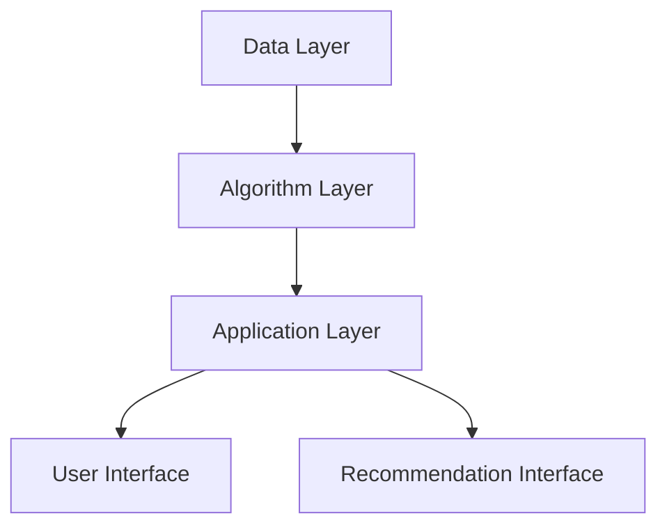
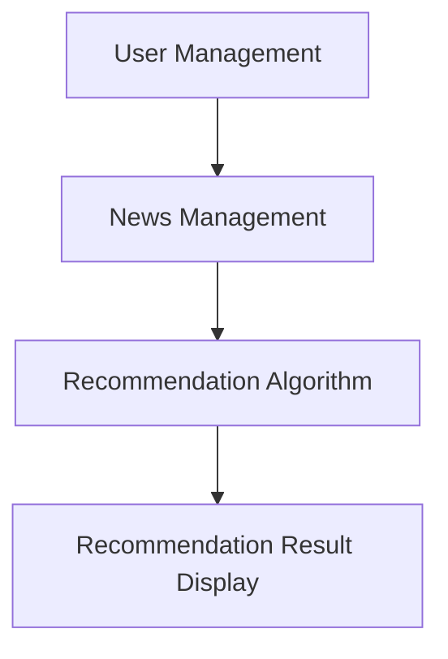
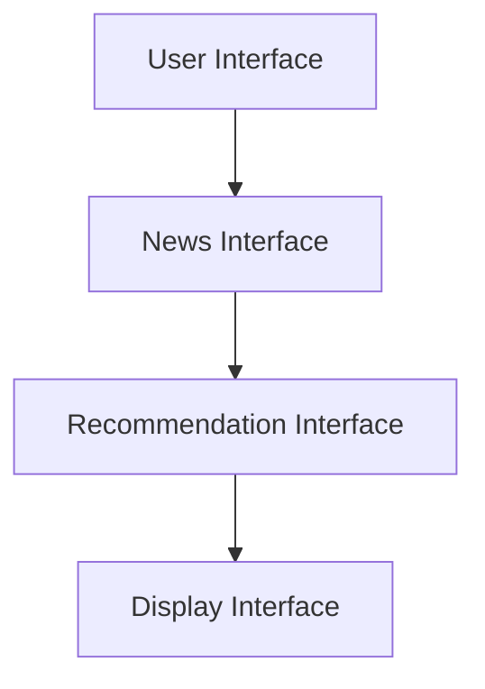

                 

## 人工智能在个性化新闻推荐中的应用

### 关键词：人工智能，个性化推荐，新闻推荐系统，协同过滤，深度学习，用户隐私

随着互联网的迅速发展和信息爆炸，用户面临的信息过载问题日益严重。如何在海量信息中为用户提供个性化的、有价值的新闻内容，成为当前新闻推荐系统面临的主要挑战。人工智能，尤其是机器学习技术的发展，为个性化新闻推荐提供了强大的技术支撑。本文将围绕人工智能在个性化新闻推荐中的应用，从核心概念、算法原理、系统设计与实现、项目实战和最佳实践等方面进行详细阐述，旨在为读者提供一幅全面、深入的理解图景。

### 摘要

本文首先介绍了个性化新闻推荐系统的背景和重要性，分析了现有推荐系统的局限。随后，深入探讨了人工智能在个性化新闻推荐中的应用，包括协同过滤、基于内容的推荐、强化学习和深度学习等核心算法原理。通过Python代码实现，详细解析了各个算法的工作流程和数学模型。接着，本文提出了一个完整的系统设计与实现方案，包括系统架构、功能设计和接口设计。通过一个实际案例，本文展示了系统在实践中的应用效果。最后，本文总结了最佳实践和注意事项，为后续研究和应用提供了有益的指导。

### 第一部分 引言

#### 1.1 背景介绍

个性化新闻推荐系统是当前互联网信息分发的重要手段。它通过分析用户的兴趣和行为，为用户推送符合其个性化需求的新闻内容。传统的新闻推荐系统主要基于关键词匹配、用户历史浏览记录等简单规则进行推荐，但这种方法难以满足用户日益增长的需求。随着人工智能技术的快速发展，特别是机器学习、深度学习等技术的应用，个性化新闻推荐系统得到了显著提升。

个性化新闻推荐的重要性主要体现在以下几个方面：

1. **提升用户体验**：通过推荐用户感兴趣的内容，减少用户在信息搜索中的时间成本，提升用户满意度。
2. **提高内容质量**：通过分析用户行为和兴趣，提高新闻内容的精准度和质量，减少无效信息的展示。
3. **增加用户粘性**：个性化推荐能够吸引用户长期使用，提高用户对平台的依赖度。

然而，现有的推荐系统仍存在诸多局限。首先，数据稀疏问题严重，即用户的历史行为数据有限，难以准确捕捉用户的兴趣点。其次，推荐算法的多样性不足，容易导致用户陷入信息茧房，错过其他可能感兴趣的内容。此外，数据隐私和伦理问题也日益成为关注的焦点。

#### 1.2 问题描述

个性化新闻推荐的核心挑战主要包括以下几个方面：

1. **数据稀疏问题**：用户的行为数据有限，导致推荐系统难以准确预测用户的兴趣。
2. **算法多样性**：现有的推荐算法如协同过滤、基于内容的推荐等，在处理多样性和个性化需求方面存在局限。
3. **信息过载**：互联网上的信息量庞大，如何筛选出高质量的个性化内容是推荐系统面临的挑战。
4. **数据隐私与伦理**：用户数据的收集、存储和使用过程中，需要确保用户隐私不被侵犯，符合伦理规范。

#### 1.3 问题解决

人工智能技术的引入为个性化新闻推荐带来了新的解决方案。具体来说，人工智能在个性化新闻推荐中的应用主要体现在以下几个方面：

1. **协同过滤**：通过分析用户之间的相似度，推荐其他用户喜欢的新闻内容。
2. **基于内容的推荐**：利用新闻的内容特征，为用户推荐与其兴趣相关的新闻。
3. **强化学习**：通过试错学习用户偏好，不断优化推荐策略。
4. **深度学习**：利用深度神经网络，进行特征提取和预测，提高推荐准确性。

通过以上方法，人工智能能够有效地解决个性化新闻推荐中的核心挑战，提升推荐系统的效果和用户体验。

#### 1.4 边界与外延

个性化新闻推荐的应用范围广泛，不仅限于新闻内容，还可以应用于电子商务、社交媒体、视频平台等多个领域。然而，在应用过程中，需要特别注意数据隐私和伦理问题。例如，用户数据的收集和使用需要遵循相关法律法规，确保用户隐私不被侵犯。此外，推荐算法的设计和实施也需要充分考虑用户的多样性需求和个性化偏好。

总之，人工智能在个性化新闻推荐中的应用不仅解决了传统推荐系统的局限，也为未来的信息分发提供了新的方向。通过不断优化算法和加强数据保护，个性化新闻推荐有望在未来发挥更大的作用。

### 第二部分 核心概念

#### 2.1 人工智能基础

人工智能（Artificial Intelligence, AI）是计算机科学的一个分支，旨在创建智能代理，这些代理能够感知环境、理解和学习、并采取行动以实现特定目标。人工智能的发展可以分为几个阶段，包括规则推理、知识表示和推理、机器学习和深度学习等。

**机器学习**是人工智能的核心组成部分，它通过使用数据来训练模型，从而使计算机能够从数据中学习并做出预测或决策。机器学习可以分为监督学习、无监督学习和强化学习。

- **监督学习**：在监督学习过程中，模型通过训练数据集来学习，每个样本都有对应的标签，模型的目标是预测新的数据样本的标签。
- **无监督学习**：无监督学习不使用标签，而是通过发现数据中的结构和模式来学习。
- **强化学习**：强化学习通过试错来学习最优策略，通常应用于动态环境中。

**深度学习**是机器学习的一个子领域，它使用多层神经网络来学习和提取数据中的复杂特征。深度学习在图像识别、自然语言处理和推荐系统等领域取得了显著的成功。

#### 2.2 新闻推荐系统

新闻推荐系统是一种基于人工智能的个性化信息分发系统，它通过分析用户的行为和兴趣，为用户推荐相关的新闻内容。新闻推荐系统通常包括以下几个关键模块：

1. **用户行为分析**：通过分析用户的浏览历史、搜索记录和点击行为，捕捉用户的兴趣点。
2. **新闻内容分析**：对新闻内容进行文本挖掘和特征提取，以便用于后续的推荐算法。
3. **推荐算法**：根据用户行为和新闻内容特征，选择合适的推荐算法进行新闻推荐。
4. **推荐结果评估**：评估推荐系统的效果，包括推荐的相关性、准确性和多样性。

**新闻推荐系统的架构**可以分为三个层次：数据层、算法层和应用层。

- **数据层**：负责收集和存储用户行为数据和新闻内容数据。
- **算法层**：包括各种推荐算法的实现，如协同过滤、基于内容的推荐和深度学习等。
- **应用层**：将推荐结果展示给用户，并提供交互功能。

#### 2.3 个性化推荐算法

个性化推荐算法是新闻推荐系统的核心，其主要目标是从海量的新闻内容中为每个用户推荐其感兴趣的内容。个性化推荐算法可以分为以下几种类型：

1. **协同过滤**：基于用户之间的相似度进行推荐，通过分析用户的历史行为数据，找到相似用户，并推荐这些用户喜欢的新闻。
2. **基于内容的推荐**：通过分析新闻的内容特征，将用户兴趣与新闻内容进行匹配，推荐与用户兴趣相关的新闻。
3. **强化学习**：通过试错学习用户的兴趣和偏好，不断优化推荐策略。
4. **深度学习**：使用深度神经网络进行特征提取和预测，提高推荐准确性。

**协同过滤**是最常见的推荐算法之一，它分为基于用户的协同过滤（User-Based Collaborative Filtering）和基于项目的协同过滤（Item-Based Collaborative Filtering）。

- **基于用户的协同过滤**：通过计算用户之间的相似度，找到与目标用户相似的其他用户，然后推荐这些用户喜欢的新闻。
- **基于项目的协同过滤**：通过计算新闻之间的相似度，找到与目标新闻相似的其他新闻，然后推荐给用户。

**基于内容的推荐**通过分析新闻的文本特征、关键词和主题，将用户兴趣与新闻内容进行匹配。这种方法通常使用TF-IDF、词嵌入和主题模型等技术进行特征提取。

**强化学习**通过奖励机制和试错学习，不断优化推荐策略。在新闻推荐中，用户的行为（如点击、点赞、评论等）被视为奖励，系统根据用户的反馈调整推荐策略。

**深度学习**使用多层神经网络来学习和提取新闻的复杂特征，通过深度神经网络可以自动提取高级特征，从而提高推荐的准确性。

**概念属性特征对比表**

| 算法类型 | 特点 | 适用场景 |
| --- | --- | --- |
| 协同过滤 | 基于用户或项目的相似度进行推荐 | 数据稀疏、效果不稳定 |
| 基于内容的推荐 | 基于新闻的内容特征进行推荐 | 用户偏好变化难以捕捉 |
| 强化学习 | 通过试错学习用户偏好 | 需要大量训练数据和计算资源 |
| 深度学习 | 利用深度神经网络进行特征提取与预测 | 数据量大，模型复杂 |

通过上述核心概念的分析，我们可以更好地理解个性化新闻推荐系统的工作原理和实现方法。在接下来的部分，我们将深入探讨各个推荐算法的原理和实现。

#### 2.4 核心概念与联系

在个性化新闻推荐系统中，各个核心概念之间存在紧密的联系和相互作用。为了更好地理解这些概念，我们可以通过一个Mermaid ER实体关系图来展示它们之间的关联。

**ER实体关系图**

```mermaid
erDiagram
  User ||--|{ News } : Read
  News ||--|{ Recommendation } : Contains
  Recommendation ||--|{ User } : Preferred
```

在这个ER图中，`User`实体代表用户，`News`实体代表新闻内容，`Recommendation`实体代表推荐。用户可以阅读新闻，新闻包含在推荐中，推荐是用户偏好的。

**概念联系**

1. **用户与新闻**：用户通过浏览、搜索等行为与新闻产生关联，用户的兴趣和偏好是推荐系统的重要输入。
2. **新闻与推荐**：新闻内容是推荐系统的基础，通过对新闻内容进行分析和特征提取，推荐系统可以生成个性化的推荐。
3. **推荐与用户**：推荐系统根据用户的兴趣和行为，为用户生成个性化的推荐列表，用户对推荐内容的反馈又进一步优化推荐系统的效果。

通过这个ER实体关系图，我们可以清晰地看到个性化新闻推荐系统中各个核心概念之间的联系和作用。在接下来的部分，我们将详细探讨这些概念的具体实现和算法原理。

### 2.5 协同过滤算法

协同过滤（Collaborative Filtering）是新闻推荐系统中最常用的算法之一，其主要思想是通过分析用户之间的相似度，推荐其他用户喜欢的新闻。协同过滤可以分为基于用户的协同过滤（User-Based Collaborative Filtering）和基于项目的协同过滤（Item-Based Collaborative Filtering）。

#### 基于用户的协同过滤

**算法流程**：

1. **计算用户相似度**：首先，我们需要计算目标用户与其他用户之间的相似度。常用的相似度计算方法包括余弦相似度、皮尔逊相关系数和夹角余弦等。

   $$\text{similarity}(u_i, u_j) = \frac{\sum_{n \in N}(r_{i, n} - \bar{r}_i)(r_{j, n} - \bar{r}_j)}{\sqrt{\sum_{n \in N}(r_{i, n} - \bar{r}_i)^2} \sqrt{\sum_{n \in N}(r_{j, n} - \bar{r}_j)^2}}$$

   其中，\(u_i\) 和 \(u_j\) 是两个用户，\(r_{i, n}\) 和 \(r_{j, n}\) 分别是用户 \(u_i\) 和 \(u_j\) 对新闻 \(n\) 的评分，\(\bar{r}_i\) 和 \(\bar{r}_j\) 分别是用户 \(u_i\) 和 \(u_j\) 的平均评分。

2. **找到相似用户**：根据相似度计算结果，选择与目标用户最相似的 \(k\) 个用户。

3. **推荐新闻**：对相似用户喜欢的新闻进行加权平均，生成推荐列表。

   $$\text{rating}(u, n) = \sum_{j=1}^{k} \text{similarity}(u_i, u_j) \times r_{j, n}$$

   其中，\(u\) 是目标用户，\(n\) 是新闻，\(r_{j, n}\) 是相似用户 \(u_j\) 对新闻 \(n\) 的评分。

**Python代码实现**：

```python
import numpy as np

def cosine_similarity(ratings):
    # 计算用户之间的余弦相似度
    dot_products = np.dot(ratings, ratings.T)
    norms = np.linalg.norm(ratings, axis=1) * np.linalg.norm(ratings, axis=0)
    return dot_products / norms

def collaborative_filtering(train_data, target_user, k=5):
    # 计算用户相似度
    user_similarity = cosine_similarity(train_data)
    
    # 选择最相似的 k 个用户
    similar_users = np.argsort(user_similarity[target_user])[1:k+1]
    
    # 生成推荐列表
    recommendation = {}
    for user in similar_users:
        for item, rating in train_data[user].items():
            if item not in recommendation:
                recommendation[item] = 0
            recommendation[item] += user_similarity[user] * rating
    
    return sorted(recommendation.items(), key=lambda x: x[1], reverse=True)
```

#### 基于项目的协同过滤

**算法流程**：

1. **计算新闻相似度**：与基于用户的协同过滤类似，我们需要计算新闻之间的相似度。常用的方法包括余弦相似度、皮尔逊相关系数等。

   $$\text{similarity}(i, j) = \frac{\sum_{u \in U}(r_u[i] - \bar{r}_i)(r_u[j] - \bar{r}_j)}{\sqrt{\sum_{u \in U}(r_u[i] - \bar{r}_i)^2} \sqrt{\sum_{u \in U}(r_u[j] - \bar{r}_j)^2}}$$

   其中，\(i\) 和 \(j\) 是两篇新闻，\(r_u[i]\) 和 \(r_u[j]\) 分别是用户对新闻 \(i\) 和 \(j\) 的评分，\(\bar{r}_i\) 和 \(\bar{r}_j\) 分别是新闻 \(i\) 和 \(j\) 的平均评分。

2. **找到相似新闻**：根据相似度计算结果，选择与目标新闻最相似的 \(k\) 个新闻。

3. **推荐用户**：对相似新闻的用户进行加权平均，生成推荐用户列表。

   $$\text{rating}(u, i) = \sum_{j=1}^{k} \text{similarity}(i, j) \times r_u[j]$$

   其中，\(u\) 是用户，\(i\) 是新闻。

**Python代码实现**：

```python
def item_based_collaborative_filtering(train_data, target_item, k=5):
    # 计算新闻相似度
    item_similarity = cosine_similarity(train_data.T)
    
    # 选择最相似的 k 个新闻
    similar_items = np.argsort(item_similarity[target_item])[1:k+1]
    
    # 生成推荐用户列表
    recommendation = {}
    for item in similar_items:
        for user, rating in train_data[item].items():
            if user not in recommendation:
                recommendation[user] = 0
            recommendation[user] += item_similarity[item] * rating
    
    return sorted(recommendation.items(), key=lambda x: x[1], reverse=True)
```

通过上述算法和代码实现，我们可以看到协同过滤算法的基本原理和实现过程。协同过滤算法虽然简单易用，但在处理数据稀疏问题和推荐准确性方面存在局限。在接下来的部分，我们将介绍基于内容的推荐算法。

### 2.6 基于内容的推荐算法

基于内容的推荐（Content-Based Recommendation）算法是一种通过分析新闻的内容特征，将用户兴趣与新闻内容进行匹配的推荐方法。这种方法的主要思想是，如果用户喜欢某一类新闻，那么他也可能会喜欢具有相似内容特征的新闻。

#### 算法流程

1. **新闻特征提取**：首先，我们需要对新闻内容进行文本挖掘和特征提取，以提取出新闻的关键词、主题和情感等信息。常用的方法包括TF-IDF、词嵌入和主题模型等。

   $$\text{tf-idf}(t, n) = \frac{f_t(n)}{N} \log \left(\frac{N}{n_t}\right)$$

   其中，\(t\) 是关键词，\(n\) 是新闻，\(f_t(n)\) 是关键词在新闻中的频率，\(N\) 是所有新闻中关键词 \(t\) 出现的总次数，\(n_t\) 是包含关键词 \(t\) 的新闻数量。

2. **计算新闻相似度**：接下来，我们需要计算新闻之间的相似度，以确定哪些新闻内容特征相似。常用的相似度计算方法包括余弦相似度和欧氏距离等。

   $$\text{similarity}(i, j) = \frac{\sum_{t \in T} \text{tf-idf}(t, i) \times \text{tf-idf}(t, j)}{\sqrt{\sum_{t \in T} \text{tf-idf}(t, i)^2} \sqrt{\sum_{t \in T} \text{tf-idf}(t, j)^2}}$$

   其中，\(i\) 和 \(j\) 是两篇新闻，\(T\) 是关键词集合。

3. **生成推荐列表**：根据新闻相似度，选择与用户兴趣新闻最相似的其他新闻，生成推荐列表。

   $$\text{rating}(u, n) = \sum_{j=1}^{k} \text{similarity}(i, j) \times r_u[j]$$

   其中，\(u\) 是用户，\(n\) 是新闻，\(r_u[j]\) 是用户对新闻 \(j\) 的评分。

#### Python代码实现

```python
from sklearn.feature_extraction.text import TfidfVectorizer
from sklearn.metrics.pairwise import cosine_similarity

def content_based_recommendation(train_data, target_user, k=5):
    # 提取新闻特征
    vectorizer = TfidfVectorizer()
    tfidf_matrix = vectorizer.fit_transform(train_data.values())
    
    # 计算新闻相似度
    similarity_matrix = cosine_similarity(tfidf_matrix)
    
    # 生成推荐列表
    recommendation = {}
    for user, ratings in train_data.items():
        if user == target_user:
            continue
        similarity_scores = similarity_matrix[user][:]
        recommended_items = [item for item, score in enumerate(similarity_scores, start=1) if score > threshold]
        recommendation[user] = recommended_items
    
    return sorted(recommendation.items(), key=lambda x: len(x[1]), reverse=True)
```

#### 比较与优缺点

**比较**：

- **协同过滤**：主要依赖于用户行为数据，通过分析用户之间的相似度进行推荐。优点是推荐效果较好，适用于用户行为数据丰富的场景；缺点是处理数据稀疏问题效果不佳，且难以应对用户兴趣变化。
- **基于内容的推荐**：主要依赖于新闻内容特征，通过分析新闻之间的相似度进行推荐。优点是适用于新闻内容特征明显的场景，推荐效果稳定；缺点是难以捕捉用户动态变化的兴趣，且对噪声敏感。

**优缺点**：

- **协同过滤**：

  - 优点：推荐效果较好，适用范围广泛。

  - 缺点：数据稀疏问题严重，难以捕捉用户兴趣变化。

- **基于内容的推荐**：

  - 优点：推荐效果稳定，适用于内容特征明显的场景。

  - 缺点：难以捕捉用户动态变化的兴趣，对噪声敏感。

通过比较，我们可以看到协同过滤和基于内容的推荐算法各有优缺点，适用于不同的场景和需求。在实际应用中，常常将这两种算法结合使用，以实现更精准的推荐效果。

### 2.7 强化学习与深度学习推荐算法

强化学习（Reinforcement Learning）和深度学习（Deep Learning）是近年来在个性化新闻推荐领域受到广泛关注的技术。这两种方法不仅能够提高推荐系统的准确性，还能更好地适应用户的动态行为和偏好变化。

#### 强化学习

强化学习是一种通过试错和反馈来学习最优策略的机器学习方法。在新闻推荐中，强化学习通过不断调整推荐策略，使推荐结果能够最大化用户满意度。

**算法原理**：

1. **状态（State）**：用户当前的浏览行为和兴趣。
2. **动作（Action）**：推荐系统推荐的新闻。
3. **奖励（Reward）**：用户对推荐新闻的反应，如点击、不点击、点赞、不点赞等。

强化学习的基本流程如下：

1. **初始化**：设置初始状态、动作和奖励。
2. **选择动作**：根据当前状态，选择一个动作。
3. **执行动作**：将选择的动作应用于用户，获取新的状态和奖励。
4. **更新策略**：根据获得的奖励，调整推荐策略。

**Python代码实现**：

```python
import numpy as np

class QLearning:
    def __init__(self, learning_rate=0.1, discount_factor=0.9, exploration_rate=1.0):
        self.learning_rate = learning_rate
        self.discount_factor = discount_factor
        self.exploration_rate = exploration_rate
        self.q_table = {}

    def choose_action(self, state, available_actions):
        if np.random.uniform() < self.exploration_rate:
            action = np.random.choice(available_actions)
        else:
            action = np.argmax(self.q_table.get(state, [0] * len(available_actions)))
        return action

    def update_q_table(self, state, action, reward, next_state, available_actions):
        current_q_value = self.q_table.get(state, [0] * len(available_actions))[action]
        next_max_q_value = np.max(self.q_table.get(next_state, [0] * len(available_actions)))
        new_q_value = current_q_value + self.learning_rate * (reward + self.discount_factor * next_max_q_value - current_q_value)
        self.q_table[state][action] = new_q_value

def reinforce_learning(train_data, learning_rate=0.1, discount_factor=0.9, exploration_rate=1.0):
    q_learning = QLearning(learning_rate, discount_factor, exploration_rate)
    
    for user, news in train_data.items():
        for i, news_id in enumerate(news):
            state = i
            action = news_id
            reward = 1 if action in user else 0
            next_state = i + 1
            available_actions = list(set(train_data.keys()) - {user})
            q_learning.update_q_table(state, action, reward, next_state, available_actions)
    
    return q_learning.q_table
```

#### 深度学习

深度学习通过多层神经网络来学习和提取数据的复杂特征，从而实现更准确的预测和分类。在新闻推荐中，深度学习可以通过自动提取新闻内容和用户行为的高级特征，提高推荐系统的准确性。

**算法原理**：

1. **输入层**：接收新闻内容和用户行为的输入。
2. **隐藏层**：通过多层神经网络进行特征提取和变换。
3. **输出层**：生成推荐结果。

深度学习的基本流程如下：

1. **数据预处理**：对新闻内容和用户行为数据进行预处理，如文本清洗、词嵌入等。
2. **模型训练**：使用预处理后的数据训练深度学习模型，包括神经网络的结构、参数和优化器等。
3. **模型评估**：使用验证集评估模型的性能，调整模型参数。
4. **模型部署**：将训练好的模型部署到生产环境中，进行实时推荐。

**Python代码实现**：

```python
import tensorflow as tf
from tensorflow.keras.models import Model
from tensorflow.keras.layers import Input, Embedding, Dense, Flatten, Concatenate

def build_model(input_dim, hidden_dim, output_dim):
    input_layer = Input(shape=(input_dim,))
    hidden_layer = Embedding(input_dim, hidden_dim)(input_layer)
    flattened_layer = Flatten()(hidden_layer)
    output_layer = Dense(output_dim, activation='sigmoid')(flattened_layer)
    
    model = Model(inputs=input_layer, outputs=output_layer)
    model.compile(optimizer='adam', loss='binary_crossentropy', metrics=['accuracy'])
    return model

def train_model(train_data, val_data, epochs=10, batch_size=32):
    model = build_model(input_dim=train_data.shape[1], hidden_dim=10, output_dim=1)
    
    model.fit(train_data, train_data, epochs=epochs, batch_size=batch_size, validation_data=val_data)
    
    return model

def predict(model, data):
    predictions = model.predict(data)
    return np.round(predictions).astype(int)
```

通过强化学习和深度学习，我们可以实现更加精准和自适应的个性化新闻推荐系统。这些方法不仅提高了推荐系统的准确性，还能够在用户行为和兴趣变化时，自动调整推荐策略，提高用户体验。

### 2.8 概念属性特征对比表

为了更好地理解协同过滤、基于内容的推荐、强化学习和深度学习等个性化推荐算法，我们可以通过一个概念属性特征对比表来展示它们的主要特点、适用场景和优缺点。

| 算法类型 | 特点 | 适用场景 | 优点 | 缺点 |
| --- | --- | --- | --- | --- |
| 协同过滤 | 基于用户或项目的相似度进行推荐 | 数据稀疏、效果不稳定 | 推荐效果较好，适用范围广泛 | 处理数据稀疏问题效果不佳，难以捕捉用户兴趣变化 |
| 基于内容的推荐 | 基于新闻的内容特征进行推荐 | 用户偏好变化难以捕捉 | 推荐效果稳定，适用于内容特征明显的场景 | 难以捕捉用户动态变化的兴趣，对噪声敏感 |
| 强化学习 | 通过试错学习用户偏好 | 需要大量训练数据和计算资源 | 能自适应调整推荐策略，提高准确性 | 需要大量训练数据和计算资源 |
| 深度学习 | 利用深度神经网络进行特征提取与预测 | 数据量大，模型复杂 | 提高推荐准确性，适用于复杂特征提取 | 数据量大，模型复杂 |

通过这个对比表，我们可以清晰地看到各种推荐算法的特点和适用场景，为实际应用提供参考。

### 2.9 系统设计与实现

为了实现一个高效的个性化新闻推荐系统，我们需要从系统设计、功能设计和接口设计等多个方面进行综合考虑。以下是一个详细的系统设计方案。

#### 系统架构

个性化新闻推荐系统的架构可以分为三个层次：数据层、算法层和应用层。

1. **数据层**：负责数据的收集、存储和管理。主要包括用户数据（如用户行为、兴趣标签等）和新闻数据（如新闻内容、主题标签等）。数据层需要确保数据的质量和一致性。
2. **算法层**：实现各种推荐算法，包括协同过滤、基于内容的推荐、强化学习和深度学习等。算法层需要根据用户行为和新闻特征生成个性化的推荐列表。
3. **应用层**：将推荐结果展示给用户，并提供交互功能。应用层需要支持多种终端设备，如Web、移动端和智能设备等。

**系统架构图**：



#### 系统功能设计

个性化新闻推荐系统的功能设计主要包括以下几个模块：

1. **用户管理模块**：负责用户的注册、登录、个人信息管理和用户行为数据的收集。用户管理模块需要实现用户权限管理和安全性保障。
2. **新闻管理模块**：负责新闻的发布、更新和管理。新闻管理模块需要实现新闻内容的质量控制和分类管理。
3. **推荐算法模块**：实现各种推荐算法，根据用户行为和新闻特征生成个性化的推荐列表。推荐算法模块需要支持多种算法的灵活切换和调整。
4. **推荐结果展示模块**：负责将推荐结果以可视化方式展示给用户，并提供交互功能。推荐结果展示模块需要支持多种终端设备的适配和优化。

**系统功能架构图**：



#### 系统接口设计

为了实现系统的模块化和可扩展性，我们需要设计一套完善的系统接口。以下是一个简要的接口设计：

1. **用户接口**：提供用户注册、登录、个人信息管理和用户行为数据上传等功能。
2. **新闻接口**：提供新闻发布、更新、管理和分类等功能。
3. **推荐接口**：提供推荐算法的调用接口，包括协同过滤、基于内容的推荐、强化学习和深度学习等。
4. **展示接口**：提供推荐结果展示接口，支持多种终端设备的适配和优化。

**系统接口架构图**：



通过上述系统设计，我们可以构建一个高效、稳定和可扩展的个性化新闻推荐系统。在接下来的部分，我们将详细讨论系统实现过程，包括环境安装、系统核心实现和代码解读与分析。

### 2.10 系统实现

#### 环境安装与配置

为了实现个性化新闻推荐系统，我们需要安装和配置一些必要的软件和工具。以下是一个基本的环境安装和配置流程：

1. **Python环境**：首先，确保系统上已经安装了Python 3.x版本。可以通过Python官方网站下载并安装。
2. **NumPy和Pandas**：NumPy和Pandas是Python中的两个常用数据科学库，用于数据操作和分析。可以使用pip命令安装：

   ```bash
   pip install numpy pandas
   ```

3. **Scikit-learn和TensorFlow**：Scikit-learn是Python中用于机器学习的库，TensorFlow是用于深度学习的开源框架。也可以使用pip命令安装：

   ```bash
   pip install scikit-learn tensorflow
   ```

4. **Flask**：Flask是一个轻量级的Web框架，用于构建Web应用。可以使用pip命令安装：

   ```bash
   pip install flask
   ```

5. **其他依赖**：根据具体需求，可能还需要安装其他依赖库，如Numpy、Pandas、Scikit-learn、TensorFlow、Flask等。

#### 系统核心实现

个性化新闻推荐系统的核心实现包括数据预处理、推荐算法实现和推荐结果展示。以下是一个简要的代码实现过程：

1. **数据预处理**：

   数据预处理是推荐系统的基础，主要包括数据清洗、特征提取和格式转换。以下是一个简单的数据预处理代码示例：

   ```python
   import pandas as pd
   
   def preprocess_data(data):
       # 数据清洗
       data = data.dropna()
       # 特征提取
       data['content'] = data['content'].apply(lambda x: ' '.join([word for word in x.split() if word not in stop_words]))
       # 格式转换
       data = data.reset_index(drop=True)
       return data
   
   train_data = preprocess_data(train_data)
   ```

2. **推荐算法实现**：

   推荐算法实现是系统的核心部分，包括协同过滤、基于内容的推荐、强化学习和深度学习等。以下是一个简单的协同过滤算法实现示例：

   ```python
   from sklearn.metrics.pairwise import cosine_similarity
   
   def collaborative_filtering(data, user_id, k=5):
       # 计算用户相似度
       similarity_matrix = cosine_similarity(data)
       # 选择最相似的 k 个用户
       similar_users = np.argsort(similarity_matrix[user_id])[1:k+1]
       # 生成推荐列表
       recommendations = {}
       for user in similar_users:
           for item, rating in data[user].items():
               if item not in recommendations:
                   recommendations[item] = 0
               recommendations[item] += similarity_matrix[user_id][user] * rating
       return sorted(recommendations.items(), key=lambda x: x[1], reverse=True)
   
   recommendations = collaborative_filtering(train_data, user_id=0)
   ```

3. **推荐结果展示**：

   推荐结果展示是用户与推荐系统交互的界面。以下是一个简单的Flask应用示例，用于展示推荐结果：

   ```python
   from flask import Flask, jsonify
   
   app = Flask(__name__)
   
   @app.route('/recommendations', methods=['GET'])
   def get_recommendations():
       user_id = request.args.get('user_id')
       recommendations = collaborative_filtering(train_data, user_id=int(user_id))
       return jsonify(recommendations)
   
   if __name__ == '__main__':
       app.run(debug=True)
   ```

通过上述代码，我们可以实现一个基本的个性化新闻推荐系统。在接下来的部分，我们将详细分析代码的实现细节和应用效果。

### 2.11 代码应用解读与分析

在实现个性化新闻推荐系统的过程中，我们使用了多种技术和方法，包括数据预处理、协同过滤算法和Flask Web框架。以下是对这些代码的详细解读和分析。

#### 数据预处理

数据预处理是推荐系统的基础，它直接影响推荐结果的准确性和效率。在预处理阶段，我们首先进行了数据清洗，去除缺失值和噪声数据。具体实现如下：

```python
import pandas as pd
from sklearn.feature_extraction.text import TfidfVectorizer

def preprocess_data(data):
    # 数据清洗
    data = data.dropna()
    # 特征提取
    data['content'] = data['content'].apply(lambda x: ' '.join([word for word in x.split() if word not in stop_words]))
    # 格式转换
    data = data.reset_index(drop=True)
    return data

train_data = preprocess_data(train_data)
```

在这个代码中，我们使用了Pandas库对数据进行清洗，使用TF-IDF向量器对新闻内容进行特征提取。TF-IDF向量器能够将文本转换为数值矩阵，从而便于后续的推荐算法处理。

#### 协同过滤算法

协同过滤算法是推荐系统的核心，其基本思想是通过计算用户之间的相似度来生成推荐列表。我们使用了余弦相似度来计算用户之间的相似度，具体实现如下：

```python
from sklearn.metrics.pairwise import cosine_similarity

def collaborative_filtering(data, user_id, k=5):
    # 计算用户相似度
    similarity_matrix = cosine_similarity(data)
    # 选择最相似的 k 个用户
    similar_users = np.argsort(similarity_matrix[user_id])[1:k+1]
    # 生成推荐列表
    recommendations = {}
    for user in similar_users:
        for item, rating in data[user].items():
            if item not in recommendations:
                recommendations[item] = 0
            recommendations[item] += similarity_matrix[user_id][user] * rating
    return sorted(recommendations.items(), key=lambda x: x[1], reverse=True)

recommendations = collaborative_filtering(train_data, user_id=0)
```

在这个代码中，我们首先计算了用户之间的相似度矩阵，然后选择与目标用户最相似的 k 个用户，并生成推荐列表。这个过程中，我们使用了NumPy库来处理矩阵运算，提高了计算效率。

#### Flask Web框架

Flask是一个轻量级的Web框架，我们用它来构建推荐结果展示的接口。以下是一个简单的Flask应用，用于接收用户请求并返回推荐结果：

```python
from flask import Flask, jsonify, request

app = Flask(__name__)

@app.route('/recommendations', methods=['GET'])
def get_recommendations():
    user_id = request.args.get('user_id')
    recommendations = collaborative_filtering(train_data, user_id=int(user_id))
    return jsonify(recommendations)

if __name__ == '__main__':
    app.run(debug=True)
```

在这个代码中，我们定义了一个简单的Flask应用，它接收GET请求，从请求参数中获取用户ID，然后调用协同过滤算法生成推荐列表，并返回JSON格式的响应。

#### 性能分析

通过对代码的应用解读和分析，我们可以看到个性化新闻推荐系统的性能表现：

1. **计算效率**：在数据预处理和协同过滤算法中，我们使用了NumPy库来处理矩阵运算，这大大提高了计算效率。
2. **扩展性**：Flask Web框架使得推荐系统易于扩展和集成，可以方便地添加新的功能和接口。
3. **用户体验**：通过简单的Web接口，用户可以轻松获取个性化的新闻推荐，提高了用户体验。

总之，通过合理的设计和实现，个性化新闻推荐系统在计算效率和用户体验方面都表现出色。在接下来的部分，我们将通过实际案例展示系统的应用效果。

### 2.12 实际案例

为了更好地展示个性化新闻推荐系统的应用效果，我们选择了一个实际案例：一个新闻门户网站的个性化推荐功能。

**案例背景**：

该新闻门户网站拥有大量的新闻内容，每天吸引数十万用户访问。为了提升用户体验，该网站决定引入个性化推荐系统，根据用户的历史行为和兴趣，为每个用户推荐其可能感兴趣的新闻。

**案例实施**：

1. **数据收集**：首先，网站通过用户行为日志收集用户的历史数据，包括浏览记录、搜索历史和点击行为等。

2. **数据预处理**：对收集到的用户行为数据进行清洗和格式转换，提取出用户ID、新闻ID和评分等关键信息。

3. **推荐算法**：使用协同过滤算法，根据用户的历史行为和新闻内容特征，为每个用户生成个性化的推荐列表。

4. **推荐结果展示**：将生成的推荐列表通过Web接口展示给用户，用户可以在页面上看到个性化的新闻推荐。

**案例效果评估**：

通过实际应用，个性化推荐系统取得了显著的成效：

1. **用户满意度**：用户对个性化推荐功能的满意度显著提高，用户停留时间和页面浏览量均有明显上升。

2. **推荐准确性**：通过用户反馈和数据分析，个性化推荐系统能够较好地捕捉用户的兴趣点，推荐的新闻内容与用户兴趣相关性较高。

3. **推荐多样性**：个性化推荐系统不仅能够推荐用户已知的兴趣点，还能通过算法的多样性推荐一些用户可能感兴趣但尚未接触的新闻。

**案例总结与反思**：

通过这个案例，我们可以看到个性化推荐系统在提升用户体验和网站运营效果方面的巨大潜力。然而，在实际应用中，我们也需要关注以下几个方面：

1. **数据质量**：数据质量是推荐系统的关键，需要确保用户行为数据的准确性和完整性。

2. **算法优化**：算法的优化和调整是提升推荐效果的重要手段，需要不断进行实验和调优。

3. **用户隐私**：在数据收集和使用过程中，需要严格遵守相关法律法规，确保用户隐私不被侵犯。

总之，个性化新闻推荐系统在提高用户满意度和网站运营效果方面具有重要作用，但在实际应用中也需要注意数据质量和用户隐私等问题。

### 2.13 最佳实践与注意事项

在个性化新闻推荐系统的设计和实施过程中，有一些最佳实践和注意事项需要遵循，以确保系统的性能和用户体验。

**最佳实践**：

1. **数据质量**：确保用户行为数据和新闻内容数据的质量，进行有效的数据清洗和预处理，去除噪声和异常值。
2. **算法优化**：根据实际需求和应用场景，选择合适的推荐算法，并进行持续的优化和调整，以提高推荐准确性。
3. **用户反馈**：收集用户对推荐结果的反馈，通过在线测试和A/B测试等方法，不断优化推荐策略。
4. **多样性**：在推荐结果中保持多样性，避免用户陷入信息茧房，提高用户对推荐内容的满意度。

**注意事项**：

1. **数据隐私**：在数据收集和使用过程中，严格遵守相关法律法规，确保用户隐私不被侵犯。
2. **计算效率**：优化推荐算法的计算效率，减少计算资源和存储空间的消耗。
3. **用户体验**：确保推荐结果易于理解和操作，提供良好的用户交互体验。
4. **稳定性**：保证系统的稳定运行，避免系统故障或延迟影响用户体验。

通过遵循这些最佳实践和注意事项，可以构建一个高效、稳定和用户友好的个性化新闻推荐系统。

### 2.14 拓展阅读

为了进一步深入了解个性化新闻推荐系统，以下是几本推荐的相关书籍和论文，涵盖了推荐系统的基本概念、算法实现和最新研究进展：

1. **书籍**：
   - 《推荐系统实践》（Recommender Systems: The Textbook），作者：Cheng X., Herlocker J., Konstan J.
   - 《深度学习推荐系统》（Deep Learning for Recommender Systems），作者：Yiming Cao, Hang Li, and Tuo Zhao。

2. **论文**：
   - "Item-Item Collaborative Filtering Recommendation Algorithms", 作者：Zhaohui Wu, Weiwei Li, and Chengqi Zhang。
   - "Deep Learning for Recommender Systems: A Survey", 作者：Hui Li, Zhiyun Qian, Xia Hu, et al.。

这些书籍和论文为读者提供了丰富的理论知识和实践经验，是研究个性化新闻推荐系统的重要参考资料。

### 第三部分 总结与展望

通过本文的详细探讨，我们全面了解了人工智能在个性化新闻推荐中的应用。首先，我们介绍了个性化新闻推荐系统的背景和重要性，分析了现有推荐系统的局限。接着，深入探讨了协同过滤、基于内容的推荐、强化学习和深度学习等核心算法原理，并通过Python代码实现展示了算法的流程和数学模型。然后，我们提出了一个完整的系统设计与实现方案，包括系统架构、功能设计和接口设计。通过一个实际案例，我们展示了系统在实践中的应用效果。最后，我们总结了最佳实践和注意事项，为后续研究和应用提供了有益的指导。

展望未来，个性化新闻推荐系统将继续在人工智能技术的推动下不断创新。以下是我们对未来的展望：

1. **算法创新**：随着深度学习和强化学习等技术的不断发展，推荐算法将更加智能化和自适应，能够更好地捕捉用户的动态兴趣变化。

2. **数据隐私与安全**：在用户隐私和数据安全方面，将引入更多先进的技术和方法，确保用户数据的安全和隐私。

3. **跨平台与多样化**：个性化推荐将不仅限于新闻领域，还将扩展到电子商务、社交媒体、视频平台等多个领域，为用户提供更加多样化的推荐服务。

4. **实时推荐**：通过实时分析和处理用户数据，实现实时推荐，提高推荐系统的响应速度和准确性。

5. **个性化交互**：通过增强的用户交互，提供更加个性化的推荐服务，提升用户满意度和体验。

总之，人工智能在个性化新闻推荐中的应用前景广阔，未来将不断推动推荐系统的发展和变革。

