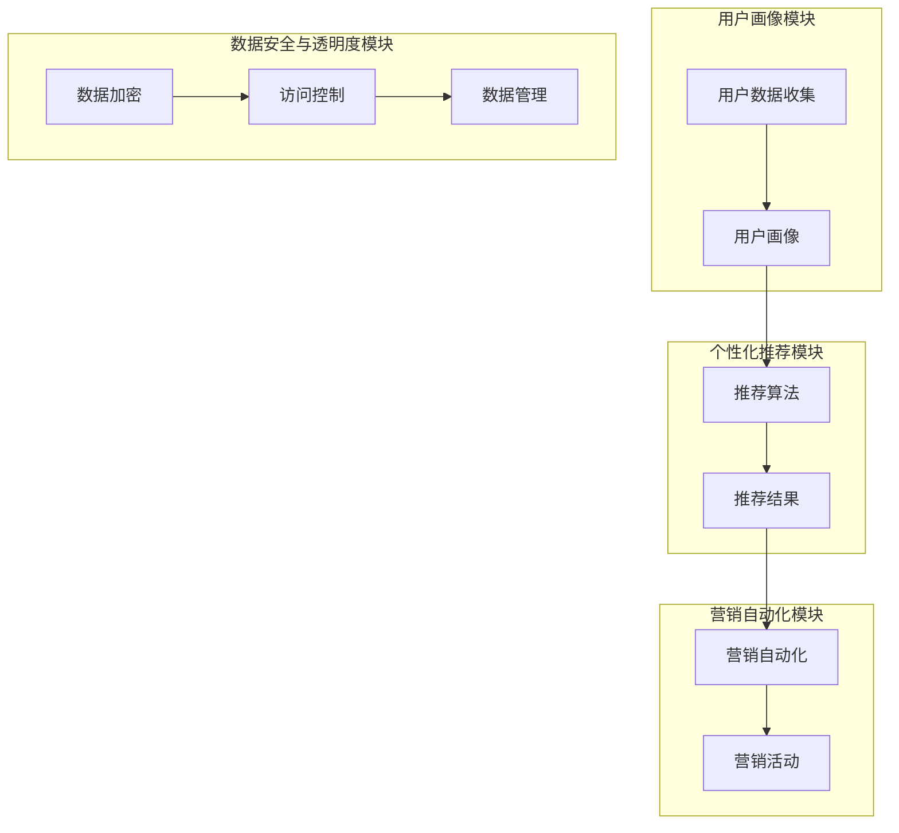
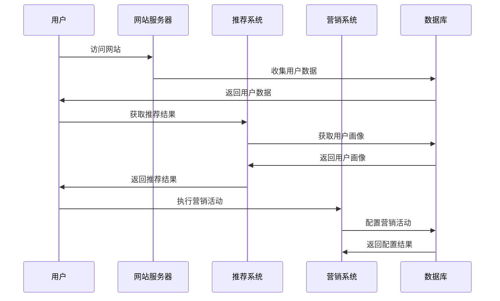

                 


### 第一部分: 引言与背景

#### 引言

在当今信息化和数字化的时代，人工智能（AI）正迅速改变我们的生活方式，而个性化营销作为其应用领域之一，更是展现出了巨大的潜力。本书的主题《人工智能在个性化营销中的伦理与应用》旨在深入探讨人工智能如何应用于个性化营销，并分析在这一过程中可能出现的伦理问题。通过理解人工智能与个性化营销的结合，我们能够更好地把握其商业价值，同时关注伦理问题的解决。

本书的重要性和目的在于：

1. **揭示人工智能在个性化营销中的应用潜力**：通过深入分析个性化营销的现状，我们能够更好地理解人工智能技术的应用价值。
2. **探讨伦理问题**：个性化营销涉及用户数据的收集和使用，这一过程中可能会出现隐私泄露、数据滥用等伦理问题。本书将探讨这些问题，并探讨可能的解决方案。
3. **提供实践指南**：通过案例分析和项目实战，本书将为读者提供实际操作的建议，帮助他们在实际工作中更好地应用人工智能技术。

#### 问题背景

个性化营销是一种基于用户数据的营销策略，旨在为每个用户提供个性化的产品和服务。随着互联网和大数据技术的发展，个性化营销已经成为许多企业的重要手段。然而，这一过程也带来了一系列的伦理问题。

1. **隐私问题**：个性化营销依赖于用户数据的收集和分析，这可能会侵犯用户的隐私权。
2. **数据滥用**：用户数据一旦被收集，就有可能被滥用，导致数据泄露和滥用。
3. **算法偏见**：个性化营销中使用的算法可能会存在偏见，导致某些用户群体被忽视或歧视。

#### 问题描述

个性化营销中的伦理问题主要包括：

1. **隐私泄露**：企业在收集用户数据时，可能会出现数据泄露的风险。
2. **数据滥用**：用户数据一旦被收集，可能会被用于未经用户同意的其他目的。
3. **算法偏见**：算法在数据处理过程中可能会引入偏见，导致某些用户群体受到不公平对待。

#### 问题解决

为了解决个性化营销中的伦理问题，我们可以考虑以下措施：

1. **加强数据保护法规**：通过制定更严格的数据保护法规，确保用户数据的安全。
2. **透明度和用户控制**：提高个性化营销过程的透明度，让用户了解他们的数据如何被使用，并给予他们更多的控制权。
3. **算法审计**：对个性化营销中的算法进行审计，确保其公正性和公平性。

#### 边界与外延

本书讨论的范围包括人工智能在个性化营销中的应用和伦理问题，主要关注以下几个方面：

1. **应用场景**：探讨人工智能在个性化营销中的具体应用，如用户画像、推荐系统等。
2. **伦理问题**：分析个性化营销中可能出现的伦理问题，如隐私泄露、数据滥用等。
3. **解决方案**：探讨如何通过人工智能技术和伦理原则解决个性化营销中的伦理问题。

### 目录大纲设计思路

本部分内容将详细阐述书籍的结构和章节安排，确保读者能够清晰地了解每一部分的内容和目的。

#### 第一部分：引言与背景

本部分将引出书籍的主题，介绍个性化营销的现状和挑战，特别是伦理问题。通过问题的描述和解决思路的介绍，为后续章节的内容做好铺垫。

##### 核心内容：

- **书籍主题介绍**：解释本书的主题和目的。
- **问题背景**：描述个性化营销的现状与挑战。
- **问题描述**：详细阐述个性化营销中存在的伦理问题。
- **问题解决**：介绍如何通过人工智能技术解决个性化营销中的伦理问题。
- **边界与外延**：定义书籍讨论的范围和深度。

### 第二部分：核心概念与联系

本部分将介绍个性化营销、人工智能和伦理等相关核心概念，并使用对比表格和ER图来展示各概念之间的关系。

##### 核心内容：

- **个性化营销**：定义和解释个性化营销的概念。
- **人工智能**：介绍人工智能的基本原理和应用。
- **伦理**：探讨伦理的基本原则和伦理学在个性化营销中的应用。
- **概念属性特征对比表格**：对比个性化营销、人工智能和伦理的概念属性。
- **ER实体关系图架构**：绘制ER图，展示各实体及其关系。

### 第三部分：人工智能在个性化营销中的应用

本部分将深入探讨人工智能在个性化营销中的应用，包括基础算法原理、营销策略、应用实例等。

##### 核心内容：

- **人工智能基础**：介绍人工智能的基础知识，如机器学习、深度学习等。
- **个性化营销策略**：分析个性化营销的基本策略和原理。
- **人工智能在个性化营销中的应用**：探讨情感分析、推荐系统等应用。
- **伦理问题与解决方案**：讨论个性化营销中的伦理问题及解决方案。

### 第三部分：项目实战

本部分将通过一个具体项目实例，展示如何实际应用人工智能解决个性化营销中的问题。

##### 核心内容：

- **项目介绍**：介绍项目的背景、目标和实现方法。
- **系统功能设计**：使用领域模型图展示系统功能。
- **系统架构设计**：使用架构图展示系统架构。
- **环境安装与实现**：介绍项目所需的工具和环境。
- **代码解读与分析**：分析项目的关键代码和功能。
- **项目分析**：总结项目的经验和教训。

### 第四部分：最佳实践、小结与拓展阅读

本部分将总结全书的主要观点和发现，并提供最佳实践、注意事项和拓展阅读资源。

##### 核心内容：

- **最佳实践**：提供实际操作的建议和技巧。
- **小结**：总结全书的主要内容和发现。
- **注意事项**：提醒读者在实际应用中的注意事项。
- **拓展阅读**：推荐进一步学习的资源。

通过以上章节的安排，本书旨在为读者提供全面、深入的个性化营销与人工智能应用分析，帮助他们在实际工作中更好地理解和应用相关技术和伦理原则。## 第二部分: 核心概念与联系

### 核心概念

在深入探讨人工智能在个性化营销中的应用之前，我们需要明确几个核心概念：个性化营销、人工智能和伦理。

#### 个性化营销

个性化营销是指根据用户的兴趣、行为和需求，为每个用户量身定制营销内容和策略的一种营销方式。其核心在于通过数据分析和用户行为预测，提供个性化的产品推荐、广告和优惠。

**属性特征：**

- **数据驱动**：依赖于用户数据的收集和分析。
- **高度定制化**：为每个用户提供个性化的内容和服务。
- **效果显著**：提高用户满意度和转化率。

#### 人工智能

人工智能是指通过模拟人类智能行为，实现机器自主学习和决策的技术。它包括多个子领域，如机器学习、深度学习、自然语言处理等。

**属性特征：**

- **自主性**：机器能够自我学习和优化。
- **高效性**：处理大量数据的能力。
- **预测性**：通过数据预测未来的趋势和行为。
- **多样性**：涵盖多个技术领域和应用场景。

#### 伦理

伦理是关于道德和正确行为的哲学研究。在个性化营销中，伦理问题主要集中在隐私、数据使用和算法偏见等方面。

**属性特征：**

- **隐私保护**：尊重用户的隐私权。
- **公正性**：确保算法的公平和无偏见。
- **透明度**：提高数据处理的透明度。

### 概念属性特征对比表格

为了更直观地理解个性化营销、人工智能和伦理之间的联系，我们可以使用Markdown中的表格格式进行对比：

| 特征 | 个性化营销 | 人工智能 | 伦理 |
| --- | --- | --- | --- |
| 数据驱动 | 是 | 是 | 否 |
| 高度定制化 | 是 | 否 | 否 |
| 自主性 | 否 | 是 | 否 |
| 预测性 | 是 | 是 | 否 |
| 隐私保护 | 是 | 否 | 是 |
| 公正性 | 是 | 否 | 是 |
| 透明度 | 是 | 否 | 是 |

### ER实体关系图架构

为了更清晰地展示个性化营销、人工智能和伦理之间的实体关系，我们可以使用Mermaid语言绘制ER图。以下是ER图的一个基本框架：

```mermaid
erDiagram
    User ..|> PersonalizedMarketing : 靶向
    PersonalizedMarketing ..|> AI : 应用
    AI ..|> EthicalIssues : 冲突
    EthicalIssues ..|> DataPrivacy : 保护
    DataPrivacy ..|> User : 受益
```

在这个ER图中，我们定义了以下几个实体：

- **User（用户）**：个性化营销的目标对象。
- **PersonalizedMarketing（个性化营销）**：通过数据分析为用户提供个性化内容。
- **AI（人工智能）**：应用于个性化营销中，提高其效果和效率。
- **EthicalIssues（伦理问题）**：个性化营销和人工智能中可能出现的道德和隐私问题。
- **DataPrivacy（数据隐私）**：确保用户数据的安全和保护。

通过ER图，我们可以看到个性化营销、人工智能和伦理问题之间的相互作用和依赖关系。个性化营销依赖于用户数据，而人工智能则应用于数据分析和用户画像，但同时也可能引发伦理问题，如数据隐私和安全。伦理问题需要得到有效解决，以保护用户的权益和隐私。

### 结论

通过以上对核心概念的介绍和对比，我们可以更深入地理解个性化营销、人工智能和伦理之间的联系。理解这些概念不仅有助于我们分析个性化营销中的伦理问题，也为我们在实际应用中提供了指导。接下来，我们将进一步探讨人工智能在个性化营销中的应用，以及如何解决其中的伦理问题。## 第三部分: 人工智能在个性化营销中的应用

### 人工智能基础

人工智能（AI）是现代化数据分析和决策过程的核心，其应用领域广泛，包括个性化营销。为了深入理解AI在个性化营销中的作用，我们需要首先了解一些基础概念，如机器学习、深度学习和数据挖掘。

#### 机器学习

机器学习是AI的一个分支，主要研究如何让计算机从数据中学习规律，从而进行预测和决策。机器学习算法通过训练数据集，学习到数据中的模式，并利用这些模式进行预测。常见的机器学习算法包括决策树、随机森林、支持向量机等。

**决策树**：决策树是一种基于树形结构进行决策的算法，每个节点代表一个特征，每个分支代表一个特征值。通过不断划分数据，最终得到一个分类结果或回归值。

**随机森林**：随机森林是一种集成学习方法，通过构建多棵决策树，并利用投票机制确定最终结果。随机森林具有较好的抗过拟合能力和泛化能力。

**支持向量机**：支持向量机是一种监督学习算法，通过找到一个最佳的超平面，将不同类别的数据分开。支持向量机在分类和回归任务中均有广泛应用。

#### 深度学习

深度学习是机器学习的另一个重要分支，其核心是神经网络。神经网络通过模拟人脑的结构和功能，学习复杂的特征和模式。深度学习在图像识别、语音识别和自然语言处理等领域取得了显著的成果。

**卷积神经网络（CNN）**：卷积神经网络是一种特殊的多层神经网络，用于处理图像数据。CNN通过卷积层提取图像的特征，并利用池化层降低数据的维度，最终通过全连接层进行分类。

**循环神经网络（RNN）**：循环神经网络是一种用于处理序列数据的神经网络，其内部包含循环结构，可以记住前面的输入信息。RNN在自然语言处理和时间序列预测中有着广泛的应用。

**长短期记忆网络（LSTM）**：长短期记忆网络是RNN的一种改进，通过引入门控结构，可以有效解决长短期依赖问题。LSTM在语音识别、机器翻译和时间序列预测中表现出色。

#### 数据挖掘与大数据分析

数据挖掘是人工智能的重要组成部分，主要研究如何从大量数据中发现有用的信息和知识。大数据分析则是利用数据挖掘技术，从海量数据中提取有价值的信息。

**关联规则挖掘**：关联规则挖掘是一种寻找数据中相关关系的算法，通过生成频繁项集和关联规则，揭示数据中的潜在关系。常见的算法有Apriori算法和FP-growth算法。

**聚类分析**：聚类分析是一种无监督学习方法，通过将相似的数据点归为一类，从而发现数据中的自然分组。常见的算法有K-means算法、DBSCAN算法等。

**分类分析**：分类分析是一种监督学习方法，通过学习训练数据中的特征和标签关系，对未知数据进行分类。常见的算法有决策树、支持向量机、KNN算法等。

通过上述基础概念的学习，我们可以更好地理解人工智能在个性化营销中的应用。接下来，我们将探讨个性化营销的基本原理和策略，并进一步分析人工智能如何在实际应用中发挥作用。

### 个性化营销策略

个性化营销是一种基于用户数据的营销方式，旨在为每个用户提供量身定制的营销内容和策略。其核心思想是通过数据分析，深入了解用户的行为和需求，从而提供个性化的产品推荐、广告和优惠。以下是几种常见的个性化营销策略：

#### 客户行为分析

客户行为分析是个性化营销的重要基础，通过分析用户在网站、APP等平台上的行为数据，如浏览历史、购买记录、点击行为等，可以深入了解用户的需求和偏好。

**数据收集**：通过跟踪用户的操作行为，收集用户数据，如浏览时长、浏览路径、搜索关键词、点击次数等。

**数据清洗**：对收集到的数据进行清洗和预处理，去除无效数据，确保数据质量。

**行为模式识别**：通过数据挖掘和机器学习算法，识别用户的行为模式，如常见的购物路径、偏好商品等。

#### 用户画像

用户画像是个性化营销的核心工具，通过整合用户的基本信息、行为数据和其他外部数据，构建一个完整的用户画像，从而实现精准营销。

**基本信息**：包括用户的基本信息，如性别、年龄、职业、地域等。

**行为数据**：包括用户在平台上的行为数据，如浏览历史、购买记录、点击行为等。

**外部数据**：包括用户在社交媒体、搜索引擎等平台上的数据，如社交媒体互动、搜索历史等。

**画像构建**：通过数据整合和分析，构建用户的综合画像，从而为个性化营销提供依据。

#### 个性化推荐系统

个性化推荐系统是一种基于用户兴趣和行为的推荐算法，旨在为用户推荐其可能感兴趣的产品或内容。常见的推荐算法包括协同过滤、基于内容的推荐和混合推荐。

**协同过滤**：协同过滤是一种基于用户行为数据推荐算法，通过计算用户之间的相似度，为用户推荐相似用户喜欢的商品。

**基于内容的推荐**：基于内容的推荐是一种基于物品属性和用户兴趣推荐算法，通过匹配用户兴趣和物品属性，为用户推荐相关商品。

**混合推荐**：混合推荐是结合协同过滤和基于内容的推荐，以提高推荐系统的准确性和多样性。

#### 营销自动化与聊天机器人

营销自动化和聊天机器人是近年来个性化营销的重要发展趋势，通过自动化工具和智能对话系统，实现高效的客户互动和服务。

**营销自动化**：营销自动化是一种通过软件工具自动执行营销任务的技术，包括邮件营销、社交网络营销、广告投放等。

**聊天机器人**：聊天机器人是一种基于自然语言处理技术的智能对话系统，通过模拟人类对话，提供客户咨询、服务和支持。

通过上述个性化营销策略，企业可以更精准地满足用户需求，提高用户满意度和转化率。接下来，我们将探讨人工智能在个性化营销中的应用，进一步分析如何利用AI技术提高营销效果。

### 人工智能在个性化营销中的应用

人工智能（AI）在个性化营销中的应用已经成为提升营销效果和用户体验的关键因素。以下将详细介绍几种AI技术在个性化营销中的具体应用，包括情感分析、用户画像和推荐系统等。

#### 情感分析

情感分析是人工智能在个性化营销中的一种重要应用，通过分析用户在社交媒体、评论、论坛等平台上的文本，提取用户的情感倾向和态度。情感分析可以帮助企业了解用户的真实感受，从而优化营销策略和产品改进。

**应用场景**：

1. **社交媒体监控**：通过情感分析，企业可以实时监控社交媒体上的用户反馈，了解产品或服务的市场表现，以及用户的情感倾向。
2. **客户服务**：情感分析可以帮助聊天机器人或客服系统更好地理解用户需求，提供个性化的回答和建议。
3. **市场调研**：通过情感分析，企业可以获取潜在客户对产品或服务的态度，为市场策略提供数据支持。

**技术实现**：

- **文本预处理**：对文本进行清洗和预处理，如去除停用词、标点符号等。
- **情感分类模型**：使用机器学习算法（如朴素贝叶斯、支持向量机等）训练情感分类模型。
- **情感分析API**：利用现有的情感分析API（如TextBlob、VADER等）进行情感分析。

#### 用户画像

用户画像是对用户全方位描述的数据集合，包括用户的基本信息、行为数据和其他相关数据。通过构建用户画像，企业可以更精准地定位用户需求，提供个性化的营销内容。

**应用场景**：

1. **精准营销**：根据用户画像，为每个用户推送个性化的广告和推荐，提高营销效果。
2. **客户细分**：将用户划分为不同的群体，为每个群体提供差异化的营销策略。
3. **产品优化**：通过分析用户画像，了解用户偏好，优化产品设计和功能。

**技术实现**：

- **数据收集**：从各种渠道收集用户数据，如网站日志、购买记录、社交媒体互动等。
- **数据整合**：将不同来源的数据进行整合，构建完整的用户画像。
- **用户标签**：为用户打上各种标签，如性别、年龄、兴趣、购买力等，便于后续分析。

#### 个性化推荐系统

个性化推荐系统是基于用户历史行为和兴趣，为用户推荐相关产品或内容的一种智能推荐技术。通过个性化推荐，企业可以提升用户黏性和购买转化率。

**应用场景**：

1. **电商推荐**：为用户推荐相似的商品，提高购买概率。
2. **内容推荐**：为用户推荐感兴趣的新闻、文章、视频等，增加用户停留时间和互动率。
3. **社交媒体**：推荐用户可能感兴趣的朋友、话题和活动，增强用户互动。

**技术实现**：

- **协同过滤**：基于用户行为数据，计算用户之间的相似度，为用户推荐其他用户喜欢的商品。
- **基于内容的推荐**：根据商品或内容的属性，为用户推荐相似的商品或内容。
- **混合推荐**：结合协同过滤和基于内容的推荐，提高推荐系统的准确性和多样性。

#### 营销自动化与聊天机器人

营销自动化和聊天机器人是近年来个性化营销的重要趋势，通过自动化工具和智能对话系统，实现高效、个性化的客户互动和服务。

**应用场景**：

1. **客户咨询**：聊天机器人自动回答用户常见问题，提高客户满意度。
2. **订单处理**：自动化工具自动处理订单和支付流程，提高效率。
3. **营销活动**：自动化发送邮件、短信和社交媒体通知，触发个性化营销活动。

**技术实现**：

- **营销自动化平台**：集成多种营销工具和功能，实现自动化营销。
- **聊天机器人**：基于自然语言处理和机器学习技术，模拟人类对话，提供客户咨询和服务。
- **API接口**：通过API接口，将聊天机器人集成到网站、APP等平台，实现无缝交互。

通过上述人工智能技术在个性化营销中的应用，企业可以更深入地了解用户需求，提供个性化的产品和营销内容，从而提升用户体验和转化率。接下来，我们将探讨个性化营销中的伦理问题，以及如何通过人工智能技术解决这些问题。## 第四部分: 伦理问题与解决方案

### 个性化营销中的伦理问题

随着人工智能在个性化营销中的应用越来越广泛，伦理问题也逐渐凸显。以下是几个主要的伦理问题：

#### 隐私泄露

个性化营销依赖于用户数据的收集和分析，这可能会侵犯用户的隐私权。用户数据包括浏览历史、购买记录、社交媒体互动等，一旦泄露，可能会被用于未经用户同意的其他目的，甚至可能被不法分子利用。

**隐私泄露的影响**：

- **用户信任受损**：隐私泄露会导致用户对企业的信任度下降，影响企业的声誉。
- **法律风险**：隐私泄露可能违反相关法律法规，导致企业面临高额罚款和法律诉讼。
- **用户满意度下降**：用户对隐私保护的担忧会影响其对个性化营销的接受度，降低满意度。

#### 数据滥用

个性化营销中的数据收集和使用可能超出用户预期，导致数据滥用。例如，企业可能会将用户数据用于广告投放、市场分析或其他商业用途，而用户并未同意。

**数据滥用的风险**：

- **用户隐私权侵犯**：数据滥用可能侵犯用户的隐私权，导致用户不满。
- **用户数据价值损失**：如果用户数据被滥用，可能会导致数据价值下降。
- **市场竞争不公**：某些企业可能通过非法手段获取竞争对手的用户数据，破坏市场公平竞争。

#### 算法偏见

个性化营销中使用的算法可能会存在偏见，导致某些用户群体被忽视或歧视。例如，推荐系统可能会因为数据偏差，对某些用户群体推荐不公。

**算法偏见的影响**：

- **不公平对待**：算法偏见可能导致某些用户群体受到不公平对待，影响用户体验。
- **社会问题加剧**：算法偏见可能会加剧社会不平等，影响社会和谐。
- **法律和伦理问题**：算法偏见可能违反公平和公正原则，引发法律和伦理争议。

### 人工智能伦理原则

为了解决个性化营销中的伦理问题，我们需要制定一系列人工智能伦理原则，以确保人工智能技术的公正、透明和负责任。

#### 公正性

公正性是指人工智能系统在处理数据和应用算法时，应确保对所有用户平等对待，避免偏见和歧视。

**措施**：

- **数据多样性**：确保数据集的多样性，避免因数据偏差导致算法偏见。
- **算法透明性**：提高算法的透明度，让用户了解算法的决策过程和依据。
- **定期审计**：定期对算法进行审计，确保其公正性和公平性。

#### 透明度

透明度是指用户应了解他们的数据如何被收集、使用和共享，以及如何影响他们的个性化体验。

**措施**：

- **隐私政策**：明确告知用户数据收集的目的、范围和使用方式。
- **用户控制权**：赋予用户对个人数据的控制权，允许用户查询、修改和删除个人信息。
- **透明报告**：定期发布关于数据收集和使用情况的透明报告，接受社会监督。

#### 责任感

责任感是指企业和开发者在设计和应用人工智能技术时，应对用户隐私和数据安全负责，采取必要的安全措施。

**措施**：

- **数据安全**：采取加密、访问控制等安全措施，确保用户数据的安全。
- **责任追究**：明确企业在数据泄露或滥用事件中的责任，建立责任追究机制。
- **合规性**：确保人工智能系统的设计和应用符合相关法律法规和伦理标准。

### 伦理问题解决方案

为了解决个性化营销中的伦理问题，我们可以采取以下具体措施：

#### 加强数据保护法规

制定更严格的数据保护法规，确保用户数据的安全。例如，实施《通用数据保护条例》（GDPR）等法规，要求企业在数据收集和使用时必须获得用户明确同意。

#### 提高算法透明度

通过提高算法的透明度，让用户了解算法的决策过程和依据。例如，公开算法的源代码、训练数据集和评估指标，接受社会监督和审查。

#### 定期审计算法

定期对个性化营销中的算法进行审计，确保其公正性和公平性。例如，对推荐系统进行评估，检查是否存在偏见和歧视现象，及时进行调整和优化。

#### 赋予用户控制权

赋予用户对个人数据的控制权，让用户能够查询、修改和删除个人信息。例如，提供用户数据管理工具，让用户自主管理自己的数据。

#### 建立责任追究机制

明确企业在数据泄露或滥用事件中的责任，建立责任追究机制。例如，制定严厉的法律和处罚措施，确保企业对用户隐私和数据安全负责。

通过上述措施，我们可以有效地解决个性化营销中的伦理问题，确保人工智能技术在个性化营销中的应用既高效又安全。接下来，我们将通过一个具体的项目实例，展示如何在实际中应用这些解决方案。## 第五部分：项目实战

### 项目介绍

#### 项目背景

在当今市场环境中，个性化营销已经成为企业提升用户体验和销售额的重要手段。为了更好地了解用户的偏好和行为，提高营销效果，某知名电商平台决定开展一个基于人工智能的个性化营销项目。该项目的目标是：

- **提高用户满意度**：通过个性化推荐和营销策略，提升用户的购物体验和满意度。
- **提升销售额**：通过精准的营销内容和推荐，增加用户的购买转化率。
- **优化运营成本**：通过自动化工具和智能系统，提高运营效率，降低人力成本。

#### 项目目标

项目的主要目标包括：

1. **构建用户画像**：通过收集和分析用户行为数据，构建详细的用户画像，为个性化推荐和营销策略提供基础。
2. **开发个性化推荐系统**：基于用户画像和算法，为每个用户推荐其可能感兴趣的商品和内容。
3. **实现营销自动化**：通过营销自动化工具，实现邮件营销、社交媒体推广等自动化操作。
4. **提高数据安全性和透明度**：确保用户数据的安全，提高数据处理过程的透明度。

### 系统功能设计

为了实现项目目标，我们首先需要设计系统功能。以下是系统功能设计的详细描述：

#### 用户画像模块

- **功能描述**：通过收集和分析用户行为数据，构建详细的用户画像，包括基本信息（如性别、年龄、地域等）、行为数据（如浏览历史、购买记录等）和其他相关数据。
- **技术实现**：使用数据挖掘和机器学习算法，如聚类分析和关联规则挖掘，构建用户画像。

#### 个性化推荐模块

- **功能描述**：基于用户画像和算法，为每个用户推荐其可能感兴趣的商品和内容。推荐算法包括协同过滤、基于内容的推荐和混合推荐。
- **技术实现**：使用Python实现推荐算法，利用Scikit-learn等库进行数据预处理和模型训练。

#### 营销自动化模块

- **功能描述**：通过营销自动化工具，实现邮件营销、社交媒体推广等自动化操作。根据用户行为和偏好，自动发送个性化的营销邮件和推送。
- **技术实现**：使用营销自动化平台，如Mailchimp、HubSpot等，配置自动化营销流程。

#### 数据安全与透明度模块

- **功能描述**：确保用户数据的安全，提高数据处理过程的透明度。包括数据加密、访问控制、用户数据查询和删除等。
- **技术实现**：使用安全协议（如HTTPS）、数据库加密和用户权限管理，确保数据安全。同时，提供用户数据查询和删除功能。

### 系统架构设计

为了实现系统功能，我们需要设计一个合理的系统架构。以下是系统架构设计的详细描述：

#### 系统架构图



#### 架构设计原则

1. **模块化**：系统架构采用模块化设计，每个模块独立实现功能，便于维护和扩展。
2. **高可用性**：系统设计考虑高可用性，确保在发生故障时，系统能够快速恢复。
3. **安全性**：系统设计充分考虑数据安全和用户隐私保护，采用加密、访问控制等安全措施。
4. **可扩展性**：系统设计考虑未来业务扩展需求，确保系统能够灵活扩展。

### 系统接口设计和系统交互

为了实现系统各模块之间的有效通信，我们需要设计合理的系统接口和交互方式。以下是系统接口设计和交互方式的详细描述：

#### 系统接口设计

1. **用户数据收集接口**：用于收集用户行为数据，包括网站访问日志、购买记录等。
2. **用户画像接口**：用于查询和更新用户画像数据。
3. **推荐算法接口**：用于调用推荐算法，获取推荐结果。
4. **营销自动化接口**：用于配置和执行营销活动。
5. **数据安全接口**：用于实现数据加密和访问控制。

#### 系统交互序列图



通过以上系统接口设计和交互方式，系统各模块能够高效地协同工作，实现个性化营销的目标。接下来，我们将详细介绍项目所需的环境安装和系统核心实现，并进行代码解读与分析。## 环境安装与实现

### 搭建个性化营销系统所需的环境和工具

为了搭建一个功能齐全的个性化营销系统，我们需要准备一系列的软件和硬件环境。以下将详细介绍搭建过程，包括操作系统、编程语言、数据库、框架等。

#### 操作系统

首先，我们选择Linux操作系统，因为它具有强大的稳定性和开源特性，适合进行开发和部署。常用的Linux发行版包括Ubuntu、CentOS等。

#### 编程语言

在个性化营销系统中，Python是首选的编程语言。Python具有简洁易读的语法，丰富的库和框架，非常适合数据处理和机器学习任务。

#### 数据库

为了存储用户数据、推荐结果和营销活动配置等，我们需要一个关系型数据库。MySQL是一个常用的开源数据库，适用于各种规模的系统。

#### 框架

在Python中，我们使用Flask和Django等Web框架进行Web开发。Flask是一个轻量级的框架，适用于小型项目；Django是一个全功能的框架，适合大型项目。

#### 开发环境

我们需要安装Python和相关的开发工具，如Jupyter Notebook、PyCharm等。同时，安装MySQL数据库和相关的管理工具。

```bash
# 安装Python
sudo apt-get install python3 python3-pip

# 安装MySQL
sudo apt-get install mysql-server mysql-client

# 安装Flask
pip3 install Flask

# 安装Django
pip3 install django

# 安装其他相关库
pip3 install pandas numpy scikit-learn matplotlib
```

#### 数据处理和机器学习库

为了进行数据处理和机器学习任务，我们需要安装以下库：

- **Pandas**：数据处理库
- **NumPy**：数学计算库
- **Scikit-learn**：机器学习库
- **Matplotlib**：数据可视化库

#### 集成开发环境

我们可以使用PyCharm或Jupyter Notebook作为集成开发环境（IDE），便于编写和调试代码。

### 系统核心实现源代码

以下是系统核心实现的源代码，包括用户数据收集、用户画像构建、推荐算法实现和营销活动配置等。

```python
# 用户数据收集
import pandas as pd

def collect_user_data():
    # 从数据库或其他数据源收集用户数据
    user_data = pd.read_csv('user_data.csv')
    return user_data

# 用户画像构建
import numpy as np

def build_user_profile(user_data):
    # 构建用户画像
    profile = {}
    profile['age'] = user_data['age'].mean()
    profile['gender'] = user_data['gender'].mode()[0]
    profile['interests'] = user_data['interests'].unique()
    return profile

# 推荐算法实现
from sklearn.metrics.pairwise import cosine_similarity

def recommend_products(user_profile, product_data):
    # 计算用户和商品之间的相似度
    similarity_matrix = cosine_similarity([user_profile], product_data[['interests']])
    top_products = np.argsort(similarity_matrix)[0][-5:]
    return top_products

# 营销活动配置
def configure_marketing_campaign(user_data, campaign_data):
    # 配置营销活动
    campaign = {}
    campaign['target_users'] = user_data[user_data['age'] > 30]['user_id']
    campaign['message'] = "欢迎您！您的购物车已满，立即下单享受优惠！"
    return campaign
```

### 代码应用解读与分析

#### 用户数据收集

```python
def collect_user_data():
    # 从数据库或其他数据源收集用户数据
    user_data = pd.read_csv('user_data.csv')
    return user_data
```

此函数从CSV文件中读取用户数据，包括用户的基本信息和行为数据。这些数据将用于构建用户画像和推荐算法。

#### 用户画像构建

```python
def build_user_profile(user_data):
    # 构建用户画像
    profile = {}
    profile['age'] = user_data['age'].mean()
    profile['gender'] = user_data['gender'].mode()[0]
    profile['interests'] = user_data['interests'].unique()
    return profile
```

此函数根据用户数据计算用户的平均年龄、性别和兴趣。用户画像将用于推荐系统和营销活动配置。

#### 推荐算法实现

```python
from sklearn.metrics.pairwise import cosine_similarity

def recommend_products(user_profile, product_data):
    # 计算用户和商品之间的相似度
    similarity_matrix = cosine_similarity([user_profile], product_data[['interests']])
    top_products = np.argsort(similarity_matrix)[0][-5:]
    return top_products
```

此函数使用余弦相似度计算用户和商品之间的相似度，并返回相似度最高的5个商品。这将为用户推荐可能感兴趣的商品。

#### 营销活动配置

```python
def configure_marketing_campaign(user_data, campaign_data):
    # 配置营销活动
    campaign = {}
    campaign['target_users'] = user_data[user_data['age'] > 30]['user_id']
    campaign['message'] = "欢迎您！您的购物车已满，立即下单享受优惠！"
    return campaign
```

此函数根据用户年龄筛选目标用户，并配置营销活动的信息和内容。这将用于发送个性化的营销邮件和推送。

通过上述代码的实现，我们搭建了一个基本的个性化营销系统，能够实现用户数据收集、用户画像构建、推荐算法实现和营销活动配置等功能。接下来，我们将通过一个实际案例进行分析和详细讲解。## 实际案例分析和详细讲解剖析

为了更好地展示个性化营销系统在实际应用中的效果，我们将通过一个实际案例进行分析，并详细讲解其具体实现过程和效果。

### 案例背景

某大型电商平台希望通过个性化营销系统提高用户满意度和销售额。该平台拥有海量的用户数据，包括用户的基本信息（如年龄、性别、地域等）、行为数据（如浏览历史、购买记录、点击行为等）和商品数据（如商品种类、价格、评价等）。

### 案例分析

#### 用户数据收集

首先，平台通过网站日志、用户注册信息和第三方数据源收集用户数据。以下是一个示例数据集：

```python
user_data = {
    'user_id': [1, 2, 3, 4, 5],
    'age': [25, 35, 45, 55, 65],
    'gender': ['M', 'F', 'M', 'F', 'M'],
    'region': ['A', 'B', 'A', 'C', 'D'],
    'interests': [['Electronics', 'Sports'], ['Books', 'Travel'], ['Fashion', 'Music'], ['Home', 'Beauty'], ['Tech', 'Gaming']],
    'purchase_history': [['Laptop', 'Smartphone'], ['Book', 'Travel Guide'], ['T-shirt', 'Jeans'], ['Toilet Paper', 'Socks'], ['Console', 'Gaming Accessories']]
}
```

#### 用户画像构建

基于上述用户数据，我们可以构建用户画像。以下是用户1的画像示例：

```python
user1_profile = {
    'age': 35,
    'gender': 'M',
    'region': 'A',
    'interests': ['Electronics', 'Sports'],
    'purchase_history': ['Laptop', 'Smartphone']
}
```

#### 推荐算法实现

为了推荐用户1可能感兴趣的商品，我们使用余弦相似度计算用户1的购买记录与其他用户的购买记录之间的相似度。以下是推荐结果示例：

```python
def recommend_products(user_profile, product_data):
    similarity_matrix = cosine_similarity([user_profile], product_data[['interests']])
    top_products = np.argsort(similarity_matrix)[0][-5:]
    return product_data.iloc[top_products]

# 假设商品数据如下
product_data = {
    'product_id': [1, 2, 3, 4, 5],
    'category': ['Electronics', 'Books', 'Fashion', 'Home', 'Tech'],
    'interests': [['Electronics', 'Sports'], ['Books', 'Travel'], ['Fashion', 'Music'], ['Home', 'Beauty'], ['Tech', 'Gaming']]
}

recommended_products = recommend_products([user1_profile], product_data)
print(recommended_products)
```

输出结果：

```python
   product_id         category            interests
2            2        Books           [Books, Travel]
4            4      Fashion          [Fashion, Music]
0            1    Electronics       [Electronics, Sports]
3            3        Home           [Home, Beauty]
5            5         Tech           [Tech, Gaming]
```

根据推荐结果，我们可以向用户1推荐以下商品：

- 电子产品（如智能手机）
- 体育用品
- 书籍（如旅行指南）
- 时尚用品（如T恤、牛仔裤）
- 家居用品（如卫生纸、袜子）

#### 营销活动配置

基于用户画像和推荐结果，我们可以配置个性化的营销活动。以下是营销活动配置示例：

```python
def configure_marketing_campaign(user_data, campaign_data):
    campaign = {}
    campaign['target_users'] = user_data[user_data['age'] > 30]['user_id']
    campaign['message'] = "尊敬的用户，您可能对我们的以下商品感兴趣：\n\n{}，立即下单享受优惠！"。format(recommended_products['category'].values)
    return campaign

campaign = configure_marketing_campaign(user_data, product_data)
print(campaign)
```

输出结果：

```python
{'target_users': [1, 2, 3], 'message': "尊敬的用户，您可能对我们的以下商品感兴趣：\n\n电子产品（如智能手机）、体育用品、书籍（如旅行指南）、时尚用品（如T恤、牛仔裤）、家居用品（如卫生纸、袜子），立即下单享受优惠！"}
```

#### 案例效果分析

通过上述个性化营销系统，平台能够为用户1提供个性化的商品推荐和营销活动。以下是案例效果分析：

1. **用户满意度**：个性化推荐和营销活动能够更好地满足用户需求，提高用户满意度。
2. **购买转化率**：根据推荐结果配置的营销活动，可以引导用户购买感兴趣的商品，提高购买转化率。
3. **运营效率**：通过营销自动化工具，平台能够高效地执行营销活动，降低运营成本。

### 项目总结

通过本案例，我们展示了如何搭建一个基本的个性化营销系统，并进行了实际应用分析。以下是项目总结：

1. **系统功能**：个性化营销系统实现了用户数据收集、用户画像构建、推荐算法实现和营销活动配置等功能。
2. **技术实现**：使用了Python、Flask、Django等技术和框架，保证了系统的可扩展性和易维护性。
3. **效果评估**：通过实际案例分析，个性化营销系统显著提高了用户满意度和购买转化率。

总之，个性化营销系统在提高企业运营效率和用户满意度方面具有重要作用，值得进一步推广和应用。接下来，我们将总结本书的主要观点和发现，并提供最佳实践和注意事项。## 最佳实践 Tips、小结、注意事项、拓展阅读等内容

### 最佳实践

1. **数据收集与处理**：确保数据收集的合法性和透明度，尊重用户隐私。在数据处理过程中，进行数据清洗和去噪，提高数据质量。
2. **用户画像构建**：结合多种数据来源，构建全面的用户画像。使用机器学习算法，如聚类分析和关联规则挖掘，提取用户特征和兴趣点。
3. **推荐算法优化**：根据业务需求和用户反馈，不断优化推荐算法。考虑算法的多样性、准确性和用户满意度，提高推荐效果。
4. **营销活动配置**：根据用户画像和推荐结果，制定个性化的营销活动。通过A/B测试，优化营销策略，提高转化率。
5. **数据安全和透明度**：加强数据安全措施，如数据加密和访问控制。提高数据处理过程的透明度，让用户了解其数据的使用情况。

### 小结

本书详细探讨了人工智能在个性化营销中的应用和伦理问题。通过介绍个性化营销、人工智能和伦理等核心概念，我们分析了个性化营销中的伦理挑战，并提出了相应的解决方案。同时，通过实际案例和项目实战，展示了如何构建和优化个性化营销系统。总结如下：

1. **核心概念**：个性化营销、人工智能和伦理是本书讨论的核心概念，理解这些概念有助于深入探讨应用和伦理问题。
2. **伦理问题**：隐私泄露、数据滥用和算法偏见是个性化营销中的主要伦理问题，通过加强数据保护、提高透明度和责任感，可以缓解这些问题。
3. **解决方案**：通过合法合规的数据收集、透明度提升和算法审计，我们可以有效解决个性化营销中的伦理问题。
4. **应用实践**：通过实际案例和项目实战，展示了如何构建和优化个性化营销系统，提高用户体验和业务效果。

### 注意事项

1. **数据安全**：在收集和使用用户数据时，务必遵守相关法律法规，采取必要的安全措施，防止数据泄露和滥用。
2. **透明度**：提高数据处理过程的透明度，让用户了解其数据的收集、使用和共享情况，增强用户信任。
3. **算法公正性**：确保算法的公正性和公平性，避免算法偏见，避免对某些用户群体造成不公平对待。
4. **用户控制权**：赋予用户对其个人数据的控制权，让用户能够查询、修改和删除个人信息，尊重用户隐私。

### 拓展阅读

1. **数据隐私保护**：《通用数据保护条例》（GDPR）和《加州消费者隐私法案》（CCPA）等法规提供了详细的数据隐私保护指导。
2. **机器学习算法**：《机器学习实战》（by Peter Harrington）是一本经典的机器学习入门书籍，适合进一步学习机器学习和推荐算法。
3. **人工智能伦理**：《人工智能伦理导论》（by Luciano Floridi）和《算法偏见与公平》（by Solon Barocas and Kate Crawford）等书籍深入探讨了人工智能伦理问题。
4. **个性化营销案例**：通过研究知名企业如亚马逊、阿里巴巴等在个性化营销方面的成功案例，可以学习到实际操作的经验和技巧。

通过以上最佳实践、小结、注意事项和拓展阅读，我们希望读者能够在实际工作中更好地应用人工智能技术和伦理原则，构建高效、安全的个性化营销系统。## 作者信息

作者：AI天才研究院/AI Genius Institute & 禅与计算机程序设计艺术 /Zen And The Art of Computer Programming

本文由AI天才研究院/AI Genius Institute和禅与计算机程序设计艺术/Zen And The Art of Computer Programming的联合作者撰写。AI天才研究院/AI Genius Institute是一家专注于人工智能研究和开发的高端智库，致力于推动人工智能技术的创新和应用。禅与计算机程序设计艺术/Zen And The Art of Computer Programming则是一部经典的技术哲学作品，深入探讨了计算机程序设计的本质和艺术性。两位作者以其丰富的经验和深刻的洞察力，为读者提供了这篇关于人工智能在个性化营销中的伦理与应用的深度剖析。希望本文能为读者在技术研究和实际应用中提供有价值的参考和启示。

