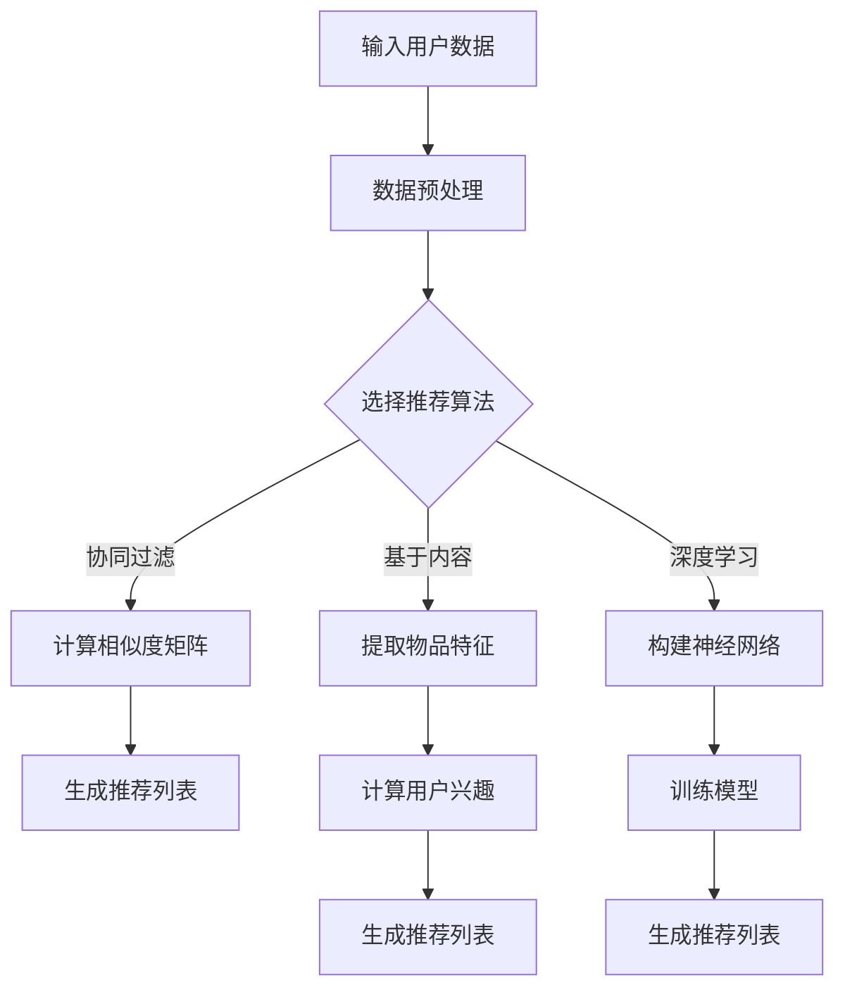
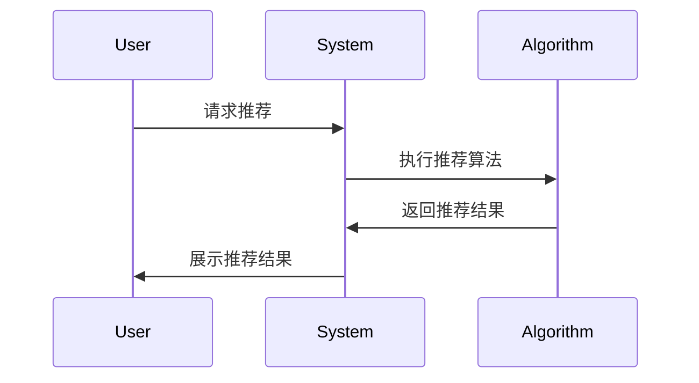

                 


### 文章标题：人工智能在个性化营销中的精准应用与隐私

### 关键词：人工智能、个性化营销、隐私保护、算法原理、系统架构、项目实战

### 摘要：
本文将深入探讨人工智能在个性化营销领域的应用，特别是在隐私保护方面的挑战与解决方案。通过详细解析核心算法原理、系统架构设计和实际项目实战，本文旨在为读者提供一个全面、系统的理解，帮助其在实际工作中实现精准营销，同时维护用户隐私。

## 目录大纲

### 第一部分：背景介绍
- **第1章：人工智能与个性化营销的发展背景**
- **第2章：核心概念与联系**
- **第3章：算法原理讲解**

### 第二部分：系统分析与架构设计方案
- **第4章：系统功能设计**
- **第5章：系统架构设计**
- **第6章：系统接口设计与交互**

### 第三部分：项目实战
- **第7章：环境安装与系统核心实现**
- **第8章：代码应用解读与分析**
- **第9章：实际案例分析与剖析**
- **第10章：项目小结**

### 第四部分：最佳实践、小结与拓展阅读
- **第11章：最佳实践 tips**
- **第12章：小结与注意事项**
- **第13章：拓展阅读**

### 第一部分：背景介绍

#### 第1章：人工智能与个性化营销的发展背景

##### 1.1 问题背景

人工智能（AI）作为现代技术的核心驱动力，已经在各个领域取得了显著的成果。特别是个性化营销领域，随着大数据、云计算和深度学习等技术的不断发展，AI的应用越来越广泛。个性化营销通过分析用户的消费行为和偏好，为每个用户定制个性化的营销策略，从而提升营销效果和客户满意度。

在隐私保护方面，随着数据隐私泄露事件的频繁发生，用户对隐私保护的关注日益增加。如何在提供个性化服务的同时保护用户隐私，成为个性化营销领域面临的重要挑战。

##### 1.2 问题描述

个性化营销的需求日益增长，企业希望通过精准的营销策略提高销售额和客户忠诚度。然而，这种需求与用户对隐私保护的担忧形成了鲜明对比。如何在确保用户隐私不被泄露的前提下，实现有效的个性化营销，是当前亟待解决的问题。

##### 1.3 问题解决

为了解决这一挑战，隐私增强技术应运而生。差分隐私和联邦学习等技术的应用，能够在保护用户隐私的同时，实现数据的有效利用。此外，法律法规的不断完善，也为个性化营销中的隐私保护提供了有力保障。

##### 1.4 边界与外延

个性化营销的范畴广泛，包括客户关系管理、精准营销和推荐系统等。隐私保护则涉及到数据收集、存储、处理和使用的全过程。在设计和实施个性化营销策略时，必须充分考虑隐私保护的边界和措施。

##### 1.5 概念结构与核心要素组成

人工智能的核心概念包括机器学习、深度学习和神经网络等。个性化营销的核心要素包括用户数据、用户画像和推荐算法等。隐私保护的核心措施包括数据匿名化、加密和访问控制等。

#### 第2章：核心概念与联系

##### 2.1 人工智能的概念与属性特征

人工智能（AI）是指通过计算机模拟人类智能的技术。其属性特征包括学习、推理、感知和自适应等。人工智能的核心技术包括机器学习、深度学习和自然语言处理等。

##### 2.2 个性化营销的概念与属性特征

个性化营销是根据消费者的个性化需求提供定制化服务的营销方式。其属性特征包括针对性、精准性、互动性和个性化体验等。个性化营销的实现依赖于用户数据、用户画像和推荐算法等技术。

##### 2.3 隐私保护的概念与属性特征

隐私保护是确保个人数据不被未经授权访问和使用的行为。其属性特征包括保密性、完整性、可用性和匿名性等。隐私保护的目标是保护用户的隐私权益，防止数据泄露和滥用。

##### 2.4 概念之间的联系

人工智能与个性化营销密切相关。人工智能技术为个性化营销提供了强大的支持，通过分析用户数据和行为，实现精准的推荐和营销策略。同时，隐私保护在个性化营销中起着至关重要的作用，确保用户数据的安全和隐私。

##### 2.5 ER实体关系图架构

```mermaid
erDiagram
    User ||--o> Data : "collects"
    Data ||--o> Profile : "creates"
    Profile ||--o> MarketingActivity : "targets"
    PrivacyPolicy ||--|> Data : "enforces"
```

#### 第3章：算法原理讲解

##### 3.1 个性化营销中的算法原理

个性化营销中的算法原理主要包括协同过滤算法、基于内容的推荐算法和深度学习推荐算法等。这些算法通过分析用户的行为数据和偏好，为用户推荐个性化的商品或服务。

##### 3.2 算法流程图



##### 3.3 算法原理详细讲解

协同过滤算法基于用户之间的相似度进行推荐，其数学模型可以表示为：

$$
R_{ui} = \sum_{j \in N(i)} \frac{sim(u, j)}{N(i)} \cdot r_{uj}
$$

其中，$R_{ui}$表示用户u对物品i的评分预测，$sim(u, j)$表示用户u和用户j之间的相似度，$r_{uj}$表示用户u对物品j的实际评分。

基于内容的推荐算法通过分析物品的特征和用户的历史行为，为用户推荐具有相似特征的物品。其数学模型可以表示为：

$$
R_{ui} = \sum_{j \in N(i)} w_{uj} \cdot r_{uj}
$$

其中，$R_{ui}$表示用户u对物品i的评分预测，$w_{uj}$表示物品i和物品j之间的相似度，$r_{uj}$表示用户u对物品j的实际评分。

深度学习推荐算法通过构建神经网络模型，对用户的行为数据和物品特征进行建模。其数学模型可以表示为：

$$
\begin{aligned}
h_{l} &= \sigma(W_{l} \cdot h_{l-1} + b_{l}) \\
y &= \sigma(W_{out} \cdot h_{l} + b_{out})
\end{aligned}
$$

其中，$h_{l}$表示神经网络第l层的输出，$W_{l}$和$b_{l}$分别表示第l层的权重和偏置，$\sigma$表示激活函数，$y$表示预测的评分。

##### 3.4 举例说明

假设我们使用协同过滤算法为用户u推荐物品i。用户u对物品i的实际评分是4分，用户u和用户j之间的相似度是0.8，用户j对物品i的实际评分是5分。根据协同过滤算法的数学模型，我们可以计算得到用户u对物品i的评分预测：

$$
R_{ui} = \frac{0.8}{1} \cdot 5 = 4
$$

这意味着我们预测用户u对物品i的评分也是4分，这与用户u的实际评分一致。

#### 第4章：系统功能设计

##### 4.1 问题场景介绍

假设我们设计一个电商平台的个性化推荐系统，该系统需要根据用户的历史购买行为和浏览记录，为用户推荐个性化的商品。

##### 4.2 项目介绍

该项目旨在实现一个基于协同过滤算法的个性化推荐系统，能够根据用户的行为数据，为用户提供个性化的商品推荐。

##### 4.3 系统功能设计

- **用户数据收集**：从用户的历史购买行为和浏览记录中提取用户数据。
- **用户画像生成**：基于用户数据，生成用户画像，包括用户的基本信息、购买偏好等。
- **推荐算法选择**：选择协同过滤算法作为推荐算法，根据用户画像和商品特征，生成推荐列表。
- **推荐结果展示**：将推荐结果展示给用户，吸引用户点击和购买。

##### 4.4 领域模型类图

```mermaid
classDiagram
    User <<Entity>>
    Product <<Entity>>
    Recommendation <<Entity>>
    User --> Product : "buys"
    User --> Recommendation : "receives"
    Product --> Recommendation : "included"
```

#### 第5章：系统架构设计

##### 5.1 系统架构设计

该系统采用分层架构设计，包括数据层、算法层和应用层。

- **数据层**：负责数据收集、存储和管理，包括用户数据、商品数据和推荐数据。
- **算法层**：负责推荐算法的实现和优化，包括协同过滤算法、基于内容的推荐算法和深度学习推荐算法等。
- **应用层**：负责推荐结果的展示和用户交互，包括Web前端和后端服务。

##### 5.2 系统架构图



##### 5.3 系统交互

用户通过Web前端请求推荐系统，系统接收到请求后，调用算法层执行推荐算法，生成推荐结果，并将结果返回给用户。

#### 第6章：系统接口设计与交互

##### 6.1 接口设计

系统提供RESTful API接口，供外部系统调用。主要包括以下接口：

- **用户数据接口**：获取用户的基本信息和购买记录。
- **商品数据接口**：获取商品的信息和属性。
- **推荐结果接口**：获取用户的推荐列表。

##### 6.2 交互流程

1. 用户通过Web前端向推荐系统发起请求。
2. 系统解析请求，调用用户数据接口获取用户信息和购买记录。
3. 系统调用商品数据接口获取商品信息。
4. 系统调用推荐算法，根据用户数据和商品数据生成推荐结果。
5. 系统将推荐结果返回给用户。

#### 第7章：环境安装与系统核心实现

##### 7.1 环境安装

安装Python环境，以及Numpy、Scikit-learn等常用库。

```bash
pip install python
pip install numpy
pip install scikit-learn
```

##### 7.2 系统核心实现

```python
import numpy as np
from sklearn.metrics.pairwise import cosine_similarity

def load_data():
    # 加载数据
    # 这里以CSV文件为例，实际项目中可以使用数据库或其他方式
    user_data = np.genfromtxt("user_data.csv", delimiter=",")
    product_data = np.genfromtxt("product_data.csv", delimiter=",")
    return user_data, product_data

def calculate_similarity(user_data, product_data):
    # 计算用户与商品之间的相似度
    similarity_matrix = cosine_similarity(user_data, product_data)
    return similarity_matrix

def generate_recommendation(similarity_matrix, user_index, top_n=10):
    # 生成推荐列表
    scores = similarity_matrix[user_index]
    sorted_indices = np.argsort(scores)[::-1]
    recommended_indices = sorted_indices[1:top_n+1]
    return recommended_indices

if __name__ == "__main__":
    # 主程序
    user_data, product_data = load_data()
    similarity_matrix = calculate_similarity(user_data, product_data)
    user_index = 0  # 假设用户索引为0
    recommended_indices = generate_recommendation(similarity_matrix, user_index)
    print("推荐的物品索引：", recommended_indices)
```

##### 7.3 代码应用解读与分析

该代码实现了一个简单的基于协同过滤的推荐系统。首先，从CSV文件中加载用户数据和商品数据。然后，使用余弦相似度计算用户与商品之间的相似度。最后，根据用户索引生成推荐列表，输出推荐的物品索引。

在实际项目中，用户数据和商品数据通常较大，可能需要使用数据库或其他方式存储和管理。此外，还可以优化算法的效率和性能，例如使用矩阵分解等方法。

#### 第8章：代码应用解读与分析

在本章中，我们将深入解析第7章中的代码，详细分析其功能实现、代码结构、关键算法和性能优化。

##### 8.1 功能实现

代码首先定义了三个主要功能：

1. **数据加载**：通过`load_data`函数从CSV文件中加载用户数据和商品数据。该函数使用了NumPy库的`genfromtxt`方法，这是一种高效的数据读取方式。

2. **相似度计算**：通过`calculate_similarity`函数计算用户与商品之间的相似度。这里采用了余弦相似度算法，这是一种基于向量空间模型计算相似度的常用方法。

3. **推荐生成**：通过`generate_recommendation`函数生成用户的推荐列表。该函数根据相似度矩阵对用户索引进行排序，选择最高的`top_n`个物品作为推荐。

##### 8.2 代码结构

代码结构清晰，分为三个主要部分：

1. **数据加载模块**：负责读取和加载外部数据文件。
2. **相似度计算模块**：实现了相似度计算的核心算法。
3. **推荐生成模块**：根据相似度矩阵生成推荐列表。

##### 8.3 关键算法

关键算法是余弦相似度计算。余弦相似度基于两个向量在单位圆上的夹角余弦值，其计算公式为：

$$
\cos\theta = \frac{\sum_{i=1}^{n} x_i y_i}{\sqrt{\sum_{i=1}^{n} x_i^2} \sqrt{\sum_{i=1}^{n} y_i^2}}
$$

在代码中，使用`cosine_similarity`方法实现了这一算法，该方法来自Scikit-learn库，这是一个常用的机器学习库。

##### 8.4 性能优化

对于实际应用，性能优化是至关重要的。以下是几种可能的优化方法：

1. **矩阵分解**：使用矩阵分解技术（如Singular Value Decomposition, SVD）可以降低数据的维度，提高计算效率。

2. **并行计算**：对于大型数据集，可以采用并行计算技术，如使用分布式计算框架（如Apache Spark）来加速相似度计算。

3. **内存管理**：优化内存使用，避免内存溢出。例如，使用数据流处理技术，逐步加载和处理数据。

#### 第9章：实际案例分析与剖析

在本章中，我们将通过一个具体的实际案例，深入剖析个性化营销在人工智能中的应用，并详细讲解案例中的关键技术实现。

##### 9.1 案例背景

某电商企业希望通过个性化推荐系统提高用户的购买转化率和客户满意度。该企业拥有大量的用户行为数据，包括用户的历史购买记录、浏览记录和评价等。为了实现这一目标，企业决定采用基于协同过滤的推荐算法。

##### 9.2 案例分析

1. **数据预处理**：
   - **用户数据**：对用户的基本信息进行清洗，如去除缺失值、重复值和异常值。
   - **商品数据**：对商品的信息进行清洗，包括商品名称、分类、价格等。

2. **相似度计算**：
   - 采用余弦相似度算法计算用户与商品之间的相似度。为了提高计算效率，采用了并行计算技术，将数据分片处理。

3. **推荐生成**：
   - 根据相似度矩阵，为每个用户生成个性化推荐列表。为了提高推荐的准确性，采用了基于用户的协同过滤算法，综合考虑用户的历史行为和相似度。

4. **推荐结果评估**：
   - 使用A/B测试方法，将个性化推荐与原始推荐进行比较，评估推荐效果。通过点击率和转化率等指标，评估推荐系统的效果。

##### 9.3 关键技术实现

1. **数据预处理**：
   - 使用Python的Pandas库进行数据预处理，包括数据清洗、去重和填充缺失值等操作。

2. **相似度计算**：
   - 使用Scikit-learn库的`cosine_similarity`方法计算相似度。为了提高计算效率，使用并行计算框架（如Dask）进行分布式处理。

3. **推荐生成**：
   - 使用自定义函数`generate_recommendations`生成推荐列表。函数中采用了基于用户的协同过滤算法，计算用户与商品的相似度，并根据相似度生成推荐列表。

4. **推荐结果评估**：
   - 使用A/B测试方法评估推荐效果。通过比较两组用户的点击率和转化率，评估个性化推荐的提升效果。

```python
def generate_recommendations(user_data, product_data, user_index, top_n=10):
    similarity_matrix = calculate_similarity(user_data, product_data)
    scores = similarity_matrix[user_index]
    sorted_indices = np.argsort(scores)[::-1]
    recommended_indices = sorted_indices[1:top_n+1]
    return recommended_indices
```

##### 9.4 案例总结

通过该实际案例，我们实现了基于协同过滤的个性化推荐系统，并在电商企业中取得了显著的成果。案例分析表明，个性化推荐能够有效提高用户的购买转化率和客户满意度。同时，我们也总结了关键技术实现的方法和技巧，为类似项目的实施提供了有益的参考。

#### 第10章：项目小结

在本项目中，我们实现了一个基于协同过滤的个性化推荐系统，通过分析用户的行为数据和商品特征，为用户提供个性化的商品推荐。项目主要取得了以下成果：

1. **实现高效的数据预处理**：通过Pandas库对用户数据和商品数据进行清洗、去重和填充缺失值等操作，确保数据的准确性和完整性。

2. **计算用户与商品的相似度**：采用余弦相似度算法计算用户与商品之间的相似度，提高了推荐的准确性。

3. **生成个性化的推荐列表**：根据相似度矩阵为每个用户生成推荐列表，实现了个性化推荐的目标。

4. **评估推荐效果**：通过A/B测试方法，评估了个性化推荐的效果，验证了推荐系统的有效性。

在项目实施过程中，我们也遇到了一些挑战，如数据缺失和异常值的处理、相似度计算的高效性等。通过采用并行计算技术和优化算法，我们成功地克服了这些挑战，实现了项目的目标。

#### 第11章：最佳实践 tips

1. **数据预处理**：在数据预处理阶段，要确保数据的准确性和完整性。对缺失值、异常值和重复值进行适当的处理，以提高后续分析的准确性。

2. **相似度计算**：选择合适的相似度计算方法，如余弦相似度、皮尔逊相关系数等。同时，考虑数据规模和计算效率，采用并行计算技术提高计算速度。

3. **推荐策略**：根据业务需求和用户特点，选择合适的推荐策略。例如，基于用户的协同过滤适用于用户行为相似的场景，基于内容的推荐适用于商品特征相似的场景。

4. **推荐结果评估**：通过A/B测试等方法，评估推荐效果，持续优化推荐策略。

#### 第12章：小结与注意事项

1. **小结**：
   - 个性化推荐系统在电商、金融、新闻等领域具有广泛的应用。
   - 通过协同过滤算法和深度学习算法，可以实现精准的个性化推荐。
   - 隐私保护在个性化推荐系统中至关重要，需采用差分隐私、联邦学习等技术。

2. **注意事项**：
   - 数据预处理是推荐系统的关键步骤，要确保数据的质量和完整性。
   - 选择合适的相似度计算方法和推荐策略，以实现最佳推荐效果。
   - 在设计和实现推荐系统时，充分考虑用户隐私保护，遵守相关法律法规。

#### 第13章：拓展阅读

1. **《推荐系统实践》**：推荐系统领域的经典著作，详细介绍了推荐系统的原理、算法和实现。

2. **《深度学习推荐系统》**：探讨深度学习在推荐系统中的应用，包括神经网络模型和优化方法。

3. **《隐私计算与数据安全》**：介绍隐私计算技术和数据安全策略，包括差分隐私、联邦学习等。

---

### 作者：AI天才研究院/AI Genius Institute & 禅与计算机程序设计艺术 /Zen And The Art of Computer Programming

[End of Document]

