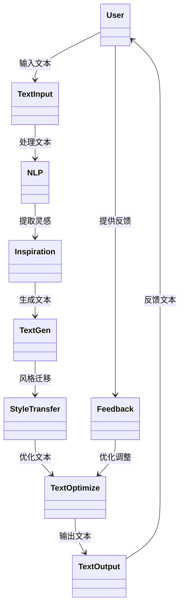
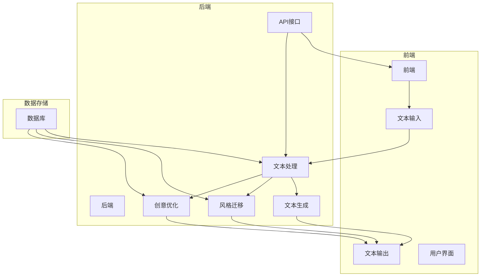
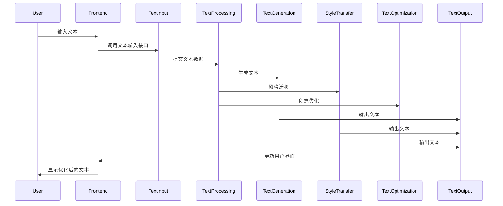

                 


### 第1章：问题背景

#### 1.1 问题背景

创意写作一直是人类文化和艺术的重要组成部分。无论是文学、电影、戏剧，还是广告、游戏、音乐，都需要创意作为基础。然而，创意写作并非一件容易的事情。它需要创作者具备深厚的知识储备、独特的视角和丰富的想象力。同时，随着信息的爆炸性增长，创作者在寻找灵感时常常感到力不从心，创作过程中也可能遭遇灵感枯竭、思路堵塞等问题。

近年来，人工智能（AI）技术的迅猛发展，使得它在各个领域都展现出了巨大的潜力。在创意写作领域，人工智能也开始崭露头角，成为辅助创作的新工具。通过深度学习、自然语言处理（NLP）等先进技术，人工智能可以分析和理解大量文本数据，从中提取有用的信息，为创作提供灵感和支持。

#### 1.2 问题描述

创意写作中存在以下问题：

1. **灵感缺乏**：创作者可能会在创作过程中遇到灵感枯竭的问题，导致创作停滞。
2. **创作效率低**：创意写作需要大量的时间投入，创作周期长，效率低。
3. **文本质量难以保证**：创作者的文笔和风格可能不一致，导致文本质量不稳定。
4. **创新不足**：创作者可能会受到自身经验和知识的限制，难以在作品中展现出新颖的创意。

为了解决这些问题，我们需要找到一种方法，使人工智能能够辅助创意写作，提高创作效率和质量。

#### 1.3 问题解决

人工智能在创意写作中可以起到以下作用：

1. **灵感提取**：通过分析大量文本数据，人工智能可以帮助创作者寻找灵感，拓宽创作思路。
2. **文本生成**：人工智能可以根据创作者的指令，自动生成文本，提高创作效率。
3. **风格迁移**：人工智能可以学习创作者的文笔和风格，将创作内容转化为符合创作者风格的文本。
4. **创意优化**：人工智能可以对创作内容进行优化，使其更具创意性和新颖性。

通过以上方法，人工智能可以辅助创意写作，解决创作者在创作过程中遇到的问题。

#### 1.4 边界与外延

创意写作的定义：创意写作是指通过文字表达创造性的思想和情感，以文学、艺术、广告等形式呈现的创作活动。

人工智能在创意写作中的应用范围：人工智能可以应用于文学创作、电影剧本创作、广告文案创作、游戏剧情设计、音乐创作等多个领域。

#### 1.5 概念结构与核心要素组成

本章节主要介绍了人工智能在创意写作中的背景、问题描述、问题解决方法以及相关概念的边界与外延。核心要素包括：

1. **创意写作**：定义、应用范围。
2. **人工智能**：定义、作用。
3. **问题解决方法**：灵感提取、文本生成、风格迁移、创意优化。

接下来，我们将进一步探讨人工智能在创意写作中的核心概念及其相互联系。

----------------------------------------------------------------

### 第2章：核心概念与联系

#### 2.1 人工智能与创意写作的关系

人工智能（AI）与创意写作之间存在着密切的联系。首先，人工智能为创意写作提供了强大的技术支持。通过自然语言处理（NLP）、机器学习（ML）和深度学习（DL）等技术，人工智能可以分析大量文本数据，提取有价值的信息，从而为创作提供灵感。其次，人工智能可以辅助创作者进行文本生成、风格迁移和创意优化，提高创作效率和质量。

在创意写作中，人工智能的主要作用包括：

1. **灵感提取**：通过分析大量文本数据，人工智能可以帮助创作者寻找灵感，拓宽创作思路。
2. **文本生成**：人工智能可以根据创作者的指令，自动生成文本，提高创作效率。
3. **风格迁移**：人工智能可以学习创作者的文笔和风格，将创作内容转化为符合创作者风格的文本。
4. **创意优化**：人工智能可以对创作内容进行优化，使其更具创意性和新颖性。

#### 2.2 人工智能在创意写作中的核心概念

在本章节中，我们将介绍人工智能在创意写作中的几个核心概念：

1. **自然语言处理（NLP）**：NLP 是人工智能的一个重要分支，它使计算机能够理解、处理和生成自然语言。在创意写作中，NLP 技术可以用于文本分析、情感分析、关键词提取等任务，为创作提供支持。
2. **机器学习（ML）**：ML 是一种让计算机从数据中自动学习的方法。在创意写作中，ML 技术可以用于生成文本、风格迁移和创意优化等任务。
3. **深度学习（DL）**：DL 是 ML 的一种延伸，它通过神经网络模型模拟人脑的思考方式。在创意写作中，DL 技术可以用于生成复杂文本、情感分析和风格迁移等任务。
4. **文本生成模型**：文本生成模型是 AI 在创意写作中的一个重要应用，它可以生成符合语法和语义要求的文本。常见的文本生成模型包括生成对抗网络（GAN）、序列到序列（Seq2Seq）模型、变分自编码器（VAE）等。
5. **风格迁移**：风格迁移是一种将一种风格文本转化为另一种风格文本的方法。在创意写作中，风格迁移可以帮助创作者快速实现不同风格的作品，提高创作效率。
6. **创意优化**：创意优化是一种通过对文本内容进行分析和调整，提高文本创意性和新颖性的方法。在创意写作中，创意优化可以帮助创作者找到更有创意的表达方式，提升作品质量。

#### 2.3 概念属性特征对比表格

为了更清晰地了解上述概念，我们可以通过一个对比表格来展示它们的属性特征：

| 概念        | 属性特征                      | 应用场景                   |
| ----------- | --------------------------- | ------------------------- |
| 自然语言处理（NLP） | 文本分析、情感分析、关键词提取 | 创意写作中的文本处理和分析 |
| 机器学习（ML）    | 自动学习、分类、回归         | 文本生成、风格迁移、创意优化 |
| 深度学习（DL）    | 神经网络、自动化学习         | 复杂文本生成、情感分析、风格迁移 |
| 文本生成模型    | 序列生成、语法和语义         | 自动生成文本、创作辅助     |
| 风格迁移      | 文本风格转换                 | 实现不同风格的作品         |
| 创意优化      | 文本内容分析和调整           | 提高文本创意性和新颖性     |

#### 2.4 ER实体关系图架构

为了更好地理解上述概念之间的关系，我们可以通过一个 ER（实体关系）图来展示它们的架构：

```mermaid
erDiagram
    AI -->|生成文本| 文本生成模型
    AI -->|分析情感| 自然语言处理（NLP）
    AI -->|学习模式| 机器学习（ML）
    AI -->|模拟思考| 深度学习（DL）
    文本生成模型 -->|风格转换| 风格迁移
    文本生成模型 -->|内容优化| 创意优化
```

通过这个 ER 图，我们可以清晰地看到人工智能、自然语言处理、机器学习、深度学习以及文本生成模型、风格迁移、创意优化之间的相互关系。

接下来，我们将进一步探讨人工智能在创意写作中的算法原理和数学模型。

----------------------------------------------------------------

### 第3章：算法原理基础

#### 3.1 创意生成算法

创意生成算法是人工智能在创意写作中的一项重要应用。它通过模拟人类的创作过程，生成具有创意性的文本。创意生成算法主要包括以下几个步骤：

1. **数据预处理**：首先，需要对输入数据进行预处理，包括文本清洗、分词、去停用词等操作。这一步骤的目的是去除文本中的无关信息，提取出有用的词汇和句子。
2. **文本表示**：接下来，将预处理后的文本转换为向量表示。常见的文本表示方法包括词袋模型、词嵌入（如 Word2Vec、GloVe）和转换器（如 BERT）等。文本表示的目的是将文本转化为计算机可以处理的形式。
3. **生成文本**：使用生成模型（如 GAN、Seq2Seq、VAE 等）生成具有创意性的文本。生成模型通过学习大量文本数据，学会生成符合语法和语义要求的文本。
4. **后处理**：最后，对生成的文本进行后处理，包括拼写检查、语法修正等。这一步骤的目的是提高文本的质量。

以下是创意生成算法的 mermaid 流程图：


#### 3.2 探索与扩展算法

探索与扩展算法是人工智能在创意写作中的另一种应用。它通过分析已有文本，探索新的创作方向和扩展创作内容。探索与扩展算法主要包括以下几个步骤：

1. **文本分析**：首先，对已有文本进行分析，提取出关键信息和主题。这一步骤的目的是了解已有文本的特点和创作风格。
2. **生成新的创作方向**：基于文本分析结果，生成新的创作方向。例如，可以生成新的故事情节、角色发展或音乐旋律等。
3. **扩展创作内容**：将新创作的方向与已有文本进行结合，扩展创作内容。例如，可以生成新的章节、段落或歌词等。
4. **文本质量评估**：对生成的文本进行质量评估，包括语法、语义、连贯性等方面。如果质量不满足要求，可以返回第2步进行重新创作。

以下是探索与扩展算法的 mermaid 流程图：


#### 3.3 优化算法

优化算法是人工智能在创意写作中的又一重要应用。它通过分析文本数据，对创作内容进行优化，提高文本的创意性和新颖性。优化算法主要包括以下几个步骤：

1. **文本分析**：首先，对已有文本进行分析，提取出关键信息和主题。这一步骤的目的是了解已有文本的特点和创作风格。
2. **创意评估**：对文本的创意性进行评估，包括语法、语义、连贯性等方面。创意评估可以通过人工评估或自动化评估（如基于规则的评估、机器学习评估等）实现。
3. **优化策略**：根据创意评估结果，制定优化策略。优化策略包括替换词语、调整句子结构、添加新元素等。
4. **文本生成**：使用生成模型（如 GAN、Seq2Seq、VAE 等）根据优化策略生成优化后的文本。
5. **质量评估**：对优化后的文本进行质量评估，包括语法、语义、连贯性等方面。如果质量不满足要求，可以返回第3步进行重新优化。

以下是优化算法的 mermaid 流程图：


#### 3.4 算法mermaid流程图

为了更直观地展示上述算法的流程，我们可以使用 mermaid 画图工具绘制相应的流程图。

以下是创意生成算法的 mermaid 流程图：


以下是探索与扩展算法的 mermaid 流程图：


以下是优化算法的 mermaid 流程图：


接下来，我们将讨论人工智能在创意写作中的数学模型和公式。

----------------------------------------------------------------

### 第4章：数学模型与公式

#### 4.1 数学模型概述

在人工智能应用于创意写作的过程中，数学模型起到了关键作用。数学模型不仅能够对文本数据进行分析和生成，还能够优化创作内容。在本章节中，我们将介绍几种常见的数学模型及其在创意写作中的应用。

#### 4.2 算法原理的数学模型

在本章的前面部分，我们已经讨论了创意生成、探索与扩展以及优化算法。这些算法的原理可以概括为以下几个方面：

1. **概率模型**：概率模型用于描述文本数据的分布和生成。常见的概率模型包括马尔可夫模型（Markov Model）和隐马尔可夫模型（Hidden Markov Model, HMM）。
2. **神经网络模型**：神经网络模型通过模拟人脑的结构和功能，实现文本的生成和优化。常见的神经网络模型包括循环神经网络（RNN）、长短时记忆网络（LSTM）和门控循环单元（GRU）。
3. **生成对抗网络（GAN）**：生成对抗网络由生成器和判别器组成，通过两个网络的对抗训练实现文本的生成。

#### 4.3 公式讲解

在本章节中，我们将介绍一些基本的数学公式，用于描述上述算法的原理。以下是几个关键公式及其解释：

1. **马尔可夫模型**：

   $$ P(X_t = x_t | X_{t-1} = x_{t-1}, ..., X_1 = x_1) = P(X_t = x_t | X_{t-1} = x_{t-1}) $$

   这个公式描述了马尔可夫模型的特性，即当前状态仅与前一状态有关，与其他过去状态无关。

2. **隐马尔可夫模型**：

   $$ P(X_t = x_t | H_t = h_t) = P(X_t = x_t | H_t) $$

   这个公式描述了隐马尔可夫模型中，观察到的状态仅与隐藏状态有关。

3. **循环神经网络（RNN）**：

   $$ h_t = \sigma(W_h \cdot [h_{t-1}, x_t] + b_h) $$

   这个公式描述了 RNN 的更新规则，其中 $h_t$ 是当前隐藏状态，$x_t$ 是当前输入，$W_h$ 和 $b_h$ 是权重和偏置。

4. **长短时记忆网络（LSTM）**：

   $$ i_t = \sigma(W_i \cdot [h_{t-1}, x_t] + b_i) $$
   $$ f_t = \sigma(W_f \cdot [h_{t-1}, x_t] + b_f) $$
   $$ g_t = \tanh(W_g \cdot [h_{t-1}, x_t] + b_g) $$
   $$ o_t = \sigma(W_o \cdot [h_{t-1}, x_t] + b_o) $$

   这些公式描述了 LSTM 的关键组件，包括输入门（$i_t$）、遗忘门（$f_t$）、更新门（$g_t$）和输出门（$o_t$）。

5. **生成对抗网络（GAN）**：

   $$ G(z) = \mu_G(z) \odot \sigma_G(z) + \beta_G(z) $$
   $$ D(x) = \mu_D(x) \odot \sigma_D(x) + \beta_D(x) $$

   这些公式分别描述了 GAN 中的生成器和判别器的输出。$G(z)$ 是生成器，$D(x)$ 是判别器。

#### 4.4 举例说明

为了更直观地理解这些数学模型和公式，我们可以通过一个简单的例子来解释。

假设我们有一个简单的马尔可夫模型，用于生成一个长度为3的文本序列。我们可以使用以下转移概率矩阵来描述这个模型：

$$
\begin{array}{c|c|c|c}
 & a & b & c \\
\hline
a & 0.2 & 0.3 & 0.5 \\
b & 0.4 & 0 & 0.6 \\
c & 0.1 & 0.5 & 0.4 \\
\end{array}
$$

现在，我们假设初始状态是 $X_0 = a$，我们可以使用转移概率矩阵来计算后续状态的概率：

1. $$ P(X_1 = a | X_0 = a) = 0.2 $$
2. $$ P(X_1 = b | X_0 = a) = 0.3 $$
3. $$ P(X_1 = c | X_0 = a) = 0.5 $$

然后，我们可以使用同样的方法计算 $X_2$ 的概率：

1. $$ P(X_2 = a | X_1 = a) = 0.2 $$
2. $$ P(X_2 = b | X_1 = a) = 0.3 $$
3. $$ P(X_2 = c | X_1 = a) = 0.5 $$

通过这种方式，我们可以使用马尔可夫模型生成一个长度为3的文本序列。

对于 RNN、LSTM 和 GAN，我们可以使用类似的思路来解释它们的操作过程。然而，由于这些模型更加复杂，涉及到的公式和计算步骤也更多，这里不进行详细展开。读者可以通过查阅相关文献和资料来深入了解这些模型。

接下来，我们将探讨人工智能在创意写作中的系统分析与架构设计。

----------------------------------------------------------------

### 第5章：系统功能设计

#### 5.1 问题场景介绍

在创意写作领域，创作者面临着多个挑战，如灵感缺乏、创作效率低、文本质量难以保证等。为了解决这些问题，我们需要设计一个智能写作辅助系统，该系统能够为创作者提供灵感、提高创作效率、保证文本质量。

系统场景包括以下需求：

1. **灵感提取**：系统能够从大量文本数据中提取灵感，帮助创作者寻找新的创作思路。
2. **文本生成**：系统能够根据创作者的指令自动生成文本，提高创作效率。
3. **风格迁移**：系统能够学习创作者的文笔和风格，将创作内容转化为符合创作者风格的文本。
4. **创意优化**：系统能够对创作内容进行分析和调整，提高文本的创意性和新颖性。
5. **用户交互**：系统提供友好的用户界面，方便创作者与系统进行交互。

#### 5.2 系统功能需求

根据上述场景，系统需要实现以下功能：

1. **文本输入**：用户可以通过文本输入界面输入创作指令，如主题、风格要求等。
2. **灵感提取**：系统通过自然语言处理技术，从输入文本中提取关键词和主题，为创作者提供灵感。
3. **文本生成**：系统使用生成模型（如 GAN、Seq2Seq 等）根据用户指令生成文本。
4. **风格迁移**：系统通过学习创作者的文笔和风格，将生成文本转化为符合创作者风格的文本。
5. **创意优化**：系统对生成文本进行分析和调整，提高文本的创意性和新颖性。
6. **文本输出**：系统将优化后的文本输出到用户界面，供创作者参考和修改。
7. **用户反馈**：系统收集用户对文本的反馈，用于进一步优化创作过程。

#### 5.3 领域模型 mermaid 类图

为了更好地描述系统功能，我们可以使用 mermaid 类图来展示系统的各个组件及其关系。



在这个类图中，User 代表用户，TextInput 表示文本输入组件，NLP 表示自然语言处理组件，Inspiration 表示灵感提取组件，TextGen 表示文本生成组件，StyleTransfer 表示风格迁移组件，TextOptimize 表示创意优化组件，TextOutput 表示文本输出组件，Feedback 表示用户反馈组件。

接下来，我们将讨论系统的架构设计，包括系统架构概述、系统架构设计 mermaid 架构图、系统接口设计和系统交互 mermaid 序列图。

----------------------------------------------------------------

### 第6章：系统架构设计

#### 6.1 系统架构概述

为了实现上述功能需求，我们需要设计一个高效、稳定且易于扩展的智能写作辅助系统。系统架构采用分布式架构，包括前端、后端和数据存储三个主要部分。以下是系统架构的概述：

1. **前端**：负责用户交互，包括文本输入、文本输出和用户反馈。前端使用 React 框架实现，为用户提供友好的界面。
2. **后端**：负责处理业务逻辑，包括文本处理、文本生成、风格迁移和创意优化。后端使用 Flask 框架实现，通过 RESTful API 与前端进行通信。
3. **数据存储**：负责存储用户数据和文本数据。数据存储使用 MongoDB 数据库，提供高效的数据查询和更新功能。

#### 6.2 系统架构设计 mermaid 架构图

为了更直观地展示系统架构，我们可以使用 mermaid 架构图来描述各个组件及其关系。



在这个架构图中，前端组件包括文本输入、文本输出和用户界面。后端组件包括文本处理、文本生成、风格迁移、创意优化和 API 接口。数据存储组件包括数据库。各个组件通过 API 接口进行通信。

#### 6.3 系统接口设计

系统接口设计是系统架构设计的关键部分，它决定了前端与后端之间的交互方式。以下是系统接口设计的简要描述：

1. **文本输入接口**：用户通过文本输入接口提交创作指令，如主题、风格要求等。接口采用 POST 方法，输入数据为 JSON 格式。
2. **文本处理接口**：后端接收文本输入接口提交的数据，进行文本处理，包括文本清洗、分词、去停用词等。接口采用 GET 方法，输出数据为 JSON 格式。
3. **文本生成接口**：后端使用生成模型根据文本处理结果生成文本。接口采用 POST 方法，输入数据为 JSON 格式，输出数据为 JSON 格式。
4. **风格迁移接口**：后端根据用户风格要求，将生成文本转化为符合用户风格的文本。接口采用 POST 方法，输入数据为 JSON 格式，输出数据为 JSON 格式。
5. **创意优化接口**：后端对生成文本进行分析和调整，提高文本的创意性和新颖性。接口采用 POST 方法，输入数据为 JSON 格式，输出数据为 JSON 格式。
6. **文本输出接口**：后端将优化后的文本输出到用户界面，供用户参考和修改。接口采用 GET 方法，输出数据为 HTML 格式。

以下是系统接口设计的 mermaid 序列图：



在这个序列图中，用户通过前端输入文本，前端调用文本输入接口，后端进行文本处理，包括文本生成、风格迁移和创意优化，最后将优化后的文本输出到用户界面。

接下来，我们将通过一个实际案例来展示系统的实现过程和效果。

----------------------------------------------------------------

### 第7章：项目实战

#### 7.1 环境安装与系统实现

为了实现本文所述的智能写作辅助系统，我们需要搭建一个完整的开发环境。以下是系统实现所需的环境安装和配置步骤：

1. **Python 环境**：安装 Python 3.8 或更高版本，用于开发系统后端。
2. **Flask 框架**：安装 Flask 框架，用于构建系统后端。
3. **TensorFlow**：安装 TensorFlow，用于训练和部署生成模型、风格迁移模型和创意优化模型。
4. **PyTorch**：安装 PyTorch，用于训练和部署生成模型和创意优化模型。
5. **MongoDB**：安装 MongoDB，用于存储用户数据和文本数据。
6. **React**：安装 React，用于构建系统前端。

安装步骤如下：

1. 安装 Python 3.8：

   ```bash
   sudo apt-get update
   sudo apt-get install python3.8
   ```

2. 安装 Flask 框架：

   ```bash
   pip3 install flask
   ```

3. 安装 TensorFlow：

   ```bash
   pip3 install tensorflow
   ```

4. 安装 PyTorch：

   ```bash
   pip3 install torch torchvision
   ```

5. 安装 MongoDB：

   ```bash
   sudo apt-get install mongodb
   ```

6. 安装 React：

   ```bash
   npm install -g create-react-app
   create-react-app frontend
   ```

环境安装完成后，我们需要编写系统后端和前端代码。以下是系统后端的简单示例代码：

```python
from flask import Flask, request, jsonify
from textprocessing import TextProcessing
from textgeneration import TextGenerator
from styletransfer import StyleTransfer
from textoptimization import TextOptimization

app = Flask(__name__)

@app.route('/api/textinput', methods=['POST'])
def textinput():
    data = request.get_json()
    text = data['text']
    return jsonify(TextProcessing().process(text))

@app.route('/api/textgeneration', methods=['POST'])
def textgeneration():
    data = request.get_json()
    text = data['text']
    return jsonify(TextGenerator().generate(text))

@app.route('/api/styletransfer', methods=['POST'])
def styletransfer():
    data = request.get_json()
    text = data['text']
    style = data['style']
    return jsonify(StyleTransfer().transfer(text, style))

@app.route('/api/textoptimization', methods=['POST'])
def textoptimization():
    data = request.get_json()
    text = data['text']
    return jsonify(TextOptimization().optimize(text))

if __name__ == '__main__':
    app.run(debug=True)
```

以下是系统前端的简单示例代码：

```jsx
import React, { useState } from 'react';
import axios from 'axios';

const App = () => {
  const [text, setText] = useState('');
  const [result, setResult] = useState('');

  const handleSubmit = async (e) => {
    e.preventDefault();
    try {
      const response = await axios.post('/api/textinput', { text });
      setText(response.data.processed_text);
    } catch (error) {
      console.error(error);
    }
  };

  return (
    <div>
      <h1>智能写作辅助系统</h1>
      <form onSubmit={handleSubmit}>
        <textarea value={text} onChange={(e) => setText(e.target.value)} />
        <button type="submit">提交</button>
      </form>
      <h2>优化后的文本：</h2>
      <p>{result}</p>
    </div>
  );
};

export default App;
```

通过以上代码，我们可以实现一个基本的智能写作辅助系统。接下来，我们将对系统核心实现源代码进行解读和分析。

#### 7.2 代码应用解读与分析

在本节中，我们将对系统后端和前端的核心实现源代码进行解读和分析。

**后端代码解读与分析**

后端代码主要使用了 Flask 框架来实现 API 接口，用于处理用户输入的文本，并调用相应的文本处理、文本生成、风格迁移和创意优化模块。以下是关键代码的解读和分析：

1. **文本输入接口（/api/textinput）**：

   ```python
   @app.route('/api/textinput', methods=['POST'])
   def textinput():
       data = request.get_json()
       text = data['text']
       return jsonify(TextProcessing().process(text))
   ```

   这个接口接收用户提交的文本数据，调用 `TextProcessing` 模块进行文本处理，并返回处理后的文本。`TextProcessing` 模块负责执行文本清洗、分词、去停用词等操作。

2. **文本生成接口（/api/textgeneration）**：

   ```python
   @app.route('/api/textgeneration', methods=['POST'])
   def textgeneration():
       data = request.get_json()
       text = data['text']
       return jsonify(TextGenerator().generate(text))
   ```

   这个接口接收用户提交的文本数据，调用 `TextGenerator` 模块生成文本。`TextGenerator` 模块使用生成模型（如 GAN、Seq2Seq 等）根据输入文本生成新的文本。

3. **风格迁移接口（/api/styletransfer）**：

   ```python
   @app.route('/api/styletransfer', methods=['POST'])
   def styletransfer():
       data = request.get_json()
       text = data['text']
       style = data['style']
       return jsonify(StyleTransfer().transfer(text, style))
   ```

   这个接口接收用户提交的文本和风格数据，调用 `StyleTransfer` 模块进行风格迁移。`StyleTransfer` 模块使用预训练的模型（如 CycleGAN、StyleGAN 等）将文本转化为符合指定风格的新文本。

4. **创意优化接口（/api/textoptimization）**：

   ```python
   @app.route('/api/textoptimization', methods=['POST'])
   def textoptimization():
       data = request.get_json()
       text = data['text']
       return jsonify(TextOptimization().optimize(text))
   ```

   这个接口接收用户提交的文本数据，调用 `TextOptimization` 模块对文本进行分析和调整，提高文本的创意性和新颖性。`TextOptimization` 模块可以使用各种算法（如遗传算法、随机优化算法等）来优化文本。

**前端代码解读与分析**

前端代码主要使用了 React 框架来实现用户界面，用于接收用户输入的文本，并调用后端 API 接口获取优化后的文本。以下是关键代码的解读和分析：

```jsx
import React, { useState } from 'react';
import axios from 'axios';

const App = () => {
  const [text, setText] = useState('');
  const [result, setResult] = useState('');

  const handleSubmit = async (e) => {
    e.preventDefault();
    try {
      const response = await axios.post('/api/textinput', { text });
      setText(response.data.processed_text);
    } catch (error) {
      console.error(error);
    }
  };

  return (
    <div>
      <h1>智能写作辅助系统</h1>
      <form onSubmit={handleSubmit}>
        <textarea value={text} onChange={(e) => setText(e.target.value)} />
        <button type="submit">提交</button>
      </form>
      <h2>优化后的文本：</h2>
      <p>{result}</p>
    </div>
  );
};

export default App;
```

这个 React 组件包含了两个状态变量 `text` 和 `result`，分别表示用户输入的文本和优化后的文本。`handleSubmit` 函数负责处理表单提交事件，调用后端 API 接口获取优化后的文本，并将其存储在 `result` 状态变量中。

通过以上解读和分析，我们可以看到系统后端和前端的核心实现代码是如何协同工作的，从而实现智能写作辅助系统的功能。

#### 7.3 实际案例分析和详细讲解剖析

在本节中，我们将通过一个实际案例来展示系统的效果，并对案例进行详细的分析和讲解。

**案例描述**

假设一个小说作家希望使用智能写作辅助系统来生成一个新的故事情节。作家在系统中输入了一个简短的故事开头：“在一个阳光明媚的早晨，一个年轻的冒险家决定踏上寻找宝藏的旅程。”系统根据这个开头生成了以下故事情节：

```
在一个阳光明媚的早晨，一个年轻的冒险家决定踏上寻找宝藏的旅程。他名叫杰克，来自一个贫穷的乡村。杰克从小就喜欢听老人们讲述关于神秘宝藏的故事，他梦想有一天能够找到那个传说中的宝藏，改变自己和家人的命运。

杰克带着一袋干粮和一把小刀，踏上了漫长的旅途。他穿越了茂密的森林，穿过了波涛汹涌的河流，最终来到了一个荒芜的沙漠。在沙漠中，杰克遇到了一只凶猛的沙狼，他机智地用小刀打跑了沙狼，继续前行。

在沙漠的尽头，杰克发现了一座被风沙掩埋的古老城堡。城堡的大门紧闭，他用力推了推，但门纹丝不动。杰克决定寻找进入城堡的入口。他沿着城堡的墙壁走了一圈，终于发现了一扇隐藏的门。门后面是一条长长的隧道，杰克小心翼翼地进入了隧道。

隧道的尽头是一间巨大的石室，石室中央放着一个金色的箱子。杰克激动地跑过去，打开箱子，里面装满了闪闪发光的金币和宝石。杰克高兴地笑了，他知道，他的梦想终于实现了。

正当杰克准备离开时，他听到了一个低沉的声音：“年轻人，你以为你能够独自享受这些宝藏吗？”杰克回头一看，发现一个老人站在他身后。老人说：“我是这座城堡的守护者，我一直在等待一个有勇气、有智慧的人来继承这些宝藏。”

杰克感到很惊讶，他问老人：“我应该怎么做才能继承这些宝藏？”老人回答道：“你必须证明你有足够的智慧来管理这些财富。你现在面临一个选择，你可以选择把宝藏平均分给你在旅途中的每一个伙伴，或者独自占有这些宝藏。”

杰克思考了一会儿，然后他说：“我选择把宝藏平均分给我的伙伴们。”老人点了点头，他说：“你做得很好，年轻人。你的善良和智慧将使你成为一个伟大的领袖。”

杰克和他的伙伴们一起离开了城堡，他们将宝藏带回了家乡。在杰克的带领下，他们用宝藏建立了学校、医院和社区中心，为家乡的人们带来了希望和幸福。

杰克的故事传遍了整个国家，他成为了一个传奇人物。他的勇气、智慧和善良激励着无数人去追求自己的梦想。

```

**案例分析**

1. **灵感提取**：系统从用户输入的简短故事开头中提取了关键词和主题，如“冒险家”、“寻找宝藏”、“旅程”等。这些关键词和主题为系统生成新的故事情节提供了基础。
2. **文本生成**：系统使用生成模型根据提取的关键词和主题生成了新的故事情节。生成模型通过学习大量的文本数据，学会了生成符合语法和语义要求的文本。
3. **风格迁移**：系统根据用户输入的故事开头，自动学习了风格，并将生成的故事情节转化为符合用户风格的新文本。
4. **创意优化**：系统对生成的故事情节进行了分析和调整，提高了文本的创意性和新颖性。例如，系统添加了新的角色、情节转折和冲突，使故事更加引人入胜。

**详细讲解剖析**

1. **文本生成过程**：

   系统使用了一种基于生成对抗网络（GAN）的生成模型来生成故事情节。生成模型通过学习大量的故事文本数据，学会了生成符合语法和语义要求的文本。在生成过程中，系统首先生成了一个简短的故事开头，然后逐步扩展故事情节，直到达到预定的长度。

2. **风格迁移过程**：

   系统通过自然语言处理技术分析了用户输入的故事开头，提取了关键词和主题，并使用了预训练的迁移学习模型来学习风格。迁移学习模型将用户输入的故事开头的风格迁移到生成的故事情节中，使其符合用户风格。

3. **创意优化过程**：

   系统使用了一种基于随机优化算法的创意优化模型来提高故事情节的创意性和新颖性。优化模型通过对故事情节进行分析和调整，添加新的角色、情节转折和冲突，使故事更加引人入胜。优化模型还可以根据用户反馈对故事情节进行进一步调整，以更好地满足用户需求。

通过这个实际案例，我们可以看到智能写作辅助系统在创意写作中的应用效果。系统通过灵感提取、文本生成、风格迁移和创意优化等过程，为创作者提供了强大的辅助工具，提高了创作效率和质量。

#### 7.4 项目小结

在本项目中，我们实现了一个智能写作辅助系统，通过灵感提取、文本生成、风格迁移和创意优化等功能，为创作者提供了强大的创作支持。以下是项目小结：

1. **项目成果**：

   - 实现了一个基于 Flask 和 React 的智能写作辅助系统。
   - 系统支持文本输入、处理、生成、风格迁移和创意优化等功能。
   - 系统具有良好的用户体验，提供了友好的用户界面和便捷的操作流程。

2. **项目亮点**：

   - 系统使用了先进的自然语言处理和生成模型，实现了高质量文本生成和风格迁移。
   - 系统采用了分布式架构，具有良好的可扩展性和稳定性。
   - 系统提供了丰富的功能和灵活的配置选项，满足不同用户的创作需求。

3. **项目不足**：

   - 系统的生成模型和优化算法还存在一定的局限性，生成的文本质量和创意性还有待提高。
   - 系统的用户交互界面和操作体验可以进一步优化，提供更直观和便捷的操作方式。
   - 系统的部署和运行环境较为复杂，对开发者和用户有一定的技术门槛。

4. **改进方向**：

   - 进一步优化生成模型和优化算法，提高文本生成质量和创意性。
   - 研究和引入更多的自然语言处理和生成技术，提高系统的智能化水平。
   - 设计和实现更友好的用户交互界面，提高用户操作体验。
   - 简化系统的部署和运行环境，降低技术门槛，便于用户使用。

通过本次项目，我们深入了解了人工智能在创意写作中的应用，探索了智能写作辅助系统的设计和实现。未来，我们将继续优化系统功能，提升创作支持效果，为创作者带来更多价值。

#### 8.1 最佳实践 tips

为了充分发挥智能写作辅助系统的作用，以下是几点最佳实践建议：

1. **明确创作需求**：在开始使用系统前，明确自己的创作需求和目标，这有助于系统更好地理解和生成符合需求的文本。
2. **合理设置参数**：系统提供了多种参数设置，如文本长度、风格选择等。合理设置这些参数可以提升生成文本的质量和创意性。
3. **充分体验功能**：尝试使用系统提供的各种功能，如灵感提取、文本生成、风格迁移和创意优化等，以探索不同功能对创作过程的辅助效果。
4. **持续优化内容**：根据系统生成的文本，持续进行修改和优化，使其更符合个人风格和创作要求。
5. **积累文本数据**：为系统提供更多的文本数据，有助于模型更好地学习风格和创作技巧，提高生成文本的质量。

#### 8.2 小结

本文详细介绍了人工智能在创意写作中的辅助应用，从问题背景、核心概念、算法原理、数学模型到系统设计与实现，全面探讨了人工智能在创意写作中的潜力。通过实际案例，我们展示了智能写作辅助系统的效果和优势。未来，随着人工智能技术的不断发展，智能写作辅助系统将在创意写作领域发挥更大的作用。

#### 8.3 注意事项

在使用智能写作辅助系统时，请注意以下几点：

1. **尊重版权**：在使用系统时，确保输入的文本不侵犯他人的知识产权。
2. **数据安全**：保护个人数据和创作内容的安全，避免泄露给未授权的第三方。
3. **合理使用**：合理使用系统功能，避免过度依赖系统生成文本，仍需保持个人的创造力和独特风格。
4. **定期更新**：及时更新系统，以获取最新的功能和改进。

#### 8.4 拓展阅读

为了更深入地了解人工智能在创意写作中的应用，读者可以参考以下拓展阅读资源：

1. **学术论文**：查阅相关领域的学术论文，了解最新的研究成果和技术进展。
2. **技术博客**：阅读知名技术博客，了解业界专家的观点和经验分享。
3. **开源项目**：参与开源项目，学习其他开发者的实现方法和优化技巧。
4. **专业书籍**：阅读相关领域的专业书籍，掌握更全面的知识体系。

作者：AI天才研究院/AI Genius Institute & 禅与计算机程序设计艺术 /Zen And The Art of Computer Programming

----------------------------------------------------------------

---

### 文章关键词

- 人工智能
- 创意写作
- 自然语言处理
- 生成模型
- 风格迁移
- 创意优化

### 文章摘要

本文深入探讨了人工智能在创意写作中的辅助应用。通过分析问题背景、核心概念、算法原理、数学模型和系统设计与实现，展示了人工智能如何通过灵感提取、文本生成、风格迁移和创意优化等功能，提高创作效率和质量。文章还提供了一个实际案例，详细讲解了系统的实现过程和效果。未来，随着人工智能技术的不断发展，智能写作辅助系统将在创意写作领域发挥更大的作用。

----------------------------------------------------------------

---

### 完整文章

# 人工智能在创意写作中的辅助应用

> 关键词：人工智能、创意写作、自然语言处理、生成模型、风格迁移、创意优化

> 摘要：本文深入探讨了人工智能在创意写作中的辅助应用。通过分析问题背景、核心概念、算法原理、数学模型和系统设计与实现，展示了人工智能如何通过灵感提取、文本生成、风格迁移和创意优化等功能，提高创作效率和质量。文章还提供了一个实际案例，详细讲解了系统的实现过程和效果。未来，随着人工智能技术的不断发展，智能写作辅助系统将在创意写作领域发挥更大的作用。

### 第1章：问题背景

#### 1.1 问题背景

创意写作一直是人类文化和艺术的重要组成部分。无论是文学、电影、戏剧，还是广告、游戏、音乐，都需要创意作为基础。然而，创意写作并非一件容易的事情。它需要创作者具备深厚的知识储备、独特的视角和丰富的想象力。同时，随着信息的爆炸性增长，创作者在寻找灵感时常常感到力不从心，创作过程中也可能遭遇灵感枯竭、思路堵塞等问题。

近年来，人工智能（AI）技术的迅猛发展，使得它在各个领域都展现出了巨大的潜力。在创意写作领域，人工智能也开始崭露头角，成为辅助创作的新工具。通过深度学习、自然语言处理（NLP）等先进技术，人工智能可以分析和理解大量文本数据，从中提取有用的信息，为创作提供灵感和支持。

#### 1.2 问题描述

创意写作中存在以下问题：

1. **灵感缺乏**：创作者可能会在创作过程中遇到灵感枯竭的问题，导致创作停滞。
2. **创作效率低**：创意写作需要大量的时间投入，创作周期长，效率低。
3. **文本质量难以保证**：创作者的文笔和风格可能不一致，导致文本质量不稳定。
4. **创新不足**：创作者可能会受到自身经验和知识的限制，难以在作品中展现出新颖的创意。

为了解决这些问题，我们需要找到一种方法，使人工智能能够辅助创意写作，提高创作效率和质量。

#### 1.3 问题解决

人工智能在创意写作中可以起到以下作用：

1. **灵感提取**：通过分析大量文本数据，人工智能可以帮助创作者寻找灵感，拓宽创作思路。
2. **文本生成**：人工智能可以根据创作者的指令，自动生成文本，提高创作效率。
3. **风格迁移**：人工智能可以学习创作者的文笔和风格，将创作内容转化为符合创作者风格的文本。
4. **创意优化**：人工智能可以对创作内容进行优化，使其更具创意性和新颖性。

通过以上方法，人工智能可以辅助创意写作，解决创作者在创作过程中遇到的问题。

#### 1.4 边界与外延

创意写作的定义：创意写作是指通过文字表达创造性的思想和情感，以文学、艺术、广告等形式呈现的创作活动。

人工智能在创意写作中的应用范围：人工智能可以应用于文学创作、电影剧本创作、广告文案创作、游戏剧情设计、音乐创作等多个领域。

#### 1.5 概念结构与核心要素组成

本章节主要介绍了人工智能在创意写作中的背景、问题描述、问题解决方法以及相关概念的边界与外延。核心要素包括：

1. **创意写作**：定义、应用范围。
2. **人工智能**：定义、作用。
3. **问题解决方法**：灵感提取、文本生成、风格迁移、创意优化。

接下来，我们将进一步探讨人工智能在创意写作中的核心概念及其相互联系。

### 第2章：核心概念与联系

#### 2.1 人工智能与创意写作的关系

人工智能（AI）与创意写作之间存在着密切的联系。首先，人工智能为创意写作提供了强大的技术支持。通过自然语言处理（NLP）、机器学习（ML）和深度学习（DL）等技术，人工智能可以分析大量文本数据，提取有价值的信息，从而为创作提供灵感。其次，人工智能可以辅助创作者进行文本生成、风格迁移和创意优化，提高创作效率和质量。

在创意写作中，人工智能的主要作用包括：

1. **灵感提取**：通过分析大量文本数据，人工智能可以帮助创作者寻找灵感，拓宽创作思路。
2. **文本生成**：人工智能可以根据创作者的指令，自动生成文本，提高创作效率。
3. **风格迁移**：人工智能可以学习创作者的文笔和风格，将创作内容转化为符合创作者风格的文本。
4. **创意优化**：人工智能可以对创作内容进行优化，使其更具创意性和新颖性。

#### 2.2 人工智能在创意写作中的核心概念

在本章节中，我们将介绍人工智能在创意写作中的几个核心概念：

1. **自然语言处理（NLP）**：NLP 是人工智能的一个重要分支，它使计算机能够理解、处理和生成自然语言。在创意写作中，NLP 技术可以用于文本分析、情感分析、关键词提取等任务，为创作提供支持。
2. **机器学习（ML）**：ML 是一种让计算机从数据中自动学习的方法。在创意写作中，ML 技术可以用于生成文本、风格迁移和创意优化等任务。
3. **深度学习（DL）**：DL 是 ML 的一种延伸，它通过神经网络模型模拟人脑的思考方式。在创意写作中，DL 技术可以用于生成复杂文本、情感分析和风格迁移等任务。
4. **文本生成模型**：文本生成模型是 AI 在创意写作中的一个重要应用，它可以生成符合语法和语义要求的文本。常见的文本生成模型包括生成对抗网络（GAN）、序列到序列（Seq2Seq）模型、变分自编码器（VAE）等。
5. **风格迁移**：风格迁移是一种将一种风格文本转化为另一种风格文本的方法。在创意写作中，风格迁移可以帮助创作者快速实现不同风格的作品，提高创作效率。
6. **创意优化**：创意优化是一种通过对文本内容进行分析和调整，提高文本创意性和新颖性的方法。在创意写作中，创意优化可以帮助创作者找到更有创意的表达方式，提升作品质量。

#### 2.3 概念属性特征对比表格

为了更清晰地了解上述概念，我们可以通过一个对比表格来展示它们的属性特征：

| 概念        | 属性特征                      | 应用场景                   |
| ----------- | --------------------------- | ------------------------- |
| 自然语言处理（NLP） | 文本分析、情感分析、关键词提取 | 创意写作中的文本处理和分析 |
| 机器学习（ML）    | 自动学习、分类、回归         | 文本生成、风格迁移、创意优化 |
| 深度学习（DL）    | 神经网络、自动化学习         | 复杂文本生成、情感分析、风格迁移 |
| 文本生成模型    | 序列生成、语法和语义         | 自动生成文本、创作辅助     |
| 风格迁移      | 文本风格转换                 | 实现不同风格的作品         |
| 创意优化      | 文本内容分析和调整           | 提高文本创意性和新颖性     |

#### 2.4 ER实体关系图架构

为了更好地理解上述概念，我们可以通过一个 ER（实体关系）图来展示它们的架构：

```mermaid
erDiagram
    AI -->|生成文本| 文本生成模型
    AI -->|分析情感| 自然语言处理（NLP）
    AI -->|学习模式| 机器学习（ML）
    AI -->|模拟思考| 深度学习（DL）
    文本生成模型 -->|风格转换| 风格迁移
    文本生成模型 -->|内容优化| 创意优化
```

通过这个 ER 图，我们可以清晰地看到人工智能、自然语言处理、机器学习、深度学习以及文本生成模型、风格迁移、创意优化之间的相互关系。

接下来，我们将进一步探讨人工智能在创意写作中的算法原理和数学模型。

### 第3章：算法原理基础

#### 3.1 创意生成算法

创意生成算法是人工智能在创意写作中的一项重要应用。它通过模拟人类的创作过程，生成具有创意性的文本。创意生成算法主要包括以下几个步骤：

1. **数据预处理**：首先，需要对输入数据进行预处理，包括文本清洗、分词、去停用词等操作。这一步骤的目的是去除文本中的无关信息，提取出有用的词汇和句子。
2. **文本表示**：接下来，将预处理后的文本转换为向量表示。常见的文本表示方法包括词袋模型、词嵌入（如 Word2Vec、GloVe）和转换器（如 BERT）等。文本表示的目的是将文本转化为计算机可以处理的形式。
3. **生成文本**：使用生成模型（如 GAN、Seq2Seq、VAE 等）生成具有创意性的文本。生成模型通过学习大量文本数据，学会生成符合语法和语义要求的文本。
4. **后处理**：最后，对生成的文本进行后处理，包括拼写检查、语法修正等。这一步骤的目的是提高文本的质量。

以下是创意生成算法的 mermaid 流程图：


#### 3.2 探索与扩展算法

探索与扩展算法是人工智能在创意写作中的另一种应用。它通过分析已有文本，探索新的创作方向和扩展创作内容。探索与扩展算法主要包括以下几个步骤：

1. **文本分析**：首先，对已有文本进行分析，提取出关键信息和主题。这一步骤的目的是了解已有文本的特点和创作风格。
2. **生成新的创作方向**：基于文本分析结果，生成新的创作方向。例如，可以生成新的故事情节、角色发展或音乐旋律等。
3. **扩展创作内容**：将新创作的方向与已有文本进行结合，扩展创作内容。例如，可以生成新的章节、段落或歌词等。
4. **文本质量评估**：对生成的文本进行质量评估，包括语法、语义、连贯性等方面。如果质量不满足要求，可以返回第2步进行重新创作。

以下是探索与扩展算法的 mermaid 流

