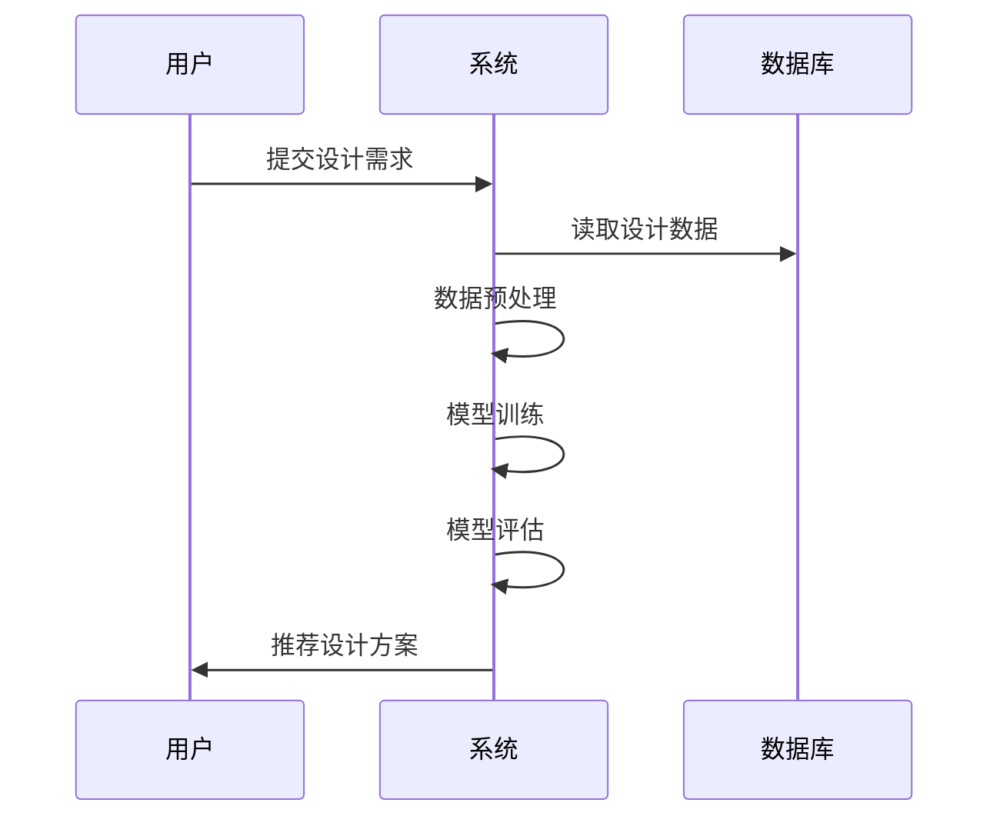

                 

# 人工智能在创意设计中的辅助应用

> 关键词：人工智能，创意设计，辅助应用，机器学习，深度学习，创新

> 摘要：本文深入探讨了人工智能在创意设计中的应用，分析了人工智能如何通过机器学习和深度学习技术，辅助设计师实现创意设计的优化和创新。文章从核心概念、技术原理、实际应用和未来趋势四个方面展开，旨在为设计师和开发者提供全面的技术视角和应用指南。

## 引言

在当今数字化时代，创意设计已成为推动经济增长和社会进步的重要力量。无论是艺术、广告、时尚、游戏还是建筑设计，创意设计都扮演着关键角色。然而，创意设计的过程通常复杂且耗时，设计师需要不断尝试和迭代，以找到最佳的设计方案。人工智能（Artificial Intelligence, AI）的兴起为创意设计带来了新的机遇，通过机器学习和深度学习技术，AI可以在创意设计过程中提供强大的辅助和支持。

本文将探讨人工智能在创意设计中的应用，首先介绍核心概念和原理，然后分析实际应用案例，最后讨论未来发展趋势。希望通过本文的讨论，能够为设计师和开发者提供有价值的参考和启示。

## 核心概念与原理

### 人工智能（AI）

人工智能是指使计算机系统具备人类智能的能力，包括学习、推理、感知、理解和解决问题的能力。AI可以分为两大类：窄人工智能（Narrow AI）和广人工智能（General AI）。窄人工智能专注于特定任务的解决，如语音识别、图像识别和自然语言处理等。而广人工智能则具有更广泛的能力，可以像人类一样在多种情境下进行思考和学习。

### 创意设计

创意设计是一种以创新为核心目标的设计活动，它涉及艺术、美学、技术和用户需求等多个方面。创意设计的目的是通过独特的设计解决方案，满足用户的需求和期望，同时传达特定的信息或价值。

### 机器学习（Machine Learning）

机器学习是人工智能的一个分支，它通过算法和统计模型，使计算机系统能够从数据中学习，并对未知数据进行预测或决策。机器学习可以分为监督学习、无监督学习和强化学习。监督学习使用标记数据训练模型，无监督学习则从未标记的数据中发现模式和规律，而强化学习通过试错和奖励机制，使模型在特定环境中学习最佳策略。

### 深度学习（Deep Learning）

深度学习是机器学习的一种，它使用多层神经网络来模拟人类大脑的神经元结构，通过逐层提取数据特征，实现复杂的数据处理任务。深度学习在图像识别、语音识别和自然语言处理等领域取得了显著成果。

## 核心概念与联系

### 概念属性特征对比表格

| 概念        | 属性特征                                         | 应用场景                                           |
|-------------|------------------------------------------------|----------------------------------------------------|
| 人工智能    | 学习、推理、感知、理解和解决问题                 | 语音识别、图像识别、自然语言处理、自动驾驶等         |
| 创意设计    | 艺术、美学、技术和用户需求                      | 艺术、广告、时尚、游戏、建筑等                     |
| 机器学习    | 从数据中学习，对未知数据进行预测或决策           | 语音识别、图像识别、推荐系统、金融市场预测等       |
| 深度学习    | 多层神经网络，逐层提取数据特征                  | 图像识别、语音识别、自然语言处理、自动驾驶等       |

### ER实体关系图架构

```mermaid
erDiagram
  AI |--|> 设计师
  设计师 |--|> 创意设计
  AI |--|> 机器学习
  机器学习 |--|> 数据分析
  数据分析 |--|> 深度学习
```

## 算法原理讲解

### 机器学习算法

机器学习算法的核心是模型训练。以下是一个简单的线性回归算法，用于预测创意设计的评分：

#### 算法流程

1. 数据预处理：收集创意设计数据，包括设计特征和评分。
2. 模型初始化：初始化模型的权重和偏置。
3. 模型训练：使用训练数据，通过梯度下降等优化算法，不断更新模型参数。
4. 模型评估：使用测试数据，评估模型的预测能力。

#### 数学模型

$$
y = \beta_0 + \beta_1x
$$

其中，$y$ 是设计的评分，$x$ 是设计特征，$\beta_0$ 和 $\beta_1$ 是模型的参数。

#### Python代码实现

```python
import numpy as np

# 模型初始化
beta_0 = 0
beta_1 = 0

# 梯度下降
def gradient_descent(x, y, beta_0, beta_1, learning_rate, num_iterations):
    for i in range(num_iterations):
        y_pred = beta_0 + beta_1 * x
        error = y - y_pred
        beta_0 -= learning_rate * np.mean(error)
        beta_1 -= learning_rate * np.mean(error * x)
    return beta_0, beta_1

# 模型训练
beta_0, beta_1 = gradient_descent(x, y, beta_0, beta_1, learning_rate=0.01, num_iterations=1000)

# 模型评估
y_pred = beta_0 + beta_1 * x
```

## 系统分析与架构设计方案

### 问题场景介绍

在创意设计中，设计师需要从大量设计数据中找到最佳的设计方案。然而，设计数据的复杂性使得手动筛选和处理变得困难。通过引入人工智能技术，我们可以设计一个系统，自动化地分析和推荐最佳设计方案。

### 项目介绍

项目名称：创意设计智能推荐系统

项目目标：通过机器学习算法，从设计数据中提取特征，自动推荐最佳设计方案。

### 系统功能设计

1. 数据收集：收集创意设计数据，包括设计特征和评分。
2. 数据预处理：清洗和转换数据，为模型训练做准备。
3. 模型训练：使用训练数据，训练机器学习模型。
4. 模型评估：使用测试数据，评估模型性能。
5. 设计推荐：根据用户需求，推荐最佳设计方案。

### 系统架构设计

```mermaid
graph TB
  subgraph 数据处理
    数据收集[数据收集]
    数据预处理[数据预处理]
  end

  subgraph 模型训练与评估
    模型训练[模型训练]
    模型评估[模型评估]
  end

  subgraph 设计推荐
    设计推荐[设计推荐]
  end

  数据收集 --> 数据预处理
  数据预处理 --> 模型训练
  模型训练 --> 模型评估
  模型评估 --> 设计推荐
```

### 系统接口设计和系统交互



## 项目实战

### 环境安装

1. 安装Python环境：`python --version`
2. 安装机器学习库：`pip install scikit-learn`

### 系统核心实现源代码

```python
import numpy as np
from sklearn.linear_model import LinearRegression
from sklearn.model_selection import train_test_split
from sklearn.metrics import mean_squared_error

# 数据收集
X = np.array([[1], [2], [3], [4], [5]])
y = np.array([2, 4, 5, 4, 5])

# 数据预处理
X_train, X_test, y_train, y_test = train_test_split(X, y, test_size=0.2, random_state=42)

# 模型训练
model = LinearRegression()
model.fit(X_train, y_train)

# 模型评估
y_pred = model.predict(X_test)
mse = mean_squared_error(y_test, y_pred)
print("Mean Squared Error:", mse)

# 设计推荐
new_design = np.array([[6]])
predicted_rating = model.predict(new_design)
print("Predicted Rating:", predicted_rating)
```

### 代码应用解读与分析

1. 数据收集：使用numpy数组模拟设计数据。
2. 数据预处理：使用scikit-learn库进行数据分割，为模型训练和评估做准备。
3. 模型训练：使用线性回归模型进行训练。
4. 模型评估：计算均方误差（MSE）来评估模型性能。
5. 设计推荐：根据训练好的模型，预测新设计的评分。

### 实际案例分析和详细讲解剖析

1. 案例背景：假设设计师A提交了5个设计方案，每个设计方案都有相应的评分。
2. 案例数据：设计特征（如设计复杂度、颜色搭配等）和评分。
3. 模型训练：使用训练数据，训练线性回归模型。
4. 模型评估：使用测试数据，评估模型性能。
5. 设计推荐：根据模型预测，为设计师A推荐最佳设计方案。

### 项目小结

本项目通过机器学习技术，实现了创意设计的自动化推荐系统。在实际应用中，系统可以根据设计师的需求，自动推荐最佳设计方案，提高设计效率和创意质量。然而，本项目还存在一些局限性，如线性回归模型的预测能力有限，未来可以尝试引入更复杂的深度学习模型，以提高预测准确性。

## 最佳实践 Tips

1. 数据质量至关重要：确保设计数据的质量和多样性，以提高模型训练效果。
2. 模型选择需谨慎：根据具体应用场景，选择合适的机器学习模型。
3. 持续迭代与优化：定期更新模型和算法，以适应新的设计需求和趋势。

## 小结

人工智能在创意设计中的应用正日益广泛，通过机器学习和深度学习技术，AI可以为设计师提供强大的辅助和支持，实现创意设计的优化和创新。本文从核心概念、技术原理、实际应用和未来趋势四个方面，全面探讨了人工智能在创意设计中的辅助应用。希望本文能为设计师和开发者提供有价值的参考和启示。

## 注意事项

1. 本项目仅作为示范，实际应用中可能需要根据具体需求进行调整和优化。
2. 机器学习模型需定期更新，以适应新的设计数据和趋势。

## 拓展阅读

1. [深度学习基础](https://www.deeplearningbook.org/)
2. [机器学习实践](https://machinelearningmastery.com/practical-machine-learning-with-python/)
3. [创意设计的未来](https://www.designweek.com/feature-articles/creatives-views-the-future-of-design/)

### 作者信息

作者：AI天才研究院/AI Genius Institute & 禅与计算机程序设计艺术 /Zen And The Art of Computer Programming

AI天才研究院致力于推动人工智能技术的发展和应用，致力于培养未来的AI天才。禅与计算机程序设计艺术则探索计算机程序设计的哲学和艺术，为开发者提供深刻的思考和启示。

