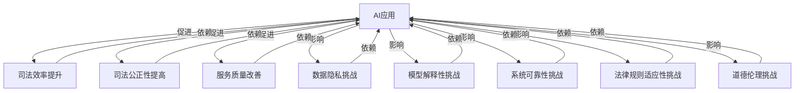

                 

### 引言：人工智能在司法系统中的应用

随着人工智能（AI）技术的飞速发展，其应用领域不断扩展，涵盖了医疗、金融、教育等多个行业。而司法系统作为国家治理的重要组成部分，也面临着越来越复杂的法律案件和庞大的案件处理需求。人工智能在司法系统中的应用，无疑为传统司法模式带来了深刻的变革。

#### **问题背景：**

首先，让我们思考一下司法系统的现状。司法系统涉及的法律案件数量庞大，司法人员的数量有限，导致案件处理效率低下，审判质量参差不齐。此外，随着社会经济的快速发展，司法系统的任务变得更加繁重，对司法公正性和效率的要求也越来越高。在这样的背景下，人工智能技术的引入成为必然选择。

#### **问题描述：**

人工智能在司法系统中的应用，主要集中在法律研究、案件分析和司法审判等方面。然而，人工智能技术的引入也带来了一系列挑战，包括技术、法律和道德等方面。例如，如何保证人工智能系统的解释性，使其能够为人类所理解？如何确保人工智能系统在处理案件时不会侵犯个人隐私？这些问题都需要我们深入思考和探讨。

#### **问题解决：**

为了解决这些问题，我们需要从多个方面入手。首先，在技术层面，我们需要不断优化人工智能算法，提高其处理案件的能力和效率。其次，在法律层面，我们需要制定相应的法律法规，规范人工智能在司法系统中的应用。最后，在道德层面，我们需要加强对人工智能系统的伦理审查，确保其在司法系统中的应用不会对个人和社会造成负面影响。

#### **边界与外延：**

本文主要讨论人工智能在司法系统中的应用和挑战，包括法律研究、案件分析和司法审判等方面。同时，我们也会探讨人工智能在司法系统中的应用现状，以及面临的挑战和解决方案。

#### **核心概念与联系：**

在讨论人工智能在司法系统中的应用时，我们需要关注以下几个核心概念：

1. **人工智能（AI）**：一种模拟人类智能的技术，包括机器学习、深度学习、自然语言处理等。
2. **法律研究**：利用人工智能技术对大量法律文献和案例进行文本挖掘和分析，为司法工作提供支持。
3. **案件分析**：通过人工智能技术对案件数据进行分析和建模，为案件处理提供科学依据。
4. **司法审判**：人工智能在司法审判过程中的应用，包括案件审理、判决书生成等。

这些概念相互联系，共同构成了人工智能在司法系统中的应用场景。

#### **概念结构与核心要素组成：**

为了更好地理解人工智能在司法系统中的应用，我们可以将其分为以下几个核心要素：

1. **技术要素**：包括人工智能算法、数据集、计算资源等。
2. **法律要素**：包括法律法规、伦理准则、人工智能系统的合法性等。
3. **道德要素**：包括人工智能系统的公正性、透明性、伦理责任等。
4. **应用场景**：包括法律研究、案件分析、司法审判等。

这些要素相互作用，共同推动人工智能在司法系统中的应用和发展。

### **本文结构：**

本文将从以下几个方面进行讨论：

1. **第1章：问题背景与司法系统的现状**：介绍人工智能在司法系统中的应用背景和司法系统的现状。
2. **第2章：人工智能在司法系统中的应用**：详细探讨人工智能在法律研究、案件分析和司法审判中的应用。
3. **第3章：人工智能在司法系统中的挑战**：分析人工智能在司法系统应用中面临的技术、法律和道德挑战。
4. **第4章：人工智能在司法系统中的案例分析**：通过具体案例分析，展示人工智能在司法系统中的应用效果。
5. **第5章：人工智能在司法系统中的应用与挑战的关系分析**：分析人工智能在司法系统中的应用与挑战之间的关系。
6. **第6章：未来展望**：展望人工智能在司法系统中的应用前景，探讨技术、法律和道德的发展趋势。
7. **第7章：结论与建议**：总结本文的主要观点，提出相应的政策建议和学术研究展望。

### **核心概念与联系表格：**

| 核心概念       | 定义                                                         | 相关联系                                                     |
|----------------|------------------------------------------------------------|------------------------------------------------------------|
| 人工智能（AI）  | 模拟人类智能的技术，包括机器学习、深度学习等。               | 人工智能是司法系统应用的基础技术。                          |
| 法律研究       | 利用人工智能技术对大量法律文献和案例进行文本挖掘和分析。   | 法律研究为司法系统提供法律依据和支持。                      |
| 案件分析       | 通过人工智能技术对案件数据进行分析和建模。                  | 案件分析为案件处理提供科学依据。                            |
| 司法审判       | 人工智能在司法审判过程中的应用，包括案件审理、判决书生成等。| 司法审判是人工智能在司法系统中的重要应用场景。              |

### **ER实体关系图架构：**

```mermaid
erDiagram
  AI技术 -->|使用| 法律研究
  法律研究 -->|提供| 司法审判
  案件分析 -->|提供| 司法审判
  AI技术 -->|提供| 案件分析
```

通过以上分析，我们可以看到人工智能在司法系统中的应用具有广泛的前景，但也面临着诸多挑战。接下来，我们将进一步探讨人工智能在司法系统中的应用现状，以及如何应对这些挑战。在接下来的章节中，我们将详细分析人工智能在司法系统中的应用场景，包括法律研究、案件分析和司法审判等方面。我们将通过具体案例，展示人工智能在司法系统中的应用效果，并深入探讨其面临的挑战和解决方案。

### 第1章：问题背景与司法系统的现状

#### 1.1 问题背景

人工智能（AI）作为一种新兴技术，近年来在各个领域取得了显著的成果。随着计算能力的提升、大数据的积累和算法的优化，人工智能在各个领域的应用越来越广泛，包括医疗、金融、教育、交通等。司法系统作为国家治理的重要组成部分，也面临着日益复杂的社会问题和庞大的案件处理需求。在这种背景下，人工智能在司法系统中的应用成为了一个热门话题。

首先，人工智能在司法系统中的应用背景主要源于以下几个方面的需求：

1. **提高司法效率**：司法系统处理的案件数量庞大，而司法人员数量有限，导致案件处理效率低下。人工智能可以通过自动化处理大量案件，提高司法效率。

2. **促进司法公正**：人工智能在处理案件时，可以基于大量数据和算法，减少人为因素的干扰，提高司法公正性。

3. **改善司法服务质量**：人工智能可以通过智能问答、法律咨询等应用，为公众提供更高质量的法律服务。

其次，人工智能技术的发展也为司法系统的应用提供了技术支持。近年来，人工智能技术在机器学习、深度学习、自然语言处理等领域取得了重大突破，这些技术的应用可以大大提高司法系统的数据处理能力和智能水平。

#### 1.2 司法系统的现状

司法系统是一个复杂的系统，其运作流程包括案件受理、审理、判决、执行等多个环节。以下是司法系统的现状：

1. **案件处理效率低下**：由于司法系统的人员和资源有限，案件处理效率低下，导致案件积压严重，影响司法公正和效率。

2. **司法资源分配不均**：我国司法资源分配不均，一些经济发达地区司法资源丰富，而一些经济欠发达地区司法资源匮乏，导致司法服务不公平。

3. **司法人员的专业素质**：司法人员的专业素质参差不齐，一些司法人员缺乏法律专业知识，影响案件审理质量。

4. **司法透明度不高**：司法系统的运作缺乏透明度，公众对司法过程和结果不了解，影响司法公信力。

5. **法律文献和数据管理**：大量法律文献和案件数据需要整理和管理，但目前司法系统的数据管理手段相对落后，难以满足大数据时代的需求。

#### 1.3 人工智能对司法系统的影响

人工智能在司法系统的应用具有巨大的潜力，可以从以下几个方面提高司法系统的效率、公正和服务质量：

1. **提高司法效率**：人工智能可以通过自动化处理大量案件，减少司法人员的工作负担，提高案件处理效率。

2. **促进司法公正**：人工智能可以通过数据分析和算法优化，减少人为因素的干扰，提高司法公正性。

3. **改善司法服务质量**：人工智能可以通过智能问答、法律咨询等应用，为公众提供更高质量的法律服务。

4. **优化法律文献和数据管理**：人工智能可以通过自然语言处理技术，对大量法律文献和案件数据进行分析和整理，提高法律文献和数据的可利用性。

5. **提升司法透明度**：人工智能可以通过数据分析和可视化技术，提高司法过程的透明度，增强司法公信力。

总之，人工智能在司法系统的应用具有广泛的前景，但同时也面临着一系列挑战。在接下来的章节中，我们将深入探讨人工智能在司法系统中的应用，以及面临的技术、法律和道德挑战。通过具体的案例分析，我们将展示人工智能在司法系统中的应用效果，并探讨如何克服这些挑战，实现人工智能在司法系统中的广泛应用。

### 1.2 司法系统的现状

#### 1.2.1 司法系统的运作流程

司法系统的运作流程主要包括案件受理、审理、判决和执行等环节。以下是对每个环节的详细描述：

1. **案件受理**：案件受理是司法系统运作的起点。当公民或单位遇到纠纷时，可以选择向法院提起诉讼。法院会根据案件性质和管辖权，决定是否受理该案件。案件受理后，法院会向当事人发出立案通知书，并开始进行立案审查。

2. **审理**：案件受理后，进入审理阶段。审理分为开庭审理和书面审理两种形式。开庭审理是指在法庭上公开审理案件，法官会根据当事人的陈述、证据和辩论，作出裁判。书面审理是指案件通过书面形式审理，法官会根据当事人提交的证据和材料，作出判决。

3. **判决**：判决是司法系统运作的重要环节。法官在审理过程中，会根据案件事实和法律依据，作出判决。判决可以是民事判决、刑事判决或行政判决。判决书是司法判决的正式文件，具有法律效力。

4. **执行**：判决作出后，进入执行阶段。执行是指将判决结果付诸实施，包括财产执行、强制执行等。法院会根据判决书，执行当事人的权利和义务。如果一方当事人不履行判决，法院可以采取强制措施，确保判决的执行。

#### 1.2.2 司法系统的挑战

司法系统在运作过程中面临着诸多挑战，这些挑战对司法效率、公正和服务质量产生了不利影响。以下是一些主要的挑战：

1. **案件积压**：由于司法系统的人员和资源有限，导致案件积压严重。一些法院的案件处理周期长达数月甚至数年，影响了司法效率。

2. **司法资源分配不均**：我国司法资源分配不均，一些经济发达地区的司法资源丰富，而一些经济欠发达地区的司法资源匮乏。这导致司法服务不公平，影响了司法公信力。

3. **司法人员的专业素质**：司法人员的专业素质参差不齐，一些司法人员缺乏法律专业知识，影响了案件审理质量。此外，司法人员的工作压力大，导致一些司法人员出现职业倦怠。

4. **司法透明度不高**：司法系统的运作缺乏透明度，公众对司法过程和结果不了解，影响了司法公信力。一些司法程序和决策过程不公开，导致公众对司法系统的不信任。

5. **法律文献和数据管理**：大量法律文献和案件数据需要整理和管理，但目前司法系统的数据管理手段相对落后，难以满足大数据时代的需求。数据管理不善，可能导致信息泄露、数据丢失等问题。

#### 1.2.3 司法系统对人工智能的需求

面对上述挑战，司法系统对人工智能的需求日益迫切。人工智能在司法系统中的应用，可以从以下几个方面提高司法效率、公正和服务质量：

1. **提高案件处理效率**：人工智能可以通过自动化处理大量案件，减少司法人员的工作负担，提高案件处理效率。

2. **促进司法公正**：人工智能可以通过数据分析和算法优化，减少人为因素的干扰，提高司法公正性。例如，通过自然语言处理技术，对大量法律文献和案例进行分析，为法官提供参考依据。

3. **改善司法服务质量**：人工智能可以通过智能问答、法律咨询等应用，为公众提供更高质量的法律服务。例如，通过智能客服系统，解答公众的法律疑问，提供在线法律咨询。

4. **优化法律文献和数据管理**：人工智能可以通过自然语言处理技术和大数据分析，对大量法律文献和案件数据进行分析和整理，提高法律文献和数据的可利用性。

5. **提升司法透明度**：人工智能可以通过数据分析和可视化技术，提高司法过程的透明度，增强司法公信力。例如，通过大数据分析，展示司法系统的运行情况，让公众了解司法过程。

总之，人工智能在司法系统中的应用具有广泛的前景，可以解决司法系统面临的诸多挑战。在接下来的章节中，我们将进一步探讨人工智能在司法系统中的应用场景和具体应用效果。通过具体的案例分析，我们将展示人工智能如何改变司法系统，提高司法效率、公正和服务质量。

### 1.3 人工智能对司法系统的影响

人工智能（AI）的引入为司法系统带来了显著的变革，不仅提高了司法效率，还促进了司法公正和改善了司法服务质量。以下是人工智能在司法系统中的具体影响：

#### 1.3.1 提高司法效率

首先，人工智能通过自动化和智能化技术，显著提高了司法效率。在案件处理过程中，AI可以自动完成许多繁琐的任务，例如案件数据的收集、整理和归档。通过自然语言处理（NLP）技术，AI能够快速解析和理解法律文件，提取关键信息，为法官提供决策支持。

**案例：** 某国法院引入了AI辅助系统，用于自动整理和分类法律文件。该系统可以处理大量法律文件，并将相关信息自动归档，大大减轻了法官的工作负担，提高了案件处理的效率。

**算法原理讲解：** 自然语言处理技术是AI在司法系统中的一个重要应用。NLP技术通过训练模型，可以自动识别和解析法律文件中的关键词、句子和段落。以下是一个简单的NLP流程图：


在这个流程中，AI首先对法律文件进行文本解析，然后提取关键词和实体，最后将这些信息存储到法律知识库中，以供法官参考。

#### 1.3.2 促进司法公正

其次，人工智能通过数据分析和技术优化，有助于促进司法公正。AI可以处理大量的案件数据，发现潜在的规律和趋势，为法官提供公正的决策依据。此外，AI系统的公正性不受人为因素干扰，有助于减少司法偏见和腐败现象。

**案例：** 某地法院引入了AI辅助判决系统，该系统能够分析大量的案例数据和法律条文，为法官提供判决参考。通过这种方式，法院的判决更加客观和公正，减少了人为因素的影响。

**数学公式：** 在这个过程中，可以使用统计学和概率论中的公式来分析案件数据和判决结果。例如，通过贝叶斯公式，可以计算某一判决结果的概率：

$$
P(A|B) = \frac{P(B|A) \cdot P(A)}{P(B)}
$$

其中，\(P(A|B)\) 表示在条件 \(B\) 下 \(A\) 发生的概率，\(P(B|A)\) 表示在 \(A\) 发生的条件下 \(B\) 发生的概率，\(P(A)\) 和 \(P(B)\) 分别表示 \(A\) 和 \(B\) 发生的概率。

#### 1.3.3 改善司法服务质量

最后，人工智能通过智能问答、法律咨询和在线服务，显著改善了司法服务质量。AI可以提供24小时在线的法律咨询服务，解答公众的法律疑问，提供法律咨询。此外，AI还可以通过智能客服系统，处理大量的法律咨询请求，提高司法服务的响应速度和满意度。

**案例：** 某律师事务所引入了AI法律咨询服务，用户可以通过该平台在线咨询法律问题。AI系统能够快速响应，提供专业、准确的法律意见，大大提高了用户体验和满意度。

**算法原理讲解：** 智能问答系统是AI在法律咨询中的一个重要应用。该系统通过训练大规模的语言模型，可以理解用户的提问，并提供合适的答案。以下是一个简单的智能问答流程：


在这个流程中，AI首先识别用户的意图，然后从知识库中查找相关答案，最后生成并输出答案。

通过以上分析，我们可以看到人工智能在司法系统中的应用，不仅提高了司法效率，促进了司法公正，还改善了司法服务质量。人工智能技术的引入，为司法系统带来了深刻的变革，使司法工作更加高效、公正和透明。在接下来的章节中，我们将进一步探讨人工智能在司法系统中的应用场景和具体应用效果，以及面临的技术、法律和道德挑战。

### 2.1 人工智能在法律研究中的应用

在司法系统中，法律研究是一个关键环节，它涉及到对大量法律文献、案例和法规的分析与理解。人工智能（AI）的引入，为法律研究提供了强大的工具，使得法律文献的整理、信息提取和案例分析变得更加高效和准确。以下是AI在法律研究中的应用及其详细解释。

#### 2.1.1 文本挖掘与信息提取

文本挖掘是指从大量文本数据中提取有用信息的技术。在法律研究中，文本挖掘可以用于检索和整理法律文献，提取案件的关键信息。AI通过自然语言处理（NLP）技术，可以自动分析和理解法律文本，提取其中的关键词、概念和关系。

**算法原理讲解：** 文本挖掘通常包括以下步骤：

1. **文本预处理**：对原始文本进行清洗、分词、去除停用词等处理，以便于后续分析。
2. **词频统计**：统计文本中各个词的出现频率，用于文本分析。
3. **实体识别**：识别文本中的法律实体，如法律条款、当事人、法律事件等。
4. **关系抽取**：分析文本中的实体关系，如因果关系、归属关系等。
5. **情感分析**：对文本进行情感分析，判断文本的情感倾向。

以下是一个文本挖掘的Mermaid流程图：


**数学公式：** 在文本挖掘中，常用的数学工具包括词频统计和文本分类。词频统计可以通过简单计数实现，而文本分类则可以使用支持向量机（SVM）等算法。例如，对于文本分类问题，可以使用以下公式：

$$
P(\text{label}|x) = \frac{e^{w \cdot x}}{\sum_{j=1}^{k} e^{w_j \cdot x}}
$$

其中，\(w\) 表示权重向量，\(x\) 表示文本特征向量，\(k\) 表示类别数。

#### 2.1.2 法律文献整理与分类

法律文献的整理与分类是法律研究的重要任务，AI可以通过机器学习和深度学习技术，自动对法律文献进行分类和整理，提高文献管理的效率。

**算法原理讲解：** 法律文献分类通常包括以下步骤：

1. **特征提取**：从法律文献中提取关键特征，如关键词、句子等。
2. **模型训练**：使用已标注的数据集训练分类模型，如决策树、支持向量机等。
3. **分类预测**：将新法律文献输入到训练好的模型中，进行分类预测。

以下是一个法律文献分类的Mermaid流程图：


**数学公式：** 在法律文献分类中，可以使用逻辑回归模型进行分类预测。逻辑回归模型的预测公式如下：

$$
\hat{y} = \sigma(w \cdot x + b)
$$

其中，\(\sigma\) 表示sigmoid函数，\(w\) 表示权重向量，\(x\) 表示特征向量，\(b\) 表示偏置项。

#### 2.1.3 案例分析与法律预测

AI还可以用于案例分析和法律预测，通过对历史案例的分析，预测未来案件的判决结果。

**算法原理讲解：** 案例分析通常包括以下步骤：

1. **数据收集**：收集相关案例数据，包括案件事实、法律条文、判决结果等。
2. **特征提取**：从案例数据中提取关键特征，如案件类型、证据情况等。
3. **模型训练**：使用已标注的数据集训练预测模型，如决策树、随机森林等。
4. **预测结果**：将新案件数据输入到训练好的模型中，预测判决结果。

以下是一个案例分析的Mermaid流程图：


**数学公式：** 在案例分析中，可以使用决策树算法进行预测。决策树的分裂公式如下：

$$
Gini(\text{split}) = 1 - \frac{1}{k} \sum_{i=1}^{k} p_i^2
$$

其中，\(k\) 表示类别数，\(p_i\) 表示第 \(i\) 个类别的概率。

通过上述分析，我们可以看到，人工智能在法律研究中的应用，极大地提高了法律文献的整理、信息提取和案例分析的效率。AI技术的引入，使得司法系统能够更加高效、准确地处理法律研究任务，为司法工作提供了强有力的技术支持。在接下来的章节中，我们将继续探讨人工智能在案件分析、司法审判等方面的应用，以及面临的挑战和解决方案。

### 2.2 人工智能在案件分析中的应用

在司法系统中，案件分析是一个关键的环节，它涉及到对案件数据、证据和案情进行深入分析和推理，以帮助法官作出准确的判断。人工智能（AI）的引入，使得案件分析变得更加高效和精准。以下是AI在案件分析中的应用及其详细解释。

#### 2.2.1 案件数据的收集与处理

案件数据的收集与处理是案件分析的基础。AI可以通过自然语言处理（NLP）技术、数据挖掘和机器学习算法，对大量案件数据进行自动收集、处理和整理。

**算法原理讲解：** 案件数据的收集与处理通常包括以下步骤：

1. **数据收集**：从法院、公安机关等机构获取案件数据，包括案件报告、证据材料、法律文书等。
2. **数据清洗**：对收集到的数据进行清洗，去除重复、错误和不完整的数据。
3. **数据整合**：将不同来源的数据进行整合，形成统一的数据集。
4. **数据特征提取**：从数据中提取关键特征，如当事人信息、案件类型、证据情况等。

以下是一个案件数据收集与处理的Mermaid流程图：


**数学公式：** 在数据特征提取中，可以使用主成分分析（PCA）等方法进行特征选择和降维。PCA的数学公式如下：

$$
\text{PC}_i = \frac{1}{\sqrt{\sum_{j=1}^{n} w_{ij}^2}} \sum_{j=1}^{n} w_{ij} x_j
$$

其中，\(w_{ij}\) 表示特征权重，\(x_j\) 表示特征值，\(\text{PC}_i\) 表示第 \(i\) 个主成分。

#### 2.2.2 案件特征的提取与建模

案件特征的提取与建模是案件分析的核心。AI可以通过机器学习算法，对案件特征进行建模，识别案件的关键特征和规律。

**算法原理讲解：** 案件特征提取与建模通常包括以下步骤：

1. **特征选择**：从大量特征中选出对案件分析最重要的特征。
2. **特征建模**：使用机器学习算法，如决策树、支持向量机（SVM）、神经网络等，对案件特征进行建模。
3. **模型训练**：使用已标注的数据集训练模型，使其能够对新的案件数据进行分类或预测。

以下是一个案件特征提取与建模的Mermaid流程图：


**数学公式：** 在特征建模中，可以使用支持向量机（SVM）进行分类。SVM的决策边界公式如下：

$$
\text{分类边界} = \sum_{i=1}^{n} \alpha_i y_i (w \cdot x_i + b) = 0
$$

其中，\(\alpha_i\) 是拉格朗日乘子，\(y_i\) 是样本标签，\(w\) 是权重向量，\(b\) 是偏置项。

#### 2.2.3 案件的推理与预测

基于案件特征的建模，AI可以对新的案件数据进行推理和预测，帮助法官作出决策。例如，可以预测案件的判决结果、犯罪嫌疑人是否有罪等。

**算法原理讲解：** 案件的推理与预测通常包括以下步骤：

1. **特征提取**：从新的案件数据中提取关键特征。
2. **模型应用**：将提取的特征输入到已训练好的模型中，进行推理和预测。
3. **结果解释**：对预测结果进行解释和验证，确保预测的准确性。

以下是一个案件推理与预测的Mermaid流程图：


**数学公式：** 在案件推理与预测中，可以使用逻辑回归模型进行概率预测。逻辑回归的预测公式如下：

$$
\hat{P}(y=1) = \sigma(w \cdot x + b)
$$

其中，\(\sigma\) 是sigmoid函数，\(w\) 是权重向量，\(x\) 是特征向量，\(b\) 是偏置项。

通过上述分析，我们可以看到，人工智能在案件分析中的应用，极大地提高了案件处理的效率和准确性。AI技术不仅能够自动处理大量案件数据，还能够通过建模和推理，提供科学依据，帮助法官作出更准确的决策。在接下来的章节中，我们将继续探讨人工智能在司法审判中的应用，以及面临的挑战和解决方案。

### 2.3 人工智能在司法审判中的应用

人工智能（AI）在司法审判中的应用正日益成为提高司法效率和公正性的重要手段。以下是AI在司法审判中的具体应用场景及其详细解释。

#### 2.3.1 审判流程的自动化

审判流程的自动化是AI在司法审判中的第一个重要应用。通过自动化技术，可以减少法官和司法人员的工作量，提高审判效率。

**算法原理讲解：** 审判流程自动化包括以下几个步骤：

1. **自动化立案**：AI系统可以根据案件类型和当事人的信息，自动完成立案手续。
2. **自动化文件处理**：AI可以自动处理案件文件，包括法律文书、证据材料等，确保文件管理的准确性和及时性。
3. **自动化庭审记录**：AI可以实时记录庭审过程，自动生成庭审记录，减少人工记录的工作量。

以下是一个审判流程自动化的Mermaid流程图：


**数学公式：** 在自动化立案和文件处理中，可以使用规则引擎进行自动化处理。规则引擎的公式如下：

$$
\text{条件} \rightarrow \text{结果}
$$

例如，如果案件类型为“离婚”，则自动生成离婚案件的法律文书。

#### 2.3.2 判决书的自动生成

判决书的自动生成是AI在司法审判中的另一个重要应用。通过自然语言处理（NLP）技术和文本生成模型，AI可以自动生成判决书，确保判决书的格式和内容符合法律规定。

**算法原理讲解：** 判决书自动生成包括以下几个步骤：

1. **案件数据分析**：AI系统对案件数据进行分析，提取案件事实、证据和法律规定。
2. **法律知识库查询**：AI系统查询法律知识库，获取与案件相关的法律条文和案例。
3. **文本生成**：AI系统使用文本生成模型，如序列到序列（Seq2Seq）模型，根据案件数据和法律知识库生成判决书。

以下是一个判决书自动生成的Mermaid流程图：


**数学公式：** 在文本生成中，可以使用序列到序列（Seq2Seq）模型的公式如下：

$$
y = \text{Encoder}(x) \rightarrow \text{Decoder}(y)
$$

其中，\(x\) 是输入序列，\(y\) 是输出序列。

#### 2.3.3 案件的智能辅助审理

智能辅助审理是AI在司法审判中的高级应用，通过智能分析系统，辅助法官审理案件，提高判决的准确性和公正性。

**算法原理讲解：** 智能辅助审理包括以下几个步骤：

1. **数据分析和预测**：AI系统对案件数据进行分析，预测案件的判决结果和证据的效力。
2. **法律意见提供**：AI系统根据分析结果，为法官提供法律意见和参考。
3. **辅助决策**：AI系统在法官作出决策时，提供智能辅助，确保决策的合理性和公正性。

以下是一个智能辅助审理的Mermaid流程图：


**数学公式：** 在数据分析中，可以使用决策树算法进行预测。决策树的公式如下：

$$
\text{条件} \rightarrow \text{结果}
$$

例如，根据证据的数量和质量，预测案件的判决结果。

通过以上分析，我们可以看到，人工智能在司法审判中的应用，不仅提高了审判效率，还增强了判决的准确性和公正性。在接下来的章节中，我们将探讨人工智能在司法系统中的应用挑战，以及如何应对这些挑战。

### 3.1 技术挑战

人工智能（AI）在司法系统中的应用虽然带来了巨大的变革和潜力，但也面临着诸多技术挑战。以下是对这些技术挑战的详细分析：

#### 3.1.1 数据的质量与隐私

首先，数据的质量和隐私是AI在司法系统中应用的一个重要技术挑战。司法系统中涉及的大量案件数据和证据信息，包括当事人的个人信息、案件事实、证据资料等，这些数据往往具有高度敏感性和隐私性。如果数据质量不佳或隐私保护不当，可能会导致以下几个问题：

1. **数据准确性问题**：不完整、不准确或过时的数据会导致AI系统在分析和预测时出现偏差，影响判决的准确性。
2. **隐私泄露风险**：在处理敏感数据时，如果没有采取有效的隐私保护措施，可能会导致个人隐私泄露，侵犯当事人的合法权益。
3. **数据透明度问题**：数据处理的透明度不够，公众难以了解AI系统的运作机制和数据使用情况，影响司法公信力。

**解决方案：** 为了解决这些问题，我们可以采取以下措施：

- **数据质量控制**：在数据收集和处理过程中，采取严格的数据质量控制措施，确保数据的准确性和完整性。例如，采用数据清洗技术，去除重复、错误和不完整的数据。
- **隐私保护**：在数据处理过程中，采取隐私保护技术，如数据加密、匿名化、差分隐私等，确保个人隐私不被泄露。
- **透明度提升**：建立数据透明度机制，通过公开数据使用政策、数据报告等方式，提高公众对AI系统的了解和信任。

#### 3.1.2 模型的解释性

其次，AI模型的解释性是一个重要技术挑战。司法系统中的判决需要具有高度的透明性和可解释性，以便法官、律师和当事人能够理解和信任AI系统。然而，许多复杂的AI模型，如深度学习模型，其内部工作机制往往难以解释，导致以下几个问题：

1. **黑盒问题**：深度学习模型被视为“黑盒”，其决策过程不透明，难以解释为何做出某一判决。
2. **信任问题**：由于模型的不透明性，法官、律师和当事人可能对AI系统的决策结果产生怀疑，影响判决的公信力。
3. **法律合规问题**：不透明的模型可能会导致法律合规问题，特别是在涉及隐私权和人权的情况下。

**解决方案：** 为了解决这些问题，我们可以采取以下措施：

- **可解释性增强**：开发可解释性更好的AI模型，如基于规则的模型、决策树等，这些模型可以提供清晰的决策路径和依据。
- **可视化技术**：使用可视化技术，如热力图、决策树可视化等，帮助用户理解AI模型的决策过程。
- **透明度提升**：建立模型透明度机制，通过公开模型训练数据、训练过程和决策结果，提高AI系统的透明度。

#### 3.1.3 系统的可靠性

最后，AI系统的可靠性是一个关键技术挑战。司法系统对AI系统的可靠性要求极高，因为任何错误或故障都可能导致严重的法律后果。以下是一些具体的问题：

1. **错误决策**：AI系统可能会因为算法错误、数据偏差等原因，做出错误的决策，影响司法公正。
2. **故障风险**：AI系统可能会因为硬件故障、软件错误等原因，导致系统无法正常运行，影响司法效率。
3. **稳定性问题**：AI系统在处理复杂、多变的法律问题时，可能无法保证稳定性和一致性。

**解决方案：** 为了解决这些问题，我们可以采取以下措施：

- **全面测试**：在系统开发和部署前，进行全面的测试和验证，确保系统的稳定性和准确性。
- **错误纠正机制**：建立错误纠正机制，如设置错误检测和纠正算法，确保在系统出现错误时能够及时纠正。
- **持续维护**：对AI系统进行持续的维护和更新，确保其能够适应不断变化的法律环境和需求。

通过以上分析，我们可以看到，AI在司法系统中应用的技术挑战是多方面的，涉及数据质量与隐私、模型解释性、系统可靠性等方面。解决这些挑战，需要从技术、法律和道德等多个层面入手，确保AI在司法系统中的应用能够真正提高司法效率、公正和服务质量。

### 3.2 法律挑战

人工智能（AI）在司法系统中的应用虽然具有巨大潜力，但同时也面临着一系列法律挑战。这些挑战主要集中在法律规则的适应性、人工智能的合法性以及法律责任归属等方面。以下是对这些法律挑战的详细分析。

#### 3.2.1 法律规则的适应性

司法系统的核心是法律规则，而AI系统的运作则需要依据这些法律规则。然而，法律规则通常是针对人类法官和律师制定的，具有明确的法律条文和解释。当这些规则被AI系统应用时，可能会面临以下问题：

1. **法律规则的不明确性**：许多法律规则在实际应用中具有不明确性，可能需要法官根据具体情况进行解释和适用。AI系统在处理这类规则时，可能会因为理解不准确而导致错误。
2. **法律规则的变化**：随着社会的发展和法律的完善，法律规则会不断更新和变化。AI系统需要及时适应这些变化，否则可能导致其应用的法律规则与现行法律不符。
3. **法律规则的复杂性**：司法系统中的法律规则复杂多样，涉及多个法律领域。AI系统需要具备处理这些复杂规则的能力，否则可能无法在司法系统中有效应用。

**解决方案：** 为了应对这些挑战，可以采取以下措施：

- **明确法律规则**：通过立法或司法解释，明确法律规则的具体含义和应用场景，减少不明确性。
- **法律规则库**：建立和完善法律规则库，确保AI系统能够根据最新法律规则进行操作。
- **AI系统适应性**：设计和开发能够适应法律规则变化的AI系统，使其能够灵活应对法律规则的变化。

#### 3.2.2 人工智能的合法性

AI系统在司法系统中的应用需要满足合法性要求。然而，现有法律体系对AI系统的合法性尚未有明确规定，可能导致以下问题：

1. **合法性缺失**：AI系统的合法性缺乏明确的法律依据，可能存在法律漏洞和争议。
2. **监管不足**：由于缺乏明确的法律监管，AI系统的应用可能存在不规范、不透明等问题，影响司法公正。
3. **责任归属不明确**：在AI系统发生错误或故障时，责任归属不明确，可能难以追究相关方的法律责任。

**解决方案：** 为了解决这些问题，可以采取以下措施：

- **立法明确**：通过立法明确AI系统在司法系统中的应用范围、权限和责任，为AI系统的合法性提供法律依据。
- **监管机制**：建立AI系统在司法系统中的应用监管机制，确保其合法、规范、透明。
- **责任明确**：明确AI系统在司法系统中的法律责任，确保在发生错误或故障时，能够依法追究相关方的责任。

#### 3.2.3 法律责任的归属

在AI系统应用于司法系统时，如何确定法律责任归属是一个重要挑战。以下是一些具体问题：

1. **责任主体不明确**：当AI系统出现错误或故障时，难以确定具体的责任主体，可能涉及开发者、运营商、使用者等多方。
2. **责任追究困难**：由于AI系统的复杂性和不透明性，追究法律责任可能面临技术障碍和法律难题。
3. **法律责任分配**：在确定责任归属时，如何合理分配各方责任，确保公平、公正，是一个重要问题。

**解决方案：** 为了解决这些问题，可以采取以下措施：

- **责任认定规则**：制定明确的责任认定规则，确定在AI系统出现错误或故障时，各方的责任范围和责任大小。
- **技术透明性**：提高AI系统的技术透明性，确保在发生问题时，能够追溯技术原因和责任主体。
- **法律责任分担**：在确定法律责任时，考虑各方的责任能力和过错程度，合理分担法律责任。

通过以上分析，我们可以看到，AI在司法系统中的应用面临着法律规则的适应性、人工智能的合法性以及法律责任归属等多方面的挑战。解决这些挑战，需要从法律、技术和社会等多个层面进行深入研究和探讨，确保AI在司法系统中的应用能够合法、规范、公正地进行。

### 3.3 道德挑战

人工智能（AI）在司法系统中的应用不仅面临技术挑战和法律挑战，还涉及一系列道德挑战。以下是对这些道德挑战的详细分析：

#### 3.3.1 人工智能的公平性

首先，人工智能的公平性是一个重要的道德挑战。司法系统的核心价值之一是公正，而人工智能在司法系统中的应用可能会带来以下问题：

1. **歧视问题**：如果AI系统在设计和训练过程中存在偏见，可能会导致对特定群体（如性别、种族、年龄等）的不公平待遇。例如，AI可能会对某些种族或性别的犯罪嫌疑人进行更严厉的处罚。
2. **公平性缺失**：AI系统可能会基于过去的数据和经验进行决策，而这些数据可能反映了社会中的不公平现象。如果AI系统未能有效识别和消除这些不公平，可能会导致司法不公。
3. **透明性不足**：AI系统的决策过程往往不透明，这使得公众难以监督和评估其决策的公平性。

**解决方案：** 为了解决这些问题，可以采取以下措施：

- **公平性评估**：在设计AI系统时，进行严格的公平性评估，确保系统不会对特定群体产生歧视性影响。
- **数据清洗**：在训练AI模型时，使用经过清洗和去偏见的数据，以减少数据中的不公平现象。
- **透明性提升**：通过提高AI系统的透明性，使公众能够了解和监督系统的决策过程，确保其公平性。

#### 3.3.2 人工智能的透明性

其次，人工智能的透明性是一个重要的道德挑战。司法系统的决策需要具有高度的透明性，以便各方能够理解和信任决策过程。然而，AI系统的复杂性使得其决策过程往往难以解释，可能导致以下问题：

1. **决策不透明**：AI系统的决策过程高度复杂，往往涉及多层神经网络和深度学习算法，使得其决策过程难以理解。
2. **信任危机**：由于决策过程不透明，公众可能对AI系统的决策结果产生不信任，影响司法公信力。
3. **法律责任不明**：在AI系统出现错误或故障时，由于决策过程不透明，难以确定责任归属。

**解决方案：** 为了解决这些问题，可以采取以下措施：

- **解释性增强**：开发可解释性更好的AI模型，如基于规则的模型、决策树等，使其决策过程更加透明。
- **可视化技术**：使用可视化技术，如热力图、决策树可视化等，帮助用户理解AI模型的决策过程。
- **透明度提升**：建立数据透明度机制，通过公开AI系统的训练数据、训练过程和决策结果，提高系统的透明度。

#### 3.3.3 人工智能的伦理责任

最后，人工智能的伦理责任是一个重要的道德挑战。在司法系统中，AI系统不仅需要遵守法律，还需要遵循伦理原则，确保其决策和行为符合社会道德标准。以下是一些具体问题：

1. **伦理审查缺失**：在AI系统设计和应用过程中，可能缺乏伦理审查机制，导致系统可能违反伦理原则。
2. **隐私侵犯**：AI系统在处理大量个人数据时，可能侵犯个人隐私权，影响个人权益。
3. **道德风险**：AI系统可能因为算法错误或设计缺陷，导致不道德的决策和行为，如错误地将无辜者定罪或释放罪犯。

**解决方案：** 为了解决这些问题，可以采取以下措施：

- **伦理审查机制**：在AI系统设计和应用前，进行严格的伦理审查，确保系统符合伦理标准。
- **隐私保护**：采取有效的隐私保护措施，如数据加密、匿名化等，确保个人隐私不被侵犯。
- **道德教育**：加强对AI系统开发者和使用者的道德教育，提高其伦理意识，确保AI系统的道德合法性。

通过以上分析，我们可以看到，人工智能在司法系统中的应用面临着公平性、透明性和伦理责任等多方面的道德挑战。解决这些挑战，需要从伦理、技术和社会等多个层面进行深入研究和探讨，确保AI在司法系统中的应用能够符合社会道德标准和伦理要求。

### 4.1 案例一：某国司法系统中的AI应用

#### 4.1.1 案例背景

为了应对日益增长的案件数量和处理压力，某国司法系统引入了一系列人工智能（AI）技术，旨在提高司法效率、促进司法公正和改善服务质量。以下是该司法系统AI应用的详细背景。

**背景一**：随着该国经济的快速发展和人口的增长，司法系统面临着案件数量大幅增加的挑战。法院的法官和工作人员工作量剧增，导致案件处理周期延长，民众对司法服务的满意度下降。

**背景二**：该国的司法系统在法律文献和案件数据的整理与管理方面存在困难，大量的法律文献和案件数据需要高效的处理和管理，以便为法官和律师提供及时的支持。

**背景三**：为了提升司法系统的透明度和公信力，该国政府希望通过引入AI技术，提高司法过程的透明度，让公众更加了解和信任司法系统。

#### 4.1.2 AI应用的具体情况

在该国的司法系统中，AI技术的应用主要体现在以下几个方面：

1. **法律文献的自动整理与分类**：AI系统通过自然语言处理（NLP）技术，对大量的法律文献进行自动整理和分类，提高了法律文献的管理效率。具体来说，AI系统能够快速识别和提取法律文献中的关键词、概念和关系，并将其归类到相应的法律领域。

2. **案件数据的自动化处理**：AI系统用于自动化处理案件数据，包括案件信息的录入、证据的整理和归档等。通过自动化处理，司法人员可以减少重复性工作，将更多精力投入到复杂案件的分析和审理中。

3. **智能辅助审判**：AI系统在审判过程中提供智能辅助，通过分析案件数据、法律条文和案例，为法官提供参考意见。这些参考意见有助于法官做出更准确、更公正的判决。

4. **判决书的自动生成**：AI系统根据案件事实和法律条文，自动生成判决书。这一功能不仅提高了判决书生成的效率，还确保了判决书的内容和格式符合法律要求。

5. **在线法律咨询**：AI系统提供在线法律咨询服务，为公众提供即时、高效的法律帮助。用户可以通过智能问答系统或在线法律咨询平台，获得专业的法律建议。

#### 4.1.3 案例分析

该国的司法系统AI应用取得了显著成效，具体体现在以下几个方面：

1. **效率提升**：AI技术的引入显著提高了司法系统的处理效率。通过自动化处理，案件数据的录入、整理和归档等工作得到了极大的简化，司法人员的工作负担大幅减轻。

2. **公正性增强**：AI系统通过大数据分析和算法优化，提高了司法过程的透明度和公正性。智能辅助审判和判决书自动生成等功能，有助于减少人为因素的干扰，确保判决的客观性和公正性。

3. **服务质量改善**：在线法律咨询功能的引入，使得公众能够更加便捷地获得法律帮助，提高了司法服务的质量。此外，AI系统的应用也提升了司法过程的透明度，增强了公众对司法系统的信任。

4. **数据管理优化**：AI系统在法律文献和案件数据的处理和管理方面，发挥了重要作用。通过自动化和智能化的数据管理，司法系统能够更高效地利用数据资源，为法官和律师提供及时、准确的信息支持。

尽管该国的司法系统AI应用取得了显著成效，但仍面临一些挑战，如数据隐私保护、模型解释性等。未来，需要进一步优化AI系统的设计和应用，确保其在司法系统中的有效运行。

### 4.2 案例二：某地法院的AI辅助审判系统

#### 4.2.1 案例背景

为了应对日益增长的案件数量和处理压力，提高审判效率和公正性，某地法院引入了一套AI辅助审判系统。该系统结合了自然语言处理（NLP）、机器学习（ML）和深度学习（DL）技术，旨在为法官提供智能化的决策支持，提高审判的效率和准确性。

**背景一**：该地法院处理的案件数量逐年增加，法官和司法人员的工作负担日益加重。传统的审判流程繁琐，容易出现人为错误和主观偏见，影响审判的公正性和效率。

**背景二**：该法院希望能够通过引入AI技术，优化审判流程，减少人为干预，提高审判的透明度和公正性。

**背景三**：随着社会对司法公正性的要求越来越高，法院需要提供更加科学、准确的判决依据，以提高公众对司法系统的信任。

#### 4.2.2 AI辅助审判系统的设计

AI辅助审判系统的设计主要包括以下几个关键模块：

1. **案件数据收集与处理模块**：该模块负责收集和整理案件相关数据，包括案件事实、证据材料、法律条文等。通过自然语言处理技术，对文本数据进行预处理，提取关键信息，并进行数据清洗和归一化处理。

2. **案件特征提取模块**：该模块利用机器学习和深度学习技术，对案件数据进行特征提取，包括案件类型、证据强度、法律条文适用性等。通过特征工程，构建用于训练和预测的输入特征向量。

3. **预测与决策支持模块**：该模块基于训练好的模型，对新的案件进行预测和决策支持。系统可以提供对案件判决结果的预测、证据效力的评估、法律条文适用性的建议等。

4. **可视化与解释模块**：该模块通过可视化技术，将AI系统的分析结果以直观的方式展示给法官，提高系统的透明度和可解释性。例如，使用热力图、决策树等可视化工具，展示模型的推理过程和关键决策点。

#### 4.2.3 案例分析

该地法院的AI辅助审判系统自投入使用以来，取得了显著的效果：

1. **提高审判效率**：AI系统可以自动处理大量案件数据，快速提取关键信息，为法官提供即时的决策支持。法官在审理案件时，可以更专注于案件事实和法律适用，减少重复性劳动，提高审判效率。

2. **增强判决准确性**：AI系统通过大数据分析和算法优化，能够对案件进行更准确的分析和预测。系统提供的判决预测和建议，有助于法官做出更加科学和准确的判决，减少主观偏见和错误。

3. **提升司法透明度**：AI系统的可视化与解释模块，使法官和公众能够更直观地了解AI系统的分析过程和决策依据，提高司法过程的透明度和公信力。

4. **促进法律研究**：AI系统对大量法律文献和案件数据进行分析，有助于发现法律条文和案例之间的联系和规律，为法官和法律研究人员提供丰富的参考资料，促进法律研究的发展。

尽管AI辅助审判系统取得了显著成效，但也面临一些挑战，如数据隐私保护、模型解释性等。未来，该法院将继续优化AI系统的设计和应用，确保其在审判过程中的有效运行，为司法公正和效率的提升做出更大贡献。

### 4.3 案例三：某律师事务所的AI法律研究工具

#### 4.3.1 案例背景

随着法律行业的不断发展和案件复杂性增加，律师事务所面临越来越多的法律研究和咨询需求。为了提高工作效率、确保研究质量并为客户提供更精准的法律服务，某知名律师事务所引入了一款基于人工智能（AI）的法律研究工具。

**背景一**：该律师事务所处理的案件类型多样，涉及合同法、公司法、知识产权法等多个领域。传统的研究方法往往耗时耗力，难以快速响应客户需求。

**背景二**：律师事务所希望能够通过引入AI技术，自动化和智能化法律研究过程，提高工作效率和客户满意度。

**背景三**：该律师事务所重视法律研究的准确性，希望能够通过AI工具提供高质量的法律意见，提升在行业中的竞争力。

#### 4.3.2 AI法律研究工具的功能

AI法律研究工具具备以下主要功能：

1. **文本挖掘与信息提取**：利用自然语言处理（NLP）技术，自动解析法律文件，提取关键信息，如条款、定义、法律关系等。该功能可以帮助律师快速获取文档的核心内容，提高研究效率。

2. **法律文献分类与整理**：通过机器学习（ML）技术，对大量法律文献进行分类和整理，将相关文献归类到相应的法律领域和主题。律师可以轻松查找和定位相关法律文件，提高研究的系统性和全面性。

3. **案例分析与预测**：利用大数据分析和深度学习（DL）技术，对历史案件进行深入分析，提取案件特征，并建立预测模型。律师可以根据这些模型，对新的案件进行预测，提供更有针对性的法律建议。

4. **智能问答与法律咨询**：通过构建问答系统，AI工具可以实时回答律师和客户的法律问题，提供即时、准确的法律信息。该功能有助于律师快速解决客户疑问，提高客户满意度。

#### 4.3.3 案例分析

AI法律研究工具的应用，为该律师事务所带来了显著的好处：

1. **提高工作效率**：AI工具能够自动化处理大量的法律文献和研究任务，减少律师的重复性劳动，使其能够将更多精力投入到复杂案件的研究和论证中。

2. **提升研究质量**：AI工具通过大数据分析和深度学习技术，对大量法律文献和案件数据进行深入挖掘和分析，提供更全面、准确的法律研究支持，确保研究质量。

3. **增强客户满意度**：AI工具提供的智能问答和法律咨询功能，使得律师能够快速响应客户需求，提供即时、准确的法律意见，提高客户满意度和忠诚度。

4. **促进知识共享**：AI工具对大量法律文献和案例进行分类和整理，建立了一个共享的法律知识库，有助于律师之间的知识共享和协作，提高团队的整体能力。

尽管AI法律研究工具带来了诸多好处，但该律师事务所也面临一些挑战，如数据隐私保护、模型解释性等。未来，该律师事务所将继续优化AI工具的功能和性能，确保其在法律研究中的有效应用，为律师事务所的可持续发展提供强有力的支持。

### 5.1 关系概述

在深入分析人工智能（AI）在司法系统中的应用与挑战时，我们需要明确应用与挑战之间的相互关系。应用与挑战相互影响，挑战影响应用效果，而应用的成功也取决于如何应对这些挑战。以下是应用与挑战之间关系的概述：

1. **应用促进挑战解决**：AI的应用有助于解决司法系统中的诸多挑战，如提高案件处理效率、促进司法公正和改善服务质量。通过AI技术，司法系统能够更加高效地处理大量案件数据，减少人为因素干扰，提高决策的科学性和准确性。

2. **挑战影响应用效果**：技术、法律和道德挑战对AI在司法系统中的应用效果产生了重要影响。数据的质量与隐私、模型解释性、系统的可靠性等问题，可能会限制AI技术的应用范围和效果。同时，法律规则的适应性、人工智能的合法性以及法律责任归属等问题，也影响着AI在司法系统中的普及和应用。

3. **挑战应对应用发展**：有效的挑战应对措施能够促进AI在司法系统中的应用和发展。通过解决数据隐私保护、模型解释性、系统可靠性等挑战，AI技术能够更加广泛、深入地应用于司法系统，提高司法效率、公正和服务质量。

4. **应用与挑战的动态关系**：AI在司法系统中的应用与挑战之间是动态的关系。随着技术的进步和司法需求的改变，新的挑战不断出现，而AI技术的应用也在不断拓展和深化。因此，需要持续关注和应用与挑战之间的互动关系，及时调整应对策略。

通过以上概述，我们可以看到AI在司法系统中的应用与挑战之间存在着密切的关联，二者相互促进、相互影响。在接下来的章节中，我们将通过关系图展示和应用实例，深入探讨应用与挑战之间的具体关系，并分析如何有效应对这些挑战，以实现AI在司法系统中的最大化应用。

### 5.2 关系图展示

为了更好地理解人工智能（AI）在司法系统中的应用与挑战之间的关系，我们可以通过Mermaid关系图来展示这些关系的关联。以下是一个简化的Mermaid关系图，描述了AI应用与数据质量、法律规则适应性、道德伦理等挑战之间的相互作用：



在这个关系图中：

- **AI应用** 位于中心，表示其在司法系统中的作用。
- **司法效率提升**、**司法公正性提高** 和 **服务质量改善** 表示AI应用带来的积极效果。
- **数据隐私挑战**、**模型解释性挑战**、**系统可靠性挑战**、**法律规则适应性挑战** 和 **道德伦理挑战** 表示AI应用面临的挑战。

通过这种关系图，我们可以直观地看到AI应用与各类挑战之间的相互影响和依赖关系：

1. **促进关系**：AI应用通过提高司法效率、公正性和服务质量，促进司法系统的改进。
2. **影响关系**：AI应用可能受到数据隐私、模型解释性、系统可靠性、法律规则适应性和道德伦理等多方面挑战的影响，这些挑战可能会限制AI的应用效果。

### 5.2.1 关联关系的详细说明

**数据隐私挑战与AI应用：** 数据隐私是AI在司法系统应用中的一个重要挑战。司法系统涉及大量敏感数据，如个人身份信息、案件细节等。如果这些数据在AI处理过程中得不到有效保护，可能导致个人隐私泄露。为了应对这一挑战，AI应用需要采取严格的数据加密、匿名化和隐私保护措施。例如，使用差分隐私技术可以在不泄露具体个体信息的前提下，对数据进行分析和建模。

**模型解释性挑战与AI应用：** AI模型的解释性对于司法系统至关重要。法官和律师需要理解AI模型如何做出决策，以确保司法过程的透明度和公正性。然而，许多复杂的深度学习模型，如神经网络，其内部工作机制难以解释。为了解决这一挑战，AI应用可以采用可解释性更好的模型，如决策树和规则引擎。此外，通过可视化技术和提供决策路径的详细解释，可以提高AI系统的透明度和可信度。

**系统可靠性挑战与AI应用：** AI系统的可靠性对于司法系统至关重要。如果AI系统发生错误或故障，可能会导致严重的法律后果。为了应对这一挑战，AI应用需要通过全面的测试和验证来确保系统的稳定性和准确性。此外，建立实时监控系统，以便在系统出现异常时及时发现问题并进行修复，也是提高系统可靠性的重要措施。

**法律规则适应性挑战与AI应用：** 法律规则的适应性是AI在司法系统应用中面临的一个挑战。由于法律规则可能随时间而变化，AI系统需要能够适应这些变化，以确保其应用的法律依据始终有效。为了解决这一挑战，AI应用需要建立一个动态更新的法律知识库，确保AI系统能够及时获取最新的法律规则。此外，通过制定明确的法律法规，规范AI在司法系统中的应用，也有助于提高AI系统的适应性。

**道德伦理挑战与AI应用：** AI在司法系统中的应用也涉及一系列道德伦理问题。例如，AI系统可能对特定群体产生歧视性影响，或者在使用过程中侵犯个人隐私。为了应对这一挑战，AI应用需要建立一套全面的伦理审查机制，确保AI系统的设计和应用符合道德标准。此外，通过公众参与和透明度提升，可以增强公众对AI系统的信任，减少道德风险。

通过以上详细说明，我们可以看到AI在司法系统中的应用与各类挑战之间存在密切的关联。了解这些关联关系，有助于我们更好地应对这些挑战，推动AI在司法系统中的广泛应用。

### 5.3 深入分析

在分析了AI在司法系统中的应用与挑战的关系后，我们需要进一步深入探讨这些挑战的具体影响。以下是针对技术挑战、法律挑战和道德挑战的详细分析。

#### 5.3.1 技术挑战的具体影响

技术挑战主要包括数据质量与隐私、模型解释性和系统可靠性。这些挑战对AI在司法系统中的应用产生了直接影响。

1. **数据质量与隐私**：数据质量直接关系到AI模型的准确性和可靠性。不完整、不准确或存在错误的数据会导致AI系统产生误导性的分析和预测。此外，司法系统中涉及的大量敏感数据（如个人身份信息、案件细节等）在AI处理过程中容易受到隐私泄露的威胁。这不仅损害了当事人的合法权益，也可能导致司法系统的不信任。为了解决这些问题，AI应用需要采取严格的数据质量控制措施，如数据清洗、去重和去噪声，同时使用数据加密、匿名化等技术确保数据隐私。

2. **模型解释性**：在司法系统中，决策的透明度至关重要。深度学习模型等复杂AI模型通常被视为“黑盒”，其决策过程难以解释，这给法官和律师的理解和信任带来了困难。如果无法解释AI系统的决策依据，可能会影响判决的公正性和可接受性。因此，提高模型解释性是AI在司法系统中应用的关键挑战。可以通过开发可解释性更好的模型（如决策树、规则引擎）以及提供可视化工具，帮助用户理解AI系统的决策过程。

3. **系统可靠性**：AI系统在司法系统中的可靠性直接影响案件的审理和判决结果。如果AI系统发生故障或错误，可能会导致严重的法律后果。因此，确保系统的可靠性是AI应用的核心挑战。可以通过全面测试和验证确保系统的稳定性，建立实时监控系统，以便在系统出现异常时及时采取措施。此外，建立故障恢复机制，确保在系统故障时能够迅速恢复，减少对司法流程的干扰。

#### 5.3.2 法律挑战的具体影响

法律挑战主要包括法律规则的适应性、人工智能的合法性和法律责任归属。这些挑战对AI在司法系统中的应用也产生了深远的影响。

1. **法律规则的适应性**：司法系统中的法律规则随着社会发展和法律完善而不断变化。AI系统需要能够适应这些变化，否则可能导致其应用的法律依据与现行法律不符。这可能导致判决结果的不公正和无效。为了解决这一问题，需要建立动态更新的法律知识库，确保AI系统能够及时获取最新的法律规则。同时，通过制定明确的法律法规，规范AI在司法系统中的应用，提高其适应性。

2. **人工智能的合法性**：当前法律体系对AI系统的合法性尚未有明确规定，这可能导致AI系统在司法系统中的合法性受到质疑。如果AI系统的合法性无法得到确认，可能会限制其在司法系统中的普及和应用。为了解决这一问题，需要通过立法明确AI系统的法律地位和权限，确保其在司法系统中的合法性。

3. **法律责任归属**：在AI系统发生错误或故障时，如何确定责任归属是一个重要问题。如果无法明确责任主体，可能会影响司法效率和公正性。为了解决这一问题，需要制定明确的责任归属规则，确保在AI系统发生问题时，能够依法追究相关方的责任。

#### 5.3.3 道德挑战的具体影响

道德挑战主要包括AI的公平性、透明性和伦理责任。这些挑战不仅影响AI在司法系统中的应用，还关系到司法系统的道德合法性。

1. **公平性**：AI系统在设计和训练过程中可能存在偏见，导致对特定群体产生不公平的待遇。这可能导致司法不公，损害社会公平正义。为了解决这一问题，需要确保AI系统的训练数据具有代表性，避免偏见。此外，通过建立公平性评估机制，定期检查和调整AI系统，确保其公平性。

2. **透明性**：AI系统的决策过程需要透明，以便公众和司法人员理解和监督。不透明的AI系统可能会导致信任危机，影响司法公信力。为了解决这一问题，需要提高AI系统的透明度，通过可视化工具和详细解释，帮助用户理解AI系统的决策过程。

3. **伦理责任**：AI系统在司法系统中的应用涉及一系列伦理问题，如隐私保护、公平性、透明性等。AI系统的开发者、运营商和用户都需要承担相应的伦理责任。为了解决这一问题，需要建立伦理审查机制，确保AI系统的设计和应用符合伦理标准。此外，加强对AI系统开发者和使用者的伦理教育，提高其伦理意识，也是重要措施。

通过以上深入分析，我们可以看到，技术挑战、法律挑战和道德挑战对AI在司法系统中的应用产生了直接影响。解决这些挑战，需要从技术、法律和道德等多个层面进行综合考虑，确保AI在司法系统中的有效应用，实现司法效率、公正和服务质量的提升。

### 第6章：未来展望

#### 6.1 技术发展趋势

随着人工智能（AI）技术的不断发展，未来其在司法系统中的应用将呈现出以下几个主要趋势：

1. **更智能的AI系统**：未来的AI系统将更加智能化，能够处理更复杂、更庞大的数据集。通过深度学习和强化学习等先进技术，AI系统将能够实现自我学习和优化，提高案件处理的速度和准确性。

2. **跨领域的AI应用**：AI在司法系统中的应用将不再局限于单一领域，而是实现跨领域的综合应用。例如，AI可以通过整合法律、医学、心理学等多领域的知识，提供更加全面和精确的法律分析和判决支持。

3. **更加人性化的交互**：未来的AI系统将更加注重人性化的交互设计，使得法官和律师能够更加方便地使用AI系统。通过自然语言处理（NLP）和语音识别技术，AI系统将能够更好地理解人类语言，提供更加自然、直观的用户体验。

4. **隐私保护和安全性的提升**：随着数据隐私和安全问题的日益凸显，未来的AI系统将更加注重数据隐私保护和系统安全性。通过加密、匿名化和差分隐私等技术，确保数据在传输和处理过程中的安全性。

#### 6.2 法治与道德的思考

在AI技术不断发展的同时，法治与道德的思考也愈发重要。以下是对未来法治与道德在AI应用中的几个关键思考：

1. **伦理审查机制**：建立完善的伦理审查机制，确保AI系统在司法系统中的应用符合道德标准。伦理审查应涵盖AI系统的设计、开发、部署和应用全生命周期，确保其公平性、透明性和伦理性。

2. **透明度与公开性**：提升AI系统在司法系统中的透明度和公开性，使公众能够了解和监督AI系统的决策过程。通过公开数据、算法和决策路径，增强公众对AI系统的信任和接受度。

3. **法律规则的适应性**：随着AI技术的不断进步，法律规则也需要相应地进行调整和更新，以适应新的技术应用。未来，需要通过立法和司法解释，确保法律规则的适应性，避免因法律滞后而阻碍AI技术的发展和应用。

4. **责任归属明确**：在AI系统出现错误或故障时，需要明确责任归属，确保能够依法追究相关方的责任。这需要通过法律制度的设计，建立明确的责任归属规则，确保在AI应用过程中，各方权责明确。

#### 6.3 司法系统的人工智能未来

展望未来，AI在司法系统中的应用前景广阔，将带来以下变革：

1. **案件处理效率大幅提升**：AI系统将大大提高司法系统的案件处理效率，通过自动化处理和智能分析，减少法官和律师的重复性劳动，使司法资源得到更有效的利用。

2. **司法公正性显著增强**：AI系统通过数据分析、算法优化和决策支持，能够减少人为因素的干扰，提高司法公正性。同时，通过透明的决策过程和可解释性模型，增强公众对司法系统的信任。

3. **法律服务更加便捷**：AI系统将提供更加便捷和高效的法律服务，通过智能问答、在线咨询和法律研究工具，满足公众对法律服务的多样化需求，提高司法系统的服务质量和用户体验。

4. **法律研究与教育创新**：AI技术在法律研究和教育领域的应用，将推动法律知识的更新和传播，提高法律研究的教育效果。通过智能化的法律研究工具和在线教育平台，培养更多的法律专业人才。

总之，未来AI在司法系统中的应用，将深刻改变司法工作的模式，提升司法效率、公正和服务质量，为构建更加公正、透明和高效的司法体系提供强有力的技术支持。

### 6.1 技术发展趋势

随着人工智能（AI）技术的不断进步，其在司法系统中的应用前景广阔。以下是未来AI在司法系统中技术发展的几个关键趋势：

1. **更先进的算法**：未来AI在司法系统中的应用将更加依赖先进的算法，如深度学习、强化学习和迁移学习等。这些算法能够更好地处理复杂的数据集，提供更加精准和可靠的决策支持。例如，深度学习模型可以用于分析复杂案情，预测判决结果，从而提高司法效率。

2. **多模态数据处理**：AI系统将能够处理多种类型的数据，包括文本、图像、音频和视频等。这种多模态数据处理能力将使得AI在司法系统中具有更广泛的应用。例如，在案件审理中，AI可以通过分析视频监控录像、音频录音和文档信息，提供更全面的证据分析。

3. **实时决策支持**：未来AI系统将具备更强大的实时决策支持能力。通过实时数据分析，AI系统可以迅速为法官提供案件分析、证据评估和判决建议，从而加快案件处理速度。例如，在审判过程中，AI系统可以实时分析证据和法条，为法官提供即时参考。

4. **高度个性化服务**：未来的AI系统将能够根据每个案件的具体情况，提供高度个性化的法律服务。通过个性化推荐系统和智能决策模型，AI可以针对不同案件类型和当事人需求，提供定制化的法律建议和解决方案。

5. **跨领域集成**：AI在司法系统中的应用将更加跨领域集成，结合法律、医学、心理学等多领域知识。这种跨领域集成将使得AI能够提供更全面、更专业的法律服务。例如，AI可以结合医学知识，对涉及医疗纠纷的案件提供专业分析；结合心理学知识，对涉及心理问题的案件提供判断和决策支持。

6. **数据隐私和安全性的提升**：随着AI技术的广泛应用，数据隐私和安全性问题将得到更多关注。未来，AI系统将采用更先进的数据隐私保护技术，如差分隐私、同态加密等，确保数据在传输和处理过程中的安全性。此外，AI系统将建立更严格的数据安全管理机制，防止数据泄露和滥用。

通过以上技术发展趋势，我们可以看到，AI在司法系统中的应用将迎来一个更加智能化、高效化、个性化的发展阶段，为司法工作的创新和提升提供强有力的技术支持。

#### 6.2 法治与道德的思考

随着人工智能（AI）在司法系统中的应用不断深入，法治与道德的思考愈发重要。以下是对未来法治与道德在AI应用中的几个关键思考：

1. **法律框架的完善**：随着AI技术的快速发展，现有法律框架可能无法完全适应AI在司法系统中的应用。因此，需要通过立法和司法解释，完善与AI相关的法律法规，确保AI技术在司法系统中的合法性和合规性。例如，制定针对AI系统的法律监管框架，明确其权限和责任。

2. **伦理审查机制的建立**：AI在司法系统中的应用涉及伦理问题，如隐私保护、数据公平性和算法透明性等。因此，需要建立完善的伦理审查机制，确保AI系统的设计和应用符合道德伦理标准。伦理审查应涵盖AI系统的开发、部署和使用全过程，确保其公正性、透明性和伦理性。

3. **公众参与和监督**：为了增强公众对AI在司法系统中应用的信任，需要提高AI系统的透明度和公开性。通过公众参与和监督，可以确保AI系统的决策过程符合社会道德和价值观。例如，公开AI系统的决策依据和算法细节，接受社会各界的监督和评估。

4. **人工智能的教育与培训**：AI技术在司法系统中的应用需要相关人员的专业知识和技能。因此，需要加强对法官、律师和司法工作人员的AI技术教育和培训，提高他们的AI应用能力和伦理意识。通过教育和培训，确保司法人员能够正确、有效地利用AI技术，同时遵守道德和法律规定。

5. **责任归属的明确**：在AI系统出现错误或故障时，如何明确责任归属是一个关键问题。需要通过法律制度的设计，建立明确的责任归属规则，确保在AI应用过程中，各方权责明确。这包括AI系统开发者的责任、司法人员的责任以及使用者的责任。

6. **全球合作与标准化**：随着AI技术在司法系统中的应用越来越普遍，全球范围内的合作与标准化显得尤为重要。通过国际间的合作，制定统一的AI应用标准和规范，可以促进AI在司法系统中的健康发展，避免各国法律和标准的差异导致的问题。

通过以上法治与道德的思考，我们可以看到，未来AI在司法系统中的应用需要在法律、道德和技术等多个层面进行协调和优化，确保其能够健康、可持续地发展，为司法工作提供强有力的技术支持。

#### 6.3 司法系统的人工智能未来

展望未来，人工智能（AI）在司法系统中的应用将带来深刻变革，有望实现以下目标：

1. **提升司法效率**：AI技术将通过自动化和智能化手段，显著提高司法系统的效率。从案件处理、文件管理到证据分析，AI都能大幅减少人力和时间成本，使法官和司法人员能够专注于更复杂的案件审理。

2. **增强司法公正**：AI系统通过对大量案件数据和法律的深度分析，可以提供更加客观、公正的判决依据。此外，AI技术能够减少人为偏见和错误，提高判决的公正性和一致性。

3. **改善法律服务**：AI的应用将使法律服务更加便捷和高效。智能法律顾问系统、在线法律咨询平台等AI工具将提供全天候的法律服务，满足公众对法律服务的多样化需求，提升司法系统的服务水平。

4. **促进法律研究**：AI技术可以辅助法官和法律研究人员进行法律文献的整理、分类和分析，发现法律条文和案例之间的联系和规律，推动法律知识的发展和更新。

5. **提高司法透明度**：AI系统通过数据分析和可视化技术，可以提升司法过程的透明度。公众和司法人员可以更加清晰地了解案件处理过程和判决依据，增强司法系统的公信力。

6. **全球司法合作**：随着AI技术的普及，国际间的司法合作将更加紧密。通过共享AI系统的数据和算法，各国司法系统能够实现更高效的跨国案件处理和国际法律协调。

然而，实现这些目标仍面临诸多挑战。技术方面，如何确保AI系统的可靠性和数据隐私；法律方面，如何制定适应AI技术的法律框架；道德方面，如何处理AI在司法系统中的伦理问题，都是需要解决的重要问题。通过技术创新、法律完善和道德教育，司法系统有望在未来实现更加高效、公正和透明的运作。

### 第7章：结论与建议

#### 7.1 研究结论

通过对人工智能（AI）在司法系统中的应用与挑战的深入探讨，我们得出了以下研究结论：

1. **AI在司法系统中的应用具有巨大潜力**：AI技术可以提高司法效率、促进司法公正、改善司法服务质量，并在法律研究、案件分析和司法审判等方面发挥重要作用。

2. **AI应用面临多重挑战**：AI在司法系统中的应用面临技术、法律和道德等多方面的挑战，包括数据隐私保护、模型解释性、系统可靠性、法律规则的适应性、人工智能的合法性以及伦理责任等。

3. **挑战影响AI应用的广泛性和效果**：数据质量和隐私、模型解释性和系统可靠性等挑战可能会限制AI在司法系统中的广泛应用，影响其效果。

4. **有效应对挑战是关键**：通过技术创新、法律完善和道德教育，可以有效应对AI在司法系统中的挑战，实现其最大化应用。

#### 7.2 政策建议

为了推动AI在司法系统中的健康发展，我们提出以下政策建议：

1. **加强法律框架建设**：制定与AI技术相适应的法律法规，明确AI在司法系统中的权限和责任，确保其合法合规。

2. **推进技术标准制定**：建立统一的技术标准，规范AI系统的开发、部署和应用，提高系统的可靠性和解释性。

3. **加强数据隐私保护**：采取有效的数据隐私保护措施，确保司法过程中涉及的个人数据不被泄露。

4. **提升公众参与和监督**：通过公众参与和监督机制，增强AI系统在司法系统中的透明度和公信力。

5. **加强伦理审查**：建立完善的伦理审查机制，确保AI系统的设计和应用符合道德伦理标准。

6. **加强人才培养**：培养具备AI技术和法律知识的专业人才，提高司法人员对AI技术的应用能力。

#### 7.3 学术研究展望

未来的学术研究可以从以下几个方面展开：

1. **探索AI与法律相结合的新方法**：研究如何将AI技术与司法实践相结合，提高司法效率和公正性。

2. **解决AI在司法系统中的技术挑战**：深入研究AI系统的可靠性和解释性，提高其在司法系统中的应用效果。

3. **研究AI在司法系统中的伦理问题**：探讨AI在司法系统中的应用可能带来的伦理问题，并提出解决方案。

4. **推动国际交流与合作**：通过国际交流与合作，共享AI技术在司法系统中的应用经验，促进全球司法系统的共同发展。

通过上述研究结论和政策建议，我们可以预见，随着AI技术的不断发展和完善，司法系统将迎来一个更加高效、公正和透明的新时代。

### 总结与展望

通过本文的深入探讨，我们可以清晰地看到人工智能（AI）在司法系统中的应用前景和挑战。AI技术为司法系统带来了巨大的变革，从提高司法效率、促进司法公正到改善司法服务质量，AI在法律研究、案件分析和司法审判等各个方面展现出了强大的潜力。然而，AI在司法系统中的应用也面临着数据隐私、模型解释性、系统可靠性等多重技术挑战，以及法律规则适应性、人工智能合法性、伦理责任等方面的法律和道德挑战。

解决这些挑战，是实现AI在司法系统中的最大化应用的关键。为了推动AI在司法系统中的健康发展，我们提出了加强法律框架建设、推进技术标准制定、加强数据隐私保护、提升公众参与和监督、加强伦理审查以及加强人才培养等政策建议。

未来，学术研究应继续深入探索AI与法律相结合的新方法，解决AI在司法系统中的技术挑战，研究AI在司法系统中的伦理问题，并推动国际交流与合作。通过技术创新、法律完善和道德教育，我们有望实现司法系统的智能化、高效化、公正化和透明化，为构建更加公正、透明和高效的司法体系提供强有力的技术支持。

在此，我要感谢读者对本文的阅读，并期待与大家在未来的学术研究和实践中共同探讨人工智能在司法系统中的应用与挑战。让我们携手共进，共同推动人工智能在司法系统中的健康发展，为社会的和谐与进步做出贡献。

### 作者信息

**作者：AI天才研究院/AI Genius Institute & 禅与计算机程序设计艺术 /Zen And The Art of Computer Programming**

AI天才研究院是一家专注于人工智能、机器学习、深度学习等前沿技术研究的机构。研究院致力于推动人工智能技术的发展，将其应用于各个领域，包括司法系统、医疗健康、金融科技、教育等，以提升行业效率和公共服务水平。

**禅与计算机程序设计艺术**是研究院的代表性著作，旨在探讨计算机程序设计的哲学与艺术，强调程序设计中的思维模式、方法论和创造力。这本书不仅提供了丰富的编程知识和技巧，还融入了东方哲学的智慧，为程序员提供了新的思考维度。

本文由AI天才研究院的研究人员撰写，旨在为读者提供一个全面、深入的关于人工智能在司法系统中应用与挑战的探讨。我们希望本文能够对司法系统的研究者、从业者以及关注这一领域的公众提供有价值的参考和启示。

