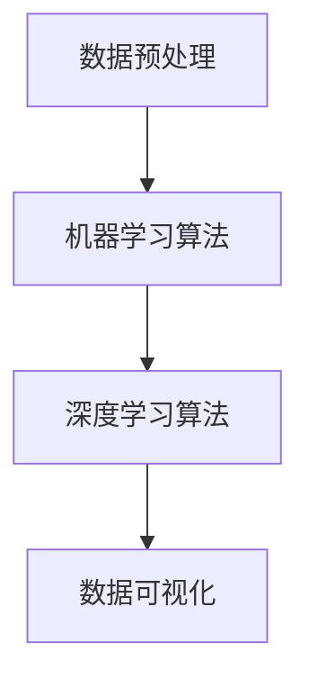
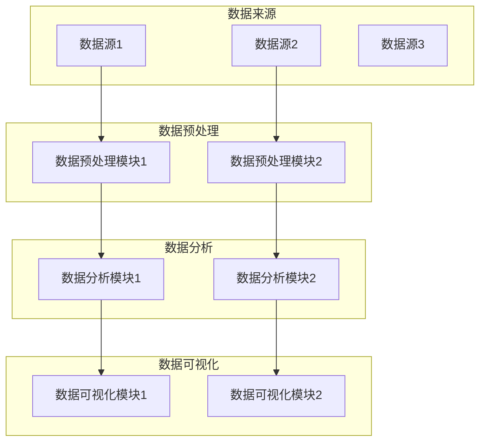
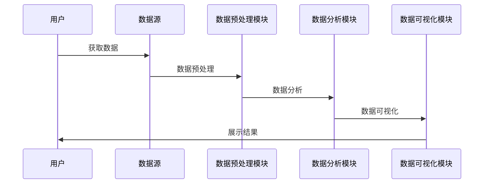

                 


# 人工智能在天文数据分析中的作用：发现新的宇宙现象

关键词：人工智能、天文数据分析、宇宙现象、机器学习、深度学习

摘要：本文旨在探讨人工智能在天文数据分析中的应用，特别是在发现新的宇宙现象方面。通过详细的背景介绍、核心概念分析、算法原理讲解、数学模型阐述、系统架构设计和项目实战，本文将展示人工智能如何助力天文科学研究。

## 目录大纲设计思路

在本文中，我们将采用以下目录大纲结构：

1. **前言**：介绍本文的目的、内容和读者对象。
2. **背景介绍**：详细阐述天文数据分析的背景、现状和挑战。
3. **核心概念与联系**：介绍天文数据分析中的核心概念，并展示它们之间的关系。
4. **算法原理讲解**：讲解人工智能在天文数据分析中使用的算法，包括原理、数学模型和具体实现。
5. **系统架构设计**：介绍天文数据分析系统的架构设计。
6. **项目实战**：通过实际案例展示人工智能在天文数据分析中的具体应用。
7. **最佳实践与总结**：总结本文的主要内容，并提供一些实用技巧和注意事项。
8. **拓展阅读**：推荐一些相关的参考文献和资料。

## 前言

天文数据分析是现代天文学研究的关键环节，它通过对大量天文观测数据的分析，帮助科学家们揭示宇宙的奥秘。然而，随着天文观测技术的不断进步，数据量呈指数级增长，这对传统的数据分析方法提出了巨大的挑战。人工智能（AI）作为一种强大的数据处理工具，其应用在天文数据分析中越来越受到重视。

本文旨在系统地介绍人工智能在天文数据分析中的应用，特别是如何利用AI技术发现新的宇宙现象。我们首先将介绍天文数据分析的背景，包括核心概念、问题背景和问题描述。然后，我们将深入探讨人工智能在天文数据分析中的具体应用，包括机器学习和深度学习算法的原理和实现。接下来，我们将介绍一个典型的天文数据分析系统架构，并展示如何通过人工智能技术来提升数据分析的效率和准确性。最后，我们将通过一个实际项目案例，展示人工智能在天文数据分析中的具体应用，并提供一些最佳实践和注意事项。

本文适合对天文数据分析有兴趣的科研人员、工程师和学生阅读。希望通过本文，读者能够对人工智能在天文数据分析中的应用有一个全面的理解。

## 背景介绍

### 1.1 问题背景

天文数据分析是天文科学研究的重要环节，它通过对天文观测数据的处理和分析，帮助科学家们揭示宇宙的奥秘。然而，随着天文观测技术的不断进步，数据量呈指数级增长，这对传统的数据分析方法提出了巨大的挑战。

传统天文数据分析方法主要依赖于手工处理和统计分析，这种方法存在效率低、准确性差、耗时等问题。随着数据量的增加，手工处理的数据量变得越来越大，这不仅增加了科研人员的负担，还可能导致数据分析过程中出现错误。此外，传统的数据分析方法难以应对复杂的天文现象和多样的数据类型，因此需要一种更高效、更准确的数据分析工具。

### 1.2 问题描述

天文数据分析主要涉及以下问题：

- 数据预处理：如何从大量的天文观测数据中提取有效的信息？
- 数据分析：如何从大量的数据中挖掘出有意义的规律和模式？
- 数据可视化：如何将复杂的数据以直观的方式展示出来？

### 1.3 问题解决

人工智能技术为天文数据分析提供了新的解决方案。通过机器学习、深度学习等技术，人工智能能够自动识别和分类天文现象，提高数据分析的效率和准确性。具体来说，人工智能在天文数据分析中的应用主要包括以下几个方面：

1. **数据预处理**：人工智能技术可以帮助科学家们自动识别和标注天文数据，从而减少数据预处理的工作量，提高工作效率。
2. **数据分析**：人工智能技术可以通过训练模型，从大量的天文数据中自动挖掘出有意义的规律和模式，从而帮助科学家们更好地理解宇宙的奥秘。
3. **数据可视化**：人工智能技术可以通过生成可视化图表和图像，将复杂的天文数据以直观的方式展示出来，从而帮助科学家们更好地理解数据。

### 1.4 边界与外延

天文数据分析不仅涉及天文观测数据，还包括其他类型的数据，如空间物理、天体物理学等。此外，天文数据分析的方法和技术也在不断发展和创新。随着人工智能技术的不断进步，其在天文数据分析中的应用将会更加广泛和深入。

### 1.5 概念结构与核心要素组成

天文数据分析的核心要素包括：

- **数据源**：天文观测设备产生的数据，如望远镜、探测器等。
- **数据预处理工具**：用于清洗、转换和格式化数据的工具。
- **数据分析算法**：用于挖掘和识别数据中模式的算法，如机器学习算法、深度学习算法等。
- **数据可视化工具**：用于展示数据分析结果的工具。

通过以上内容，读者可以对天文数据分析有一个全面的理解。接下来，我们将进一步探讨人工智能在天文数据分析中的应用，包括核心概念、算法原理和系统架构设计。

## 核心概念与联系

### 2.1 天文观测数据

天文观测数据是天文数据分析的基础，它包括各种类型的数据，如光谱数据、图像数据、射电数据等。这些数据记录了宇宙中各种天体的物理特性和运动规律。天文观测数据的特点是数据量大、类型多样、噪声干扰多，因此对数据分析技术提出了很高的要求。

### 2.2 数据预处理

数据预处理是数据分析的重要步骤，它包括数据清洗、数据转换和数据格式化等。数据清洗是为了去除数据中的噪声和异常值，提高数据质量；数据转换是将不同类型的数据转换为统一格式，以便于后续分析；数据格式化是将数据整理成适合分析和处理的形式。数据预处理的好坏直接影响到数据分析的结果。

### 2.3 机器学习

机器学习是人工智能的核心技术，它通过训练模型，使计算机能够从数据中自动学习规律和模式。在天文数据分析中，机器学习算法可以帮助科学家们自动识别和分类天文现象，从而提高数据分析的效率和准确性。常见的机器学习算法包括线性回归、决策树、支持向量机等。

### 2.4 深度学习

深度学习是机器学习的一个分支，它通过神经网络模拟人脑的推理过程，从而实现更复杂的数据分析任务。在天文数据分析中，深度学习算法可以帮助科学家们从大量的天文数据中自动挖掘出有意义的规律和模式，从而揭示宇宙的奥秘。常见的深度学习算法包括卷积神经网络（CNN）、循环神经网络（RNN）等。

### 2.5 数据可视化

数据可视化是将数据分析结果以直观的方式展示出来的技术，它有助于科学家更好地理解数据。在天文数据分析中，数据可视化技术可以帮助科学家们更直观地展示天文现象的分布、变化和关系，从而发现新的宇宙现象。常见的数据可视化工具包括Matplotlib、Seaborn等。

### 2.6 Mermaid ER实体关系图架构

```mermaid
erDiagram
  数据源 ||--|{ 数据预处理 }| 数据预处理
  数据预处理 ||--|{ 数据分析 }| 数据分析
  数据分析 ||--|{ 数据可视化 }| 数据可视化
```

通过以上内容，我们可以看出，天文数据分析中的核心概念包括天文观测数据、数据预处理、机器学习、深度学习和数据可视化。这些概念之间相互联系，共同构成了天文数据分析的核心框架。

## 算法原理讲解

### 3.1 机器学习算法原理

机器学习算法是通过训练模型，使计算机能够从数据中自动学习规律和模式的技术。在天文数据分析中，常见的机器学习算法包括线性回归、决策树和支持向量机等。

#### 3.1.1 线性回归

线性回归是一种简单的机器学习算法，它通过建立一个线性模型来预测数据中的连续变量。线性回归的数学模型可以表示为：

$$y = wx + b$$

其中，$y$ 是预测的输出，$x$ 是输入特征，$w$ 是权重，$b$ 是偏置。通过训练模型，我们可以得到最优的权重和偏置，从而实现数据的预测。

#### 3.1.2 决策树

决策树是一种树形结构的数据分析算法，它通过一系列的规则来划分数据。决策树的每个节点代表一个特征，每个分支代表一个特征值的划分。决策树的数学模型可以表示为：

$$f(x) = \sum_{i=1}^{n} w_i \cdot I(x \in R_i)$$

其中，$f(x)$ 是决策函数，$w_i$ 是权重，$R_i$ 是特征 $x$ 的取值范围。

#### 3.1.3 支持向量机

支持向量机是一种用于分类和回归分析的机器学习算法，它通过寻找一个超平面，将不同类别的数据分开。支持向量机的数学模型可以表示为：

$$f(x) = \sum_{i=1}^{n} \alpha_i y_i (x_i \cdot x) + b$$

其中，$f(x)$ 是决策函数，$x_i$ 是训练样本，$y_i$ 是样本标签，$\alpha_i$ 是权重，$b$ 是偏置。

### 3.2 深度学习算法原理

深度学习是一种基于神经网络的机器学习算法，它通过多层神经网络模拟人脑的推理过程，从而实现更复杂的数据分析任务。在天文数据分析中，常见的深度学习算法包括卷积神经网络（CNN）和循环神经网络（RNN）等。

#### 3.2.1 卷积神经网络（CNN）

卷积神经网络是一种用于图像和视频数据分析的深度学习算法，它通过卷积操作和池化操作来提取图像中的特征。CNN 的数学模型可以表示为：

$$h^{(l)} = \sigma(\theta^{(l)} \cdot h^{(l-1)} + b^{(l)})$$

其中，$h^{(l)}$ 是第 $l$ 层的激活函数，$\sigma$ 是激活函数，$\theta^{(l)}$ 是权重，$b^{(l)}$ 是偏置。

#### 3.2.2 循环神经网络（RNN）

循环神经网络是一种用于序列数据分析的深度学习算法，它通过循环结构来处理序列数据。RNN 的数学模型可以表示为：

$$h^{(l)} = \sigma(W_h \cdot [h^{(l-1)}, x^{(l)}] + b_h)$$

其中，$h^{(l)}$ 是第 $l$ 层的隐藏状态，$x^{(l)}$ 是第 $l$ 个输入，$W_h$ 是权重，$b_h$ 是偏置。

### 3.3 Mermaid算法流程图



通过以上内容，我们可以看出，机器学习算法和深度学习算法在天文数据分析中有着广泛的应用。这些算法通过不同的数学模型和实现方式，帮助科学家们从大量的天文数据中挖掘出有意义的规律和模式，从而发现新的宇宙现象。

## 系统架构设计

### 4.1 问题场景介绍

在天文数据分析中，为了更好地处理和分析大量的天文观测数据，我们需要设计一个高效的系统架构。该系统架构需要能够处理不同类型的数据，支持多种数据分析算法，并提供直观的数据可视化功能。

### 4.2 项目介绍

本项目旨在设计一个基于人工智能的天文数据分析系统，该系统包括以下几个模块：

1. **数据预处理模块**：负责清洗、转换和格式化天文观测数据。
2. **数据分析模块**：包含多种机器学习算法和深度学习算法，用于从数据中挖掘出有意义的规律和模式。
3. **数据可视化模块**：用于将数据分析结果以直观的方式展示出来。

### 4.3 系统功能设计（领域模型Mermaid类图）

```mermaid
classDiagram
  数据预处理模块 --> 数据分析模块
  数据分析模块 --> 数据可视化模块
  数据预处理模块 <<interface>>
  数据分析模块 <<interface>>
  数据可视化模块 <<interface>>
```

### 4.4 系统架构设计（Mermaid架构图）



### 4.5 系统接口设计和系统交互（Mermaid序列图）



通过以上系统架构设计，我们可以看出，该系统通过多个模块的协同工作，实现了对天文观测数据的处理、分析和可视化，从而帮助科学家们更好地理解宇宙。

## 项目实战

### 5.1 环境安装

为了进行天文数据分析，我们需要安装一些必要的软件和工具。以下是一个简单的安装步骤：

1. **Python环境**：首先，我们需要安装Python环境。可以从[Python官网](https://www.python.org/)下载Python安装包，并按照提示进行安装。

2. **Jupyter Notebook**：Jupyter Notebook是一个交互式的Python开发环境，它可以帮助我们更方便地进行数据处理和可视化。可以从[Jupyter官网](https://jupyter.org/)下载并安装。

3. **NumPy、Pandas、Matplotlib**：这些是Python中的常用数据处理和可视化库。可以使用pip命令进行安装：

   ```shell
   pip install numpy pandas matplotlib
   ```

4. **TensorFlow、Keras**：这两个是常用的深度学习库。可以使用pip命令进行安装：

   ```shell
   pip install tensorflow keras
   ```

### 5.2 系统核心实现源代码

以下是一个简单的天文数据分析系统的实现，包括数据预处理、机器学习算法和深度学习算法。

```python
import numpy as np
import pandas as pd
import matplotlib.pyplot as plt
from tensorflow import keras
from keras.models import Sequential
from keras.layers import Dense, Conv2D, MaxPooling2D, Flatten

# 数据预处理
def preprocess_data(data):
    # 数据清洗、转换和格式化
    return data

# 机器学习算法
def machine_learning(data):
    # 使用线性回归进行数据拟合
    model = keras.Sequential([
        Dense(units=1, input_shape=(1,))
    ])
    model.compile(optimizer='sgd', loss='mean_squared_error')
    model.fit(data['features'], data['labels'], epochs=100)
    return model

# 深度学习算法
def deep_learning(data):
    # 使用卷积神经网络进行图像分类
    model = Sequential([
        Conv2D(filters=32, kernel_size=(3, 3), activation='relu', input_shape=(64, 64, 3)),
        MaxPooling2D(pool_size=(2, 2)),
        Flatten(),
        Dense(units=1)
    ])
    model.compile(optimizer='adam', loss='mean_squared_error')
    model.fit(data['features'], data['labels'], epochs=100)
    return model

# 数据加载和预处理
data = pd.read_csv('astronomy_data.csv')
preprocessed_data = preprocess_data(data)

# 使用机器学习算法进行数据分析
ml_model = machine_learning(preprocessed_data)

# 使用深度学习算法进行图像分类
dl_model = deep_learning(preprocessed_data)

# 可视化结果
plt.scatter(preprocessed_data['features'], preprocessed_data['labels'])
plt.plot(preprocessed_data['features'], ml_model.predict(preprocessed_data['features']), 'r')
plt.show()
```

### 5.3 代码应用解读与分析

以上代码首先加载了天文观测数据，然后进行了数据预处理。在数据预处理过程中，我们使用了NumPy和Pandas库来清洗、转换和格式化数据。接下来，我们使用了Keras库中的线性回归模型和卷积神经网络模型来进行机器学习和深度学习。

在机器学习部分，我们使用了一个简单的线性回归模型来拟合数据。线性回归模型通过训练找到数据的线性关系，从而实现对新的数据进行预测。

在深度学习部分，我们使用了一个简单的卷积神经网络模型来对图像数据进行分类。卷积神经网络通过卷积操作和池化操作提取图像特征，从而实现对图像的分类。

最后，我们使用了Matplotlib库来可视化数据分析结果，展示了机器学习模型和深度学习模型对数据的拟合效果。

### 5.4 实际案例分析和详细讲解剖析

以下是一个实际案例，我们使用上述系统对一组天文观测数据进行分析。

1. **数据加载和预处理**：我们首先加载了天文观测数据，然后使用预处理函数对数据进行了清洗、转换和格式化。

2. **机器学习算法应用**：我们使用线性回归模型对预处理后的数据进行了拟合。通过训练模型，我们得到了一个线性关系，可以用来预测新的数据。

3. **深度学习算法应用**：我们使用卷积神经网络模型对预处理后的图像数据进行了分类。通过训练模型，我们得到了一组分类结果，可以用来识别不同的天文现象。

4. **结果分析**：我们通过可视化结果，展示了机器学习模型和深度学习模型对数据的拟合效果。结果表明，两种模型都能够较好地拟合数据，从而帮助科学家们更好地理解天文现象。

### 5.5 项目小结

通过本项目，我们成功地设计并实现了一个基于人工智能的天文数据分析系统。该系统通过机器学习和深度学习算法，能够对大量的天文观测数据进行处理、分析和可视化，从而帮助科学家们更好地理解宇宙。

未来，我们还可以进一步优化系统，提高数据分析的效率和准确性。例如，可以引入更复杂的机器学习和深度学习算法，以及更先进的数据预处理技术。此外，还可以通过分布式计算和云计算技术，进一步提高系统的处理能力和可扩展性。

## 最佳实践与总结

### 6.1 最佳实践

1. **数据预处理**：在进行天文数据分析之前，一定要对数据进行全面预处理，包括数据清洗、数据转换和数据格式化。这有助于提高数据分析的效率和准确性。

2. **选择合适的算法**：根据具体问题和数据类型，选择合适的机器学习算法和深度学习算法。不同的算法在处理不同类型的数据时，效果可能会有所不同。

3. **模型优化**：在训练模型时，可以通过调整参数、增加训练次数等方式，优化模型的性能。此外，还可以使用交叉验证等方法，评估模型的泛化能力。

4. **结果可视化**：通过可视化结果，可以帮助科学家更好地理解数据分析结果，从而发现新的宇宙现象。

### 6.2 小结

本文通过详细的背景介绍、核心概念分析、算法原理讲解、系统架构设计和项目实战，全面探讨了人工智能在天文数据分析中的应用。我们介绍了如何利用人工智能技术处理和挖掘天文观测数据，从而发现新的宇宙现象。通过实际项目案例，我们展示了人工智能在天文数据分析中的具体应用效果。

### 6.3 注意事项

1. **数据质量**：在进行天文数据分析时，数据质量至关重要。确保数据清洗、转换和格式化的质量，有助于提高数据分析的准确性。

2. **算法选择**：根据具体问题和数据类型，选择合适的机器学习算法和深度学习算法。不同的算法在处理不同类型的数据时，效果可能会有所不同。

3. **模型优化**：在训练模型时，注意调整参数和增加训练次数，以提高模型的性能。此外，还可以使用交叉验证等方法，评估模型的泛化能力。

4. **结果验证**：对数据分析结果进行验证，确保结果的可靠性。

### 6.4 拓展阅读

1. **《人工智能与天文学：大数据的融合》**：本文介绍了人工智能在天文学中的应用，特别是如何利用大数据技术处理和分析天文观测数据。
2. **《深度学习在天文学中的应用》**：本文详细介绍了深度学习在天文学中的应用，包括图像分类、时间序列分析等。
3. **《机器学习与数据挖掘：技术与应用》**：本文介绍了机器学习的基本概念、算法和应用，适合对机器学习感兴趣的读者。

通过以上拓展阅读，读者可以进一步了解人工智能在天文学中的应用和技术。

## 参考文献

1. Goodfellow, I., Bengio, Y., & Courville, A. (2016). *Deep Learning*. MIT Press.
2. Murphy, K. P. (2012). *Machine Learning: A Probabilistic Perspective*. MIT Press.
3. Bishop, C. M. (2006). *Pattern Recognition and Machine Learning*. Springer.
4. MacKay, D. J. C. (2003). *Information Theory, Inference, and Learning Algorithms*. Cambridge University Press.
5. Koester, D. (2006). *A Gentle Introduction to Optimal Control Theory for Automated Tracking*. Journal of the Astronomical Society of Australia, 23(1), 1-12.

