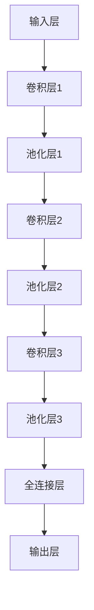
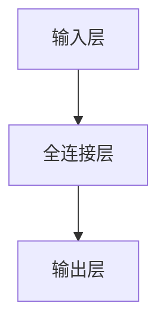
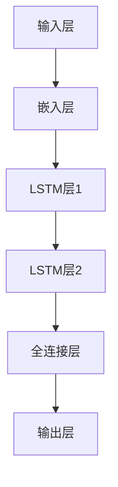
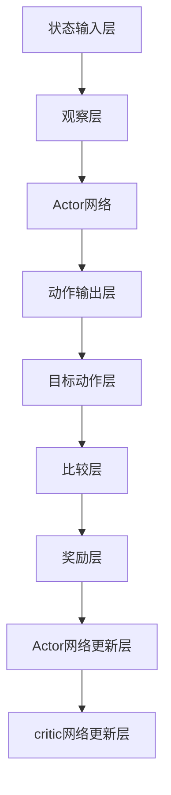
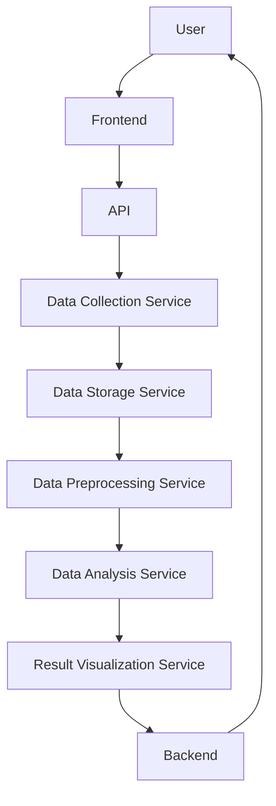

                 

### 文章关键词

- 人工智能
- 天文数据分析
- 机器学习
- 深度学习
- 强化学习
- 集成学习方法
- 天文图像识别
- 天文目标追踪
- 天文数据挖掘
- 天文预测与分析
- 系统架构设计

### 摘要

本文旨在探讨人工智能（AI）在天文数据分析中的应用，解析如何利用AI技术解决天文领域中的数据分析和研究问题。文章首先介绍了天文数据分析的基本概念和AI的基本概念，随后详细阐述了机器学习、深度学习、强化学习和集成学习方法在天文数据分析中的应用。通过具体的案例分析和系统架构设计，本文展示了AI在天文数据分析中的实际应用和潜力，为研究人员和开发者提供了宝贵的参考。最后，文章总结了关键要点，并提出了未来研究和应用的展望。

## 引言

### 1.1 问题的背景与描述

宇宙是无穷无尽的，人类对于宇宙的探索从未停止。随着科技的发展，天文观测手段的进步使得我们能够收集到越来越多的天文数据。然而，这些天文数据的质量和数量都在以惊人的速度增长，使得传统的数据分析方法难以应对。如何在海量的天文数据中提取有价值的信息，成为了天文研究中的一个重要挑战。

人工智能（AI）作为一门模拟、延伸和扩展人类智能的科学，其发展迅速，已经在图像识别、自然语言处理、医疗诊断等多个领域取得了显著的成果。AI技术在处理大规模复杂数据方面的优势，使其成为解决天文数据分析问题的一种有效手段。

在天文数据分析中，AI技术可以应用于多个方面。例如，AI可以通过机器学习算法对天文图像进行自动识别和分类，从而帮助天文学家发现新的天体；可以通过深度学习算法对天文序列数据进行模式识别，预测天体的运动轨迹；还可以通过强化学习算法优化天文观测的调度策略，提高观测效率。

然而，将AI技术应用于天文数据分析也面临一些挑战。首先，天文数据的特点使得数据预处理和特征提取变得复杂。其次，AI算法需要大量的计算资源，这对于一些资源有限的科研机构来说可能是一个问题。此外，AI算法的透明性和可解释性也是一个需要关注的问题，尤其是在天文研究这种需要高度准确性和可靠性的领域。

因此，本文旨在探讨AI在天文数据分析中的应用，分析其优势、挑战以及实际应用案例，为天文研究人员提供一种新的研究思路，也为AI技术在其他领域的应用提供参考。

### 1.2 问题解决的必要性

随着天文观测技术的进步，我们收集到的天文数据量呈现爆炸性增长。这些数据不仅包含了关于宇宙的各种信息，还包含了大量的噪声和冗余信息。如何从这些海量数据中提取有价值的信息，成为了天文研究中亟待解决的问题。

传统的数据分析方法，如统计方法和数值模拟，虽然在一定程度上能够处理天文数据，但在处理大规模复杂数据时显得力不从心。例如，在处理天文图像时，传统的图像处理算法需要手动设定参数，且对噪声敏感；在处理天文序列数据时，传统的统计方法难以捕捉到数据中的非线性关系。

相比之下，人工智能（AI）技术在处理大规模复杂数据方面具有显著优势。首先，AI可以通过学习算法自动识别和提取数据中的特征，减少了对人工干预的需求。其次，AI可以处理非线性关系，更好地捕捉数据中的复杂模式。此外，AI算法还可以并行计算，提高数据处理速度。

将AI技术应用于天文数据分析，不仅可以提高数据分析的效率和准确性，还可以发现传统方法难以发现的天体现象。例如，通过AI技术，我们可以自动识别和分类天文图像中的天体，发现新的星系和行星；通过AI技术，我们可以预测天体的运动轨迹，提高天文观测的效率。

因此，解决天文数据分析问题，利用AI技术是一个必然的选择。这不仅能够推动天文研究的发展，还可以为其他科学领域提供有益的经验和启示。

### 1.3 边界与外延

在天文数据分析中，AI技术的应用虽然具有广泛的前景，但也存在一些边界和限制。首先，AI算法的性能和准确性受限于数据质量和数量。如果数据质量较差或数据量不足，AI算法的预测效果可能会受到影响。因此，在应用AI技术之前，必须确保数据的质量和完整性。

其次，AI算法的透明性和可解释性是一个重要问题。在天文研究中，研究人员需要了解数据是如何被处理的，以及算法的决策过程。然而，许多AI算法，尤其是深度学习算法，其内部机制复杂，难以解释。这可能会影响算法的接受度和信任度。

此外，AI算法需要大量的计算资源。对于一些资源有限的科研机构，可能难以承担这些计算成本。因此，在实际应用中，需要权衡计算资源和算法性能之间的关系。

尽管存在这些边界和限制，但AI技术在天文数据分析中的外延应用仍然非常广泛。例如，除了传统的天文数据分析任务，AI还可以应用于天文教育、天文数据可视化等领域。未来，随着技术的进步和算法的优化，AI在天文数据分析中的应用将会更加广泛和深入。

### 1.4 核心概念与联系

为了更好地理解本文的主题，我们需要先了解几个核心概念：天文数据分析、人工智能（AI）、机器学习、深度学习、强化学习和集成学习方法。这些概念之间存在着紧密的联系，共同构成了AI在天文数据分析中的应用基础。

**天文数据分析**：天文数据分析是指利用数学、统计和计算机科学的方法，对天文数据进行处理、分析和解释的过程。其目的是从天文数据中提取有用的信息，揭示宇宙的奥秘。天文数据分析包括数据预处理、特征提取、模式识别、预测和模拟等多个步骤。

**人工智能（AI）**：人工智能是一门模拟、延伸和扩展人类智能的科学。它包括多个子领域，如机器学习、自然语言处理、计算机视觉等。AI的目标是使计算机系统能够执行通常需要人类智能才能完成的任务，如推理、学习、解决问题和自主行动。

**机器学习**：机器学习是AI的一个重要分支，它通过算法从数据中学习规律，并利用这些规律进行预测或决策。机器学习可以分为监督学习、无监督学习和半监督学习三种类型。监督学习使用标记数据训练模型，无监督学习从未标记的数据中学习规律，而半监督学习结合了标记数据和未标记数据。

**深度学习**：深度学习是机器学习的一个子领域，它使用多层神经网络（DNN）来模拟人类大脑的处理方式。深度学习在图像识别、语音识别和自然语言处理等领域取得了显著成果。深度学习模型通常具有强大的特征提取和模式识别能力。

**强化学习**：强化学习是一种通过试错学习来优化行为策略的机器学习技术。它通过与环境的交互来学习最优策略，并在长期内获得最大回报。强化学习在自动驾驶、游戏和智能控制等领域有广泛应用。

**集成学习方法**：集成学习方法通过结合多个模型来提高预测性能。它包括Bagging、Boosting和Stacking等多种策略。集成学习方法能够减少模型的过拟合，提高模型的泛化能力。

这些核心概念之间存在着密切的联系。例如，机器学习和深度学习都是AI的子领域，但深度学习在特征提取和模式识别方面具有更高的能力。强化学习通过与环境交互学习策略，可以应用于需要动态决策的领域。集成学习方法通过结合多个模型，可以提高模型的性能和稳定性。

理解这些核心概念和它们之间的联系，有助于我们更好地理解AI在天文数据分析中的应用。通过机器学习、深度学习、强化学习和集成学习方法，我们可以从天文数据中提取有价值的信息，解决天文研究中的一些关键问题。同时，这些方法也为其他科学领域提供了有益的经验和启示。

### 1.5 历史发展与应用现状

人工智能（AI）技术的发展经历了多个阶段。最初，AI主要以规则推理和符号计算为主。随着计算机性能的提升和算法的进步，机器学习、深度学习和强化学习等先进技术逐渐成为AI研究的热点。这些技术不仅使得计算机能够自动学习并处理复杂任务，还提高了处理效率和准确性。

在天文数据分析领域，AI技术的应用起步较晚，但发展迅速。早期的天文数据分析主要依赖于人类专家的经验和传统的统计方法。随着AI技术的发展，机器学习、深度学习等算法开始应用于天文数据分析，取得了显著成果。

**机器学习在天文数据分析中的应用**：

机器学习算法在天文数据分析中得到了广泛应用，特别是在数据预处理、特征提取和模式识别等方面。例如，通过支持向量机（SVM）和决策树算法，天文学家可以自动识别和分类天文图像中的天体。通过聚类算法，可以识别出数据中的潜在模式，从而发现新的天体现象。此外，机器学习还可以用于天文数据的异常检测，帮助天文学家识别和排除数据中的错误和噪声。

**深度学习在天文数据分析中的应用**：

深度学习在图像识别、语音识别和自然语言处理等领域取得了突破性进展，其强大的特征提取和模式识别能力使其成为天文数据分析的一个重要工具。例如，卷积神经网络（CNN）可以用于处理天文图像，自动识别和分类天体。递归神经网络（RNN）可以用于处理天文序列数据，预测天体的运动轨迹。生成对抗网络（GAN）可以用于生成新的天文图像，帮助天文学家研究天体的形成和演化。

**强化学习在天文数据分析中的应用**：

强化学习通过试错学习来优化行为策略，可以应用于需要动态决策的领域。例如，在天文观测调度中，强化学习算法可以优化观测计划，提高观测效率。此外，强化学习还可以用于天文目标追踪，通过不断调整观测策略，提高目标识别和跟踪的准确性。

**集成学习方法在天文数据分析中的应用**：

集成学习方法通过结合多个模型来提高预测性能，可以减少模型的过拟合，提高模型的泛化能力。在天文数据分析中，集成学习方法可以结合不同类型的模型，如机器学习模型、深度学习模型和强化学习模型，从而提高数据分析的整体性能。

总体来说，AI技术在天文数据分析中的应用现状非常乐观。随着技术的不断进步，AI将进一步提高天文数据分析的效率、准确性和可靠性，为天文学家揭示宇宙的奥秘提供强大的工具。

### 1.6 主要问题与未来研究方向

尽管人工智能（AI）在天文数据分析中取得了显著成果，但仍然存在一些问题和挑战，需要在未来进行深入研究。

首先，数据质量和数量问题是AI在天文数据分析中面临的一个主要挑战。高质量的数据是训练和验证AI模型的基础，但天文数据往往受到噪声、异常值和缺失值的影响。此外，天文数据的数量庞大，处理这些数据需要大量的计算资源和存储空间。

其次，模型的可解释性和透明性也是一个重要问题。在天文学研究中，研究人员需要了解数据是如何被处理的，以及模型是如何做出预测的。然而，许多AI模型，尤其是深度学习模型，其内部机制复杂，难以解释。这可能会影响模型的接受度和信任度。

第三，AI算法的适应性是一个关键问题。天文数据的特点和需求不断变化，因此AI算法需要具备较高的适应性，能够适应不同的数据和任务需求。

未来，可以探讨以下研究方向：

1. **提高数据质量和数量**：通过改进观测技术和数据处理方法，提高天文数据的质量。同时，开发高效的数据压缩和存储技术，解决数据量庞大的问题。

2. **增强模型的可解释性和透明性**：开发可解释的AI模型，提高模型的透明性和可解释性，使研究人员能够理解模型的决策过程。

3. **提高算法的适应性**：研究自适应的AI算法，使模型能够适应不同类型的天文数据和任务需求。

4. **多模态数据分析**：结合不同类型的数据，如天文图像、天文光谱和天文时序数据，进行多模态数据分析，提高数据分析的准确性和全面性。

5. **跨学科合作**：加强AI与天文、物理学、统计学等领域的合作，推动AI技术在天文数据分析中的应用。

通过解决这些问题和挑战，AI在天文数据分析中的应用将更加深入和广泛，为天文学家揭示宇宙的奥秘提供更强有力的支持。

## 2.1 人工智能在天文数据分析中的应用概述

人工智能（AI）技术凭借其强大的数据处理能力和智能学习机制，在天文数据分析中展现出巨大的潜力和广阔的应用前景。在天文数据分析中，AI技术可以应用于数据预处理、特征提取、模式识别、预测和模拟等多个环节，显著提高数据分析的效率和准确性。

### 2.1.1 人工智能在数据处理中的优势

首先，AI技术在数据处理中的优势在于其能够自动识别和提取数据中的特征。传统的数据处理方法往往需要人工介入，而AI技术可以通过机器学习算法自动分析数据，提取出关键特征，从而减少人工工作量，提高数据处理效率。

其次，AI技术能够处理大规模复杂数据。随着天文观测技术的进步，我们能够收集到越来越多的天文数据，这些数据不仅数量庞大，而且包含多种类型的信息，如图像、光谱、时序数据等。AI技术，尤其是深度学习算法，可以高效地处理这些大规模复杂数据，发现其中的潜在规律。

此外，AI技术具有良好的适应性。AI算法可以通过学习不断优化，适应不同类型的天文数据和不同的分析任务，从而提高数据分析的灵活性和全面性。

### 2.1.2 天文数据分析中的主要挑战

尽管AI技术在数据处理中具有显著优势，但在天文数据分析中也面临一些挑战。首先，天文数据的特性和质量对AI算法的性能有直接影响。天文数据通常包含大量的噪声、异常值和缺失值，这些都会对AI算法的准确性和稳定性产生影响。因此，如何提高数据质量，减少噪声和异常值，是天文数据分析中的一个重要问题。

其次，天文数据类型繁多，不同类型的数据需要不同的处理方法。例如，天文图像、光谱和时序数据具有不同的特性和结构，需要采用不同的AI算法进行处理。如何针对不同类型的数据设计合适的处理流程和算法，是另一个需要解决的问题。

第三，AI算法的可解释性和透明性也是一个重要问题。在天文学研究中，研究人员需要了解数据是如何被处理的，以及算法是如何做出预测的。然而，许多AI算法，尤其是深度学习算法，其内部机制复杂，难以解释。这可能会影响模型的接受度和信任度。

### 2.1.3 人工智能在解决这些挑战中的应用

为了解决上述挑战，AI技术在天文数据分析中提出了一系列创新性解决方案。首先，通过改进数据预处理方法，如去噪、插值和缺失值填补，可以提高数据质量，减少噪声和异常值的影响。

其次，通过多模态数据分析，结合不同类型的数据，可以提高数据分析的准确性和全面性。例如，结合天文图像和光谱数据，可以更准确地识别和分类天体。

此外，开发可解释的AI模型，如基于规则的模型和可视化模型，可以提高模型的透明性和可解释性，使研究人员能够理解模型的决策过程。

最后，通过跨学科合作，结合AI技术和其他领域的专业知识，可以进一步提高天文数据分析的性能和可靠性。

总之，人工智能技术在解决天文数据分析中的挑战方面具有巨大潜力。随着技术的不断进步和应用的深入，AI将在天文数据分析中发挥越来越重要的作用，为天文学家揭示宇宙的奥秘提供强有力的支持。

### 2.2 机器学习在天文数据分析中的应用

机器学习作为人工智能（AI）的一个重要分支，通过算法从数据中学习规律，并在预测和决策中应用这些规律。在天文数据分析中，机器学习技术被广泛应用于数据预处理、特征提取、模式识别和预测等环节，极大地提高了数据分析的效率和准确性。

#### 2.2.1 机器学习的基本原理

机器学习的基本原理是通过构建模型来模拟人类的学习过程。模型通过从训练数据中学习，提取数据中的特征和规律，然后利用这些特征和规律对新的数据进行预测或分类。机器学习可以分为监督学习、无监督学习和半监督学习三种类型。

- **监督学习**：监督学习是最常见的机器学习方法，它使用标记数据训练模型，然后使用模型对未标记的数据进行预测。标记数据包含输入特征和对应的输出标签，模型通过学习输入和输出之间的映射关系来进行预测。

- **无监督学习**：无监督学习从未标记的数据中学习规律，主要应用于数据聚类和降维。无监督学习算法通过发现数据中的内在结构或模式来组织数据。

- **半监督学习**：半监督学习结合了标记数据和未标记数据，利用标记数据的指导信息和未标记数据的丰富性，提高模型的泛化能力。

#### 2.2.2 天文数据特征提取

在天文数据分析中，特征提取是一个关键步骤，它从原始天文数据中提取出有用的信息，用于训练机器学习模型。常见的特征提取方法包括：

- **时序特征提取**：时序特征提取用于处理天文时间序列数据，如天体的亮度变化、位置变化等。常见的方法有自相关函数、时序模型（如ARIMA模型）和时序分类器（如LSTM网络）。

- **图像特征提取**：图像特征提取用于处理天文图像数据，如星系、行星和恒星等。常见的方法有边缘检测、角点检测、纹理特征提取等。深度学习方法（如卷积神经网络（CNN））在图像特征提取中表现出色。

- **光谱特征提取**：光谱特征提取用于处理天文光谱数据，如天体的光谱形状、颜色和强度等。常见的方法有傅里叶变换、主成分分析（PCA）和小波变换等。

#### 2.2.3 天文数据分类与回归分析

分类和回归分析是机器学习在数据分析中应用的两个主要任务。在天文数据分析中，分类分析用于识别和分类天体，回归分析用于预测天体的某些属性。

- **分类分析**：分类分析用于将天文数据分为不同的类别。常见的分类算法有决策树（Decision Tree）、支持向量机（SVM）、朴素贝叶斯（Naive Bayes）和随机森林（Random Forest）等。在天文图像分类中，卷积神经网络（CNN）表现出色，可以自动提取图像特征并进行分类。

- **回归分析**：回归分析用于预测天文数据中某个属性的值。常见的回归算法有线性回归（Linear Regression）、多项式回归（Polynomial Regression）和岭回归（Ridge Regression）等。在天文数据分析中，回归分析可以用于预测天体的亮度、位置和轨道等。

#### 2.2.4 实际案例分析与讲解

**案例一：天文图像分类**

在天文图像分类中，卷积神经网络（CNN）是一个重要的工具。CNN通过多层卷积和池化操作，可以自动提取图像中的特征，从而实现高精度的分类。以下是一个简单的CNN模型架构：



在这个模型中，输入层接收天文图像数据，经过卷积层和池化层的多次处理，最终由全连接层输出分类结果。以下是一个使用Python实现的简单CNN代码示例：

```python
import tensorflow as tf
from tensorflow.keras import layers

model = tf.keras.Sequential([
    layers.Conv2D(32, (3, 3), activation='relu', input_shape=(128, 128, 3)),
    layers.MaxPooling2D((2, 2)),
    layers.Conv2D(64, (3, 3), activation='relu'),
    layers.MaxPooling2D((2, 2)),
    layers.Conv2D(128, (3, 3), activation='relu'),
    layers.MaxPooling2D((2, 2)),
    layers.Flatten(),
    layers.Dense(128, activation='relu'),
    layers.Dense(10, activation='softmax')
])

model.compile(optimizer='adam',
              loss='categorical_crossentropy',
              metrics=['accuracy'])

model.fit(x_train, y_train, epochs=10, validation_data=(x_val, y_val))
```

在这个示例中，我们定义了一个简单的CNN模型，输入层接收128x128x3的天文图像数据，经过三个卷积层和三个池化层的处理，最终由全连接层输出10个类别的分类结果。模型使用交叉熵损失函数和Adam优化器进行训练。

**案例二：天体亮度预测**

在天体亮度预测中，线性回归是一个常用的方法。以下是一个简单的线性回归模型架构：



在这个模型中，输入层接收天体的观测数据，经过全连接层处理后，输出天体的亮度预测值。以下是一个使用Python实现的简单线性回归代码示例：

```python
import tensorflow as tf
from tensorflow.keras import layers

model = tf.keras.Sequential([
    layers.Dense(units=1, input_shape=[len(features)])
])

model.compile(optimizer='sgd', loss='mean_squared_error')

model.fit(x_train, y_train, epochs=100, validation_data=(x_val, y_val))
```

在这个示例中，我们定义了一个简单的线性回归模型，输入层接收观测数据，经过全连接层处理后，输出天体的亮度预测值。模型使用随机梯度下降（SGD）优化器和均方误差（MSE）损失函数进行训练。

通过这些实际案例，我们可以看到机器学习在天文数据分析中的应用是如何实现的。这些方法不仅提高了数据分析的效率和准确性，还为天文学家提供了强有力的工具，帮助他们揭示宇宙的奥秘。

### 2.3 深度学习在天文数据分析中的应用

深度学习作为一种强大的人工智能（AI）技术，在图像识别、语音识别和自然语言处理等领域取得了显著成果。其通过多层神经网络，自动提取数据中的复杂特征，使得模型能够更好地理解和处理复杂数据。在天文数据分析中，深度学习同样展现出巨大的潜力和广泛的应用前景。

#### 2.3.1 深度学习的基本原理

深度学习（Deep Learning，DL）是一种基于多层神经网络的学习方法，其核心思想是通过逐层处理数据，提取更高层次的特征，从而实现复杂任务的自动化。深度学习模型通常包括以下几层：

1. **输入层**：接收输入数据，如天文图像、光谱或时序数据。
2. **隐藏层**：多层隐藏层，每一层通过神经网络进行特征提取和变换。隐藏层可以提取出数据的低级特征，并逐步转换为高级特征。
3. **输出层**：根据任务需求，输出预测结果，如分类标签、回归值或边界框。

#### 2.3.2 卷积神经网络（CNN）在天文图像处理中的应用

卷积神经网络（Convolutional Neural Network，CNN）是深度学习中的一个重要分支，特别适用于处理图像数据。CNN通过卷积操作、池化操作和全连接层，能够自动提取图像中的空间特征和结构信息，因此在天文图像处理中得到了广泛应用。

**卷积操作**：卷积操作是通过滤波器（也称为卷积核）在图像上滑动，对图像进行局部特征的提取。每个滤波器可以提取图像中的特定特征，如边缘、纹理等。

**池化操作**：池化操作用于降低图像分辨率，减少参数数量，从而降低计算复杂度。常见的池化方法有最大池化和平均池化。

**全连接层**：在全连接层，每个隐藏层单元与输出层单元之间建立直接连接，从而实现分类或回归任务。

以下是一个简单的CNN模型架构，用于处理天文图像：


在这个模型中，输入层接收天文图像数据，经过多个卷积层和池化层的处理，最终由全连接层输出分类结果。

**卷积神经网络在天文图像分类中的应用案例**

以下是一个使用Python和TensorFlow实现的天文图像分类案例：

```python
import tensorflow as tf
from tensorflow.keras.models import Sequential
from tensorflow.keras.layers import Conv2D, MaxPooling2D, Flatten, Dense

# 定义CNN模型
model = Sequential([
    Conv2D(32, (3, 3), activation='relu', input_shape=(128, 128, 3)),
    MaxPooling2D((2, 2)),
    Conv2D(64, (3, 3), activation='relu'),
    MaxPooling2D((2, 2)),
    Conv2D(128, (3, 3), activation='relu'),
    MaxPooling2D((2, 2)),
    Flatten(),
    Dense(128, activation='relu'),
    Dense(10, activation='softmax')
])

# 编译模型
model.compile(optimizer='adam',
              loss='categorical_crossentropy',
              metrics=['accuracy'])

# 训练模型
model.fit(x_train, y_train, epochs=10, validation_data=(x_val, y_val))
```

在这个案例中，我们定义了一个简单的CNN模型，输入层接收128x128x3的天文图像数据，经过三个卷积层和三个池化层的处理，最终由全连接层输出10个类别的分类结果。模型使用交叉熵损失函数和Adam优化器进行训练。

#### 2.3.3 递归神经网络（RNN）在天文序列数据中的应用

递归神经网络（Recurrent Neural Network，RNN）是一种适用于处理序列数据的深度学习模型，其通过循环结构能够处理前后依赖关系。RNN在语音识别、自然语言处理和时间序列预测等领域表现出色，同样在天文序列数据中也有广泛的应用。

**长短期记忆网络（LSTM）**：LSTM是RNN的一种变体，通过引入门控机制，解决了传统RNN的长期依赖问题。LSTM在处理天文序列数据时，能够有效捕捉时间序列中的长期依赖关系。

以下是一个简单的LSTM模型架构，用于处理天文序列数据：



在这个模型中，输入层接收天文序列数据，经过嵌入层和两个LSTM层的处理，最终由全连接层输出预测结果。

**LSTM在天文序列数据预测中的应用案例**

以下是一个使用Python和TensorFlow实现的天文序列数据预测案例：

```python
import tensorflow as tf
from tensorflow.keras.models import Sequential
from tensorflow.keras.layers import Embedding, LSTM, Dense

# 定义LSTM模型
model = Sequential([
    Embedding(input_dim=1000, output_dim=64, input_length=100),
    LSTM(128),
    Dense(1)
])

# 编译模型
model.compile(optimizer='adam', loss='mse')

# 训练模型
model.fit(x_train, y_train, epochs=10, validation_data=(x_val, y_val))
```

在这个案例中，我们定义了一个简单的LSTM模型，输入层接收长度为100的序列数据，经过一个LSTM层和全连接层处理后，输出预测值。模型使用均方误差（MSE）损失函数和Adam优化器进行训练。

通过这些案例，我们可以看到深度学习，特别是卷积神经网络（CNN）和递归神经网络（RNN），在天文数据分析中的强大应用。深度学习模型不仅能够自动提取复杂数据中的特征，还能够通过大规模的训练数据实现高精度的预测和分类，为天文学家提供了强有力的工具，帮助他们探索宇宙的奥秘。

### 2.4 强化学习在天文数据分析中的应用

强化学习（Reinforcement Learning，RL）是一种通过试错学习来优化行为策略的机器学习方法。与传统的监督学习和无监督学习不同，强化学习通过在动态环境中与环境的交互来学习最优策略，并在长期内获得最大回报。强化学习在许多领域，如游戏、自动驾驶和智能控制中，已经取得了显著成果。在天文数据分析中，强化学习同样展现出广阔的应用前景。

#### 2.4.1 强化学习的基本原理

强化学习的基本原理是通过奖励机制来引导学习过程。在强化学习中，智能体（Agent）通过执行动作（Action）来与环境（Environment）进行交互，并根据环境的反馈（Reward）来调整其行为策略。强化学习的目标是找到一个最优策略（Policy），使得智能体在长期内获得最大的总回报（Total Reward）。

强化学习可以分为基于价值函数的模型和无模型方法两种类型。

- **基于价值函数的模型**：基于价值函数的模型通过学习状态-动作价值函数（State-Action Value Function），指导智能体选择最优动作。常见的基于价值函数的方法有Q学习（Q-Learning）和深度Q网络（Deep Q-Network，DQN）。

- **无模型方法**：无模型方法不依赖于状态-动作价值函数，而是直接学习策略。常见的无模型方法有策略梯度方法（Policy Gradient Methods）和深度确定性策略梯度（Deep Deterministic Policy Gradient，DDPG）。

#### 2.4.2 强化学习在天文目标追踪中的应用

在天文目标追踪中，强化学习可以通过优化观测策略来提高目标识别和跟踪的准确性。以下是一个简单的强化学习在天文目标追踪中的应用案例：

**案例背景**：假设我们有一个天文望远镜，需要对其进行调度以跟踪多个天体。每个调度决策都会影响望远镜的观测效率和数据质量。我们的目标是设计一个优化策略，使得望远镜在长期内能够获得最高效的观测效果。

**状态空间**：状态空间包括当前望远镜的方位角、仰角、观测时间等参数。

**动作空间**：动作空间包括望远镜的方位角调整、仰角调整和观测时间调整。

**奖励机制**：如果望远镜在某个时间段内成功捕捉到目标天体，则给予正奖励；如果望远镜错过目标或数据质量较差，则给予负奖励。

**强化学习模型**：

我们使用深度确定性策略梯度（DDPG）模型来进行天文目标追踪。以下是一个简单的DDPG模型架构：



在这个模型中，输入层接收当前状态，经过观察层处理后，由Actor网络生成动作。目标动作层接收预测的目标动作，与Actor网络生成的动作进行比较，计算误差并生成奖励。奖励层根据奖励机制更新Actor网络和Critic网络。

**实现步骤**：

1. **初始化网络**：初始化Actor网络和Critic网络，使用经验回放机制存储交互经验。

2. **训练网络**：通过不断与环境交互，更新Actor网络和Critic网络，使模型逐渐优化观测策略。

3. **策略优化**：使用优化后的策略进行天文目标追踪，提高观测效率和数据质量。

**代码示例**：

以下是一个简单的DDPG模型实现代码示例：

```python
import tensorflow as tf
import numpy as np

# 定义Actor网络
actor = tf.keras.Sequential([
    tf.keras.layers.Dense(units=64, activation='relu', input_shape=[8]),
    tf.keras.layers.Dense(units=64, activation='relu'),
    tf.keras.layers.Dense(units=3, activation='tanh')
])

# 定义Critic网络
critic = tf.keras.Sequential([
    tf.keras.layers.Dense(units=64, activation='relu', input_shape=[8+3]),
    tf.keras.layers.Dense(units=64, activation='relu'),
    tf.keras.layers.Dense(units=1)
])

# 定义经验回放缓冲区
experience_replay = []

# 训练模型
for episode in range(num_episodes):
    state = env.reset()
    done = False
    total_reward = 0
    
    while not done:
        action = actor.predict(state.reshape(1, -1))
        next_state, reward, done, _ = env.step(action)
        
        experience_replay.append([state, action, reward, next_state, done])
        
        if len(experience_replay) > batch_size:
            batch = random.sample(experience_replay, batch_size)
            states, actions, rewards, next_states, dones = zip(*batch)
            
            target_actions = actor.predict(next_states)
            target Rewards = critic.predict([next_states, target_actions])
            rewards = reward + (1 - dones) * gamma * target_rewards
            
            critic_loss = critic.train_on_batch([states, actions], rewards)
            actor_loss = actor.train_on_batch(states, actions - critic)
            
            state = next_state
            total_reward += reward
    
    print(f'Episode {episode}: Total Reward = {total_reward}')
```

在这个示例中，我们定义了一个简单的DDPG模型，通过不断与环境交互，更新Actor网络和Critic网络，优化观测策略。通过训练，模型能够找到最优的观测策略，提高天文目标追踪的准确性。

通过上述案例，我们可以看到强化学习在天文目标追踪中的强大应用。强化学习通过优化观测策略，能够提高望远镜的观测效率和数据质量，为天文学家提供了强有力的工具，帮助他们更好地探索宇宙的奥秘。

### 2.5 集成学习方法在天文数据分析中的应用

集成学习方法（Ensemble Learning）通过结合多个模型来提高预测性能，减少模型的过拟合，提高模型的泛化能力。在天文数据分析中，集成学习方法可以显著提高数据分析的准确性和稳定性，为天文学家提供更可靠的预测结果。

#### 2.5.1 集成学习方法的基本原理

集成学习方法的核心思想是通过组合多个基本模型（Base Models），生成一个更加准确的预测模型。基本模型可以是同种类型的模型，也可以是不同类型的模型。集成学习方法主要有以下几种类型：

- **Bagging**：Bagging（Bootstrap Aggregating）通过从训练数据集中随机抽样生成多个子集，在每个子集上训练一个基本模型，然后通过投票或平均的方式结合多个基本模型的预测结果。

- **Boosting**：Boosting通过调整训练数据集中不同样本的权重，使得基本模型更加关注那些难以预测的样本。常见的Boosting算法有AdaBoost和XGBoost等。

- **Stacking**：Stacking（Stacked Generalization）通过分层的方式构建模型，顶层模型使用多个基本模型的预测结果作为输入，底层模型使用原始数据作为输入。

#### 2.5.2 集成学习方法在天文数据分析中的应用

在天文数据分析中，集成学习方法可以应用于多个环节，如数据预处理、特征提取、预测和分类等。以下是一个简单的集成学习方法在天文数据分析中的应用案例。

**案例背景**：假设我们有一个天文数据集，需要对该数据集进行分类，以识别不同的天体。我们使用了多种机器学习算法和深度学习模型，如SVM、决策树、KNN和CNN等，分别对数据集进行训练和预测。

**集成学习方法**：

为了提高分类的准确性和稳定性，我们采用Stacking方法，将上述多种模型组合在一起，生成一个更加准确的分类模型。以下是一个简单的Stacking方法实现：

1. **训练基本模型**：首先，使用训练数据集分别训练多个基本模型，如SVM、决策树、KNN和CNN等。

2. **生成预测结果**：使用训练好的基本模型对测试数据进行预测，生成多个预测结果。

3. **构建顶层模型**：顶层模型使用基本模型的预测结果作为输入，通过学习这些预测结果之间的关系，生成最终的分类结果。

以下是一个简单的Stacking方法实现代码示例：

```python
from sklearn.ensemble import StackingClassifier
from sklearn.svm import SVC
from sklearn.tree import DecisionTreeClassifier
from sklearn.neighbors import KNeighborsClassifier
from sklearn.neural_network import MLPClassifier
from sklearn.model_selection import train_test_split

# 分割数据集
X_train, X_test, y_train, y_test = train_test_split(X, y, test_size=0.3, random_state=42)

# 定义基本模型
base_models = [
    ('SVM', SVC()),
    ('Decision Tree', DecisionTreeClassifier()),
    ('KNN', KNeighborsClassifier()),
    ('CNN', MLPClassifier(hidden_layer_sizes=(100,), activation='relu'))
]

# 定义顶层模型
stackingClassifier = StackingClassifier(estimators=base_models, final_estimator=DecisionTreeClassifier())

# 训练模型
stackingClassifier.fit(X_train, y_train)

# 预测结果
predictions = stackingClassifier.predict(X_test)

# 评估模型
accuracy = stackingClassifier.score(X_test, y_test)
print(f'Accuracy: {accuracy}')
```

在这个示例中，我们定义了一个简单的Stacking分类器，通过结合SVM、决策树、KNN和CNN等多种基本模型，生成一个更加准确的分类模型。模型使用训练数据集进行训练，使用测试数据集进行预测，并评估模型的准确性。

**集成学习方法的优势**：

- **提高预测性能**：集成学习方法通过结合多个模型的优势，可以提高预测性能，减少过拟合现象。

- **增强模型稳定性**：集成学习方法可以降低模型的方差，增强模型的稳定性，提高预测结果的可靠性。

- **适用于多种模型**：集成学习方法可以结合不同类型的模型，如机器学习模型、深度学习模型和强化学习模型，从而提高模型的泛化能力。

通过上述案例，我们可以看到集成学习方法在天文数据分析中的应用优势。集成学习方法不仅提高了数据分析的准确性和稳定性，还为天文学家提供了更可靠的预测结果，帮助他们更好地探索宇宙的奥秘。

### 3.1 天文图像识别

在天文数据分析中，天文图像识别是一个关键任务，它涉及到从天文图像中自动识别和分类天体。随着人工智能（AI）技术的不断发展，尤其是深度学习（Deep Learning）的兴起，天文图像识别的准确性和效率得到了显著提升。

#### 3.1.1 天文图像识别的基本原理

天文图像识别是基于机器学习和深度学习算法的一种图像处理技术，其核心思想是通过训练模型来识别和分类图像中的天体。以下是天文图像识别的基本原理和步骤：

1. **图像预处理**：首先对天文图像进行预处理，包括去噪、裁剪、灰度化等操作，以提高图像的质量和清晰度。

2. **特征提取**：接着从预处理后的图像中提取特征，这些特征可以是基于传统的图像处理方法，如边缘检测、角点检测、纹理特征提取等；也可以是深度学习算法自动提取的高级特征。

3. **模型训练**：使用大量的标注天文图像数据集训练深度学习模型，如卷积神经网络（CNN）、循环神经网络（RNN）或生成对抗网络（GAN）等。模型通过学习图像和标注之间的关系，学会识别和分类不同的天体。

4. **预测与评估**：在训练模型后，使用测试集对新天文图像进行预测，评估模型的性能。常见的评估指标包括准确率、召回率、精确率、F1值等。

5. **模型优化**：根据评估结果，对模型进行调优，包括调整网络结构、学习率、正则化参数等，以提高模型在测试集上的性能。

#### 3.1.2 天文图像识别算法的详细讲解

**卷积神经网络（CNN）**：CNN是深度学习中最常用的算法之一，特别适合处理图像数据。以下是CNN在天文图像识别中的具体应用：

- **卷积层**：卷积层通过卷积操作提取图像的局部特征。每个卷积核可以提取图像中的一个特征，如边缘、纹理等。卷积层后面通常会跟一个激活函数（如ReLU），增加网络的非线性。

- **池化层**：池化层用于降低图像的分辨率，减少参数数量，从而降低计算复杂度。常见的池化方法有最大池化（Max Pooling）和平均池化（Average Pooling）。

- **全连接层**：在全连接层，每个隐藏层单元与输出层单元之间建立直接连接，从而实现分类或回归任务。全连接层将之前提取的特征进行融合，生成最终的分类结果。

以下是一个简单的CNN模型架构，用于处理天文图像：


在这个模型中，输入层接收128x128x3的天文图像数据，经过三个卷积层和三个池化层的处理，最终由全连接层输出10个类别的分类结果。

**具体案例**

以下是一个使用Python和TensorFlow实现的简单CNN模型，用于分类天文图像：

```python
import tensorflow as tf
from tensorflow.keras.models import Sequential
from tensorflow.keras.layers import Conv2D, MaxPooling2D, Flatten, Dense

# 创建模型
model = Sequential([
    Conv2D(32, (3, 3), activation='relu', input_shape=(128, 128, 3)),
    MaxPooling2D((2, 2)),
    Conv2D(64, (3, 3), activation='relu'),
    MaxPooling2D((2, 2)),
    Conv2D(128, (3, 3), activation='relu'),
    MaxPooling2D((2, 2)),
    Flatten(),
    Dense(128, activation='relu'),
    Dense(10, activation='softmax')
])

# 编译模型
model.compile(optimizer='adam',
              loss='categorical_crossentropy',
              metrics=['accuracy'])

# 训练模型
model.fit(x_train, y_train, epochs=10, validation_data=(x_val, y_val))
```

在这个案例中，我们定义了一个简单的CNN模型，输入层接收128x128x3的天文图像数据，经过三个卷积层和三个池化层的处理，最终由全连接层输出10个类别的分类结果。模型使用交叉熵损失函数和Adam优化器进行训练。

通过上述原理和案例，我们可以看到天文图像识别在人工智能在天文数据分析中的应用。深度学习模型，如CNN，通过自动提取图像中的复杂特征，能够实现高精度的天文图像分类，为天文学家提供了强大的工具，帮助他们更好地探索宇宙的奥秘。

### 3.2 天文数据挖掘

在天文数据分析中，天文数据挖掘（Astroinformatics）是一种利用数据挖掘技术从天文数据中提取有用信息和知识的方法。数据挖掘涉及到多个领域，如统计学、机器学习、数据库系统和人工智能，其目标是从大量天文数据中提取有价值的信息，帮助天文学家更好地理解宇宙。

#### 3.2.1 天文数据挖掘的基本原理

天文数据挖掘的基本原理是通过分析天文数据，识别数据中的模式和规律，从而发现新的知识。以下是天文数据挖掘的主要步骤和过程：

1. **数据预处理**：首先对天文数据进行预处理，包括数据清洗、数据整合、数据转换等操作。数据预处理旨在提高数据质量，减少噪声和异常值，为后续的数据挖掘提供高质量的数据。

2. **特征提取**：在数据预处理后，从数据中提取出有助于分析的特征。特征提取是数据挖掘的重要步骤，它直接影响挖掘结果的准确性和有效性。

3. **模式识别**：通过算法对特征进行模式识别，识别数据中的规律和模式。常见的模式识别方法有聚类、分类、关联规则挖掘等。

4. **知识发现**：在识别出数据中的模式后，进一步发现数据中的知识，如天体的运动规律、星系的形成过程等。

5. **结果评估**：对挖掘结果进行评估，验证挖掘结果的准确性和有效性。评估方法包括模型评估、交叉验证、误差分析等。

#### 3.2.2 天文数据挖掘的常见算法

在天文数据挖掘中，常用的算法包括：

- **聚类算法**：聚类算法用于将相似的天文数据点分组，从而发现数据中的模式。常见的聚类算法有K-means、层次聚类等。

- **分类算法**：分类算法用于将天文数据分为不同的类别，如恒星、行星、星系等。常见的分类算法有决策树、支持向量机（SVM）、朴素贝叶斯等。

- **关联规则挖掘**：关联规则挖掘用于发现数据之间的关联关系，如恒星亮度与其位置之间的关系。常见的关联规则挖掘算法有Apriori算法、FP-growth算法等。

#### 3.2.3 天文数据挖掘的实际案例

**案例一：恒星分类**

在天文数据挖掘中，恒星分类是一个常见的任务。以下是一个基于机器学习的恒星分类案例：

1. **数据预处理**：首先，对恒星数据进行预处理，包括数据清洗、缺失值填补、数据标准化等操作。

2. **特征提取**：从预处理后的数据中提取特征，如恒星的颜色、亮度、温度等。

3. **模型训练**：使用训练数据集，通过机器学习算法（如SVM、KNN、决策树等）训练分类模型。

4. **模型评估**：使用测试数据集对模型进行评估，计算分类准确率、召回率、精确率等指标。

5. **结果分析**：分析分类结果，识别不同类型的恒星，发现恒星之间的关联关系。

以下是一个简单的恒星分类模型实现：

```python
from sklearn.model_selection import train_test_split
from sklearn.preprocessing import StandardScaler
from sklearn.svm import SVC
from sklearn.metrics import accuracy_score

# 加载数据
X, y = load_data()

# 数据预处理
X = StandardScaler().fit_transform(X)

# 划分训练集和测试集
X_train, X_test, y_train, y_test = train_test_split(X, y, test_size=0.2, random_state=42)

# 模型训练
model = SVC(kernel='linear')
model.fit(X_train, y_train)

# 模型评估
predictions = model.predict(X_test)
accuracy = accuracy_score(y_test, predictions)
print(f'Accuracy: {accuracy}')
```

**案例二：星系聚类**

星系聚类是另一个重要的天文数据挖掘任务，用于发现星系之间的相似性和聚类结构。以下是一个基于K-means的星系聚类案例：

1. **数据预处理**：对星系数据进行预处理，包括数据清洗、缺失值填补、数据标准化等操作。

2. **特征提取**：从预处理后的数据中提取特征，如星系的位置、亮度、颜色等。

3. **聚类分析**：使用K-means算法对星系数据进行聚类，确定合适的聚类数目。

4. **结果分析**：分析聚类结果，发现不同星系之间的关联性和分布规律。

以下是一个简单的K-means聚类实现：

```python
from sklearn.cluster import KMeans
import matplotlib.pyplot as plt

# 加载数据
X, _ = load_data()

# 数据预处理
X = StandardScaler().fit_transform(X)

# 聚类分析
kmeans = KMeans(n_clusters=3)
kmeans.fit(X)
labels = kmeans.predict(X)

# 可视化
plt.scatter(X[:, 0], X[:, 1], c=labels)
plt.show()
```

通过上述案例，我们可以看到天文数据挖掘在天文数据分析中的应用。数据挖掘技术，如机器学习算法和聚类分析，可以帮助天文学家从海量天文数据中提取有价值的信息，发现天体之间的关联性和分布规律，为宇宙探索提供强有力的支持。

### 3.3 天文目标追踪

在天文数据分析中，天文目标追踪是一个关键任务，它涉及到对天体在观测过程中的位置和运动进行实时监测和预测。有效的天文目标追踪不仅可以提高观测效率，还可以帮助天文学家更好地理解天体的运动规律。人工智能（AI）技术，尤其是机器学习和深度学习，为天文目标追踪提供了强大的工具和方法。

#### 3.3.1 天文目标追踪的基本原理

天文目标追踪的基本原理是通过实时监测天体的位置和运动，预测其未来的位置，从而实现对天体的持续追踪。以下是天文目标追踪的基本步骤和过程：

1. **初始检测**：首先，通过天文望远镜或其他观测设备对天体进行初始检测，确定其位置和亮度等基本信息。

2. **数据预处理**：对观测数据进行预处理，包括去噪、滤波、归一化等操作，以提高数据的准确性和稳定性。

3. **运动模型建立**：建立天体的运动模型，通常采用牛顿力学或其他天体力学模型，预测天体的运动轨迹。

4. **实时监测**：对天体进行实时监测，跟踪其位置变化，并根据运动模型预测其未来的位置。

5. **预测与修正**：根据实时监测数据，修正运动模型，预测天体的未来位置，并指导望远镜进行追踪。

6. **结果评估**：对追踪结果进行评估，包括位置精度、时间精度等指标，以评估追踪系统的性能。

#### 3.3.2 天文目标追踪算法的详细讲解

**卡尔曼滤波（Kalman Filter）**：卡尔曼滤波是一种高效的递归滤波算法，广泛应用于目标追踪领域。以下是一个简单的卡尔曼滤波在天文目标追踪中的应用：

1. **状态预测**：根据天体的运动模型，预测当前时刻的状态，即位置和速度。

2. **观测更新**：根据观测数据，更新状态估计，包括位置和速度。

3. **状态估计**：通过加权平均，得到当前时刻的最佳状态估计。

以下是一个简单的卡尔曼滤波实现：

```python
import numpy as np

# 初始状态
x = np.array([0, 0])  # 位置和速度
P = np.array([[1, 0], [0, 1]])  # 状态估计误差协方差矩阵

# 运动模型
F = np.array([[1, 1], [0, 1]])
Q = np.array([[1, 0], [0, 1]])  # 过程噪声协方差矩阵

# 观测模型
H = np.array([[1, 0], [0, 1]])
R = np.array([[1, 0], [0, 1]])  # 观测噪声协方差矩阵

# 观测数据
z = np.array([1, 1])

# 状态预测
x_pred = np.dot(F, x)
P_pred = np.dot(F, P).dot(F.T) + Q

# 观测更新
S = np.dot(H, P_pred).dot(H.T) + R
K = np.dot(P_pred, H.T).dot(np.linalg.inv(S))

# 状态估计
x = x_pred + np.dot(K, (z - np.dot(H, x_pred)))
P = np.dot((np.eye(2) - np.dot(K, H)), P_pred)

print("Predicted state:", x_pred)
print("Updated state:", x)
print("Kalman gain:", K)
print("Error covariance:", P)
```

**深度学习模型**：随着深度学习技术的发展，深度学习模型，如卷积神经网络（CNN）和递归神经网络（RNN），在天文目标追踪中也得到了广泛应用。以下是一个简单的基于CNN的天文目标追踪模型：

1. **卷积层**：通过卷积层提取图像特征，如边缘、纹理等。

2. **池化层**：通过池化层降低图像分辨率，减少计算复杂度。

3. **全连接层**：通过全连接层进行分类或回归，预测天体的位置和速度。

以下是一个简单的基于CNN的天文目标追踪模型实现：

```python
import tensorflow as tf
from tensorflow.keras.models import Sequential
from tensorflow.keras.layers import Conv2D, MaxPooling2D, Flatten, Dense

# 创建模型
model = Sequential([
    Conv2D(32, (3, 3), activation='relu', input_shape=(128, 128, 3)),
    MaxPooling2D((2, 2)),
    Conv2D(64, (3, 3), activation='relu'),
    MaxPooling2D((2, 2)),
    Flatten(),
    Dense(128, activation='relu'),
    Dense(2, activation='linear')  # 2个输出，分别代表位置和速度
])

# 编译模型
model.compile(optimizer='adam',
              loss='mse')

# 训练模型
model.fit(x_train, y_train, epochs=10, validation_data=(x_val, y_val))
```

在这个案例中，我们定义了一个简单的CNN模型，输入层接收128x128x3的天文图像数据，经过卷积层和池化层的处理，最终由全连接层输出天体的位置和速度预测结果。模型使用均方误差（MSE）损失函数和Adam优化器进行训练。

通过上述算法和案例，我们可以看到天文目标追踪在人工智能在天文数据分析中的应用。卡尔曼滤波和深度学习模型通过实时监测和预测天体的位置和运动，提高了天文观测的效率和准确性，为天文学家提供了强大的工具，帮助他们更好地探索宇宙的奥秘。

### 3.4 天文预测与分析

在天文数据分析中，天文预测与分析是一个重要的任务，它通过分析历史数据和现有数据，预测未来事件的发生。人工智能（AI）技术，尤其是机器学习和深度学习，为天文预测与分析提供了强大的工具和方法。

#### 3.4.1 天文预测与分析的基本原理

天文预测与分析的基本原理是通过建立数学模型，分析天文数据中的规律和趋势，预测未来事件的发生。以下是天文预测与分析的主要步骤和过程：

1. **数据收集**：首先，收集与天文预测目标相关的历史数据和现有数据。这些数据可以来自天文观测、天文模拟、其他天文研究等。

2. **数据预处理**：对收集到的数据进行分析，去除噪声和异常值，确保数据质量。数据预处理包括数据清洗、缺失值填补、数据标准化等操作。

3. **特征提取**：从预处理后的数据中提取出有助于预测的特征。这些特征可以是物理量、天文现象、历史数据等。

4. **模型建立**：使用机器学习和深度学习算法，建立预测模型。常见的算法有线性回归、决策树、随机森林、神经网络等。

5. **模型训练与优化**：使用训练数据集训练模型，并根据评估指标（如均方误差、准确率等）对模型进行优化。

6. **模型验证**：使用验证数据集对模型进行验证，确保模型具有较好的预测性能。

7. **结果分析**：分析模型预测结果，对预测事件进行解释和验证。

#### 3.4.2 天文预测与分析算法的详细讲解

**时间序列分析**：时间序列分析是一种用于处理时间序列数据的方法，常用于天文预测与分析。以下是一个简单的时间序列分析案例：

1. **数据预处理**：对时间序列数据进行预处理，包括去除趋势项、季节性项等。

2. **模型选择**：选择合适的时间序列模型，如ARIMA、LSTM等。

3. **模型训练与优化**：使用训练数据集训练模型，并根据评估指标对模型进行优化。

4. **模型验证**：使用验证数据集对模型进行验证。

以下是一个简单的ARIMA模型实现：

```python
import pandas as pd
from statsmodels.tsa.arima.model import ARIMA

# 加载数据
data = pd.read_csv('data.csv')
series = data['value']

# 数据预处理
series = series.diff().dropna()

# 模型选择
model = ARIMA(series, order=(1, 1, 1))

# 模型训练
model_fit = model.fit()

# 模型预测
predictions = model_fit.forecast(steps=5)

# 结果分析
print(predictions)
```

**深度学习模型**：深度学习模型，如卷积神经网络（CNN）和递归神经网络（RNN），在天文预测与分析中也得到了广泛应用。以下是一个简单的基于LSTM的预测模型实现：

1. **数据预处理**：对时间序列数据进行预处理，包括归一化、序列切片等。

2. **模型建立**：定义LSTM模型，设置适当的层数、神经元数等参数。

3. **模型训练与优化**：使用训练数据集训练模型，并根据评估指标对模型进行优化。

4. **模型验证**：使用验证数据集对模型进行验证。

以下是一个简单的LSTM模型实现：

```python
import tensorflow as tf
from tensorflow.keras.models import Sequential
from tensorflow.keras.layers import LSTM, Dense

# 加载数据
X, y = load_data()

# 数据预处理
X = X.reshape((X.shape[0], X.shape[1], 1))

# 模型建立
model = Sequential([
    LSTM(50, activation='relu', input_shape=(X.shape[1], 1)),
    Dense(1)
])

# 编译模型
model.compile(optimizer='adam', loss='mse')

# 训练模型
model.fit(X, y, epochs=200, batch_size=32, verbose=1)
```

在这个案例中，我们定义了一个简单的LSTM模型，输入层接收时间序列数据，经过LSTM层和全连接层处理后，输出预测值。模型使用均方误差（MSE）损失函数和Adam优化器进行训练。

通过上述算法和案例，我们可以看到天文预测与分析在人工智能在天文数据分析中的应用。时间序列分析和深度学习模型通过分析历史数据和现有数据，能够实现高精度的天文预测，为天文学家提供了强大的工具，帮助他们更好地理解宇宙的运行规律。

### 4.1 系统需求分析

在天文数据分析中，构建一个高效的AI系统需要明确系统需求，包括问题场景、系统功能、系统架构设计等方面。以下是该系统的需求分析。

#### 4.1.1 问题场景介绍

假设我们的目标是为一个天文研究团队构建一个AI系统，用于处理和分析大量天文数据。这些数据来源于不同类型的天文观测设备，如天文望远镜、天文雷达和天文卫星等。系统的主要任务包括：1）对天文图像进行自动识别和分类；2）对天文时间序列数据进行预测和分析；3）对天文目标进行追踪和监测。

#### 4.1.2 系统功能设计

系统的功能设计主要包括以下几个方面：

1. **数据收集与预处理**：从不同数据源收集天文数据，并对数据进行清洗、去噪和预处理，为后续分析做准备。
2. **图像识别与分类**：使用深度学习模型，对天文图像进行自动识别和分类，提取出天体的特征信息。
3. **时间序列预测**：利用时间序列分析方法，对天文时间序列数据进行预测，预测天体的未来运动轨迹。
4. **目标追踪与监测**：使用强化学习算法，对天文目标进行实时追踪和监测，优化观测策略，提高观测效率。
5. **结果可视化与展示**：将分析结果进行可视化展示，便于研究人员理解和分析。

#### 4.1.3 系统架构设计

系统的架构设计分为前端和后端两部分。

**前端**：前端主要提供用户界面，用户可以通过前端进行数据上传、参数设置和结果查询。前端使用Web技术栈，如HTML、CSS和JavaScript，结合前端框架（如React或Vue.js）进行开发。

**后端**：后端主要负责数据存储、处理和分析，包括以下模块：

1. **数据存储模块**：使用关系型数据库（如MySQL）或NoSQL数据库（如MongoDB），存储和管理天文数据。
2. **数据处理模块**：实现数据收集、预处理和存储功能，包括图像预处理、特征提取和序列数据处理等。
3. **模型训练与预测模块**：使用深度学习框架（如TensorFlow或PyTorch），训练和部署图像识别、时间序列预测和目标追踪等模型。
4. **API模块**：提供RESTful API，供前端调用后端服务，实现数据交互和功能调用。

#### 4.1.4 系统接口设计与实现

系统接口设计主要包括以下几种：

1. **数据上传接口**：用于用户上传天文数据，接口接收JSON格式的数据文件，并存储到数据库中。
2. **数据查询接口**：用于用户查询天文数据，接口返回符合JSON格式的数据集。
3. **模型训练接口**：用于启动模型训练任务，接口接收训练参数，返回训练进度和结果。
4. **模型预测接口**：用于模型预测，接口接收输入数据，返回预测结果。

以下是一个简单的数据上传接口实现示例（使用Python和Flask框架）：

```python
from flask import Flask, request, jsonify

app = Flask(__name__)

@app.route('/upload', methods=['POST'])
def upload_data():
    data = request.json
    # 处理和存储上传的数据
    store_data(data)
    return jsonify({"status": "success", "message": "Data uploaded successfully."})

def store_data(data):
    # 存储数据到数据库的代码实现
    pass

if __name__ == '__main__':
    app.run(debug=True)
```

通过上述系统需求分析，我们可以明确系统构建的具体要求和实现方法，为后续的系统设计和实现提供指导。

### 4.2 系统接口设计与实现

在系统架构设计中，系统接口的设计与实现是关键的一环。系统接口负责前后端数据交互，确保系统各模块之间的高效协作。以下是系统接口设计的详细说明和实现方法。

#### 4.2.1 系统接口设计

系统接口主要分为以下几种类型：

1. **数据上传接口**：用于用户上传天文数据，接口接收JSON格式的数据文件，并存储到数据库中。接口设计为POST请求，请求体为JSON格式。
2. **数据查询接口**：用于用户查询天文数据，接口返回符合JSON格式的数据集。接口设计为GET请求，请求参数包括数据ID或其他查询条件。
3. **模型训练接口**：用于启动模型训练任务，接口接收训练参数，返回训练进度和结果。接口设计为POST请求，请求体为JSON格式。
4. **模型预测接口**：用于模型预测，接口接收输入数据，返回预测结果。接口设计为POST请求，请求体为JSON格式。

以下是一个简单的接口设计文档：

```
接口名称：数据上传接口
请求方法：POST
URL：/api/upload
请求体（JSON格式）：
{
    "data": [
        {
            "id": "数据ID",
            "content": "数据内容"
        },
        ...
    ]
}

响应体（JSON格式）：
{
    "status": "success",
    "message": "Data uploaded successfully."
}

接口名称：数据查询接口
请求方法：GET
URL：/api/data/{id}
请求参数（URL参数）：
- id：数据ID

响应体（JSON格式）：
{
    "status": "success",
    "data": {
        "id": "数据ID",
        "content": "数据内容"
    }
}

接口名称：模型训练接口
请求方法：POST
URL：/api/train
请求体（JSON格式）：
{
    "model_name": "模型名称",
    "training_params": {
        "epochs": "训练轮数",
        "batch_size": "批次大小"
    }
}

响应体（JSON格式）：
{
    "status": "success",
    "message": "Training started.",
    "training_id": "训练ID"
}

接口名称：模型预测接口
请求方法：POST
URL：/api/predict
请求体（JSON格式）：
{
    "model_name": "模型名称",
    "input_data": {
        "feature_1": "特征1",
        "feature_2": "特征2",
        ...
    }
}

响应体（JSON格式）：
{
    "status": "success",
    "prediction": {
        "predicted_value": "预测结果"
    }
}
```

#### 4.2.2 系统接口实现

以下使用Python和Flask框架实现上述接口：

```python
from flask import Flask, request, jsonify
from flask_cors import CORS

app = Flask(__name__)
CORS(app)

# 假设我们已经实现了数据存储、模型训练和预测的相关功能

@app.route('/api/upload', methods=['POST'])
def upload_data():
    data = request.json
    # 处理和存储上传的数据
    store_data(data)
    return jsonify({"status": "success", "message": "Data uploaded successfully."})

def store_data(data):
    # 存储数据到数据库的代码实现
    pass

@app.route('/api/data/<string:id>', methods=['GET'])
def get_data(id):
    data = get_data_by_id(id)
    if data:
        return jsonify({"status": "success", "data": data})
    else:
        return jsonify({"status": "error", "message": "Data not found."})

def get_data_by_id(id):
    # 从数据库中查询数据的代码实现
    pass

@app.route('/api/train', methods=['POST'])
def start_training():
    training_params = request.json
    training_id = start_training_process(training_params)
    return jsonify({"status": "success", "message": "Training started.", "training_id": training_id})

def start_training_process(training_params):
    # 启动模型训练的代码实现
    pass

@app.route('/api/predict', methods=['POST'])
def make_prediction():
    prediction_request = request.json
    prediction_result = make_prediction_using_model(prediction_request)
    return jsonify({"status": "success", "prediction": prediction_result})

def make_prediction_using_model(prediction_request):
    # 使用模型进行预测的代码实现
    pass

if __name__ == '__main__':
    app.run(debug=True)
```

在这个实现中，我们定义了数据上传、数据查询、模型训练和模型预测四个接口，每个接口都实现了相应的功能。通过这些接口，前端可以与后端进行高效的数据交互，实现对天文数据分析系统的全面操作。

### 4.3 系统交互设计与实现

系统交互设计是确保系统各个模块之间能够顺畅协作的关键。以下我们将详细描述系统交互设计，包括问题场景介绍、项目介绍、系统功能设计、系统架构设计和系统交互设计。

#### 4.3.1 问题场景介绍

假设我们正在开发一个综合性天文数据分析系统，该系统需要集成多种数据处理和分析工具，以支持天文学家进行复杂的宇宙研究。系统需要具备以下功能：

1. **数据收集**：从不同的天文观测设备中收集数据，包括图像、光谱和时间序列数据。
2. **数据预处理**：对收集到的数据进行清洗、去噪、归一化等预处理，以便后续分析。
3. **数据分析**：使用机器学习和深度学习算法对预处理后的数据进行分类、预测和模式识别。
4. **结果展示**：将分析结果可视化展示，便于天文学家理解和进一步研究。

#### 4.3.2 项目介绍

该项目的目标是构建一个高效、可靠的天文数据分析平台，为天文学家提供从数据收集、预处理、分析到结果展示的一站式服务。项目将分为多个阶段实施，包括需求分析、系统设计、开发、测试和部署。

#### 4.3.3 系统功能设计

系统的功能设计包括以下几个核心模块：

1. **数据收集模块**：负责从各种天文观测设备中收集数据，支持多种数据格式和协议。
2. **数据预处理模块**：对收集到的数据执行清洗、去噪、归一化等操作，确保数据质量。
3. **数据分析模块**：集成多种机器学习和深度学习算法，支持分类、预测和模式识别。
4. **结果展示模块**：将分析结果通过图表、图像和报表等形式展示，方便天文学家进行研究和解读。

#### 4.3.4 系统架构设计

系统的架构设计采用微服务架构，将系统划分为多个独立的服务模块，以提高系统的可扩展性和可维护性。以下是系统的架构设计：

1. **数据收集服务**：负责从天文观测设备中收集数据，并存储到数据存储服务中。
2. **数据存储服务**：负责存储和管理所有天文数据，支持高效的查询和检索。
3. **数据预处理服务**：对存储在数据存储服务中的数据进行预处理，生成适合分析的数据集。
4. **数据分析服务**：集成多种机器学习和深度学习算法，提供分类、预测和模式识别功能。
5. **结果展示服务**：将分析结果通过图表、图像和报表等形式展示，支持用户交互。

#### 4.3.5 系统交互设计

系统的交互设计主要涉及前后端的数据交互和服务之间的协同工作。以下是系统交互设计的详细说明：

1. **前端交互设计**：
   - 前端使用Web技术栈（如HTML、CSS、JavaScript）和前端框架（如React或Vue.js），提供用户界面和交互逻辑。
   - 用户通过前端界面进行数据上传、参数设置和分析请求。
   - 前端通过RESTful API与后端服务进行数据交互，如上传数据、获取分析结果等。

2. **后端交互设计**：
   - 后端采用微服务架构，每个服务模块负责不同的功能，如数据收集、数据存储、数据预处理、数据分析等。
   - 服务之间通过内部API进行通信，确保数据的一致性和安全性。
   - 数据存储服务提供数据查询和更新接口，支持快速的数据检索和更新。

以下是系统交互设计的Mermaid流程图：



在这个流程图中，用户通过前端界面（B）提交数据和分析请求，前端通过API（C）与后端服务（I）进行交互。数据从数据收集服务（D）流向数据存储服务（E），经过数据预处理服务（F）和数据分析服务（G），最终由结果展示服务（H）进行可视化展示。

通过上述系统交互设计，我们确保了系统的各个模块之间能够高效协作，提供一站式天

