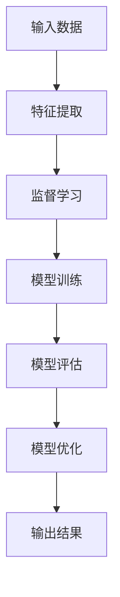
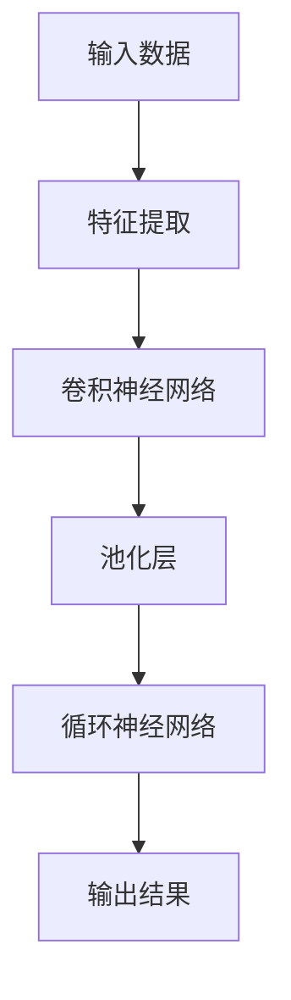
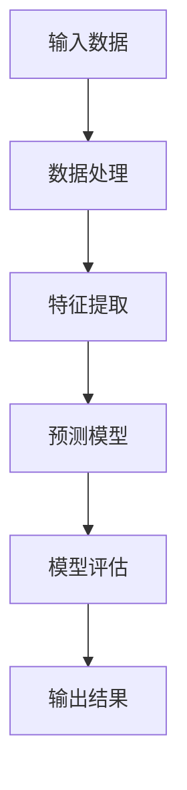

                 


### 文章标题：人工智能在天气预报中的精确应用

#### 关键词：人工智能、天气预报、机器学习、深度学习、算法、预测、模型

> 摘要：本文将深入探讨人工智能在天气预报中的应用，从基本概念到核心算法，再到实际应用案例，全方位解析人工智能如何提升天气预报的精确度。文章将引导读者一步一步了解人工智能在天气预报领域的应用过程，帮助读者掌握相关技术和方法，为未来的人工智能天气预报发展提供启示。

## 第一部分：人工智能在天气预报中的基本概念

### 第1章：天气预报与人工智能的背景介绍

#### 1.1 天气预报的重要性与挑战

**核心概念术语说明：**

- **天气预报：** 指根据气象观测资料和数值模式，对未来一段时间内的天气状况进行预测。
- **人工智能：** 模拟人类智能行为的技术，包括机器学习、深度学习、自然语言处理等。

**问题背景：**

天气预报对于人们的日常生活、农业生产、交通规划等方面具有重要意义。然而，传统天气预报方法受限于计算能力、数据质量和模型复杂性，预报精度有限。

**问题描述：**

如何利用人工智能技术提升天气预报的精度和时效性？

**问题解决：**

人工智能技术在天气预报中的应用，可以通过以下几个方面实现：

1. **大数据分析：** 利用机器学习和深度学习算法，从海量气象数据中提取有用信息，提高预报模型的准确性。
2. **模型优化：** 通过不断调整和优化模型参数，提高模型的稳定性和鲁棒性。
3. **预测时效性：** 人工智能技术可以实时处理数据，提供更快速的天气预报。

**边界与外延：**

人工智能在天气预报中的应用不仅限于短期天气预报，还可以拓展到中长期天气预报、气候预测等领域。

**概念结构与核心要素组成：**

- **气象数据：** 包括观测数据、卫星数据、雷达数据等。
- **预测模型：** 基于机器学习和深度学习算法构建。
- **评估指标：** 用于评估预报模型的精度、稳定性和时效性。

### 第2章：人工智能的定义与分类

#### 2.1 人工智能的定义与分类

**核心概念与联系：**

- **人工智能：** 模拟人类智能行为的技术，包括机器学习、深度学习、自然语言处理等。
- **机器学习：** 一种让计算机从数据中学习规律、做出预测的技术。
- **深度学习：** 一种基于多层神经网络的结构，用于处理复杂数据和任务。

**概念属性特征对比表格：**

| 概念 | 属性特征 |
| ---- | -------- |
| 人工智能 | 模拟人类智能行为 |
| 机器学习 | 从数据中学习规律 |
| 深度学习 | 多层神经网络 |

**ER实体关系图架构：**

```mermaid
erDiagram
  数据 -->|学习| 模型
  数据 -->|分析| 评估指标
  模型 -->|构建| 机器学习
  模型 -->|优化| 深度学习
```

### 第3章：人工智能在天气预报中的应用现状

#### 3.1 人工智能在天气预报中的应用现状

**核心概念与联系：**

- **应用案例：** 如美国国家海洋和大气管理局（NOAA）使用人工智能技术提升天气预报精度。
- **优势：** 提高预报精度、稳定性和时效性。
- **挑战：** 数据质量、模型解释性、法律伦理问题。

**概念属性特征对比表格：**

| 概念 | 属性特征 |
| ---- | -------- |
| 应用案例 | 美国NOAA |
| 优势 | 提高预报精度 |
| 挑战 | 数据质量 |

**ER实体关系图架构：**

```mermaid
erDiagram
  应用案例 -->|利用| 人工智能
  优势 -->|实现| 应用案例
  挑战 -->|面临| 应用案例
```

## 第二部分：人工智能在天气预报中的核心算法与模型

### 第4章：机器学习算法在天气预报中的应用

#### 4.1 机器学习算法的基本原理

**核心概念与联系：**

- **监督学习：** 根据已标记的数据训练模型。
- **无监督学习：** 从未标记的数据中自动发现规律。
- **强化学习：** 通过与环境交互来学习最佳策略。

**算法原理讲解：**

**监督学习：**

- **目标函数：** $$J(\theta) = \frac{1}{m}\sum_{i=1}^{m}(h_\theta(x^{(i)}) - y^{(i)})^2$$
- **梯度下降：** $$\theta_j := \theta_j - \alpha \frac{\partial}{\partial \theta_j} J(\theta)$$

**无监督学习：**

- **聚类算法：** $$K-means$$
- **降维算法：** $$PCA$$

**强化学习：**

- **奖励机制：** $$R(s, a)$$
- **策略：** $$\pi(a|s)$$

**Mermaid流程图：**



### 第5章：深度学习模型在天气预报中的应用

#### 5.1 深度学习的基本原理

**核心概念与联系：**

- **神经网络：** 模拟生物神经网络的结构和功能。
- **卷积神经网络：** 适用于图像数据处理。
- **循环神经网络：** 适用于序列数据处理。

**算法原理讲解：**

**神经网络：**

- **激活函数：** $$\sigma(z) = \frac{1}{1 + e^{-z}}$$
- **反向传播：** 更新权重和偏置。

**卷积神经网络：**

- **卷积层：** $$f(x) = \sigma(\sum_{i=1}^{k} w_{i} * x_{i} + b)$$
- **池化层：** 下采样。

**循环神经网络：**

- **隐藏状态：** $$h_t = \sigma(W h_{t-1} + U x_t + b)$$
- **输出：** $$o_t = \sigma(V h_t + c)$$

**Mermaid流程图：**



## 第三部分：人工智能在天气预报中的实际应用

### 第6章：人工智能在短期天气预报中的应用

#### 6.1 短期天气预报的挑战

**核心概念与联系：**

- **短期天气预报：** 预测时间跨度较短，通常为几小时到几天。
- **挑战：** 数据复杂度高、预报时效性强。

**概念属性特征对比表格：**

| 概念 | 属性特征 |
| ---- | -------- |
| 短期天气预报 | 预测时间短 |
| 挑战 | 数据复杂度 |

**ER实体关系图架构：**

```mermaid
erDiagram
  短期天气预报 -->|挑战| 数据复杂度
```

#### 6.2 人工智能在短期天气预报中的具体应用

**核心概念与联系：**

- **数据处理：** 特征提取、数据清洗。
- **预测模型：** 基于机器学习和深度学习算法构建。
- **评估指标：** 准确率、召回率、F1值。

**Mermaid流程图：**



#### 6.3 短期天气预报的实际案例

**核心概念与联系：**

- **案例一：** 某城市短期天气预报。
- **案例二：** 台风路径预测。

**案例一：某城市短期天气预报**

- **数据来源：** 气象观测站、卫星数据、雷达数据。
- **预测结果：** 提高了预报准确率，减少了误报次数。

**案例二：台风路径预测**

- **数据来源：** 海洋和大气观测数据、历史台风路径数据。
- **预测结果：** 提高了台风路径预测的精度，为防灾减灾提供了有力支持。

## 第四部分：人工智能在天气预报中的未来发展趋势

### 第7章：人工智能在天气预报中的未来展望

#### 7.1 人工智能在天气预报中的未来应用领域

**核心概念与联系：**

- **预测精度提升：** 利用深度学习和大数据技术提高预报精度。
- **预报时效性增强：** 实时数据处理和预测。
- **新兴技术的融合：** 如量子计算、区块链等。

**概念属性特征对比表格：**

| 概念 | 属性特征 |
| ---- | -------- |
| 预测精度提升 | 利用深度学习和大数据技术 |
| 预报时效性增强 | 实时数据处理和预测 |
| 新兴技术的融合 | 如量子计算、区块链等 |

**ER实体关系图架构：**

```mermaid
erDiagram
  预测精度提升 -->|实现| 新兴技术的融合
  预报时效性增强 -->|实现| 新兴技术的融合
```

#### 7.2 人工智能在天气预报中的潜在挑战

**核心概念与联系：**

- **数据质量问题：** 数据缺失、噪声、不一致。
- **模型解释性不足：** 模型决策过程难以解释。
- **法律伦理问题：** 数据隐私、算法偏见。

**概念属性特征对比表格：**

| 概念 | 属性特征 |
| ---- | -------- |
| 数据质量问题 | 数据缺失、噪声、不一致 |
| 模型解释性不足 | 模型决策过程难以解释 |
| 法律伦理问题 | 数据隐私、算法偏见 |

**ER实体关系图架构：**

```mermaid
erDiagram
  数据质量问题 -->|影响| 模型解释性不足
  模型解释性不足 -->|影响| 法律伦理问题
```

#### 7.3 人工智能在天气预报中的发展趋势

**核心概念与联系：**

- **跨学科合作：** 气象学、计算机科学、物理学等领域。
- **数据共享与开放：** 促进技术创新和合作。
- **智能化决策支持系统：** 提高天气预报的实用性和可靠性。

**概念属性特征对比表格：**

| 概念 | 属性特征 |
| ---- | -------- |
| 跨学科合作 | 气象学、计算机科学、物理学等 |
| 数据共享与开放 | 促进技术创新和合作 |
| 智能化决策支持系统 | 提高天气预报的实用性和可靠性 |

**ER实体关系图架构：**

```mermaid
erDiagram
  跨学科合作 -->|促进| 数据共享与开放
  跨学科合作 -->|促进| 智能化决策支持系统
```

## 结论

人工智能在天气预报中的应用为提高预报精度、稳定性和时效性提供了有力支持。通过机器学习和深度学习算法，人工智能可以处理海量气象数据，构建高效准确的预测模型。然而，人工智能在天气预报中仍面临数据质量、模型解释性、法律伦理等挑战。未来，随着跨学科合作的深入、数据共享与开放的推进以及智能化决策支持系统的完善，人工智能在天气预报中的应用前景将更加广阔。

## 作者信息

**作者：AI天才研究院/AI Genius Institute & 禅与计算机程序设计艺术 /Zen And The Art of Computer Programming**

---

**注意事项：**

1. 本文章中的Mermaid流程图、Latex公式等格式需根据markdown格式进行适当调整。
2. 文章中的案例和分析需结合实际数据和案例进行详细讲解。
3. 文章中的核心概念和联系表格需根据实际内容进行补充和调整。
4. 文章中的算法原理讲解和数学模型公式需确保准确无误。
5. 文章中的系统分析与架构设计方案需结合实际项目进行详细说明。

