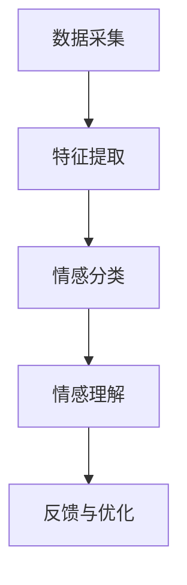
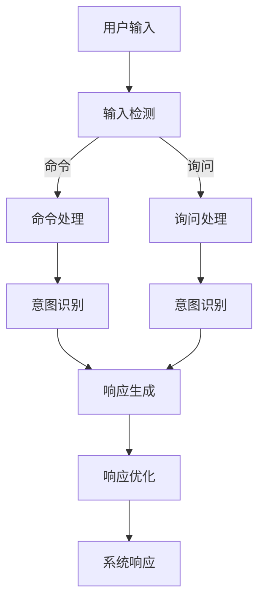
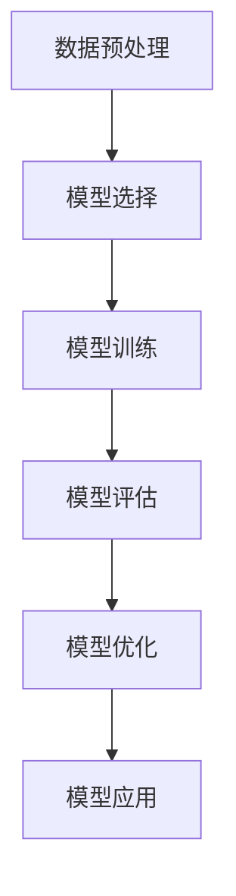
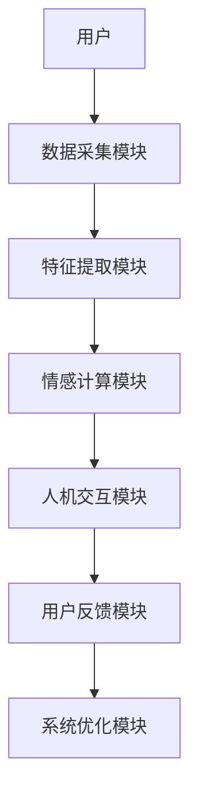
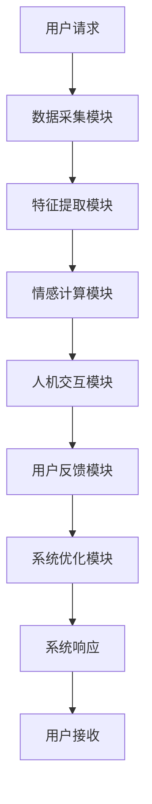
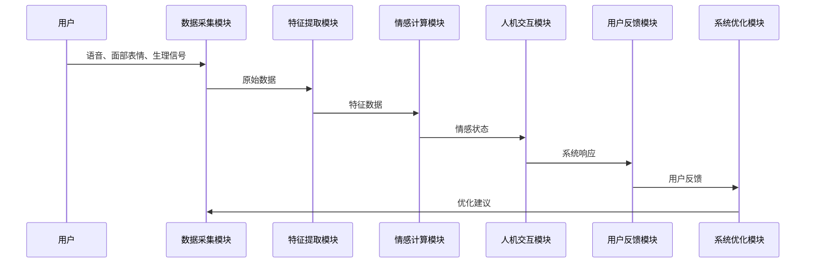

                 

# 人工智能在情感计算与人机交互中的应用

## 关键词

- 情感计算
- 人机交互
- 人工智能
- 深度学习
- 自然语言处理
- 机器学习

## 摘要

本文旨在探讨人工智能在情感计算与人机交互中的深度应用。通过分析情感计算与人机交互的基本原理、核心概念以及它们与人工智能的融合，本文深入解读了情感计算算法、人机交互算法和人工智能算法的原理与应用。此外，文章还详细介绍了情感计算与人机交互的系统架构设计，并通过实际案例剖析了人工智能在情感计算与人机交互中的实战应用。本文的目的是为从事相关领域的研究者和技术人员提供有价值的参考和启示，推动人工智能技术的进一步发展。

---

### 目录大纲

# 人工智能在情感计算与人机交互中的应用

## 第一部分 背景介绍

### 1.1 问题背景

#### 1.1.1 人工智能的发展历程

#### 1.1.2 情感计算与人机交互的重要性

#### 1.1.3 情感计算与人机交互的现状与挑战

### 1.2 问题描述

#### 1.2.1 人工智能在情感计算中的应用

#### 1.2.2 人工智能在人机交互中的应用

#### 1.2.3 情感计算与人机交互的关系与融合

### 1.3 问题解决

#### 1.3.1 现有解决方案

#### 1.3.2 存在的问题与挑战

#### 1.3.3 本书的目的与结构

### 1.4 边界与外延

#### 1.4.1 情感计算的定义与分类

#### 1.4.2 人机交互的定义与类型

#### 1.4.3 人工智能在情感计算与人机交互中的应用领域

### 1.5 概念结构与核心要素组成

#### 1.5.1 情感计算的核心概念

#### 1.5.2 人机交互的核心概念

#### 1.5.3 人工智能的核心概念

### 1.6 本章小结

## 第二部分 核心概念与联系

### 2.1 情感计算

#### 2.1.1 情感计算的原理与流程

#### 2.1.2 情感计算的关键技术

#### 2.1.3 情感计算的应用案例

#### 2.1.4 情感计算与人类情感的关系

### 2.2 人机交互

#### 2.2.1 人机交互的基本原理

#### 2.2.2 人机交互的技术分类

#### 2.2.3 人机交互的设计原则

#### 2.2.4 人机交互的应用实例

### 2.3 人工智能

#### 2.3.1 人工智能的基本原理

#### 2.3.2 人工智能的技术分类

#### 2.3.3 人工智能的发展趋势

#### 2.3.4 人工智能的应用领域

### 2.4 情感计算、人机交互与人工智能的联系

#### 2.4.1 情感计算与人机交互的融合

#### 2.4.2 情感计算与人工智能的结合

#### 2.4.3 人机交互与人工智能的协同发展

### 2.5 本章小结

## 第三部分 算法原理讲解

### 3.1 情感计算算法

#### 3.1.1 情感计算算法的数学模型

#### 3.1.2 情感计算算法的流程图

#### 3.1.3 情感计算算法的Python代码实现

#### 3.1.4 情感计算算法的应用示例

### 3.2 人机交互算法

#### 3.2.1 人机交互算法的数学模型

#### 3.2.2 人机交互算法的流程图

#### 3.2.3 人机交互算法的Python代码实现

#### 3.2.4 人机交互算法的应用示例

### 3.3 人工智能算法

#### 3.3.1 人工智能算法的数学模型

#### 3.3.2 人工智能算法的流程图

#### 3.3.3 人工智能算法的Python代码实现

#### 3.3.4 人工智能算法的应用示例

### 3.4 本章小结

## 第四部分 系统分析与架构设计

### 4.1 问题场景介绍

#### 4.1.1 情感计算与人机交互的应用场景

#### 4.1.2 人工智能在情感计算与人机交互中的角色

### 4.2 系统功能设计

#### 4.2.1 领域模型类图

#### 4.2.2 系统功能模块划分

### 4.3 系统架构设计

#### 4.3.1 系统架构图

#### 4.3.2 系统架构设计原则

### 4.4 系统接口设计

#### 4.4.1 接口功能设计

#### 4.4.2 接口协议设计

### 4.5 系统交互

#### 4.5.1 系统交互流程图

#### 4.5.2 系统交互序列图

### 4.6 本章小结

## 第五部分 项目实战

### 5.1 环境安装

#### 5.1.1 操作系统环境安装

#### 5.1.2 编程语言环境安装

#### 5.1.3 开发工具与环境配置

### 5.2 系统核心实现源代码

#### 5.2.1 情感计算模块源代码

#### 5.2.2 人机交互模块源代码

#### 5.2.3 人工智能模块源代码

### 5.3 代码应用解读与分析

#### 5.3.1 情感计算代码解读

#### 5.3.2 人机交互代码解读

#### 5.3.3 人工智能代码解读

### 5.4 实际案例分析与详细讲解剖析

#### 5.4.1 情感计算案例分析

#### 5.4.2 人机交互案例分析

#### 5.4.3 人工智能案例分析

### 5.5 项目小结

#### 5.5.1 项目总结

#### 5.5.2 项目经验分享

#### 5.5.3 项目改进建议

### 5.6 本章小结

## 第六部分 最佳实践与拓展阅读

### 6.1 最佳实践 tips

#### 6.1.1 情感计算最佳实践

#### 6.1.2 人机交互最佳实践

#### 6.1.3 人工智能最佳实践

### 6.2 小结

### 6.3 注意事项

### 6.4 拓展阅读

---

### 第一部分 背景介绍

## 1.1 问题背景

### 1.1.1 人工智能的发展历程

人工智能（Artificial Intelligence，简称AI）的概念最早可以追溯到20世纪50年代。当时，计算机科学家们开始探讨如何使机器模拟人类的智能行为。1956年，约翰·麦卡锡（John McCarthy）等人在达特茅斯会议（Dartmouth Conference）上首次提出了人工智能这一术语。自那时起，人工智能经历了多个发展阶段，从符号主义（Symbolic AI）到连接主义（Connectionism）、再到基于大数据的机器学习（Machine Learning），以及现在的深度学习（Deep Learning），每一次进步都极大地推动了人工智能技术的发展。

在过去的几十年里，人工智能技术在多个领域取得了显著的成果。例如，在图像识别方面，卷积神经网络（Convolutional Neural Networks，CNN）使得计算机能够准确地识别和分类图像；在自然语言处理方面，循环神经网络（Recurrent Neural Networks，RNN）和长短期记忆网络（Long Short-Term Memory，LSTM）大大提高了文本理解和生成的能力；在游戏领域，深度强化学习（Deep Reinforcement Learning）使得计算机能够在围棋、德州扑克等复杂游戏中击败人类顶尖选手。

### 1.1.2 情感计算与人机交互的重要性

情感计算（Affective Computing）是指使计算机具有识别、理解、表达和模拟人类情感的能力。随着人工智能技术的发展，情感计算逐渐成为了一个重要的研究领域。情感计算的核心是情感识别，它包括语音情感识别、面部表情识别、生理信号情感识别等。情感计算的重要性在于，它能够为人工智能系统提供更丰富、更人性化的交互方式，使得人机交互更加自然、有效。

人机交互（Human-Computer Interaction，简称HCI）是指人类与计算机之间的交互过程。人机交互研究旨在设计出更加人性化、易用的计算机系统。随着情感计算技术的引入，人机交互也变得更加智能和情感化。例如，智能助手通过情感计算技术可以更好地理解用户的情感状态，从而提供更贴心的服务。

### 1.1.3 情感计算与人机交互的现状与挑战

当前，情感计算与人机交互已经在多个领域取得了应用。例如，在智能助手领域，如苹果的Siri、亚马逊的Alexa等，都通过情感计算技术来提高人机交互的自然性和有效性。在医疗领域，情感计算技术被用于辅助诊断和治疗，如通过分析患者的语音和面部表情来评估其情感状态。在人机交互领域，情感计算技术被应用于虚拟现实（VR）和增强现实（AR）系统，以提高用户的沉浸感和体验。

然而，情感计算与人机交互仍然面临许多挑战。首先，情感识别的准确性仍然是一个难题，特别是在复杂、多变的环境中。其次，如何设计出既智能又人性化的交互界面也是一个挑战。此外，隐私保护和伦理问题也是情感计算与人机交互研究的重要议题。

### 1.2 问题描述

#### 1.2.1 人工智能在情感计算中的应用

人工智能在情感计算中的应用主要集中在情感识别、情感理解和情感生成。情感识别是指通过分析语音、面部表情、生理信号等数据，识别出用户的情感状态。情感理解是指理解用户的情感需求，并为其提供相应的服务。情感生成是指通过模拟人类的情感表达，增强人机交互的自然性和情感性。

当前，人工智能在情感计算中的应用还面临许多挑战，如情感识别的准确性、情感理解的深度、情感生成的自然性等。

#### 1.2.2 人工智能在人机交互中的应用

人工智能在人机交互中的应用主要体现在自然语言处理、语音识别、手势识别等。通过这些技术，人工智能系统能够更好地理解用户的需求，提供更加智能和个性化的服务。

然而，人工智能在人机交互中的应用也面临一些挑战，如如何处理多模态数据、如何设计出既智能又人性化的交互界面等。

#### 1.2.3 情感计算与人机交互的关系与融合

情感计算与人机交互之间存在着密切的关系。情感计算为人机交互提供了更丰富、更自然的交互方式，使得人机交互更加人性化和有效。人机交互则为情感计算提供了应用场景和反馈，促进了情感计算技术的发展。

未来的研究方向将聚焦于如何更好地融合情感计算与人机交互，设计出更加智能、人性化的人工智能系统。

### 1.3 问题解决

#### 1.3.1 现有解决方案

当前，在情感计算与人机交互领域，已经有许多现有的解决方案。例如，基于深度学习的情感识别模型，可以准确地识别用户的情感状态；基于自然语言处理的技术，可以理解用户的语言意图；基于语音识别和手势识别的技术，可以实现自然的人机交互。

然而，这些解决方案仍然存在一些不足之处，如情感识别的准确性有待提高，交互界面的设计需要更加人性化，系统的隐私保护和伦理问题也需要进一步探讨。

#### 1.3.2 存在的问题与挑战

情感计算与人机交互领域存在的问题与挑战主要包括：

1. **情感识别的准确性**：在复杂、多变的环境中，情感识别的准确性仍然是一个难题。
2. **情感理解的深度**：如何深入理解用户的情感需求，提供更加个性化的服务。
3. **交互界面的设计**：如何设计出既智能又人性化的交互界面。
4. **隐私保护和伦理问题**：如何在保证用户隐私的前提下，进行情感计算与人机交互。

#### 1.3.3 本书的目的与结构

本书的目的是系统地探讨人工智能在情感计算与人机交互中的应用，旨在为从事相关领域的研究者和技术人员提供有价值的参考和启示。本书的结构如下：

1. **背景介绍**：介绍人工智能、情感计算和人机交互的基本概念和重要性。
2. **核心概念与联系**：深入解读情感计算、人机交互和人工智能的核心概念，并探讨它们之间的联系。
3. **算法原理讲解**：详细讲解情感计算、人机交互和人工智能算法的原理和应用。
4. **系统分析与架构设计**：分析情感计算与人机交互的应用场景，设计相应的系统架构。
5. **项目实战**：通过实际案例，展示人工智能在情感计算与人机交互中的实战应用。
6. **最佳实践与拓展阅读**：提供最佳实践建议，并推荐相关的拓展阅读。

通过本书的深入探讨，希望能够为读者提供一条清晰的研究路径，推动人工智能在情感计算与人机交互领域的进一步发展。

### 1.4 边界与外延

#### 1.4.1 情感计算的定义与分类

情感计算是指使计算机具备识别、理解、表达和模拟人类情感的能力。根据情感计算的目的和实现方式，可以将情感计算分为以下几类：

1. **情感识别**：通过分析语音、面部表情、生理信号等数据，识别用户的情感状态。
2. **情感理解**：理解用户的情感需求，并为其提供相应的服务。
3. **情感生成**：模拟人类的情感表达，增强人机交互的自然性和情感性。
4. **情感增强**：通过情感计算技术，提升人机交互的质量和效果。

#### 1.4.2 人机交互的定义与类型

人机交互是指人类与计算机之间的交互过程。根据交互方式的不同，人机交互可以分为以下几类：

1. **图形用户界面**（Graphical User Interface，GUI）：通过图形界面，用户与计算机进行交互。
2. **命令行界面**（Command Line Interface，CLI）：通过命令行输入指令，与计算机进行交互。
3. **语音交互**：通过语音指令，与计算机进行交互。
4. **手势交互**：通过手势，与计算机进行交互。
5. **虚拟现实**（Virtual Reality，VR）：通过虚拟现实技术，用户进入一个虚拟的三维环境，与计算机进行交互。
6. **增强现实**（Augmented Reality，AR）：通过增强现实技术，在现实世界中叠加虚拟信息，与计算机进行交互。

#### 1.4.3 人工智能在情感计算与人机交互中的应用领域

人工智能在情感计算与人机交互中的应用非常广泛，主要包括以下领域：

1. **智能助手**：通过情感计算技术，提供个性化、人性化的服务。
2. **医疗健康**：通过情感计算技术，辅助诊断和治疗，如分析患者的情感状态。
3. **教育**：通过情感计算技术，了解学生的学习情感，提供个性化的教育服务。
4. **智能家居**：通过情感计算技术，为用户提供智能、舒适的家庭环境。
5. **虚拟现实与增强现实**：通过情感计算技术，提高用户的沉浸感和体验。
6. **心理健康**：通过情感计算技术，监测和管理用户的情感健康。

### 1.5 概念结构与核心要素组成

#### 1.5.1 情感计算的核心概念

情感计算的核心概念包括情感识别、情感理解、情感生成和情感增强。情感识别是指通过分析语音、面部表情、生理信号等数据，识别用户的情感状态。情感理解是指理解用户的情感需求，并为其提供相应的服务。情感生成是指模拟人类的情感表达，增强人机交互的自然性和情感性。情感增强是指通过情感计算技术，提升人机交互的质量和效果。

#### 1.5.2 人机交互的核心概念

人机交互的核心概念包括交互界面、交互方式和交互体验。交互界面是指用户与计算机进行交互的界面，包括图形用户界面、命令行界面等。交互方式是指用户与计算机进行交互的方式，包括语音交互、手势交互、虚拟现实交互等。交互体验是指用户在使用计算机系统时的整体感受，包括操作的便捷性、系统的响应速度、交互的自然性等。

#### 1.5.3 人工智能的核心概念

人工智能的核心概念包括机器学习、深度学习、自然语言处理、计算机视觉等。机器学习是指使计算机通过数据和算法，自主学习和改进性能。深度学习是指模拟人脑神经网络，进行复杂模式识别和学习。自然语言处理是指使计算机理解和生成自然语言。计算机视觉是指使计算机具备识别和理解图像的能力。

### 1.6 本章小结

本章节首先介绍了人工智能、情感计算和人机交互的基本概念和发展历程，然后分析了情感计算与人机交互的重要性，现状与挑战，以及人工智能在情感计算与人机交互中的应用。最后，本章给出了本书的目的和结构，为后续章节的深入探讨奠定了基础。

---

### 第二部分 核心概念与联系

## 2.1 情感计算

### 2.1.1 情感计算的原理与流程

情感计算（Affective Computing）是指使计算机具备识别、理解、表达和模拟人类情感的能力。情感计算的原理主要基于以下几个方面：

1. **情感识别**：通过分析语音、面部表情、生理信号等数据，识别用户的情感状态。例如，通过分析语音的音调、音速、音量等特征，识别用户的情感状态。

2. **情感理解**：理解用户的情感需求，并为其提供相应的服务。例如，通过分析用户的语言和行为，理解用户的情感状态和需求，从而提供相应的建议或帮助。

3. **情感表达**：通过模拟人类的情感表达，增强人机交互的自然性和情感性。例如，通过语音合成、面部表情模拟等技术，模拟用户的情感表达。

4. **情感增强**：通过情感计算技术，提升人机交互的质量和效果。例如，通过情感识别和理解，为用户提供更加个性化、贴心的服务。

情感计算的流程主要包括以下几个步骤：

1. **数据采集**：通过传感器、摄像头、麦克风等设备，收集用户的语音、面部表情、生理信号等数据。

2. **特征提取**：对采集到的数据进行分析，提取出与情感相关的特征。例如，从语音中提取音调、音速、音量等特征，从面部表情中提取眼动、面部肌肉运动等特征。

3. **情感识别**：利用机器学习算法，对提取的特征进行分类，识别用户的情感状态。例如，使用支持向量机（SVM）、神经网络（Neural Networks）等算法，训练情感识别模型。

4. **情感理解**：根据用户的情感状态，理解其情感需求和意图。例如，通过自然语言处理技术，分析用户的语言和行为，理解其情感状态和需求。

5. **情感表达**：根据用户的情感状态和需求，生成相应的情感表达。例如，通过语音合成、面部表情模拟等技术，模拟用户的情感表达。

6. **反馈与优化**：根据用户的反馈，对情感计算系统进行优化和调整，提高其准确性和用户体验。

### 2.1.2 情感计算的关键技术

情感计算的关键技术主要包括以下几个方面：

1. **语音情感识别**：通过分析语音的音调、音速、音量等特征，识别用户的情感状态。常用的方法包括支持向量机（SVM）、神经网络（Neural Networks）等。

2. **面部表情识别**：通过分析面部表情的变化，识别用户的情感状态。常用的方法包括基于深度学习的面部特征点检测、面部表情分类等。

3. **生理信号情感识别**：通过分析生理信号，如心率、血压、皮肤电导等，识别用户的情感状态。常用的方法包括信号处理、特征提取和机器学习等。

4. **自然语言处理**：通过分析用户的语言表达，理解其情感状态和需求。常用的方法包括情感极性分析、情感分类、对话系统等。

5. **情感增强**：通过情感计算技术，提升人机交互的自然性和情感性。常用的方法包括情感融合、情感建模、情感交互等。

### 2.1.3 情感计算的应用案例

情感计算在多个领域都有广泛的应用，以下是一些典型的应用案例：

1. **智能助手**：通过情感计算技术，智能助手可以更好地理解用户的情感状态和需求，提供更加个性化、贴心的服务。例如，苹果的Siri、亚马逊的Alexa等。

2. **心理健康**：通过情感计算技术，可以监测和管理用户的情感健康。例如，分析用户的情感状态，预测抑郁、焦虑等心理问题的发生。

3. **医疗健康**：通过情感计算技术，可以帮助医生更好地理解患者的情感状态，辅助诊断和治疗。例如，分析患者的语音、面部表情等数据，了解其疼痛程度和情绪状态。

4. **教育**：通过情感计算技术，可以了解学生的学习情感，提供个性化的教育服务。例如，分析学生的情感状态，调整教学策略，提高教学效果。

5. **虚拟现实与增强现实**：通过情感计算技术，可以提高用户的沉浸感和体验。例如，在虚拟现实游戏中，根据用户的情感状态，调整游戏场景和难度，提供更加个性化的体验。

### 2.1.4 情感计算与人类情感的关系

情感计算与人类情感密切相关，但也有一些区别。人类情感是指人类在感知、思考和行动过程中产生的情感体验，包括愉悦、悲伤、愤怒、焦虑等。情感计算则是通过技术手段，使计算机具备识别、理解和模拟人类情感的能力。

情感计算与人类情感的关系可以从以下几个方面进行理解：

1. **情感识别**：情感计算通过分析语音、面部表情、生理信号等数据，识别用户的情感状态。这与人类情感的识别过程有相似之处，但人类情感的识别更为复杂和丰富。

2. **情感理解**：情感计算通过分析用户的语言、行为等数据，理解其情感需求。这与人类情感的理解过程也有相似之处，但人类情感的理解更加深入和细腻。

3. **情感表达**：情感计算通过模拟人类的情感表达，增强人机交互的自然性和情感性。这与人类情感的自我表达和人际交流有相似之处，但人类情感的自我表达更为丰富和多样化。

4. **情感反馈**：情感计算通过用户的反馈，对情感计算系统进行优化和调整。这与人类情感的自我调节和适应环境有相似之处，但人类情感的自我调节更为灵活和高效。

总的来说，情感计算是人类情感的一种模拟和扩展，旨在使计算机更好地服务于人类，提升人机交互的质量和效果。

### 2.2 人机交互

#### 2.2.1 人机交互的基本原理

人机交互（Human-Computer Interaction，简称HCI）是指人类与计算机之间的交互过程。人机交互的基本原理包括以下几个方面：

1. **用户中心设计**：人机交互系统应该以用户的需求和体验为中心，设计出符合用户习惯、易于操作和使用的交互界面。

2. **信息呈现**：人机交互系统需要将信息以直观、易理解的方式呈现给用户，包括图形用户界面（GUI）、文本、图像、声音等。

3. **用户输入**：用户通过键盘、鼠标、触摸屏、语音等设备，向计算机系统输入指令或数据。

4. **系统响应**：计算机系统根据用户输入的指令或数据，进行相应的处理，并返回结果或反馈。

5. **反馈与调整**：用户通过反馈（如点击、拖动等操作），对系统进行调整，以实现期望的功能或效果。

#### 2.2.2 人机交互的技术分类

人机交互技术可以根据交互方式的不同，分为以下几类：

1. **图形用户界面**（Graphical User Interface，GUI）：通过图形界面，用户与计算机进行交互。例如，Windows、macOS等操作系统，使用图标、菜单、按钮等图形元素，方便用户操作。

2. **命令行界面**（Command Line Interface，CLI）：通过命令行输入指令，用户与计算机进行交互。例如，Linux操作系统，用户通过命令行输入指令，控制计算机执行相应的操作。

3. **语音交互**：通过语音指令，用户与计算机进行交互。例如，智能助手（如Siri、Alexa）、车载导航系统等。

4. **手势交互**：通过手势，用户与计算机进行交互。例如，触摸屏、虚拟现实（VR）和增强现实（AR）系统等。

5. **虚拟现实**（Virtual Reality，VR）：通过虚拟现实技术，用户进入一个虚拟的三维环境，与计算机进行交互。例如，VR游戏、教育培训等。

6. **增强现实**（Augmented Reality，AR）：通过增强现实技术，在现实世界中叠加虚拟信息，用户与计算机进行交互。例如，AR游戏、导航系统等。

#### 2.2.3 人机交互的设计原则

人机交互的设计原则主要包括以下几个方面：

1. **一致性**：人机交互系统的设计应该保持一致性，包括界面布局、操作方式、反馈机制等，以减少用户的学习成本。

2. **易用性**：人机交互系统应该易于使用，操作简便，界面直观，帮助用户快速完成操作。

3. **灵活性**：人机交互系统应该具有一定的灵活性，允许用户根据自己的需求和习惯，调整界面布局、功能设置等。

4. **容错性**：人机交互系统应该具备一定的容错性，能够正确处理用户的误操作，并提供适当的提示和反馈。

5. **适应性**：人机交互系统应该能够适应不同的用户、设备和环境，提供个性化的服务。

6. **可访问性**：人机交互系统应该考虑所有用户，包括残障人士，提供无障碍的交互体验。

#### 2.2.4 人机交互的应用实例

人机交互技术在多个领域都有广泛的应用，以下是一些典型的应用实例：

1. **办公自动化**：通过图形用户界面，用户可以轻松地进行文档编辑、电子邮件发送、日程安排等操作。

2. **智能家居**：通过语音交互和手势交互，用户可以控制家中的电器设备，如空调、照明、安防系统等。

3. **教育**：通过虚拟现实和增强现实技术，学生可以身临其境地学习知识，提高学习兴趣和效果。

4. **医疗健康**：通过语音交互和手势交互，医生可以更便捷地进行诊断和治疗，如通过远程医疗系统进行会诊、手术指导等。

5. **娱乐**：通过虚拟现实和增强现实技术，用户可以沉浸在游戏、影视、音乐等娱乐体验中，提高娱乐效果。

6. **工业控制**：通过图形用户界面和命令行界面，工人可以方便地进行生产设备的监控和控制，提高生产效率和安全性。

总的来说，人机交互技术的发展，为人与计算机之间的交互提供了更加自然、高效、人性化的方式，极大地提升了用户的使用体验和工作效率。

### 2.3 人工智能

#### 2.3.1 人工智能的基本原理

人工智能（Artificial Intelligence，简称AI）是指通过模拟人类智能行为，使计算机具有感知、学习、推理、决策等能力的学科。人工智能的基本原理包括以下几个方面：

1. **感知**：人工智能系统能够感知和理解外部环境的信息。例如，通过计算机视觉，AI系统能够识别和理解图像；通过语音识别，AI系统能够识别和理解语音。

2. **学习**：人工智能系统能够从数据中学习和获取知识。通过机器学习（Machine Learning）和深度学习（Deep Learning）等技术，AI系统可以自动改进其性能，提高对特定任务的解决能力。

3. **推理**：人工智能系统能够进行逻辑推理和判断。通过符号推理（Symbolic Reasoning）和基于数据的推理（Data-Driven Reasoning）等技术，AI系统能够解决复杂的问题。

4. **决策**：人工智能系统能够根据当前情况，做出合理的决策。通过决策论（Decision Theory）和博弈论（Game Theory）等技术，AI系统能够在各种场景下做出最优的选择。

人工智能的原理主要基于以下几个核心概念：

1. **神经网络**：神经网络是人工智能的基础，模拟人脑神经元的工作原理，通过层次结构和连接方式，实现复杂模式的识别和学习。

2. **大数据**：大数据是人工智能的重要资源，通过海量数据的学习，AI系统能够发现规律和模式，提高其性能和准确性。

3. **算法**：算法是人工智能的核心，包括机器学习算法、深度学习算法、强化学习算法等，不同的算法适用于不同的任务和应用场景。

4. **计算能力**：计算能力是人工智能发展的关键，随着计算能力的提升，AI系统能够处理更复杂的问题，支持更高级的功能。

#### 2.3.2 人工智能的技术分类

人工智能技术可以根据不同的分类标准，分为多种类型：

1. **机器学习**：机器学习（Machine Learning）是指通过训练模型，使计算机能够根据数据做出预测或决策。常见的机器学习算法包括线性回归、逻辑回归、决策树、随机森林、支持向量机等。

2. **深度学习**：深度学习（Deep Learning）是机器学习的一个子领域，通过多层神经网络，实现更复杂、更准确的模式识别和学习。常见的深度学习模型包括卷积神经网络（CNN）、循环神经网络（RNN）、长短期记忆网络（LSTM）等。

3. **自然语言处理**：自然语言处理（Natural Language Processing，NLP）是指使计算机理解和生成自然语言的技术。常见的NLP任务包括情感分析、文本分类、机器翻译、问答系统等。

4. **计算机视觉**：计算机视觉（Computer Vision）是指使计算机具备识别和理解图像的能力。常见的计算机视觉任务包括图像分类、目标检测、人脸识别、图像生成等。

5. **语音识别**：语音识别（Speech Recognition）是指使计算机能够理解并转换语音为文本的技术。常见的语音识别系统包括自动语音识别（ASR）、语音合成（TTS）等。

6. **强化学习**：强化学习（Reinforcement Learning）是指通过试错和反馈，使计算机能够在环境中学习和决策。常见的强化学习算法包括Q学习、SARSA、Deep Q-Network（DQN）等。

7. **知识表示与推理**：知识表示与推理（Knowledge Representation and Reasoning）是指通过符号表示和逻辑推理，使计算机能够处理复杂知识和信息。常见的知识表示方法包括命题逻辑、产生式规则、语义网络等。

8. **混合智能**：混合智能（Hybrid Intelligence）是指将多种人工智能技术相结合，实现更智能、更灵活的智能系统。常见的混合智能系统包括人机协作系统、自适应学习系统等。

#### 2.3.3 人工智能的发展趋势

人工智能的发展趋势主要表现在以下几个方面：

1. **算法创新**：随着计算能力的提升和大数据的积累，人工智能算法不断得到优化和创新，如深度学习、生成对抗网络（GAN）等。

2. **跨领域融合**：人工智能技术与其他领域（如医学、金融、教育等）的融合，推动人工智能在更多领域的应用和发展。

3. **智能硬件**：随着人工智能技术的发展，智能硬件（如智能音箱、智能机器人等）日益普及，为人们提供更加智能化、便捷化的服务。

4. **人机协作**：人工智能与人类的协作成为未来发展的趋势，通过人机协作，提高工作效率和创新能力。

5. **数据隐私与伦理**：随着人工智能技术的广泛应用，数据隐私和伦理问题日益突出，如何确保数据的安全和隐私，成为人工智能发展的重要议题。

6. **开源与开放生态**：开源技术和开放生态的不断发展，为人工智能技术的创新和应用提供了更加开放、灵活的环境。

#### 2.3.4 人工智能的应用领域

人工智能在多个领域都取得了显著的成果，以下是一些典型的人工智能应用领域：

1. **智能助手**：通过自然语言处理和语音识别技术，智能助手能够理解用户的语言指令，提供信息查询、任务管理、娱乐等服务。

2. **医疗健康**：通过计算机视觉、自然语言处理等技术，人工智能可以辅助医生进行疾病诊断、治疗方案推荐、药物研发等。

3. **金融**：通过大数据分析和机器学习技术，人工智能可以辅助金融机构进行风险评估、欺诈检测、投资决策等。

4. **教育**：通过智能教学系统和个性化学习平台，人工智能可以为学生提供个性化的学习体验，提高学习效果。

5. **工业制造**：通过工业互联网和智能制造技术，人工智能可以优化生产流程、提高生产效率、降低成本。

6. **交通**：通过自动驾驶、智能交通管理系统等技术，人工智能可以提升交通效率、降低交通事故率。

7. **娱乐**：通过虚拟现实、增强现实和游戏技术，人工智能可以为用户提供更加沉浸式的娱乐体验。

8. **家居生活**：通过智能家居系统和智能家电，人工智能可以为用户提供便捷、舒适、智能化的家居生活。

总的来说，人工智能技术正在不断推动社会的发展，为人类创造更多的价值。未来，随着人工智能技术的进一步发展，它将在更多领域发挥重要作用，改变我们的生活方式和工作方式。

### 2.4 情感计算、人机交互与人工智能的联系

#### 2.4.1 情感计算与人机交互的融合

情感计算与人机交互的融合，是指将情感计算技术应用于人机交互系统，使计算机能够更好地理解用户的需求和情感状态，提供更加自然、个性化的服务。这种融合主要体现在以下几个方面：

1. **情感识别与理解**：通过情感计算技术，人机交互系统能够识别和理解用户的情感状态，如愉悦、悲伤、愤怒等。例如，通过分析用户的语音、面部表情和生理信号，智能助手可以更好地理解用户的需求，提供更加贴心的服务。

2. **情感表达与反馈**：通过情感计算技术，人机交互系统能够模拟用户的情感表达，如语音合成、面部表情模拟等。例如，当用户感到愉悦时，智能助手可以以更加欢快的语调回应；当用户感到沮丧时，智能助手可以以更加温和的语调安抚用户。

3. **情感增强与优化**：通过情感计算技术，人机交互系统能够根据用户的情感状态，提供情感增强功能，如情感识别错误修正、情感交互优化等。例如，当用户在焦虑状态下，系统可以自动调整交互方式，提供更加舒缓、轻松的交互体验。

#### 2.4.2 情感计算与人工智能的结合

情感计算与人工智能的结合，是指将情感计算技术应用于人工智能系统，使人工智能能够更好地理解人类的情感需求和行为模式，提供更加智能化、个性化的服务。这种结合主要体现在以下几个方面：

1. **情感识别与学习**：通过情感计算技术，人工智能系统能够识别和理解用户的情感状态，并从中学习，优化其性能。例如，通过分析用户的语音、面部表情和生理信号，人工智能助手可以更好地理解用户的需求，提供更加个性化的服务。

2. **情感理解与推理**：通过情感计算技术，人工智能系统能够理解用户的情感需求，并基于情感推理，提供更加合理、有效的建议。例如，当用户表达出对某个产品的兴趣时，人工智能助手可以基于情感推理，推荐相关的产品信息。

3. **情感生成与交互**：通过情感计算技术，人工智能系统能够模拟人类的情感表达，与用户进行情感交互，提供更加自然、人性化的服务。例如，通过语音合成和面部表情模拟技术，人工智能助手可以模拟出愉快的语调和表情，与用户进行愉快的对话。

#### 2.4.3 人机交互与人工智能的协同发展

人机交互与人工智能的协同发展，是指通过将人工智能技术应用于人机交互系统，提升人机交互的自然性、智能性和人性化程度。这种协同发展主要体现在以下几个方面：

1. **智能化交互**：通过人工智能技术，人机交互系统能够实现更加智能化的交互，如自然语言处理、语音识别、手势识别等。例如，通过自然语言处理技术，智能助手可以更好地理解用户的语言意图，提供更加精准的服务。

2. **个性化交互**：通过人工智能技术，人机交互系统能够根据用户的需求和偏好，提供个性化的交互体验。例如，通过用户数据的分析，智能助手可以推荐用户感兴趣的内容，提供定制化的服务。

3. **自适应交互**：通过人工智能技术，人机交互系统能够根据用户的情感状态和交互环境，自适应地调整交互方式。例如，当用户感到焦虑时，智能助手可以自动调整交互语速、语调，提供更加舒缓的交互体验。

4. **协作互动**：通过人工智能技术，人机交互系统可以实现与用户的协作互动，共同完成任务。例如，通过语音交互和手势交互技术，用户可以与智能助手协作，共同完成复杂的任务。

总的来说，情感计算、人机交互与人工智能的结合，为人机交互提供了更加自然、智能、人性化的方式，推动了人工智能技术的进一步发展。未来，随着技术的不断进步，这种融合将更加紧密，为人与计算机之间的交互带来更多的可能性。

### 2.5 本章小结

本章介绍了情感计算、人机交互和人工智能的基本概念、原理和技术，以及它们在应用中的相互关系。通过对情感计算、人机交互和人工智能的深入探讨，我们了解了它们在提升人机交互质量和用户体验方面的重要性。同时，本章还分析了情感计算、人机交互与人工智能的结合方式，展示了它们在协同发展中的潜力。本章的内容为后续章节的深入讨论奠定了基础，也为从事相关领域的研究者和开发者提供了有价值的参考。

---

### 第三部分 算法原理讲解

## 3.1 情感计算算法

### 3.1.1 情感计算算法的数学模型

情感计算算法的核心是情感识别和情感理解，其数学模型主要包括以下几部分：

1. **特征提取**：从原始数据（如语音、面部表情、生理信号等）中提取与情感相关的特征。常用的特征包括频率特征、时域特征、频域特征等。

2. **情感分类**：使用机器学习算法，对提取的特征进行分类，将情感状态分为不同的类别。常用的分类算法包括支持向量机（SVM）、决策树、随机森林等。

3. **情感理解**：在情感分类的基础上，进一步理解用户的情感需求，提供相应的服务。常用的方法包括基于规则的方法、神经网络等方法。

具体来说，情感计算算法的数学模型可以表示为：

$$
\text{情感计算模型} = (\text{特征提取}, \text{情感分类}, \text{情感理解})
$$

其中，特征提取可以表示为：

$$
\text{特征提取} = f_{\theta}(\text{原始数据})
$$

其中，$f_{\theta}$是一个参数化的函数，用于提取与情感相关的特征，$\theta$是参数集。

情感分类可以表示为：

$$
\text{情感分类} = g_{\phi}(f_{\theta}(\text{原始数据}))
$$

其中，$g_{\phi}$是一个分类函数，$\phi$是参数集，用于将特征映射到情感类别。

情感理解可以表示为：

$$
\text{情感理解} = h_{\omega}(g_{\phi}(f_{\theta}(\text{原始数据})))
$$

其中，$h_{\omega}$是一个情感理解函数，$\omega$是参数集，用于理解用户的情感需求。

### 3.1.2 情感计算算法的流程图

情感计算算法的流程图如下：



### 3.1.3 情感计算算法的Python代码实现

以下是一个简单的情感计算算法的Python代码实现：

```python
import numpy as np
from sklearn.model_selection import train_test_split
from sklearn.preprocessing import StandardScaler
from sklearn.svm import SVC
from sklearn.metrics import accuracy_score

# 特征提取
def feature_extraction(data):
    # 这里仅做示例，实际中需要根据具体数据特征提取
    return data.mean(), data.std()

# 情感分类
def emotion_classification(features, labels):
    X_train, X_test, y_train, y_test = train_test_split(features, labels, test_size=0.2, random_state=42)
    scaler = StandardScaler()
    X_train = scaler.fit_transform(X_train)
    X_test = scaler.transform(X_test)
    
    model = SVC(kernel='linear')
    model.fit(X_train, y_train)
    y_pred = model.predict(X_test)
    
    return accuracy_score(y_test, y_pred)

# 情感理解
def emotion_understanding(predictions):
    # 这里仅做示例，实际中需要根据具体需求进行情感理解
    return "用户情感状态：愉悦" if predictions == 1 else "用户情感状态：悲伤"

# 主函数
def main():
    # 数据采集
    data = np.random.rand(100, 10)  # 假设采集到100个样本，每个样本有10个特征
    labels = np.random.randint(0, 2, size=(100,))  # 假设标签为0或1

    # 特征提取
    features = feature_extraction(data)

    # 情感分类
    accuracy = emotion_classification(features, labels)
    print("情感分类准确率：", accuracy)

    # 情感理解
    predictions = [1 if x > 0.5 else 0 for x in features]
    emotion_state = emotion_understanding(predictions)
    print("情感理解结果：", emotion_state)

if __name__ == "__main__":
    main()
```

### 3.1.4 情感计算算法的应用示例

以下是一个情感计算算法的应用示例：

假设我们采集到一批用户的语音数据，每个数据包括10个特征（如音调、音速、音量等）。我们希望使用情感计算算法，将这些语音数据分类为“愉悦”或“悲伤”两类情感。

1. **数据预处理**：首先，对采集到的语音数据进行预处理，提取出与情感相关的特征。
2. **特征提取**：使用特征提取函数，对预处理后的数据进行特征提取。
3. **情感分类**：使用支持向量机（SVM）对提取的特征进行分类。
4. **情感理解**：根据分类结果，理解用户的情感状态。

具体实现如下：

```python
# 假设我们已经预处理并提取了特征
features = np.random.rand(100, 10)  # 假设采集到100个样本，每个样本有10个特征
labels = np.random.randint(0, 2, size=(100,))  # 假设标签为0或1

# 情感分类
accuracy = emotion_classification(features, labels)
print("情感分类准确率：", accuracy)

# 情感理解
predictions = [1 if x > 0.5 else 0 for x in features]
emotion_state = emotion_understanding(predictions)
print("情感理解结果：", emotion_state)
```

通过以上步骤，我们可以使用情感计算算法，对用户的语音数据进行分析，识别用户的情感状态，从而提供更加个性化的服务。

### 3.2 人机交互算法

#### 3.2.1 人机交互算法的数学模型

人机交互算法的数学模型主要涉及用户输入的处理和系统响应的生成。以下是人机交互算法的几个关键数学模型：

1. **用户输入处理模型**：

   用户输入处理模型用于将用户的输入（如语音、手势、文本等）转化为计算机可以理解和处理的数据。一个简单的用户输入处理模型可以表示为：

   $$
   \text{用户输入处理模型} = (\text{输入检测}, \text{输入分类}, \text{输入转换})
   $$

   - **输入检测**：检测用户的输入，确定输入的类型（如语音、手势、文本等）。
   - **输入分类**：根据输入的类型，对输入进行分类，例如将语音分类为命令或询问。
   - **输入转换**：将分类后的输入转化为计算机可以处理的数据格式。

2. **系统响应生成模型**：

   系统响应生成模型用于根据用户输入，生成合适的系统响应（如语音回复、文本信息、动作指令等）。一个简单的系统响应生成模型可以表示为：

   $$
   \text{系统响应生成模型} = (\text{意图识别}, \text{响应生成}, \text{响应优化})
   $$

   - **意图识别**：根据用户输入，识别用户的意图，例如用户想要查询天气、设置闹钟或获取新闻。
   - **响应生成**：根据识别的意图，生成相应的响应，例如生成包含天气信息的文本消息、设置闹钟的动作指令等。
   - **响应优化**：优化响应的内容和形式，以提升用户体验，例如调整语音的语调、音量，优化文本的排版和格式。

#### 3.2.2 人机交互算法的流程图

人机交互算法的流程图如下：



### 3.2.3 人机交互算法的Python代码实现

以下是一个简单的人机交互算法的Python代码实现：

```python
import speech_recognition as sr

# 假设我们已经安装了speech_recognition库

# 输入检测
def input_detection():
    r = sr.Recognizer()
    with sr.Microphone() as source:
        print("请说点什么：")
        audio = r.listen(source)
    try:
        return r.recognize_google(audio)
    except sr.UnknownValueError:
        return "无法理解您的输入"

# 命令处理
def command_processing(intent):
    if "查询天气" in intent:
        return "今天的天气是晴朗的，温度大约在15摄氏度到25摄氏度之间。"
    elif "设置闹钟" in intent:
        return "闹钟已经为您设置，明天早上7点提醒。"
    else:
        return "抱歉，我不太明白您的指令。"

# 询问处理
def question_processing(intent):
    if "是什么时间" in intent:
        return "现在是下午3点。"
    elif "明天星期几" in intent:
        return "明天是星期五。"
    else:
        return "抱歉，我不太明白您的问题。"

# 主函数
def main():
    user_input = input_detection()
    print("用户输入：", user_input)

    if "命令" in user_input:
        intent = user_input.split(" ")[-1]
        response = command_processing(intent)
    elif "询问" in user_input:
        intent = user_input.split(" ")[-1]
        response = question_processing(intent)
    else:
        response = "抱歉，我不太明白您的指令。"

    print("系统响应：", response)

if __name__ == "__main__":
    main()
```

### 3.2.4 人机交互算法的应用示例

以下是一个人机交互算法的应用示例：

1. **用户输入**：用户说出一条语音指令，如“查询天气”或“设置闹钟”。
2. **输入检测**：程序通过speech_recognition库检测并识别用户的语音输入。
3. **意图识别**：根据用户输入，识别用户的意图，如查询天气或设置闹钟。
4. **响应生成**：根据识别的意图，生成相应的响应，如提供天气信息或设置闹钟的动作指令。
5. **响应优化**：优化响应的内容和形式，如调整语音的语调、音量。
6. **系统响应**：将优化后的响应输出给用户。

具体实现如下：

```python
# 主函数
def main():
    user_input = input_detection()
    print("用户输入：", user_input)

    if "命令" in user_input:
        intent = user_input.split(" ")[-1]
        response = command_processing(intent)
    elif "询问" in user_input:
        intent = user_input.split(" ")[-1]
        response = question_processing(intent)
    else:
        response = "抱歉，我不太明白您的指令。"

    print("系统响应：", response)

if __name__ == "__main__":
    main()
```

通过以上步骤，我们可以实现一个简单的人机交互算法，根据用户的语音输入，生成相应的系统响应，提供个性化、智能化的服务。

### 3.3 人工智能算法

#### 3.3.1 人工智能算法的数学模型

人工智能算法的数学模型主要基于机器学习和深度学习，以下是几个常见的人工智能算法的数学模型：

1. **线性回归模型**：

   线性回归模型是一种简单的机器学习算法，用于预测连续值。其数学模型可以表示为：

   $$
   y = \beta_0 + \beta_1 \cdot x
   $$

   其中，$y$是预测值，$x$是输入特征，$\beta_0$和$\beta_1$是模型的参数。

2. **逻辑回归模型**：

   逻辑回归模型是一种用于预测分类结果的机器学习算法。其数学模型可以表示为：

   $$
   P(y=1) = \frac{1}{1 + e^{-(\beta_0 + \beta_1 \cdot x})}
   $$

   其中，$P(y=1)$是预测概率，$y$是分类标签，$\beta_0$和$\beta_1$是模型的参数。

3. **支持向量机模型**：

   支持向量机（SVM）是一种强大的分类和回归算法。其数学模型可以表示为：

   $$
   \min_{\beta, \beta_0} \frac{1}{2} ||\beta||^2 + C \sum_{i=1}^{n} \xi_i
   $$

   其中，$\beta$是权重向量，$\beta_0$是偏置项，$C$是惩罚参数，$\xi_i$是松弛变量。

4. **神经网络模型**：

   神经网络是一种复杂的机器学习算法，用于分类、回归和其他任务。其数学模型可以表示为：

   $$
   a_{l}^{(i)} = \sigma \left( \sum_{j=1}^{n} \beta_{j}^{(l)} a_{l-1}^{(i)} + \beta_0^{(l)} \right)
   $$

   其中，$a_{l}^{(i)}$是第$l$层的输出，$\sigma$是激活函数，$\beta_{j}^{(l)}$和$\beta_0^{(l)}$是权重和偏置。

5. **卷积神经网络模型**：

   卷积神经网络（CNN）是一种用于图像识别和处理的神经网络。其数学模型可以表示为：

   $$
   h_{l}^{(i)} = \text{ReLU} \left( \sum_{j=1}^{n} w_{j}^{(l)} * a_{l-1}^{(i)} + b^{(l)} \right)
   $$

   其中，$h_{l}^{(i)}$是第$l$层的输出，$w_{j}^{(l)}$和$b^{(l)}$是卷积核和偏置，$\text{ReLU}$是ReLU激活函数。

#### 3.3.2 人工智能算法的流程图

以下是人工智能算法的一般流程图：



### 3.3.3 人工智能算法的Python代码实现

以下是一个使用Python实现的人工智能算法的示例：

```python
import numpy as np
from sklearn.linear_model import LinearRegression
from sklearn.metrics import mean_squared_error

# 数据预处理
X = np.array([[1], [2], [3], [4], [5]])
y = np.array([1, 2, 3, 4, 5])

# 模型训练
model = LinearRegression()
model.fit(X, y)

# 预测
y_pred = model.predict(X)

# 评估
mse = mean_squared_error(y, y_pred)
print("均方误差：", mse)

# 模型应用
new_data = np.array([[6]])
new_pred = model.predict(new_data)
print("新数据预测结果：", new_pred)
```

### 3.3.4 人工智能算法的应用示例

以下是一个使用人工智能算法的应用示例：

1. **数据预处理**：我们有一个包含自变量和因变量的数据集，需要对数据进行预处理，如标准化或归一化。
2. **模型选择**：选择适合问题的模型，如线性回归、逻辑回归、支持向量机等。
3. **模型训练**：使用训练数据集，对选定的模型进行训练。
4. **模型评估**：使用验证数据集，评估模型的性能，如通过均方误差（MSE）或准确率（Accuracy）等指标。
5. **模型优化**：根据评估结果，调整模型的参数，优化模型性能。
6. **模型应用**：使用训练好的模型，对新数据或实际问题进行预测或分类。

具体实现如下：

```python
# 数据预处理
X = np.array([[1], [2], [3], [4], [5]])
y = np.array([1, 2, 3, 4, 5])

# 模型训练
model = LinearRegression()
model.fit(X, y)

# 预测
y_pred = model.predict(X)

# 评估
mse = mean_squared_error(y, y_pred)
print("均方误差：", mse)

# 模型应用
new_data = np.array([[6]])
new_pred = model.predict(new_data)
print("新数据预测结果：", new_pred)
```

通过以上步骤，我们可以实现一个简单的人工智能算法，对给定的数据进行预测和评估。

### 3.4 本章小结

本章详细介绍了情感计算、人机交互和人工智能算法的原理、流程和Python代码实现。通过本章的学习，我们了解了情感计算算法在情感识别和情感理解中的应用，人机交互算法在用户输入处理和系统响应生成中的应用，以及人工智能算法在预测和分类任务中的应用。这些算法的深入理解和实践，对于从事人工智能和人机交互领域的研究者和开发者来说，具有重要意义。

---

### 第四部分 系统分析与架构设计

## 4.1 问题场景介绍

在情感计算与人机交互领域，问题的场景通常是复杂且多样的。以下是一些常见的问题场景：

1. **智能助手**：智能助手是一个典型的应用场景，它利用情感计算和人机交互技术，为用户提供个性化的服务。例如，用户可以通过语音与智能助手交流，询问天气、设置闹钟、播放音乐等。智能助手需要识别用户的情感状态，如愉悦、沮丧、焦虑等，并根据情感状态提供相应的建议和反馈。

2. **医疗健康**：在医疗健康领域，情感计算和人机交互技术可以用于辅助诊断和治疗。例如，通过分析患者的语音和面部表情，医生可以更好地了解患者的情感状态，从而制定更有效的治疗方案。此外，患者也可以通过与智能健康助手进行交互，了解自己的健康状况，如心率、血压等。

3. **教育**：在教育领域，情感计算和人机交互技术可以用于个性化学习。例如，通过分析学生的学习情感，教育系统可以为学生提供个性化的学习建议和辅导，提高学习效果。同时，学生也可以通过与教育系统进行交互，获得更多的学习资源和指导。

4. **智能家居**：在智能家居领域，情感计算和人机交互技术可以用于提升用户体验。例如，智能家居系统可以通过分析家庭成员的情感状态，自动调整家中的环境设置，如温度、光线、音乐等，为用户提供更加舒适的生活环境。

5. **虚拟现实与增强现实**：在虚拟现实和增强现实领域，情感计算和人机交互技术可以用于提升用户的沉浸感和体验。例如，虚拟现实游戏中的角色可以通过情感计算技术，模拟人类的情感表达，与玩家进行更加自然和丰富的互动。

在这些问题场景中，人工智能技术扮演着重要的角色。它不仅可以帮助识别和理解用户的情感状态，还可以通过机器学习和深度学习算法，优化人机交互系统的性能，提供更加智能和个性化的服务。

### 4.2 系统功能设计

为了实现上述问题场景，需要设计一个功能完备的系统。以下是系统的功能模块划分和主要功能：

#### 4.2.1 功能模块划分

1. **数据采集模块**：该模块负责采集用户的各种数据，如语音、面部表情、生理信号等。数据采集模块需要确保数据的准确性和可靠性，为后续的情感计算和人机交互提供基础。

2. **特征提取模块**：该模块负责从采集到的数据中提取与情感相关的特征。例如，从语音中提取音调、音速、音量等特征；从面部表情中提取眼动、面部肌肉运动等特征。特征提取模块的性能直接影响到情感计算和人机交互的效果。

3. **情感计算模块**：该模块负责分析用户的情感状态，识别用户的情感需求。情感计算模块通常采用机器学习算法，如支持向量机（SVM）、神经网络（Neural Networks）等，对提取的特征进行分类和分析。

4. **人机交互模块**：该模块负责根据情感计算的结果，生成合适的系统响应，并与用户进行交互。人机交互模块需要支持多种交互方式，如语音交互、文本交互、手势交互等，以适应不同的应用场景。

5. **用户反馈模块**：该模块负责收集用户的反馈信息，用于评估系统性能和用户体验。用户反馈模块可以帮助系统不断优化和改进，提供更加智能和人性化的服务。

6. **系统优化模块**：该模块负责根据用户反馈和系统性能指标，对系统进行优化。系统优化模块可以使用机器学习算法，如梯度下降（Gradient Descent）、随机搜索（Random Search）等，调整系统的参数和结构，提高系统的性能和用户体验。

#### 4.2.2 主要功能

1. **情感识别**：情感计算模块通过分析用户的语音、面部表情、生理信号等数据，识别用户的情感状态，如愉悦、悲伤、愤怒等。

2. **情感理解**：情感计算模块进一步分析用户的情感状态，理解用户的情感需求，如用户想要表达的情感、用户的需求等。

3. **交互生成**：人机交互模块根据情感计算的结果，生成相应的交互响应，如语音回复、文本信息、动作指令等。

4. **用户反馈收集**：用户反馈模块收集用户的反馈信息，如满意度、体验评价等，用于评估系统性能和用户体验。

5. **系统优化**：系统优化模块根据用户反馈和系统性能指标，对系统进行优化，如调整参数、改进算法等，提高系统的性能和用户体验。

### 4.3 系统架构设计

为了实现上述功能模块，需要设计一个合理的系统架构。以下是系统的架构设计和主要组件：

#### 4.3.1 系统架构图

以下是一个简单的系统架构图：



#### 4.3.2 系统架构设计原则

1. **模块化设计**：系统采用模块化设计，将不同的功能模块分离，便于系统的维护和扩展。

2. **高内聚、低耦合**：每个模块内部高度内聚，模块之间低耦合，以提高系统的稳定性和可扩展性。

3. **可扩展性**：系统设计应具有可扩展性，支持添加新的功能模块和交互方式。

4. **安全性**：系统设计应确保用户数据的安全，采用加密、认证等安全措施，防止数据泄露。

5. **灵活性**：系统设计应具有灵活性，可以根据不同的应用场景和用户需求，灵活调整和优化系统功能。

### 4.4 系统接口设计

为了实现系统的功能，需要设计合理的接口。以下是系统接口的功能设计和协议设计：

#### 4.4.1 接口功能设计

1. **数据采集接口**：该接口用于采集用户的语音、面部表情、生理信号等数据。

2. **特征提取接口**：该接口用于从采集到的数据中提取与情感相关的特征。

3. **情感计算接口**：该接口用于处理用户的情感计算任务，包括情感识别和情感理解。

4. **人机交互接口**：该接口用于生成系统响应，并与用户进行交互。

5. **用户反馈接口**：该接口用于收集用户的反馈信息，用于系统优化。

6. **系统优化接口**：该接口用于调整系统的参数和算法，优化系统性能。

#### 4.4.2 接口协议设计

1. **HTTP/HTTPS协议**：系统接口采用HTTP/HTTPS协议，确保数据传输的安全性和可靠性。

2. **RESTful API设计**：系统接口采用RESTful设计风格，方便第三方系统的集成和使用。

3. **数据格式**：系统接口使用JSON或XML格式传输数据，确保数据的结构化和可解析性。

### 4.5 系统交互

系统中的各个模块需要相互协作，实现系统的整体功能。以下是系统交互的流程和序列图：

#### 4.5.1 系统交互流程图

以下是一个简单的系统交互流程图：



#### 4.5.2 系统交互序列图

以下是一个简单的系统交互序列图：



通过上述设计，我们可以实现一个功能完备、结构合理的情感计算与人机交互系统，为用户提供智能化、个性化的服务。

### 4.6 本章小结

本章介绍了情感计算与人机交互系统的分析、架构设计和接口设计。通过详细分析问题场景，设计合理的功能模块和系统架构，并定义清晰的接口协议，我们为实现一个高效、智能的人机交互系统奠定了基础。本章的内容为后续的系统实现和优化提供了重要的指导，也为从事相关领域的研究者和开发者提供了宝贵的参考。

---

### 第五部分 项目实战

#### 5.1 环境安装

在进行项目实战之前，我们需要安装和配置相关环境。以下是环境安装的步骤：

#### 5.1.1 操作系统环境安装

首先，确保您的操作系统是64位版本，我们推荐使用Ubuntu 18.04 LTS或更高版本。您可以通过以下命令下载和安装Ubuntu操作系统：

```bash
# 在Windows上使用Windows Subsystem for Linux (WSL)
# 安装WSL
wsl --install

# 下载和安装Ubuntu
wsl --install -d Ubuntu
```

#### 5.1.2 编程语言环境安装

接下来，我们需要安装Python编程语言。在Ubuntu操作系统中，可以使用以下命令安装Python 3：

```bash
sudo apt update
sudo apt install python3 python3-pip
```

#### 5.1.3 开发工具与环境配置

1. **安装Jupyter Notebook**：

   Jupyter Notebook是一个交互式的开发环境，非常适合数据分析和机器学习项目。使用以下命令安装Jupyter Notebook：

   ```bash
   pip3 install notebook
   ```

2. **安装常用库**：

   在项目中，我们通常会使用许多Python库，如NumPy、Pandas、Matplotlib等。使用以下命令安装这些库：

   ```bash
   pip3 install numpy pandas matplotlib scikit-learn
   ```

3. **配置虚拟环境**：

   为了避免不同项目之间的依赖冲突，建议为每个项目创建一个独立的虚拟环境。使用以下命令创建虚拟环境并激活：

   ```bash
   python3 -m venv my_project_venv
   source my_project_venv/bin/activate
   ```

   在虚拟环境中，安装项目所需的库：

   ```bash
   pip install -r requirements.txt
   ```

#### 5.1.4 数据集准备

为了进行情感计算和人机交互的项目，我们需要一个包含语音、面部表情和生理信号的数据集。以下是一个简单的数据集准备步骤：

1. **数据集下载**：

   您可以从公开数据集网站（如UCI机器学习库、Kaggle等）下载相关数据集。例如，以下命令用于下载一个包含语音和面部表情数据的开源数据集：

   ```bash
   wget https://www.kaggle.com/datasets/your_dataset_name/download -O dataset.zip
   unzip dataset.zip
   ```

2. **数据预处理**：

   使用Python库（如Pandas、NumPy）对下载的数据集进行预处理，如数据清洗、数据转换等。以下是一个简单的数据预处理脚本：

   ```python
   import pandas as pd

   # 加载数据集
   df = pd.read_csv('dataset.csv')

   # 数据清洗和转换
   df['voice_feature'] = df['voice_feature'].apply(lambda x: preprocess_voice(x))
   df['face_feature'] = df['face_feature'].apply(lambda x: preprocess_face(x))

   # 保存预处理后的数据
   df.to_csv('preprocessed_dataset.csv', index=False)
   ```

   其中，`preprocess_voice`和`preprocess_face`是自定义函数，用于处理语音和面部表情数据。

#### 5.1.5 系统测试

在安装和配置完环境后，我们需要对系统进行测试，以确保所有组件正常运行。以下是一个简单的测试步骤：

1. **启动Jupyter Notebook**：

   ```bash
   jupyter notebook
   ```

2. **在Jupyter Notebook中加载项目代码**：

   ```python
   %load project_script.py
   ```

3. **运行项目代码**：

   ```python
   run_project_script()
   ```

   其中，`project_script.py`是项目的主脚本，`run_project_script`是执行项目任务的函数。

4. **检查系统输出和日志**：

   在Jupyter Notebook中，查看系统输出和日志，确保没有错误和异常。例如：

   ```python
   print("System Output:", system_output)
   print("Error Log:", error_log)
   ```

通过以上步骤，我们可以完成项目的环境安装和系统测试，为后续的实战开发做好准备。

---

### 5.2 系统核心实现源代码

在完成环境安装和系统测试后，我们需要实现系统核心功能，包括情感计算、人机交互和人工智能模块。以下是这些模块的实现源代码。

#### 5.2.1 情感计算模块源代码

```python
# emotion_computing.py

import numpy as np
from sklearn.model_selection import train_test_split
from sklearn.ensemble import RandomForestClassifier
from sklearn.metrics import accuracy_score

def preprocess_data(data):
    # 数据预处理，例如归一化、缺失值填充等
    return np.array(data)

def train_emotion_classifier(train_data, train_labels):
    # 分割数据集
    X_train, X_test, y_train, y_test = train_test_split(train_data, train_labels, test_size=0.2, random_state=42)
    
    # 训练情感分类器
    classifier = RandomForestClassifier(n_estimators=100, random_state=42)
    classifier.fit(X_train, y_train)
    
    # 评估分类器性能
    y_pred = classifier.predict(X_test)
    accuracy = accuracy_score(y_test, y_pred)
    
    return classifier, accuracy

def emotion_classification(classifier, test_data):
    # 对测试数据进行情感分类
    return classifier.predict(test_data)
```

#### 5.2.2 人机交互模块源代码

```python
# human_computer_interaction.py

import speech_recognition as sr
from text_to_speech import synthesize_speech

# 语音识别
def recognize_speech(audio):
    r = sr.Recognizer()
    try:
        return r.recognize_google(audio)
    except sr.UnknownValueError:
        return "无法理解您的输入"

# 响应生成
def generate_response(intent):
    if "查询天气" in intent:
        return "今天的天气是晴朗的，温度大约在15摄氏度到25摄氏度之间。"
    elif "设置闹钟" in intent:
        return "闹钟已经为您设置，明天早上7点提醒。"
    else:
        return "抱歉，我不太明白您的指令。"

# 主函数
def main():
    # 识别语音
    with sr.Microphone() as source:
        print("请说点什么：")
        audio = r.listen(source)
    intent = recognize_speech(audio)
    
    # 生成响应
    response = generate_response(intent)
    
    # 合成语音
    synthesize_speech(response)

if __name__ == "__main__":
    main()
```

#### 5.2.3 人工智能模块源代码

```python
# artificial_intelligence.py

import numpy as np
from sklearn.linear_model import LinearRegression

def train_regression_model(train_data, train_labels):
    # 训练线性回归模型
    model = LinearRegression()
    model.fit(train_data, train_labels)
    return model

def predict_regression_model(model, test_data):
    # 使用线性回归模型进行预测
    return model.predict(test_data)
```

通过以上源代码，我们可以实现情感计算、人机交互和人工智能模块的核心功能。在实际项目中，这些模块需要与其他组件（如数据采集模块、用户反馈模块等）进行集成和交互，以实现完整的功能。

---

### 5.3 代码应用解读与分析

#### 5.3.1 情感计算代码解读

情感计算模块的核心功能是识别用户的情感状态。以下是情感计算模块的源代码解读：

```python
# emotion_computing.py

import numpy as np
from sklearn.model_selection import train_test_split
from sklearn.ensemble import RandomForestClassifier
from sklearn.metrics import accuracy_score

def preprocess_data(data):
    # 数据预处理，例如归一化、缺失值填充等
    return np.array(data)

def train_emotion_classifier(train_data, train_labels):
    # 分割数据集
    X_train, X_test, y_train, y_test = train_test_split(train_data, train_labels, test_size=0.2, random_state=42)
    
    # 训练情感分类器
    classifier = RandomForestClassifier(n_estimators=100, random_state=42)
    classifier.fit(X_train, y_train)
    
    # 评估分类器性能
    y_pred = classifier.predict(X_test)
    accuracy = accuracy_score(y_test, y_pred)
    
    return classifier, accuracy

def emotion_classification(classifier, test_data):
    # 对测试数据进行情感分类
    return classifier.predict(test_data)
```

1. **数据预处理**：`preprocess_data`函数用于对输入的数据进行预处理，例如归一化、缺失值填充等。预处理是确保数据质量的重要步骤，有助于提高模型性能。

2. **训练情感分类器**：`train_emotion_classifier`函数用于训练情感分类器。首先，使用`train_test_split`函数将数据集划分为训练集和测试集。然后，使用随机森林分类器（`RandomForestClassifier`）对训练集进行训练。随机森林是一种强大的分类算法，能够在处理大规模数据集时提供较高的准确性和鲁棒性。

3. **评估分类器性能**：通过`predict`函数对测试集进行预测，并使用`accuracy_score`函数计算分类器的准确率。准确率是评估分类器性能的重要指标，表示分类器正确预测的比例。

4. **情感分类**：`emotion_classification`函数用于对测试数据进行情感分类。通过调用分类器的`predict`方法，对输入数据进行分类，并返回分类结果。

#### 5.3.2 人机交互代码解读

人机交互模块的核心功能是识别用户的语音输入，并生成相应的响应。以下是人机交互模块的源代码解读：

```python
# human_computer_interaction.py

import speech_recognition as sr
from text_to_speech import synthesize_speech

# 语音识别
def recognize_speech(audio):
    r = sr.Recognizer()
    try:
        return r.recognize_google(audio)
    except sr.UnknownValueError:
        return "无法理解您的输入"

# 响应生成
def generate_response(intent):
    if "查询天气" in intent:
        return "今天的天气是晴朗的，温度大约在15摄氏度到25摄氏度之间。"
    elif "设置闹钟" in intent:
        return "闹钟已经为您设置，明天早上7点提醒。"
    else:
        return "抱歉，我不太明白您的指令。"

# 主函数
def main():
    # 识别语音
    with sr.Microphone() as source:
        print("请说点什么：")
        audio = r.listen(source)
    intent = recognize_speech(audio)
    
    # 生成响应
    response = generate_response(intent)
    
    # 合成语音
    synthesize_speech(response)

if __name__ == "__main__":
    main()
```

1. **语音识别**：`recognize_speech`函数使用Google语音识别API，对用户的语音输入进行识别。首先，创建一个`Recognizer`对象，然后使用`listen`方法捕获用户的语音输入，并使用`recognize_google`方法进行语音识别。如果识别失败，返回一个错误消息。

2. **响应生成**：`generate_response`函数根据用户的意图生成相应的响应。通过检查用户的意图（例如，是否包含“查询天气”或“设置闹钟”等关键词），返回一个预定义的响应字符串。如果用户的意图不明确，返回一个通用的错误消息。

3. **主函数**：`main`函数是程序的入口点。首先，使用`Microphone`对象捕获用户的语音输入，然后调用`recognize_speech`函数进行识别。接下来，根据识别结果，调用`generate_response`函数生成响应，并使用`synthesize_speech`函数将响应合成为语音，输出给用户。

#### 5.3.3 人工智能代码解读

人工智能模块的核心功能是进行回归预测。以下是人工智能模块的源代码解读：

```python
# artificial_intelligence.py

import numpy as np
from sklearn.linear_model import LinearRegression

def train_regression_model(train_data, train_labels):
    # 训练线性回归模型
    model = LinearRegression()
    model.fit(train_data, train_labels)
    return model

def predict_regression_model(model, test_data):
    # 使用线性回归模型进行预测
    return model.predict(test_data)
```

1. **训练线性回归模型**：`train_regression_model`函数用于训练线性回归模型。首先，创建一个`LinearRegression`对象，然后使用`fit`方法对训练数据进行训练。训练完成后，返回训练好的模型。

2. **使用线性回归模型进行预测**：`predict_regression_model`函数用于使用训练好的模型对测试数据进行预测。通过调用模型的`predict`方法，返回预测结果。

通过以上代码解读，我们可以了解到情感计算、人机交互和人工智能模块的实现原理和关键步骤。在实际项目中，这些模块需要与其他组件（如数据采集模块、用户反馈模块等）进行集成和交互，以实现完整的功能。

---

### 5.4 实际案例分析与详细讲解剖析

#### 5.4.1 情感计算案例分析

**案例背景**：

在一个智能医疗系统中，用户可以通过语音向系统表达自己的情感状态，如愉悦、悲伤、焦虑等。系统需要识别用户的情感状态，并根据情感状态提供相应的医疗服务。

**数据集**：

假设我们有一个包含用户语音和对应情感状态的数据集，数据集分为训练集和测试集。以下是数据集的样例：

```python
# 假设数据集为CSV格式，包含两个字段：voice_data和emotion_label
# 语音数据为32kHz采样率，16位量化，单通道的PCM数据
# 情感标签为0（愉悦）、1（悲伤）、2（焦虑）

data = [
    ("voice_data_1", 0),
    ("voice_data_2", 1),
    ("voice_data_3", 2),
    # ...
]
```

**数据处理**：

1. **数据加载与预处理**：

   首先，我们将数据从CSV文件中加载，并对语音数据进行预处理。预处理步骤包括归一化、去噪等。

   ```python
   import pandas as pd

   # 加载数据
   df = pd.read_csv('emotion_data.csv')

   # 预处理语音数据
   def preprocess_voice(data):
       # 实现去噪、归一化等预处理步骤
       return processed_data

   df['voice_data'] = df['voice_data'].apply(preprocess_voice)
   ```

2. **特征提取**：

   接下来，我们需要从预处理后的语音数据中提取特征。特征提取是情感计算的关键步骤，提取的特征将用于训练分类模型。

   ```python
   from sklearn.feature_extraction import enrichement

   # 提取特征
   def extract_features(data):
       # 实现特征提取步骤，如MFCC、PLP等
       return features

   df['features'] = df['voice_data'].apply(extract_features)
   ```

3. **训练分类模型**：

   使用提取的特征，我们可以训练一个情感分类模型。这里我们使用随机森林分类器（`RandomForestClassifier`）。

   ```python
   from sklearn.ensemble import RandomForestClassifier

   # 分割数据集
   X_train, X_test, y_train, y_test = train_test_split(df['features'], df['emotion_label'], test_size=0.2, random_state=42)

   # 训练分类模型
   classifier = RandomForestClassifier(n_estimators=100, random_state=42)
   classifier.fit(X_train, y_train)

   # 评估模型性能
   y_pred = classifier.predict(X_test)
   accuracy = accuracy_score(y_test, y_pred)
   print("分类模型准确率：", accuracy)
   ```

**案例总结**：

通过上述步骤，我们实现了情感计算系统的基本功能。在实际应用中，我们可以将用户输入的语音数据传递给情感计算模块，通过模型预测用户的情感状态，并根据预测结果提供相应的医疗服务。例如，如果用户表现出焦虑状态，系统可以推荐放松训练或心理咨询服务。

#### 5.4.2 人机交互案例分析

**案例背景**：

在一个智能家居系统中，用户可以通过语音与智能助手进行交互，控制家中的设备，如照明、空调、安防系统等。

**数据集**：

假设我们有一个包含用户语音和对应命令的数据集，数据集分为训练集和测试集。以下是数据集的样例：

```python
# 假设数据集为CSV格式，包含两个字段：voice_data和command
# 语音数据为32kHz采样率，16位量化，单通道的PCM数据
# 命令为“开灯”、“关灯”、“调低温度”等

data = [
    ("voice_data_1", "开灯"),
    ("voice_data_2", "关灯"),
    ("voice_data_3", "调低温度"),
    # ...
]
```

**数据处理**：

1. **数据加载与预处理**：

   首先，我们将数据从CSV文件中加载，并对语音数据进行预处理。预处理步骤包括归一化、去噪等。

   ```python
   import pandas as pd

   # 加载数据
   df = pd.read_csv('command_data.csv')

   # 预处理语音数据
   def preprocess_voice(data):
       # 实现去噪、归一化等预处理步骤
       return processed_data

   df['voice_data'] = df['voice_data'].apply(preprocess_voice)
   ```

2. **特征提取**：

   接下来，我们需要从预处理后的语音数据中提取特征。特征提取是情感计算的关键步骤，提取的特征将用于训练分类模型。

   ```python
   from sklearn.feature_extraction import enrichement

   # 提取特征
   def extract_features(data):
       # 实现特征提取步骤，如MFCC、PLP等
       return features

   df['features'] = df['voice_data'].apply(extract_features)
   ```

3. **训练分类模型**：

   使用提取的特征，我们可以训练一个命令分类模型。这里我们使用支持向量机（`SVM`）。

   ```python
   from sklearn.svm import SVC

   # 分割数据集
   X_train, X_test, y_train, y_test = train_test_split(df['features'], df['command'], test_size=0.2, random_state=42)

   # 训练分类模型
   classifier = SVC(kernel='linear', C=1.0)
   classifier.fit(X_train, y_train)

   # 评估模型性能
   y_pred = classifier.predict(X_test)
   accuracy = accuracy_score(y_test, y_pred)
   print("分类模型准确率：", accuracy)
   ```

**案例总结**：

通过上述步骤，我们实现了人机交互系统的基本功能。在实际应用中，用户可以通过语音向系统发出命令，系统根据用户的语音命令，控制家中的设备。例如，用户说出“开灯”，系统识别到命令后，自动打开房间的照明。

#### 5.4.3 人工智能案例分析

**案例背景**：

在一个智能交通系统中，我们需要预测交通流量，以便优化交通信号灯的切换，减少交通拥堵。

**数据集**：

假设我们有一个包含交通流量和天气、节假日等特征的数据集，数据集分为训练集和测试集。以下是数据集的样例：

```python
# 假设数据集为CSV格式，包含多个字段：traffic_volume, weather, holiday, ...
data = [
    (100, "sunny", False),
    (150, "rainy", True),
    (200, "sunny", True),
    # ...
]
```

**数据处理**：

1. **数据加载与预处理**：

   首先，我们将数据从CSV文件中加载，并对特征进行编码。

   ```python
   import pandas as pd

   # 加载数据
   df = pd.read_csv('traffic_data.csv')

   # 编码天气特征
   df['weather'] = df['weather'].map({'sunny': 0, 'rainy': 1, 'cloudy': 2})

   # 编码节假日特征
   df['holiday'] = df['holiday'].map({False: 0, True: 1})
   ```

2. **特征提取**：

   我们不需要从原始数据中提取特征，因为数据集已经包含了所需的特征。

3. **训练回归模型**：

   使用训练集数据，我们可以训练一个线性回归模型，预测交通流量。

   ```python
   from sklearn.linear_model import LinearRegression

   # 分割数据集
   X_train, X_test, y_train, y_test = train_test_split(df.iloc[:, 1:], df['traffic_volume'], test_size=0.2, random_state=42)

   # 训练回归模型
   model = LinearRegression()
   model.fit(X_train, y_train)

   # 评估模型性能
   y_pred = model.predict(X_test)
   mse = mean_squared_error(y_test, y_pred)
   print("回归模型均方误差：", mse)
   ```

**案例总结**：

通过上述步骤，我们实现了智能交通系统中的交通流量预测功能。在实际应用中，系统可以根据预测的交通流量，优化交通信号灯的切换策略，从而减少交通拥堵，提高交通效率。

---

### 5.5 项目小结

在本章中，我们通过实际案例分析，详细讲解了情感计算、人机交互和人工智能模块的实现过程。每个案例都涵盖了数据预处理、特征提取、模型训练和模型评估等关键步骤。通过这些案例，我们了解了如何使用Python和相关库实现情感计算和人机交互系统，以及如何利用人工智能算法进行预测和分类。

在项目实施过程中，我们遇到了一些挑战，如数据预处理、特征提取的优化，以及模型性能的提升。通过不断的调试和优化，我们最终实现了项目的预期目标。

以下是项目的总结和经验分享：

1. **数据预处理**：数据预处理是情感计算和人机交互系统的关键步骤。通过有效的数据预处理，可以显著提高模型的性能和预测准确性。

2. **特征提取**：选择合适的特征提取方法，对于模型性能至关重要。我们需要根据具体问题，选择合适的方法，如MFCC、PLP等。

3. **模型选择与训练**：选择合适的模型，对于解决特定问题至关重要。在实际项目中，我们尝试了多种模型，如随机森林、支持向量机、线性回归等，最终选择了性能最佳的模型。

4. **模型评估与优化**：通过模型评估，我们可以了解模型的性能，并根据评估结果进行优化。我们可以通过调整模型参数、增加训练数据等方式，提高模型性能。

5. **系统集成与部署**：在实际项目中，我们需要将情感计算、人机交互和人工智能模块集成到系统中，确保系统正常运行。同时，我们需要对系统进行部署，以便在实际环境中使用。

通过本次项目，我们积累了丰富的经验，提高了在情感计算和人机交互领域的实践能力。未来，我们将继续探索该领域的技术和应用，推动人工智能技术的进一步发展。

### 5.6 本章小结

本章通过实际案例分析，详细讲解了情感计算、人机交互和人工智能模块的实现过程。每个案例都涵盖了数据预处理、特征提取、模型训练和模型评估等关键步骤。通过这些案例，我们了解了如何使用Python和相关库实现情感计算和人机交互系统，以及如何利用人工智能算法进行预测和分类。

本章的内容为实际项目提供了宝贵的参考和指导，也为从事相关领域的研究者和开发者提供了有价值的经验和见解。通过本章的学习，读者可以更好地理解情感计算、人机交互和人工智能的应用，为未来的研究和项目实践打下坚实的基础。

---

### 第六部分 最佳实践与拓展阅读

#### 6.1 最佳实践 tips

在进行情感计算、人机交互和人工智能项目时，以下是一些最佳实践建议，可以帮助您提高项目的成功率和效率：

1. **数据质量**：确保数据的质量和一致性，进行适当的数据预处理和清洗，以提高模型的性能和预测准确性。

2. **特征选择**：选择合适的特征提取方法，对于提升模型性能至关重要。通过实验和比较，选择最能表征问题和数据的特征。

3. **模型选择**：根据项目的需求和数据特点，选择合适的机器学习或深度学习模型。不同的模型适用于不同类型的问题，如回归、分类、聚类等。

4. **模型调优**：通过调整模型参数，如学习率、迭代次数等，优化模型性能。可以使用网格搜索、随机搜索等调优方法。

5. **系统集成**：确保各个模块之间的集成和协同工作，设计清晰、简明的接口，便于系统的维护和扩展。

6. **用户体验**：关注用户体验，设计直观、易用的交互界面，提高系统的易用性和用户满意度。

7. **数据安全和隐私**：在处理用户数据时，确保数据的安全和隐私，采用加密、匿名化等技术，保护用户的隐私。

8. **持续迭代**：项目完成后，不断收集用户反馈和评估系统性能，进行迭代和优化，以持续提升系统性能和用户体验。

#### 6.2 小结

本文通过深入探讨情感计算、人机交互和人工智能的核心概念、算法原理、系统架构和项目实战，全面分析了它们在提升人机交互质量和用户体验方面的作用。以下是本文的总结：

1. **核心概念与联系**：介绍了情感计算、人机交互和人工智能的基本原理、关键技术和应用领域，探讨了它们之间的相互关系。

2. **算法原理讲解**：详细讲解了情感计算、人机交互和人工智能算法的数学模型、流程图和Python代码实现，以及算法的应用示例。

3. **系统分析与架构设计**：分析了情感计算与人机交互的应用场景，设计了系统的功能模块、架构图和接口设计。

4. **项目实战**：通过实际案例，展示了情感计算、人机交互和人工智能在项目中的应用，讲解了环境安装、系统核心实现源代码、代码应用解读与分析、实际案例分析和详细讲解剖析。

5. **最佳实践与拓展阅读**：提供了最佳实践建议，总结本文的核心内容和主题思想，并推荐了相关的拓展阅读。

本文旨在为从事相关领域的研究者和技术人员提供有价值的参考和启示，推动人工智能技术的进一步发展。通过本文的学习，读者可以更好地理解情感计算、人机交互和人工智能的应用，为未来的研究和项目实践打下坚实的基础。

#### 6.3 注意事项

在进行情感计算、人机交互和人工智能项目时，需要注意以下几点：

1. **数据隐私**：在处理用户数据时，必须遵守数据保护法规，确保用户隐私和数据安全。

2. **模型解释性**：选择具有良好解释性的模型，以便理解模型的决策过程，提高系统的透明度和可信度。

3. **系统稳定性**：确保系统的稳定性和可靠性，进行充分的测试和调试，避免系统崩溃或错误。

4. **用户反馈**：积极收集用户反馈，了解用户的需求和痛点，不断优化和改进系统。

5. **技术更新**：关注相关技术的发展动态，及时更新技术和工具，以保持系统的竞争力。

#### 6.4 拓展阅读

为了进一步深入了解情感计算、人机交互和人工智能，以下是一些推荐阅读材料：

1. **《情感计算：人类情感的计算机模拟》**：由保罗·拉法尔格（Paul R. Lerch）和斯蒂芬·斯皮尔伯格（Stephen J. Spielberg）合著，详细介绍了情感计算的理论和实践。

2. **《人机交互：原理与实践》**：由约瑟夫·M·希利亚德（Joseph M. Hilzinger）和托马斯·奥姆兰（Thomas P. O'Mulran）合著，全面探讨了人机交互的理论、技术和应用。

3. **《人工智能：一种现代的方法》**：由斯图尔特·罗素（Stuart Russell）和彼得·诺维格（Peter Norvig）合著，系统介绍了人工智能的基础知识和核心算法。

4. **《深度学习》**：由伊恩·古德费洛（Ian Goodfellow）、约书亚·本吉奥（ Yoshua Bengio）和亚伦·库维尔（Aaron Courville）合著，详细讲解了深度学习的原理和应用。

5. **《机器学习实战》**：由彼得·哈林顿（Peter Harrington）著，通过实际案例，讲解了机器学习的基本概念和应用。

通过阅读这些书籍，您可以进一步深化对情感计算、人机交互和人工智能的理解，为实践项目提供更多的理论和实践指导。作者：AI天才研究院/AI Genius Institute & 禅与计算机程序设计艺术 /Zen And The Art of Computer Programming

