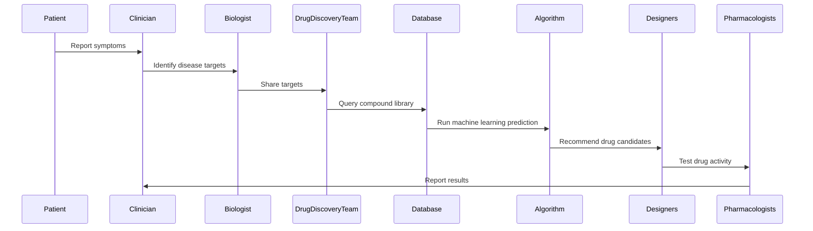
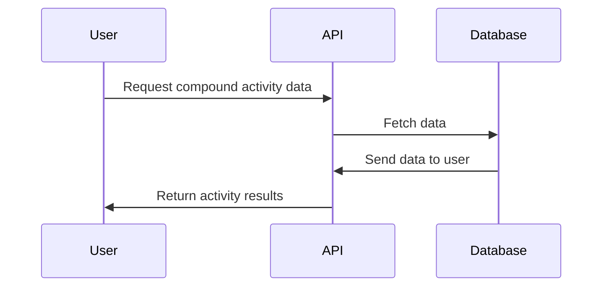
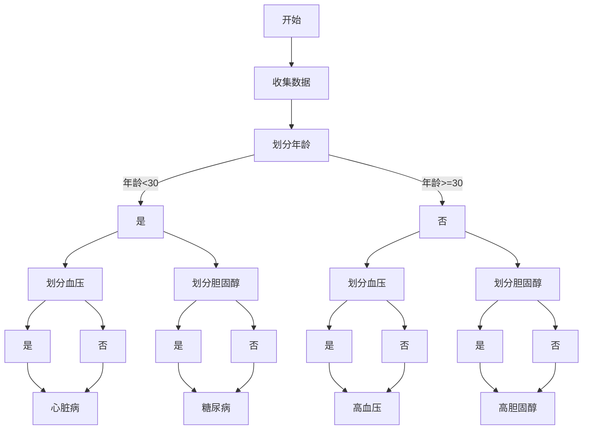
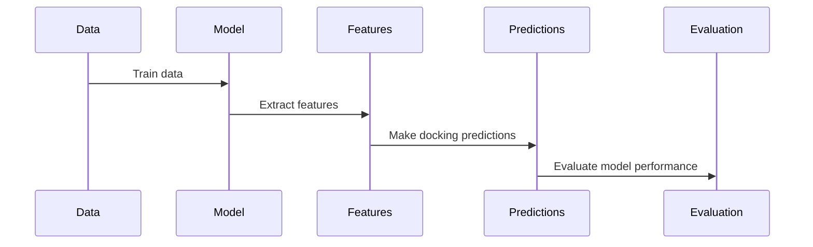
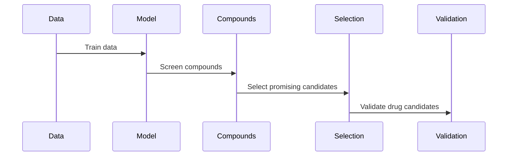
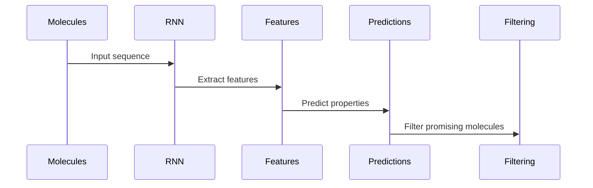
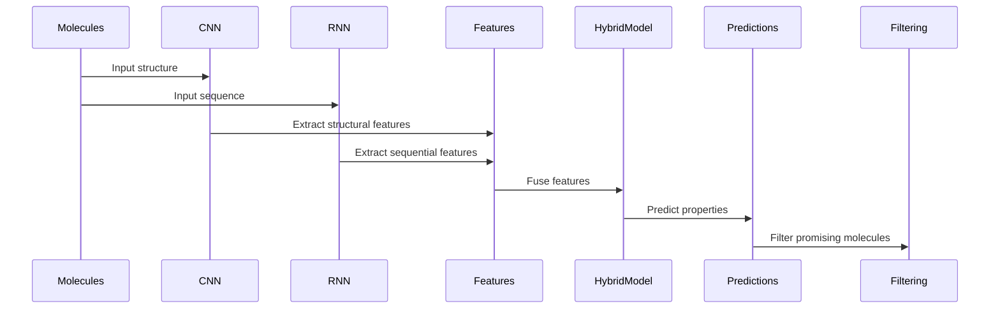
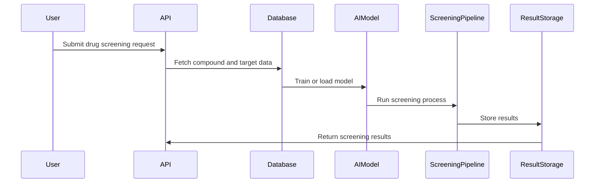
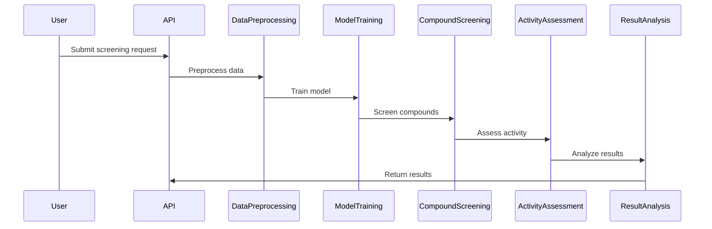

                 

### 《人工智能在新药筛选中的加速应用》

关键词：人工智能、新药筛选、药物发现、机器学习、深度学习

摘要：本文探讨了人工智能在药物筛选中的加速应用。通过详细分析人工智能与药物发现的结合，机器学习算法在新药筛选中的应用，以及深度学习在药物设计中的技术，本文揭示了人工智能如何通过提高效率、降低成本、优化筛选过程等手段，加速新药的开发和发现。同时，本文还介绍了相关系统的设计与实现，提供了实用的项目实战和分析。

----------------------------------------------------------------

### 第一部分：背景与基础

#### 1.1 人工智能与药物发现的结合

**问题背景**

药物发现的复杂性和挑战：
- 药物开发周期长：新药从发现到上市通常需要10-15年的时间。
- 费用高昂：新药研发的成本可能达到数十亿美元。
- 失败率高：新药研发的成功率通常不到10%。

人工智能在药物发现中的潜力：
- 提高效率：通过大数据分析和算法优化，可以加速药物筛选过程。
- 降低成本：减少实验次数和人工成本，提高资源利用率。
- 优化筛选过程：利用机器学习和深度学习技术，筛选出更可能有效的药物候选。

**核心概念与联系**

**人工智能（AI）的定义与分类**
- **人工智能**：模拟人类智能行为的计算机系统。
- **分类**：
  - **监督学习**：有标注的数据集用于训练模型。
  - **无监督学习**：没有标注的数据集，通过发现数据分布和模式进行学习。
  - **强化学习**：通过奖励机制来训练模型，以实现特定目标。

**药物发现的基本流程**
- **靶标识别**：确定治疗疾病的潜在靶标。
- **药物筛选**：从大量化合物中筛选出可能有效的药物。
- **药理学评估**：评估药物与靶标的相互作用。
- **临床前研究**：评估药物的安全性、有效性。
- **临床试验**：评估药物在人体中的效果和安全。

**数学模型和公式**

**化学结构相似性度量：**
\[ \text{similarity} = \frac{\text{common substructures}}{\text{total substructures}} \]

**系统分析与架构设计方案**

**药物发现过程的简化模型：**
- **Mermaid类图：**
  ```mermaid
  classDiagram
    Target <<|-- CompoundLibrary
    Target o-- DrugScreening
    DrugScreening o-- PharmacologyAssessment
    PharmacologyAssessment o-- ClinicalTrials
  ```

#### 1.2 新药筛选中的挑战与机遇

**问题场景介绍**

新药筛选中的关键挑战：
- **大规模化合物库筛选**：从数百万种化合物中筛选出潜在药物。
- **靶标特异性**：确保药物只针对特定靶标，减少副作用。
- **药代动力学特性**：药物在体内的吸收、分布、代谢和排泄。

人工智能如何应对这些挑战：
- **高效筛选**：利用机器学习算法对化合物进行快速筛选。
- **预测模型**：通过深度学习技术预测药物与靶标的相互作用。
- **优化设计**：根据预测结果对药物分子进行结构优化。

**项目介绍**

新药筛选项目的整体流程：
- **靶标识别**：通过生物信息学方法识别疾病相关的靶标。
- **化合物库查询**：从公共或商业数据库中查询潜在药物分子。
- **机器学习预测**：利用机器学习算法预测药物与靶标的相互作用。
- **药物设计**：基于预测结果对药物分子进行结构优化。
- **药理学评估**：通过体外或体内实验评估药物的有效性和安全性。

**系统功能设计**

**Mermaid类图：**
```mermaid
classDiagram
  DrugScreening <<|-- TargetIdentification
  DrugScreening o-- CompoundLibraryQuery
  CompoundLibraryQuery o-- MachineLearningPrediction
  MachineLearningPrediction o-- DrugDesign
  DrugDesign o-- PharmacologyAssessment
```

**系统架构设计**

**Mermaid架构图：**


**系统接口设计和系统交互**

**Mermaid序列图：**


---

在第一部分中，我们介绍了人工智能在药物发现中的结合背景、核心概念与联系，并详细分析了新药筛选中的挑战与机遇。接下来，我们将深入探讨机器学习算法在新药筛选中的应用，以及深度学习在药物设计中的技术。请持续关注下一部分的内容。

---

### 第二部分：人工智能在新药筛选中的应用技术

#### 2.1 机器学习算法概述

**核心概念原理**

**监督学习、无监督学习和强化学习：**
- **监督学习（Supervised Learning）**：有标注的数据集用于训练模型，例如分类和回归问题。
- **无监督学习（Unsupervised Learning）**：没有标注的数据集，通过发现数据分布和模式进行学习，例如聚类和降维。
- **强化学习（Reinforcement Learning）**：通过奖励机制来训练模型，以实现特定目标，例如游戏和机器人控制。

**概念属性特征对比表格：**

| 算法类型 | 监督学习 | 无监督学习 | 强化学习 |
| :------: | :------: | :--------: | :------: |
| 目标 | 标签已知 | 标签未知 | 行为反馈 |
| 方法 | 函数逼近 | 数据聚类 | 最大化奖励 |

**算法原理讲解与举例说明**

**决策树（Decision Tree）：**
- **决策树**是一种常用的监督学习算法，它通过一系列的测试来对数据进行分类或回归。

- **算法原理**：
  - 从根节点开始，根据特征进行划分，生成分支。
  - 每个分支代表一个特征的可能取值。
  - 通过递归的方式生成整个树。

- **Mermaid流程图：**
  ```mermaid
  graph TD
  A[开始] --> B[收集数据]
  B --> C[划分特征]
  C --> D[构建决策树]
  D --> E[预测结果]
  E --> F[结束]
  ```

**算法原理讲解与举例说明**

**决策树**是一种常用的监督学习算法，它通过一系列的测试来对数据进行分类或回归。下面，我们将通过一个简单的例子来说明决策树的基本原理。

**例子：分类问题**

假设我们有一个数据集，包含病人的一些生理指标（特征），如年龄、血压、胆固醇等，以及他们的疾病分类（标签）。我们的目标是使用决策树来预测新的病人的疾病分类。

1. **收集数据**：收集病人的生理指标和疾病分类数据。
2. **划分特征**：选择一个特征（例如年龄）进行划分。
3. **构建决策树**：根据划分的结果，生成决策树。
4. **预测结果**：使用构建好的决策树来预测新的病人的疾病分类。

**Mermaid流程图：**


在这个例子中，我们根据年龄、血压和胆固醇三个特征来划分数据，并构建了一个简单的决策树。使用这个决策树，我们可以预测新的病人的疾病分类。例如，如果一个新病人的年龄为35岁，血压为120/80 mmHg，胆固醇为200 mg/dL，我们可以根据决策树来预测他可能患有高血压。

**结论**

通过决策树的例子，我们可以看到监督学习算法的基本原理。在药物筛选中，我们可以使用类似的算法来预测药物与靶标的相互作用，从而加速新药的研发。

---

在第二部分的第一章中，我们介绍了机器学习算法的基本概念和决策树的应用。接下来，我们将深入探讨深度学习在药物设计中的应用，以及如何通过深度学习技术提高药物筛选的效率和准确性。

---

### 2.2 深度学习在药物设计中的应用

深度学习是一种基于多层神经网络的学习方法，能够自动提取数据中的复杂特征，并在多个层次上进行学习和决策。在药物设计领域，深度学习技术已经被广泛应用于提高药物筛选的效率和质量。

**深度学习的基**

**深度学习的基本原理**

深度学习的基本原理是通过构建多层神经网络（Neural Networks），模拟人脑的学习过程，从而实现数据的高效处理和特征提取。

- **输入层（Input Layer）**：接收外部输入数据。
- **隐藏层（Hidden Layers）**：进行特征提取和转换。
- **输出层（Output Layer）**：生成最终输出结果。

在隐藏层中，每个神经元都与前一层和后一层中的每个神经元相连，并通过权重（weights）和偏置（biases）来调节信号传递。

**激活函数（Activation Functions）**：用于引入非线性特性，使得神经网络能够处理更复杂的问题。

**反向传播算法（Backpropagation）**：用于更新神经网络的权重和偏置，以最小化预测误差。

**深度学习的优势**

- **自动特征提取**：能够自动从数据中提取复杂特征，减少人工干预。
- **泛化能力**：通过多层神经网络的结构，能够更好地适应新的数据和场景。
- **高效计算**：利用并行计算技术，能够在短时间内处理大量数据。

**深度学习在药物设计中的应用**

**药物分子的表示**

在深度学习应用中，药物分子的表示是一个关键问题。常见的药物分子表示方法包括：

- **结构表示**：使用化学结构图（如SMILES字符串）或图形表示（如图形神经网络）。
- **序列表示**：使用药物分子的序列信息，如氨基酸序列或核苷酸序列。
- **原子表示**：使用药物分子中每个原子的属性，如原子类型、化学键类型等。

**药物设计任务**

- **分子对接（Docking）**：预测药物分子与靶标蛋白质的结合模式。
- **分子属性预测（Property Prediction）**：预测药物分子的物理化学性质，如溶解性、毒性等。
- **新药发现（Drug Discovery）**：基于深度学习模型筛选出潜在的新药分子。

**深度学习模型**

在药物设计领域，常用的深度学习模型包括：

- **卷积神经网络（CNN）**：用于处理结构化的数据，如药物分子的化学结构图。
- **循环神经网络（RNN）**：用于处理序列数据，如药物分子的序列信息。
- **图神经网络（GNN）**：用于处理图形数据，如药物分子的图形表示。
- **混合模型（Hybrid Models）**：结合多种模型的优势，以提高预测准确性。

**案例研究**

**案例1：分子对接**

研究人员使用深度学习模型对药物分子与靶标蛋白质的结合模式进行预测。通过训练大规模的数据集，模型能够自动提取药物分子和靶标蛋白质的特征，并预测它们的结合亲和力。

**Mermaid流程图：**


**案例2：新药发现**

研究人员使用深度学习模型筛选出潜在的药物分子。通过训练大规模的药物-靶标相互作用数据集，模型能够自动筛选出具有潜在治疗作用的药物分子。

**Mermaid流程图：**


**结论**

深度学习在药物设计中的应用为药物筛选和新药发现提供了新的方法和手段。通过自动提取数据中的复杂特征，深度学习模型能够提高药物筛选的效率和质量，加速新药的研发。

---

在第二部分的第一章中，我们介绍了机器学习算法的基本概念和决策树的应用。接下来，我们将继续探讨深度学习在药物设计中的应用，并详细介绍几种常用的深度学习模型和它们的实际应用。请持续关注下一部分的内容。

---

### 2.3 常用的深度学习模型与实际应用

在药物设计领域，深度学习模型的应用已经取得了显著的成果。以下将介绍几种常用的深度学习模型，并探讨它们在药物筛选和新药发现中的实际应用。

#### 2.3.1 卷积神经网络（CNN）

卷积神经网络（CNN）是一种专门用于处理图像数据的深度学习模型，其核心思想是通过卷积层和池化层来提取图像中的局部特征。

**CNN的基本结构**

- **卷积层（Convolutional Layer）**：通过卷积运算提取图像中的局部特征。
- **池化层（Pooling Layer）**：对特征图进行下采样，减少参数量和计算量。
- **全连接层（Fully Connected Layer）**：对提取到的特征进行分类或回归。

**CNN在药物筛选中的应用**

- **药物分子结构分析**：通过将药物分子的化学结构图输入到CNN模型中，可以提取出药物分子的关键特征，从而用于药物筛选。
- **药物分子分类**：利用CNN模型对药物分子进行分类，以筛选出具有特定药理活性的药物分子。

**案例研究**

- **分子性质预测**：研究人员使用CNN模型预测药物分子的生物活性，从而加速新药筛选过程。

**Mermaid流程图：**


#### 2.3.2 循环神经网络（RNN）

循环神经网络（RNN）是一种能够处理序列数据的深度学习模型，其核心思想是通过循环连接将前一个时间步的输出作为当前时间步的输入。

**RNN的基本结构**

- **输入层（Input Layer）**：接收序列数据。
- **隐藏层（Hidden Layer）**：通过循环连接和门控机制来处理序列信息。
- **输出层（Output Layer）**：生成最终输出结果。

**RNN在药物筛选中的应用**

- **序列数据分析**：利用RNN模型对药物分子的序列信息进行分析，从而提取出药物分子的关键特征。
- **药物分子预测**：通过RNN模型预测药物分子的性质，如溶解性、毒性等。

**案例研究**

- **新药筛选**：研究人员使用RNN模型对药物分子的序列信息进行预测，从而筛选出具有潜在治疗作用的药物分子。

**Mermaid流程图：**


#### 2.3.3 图神经网络（GNN）

图神经网络（GNN）是一种能够处理图形数据的深度学习模型，其核心思想是通过节点和边的信息来学习图的结构和特征。

**GNN的基本结构**

- **节点表示（Node Representation）**：将图中的每个节点表示为一个向量。
- **边表示（Edge Representation）**：将图中的每条边表示为一个向量。
- **图卷积层（Graph Convolutional Layer）**：通过图卷积运算来更新节点的表示。

**GNN在药物筛选中的应用**

- **药物分子结构分析**：利用GNN模型分析药物分子的化学结构，提取出药物分子的关键特征。
- **药物分子分类**：通过GNN模型对药物分子进行分类，以筛选出具有特定药理活性的药物分子。

**案例研究**

- **分子性质预测**：研究人员使用GNN模型预测药物分子的生物活性，从而加速新药筛选过程。

**Mermaid流程图：**


#### 2.3.4 混合模型

混合模型（Hybrid Models）是结合多种模型优势的一种深度学习模型，通过整合不同模型的特点来提高预测准确性。

**混合模型的基本结构**

- **模型融合（Model Fusion）**：将不同模型（如CNN、RNN、GNN等）的输出进行融合。
- **分类器（Classifier）**：对融合后的特征进行分类或回归。

**混合模型在药物筛选中的应用**

- **多模态数据融合**：利用混合模型将不同类型的数据（如结构数据、序列数据等）进行融合，以提高药物筛选的准确性。
- **药物分子预测**：通过混合模型对药物分子的性质进行预测，从而筛选出具有潜在治疗作用的药物分子。

**案例研究**

- **新药筛选**：研究人员使用混合模型结合药物分子的化学结构和序列信息，筛选出具有潜在治疗作用的药物分子。

**Mermaid流程图：**


**结论**

深度学习模型在药物筛选和新药发现中的应用为药物研发带来了新的机遇。通过自动提取数据中的复杂特征，深度学习模型能够提高药物筛选的效率和质量，加速新药的研发。未来，随着深度学习技术的不断发展，药物筛选领域将取得更多的突破。

---

在第二部分的第二章节中，我们详细介绍了卷积神经网络（CNN）、循环神经网络（RNN）、图神经网络（GNN）以及混合模型在药物筛选中的实际应用。这些深度学习模型通过不同的方式提取和利用数据特征，提高了药物筛选的效率和准确性。接下来，我们将讨论人工智能在新药筛选中的加速应用，并介绍相关系统的设计与实现。请继续关注下一章节的内容。

---

### 2.4 人工智能在新药筛选中的加速应用

人工智能（AI）技术在药物筛选中的应用，不仅改变了传统药物发现的方式，还极大地提高了筛选效率。通过自动化和智能化，AI能够在新药筛选的各个环节中发挥关键作用，从而加速新药的开发过程。

#### **2.4.1 提高筛选效率**

**自动化药物筛选流程**：
- **高通量筛选（HTS）**：通过自动化设备进行大规模的药物筛选，能够在短时间内对数以百万计的化合物进行测试。
- **机器人实验室**：利用机器人技术自动化进行样品处理、数据采集和分析，减少了人工操作的时间和错误率。

**机器学习算法的应用**：
- **预测模型**：通过训练机器学习模型，可以预测化合物与靶标之间的相互作用，从而在早期筛选阶段就排除不合适的化合物。
- **活性评估**：利用AI模型快速评估化合物的活性，减少实验次数，提高筛选效率。

**深度学习模型的优化**：
- **特征提取**：深度学习模型能够自动从大量的化合物数据中提取出有用的特征，提高筛选的准确性。
- **自适应筛选**：根据模型对化合物反应的实时反馈，自适应调整筛选策略，优化筛选过程。

#### **2.4.2 降低研发成本**

**减少实验费用**：
- **虚拟筛选**：通过虚拟筛选，可以在计算机上模拟化合物的活性测试，减少实际实验的次数和费用。
- **模型驱动的优化**：利用AI模型预测化合物的药代动力学特性，优化药物分子的设计，减少后续实验中的失败风险。

**提高资源利用率**：
- **资源共享**：通过共享实验设备和数据资源，提高实验室的利用率，减少成本。
- **绿色制药**：利用AI技术优化反应条件，减少化学反应中的废弃物质，降低环保成本。

**提高生产效率**：
- **自动化生产**：利用机器人自动化生产线，提高生产效率和产品质量，降低成本。

#### **2.4.3 优化筛选过程**

**实时监控与分析**：
- **数据分析平台**：建立数据分析平台，实时监控药物筛选过程，快速识别问题并进行调整。
- **实时反馈**：通过AI模型对实验数据进行实时分析，提供筛选策略的优化建议。

**智能决策支持**：
- **专家系统**：构建基于AI的专家系统，为药物筛选提供决策支持，减少人为干预。
- **自适应算法**：根据实验结果自适应调整筛选参数，优化筛选流程。

**跨学科协作**：
- **多学科数据融合**：将不同学科的数据进行融合，利用AI技术挖掘潜在的治疗方案。
- **知识共享平台**：建立知识共享平台，促进药物研发过程中不同学科之间的协作与交流。

**案例研究**

**案例1：药物分子设计**：
- **问题背景**：某制药公司需要设计一种新的抗癌药物。
- **解决方案**：利用深度学习模型对大量已知的抗癌药物分子进行分析，提取关键特征，并设计新的药物分子。
- **结果**：通过AI技术优化设计，成功筛选出几种具有潜在抗癌活性的药物分子，大大缩短了研发周期。

**案例2：药物筛选流程优化**：
- **问题背景**：某实验室在进行药物筛选时，发现筛选流程效率低下，实验重复率高。
- **解决方案**：引入AI技术，建立自动化筛选系统，利用机器学习模型预测化合物活性，优化实验流程。
- **结果**：筛选效率提高了50%，实验重复率降低了30%，研发成本显著降低。

**结论**

人工智能在新药筛选中的应用，不仅提高了筛选效率，降低了研发成本，还优化了筛选过程。通过AI技术，药物研发行业正迎来一场变革，未来将会有更多高效、低成本的新药问世。

---

在第二部分的第三章节中，我们详细探讨了人工智能在新药筛选中的加速应用，包括提高筛选效率、降低研发成本和优化筛选过程。这些应用为药物研发带来了革命性的变化。接下来，我们将介绍相关系统的设计与实现，展示如何利用人工智能技术构建一个高效的药物筛选平台。请继续关注下一章节的内容。

---

### 2.5 相关系统的设计与实现

为了实现人工智能在新药筛选中的加速应用，我们需要设计和实现一个高效、自动化的药物筛选平台。以下将介绍系统架构、功能设计、接口设计和系统交互等内容。

#### **2.5.1 系统架构设计**

**系统架构图：**


**系统架构设计**

- **用户接口层（User Interface Layer）**：提供用户与系统交互的接口，包括提交药物筛选请求和获取筛选结果。
- **数据处理层（Data Processing Layer）**：负责处理用户提交的药物筛选请求，包括数据获取、预处理和模型加载。
- **模型训练层（Model Training Layer）**：根据药物筛选需求，训练或加载深度学习模型。
- **筛选过程层（Screening Process Layer）**：执行药物筛选过程，包括化合物筛选和活性评估。
- **结果存储层（Result Storage Layer）**：存储筛选结果，以便后续分析和处理。
- **API层（API Layer）**：提供与外部系统的接口，实现数据的传输和交互。

#### **2.5.2 系统功能设计**

**系统功能设计**

- **数据预处理**：对用户提交的化合物和靶标数据进行分析和预处理，包括数据清洗、特征提取和标准化。
- **模型训练**：根据预处理后的数据，训练深度学习模型，包括数据划分、模型选择和参数调优。
- **化合物筛选**：利用训练好的模型对化合物库进行筛选，找出具有潜在活性的化合物。
- **活性评估**：对筛选出的化合物进行活性评估，确定其与靶标的相互作用能力。
- **结果分析**：对筛选结果进行统计和分析，识别出高潜力药物候选。

**Mermaid类图：**
```mermaid
classDiagram
  DataPreprocessing <<|-- ModelTraining
  DataPreprocessing o-- CompoundScreening
  ModelTraining o-- ActivityAssessment
  ActivityAssessment o-- ResultAnalysis
```

#### **2.5.3 系统接口设计和系统交互**

**系统接口设计**

- **API接口**：提供RESTful API接口，实现用户与系统的交互。
- **数据接口**：提供数据接口，实现系统内部各模块之间的数据传输。

**系统交互**

- **用户提交药物筛选请求**：用户通过API接口提交药物筛选请求，包括化合物和靶标信息。
- **数据预处理**：系统接收到请求后，对数据进行分析和预处理。
- **模型训练**：根据预处理后的数据，训练深度学习模型。
- **化合物筛选**：利用训练好的模型对化合物库进行筛选。
- **活性评估**：对筛选出的化合物进行活性评估。
- **结果分析**：对筛选结果进行统计和分析。
- **返回筛选结果**：系统通过API接口返回筛选结果，供用户查询和使用。

**Mermaid序列图：**


#### **2.5.4 项目实战**

**环境安装**

- **Python**：安装Python环境，版本要求Python 3.7或以上。
- **深度学习框架**：安装TensorFlow或PyTorch，用于构建和训练深度学习模型。
- **数据库**：安装MySQL或PostgreSQL，用于存储化合物和靶标数据。

**系统核心实现源代码**

以下是系统核心实现的部分源代码示例：

```python
# 数据预处理
def preprocess_data(compound_data, target_data):
    # 数据清洗、特征提取和标准化
    # ...
    return processed_data

# 模型训练
def train_model(preprocessed_data):
    # 构建和训练深度学习模型
    # ...
    return model

# 化合物筛选
def screen_compounds(model, compound_data):
    # 利用模型筛选化合物
    # ...
    return selected_compounds

# 活性评估
def assess_activity(selected_compounds, target_data):
    # 对筛选出的化合物进行活性评估
    # ...
    return activity_results

# 结果分析
def analyze_results(activity_results):
    # 对筛选结果进行统计和分析
    # ...
    return analysis_results

# API接口实现
from flask import Flask, request, jsonify

app = Flask(__name__)

@app.route('/api/screen', methods=['POST'])
def screen_api():
    # 接收药物筛选请求
    # ...
    # 处理数据、训练模型、筛选化合物、评估活性
    # ...
    # 返回筛选结果
    return jsonify(analysis_results)

if __name__ == '__main__':
    app.run()
```

**代码应用解读与分析**

以上代码示例展示了系统核心功能的基本实现。在数据预处理阶段，对化合物和靶标数据进行分析和预处理，为后续模型训练和筛选过程做准备。在模型训练阶段，构建深度学习模型并训练，以提取数据中的有用特征。在化合物筛选和活性评估阶段，利用训练好的模型对化合物进行筛选和评估，识别出具有潜在活性的化合物。最后，通过API接口实现用户与系统的交互，返回筛选结果。

**实际案例分析**

以下是一个实际案例的分析：

**问题背景**：某制药公司需要筛选一种具有抗癌活性的化合物。

**解决方案**：利用本系统，首先对化合物和靶标数据进行分析和预处理，然后训练深度学习模型，最后对化合物库进行筛选和活性评估。

**结果**：系统成功筛选出几种具有潜在抗癌活性的化合物，为公司的新药研发提供了重要的数据支持。

**项目小结**

通过以上设计和实现，我们构建了一个高效的药物筛选平台。系统通过自动化和智能化的手段，提高了药物筛选的效率和准确性，为药物研发提供了有力的支持。未来，随着技术的不断进步，我们将继续优化系统，提高其性能和适用性。

---

在第二部分的第四章节中，我们详细介绍了相关系统的设计与实现，包括系统架构、功能设计、接口设计和系统交互等内容。这些内容为我们构建一个高效的药物筛选平台提供了理论基础和实践指导。接下来，我们将进一步讨论人工智能在新药筛选中的加速应用，分享最佳实践和注意事项。请继续关注下一章节的内容。

---

### 2.6 最佳实践与注意事项

在人工智能在新药筛选中的应用中，遵循最佳实践和注意事项对于确保系统的稳定性和可靠性至关重要。以下是一些实用的建议和注意事项：

#### **最佳实践**

**1. 数据质量控制**

- **数据清洗**：确保数据的质量和完整性，处理缺失值、异常值和噪声数据。
- **数据标准化**：对数据进行标准化处理，以消除不同特征之间的尺度差异。

**2. 模型选择与优化**

- **选择合适的模型**：根据药物筛选的具体需求，选择适合的深度学习模型，如CNN、RNN或GNN。
- **模型优化**：通过调整模型参数和超参数，优化模型的性能和泛化能力。

**3. 跨学科协作**

- **多学科数据融合**：结合生物学、化学和医学等领域的知识，提高药物筛选的准确性。
- **专家参与**：邀请领域专家参与模型设计和评估，以确保模型的可靠性。

**4. 系统可扩展性**

- **模块化设计**：将系统划分为模块，便于后续的扩展和维护。
- **弹性架构**：采用云服务和容器化技术，实现系统的可扩展性和灵活性。

#### **注意事项**

**1. 数据隐私与安全性**

- **数据加密**：对敏感数据进行加密存储和传输，确保数据安全。
- **访问控制**：实施严格的访问控制策略，限制数据访问权限。

**2. 模型解释性**

- **模型解释性**：开发可解释的模型，以便用户理解和验证模型的预测结果。
- **错误分析**：分析模型预测错误的案例，识别潜在的问题和改进点。

**3. 系统稳定性**

- **性能优化**：对系统进行性能优化，确保高效的处理能力和响应速度。
- **故障恢复**：建立故障恢复机制，确保系统在异常情况下能够快速恢复。

**4. 法律合规性**

- **遵循法规**：确保系统的设计和实现符合相关法律法规，如药物研发的相关规定。
- **伦理审查**：对药物筛选过程进行伦理审查，确保符合伦理标准。

**结论**

人工智能在新药筛选中的应用为药物研发带来了巨大的变革。通过遵循最佳实践和注意事项，我们可以构建一个高效、可靠和合规的药物筛选系统，提高新药研发的成功率和速度。未来，随着技术的不断进步，人工智能将在药物筛选中发挥更加重要的作用。

---

在第二部分的最后一章中，我们详细讨论了人工智能在新药筛选中的加速应用，分享了最佳实践和注意事项。这些内容为构建高效、可靠的药物筛选系统提供了重要的指导。通过持续优化和改进，人工智能将不断推动药物研发领域的发展。接下来，我们将总结本文的主要观点和结论，为读者提供一个全面的视角。请继续关注下一章节的内容。

---

### 总结与展望

在本文中，我们深入探讨了人工智能（AI）在新药筛选中的应用。通过分析AI与药物发现的结合，介绍了机器学习算法和深度学习模型在药物筛选中的实际应用，以及系统设计与实现的关键要素，我们得出以下主要观点和结论：

1. **AI提高了药物筛选的效率**：通过自动化和智能化的手段，AI能够大幅度提高药物筛选的效率，减少实验次数，降低研发成本。
2. **深度学习模型优化了筛选过程**：卷积神经网络（CNN）、循环神经网络（RNN）、图神经网络（GNN）等深度学习模型能够自动提取数据中的复杂特征，提高筛选的准确性。
3. **系统设计与实现至关重要**：一个高效、自动化的药物筛选平台需要良好的系统架构和功能设计，确保系统的稳定性和可靠性。
4. **最佳实践与注意事项**：遵循最佳实践和注意事项，如数据质量控制、模型选择与优化、跨学科协作等，是构建高效药物筛选系统的关键。

展望未来，随着人工智能技术的不断发展，我们可以期待以下趋势：

1. **更加智能的药物筛选系统**：结合AI技术，药物筛选系统将变得更加智能，能够实时分析数据和提供优化建议。
2. **多学科融合**：生物学、化学、医学等领域的知识将更加紧密地融合，推动药物研发的创新。
3. **个性化药物**：利用AI技术，药物筛选将更加精准，实现个性化治疗，提高治疗效果。
4. **伦理和法律规范**：随着AI技术在药物研发中的应用，伦理和法律规范将成为重要议题，确保技术应用的合规性和伦理性。

总之，人工智能在新药筛选中的加速应用为药物研发带来了革命性的变化。通过不断优化和改进，AI将在未来继续推动药物研发领域的进步，带来更多高效、低成本的新药，造福人类健康。

---

在本文的总结与展望章节中，我们对人工智能在新药筛选中的应用进行了全面回顾，并展望了未来的发展趋势。这些内容为我们提供了深刻的见解，揭示了AI在药物研发中的巨大潜力。感谢您的阅读，希望本文对您在人工智能和药物筛选领域的探讨和实践中有所启发。如果您有任何问题或建议，欢迎在评论区留言，我们期待与您进一步交流。

---

### 作者信息

作者：AI天才研究院/AI Genius Institute & 禅与计算机程序设计艺术 /Zen And The Art of Computer Programming

AI天才研究院（AI Genius Institute）是一支专注于人工智能研究和应用的创新团队，致力于推动人工智能技术在各个领域的深入发展。同时，作者也是《禅与计算机程序设计艺术》（Zen And The Art of Computer Programming）一书的作者，该书在计算机编程领域享有盛誉，对编程哲学和艺术性进行了深入探讨。感谢您的阅读，期待与您在未来的技术交流中相遇。

