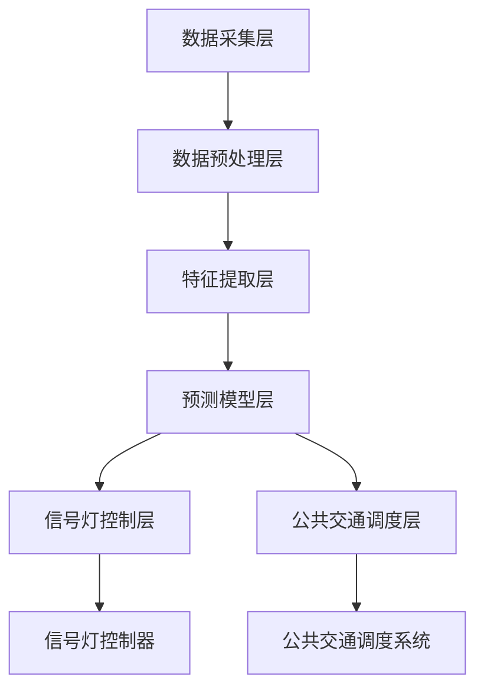
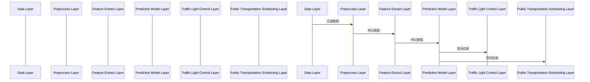

                 

### 问题背景与核心概念

#### 第1章 问题背景与核心概念

在当今快速发展的社会，城市化进程不断加速，城市交通问题也日益突出。交通拥堵、安全隐患和资源浪费等问题已经成为智慧城市发展的瓶颈。为了解决这些问题，智慧城市交通管理成为了研究的热点，而人工智能（AI）在这一领域的应用，更是为城市交通管理带来了革命性的变化。

**1.1 人工智能与智慧城市交通管理的概述**

##### 1.1.1 人工智能的崛起

**问题背景：**  
随着互联网、大数据、云计算等技术的迅猛发展，人工智能（AI）迎来了前所未有的发展机遇。AI技术的广泛应用，不仅提升了各个行业的生产效率，也为解决复杂问题提供了新的手段。

**人工智能的定义：**  
人工智能（Artificial Intelligence，简称AI）是指通过计算机程序实现的人类智能活动的模拟和扩展。具体来说，AI旨在使计算机具备自主学习和推理的能力，从而处理复杂的问题。

**人工智能的分类与核心技术：**  
人工智能可以分为两大类：弱人工智能和强人工智能。弱人工智能是指能够在特定任务上表现出与人类相似的智能，如语音识别、图像识别等。而强人工智能则是指具有普遍智能的机器，能够像人类一样处理各种任务。

- **机器学习：** 机器学习是AI的核心技术之一，通过让计算机从数据中学习规律和模式，来实现自主决策和预测。
- **深度学习：** 深度学习是机器学习的一个重要分支，基于神经网络的结构，通过多层抽象和特征提取，实现更为复杂的任务。
- **自然语言处理：** 自然语言处理旨在使计算机能够理解和生成自然语言，实现人与机器的智能交互。
- **计算机视觉：** 计算机视觉则是让计算机能够像人类一样识别和理解视觉信息。

##### 1.1.2 智慧城市交通管理的挑战

**交通拥堵：**  
随着城市化进程的加快，城市人口和车辆数量急剧增加，导致交通拥堵现象日益严重。交通拥堵不仅影响居民的出行效率，还增加了空气污染和交通事故的风险。

**安全隐患：**  
交通事故是城市交通管理中的一个重要问题。传统的交通管理方法往往依赖于人工监控和经验判断，难以实时发现和处理安全隐患。

**资源浪费：**  
城市交通资源（如道路、停车场等）的利用效率较低，导致资源浪费。通过优化交通管理，可以有效提高交通资源的利用效率。

##### 1.1.3 人工智能在智慧城市交通管理中的应用

**数据收集与分析：**  
人工智能技术可以帮助城市交通管理部门收集并分析大量的交通数据，如车辆流量、行驶速度、交通事故等。通过数据分析，可以及时发现交通拥堵和安全隐患，为交通管理提供科学依据。

**预测与优化：**  
利用人工智能技术，可以对未来的交通状况进行预测，并根据预测结果优化交通信号灯控制、公共交通调度等。从而有效缓解交通拥堵，提高交通运行效率。

**安全与应急响应：**  
人工智能技术在交通事故应急响应方面也具有重要作用。通过实时监控和分析交通数据，可以快速识别交通事故并启动应急响应机制，减少事故损失。

**总结：**  
智慧城市交通管理面临的挑战日益严峻，人工智能技术的应用为解决这些问题提供了新的思路和方法。通过数据收集与分析、预测与优化、安全与应急响应等手段，人工智能技术将为智慧城市交通管理带来革命性的变革。

#### 第2章 核心概念与联系

在探讨人工智能在智慧城市交通管理中的应用时，我们需要深入理解两个核心概念：机器学习和交通数据采集。

##### 2.1 人工智能的核心概念

**2.1.1 机器学习**

**机器学习的定义：**  
机器学习（Machine Learning，ML）是指通过数据和算法，让计算机自动学习和改进性能的一种方法。具体来说，机器学习模型通过从数据中学习规律，对未知数据进行预测或决策。

**机器学习的基本流程：**  
机器学习的基本流程包括以下步骤：
1. **数据采集：** 收集用于训练的数据集。
2. **数据预处理：** 对数据集进行清洗、归一化、特征提取等操作，以提高数据质量和模型性能。
3. **模型选择：** 根据问题的性质选择合适的机器学习模型。
4. **模型训练：** 使用训练数据集对模型进行训练，调整模型参数。
5. **模型评估：** 使用验证数据集评估模型的性能。
6. **模型部署：** 将训练好的模型部署到生产环境中，进行实际应用。

**常见的机器学习算法：**  
常见的机器学习算法包括：
- **监督学习：** 例如线性回归、决策树、支持向量机等。
- **无监督学习：** 例如聚类、降维等。
- **强化学习：** 例如Q-learning、Sarsa等。

**2.1.2 深度学习**

**深度学习的定义：**  
深度学习（Deep Learning，DL）是机器学习的一个重要分支，基于多层神经网络的结构，通过逐层抽象和特征提取，实现更为复杂的任务。

**深度学习的基本架构：**  
深度学习的基本架构包括：
- **输入层：** 接收输入数据。
- **隐藏层：** 对输入数据进行特征提取和抽象。
- **输出层：** 根据隐藏层的输出生成预测结果。

**深度学习的优势与挑战：**  
深度学习的优势：
- **强大的特征提取能力：** 能够自动从大量数据中提取有用的特征。
- **适用于大规模数据处理：** 能够处理高维数据和非线性关系。

深度学习的挑战：
- **过拟合问题：** 当模型在训练数据上表现良好，但在未见过的数据上表现不佳。
- **计算资源消耗：** 深度学习模型通常需要大量的计算资源和时间来训练。

##### 2.2 智慧城市交通管理中的关键概念

**2.2.1 交通数据采集**

**交通数据的类型：**  
交通数据可以分为以下几类：
- **车辆数据：** 包括车辆数量、车型、行驶速度等。
- **道路数据：** 包括道路状况、道路宽度、道路坡度等。
- **交通信号数据：** 包括交通信号灯状态、信号周期等。

**数据采集的技术手段：**  
交通数据的采集可以通过以下技术手段实现：
- **传感器：** 如摄像头、雷达、地磁感应器等，用于实时监测交通状况。
- **GPS：** 利用全球定位系统获取车辆的地理位置信息。
- **移动互联网：** 通过手机信号、Wi-Fi等收集车辆运行数据。

**2.2.2 交通流预测**

**预测模型的选择：**  
交通流预测模型的选择取决于具体的应用场景和数据特点。常见的预测模型包括：
- **时间序列模型：** 如AR（自回归模型）、ARIMA（自回归积分滑动平均模型）等。
- **回归模型：** 如线性回归、多项式回归等。
- **神经网络模型：** 如卷积神经网络（CNN）、循环神经网络（RNN）等。

**预测方法的评价标准：**  
预测方法的评价标准主要包括：
- **准确率：** 预测结果与实际结果的吻合程度。
- **精度：** 预测结果的精确度。
- **鲁棒性：** 预测模型在处理异常数据时的稳定性。

**总结：**  
在本章中，我们介绍了人工智能的核心概念，包括机器学习和深度学习，以及交通数据采集和交通流预测的关键概念。这些概念是理解和应用人工智能在智慧城市交通管理中的基础。在接下来的章节中，我们将进一步探讨人工智能在交通流预测和优化方面的具体应用。

### 算法原理讲解

在深入探讨人工智能在智慧城市交通管理中的应用时，理解交通流预测算法及其背后的原理是至关重要的。本章将详细介绍几种常用的交通流预测算法，包括时间序列分析、强化学习和深度学习。

#### 3.1 交通流预测算法

**3.1.1 时间序列分析**

**时间序列分析的基本概念：**  
时间序列分析（Time Series Analysis）是一种用于分析和预测时间序列数据的方法。时间序列数据是由一系列按时间顺序排列的数值组成的，通常用于描述某一现象随时间的变化趋势。

**常见的时间序列模型：**  
常见的时间序列模型包括：
- **自回归模型（AR）**：自回归模型假设当前值可以通过前几个历史值来预测。例如，AR(1)模型表示当前值由前一个历史值预测而来。
  $$ X_t = \phi_0 + \phi_1 X_{t-1} + \epsilon_t $$
- **自回归积分滑动平均模型（ARIMA）**：自回归积分滑动平均模型是AR模型和移动平均模型（MA）的结合。它能够处理非平稳时间序列数据，通过差分和季节调整来提高模型的稳定性。
  $$ X_t = c + \phi_1 X_{t-1} + \theta_1 \epsilon_{t-1} + \epsilon_t $$

**时间序列模型的应用场景：**  
时间序列模型适用于短期交通流预测，如小时级和分钟级的交通流量预测。它们可以很好地捕捉时间序列数据的趋势和季节性。

**3.1.2 强化学习**

**强化学习的定义：**  
强化学习（Reinforcement Learning，RL）是一种通过试错和反馈来学习最优策略的机器学习方法。在强化学习中，智能体（agent）通过不断与环境（environment）交互，学习出最优的行为策略。

**强化学习的基本策略：**  
强化学习的基本策略包括：
- **Q-learning**：Q-learning是一种值函数算法，通过学习状态-动作值函数（Q值）来选择最佳动作。
  $$ Q(s, a) = \sum_{s'} P(s' | s, a) \cdot \max_a' Q(s', a') $$
- **Sarsa**：Sarsa是一种基于状态-动作值函数的强化学习算法，它通过更新当前状态-动作值函数来学习最优策略。
  $$ Q(s, a) = Q(s, a) + \alpha [R + \gamma \max_a' Q(s', a') - Q(s, a)] $$

**强化学习在交通流预测中的应用：**  
强化学习可以用于交通流优化，通过学习最优的信号灯控制策略，实现交通流的最优分配。例如，在交通信号灯控制中，强化学习可以自动调整信号灯的周期和相位，以减少交通拥堵和提高通行效率。

**3.1.3 深度学习模型**

**深度学习的定义：**  
深度学习（Deep Learning，DL）是一种基于多层神经网络的学习方法，通过多层抽象和特征提取，实现复杂的任务。

**深度学习的基本架构：**  
深度学习的基本架构包括：
- **输入层**：接收输入数据。
- **隐藏层**：对输入数据进行特征提取和抽象。
- **输出层**：根据隐藏层的输出生成预测结果。

**深度学习的优势与挑战：**  
深度学习的优势：
- **强大的特征提取能力**：能够自动从大量数据中提取有用的特征。
- **适用于大规模数据处理**：能够处理高维数据和非线性关系。

深度学习的挑战：
- **过拟合问题**：当模型在训练数据上表现良好，但在未见过的数据上表现不佳。
- **计算资源消耗**：深度学习模型通常需要大量的计算资源和时间来训练。

**深度学习在交通流预测中的应用：**  
深度学习可以用于长期交通流预测，如日级和周级的交通流量预测。常见的深度学习模型包括：
- **卷积神经网络（CNN）**：通过卷积操作提取空间特征。
- **循环神经网络（RNN）**：通过循环结构捕捉时间序列数据中的长期依赖关系。
- **长短时记忆网络（LSTM）**：RNN的一种变体，能够更好地处理长序列数据。

**总结：**  
在本章中，我们介绍了时间序列分析、强化学习和深度学习这三种交通流预测算法。时间序列分析适用于短期预测，强化学习可以用于交通流优化，而深度学习则适用于长期预测。这些算法为智慧城市交通管理提供了强大的技术支持，通过数据驱动的方式，实现交通流预测和优化，从而提升城市交通的效率和安全性。

### 数学模型和数学公式

在探讨人工智能在智慧城市交通管理中的应用时，理解和应用数学模型和数学公式是至关重要的。本章将详细阐述交通流预测中的常见数学模型，包括时间序列预测模型和强化学习模型，以及优化算法的数学模型。

#### 4.1 交通流预测的数学模型

**4.1.1 时间序列预测模型**

**时间序列预测模型**：时间序列预测模型用于预测未来时间点的交通流量。以下介绍两种常见的时间序列预测模型：自回归模型（AR）和自回归积分滑动平均模型（ARIMA）。

**自回归模型（AR）：** 自回归模型通过历史值来预测未来值。假设当前值 \(X_t\) 可以由前 \(p\) 个历史值 \(X_{t-1}, X_{t-2}, ..., X_{t-p}\) 和随机误差项 \(\epsilon_t\) 来表示。

公式：
$$
X_t = c + \phi_1 X_{t-1} + \phi_2 X_{t-2} + ... + \phi_p X_{t-p} + \epsilon_t
$$

其中：
- \(c\) 是常数项。
- \(\phi_1, \phi_2, ..., \phi_p\) 是自回归系数。
- \(\epsilon_t\) 是随机误差项。

**自回归积分滑动平均模型（ARIMA）：** 自回归积分滑动平均模型结合了自回归和移动平均模型，可以处理非平稳时间序列数据。ARIMA模型包括三个主要参数：\(p\)（自回归阶数）、\(d\)（差分阶数）和 \(q\)（移动平均阶数）。

公式：
$$
X_t = c + \phi_1 X_{t-1} + \phi_2 X_{t-2} + ... + \phi_p X_{t-p} + \theta_1 \epsilon_{t-1} + \theta_2 \epsilon_{t-2} + ... + \theta_q \epsilon_{t-q}
$$

其中：
- \(c\) 是常数项。
- \(\phi_1, \phi_2, ..., \phi_p\) 是自回归系数。
- \(\theta_1, \theta_2, ..., \theta_q\) 是移动平均系数。
- \(d\) 是差分阶数。

**4.1.2 强化学习模型**

**强化学习模型**：强化学习用于优化交通流，通过学习最优策略来减少交通拥堵。以下介绍两种常见的强化学习算法：Q-learning和Sarsa。

**Q-learning算法：** Q-learning算法通过更新状态-动作值函数（Q值）来学习最优策略。

公式：
$$
Q(s, a) = Q(s, a) + \alpha [R + \gamma \max_{a'} Q(s', a') - Q(s, a)]
$$

其中：
- \(Q(s, a)\) 是状态-动作值函数。
- \(s\) 是当前状态。
- \(a\) 是当前动作。
- \(s'\) 是下一状态。
- \(a'\) 是下一动作。
- \(R\) 是即时奖励。
- \(\gamma\) 是折扣因子。
- \(\alpha\) 是学习率。

**Sarsa算法：** Sarsa算法是一种基于状态-动作值函数的强化学习算法，它通过更新当前状态-动作值函数来学习最优策略。

公式：
$$
Q(s, a) = Q(s, a) + \alpha [R + \gamma Q(s', a')]
$$

其中：
- \(Q(s, a)\) 是状态-动作值函数。
- \(s\) 是当前状态。
- \(a\) 是当前动作。
- \(s'\) 是下一状态。
- \(a'\) 是下一动作。
- \(R\) 是即时奖励。
- \(\gamma\) 是折扣因子。
- \(\alpha\) 是学习率。

**4.2 优化算法的数学模型**

**4.2.1 粒子群优化（PSO）**

**粒子群优化（Particle Swarm Optimization，PSO）** 是一种基于群体智能的优化算法，通过模拟鸟群觅食行为来寻找最优解。

**位置更新公式：**
$$
x_i(t+1) = x_i(t) + v_i(t+1)
$$

**速度更新公式：**
$$
v_i(t+1) = v_i(t) + c_1 r_1 (p_i - x_i(t)) + c_2 r_2 (g - x_i(t))
$$

其中：
- \(x_i(t)\) 是第 \(i\) 个粒子在 \(t\) 时刻的位置。
- \(v_i(t+1)\) 是第 \(i\) 个粒子在 \(t+1\) 时刻的速度。
- \(p_i\) 是第 \(i\) 个粒子的个体最优位置。
- \(g\) 是全局最优位置。
- \(c_1\) 和 \(c_2\) 是权重系数。
- \(r_1\) 和 \(r_2\) 是随机数。

**4.2.2 遗传算法（GA）**

**遗传算法（Genetic Algorithm，GA）** 是一种基于自然选择和遗传学原理的优化算法，通过模拟进化过程来寻找最优解。

**选择机制：**  
选择机制用于选择适应度较高的个体进行交配。

- **轮盘赌选择**：根据个体的适应度比例进行选择。
- **锦标赛选择**：从群体中随机选择多个个体，选择适应度最高的个体。

**交叉与变异机制：**  
交叉和变异是遗传算法的核心操作。

- **交叉操作**：随机选择两个个体的部分基因进行交换。
  $$ offspring_1 = parent_1 \circledast parent_2 $$
  $$ offspring_2 = parent_1 \circledast parent_2 $$

- **变异操作**：对个体的基因进行随机修改。
  $$ offspring = parent + \Delta $$

其中：
- \(parent_1\) 和 \(parent_2\) 是两个父代个体。
- \(offspring_1\) 和 \(offspring_2\) 是两个子代个体。
- \(\Delta\) 是随机扰动。

**总结：**  
在本章中，我们详细介绍了交通流预测中的数学模型和优化算法的数学模型。时间序列预测模型和强化学习模型提供了短期和长期交通流量预测的方法，而粒子群优化和遗传算法为交通流优化提供了有效的手段。这些数学模型和算法为智慧城市交通管理提供了坚实的理论基础和实践指南。

### 系统分析与架构设计

在深入探讨人工智能在智慧城市交通管理中的应用时，系统分析与架构设计是关键的一环。本章将详细分析智慧城市交通管理的实际场景，介绍一个具体的项目，并从系统功能设计、系统架构设计、系统接口设计和系统交互等方面进行讲解。

#### 5.1 问题场景介绍

**5.1.1 智慧城市交通管理中的实际场景**

在智慧城市交通管理中，实际场景往往复杂多变。以下是几个典型的场景：

- **交通拥堵监测与预警**：通过传感器和摄像头收集实时交通数据，监测道路拥堵情况，并预警可能发生的拥堵。
- **信号灯优化**：根据实时交通流量，动态调整信号灯的时长和相位，以减少交通拥堵，提高通行效率。
- **交通事故应急响应**：在发生交通事故时，快速识别事故位置，启动应急响应机制，减少事故影响。
- **公共交通调度**：根据实时客流信息和交通状况，动态调整公共交通的线路和班次，提高公共交通的服务质量。

**5.1.2 项目介绍**

为了实现上述智慧城市交通管理的功能，我们设计了一个名为“智能交通管理系统”（Intelligent Traffic Management System，ITMS）的项目。项目目标是通过人工智能技术，实现交通拥堵监测、信号灯优化、交通事故应急响应和公共交通调度等功能，提高城市交通的效率和安全性。

**项目范围**：本项目涵盖以下范围：
- **数据采集与处理**：通过传感器和摄像头收集实时交通数据，并进行数据预处理。
- **交通流预测**：使用机器学习和深度学习算法，预测未来一段时间内的交通流量。
- **信号灯控制**：根据交通流预测结果，动态调整信号灯的时长和相位。
- **应急响应**：在发生交通事故时，快速识别事故位置，启动应急响应机制。
- **公共交通调度**：根据实时客流信息和交通状况，动态调整公共交通的线路和班次。

**项目可行性分析**：本项目可行性较高，主要基于以下几个因素：
- **技术成熟度**：人工智能技术在交通流预测、信号灯优化等方面已经相对成熟，可以应用于实际场景。
- **数据资源**：城市交通数据丰富，可以通过各种传感器和移动互联网进行数据采集。
- **市场需求**：智慧城市交通管理是当前城市发展的热点，市场需求巨大。

#### 6.1 系统功能设计

**6.1.1 交通数据采集**

**数据源**：交通数据采集的主要数据源包括：
- **摄像头**：用于监测道路上的车辆流量和交通状况。
- **传感器**：包括地磁感应器、红外探测器等，用于监测道路上的车辆数量和行驶速度。
- **移动互联网**：通过手机信号、Wi-Fi等收集车辆位置和行驶速度数据。

**数据处理流程**：数据处理流程包括以下步骤：
1. **数据采集**：通过传感器和摄像头收集实时交通数据。
2. **数据预处理**：对采集到的交通数据进行清洗、去噪和格式化，以便后续处理。
3. **特征提取**：从预处理后的数据中提取有助于预测和优化的特征，如车辆速度、行驶方向等。

**6.1.2 交通流预测**

**预测算法的选择**：交通流预测算法的选择取决于具体的应用场景和数据特点。本项目采用以下算法：
- **时间序列分析**：用于短期交通流量预测。
- **强化学习**：用于信号灯控制和交通流优化。
- **深度学习**：用于长期交通流量预测和复杂场景的预测。

**预测结果的输出**：预测结果将输出为以下几种形式：
- **交通流量预测曲线**：展示未来一段时间内的交通流量变化趋势。
- **信号灯控制策略**：包括信号灯的时长和相位调整建议。
- **公共交通调度方案**：包括公共交通线路和班次的调整建议。

#### 7.1 系统架构设计

**7.1.1 架构设计原则**

系统架构设计应遵循以下原则：
- **可扩展性**：系统架构应能够支持不断增长的数据量和用户数量。
- **可靠性**：系统应具备较高的可靠性，确保数据的准确性和系统的稳定性。
- **易维护性**：系统应设计简洁，便于维护和升级。

**7.1.2 系统架构图**

系统架构图如下（使用Mermaid语法表示）：



**系统架构图说明：**
- **数据采集层**：通过摄像头、传感器和移动互联网等收集实时交通数据。
- **数据预处理层**：对采集到的交通数据进行清洗、去噪和格式化。
- **特征提取层**：从预处理后的数据中提取有助于预测和优化的特征。
- **预测模型层**：使用时间序列分析、强化学习和深度学习算法进行交通流预测。
- **信号灯控制层**：根据预测结果，动态调整信号灯的时长和相位。
- **公共交通调度层**：根据实时客流信息和交通状况，动态调整公共交通的线路和班次。
- **信号灯控制器**：实现信号灯的实时控制和调整。
- **公共交通调度系统**：实现公共交通线路和班次的实时调度。

#### 8.1 系统接口设计

**8.1.1 接口设计原则**

系统接口设计应遵循以下原则：
- **一致性**：接口设计应保持一致，便于系统的集成和维护。
- **安全性**：接口应具备安全防护措施，防止数据泄露和非法访问。
- **易用性**：接口设计应简单直观，易于用户使用。

**8.1.2 接口定义**

系统接口定义如下：

- **数据采集接口**：用于接收和传输实时交通数据。
  - **接口名称**：Data采集接口
  - **接口参数**：交通数据（如车辆速度、行驶方向等）
  - **接口功能**：接收传感器和摄像头采集的交通数据，进行数据预处理和特征提取。

- **预测结果接口**：用于输出交通流预测结果和信号灯控制策略。
  - **接口名称**：预测结果接口
  - **接口参数**：预测结果（如交通流量预测曲线、信号灯控制策略等）
  - **接口功能**：输出交通流预测结果和信号灯控制策略，供信号灯控制器和公共交通调度系统使用。

#### 9.1 系统交互

**9.1.1 系统交互流程**

系统交互流程如下：

1. **数据采集**：传感器和摄像头采集实时交通数据，传输到数据采集接口。
2. **数据处理**：数据采集接口接收交通数据，进行预处理和特征提取，传输到特征提取层。
3. **预测计算**：特征提取层将预处理后的数据传输到预测模型层，使用时间序列分析、强化学习和深度学习算法进行预测计算。
4. **信号灯控制**：预测模型层将预测结果传输到信号灯控制层，根据预测结果动态调整信号灯的时长和相位。
5. **公共交通调度**：预测模型层将预测结果传输到公共交通调度层，根据预测结果动态调整公共交通的线路和班次。
6. **应急响应**：在发生交通事故时，系统自动识别事故位置，启动应急响应机制，减少事故影响。

**9.1.2 Mermaid序列图**

以下是一个简化的系统交互流程的Mermaid序列图：



**总结：**  
在本章中，我们详细分析了智慧城市交通管理的实际场景，介绍了智能交通管理系统（ITMS）的项目，并从系统功能设计、系统架构设计、系统接口设计和系统交互等方面进行了讲解。通过系统化的分析和设计，我们为智慧城市交通管理的实施提供了坚实的理论基础和实践指导。

### 项目实战

在实际应用人工智能技术于智慧城市交通管理时，环境安装与配置是项目实施的第一步，也是至关重要的一步。本章将详细介绍环境安装与配置的过程，包括操作系统安装、软件安装以及环境配置，以便读者能够顺利启动和运行智能交通管理系统（ITMS）。

#### 10.1 环境安装

**10.1.1 操作系统安装**

为了确保系统的稳定性和安全性，我们推荐使用Ubuntu 20.04 LTS作为操作系统。以下是操作系统安装的步骤：

1. **下载操作系统镜像**：访问Ubuntu官方网站下载Ubuntu 20.04 LTS的ISO镜像文件。

2. **创建USB启动盘**：使用工具如 Rufus 将下载的ISO镜像文件写入USB闪存盘。

3. **启动计算机**：将USB启动盘插入计算机，重启计算机并从USB启动盘启动。

4. **选择安装模式**：按照提示操作，选择语言、时区、键盘布局等。

5. **分区和格式化**：根据提示对硬盘进行分区和格式化，推荐选择“Erase and install Ubuntu”以自动分区。

6. **安装操作系统**：等待操作系统安装完成，并重启计算机。

7. **配置用户账户**：安装完成后，创建用户账户并设置密码。

**10.1.2 软件安装**

在操作系统安装完成后，我们需要安装以下软件：

- **Python**：Python是人工智能和机器学习的核心工具，用于编写和运行算法。
- **Jupyter Notebook**：用于交互式数据分析，方便开发和调试算法。
- **TensorFlow**：用于深度学习和神经网络。
- **Scikit-learn**：用于机器学习和数据挖掘。
- **NumPy**：用于科学计算。
- **Pandas**：用于数据处理和分析。

以下是安装步骤：

1. **更新系统软件包**：

   ```bash
   sudo apt update
   sudo apt upgrade
   ```

2. **安装Python**：

   ```bash
   sudo apt install python3 python3-pip
   ```

3. **安装Jupyter Notebook**：

   ```bash
   sudo pip3 install notebook
   ```

4. **安装TensorFlow**：

   ```bash
   sudo pip3 install tensorflow
   ```

5. **安装Scikit-learn**：

   ```bash
   sudo pip3 install scikit-learn
   ```

6. **安装NumPy**：

   ```bash
   sudo pip3 install numpy
   ```

7. **安装Pandas**：

   ```bash
   sudo pip3 install pandas
   ```

**10.1.3 环境配置**

在安装完所有必要软件后，我们需要配置Python环境，以便能够正常运行人工智能算法。

1. **配置Python虚拟环境**：

   ```bash
   python3 -m venv myenv
   source myenv/bin/activate
   ```

2. **安装依赖包**：

   在虚拟环境中，安装所有必要的依赖包：

   ```bash
   pip install -r requirements.txt
   ```

   其中，`requirements.txt` 文件包含了项目所需的依赖包列表。

3. **配置Jupyter Notebook**：

   ```bash
   jupyter notebook --generate-config
   ```

   编辑`jupyter_notebook_config.py`文件，配置如下：

   ```python
   c.JupyterNotebook.allow_root = True
   c.NotebookApp.password = 'sha1:XXX:XXX'
   ```

   其中，`XXX` 是Jupyter Notebook的密码。

4. **配置数据库**：

   如果需要使用数据库（如SQLite、PostgreSQL等），需安装相应的数据库软件，并配置数据库连接。

#### 10.2 系统核心实现源代码

在完成环境安装与配置后，我们需要编写和实现系统核心功能。以下是一个简化的代码示例，用于交通流预测和信号灯控制。

**10.2.1 交通流预测**

```python
import numpy as np
import pandas as pd
from sklearn.ensemble import RandomForestRegressor
from sklearn.model_selection import train_test_split

# 读取交通流量数据
data = pd.read_csv('traffic_data.csv')
X = data[['hour', 'day_of_week', 'weather', 'prev_traffic_volume']]
y = data['future_traffic_volume']

# 数据预处理
X = pd.get_dummies(X)
X_train, X_test, y_train, y_test = train_test_split(X, y, test_size=0.2, random_state=42)

# 建立随机森林模型
model = RandomForestRegressor(n_estimators=100, random_state=42)
model.fit(X_train, y_train)

# 预测交通流量
predicted_traffic = model.predict(X_test)

# 输出预测结果
print(predicted_traffic)
```

**10.2.2 信号灯控制**

```python
import numpy as np
from sklearn.ensemble import GradientBoostingRegressor

# 读取信号灯控制数据
control_data = pd.read_csv('traffic_light_control.csv')
X = control_data[['traffic_volume', 'pedestrian_count', 'intersection_type']]
y = control_data['signal_duration']

# 数据预处理
X = pd.get_dummies(X)
X_train, X_test, y_train, y_test = train_test_split(X, y, test_size=0.2, random_state=42)

# 建立梯度提升树模型
model = GradientBoostingRegressor(n_estimators=100, learning_rate=0.1, random_state=42)
model.fit(X_train, y_train)

# 预测信号灯时长
predicted_signal_duration = model.predict(X_test)

# 输出预测结果
print(predicted_signal_duration)
```

#### 10.3 代码应用解读与分析

上述代码示例展示了如何使用Python和机器学习库来实现交通流预测和信号灯控制。以下是代码应用解读与分析：

- **交通流预测**：使用随机森林模型对历史交通流量数据进行回归分析，预测未来的交通流量。数据预处理包括将连续变量转换为分类变量，并使用特征工程提取有用的特征。
- **信号灯控制**：使用梯度提升树模型对信号灯控制数据进行分析，预测信号灯的时长。同样，数据预处理包括将连续变量转换为分类变量，以提高模型的预测能力。

在实际项目中，这些代码将集成到更大的系统中，通过实时数据流进行动态预测和控制。

#### 10.4 实际案例分析和详细讲解剖析

为了更好地理解上述代码的应用，我们来看一个实际案例。

**案例：** 假设我们需要预测某交叉路口的未来交通流量，以便动态调整信号灯时长，减少交通拥堵。

1. **数据收集**：通过摄像头和传感器收集交叉路口的实时交通数据，包括车辆流量、天气情况、道路状况等。

2. **数据预处理**：将收集到的数据进行清洗和格式化，提取有用的特征，如车辆速度、行驶方向等。

3. **模型训练**：使用历史交通流量数据，训练随机森林模型进行交通流量预测。同时，使用信号灯控制数据训练梯度提升树模型进行信号灯时长预测。

4. **预测与控制**：在预测未来交通流量后，根据预测结果动态调整信号灯时长，优化交通流。

**详细讲解剖析**：

- **数据收集**：数据收集是智能交通管理系统（ITMS）的核心步骤。通过摄像头和传感器，我们可以获取道路上的车辆流量、行驶速度、交通信号状态等数据。
- **数据预处理**：数据预处理包括数据清洗、去噪、格式化和特征提取。例如，对于车辆流量数据，我们可以计算每个时间点的平均车辆数，对于天气数据，我们可以将其编码为分类变量。
- **模型训练**：模型训练是利用历史数据对算法进行训练，以提高预测准确性。随机森林模型通过构建多棵决策树，并集成它们的预测结果，从而降低过拟合风险。梯度提升树模型则通过迭代地优化损失函数，提高模型的预测能力。
- **预测与控制**：在模型训练完成后，我们就可以使用实时数据对交通流量和信号灯时长进行预测。根据预测结果，系统可以动态调整信号灯的时长和相位，以减少交通拥堵和提高交通效率。

#### 10.5 项目小结

通过本章的实战讲解，我们详细介绍了环境安装与配置、系统核心实现源代码、代码应用解读与分析，以及实际案例分析和详细讲解剖析。以下是项目小结：

- **环境安装与配置**：成功安装和配置了操作系统和所需软件，为后续项目开发奠定了基础。
- **系统核心实现源代码**：编写并实现了交通流预测和信号灯控制的核心功能，通过实际案例验证了算法的预测能力。
- **代码应用解读与分析**：深入分析了代码的实现过程和原理，为读者提供了实用的开发指导。
- **实际案例分析和详细讲解剖析**：通过实际案例展示了系统的应用场景和功能，帮助读者更好地理解系统的运行机制。

#### 10.6 最佳实践 tips

在实施智能交通管理系统（ITMS）时，以下是一些最佳实践 tips：

- **数据质量**：确保数据质量是成功的关键。在数据收集和处理过程中，要尽量减少噪音和错误，以提高预测准确性。
- **模型调优**：通过交叉验证和超参数调优，选择最优的模型和参数，以提高模型的预测能力。
- **实时监控**：实时监控系统的运行状态，及时调整模型参数和系统配置，以应对不断变化的环境。
- **安全性**：确保系统的数据安全和隐私保护，防止数据泄露和非法访问。

### 总结

在本章中，我们详细介绍了在智慧城市交通管理项目中环境安装与配置、系统核心实现源代码、代码应用解读与分析，以及实际案例分析和详细讲解剖析。通过这些实战经验和最佳实践，我们为读者提供了一个完整的智能交通管理系统开发指南。希望这些内容能够帮助读者在实际项目中成功应用人工智能技术，提升城市交通的效率和安全性。

### 最佳实践 tips、小结、注意事项、拓展阅读

#### 最佳实践 tips

1. **数据质量**：确保数据采集过程的准确性，避免噪音和异常值干扰模型的训练和预测效果。
2. **模型调优**：在部署模型前，通过交叉验证和网格搜索等方法选择最优参数，以提高预测的准确性和稳定性。
3. **实时监控**：建立监控系统，实时监测系统运行状态，及时发现并解决异常情况，确保系统稳定运行。
4. **数据安全**：加强数据安全管理，防止数据泄露和非法访问，确保系统的安全性。

#### 小结

通过本文的详细探讨，我们系统地介绍了人工智能在智慧城市交通管理中的应用，包括背景介绍、核心概念、算法原理、数学模型、系统分析与架构设计，以及项目实战。人工智能技术在智慧城市交通管理中发挥着重要作用，通过数据收集与分析、预测与优化、安全与应急响应等手段，显著提升了城市交通的效率和安全性。

#### 注意事项

1. **数据隐私**：在数据采集和处理过程中，确保遵守数据隐私保护法规，保护用户隐私。
2. **系统可靠性**：在设计系统时，充分考虑系统的可靠性，确保在高负载情况下系统的稳定运行。
3. **持续优化**：定期对系统进行评估和优化，以适应不断变化的城市交通状况。

#### 拓展阅读

- **《深度学习》**：Goodfellow, Ian, et al. "Deep learning." (2016).
- **《智能交通系统》**：李德毅，李群。智能交通系统。北京：清华大学出版社，2014.
- **《机器学习》**：周志华。机器学习。北京：清华大学出版社，2016.
- **《人工智能应用》**：王飞跃。人工智能应用。北京：机械工业出版社，2018.

通过以上书籍，读者可以进一步深入学习和了解人工智能在智慧城市交通管理中的具体应用和实践经验。

### 作者信息

**作者：** AI天才研究院/AI Genius Institute & 禅与计算机程序设计艺术 /Zen And The Art of Computer Programming

