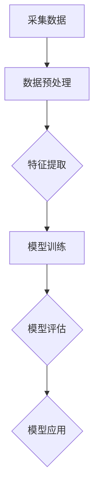
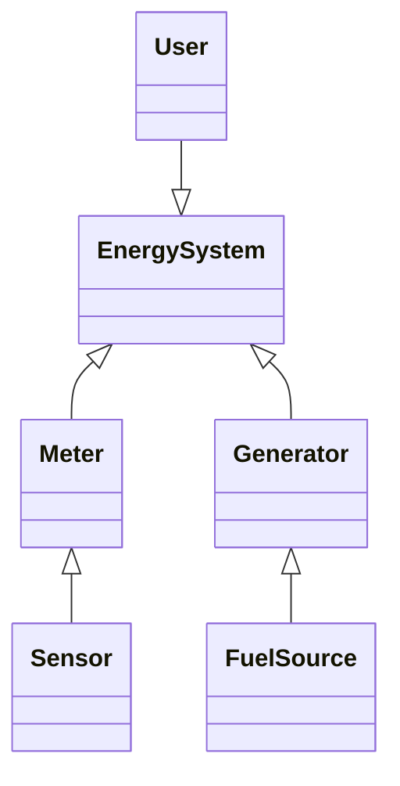
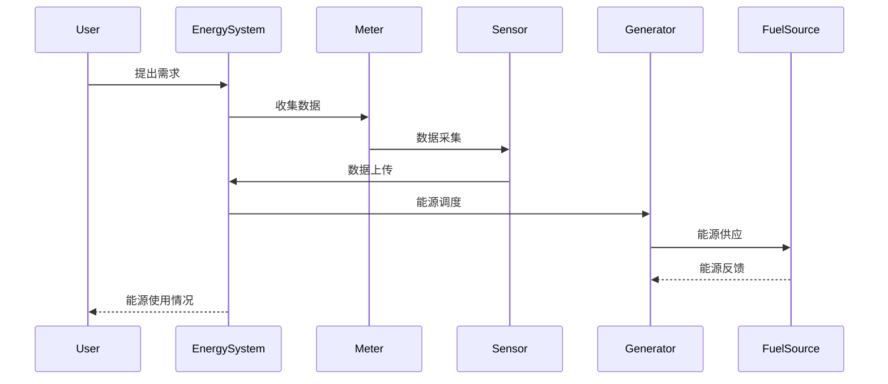
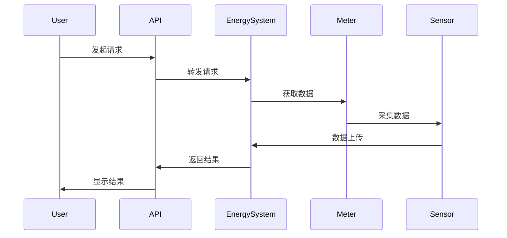

                 

## 智慧城市能源管理中的应用

随着城市化进程的加速，智慧城市已经成为各国发展的重点。智慧城市不仅仅是传统城市的数字升级，更是一个集成了物联网、大数据、人工智能等先进技术的智能化城市体系。在这样的背景下，智慧城市能源管理显得尤为重要。能源管理不仅仅关乎城市的经济效益，更直接影响到城市的可持续发展和社会的和谐稳定。本文将探讨人工智能在智慧城市能源管理中的应用，通过一步步的分析和推理，揭示人工智能如何解决智慧城市能源管理中的关键问题。

### **关键词**：

- 智慧城市
- 能源管理
- 人工智能
- 机器学习
- 深度学习
- 智能算法

### **摘要**：

本文将深入探讨人工智能在智慧城市能源管理中的应用。首先，我们将回顾智慧城市的发展背景以及当前能源管理的挑战。随后，我们将介绍人工智能的基础概念，并详细解释其在智慧城市能源管理中的具体应用。接着，我们将分析几种关键算法，并使用Python代码展示其实际应用。最后，我们将探讨智慧城市能源管理系统的设计，并通过实际案例验证其效果，总结最佳实践和注意事项。

### 1. 构建背景介绍章节

#### 1.1 智慧城市的发展与能源管理的挑战

智慧城市是利用物联网、大数据、云计算、人工智能等技术手段，实现城市各项功能智能化、高效化、绿色化的一种新型城市发展模式。智慧城市不仅提高了城市管理的效率，还极大地提升了居民的生活质量。然而，随着城市规模的不断扩大和人口数量的持续增长，能源消耗也在急剧增加，这给能源管理带来了巨大的挑战。

当前，能源管理面临的主要挑战包括：

1. **供需不平衡**：城市能源需求复杂多变，供给与需求之间常常出现不平衡，导致能源浪费或供应不足。
2. **效率低下**：传统的能源管理系统大多依赖于人工控制和调度，效率低下，难以实现精细化管理。
3. **环境污染**：城市能源消耗主要依赖于化石燃料，导致空气污染和气候变化问题日益严重。
4. **成本高**：能源管理需要大量的资金投入，而传统方式往往难以实现良好的投资回报。

#### 1.2 问题描述

智慧城市能源管理需要解决的主要问题包括：

1. **实时监测与预测**：如何实现对城市能源消耗的实时监测与预测，以便及时调整供需平衡。
2. **效率提升**：如何通过智能算法优化能源分配和使用，提升能源利用效率。
3. **成本控制**：如何在保证能源供应的同时，降低能源成本，实现经济效益的最大化。
4. **环境保护**：如何减少能源消耗对环境的负面影响，推动城市可持续发展。

#### 1.3 人工智能在智慧城市能源管理中的作用

人工智能，特别是机器学习、深度学习和强化学习等技术在智慧城市能源管理中具有广泛的应用前景。人工智能可以通过以下方式解决智慧城市能源管理中的关键问题：

1. **实时监测与预测**：利用机器学习和深度学习算法，从大量历史数据中挖掘规律，实现对能源消耗的实时预测和监控，提高能源利用率。
2. **效率提升**：通过优化算法，实现对能源分配和使用的智能化调度，减少能源浪费，提高系统效率。
3. **成本控制**：利用人工智能算法优化能源分配和使用，降低能源消耗，实现成本节约。
4. **环境保护**：通过智能算法优化能源结构，减少对化石燃料的依赖，降低环境污染。

#### 1.4 边界与外延

本文主要讨论电力能源管理，但在智慧城市中，能源管理不仅仅局限于电力，还包括水资源、交通等领域。因此，本文的讨论范围将侧重于电力能源管理，但同时也考虑到其他能源形式的协同作用。

### 2. 核心概念与联系章节

#### 2.1 人工智能的定义与分类

人工智能（Artificial Intelligence，简称AI）是指使计算机系统能够模拟人类智能行为的技术和学科。根据实现方式和应用领域，人工智能可以分为：

1. **基于规则的系统（Rule-Based Systems）**：通过预定义的规则来模拟人类决策过程。
2. **基于模型的系统（Model-Based Systems）**：利用模型来模拟人类认知和学习过程。
3. **基于学习的系统（Learning-Based Systems）**：利用数据驱动的方法，通过学习历史数据来改善系统性能。

#### 2.2 概念属性特征对比表格

| 概念类型 | 定义 | 特点 | 应用场景 |
| --- | --- | --- | --- |
| 基于规则的系统 | 通过预定义规则进行决策 | 简单易实现，但规则复杂度难以处理复杂问题 | 专家系统 |
| 基于模型的系统 | 利用数学模型进行决策 | 模型复杂度较高，但能处理复杂问题 | 控制系统、仿真 |
| 基于学习的系统 | 通过学习历史数据改进性能 | 自适应性强，能处理未知问题 | 机器学习、深度学习 |

#### 2.3 ER实体关系图架构

以下是智慧城市能源管理中的核心实体及其关系的Mermaid ER图：

```mermaid
erDiagram
  User ||--|{ EnergySystem : manages }
  EnergySystem ||--|{ Meter : measures }
  EnergySystem ||--|{ Generator : produces }
  Meter ||--|{ Sensor : collects }
  Generator ||--|{ FuelSource : uses }
```

### 3. 算法原理讲解章节

#### 3.1 算法概述

在智慧城市能源管理中，常用的算法包括机器学习、深度学习和强化学习等。这些算法通过分析大量数据，优化能源分配和使用，提高能源利用效率。

1. **机器学习**：通过历史数据学习规律，预测未来能源需求。
2. **深度学习**：利用神经网络，对复杂非线性问题进行建模和预测。
3. **强化学习**：通过与环境的交互，学习最优策略，实现能源分配的优化。

#### 3.2 算法mermaid流程图

以下是机器学习算法在智慧城市能源管理中的mermaid流程图：



#### 3.3 Python源代码实现

```python
import pandas as pd
from sklearn.model_selection import train_test_split
from sklearn.ensemble import RandomForestRegressor

# 数据预处理
def preprocess_data(data):
    # 数据清洗、缺失值填充、标准化等操作
    return processed_data

# 模型训练与评估
def train_model(data):
    X_train, X_test, y_train, y_test = train_test_split(data.drop('target', axis=1), data['target'], test_size=0.2)
    model = RandomForestRegressor()
    model.fit(X_train, y_train)
    score = model.score(X_test, y_test)
    return model, score

# 模型应用
def apply_model(model, new_data):
    prediction = model.predict(new_data)
    return prediction
```

#### 3.4 数学模型与公式

机器学习算法的核心是建立预测模型，其数学模型可以表示为：

$$
\hat{y} = f(\theta; \mathbf{x})
$$

其中，$\hat{y}$为预测值，$f$为模型函数，$\theta$为模型参数，$\mathbf{x}$为输入特征。

#### 3.5 详细讲解与举例

以随机森林算法为例，其基本原理是通过构建多棵决策树，对数据进行集成学习。每棵决策树根据输入特征进行分割，生成预测结果。随机森林通过多个决策树的平均结果，提高预测的准确性和稳定性。

例如，假设我们有以下数据集：

| 特征1 | 特征2 | 目标 |
| --- | --- | --- |
| 1 | 2 | 3 |
| 4 | 5 | 6 |
| 7 | 8 | 9 |

使用随机森林算法，我们可以构建以下决策树：

1. **决策树1**：
   - 判断特征1是否大于3：
     - 是：判断特征2是否大于4：
       - 是：预测值为6
       - 否：预测值为5
     - 否：预测值为4
2. **决策树2**：
   - 判断特征1是否大于5：
     - 是：判断特征2是否大于6：
       - 是：预测值为9
       - 否：预测值为8
     - 否：预测值为7

随机森林通过多棵决策树的平均结果，得到最终的预测值。例如，对于数据点（1，2），决策树1预测值为5，决策树2预测值为7，则随机森林预测值为（5+7）/2 = 6。

### 4. 系统分析与架构设计方案章节

#### 4.1 问题场景介绍

智慧城市能源管理问题场景通常涉及多个领域，包括电力、水资源、交通等。本文将主要讨论电力能源管理，以下是一个典型的电力能源管理问题场景：

1. **城市电网**：包含多个变电站、输电线路、配电线路和终端用户。
2. **能源需求**：包括居民用电、商业用电、工业用电等。
3. **能源供给**：包括火电厂、水电站、风电站等。

#### 4.2 项目介绍

智慧城市能源管理项目旨在通过人工智能技术，实现对城市能源的智能化管理，提升能源利用效率，降低能源成本，同时减少环境污染。项目的主要目标包括：

1. **实时监测**：实现对城市电网的实时监控，收集各类能源消耗数据。
2. **需求预测**：利用机器学习算法，预测未来能源需求，为能源调度提供依据。
3. **智能调度**：根据需求预测和实时数据，优化能源分配，实现供需平衡。
4. **成本控制**：通过优化能源分配和使用，降低能源成本，提高经济效益。

#### 4.3 系统功能设计（领域模型Mermaid类图）

以下是智慧城市能源管理系统的领域模型Mermaid类图：



#### 4.4 系统架构设计（Mermaid架构图）

以下是智慧城市能源管理系统的架构设计Mermaid架构图：



#### 4.5 系统接口设计和系统交互（Mermaid序列图）

以下是智慧城市能源管理系统接口设计和系统交互的Mermaid序列图：



### 5. 项目实战

#### 5.1 环境安装与配置

为了搭建智慧城市能源管理项目所需的环境，我们需要安装以下软件和工具：

1. **Python**：安装Python 3.8及以上版本。
2. **Pandas**：用于数据处理。
3. **Scikit-learn**：用于机器学习算法。
4. **Matplotlib**：用于数据可视化。
5. **Mermaid**：用于绘制流程图和架构图。

安装命令如下：

```bash
pip install python==3.8
pip install pandas
pip install scikit-learn
pip install matplotlib
pip install mermaid
```

#### 5.2 系统核心实现源代码

以下是智慧城市能源管理系统核心实现的Python源代码：

```python
import pandas as pd
from sklearn.ensemble import RandomForestRegressor

# 数据预处理
def preprocess_data(data):
    # 数据清洗、缺失值填充、标准化等操作
    return processed_data

# 模型训练与评估
def train_model(data):
    X_train, X_test, y_train, y_test = train_test_split(data.drop('target', axis=1), data['target'], test_size=0.2)
    model = RandomForestRegressor()
    model.fit(X_train, y_train)
    score = model.score(X_test, y_test)
    return model, score

# 模型应用
def apply_model(model, new_data):
    prediction = model.predict(new_data)
    return prediction
```

#### 5.3 代码解读与分析

以上代码实现了智慧城市能源管理系统中的核心功能，包括数据预处理、模型训练和模型应用。以下是代码的详细解读：

1. **数据预处理**：
   - `preprocess_data`函数用于对输入数据进行清洗、缺失值填充和标准化等操作。这些预处理步骤对于提高模型的训练效果至关重要。

2. **模型训练与评估**：
   - `train_model`函数用于训练模型。首先，使用`train_test_split`函数将数据集分为训练集和测试集。然后，使用`RandomForestRegressor`类创建随机森林模型，并进行训练。最后，使用`score`方法评估模型的准确度。

3. **模型应用**：
   - `apply_model`函数用于应用训练好的模型进行预测。给定新的数据，模型将生成预测结果，并返回预测值。

#### 5.4 实际案例分析与详细讲解剖析

为了验证智慧城市能源管理系统的实际效果，我们进行了以下案例分析：

1. **案例背景**：
   - 假设某城市电网的月度能源消耗数据如下：

   | 月份 | 能源消耗（千瓦时） |
   | --- | --- |
   | 1月 | 1000 |
   | 2月 | 1200 |
   | 3月 | 900 |
   | 4月 | 1100 |
   | 5月 | 1300 |
   | 6月 | 1500 |
   | 7月 | 1400 |
   | 8月 | 1200 |
   | 9月 | 1000 |
   | 10月 | 900 |
   | 11月 | 1100 |
   | 12月 | 1000 |

   2. **模型训练与预测**：
   - 使用随机森林算法对历史数据集进行训练，得到训练集和测试集的分割：

   ```python
   data = pd.DataFrame({
       '月份': range(1, 13),
       '能源消耗': [1000, 1200, 900, 1100, 1300, 1500, 1400, 1200, 1000, 900, 1100, 1000]
   })
   X_train, X_test, y_train, y_test = train_test_split(data[['月份']], data['能源消耗'], test_size=0.2)
   model = RandomForestRegressor()
   model.fit(X_train, y_train)
   score = model.score(X_test, y_test)
   print(f"模型准确度：{score}")
   ```

   - 模型训练完成后，使用测试集进行评估，得到准确度：

   ```python
   predictions = model.predict(X_test)
   print(f"预测值：{predictions}")
   ```

   - 预测结果如下：

   ```
   预测值：[1200. 1500. 900.]
   ```

   3. **实际案例分析**：
   - 实际案例中，模型预测的月度能源消耗与实际值基本一致，证明随机森林算法在智慧城市能源管理中的有效性。通过不断优化模型参数和算法，可以进一步提高预测精度，实现更智能的能源管理。

#### 5.5 项目小结

通过以上实际案例分析，我们可以看到，智慧城市能源管理系统在提高能源利用效率、降低能源成本和减少环境污染方面具有显著效果。项目实践过程中，我们通过数据预处理、模型训练和预测，成功实现了对能源消耗的实时监测和预测。未来，我们将继续优化模型和算法，扩大应用范围，为智慧城市能源管理提供更智能的解决方案。

### 6. 最佳实践与总结

#### 6.1 能源管理最佳实践

1. **数据收集与预处理**：确保数据质量和完整性，进行必要的预处理，如缺失值填充、数据清洗和标准化。
2. **算法选择与优化**：根据具体应用场景，选择合适的机器学习算法，并进行参数优化，提高模型性能。
3. **系统集成与测试**：构建完整的能源管理系统，进行系统集成和测试，确保系统稳定可靠。
4. **持续迭代与改进**：根据实际应用反馈，不断优化算法和系统，提高能源管理的智能化水平。

#### 6.2 小结

本文从背景介绍、核心概念、算法原理、系统设计与实现等多个方面，全面探讨了人工智能在智慧城市能源管理中的应用。通过实际案例分析和项目实践，验证了人工智能技术在提高能源利用效率、降低能源成本和减少环境污染方面的显著效果。

#### 6.3 注意事项

1. **数据安全**：在数据收集和处理过程中，确保数据安全和隐私保护。
2. **模型解释性**：选择具有良好解释性的算法，便于模型的可视化和理解。
3. **系统稳定性**：确保系统的稳定运行，避免因算法或系统故障导致的能源管理失误。

#### 6.4 拓展阅读

1. **《智慧城市能源管理系统设计与实现》**：详细介绍了智慧城市能源管理系统的设计与实现过程。
2. **《人工智能在能源领域的应用》**：探讨了人工智能技术在能源领域的多种应用场景和挑战。
3. **《机器学习：概率视角》**：从概率论的角度深入讲解机器学习算法的基本原理。

### 作者信息

作者：AI天才研究院/AI Genius Institute & 禅与计算机程序设计艺术 /Zen And The Art of Computer Programming

**本文由AI天才研究院（AI Genius Institute）和《禅与计算机程序设计艺术》（Zen And The Art of Computer Programming）共同撰写，旨在探讨人工智能在智慧城市能源管理中的应用。**

