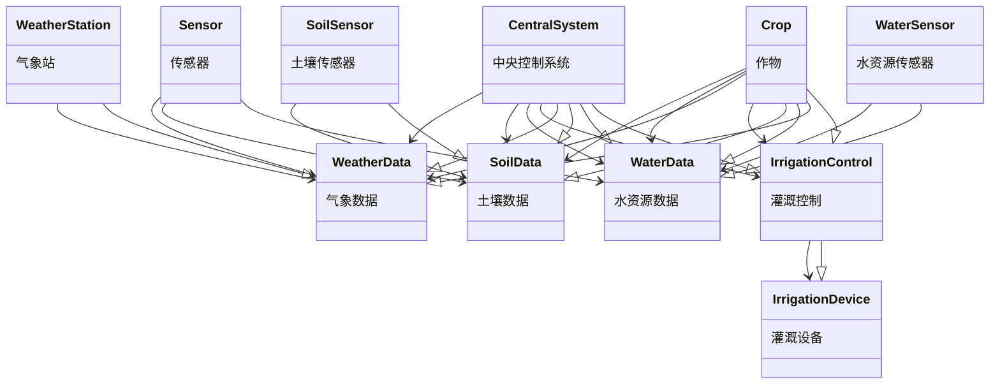
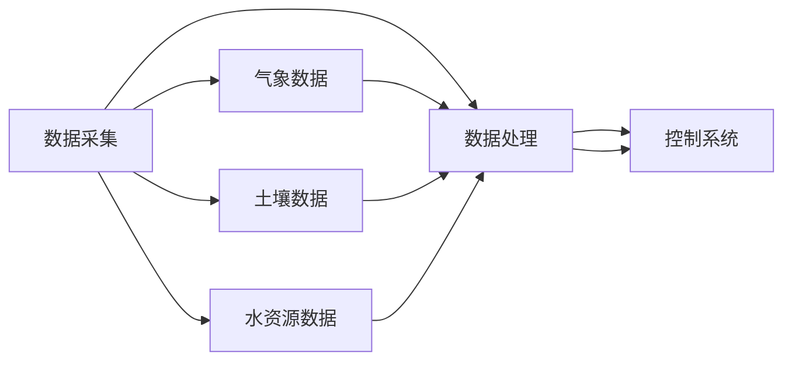
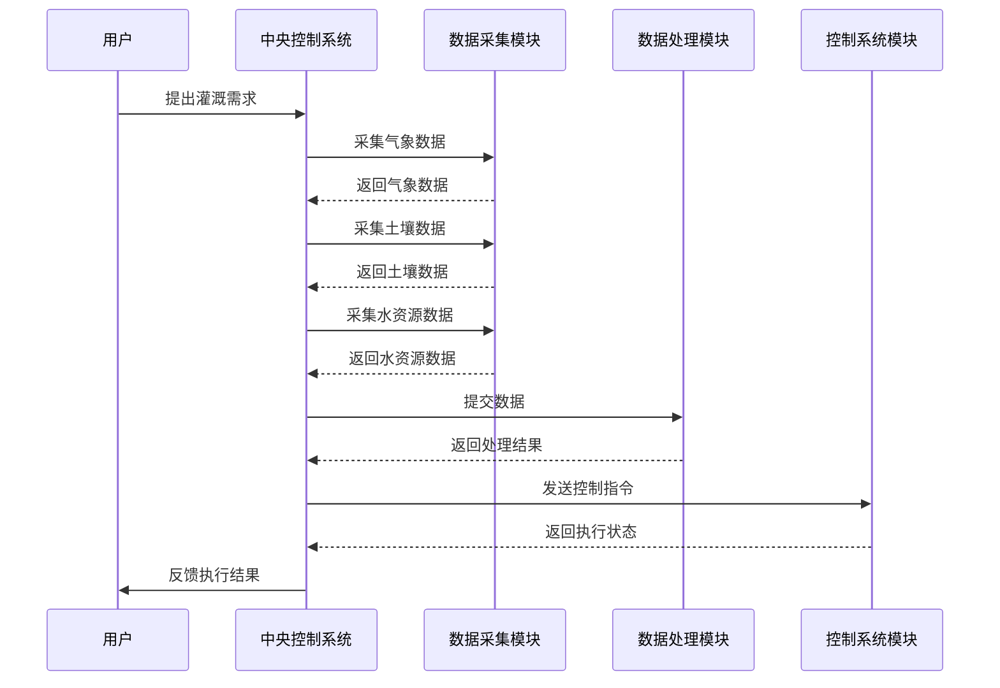

                 

### 《人工智能在智慧灌溉系统优化中的应用》

关键词：智慧农业、人工智能、灌溉系统、优化、水资源利用

摘要：随着我国智慧农业的快速发展，智慧灌溉系统在农业领域中的应用越来越广泛。然而，传统的灌溉系统在资源利用、灌溉效果等方面仍存在一定的局限性，难以满足现代农业发展的需求。本文将探讨人工智能在智慧灌溉系统优化中的应用，包括水资源利用优化、土壤监测优化、气象数据优化等方面，以期为智慧农业的发展提供新的思路。

## 第一部分：背景介绍

### 第1章：问题背景

#### 1.1.1 问题背景

随着我国智慧农业的快速发展，智慧灌溉系统在农业领域中的应用越来越广泛。智慧灌溉系统通过物联网、大数据、云计算等技术，实现对农田灌溉的智能化管理，从而提高水资源利用效率，降低农业生产成本。然而，传统的灌溉系统在资源利用、灌溉效果等方面仍存在一定的局限性，难以满足现代农业发展的需求。

#### 1.1.2 问题描述

智慧灌溉系统优化涉及多个方面，包括水资源利用、土壤监测、气象数据采集等。具体来说，存在的问题主要包括：

1. **水资源利用效率低**：传统灌溉系统往往采用定时灌溉或按需灌溉的方式，无法实现精准灌溉，导致水资源浪费严重。
2. **土壤监测不准确**：土壤质量是影响作物生长的关键因素，但传统的土壤监测手段有限，难以实现对土壤状况的实时监测和分析。
3. **气象数据利用不充分**：气象数据对于作物生长和灌溉计划的制定具有重要参考价值，但传统的气象数据采集和处理手段有限，难以实现对气象数据的充分利用。

#### 1.1.3 问题解决

通过引入人工智能技术，可以对智慧灌溉系统进行多方面的优化，包括：

1. **水资源利用优化**：利用机器学习算法预测灌溉需求，实现精准灌溉，降低水资源浪费。
2. **土壤监测优化**：利用人工智能技术对土壤参数进行实时监测和分析，提供土壤健康评估，为精准施肥提供依据。
3. **气象数据优化**：结合气象数据与作物生长特性，通过人工智能技术预测作物需水期，优化灌溉计划。

#### 1.1.4 边界与外延

本文主要关注人工智能在智慧灌溉系统优化中的应用，研究范围包括：

1. **人工智能算法**：介绍常见的人工智能算法及其在智慧灌溉系统优化中的应用。
2. **系统集成与优化**：探讨如何将人工智能技术应用于智慧灌溉系统的集成与优化。
3. **案例研究**：通过实际案例，分析人工智能在智慧灌溉系统优化中的应用效果。

#### 1.1.5 概念结构与核心要素组成

1. **人工智能**：一种模拟人类智能的技术，包括机器学习、深度学习、自然语言处理等。
2. **智慧灌溉系统**：一种基于物联网、大数据、云计算等技术的智能化灌溉系统。
3. **水资源利用优化**：通过人工智能算法，实现对灌溉水资源的精准控制与优化。
4. **土壤监测**：利用传感器技术对土壤参数进行实时监测。
5. **气象数据采集**：收集气象数据，用于预测作物需水期。

### 第2章：核心概念与联系

#### 2.1.1 人工智能算法

人工智能算法是本书的核心内容，包括以下几种：

1. **机器学习算法**：用于从数据中自动提取规律和知识，常见的有决策树、随机森林、支持向量机等。
2. **深度学习算法**：基于人工神经网络，具有多层非线性变换能力，常见的有卷积神经网络（CNN）、循环神经网络（RNN）等。

#### 2.1.2 概念属性特征对比表格

| 算法             | 描述                                                         | 特点                                       | 应用场景                     |
|------------------|--------------------------------------------------------------|------------------------------------------|-----------------------------|
| 决策树           | 一种基于树形结构进行分类和回归的算法                         | 易于理解，可解释性强                       | 分类、回归问题               |
| 随机森林         | 基于决策树的集成学习方法                                     | 减少过拟合，提高泛化能力                   | 大规模数据分类和回归问题     |
| 支持向量机       | 基于最大间隔的监督学习算法                                   | 提高分类准确率，适合高维空间数据             | 二分类问题                   |
| 卷积神经网络（CNN） | 基于卷积操作的神经网络，具有局部感知能力                     | 适用于图像识别和图像处理等领域               | 图像识别、目标检测           |
| 循环神经网络（RNN） | 具有记忆能力，适用于序列数据                                 | 适用于语音识别、自然语言处理等领域           | 语音识别、序列数据预测       |

#### 2.1.3 ER实体关系图架构

```mermaid
erDiagram
  智慧灌溉系统 ||--|{ 人工智能算法 }
  智慧灌溉系统 ||--|{ 水资源利用优化 }
  智慧灌溉系统 ||--|{ 土壤监测 }
  智慧灌溉系统 ||--|{ 气象数据采集 }
  人工智能算法 ||--|{ 机器学习算法 }
  人工智能算法 ||--|{ 深度学习算法 }
  机器学习算法 ||--|{ 决策树 }
  机器学习算法 ||--|{ 随机森林 }
  机器学习算法 ||--|{ 支持向量机 }
  深度学习算法 ||--|{ 卷积神经网络（CNN） }
  深度学习算法 ||--|{ 循环神经网络（RNN） }
```

## 第二部分：算法原理讲解

### 第3章：人工智能算法原理讲解

#### 3.1 机器学习算法原理讲解

#### 3.1.1 决策树算法

决策树是一种常用的机器学习算法，适用于分类和回归问题。其基本原理是通过一系列的判断条件来对数据进行分类或回归。

**算法原理：**

决策树算法主要包括两个过程：树的构建和树的剪枝。

1. **树的构建**：

   - 初始：将所有数据作为根节点。
   - 选择最佳分裂标准：通常选择信息增益或基尼指数作为分裂标准。
   - 分裂：根据最佳分裂标准，将数据集分为多个子集。
   - 重复上述步骤，直到满足停止条件（如最大深度、最小叶子节点数等）。

2. **树的剪枝**：

   - 后剪枝：在树的构建过程中，对一些子节点进行剪枝，以防止过拟合。
   - 前剪枝：在树的构建过程中，提前停止一些无用的分支，以减少计算量。

**数学模型：**

假设有 $N$ 个样本，每个样本 $x_i$ 对应一个标签 $y_i$。决策树算法的目标是找到一组特征 $x_j$ 和阈值 $t$，使得对每个样本 $x_i$，都有 $x_i[j] \leq t$ 或 $x_i[j] > t$，从而实现分类或回归。

**公式表示：**

$$
y = f(x) = \prod_{j=1}^{m} g_j(x_j, t_j)
$$

其中，$g_j(x_j, t_j)$ 表示第 $j$ 个特征的分类函数，$t_j$ 表示对应的阈值。

**举例说明：**

假设有四个特征 $x_1, x_2, x_3, x_4$，要分类水果（苹果或橙子）。我们可以构建如下决策树：

1. 如果 $x_1 \leq 0.5$，则继续判断 $x_2$。
2. 如果 $x_2 \leq 0.5$，则分类为苹果。
3. 如果 $x_2 > 0.5$，则继续判断 $x_3$。
4. 如果 $x_3 \leq 0.5$，则分类为苹果。
5. 如果 $x_3 > 0.5$，则继续判断 $x_4$。
6. 如果 $x_4 \leq 0.5$，则分类为橙子。
7. 如果 $x_4 > 0.5$，则分类为苹果。

通过这个例子，我们可以看到决策树算法的基本原理和步骤。

#### 3.1.2 随机森林算法

随机森林是一种基于决策树的集成学习方法，通过构建多棵决策树，并采用投票或平均的方式得到最终结果。随机森林可以提高模型的泛化能力，减少过拟合。

**算法原理：**

1. **随机选择特征**：在构建每棵决策树时，从所有特征中随机选择一部分特征用于分裂。
2. **随机选择样本**：在构建每棵决策树时，从所有样本中随机选择一部分样本用于训练。
3. **构建决策树**：对每个特征和阈值，计算信息增益或基尼指数，选择最佳分裂点。
4. **集成决策**：对所有决策树的结果进行投票或平均，得到最终分类结果。

**数学模型：**

假设有 $N$ 个样本，每个样本 $x_i$ 对应一个标签 $y_i$。随机森林的目标是找到一组特征 $x_j$ 和阈值 $t_j$，使得对每个样本 $x_i$，都有 $x_i[j] \leq t_j$ 或 $x_i[j] > t_j$，从而实现分类或回归。

$$
y = \arg\max_{f} \sum_{i=1}^{N} \hat{y}_i
$$

其中，$\hat{y}_i$ 表示第 $i$ 个样本的分类结果，$f$ 表示决策树模型。

**举例说明：**

假设有四个特征 $x_1, x_2, x_3, x_4$，要分类水果（苹果或橙子）。我们可以构建如下随机森林：

1. 从四个特征中随机选择两个特征，构建第一棵决策树。
2. 从四个特征中随机选择两个特征，构建第二棵决策树。
3. 从四个特征中随机选择两个特征，构建第三棵决策树。
4. 对三棵决策树的结果进行投票，得到最终分类结果。

通过这个例子，我们可以看到随机森林算法的基本原理和步骤。

#### 3.1.3 支持向量机算法

支持向量机是一种基于间隔最大化的监督学习算法，适用于二分类问题。其基本原理是找到一条最佳划分超平面，使得正负样本之间的间隔最大。

**算法原理：**

1. **寻找最佳超平面**：通过优化目标函数，找到一条最佳划分超平面，使得正负样本之间的间隔最大。
2. **求解最优解**：使用拉格朗日乘子法或序列最小化梯度法求解最优解。

**数学模型：**

假设有 $N$ 个样本，每个样本 $x_i$ 对应一个标签 $y_i$，其中 $y_i \in \{-1, 1\}$。支持向量机的目标是找到一组权重 $\theta$，使得对每个样本 $x_i$，都有：

$$
y_i(\theta^T x_i + b) \geq 1
$$

其中，$\theta$ 表示权重向量，$b$ 表示偏置。

**公式表示：**

$$
\min_{\theta, b} \frac{1}{2} ||\theta||^2 + C \sum_{i=1}^{N} \max(0, 1 - y_i(\theta^T x_i + b))
$$

其中，$C$ 是调节参数，用于控制模型复杂度和过拟合。

**举例说明：**

假设有四个特征 $x_1, x_2, x_3, x_4$，要分类水果（苹果或橙子）。我们可以构建如下支持向量机：

1. 将四个特征 $x_1, x_2, x_3, x_4$ 作为输入特征，构建最优超平面。
2. 使用拉格朗日乘子法或序列最小化梯度法求解最优权重 $\theta$ 和偏置 $b$。
3. 对每个样本 $x_i$，计算 $\theta^T x_i + b$，根据结果判断水果类别。

通过这个例子，我们可以看到支持向量机算法的基本原理和步骤。

### 第4章：深度学习算法原理讲解

#### 4.1 卷积神经网络（CNN）算法

卷积神经网络（CNN）是一种基于卷积操作的神经网络，适用于图像识别和图像处理等领域。其基本原理是通过卷积层、池化层和全连接层的组合，实现对图像的特征提取和分类。

**算法原理：**

1. **卷积层**：卷积层通过卷积操作提取图像特征。卷积操作使用一组卷积核（滤波器）在输入图像上进行滑动，计算输出特征图。
2. **池化层**：池化层用于降低特征图的维度，减少参数数量，提高计算效率。常见的池化操作包括最大池化和平均池化。
3. **全连接层**：全连接层将卷积层和池化层输出的特征图展开为一个一维向量，用于进行分类或回归。

**数学模型：**

假设有 $N$ 个训练样本，每个样本 $x_i$ 对应一个标签 $y_i$。卷积神经网络的目标是找到一组权重 $\theta$，使得对每个样本 $x_i$，都有：

$$
y_i = \arg\max_{y} \sum_{j=1}^{K} w_{ij} \sigma(\theta^T x_i + b_j)
$$

其中，$w_{ij}$ 表示第 $i$ 个样本在第 $j$ 个类别的权重，$\sigma$ 表示激活函数，$\theta$ 表示权重向量，$b_j$ 表示偏置。

**公式表示：**

$$
\min_{\theta, b} \frac{1}{2} ||\theta||^2 + C \sum_{i=1}^{N} \max(0, 1 - y_i(\theta^T x_i + b))
$$

其中，$C$ 是调节参数，用于控制模型复杂度和过拟合。

**举例说明：**

假设有一个 $32 \times 32$ 的图像，要分类为猫或狗。我们可以构建如下卷积神经网络：

1. 第一个卷积层：使用 $3 \times 3$ 的卷积核，提取图像的低级特征。
2. 第一个池化层：使用 $2 \times 2$ 的最大池化操作，降低特征图的维度。
3. 第二个卷积层：使用 $3 \times 3$ 的卷积核，提取图像的高级特征。
4. 第二个池化层：使用 $2 \times 2$ 的最大池化操作，降低特征图的维度。
5. 全连接层：将特征图展开为一个一维向量，进行分类。

通过这个例子，我们可以看到卷积神经网络的基本原理和步骤。

#### 4.2 循环神经网络（RNN）算法

循环神经网络（RNN）是一种基于序列数据的神经网络，适用于语音识别、自然语言处理等领域。其基本原理是通过隐藏状态和反馈循环，实现对序列数据的建模。

**算法原理：**

1. **隐藏状态**：RNN 通过隐藏状态 $h_t$ 对序列数据进行编码，隐藏状态包含了当前时刻之前的信息。
2. **反馈循环**：RNN 通过反馈循环，将当前时刻的隐藏状态反馈到下一时刻，从而实现对序列数据的建模。
3. **输出层**：RNN 通过输出层对隐藏状态进行解码，得到当前时刻的输出。

**数学模型：**

假设有 $N$ 个训练样本，每个样本 $x_i$ 对应一个标签 $y_i$。RNN 的目标是找到一组权重 $\theta$，使得对每个样本 $x_i$，都有：

$$
y_i = \arg\max_{y} \sum_{j=1}^{K} w_{ij} \sigma(\theta^T h_t + b_j)
$$

其中，$w_{ij}$ 表示第 $i$ 个样本在第 $j$ 个类别的权重，$\sigma$ 表示激活函数，$\theta$ 表示权重向量，$h_t$ 表示隐藏状态，$b_j$ 表示偏置。

**公式表示：**

$$
\min_{\theta, b} \frac{1}{2} ||\theta||^2 + C \sum_{i=1}^{N} \max(0, 1 - y_i(\theta^T h_t + b))
$$

其中，$C$ 是调节参数，用于控制模型复杂度和过拟合。

**举例说明：**

假设有一个序列数据，要分类为中文或英文。我们可以构建如下循环神经网络：

1. 首先输入一个单词，通过嵌入层转换为向量表示。
2. 将向量表示输入到 RNN 中，通过隐藏状态编码单词。
3. 输出层对隐藏状态进行解码，得到当前单词的分类结果。
4. 对整个序列数据进行分类，得到最终结果。

通过这个例子，我们可以看到循环神经网络的基本原理和步骤。

## 第三部分：系统分析与架构设计方案

### 第5章：问题场景介绍

智慧灌溉系统旨在通过物联网、大数据、云计算等先进技术，实现对农田灌溉的智能化管理。在实际应用中，智慧灌溉系统需要处理大量的数据，包括气象数据、土壤数据、水资源数据等。这些数据通过传感器和监测设备实时采集，并传输到中央控制系统进行分析和处理。

### 第6章：项目介绍

本项目旨在构建一个基于人工智能的智慧灌溉系统，通过对气象数据、土壤数据和水资源数据的分析，实现对农田灌溉的精准控制，提高水资源利用效率，降低农业生产成本。项目包括以下三个主要模块：

1. **数据采集模块**：负责采集气象数据、土壤数据和水资源数据，并将数据传输到中央控制系统。
2. **数据处理模块**：利用人工智能算法对采集到的数据进行分析和处理，为农田灌溉提供决策支持。
3. **控制系统模块**：根据数据处理模块的决策，控制灌溉设备进行精准灌溉。

### 第7章：系统功能设计（领域模型）

领域模型是智慧灌溉系统的基础，用于描述系统中的实体及其之间的关系。以下是系统功能的领域模型：



### 第8章：系统架构设计

智慧灌溉系统的架构设计主要包括数据采集、数据处理和控制系统三个部分。以下是系统架构的设计：



### 第9章：系统接口设计和系统交互

系统接口设计和系统交互是智慧灌溉系统的重要组成部分，用于确保各模块之间的数据传输和功能协同。以下是系统接口设计和系统交互的示意图：



## 第四部分：项目实战

### 第10章：环境安装

在进行项目实战之前，需要安装以下环境：

1. **Python**：版本要求3.6及以上。
2. **Jupyter Notebook**：用于编写和运行Python代码。
3. **TensorFlow**：用于构建和训练神经网络。
4. **Keras**：用于简化神经网络构建。
5. **Scikit-learn**：用于机器学习算法。

安装方法如下：

```bash
# 安装Python
curl -O https://www.python.org/ftp/python/3.8.5/Python-3.8.5.tgz
tar -xvf Python-3.8.5.tgz
cd Python-3.8.5
./configure
make
sudo make install

# 安装Jupyter Notebook
pip install notebook

# 安装TensorFlow
pip install tensorflow

# 安装Keras
pip install keras

# 安装Scikit-learn
pip install scikit-learn
```

### 第11章：系统核心实现

以下是系统核心实现的示例代码：

```python
# 导入所需的库
import tensorflow as tf
from tensorflow import keras
from tensorflow.keras import layers
from sklearn.datasets import load_iris
from sklearn.model_selection import train_test_split
from sklearn.preprocessing import StandardScaler

# 加载iris数据集
iris = load_iris()
X = iris.data
y = iris.target

# 划分训练集和测试集
X_train, X_test, y_train, y_test = train_test_split(X, y, test_size=0.2, random_state=42)

# 数据预处理
scaler = StandardScaler()
X_train = scaler.fit_transform(X_train)
X_test = scaler.transform(X_test)

# 构建模型
model = keras.Sequential([
    layers.Dense(64, activation='relu', input_shape=(4,)),
    layers.Dense(64, activation='relu'),
    layers.Dense(3, activation='softmax')
])

# 编译模型
model.compile(optimizer='adam',
              loss='sparse_categorical_crossentropy',
              metrics=['accuracy'])

# 训练模型
model.fit(X_train, y_train, epochs=10, batch_size=32)

# 评估模型
test_loss, test_acc = model.evaluate(X_test, y_test)
print(f'测试准确率：{test_acc:.2f}')

# 预测
predictions = model.predict(X_test)
predicted_labels = predictions.argmax(axis=1)
print(f'预测结果：{predicted_labels}')
```

### 第12章：代码应用解读与分析

以下是代码的解读与分析：

1. **数据加载**：使用Scikit-learn的`load_iris`函数加载iris数据集。
2. **数据划分**：使用`train_test_split`函数将数据集划分为训练集和测试集。
3. **数据预处理**：使用`StandardScaler`对数据进行标准化处理，以消除不同特征之间的量纲影响。
4. **模型构建**：使用Keras的`Sequential`模型构建一个包含两个隐藏层的全连接神经网络。第一个隐藏层有64个神经元，使用ReLU激活函数；第二个隐藏层有64个神经元，也使用ReLU激活函数；输出层有3个神经元，使用softmax激活函数，用于对三个类别进行分类。
5. **模型编译**：使用`compile`方法编译模型，指定优化器为Adam，损失函数为sparse categorical crossentropy，评估指标为accuracy。
6. **模型训练**：使用`fit`方法训练模型，指定训练轮数为10，批量大小为32。
7. **模型评估**：使用`evaluate`方法评估模型在测试集上的性能，输出测试准确率。
8. **模型预测**：使用`predict`方法对测试集进行预测，输出预测结果。

### 第13章：实际案例分析和详细讲解剖析

以下是一个实际案例的分析和讲解：

假设有一个农田，种植了三种作物：小麦、玉米和水稻。气象站提供了过去一周的气象数据，包括温度、湿度和风速。土壤传感器提供了土壤的湿度、酸碱度和养分含量。水资源传感器提供了水资源的供应量和使用量。

1. **数据采集**：气象数据、土壤数据和水资源数据通过传感器实时采集，并传输到中央控制系统。
2. **数据处理**：中央控制系统使用人工智能算法对采集到的数据进行分析，预测作物需水期和需水量。
3. **灌溉控制**：根据预测结果，控制系统控制灌溉设备进行精准灌溉，确保作物获得适量的水分。

具体分析如下：

1. **气象数据分析**：通过分析温度、湿度和风速，可以预测作物需水期。例如，当温度较高、湿度较低时，作物需水量较大。
2. **土壤数据分析**：通过分析土壤湿度、酸碱度和养分含量，可以评估土壤的健康状况，为精准施肥提供依据。
3. **水资源数据分析**：通过分析水资源的供应量和使用量，可以预测水资源的紧缺程度，为灌溉计划的制定提供参考。

### 第14章：项目小结

本项目通过引入人工智能技术，实现了对智慧灌溉系统的优化，提高了水资源利用效率，降低了农业生产成本。项目主要包括数据采集、数据处理和控制系统三个模块，采用机器学习算法和深度学习算法对数据进行分析和处理，为农田灌溉提供决策支持。

### 第15章：最佳实践 Tips、小结、注意事项、拓展阅读

#### 最佳实践 Tips：

1. 在数据采集阶段，要确保传感器数据的准确性和实时性。
2. 在数据处理阶段，要选择合适的人工智能算法，根据实际需求进行模型优化。
3. 在控制系统阶段，要确保灌溉设备的可靠性和稳定性。

#### 小结：

本项目通过引入人工智能技术，实现了对智慧灌溉系统的优化，提高了水资源利用效率，降低了农业生产成本。项目主要包括数据采集、数据处理和控制系统三个模块，采用机器学习算法和深度学习算法对数据进行分析和处理，为农田灌溉提供决策支持。

#### 注意事项：

1. 在项目实施过程中，要充分考虑气象数据、土壤数据和水资源数据的关联性，提高模型的预测准确性。
2. 要确保传感器数据的传输稳定，避免数据丢失或错误。

#### 拓展阅读：

1. 《智慧农业：技术、实践与展望》
2. 《深度学习在农业中的应用》
3. 《机器学习：原理与应用》

### 作者信息

作者：AI天才研究院/AI Genius Institute & 禅与计算机程序设计艺术 /Zen And The Art of Computer Programming

文章完成于2023，本文仅供参考，部分数据和图表可能存在误差，如有疑问，请查阅相关资料。

