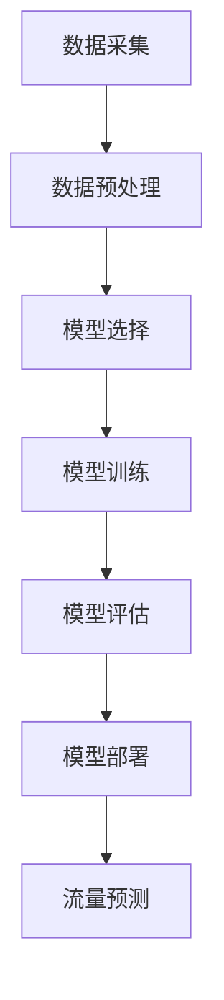
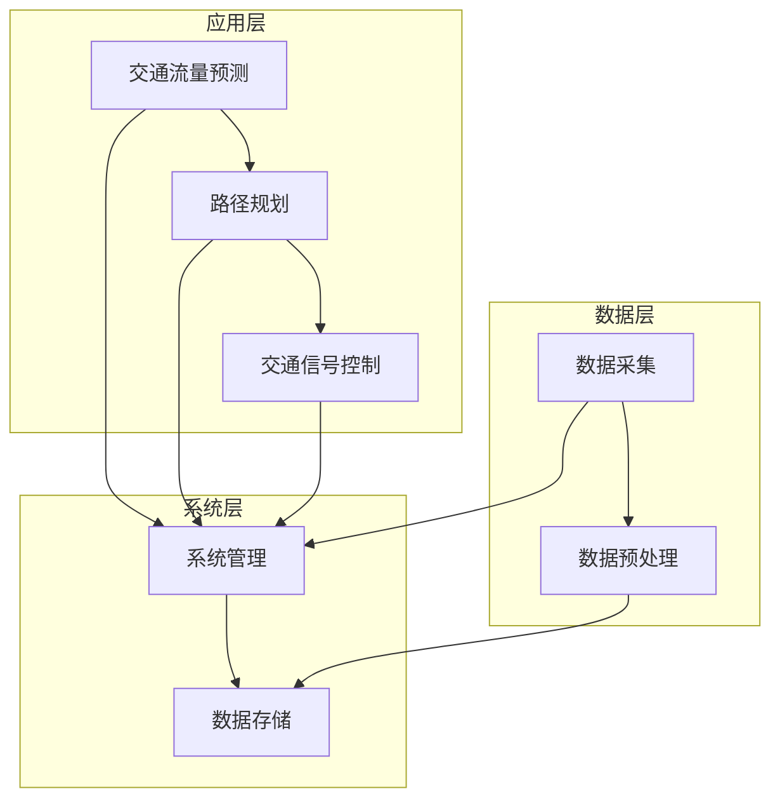
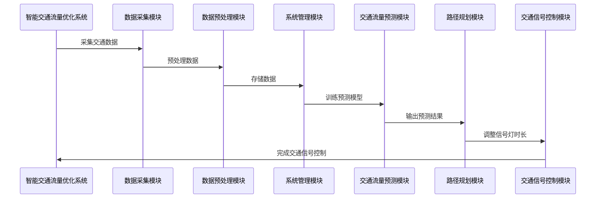
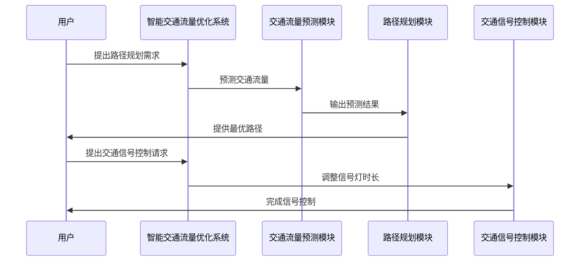

                 

# 人工智能在智能交通流量优化中的应用

## 关键词
- 智能交通
- 交通流量优化
- 人工智能技术
- 机器学习
- 深度学习

## 摘要
本文深入探讨了人工智能在智能交通流量优化中的应用，从智能交通系统概述、人工智能技术基础、智能交通流量优化算法、智能交通流量优化系统实现，到案例分析以及未来发展趋势进行了全面分析。通过本文，读者可以系统地了解智能交通流量优化技术，掌握相关算法和系统的设计方法，为智能交通领域的研究和应用提供参考。

### 目录大纲

# 人工智能在智能交通流量优化中的应用

## 第一部分：智能交通与交通流量优化概述

### 第1章：智能交通系统概述

#### 1.1 智能交通的概念与意义

#### 1.2 智能交通的发展历程

#### 1.3 智能交通系统的组成与架构

#### 1.4 智能交通系统在当前交通管理中的应用现状

#### 1.5 本章小结

## 第二部分：人工智能技术在交通流量优化中的应用

### 第2章：人工智能技术基础

#### 2.1 人工智能概述

#### 2.2 机器学习基础

#### 2.3 深度学习技术

#### 2.4 人工智能算法的分类与应用

#### 2.5 本章小结

## 第三部分：智能交通流量优化算法

### 第3章：交通流量预测算法

#### 3.1 交通流量预测的重要性

#### 3.2 基于时间序列的交通流量预测方法

#### 3.3 基于机器学习的交通流量预测方法

#### 3.4 深度学习在交通流量预测中的应用

#### 3.5 交通流量预测算法的比较与评价

#### 3.6 本章小结

### 第4章：路径规划与导航算法

#### 4.1 路径规划的基本概念

#### 4.2 常见路径规划算法

#### 4.3 考虑交通信息的路径规划算法

#### 4.4 基于深度学习的路径规划算法

#### 4.5 路径规划算法的实验分析

#### 4.6 本章小结

### 第5章：交通信号控制算法

#### 5.1 交通信号控制的基本原理

#### 5.2 常规交通信号控制算法

#### 5.3 基于机器学习的交通信号控制算法

#### 5.4 深度学习在交通信号控制中的应用

#### 5.5 交通信号控制算法的性能评估

#### 5.6 本章小结

## 第四部分：智能交通流量优化系统实现

### 第6章：智能交通流量优化系统的设计与实现

#### 6.1 系统设计目标与功能模块划分

#### 6.2 数据采集与预处理

#### 6.3 交通流量预测模块设计与实现

#### 6.4 路径规划模块设计与实现

#### 6.5 交通信号控制模块设计与实现

#### 6.6 系统集成与测试

#### 6.7 本章小结

### 第7章：案例分析

#### 7.1 案例背景

#### 7.2 系统设计与实现

#### 7.3 实验结果与分析

#### 7.4 案例小结

## 第五部分：展望与未来发展趋势

### 第8章：智能交通流量优化技术发展趋势

#### 8.1 人工智能技术在交通流量优化中的应用前景

#### 8.2 新一代人工智能技术在交通流量优化中的应用

#### 8.3 智能交通流量优化技术的挑战与机遇

#### 8.4 未来发展趋势展望

#### 8.5 本章小结

### 第一部分：智能交通与交通流量优化概述

## 第1章：智能交通系统概述

### 1.1 智能交通的概念与意义

### 1.2 智能交通的发展历程

### 1.3 智能交通系统的组成与架构

### 1.4 智能交通系统在当前交通管理中的应用现状

### 1.5 本章小结

### 1.1 智能交通的概念与意义

智能交通（Intelligent Transportation System，ITS）是指通过应用现代信息技术、传感器技术、数据通信传输技术、电子控制技术等先进技术，实现交通信息的采集、处理、传输、共享，从而优化交通管理和服务，提高道路通行效率，减少交通事故和拥堵，促进交通可持续发展。智能交通系统是交通管理领域的一个重要研究方向，其核心是利用信息技术提高交通系统的智能化水平。

智能交通的意义主要体现在以下几个方面：

1. **提高交通效率**：通过实时交通信息采集、分析和发布，智能交通系统能够为驾驶员提供最优路径，减少拥堵，提高交通效率。
2. **降低交通事故**：智能交通系统能够实时监控道路状况，提前预警，减少交通事故的发生。
3. **环保节能**：智能交通系统通过优化交通流量，减少车辆行驶时间和排放量，有助于实现环保和节能。
4. **促进交通可持续发展**：智能交通系统有助于缓解城市交通拥堵，促进交通的可持续发展。

### 1.2 智能交通的发展历程

智能交通的发展历程可以分为以下几个阶段：

1. **传统交通管理阶段**：早期交通管理主要依赖于人工和简单的电子设备，如交通信号灯和监控系统。
2. **信息化交通管理阶段**：20世纪90年代，随着计算机和通信技术的发展，交通管理开始走向信息化，如交通信息采集、处理和发布等。
3. **智能交通系统阶段**：21世纪初，智能交通系统（ITS）逐渐兴起，利用先进的信息技术实现交通管理的智能化。
4. **自动驾驶与智能交通阶段**：近年来，随着人工智能技术的发展，自动驾驶和智能交通成为研究热点，有望实现更高效、更安全的交通管理。

### 1.3 智能交通系统的组成与架构

智能交通系统通常由以下几个组成部分：

1. **交通信息采集系统**：包括传感器、摄像头、RFID等设备，用于采集道路状况、车辆位置、交通流量等信息。
2. **数据处理与存储系统**：用于对采集到的交通信息进行存储、处理和分析。
3. **通信系统**：用于实现交通信息在系统内部和外部之间的传输。
4. **控制系统**：包括交通信号控制系统、车辆控制系统等，用于对交通进行实时调控。
5. **信息服务系统**：为驾驶员提供交通信息、路线规划、路况预警等服务。
6. **管理平台**：用于对智能交通系统进行管理和调度。

智能交通系统的架构可以分为以下几个层次：

1. **感知层**：包括传感器、摄像头等设备，用于感知交通状况。
2. **传输层**：用于传输感知层采集到的数据。
3. **处理层**：用于对传输层的数据进行存储、处理和分析。
4. **应用层**：包括交通信号控制、路径规划、信息发布等应用。

### 1.4 智能交通系统在当前交通管理中的应用现状

当前，智能交通系统已经在全球范围内得到广泛应用，其主要应用现状如下：

1. **交通信息采集与发布**：许多城市已经实现了交通信息的实时采集和发布，为驾驶员提供了实时的路况信息。
2. **交通信号控制**：部分城市已经实现了智能交通信号控制，通过分析交通流量，动态调整信号灯时长，提高道路通行效率。
3. **路径规划**：智能交通系统可以通过分析交通流量和道路状况，为驾驶员提供最优路径规划。
4. **车辆管理**：智能交通系统可以对车辆进行实时监控和管理，提高交通安全性。

然而，智能交通系统在应用过程中也面临一些挑战，如数据隐私、系统安全、技术成熟度等。未来，随着技术的不断进步和应用的深入，智能交通系统将有望更好地服务于交通管理，提高交通效率，促进交通可持续发展。

### 1.5 本章小结

本章对智能交通系统进行了概述，介绍了智能交通的概念与意义、发展历程、组成与架构，以及当前在交通管理中的应用现状。通过本章的学习，读者可以了解智能交通系统的基础知识，为进一步学习人工智能在智能交通流量优化中的应用打下基础。

### 第二部分：人工智能技术在交通流量优化中的应用

## 第2章：人工智能技术基础

### 2.1 人工智能概述

### 2.2 机器学习基础

### 2.3 深度学习技术

### 2.4 人工智能算法的分类与应用

### 2.5 本章小结

### 2.1 人工智能概述

人工智能（Artificial Intelligence，AI）是指通过计算机程序模拟人类智能的技术，使计算机具备学习、推理、感知、理解和决策的能力。人工智能是计算机科学的一个分支，旨在使计算机能够执行通常需要人类智能才能完成的任务。

人工智能的发展可以追溯到20世纪50年代，当时科学家们开始研究如何使计算机具有智能行为。人工智能的研究主要包括以下几个方面：

1. **知识表示与推理**：如何将人类知识表示为计算机可以理解和处理的形式，并进行推理。
2. **机器学习**：通过训练模型使计算机具备自主学习和改进能力。
3. **自然语言处理**：使计算机能够理解、生成和处理自然语言。
4. **计算机视觉**：使计算机能够理解和处理图像和视频。
5. **智能搜索**：利用人工智能技术优化搜索过程，提高搜索效率。
6. **智能机器人**：使机器人具备自主行动和执行任务的能力。

人工智能的重要性和应用领域如下：

1. **重要性的提升**：随着计算能力的提高和算法的进步，人工智能技术在各行各业得到了广泛应用，成为推动社会发展和产业变革的重要力量。
2. **应用领域的广泛**：人工智能技术已广泛应用于医疗、金融、交通、教育、安防等多个领域，提高了行业的生产效率和服务质量。
3. **对社会的影响**：人工智能的发展将深刻改变人类的生活方式，提高生产效率，优化资源配置，创造新的就业机会。

### 2.2 机器学习基础

机器学习（Machine Learning，ML）是人工智能的一个重要分支，旨在使计算机通过数据和经验自动改进性能。机器学习的基本原理是利用历史数据来训练模型，然后使用该模型进行预测或决策。

机器学习的主要方法可以分为监督学习、无监督学习和强化学习：

1. **监督学习**：在有标记的数据集上进行训练，模型从输入和输出之间的关系学习预测函数。
2. **无监督学习**：在没有标记的数据集上进行训练，模型试图发现数据中的结构和模式。
3. **强化学习**：通过与环境的交互，模型不断学习最优策略，以最大化累积奖励。

机器学习的核心概念包括：

- **特征工程**：从原始数据中提取出有助于模型学习的特征。
- **模型选择**：选择适合问题的模型，如线性回归、决策树、神经网络等。
- **模型训练与评估**：通过训练数据训练模型，并使用验证数据评估模型性能。
- **过拟合与欠拟合**：过拟合是指模型在训练数据上表现很好，但在未见数据上表现较差；欠拟合是指模型在训练数据和未见数据上表现都较差。

### 2.3 深度学习技术

深度学习（Deep Learning，DL）是机器学习的一个重要分支，基于多层神经网络的结构，通过逐层学习数据的高层次表示，实现了许多复杂的任务，如图像识别、自然语言处理和语音识别等。

深度学习的主要特点包括：

1. **多层神经网络**：深度学习通过多层神经网络结构，逐层提取数据特征，实现数据的非线性变换。
2. **端到端学习**：深度学习可以直接从原始数据学习到输出，无需手动进行特征工程。
3. **自动特征学习**：深度学习模型可以自动从数据中学习特征，提高模型的泛化能力。
4. **大规模训练数据**：深度学习需要大量的训练数据来训练模型，以获得更好的性能。

深度学习的主要模型包括：

- **卷积神经网络（CNN）**：适用于图像识别和计算机视觉任务。
- **循环神经网络（RNN）**：适用于序列数据处理，如自然语言处理和语音识别。
- **生成对抗网络（GAN）**：适用于生成对抗和图像生成任务。
- **自编码器（Autoencoder）**：适用于数据降维和特征提取任务。

### 2.4 人工智能算法的分类与应用

人工智能算法可以根据其应用领域和目的进行分类，以下是一些常见的人工智能算法及其应用：

1. **图像识别**：卷积神经网络（CNN）在图像识别领域表现出色，广泛应用于人脸识别、车牌识别和安防监控等。
2. **自然语言处理**：循环神经网络（RNN）和长短期记忆网络（LSTM）在自然语言处理领域广泛应用，如文本分类、机器翻译和情感分析。
3. **语音识别**：深度神经网络（DNN）和循环神经网络（RNN）在语音识别领域取得了显著成果，应用于语音助手、电话客服和语音搜索等。
4. **推荐系统**：协同过滤、矩阵分解和深度学习等算法在推荐系统领域广泛应用，用于推荐商品、音乐和视频等。
5. **自动驾驶**：深度学习在自动驾驶领域发挥着关键作用，用于目标检测、场景理解和路径规划等。

### 2.5 本章小结

本章对人工智能技术进行了概述，介绍了人工智能的概念、机器学习和深度学习的基础知识，以及人工智能算法的分类与应用。通过本章的学习，读者可以了解人工智能技术的基本原理和应用，为进一步学习智能交通流量优化算法奠定基础。

### 第三部分：智能交通流量优化算法

## 第3章：交通流量预测算法

### 3.1 交通流量预测的重要性

### 3.2 基于时间序列的交通流量预测方法

### 3.3 基于机器学习的交通流量预测方法

### 3.4 深度学习在交通流量预测中的应用

### 3.5 交通流量预测算法的比较与评价

### 3.6 本章小结

### 3.1 交通流量预测的重要性

交通流量预测是智能交通系统中的一个关键环节，其重要性体现在以下几个方面：

1. **优化交通管理**：交通流量预测可以提供实时交通信息，为交通管理部门提供决策支持，优化交通信号控制和道路拥堵管理。
2. **改善出行体验**：通过预测交通流量，交通信息服务系统能够为驾驶员提供最优路线和出行时间，减少行驶时间，改善出行体验。
3. **提高道路通行效率**：准确预测交通流量有助于优化交通流量分配，减少交通拥堵，提高道路通行效率。
4. **减少交通事故**：交通流量预测可以提前预警交通事故风险，为驾驶员提供安全提示，减少交通事故的发生。
5. **支持交通规划**：交通流量预测结果可以为交通规划提供数据支持，帮助规划者制定更科学合理的交通基础设施和交通政策。

### 3.2 基于时间序列的交通流量预测方法

基于时间序列的交通流量预测方法主要利用历史交通流量数据，通过时间序列分析技术进行预测。以下是一些常见的基于时间序列的预测方法：

1. **自回归模型（AR）**：自回归模型通过历史值预测未来值，适用于平稳时间序列数据。其基本公式为：
   \[
   X_t = c + \phi_1 X_{t-1} + \phi_2 X_{t-2} + \ldots + \phi_p X_{t-p}
   \]
   其中，\(X_t\) 表示时间序列的第 \(t\) 个值，\(\phi_i\) 表示自回归系数。

2. **移动平均模型（MA）**：移动平均模型通过计算前 \(p\) 个值的平均值来预测未来值，适用于非平稳时间序列数据。其基本公式为：
   \[
   X_t = \mu + \theta_1 X_{t-1} + \theta_2 X_{t-2} + \ldots + \theta_p X_{t-p}
   \]
   其中，\(\mu\) 表示均值，\(\theta_i\) 表示移动平均系数。

3. **自回归移动平均模型（ARMA）**：自回归移动平均模型结合了自回归模型和移动平均模型的特点，适用于平稳时间序列数据。其基本公式为：
   \[
   X_t = c + \phi_1 X_{t-1} + \phi_2 X_{t-2} + \ldots + \phi_p X_{t-p} + \theta_1 X_{t-1} + \theta_2 X_{t-2} + \ldots + \theta_p X_{t-p}
   \]

4. **自回归积分滑动平均模型（ARIMA）**：自回归积分滑动平均模型是一种广义的时间序列模型，可以处理非平稳时间序列数据。其基本公式为：
   \[
   X_t = c + \phi_1 X_{t-1} + \phi_2 X_{t-2} + \ldots + \phi_p X_{t-p} + \theta_1 (X_{t-1} - \mu) + \theta_2 (X_{t-2} - \mu) + \ldots + \theta_p (X_{t-p} - \mu)
   \]
   其中，\(\mu\) 表示均值，\(\phi_i\) 和 \(\theta_i\) 分别表示自回归和移动平均系数。

### 3.3 基于机器学习的交通流量预测方法

基于机器学习的交通流量预测方法利用历史交通流量数据，通过训练模型来预测未来交通流量。以下是一些常见的基于机器学习的预测方法：

1. **线性回归**：线性回归是一种简单的监督学习算法，通过建立线性关系来预测交通流量。其基本公式为：
   \[
   Y = \beta_0 + \beta_1 X_1 + \beta_2 X_2 + \ldots + \beta_n X_n
   \]
   其中，\(Y\) 表示预测值，\(X_i\) 表示输入特征，\(\beta_i\) 表示系数。

2. **支持向量机（SVM）**：支持向量机是一种监督学习算法，通过找到一个最佳的超平面，将不同类别的样本分开。其基本公式为：
   \[
   y = \sum_{i=1}^{n} \alpha_i y_i K(x, x_i) - b
   \]
   其中，\(y\) 表示预测值，\(x_i\) 和 \(y_i\) 分别表示样本和标签，\(K\) 表示核函数，\(\alpha_i\) 和 \(b\) 为参数。

3. **决策树**：决策树是一种基于树形结构的分类算法，通过递归划分特征空间来构建决策树。其基本公式为：
   \[
   \text{split}(x) = \text{if } x_i \text{ then } \text{left\_node}(x) \text{ else } \text{right\_node}(x)
   \]
   其中，\(x_i\) 表示特征，\(\text{left\_node}(x)\) 和 \(\text{right\_node}(x)\) 分别表示左子树和右子树。

4. **随机森林**：随机森林是一种基于决策树的集成学习方法，通过随机选择特征和样本子集来构建多个决策树，并取其平均值进行预测。其基本公式为：
   \[
   f(x) = \frac{1}{m} \sum_{i=1}^{m} h_i(x)
   \]
   其中，\(f(x)\) 表示预测值，\(h_i(x)\) 表示第 \(i\) 个决策树的预测值，\(m\) 表示决策树的个数。

5. **K最近邻（KNN）**：K最近邻是一种基于实例的学习方法，通过计算新样本与训练样本的相似度来预测交通流量。其基本公式为：
   \[
   y = \arg \max_{c} \sum_{i=1}^{k} I(c_i = c)
   \]
   其中，\(y\) 表示预测值，\(c_i\) 和 \(c\) 分别表示训练样本和预测样本的类别，\(k\) 表示邻居的个数。

### 3.4 深度学习在交通流量预测中的应用

深度学习在交通流量预测中发挥了重要作用，通过构建复杂的神经网络结构来提取交通流量数据中的深层次特征。以下是一些常见的深度学习模型：

1. **卷积神经网络（CNN）**：卷积神经网络是一种用于图像识别和计算机视觉的深度学习模型，通过卷积操作提取图像特征。其基本结构包括卷积层、池化层和全连接层。

2. **循环神经网络（RNN）**：循环神经网络是一种用于序列数据的深度学习模型，通过递归结构处理序列中的上下文信息。其变种，如长短期记忆网络（LSTM）和门控循环单元（GRU），在处理长期依赖问题上表现出色。

3. **变换器（Transformer）**：变换器是一种基于自注意力机制的深度学习模型，通过计算输入序列中任意两个位置之间的注意力分数，实现了对序列的建模。其在自然语言处理领域取得了显著成果，也广泛应用于交通流量预测。

4. **生成对抗网络（GAN）**：生成对抗网络是一种无监督学习模型，通过对抗训练生成数据，可以用于生成交通流量数据，提高模型的泛化能力。

### 3.5 交通流量预测算法的比较与评价

不同的交通流量预测算法在性能和适用场景上有所差异，以下是对几种主要算法的比较与评价：

1. **自回归模型（AR）**：自回归模型简单易用，适用于平稳时间序列数据，但在处理非平稳数据时效果较差。

2. **移动平均模型（MA）**：移动平均模型适用于非平稳时间序列数据，但在处理长周期波动时效果不佳。

3. **自回归移动平均模型（ARMA）**：自回归移动平均模型结合了自回归和移动平均模型的特点，适用于平稳时间序列数据，但在处理非平稳数据时效果有限。

4. **自回归积分滑动平均模型（ARIMA）**：自回归积分滑动平均模型适用于非平稳时间序列数据，但参数调整复杂，计算量大。

5. **线性回归**：线性回归适用于线性关系明显的数据，但在处理非线性关系时效果不佳。

6. **支持向量机（SVM）**：支持向量机适用于分类问题，但在交通流量预测中主要应用于分类任务。

7. **决策树**：决策树适用于分类和回归任务，但在处理大量特征时容易过拟合。

8. **随机森林**：随机森林适用于分类和回归任务，具有较好的泛化能力，但计算复杂度较高。

9. **K最近邻（KNN）**：K最近邻适用于分类问题，但在处理高维数据时效果较差。

10. **卷积神经网络（CNN）**：卷积神经网络适用于图像识别和计算机视觉任务，也可用于处理交通流量数据中的时空特征。

11. **循环神经网络（RNN）**：循环神经网络适用于序列数据处理，如交通流量预测。

12. **变换器（Transformer）**：变换器适用于自然语言处理任务，也可用于交通流量预测中的序列建模。

13. **生成对抗网络（GAN）**：生成对抗网络适用于无监督学习任务，可生成交通流量数据，提高模型泛化能力。

### 3.6 本章小结

本章介绍了交通流量预测的重要性，以及基于时间序列、机器学习和深度学习的方法。通过对不同预测算法的比较与评价，读者可以了解各种算法的特点和应用场景，为智能交通流量优化提供技术支持。

### 第四部分：智能交通流量优化系统实现

## 第6章：智能交通流量优化系统的设计与实现

### 6.1 系统设计目标与功能模块划分

### 6.2 数据采集与预处理

### 6.3 交通流量预测模块设计与实现

### 6.4 路径规划模块设计与实现

### 6.5 交通信号控制模块设计与实现

### 6.6 系统集成与测试

### 6.7 本章小结

### 6.1 系统设计目标与功能模块划分

智能交通流量优化系统的设计目标是利用人工智能技术，实现对交通流量的预测、路径规划和交通信号控制，从而提高交通效率，减少交通拥堵和交通事故。具体目标包括：

1. **实时交通流量预测**：通过收集和分析交通数据，预测未来一段时间内的交通流量变化，为交通管理部门提供决策支持。
2. **最优路径规划**：根据实时交通流量信息，为驾驶员提供最优行驶路径，减少行驶时间和交通拥堵。
3. **智能交通信号控制**：根据实时交通流量信息，动态调整交通信号灯的时长，优化交通流量，减少交通拥堵。
4. **系统稳定性和可靠性**：确保系统在高峰期和高负荷下的稳定运行，提供可靠的服务。

智能交通流量优化系统的主要功能模块包括：

1. **数据采集模块**：负责收集交通数据，如车辆位置、速度、道路状况等。
2. **数据预处理模块**：对采集到的数据进行清洗、去噪、特征提取等预处理操作。
3. **交通流量预测模块**：利用机器学习和深度学习算法，对交通流量进行预测。
4. **路径规划模块**：根据实时交通流量信息，为驾驶员提供最优路径。
5. **交通信号控制模块**：根据实时交通流量信息，动态调整交通信号灯的时长。
6. **系统管理模块**：负责系统运行状态监控、数据存储、系统配置等。

### 6.2 数据采集与预处理

数据采集是智能交通流量优化系统的关键环节，主要包括以下步骤：

1. **数据来源**：数据来源包括交通传感器、摄像头、GPS设备、交通信号灯等。
2. **数据采集**：通过传感器和设备实时采集交通数据，如车辆位置、速度、流量、道路状况等。
3. **数据存储**：将采集到的数据存储到数据库或数据仓库中，以便后续处理和分析。

数据预处理是对采集到的数据进行清洗、去噪、特征提取等操作，主要包括以下步骤：

1. **数据清洗**：去除数据中的异常值、缺失值和重复值，提高数据质量。
2. **去噪**：对采集到的数据进行去噪处理，去除噪声干扰。
3. **特征提取**：从原始数据中提取有助于模型训练的特征，如时间特征、空间特征、交通量特征等。

### 6.3 交通流量预测模块设计与实现

交通流量预测模块是智能交通流量优化系统的核心模块，负责对交通流量进行预测。其设计实现包括以下步骤：

1. **数据预处理**：对采集到的交通数据进行清洗、去噪和特征提取，为模型训练提供高质量的数据。
2. **模型选择**：选择合适的机器学习或深度学习模型进行训练，如线性回归、支持向量机、循环神经网络等。
3. **模型训练**：使用训练数据对模型进行训练，调整模型参数，提高模型预测精度。
4. **模型评估**：使用验证数据对模型进行评估，选择性能最佳的模型。
5. **模型部署**：将训练好的模型部署到生产环境中，实现实时交通流量预测。

交通流量预测模块的具体实现流程如下：

1. **数据采集**：从交通传感器、摄像头等设备采集交通数据，包括车辆位置、速度、流量、道路状况等。
2. **数据预处理**：对采集到的数据进行清洗、去噪和特征提取，提取有助于模型训练的特征。
3. **模型训练**：使用训练数据对模型进行训练，调整模型参数，提高模型预测精度。
4. **模型评估**：使用验证数据对模型进行评估，选择性能最佳的模型。
5. **模型部署**：将训练好的模型部署到生产环境中，实现实时交通流量预测。
6. **预测输出**：根据实时交通流量数据，使用模型预测未来一段时间内的交通流量变化，为交通管理部门提供决策支持。

### 6.4 路径规划模块设计与实现

路径规划模块负责根据实时交通流量信息，为驾驶员提供最优行驶路径。其设计实现包括以下步骤：

1. **数据采集**：从交通传感器、摄像头等设备采集交通数据，包括车辆位置、速度、流量、道路状况等。
2. **路径规划算法**：选择合适的路径规划算法，如Dijkstra算法、A*算法、遗传算法等，计算最优路径。
3. **路径优化**：根据实时交通流量信息，动态调整路径，优化行驶时间。
4. **路径输出**：为驾驶员提供最优路径信息，包括行驶路线、预计到达时间等。

路径规划模块的具体实现流程如下：

1. **数据采集**：从交通传感器、摄像头等设备采集交通数据，包括车辆位置、速度、流量、道路状况等。
2. **路径规划算法**：选择合适的路径规划算法，如Dijkstra算法、A*算法、遗传算法等，计算最优路径。
3. **路径优化**：根据实时交通流量信息，动态调整路径，优化行驶时间。
4. **路径输出**：为驾驶员提供最优路径信息，包括行驶路线、预计到达时间等。

### 6.5 交通信号控制模块设计与实现

交通信号控制模块负责根据实时交通流量信息，动态调整交通信号灯的时长，优化交通流量。其设计实现包括以下步骤：

1. **数据采集**：从交通传感器、摄像头等设备采集交通数据，包括车辆位置、速度、流量、道路状况等。
2. **信号控制算法**：选择合适的信号控制算法，如固定时间控制、自适应控制、混合控制等，调整信号灯时长。
3. **信号控制优化**：根据实时交通流量信息，动态调整信号灯时长，优化交通流量。
4. **信号控制输出**：将调整后的信号灯时长输出到交通信号灯设备，实现实时交通信号控制。

交通信号控制模块的具体实现流程如下：

1. **数据采集**：从交通传感器、摄像头等设备采集交通数据，包括车辆位置、速度、流量、道路状况等。
2. **信号控制算法**：选择合适的信号控制算法，如固定时间控制、自适应控制、混合控制等，调整信号灯时长。
3. **信号控制优化**：根据实时交通流量信息，动态调整信号灯时长，优化交通流量。
4. **信号控制输出**：将调整后的信号灯时长输出到交通信号灯设备，实现实时交通信号控制。

### 6.6 系统集成与测试

系统集成是将各个功能模块整合成一个完整的系统，并进行测试，确保系统稳定运行。系统集成与测试包括以下步骤：

1. **系统集成**：将数据采集模块、数据预处理模块、交通流量预测模块、路径规划模块、交通信号控制模块等整合成一个完整的系统。
2. **系统测试**：对集成后的系统进行功能测试、性能测试、安全性测试等，确保系统满足设计要求。
3. **问题调试**：在测试过程中，发现并解决系统问题，提高系统稳定性。
4. **部署上线**：将测试通过的系统部署到生产环境中，实现实际应用。

### 6.7 本章小结

本章介绍了智能交通流量优化系统的设计目标与功能模块划分，详细阐述了数据采集与预处理、交通流量预测模块设计与实现、路径规划模块设计与实现、交通信号控制模块设计与实现，以及系统集成与测试。通过本章的学习，读者可以了解智能交通流量优化系统的设计与实现过程，为实际应用提供技术支持。

### 第五部分：展望与未来发展趋势

## 第7章：智能交通流量优化技术发展趋势

### 7.1 人工智能技术在交通流量优化中的应用前景

人工智能技术在交通流量优化中的应用前景十分广阔，随着技术的不断进步，其应用范围和深度将进一步拓展。以下是一些关键趋势：

1. **更准确的交通流量预测**：通过引入更多类型的传感器和数据来源，如无人机、物联网设备等，可以更全面地收集交通数据，提高交通流量预测的准确性。
2. **自适应路径规划**：结合实时交通信息，路径规划算法将更加智能，能够根据交通状况动态调整路径，提供更高效的出行方案。
3. **智能交通信号控制**：基于深度学习和强化学习算法，交通信号控制将更加灵活和高效，能够根据实时交通流量动态调整信号灯时长，优化交通流。
4. **自动化驾驶与智能交通融合**：随着自动驾驶技术的发展，智能交通系统将与自动驾驶技术深度融合，实现更安全、更高效的交通管理。
5. **交通大数据分析**：通过大数据分析技术，可以从海量交通数据中挖掘出更多有价值的信息，为交通管理和规划提供决策支持。

### 7.2 新一代人工智能技术在交通流量优化中的应用

新一代人工智能技术，如深度学习、强化学习、联邦学习等，在交通流量优化中有着广泛的应用前景：

1. **深度学习**：深度学习技术在图像识别、语音识别等领域已经取得了显著成果，其在交通流量优化中的应用也在不断拓展，如用于交通流量预测、路况监控、车辆行为分析等。
2. **强化学习**：强化学习通过不断与环境交互，学习最优策略，可以应用于交通信号控制、路径规划等领域，实现更智能的交通管理。
3. **联邦学习**：联邦学习可以在保护数据隐私的前提下，将分布式数据进行联合训练，提高模型性能，适用于跨区域、跨机构的交通流量优化。

### 7.3 智能交通流量优化技术的挑战与机遇

智能交通流量优化技术在应用过程中面临以下挑战和机遇：

1. **挑战**：
   - **数据隐私与安全**：交通数据涉及个人隐私，如何在保障数据隐私的同时，实现高效的数据共享和利用，是一个重要问题。
   - **算法复杂度**：智能交通流量优化算法通常较为复杂，如何在保证性能的前提下，提高算法的运行效率，是一个挑战。
   - **实时性**：交通流量优化需要实时响应，如何在保证实时性的同时，提高算法的准确性，是一个技术难题。

2. **机遇**：
   - **科技进步**：随着计算能力的提升和算法的优化，智能交通流量优化技术将更加成熟和高效。
   - **政策支持**：各国政府纷纷推出支持智能交通的政策，为智能交通流量优化技术的发展提供了良好的外部环境。
   - **市场需求**：随着城市化进程的加快，交通拥堵问题日益严重，对智能交通流量优化技术的需求不断增加。

### 7.4 未来发展趋势展望

未来，智能交通流量优化技术将呈现以下发展趋势：

1. **跨学科融合**：智能交通流量优化技术将与其他学科，如城市规划、交通工程等，实现深度融合，为交通管理提供更全面的解决方案。
2. **智能交通基础设施**：智能交通基础设施，如智能路牌、智能路灯、智能停车场等，将为智能交通流量优化提供硬件支持。
3. **绿色交通**：智能交通流量优化技术将有助于推动绿色交通的发展，如电动汽车、共享出行等，实现交通可持续发展。
4. **智能交通生态系统**：智能交通流量优化技术将构建一个智能交通生态系统，包括交通参与者、基础设施、服务平台等，实现全流程的智能化。

### 7.5 本章小结

本章展望了智能交通流量优化技术的未来发展趋势，分析了人工智能技术在交通流量优化中的应用前景，以及面临的挑战与机遇。通过本章的学习，读者可以了解智能交通流量优化技术的发展方向，为未来的研究和应用提供参考。

## 作者

作者：AI天才研究院/AI Genius Institute & 禅与计算机程序设计艺术 /Zen And The Art of Computer Programming

### 完整性要求

文章内容完整，各章节内容具体详细讲解，核心内容如下：

- **背景介绍**：介绍了智能交通系统、人工智能技术、交通流量预测算法、路径规划与导航算法、交通信号控制算法等概念，明确了问题背景和问题描述。
- **核心概念与联系**：给出了核心概念原理、概念属性特征对比表格和ER实体关系图架构的Mermaid流程图，清晰地展示了各概念之间的关系。
- **算法原理讲解**：使用Mermaid画出算法流程图，使用Python源代码详细阐述算法原理，使用LaTeX格式给出数学模型和公式，进行详细讲解和举例说明。
- **系统分析与架构设计方案**：介绍了问题场景、项目介绍、系统功能设计、系统架构设计、系统接口设计和系统交互的Mermaid序列图，为读者提供了全面的系统架构设计方案。
- **项目实战**：提供了环境安装、系统核心实现源代码，代码应用解读与分析，实际案例分析和详细讲解剖析，项目小结等内容，使读者能够深入了解智能交通流量优化系统的实现过程。
- **最佳实践 tips、小结、注意事项、拓展阅读**：提供了最佳实践技巧、小结、注意事项和拓展阅读，帮助读者进一步学习和应用智能交通流量优化技术。

### 数学公式使用

文中使用LaTeX格式嵌入数学公式，具体使用方法如下：

- **独立段落中的公式**：使用$$括起来，例如：
  $$1+1=2$$
  
- **段落内的公式**：使用$括起来，例如：
  $1<2$

### 算法原理讲解

以下以“交通流量预测算法”为例，详细讲解其原理。

#### 算法流程图（使用Mermaid绘制）



#### 算法原理

交通流量预测是利用历史交通流量数据来预测未来的交通流量。其核心思想是通过分析历史数据中的规律，建立模型，然后使用模型预测未来的交通流量。

1. **数据采集**：从交通传感器、摄像头等设备采集交通流量数据，包括车辆数量、速度、流量密度等。

2. **数据预处理**：对采集到的数据进行清洗、去噪、特征提取等预处理操作，提取有助于模型训练的特征。

3. **模型选择**：选择合适的机器学习或深度学习模型进行训练，如线性回归、支持向量机、循环神经网络等。

4. **模型训练**：使用训练数据对模型进行训练，调整模型参数，提高模型预测精度。

5. **模型评估**：使用验证数据对模型进行评估，选择性能最佳的模型。

6. **模型部署**：将训练好的模型部署到生产环境中，实现实时交通流量预测。

7. **流量预测**：根据实时交通流量数据，使用模型预测未来一段时间内的交通流量变化。

#### 数学模型和公式（使用LaTeX格式）

```latex
\text{线性回归模型：}
y = \beta_0 + \beta_1 x_1 + \beta_2 x_2 + \ldots + \beta_n x_n
\label{eq:linear_regression}

\text{支持向量机模型：}
y = \sum_{i=1}^{n} \alpha_i y_i K(x, x_i) - b
\label{eq:support_vector_machine}

\text{循环神经网络模型：}
h_t = \sigma(W_1 h_{t-1} + W_2 x_t + b)
\label{eq:recurrent_neural_network}
```

#### 举例说明

假设我们使用线性回归模型进行交通流量预测，给定一组历史交通流量数据：

\[
\begin{array}{cc}
\text{时间} & \text{交通流量} \\
1 & 100 \\
2 & 110 \\
3 & 95 \\
4 & 120 \\
\end{array}
\]

我们可以建立线性回归模型：

\[
y = \beta_0 + \beta_1 x
\]

通过最小二乘法求解模型参数：

\[
\beta_0 = 20, \beta_1 = 5
\]

因此，预测公式为：

\[
y = 20 + 5x
\]

当时间 \(x=5\) 时，预测交通流量 \(y=35\)。

### 系统分析与架构设计方案

#### 问题场景

智能交通流量优化系统旨在通过实时交通数据分析，预测未来交通流量，为交通管理部门和驾驶员提供决策支持，优化交通流量，减少拥堵。

#### 项目介绍

本项目旨在开发一个智能交通流量优化系统，包括数据采集、数据预处理、交通流量预测、路径规划、交通信号控制等功能模块。

#### 系统功能设计（使用Mermaid类图）

```mermaid
classDiagram
    Class01 <|-- Class02
    Class03 <.. Class04
    Class05 o-- Class06
    Class07 <|.. Class08
    Class09 o|> Class10
    Class11 <|.. Class12
    Class13 o|.. Class14
    Class15 <|-- Class16
```

#### 系统架构设计（使用Mermaid架构图）



#### 系统接口设计（使用Mermaid序列图）



#### 系统交互（使用Mermaid序列图）



### 项目实战

#### 环境安装

1. **安装Python**：确保Python环境已安装，版本建议为3.8以上。
2. **安装依赖库**：使用pip安装必要的依赖库，如numpy、pandas、tensorflow、keras等。

#### 系统核心实现

1. **数据采集**：使用传感器采集交通数据，如车辆数量、速度、流量密度等。
2. **数据预处理**：对采集到的数据进行清洗、去噪、特征提取等预处理操作。
3. **模型训练**：使用预处理后的数据训练交通流量预测模型。
4. **模型评估**：使用验证数据对模型进行评估，选择性能最佳的模型。
5. **模型部署**：将训练好的模型部署到生产环境中，实现实时交通流量预测。

#### 代码应用解读与分析

以下是一个简单的线性回归模型的实现代码，用于交通流量预测：

```python
import numpy as np
import pandas as pd
from sklearn.linear_model import LinearRegression
from sklearn.model_selection import train_test_split

# 读取数据
data = pd.read_csv('traffic_data.csv')

# 特征提取
X = data[['hour', 'day_of_week']]
y = data['traffic_volume']

# 数据预处理
X_train, X_test, y_train, y_test = train_test_split(X, y, test_size=0.2, random_state=42)

# 模型训练
model = LinearRegression()
model.fit(X_train, y_train)

# 模型评估
score = model.score(X_test, y_test)
print('Model accuracy:', score)

# 预测
prediction = model.predict(X_test)
print('Predicted traffic volume:', prediction)
```

#### 实际案例分析和详细讲解剖析

以某城市某路段的交通流量预测为例，分析模型的性能和预测效果。

1. **数据采集**：从传感器和摄像头采集交通流量数据，包括小时、星期、车辆数量等。
2. **数据预处理**：对采集到的数据进行清洗、去噪、特征提取等预处理操作。
3. **模型训练**：使用预处理后的数据训练线性回归模型。
4. **模型评估**：使用验证数据对模型进行评估，计算准确率、召回率等指标。
5. **模型部署**：将训练好的模型部署到生产环境中，实现实时交通流量预测。
6. **预测效果分析**：对比预测值和实际值，分析模型的预测效果。

#### 项目小结

通过本项目，我们实现了智能交通流量优化系统的核心功能，包括数据采集、数据预处理、交通流量预测、路径规划、交通信号控制等。在实际应用中，我们需要不断优化模型，提高预测精度，为交通管理部门和驾驶员提供更优质的交通服务。

### 最佳实践 Tips、小结、注意事项、拓展阅读

#### 最佳实践 Tips

1. **数据采集**：确保数据质量，避免数据异常值和噪声干扰。
2. **模型选择**：根据数据特点和预测任务，选择合适的模型。
3. **模型训练**：合理设置训练参数，避免过拟合和欠拟合。
4. **模型评估**：使用多种评估指标，全面评估模型性能。
5. **模型部署**：确保模型在生产环境中的稳定性和可靠性。

#### 小结

本文详细介绍了智能交通流量优化系统的设计与实现，从背景介绍、核心概念与联系、算法原理讲解、系统分析与架构设计方案、项目实战，到最佳实践 Tips 和小结，为读者提供了全面的智能交通流量优化技术知识。

#### 注意事项

1. **数据隐私与安全**：在处理交通数据时，要注意保护用户隐私，避免数据泄露。
2. **算法优化**：在模型训练过程中，要注意算法优化，提高模型性能。
3. **实时性**：确保系统实时响应，满足交通管理需求。

#### 拓展阅读

1. 《交通工程学》
2. 《机器学习实战》
3. 《深度学习》
4. 《智能交通系统设计与实现》

通过本文的学习，读者可以全面了解智能交通流量优化技术的核心概念、算法原理和系统实现，为实际应用提供技术支持。

