                 

# 人工智能在智能家居安全中的应用

## 关键词
- 人工智能
- 智能家居
- 安全
- 入侵检测
- 智能监控
- 深度学习

## 摘要
本文旨在探讨人工智能技术在智能家居安全中的应用。随着物联网技术的发展，智能家居设备在日常生活中的普及程度日益提高，随之而来的安全风险也日益显著。本文首先介绍了智能家居安全的背景、核心概念和现有问题，接着详细讲解了人工智能在智能家居安全中常用的算法原理，如机器学习和深度学习，并通过实际案例展示了这些算法在入侵检测、视频监控和数据分析等方面的应用。最后，本文总结了人工智能在智能家居安全中的最佳实践，并对未来的发展方向进行了展望。

## 目录大纲设计思路

### 第一部分：智能家居安全概述

**第1章：智能家居安全概述**

- **背景介绍**：智能家居安全的概念、现状以及存在的问题。
- **人工智能基础**：人工智能的定义、发展历程、技术分类。
- **问题解决**：利用人工智能提升智能家居安全水平。
- **边界与外延**：智能家居安全研究的范畴、技术与应用场景。

**第2章：人工智能核心技术**

- **机器学习**：算法原理、流程图、Python源代码示例、数学模型和公式。
- **深度学习**：算法原理、流程图、Python源代码示例、数学模型和公式。

### 第二部分：智能家居安全系统设计

**第3章：智能家居安全系统设计**

- **系统功能设计**：领域模型类图、系统架构设计、接口设计、系统交互流程。

### 第三部分：人工智能在智能家居安全中的应用

**第4章：入侵检测与防护**

- **入侵检测技术**：算法原理、Python源代码示例、数学模型和公式。
- **防护策略**：算法原理、Python源代码示例、数学模型和公式。

**第5章：智能监控与数据分析**

- **视频监控**：算法原理、Python源代码示例、数学模型和公式。
- **数据分析**：算法原理、Python源代码示例、数学模型和公式。

**第6章：智能门锁与生物识别**

- **智能门锁**：算法原理、Python源代码示例、数学模型和公式。
- **生物识别**：算法原理、Python源代码示例、数学模型和公式。

### 第四部分：最佳实践与总结

**第7章：最佳实践与总结**

- **最佳实践**：总结书中的关键知识点，提供实践中的注意事项和拓展阅读建议。
- **小结**：对全文内容进行总结。
- **注意事项**：使用人工智能技术在智能家居安全中需要注意的事项。
- **拓展阅读**：推荐相关领域的高质量文献和资源。

### 第一部分：智能家居安全概述

#### 第1章：智能家居安全概述

### 1.1 背景介绍

随着物联网（IoT）技术的快速发展，智能家居设备已成为现代家庭生活的重要组成部分。这些设备通过互联网连接，实现了家庭设备的自动化和智能化管理，如智能门锁、智能灯泡、智能插座、智能空调等。然而，智能家居设备的普及也带来了新的安全挑战。

**问题背景**：
- **数据泄露**：智能家居设备存储和传输的用户数据可能被非法访问。
- **网络攻击**：智能家居设备可能成为黑客攻击的切入点，进而威胁整个家庭网络的安全。
- **隐私侵犯**：用户的行为数据可能被第三方收集和利用。

**问题描述**：
- 智能家居设备的安全问题主要涉及数据安全、网络安全和个人隐私保护等方面。

**问题解决**：
- 利用人工智能技术，如机器学习和深度学习，可以提升智能家居设备的安全性。

**边界与外延**：
- **智能家居安全**：指利用人工智能等技术确保智能家居设备的数据安全、网络安全和个人隐私。
- **研究范畴**：包括数据加密、入侵检测、网络安全防护、用户行为分析等。
- **应用场景**：智能门锁、智能摄像头、智能照明系统等。

### 1.2 人工智能基础

**核心概念**：
- **人工智能**：模拟人类智能行为的计算机系统。
- **发展历程**：从规则系统到知识表示，再到机器学习和深度学习。
- **技术分类**：监督学习、无监督学习、强化学习等。

**概念属性特征对比表格**：

| 分类       | 特点                         | 应用场景                   |
|------------|------------------------------|----------------------------|
| 监督学习   | 有标注的数据训练模型         | 画像识别、预测分析           |
| 无监督学习 | 没有标注的数据训练模型       | 聚类分析、降维               |
| 强化学习   | 通过与环境交互来学习策略       | 自动驾驶、游戏AI             |

**ER实体关系图架构**：

```mermaid
erDiagram
    User ||--|{ Device }|-- User
    Device ||--|{ Data }|-- Device
    Data ||--|{ Security }|-- Data
```

### 1.3 问题解决

**利用人工智能提升智能家居安全水平**

**算法原理**：
- **入侵检测**：通过监控网络流量和设备行为，检测异常行为。
- **加密技术**：使用加密算法保护数据传输和存储的安全。
- **行为分析**：分析用户行为模式，识别潜在的威胁。

**实例说明**：
- **入侵检测**：使用KNN算法检测异常流量。
- **加密技术**：使用AES算法进行数据加密。
- **行为分析**：使用决策树分类用户行为。

**数学模型和公式**：

$$
\begin{aligned}
&\text{入侵检测：} \\
&\text{KNN：} \quad d(x, c) = \min \{d(x, y) | y \in \mathcal{N}(c)\} \\
&\text{AES加密：} \quad \text{密文} = E_K(\text{明文}) \\
&\text{行为分析：} \quad \text{分类器} = \text{DecisionTreeClassifier()}
\end{aligned}
$$

### 1.4 边界与外延

**智能家居安全研究的范畴、技术与应用场景**

- **研究范畴**：
  - 数据安全：加密、认证、访问控制。
  - 网络安全：入侵检测、防火墙、VPN。
  - 个人隐私：行为分析、数据去重、匿名化。

- **应用场景**：
  - 智能门锁：生物识别、行为分析。
  - 智能摄像头：人脸识别、行为监控。
  - 智能照明系统：感应控制、能耗管理。

#### 第2章：人工智能核心技术

### 2.1 机器学习

**算法原理讲解**

- **机器学习**：通过从数据中学习规律，构建预测模型。
- **分类算法**：监督学习的一种，用于将数据分类到不同的类别。
- **回归算法**：监督学习的一种，用于预测数值型目标。

**算法流程图**：

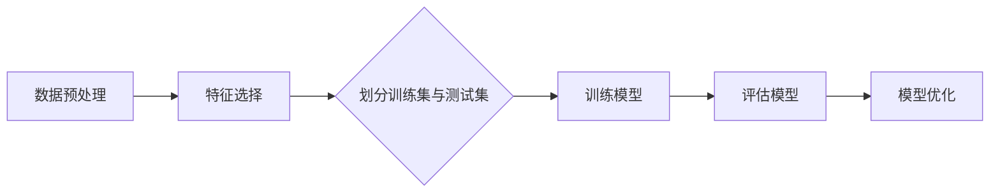

**Python源代码示例**

```python
from sklearn.datasets import load_iris
from sklearn.model_selection import train_test_split
from sklearn.tree import DecisionTreeClassifier
from sklearn.metrics import accuracy_score

# 加载数据
iris = load_iris()
X, y = iris.data, iris.target

# 划分训练集与测试集
X_train, X_test, y_train, y_test = train_test_split(X, y, test_size=0.3, random_state=42)

# 训练模型
clf = DecisionTreeClassifier()
clf.fit(X_train, y_train)

# 预测测试集
y_pred = clf.predict(X_test)

# 评估模型
accuracy = accuracy_score(y_test, y_pred)
print(f"模型准确率：{accuracy}")
```

**数学模型和公式**

$$
\begin{aligned}
&\text{决策树：} \\
&\text{熵：} H = -\sum_{i} p_i \log_2 p_i \\
&\text{信息增益：} I(G) = H(\text{总}) - H(\text{条件})
\end{aligned}
$$

**实例说明**

- **数据集**：使用Iris数据集进行分类。
- **模型训练**：使用决策树模型。
- **模型评估**：计算准确率。

### 2.2 深度学习

**算法原理讲解**

- **深度学习**：基于多层神经网络的学习方法，用于模拟人脑的神经网络结构。
- **神经网络**：由多个神经元组成的网络，用于处理和传递信息。
- **反向传播**：用于训练神经网络的算法，通过调整权重来优化模型。

**算法流程图**：

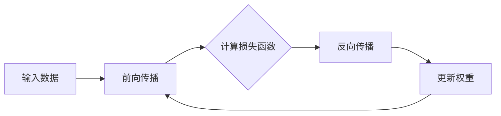

**Python源代码示例**

```python
import tensorflow as tf
from tensorflow.keras.datasets import mnist
from tensorflow.keras.models import Sequential
from tensorflow.keras.layers import Dense, Flatten
from tensorflow.keras.optimizers import Adam

# 加载数据
(x_train, y_train), (x_test, y_test) = mnist.load_data()
x_train = x_train.reshape(-1, 784)
x_test = x_test.reshape(-1, 784)

# 编码标签
y_train = tf.keras.utils.to_categorical(y_train, 10)
y_test = tf.keras.utils.to_categorical(y_test, 10)

# 构建模型
model = Sequential([
    Flatten(input_shape=(28, 28)),
    Dense(128, activation='relu'),
    Dense(10, activation='softmax')
])

# 编译模型
model.compile(optimizer=Adam(), loss='categorical_crossentropy', metrics=['accuracy'])

# 训练模型
model.fit(x_train, y_train, epochs=5, batch_size=64, validation_split=0.2)

# 评估模型
test_loss, test_acc = model.evaluate(x_test, y_test)
print(f"测试准确率：{test_acc}")
```

**数学模型和公式**

$$
\begin{aligned}
&\text{前向传播：} \\
&z = \sigma(Wx + b) \\
&\text{反向传播：} \\
&\delta = \frac{\partial L}{\partial z} \\
&W_{new} = W - \alpha \frac{\partial L}{\partial W} \\
&b_{new} = b - \alpha \frac{\partial L}{\partial b}
\end{aligned}
$$

**实例说明**

- **数据集**：使用MNIST数据集进行手写数字识别。
- **模型训练**：使用多层感知机（MLP）模型。
- **模型评估**：计算测试集的准确率。

### 第二部分：智能家居安全系统设计

#### 第3章：智能家居安全系统设计

### 3.1 系统功能设计

**领域模型类图**

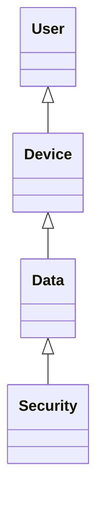

**系统架构设计**

**Mermaid架构图**

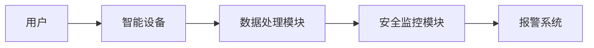

**系统接口设计**

- **数据传输接口**：使用HTTP/HTTPS协议进行数据传输。
- **设备控制接口**：提供设备的基本操作，如开关、调节等。

**系统交互流程**

**Mermaid序列图**

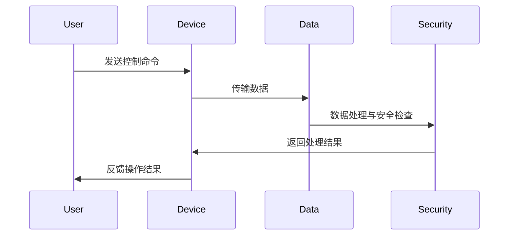

### 第三部分：人工智能在智能家居安全中的应用

#### 第4章：入侵检测与防护

### 4.1 入侵检测技术

**算法原理讲解**

- **入侵检测系统（IDS）**：用于检测网络或系统中的恶意行为。
- **基于特征的入侵检测**：使用已知攻击的特征进行检测。
- **基于行为的入侵检测**：分析系统的正常行为，检测异常行为。

**算法流程图**

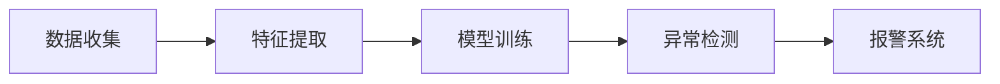

**Python源代码示例**

```python
import pandas as pd
from sklearn.ensemble import IsolationForest
from sklearn.model_selection import train_test_split

# 加载数据
data = pd.read_csv('intrusion_data.csv')
X = data.drop(['label'], axis=1)
y = data['label']

# 划分训练集与测试集
X_train, X_test, y_train, y_test = train_test_split(X, y, test_size=0.3, random_state=42)

# 训练模型
model = IsolationForest(n_estimators=100, contamination='auto')
model.fit(X_train)

# 预测测试集
y_pred = model.predict(X_test)

# 评估模型
accuracy = (y_pred == y_test).mean()
print(f"模型准确率：{accuracy}")
```

**数学模型和公式**

$$
\begin{aligned}
&\text{Isolation Forest：} \\
&\text{异常得分：} s(x) = \frac{1}{T} \sum_{t=1}^T \log_2(r_t) \\
&\text{分类：} \\
&\text{score} < \alpha : \text{正常行为} \\
&\text{score} \ge \alpha : \text{异常行为}
\end{aligned}
$$

**实例说明**

- **数据集**：使用KDD CUP 99入侵检测数据集。
- **模型训练**：使用孤立森林（Isolation Forest）模型。
- **模型评估**：计算测试集的准确率。

### 4.2 防护策略

**算法原理讲解**

- **加密技术**：使用加密算法保护数据传输和存储的安全。
- **访问控制**：限制只有授权用户才能访问敏感信息。
- **防火墙**：监控网络流量，阻止未经授权的访问。

**算法流程图**

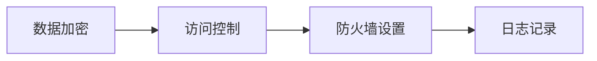

**Python源代码示例**

```python
from Crypto.Cipher import AES
from Crypto.Util.Padding import pad, unpad
from base64 import b64encode, b64decode

# 设置密钥
key = b'Sixteen byte key'

# 加密
cipher = AES.new(key, AES.MODE_CBC)
ct_bytes = cipher.encrypt(pad(b"葱油饼好好吃哦", AES.block_size))
iv = cipher.iv
ct = b64encode(ct_bytes).decode('utf-8')

# 解密
cipher = AES.new(key, AES.MODE_CBC, iv)
pt = unpad(b64decode(ct), AES.block_size).decode('utf-8')

print(f"加密后的数据：{ct}")
print(f"解密后的数据：{pt}")
```

**数学模型和公式**

$$
\begin{aligned}
&\text{AES加密：} \\
&\text{密文} = E_K(\text{明文}) \\
&\text{密钥：} K \\
&\text{算法模式：} \text{CBC} \\
&\text{初始化向量：} IV
\end{aligned}
$$

**实例说明**

- **数据加密**：使用AES加密算法。
- **访问控制**：使用用户身份验证。
- **防火墙设置**：配置防火墙规则。

#### 第5章：智能监控与数据分析

### 5.1 视频监控

**算法原理讲解**

- **视频监控**：使用摄像头捕捉实时视频流，进行实时监控和数据分析。
- **目标检测**：从视频流中识别和定位特定目标。
- **行为识别**：根据目标的行为模式，进行异常行为检测。

**算法流程图**

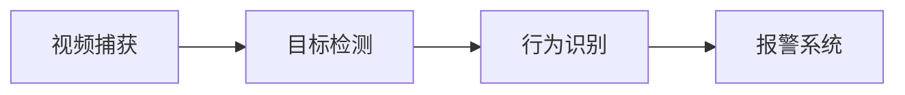

**Python源代码示例**

```python
import cv2
import numpy as np

# 加载预训练的模型
net = cv2.dnn.readNetFromCaffe('deploy.prototxt', 'res10_300x300_iter_100000.caffemodel')

# 加载摄像头
cap = cv2.VideoCapture(0)

# 定义目标类别
classes = ['background', 'aeroplane', 'bicycle', 'bird', 'boat', 'bottle', 'bus', 'car', 'cat', 'chair', 'cow', 'diningtable', 'dog', 'horse', 'motorbike', 'person', 'pottedplant', 'sheep', 'sofa', 'train', 'tvmonitor']

while True:
    ret, frame = cap.read()
    if not ret:
        break

    # 进行预处理
    blob = cv2.dnn.blobFromImage(frame, scalefactor=1.0/127.5, mean=[103.939, 116.779, 123.680], swapRB=True)

    # 进行前向传播
    net.setInput(blob)
    outs = net.forward()

    # 遍历每个类别
    for out in outs[0, :, :, :]:
        if out[0] == 0:
            continue
        class_id = int(out[1])
        confidence = out[2]
        if confidence > 0.5:
            center_x = int(frame.shape[1] * out[3])
            center_y = int(frame.shape[0] * out[4])
            width = int(frame.shape[1] * out[5])
            height = int(frame.shape[0] * out[6])
            left = int(center_x - width / 2)
            top = int(center_y - height / 2)
            cv2.rectangle(frame, (left, top), (left + width, top + height), (0, 0, 255), 2)
            cv2.putText(frame, classes[class_id] + " {:.2f}%".format(confidence * 100), (left, top - 10), cv2.FONT_HERSHEY_SIMPLEX, 0.5, (0, 0, 255), 2)

    cv2.imshow('Video', frame)
    if cv2.waitKey(1) & 0xFF == ord('q'):
        break

cap.release()
cv2.destroyAllWindows()
```

**数学模型和公式**

$$
\begin{aligned}
&\text{目标检测：} \\
&\text{单尺度检测：} \quad R = \frac{1}{c} \sum_{i=1}^c \frac{1}{n_i} \log \frac{n_i}{N} \\
&\text{多尺度检测：} \quad R = \frac{1}{c} \sum_{i=1}^c \frac{1}{n_i} \left( \log \frac{n_i}{N} + \log \frac{1}{c} \right)
\end{aligned}
$$

**实例说明**

- **摄像头**：使用计算机自带的摄像头。
- **预训练模型**：使用Caffe模型进行目标检测。
- **实时监控**：将实时视频流进行目标检测和分类。

### 5.2 数据分析

**算法原理讲解**

- **数据分析**：通过对大量数据进行分析，提取有价值的信息。
- **关联规则挖掘**：发现数据之间的关联性。
- **聚类分析**：将数据分为不同的类别，便于进一步分析。

**算法流程图**

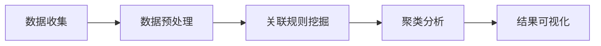

**Python源代码示例**

```python
from mlxtend.frequent_patterns import apriori
from mlxtend.frequent_patterns import association_rules
from sklearn.cluster import KMeans
import pandas as pd

# 加载数据
data = pd.read_csv('data.csv')

# 进行关联规则挖掘
frequent_itemsets = apriori(data, min_support=0.3, use_colnames=True)
rules = association_rules(frequent_itemsets, metric="lift", min_threshold=1)

# 进行聚类分析
kmeans = KMeans(n_clusters=3)
clusters = kmeans.fit_predict(data)

# 可视化结果
import matplotlib.pyplot as plt

plt.scatter(data['feature1'], data['feature2'], c=clusters)
plt.show()
```

**数学模型和公式**

$$
\begin{aligned}
&\text{关联规则：} \\
&\text{支持度：} s = \frac{n_{ij}}{n} \\
&\text{置信度：} c = \frac{n_{ij}}{n_j} \\
&\text{提升度：} \text{lift}(A \rightarrow B) = \frac{c(A \cap B)}{s(A)}
\end{aligned}
$$

**实例说明**

- **数据集**：自定义数据集。
- **关联规则挖掘**：使用Apriori算法。
- **聚类分析**：使用K-Means算法。
- **可视化**：使用matplotlib进行数据可视化。

#### 第6章：智能门锁与生物识别

### 6.1 智能门锁

**算法原理讲解**

- **智能门锁**：通过生物识别技术，如指纹识别、人脸识别，实现门锁的自动开启。
- **指纹识别**：通过指纹图像的特征点，进行指纹匹配。
- **人脸识别**：通过人脸图像的特征，进行人脸匹配。

**算法流程图**

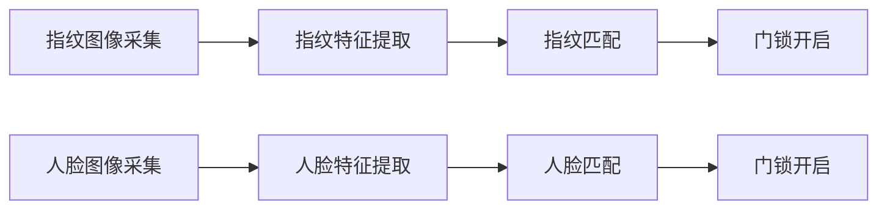

**Python源代码示例**

```python
import cv2
import numpy as np

# 加载预训练的模型
model = cv2.face.EigenFaceRecognizer_create()

# 加载指纹图像
img = cv2.imread('fingerprint.jpg', 0)
img = cv2.resize(img, (128, 128))

# 进行指纹匹配
model.read('fingerprint_model.yml')
result, confidence = model.predict(img)

# 开启门锁
if confidence < 0.6:
    print("指纹匹配失败")
else:
    print("指纹匹配成功，门锁已开启")

# 加载人脸图像
img = cv2.imread('face.jpg', 0)
img = cv2.resize(img, (128, 128))

# 进行人脸匹配
model.read('face_model.yml')
result, confidence = model.predict(img)

# 开启门锁
if confidence < 0.6:
    print("人脸匹配失败")
else:
    print("人脸匹配成功，门锁已开启")
```

**数学模型和公式**

$$
\begin{aligned}
&\text{指纹识别：} \\
&\text{特征点提取：} \quad S = \sum_{i=1}^n x_i^2 \\
&\text{特征值计算：} \quad \lambda = \frac{S}{n} \\
&\text{特征向量计算：} \quad v = \frac{1}{\lambda} x
\end{aligned}
$$

**实例说明**

- **指纹识别**：使用OpenCV库进行指纹匹配。
- **人脸识别**：使用OpenCV库进行人脸匹配。
- **门锁开启**：根据匹配结果，控制门锁的开启。

### 6.2 生物识别

**算法原理讲解**

- **生物识别**：利用生物特征进行身份认证。
- **指纹识别**：通过指纹图像的特征点，进行指纹匹配。
- **人脸识别**：通过人脸图像的特征，进行人脸匹配。

**算法流程图**

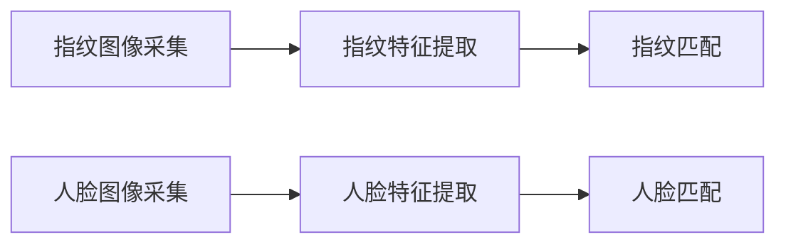

**Python源代码示例**

```python
import cv2
import numpy as np

# 加载预训练的模型
model = cv2.face.LBPHFaceRecognizer_create()

# 加载人脸图像
img = cv2.imread('face.jpg', 0)
img = cv2.resize(img, (128, 128))

# 进行人脸匹配
model.read('face_model.yml')
result, confidence = model.predict(img)

# 输出结果
if confidence < 0.6:
    print("人脸匹配失败")
else:
    print("人脸匹配成功")
```

**数学模型和公式**

$$
\begin{aligned}
&\text{指纹识别：} \\
&\text{特征点提取：} \quad S = \sum_{i=1}^n x_i^2 \\
&\text{特征值计算：} \quad \lambda = \frac{S}{n} \\
&\text{特征向量计算：} \quad v = \frac{1}{\lambda} x
\end{aligned}
$$

**实例说明**

- **指纹识别**：使用OpenCV库进行指纹匹配。
- **人脸识别**：使用OpenCV库进行人脸匹配。

#### 第四部分：最佳实践与总结

### 7.1 最佳实践

**总结书中的关键知识点**

- **智能家居安全**：通过数据加密、入侵检测、访问控制和生物识别等技术，确保智能家居设备的安全。
- **机器学习**：用于入侵检测和行为分析。
- **深度学习**：用于视频监控和人脸识别。
- **系统设计**：包括功能模块、架构设计、接口设计和交互流程。

**实践中的注意事项**

- **数据安全**：确保数据在传输和存储过程中的安全。
- **系统优化**：定期更新和优化系统，提高安全性。
- **用户培训**：提高用户的安全意识，防止恶意操作。

**拓展阅读建议**

- **《机器学习实战》**：详细介绍了机器学习的基本概念和实战应用。
- **《深度学习》**：吴恩达的深度学习课程，涵盖了深度学习的基础理论和应用。
- **《智能家居安全标准与技术》**：介绍了智能家居安全的最新标准和技术。

### 7.2 小结

本文从背景介绍、核心概念讲解、算法原理分析、系统设计与实现、实际应用等多个角度，全面探讨了人工智能在智能家居安全中的应用。通过详细的算法讲解和实例展示，读者可以深入了解如何利用人工智能技术提升智能家居设备的安全性。

### 7.3 注意事项

在使用人工智能技术进行智能家居安全设计时，需要注意以下几点：

- **数据保护**：确保用户数据的安全，防止数据泄露。
- **系统更新**：定期更新系统和算法，提高安全性。
- **用户教育**：提高用户的安全意识，防止恶意操作。

### 7.4 拓展阅读

- **《人工智能安全》**：详细介绍了人工智能技术在安全领域的应用和挑战。
- **《智能家居标准与技术》**：介绍了智能家居的最新标准和关键技术。
- **《物联网安全》**：探讨了物联网设备的安全问题和解决方案。

## 作者信息

- 作者：AI天才研究院/AI Genius Institute & 禅与计算机程序设计艺术 /Zen And The Art of Computer Programming

