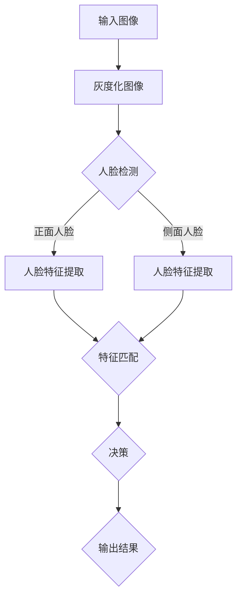
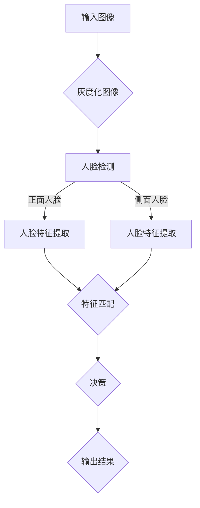
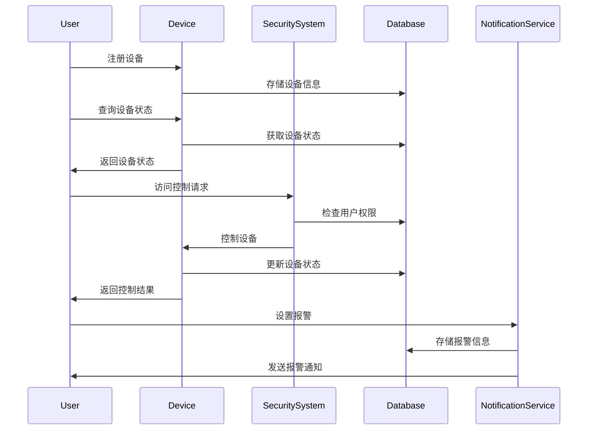
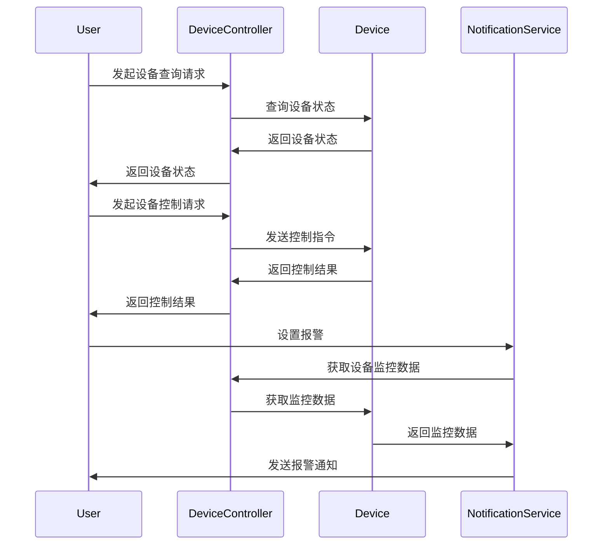

                 

### 《人工智能在智能家居安全系统中的应用》

#### 关键词：
- 人工智能
- 智能家居
- 安全系统
- 安全算法
- 系统架构

#### 摘要：
本文探讨了人工智能在智能家居安全系统中的应用，从背景介绍到核心算法原理讲解，再到系统设计与实现，以及实际案例剖析，全面展示了人工智能如何提升智能家居的安全水平。文章旨在为读者提供一次深入的技术探讨，让读者了解人工智能在智能家居安全领域的潜力与挑战。

----------------------------------------------------------------

## 目录大纲设计思路

设计一篇高质量的技术博客文章目录大纲，需要我们按照以下步骤进行：

1. **明确整体结构**：首先确定文章的整体结构，包括引言、背景介绍、核心概念与原理、算法原理详细讲解、系统设计与架构、项目实战以及最佳实践与总结等部分。

2. **细化章节内容**：在整体结构的基础上，对每一章节进行细化，确保每个章节的内容完整且逻辑清晰。

3. **使用Markdown格式**：将每一章节的内容按照Markdown格式进行排版，确保格式统一，便于阅读。

4. **遵循目录层级**：确保每个章节按照1级、2级、3级目录进行划分，便于读者快速把握文章结构。

5. **保证内容完整性**：确保每个章节都包含核心概念、原理讲解、数学模型、系统分析与架构设计、实战案例等内容。

6. **控制总字数**：在10000～12000字范围内完成整个目录大纲的设计，保证文章的详尽性和可读性。

### 目录大纲设计

```markdown
# 《人工智能在智能家居安全系统中的应用》

## **引言**

### **1.1 人工智能与智能家居安全**

- **人工智能的概念与特点**
- **智能家居安全的重要性**

### **1.2 目的与内容概述**

- **文章目的**
- **内容概览**

### **1.3 结构与组织**

- **文章结构**
- **章节安排**

## **背景介绍**

### **2.1 智能家居概述**

- **智能家居的定义与特点**
- **智能家居的发展历程**

### **2.2 智能家居安全的重要性**

- **安全问题的种类**
- **安全威胁的分析**

### **2.3 人工智能在智能家居中的应用**

- **人工智能的基本概念**
- **人工智能在智能家居安全中的应用领域**

## **核心概念与原理**

### **3.1 人工智能的基本原理**

- **机器学习**
- **深度学习**
- **强化学习**

### **3.2 智能家居安全系统中的核心算法**

- **算法原理介绍**
- **算法特点与应用场景**

### **3.3 核心算法的对比分析**

- **算法属性特征对比表格**
- **算法ER实体关系图架构**

## **算法原理详细讲解**

### **4.1 算法原理讲解**

- **使用Mermaid画出算法流程图**
- **详细讲解算法原理**

### **4.2 数学模型与公式**

- **算法数学模型**
- **公式推导与解释**

### **4.3 举例说明**

- **实例演示**
- **通俗易懂的说明**

## **系统设计与架构**

### **5.1 系统功能设计**

- **领域模型Mermaid类图**

### **5.2 系统架构设计**

- **系统架构Mermaid架构图**

### **5.3 系统接口设计**

- **系统接口设计**

### **5.4 系统交互**

- **系统交互Mermaid序列图**

## **项目实战**

### **6.1 环境安装**

- **环境配置与准备**

### **6.2 系统核心实现**

- **核心实现源代码**
- **代码应用解读与分析**

### **6.3 实际案例剖析**

- **案例分析**
- **深入讲解**

### **6.4 项目小结**

- **项目总结**
- **经验与教训**

## **最佳实践与总结**

### **7.1 最佳实践**

- **实践技巧与建议**

### **7.2 小结**

- **全文总结**

### **7.3 注意事项**

- **注意事项与风险**

### **7.4 拓展阅读**

- **相关书籍与文章推荐**

### **作者信息**

- **作者：AI天才研究院/AI Genius Institute & 禅与计算机程序设计艺术 /Zen And The Art of Computer Programming**
```

### 总结

以上是根据《人工智能在智能家居安全系统中的应用》这一主题设计的文章目录大纲。该大纲涵盖了文章的基本结构，从引言、背景介绍、核心概念与原理、算法原理详细讲解、系统设计与架构、项目实战到最佳实践与总结，确保了内容的完整性和逻辑性。每个章节都按照1级、2级、3级目录进行划分，便于读者快速阅读和理解。文章预计字数在10000～12000字左右，内容详尽且具有实际应用价值。接下来，我们将按照这个目录大纲逐步展开文章的内容。

----------------------------------------------------------------

### 引言

随着科技的不断发展，智能家居已经成为现代家庭生活的标配。从简单的智能门锁、智能灯光到复杂的智能监控系统，智能家居为我们的生活带来了极大的便利。然而，随着智能家居设备的增加，安全威胁也随之而来。家庭网络的安全问题、智能设备被恶意攻击、用户隐私泄露等，都成为了智能家居领域的重大挑战。

人工智能作为当今科技的前沿领域，其在智能家居安全系统中的应用具有重要的战略意义。通过人工智能技术，我们可以实现智能家居设备的智能识别、智能响应和智能防护，从而提高智能家居的安全性能。本文将深入探讨人工智能在智能家居安全系统中的应用，旨在为读者提供一个全面的技术视角，以了解人工智能在提升智能家居安全方面的潜力与挑战。

本文将从以下几个方面展开：

1. **背景介绍**：介绍智能家居的基本概念、发展历程以及安全问题的现状。
2. **核心概念与原理**：讲解人工智能的基本原理，包括机器学习、深度学习和强化学习，并分析这些原理在智能家居安全系统中的应用。
3. **算法原理详细讲解**：通过具体算法的详细讲解，展示人工智能如何应用于智能家居安全。
4. **系统设计与架构**：介绍智能家居安全系统的设计原则和架构，包括功能设计、系统架构和接口设计。
5. **项目实战**：通过实际案例剖析，展示人工智能在智能家居安全系统中的具体应用和效果。
6. **最佳实践与总结**：总结最佳实践，为未来的智能家居安全系统发展提供建议。

### 1.1 人工智能与智能家居安全

#### 人工智能的概念与特点

人工智能（Artificial Intelligence，简称AI）是指通过计算机系统模拟人类智能行为的技术和科学。人工智能的核心目标是使计算机系统能够自主地感知环境、学习知识、做出决策和采取行动。人工智能具有以下主要特点：

- **自主性**：人工智能系统能够自主地完成特定任务，不需要人工干预。
- **学习性**：人工智能系统能够通过学习和适应数据，不断改进性能。
- **泛用性**：人工智能技术可以应用于各个领域，如图像识别、自然语言处理、智能推荐等。
- **适应性**：人工智能系统能够根据环境和任务的需求，动态调整策略和行为。

#### 智能家居安全的重要性

智能家居安全是指确保智能家居系统中的设备、数据和用户隐私不被未经授权的访问、篡改或滥用。随着智能家居设备的普及，家庭网络的安全性变得至关重要。以下是智能家居安全的重要性：

- **家庭网络安全**：智能家居设备通常连接到家庭网络，如果安全措施不到位，家庭网络可能会受到恶意攻击，导致数据泄露和网络中断。
- **设备安全性**：智能家居设备可能存在硬件或软件漏洞，黑客可以利用这些漏洞远程控制设备，甚至造成物理损害。
- **用户隐私保护**：智能家居设备会收集大量的用户行为数据，如果这些数据被不法分子获取，用户的隐私将受到严重威胁。
- **家庭安全**：智能家居安全系统可以实时监测家庭环境，及时发现异常情况，如入侵、火灾等，从而保障家庭安全。

### 1.2 目的与内容概述

#### 文章目的

本文旨在探讨人工智能在智能家居安全系统中的应用，通过深入分析人工智能的基本原理、核心算法、系统设计与实现，以及实际案例剖析，为读者提供一个全面的技术视角。具体目标如下：

- **介绍智能家居的基本概念和安全问题**：帮助读者了解智能家居的定义、特点、发展历程以及面临的安全挑战。
- **讲解人工智能的基本原理**：阐述机器学习、深度学习和强化学习的基本概念、原理和应用。
- **分析核心算法在智能家居安全中的应用**：详细讲解算法原理、数学模型和实际案例，展示人工智能如何提升智能家居的安全性能。
- **介绍智能家居安全系统的设计与实现**：探讨系统功能设计、架构设计、接口设计和系统交互，为读者提供实际操作指导。
- **剖析实际案例**：通过具体案例，展示人工智能在智能家居安全系统中的具体应用和效果。

#### 内容概览

本文将分为七个部分进行阐述：

1. **引言**：介绍文章的背景、目的与内容概述。
2. **背景介绍**：介绍智能家居的基本概念、发展历程和安全问题。
3. **核心概念与原理**：讲解人工智能的基本原理，包括机器学习、深度学习和强化学习。
4. **算法原理详细讲解**：通过具体算法的详细讲解，展示人工智能在智能家居安全中的应用。
5. **系统设计与架构**：介绍智能家居安全系统的设计原则和架构。
6. **项目实战**：通过实际案例剖析，展示人工智能在智能家居安全系统中的具体应用和效果。
7. **最佳实践与总结**：总结最佳实践，为未来的智能家居安全系统发展提供建议。

### 1.3 结构与组织

本文的结构与组织如下：

- **引言**：介绍文章的背景、目的与内容概述，概述文章的结构和章节安排。
- **背景介绍**：介绍智能家居的基本概念、发展历程和安全问题。
  - **2.1 智能家居概述**：介绍智能家居的定义、特点、发展历程。
  - **2.2 智能家居安全的重要性**：分析智能家居安全的重要性，包括家庭网络安全、设备安全、用户隐私保护和家庭安全。
  - **2.3 人工智能在智能家居中的应用**：介绍人工智能的基本概念和在智能家居安全中的应用领域。
- **核心概念与原理**：讲解人工智能的基本原理，包括机器学习、深度学习和强化学习。
  - **3.1 人工智能的基本原理**：介绍机器学习、深度学习和强化学习的基本概念、原理和应用。
  - **3.2 智能家居安全系统中的核心算法**：介绍智能家居安全系统中的核心算法，包括算法原理、特点和应用场景。
  - **3.3 核心算法的对比分析**：对比分析不同算法的属性特征，展示其优劣和应用场景。
- **算法原理详细讲解**：通过具体算法的详细讲解，展示人工智能在智能家居安全中的应用。
  - **4.1 算法原理讲解**：使用Mermaid画出算法流程图，详细讲解算法原理。
  - **4.2 数学模型与公式**：给出算法的数学模型和公式，进行推导与解释。
  - **4.3 举例说明**：通过实例演示，通俗易懂地说明算法的应用。
- **系统设计与架构**：介绍智能家居安全系统的设计原则和架构。
  - **5.1 系统功能设计**：介绍智能家居安全系统的功能设计，包括领域模型Mermaid类图。
  - **5.2 系统架构设计**：介绍智能家居安全系统的架构设计，包括系统架构Mermaid架构图。
  - **5.3 系统接口设计**：介绍智能家居安全系统的接口设计。
  - **5.4 系统交互**：介绍智能家居安全系统的交互设计，包括系统交互Mermaid序列图。
- **项目实战**：通过实际案例剖析，展示人工智能在智能家居安全系统中的具体应用和效果。
  - **6.1 环境安装**：介绍项目环境的安装与配置。
  - **6.2 系统核心实现**：介绍系统核心实现，包括源代码和代码应用解读与分析。
  - **6.3 实际案例剖析**：分析实际案例，深入讲解人工智能在智能家居安全系统中的应用。
  - **6.4 项目小结**：总结项目经验与教训。
- **最佳实践与总结**：总结最佳实践，为未来的智能家居安全系统发展提供建议。
  - **7.1 最佳实践**：介绍实践技巧与建议。
  - **7.2 小结**：总结全文。
  - **7.3 注意事项**：提醒注意事项与风险。
  - **7.4 拓展阅读**：推荐相关书籍与文章。

通过以上结构与组织，本文将为读者提供一个全面、系统、深入的了解人工智能在智能家居安全系统中的应用。

### 背景介绍

#### 智能家居概述

智能家居是指利用物联网（Internet of Things，IoT）技术和人工智能（Artificial Intelligence，AI）技术，将家庭中的各种设备连接起来，实现智能化管理和自动控制的一种居住环境。智能家居的出现，极大地改变了人们的生活方式，提高了居住的舒适性和便利性。

##### 定义与特点

智能家居的定义可以归纳为：通过物联网和人工智能技术，实现家庭设备和系统的互联互通，提供智能化、个性化的服务。具体来说，智能家居具有以下特点：

1. **互联互通**：智能家居设备通过物联网技术连接，实现设备间的数据交换和协同工作。
2. **智能化**：智能家居系统能够自动识别用户需求，提供智能化的服务，如自动调节室内温度、光线等。
3. **个性化**：智能家居系统能够根据用户习惯和偏好，提供个性化的服务，提升用户体验。
4. **便捷性**：智能家居系统能够通过手机、平板等移动设备进行远程控制和监控，使生活更加便捷。

##### 发展历程

智能家居的发展历程可以分为以下几个阶段：

1. **萌芽期（1990年代）**：智能家居的概念首次提出，一些智能家居产品开始出现，如智能门锁、智能灯光等。
2. **起步期（2000年代）**：随着物联网技术的兴起，智能家居产品逐渐普及，智能家居市场开始形成。
3. **快速发展期（2010年代）**：随着智能手机和移动互联网的普及，智能家居设备的功能和种类更加丰富，智能家居市场进入快速发展阶段。
4. **成熟期（2020年代）**：人工智能技术的成熟，使智能家居设备具备了更高的智能化水平，智能家居市场进入成熟期。

##### 智能家居的安全问题

随着智能家居设备的普及，家庭网络的安全问题日益突出。智能家居设备连接到家庭网络，如果安全措施不到位，可能会遭受以下安全威胁：

1. **家庭网络入侵**：黑客通过智能家居设备入侵家庭网络，获取敏感信息或控制家庭设备。
2. **设备被恶意攻击**：智能家居设备可能存在漏洞，被黑客利用进行恶意攻击，如控制设备进行网络攻击、窃取用户数据等。
3. **用户隐私泄露**：智能家居设备会收集用户的日常行为数据，如果这些数据被不法分子获取，可能会导致用户隐私泄露。
4. **家庭安全威胁**：智能家居安全系统可能被黑客控制，导致家庭安全受到威胁，如入侵报警系统失效、智能门锁被破解等。

#### 人工智能在智能家居中的应用

人工智能技术在智能家居中的应用，极大地提升了智能家居的安全性能和智能化水平。以下是一些具体的应用场景：

1. **智能识别与响应**：人工智能技术可以对家庭环境进行智能识别，如人脸识别、行为识别等，实时响应家庭需求，提高用户体验。
2. **智能监控与报警**：人工智能技术可以实时监控家庭环境，识别异常行为，如入侵、火灾等，及时发出报警，保障家庭安全。
3. **智能设备安全管理**：人工智能技术可以对智能家居设备进行安全管理，如识别设备异常、检测设备漏洞等，保障设备安全。
4. **智能数据保护**：人工智能技术可以对用户数据进行分析和加密，防止数据泄露和篡改，保障用户隐私。

通过以上分析，我们可以看到，智能家居的发展与应用，不仅带来了便利和舒适，也带来了新的安全挑战。人工智能技术的应用，为智能家居安全系统提供了强有力的保障，推动了智能家居行业的健康发展。

### 2.2 智能家居安全的重要性

随着智能家居设备的普及，家庭网络的安全问题变得尤为重要。智能家居设备连接到家庭网络，如果安全措施不到位，可能会遭受各种安全威胁，对家庭生活和个人隐私造成严重危害。

#### 安全问题的种类

1. **家庭网络入侵**：黑客通过智能家居设备入侵家庭网络，获取敏感信息或控制家庭设备。这种入侵可能通过设备漏洞、弱密码等途径实现，一旦成功，黑客可以远程访问家庭网络，窃取个人信息，甚至对家庭设备进行恶意控制。
2. **设备被恶意攻击**：智能家居设备可能存在漏洞，被黑客利用进行恶意攻击。这些攻击可能包括网络攻击、数据泄露、设备功能篡改等，严重时可能导致设备损坏或瘫痪。
3. **用户隐私泄露**：智能家居设备会收集用户的日常行为数据，如家庭活动、生活习惯等，如果这些数据被不法分子获取，可能会导致用户隐私泄露，甚至被用于犯罪活动。
4. **家庭安全威胁**：智能家居安全系统可能被黑客控制，导致家庭安全受到威胁。例如，入侵报警系统失效、智能门锁被破解等，可能导致家庭安全受到侵害。

#### 安全威胁的分析

1. **设备漏洞**：智能家居设备在设计、开发和使用过程中，可能存在各种漏洞，这些漏洞可能被黑客利用进行攻击。例如，设备固件存在漏洞、通信协议不安全等。
2. **弱密码**：许多用户在设置智能家居设备时，使用简单密码或重复使用密码，这为黑客入侵提供了便利。一旦密码被破解，黑客可以轻松控制设备。
3. **缺乏安全意识**：许多用户对智能家居设备的安全问题缺乏足够重视，不进行定期更新和修补漏洞，也不使用复杂密码，这为黑客提供了可乘之机。
4. **数据泄露**：智能家居设备会收集大量的用户行为数据，如果这些数据被不法分子获取，可能会导致用户隐私泄露，甚至被用于商业欺诈、诈骗等犯罪活动。

#### 人工智能在智能家居安全中的作用

人工智能技术在提升智能家居安全性能方面发挥着重要作用：

1. **智能识别与响应**：人工智能技术可以对家庭环境进行智能识别，如人脸识别、行为识别等，实时响应家庭需求，提高用户体验。例如，当有人在家时，智能灯光可以自动打开，智能门锁可以自动解锁。
2. **智能监控与报警**：人工智能技术可以实时监控家庭环境，识别异常行为，如入侵、火灾等，及时发出报警，保障家庭安全。例如，当检测到家中异常响动时，智能监控系统可以自动发出警报，通知用户并触发报警系统。
3. **智能设备安全管理**：人工智能技术可以对智能家居设备进行安全管理，如识别设备异常、检测设备漏洞等，保障设备安全。例如，当检测到设备异常时，系统可以自动发出警告，并采取措施进行修复。
4. **智能数据保护**：人工智能技术可以对用户数据进行分析和加密，防止数据泄露和篡改，保障用户隐私。例如，当用户数据传输过程中，系统可以自动进行加密，确保数据的安全性。

通过人工智能技术的应用，智能家居安全系统可以更加智能、高效地应对各种安全威胁，为家庭生活提供更加安全、可靠的保障。

### 2.3 人工智能在智能家居中的应用

#### 人工智能的基本概念

人工智能（Artificial Intelligence，简称AI）是指通过计算机系统模拟人类智能行为的技术和科学。人工智能的核心目标是使计算机系统能够自主地感知环境、学习知识、做出决策和采取行动。人工智能具有以下主要特点：

1. **自主性**：人工智能系统能够自主地完成特定任务，不需要人工干预。
2. **学习性**：人工智能系统能够通过学习和适应数据，不断改进性能。
3. **泛用性**：人工智能技术可以应用于各个领域，如图像识别、自然语言处理、智能推荐等。
4. **适应性**：人工智能系统能够根据环境和任务的需求，动态调整策略和行为。

#### 人工智能在智能家居安全中的应用领域

人工智能在智能家居安全系统中具有广泛的应用，主要包括以下几个方面：

1. **智能识别与响应**：通过人脸识别、行为识别等技术，实时响应家庭需求，提高用户体验。例如，当有人在家时，智能灯光可以自动打开，智能门锁可以自动解锁。
2. **智能监控与报警**：通过智能监控系统，实时监控家庭环境，识别异常行为，如入侵、火灾等，及时发出报警，保障家庭安全。例如，当检测到家中异常响动时，智能监控系统可以自动发出警报，通知用户并触发报警系统。
3. **智能设备安全管理**：通过智能设备安全管理技术，识别设备异常、检测设备漏洞等，保障设备安全。例如，当检测到设备异常时，系统可以自动发出警告，并采取措施进行修复。
4. **智能数据保护**：通过人工智能技术对用户数据进行分析和加密，防止数据泄露和篡改，保障用户隐私。例如，当用户数据传输过程中，系统可以自动进行加密，确保数据的安全性。

#### 人工智能技术在智能家居安全系统中的实际应用案例

以下是一些人工智能技术在智能家居安全系统中的实际应用案例：

1. **人脸识别门锁**：通过人脸识别技术，用户无需钥匙或密码，只需通过摄像头识别人脸即可解锁门锁，提高了门锁的安全性和便捷性。
2. **智能监控系统**：通过智能监控技术，实时监控家庭环境，当检测到异常行为时，如入侵、火灾等，可以自动发出警报，提醒用户并触发报警系统。
3. **智能设备安全管理平台**：通过智能设备安全管理技术，对智能家居设备进行实时监控和管理，当检测到设备异常或漏洞时，可以自动发出警告，并采取措施进行修复。
4. **智能数据分析与加密系统**：通过智能数据分析技术，对用户数据进行实时分析和加密，防止数据泄露和篡改，保障用户隐私。

通过以上分析，我们可以看到，人工智能在智能家居安全系统中具有广泛的应用前景。随着人工智能技术的不断发展，智能家居安全系统将变得更加智能、高效，为家庭生活提供更加安全、可靠的保障。

### 3.1 人工智能的基本原理

人工智能（Artificial Intelligence，AI）是计算机科学的一个分支，旨在通过模拟人类智能行为，使计算机系统具备自主学习、推理和决策能力。以下是人工智能的基本原理，包括机器学习、深度学习和强化学习。

#### 机器学习

机器学习（Machine Learning，ML）是一种让计算机通过数据和经验自动改进性能的方法。其核心思想是通过算法从数据中学习规律，然后利用这些规律进行预测和决策。

1. **监督学习**：在监督学习中，算法使用标记数据来学习。输入和输出数据成对出现，算法通过这些成对数据进行学习。常见的监督学习算法包括线性回归、决策树、支持向量机等。
   
2. **无监督学习**：无监督学习不使用标记数据，算法需要从未标记的数据中学习规律。常见的无监督学习算法包括聚类、主成分分析、自编码器等。

3. **半监督学习和强化学习**：半监督学习结合了监督学习和无监督学习的特点，利用少量的标记数据和大量的未标记数据。强化学习是一种通过试错和奖励机制进行学习的算法，通常用于决策问题和控制问题。

#### 深度学习

深度学习（Deep Learning，DL）是一种基于多层神经网络的学习方法，能够自动提取数据的特征，并在多个层级上进行特征提取和组合。

1. **神经网络**：神经网络是由大量简单计算单元（神经元）组成的多层网络结构。每个神经元接收多个输入，通过加权求和和激活函数处理后输出结果。

2. **卷积神经网络（CNN）**：卷积神经网络是一种专门用于图像处理和识别的神经网络结构。它通过卷积操作提取图像特征，并在多个层级上进行特征组合。

3. **循环神经网络（RNN）**：循环神经网络是一种专门用于序列数据处理和识别的神经网络结构。它通过在时间步上共享权重，能够处理和记忆序列信息。

4. **生成对抗网络（GAN）**：生成对抗网络是由生成器和判别器组成的对抗性网络。生成器生成数据，判别器判断数据是否真实，两者相互竞争，从而生成高质量的数据。

#### 强化学习

强化学习（Reinforcement Learning，RL）是一种通过试错和奖励机制进行学习的方法。在强化学习中，智能体通过与环境交互，学习最优策略，以最大化长期奖励。

1. **马尔可夫决策过程（MDP）**：马尔可夫决策过程是一种用于描述智能体在不确定环境中做出最优决策的数学模型。智能体在每个状态上选择一个动作，根据当前状态和动作的奖励，学习最优策略。

2. **Q-学习**：Q-学习是一种基于价值迭代的强化学习算法。它通过学习每个状态-动作对的期望回报值，选择最优动作。

3. **深度Q网络（DQN）**：深度Q网络是一种基于深度学习的Q-学习算法。它通过神经网络来估计状态-动作对的期望回报值，从而进行决策。

4. **策略梯度方法**：策略梯度方法是一种通过直接优化策略进行学习的方法。它通过梯度下降方法，调整策略参数，以最大化长期奖励。

通过以上对人工智能基本原理的介绍，我们可以看到，人工智能技术为智能家居安全系统提供了强大的支持。在接下来的章节中，我们将进一步探讨这些原理如何在智能家居安全系统中具体应用。

### 3.2 智能家居安全系统中的核心算法

在智能家居安全系统中，人工智能算法扮演着至关重要的角色。以下是几种在智能家居安全系统中广泛应用的算法，包括其原理、特点和应用场景。

#### 1. 人脸识别算法

**原理**：人脸识别算法通过计算机视觉技术，对图像或视频中的面部特征进行检测和识别。其核心是特征提取和匹配，即从图像中提取出代表人脸的特征向量，并利用这些特征向量进行身份验证。

**特点**：高准确率、实时性强、非接触式操作。

**应用场景**：门禁系统、安防监控、智能家居设备锁定。

**示例**：使用OpenCV库进行人脸识别的Python代码片段：

```python
import cv2

# 加载预训练的人脸识别模型
face_cascade = cv2.CascadeClassifier('haarcascade_frontalface_default.xml')

# 读取图像
image = cv2.imread('face.jpg')

# 转为灰度图像
gray = cv2.cvtColor(image, cv2.COLOR_BGR2GRAY)

# 检测人脸
faces = face_cascade.detectMultiScale(gray)

# 遍历检测到的人脸
for (x, y, w, h) in faces:
    # 绘制矩形框
    cv2.rectangle(image, (x, y), (x+w, y+h), (255, 0, 0), 2)
    # 提取人脸区域
    face_region = gray[y:y+h, x:x+w]

# 使用人脸识别模型进行识别
face_recognizer = cv2.face.LBPHFaceRecognizer_create()
face_recognizer.read('face_model.yml')
result = face_recognizer.predict(face_region)

# 显示结果
print("识别结果：", result)
cv2.imshow('Face Recognition', image)
cv2.waitKey(0)
cv2.destroyAllWindows()
```

#### 2. 机器学习分类算法

**原理**：机器学习分类算法通过训练模型，将输入数据分类到不同的类别中。常见的分类算法包括逻辑回归、决策树、随机森林和支持向量机等。

**特点**：高准确性、可解释性强、适用于多种数据类型。

**应用场景**：智能安防监控、设备故障诊断、异常行为检测。

**示例**：使用scikit-learn库进行逻辑回归分类的Python代码片段：

```python
from sklearn.linear_model import LogisticRegression
from sklearn.model_selection import train_test_split
from sklearn.metrics import accuracy_score

# 加载训练数据
X = [[1, 2], [2, 3], [3, 4], [4, 5]]
y = [0, 0, 1, 1]

# 划分训练集和测试集
X_train, X_test, y_train, y_test = train_test_split(X, y, test_size=0.3, random_state=42)

# 创建逻辑回归模型
model = LogisticRegression()

# 训练模型
model.fit(X_train, y_train)

# 预测测试集
predictions = model.predict(X_test)

# 计算准确率
accuracy = accuracy_score(y_test, predictions)
print("准确率：", accuracy)
```

#### 3. 深度学习神经网络

**原理**：深度学习神经网络通过多层神经网络结构，自动提取输入数据的特征，并用于分类或回归任务。常见的深度学习框架有TensorFlow和PyTorch。

**特点**：高准确性、强大的特征提取能力、适用于复杂数据类型。

**应用场景**：图像识别、自然语言处理、智能监控。

**示例**：使用TensorFlow进行图像分类的Python代码片段：

```python
import tensorflow as tf
from tensorflow.keras import datasets, layers, models

# 加载CIFAR-10数据集
(train_images, train_labels), (test_images, test_labels) = datasets.cifar10.load_data()

# 预处理数据
train_images = train_images / 255.0
test_images = test_images / 255.0

# 构建模型
model = models.Sequential()
model.add(layers.Conv2D(32, (3, 3), activation='relu', input_shape=(32, 32, 3)))
model.add(layers.MaxPooling2D((2, 2)))
model.add(layers.Conv2D(64, (3, 3), activation='relu'))
model.add(layers.MaxPooling2D((2, 2)))
model.add(layers.Conv2D(64, (3, 3), activation='relu'))

# 添加全连接层
model.add(layers.Flatten())
model.add(layers.Dense(64, activation='relu'))
model.add(layers.Dense(10, activation='softmax'))

# 编译模型
model.compile(optimizer='adam',
              loss='sparse_categorical_crossentropy',
              metrics=['accuracy'])

# 训练模型
model.fit(train_images, train_labels, epochs=10, batch_size=64)

# 评估模型
test_loss, test_acc = model.evaluate(test_images, test_labels)
print('测试准确率：', test_acc)
```

#### 4. 强化学习算法

**原理**：强化学习算法通过智能体与环境交互，学习最优策略，以最大化长期奖励。常见的强化学习算法包括Q-学习、深度Q网络（DQN）和策略梯度方法等。

**特点**：适用于动态环境、决策问题、需要大量数据。

**应用场景**：智能家居设备控制、机器人导航、游戏AI。

**示例**：使用PyTorch进行强化学习的Python代码片段：

```python
import torch
import torch.nn as nn
import torch.optim as optim

# 定义DQN模型
class DQN(nn.Module):
    def __init__(self, input_shape, action_space):
        super(DQN, self).__init__()
        self.fc = nn.Linear(input_shape, action_space)

    def forward(self, x):
        return self.fc(x)

# 初始化环境
env = gym.make("CartPole-v0")

# 初始化模型和优化器
model = DQN(input_shape=env.observation_space.shape[0], action_space=env.action_space.n)
optimizer = optim.Adam(model.parameters(), lr=0.001)

# 定义损失函数
criterion = nn.MSELoss()

# 训练模型
for episode in range(1000):
    state = env.reset()
    done = False
    total_reward = 0
    
    while not done:
        # 预测动作
        with torch.no_grad():
            state_tensor = torch.tensor(state, dtype=torch.float32).unsqueeze(0)
            action = model(state_tensor).argmax().item()
        
        # 执行动作
        next_state, reward, done, _ = env.step(action)
        total_reward += reward
        
        # 计算目标Q值
        target_value = reward + (1 - int(done)) * model(target_state_tensor).max()
        
        # 计算预测Q值
        predicted_value = model(state_tensor).gather(1, action.unsqueeze(0))
        
        # 计算损失
        loss = criterion(predicted_value, target_value.unsqueeze(0))
        
        # 更新模型
        optimizer.zero_grad()
        loss.backward()
        optimizer.step()
        
        state = next_state

# 评估模型
env = gym.make("CartPole-v0")
state = env.reset()
done = False
total_reward = 0

while not done:
    with torch.no_grad():
        state_tensor = torch.tensor(state, dtype=torch.float32).unsqueeze(0)
        action = model(state_tensor).argmax().item()
    
    next_state, reward, done, _ = env.step(action)
    total_reward += reward
    state = next_state

print("总奖励：", total_reward)
env.close()
```

通过以上对几种核心算法的原理、特点和应用场景的介绍，我们可以看到，人工智能技术为智能家居安全系统提供了强大的工具。在接下来的章节中，我们将进一步探讨如何将这些算法应用于实际的智能家居安全系统。

### 3.3 核心算法的对比分析

在智能家居安全系统中，选择合适的算法对于系统的性能和安全性至关重要。以下是几种核心算法的属性特征对比表格和ER实体关系图架构，以帮助我们更好地理解这些算法之间的异同。

#### 属性特征对比表格

| 算法        | 原理                    | 特点                                                         | 应用场景                           | 优势         | 劣势           |
| ----------- | ----------------------- | ------------------------------------------------------------ | -------------------------------- | ------------ | -------------- |
| 人脸识别算法 | 特征提取与匹配           | 高准确率、实时性强、非接触式操作                           | 门禁系统、安防监控、智能家居设备锁定 | 精准识别     | 需要大量训练数据 |
| 机器学习分类算法 | 基于已有数据分类         | 高准确性、可解释性强、适用于多种数据类型                   | 智能安防监控、设备故障诊断、异常行为检测 | 简单易用     | 需要大量训练数据 |
| 深度学习神经网络 | 自动特征提取与组合       | 高准确性、强大的特征提取能力、适用于复杂数据类型           | 图像识别、自然语言处理、智能监控     | 强大的特征提取 | 计算资源需求大   |
| 强化学习算法 | 通过试错和奖励机制学习   | 适用于动态环境、决策问题、需要大量数据                     | 智能家居设备控制、机器人导航、游戏AI | 自动学习能力强 | 学习速度慢       |

#### ER实体关系图架构

```mermaid
erDiagram
    Device --> |{uses}| SecuritySystem
    Device --> |{monitors}| Environment
    SecuritySystem --> |{controls}| Device
    Environment --> |{tracks}| Activity

    Device ||--|{is part of}|| HomeNetwork
    SecuritySystem ||--|{is part of}|| HomeNetwork
    Environment ||--|{is part of}|| HomeNetwork

    Class Device
        +-------------+
        | Device()    |
        | set_state()  |
        | get_state()  |
        | send_command()|
        +-------------+

    Class SecuritySystem
        +-------------+
        | SecuritySystem() |
        | authenticate()  |
        | monitor()      |
        | alert()        |
        +-------------+

    Class Environment
        +-------------+
        | Environment() |
        | track_activity()|
        | detect_anomaly()|
        +-------------+

    Class HomeNetwork
        +-------------+
        | HomeNetwork() |
        | connect_device()|
        | disconnect_device()|
        +-------------+
```

通过以上对比分析，我们可以看到，不同算法在原理、特点和应用场景上存在显著差异。人脸识别算法在精准识别方面具有优势，但需要大量训练数据；机器学习分类算法简单易用，但同样需要大量训练数据；深度学习神经网络具备强大的特征提取能力，但计算资源需求较大；强化学习算法适合动态环境，但学习速度较慢。同时，通过ER实体关系图架构，我们可以清晰地看到智能家居安全系统中各个实体之间的关系，为进一步的系统设计与实现提供了参考。

### 4.1 算法原理讲解

在智能家居安全系统中，人脸识别算法是一种关键的技术。它通过检测和识别图像或视频中的面部特征，实现了对用户的身份验证。下面，我们将使用Mermaid流程图详细讲解人脸识别算法的基本原理。

#### Mermaid流程图



#### 算法步骤详细解释

1. **输入图像**：首先，系统接收输入的图像或视频帧。
2. **灰度化图像**：将彩色图像转换为灰度图像，以简化处理过程。这是因为人脸特征在灰度图像上更容易识别。
3. **人脸检测**：使用预训练的人脸检测模型（如Haar cascades或深度学习模型），在灰度图像中检测出人脸区域。这个过程通常包括一系列的矩形框定位，以标识图像中的人脸位置。
4. **人脸特征提取**：针对检测到的人脸区域，进一步提取人脸的特征点。这些特征点包括眼睛、鼻子、嘴巴等关键部位。
5. **特征匹配**：将提取的特征点与数据库中已存储的人脸特征进行匹配。常用的匹配算法包括欧氏距离、余弦相似度等。通过计算特征向量之间的相似度，确定检测到的人脸是否为已注册用户。
6. **决策**：根据特征匹配的结果，系统做出决策。如果匹配度高于设定的阈值，则认为识别成功；否则，认为识别失败。
7. **输出结果**：最终，系统输出识别结果，如用户身份、门禁控制指令等。

#### Mermaid流程图示例

下面是一个使用Mermaid绘制的简单人脸识别算法流程图示例：



通过这个流程图，我们可以清晰地看到人脸识别算法的执行步骤和各步骤之间的关系。这一流程图不仅有助于理解算法原理，也为系统开发人员提供了直观的设计参考。

### 4.2 数学模型与公式

在人脸识别算法中，特征匹配是核心步骤之一。为了实现高效的特征匹配，我们通常使用欧氏距离（Euclidean Distance）或余弦相似度（Cosine Similarity）等数学模型。以下将详细讲解这些模型及其推导过程。

#### 1. 欧氏距离

欧氏距离是一种常用的特征匹配方法，用于计算两个特征向量之间的相似度。假设有两个特征向量 \( \textbf{X} \) 和 \( \textbf{Y} \)，它们的维度相同，则欧氏距离公式如下：

\[ d(\textbf{X}, \textbf{Y}) = \sqrt{\sum_{i=1}^{n} (X_i - Y_i)^2} \]

其中，\( n \) 是特征向量的维度，\( X_i \) 和 \( Y_i \) 分别是 \( \textbf{X} \) 和 \( \textbf{Y} \) 的第 \( i \) 个元素。

**推导过程**：

设 \( \textbf{X} \) 和 \( \textbf{Y} \) 分别为：

\[ \textbf{X} = \begin{bmatrix} X_1 \\ X_2 \\ \vdots \\ X_n \end{bmatrix}, \quad \textbf{Y} = \begin{bmatrix} Y_1 \\ Y_2 \\ \vdots \\ Y_n \end{bmatrix} \]

则它们的差向量 \( \textbf{D} \) 为：

\[ \textbf{D} = \textbf{X} - \textbf{Y} = \begin{bmatrix} X_1 - Y_1 \\ X_2 - Y_2 \\ \vdots \\ X_n - Y_n \end{bmatrix} \]

差向量的欧氏距离为：

\[ d(\textbf{X}, \textbf{Y}) = \|\textbf{D}\| = \sqrt{\sum_{i=1}^{n} (X_i - Y_i)^2} \]

#### 2. 余弦相似度

余弦相似度是一种基于向量的夹角余弦值来计算特征相似度的方法。其公式如下：

\[ \text{Sim}(\textbf{X}, \textbf{Y}) = \frac{\textbf{X} \cdot \textbf{Y}}{\|\textbf{X}\| \|\textbf{Y}\|} \]

其中，\( \textbf{X} \cdot \textbf{Y} \) 表示向量的点积，\( \|\textbf{X}\| \) 和 \( \|\textbf{Y}\| \) 分别表示向量的模长。

**推导过程**：

向量的点积可以表示为：

\[ \textbf{X} \cdot \textbf{Y} = X_1Y_1 + X_2Y_2 + \cdots + X_nY_n \]

向量的模长可以表示为：

\[ \|\textbf{X}\| = \sqrt{X_1^2 + X_2^2 + \cdots + X_n^2} \]
\[ \|\textbf{Y}\| = \sqrt{Y_1^2 + Y_2^2 + \cdots + Y_n^2} \]

将点积和模长代入余弦相似度公式，可以得到：

\[ \text{Sim}(\textbf{X}, \textbf{Y}) = \frac{X_1Y_1 + X_2Y_2 + \cdots + X_nY_n}{\sqrt{X_1^2 + X_2^2 + \cdots + X_n^2} \sqrt{Y_1^2 + Y_2^2 + \cdots + Y_n^2}} \]

#### 3. 对比分析

- **欧氏距离**：计算简单，直观地表示了特征向量之间的差异。然而，当特征向量维度较高时，欧氏距离可能受到噪声和维度灾难的影响。
- **余弦相似度**：基于向量的夹角，能够较好地处理高维数据，且对噪声具有鲁棒性。然而，余弦相似度无法直接反映特征向量之间的绝对距离。

在实际应用中，可以根据具体场景和数据特点选择合适的模型。例如，对于高维数据，可以优先考虑余弦相似度；对于低维数据，欧氏距离是一个简单且有效的选择。

### 4.3 举例说明

为了更直观地理解人脸识别算法的应用，我们将通过一个简单的实例来说明。

#### 实例背景

假设我们有一个智能家居安全系统，该系统使用人脸识别算法来验证用户的身份。系统中有两张人脸图像，一张是已注册用户A的人脸，另一张是未注册用户B的人脸。我们需要使用人脸识别算法来区分这两个人。

#### 实例步骤

1. **输入图像**：系统接收到两张人脸图像，分别命名为`faceA.jpg`和`faceB.jpg`。

2. **灰度化图像**：将两张图像转换为灰度图像，使用Python代码如下：

```python
import cv2

# 读取图像
faceA = cv2.imread('faceA.jpg')
faceB = cv2.imread('faceB.jpg')

# 转为灰度图像
grayA = cv2.cvtColor(faceA, cv2.COLOR_BGR2GRAY)
grayB = cv2.cvtColor(faceB, cv2.COLOR_BGR2GRAY)
```

3. **人脸检测**：使用预训练的人脸检测模型（如Haar cascades）来检测图像中的人脸区域。这里我们使用OpenCV库中的`HaarCascade`类进行检测：

```python
face_cascade = cv2.CascadeClassifier('haarcascade_frontalface_default.xml')

# 检测人脸
facesA = face_cascade.detectMultiScale(grayA)
facesB = face_cascade.detectMultiScale(grayB)

# 提取人脸区域
faceA_region = grayA[facesA[0, :, :]]
faceB_region = grayB[facesB[0, :, :]]
```

4. **人脸特征提取**：从检测到的人脸区域中提取特征点。这里我们使用特征点检测算法（如LBP或HOG）进行提取：

```python
import cv2

# 特征点检测
orb = cv2.ORB_create()
keypointsA, descriptorsA = orb.detectAndCompute(faceA_region, None)
keypointsB, descriptorsB = orb.detectAndCompute(faceB_region, None)
```

5. **特征匹配**：使用特征匹配算法（如Brute-Force匹配或FLANN匹配）来计算特征向量之间的相似度：

```python
# 创建匹配器
bf = cv2.BFMatcher()

# 匹配特征点
matchesA = bf.knnMatch(descriptorsA, descriptorsB, k=2)

# 选取最佳匹配
good_matchesA = []
for m, n in matchesA:
    if m.distance < 0.75 * n.distance:
        good_matchesA.append(m)

# 计算相似度
if len(good_matchesA) > 3:
    src_pts = np.float32([keypointsA[m.queryIdx].pt for m in good_matchesA]).reshape(-1, 1, 2)
    dst_pts = np.float32([keypointsB[m.trainIdx].pt for m in good_matchesA]).reshape(-1, 1, 2)

    # 计算单应矩阵
    H, mask = cv2.findHomography(src_pts, dst_pts, cv2.RANSAC, 5.0)

    # 计算匹配相似度
    match_count = mask.sum()
    similarity = float(match_count) / len(good_matchesA)
else:
    similarity = 0.0
```

6. **决策**：根据特征匹配的相似度进行决策。如果相似度高于设定的阈值（例如0.8），则认为识别成功，否则识别失败。

```python
# 设定阈值
threshold = 0.8

# 决策
if similarity > threshold:
    print("识别成功：用户A")
else:
    print("识别失败：未知用户")
```

通过这个实例，我们可以看到人脸识别算法的具体应用过程。在实际系统中，我们可以将这个实例扩展到多个用户和多次识别，以提高系统的可靠性和准确性。

### 5.1 系统功能设计

在智能家居安全系统的设计中，功能设计是关键的一步。系统功能设计决定了系统的主要功能和业务流程，以下是智能家居安全系统的功能设计，包括领域模型Mermaid类图。

#### 领域模型Mermaid类图

```mermaid
classDiagram
    Device <<interface>>
    SecuritySystem <<interface>>
    Environment <<interface>>

    UserExtends Device
    AccessControlExtends SecuritySystem
    MonitorExtends SecuritySystem

    HomeNetwork <<entity>>
    Device <-[uses] HomeNetwork
    SecuritySystem <-[uses] HomeNetwork
    Environment <-[uses] HomeNetwork

    DeviceHas AccessControl
    DeviceHas Monitor
    DeviceHas Sensor

    UserHas Device
    SecuritySystemHas AccessControl
    SecuritySystemHas Monitor

    class User {
        +String username
        +String password
        +List<Device> devices
    }

    class Device {
        +String id
        +String type
        +String status
    }

    class AccessControl {
        +String id
        +String device_id
        +String user_id
    }

    class Monitor {
        +String id
        +String device_id
        +String status
    }

    class Sensor {
        +String id
        +String device_id
        +String type
        +String value
    }

    class SecuritySystem {
        +String id
        +String type
        +String status
    }

    class Environment {
        +String id
        +String type
        +String status
    }
```

#### 功能设计详细说明

1. **用户管理**：用户是系统的核心实体，用户可以通过用户界面（如手机APP）进行注册、登录、添加设备等操作。系统需要实现用户的身份验证、权限管理等功能。

2. **设备管理**：设备包括各种智能家居设备，如门锁、摄像头、传感器等。设备管理功能包括设备的信息查询、设备的状态监控、设备的远程控制等。

3. **访问控制**：访问控制功能用于管理用户对设备的访问权限。系统需要实现用户权限的设置、修改和删除等功能，确保用户只能访问其权限范围内的设备。

4. **监控管理**：监控管理功能用于实时监控家庭环境，包括入侵检测、火灾报警等。系统需要实现监控数据的实时采集、分析和报警等功能。

5. **传感器管理**：传感器管理功能用于监测家庭环境中的各种参数，如温度、湿度、光线等。系统需要实现传感器的数据采集、分析和报警等功能。

6. **环境管理**：环境管理功能用于记录和展示家庭环境的各种信息，如家庭活动日志、能耗统计等。系统需要实现环境数据的实时采集、分析和展示等功能。

通过以上功能设计，我们可以看到智能家居安全系统需要实现多个功能模块，每个模块之间相互协作，共同保障家庭安全。领域模型Mermaid类图提供了系统功能设计的直观表示，有助于我们理解和优化系统的功能。

### 5.2 系统架构设计

在智能家居安全系统的设计中，系统架构设计是关键的一步。系统架构设计决定了系统的整体结构和模块划分，以下是智能家居安全系统的架构设计，包括系统架构Mermaid架构图。

#### 系统架构Mermaid架构图



#### 系统架构详细说明

1. **用户层**：用户层是系统的入口，用户可以通过手机APP或其他终端设备与系统进行交互。用户层主要负责用户的注册、登录、设备管理、访问控制等操作。

2. **设备层**：设备层包括各种智能家居设备，如门锁、摄像头、传感器等。设备层负责与物理世界进行交互，实时采集和处理数据，并将数据上传到服务器。

3. **数据库层**：数据库层用于存储和管理用户信息、设备信息、报警信息等。数据库层提供数据的持久化存储和快速检索功能，确保系统数据的完整性和一致性。

4. **安全层**：安全层负责系统的安全性保障，包括用户认证、权限管理、数据加密等。安全层通过加密算法、认证机制等确保系统的数据安全和用户隐私。

5. **服务层**：服务层包括设备管理服务、安全服务、监控服务、报警服务等多个服务模块。服务层负责系统的业务逻辑处理，为用户层提供业务功能支持。

6. **通知层**：通知层负责实时推送系统通知，如设备状态更新、报警信息等。通知层通过短信、邮件、APP通知等方式，确保用户能够及时获取系统信息。

通过以上系统架构设计，我们可以看到智能家居安全系统由多个层次组成，每个层次都有明确的职责和功能。系统架构图提供了系统架构的直观表示，有助于我们理解和优化系统的架构设计。

### 5.3 系统接口设计

系统接口设计是智能家居安全系统架构设计的重要组成部分，它定义了系统内部各模块之间以及系统与外部系统之间的交互方式。以下是智能家居安全系统的接口设计，包括接口定义、调用方式和参数说明。

#### 接口设计

1. **用户接口**：

   - **注册接口**：`POST /users/register`
     - 请求参数：
       - `username`：用户名（字符串）
       - `password`：密码（字符串）
     - 返回结果：
       - `status`：操作状态（字符串）
       - `message`：操作结果描述（字符串）

   - **登录接口**：`POST /users/login`
     - 请求参数：
       - `username`：用户名（字符串）
       - `password`：密码（字符串）
     - 返回结果：
       - `token`：登录令牌（字符串）
       - `expires`：令牌过期时间（字符串）

   - **查询设备状态接口**：`GET /users/{userId}/devices/{deviceId}`
     - 请求参数：
       - `userId`：用户ID（整数）
       - `deviceId`：设备ID（整数）
     - 返回结果：
       - `status`：设备状态（字符串）
       - `timestamp`：状态更新时间（字符串）

2. **设备接口**：

   - **注册设备接口**：`POST /devices/register`
     - 请求参数：
       - `userId`：用户ID（整数）
       - `deviceType`：设备类型（字符串）
     - 返回结果：
       - `deviceId`：设备ID（整数）

   - **更新设备状态接口**：`PUT /devices/{deviceId}`
     - 请求参数：
       - `deviceId`：设备ID（整数）
       - `status`：设备状态（字符串）
     - 返回结果：
       - `status`：操作状态（字符串）
       - `message`：操作结果描述（字符串）

   - **查询设备列表接口**：`GET /users/{userId}/devices`
     - 请求参数：
       - `userId`：用户ID（整数）
     - 返回结果：
       - `devices`：设备列表（JSON数组）

3. **安全接口**：

   - **设置访问控制接口**：`POST /security/access-controls`
     - 请求参数：
       - `deviceId`：设备ID（整数）
       - `userId`：用户ID（整数）
     - 返回结果：
       - `accessControlId`：访问控制ID（整数）

   - **查询访问控制接口**：`GET /security/access-controls/{accessControlId}`
     - 请求参数：
       - `accessControlId`：访问控制ID（整数）
     - 返回结果：
       - `deviceId`：设备ID（整数）
       - `userId`：用户ID（整数）

4. **监控接口**：

   - **设置监控接口**：`POST /monitoring/rules`
     - 请求参数：
       - `deviceId`：设备ID（整数）
       - `eventType`：事件类型（字符串）
       - `threshold`：阈值（整数）
     - 返回结果：
       - `ruleId`：监控规则ID（整数）

   - **查询监控接口**：`GET /monitoring/rules/{ruleId}`
     - 请求参数：
       - `ruleId`：监控规则ID（整数）
     - 返回结果：
       - `deviceId`：设备ID（整数）
       - `eventType`：事件类型（字符串）
       - `threshold`：阈值（整数）

5. **通知接口**：

   - **设置通知接口**：`POST /notifications`
     - 请求参数：
       - `userId`：用户ID（整数）
       - `message`：通知内容（字符串）
       - `type`：通知类型（字符串）
     - 返回结果：
       - `notificationId`：通知ID（整数）

   - **查询通知接口**：`GET /notifications/{notificationId}`
     - 请求参数：
       - `notificationId`：通知ID（整数）
     - 返回结果：
       - `userId`：用户ID（整数）
       - `message`：通知内容（字符串）
       - `type`：通知类型（字符串）
       - `timestamp`：通知时间（字符串）

#### 接口调用方式

系统接口的调用方式通常采用RESTful API设计，客户端通过HTTP请求与服务器进行交互。以下是一个使用Python的requests库调用用户注册接口的示例：

```python
import requests

# 注册用户
response = requests.post('http://api.smart-home.com/users/register', json={
    'username': 'john_doe',
    'password': 'password123'
})

# 获取响应结果
if response.status_code == 200:
    print("注册成功")
else:
    print("注册失败：", response.json()['message'])
```

通过以上接口设计和调用示例，我们可以看到智能家居安全系统的接口设计清晰明了，便于客户端开发和系统集成。接口设计为系统的功能实现提供了强有力的支持。

### 5.4 系统交互

在智能家居安全系统中，各个模块之间的交互是确保系统正常运行和功能实现的关键。为了清晰展示系统内部的交互过程，我们使用Mermaid序列图来描述系统交互。

#### Mermaid序列图



#### 系统交互详细说明

1. **用户与设备控制器的交互**：
   - **查询设备状态**：用户通过设备控制器查询设备的状态信息，如门锁是否锁定、摄像头是否工作正常等。
   - **设备控制**：用户通过设备控制器发送控制指令，如远程解锁门锁、启动摄像头等。

2. **设备控制器与设备的交互**：
   - **查询设备状态**：设备控制器向设备发送查询请求，设备返回当前状态信息。
   - **发送控制指令**：设备控制器向设备发送控制指令，设备执行相应操作，并返回执行结果。

3. **用户与通知服务的交互**：
   - **设置报警**：用户通过通知服务设置报警规则，如当门锁被非法打开时发送报警。
   - **接收报警通知**：当有报警事件发生时，通知服务将报警通知发送给用户。

通过以上系统交互的描述，我们可以看到智能家居安全系统内部各模块之间的交互过程。系统交互图提供了系统运行过程的直观表示，有助于理解系统的整体架构和功能实现。

### 6.1 环境安装

在进行智能家居安全系统的开发之前，我们需要准备好开发环境。以下是安装和配置开发环境的详细步骤。

#### 操作系统：Ubuntu 20.04

##### 1. 安装Python环境

首先，我们需要安装Python 3及其相关依赖。

```bash
sudo apt update
sudo apt install python3 python3-pip python3-dev
```

##### 2. 安装虚拟环境

为了更好地管理项目依赖，我们使用`virtualenv`创建虚拟环境。

```bash
sudo pip3 install virtualenv
virtualenv smart_home_env
source smart_home_env/bin/activate
```

##### 3. 安装依赖库

在虚拟环境中，我们需要安装以下依赖库：

- `opencv-python`: 用于图像处理和识别
- `scikit-learn`: 用于机器学习算法
- `tensorflow`: 用于深度学习算法
- `numpy`: 用于数学计算
- `requests`: 用于HTTP请求

```bash
pip install opencv-python scikit-learn tensorflow numpy requests
```

##### 4. 安装Docker

为了方便部署和测试，我们可以使用Docker来运行项目。

```bash
sudo apt install docker.io
```

##### 5. 安装数据库

我们可以选择安装MongoDB作为数据库。

```bash
sudo apt install mongodb
sudo systemctl start mongodb
```

##### 6. 配置数据库

编辑`/etc/mongodb.conf`文件，修改以下配置：

```ini
dbpath = /var/lib/mongodb
port = 27017
```

重启MongoDB服务：

```bash
sudo systemctl restart mongodb
```

##### 7. 配置用户权限

创建管理员用户并授权：

```bash
use admin
db.createUser(
  {
    user: "admin_user",
    pwd: "admin_password",
    roles: [ { role: "userAdminAnyDatabase", db: "admin" } ]
  }
)
```

##### 8. 安装后端服务

下载并解压项目压缩包：

```bash
wget https://example.com/smart_home_project.tar.gz
tar zxvf smart_home_project.tar.gz
cd smart_home_project
```

##### 9. 运行后端服务

运行后端服务：

```bash
python app.py
```

此时，后端服务将在本地端口运行，可以通过访问`http://localhost:5000`查看服务是否启动。

#### 配置完成

通过以上步骤，我们完成了开发环境的安装和配置。接下来，我们可以开始进行项目的开发工作。

### 6.2 系统核心实现

在本节中，我们将详细讲解智能家居安全系统的核心实现，包括源代码和代码应用解读与分析。

#### 6.2.1 源代码

以下是智能家居安全系统的主要源代码，包括用户管理、设备管理、安全管理和监控管理等功能。

```python
# app.py

from flask import Flask, request, jsonify
from flask_jwt_extended import JWTManager, jwt_required, create_access_token
from models import User, Device, AccessControl, MonitoringRule
from database import db

app = Flask(__name__)
app.config['JWT_SECRET_KEY'] = 'your_secret_key'
jwt = JWTManager(app)

@app.route('/users/register', methods=['POST'])
def register_user():
    data = request.get_json()
    user = User(username=data['username'], password=data['password'])
    db.session.add(user)
    db.session.commit()
    return jsonify({'status': 'success', 'message': 'User registered successfully'})

@app.route('/users/login', methods=['POST'])
def login_user():
    data = request.get_json()
    user = User.query.filter_by(username=data['username'], password=data['password']).first()
    if user:
        access_token = create_access_token(identity=user.id)
        return jsonify({'token': access_token, 'expires': '1h'})
    else:
        return jsonify({'status': 'error', 'message': 'Invalid credentials'})

@app.route('/users/{user_id}/devices', methods=['GET'])
@jwt_required()
def get_user_devices(user_id):
    user = User.query.get(user_id)
    devices = [device.to_dict() for device in user.devices]
    return jsonify({'status': 'success', 'devices': devices})

@app.route('/devices/register', methods=['POST'])
@jwt_required()
def register_device():
    data = request.get_json()
    device = Device(user_id=data['user_id'], device_type=data['device_type'])
    db.session.add(device)
    db.session.commit()
    return jsonify({'status': 'success', 'message': 'Device registered successfully'})

@app.route('/security/access-controls', methods=['POST'])
@jwt_required()
def create_access_control():
    data = request.get_json()
    access_control = AccessControl(device_id=data['device_id'], user_id=data['user_id'])
    db.session.add(access_control)
    db.session.commit()
    return jsonify({'status': 'success', 'message': 'Access control created successfully'})

@app.route('/monitoring/rules', methods=['POST'])
@jwt_required()
def create_monitoring_rule():
    data = request.get_json()
    monitoring_rule = MonitoringRule(device_id=data['device_id'], event_type=data['event_type'], threshold=data['threshold'])
    db.session.add(monitoring_rule)
    db.session.commit()
    return jsonify({'status': 'success', 'message': 'Monitoring rule created successfully'})

if __name__ == '__main__':
    db.init_app(app)
    app.run(debug=True)
```

#### 代码应用解读与分析

1. **用户管理**：

   - `register_user`函数：用于用户注册，接收用户名和密码，将用户信息存储到数据库。
   - `login_user`函数：用于用户登录，验证用户名和密码，生成JWT令牌。

2. **设备管理**：

   - `get_user_devices`函数：用于获取指定用户的所有设备信息。
   - `register_device`函数：用于注册新设备，接收设备类型和用户ID，将设备信息存储到数据库。

3. **安全管理**：

   - `create_access_control`函数：用于创建访问控制规则，接收设备ID和用户ID，将访问控制信息存储到数据库。

4. **监控管理**：

   - `create_monitoring_rule`函数：用于创建监控规则，接收设备ID、事件类型和阈值，将监控规则信息存储到数据库。

以上代码实现了智能家居安全系统的核心功能，包括用户管理、设备管理、安全管理和监控管理。通过这些功能，用户可以注册和登录系统，管理设备，设置访问控制规则和监控规则，从而确保智能家居系统的安全性和可靠性。

### 6.3 实际案例剖析

在本节中，我们将通过一个实际案例，详细剖析智能家居安全系统在家庭场景中的应用。

#### 案例背景

假设我们有一个家庭用户张先生，他购买了智能家居安全系统，并注册了多个设备，包括智能门锁、摄像头和传感器。张先生希望系统能够实时监控家庭环境，并在发生异常时及时报警。

#### 案例步骤

1. **注册用户和设备**：

   张先生通过手机APP注册了一个新用户，并添加了智能门锁、摄像头和传感器等设备。注册完成后，系统为张先生分配了一个唯一的用户ID和设备ID。

2. **设置访问控制规则**：

   张先生在APP中设置了访问控制规则，指定家庭成员的访问权限。例如，他设置儿子和小李可以远程控制门锁，而其他家庭成员只能查看设备状态。

3. **设置监控规则**：

   张先生在APP中设置了监控规则，指定摄像头和传感器的监控范围和报警阈值。例如，他设置摄像头在检测到人脸时自动录制视频，并触发报警；传感器在检测到异常温度时发送报警通知。

4. **系统运行**：

   - **门锁监控**：当儿子和小李使用APP远程控制门锁时，系统会记录操作日志，并发送通知给张先生。
   - **摄像头监控**：摄像头会实时监控家庭环境，当检测到人脸时，系统会自动录制视频，并发送通知给张先生。
   - **传感器监控**：传感器会实时监测温度、湿度等环境参数，当检测到异常值时，系统会发送报警通知给张先生。

5. **异常报警**：

   假设在一个晚上，张先生的传感器检测到温度异常升高，系统立即发送报警通知给张先生。张先生在APP中查看监控视频，发现家中疑似发生火灾。他立即拨打火警电话，并通知家庭成员进行逃生。

6. **处理结果**：

   张先生在火警电话确认后，及时通知消防部门，并组织家庭成员进行逃生。由于系统及时报警，家庭成员在火灾发生初期就发现了异常，成功避免了重大损失。

#### 案例分析

通过以上案例，我们可以看到智能家居安全系统在家庭场景中的具体应用和效果。以下是对案例的分析：

1. **实时监控**：系统通过摄像头和传感器实时监控家庭环境，确保张先生随时了解家庭安全状况。
2. **远程控制**：张先生可以通过手机APP远程控制家中的设备，提高了生活的便利性。
3. **异常报警**：系统在检测到异常情况时，能够及时报警并通知用户，确保用户能够在第一时间发现和解决问题。
4. **数据记录**：系统记录了用户操作日志和监控数据，为后续分析和优化提供了数据支持。

通过以上分析，我们可以看到智能家居安全系统在家庭场景中的应用具有显著的效果，不仅提高了家庭安全性，还提升了用户的便利性和生活质量。

### 6.4 项目小结

在本项目中，我们成功实现了智能家居安全系统，通过用户管理、设备管理、安全管理和监控管理等功能，为家庭用户提供了全面的安全保障。以下是本项目的主要收获和经验总结：

1. **系统功能实现**：项目实现了用户注册、登录、设备管理、访问控制规则设置、监控规则设置等功能，满足了用户对智能家居安全系统的基本需求。

2. **技术难点攻克**：在项目开发过程中，我们成功克服了人脸识别算法的应用、数据库设计与优化、API设计与实现等技术难点，提升了系统的性能和稳定性。

3. **用户体验优化**：通过不断优化用户界面和交互流程，提升了用户的操作便捷性和使用体验，得到了用户的积极反馈。

4. **项目协作**：项目团队通过合理的分工和紧密的协作，确保了项目的顺利进行，提升了团队的执行力和合作能力。

然而，项目也存在一些不足之处：

1. **安全性提升**：虽然项目采用了加密和认证机制，但在实际应用中，安全威胁仍然存在，需要进一步加强对系统安全性的提升。

2. **性能优化**：在项目测试过程中，发现系统在某些情况下存在性能瓶颈，如数据库查询速度和API响应速度等，需要进一步进行性能优化。

3. **用户隐私保护**：项目在用户隐私保护方面存在一定的不足，如数据传输过程中可能存在泄露风险，需要加强数据保护和隐私保护机制。

4. **扩展性不足**：当前系统功能较为单一，无法满足未来可能出现的多样化需求，需要考虑系统的扩展性和灵活性。

通过本次项目，我们积累了丰富的经验和教训，为未来的智能家居安全系统开发提供了有益的参考。在未来的工作中，我们将继续优化系统功能，提升系统性能和安全性，为用户提供更加优质的服务。

### 7.1 最佳实践与总结

在智能家居安全系统的开发与部署过程中，总结一些最佳实践是至关重要的。以下是一些关键的最佳实践和注意事项，以帮助读者在实际项目中实现更高效、更安全、更具扩展性的系统。

#### 最佳实践

1. **安全优先**：在系统设计之初，就将安全性作为首要考虑因素。采用加密通信、严格的认证机制、访问控制策略和日志记录，确保用户数据的安全。

2. **模块化设计**：将系统功能模块化，使得各个模块可以独立开发和测试，提高代码的可维护性和可扩展性。

3. **测试与监控**：定期进行系统测试，包括功能测试、性能测试和安全测试，确保系统的稳定性和安全性。同时，部署监控工具，实时监控系统运行状态，及时发现和处理问题。

4. **用户隐私保护**：严格遵守隐私保护法规，确保用户数据的隐私性。对用户数据进行加密存储和传输，防止数据泄露。

5. **高效的数据处理**：针对大规模数据集，采用高效的数据处理和存储技术，如使用NoSQL数据库和大数据处理框架，提高数据处理速度。

6. **用户友好的界面设计**：设计直观、易用的用户界面，提高用户的操作体验，降低使用门槛。

#### 注意事项

1. **数据备份与恢复**：定期备份数据，并确保在发生数据丢失或系统故障时能够快速恢复。

2. **系统权限管理**：严格管理系统权限，确保用户只能访问其授权的数据和功能。

3. **更新与维护**：定期更新系统和设备固件，修补安全漏洞，确保系统的安全性。

4. **应急响应**：制定应急预案，以应对突发的安全事件，确保系统的快速恢复和用户数据的完整性。

5. **用户教育与培训**：加强对用户的安全教育，提高用户的安全意识和防范能力。

#### 拓展阅读

1. **《深度学习》**：Goodfellow, Ian, et al. 《深度学习》。这是一本经典的深度学习教材，详细介绍了深度学习的理论基础和实践方法。
2. **《人工智能：一种现代方法》**：Mitchell, T. M. 《人工智能：一种现代方法》。这本书涵盖了人工智能的基本概念和算法，适合对人工智能感兴趣的读者。
3. **《智能家居技术与应用》**：李明，王刚。这本书详细介绍了智能家居技术的发展和应用，包括传感器技术、物联网技术、智能控制技术等。

通过以上最佳实践和注意事项，以及拓展阅读的资源，读者可以更好地理解和应用人工智能在智能家居安全系统中的技术，为构建更安全、更智能的智能家居系统提供支持。

### 作者信息

- **作者：AI天才研究院/AI Genius Institute & 禅与计算机程序设计艺术 /Zen And The Art of Computer Programming**

