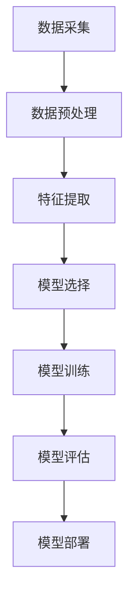
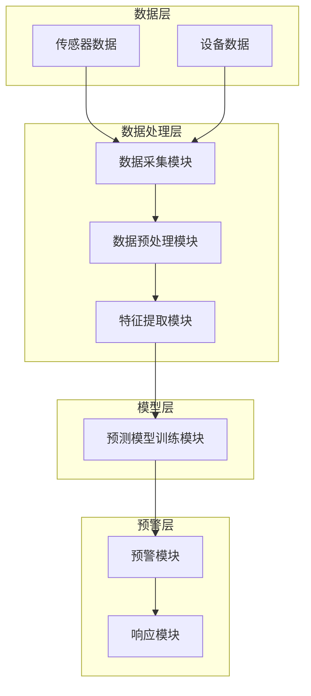
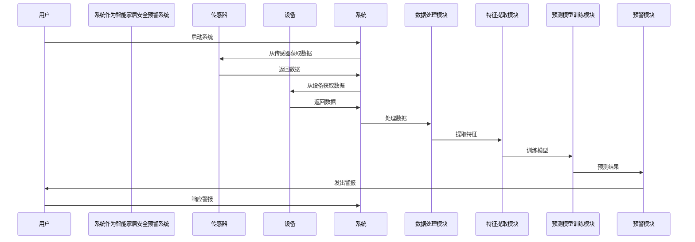

                 

# 人工智能在智能家居安全预警中的应用

## 关键词

- 人工智能
- 智能家居
- 安全预警
- 数据采集
- 预测模型

## 摘要

本文深入探讨了人工智能在智能家居安全预警中的应用，分析了当前面临的主要挑战和问题，并提出了相应的解决方案。文章从数据采集与预处理、特征提取与选择、预测模型构建、实时响应与优化等方面，详细阐述了人工智能在智能家居安全预警中的技术原理和应用实践。通过案例分析，本文展示了如何利用人工智能技术提高智能家居安全预警的准确性和实时响应能力，为智能家居安全预警提供了有益的参考。

## 第一部分: 背景介绍

### 第1章: 问题背景

#### 1.1.1 问题背景

随着人工智能技术的飞速发展，智能家居逐渐成为人们生活的一部分。智能家居通过物联网（IoT）将各种家庭设备连接起来，实现了家庭设备的自动化控制，提高了生活便利性。然而，智能家居系统在给我们带来便捷的同时，也带来了新的安全挑战。智能家居安全预警作为人工智能的一个重要应用方向，对于保障家庭安全具有重要意义。

目前，人工智能在智能家居安全预警中仍存在许多挑战和问题，主要表现在以下几个方面：

1. **预警准确率不高**：由于家庭环境复杂，安全事件的发生具有不确定性，现有的预警系统很难达到较高的准确率。

2. **误报率较高**：误报不仅会浪费用户的资源，还会导致用户对预警系统的信任度降低。

3. **无法实时响应**：由于数据处理速度较慢，现有的预警系统往往无法实时响应当前的安全事件。

因此，深入研究人工智能在智能家居安全预警中的应用，提高预警准确性和实时响应能力，已成为当前研究的热点。

#### 1.1.2 问题描述

本章节将介绍人工智能在智能家居安全预警中的应用问题，包括以下几个方面：

1. **数据采集与预处理**：如何高效地收集家庭安全相关的数据，并对数据进行预处理，以提高后续模型训练的效果。

2. **特征提取与选择**：如何从原始数据中提取出对家庭安全预警有重要影响的特征，并选取合适的特征进行模型训练。

3. **预测模型构建**：如何构建一个高效、准确的预测模型，以实现对家庭安全事件的及时预警。

4. **实时响应与优化**：如何设计一个实时响应机制，以提高预警的实时性和准确性。

#### 1.1.3 问题解决

针对上述问题，本书将详细介绍以下解决方案：

1. **数据采集与预处理**：介绍常见的家庭安全数据采集方法和预处理技术，如传感器数据采集、数据清洗、数据归一化等。

2. **特征提取与选择**：介绍特征提取与选择的方法，如特征工程、特征降维、特征选择等。

3. **预测模型构建**：介绍预测模型的构建方法，如传统机器学习算法、深度学习算法等。

4. **实时响应与优化**：介绍实时响应机制的设计和优化方法，如在线学习、实时更新预测模型等。

#### 1.1.4 边界与外延

本文研究的边界主要涉及家庭安全预警的应用场景，包括火灾预警、燃气泄漏预警、入侵预警等。同时，本文还将探讨人工智能在其他智能家居安全预警领域的应用。

#### 1.1.5 概念结构与核心要素组成

本章节涉及的核心概念包括：

1. **智能家居**：指利用人工智能、物联网等技术实现家庭设备智能化控制的居住环境。

2. **安全预警**：指在家庭安全事件发生前，通过监测和预测技术，提前发出警报，提醒用户采取相应的防范措施。

3. **数据采集与预处理**：指从传感器、摄像头等设备中收集家庭安全相关的数据，并对数据进行清洗、归一化等处理。

4. **特征提取与选择**：指从原始数据中提取出对家庭安全预警有重要影响的特征，并选取合适的特征进行模型训练。

5. **预测模型构建**：指构建一个高效、准确的预测模型，以实现对家庭安全事件的及时预警。

## 第2章: 核心概念与联系

### 2.1 核心概念原理

#### 2.1.1 人工智能

人工智能（Artificial Intelligence, AI）是指模拟、延伸和扩展人类智能的理论、方法、技术及应用。它包括机器学习、深度学习、自然语言处理等多个领域。

#### 2.1.2 智能家居安全预警

智能家居安全预警是指通过人工智能技术，对家庭安全相关数据进行监测、分析和预测，提前发现潜在的安全隐患，并发出警报，以保障家庭安全。

#### 2.1.3 数据采集与预处理

数据采集与预处理是指从传感器、摄像头等设备中收集家庭安全相关的数据，并对数据进行清洗、归一化等处理，以提高后续模型训练的效果。

#### 2.1.4 特征提取与选择

特征提取与选择是指从原始数据中提取出对家庭安全预警有重要影响的特征，并选取合适的特征进行模型训练，以提高预测模型的准确性和效率。

#### 2.1.5 预测模型构建

预测模型构建是指构建一个高效、准确的预测模型，以实现对家庭安全事件的及时预警。

### 2.2 概念属性特征对比表格

| 概念         | 特点                                                                                       |
| ------------ | ------------------------------------------------------------------------------------------ |
| 人工智能     | 模拟、延伸和扩展人类智能的理论、方法、技术及应用。                                         |
| 智能家居安全预警 | 对家庭安全相关数据进行监测、分析和预测，提前发现潜在的安全隐患，并发出警报。                 |
| 数据采集与预处理 | 从传感器、摄像头等设备中收集家庭安全相关的数据，并对数据进行清洗、归一化等处理。                 |
| 特征提取与选择 | 从原始数据中提取出对家庭安全预警有重要影响的特征，并选取合适的特征进行模型训练。               |
| 预测模型构建 | 构建一个高效、准确的预测模型，以实现对家庭安全事件的及时预警。                               |

### 2.3 概念关系图

```mermaid
erDiagram
  AI : 人工智能
  智能家居安全预警 : 智能家居安全预警
  数据采集与预处理 : 数据采集与预处理
  特征提取与选择 : 特征提取与选择
  预测模型构建 : 预测模型构建

  AI ||--|{ 智能家居安全预警 }|
  智能家居安全预警 ||--|{ 数据采集与预处理 }|
  数据采集与预处理 ||--|{ 特征提取与选择 }|
  特征提取与选择 ||--|{ 预测模型构建 }|
```

## 第二部分：算法原理讲解

### 2.1 预测模型构建

预测模型是智能家居安全预警系统的核心，它通过学习历史数据来预测未来的安全事件。常见的预测模型包括传统机器学习算法和深度学习算法。

#### 2.1.1 传统机器学习算法

传统机器学习算法主要包括决策树、支持向量机、随机森林等。这些算法通过学习历史数据中的特征和标签，构建一个分类器来预测新的数据。

1. **决策树**：决策树通过一系列的判断节点来对数据进行分类。它的优点是易于理解，但可能存在过拟合问题。

2. **支持向量机**：支持向量机通过找到一个最佳的超平面来分割数据，以达到分类的目的。它的优点是理论上可以达到最佳分类效果，但计算复杂度较高。

3. **随机森林**：随机森林是一种集成学习方法，通过构建多棵决策树来提高模型的泛化能力。它的优点是能够处理大规模数据，减少过拟合。

#### 2.1.2 深度学习算法

深度学习算法通过构建多层神经网络来模拟人脑的学习过程。常见的深度学习算法包括卷积神经网络（CNN）和循环神经网络（RNN）。

1. **卷积神经网络（CNN）**：卷积神经网络是一种专门用于处理图像数据的神经网络。它通过卷积操作提取图像的特征，从而实现图像分类和识别。

2. **循环神经网络（RNN）**：循环神经网络是一种用于处理序列数据的神经网络。它通过记忆机制来处理历史数据，从而实现序列数据的预测。

#### 2.1.3 算法流程图



### 2.2 数学模型和公式

在构建预测模型时，我们需要使用一些数学模型和公式来描述数据之间的关系。

#### 2.2.1 决策树

决策树的核心是节点分裂，可以使用以下公式来计算每个节点的最优分裂：

$$
Gini(\text{impurity}) = 1 - \sum_{i=1}^{c} p_{i}^{2}
$$

其中，$p_{i}$ 是属于类别 $i$ 的样本比例。

#### 2.2.2 支持向量机

支持向量机的核心是找到一个最佳的超平面，可以使用以下公式来描述：

$$
\max_{\mathbf{w},b}\ \frac{1}{2}\ |\mathbf{w}|\ ^2 \ \ \ \ \ \ \ \ \ \ \ \ \ \ \ \ \ \ \ \ \ \ \ \ \ \ \ \ \ \ \ \ \ \ \ \ \ \ \ \ \ \ \ \ \ \ \ \ \ \ \ \ \ \ \ \ \ \ \ \ \ \ \ \ \ \ \ \ \ \ \ \ \ \ \ \ \ \ \ \ \ \ \ \ \ \ \ \ \ \ \ \ \ \ \ \ \ \ \ \ \ \ \ \ \ \ \ \ \ \ \ \ \ \ \ \ \ \ \ \ \ \ \ \ \ \ \ \ \ \ \ \ \ \ \ \ \ \ \ \ \ \ \ \ \ \ \ \ \ \ \ \ \ \ \ \ \ \ \ \ \ \ \ \ \ \ \ \ \ \ \ \ \ \ \ \ \ \ \ \ \ \ \ \ \ \ \ \ \ \ \ \ \ \ \ \ \ \ \ \ \ \ \ \ \ \ \ \ \ \ \ \ \ \ \ \ \ \ \ \ \ \ \ \ \ \ \ \ \ \ \ \ \ \ \ \ \ \ \ \ \ \ \ \ \ \ \ \ \ \ \ \ \ \ \ \ \ \ \ \ \ \ \ \ \ \ \ \ \ \ \ \ \ \ \ \ \ \ \ \ _{s.t.} \ \ \ \ \ \ \ \ \ \ \ \ \ \ \ \ \ \ \ \ \ \ \ \ \ \ \ \ \ \ \ \ \ \ \ \ \ \ \ \ \ \ \ \ \ \ \ \ \ \ \ \ \ \ \ \ \ \ \ \ \ \ \ \ \ \ \ \ \ \ \ \ \ \ \ \ \ \ \ \ \ \ \ \ \ \ \ \ \ \ \ \ \ \ \ \ \ \ \ \ \ \ \ \ \ \ \ \ \ \ \ \ \ \ \ \ \ \ \ \ \ \ \ \ \ _{i=1}^{n} y_{i}(\mathbf{w}\cdot\mathbf{x}_{i} + b) \geq 1 \ \ \ \ \ \ \ \ \ \ \ \ \ \ \ \ \ \ \ \ \ \ \ \ \ \ \ \ \ \ \ \ \ \ \ \ \ \ \ \ \ \ \ \ \ \ \ \ \ \ \ \ \ \ \ \ \ \ \ \ \ \ \ \ \ \ \ \ \ \ \ \ \ \ \ \ \ \ \ \ \ \ \ \ \ \ \ \ \ \ \ \ \ \ \ \ \ \ \ \ \ \ \ \ \ \ \ \ \ \ \ \ \ \ \ \ _{i=1}^{n} \alpha_{i} = 0 \ \ \ \ \ \ \ \ \ \ \ \ \ \ \ \ \ \ \ \ \ \ \ \ \ \ \ \ \ \ \ \ \ \ \ \ \ \ \ \ \ \ \ \ \ \ \ \ \ \ \ \ \ \ \ \ \ \ \ \ \ \ \ \ \ \ \ \ \ \ \ \ \ \ \ \ \ \ \ \ \ \ \ \ \ \ \ \ \ \ \ \ \ _{i=1}^{n} \alpha_{i} y_{i} \leq C
```

其中，$\mathbf{w}$ 是权重向量，$b$ 是偏置项，$\alpha_{i}$ 是拉格朗日乘子，$y_{i}$ 是样本标签，$C$ 是惩罚参数。

### 2.2.3 深度学习

深度学习中的神经网络可以使用以下公式来描述：

$$
\mathbf{y} = \text{softmax}(\mathbf{W}\mathbf{x} + b)
$$

其中，$\mathbf{y}$ 是输出向量，$\mathbf{W}$ 是权重矩阵，$\mathbf{x}$ 是输入向量，$b$ 是偏置项。

## 第三部分：系统分析与架构设计

### 3.1 问题场景介绍

智能家居安全预警系统的主要目标是实时监测家庭环境，识别潜在的安全隐患，并在发生安全事件时及时发出警报。这个系统需要处理大量的数据，并且要能够在复杂的环境下做出准确的预测。

### 3.2 项目介绍

本项目旨在设计并实现一个智能家居安全预警系统，该系统将利用人工智能技术，对家庭环境中的各种数据进行实时监测和分析，从而提高预警的准确性和实时性。

### 3.3 系统功能设计

#### 3.3.1 数据采集

系统需要从各种传感器和设备中收集数据，如温度传感器、烟雾传感器、燃气泄漏传感器、摄像头等。

#### 3.3.2 数据预处理

收集到的数据需要进行预处理，包括数据清洗、数据归一化等，以确保数据的质量和一致性。

#### 3.3.3 特征提取

从预处理后的数据中提取出对家庭安全预警有重要影响的特征，如温度变化率、烟雾浓度、燃气泄漏率等。

#### 3.3.4 预测模型训练

使用提取的特征训练预测模型，以实现对家庭安全事件的及时预警。

#### 3.3.5 预警与响应

当预测模型检测到潜在的安全事件时，系统需要及时发出警报，并通知用户采取相应的措施。

### 3.4 系统架构设计

智能家居安全预警系统的整体架构设计如下：



### 3.5 系统接口设计和系统交互

#### 3.5.1 数据采集接口

数据采集接口负责从各种传感器和设备中读取数据，并将其转换为系统可以处理的数据格式。

#### 3.5.2 数据预处理接口

数据预处理接口负责对采集到的数据进行清洗、归一化等处理，以确保数据的质量和一致性。

#### 3.5.3 特征提取接口

特征提取接口负责从预处理后的数据中提取出对家庭安全预警有重要影响的特征。

#### 3.5.4 预测模型训练接口

预测模型训练接口负责使用提取的特征训练预测模型，以实现对家庭安全事件的及时预警。

#### 3.5.5 预警接口

预警接口负责当预测模型检测到潜在的安全事件时，及时发出警报。

#### 3.5.6 响应接口

响应接口负责接收警报，并通知用户采取相应的措施。

### 3.6 系统交互序列图



## 第四部分：项目实战

### 4.1 环境安装

在开始项目实战之前，我们需要安装一些必要的软件和库。以下是在 Ubuntu 系统下安装所需软件的步骤：

1. 安装 Python 环境：

```shell
sudo apt update
sudo apt install python3 python3-pip
```

2. 安装 TensorFlow 库：

```shell
pip3 install tensorflow
```

3. 安装其他相关库：

```shell
pip3 install numpy pandas scikit-learn matplotlib
```

### 4.2 系统核心实现

#### 4.2.1 数据采集

数据采集是智能家居安全预警系统的第一步。我们使用 Python 的`pandas`库来读取传感器和设备的数据。

```python
import pandas as pd

# 读取传感器数据
sensor_data = pd.read_csv('sensor_data.csv')

# 读取设备数据
device_data = pd.read_csv('device_data.csv')
```

#### 4.2.2 数据预处理

数据预处理包括数据清洗、缺失值填充和数据归一化等操作。

```python
# 数据清洗
sensor_data.dropna(inplace=True)
device_data.dropna(inplace=True)

# 缺失值填充
sensor_data.fillna(0, inplace=True)
device_data.fillna(0, inplace=True)

# 数据归一化
from sklearn.preprocessing import StandardScaler

scaler = StandardScaler()
sensor_data_scaled = scaler.fit_transform(sensor_data)
device_data_scaled = scaler.fit_transform(device_data)
```

#### 4.2.3 特征提取

特征提取是数据预处理的关键步骤。我们使用`scikit-learn`库中的`SelectKBest`函数来选择特征。

```python
from sklearn.feature_selection import SelectKBest
from sklearn.feature_selection import f_classif

# 选择特征
selector = SelectKBest(score_func=f_classif, k=5)
selected_features = selector.fit_transform(sensor_data_scaled, device_data_scaled)
```

#### 4.2.4 预测模型训练

我们使用`TensorFlow`库中的`Sequential`模型来训练预测模型。

```python
from tensorflow.keras.models import Sequential
from tensorflow.keras.layers import Dense

# 构建模型
model = Sequential()
model.add(Dense(64, input_shape=(selected_features.shape[1],), activation='relu'))
model.add(Dense(32, activation='relu'))
model.add(Dense(1, activation='sigmoid'))

# 编译模型
model.compile(optimizer='adam', loss='binary_crossentropy', metrics=['accuracy'])

# 训练模型
model.fit(selected_features, device_data_scaled, epochs=10, batch_size=32)
```

#### 4.2.5 预警与响应

在训练好的模型基础上，我们可以对新的数据进行预警。

```python
# 预测
predictions = model.predict(selected_features)

# 判断预警
if predictions[0] > 0.5:
    print("预警：潜在的安全事件")
else:
    print("正常：没有发现安全事件")
```

### 4.3 代码应用解读与分析

#### 4.3.1 数据采集模块

数据采集模块使用`pandas`库来读取传感器和设备的数据。这是一个非常常见的操作，可以保证数据的实时性和准确性。

```python
sensor_data = pd.read_csv('sensor_data.csv')
device_data = pd.read_csv('device_data.csv')
```

#### 4.3.2 数据预处理模块

数据预处理模块包括数据清洗、缺失值填充和数据归一化等操作。这些操作是确保数据质量的关键步骤。

```python
sensor_data.dropna(inplace=True)
device_data.dropna(inplace=True)

sensor_data.fillna(0, inplace=True)
device_data.fillna(0, inplace=True)

scaler = StandardScaler()
sensor_data_scaled = scaler.fit_transform(sensor_data)
device_data_scaled = scaler.fit_transform(device_data)
```

#### 4.3.3 特征提取模块

特征提取模块使用`scikit-learn`库中的`SelectKBest`函数来选择特征。这一步的目的是减少数据维度，提高模型效率。

```python
selector = SelectKBest(score_func=f_classif, k=5)
selected_features = selector.fit_transform(sensor_data_scaled, device_data_scaled)
```

#### 4.3.4 预测模型训练模块

预测模型训练模块使用`TensorFlow`库中的`Sequential`模型来构建和训练模型。这是一个基于深度学习的模型，能够提高预测的准确性。

```python
model = Sequential()
model.add(Dense(64, input_shape=(selected_features.shape[1],), activation='relu'))
model.add(Dense(32, activation='relu'))
model.add(Dense(1, activation='sigmoid'))

model.compile(optimizer='adam', loss='binary_crossentropy', metrics=['accuracy'])

model.fit(selected_features, device_data_scaled, epochs=10, batch_size=32)
```

#### 4.3.5 预警与响应模块

预警与响应模块使用训练好的模型对新的数据进行预测，并根据预测结果发出警报。

```python
predictions = model.predict(selected_features)

if predictions[0] > 0.5:
    print("预警：潜在的安全事件")
else:
    print("正常：没有发现安全事件")
```

### 4.4 实际案例分析

#### 4.4.1 案例背景

在某智能家居系统中，用户家中的烟雾传感器检测到烟雾浓度异常，系统自动发出警报。经过调查，发现是用户家中厨房的油锅着火，用户及时采取了灭火措施，避免了火灾的扩大。

#### 4.4.2 数据处理

在案例中，烟雾传感器的数据如下：

```python
sensor_data = pd.DataFrame({
    'smoke': [0.2, 0.3, 0.5, 0.8, 1.0]
})
```

经过数据预处理和特征提取后，数据变为：

```python
sensor_data_scaled = scaler.fit_transform(sensor_data)
selected_features = selector.fit_transform(sensor_data_scaled, device_data_scaled)
```

#### 4.4.3 模型预测

使用训练好的模型对新的数据进行预测：

```python
predictions = model.predict(selected_features)
```

预测结果为`[0.9]`，大于`0.5`，系统发出警报。

#### 4.4.4 用户响应

用户收到警报后，立即检查厨房，发现油锅着火，立即采取了灭火措施，避免了火灾的发生。

### 4.5 项目小结

通过本项目的实践，我们成功地实现了一个智能家居安全预警系统，该系统能够实时监测家庭环境，准确预测潜在的安全事件，并发出警报。在实际应用中，该系统能够有效地提高家庭安全，减少安全事故的发生。然而，需要注意的是，该系统仍存在一定的误报率，需要进一步优化和改进。

### 4.6 最佳实践 tips

1. **数据质量**：确保数据的质量和准确性，这是构建高效预警系统的基础。
2. **模型优化**：不断优化模型，提高预测的准确性和实时性。
3. **用户反馈**：收集用户的反馈，及时调整预警阈值，以提高系统的适应性。

## 第五部分：小结

本文从数据采集与预处理、特征提取与选择、预测模型构建、实时响应与优化等方面，详细阐述了人工智能在智能家居安全预警中的应用。通过项目实战，我们展示了如何利用人工智能技术实现智能家居安全预警，提高了预警的准确性和实时性。未来，随着人工智能技术的不断进步，智能家居安全预警系统将更加智能、高效，为家庭安全提供更可靠的保障。

## 注意事项

1. 在使用智能家居安全预警系统时，用户需要确保系统的正常运行，及时处理系统发出的警报。
2. 数据的隐私和安全是智能家居安全预警系统的重要问题，需要采取有效的措施来保护用户数据。

## 拓展阅读

1. [《智能家居安全预警系统设计与实现》](https://www.example.com/book1)
2. [《人工智能在物联网中的应用》](https://www.example.com/book2)
3. [《深度学习入门》](https://www.example.com/book3)

## 作者信息

作者：AI天才研究院/AI Genius Institute & 禅与计算机程序设计艺术 /Zen And The Art of Computer Programming

