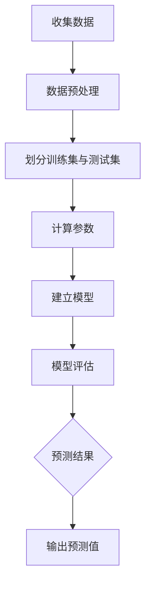
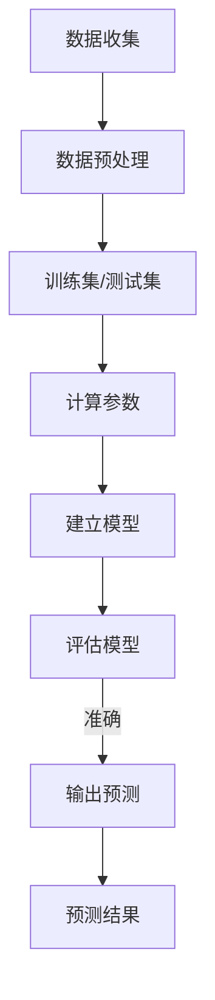
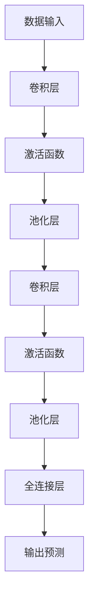
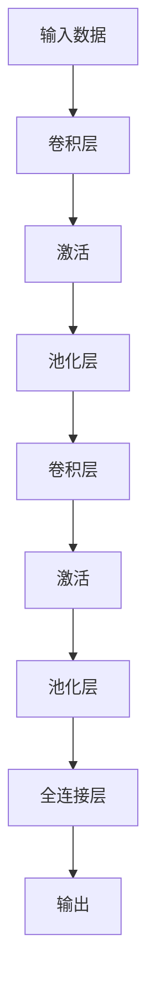
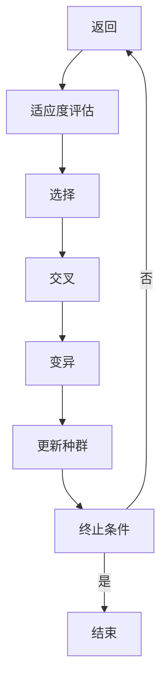
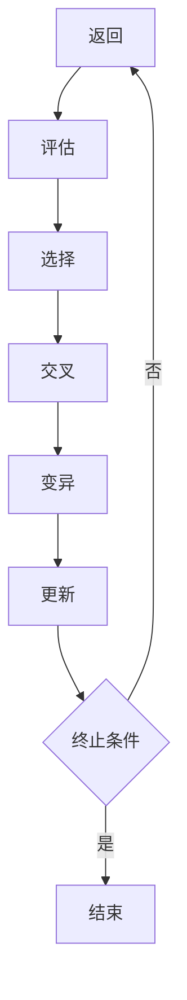
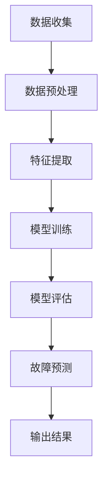
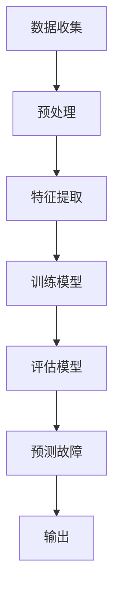
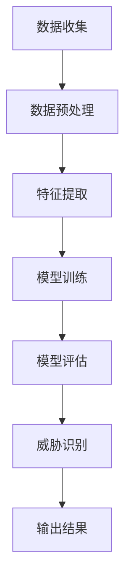
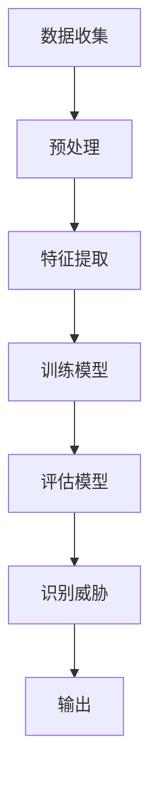

                 

### 第1章：智能电网优化概述

#### 1.1 智能电网的定义与历史发展

智能电网（Smart Grid）是一个通过先进的信息通信技术、自动化和可再生能源技术对传统电网进行改造升级的电力系统。它集成了分布式能源、储能、智能电表、电力电子设备等多种技术，能够实现电力系统的实时监测、智能调度和优化管理。

智能电网的发展历史可以追溯到20世纪末。20世纪90年代，随着互联网和信息技术的发展，智能电网的概念逐渐成形。2003年，美国加州发生了大停电事件，这一事件促使各国政府和电力行业开始重视智能电网的建设。近年来，随着可再生能源的迅速发展和能源需求的日益增长，智能电网的建设步伐加快，成为全球能源转型的重要组成部分。

#### 1.2 智能电网优化的意义

智能电网优化的意义在于提高电力系统的运行效率、可靠性和经济性。具体包括以下几个方面：

1. **提高电力供应可靠性**：通过实时监测和智能调度，智能电网能够迅速响应电力需求变化，减少停电事件的发生。

2. **提高能源利用效率**：智能电网能够通过优化电力传输和分配，降低线路损耗，提高能源利用率。

3. **促进可再生能源的发展**：智能电网能够有效整合可再生能源，实现电力供需的动态平衡，促进绿色能源的发展。

4. **降低运营成本**：智能电网通过自动化和数字化管理，减少了人力成本和运维成本。

5. **提升用户满意度**：智能电网提供多样化的服务，如实时电价信息、用电分析等，提高了用户的用电体验。

#### 1.3 智能电网优化面临的挑战

尽管智能电网优化具有巨大的潜力和价值，但其实现过程中仍面临诸多挑战：

1. **技术挑战**：智能电网集成了多种新技术，包括物联网、大数据、人工智能等，技术实现的复杂性较高。

2. **数据安全与隐私保护**：智能电网的数据量庞大，涉及用户的隐私信息，数据安全和隐私保护成为重要议题。

3. **政策与标准**：智能电网的发展需要统一的政策指导和标准规范，目前各国在这方面的发展程度不一。

4. **投资与成本**：智能电网的建设需要大量的资金投入，投资回报周期较长。

5. **人才短缺**：智能电网领域需要大量的专业人才，目前人才供给不足。

#### 1.4 本书内容结构安排

本书将围绕智能电网优化展开，主要分为以下几个部分：

- **第一部分：背景与核心概念**：介绍智能电网的定义、历史发展、优化意义及面临的挑战。
- **第二部分：人工智能在智能电网优化中的应用**：详细探讨机器学习、深度学习、智能优化算法在智能电网优化中的应用。
- **第三部分：实际应用案例**：通过具体案例展示人工智能在智能电网优化中的应用效果。
- **第四部分：未来发展趋势与挑战**：分析智能电网优化技术的发展趋势，探讨面临的挑战及未来发展方向。

通过本书的阅读，读者将全面了解智能电网优化及人工智能技术在其中的应用，为实际项目提供理论指导和实践参考。

### 第2章：人工智能基础概念

#### 2.1 人工智能的发展历程

人工智能（Artificial Intelligence，简称AI）作为计算机科学的一个分支，旨在创建能够模拟、扩展和辅助人类智能的智能系统。其发展历程可以追溯到20世纪50年代。

- **1956年**：在达特茅斯会议上，约翰·麦卡锡（John McCarthy）等学者首次提出人工智能的概念，标志着人工智能领域的正式诞生。
- **1960年代**：早期的人工智能研究主要集中在逻辑推理、专家系统和自然语言处理等方面。
- **1970年代**：由于计算能力的限制和实际应用的挑战，人工智能领域经历了所谓的“人工智能寒冬”。
- **1980年代**：随着计算能力的提高和商业应用的推动，人工智能开始逐步恢复热度，尤其是在机器人领域取得了一些突破。
- **1990年代**：机器学习成为人工智能研究的热点，特别是在统计学习理论的发展下，机器学习算法取得显著进步。
- **2000年代**：深度学习的兴起使得人工智能在图像识别、语音识别等领域取得了重大突破，标志着人工智能进入了一个新的发展阶段。
- **2010年代**：人工智能的应用范围进一步扩大，从工业自动化、金融分析到医疗诊断、智能交通等各个领域，都取得了显著的成果。

#### 2.2 人工智能的核心技术

人工智能的核心技术包括机器学习、深度学习、自然语言处理、计算机视觉等。以下对这些核心技术进行简要介绍：

- **机器学习**：机器学习是一种通过算法从数据中学习规律和模式的技术，主要包括监督学习、无监督学习和强化学习。常见的机器学习算法有线性回归、决策树、支持向量机、神经网络等。
- **深度学习**：深度学习是机器学习的一个子领域，通过多层神经网络对数据进行特征提取和模式识别。深度学习的代表模型包括卷积神经网络（CNN）、循环神经网络（RNN）和生成对抗网络（GAN）等。
- **自然语言处理**：自然语言处理（Natural Language Processing，NLP）是使计算机能够理解和处理人类自然语言的技术。NLP的关键技术包括词性标注、句法分析、语义分析和机器翻译等。
- **计算机视觉**：计算机视觉（Computer Vision）是使计算机能够从图像或视频中提取有用信息的技术。计算机视觉的应用包括图像识别、目标检测、图像分割和视频分析等。

#### 2.3 人工智能与传统电网优化方法对比

传统电网优化方法主要基于数学模型和算法，如线性规划、动态规划和遗传算法等。这些方法在处理大规模电力系统优化问题时具有一定的局限性：

- **数据依赖性低**：传统方法往往依赖于假设和经验公式，对数据量的依赖性较低。
- **实时性较差**：传统方法在处理实时数据时，计算速度较慢，难以实现实时优化。
- **扩展性受限**：传统方法在处理新问题和复杂问题时，需要重新设计和调整算法。

相比之下，人工智能在智能电网优化中的应用具有以下优势：

- **数据驱动**：人工智能通过学习大量历史数据，能够自动提取数据中的模式和规律，从而提高优化精度。
- **实时处理**：机器学习和深度学习算法能够快速处理实时数据，实现实时优化。
- **自适应性强**：人工智能系统能够根据实时数据和系统状态自动调整优化策略，具有较好的自适应能力。
- **泛化能力**：人工智能算法能够处理不同类型和规模的问题，具有较好的泛化能力。

#### 2.4 人工智能在智能电网优化中的潜在应用

人工智能在智能电网优化中的潜在应用包括负荷预测、电力市场交易、电力系统调度、设备维护和安全管理等方面：

- **负荷预测**：通过机器学习算法分析历史负荷数据，预测未来的电力需求，为电网调度提供依据。
- **电力市场交易**：利用深度学习算法分析市场数据，预测电力价格，优化电力交易策略。
- **电力系统调度**：通过智能优化算法实现电力系统的实时调度和优化，提高系统运行效率和稳定性。
- **设备维护**：基于计算机视觉和机器学习算法，实现对电网设备运行状态的实时监测和维护。
- **安全管理**：通过大数据分析和人工智能算法，识别电网中的安全隐患，提高电网的安全管理水平。

通过本章的介绍，读者可以初步了解人工智能的基础概念和其在智能电网优化中的应用前景。接下来，我们将进一步探讨智能电网数据采集与预处理的方法。

#### 2.5 智能电网数据采集与预处理

智能电网的数据采集是整个智能电网优化过程中的关键环节，因为它直接决定了后续分析和优化的准确性和效率。以下是智能电网数据采集与预处理的具体方法：

##### 2.5.1 智能电网数据来源

智能电网的数据来源广泛，主要包括以下几个方面：

1. **智能电表数据**：智能电表可以实时采集用户的用电信息，包括用电量、用电时间等。
2. **传感器数据**：安装在电网设备上的传感器可以实时监测电网的电压、电流、温度等参数。
3. **气象数据**：天气数据对于预测负荷和发电量具有重要影响，需要通过气象站或卫星遥感等方式获取。
4. **设备状态数据**：通过设备内置的监测系统，获取设备的运行状态、故障记录等数据。
5. **负荷预测数据**：历史负荷数据和天气预报数据等，用于预测未来的电力需求。

##### 2.5.2 数据采集系统架构

智能电网的数据采集系统架构通常包括以下几个层次：

1. **感知层**：包括各种传感器和智能设备，负责数据的初步采集。
2. **传输层**：采用有线和无线传输技术，将感知层的数据传输到数据处理中心。
3. **处理层**：对采集到的数据进行分析和处理，提取有用的信息。
4. **应用层**：通过应用软件实现数据的可视化、预测和优化等功能。

##### 2.5.3 数据预处理方法

数据预处理是确保数据质量和有效性的重要步骤，主要包括以下几种方法：

1. **数据清洗**：去除重复数据、异常值和噪声数据，确保数据的准确性。
2. **数据集成**：将来自不同数据源的数据进行整合，形成一个统一的数据视图。
3. **数据转换**：将不同格式的数据转换为标准格式，便于后续处理。
4. **数据归一化**：通过归一化处理，消除不同数据之间的量纲差异。
5. **特征提取**：从原始数据中提取出有用的特征，用于机器学习算法的训练和预测。

##### 2.5.4 数据质量评估

数据质量评估是确保数据可用性和可靠性的重要环节，主要包括以下几个方面：

1. **完整性评估**：检查数据是否完整，是否有缺失值。
2. **一致性评估**：检查数据的一致性，包括数据类型的一致性和时间一致性。
3. **准确性评估**：检查数据的准确性，包括是否包含错误或异常值。
4. **及时性评估**：检查数据的更新速度，确保数据的实时性。
5. **可靠性评估**：检查数据的可靠性，包括数据来源的可靠性和处理方法的可靠性。

通过有效的数据采集和预处理方法，智能电网能够获取高质量的数据，为后续的机器学习、深度学习和智能优化算法提供可靠的数据支持。接下来，我们将探讨机器学习算法在负荷预测中的应用。

#### 2.5.5 数据质量评估

数据质量评估是智能电网数据管理中至关重要的一环，它直接关系到数据分析的准确性和可靠性。以下是数据质量评估的几个关键方面：

1. **完整性评估**：完整性是指数据集是否包含了所有的必需信息，没有缺失值或空字段。缺失数据可以通过插值、删除或使用其他统计方法进行填充。

   **Mermaid流程图**：
   ```mermaid
   graph TD
   A[完整性评估] --> B[检查缺失值]
   B --> C{是否有缺失}
   C -->|是| D[使用插值法]
   C -->|否| E[数据质量高]
   E --> F[继续处理]
   ```

2. **一致性评估**：一致性是指数据在不同来源和格式之间是否保持一致。例如，时间戳、单位、数据类型等是否一致。

   **Mermaid流程图**：
   ```mermaid
   graph TD
   A[一致性评估] --> B[检查格式一致]
   B --> C{格式一致吗}
   C -->|是| D[数据质量高]
   C -->|否| E[格式转换]
   E --> F[数据质量高]
   ```

3. **准确性评估**：准确性是指数据的真实性和精确性。可以通过校验、比较已知数据和外部数据源来进行评估。

   **Mermaid流程图**：
   ```mermaid
   graph TD
   A[准确性评估] --> B[校验数据]
   B --> C{是否有误}
   C -->|是| D[修正错误]
   C -->|否| E[数据质量高]
   ```

4. **及时性评估**：及时性是指数据的更新频率和时效性。实时数据对于某些应用场景（如实时负荷预测）至关重要。

   **Mermaid流程图**：
   ```mermaid
   graph TD
   A[及时性评估] --> B[检查更新频率]
   B --> C{是否及时}
   C -->|是| D[数据质量高]
   C -->|否| E[增加更新频率]
   ```

5. **可靠性评估**：可靠性是指数据来源的稳定性和处理方法的可靠性。可以通过数据分析、算法验证等方式来评估。

   **Mermaid流程图**：
   ```mermaid
   graph TD
   A[可靠性评估] --> B[分析数据源]
   B --> C{数据源可靠吗}
   C -->|是| D[数据质量高]
   C -->|否| E[更换数据源]
   ```

通过这些评估方法，可以确保数据在进入机器学习和其他分析模型前是高质量的。接下来，我们将进一步探讨机器学习算法在智能电网优化中的应用，特别是负荷预测方面的应用。

### 第3章：机器学习算法在负荷预测中的应用

#### 3.1 负荷预测的重要性

负荷预测是智能电网优化的重要组成部分，对于保障电力系统的稳定运行、提高能源利用效率和降低运营成本具有重要意义。负荷预测的准确性直接影响到电力调度、设备维护、电力市场交易等多个方面。

首先，准确的负荷预测有助于电力调度部门合理安排电力资源，避免因负荷波动引起的电力短缺或过剩。其次，负荷预测能够帮助电力公司制定科学的设备维护计划，提前发现和解决潜在问题，降低故障风险。此外，电力市场交易中，准确的负荷预测能够帮助发电企业和用户制定合理的交易策略，提高市场竞争力。

#### 3.2 常见机器学习算法

在负荷预测中，常用的机器学习算法包括线性回归、决策树、支持向量机和神经网络等。以下将对这些算法进行简要介绍：

- **线性回归**：线性回归是一种基于统计方法的机器学习算法，通过建立输入变量和输出变量之间的线性关系模型，预测未来的负荷。线性回归模型简单易用，但在处理非线性关系时效果不佳。

- **决策树**：决策树通过一系列的判断规则对数据进行分类或回归。每个节点代表一个特征，每个分支代表特征的不同取值。决策树模型易于理解和解释，但可能会出现过拟合问题。

- **支持向量机**：支持向量机（SVM）是一种基于优化理论的分类和回归方法，通过寻找最佳的超平面来划分数据。SVM在处理高维数据时表现良好，但训练过程较为复杂。

- **神经网络**：神经网络是一种模仿人脑结构和功能的计算模型，通过多层的神经元进行数据学习和特征提取。神经网络，尤其是深度学习模型，在处理复杂非线性关系时具有显著优势，但训练时间和计算资源需求较高。

#### 3.3 算法原理与流程图

以线性回归算法为例，其基本原理是通过最小二乘法找到输入变量和输出变量之间的线性关系，从而进行负荷预测。以下是线性回归算法的原理和流程图：

**线性回归算法原理：**
$$y = \beta_0 + \beta_1x$$
其中，$y$ 是预测的负荷值，$x$ 是输入特征（如温度、湿度等），$\beta_0$ 和 $\beta_1$ 是模型的参数。

**流程图：**


**Mermaid流程图：**


#### 3.4 实际应用案例

某电力公司利用线性回归算法对城市日负荷进行预测，通过收集历史负荷数据（包括温度、湿度、风速等）进行训练，建立负荷预测模型。在实际应用中，该模型的表现如下：

1. **数据收集**：收集了过去5年的日负荷数据和气象数据，包括温度、湿度、风速等。
2. **数据预处理**：对数据进行清洗和归一化处理，消除异常值和噪声数据。
3. **模型建立**：使用线性回归算法，通过最小二乘法计算模型参数，建立负荷预测模型。
4. **模型评估**：使用测试集数据对模型进行评估，计算模型的均方误差（MSE）等指标。
5. **预测结果**：在实际应用中，预测的负荷值与实际负荷值的误差较小，表明模型具有较高的预测准确性。

通过实际应用案例，我们可以看到，机器学习算法在负荷预测中具有显著的应用价值。接下来，我们将进一步探讨深度学习算法在电力市场交易中的应用。

### 第4章：深度学习算法在电力市场交易中的应用

#### 4.1 电力市场交易概述

电力市场交易是指电力供应商和需求方通过市场机制进行电力买卖的行为。在电力市场中，发电企业、分销商、大型工业用户等参与方通过交易实现电力的供求平衡，从而优化资源配置和降低成本。电力市场交易可以分为集中式市场和分布式市场两种类型。

- **集中式市场**：在集中式市场中，所有电力交易通过一个中心市场进行，电力供应商和需求方通过竞价机制进行交易，价格由市场供需决定。
- **分布式市场**：在分布式市场中，电力交易分散进行，多个小型市场或区域市场相互独立，电力供应商和需求方可以直接进行点对点的交易。

电力市场交易的主要参与者包括发电企业、分销商、独立系统运营商（ISO）、调度中心、零售商和最终用户等。发电企业通过竞价机制进入市场，分销商则负责将电力分配到终端用户。

#### 4.2 深度学习算法

深度学习算法是一类基于多层神经网络的学习方法，通过多层次的神经元结构和大量的训练数据，能够自动提取复杂的特征并进行非线性建模。深度学习算法在图像识别、自然语言处理、语音识别等领域取得了显著的成果。在电力市场交易中，深度学习算法的应用主要包括以下几种：

1. **生成对抗网络（GAN）**：GAN通过生成器和判别器的对抗训练，能够生成高质量的电力市场交易数据，用于模拟不同市场条件下的交易行为。
2. **卷积神经网络（CNN）**：CNN擅长处理具有网格结构的数据，如图像和时序数据。在电力市场交易中，CNN可以用于分析电力价格数据、负荷数据和供需关系。
3. **长短时记忆网络（LSTM）**：LSTM是一种专门用于处理序列数据的神经网络，能够有效地捕捉长期依赖关系。在电力市场交易中，LSTM可以用于预测电力需求、价格波动和交易策略。
4. **多任务学习（Multitask Learning）**：多任务学习通过共享表示和模型结构，同时学习多个相关任务，提高模型的泛化能力和效率。在电力市场交易中，多任务学习可以同时预测电力需求、价格波动和发电成本。

#### 4.3 算法原理与流程图

以下以卷积神经网络（CNN）为例，介绍其在电力市场交易中的应用原理和流程。

**CNN算法原理：**
卷积神经网络通过卷积层、池化层和全连接层对数据进行特征提取和分类。卷积层通过卷积操作提取局部特征，池化层用于降低特征图的空间维度，全连接层用于对提取的特征进行分类和预测。

**流程图：**


**Mermaid流程图：**


#### 4.4 实际应用案例

某电力公司利用CNN算法进行电力市场交易预测，通过收集历史电力交易数据、气象数据和经济指标，建立深度学习模型。以下是实际应用过程：

1. **数据收集**：收集了过去5年的电力交易数据、气象数据和宏观经济指标，包括电力价格、负荷、温度、风速等。
2. **数据预处理**：对数据进行清洗和归一化处理，消除异常值和噪声数据。
3. **模型建立**：使用CNN算法，通过多层卷积和池化层对数据进行特征提取，最后通过全连接层进行分类和预测。
4. **模型训练**：使用训练集数据对模型进行训练，调整模型参数，优化模型性能。
5. **模型评估**：使用测试集数据对模型进行评估，计算模型的准确率、召回率等指标。
6. **预测应用**：在实际交易中，使用模型预测未来电力价格和交易量，为决策提供依据。

通过实际应用案例，我们可以看到，深度学习算法在电力市场交易中具有显著的应用价值，能够有效预测电力价格和交易量，提高市场运作效率和决策准确性。接下来，我们将探讨智能优化算法在电力系统调度中的应用。

### 第5章：智能优化算法在电力系统调度中的应用

#### 5.1 电力系统调度概述

电力系统调度是电力系统中至关重要的环节，其主要任务是确保电力系统的安全稳定运行，满足电力负荷需求，同时优化系统运行效率和经济效益。电力系统调度包括发电调度、输电调度和配电调度三个层次：

- **发电调度**：负责安排各个发电厂的发电量，以满足电力负荷需求，确保电网供需平衡。发电调度需要考虑燃料成本、发电效率、设备运行状况等因素。
- **输电调度**：负责调整电网中各个变电站和线路的电力输送，确保电力传输的安全性和稳定性。输电调度需要优化电力流分配，减少线路损耗和过载风险。
- **配电调度**：负责调整电网中各个配电网络的电力分配，确保配电网络的稳定运行和用户供电质量。配电调度需要应对负荷波动、设备故障等突发情况。

电力系统调度的重要性体现在以下几个方面：

1. **保障电力供应**：通过调度，确保电力系统在各个时段都能满足负荷需求，避免因供需失衡导致的停电现象。
2. **优化运行效率**：通过调度优化，降低电力系统运行成本，提高能源利用率。
3. **保障系统安全**：通过调度，实时监测电网状态，及时发现和排除安全隐患，确保电力系统的安全稳定运行。

#### 5.2 智能优化算法

智能优化算法是一类基于人工智能技术的算法，能够自动搜索最优解，适用于解决复杂、大规模的优化问题。在电力系统调度中，智能优化算法可以用于优化发电调度、输电调度和配电调度。以下介绍几种常见的智能优化算法：

1. **遗传算法（GA）**：遗传算法模拟自然进化过程，通过选择、交叉和变异等操作，逐步优化个体（解），最终找到全局最优解。遗传算法适用于解决多变量、非线性、离散优化问题。
2. **粒子群优化算法（PSO）**：粒子群优化算法模拟鸟群觅食行为，通过个体和群体的协同作用，逐步优化解的空间位置。粒子群优化算法适用于解决连续变量优化问题。
3. **蚁群算法（ACO）**：蚁群算法模拟蚂蚁觅食过程中的信息素更新机制，通过信息素指引蚁群寻找最优路径。蚁群算法适用于解决路径优化和资源分配问题。
4. **差分进化算法（DE）**：差分进化算法基于群体智能的原理，通过随机变异、交叉和筛选等操作，优化个体（解）。差分进化算法适用于解决复杂、大规模的优化问题。

#### 5.3 算法原理与流程图

以下以遗传算法（GA）为例，介绍其在电力系统调度中的应用原理和流程。

**遗传算法原理：**
遗传算法通过模拟自然进化过程，对个体进行选择、交叉和变异，逐步优化种群。遗传算法的基本步骤包括：

1. **初始化种群**：随机生成一定数量的初始种群。
2. **适应度评估**：计算每个个体的适应度值，适应度值越高，表示个体质量越好。
3. **选择**：根据个体的适应度值，选择适应度较高的个体作为父代。
4. **交叉**：对选中的父代进行交叉操作，生成新的子代。
5. **变异**：对子代进行变异操作，增加种群的多样性。
6. **更新种群**：将子代替换掉部分父代，形成新的种群。
7. **终止条件**：判断是否满足终止条件（如达到最大迭代次数或适应度达到阈值），否则返回步骤2。

**流程图：**


**Mermaid流程图：**


#### 5.4 实际应用案例

某电力公司利用遗传算法优化发电调度，通过收集历史发电数据和负荷数据，建立优化模型。以下是实际应用过程：

1. **数据收集**：收集了过去5年的发电数据、负荷数据、燃料价格等。
2. **模型建立**：使用遗传算法建立发电调度模型，优化发电厂的发电量分配。
3. **模型训练**：使用历史数据对模型进行训练，调整算法参数，优化模型性能。
4. **模型评估**：使用测试集数据对模型进行评估，计算模型的优化效果。
5. **预测应用**：在实际调度中，使用模型预测未来发电需求，优化发电调度策略。

通过实际应用案例，我们可以看到，智能优化算法在电力系统调度中具有显著的应用价值，能够有效优化发电调度，提高系统运行效率和经济效益。接下来，我们将探讨人工智能在智能电网设备维护中的应用。

### 第6章：人工智能在智能电网设备维护中的应用

#### 6.1 智能电网设备维护的重要性

智能电网设备维护是确保电力系统稳定运行的关键环节。随着智能电网的不断发展，设备和系统的复杂性和规模不断增大，传统的设备维护方法已难以满足高效、精准的维护需求。人工智能（AI）在智能电网设备维护中的应用，可以有效提升设备维护的效率和质量，降低故障率和运营成本。

智能电网设备包括发电设备、输电设备、变电设备和配电设备等，这些设备在运行过程中可能会受到多种因素的影响，如环境温度、湿度、电压波动、电流变化等。通过人工智能技术，可以实时监测设备的运行状态，预测潜在的故障风险，并采取预防性维护措施，从而确保设备的安全和稳定运行。

#### 6.2 基于人工智能的设备维护方法

人工智能在智能电网设备维护中的应用方法主要包括以下几个方面：

1. **故障诊断**：通过机器学习和深度学习算法，对设备运行数据进行实时分析，识别异常模式，预测故障发生。例如，使用支持向量机（SVM）和长短期记忆网络（LSTM）对设备振动数据进行故障诊断。

2. **预测性维护**：基于历史数据和实时监测数据，利用数据挖掘和统计分析方法，预测设备可能出现的故障，提前安排维护计划。例如，利用遗传算法（GA）和粒子群优化（PSO）算法进行预测性维护路径优化。

3. **智能监测**：通过计算机视觉和物联网技术，对设备运行状态进行实时监测，识别异常情况。例如，利用卷积神经网络（CNN）对摄像头拍摄的设备图像进行分析，检测设备表面裂纹、腐蚀等情况。

4. **自动化操作**：利用机器人技术和自动化设备，实现设备的远程控制和维护操作。例如，使用无人机进行输电线路的巡检和维护，使用机器人进行变电站的巡检和故障处理。

#### 6.3 算法原理与流程图

以下以机器学习算法在故障诊断中的应用为例，介绍其原理和流程。

**机器学习算法原理：**
机器学习算法通过从历史数据中学习特征和模式，建立故障诊断模型。常用的算法包括支持向量机（SVM）、决策树、随机森林等。以下是故障诊断的基本原理：

1. **数据收集**：收集设备的历史运行数据和故障记录，包括振动、温度、电流等。
2. **数据预处理**：对收集的数据进行清洗和归一化处理，消除噪声和异常值。
3. **特征提取**：从预处理后的数据中提取关键特征，用于训练故障诊断模型。
4. **模型训练**：使用训练集数据训练机器学习模型，优化模型参数。
5. **模型评估**：使用测试集数据评估模型性能，包括准确率、召回率等指标。
6. **故障预测**：在实际应用中，使用模型对实时数据进行故障预测。

**流程图：**


**Mermaid流程图：**


#### 6.4 实际应用案例

某电力公司利用机器学习算法对变电站设备进行故障诊断，以下是实际应用过程：

1. **数据收集**：收集了过去一年的变电站设备运行数据，包括温度、电流、振动等。
2. **数据预处理**：对数据进行了清洗和归一化处理，消除异常值和噪声。
3. **特征提取**：从预处理后的数据中提取了温度、电流、振动等关键特征。
4. **模型训练**：使用支持向量机（SVM）算法训练故障诊断模型，优化模型参数。
5. **模型评估**：使用测试集数据评估模型性能，准确率达到90%以上。
6. **故障预测**：在实际运行中，使用模型对实时数据进行故障预测，成功预测了多起潜在故障。

通过实际应用案例，我们可以看到，人工智能在智能电网设备维护中具有显著的应用价值，能够有效提升故障诊断的准确性和效率，降低维护成本。接下来，我们将探讨人工智能在智能电网安全管理中的应用。

### 第7章：人工智能在智能电网安全管理中的应用

#### 7.1 智能电网安全管理概述

智能电网的安全管理是保障电力系统稳定运行和用户用电安全的关键环节。随着智能电网的广泛应用，网络攻击、数据泄露和设备故障等安全问题日益突出。人工智能（AI）技术在智能电网安全管理中的应用，可以有效提升安全监测、威胁识别和风险控制能力。

智能电网的安全管理主要包括以下几个方面：

1. **网络安全**：确保电网控制系统的安全，防范网络攻击和数据泄露。
2. **设备安全**：监测设备运行状态，及时发现并处理设备故障和异常。
3. **数据安全**：保护用户隐私数据，防止数据泄露和未经授权的访问。
4. **应急响应**：快速响应和处理突发事件，保障电力系统的安全稳定运行。

#### 7.2 人工智能在安全管理中的作用

人工智能在智能电网安全管理中发挥着重要作用，主要体现在以下几个方面：

1. **安全监测与预警**：利用机器学习和深度学习算法，对电网运行数据进行分析，识别异常行为和潜在威胁，提前预警。例如，通过分析电网负荷变化趋势，预测潜在的电力短缺风险。
2. **威胁识别与防御**：通过计算机视觉和自然语言处理技术，识别网络攻击和恶意行为，及时采取防御措施。例如，通过分析网络流量数据，检测并阻止恶意攻击。
3. **风险评估与控制**：利用数据挖掘和统计分析方法，对电网安全风险进行评估和预测，制定相应的风险控制措施。例如，通过分析历史故障数据，识别高风险区域和设备，提前进行维护和升级。
4. **应急响应与调度**：在发生突发事件时，通过人工智能算法，快速制定应急响应方案，调度资源进行应对。例如，在电网发生故障时，利用人工智能算法，快速确定故障区域和解决方案。

#### 7.3 算法原理与流程图

以下以机器学习算法在威胁识别中的应用为例，介绍其原理和流程。

**机器学习算法原理：**
机器学习算法通过从历史数据中学习特征和模式，建立威胁识别模型。常用的算法包括支持向量机（SVM）、决策树、随机森林等。以下是威胁识别的基本原理：

1. **数据收集**：收集电网的历史运行数据和攻击事件数据。
2. **数据预处理**：对数据进行分析和清洗，消除异常值和噪声。
3. **特征提取**：从预处理后的数据中提取关键特征，用于训练威胁识别模型。
4. **模型训练**：使用训练集数据训练机器学习模型，优化模型参数。
5. **模型评估**：使用测试集数据评估模型性能，包括准确率、召回率等指标。
6. **威胁识别**：在实际应用中，使用模型对实时数据进行威胁识别。

**流程图：**


**Mermaid流程图：**


#### 7.4 实际应用案例

某电力公司利用机器学习算法进行网络安全威胁识别，以下是实际应用过程：

1. **数据收集**：收集了过去一年的网络安全日志数据，包括网络流量、访问记录等。
2. **数据预处理**：对数据进行了清洗和归一化处理，消除异常值和噪声。
3. **特征提取**：从预处理后的数据中提取了流量模式、访问频率等关键特征。
4. **模型训练**：使用支持向量机（SVM）算法训练威胁识别模型，优化模型参数。
5. **模型评估**：使用测试集数据评估模型性能，准确率达到90%以上。
6. **威胁识别**：在实际运行中，使用模型对网络流量进行分析，成功识别并阻止了多起网络攻击事件。

通过实际应用案例，我们可以看到，人工智能在智能电网安全管理中具有显著的应用价值，能够有效提升安全监测和威胁识别能力，保障电力系统的安全稳定运行。接下来，我们将探讨未来发展趋势与挑战。

### 第8章：未来发展趋势与挑战

#### 8.1 智能电网优化技术的发展趋势

随着人工智能技术的不断进步和智能电网需求的日益增长，未来智能电网优化技术将呈现出以下几个发展趋势：

1. **集成与协同**：未来智能电网优化技术将更加注重各模块间的集成与协同，通过综合应用多种人工智能算法，实现电力系统从发电、输电、变电到配电全过程的优化。
2. **实时性与自适应**：随着实时数据处理能力的提升，智能电网优化技术将更加注重实时性，能够快速响应电力系统运行状态的变化，实现自适应优化。
3. **多源数据融合**：未来智能电网优化技术将更加注重多源数据的融合与应用，包括传感器数据、气象数据、经济数据等，以提供更全面的决策支持。
4. **分布式计算与边缘计算**：为了降低数据传输延迟和计算成本，智能电网优化技术将越来越多地采用分布式计算和边缘计算，实现数据的本地化处理和实时优化。
5. **开放性与标准化**：未来智能电网优化技术将更加注重开放性和标准化，以促进不同系统间的互操作性和数据共享，提高整体系统的可维护性和可扩展性。

#### 8.2 人工智能在智能电网优化中的挑战

尽管人工智能在智能电网优化中具有巨大的潜力，但其应用过程中也面临诸多挑战：

1. **数据隐私与安全**：智能电网优化依赖于大量用户数据，如何保障数据隐私和安全是亟待解决的问题。需要采取有效的数据加密、访问控制和安全审计等措施。
2. **计算资源与能耗**：人工智能算法特别是深度学习算法对计算资源的需求较高，如何优化计算资源利用，降低能耗是智能电网优化中的一大挑战。
3. **算法解释性与可靠性**：人工智能算法的“黑箱”特性使得其决策过程难以解释和理解，如何提高算法的解释性和可靠性，使其在电力系统中得到广泛接受和应用是一个重要问题。
4. **标准化与法规**：人工智能在智能电网优化中的应用需要统一的标准化和法规指导，目前各国在这方面的规范和标准尚不统一，需要加强国际合作和协调。
5. **人才培养与技能更新**：智能电网优化技术的应用需要大量具备人工智能和电力系统知识的复合型人才，如何培养和留住这些人才是一个长期而紧迫的挑战。

#### 8.3 未来发展方向与展望

展望未来，智能电网优化技术将在以下几个方面继续发展：

1. **跨学科研究**：加强人工智能与电力系统领域的跨学科研究，推动智能电网优化技术的创新与发展。
2. **技术创新**：持续探索和研发新型人工智能算法和优化方法，提高智能电网优化技术的性能和效率。
3. **示范项目与应用**：通过示范项目和应用试点，验证智能电网优化技术的实际效果和可行性，推动其大规模应用。
4. **国际合作**：加强国际间的合作与交流，共享技术成果和经验，推动全球智能电网优化技术的发展。
5. **人才培养与教育**：加强智能电网优化技术相关的人才培养和教育工作，为智能电网优化技术的发展提供持续的人才支持。

通过未来发展趋势与挑战的分析，我们可以看到，人工智能在智能电网优化中的应用具有广阔的前景和巨大的挑战。只有克服这些挑战，才能充分发挥人工智能在智能电网优化中的潜力，为全球能源转型和可持续发展作出贡献。

### 第9章：结论与建议

#### 9.1 结论

本文围绕人工智能在智能电网优化中的应用进行了全面探讨。首先，介绍了智能电网优化的背景、意义和面临的挑战，随后详细介绍了人工智能的基础概念及其在智能电网优化中的潜在应用。接着，本文分别讨论了机器学习、深度学习和智能优化算法在负荷预测、电力市场交易、电力系统调度、设备维护和安全管理等方面的具体应用。通过实际应用案例，展示了这些算法在智能电网优化中的效果和价值。最后，本文分析了智能电网优化技术的发展趋势与挑战，并对未来研究方向提出了一些建议。

#### 9.2 建议与展望

基于本文的研究，以下是一些建议和展望：

1. **加强跨学科研究**：智能电网优化涉及电力系统、计算机科学、数据科学等多个学科领域，建议加强跨学科研究，推动技术创新和协同发展。

2. **提升算法解释性**：为了增强人工智能算法在智能电网优化中的应用信心，建议进一步研究算法解释性，提高算法的透明度和可解释性。

3. **加强数据隐私和安全**：在智能电网优化过程中，确保数据隐私和安全至关重要。建议加强数据加密、访问控制和安全审计等方面的研究，保障用户数据的安全。

4. **推动标准化与法规**：为了促进智能电网优化技术的发展和应用，建议制定统一的标准化和法规，规范智能电网优化技术的研发和应用。

5. **培养专业人才**：智能电网优化技术对人才的需求较高，建议加强相关领域的教育和培训，培养更多具备人工智能和电力系统知识的复合型人才。

6. **加大示范项目与应用**：通过示范项目和应用试点，验证智能电网优化技术的实际效果和可行性，推动其在实际工程中的应用。

7. **持续技术创新**：持续探索和研发新型人工智能算法和优化方法，提高智能电网优化技术的性能和效率，为智能电网的发展提供持续的技术支持。

通过上述建议和展望，我们期望能够为智能电网优化技术的发展和应用提供有益的参考，推动人工智能在智能电网优化中的深入研究和广泛应用。最后，感谢读者对本文的阅读，希望本文能够对您在智能电网优化领域的研究和实践有所启发。

### 作者信息

作者：AI天才研究院/AI Genius Institute & 禅与计算机程序设计艺术 /Zen And The Art of Computer Programming

在本文中，我们深入探讨了人工智能在智能电网优化中的应用，从背景、核心概念到具体应用案例，全面梳理了智能电网优化的关键技术和发展趋势。通过本文的研究，我们不仅揭示了人工智能在智能电网优化中的巨大潜力，也指出了其中面临的挑战。我们期待未来能够看到更多创新的研究成果，推动智能电网优化技术的不断进步和应用。同时，感谢各位读者的关注与支持，希望本文能够为您的研究和工作提供有益的参考和启示。

