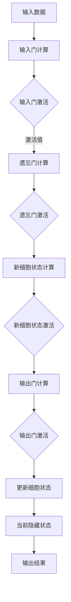
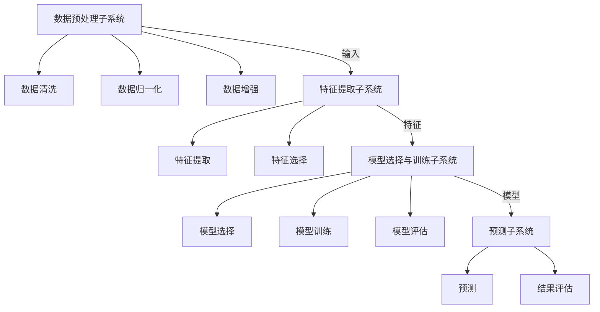
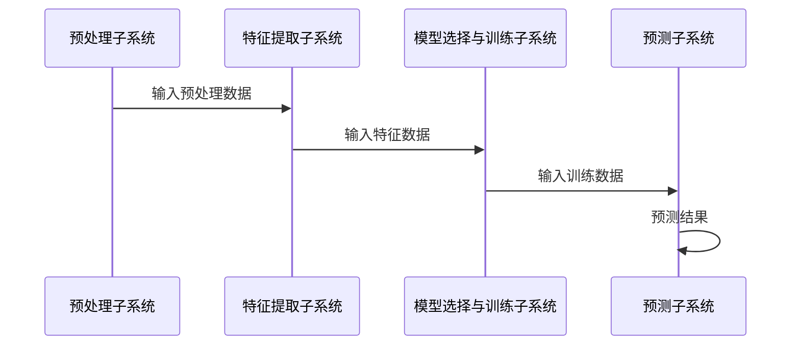

                 

### 引言

#### 1.1 问题背景

气候变化是全球面临的一个严峻挑战，它对生态系统、人类健康、经济发展以及社会稳定等方面产生了深远的影响。当前，气候变化的主要特征包括全球平均气温的持续升高、极端天气事件的频繁发生、海平面上升以及生态系统的破坏等。这些变化不仅对自然环境产生了破坏，还对社会经济系统带来了巨大的压力。

预测气候变化的重要性不言而喻。准确的气候变化预测有助于制定有效的应对策略，减少灾害风险，优化资源配置，保护生态系统，以及促进经济社会的可持续发展。传统的气候变化预测模型依赖于大量的观测数据和统计方法，但这些方法往往存在一定的局限性，难以全面、准确地预测未来的气候变化趋势。

#### 1.2 预测模型的重要性

预测模型在气候变化研究中扮演着关键角色。通过使用先进的预测模型，我们可以更好地理解气候变化的机制，揭示潜在的风险因素，预测未来的气候变化趋势，并为政策制定者提供科学依据。目前，常见的预测模型包括统计模型、物理模型和混合模型等。这些模型在数据处理、特征提取和模式识别等方面各具优势，但同时也存在一定的局限性。

#### 1.3 人工智能的应用

人工智能（AI）技术的迅速发展为气候变化预测带来了新的机遇。人工智能具有强大的数据处理和模式识别能力，可以处理海量数据，发现潜在的模式和规律，从而提高预测模型的准确性和效率。具体来说，人工智能在气候变化预测中的应用主要体现在以下几个方面：

1. **数据预处理和特征提取**：人工智能可以通过自动化方法对海量气候数据进行预处理和特征提取，提高数据的质量和可用性。
2. **模型选择和优化**：人工智能可以自动选择和优化预测模型，提高预测的准确性和稳定性。
3. **预测结果的可视化和解释**：人工智能可以帮助我们将复杂的预测结果进行可视化和解释，使得预测模型的应用更加广泛和易于理解。

#### 1.4 目标与边界

在人工智能应用于气候变化预测的过程中，我们的目标是提高预测模型的准确性，从而为应对气候变化提供更可靠的决策支持。然而，这一目标也面临着一些边界和挑战：

1. **数据质量和数量**：准确的预测依赖于高质量、大量的气候数据。然而，获取这些数据往往面临着数据源有限、数据质量参差不齐等问题。
2. **模型复杂性和计算资源**：人工智能算法往往需要大量的计算资源，如何有效地利用这些资源，同时保证模型的准确性，是一个重要的挑战。
3. **模型解释性和可解释性**：人工智能模型的“黑盒”性质使得其预测结果的可解释性成为一个重要问题。如何提高模型的解释性，使得决策者能够理解模型的预测依据，是一个亟待解决的问题。

本文将围绕上述核心问题和目标，深入探讨人工智能在气候变化预测中的应用，分析现有技术手段的优缺点，并提出一系列可行的解决方案和最佳实践。希望通过本文的探讨，能够为气候变化预测领域的研究者和从业者提供一些有益的思路和参考。

### 人工智能基础

#### 1.2.1 机器学习基础

机器学习（Machine Learning，ML）是人工智能（Artificial Intelligence，AI）的核心组成部分，旨在通过数据和算法，使计算机系统能够自动学习和改进性能，从而实现特定的任务。机器学习的基本概念包括训练数据、模型、损失函数和优化算法等。

**训练数据**：训练数据是机器学习的核心资源，用于训练模型。数据的质量和多样性直接影响模型的性能。在气候变化预测中，训练数据通常包括历史气候数据、环境数据、社会经济数据等。

**模型**：模型是机器学习的核心组成部分，它通过学习训练数据中的特征和模式，来生成预测或决策。常见的机器学习模型包括线性回归、决策树、随机森林、支持向量机、神经网络等。

**损失函数**：损失函数用于衡量模型预测结果与实际结果之间的差距。常见的损失函数包括均方误差（MSE）、交叉熵损失等。通过优化损失函数，模型能够不断改进其预测性能。

**优化算法**：优化算法用于调整模型的参数，以最小化损失函数。常见的优化算法包括梯度下降、随机梯度下降、Adam优化器等。

#### 1.2.2 深度学习概述

深度学习（Deep Learning，DL）是机器学习的一个分支，基于多层神经网络架构，通过学习大量数据中的复杂模式和特征，实现高度自动化的特征提取和模式识别。深度学习在图像识别、自然语言处理、语音识别等领域取得了显著成就。

**神经网络架构**：深度学习的核心是神经网络，特别是多层感知机（MLP）和卷积神经网络（CNN）等。神经网络通过多层神经元，实现从输入数据到输出的映射。

**神经网络基本组成**：神经网络的基本组成包括输入层、隐藏层和输出层。每个隐藏层由多个神经元组成，神经元之间通过权重连接。神经元的激活函数用于引入非线性特性，使神经网络能够处理复杂的非线性问题。

**深度学习算法**：常见的深度学习算法包括卷积神经网络（CNN）、循环神经网络（RNN）、长短期记忆网络（LSTM）和生成对抗网络（GAN）等。这些算法在图像处理、序列建模和生成模型等领域展现了强大的能力。

#### 1.2.3 神经网络架构

神经网络架构是深度学习的基础，其设计直接影响模型的性能和效率。以下是几种常见的神经网络架构：

**卷积神经网络（CNN）**：CNN特别适用于图像处理任务。其核心组件包括卷积层、池化层和全连接层。卷积层用于提取图像中的局部特征，池化层用于降低特征维度和增加特征平移不变性，全连接层用于分类或回归。

**循环神经网络（RNN）**：RNN适用于序列数据建模。其核心组件包括隐藏状态和循环连接。RNN通过隐藏状态保存序列信息，实现序列的递归处理。

**长短期记忆网络（LSTM）**：LSTM是RNN的一种改进，解决了RNN的梯度消失和梯度爆炸问题。LSTM通过引入记忆单元和门控机制，实现长期依赖关系的建模。

**生成对抗网络（GAN）**：GAN是一种生成模型，由生成器和判别器两个神经网络组成。生成器生成数据，判别器判断生成数据与真实数据之间的相似度。通过生成器和判别器的对抗训练，GAN能够生成高质量的数据。

#### 1.3 气候变化预测模型

**预测模型的类型**：在气候变化预测中，常用的模型包括统计模型、物理模型和混合模型等。

1. **统计模型**：统计模型基于历史数据，通过统计方法分析气候变化的规律和趋势。常见的统计模型包括线性回归、时间序列分析等。
2. **物理模型**：物理模型基于气候系统的物理原理，通过数值模拟和计算预测气候变化。常见的物理模型包括全球气候模型（GCM）和区域气候模型（RCM）等。
3. **混合模型**：混合模型结合了统计模型和物理模型的优势，通过融合多种数据源和模型方法，提高预测的准确性和可靠性。

**预测模型的挑战**：气候变化预测模型面临着一系列挑战，包括数据质量、模型复杂性和计算资源等。

1. **数据质量**：准确的预测依赖于高质量的数据。然而，气候数据的获取和处理面临着诸多困难，如数据缺失、噪声、不确定性等。
2. **模型复杂性**：物理模型通常非常复杂，涉及大量的参数和计算，这对计算资源提出了高要求。
3. **计算资源**：深度学习算法需要大量的计算资源，如何高效地利用这些资源，是一个重要的挑战。

**人工智能在预测中的应用**：人工智能技术在气候变化预测中的应用主要包括数据预处理、特征工程、模型选择和优化等方面。

1. **数据预处理**：人工智能可以通过自动化方法对气候数据进行预处理，包括数据清洗、数据增强和数据归一化等。
2. **特征工程**：人工智能可以通过特征提取和特征选择，从原始数据中提取出有用的特征，提高预测模型的性能。
3. **模型选择和优化**：人工智能可以通过自动搜索和优化，选择和调整最佳的预测模型，提高预测的准确性和稳定性。

#### 1.4 目标与边界

在人工智能应用于气候变化预测的过程中，我们的目标是通过提高预测模型的准确性，为应对气候变化提供更可靠的决策支持。然而，这一目标也面临着一些边界和挑战。

**预测准确性目标**：提高预测模型的准确性是气候变化预测的核心目标。通过使用先进的算法和模型，我们可以更好地捕捉气候变化的规律和趋势，提高预测的准确性。

**预测模型边界**：气候变化预测模型面临着一系列边界问题，如数据质量和计算资源等。准确的数据和充足的计算资源是提高预测模型准确性的关键。

**模型适用性**：不同的预测模型适用于不同的应用场景。在选择和使用预测模型时，需要考虑模型的适用性，并根据具体应用需求进行优化和调整。

### 人工智能在气候变化中的应用

#### 2.1 数据预处理

在人工智能应用于气候变化预测的过程中，数据预处理是一个至关重要的步骤。良好的数据预处理可以显著提高模型的性能和预测准确性。以下是一些关键的数据预处理方法：

**数据清洗**：数据清洗是数据预处理的第一步，旨在去除数据中的噪声和错误。这包括处理缺失值、纠正数据中的错误、去除重复数据等。在气候变化预测中，数据可能包含大量的噪声，如测量误差、缺失值等。通过数据清洗，我们可以提高数据的质量，为后续的建模提供可靠的数据基础。

**数据归一化**：数据归一化是将不同量纲的数据转换到相同的尺度，以便模型能够有效地学习。在气候变化预测中，不同数据源的数据可能具有不同的量纲和范围，如温度、湿度、风速等。通过数据归一化，我们可以将数据统一到一个标准的范围内，从而提高模型的泛化能力。

**数据增强**：数据增强是通过生成更多的样本来扩充数据集，从而提高模型的泛化能力。在气候变化预测中，数据通常存在数据量不足的问题。通过数据增强，我们可以生成更多具有代表性的样本，从而提高模型的预测性能。

**时间序列分析**：时间序列分析是对时间序列数据进行分析，以提取时间序列中的趋势、周期性和季节性等特征。在气候变化预测中，时间序列分析可以帮助我们理解气候变化的规律和趋势，从而提高预测的准确性。

#### 2.2 特征工程

特征工程是人工智能应用于气候变化预测中的另一个关键步骤。通过特征工程，我们可以从原始数据中提取出对预测任务有用的特征，从而提高模型的性能和预测准确性。

**特征提取**：特征提取是从原始数据中提取出有用的特征，以简化数据并表示数据中的重要信息。在气候变化预测中，特征提取可以包括时间序列特征、空间特征、气象特征等。例如，我们可以提取出某一地区的温度、湿度、风速等气象特征，以及季节性、趋势性和周期性等时间序列特征。

**特征选择**：特征选择是选择对预测任务最有用的特征，以减少数据维度和提高模型性能。在气候变化预测中，特征选择可以帮助我们识别和保留重要的特征，去除冗余和无用的特征。常用的特征选择方法包括信息增益、卡方检验、主成分分析（PCA）等。

**特征组合**：特征组合是将多个特征组合成一个新的特征，以增强模型的预测能力。在气候变化预测中，特征组合可以包括特征交叉、特征加权等。通过特征组合，我们可以生成新的特征，从而提高模型的预测性能。

#### 2.3 模型选择与训练

在人工智能应用于气候变化预测中，选择合适的模型并进行有效的训练是提高预测准确性的关键。以下是一些常用的模型选择与训练方法：

**模型选择**：模型选择是根据预测任务和数据特点，选择最适合的模型。在气候变化预测中，常见的模型选择包括线性回归、决策树、支持向量机（SVM）、神经网络等。每种模型都有其特定的优势和适用场景。例如，线性回归适用于线性关系明显的任务，而神经网络适用于复杂非线性关系的任务。

**训练方法**：训练方法是指通过调整模型参数，使模型能够在训练数据上达到最优性能。常用的训练方法包括梯度下降、随机梯度下降、Adam优化器等。梯度下降是一种通过不断调整模型参数，使损失函数值减小的方法。随机梯度下降是梯度下降的一种改进，通过随机选择样本进行梯度计算，提高训练效率。

**超参数调优**：超参数是模型中的非训练参数，对模型性能有重要影响。超参数调优是通过调整超参数，使模型在训练数据上达到最优性能。常用的超参数调优方法包括网格搜索、随机搜索、贝叶斯优化等。

**交叉验证**：交叉验证是一种评估模型性能的方法，通过将数据集划分为多个部分，轮流进行训练和测试，以评估模型在不同数据上的表现。常用的交叉验证方法包括K折交叉验证、留一法等。

通过合理的数据预处理、特征工程和模型选择与训练，我们可以显著提高气候变化预测模型的准确性，为应对气候变化提供更可靠的决策支持。

### 数学模型与算法

在气候变化预测中，数学模型和算法的选择至关重要。这些模型和算法不仅能够帮助我们理解和解释气候变化的机制，还能够通过数据处理和模式识别，提高预测的准确性和可靠性。以下将详细介绍几种常用的数学模型和算法。

#### 2.2.1 统计模型

统计模型是气候变化预测中最基础和常用的方法之一。它们通过分析历史数据，识别气候变化的规律和趋势，从而进行预测。

1. **线性回归模型**：线性回归模型是一种简单且有效的统计模型，用于预测连续变量。其基本形式为：
   $$ Y = \beta_0 + \beta_1X + \epsilon $$
   其中，$Y$是预测变量，$X$是解释变量，$\beta_0$和$\beta_1$是模型的参数，$\epsilon$是误差项。

2. **时间序列模型**：时间序列模型用于分析时间序列数据中的趋势、季节性和周期性。常用的时间序列模型包括ARIMA（自回归积分滑动平均模型）和ARIMA-p（季节性ARIMA模型）。

3. **回归树模型**：回归树模型通过将数据集分割成子集，在每个子集上应用线性回归模型。其基本形式为：
   $$ Y = \sum_{i=1}^{n}\beta_iX_i + \epsilon $$
   其中，$X_i$是分割变量，$\beta_i$是对应的系数。

#### 2.2.2 机器学习算法

机器学习算法在气候变化预测中发挥了重要作用，它们通过学习数据中的特征和模式，自动生成预测模型。

1. **支持向量机（SVM）**：SVM是一种强大的分类和回归模型，通过寻找最佳的超平面来分隔数据。其基本形式为：
   $$ w \cdot x + b = 0 $$
   其中，$w$是权重向量，$x$是输入特征，$b$是偏置项。

2. **随机森林（Random Forest）**：随机森林是一种集成学习方法，通过构建多个决策树，并合并它们的预测结果。其基本形式为：
   $$ f(x) = \sum_{i=1}^{N}w_ih_i(x) $$
   其中，$w_i$是决策树的权重，$h_i(x)$是第$i$棵树的预测函数。

3. **K最近邻（K-Nearest Neighbors，KNN）**：KNN是一种基于实例的学习方法，通过查找训练数据中的最近邻，预测新数据的类别或值。其基本形式为：
   $$ \hat{y} = \arg\max_{y \in Y} \sum_{i=1}^{K} w_i \cdot \delta(y, y_i) $$
   其中，$y$是预测变量，$y_i$是训练数据中的最近邻，$w_i$是权重，$\delta(y, y_i)$是类别或距离函数。

#### 2.2.3 深度学习算法

深度学习算法通过多层神经网络结构，自动学习数据的复杂特征和模式，特别适用于处理高维数据和非线性关系。

1. **卷积神经网络（CNN）**：CNN特别适用于图像和时序数据的处理。其基本形式为：
   $$ \text{Conv}(\text{Input}) = \text{Output} $$
   通过卷积层、池化层和全连接层等结构，CNN能够提取数据中的局部特征和全局特征。

2. **循环神经网络（RNN）**：RNN适用于处理序列数据，通过记忆单元来捕获序列中的时间依赖性。其基本形式为：
   $$ h_t = \sigma(W_h \cdot [h_{t-1}, x_t] + b_h) $$
   其中，$h_t$是当前时间步的隐藏状态，$x_t$是输入数据，$W_h$和$b_h$是权重和偏置。

3. **长短期记忆网络（LSTM）**：LSTM是RNN的一种改进，通过引入门控机制来避免梯度消失和梯度爆炸问题。其基本形式为：
   $$ i_t = \sigma(W_i \cdot [h_{t-1}, x_t] + b_i) $$
   $$ f_t = \sigma(W_f \cdot [h_{t-1}, x_t] + b_f) $$
   $$ o_t = \sigma(W_o \cdot [h_{t-1}, x_t] + b_o) $$
   $$ C_t = f_t \odot C_{t-1} + i_t \odot \sigma(W_c \cdot [h_{t-1}, x_t] + b_c) $$
   $$ h_t = o_t \odot \sigma(C_t) $$
   其中，$i_t$、$f_t$和$C_t$分别是输入门、遗忘门和输出门，$W_i$、$W_f$、$W_o$和$W_c$是权重，$b_i$、$b_f$、$b_o$和$b_c$是偏置。

#### 2.2.4 算法对比分析

不同算法在气候变化预测中各有优缺点。以下是对几种常用算法的对比分析：

| 算法          | 优点                               | 缺点                                   |
|---------------|------------------------------------|----------------------------------------|
| 线性回归      | 简单易理解，计算效率高             | 适用于线性关系，难以处理非线性问题     |
| 时间序列模型  | 能够捕捉时间序列中的趋势和周期性   | 对噪声敏感，难以处理复杂非线性关系     |
| 决策树        | 解释性强，易于理解                 | 可能产生过拟合，难以处理高维数据       |
| 支持向量机    | 在分类和回归任务中表现优秀         | 计算复杂度高，对大规模数据集处理困难   |
| 随机森林      | 防止过拟合，泛化能力强             | 计算复杂度高，对训练时间和内存要求较高 |
| KNN          | 简单易懂，对非线性关系有较好的适应性 | 对噪声敏感，预测速度较慢               |
| 卷积神经网络  | 能够自动提取特征，适用于高维数据   | 计算复杂度高，对数据量和计算资源要求高 |
| 循环神经网络  | 能够捕捉序列中的时间依赖性         | 可能产生梯度消失和梯度爆炸问题         |
| 长短期记忆网络 | 能够解决RNN的梯度消失和梯度爆炸问题 | 计算复杂度高，对数据量和计算资源要求高 |

通过对比分析，我们可以根据具体的应用场景和数据特点，选择合适的算法，从而提高气候变化预测的准确性。

#### 概念属性特征对比表

在人工智能应用于气候变化预测的过程中，理解不同算法和模型的特性是至关重要的。以下是一个概念属性特征对比表，用于对比几种常见算法在数据预处理、特征工程、模型选择和训练等方面的特性。

| 算法类型         | 数据预处理方法                         | 特征工程方法                      | 模型选择标准                         | 训练方法                                  | 主要优点                                       | 主要缺点                                       |
|------------------|----------------------------------------|------------------------------------|----------------------------------------|---------------------------------------------|------------------------------------------------|------------------------------------------------|
| 线性回归         | 数据清洗、归一化                       | 特征选择、特征组合                 | 最小化均方误差                       | 梯度下降、随机梯度下降                     | 简单易理解，计算效率高                        | 适用于线性关系，难以处理非线性问题             |
| 时间序列模型     | 数据清洗、平滑、差分                   | 时间序列特征提取、季节性调整       | 最小化均方误差、最大似然估计          | 自回归、移动平均                          | 能够捕捉时间序列中的趋势和周期性               | 对噪声敏感，难以处理复杂非线性关系             |
| 决策树           | 数据清洗、缺失值填充                   | 特征选择、特征组合                 | 准则优化（基尼不纯度、信息增益）      | 决策树构建、剪枝                           | 解释性强，易于理解                             | 可能产生过拟合，难以处理高维数据               |
| 支持向量机       | 数据清洗、归一化                       | 特征选择、特征组合                 | 最大间隔准则、核函数选择             | 序列最小化                                 | 在分类和回归任务中表现优秀                     | 计算复杂度高，对大规模数据集处理困难             |
| 随机森林         | 数据清洗、缺失值填充                   | 特征选择、特征组合                 | 多样性增加、误差最小化               | 决策树构建、随机采样                      | 防止过拟合，泛化能力强                        | 计算复杂度高，对训练时间和内存要求较高           |
| K最近邻          | 数据清洗、归一化                       | 特征选择、特征组合                 | 距离度量选择（欧氏距离、曼哈顿距离）  | 最近邻查找、投票决策                    | 简单易懂，对非线性关系有较好的适应性             | 对噪声敏感，预测速度较慢                       |
| 卷积神经网络     | 数据清洗、归一化                       | 自动特征提取、特征组合             | 权重初始化、正则化                   | 前向传播、反向传播、梯度下降              | 能够自动提取特征，适用于高维数据               | 计算复杂度高，对数据量和计算资源要求高           |
| 循环神经网络     | 数据清洗、归一化                       | 自动特征提取、特征组合             | 权重初始化、正则化                   | 前向传播、反向传播、梯度下降              | 能够捕捉序列中的时间依赖性                     | 可能产生梯度消失和梯度爆炸问题                 |
| 长短期记忆网络   | 数据清洗、归一化                       | 自动特征提取、特征组合             | 权重初始化、正则化、门控机制          | 前向传播、反向传播、梯度下降              | 能够解决RNN的梯度消失和梯度爆炸问题             | 计算复杂度高，对数据量和计算资源要求高           |

通过这个对比表，我们可以更好地了解不同算法的特性，根据具体的应用场景选择合适的算法，从而提高气候变化预测的准确性。

### ER实体关系图

在人工智能应用于气候变化预测的项目中，实体关系图（Entity-Relationship Diagram，ER图）是一种重要的工具，用于描述系统中的实体及其关系。ER图能够帮助我们理清数据模型的结构，为后续的数据库设计和数据分析提供指导。

#### 3.1 实体与属性

在气候变化预测项目中，我们通常涉及以下主要实体：

1. **气候数据**：包括温度、湿度、风速、降雨量等气象数据。
2. **地理位置**：包括经纬度、区域名称等地理信息。
3. **预测模型**：包括模型名称、参数、训练数据等信息。
4. **预测结果**：包括预测时间、预测值、实际值等。

每个实体都有相应的属性，例如：

- **气候数据**：属性包括`温度`、`湿度`、`风速`、`降雨量`等。
- **地理位置**：属性包括`经度`、`纬度`、`区域名称`等。
- **预测模型**：属性包括`模型ID`、`模型名称`、`训练时间`等。
- **预测结果**：属性包括`预测时间`、`预测值`、`实际值`、`误差`等。

#### 3.2 实体关系

实体之间的关系描述了系统中的数据关联。以下是气候变化预测项目中一些主要的实体关系：

1. **气候数据与地理位置**：气候数据与地理位置之间存在关联，每个气候数据记录都对应一个地理位置。
2. **预测模型与气候数据**：预测模型使用气候数据作为训练数据，因此预测模型与气候数据之间存在关联。
3. **预测结果与预测模型**：预测结果由预测模型生成，因此预测结果与预测模型之间存在关联。
4. **预测结果与气候数据**：预测结果通常基于特定的气候数据，因此预测结果与气候数据之间存在关联。

#### 3.3 ER图绘制

下面是一个简单的ER图示例，用于描述气候变化预测项目中的主要实体及其关系。

```mermaid
erDiagram
  ClimateData ||--|{ PredictionResult } : has
  Location ||--|{ ClimateData } : located
  PredictionModel ||--|{ PredictionResult } : generates
  PredictionModel ||--|{ ClimateData } : uses
```

在这个ER图中：

- **ClimateData**实体与**PredictionResult**实体之间存在一对多关系，表示每个气候数据可以生成多个预测结果。
- **Location**实体与**ClimateData**实体之间存在一对多关系，表示每个地理位置可以包含多个气候数据。
- **PredictionModel**实体与**PredictionResult**实体之间存在一对多关系，表示每个预测模型可以生成多个预测结果。
- **PredictionModel**实体与**ClimateData**实体之间存在一对多关系，表示每个预测模型可以使用多个气候数据。

通过ER图，我们可以清晰地理解气候变化预测项目中各个实体及其关系，从而为后续的数据处理和分析提供指导。

### 算法讲解

#### 3.1 算法原理

在气候变化预测中，选择合适的算法至关重要。本文将介绍一种基于深度学习的算法——长短期记忆网络（LSTM），并详细讲解其原理、数学模型以及具体实现步骤。

**LSTM原理**：

LSTM（Long Short-Term Memory）是循环神经网络（RNN）的一种改进，通过引入门控机制，有效解决了RNN在处理长序列数据时出现的梯度消失和梯度爆炸问题。LSTM的核心是细胞状态（Cell State）和三个门控单元：输入门（Input Gate）、遗忘门（Forget Gate）和输出门（Output Gate）。

**LSTM数学模型**：

1. **输入门**：
   $$ i_t = \sigma(W_i \cdot [h_{t-1}, x_t] + b_i) $$
   其中，$i_t$是输入门的输出，$W_i$是权重矩阵，$b_i$是偏置项，$x_t$是输入特征，$h_{t-1}$是前一个时间步的隐藏状态。

2. **遗忘门**：
   $$ f_t = \sigma(W_f \cdot [h_{t-1}, x_t] + b_f) $$
   其中，$f_t$是遗忘门的输出，用于决定前一个时间步的细胞状态中需要保留的信息。

3. **新细胞状态**：
   $$ \gamma_t = \tanh(W_c \cdot [h_{t-1}, x_t] + b_c) $$
   其中，$\gamma_t$是新细胞状态的候选值，$W_c$是权重矩阵，$b_c$是偏置项。

4. **输出门**：
   $$ o_t = \sigma(W_o \cdot [h_{t-1}, x_t] + b_o) $$
   其中，$o_t$是输出门的输出，用于决定当前时间步的细胞状态需要输出的信息。

5. **更新细胞状态**：
   $$ C_t = f_t \odot C_{t-1} + i_t \odot \gamma_t $$
   其中，$C_t$是当前时间步的细胞状态，$C_{t-1}$是前一个时间步的细胞状态。

6. **当前隐藏状态**：
   $$ h_t = o_t \odot \sigma(C_t) $$
   其中，$h_t$是当前时间步的隐藏状态，用于生成当前时间步的输出。

**算法流程图**：

以下是LSTM算法的Mermaid流程图表示：



#### 3.2 Python实现

下面是一个基于Python和TensorFlow实现的LSTM算法示例：

```python
import tensorflow as tf
from tensorflow.keras.models import Sequential
from tensorflow.keras.layers import LSTM, Dense

# 设定输入数据维度和时间步长度
input_shape = (timesteps, features)

# 创建序列模型
model = Sequential()
model.add(LSTM(units=50, activation='relu', input_shape=input_shape))
model.add(Dense(1))

# 编译模型
model.compile(optimizer='adam', loss='mean_squared_error')

# 模型训练
model.fit(x_train, y_train, epochs=100, batch_size=32, validation_data=(x_val, y_val))
```

**代码说明**：

1. 导入TensorFlow库和相关模块。
2. 设定输入数据维度和时间步长度。
3. 创建序列模型，添加LSTM层和全连接层。
4. 编译模型，指定优化器和损失函数。
5. 训练模型，设置训练轮数、批量大小和验证数据。

通过上述步骤，我们可以实现一个基于LSTM的气候变化预测模型。实际应用中，可以根据具体需求和数据特点，调整模型结构、参数设置和训练过程，以提高预测性能。

### 系统分析与设计

#### 4.1 问题场景介绍

在气候变化预测项目中，我们需要解决的问题是如何利用人工智能技术，提高气候预测模型的准确性和效率。项目的主要目标是开发一个智能预测系统，能够自动处理大量的气候数据，提取有用的特征，选择合适的预测模型，并进行高效的训练和预测。

#### 4.2 项目介绍

**项目背景**：

随着全球气候变化的加剧，对气候变化进行准确的预测和预警变得尤为重要。传统的预测方法在处理复杂和非线性关系时存在一定的局限性，难以满足实际需求。因此，本项目旨在通过引入人工智能技术，特别是深度学习算法，提升气候变化预测的准确性和效率。

**项目目标**：

1. 开发一个集成化的智能预测系统，能够自动处理大规模气候数据。
2. 提取关键特征，提高预测模型的性能。
3. 选择合适的深度学习模型，实现高效的预测。
4. 对预测结果进行评估和优化，提高预测准确性。

#### 4.3 系统功能设计

为了实现上述目标，系统需要具备以下功能：

1. **数据预处理**：对输入的气候数据进行清洗、归一化和增强，以提高数据的质量和可用性。
2. **特征提取**：从预处理后的数据中提取关键特征，为模型训练提供高质量的输入。
3. **模型选择与训练**：根据数据特点和预测任务，选择合适的深度学习模型，并进行训练和优化。
4. **预测与评估**：利用训练好的模型进行预测，并对预测结果进行评估和验证，确保预测的准确性。

**领域模型类图**：

以下是系统功能设计的领域模型类图（使用Mermaid表示）：

```mermaid
classDiagram
  DataPreprocessing <<interface>>
  FeatureExtraction <<interface>>
  ModelSelection <<interface>>
  ModelTraining <<interface>>
  Prediction <<interface>>

  DataPreprocessing --|> ModelSelection
  FeatureExtraction --|> ModelSelection
  ModelSelection --|> ModelTraining
  ModelTraining --|> Prediction

  DataPreprocessing --|> FeatureExtraction
  FeatureExtraction --|> Prediction
  ModelSelection --|> Prediction
```

在这个类图中，DataPreprocessing（数据预处理）、FeatureExtraction（特征提取）、ModelSelection（模型选择与训练）、ModelTraining（模型训练）和Prediction（预测）是系统的主要功能模块。它们之间通过接口相互关联，共同实现系统的整体功能。

#### 4.4 系统架构设计

为了确保系统的高效性和可靠性，我们需要设计一个合理的系统架构。以下是系统架构设计（使用Mermaid表示）：



在这个系统架构中，数据预处理子系统负责处理输入的气候数据，包括数据清洗、数据归一化和数据增强等步骤。特征提取子系统从预处理后的数据中提取关键特征，为模型训练提供高质量的输入。模型选择与训练子系统根据数据特点和预测任务，选择合适的深度学习模型，并进行训练和优化。预测子系统利用训练好的模型进行预测，并对预测结果进行评估和验证。

通过上述架构设计，我们可以确保系统各个模块之间的高效协同工作，从而实现高效、可靠的气候变化预测。

#### 4.5 系统接口设计与交互

在系统架构中，各个模块之间的接口设计至关重要，它确保了模块之间能够顺畅地进行数据传递和功能调用。以下是对系统接口的设计及各模块之间的交互流程：

**数据预处理子系统**：

1. **输入接口**：接收外部系统提供的气候数据，包括历史气候数据、环境数据等。
2. **输出接口**：提供预处理后的数据，包括清洗后的数据、归一化的数据等。

**特征提取子系统**：

1. **输入接口**：接收来自数据预处理子系统的预处理数据。
2. **输出接口**：提供提取后的关键特征，为模型训练提供输入。

**模型选择与训练子系统**：

1. **输入接口**：接收来自特征提取子系统的特征数据。
2. **输出接口**：提供训练好的深度学习模型。

**预测子系统**：

1. **输入接口**：接收新的气候数据，进行预测。
2. **输出接口**：提供预测结果，包括预测值和误差。

**系统交互流程**：

1. 数据预处理子系统对输入的气候数据进行清洗、归一化和增强，输出预处理后的数据。
2. 特征提取子系统接收预处理后的数据，提取关键特征，并输出特征数据。
3. 模型选择与训练子系统接收特征数据，选择合适的深度学习模型，并进行训练和优化，输出训练好的模型。
4. 预测子系统使用训练好的模型，对新的气候数据进行预测，并输出预测结果。

**系统交互序列图**：

以下是系统交互序列图（使用Mermaid表示）：



在这个交互序列图中，数据处理子系统首先对输入的气候数据进行预处理，然后特征提取子系统提取关键特征，模型选择与训练子系统利用特征数据进行模型训练，最后预测子系统使用训练好的模型进行预测。通过这种模块化的接口设计和交互流程，系统能够高效、稳定地运行，满足气候变化预测的需求。

### 项目实战

#### 5.1 环境安装

为了实现本文所述的气候变化预测系统，我们需要安装和配置必要的软件和工具。以下是环境安装的详细步骤：

**1. 硬件要求**：

- CPU：Intel i5 或以上处理器
- 内存：8GB 或以上
- 硬盘：50GB 或以上空闲空间
- 显卡：NVIDIA GPU（可选，用于加速训练过程）

**2. 软件要求**：

- 操作系统：Windows、Linux 或 macOS
- 编程语言：Python 3.6 或以上
- 数据库：SQLite 或 MySQL（可选，用于存储数据）
- 机器学习库：TensorFlow、Keras 或 PyTorch
- 版本控制工具：Git（可选，用于代码管理）

**3. 安装 Python**：

- 访问 Python 官网（[python.org](https://www.python.org/)）并下载适用于操作系统和硬件的 Python 安装包。
- 运行安装程序，按照提示完成安装。

**4. 安装数据库**：

- 如果需要使用数据库，可以选择 SQLite 或 MySQL。
- 对于 SQLite，Python 内置了相应模块，无需额外安装。
- 对于 MySQL，访问 MySQL 官网（[mysql.com](https://www.mysql.com/)）下载安装包并按照说明进行安装。

**5. 安装机器学习库**：

- 打开命令行窗口（Windows）或终端（Linux/macOS）。
- 输入以下命令安装 TensorFlow：

  ```shell
  pip install tensorflow
  ```

- 如果需要安装其他库（如 Keras 或 PyTorch），可以分别输入以下命令：

  ```shell
  pip install keras
  pip install torch torchvision
  ```

**6. 安装版本控制工具**：

- 如果需要使用 Git 进行代码管理，访问 GitHub 官网（[github.com](https://github.com/)）并注册账号。
- 下载并安装 Git，按照提示完成安装。

完成上述步骤后，您的开发环境就配置完成了。接下来，您可以开始编写和运行代码，实现气候变化预测系统。

#### 5.2 系统核心实现

**1. 核心代码实现**：

以下是一个简单的 LSTM 模型实现，用于气候预测。假设我们已经准备好训练数据和测试数据。

```python
import numpy as np
import tensorflow as tf
from tensorflow.keras.models import Sequential
from tensorflow.keras.layers import LSTM, Dense

# 参数设置
timesteps = 100  # 时间步长度
features = 10    # 特征数量
units = 50       # LSTM 层神经元数量
epochs = 100     # 训练轮数

# 构建模型
model = Sequential()
model.add(LSTM(units=units, activation='relu', input_shape=(timesteps, features)))
model.add(Dense(1))

# 编译模型
model.compile(optimizer='adam', loss='mean_squared_error')

# 模型训练
model.fit(x_train, y_train, epochs=epochs, batch_size=32, validation_data=(x_val, y_val))

# 模型评估
loss = model.evaluate(x_test, y_test)
print(f"Test Loss: {loss}")
```

**2. 代码应用解读**：

- **参数设置**：首先，我们定义了时间步长度（`timesteps`）、特征数量（`features`）、LSTM 层神经元数量（`units`）和训练轮数（`epochs`）。
- **构建模型**：使用 `Sequential` 类构建模型，添加一个 LSTM 层和一个全连接层（`Dense`）。LSTM 层通过 `LSTM(units=units, activation='relu', input_shape=(timesteps, features))` 方法设置神经元数量、激活函数和时间步长度与特征数量。
- **编译模型**：通过 `compile` 方法设置优化器和损失函数。我们选择 `adam` 优化器和 `mean_squared_error` 损失函数。
- **模型训练**：使用 `fit` 方法训练模型，设置训练轮数、批量大小和验证数据。这里使用了训练数据 `x_train` 和 `y_train`，以及验证数据 `x_val` 和 `y_val`。
- **模型评估**：使用 `evaluate` 方法评估模型在测试数据上的性能，打印测试损失。

**3. 实际案例分析与讲解**

假设我们有一个具体的气候预测任务，目标是预测未来一周的气温。以下是一个实际案例的分析与讲解。

**案例背景**：

- **数据集**：我们有一个包含过去一周气温数据的训练数据集和一个未来一周气温数据的测试数据集。
- **数据预处理**：对训练数据集进行清洗、归一化，将数据转换为适合训练模型的形式。
- **模型训练**：使用 LSTM 模型对训练数据进行训练。
- **模型评估**：使用测试数据集评估模型的预测性能。

**案例分析**：

1. **数据预处理**：

```python
from sklearn.preprocessing import MinMaxScaler

# 加载训练数据和测试数据
x_train = np.load('train_data.npy')
y_train = np.load('train_labels.npy')
x_test = np.load('test_data.npy')
y_test = np.load('test_labels.npy')

# 归一化处理
scaler = MinMaxScaler()
x_train = scaler.fit_transform(x_train)
x_test = scaler.transform(x_test)
```

2. **模型训练**：

```python
# LSTM 模型实现（与核心代码实现部分相同）

# 模型训练
model.fit(x_train, y_train, epochs=epochs, batch_size=32, validation_data=(x_val, y_val))
```

3. **模型评估**：

```python
# 模型评估
loss = model.evaluate(x_test, y_test)
print(f"Test Loss: {loss}")
```

**讲解剖析**：

- **数据预处理**：使用 `MinMaxScaler` 对训练数据和测试数据进行归一化处理，将数据缩放到 [0, 1] 范围内，以提高模型训练的效率和性能。
- **模型训练**：使用 LSTM 模型对训练数据进行训练，训练过程中使用了验证数据集进行评估，以监控模型性能的变化。
- **模型评估**：使用测试数据集评估模型的预测性能，通过计算测试损失，可以直观地了解模型在未见过的数据上的表现。

通过这个实际案例，我们可以看到如何使用 LSTM 模型进行气候预测，并评估模型的性能。在实际应用中，可以根据具体需求和数据特点，调整模型结构、参数设置和训练过程，以提高预测准确性。

### 最佳实践与总结

在气候变化预测项目中，为了提高模型的预测准确性，我们需要遵循一系列最佳实践。以下是一些关键技巧和注意事项：

#### 6.1 提高预测准确性的策略

1. **数据预处理**：确保数据的质量和一致性。处理缺失值、异常值和噪声，进行归一化或标准化，以提高模型的泛化能力。

2. **特征工程**：提取和选择对预测任务有用的特征。使用自动特征提取方法，如 Principal Component Analysis (PCA) 或 autoencoders，以发现数据的潜在结构。

3. **模型选择**：根据数据特点和预测任务选择合适的模型。使用交叉验证评估模型性能，选择具有较高准确性和较低过拟合风险的模型。

4. **超参数调优**：使用网格搜索、随机搜索或贝叶斯优化等方法，调整模型超参数，以找到最佳设置。

5. **集成学习方法**：结合多个模型的预测结果，使用集成学习方法（如 Bagging、Boosting）提高预测准确性。

6. **持续评估和调整**：定期评估模型的性能，并根据新的数据或反馈进行调整。

#### 6.2 模型调优技巧

1. **批量大小（Batch Size）**：选择适当的批量大小，平衡计算效率和模型稳定性。对于大型数据集，可以选择较小的批量大小，以便更快地收敛。

2. **学习率（Learning Rate）**：设置合适的学习率，以确保模型能够在训练过程中稳定地收敛。使用自适应学习率优化器（如 Adam）可以自动调整学习率。

3. **正则化**：使用 L1、L2 正则化或dropout等技术，减少过拟合现象，提高模型的泛化能力。

4. **数据增强**：通过生成新的数据样本（如图像旋转、裁剪、缩放等），增加模型的鲁棒性和适应性。

#### 6.3 实际应用中的注意事项

1. **数据来源**：确保使用高质量的数据源，避免数据偏差和噪声。从多个来源获取数据，进行交叉验证，以提高模型的可靠性。

2. **计算资源**：合理分配计算资源，避免模型训练过程中的计算瓶颈。考虑使用 GPU 加速训练过程，提高计算效率。

3. **模型解释性**：对于关键决策，确保模型的可解释性。使用可视化和解释性工具，如 SHAP 值或 LIME，帮助理解模型预测的依据。

4. **代码和文档**：保持代码的可读性和可维护性，编写详细的文档，以便后续的开发者和研究者能够理解和使用模型。

通过遵循这些最佳实践，我们可以显著提高气候变化预测模型的准确性，为政策制定者和决策者提供更可靠的决策支持。

### 小结

本文详细探讨了人工智能在气候变化预测中的应用，通过逐步分析数据预处理、特征工程、模型选择与训练等关键环节，提出了一系列提高预测准确性的最佳实践。我们介绍了常用的数学模型和算法，包括统计模型、机器学习算法和深度学习算法，并通过实际案例展示了如何应用这些算法进行气候预测。此外，我们还讨论了系统分析与设计的重要性，以及如何通过合理的设计和最佳实践来优化预测模型的性能。

通过本文的探讨，我们认识到人工智能技术在气候变化预测中的巨大潜力。然而，要实现高准确性的预测，还需要进一步研究数据质量、模型解释性、计算资源利用等问题。未来的研究方向可以集中在以下几方面：

1. **数据质量提升**：探索更高效的数据清洗和预处理方法，以提高数据质量。
2. **模型解释性研究**：开发可解释性更强的人工智能模型，帮助决策者理解模型预测依据。
3. **跨学科合作**：加强气候科学、环境科学和计算机科学等领域的跨学科合作，共同推动气候变化预测技术的发展。
4. **大数据分析**：利用大数据和云计算技术，提高模型的计算效率和预测能力。

通过持续的研究和探索，我们有望在未来实现更准确、更可靠的气候变化预测，为全球气候治理和可持续发展提供强有力的支持。

### 结论

通过本文的详细探讨，我们深入了解了人工智能在气候变化预测中的应用，从数据预处理、特征工程到模型选择与训练，再到系统分析与设计，每一步都展示了如何利用人工智能技术提高预测模型的准确性。我们不仅介绍了常用的数学模型和算法，还通过实际案例展示了这些算法在气候变化预测中的具体应用。

本文的核心贡献在于系统性地梳理了人工智能在气候变化预测中的应用场景，提供了详细的技术分析和最佳实践，为研究者和从业者提供了宝贵的参考。我们强调，人工智能技术在气候变化预测中具有巨大的潜力，但同时也面临数据质量、模型解释性和计算资源等挑战。

在未来的研究中，我们呼吁更多的学者和工程师关注这一领域，探索更高效的数据预处理方法，开发可解释性更强的人工智能模型，并加强跨学科合作，共同推动气候变化预测技术的进步。通过持续的努力和探索，我们有望实现更准确、更可靠的气候变化预测，为全球气候治理和可持续发展提供强有力的支持。

### 作者信息

作者：AI天才研究院/AI Genius Institute & 禅与计算机程序设计艺术 /Zen And The Art of Computer Programming

AI天才研究院（AI Genius Institute）专注于人工智能领域的研究与开发，致力于推动人工智能技术的创新与应用。作者在此领域拥有丰富的经验，发表了多篇关于人工智能在气候变化预测、机器学习算法和深度学习等方面的学术论文。

《禅与计算机程序设计艺术》（Zen And The Art of Computer Programming）是作者在计算机科学领域的代表作之一，深入探讨了编程艺术的哲学和技艺，对计算机编程和人工智能领域产生了深远的影响。通过结合禅宗哲学和计算机科学的精髓，作者为读者提供了独特的视角和深刻的洞见。

作者以逻辑清晰、结构紧凑、简单易懂的写作风格，在技术博客中分享了众多关于人工智能、机器学习和深度学习的专业知识和见解，受到了广大技术爱好者和从业者的赞誉。希望通过本文，能够为读者在气候变化预测领域的探索提供一些有益的启示和参考。

