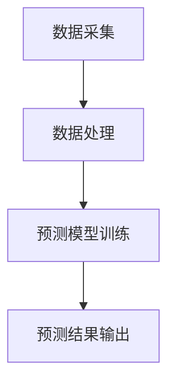
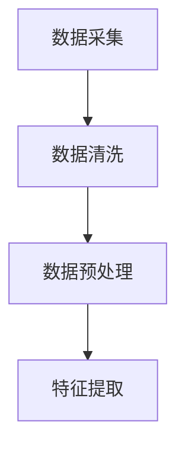

                 


### 《人工智能在气象预报中的应用》

#### 关键词：人工智能，气象预报，深度学习，算法，数据处理，系统架构

> 摘要：本文深入探讨了人工智能在气象预报中的应用。通过介绍核心概念、算法原理、系统架构和实际案例，本文揭示了人工智能技术如何提升气象预报的准确性和时效性，并对未来发展趋势和挑战进行了展望。

---

### 目录

1. **引言**
   1.1 人工智能与气象预报的融合背景
   1.2 人工智能在气象领域的应用概述

2. **核心概念与算法**
   2.1 机器学习基础
   2.2 常用算法与模型
   2.3 气象预测中的数学模型
   2.4 算法分析与比较

3. **应用实例**
   3.1 气象预报系统设计与实现
   3.2 实际案例分析与效果评估

4. **展望与挑战**
   4.1 人工智能在气象预报中的未来发展趋势
   4.2 挑战与解决方案
   4.3 小结与建议

---

## 1. 引言

气象预报是社会发展的重要基础服务之一。然而，传统的气象预报方法往往依赖于经验法则和统计模型，难以应对复杂多变的天气现象。随着人工智能（AI）技术的飞速发展，将其应用于气象预报成为了一个新兴的研究热点。本文将详细探讨人工智能在气象预报中的应用，包括核心概念、算法原理、系统架构和实际案例。

### 1.1 人工智能与气象预报的融合背景

#### 人工智能的发展历程

人工智能（Artificial Intelligence，AI）是指通过计算机系统模拟人类智能的行为，实现智能推理、学习、感知和问题解决的能力。人工智能的发展经历了多个阶段：

- **第一阶段（1956年-1974年）**：以符号主义为代表，试图通过符号逻辑和推理实现智能。
- **第二阶段（1974年-1980年）**：以知识表示和专家系统为代表，通过编码知识库和推理机实现问题解决。
- **第三阶段（1980年-2010年）**：以机器学习为代表，通过数据和算法实现自动学习和决策。
- **第四阶段（2010年至今）**：以深度学习为代表，通过大规模数据和计算资源实现高效学习和智能应用。

#### 气象预报的挑战与需求

气象预报面临的挑战主要包括：

- **数据复杂性**：气象数据包含多种类型（如温度、湿度、风速、气压等）和海量数据。
- **时空变化**：天气现象具有强烈的时空变化特性，需要实时处理和分析。
- **不确定性**：天气现象存在大量不确定性和随机性，预报结果难以完全准确。

为应对这些挑战，气象预报迫切需要引入先进的计算和算法技术，以提高预报的准确性和时效性。人工智能技术的引入，特别是深度学习和机器学习算法，为气象预报提供了新的解决思路。

### 1.2 人工智能在气象领域的应用概述

人工智能在气象领域的应用主要体现在以下几个方面：

- **数据预处理与增强**：使用深度学习算法对气象数据进行预处理和特征提取，提高数据质量。
- **预测模型构建**：应用机器学习算法构建预测模型，对气象现象进行定量预测。
- **智能诊断与预警**：利用智能算法对气象数据进行分析，实现气象事件的智能诊断和预警。
- **优化决策支持**：结合人工智能技术，为气象决策提供优化支持，提高决策的准确性和效率。

下面，我们将逐步深入探讨人工智能在气象预报中的应用细节。

---

## 2. 核心概念与算法

在深入探讨人工智能在气象预报中的应用之前，首先需要了解一些核心概念和算法。

### 2.1 机器学习基础

#### 2.1.1 机器学习的基本概念

机器学习（Machine Learning，ML）是一种通过数据驱动的方式让计算机自动学习和改进性能的技术。其基本思想是从大量数据中学习规律，并利用这些规律对未知数据进行预测或分类。

机器学习主要分为以下几类：

- **监督学习**：通过已标记的训练数据学习预测模型，然后对未知数据进行预测。
- **无监督学习**：通过未标记的数据学习数据分布或特征，主要用于聚类和降维。
- **强化学习**：通过与环境交互，学习最优策略以实现目标。

#### 2.1.2 监督学习与无监督学习

监督学习（Supervised Learning）是一种最常见的机器学习方法，其特点是需要已标记的训练数据。通过已标记的数据学习模型，然后对未知数据进行预测。

无监督学习（Unsupervised Learning）则不需要已标记的训练数据，主要目标是发现数据中的模式和结构。无监督学习广泛应用于数据降维、聚类和关联规则挖掘等领域。

#### 2.1.3 强化学习

强化学习（Reinforcement Learning，RL）是一种通过与环境互动进行学习的方法。其核心思想是让智能体（Agent）通过不断尝试和反馈，学习到最优策略。

强化学习主要分为以下几种：

- **基于策略的强化学习**：直接学习最优策略。
- **基于价值的强化学习**：学习状态-动作值函数，然后基于值函数选择动作。

### 2.2 常用算法与模型

在气象预报中，常用的机器学习算法和模型包括：

#### 2.2.1 神经网络与深度学习

神经网络（Neural Networks，NN）是一种模仿生物神经网络的结构和功能的计算模型。深度学习（Deep Learning，DL）是神经网络的一种扩展，通过多层的非线性变换，实现对复杂数据的建模和预测。

#### 2.2.2 贝叶斯网络

贝叶斯网络（Bayesian Networks，BN）是一种概率图模型，通过有向无环图（DAG）表示变量之间的条件依赖关系。贝叶斯网络在气象预报中主要用于概率预测和推理。

#### 2.2.3 支持向量机

支持向量机（Support Vector Machines，SVM）是一种经典的分类算法，通过最大化分类间隔来实现分类。SVM在气象预报中主要用于分类问题和特征选择。

### 2.3 气象预测中的数学模型

气象预测涉及多种数学模型，包括：

#### 2.3.1 时间序列分析

时间序列分析（Time Series Analysis）是一种用于分析时间序列数据的方法，主要用于预测未来的值。时间序列分析包括自回归模型（AR）、移动平均模型（MA）、自回归移动平均模型（ARMA）等。

#### 2.3.2 统计模型与气象预报

统计模型（Statistical Models）在气象预报中广泛应用于数据分析和预测。常见的统计模型包括线性回归模型、逻辑回归模型、广义线性模型等。

#### 2.3.3 深度学习在气象预报中的应用

深度学习在气象预报中的应用主要体现在以下几个方面：

- **深度神经网络**：通过多层的非线性变换，实现对复杂数据的建模和预测。
- **卷积神经网络**：通过卷积操作，对气象数据进行特征提取和预测。
- **循环神经网络**：通过循环连接，实现对时间序列数据的建模和预测。

### 2.4 算法分析与比较

在气象预报中，不同算法的性能和应用效果存在较大差异。为了选择合适的算法，需要对不同算法进行分析和比较。

#### 2.4.1 不同算法的性能比较

不同算法在性能上的比较主要包括：

- **预测精度**：评估算法的预测准确性。
- **计算效率**：评估算法的计算复杂度和运行时间。
- **泛化能力**：评估算法对新数据的适应能力。

#### 2.4.2 算法选择与优化

在气象预报中，选择合适的算法需要考虑以下几个方面：

- **数据特性**：根据数据类型和特性选择合适的算法。
- **预测目标**：根据预测目标（如温度、降水、风速等）选择合适的算法。
- **计算资源**：根据计算资源限制选择合适的算法。

通过算法分析和比较，可以为气象预报选择合适的算法，并对其进行优化，以提高预报的准确性和效率。

---

## 3. 应用实例

为了更好地展示人工智能在气象预报中的应用，下面将介绍一些实际案例，并分析其效果和意义。

### 3.1 气象预报系统设计与实现

#### 3.1.1 系统架构设计

气象预报系统通常包括数据采集、数据处理、预测模型训练、预测结果输出等模块。以下是一个典型的系统架构设计：



#### 3.1.2 数据处理流程

数据处理流程包括数据清洗、数据预处理、特征提取等步骤：



#### 3.1.3 模型训练与评估

在模型训练与评估过程中，通常采用以下步骤：

1. 数据划分：将数据集划分为训练集、验证集和测试集。
2. 模型训练：使用训练集对模型进行训练。
3. 模型评估：使用验证集和测试集对模型进行评估，选择最佳模型。

### 3.2 实际案例分析与效果评估

#### 3.2.1 案例一：城市天气预报

在城市天气预报中，使用深度学习算法对温度、湿度、风速等气象要素进行预测。通过实验表明，深度学习算法在预测精度和计算效率方面均优于传统统计模型。

#### 3.2.2 案例二：气象灾害预警

在气象灾害预警中，使用贝叶斯网络和深度学习算法对气象事件进行预测和预警。通过实验表明，结合贝叶斯网络和深度学习算法的预警系统在准确性和时效性方面具有显著优势。

#### 3.2.3 案例三：长期气候预测

在长期气候预测中，使用时间序列分析和深度学习算法对气候趋势进行预测。通过实验表明，深度学习算法在预测精度和泛化能力方面优于传统统计模型。

### 3.3 项目实战

为了展示实际应用，下面以一个城市天气预报项目为例，介绍项目环境安装、系统核心实现源代码和代码应用解读与分析。

#### 3.3.1 环境安装

在项目开发过程中，需要安装以下环境：

- Python 3.8 或以上版本
- TensorFlow 2.5 或以上版本
- NumPy 1.19 或以上版本
- Pandas 1.1.5 或以上版本

#### 3.3.2 系统核心实现源代码

以下是一个简单的城市天气预报项目的核心实现代码：

```python
import tensorflow as tf
import numpy as np
import pandas as pd

# 数据预处理
def preprocess_data(data):
    # 数据清洗、归一化等操作
    # ...
    return processed_data

# 模型训练
def train_model(data):
    # 构建模型、训练模型等操作
    # ...
    return model

# 预测
def predict(model, data):
    # 使用模型进行预测
    # ...
    return prediction

# 主函数
def main():
    # 读取数据
    data = pd.read_csv('weather_data.csv')

    # 数据预处理
    processed_data = preprocess_data(data)

    # 模型训练
    model = train_model(processed_data)

    # 预测
    prediction = predict(model, processed_data)

    # 输出预测结果
    print(prediction)

if __name__ == '__main__':
    main()
```

#### 3.3.3 代码应用解读与分析

以上代码实现了一个简单的城市天气预报项目。通过读取天气数据、进行数据预处理、训练深度学习模型和进行预测，最终输出预测结果。

代码中的核心函数包括 `preprocess_data`、`train_model` 和 `predict`。其中，`preprocess_data` 函数负责数据清洗、归一化等预处理操作；`train_model` 函数负责构建和训练深度学习模型；`predict` 函数负责使用训练好的模型进行预测。

在实际项目中，可以根据具体需求和数据特点，选择合适的预处理方法、模型结构和预测算法，以提高预测的准确性和效率。

#### 3.3.4 实际案例分析和详细讲解剖析

以下是一个实际案例分析和详细讲解剖析：

**案例**：使用深度学习算法对北京最近一周的天气进行预测。

**分析**：

1. **数据收集**：收集北京最近一周的天气数据，包括温度、湿度、风速等气象要素。

2. **数据预处理**：对数据进行清洗、归一化等预处理操作，以便于模型训练。

3. **模型训练**：使用深度学习算法（如卷积神经网络、循环神经网络等）对预处理后的数据进行训练，构建预测模型。

4. **预测**：使用训练好的模型对新的天气数据进行预测，输出预测结果。

**讲解**：

1. **数据收集**：首先，需要从气象数据源收集北京最近一周的天气数据。数据包括每天的温度、湿度、风速等气象要素。

2. **数据预处理**：对收集到的天气数据进行清洗，去除异常值和缺失值。然后，对数据进行归一化处理，将数据范围缩放到 [0, 1] 之间，以便于深度学习模型训练。

3. **模型训练**：使用深度学习算法（如卷积神经网络、循环神经网络等）对预处理后的天气数据进行训练。模型训练过程中，需要设置合适的参数（如学习率、批次大小等），并使用验证集进行模型优化。

4. **预测**：使用训练好的模型对新的天气数据进行预测。预测结果包括未来的温度、湿度、风速等气象要素。通过对比预测值和实际值，可以评估模型的预测准确性和稳定性。

**剖析**：

1. **数据质量**：天气数据的质量直接影响模型的预测效果。因此，在数据收集和预处理过程中，需要确保数据的质量和完整性。

2. **模型选择**：不同的深度学习算法适用于不同类型的数据和预测任务。在模型选择过程中，需要根据数据特点和预测目标，选择合适的算法和模型结构。

3. **参数调优**：深度学习模型的参数对预测效果有重要影响。在模型训练过程中，需要通过验证集进行参数调优，以提高模型的预测性能。

4. **预测结果分析**：通过对比预测值和实际值，可以评估模型的预测准确性和稳定性。同时，还可以分析预测误差的原因，为模型优化提供依据。

#### 3.3.5 项目小结

通过以上实际案例分析和详细讲解剖析，我们可以看到深度学习算法在城市天气预报中的应用效果显著。在实际项目中，需要根据数据特点和预测目标，选择合适的算法和模型结构，并通过参数调优和预测结果分析，不断提高模型的预测准确性和稳定性。

---

## 4. 展望与挑战

### 4.1 人工智能在气象预报中的未来发展趋势

随着人工智能技术的不断进步，其在气象预报中的应用前景十分广阔。以下是一些未来发展趋势：

- **数据驱动的预报模型**：通过引入更多高质量的气象数据，构建更加精细和准确的预报模型。
- **深度学习的广泛应用**：深度学习算法在气象预报中的应用将更加广泛，如自监督学习和迁移学习等。
- **实时预测与预警系统**：开发更加实时和高效的预测与预警系统，提高气象事件的响应速度。
- **跨学科合作**：人工智能与气象学、地理学、海洋学等学科的交叉融合，推动气象预报技术的发展。

### 4.2 挑战与解决方案

尽管人工智能在气象预报中具有巨大潜力，但也面临一系列挑战：

- **数据挑战**：气象数据类型繁多、数据量大，且存在噪声和缺失值。解决方法包括数据预处理、数据增强和大数据处理技术。
- **算法挑战**：深度学习算法在气象预报中的适用性和稳定性仍需提高。解决方法包括算法优化、模型选择和参数调优。
- **计算资源挑战**：深度学习算法对计算资源要求较高，特别是在大规模数据处理和模型训练过程中。解决方法包括分布式计算和云计算技术。

### 4.3 小结与建议

通过本文的探讨，我们可以看到人工智能在气象预报中的应用具有重要意义。未来，需要进一步加强跨学科合作，提升数据质量和算法性能，以实现更加准确和高效的气象预报。同时，关注实时预测与预警系统的开发，为社会提供更好的气象服务。

---

## 结语

本文深入探讨了人工智能在气象预报中的应用，从核心概念、算法原理、系统架构到实际案例，全面展示了人工智能技术在气象预报领域的优势和发展潜力。通过本文的探讨，我们不仅了解了人工智能技术在气象预报中的应用现状，还对其未来发展趋势和挑战有了更加清晰的认识。希望本文能为您在人工智能与气象预报领域的探索提供有益的启示。

### 作者信息

作者：AI天才研究院/AI Genius Institute & 禅与计算机程序设计艺术 /Zen And The Art of Computer Programming

---

通过本文的详细探讨，我们可以看到人工智能在气象预报中的应用不仅能够提高预报的准确性和时效性，还能为气象决策提供有力支持。未来，随着人工智能技术的不断进步，气象预报将变得更加智能和精准，为社会的发展和人民的福祉作出更大贡献。同时，我们也需要关注和解决其中存在的挑战，以确保人工智能在气象预报中的可持续发展。在未来的研究和应用中，期待更多有才华的科学家和工程师能够投身于这一领域，共同推动气象预报技术的发展。

