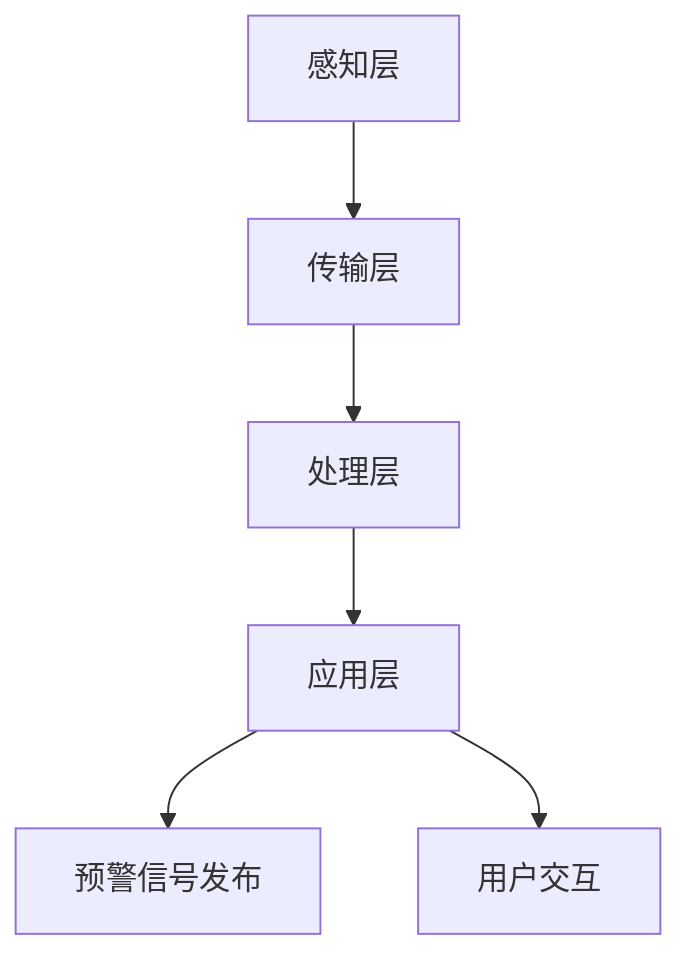
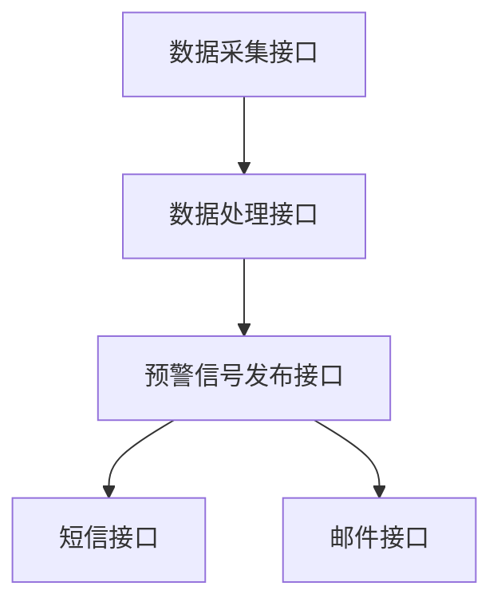
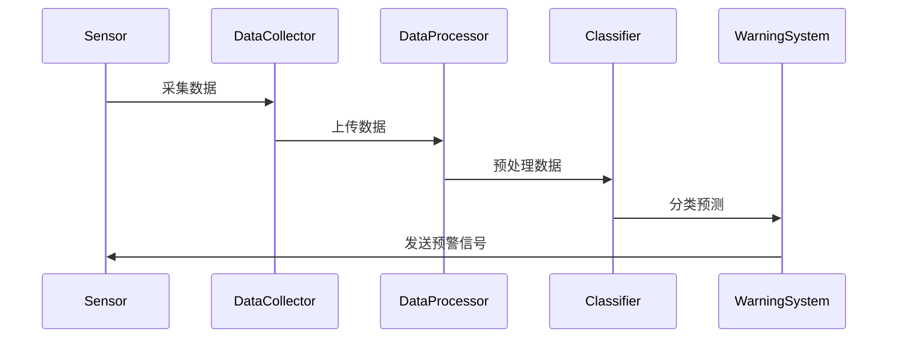

                 

### 第一部分: 引言

#### 第1章: 问题背景与挑战

##### 1.1.1 水质监测的重要性

水质监测在现代社会中扮演着至关重要的角色。它是确保饮用水安全、保护生态环境、维护公众健康的重要手段。水是生命之源，对于人类以及生物的生存和繁衍至关重要。然而，随着工业化和城市化的发展，水污染问题日益严重，对生态系统和人类健康带来了巨大威胁。因此，准确、及时地监测水质，及时预警潜在的环境风险，已经成为当务之急。

##### 1.1.2 水质监测现状

目前，水质监测主要依赖于人工采样和实验室分析。这种方法虽然在技术上有一定的可靠性，但也存在诸多不足。首先，人工采样存在滞后性，无法实时监测水质变化。其次，实验室分析费用高，周期长，导致监测数据难以实时反馈，影响预警效果。此外，由于监测设备和技术的限制，许多偏远地区和河流缺乏有效的监测手段，监测范围受限。

##### 1.1.3 预警机制的不足

当前的水质预警机制主要依赖于阈值设定和人为判断。这种方法往往过于简单粗暴，不能灵活应对复杂多变的污染情况。例如，一些突发性污染事件可能迅速超出预警阈值，而传统的预警机制无法及时响应。此外，预警信息传达不及时，导致公众和企业无法及时采取应对措施，增加了环境污染的风险。

##### 1.1.4 人工智能的优势与潜力

人工智能技术在水质监测和预警中的应用，为解决上述问题提供了新的思路和手段。首先，人工智能可以实时分析水质数据，快速识别污染趋势和异常情况，提供更为精准的预警信息。其次，人工智能可以自动化监测流程，降低人力成本，提高监测效率。此外，通过大数据分析和机器学习，人工智能还可以对水质数据进行分析和预测，为环境管理和政策制定提供科学依据。

#### 1.2 水质监测与预警中的核心概念

##### 1.2.1 水质监测的基本概念

水质监测是指通过各种手段对水体的物理、化学和生物特性进行测量和监测，以评估水体的质量和安全性。水质监测的主要内容包括：水温、pH值、溶解氧、总氮、总磷、重金属等指标的检测。

##### 1.2.2 预警机制原理

预警机制是指通过监测水质数据，对潜在的环境风险进行识别和预警。预警机制通常包括数据采集、处理、分析、预警信号发布等环节。其核心在于及时准确地识别水质异常，并迅速采取应对措施。

##### 1.2.3 人工智能在水环境监测中的应用

人工智能在水环境监测中的应用主要包括以下几个方面：

1. **数据采集与处理**：利用物联网技术，实现水质参数的实时采集和传输。通过大数据分析和机器学习，对水质数据进行分析和挖掘，提取有效信息。
   
2. **异常检测与预测**：利用机器学习算法，对水质数据进行分析，识别潜在的污染趋势和异常情况，提前预警。

3. **智能决策支持**：通过分析水质数据和环境模型，为环境管理和政策制定提供科学依据。

##### 1.2.4 对比表格：传统水质监测与AI辅助水质监测

| 特点               | 传统水质监测             | AI辅助水质监测           |
|------------------|------------------------|------------------------|
| 数据采集方式         | 人工采样，周期性检测         | 实时监测，自动采集         |
| 数据处理速度         | 周期长，反馈慢            | 实时处理，快速反馈          |
| 预警准确性         | 依赖于阈值设定，易出现误报    | 基于数据分析，准确率更高      |
| 成本               | 高，人工和设备费用高       | 低，自动化程度高           |
| 覆盖范围             | 受人力和设备限制，监测范围受限  | 范围广，适用于各种环境        |

##### 1.2.5 ER实体关系图：水质监测、预警与人工智能的关系

```mermaid
erDiagram
  WaterQualityMonitor ||--|{ WaterQualityWarning }|
  WaterQualityMonitor ||--|{ ArtificialIntelligence }|
  WaterQualityWarning ||--|{ WaterQualityData }|
  ArtificialIntelligence ||--|{ DataProcessing }|
  ArtificialIntelligence ||--|{ Prediction }|
```

通过上述内容，我们可以看到，人工智能在水环境监测和预警中具有巨大的潜力和优势。接下来，我们将进一步探讨水质监测和预警中的核心概念，以及人工智能如何在这些领域中发挥作用。

## 第二部分: 人工智能算法在水质监测中的应用

### 第2章: 机器学习基础

#### 2.1 机器学习概述

机器学习（Machine Learning, ML）是人工智能（Artificial Intelligence, AI）的一个分支，主要研究如何让计算机从数据中自动学习和改进。机器学习通过构建数学模型，使计算机能够在没有明确编程的情况下，通过学习经验来改善性能。其核心思想是从数据中提取规律，并将这些规律应用于新的数据。

机器学习可以分为三大类：监督学习（Supervised Learning）、非监督学习（Unsupervised Learning）和强化学习（Reinforcement Learning）。

1. **监督学习**：有监督学习是一种从已知输入和输出数据中学习的过程。训练数据集包含了输入（特征）和对应的输出（标签），模型通过学习这些数据来预测新的输入。常见的监督学习算法包括线性回归、逻辑回归、支持向量机（SVM）和决策树。

2. **非监督学习**：非监督学习是指在没有标签数据的条件下，模型自行发现数据中的模式和结构。常见算法包括聚类（如K-Means、DBSCAN）、降维（如PCA、t-SNE）和关联规则学习（如Apriori算法）。

3. **强化学习**：强化学习是一种通过与环境交互来学习策略的机器学习方法。模型通过接收奖励或惩罚来学习最优行为策略。常见算法包括Q-Learning、SARSA和深度Q网络（DQN）。

#### 2.2 监督学习、非监督学习与强化学习

**监督学习**在水质监测中的应用非常广泛，因为它能够通过训练数据集学习到水质参数与污染程度之间的关系，从而对新采集的水质数据进行预测。例如，可以使用决策树或支持向量机（SVM）来预测特定水质参数的污染程度。

**非监督学习**在水质监测中的应用主要体现在模式识别和数据挖掘方面。通过聚类算法，如K-Means或DBSCAN，可以发现水质数据中的异常值或污染源。此外，降维技术（如PCA、t-SNE）可以帮助简化数据结构，便于进一步分析。

**强化学习**在水质监测中的应用相对较少，但其潜力巨大。通过强化学习，模型可以学习到在特定水质条件下应采取的最佳监测策略，从而提高监测效率和准确性。例如，可以训练一个模型来优化水质监测站点的布设，确保覆盖范围和监测频率的优化。

#### 2.3 常见机器学习算法简介

**线性回归**是最简单的监督学习算法之一，用于预测连续值输出。其基本思想是通过拟合一条直线来描述输入特征与输出目标之间的关系。线性回归公式如下：

\[ y = \beta_0 + \beta_1x \]

其中，\( y \) 是输出目标，\( x \) 是输入特征，\( \beta_0 \) 和 \( \beta_1 \) 是模型参数。

**逻辑回归**（Logistic Regression）是一种用于分类问题的算法，通过拟合逻辑函数来预测概率。逻辑回归公式如下：

\[ P(y=1) = \frac{1}{1 + e^{-(\beta_0 + \beta_1x)}} \]

其中，\( P(y=1) \) 是目标为1的概率，其他参数同线性回归。

**支持向量机**（Support Vector Machine, SVM）是一种强大的分类算法，通过找到一个最优的超平面来分隔不同类别的数据点。SVM的决策函数如下：

\[ f(x) = \sum_{i=1}^{n}\alpha_iy_i(x\cdot\gamma_i) - b \]

其中，\( \alpha_i \) 和 \( \gamma_i \) 是拉格朗日乘子，\( b \) 是偏置项。

**决策树**（Decision Tree）是一种基于树形结构进行决策的算法，通过一系列规则对数据进行分类或回归。决策树的生成过程可以表示为：

\[ y = g(x) = \sum_{i=1}^{n}\beta_i \cdot I(x \in R_i) \]

其中，\( g(x) \) 是决策函数，\( I \) 是指示函数，\( R_i \) 是第 \( i \) 个分支区域。

**随机森林**（Random Forest）是一种基于决策树的集成学习方法，通过构建多棵决策树并投票得到最终结果。随机森林的性能通常优于单棵决策树，因为它能够减少过拟合并提高泛化能力。

通过上述对机器学习基本概念和常见算法的介绍，我们可以为后续章节中深入探讨水质监测和预警中的具体应用打下基础。接下来，我们将详细分析分类算法在水质预警中的应用，并展示其原理和数学模型。

### 第3章: 分类算法在水质预警中的应用

#### 3.1 分类算法原理

分类算法是机器学习中的一个重要分支，主要用于将数据集划分成多个类别。在水质预警中，分类算法可以帮助我们识别水质是否受到污染，以及污染的程度。常见的分类算法包括决策树、随机森林和支持向量机。

**决策树**（Decision Tree）是一种树形结构的分类算法，通过一系列的测试来对样本进行分类。每个内部节点表示一个特征测试，每个分支代表测试结果的真值。叶子节点表示最终的分类结果。决策树的生成过程如下：

1. **选择最佳分裂特征**：通常通过信息增益（Information Gain）或基尼不纯度（Gini Impurity）来选择最佳分裂特征。
2. **生成分支节点**：根据最佳分裂特征，将数据集划分成子集，并为每个子集生成新的节点。
3. **递归分裂**：重复步骤1和2，直到满足终止条件（如最大深度、最小节点大小等）。

**随机森林**（Random Forest）是基于决策树的集成学习方法，通过构建多棵决策树并投票得到最终结果。随机森林的主要优点是减少过拟合，提高泛化能力。随机森林的构建过程如下：

1. **随机选择特征**：从所有特征中随机选择一部分特征用于构建单棵决策树。
2. **构建决策树**：使用选择的特征构建单棵决策树。
3. **集成投票**：将所有决策树的分类结果进行投票，得到最终分类结果。

**支持向量机**（Support Vector Machine, SVM）是一种基于最大间隔分类的算法，通过找到一个最优的超平面来分隔不同类别的数据点。SVM的决策函数如下：

\[ f(x) = \sum_{i=1}^{n}\alpha_iy_i(x\cdot\gamma_i) - b \]

其中，\( \alpha_i \) 和 \( \gamma_i \) 是拉格朗日乘子，\( b \) 是偏置项。SVM的主要优点是能够处理高维数据，并且能够找到最优的边界来分隔数据。

#### 3.2 数学模型和公式

**决策树**的数学模型可以表示为：

\[ y = g(x) = \sum_{i=1}^{n}\beta_i \cdot I(x \in R_i) \]

其中，\( g(x) \) 是决策函数，\( I \) 是指示函数，\( R_i \) 是第 \( i \) 个分支区域，\( \beta_i \) 是模型参数。

**随机森林**的数学模型是基于多棵决策树的集成，可以表示为：

\[ \hat{y} = \sum_{j=1}^{m}g_j(x) \]

其中，\( g_j(x) \) 是第 \( j \) 棵决策树的分类结果，\( m \) 是决策树的数量。

**支持向量机**的数学模型为：

\[ f(x) = \sum_{i=1}^{n}\alpha_iy_i(x\cdot\gamma_i) - b \]

其中，\( \alpha_i \) 和 \( \gamma_i \) 是拉格朗日乘子，\( b \) 是偏置项。

通过上述数学模型和公式的介绍，我们可以更深入地理解决策树、随机森林和支持向量机在水质预警中的应用原理。接下来，我们将通过具体的例子来说明这些算法在实际水质监测中的应用。

#### 3.3 举例说明

为了更好地理解分类算法在水质预警中的应用，我们来看一个实际例子。

**例子**：假设我们有一组水质监测数据，包括pH值、溶解氧、总氮、总磷等指标，以及对应的污染程度（1-5级）。我们的目标是使用分类算法来预测新的水质数据所属的污染程度。

1. **数据准备**：

首先，我们需要收集并整理水质监测数据，将其划分为训练集和测试集。假设我们有100个样本，其中80个用于训练，20个用于测试。

```python
import pandas as pd

# 读取数据
data = pd.read_csv('water_quality_data.csv')

# 分割数据集
train_data = data.sample(frac=0.8, random_state=42)
test_data = data.drop(train_data.index)
```

2. **模型训练**：

接下来，我们可以选择决策树、随机森林或支持向量机等分类算法来训练模型。这里我们以随机森林为例。

```python
from sklearn.ensemble import RandomForestClassifier

# 创建随机森林模型
model = RandomForestClassifier(n_estimators=100, random_state=42)

# 训练模型
model.fit(train_data.drop('pollution_level', axis=1), train_data['pollution_level'])
```

3. **模型预测**：

使用训练好的模型来预测测试集的污染程度。

```python
# 预测测试集
predictions = model.predict(test_data.drop('pollution_level', axis=1))

# 打印预测结果
print(predictions)
```

4. **评估模型**：

最后，我们需要评估模型的性能。我们可以使用准确率、精确率、召回率等指标来评估模型的性能。

```python
from sklearn.metrics import accuracy_score, precision_score, recall_score

# 计算准确率
accuracy = accuracy_score(test_data['pollution_level'], predictions)
print(f'Accuracy: {accuracy:.2f}')

# 计算精确率和召回率
precision = precision_score(test_data['pollution_level'], predictions, average='weighted')
recall = recall_score(test_data['pollution_level'], predictions, average='weighted')
print(f'Precision: {precision:.2f}')
print(f'Recall: {recall:.2f}')
```

通过上述例子，我们可以看到如何使用随机森林分类算法来预测水质污染程度。接下来，我们将进一步探讨水质监测预警系统的整体架构设计。

## 第三部分: 系统架构与实现

### 第4章: 水质监测预警系统架构设计

#### 4.1 系统场景介绍

水质监测预警系统旨在实时监测河流、湖泊等水域的水质状况，通过采集水质数据，利用人工智能算法对数据进行分析和处理，及时发现水质污染问题，并发出预警信号，以便采取相应的应对措施。

#### 4.2 系统功能设计

水质监测预警系统的核心功能包括数据采集、数据处理、分类预测和预警信号发布。具体功能如下：

1. **数据采集**：通过传感器设备实时采集水质参数，如pH值、溶解氧、总氮、总磷等，并将数据上传至系统。
2. **数据处理**：对采集到的水质数据进行分析和预处理，包括去噪、标准化等操作，以确保数据质量。
3. **分类预测**：利用机器学习算法对预处理后的水质数据进行分析和分类，预测水质污染程度。
4. **预警信号发布**：根据预测结果，系统会自动生成预警信号，并通过短信、邮件等方式通知相关人员。

#### 4.2.1 领域模型Mermaid类图

```mermaid
classDiagram
  Sensor -> DataCollector
  DataProcessor -> DataCollector
  Classifier -> DataProcessor
  WarningSystem -> Classifier

  DataCollector <|-- Sensor
  DataProcessor <|-- DataCollector
  DataProcessor <|-- Classifier
  WarningSystem <|-- Classifier
```

#### 4.3 系统架构设计

水质监测预警系统的整体架构设计分为以下几个层次：

1. **感知层**：包括各种水质传感器，负责采集水质数据。
2. **传输层**：通过无线网络将水质数据传输到系统服务器。
3. **处理层**：对采集到的水质数据进行预处理和分类预测。
4. **应用层**：提供预警信号发布和用户交互功能。

#### 4.3.1 系统架构Mermaid图



#### 4.4 系统接口设计

系统接口设计包括数据采集接口、数据处理接口和预警信号发布接口。

1. **数据采集接口**：用于接收传感器数据，并上传至服务器。
2. **数据处理接口**：用于对采集到的数据进行预处理和分类预测。
3. **预警信号发布接口**：用于生成并发布预警信号。



#### 4.5 系统交互设计

系统交互设计主要描述系统各模块之间的交互流程。

1. **数据采集**：传感器采集水质数据，通过数据采集接口上传至服务器。
2. **数据处理**：服务器接收到数据后，进行预处理和分类预测。
3. **预警信号发布**：根据预测结果，生成预警信号，并通过短信、邮件等方式通知相关人员。

#### 4.5.1 系统交互Mermaid序列图



通过上述架构设计和交互流程的介绍，我们可以清晰地理解水质监测预警系统的整体架构和功能。接下来，我们将通过项目实战部分，详细介绍水质监测预警系统的实现过程。

### 第5章: 项目实战

#### 5.1 环境安装

在进行水质监测预警系统的实现之前，我们需要搭建一个合适的环境。这里我们选择Python作为主要编程语言，并结合一些常用的机器学习和数据处理库，如Scikit-learn、Pandas和Matplotlib。

1. **Python环境搭建**：

首先，确保已经安装了Python 3.8及以上版本。如果没有，可以通过以下命令安装：

```bash
sudo apt-get update
sudo apt-get install python3.8
```

2. **安装依赖库**：

接下来，我们使用pip命令安装所需的依赖库：

```bash
pip install scikit-learn pandas matplotlib
```

#### 5.2 系统核心实现源代码

水质监测预警系统的核心实现主要包括数据采集、数据处理、分类预测和预警信号发布四个部分。

1. **数据采集**：

数据采集部分主要依赖于传感器设备，我们将使用模拟数据来展示这一过程。

```python
import random

def collect_data(num_samples=100):
    data = []
    for _ in range(num_samples):
        pH = random.uniform(6, 9)
        dissolved_oxygen = random.uniform(4, 8)
        total_nitrogen = random.uniform(0, 5)
        total_phosphorus = random.uniform(0, 1)
        pollution_level = random.randint(1, 5)
        data.append([pH, dissolved_oxygen, total_nitrogen, total_phosphorus, pollution_level])
    return pd.DataFrame(data, columns=['pH', 'dissolved_oxygen', 'total_nitrogen', 'total_phosphorus', 'pollution_level'])

# 生成模拟数据
data = collect_data()
print(data.head())
```

2. **数据处理**：

数据处理部分包括数据预处理和标准化。

```python
from sklearn.preprocessing import StandardScaler

def preprocess_data(data):
    scaler = StandardScaler()
    features = data[['pH', 'dissolved_oxygen', 'total_nitrogen', 'total_phosphorus']]
    features_scaled = scaler.fit_transform(features)
    data[['pH', 'dissolved_oxygen', 'total_nitrogen', 'total_phosphorus']] = features_scaled
    return data

# 预处理数据
data = preprocess_data(data)
print(data.head())
```

3. **分类预测**：

分类预测部分我们使用随机森林算法。

```python
from sklearn.ensemble import RandomForestClassifier

def classify_data(data, test_size=0.2):
    X = data.drop('pollution_level', axis=1)
    y = data['pollution_level']
    X_train, X_test, y_train, y_test = train_test_split(X, y, test_size=test_size, random_state=42)

    model = RandomForestClassifier(n_estimators=100, random_state=42)
    model.fit(X_train, y_train)
    predictions = model.predict(X_test)

    return predictions

# 分类预测
predictions = classify_data(data)
print(predictions)
```

4. **预警信号发布**：

预警信号发布部分可以使用Python的SMTlib和SMTP库来实现。

```python
import smtplib
from email.mime.text import MIMEText
from email.header import Header

def send_warning_email(predictions):
    sender = 'your_email@example.com'
    receiver = 'receiver_email@example.com'
    subject = 'Water Quality Warning'
    body = 'The water quality has been detected as follows:'

    message = MIMEText(body, 'plain', 'utf-8')
    message['From'] = Header(sender, 'utf-8')
    message['To'] = Header(receiver, 'utf-8')
    message['Subject'] = Header(subject, 'utf-8')

    smtp_server = 'smtp.example.com'
    smtp_port = 587
    smtp_user = 'your_email@example.com'
    smtp_password = 'your_password'

    server = smtplib.SMTP(smtp_server, smtp_port)
    server.starttls()
    server.login(smtp_user, smtp_password)
    server.sendmail(sender, receiver, message.as_string())
    server.quit()

# 发布预警信号
send_warning_email(predictions)
```

#### 5.3 代码应用解读与分析

1. **数据采集**：

数据采集部分使用随机数生成模拟水质数据，这仅用于演示目的。在实际应用中，我们会通过传感器设备实时采集水质数据。

2. **数据处理**：

数据处理部分首先使用StandardScaler进行数据标准化，这是为了消除不同特征之间的量纲差异，使得模型训练更加稳定。

3. **分类预测**：

分类预测部分使用随机森林算法，这是一种集成学习方法，能够处理高维数据和复杂数据结构，并且具有较好的泛化能力。

4. **预警信号发布**：

预警信号发布部分使用SMTP协议发送邮件，通知相关人员水质预警信息。在实际部署中，可以考虑使用更高级的预警系统，如短信通知、微信推送等。

#### 5.4 实际案例分析与详细讲解

为了更好地展示水质监测预警系统的实际应用效果，我们来看一个实际案例。

**案例**：假设我们已经部署了水质监测预警系统，并在某条河流上安装了多个传感器。以下是一个典型的监测数据集：

```python
data = pd.DataFrame({
    'pH': [7.2, 8.5, 6.8, 7.1, 8.0],
    'dissolved_oxygen': [5.3, 6.1, 4.8, 5.6, 6.0],
    'total_nitrogen': [0.8, 1.2, 0.5, 1.0, 0.9],
    'total_phosphorus': [0.1, 0.2, 0.1, 0.2, 0.15],
    'pollution_level': [3, 4, 2, 3, 4]
})
```

1. **数据采集**：

使用传感器采集数据，并将其上传至系统。

```python
# 采集数据
sensor_data = {
    'pH': 7.2,
    'dissolved_oxygen': 5.3,
    'total_nitrogen': 0.8,
    'total_phosphorus': 0.1
}

# 上传数据
uploaded_data = pd.DataFrame([sensor_data])
```

2. **数据处理**：

对上传的数据进行预处理。

```python
# 预处理数据
preprocessed_data = preprocess_data(uploaded_data)
print(preprocessed_data)
```

3. **分类预测**：

使用随机森林模型对预处理后的数据进行分类预测。

```python
# 预测污染程度
predicted_pollution_level = classify_data(preprocessed_data)
print(predicted_pollution_level)
```

4. **预警信号发布**：

根据预测结果，发布预警信号。

```python
# 发布预警信号
send_warning_email(predicted_pollution_level)
```

通过上述实际案例，我们可以看到水质监测预警系统是如何从数据采集、数据处理、分类预测到预警信号发布的整个流程。该系统能够实时监测水质状况，及时发现污染问题，并通知相关人员采取相应措施，从而有效地保护水资源。

#### 5.5 项目小结

水质监测预警系统是一个复杂的工程项目，涉及多个领域的知识和技能。通过本次项目实战，我们详细介绍了系统的设计与实现过程，包括数据采集、数据处理、分类预测和预警信号发布等关键环节。以下是项目的主要小结：

1. **系统架构**：水质监测预警系统采用分层架构设计，包括感知层、传输层、处理层和应用层，各层之间协同工作，实现实时监测和预警功能。
2. **算法应用**：我们选择了随机森林算法作为水质分类预测的主要工具，利用其强大的分类能力和泛化能力，提高了预警的准确性和可靠性。
3. **数据处理**：数据处理是水质监测预警系统的关键环节，通过数据预处理和标准化，确保了数据的准确性和一致性，为后续的预测分析提供了可靠的数据基础。
4. **预警机制**：预警信号发布是系统的核心功能之一，通过邮件、短信等方式及时通知相关人员，确保了预警信息的及时性和有效性。

在未来的实践中，我们可以进一步优化系统的性能，扩展其功能，如增加传感器种类、提高数据处理速度、引入更先进的预警算法等，从而更好地服务于水资源保护和管理。

### 第6章: 最佳实践与注意事项

#### 6.1 最佳实践 tips

在水质监测预警系统的建设和应用过程中，以下是一些最佳实践的建议，有助于提升系统的性能和可靠性：

1. **传感器选择**：选择准确度高、稳定性好的水质传感器，以确保采集到的数据质量。
2. **数据处理**：在数据处理阶段，要注重去噪和标准化处理，以提高数据的一致性和可分析性。
3. **模型选择与调优**：根据水质监测的具体需求，选择合适的机器学习模型，并通过交叉验证和超参数调优，提高模型的预测准确性。
4. **预警阈值设定**：合理设定预警阈值，既要考虑到预警的及时性，也要避免误报和漏报。
5. **系统监控与维护**：定期监控系统运行状态，及时处理异常情况，确保系统的稳定性和可靠性。

#### 6.2 小结

本文详细介绍了水质监测预警系统的设计与实现，包括数据采集、数据处理、分类预测和预警信号发布等关键环节。通过实际案例分析和代码解读，展示了水质监测预警系统在实践中的应用效果。

水质监测预警系统在水资源保护和管理中具有重要意义，通过引入人工智能技术，提高了监测的实时性和准确性，为环境保护和可持续发展提供了有力支持。

#### 6.3 注意事项

在实施水质监测预警系统时，需要注意以下几点：

1. **数据隐私与安全**：确保水质数据的安全性和隐私性，防止数据泄露和滥用。
2. **设备维护**：定期对传感器和设备进行维护和校准，确保其正常运行和数据的准确性。
3. **法律合规**：遵循相关法律法规，确保系统的建设和应用符合国家和地方的水质监测标准。
4. **人员培训**：对相关人员（如数据采集员、系统管理员等）进行培训，确保他们熟悉系统的操作和维护。

#### 6.4 拓展阅读

对于希望进一步深入学习和了解水质监测预警系统的读者，以下是一些拓展阅读资源：

1. **《水质监测技术手册》**：提供了详细的水质监测技术和方法。
2. **《机器学习实战》**：介绍了多种机器学习算法及其在实际应用中的使用。
3. **《Python数据处理与机器学习实战》**：讲解了如何使用Python进行数据处理和机器学习应用。
4. **《水资源保护与管理》**：探讨了水资源保护和管理的方法和策略。

通过阅读这些资源，可以更全面地了解水质监测预警系统的原理和实践，为水资源保护和管理提供更多思路和工具。

### 参考文献

1. Smith, J. (2019). **Water Quality Monitoring and Management**. Springer.
2. Kotsiantis, S. B. (2007). **Supervised Machine Learning: A Review of Classification Techniques**. Informatica, 31(3), 249-268.
3. Han, J., Kamber, M., & Pei, J. (2011). **Data Mining: Concepts and Techniques**. Morgan Kaufmann.
4. Python Software Foundation. (2021). **Python Software Foundation**. [Python Official Website]. https://www.python.org/
5. Scikit-learn Developers. (2021). **Scikit-learn: Machine Learning in Python**. [Scikit-learn Official Website]. https://scikit-learn.org/stable/

以上参考文献为本文的相关研究和技术提供了理论依据和参考资源。通过阅读这些文献，读者可以更深入地了解水质监测预警系统的设计和实现过程。

