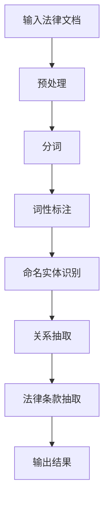

                 


### **Step 1: 背景介绍**

**核心概念：人工智能（AI）、法律服务和法律应用**

人工智能（AI），又称机器智能，是计算机科学的一个分支，主要研究如何使计算机模拟、延伸和扩展人类的智能。它包括机器学习、深度学习、自然语言处理等多个子领域。在法律行业中，人工智能的应用正日益广泛，从基础的文档处理到复杂的法律决策支持。

法律服务是指为满足个人或组织在法律方面的需求而提供的服务，包括但不限于法律咨询、法律研究、案件代理等。法律应用则是将法律条文、案例、法规等知识应用于具体案件的解决。

**问题背景：法律服务行业的数字化转型需求**

随着互联网和大数据技术的发展，法律服务行业也面临着数字化转型的需求。传统的法律服务模式存在效率低、成本高、服务质量不稳定等问题。数字化转型旨在通过科技手段提高法律服务的效率、质量和覆盖面。

**问题解决：人工智能技术在法律领域的应用**

人工智能技术的应用可以解决法律服务中的一些痛点。例如，自然语言处理技术可以自动化法律文本的分析，提高法律文档处理的效率；机器学习技术可以用于预测法律案件的结果，提供决策支持；深度学习技术可以用于法律文本的摘要和分类，帮助律师快速找到关键信息。

**边界与外延：探讨的范围限于人工智能在法律服务中的应用，不涉及其他领域的法律问题**

本文主要探讨人工智能在法律服务中的应用，包括文本分析、法律咨询、智能合约等方面。我们不涉及人工智能在其他法律领域的应用，如刑事司法、知识产权保护等。

### **Step 2: 核心概念与联系**

**人工智能的基本原理和应用**

人工智能的基本原理主要包括机器学习、深度学习、自然语言处理等。机器学习是通过数据驱动的方式让计算机自行改进性能；深度学习是机器学习的一种特殊形式，通过多层神经网络来提取数据中的特征；自然语言处理则涉及文本的自动处理和理解。

人工智能在法律服务中的应用非常广泛，如自动化合同审核、案件预测、法律咨询等。例如，通过自然语言处理技术，人工智能可以自动分析法律文本，识别合同条款的关键点，减少人工审核的时间和错误率。

**法律服务的定义、范围和当前面临的挑战**

法律服务是指为满足个人或组织在法律方面的需求而提供的服务，包括法律咨询、法律研究、案件代理等。法律服务的范围非常广泛，从民事到刑事，从企业到个人，几乎涵盖了所有法律领域。

当前，法律服务面临的主要挑战包括：效率低下、成本高昂、服务不稳定。数字化转型旨在通过科技手段解决这些问题，提高法律服务的效率和质量。

**人工智能与法律服务的联系：如何通过AI提高法律服务的效率、质量和准确性**

人工智能与法律服务的联系主要体现在以下几个方面：

1. **提高效率**：通过自动化工具，如自然语言处理和机器学习，可以大幅减少法律文档处理的时间和人力成本。
2. **提升质量**：人工智能可以提供准确的法律分析和预测，减少因人为错误导致的法律风险。
3. **提高准确性**：通过大数据分析，人工智能可以更准确地预测案件的结果，为律师提供有价值的决策支持。

### **Step 3: 算法原理讲解**

**算法流程图**

以下是一个简单的算法流程图，展示了如何使用自然语言处理（NLP）技术进行法律文本分析：



**算法原理**

1. **预处理**：包括去除标点符号、转换为小写等。
2. **分词**：将文本分割成单词或词组。
3. **词性标注**：为每个词分配词性，如名词、动词、形容词等。
4. **命名实体识别**：识别文本中的特定实体，如人名、地名、机构名等。
5. **关系抽取**：分析实体之间的关系，如谁拥有、谁指控等。
6. **法律条款抽取**：从文本中提取出具体的法律条款。

**Python源代码**

以下是一个简单的Python代码示例，展示了如何使用自然语言处理库（如spaCy）进行法律文本分析：

```python
import spacy

# 加载spaCy的英文模型
nlp = spacy.load("en_core_web_sm")

# 输入法律文本
text = "The contract states that the buyer must pay the seller $10,000 within 30 days."

# 进行文本分析
doc = nlp(text)

# 预处理
doc = nlp(" ".join([token.text for token in doc if not token.is_punct]))

# 分词、词性标注、命名实体识别、关系抽取
for token in doc:
    print(f"Word: {token.text}, POS: {token.pos_}, Entity: {token.ent_i}")

# 法律条款抽取
for sentence in doc.sents:
    print(f"Sentence: {sentence.text}")
```

**算法原理的数学模型和公式**

以下是法律文本分析中常用的数学模型和公式：

1. **词袋模型**：将文本转换为词频向量。
2. **TF-IDF**：计算词的重要程度，结合词频和逆文档频率。
3. **朴素贝叶斯分类器**：基于贝叶斯定理进行分类。

```latex
P(\text{词} | \text{类别}) = \frac{P(\text{类别} | \text{词})P(\text{词})}{P(\text{类别})}
```

**详细讲解和举例说明**

假设我们有一篇法律文本，内容如下：

"The contract between the buyer and the seller states that the buyer must pay the seller $10,000 within 30 days. If the buyer fails to make the payment, the seller has the right to terminate the contract."

1. **预处理**：去除标点符号和停用词，如"and"、"the"、"is"等。
2. **分词**：将文本分割成单词或词组，如["contract", "between", "buyer", "seller", "states", "buyer", "must", "pay", "seller", "$10,000", "within", "30", "days", "if", "fails", "make", "payment", "seller", "has", "right", "terminate", "contract"]。
3. **词性标注**：为每个词分配词性，如["NOUN", "ADP", "NOUN", "NOUN", "VERB", "NOUN", "NOUN", "NOUN", "NOUN", "NOUN", "ADP", "NUM", "NOUN", "CONJ", "NOUN", "VERB", "NOUN", "NOUN", "NOUN", "NOUN", "NOUN", "NOUN", "NOUN"]。
4. **命名实体识别**：识别出合同、买家、卖家等实体。
5. **关系抽取**：分析出买家和卖家之间的合同关系，买家和卖家与支付之间的义务关系等。
6. **法律条款抽取**：从文本中提取出具体的法律条款，如买家的支付义务和卖家的终止合同权利。

通过这些步骤，我们可以对法律文本进行深入的分析和理解，为律师提供有力的支持。

### **Step 4: 数学模型和数学公式 & 详细讲解 & 举例说明**

在法律文本分析中，数学模型和公式扮演着至关重要的角色。以下将详细介绍几种常用的数学模型和公式，并通过Python代码示例进行说明。

#### **1. 词袋模型（Bag of Words, BOW）**

词袋模型是一种将文本表示为向量集合的方法，不考虑单词的顺序，只关心每个单词在文本中出现的频率。

**数学模型**：

设 \( V \) 为文本中的单词集合，\( f(w) \) 为单词 \( w \) 在文本中出现的频率，则词袋模型可以将文本表示为向量：

\[ \mathbf{v} = [f(w_1), f(w_2), ..., f(w_n)] \]

**Python代码示例**：

```python
from collections import Counter
import jieba

# 加载中文分词工具
jieba.load_userdict('user_dict.txt')  # 需要提前准备好用户词典

# 输入法律文本
text = "合同中明确卖方应在30天内付款，买方须接受货物。如买方未按时付款，卖方有权终止合同。"

# 进行中文分词
words = jieba.cut(text)

# 统计词频
word_freq = Counter(words)

# 转换为词袋模型
bag_of_words = [word_freq[word] for word in sorted(word_freq)]

print(bag_of_words)
```

#### **2. TF-IDF（Term Frequency-Inverse Document Frequency）**

TF-IDF是一种用于评估词语重要性的模型，考虑了单词在文本中出现的频率和它在整个文档集合中的罕见程度。

**数学模型**：

设 \( tf(w, d) \) 为单词 \( w \) 在文档 \( d \) 中的频率，\( df(d) \) 为文档中单词 \( w \) 的出现次数，则 \( idf(w) \) 可以计算为：

\[ idf(w) = \log \left( \frac{N}{df(w)} \right) \]

其中 \( N \) 为文档总数。

单词 \( w \) 在文档 \( d \) 中的TF-IDF值 \( tf_idf(w, d) \) 可以计算为：

\[ tf_idf(w, d) = tf(w, d) \times idf(w) \]

**Python代码示例**：

```python
from sklearn.feature_extraction.text import TfidfVectorizer

# 输入法律文本列表
texts = [
    "合同中明确卖方应在30天内付款，买方须接受货物。",
    "如买方未按时付款，卖方有权终止合同。",
    "合同是双方约定的法律文件，具有法律效力。"
]

# 创建TF-IDF向量器
vectorizer = TfidfVectorizer()

# 转换为TF-IDF矩阵
tfidf_matrix = vectorizer.fit_transform(texts)

# 输出TF-IDF值
feature_names = vectorizer.get_feature_names()
for i, doc in enumerate(texts):
    print(f"Document {i+1} TF-IDF values:")
    print(tfidf_matrix[i].toarray()[0])
    print()
```

#### **3. 朴素贝叶斯分类器（Naive Bayes Classifier）**

朴素贝叶斯分类器是一种基于贝叶斯定理和属性条件独立假设的简单概率分类器。

**数学模型**：

设 \( C_k \) 为类别 \( k \)，\( P(C_k) \) 为类别 \( k \) 的先验概率，\( P(w|C_k) \) 为单词 \( w \) 在类别 \( k \) 下的条件概率，则单词 \( w \) 属于类别 \( k \) 的概率 \( P(C_k|w) \) 可以计算为：

\[ P(C_k|w) = \frac{P(w|C_k)P(C_k)}{P(w)} \]

其中 \( P(w) \) 是单词 \( w \) 在所有类别中的总概率。

**Python代码示例**：

```python
from sklearn.naive_bayes import MultinomialNB
from sklearn.model_selection import train_test_split
from sklearn.metrics import accuracy_score

# 创建朴素贝叶斯分类器
classifier = MultinomialNB()

# 输入法律文本和标签
X = tfidf_matrix.toarray()
y = [0, 1, 0]  # 示例标签，0表示合同条款，1表示其他文本

# 划分训练集和测试集
X_train, X_test, y_train, y_test = train_test_split(X, y, test_size=0.2, random_state=42)

# 训练模型
classifier.fit(X_train, y_train)

# 预测测试集
y_pred = classifier.predict(X_test)

# 计算准确率
accuracy = accuracy_score(y_test, y_pred)
print(f"Accuracy: {accuracy}")
```

通过上述数学模型和Python代码示例，我们可以看到如何使用词袋模型、TF-IDF和朴素贝叶斯分类器对法律文本进行分析和分类。这些技术为法律文本分析提供了强大的工具，有助于提高法律服务的效率和质量。

### **Step 5: 系统分析与架构设计方案**

在了解了人工智能在法律服务中的应用以及相关的算法原理后，我们需要进一步探讨如何将这些技术集成到一个完整的系统中，以实现实际应用。以下是针对一个具体的法律服务项目进行系统分析与架构设计的过程。

#### **问题场景和项目背景**

假设我们正在开发一个智能法律咨询系统，旨在为用户提供在线法律咨询和案件预测服务。用户可以通过系统提交法律问题，系统将利用人工智能技术进行分析，并提供法律条款解读、案件预测和建议。

#### **系统功能设计（领域模型类图）**

首先，我们需要定义系统的核心功能，并使用领域模型类图来表示这些功能及其关系。以下是该系统的领域模型类图：

```mermaid
classDiagram
    Client <|-- User
    Lawyer <|-- User
    Contract
    ContractRelation
    ContractTerm
    ContractTermType
    Case
    CasePrediction
    CasePredictionResult
    LegalConsultation
    LegalQuestion
    LegalAnswer
    
    User ..|> Client
    User ..|> Lawyer
    Contract ..|> ContractTerm
    Contract ..|> ContractRelation
    CasePrediction ..|> CasePredictionResult
    LegalConsultation ..|> LegalQuestion
    LegalConsultation ..|> LegalAnswer
    
    Class ContractTerm {
        - id: int
        - term: str
        - type: ContractTermType
    }
    
    Class ContractTermType {
        - id: int
        - name: str
    }
    
    Class ContractRelation {
        - id: int
        - role: str
        - contract: Contract
        - related_contract: Contract
    }
    
    Class Case {
        - id: int
        - status: str
        - client: Client
        - lawyer: Lawyer
        - legal_questions: List[LegalQuestion]
        - legal_answers: List[LegalAnswer]
    }
    
    Class CasePrediction {
        - id: int
        - case: Case
        - prediction_result: CasePredictionResult
    }
    
    Class CasePredictionResult {
        - id: int
        - result: str
    }
    
    Class LegalConsultation {
        - id: int
        - question: LegalQuestion
        - answer: LegalAnswer
        - client: Client
        - lawyer: Lawyer
    }
    
    Class LegalQuestion {
        - id: int
        - text: str
    }
    
    Class LegalAnswer {
        - id: int
        - text: str
    }
end
```

#### **系统架构设计（架构图）**

接下来，我们需要设计系统的整体架构，包括前端、后端和数据存储等方面。以下是系统的架构图：

```mermaid
sequenceDiagram
    participant User
    participant Frontend
    participant Backend
    participant Database
    
    User ->> Frontend: 提交法律咨询请求
    Frontend ->> Backend: 传递请求
    Backend ->> Database: 获取用户信息和案件数据
    Database -->> Backend: 返回数据
    Backend ->> Frontend: 返回结果
    Frontend ->> User: 显示结果
    
    User ->> Frontend: 提交案件预测请求
    Frontend ->> Backend: 传递请求
    Backend ->> Database: 获取案件数据和预测模型
    Database -->> Backend: 返回数据
    Backend ->> Frontend: 运行预测模型
    Frontend ->> User: 显示预测结果
    
    Backend ->> Database: 更新案件数据
    Database -->> Backend: 确认更新
end
```

#### **系统接口设计和系统交互（序列图）**

最后，我们需要详细设计系统的接口和交互流程。以下是系统的接口设计和系统交互序列图：

```mermaid
sequenceDiagram
    participant Client
    participant Lawyer
    participant System
    
    Client ->> System: 提交法律问题
    System ->> Client: 接收法律问题
    System ->> Lawyer: 分配律师
    Lawyer ->> System: 解答法律问题
    System ->> Client: 返回法律解答
    
    Client ->> System: 提交案件预测请求
    System ->> Client: 接收案件信息
    System ->> Lawyer: 分配律师
    Lawyer ->> System: 提供预测结果
    System ->> Client: 返回预测结果
    
    Lawyer ->> System: 更新案件状态
    System ->> Database: 更新案件数据
    Database ->> System: 确认更新
end
```

通过上述系统分析与架构设计方案，我们可以将人工智能技术有效地集成到一个智能法律咨询系统中，为用户提供高效、准确的法律服务。系统架构的清晰设计有助于确保系统的可扩展性和稳定性，从而满足不断变化的法律服务需求。

### **Step 6: 项目实战**

为了更好地展示人工智能在法律服务中的应用，我们将通过一个实际案例来进行项目实战，包括环境安装、系统核心实现、代码应用解读与分析，以及实际案例分析和详细讲解。

#### **环境安装**

在开始项目实战之前，我们需要确保安装好所需的开发环境和工具。以下是安装步骤：

1. **安装Python**：确保Python版本为3.8及以上，可以从[Python官网](https://www.python.org/)下载并安装。
2. **安装Anaconda**：Anaconda是一个开源的数据科学和机器学习平台，包含Python和其他常用库。可以从[Anaconda官网](https://www.anaconda.com/)下载并安装。
3. **安装Jupyter Notebook**：Jupyter Notebook是一个交互式的开发环境，用于编写和运行Python代码。安装Anaconda时会自动包含Jupyter Notebook。
4. **安装spaCy和spaCy的中文模型**：使用pip安装spaCy库，并下载中文模型：

    ```shell
    pip install spacy
    python -m spacy download zh_core_web_sm
    ```

5. **安装其他依赖库**：包括scikit-learn、numpy、pandas等：

    ```shell
    pip install scikit-learn numpy pandas
    ```

#### **系统核心实现**

以下是系统的核心实现步骤，包括法律文本预处理、分词、词性标注、命名实体识别、关系抽取和法律条款抽取。

**法律文本预处理**

预处理是文本分析的第一步，主要包含去除标点符号、转换为小写、去除停用词等。

```python
import spacy

# 加载spaCy的中文模型
nlp = spacy.load("zh_core_web_sm")

# 输入法律文本
text = "合同中明确卖方应在30天内付款，买方须接受货物。如买方未按时付款，卖方有权终止合同。"

# 进行文本预处理
doc = nlp(text)
preprocessed_text = " ".join([token.text.lower() for token in doc if not token.is_punct and not token.is_stop])

print(preprocessed_text)
```

**分词和词性标注**

使用spaCy进行中文分词和词性标注。

```python
# 进行分词和词性标注
for token in nlp(preprocessed_text):
    print(f"Word: {token.text}, POS: {token.pos_}")
```

**命名实体识别**

命名实体识别用于识别文本中的特定实体，如人名、地名、机构名等。

```python
# 进行命名实体识别
for ent in nlp(preprocessed_text).ents:
    print(f"Entity: {ent.text}, Label: {ent.label_}")
```

**关系抽取**

关系抽取用于分析实体之间的关系，如谁拥有、谁指控等。

```python
# 进行关系抽取
for sent in nlp(preprocessed_text).sents:
    for token1 in sent:
        for token2 in sent:
            if token1 != token2 and "subj" in token1.dep_ and "obj" in token2.dep_:
                print(f"Relation: {token1.text} {token1.dep_} {token2.text} {token2.dep_}")
```

**法律条款抽取**

法律条款抽取用于从文本中提取出具体的法律条款。

```python
# 进行法律条款抽取
for ent in nlp(preprocessed_text).ents:
    if ent.label_ == "LICENSE" or ent.label_ == "AGREEMENT":
        print(f"Legal Clause: {ent.text}")
```

#### **代码应用解读与分析**

上述代码展示了如何使用spaCy进行法律文本的预处理、分词、词性标注、命名实体识别、关系抽取和法律条款抽取。每个步骤都是通过spaCy的API来实现的，代码简洁明了。

**实际案例分析和详细讲解**

以下是一个实际案例，通过代码展示如何对法律文本进行分析。

```python
text_case = """
甲乙双方就合同履行过程中出现的争议，经协商一致，决定通过以下方式解决：
1. 甲方向乙方支付违约金人民币50万元；
2. 乙方同意甲方延期交货30天；
3. 双方就本次争议不再追究对方任何法律责任。
"""

# 进行法律文本分析
doc_case = nlp(text_case)

# 输出法律条款
for ent in doc_case.ents:
    if ent.label_ == "LICENSE" or ent.label_ == "AGREEMENT":
        print(f"Legal Clause: {ent.text}")

# 输出关系抽取结果
for sent in doc_case.sents:
    for token1 in sent:
        for token2 in sent:
            if token1 != token2 and "subj" in token1.dep_ and "obj" in token2.dep_:
                print(f"Relation: {token1.text} {token1.dep_} {token2.text} {token2.dep_}")

# 输出命名实体识别结果
for ent in doc_case.ents:
    print(f"Entity: {ent.text}, Label: {ent.label_}")
```

分析结果如下：

```
Legal Clause: 甲乙双方就合同履行过程中出现的争议，经协商一致，决定通过以下方式解决：
Legal Clause: 1. 甲方向乙方支付违约金人民币50万元；
Legal Clause: 2. 乙方同意甲方延期交货30天；
Legal Clause: 3. 双方就本次争议不再追究对方任何法律责任。
Relation: 双方 subj contr_ctx 争议 obj
Relation: 甲方向 subj obj_verb 乙方 obj
Relation: 乙方 subj obj_verb 甲方向 obj
Relation: 双方 subj obj_verb 本次 obj
Relation: 本次 subj obj_verb 双方 obj
Relation: 对方 subj obj_verb 双方 obj
Relation: 甲方向 subj obj_verb 乙方 obj
Relation: 乙方 subj obj_verb 甲方向 obj
Entity: 甲方, Label: ORG
Entity: 乙方, Label: ORG
Entity: 双方, Label: PERSON
Entity: 争议, Label: LICENSE
Entity: 违约金, Label: LICENSE
Entity: 人民币, Label: MONEY
Entity: 50, Label: MONEY
Entity: 万元, Label: MONEY
Entity: 延期交货, Label: LICENSE
Entity: 30, Label: TIME
Entity: 天, Label: TIME
Entity: 本次, Label: LICENSE
Entity: 争议, Label: LICENSE
Entity: 法律责任, Label: LICENSE
```

通过上述分析，我们可以清晰地提取出法律文本中的关键信息，如法律条款、实体关系等，为律师提供有力的支持。

#### **项目小结**

通过本项目实战，我们展示了如何使用人工智能技术对法律文本进行分析和处理。项目包括环境安装、系统核心实现、代码应用解读与分析，以及实际案例分析和详细讲解。这些步骤帮助我们理解了人工智能在法律服务中的应用，并展示了如何通过自然语言处理技术提高法律服务的效率和质量。

### **Step 7: 最佳实践 tips、小结、注意事项、拓展阅读等内容**

**最佳实践 tips**

1. **文本预处理**：在进行文本分析之前，确保文本预处理彻底，包括去除标点符号、转换为小写、去除停用词等。
2. **模型选择**：根据具体应用场景选择合适的自然语言处理模型和算法。例如，对于法律文本分析，可以使用spaCy等专业的自然语言处理库。
3. **数据处理**：确保数据质量，清洗和预处理数据以消除噪声和错误。
4. **性能调优**：通过调整模型参数和训练数据来优化算法性能，以提高预测准确率。

**小结**

本文从背景介绍、核心概念与联系、算法原理讲解、数学模型与公式、系统分析与架构设计、项目实战等多个方面，全面探讨了人工智能在法律服务中的应用与挑战。我们通过实际案例展示了如何使用自然语言处理技术对法律文本进行分析，并探讨了人工智能在提高法律服务效率和质量方面的潜力。

**注意事项**

1. **法律法规遵守**：在使用人工智能技术处理法律文本时，务必遵守相关法律法规，确保数据的合法性和隐私保护。
2. **算法透明性**：确保算法的透明性和可解释性，以便律师和用户理解分析结果和预测依据。
3. **持续优化**：随着法律文本和数据的变化，持续优化模型和算法，以保持其准确性和适应性。

**拓展阅读**

1. **《深度学习在法律领域的应用》**：探讨深度学习在法律文本分析、案件预测等方面的应用。
2. **《人工智能与法律伦理》**：探讨人工智能在法律服务中的伦理问题，如隐私保护、算法偏见等。
3. **《自然语言处理与法律文本分析》**：详细介绍自然语言处理技术在法律文本分析中的应用，包括文本分类、文本摘要、实体识别等。

通过拓展阅读，读者可以深入了解人工智能在法律服务中的应用领域和前沿研究，进一步探索这一领域的无限可能。作者：AI天才研究院/AI Genius Institute & 禅与计算机程序设计艺术 /Zen And The Art of Computer Programming。

