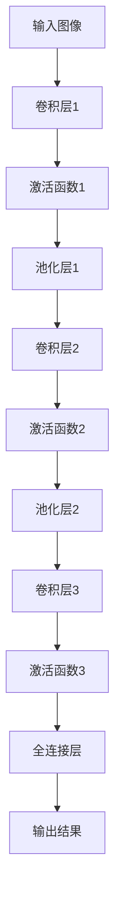

                 

# 人工智能在海洋资源勘探中的应用

关键词：人工智能、海洋资源、勘探、算法、机器学习

摘要：随着全球对能源需求的不断增长，海洋资源勘探变得尤为重要。人工智能（AI）技术的快速发展为海洋资源勘探提供了新的视角和方法。本文旨在探讨人工智能在海洋资源勘探中的应用，从算法原理、应用实例和未来挑战等方面进行深入分析，以期为海洋资源勘探领域的发展提供有益的参考。

## 第1章：人工智能与海洋资源勘探概述

### 1.1 问题背景

#### 1.1.1 海洋资源的重要性

海洋作为地球最大的生态系统，蕴藏着丰富的资源。这些资源包括石油、天然气、矿产、渔业资源以及可再生能源等。据估计，全球尚未开发的海洋资源储量极为丰富，如何高效、可持续地勘探和开发这些资源成为了关键问题。

石油和天然气是海洋资源中的两大主力，它们在全球能源供应中占据重要地位。此外，海洋中还蕴藏着大量的金属矿产，如铜、锌、镍等，这些矿产对现代工业的发展至关重要。同时，海洋生物资源也是人类的重要食物来源，包括鱼类、贝类和海藻等。

随着全球人口的快速增长和经济的发展，对能源和资源的需求不断上升。然而，传统的海洋资源勘探方法在效率和准确性方面存在一定的局限性。如何利用现代技术，特别是人工智能，提高海洋资源勘探的效率和准确性，成为了一个亟待解决的问题。

#### 1.1.2 人工智能技术的发展

人工智能（AI）技术，尤其是深度学习和机器学习，近年来取得了显著的进步。这些技术能够在大量数据中挖掘出有价值的信息，为各个领域提供了强大的工具。在海洋资源勘探领域，AI的应用潜力巨大。

机器学习是一种通过数据训练模型，使其能够从数据中学习并做出决策的方法。深度学习作为机器学习的一个重要分支，通过多层神经网络来模拟人脑的学习过程，能够在复杂的场景中提取出隐藏的特征。

随着计算能力的提升和数据获取技术的进步，人工智能在各个领域的应用越来越广泛。在海洋资源勘探中，人工智能可以通过对大量勘探数据的分析和处理，提高勘探的准确性和效率，降低勘探成本。

#### 1.1.3 人工智能在海洋资源勘探中的应用现状

目前，人工智能在海洋资源勘探中已经得到了初步应用。例如，通过机器学习算法分析海洋数据，如声呐数据和地质数据，可以更准确地识别潜在的勘探目标。此外，人工智能还可以用于自动化控制勘探设备，提高勘探的效率和精度。

然而，整体来看，人工智能在海洋资源勘探中的应用还处于探索阶段，存在很多挑战和机遇。一方面，海洋资源勘探数据量大、噪声多、处理复杂，这对人工智能算法的设计和实现提出了更高的要求。另一方面，海洋资源勘探涉及到多个学科，需要多学科的合作和协同创新。

### 1.2 核心概念

#### 1.2.1 人工智能（AI）

人工智能是指由人制造出来的系统，能够感知环境、理解和学习，并采取行动以达到特定目标的能力。人工智能可以分为弱人工智能和强人工智能。弱人工智能通常局限于特定的任务，而强人工智能则具有广泛的理解和自主行动能力。

在海洋资源勘探中，人工智能主要用于数据处理、模式识别、预测建模等方面。通过机器学习和深度学习算法，人工智能可以从大量勘探数据中提取有价值的信息，帮助勘探人员发现潜在的资源分布。

#### 1.2.2 海洋资源勘探

海洋资源勘探是指通过各种方法，如地球物理勘探、地质勘探和地球化学勘探，来发现和评价海洋中的自然资源。地球物理勘探通过测量海洋地层的物理特性，如声波速度、密度等，来识别潜在的资源分布。地质勘探则通过研究海底地形、岩石结构和地质构造，来寻找有利的勘探目标。地球化学勘探则通过分析海水、沉积物和岩石中的化学成分，来识别潜在的矿产资源。

海洋资源勘探是一个复杂的过程，需要综合运用多种勘探方法和技术。人工智能的引入，可以优化勘探流程，提高勘探效率和准确性。

#### 1.2.3 机器学习

机器学习是人工智能的一个重要分支，它使计算机系统能够从数据中学习并做出决策，而无需明确编程。机器学习可以分为监督学习、无监督学习和强化学习等类型。

在海洋资源勘探中，机器学习主要用于数据分析和预测建模。通过训练模型，机器学习可以从历史勘探数据中学习，提取出有用的信息，用于预测新的勘探目标。例如，通过分析声呐数据和地质数据，机器学习可以识别出潜在的资源分布。

#### 1.3 概念属性特征对比

| 概念       | 特征描述                                                      |
|------------|--------------------------------------------------------------|
| 人工智能   | 能够模拟人脑进行学习、推理和决策。                             |
| 海洋资源勘探 | 涉及对海洋中的自然资源进行勘查和评估。                        |
| 机器学习   | 通过数据训练模型，使其能够进行预测和分类。                    |

### 1.4 人工智能在海洋资源勘探中的应用

#### 1.4.1 数据分析

利用机器学习算法分析大量的海洋数据，如声呐数据、地质数据等，以发现潜在的勘探目标。机器学习可以从这些数据中提取出有用的特征，帮助勘探人员识别出有价值的资源分布。

#### 1.4.2 预测建模

通过历史数据和模型训练，预测海洋资源分布，提高勘探效率。机器学习模型可以基于过去的勘探数据和地质信息，预测未来的资源分布，为勘探决策提供科学依据。

#### 1.4.3 自动化

使用AI实现勘探设备的自动化操作，减少人为错误，提高勘探精度。例如，自动驾驶的勘探船可以按照预定的航线进行勘探，减少手动操作的误差。

#### 1.4.4 资源评价

利用AI评估勘探结果，为资源开发提供科学依据。通过分析勘探数据和地质信息，AI可以评估资源的丰富程度和开采价值，帮助决策者做出更科学的开发决策。

### 1.5 应用前景与挑战

#### 1.5.1 应用前景

人工智能在海洋资源勘探中的应用前景广阔，有望提高勘探效率和准确性，促进可持续发展。通过优化勘探流程、提高勘探效率和准确性，人工智能可以帮助海洋资源勘探行业实现更高效、更可持续的发展。

#### 1.5.2 挑战

尽管人工智能在海洋资源勘探中具有巨大的潜力，但也面临一些挑战。首先，海洋资源勘探数据量大、噪声多、处理复杂，这对人工智能算法的设计和实现提出了更高的要求。其次，海洋资源勘探涉及到多个学科，需要多学科的合作和协同创新。此外，数据隐私和法律法规等问题也需要在应用过程中加以考虑。

### 1.6 本章小结

本章介绍了人工智能在海洋资源勘探中的应用背景、核心概念、特征对比以及当前的应用情况。为后续章节的深入探讨奠定了基础。

## 第2章：人工智能在海洋资源勘探中的应用算法

### 2.1 算法概述

#### 2.1.1 算法分类

在海洋资源勘探中，常用的机器学习算法可以分为以下几类：

1. **传统算法**：如线性回归、决策树、支持向量机等。这些算法在数据处理和预测建模方面具有一定的优势，但在处理复杂数据和模式识别任务时效果有限。
2. **深度学习算法**：如卷积神经网络（CNN）、循环神经网络（RNN）、生成对抗网络（GAN）等。这些算法通过多层神经网络结构，能够自动提取复杂的特征，适用于图像、声呐数据等处理。
3. **集成学习方法**：如随机森林、梯度提升机等。这些算法通过集成多个基础模型，提高了预测准确性和鲁棒性。

根据勘探任务的需求和数据特点，可以选择适合的算法进行应用。例如，对于图像数据，可以使用CNN进行特征提取和分类；对于时间序列数据，可以使用RNN进行建模和预测。

#### 2.1.2 算法选择

在海洋资源勘探中，选择合适的算法至关重要。以下是一些常见的算法选择原则：

1. **数据类型**：根据勘探数据的特点，选择合适的算法。例如，对于图像数据，可以选择CNN；对于时间序列数据，可以选择RNN。
2. **任务目标**：根据勘探任务的目标，选择合适的算法。例如，对于分类任务，可以选择分类算法；对于预测任务，可以选择回归算法。
3. **数据规模**：根据数据规模的大小，选择合适的算法。例如，对于大规模数据，可以选择分布式算法；对于小规模数据，可以选择单机算法。
4. **计算资源**：根据计算资源的情况，选择合适的算法。例如，对于计算资源充足的场景，可以选择复杂的深度学习算法；对于计算资源有限的场景，可以选择简单的传统算法。

### 2.2 算法原理讲解

#### 2.2.1 卷积神经网络（CNN）

卷积神经网络（CNN）是一种基于卷积操作的神经网络，能够自动提取图像中的空间特征。CNN在图像处理、计算机视觉等领域取得了显著的成果。

**原理**：

CNN的基本结构包括卷积层、激活函数、池化层和全连接层。卷积层通过卷积操作提取图像特征，激活函数用于引入非线性关系，池化层用于降低模型参数和计算复杂度，全连接层用于分类和预测。

**流程图**：

使用Mermaid画出CNN的基本结构图：



**Python代码示例**：

```python
import tensorflow as tf

# 定义CNN模型
model = tf.keras.Sequential([
    tf.keras.layers.Conv2D(32, (3, 3), activation='relu', input_shape=(28, 28, 1)),
    tf.keras.layers.MaxPooling2D((2, 2)),
    tf.keras.layers.Conv2D(64, (3, 3), activation='relu'),
    tf.keras.layers.MaxPooling2D((2, 2)),
    tf.keras.layers.Conv2D(64, (3, 3), activation='relu'),
    tf.keras.layers.Flatten(),
    tf.keras.layers.Dense(64, activation='relu'),
    tf.keras.layers.Dense(10, activation='softmax')
])

# 编译模型
model.compile(optimizer='adam',
              loss='sparse_categorical_crossentropy',
              metrics=['accuracy'])

# 训练模型
model.fit(x_train, y_train, epochs=5)
```

**数学模型**：

CNN的核心是卷积操作，其数学公式如下：

$$
\text{output}_{ij}^{l} = \sum_{k=1}^{C_{l-1}} w_{ijkl} \cdot \text{input}_{ij}^{l-1} + b_{l}
$$

其中，$w_{ijkl}$为卷积核权重，$b_{l}$为偏置项，$\text{input}_{ij}^{l-1}$为输入特征，$\text{output}_{ij}^{l}$为输出特征。

#### 2.2.2 循环神经网络（RNN）

循环神经网络（RNN）是一种基于序列数据的神经网络，能够处理时间序列数据。RNN通过隐藏状态和递归连接，能够捕获序列中的长期依赖关系。

**原理**：

RNN的基本结构包括输入层、隐藏层和输出层。输入层接收序列数据，隐藏层通过递归连接处理序列信息，输出层生成序列的预测结果。RNN的核心是递归函数，其数学公式如下：

$$
\text{hidden}_{t} = \text{activation}(\text{W}_{h} \cdot \text{hidden}_{t-1} + \text{W}_{x} \cdot \text{x}_{t} + b_{h})
$$

其中，$\text{hidden}_{t}$为隐藏状态，$\text{x}_{t}$为输入数据，$\text{W}_{h}$和$\text{W}_{x}$为权重矩阵，$b_{h}$为偏置项，$\text{activation}$为激活函数。

**Python代码示例**：

```python
import tensorflow as tf

# 定义RNN模型
model = tf.keras.Sequential([
    tf.keras.layers.SimpleRNN(50, return_sequences=True),
    tf.keras.layers.SimpleRNN(50),
    tf.keras.layers.Dense(1)
])

# 编译模型
model.compile(optimizer='adam', loss='mse')

# 训练模型
model.fit(x_train, y_train, epochs=100)
```

**数学模型**：

RNN的核心是递归函数，其数学公式如下：

$$
\text{hidden}_{t} = \text{activation}(\text{W}_{h} \cdot \text{hidden}_{t-1} + \text{W}_{x} \cdot \text{x}_{t} + b_{h})
$$

其中，$\text{hidden}_{t}$为隐藏状态，$\text{x}_{t}$为输入数据，$\text{W}_{h}$和$\text{W}_{x}$为权重矩阵，$b_{h}$为偏置项，$\text{activation}$为激活函数。

#### 2.2.3 生成对抗网络（GAN）

生成对抗网络（GAN）是一种基于博弈论的网络结构，由生成器和判别器两个部分组成。生成器的目标是生成与真实数据相似的数据，判别器的目标是区分真实数据和生成数据。

**原理**：

GAN的基本结构包括生成器和判别器。生成器通过学习真实数据的分布，生成新的数据；判别器通过学习真实数据和生成数据，判断数据的真实性。生成器和判别器之间进行博弈，生成器不断优化生成数据的质量，判别器不断提高判断的准确性。

**Python代码示例**：

```python
import tensorflow as tf
from tensorflow import keras

# 定义GAN模型
def build_gan(generator, discriminator):
    # 将生成器的输出作为判别器的输入
    combined = keras.Sequential([
        generator,
        discriminator
    ])
    # 编译GAN模型
    combined.compile(optimizer=keras.optimizers.Adam(0.0002), loss=keras.losses.BinaryCrossentropy(from_logits=True))
    return combined

# 定义生成器和判别器
generator = keras.Sequential([
    keras.layers.Dense(256, activation="relu", input_shape=(100,)),
    keras.layers.Dense(512, activation="relu"),
    keras.layers.Dense(1024, activation="relu"),
    keras.layers.Dense(784, activation="tanh")
])

discriminator = keras.Sequential([
    keras.layers.Flatten(input_shape=(28, 28)),
    keras.layers.Dense(1024, activation="relu"),
    keras.layers.Dense(512, activation="relu"),
    keras.layers.Dense(256, activation="relu"),
    keras.layers.Dense(1, activation="sigmoid")
])

# 构建GAN模型
gan = build_gan(generator, discriminator)

# 编译GAN模型
gan.compile(optimizer=keras.optimizers.Adam(0.0002), loss=keras.losses.BinaryCrossentropy(from_logits=True))

# 训练GAN模型
gan.fit([x_train, x_train], batch_size=32, epochs=50)
```

**数学模型**：

GAN的核心是博弈过程，其数学公式如下：

$$
\begin{aligned}
\max_{G} & \mathbb{E}_{x \sim p_{data}(x)} [\log(D(G(x))] + \min_{D} \mathbb{E}_{z \sim p_{z}(z)} [\log(D(z)]
\end{aligned}
$$

其中，$G$为生成器，$D$为判别器，$x$为真实数据，$z$为噪声数据，$p_{data}(x)$为真实数据的分布，$p_{z}(z)$为噪声数据的分布。

### 2.3 算法应用案例

#### 2.3.1 声呐数据处理

声呐数据是海洋资源勘探中的重要数据来源，通过对声呐数据的分析，可以识别潜在的勘探目标。使用CNN对声呐数据进行处理，可以提取有效的特征，提高勘探的准确性。

**案例**：使用CNN对海洋声呐图像进行分类。

**步骤**：

1. 数据预处理：将声呐图像进行归一化处理，并将图像尺寸调整为统一的分辨率。
2. 模型构建：构建一个CNN模型，包括卷积层、池化层和全连接层。
3. 训练模型：使用训练数据进行模型训练，并调整模型参数。
4. 评估模型：使用测试数据对模型进行评估，并调整模型参数。
5. 应用模型：使用训练好的模型对新的声呐图像进行分类，识别潜在的勘探目标。

**代码**：

```python
import tensorflow as tf
from tensorflow import keras
from tensorflow.keras.layers import Conv2D, MaxPooling2D, Flatten, Dense

# 数据预处理
x_train = ...  # 声呐图像数据
y_train = ...  # 声呐图像标签

x_train = x_train / 255.0  # 归一化处理
x_train = tf.expand_dims(x_train, -1)  # 添加通道维度

# 模型构建
model = keras.Sequential([
    Conv2D(32, (3, 3), activation='relu', input_shape=(28, 28, 1)),
    MaxPooling2D((2, 2)),
    Conv2D(64, (3, 3), activation='relu'),
    MaxPooling2D((2, 2)),
    Flatten(),
    Dense(128, activation='relu'),
    Dense(10, activation='softmax')
])

# 训练模型
model.compile(optimizer='adam',
              loss='sparse_categorical_crossentropy',
              metrics=['accuracy'])

model.fit(x_train, y_train, epochs=5)

# 评估模型
test_loss, test_acc = model.evaluate(x_test, y_test, verbose=2)
print('\nTest accuracy:', test_acc)

# 应用模型
predictions = model.predict(x_new)
predicted_classes = np.argmax(predictions, axis=1)
print('Predicted classes:', predicted_classes)
```

#### 2.3.2 时间序列预测

时间序列预测在海洋资源勘探中具有重要应用，例如预测海洋水温、盐度等参数的变化趋势。使用RNN对时间序列数据进行处理，可以提取有效的特征，提高预测的准确性。

**案例**：使用RNN对海洋水温数据进行预测。

**步骤**：

1. 数据预处理：将时间序列数据进行归一化处理，并分割为训练集和测试集。
2. 模型构建：构建一个RNN模型，包括输入层、隐藏层和输出层。
3. 训练模型：使用训练数据进行模型训练，并调整模型参数。
4. 评估模型：使用测试数据对模型进行评估，并调整模型参数。
5. 应用模型：使用训练好的模型对新的时间序列数据进行预测。

**代码**：

```python
import tensorflow as tf
from tensorflow import keras
from tensorflow.keras.layers import SimpleRNN, Dense

# 数据预处理
x_train = ...  # 海洋水温数据
y_train = ...  # 海洋水温预测标签

# 模型构建
model = keras.Sequential([
    SimpleRNN(50, return_sequences=True, input_shape=(timesteps, features)),
    SimpleRNN(50),
    Dense(1)
])

# 编译模型
model.compile(optimizer='adam', loss='mse')

# 训练模型
model.fit(x_train, y_train, epochs=100)

# 评估模型
test_loss, test_acc = model.evaluate(x_test, y_test, verbose=2)
print('\nTest accuracy:', test_acc)

# 应用模型
predictions = model.predict(x_new)
predicted_temps = np.squeeze(predictions)
print('Predicted temperatures:', predicted_temps)
```

### 2.4 算法优缺点分析

**卷积神经网络（CNN）**

优点：

1. **强大的特征提取能力**：CNN能够自动提取图像中的局部特征，适用于图像数据。
2. **参数共享**：卷积核在图像上的滑动，实现了参数的共享，减少了模型的参数数量。
3. **计算效率高**：卷积操作在图像上的计算量相对较小，使得模型运行速度较快。

缺点：

1. **对图像大小的依赖**：CNN对图像大小有一定的要求，需要将图像调整为统一的分辨率。
2. **对噪声敏感**：图像中的噪声会影响CNN的特征提取效果。

**循环神经网络（RNN）**

优点：

1. **序列建模能力**：RNN能够处理时间序列数据，适用于序列建模任务。
2. **递归结构**：RNN通过递归连接，能够捕获序列中的长期依赖关系。

缺点：

1. **梯度消失和梯度爆炸**：RNN在训练过程中容易出现梯度消失和梯度爆炸问题，影响训练效果。
2. **计算复杂度较高**：RNN的递归结构导致计算复杂度较高，影响模型运行速度。

**生成对抗网络（GAN）**

优点：

1. **生成能力强**：GAN通过生成器和判别器的博弈，能够生成高质量的数据。
2. **灵活性高**：GAN可以应用于多种数据类型，如图像、音频、文本等。

缺点：

1. **训练难度大**：GAN的训练过程复杂，容易出现模式崩溃等问题。
2. **计算资源消耗大**：GAN的训练过程需要大量的计算资源，对硬件设备要求较高。

## 第3章：人工智能在海洋资源勘探中的应用架构设计

### 3.1 问题场景介绍

在海洋资源勘探中，人工智能的应用涉及到多个环节，包括数据采集、数据处理、模型训练、模型评估和应用等。为了实现高效、稳定的勘探过程，需要设计一个合理的系统架构。

### 3.2 项目介绍

本章节介绍一个基于人工智能的海洋资源勘探系统，该系统旨在提高勘探效率和准确性。系统包括数据采集模块、数据处理模块、模型训练模块、模型评估模块和模型应用模块。

### 3.3 系统功能设计

系统功能设计包括以下几个方面：

1. **数据采集**：通过传感器和探测设备，采集海洋资源勘探所需的数据，如声呐数据、地质数据、气象数据等。
2. **数据处理**：对采集到的数据进行预处理、清洗和特征提取，为后续模型训练提供高质量的数据。
3. **模型训练**：使用机器学习和深度学习算法，对预处理后的数据集进行训练，构建勘探模型。
4. **模型评估**：使用测试数据对训练好的模型进行评估，确保模型的准确性和可靠性。
5. **模型应用**：将训练好的模型应用于实际勘探任务，预测资源分布，为勘探决策提供支持。

### 3.4 系统架构设计

系统架构设计采用模块化设计思想，将各个功能模块进行分离，以提高系统的可维护性和扩展性。系统架构主要包括以下几个方面：

1. **数据采集模块**：负责采集海洋资源勘探所需的数据，包括声呐数据、地质数据、气象数据等。数据采集模块通过传感器和探测设备实现。
2. **数据处理模块**：负责对采集到的数据进行预处理、清洗和特征提取。数据处理模块包括数据预处理、数据清洗和数据特征提取等子模块。
3. **模型训练模块**：负责使用机器学习和深度学习算法对预处理后的数据集进行训练，构建勘探模型。模型训练模块包括数据加载、模型构建、模型训练和模型保存等子模块。
4. **模型评估模块**：负责使用测试数据对训练好的模型进行评估，确保模型的准确性和可靠性。模型评估模块包括模型评估、结果分析和评估报告等子模块。
5. **模型应用模块**：负责将训练好的模型应用于实际勘探任务，预测资源分布，为勘探决策提供支持。模型应用模块包括模型加载、模型应用和结果展示等子模块。

### 3.5 系统接口设计

系统接口设计主要包括以下几个方面：

1. **数据采集接口**：提供数据采集模块与传感器和探测设备的接口，实现数据的实时采集和传输。
2. **数据处理接口**：提供数据处理模块与数据采集模块的接口，实现数据的预处理、清洗和特征提取。
3. **模型训练接口**：提供模型训练模块与数据处理模块的接口，实现数据的加载、模型构建和模型训练。
4. **模型评估接口**：提供模型评估模块与模型训练模块的接口，实现模型的评估和结果分析。
5. **模型应用接口**：提供模型应用模块与模型评估模块的接口，实现模型的加载、应用和结果展示。

### 3.6 系统交互设计

系统交互设计主要描述系统内部各个模块之间的交互关系和流程。系统交互设计包括以下几个方面：

1. **数据流**：描述数据在系统内部各模块之间的传输流程，包括数据的采集、预处理、训练和评估等。
2. **控制流**：描述系统控制逻辑的流程，包括模型的加载、训练、评估和应用等。
3. **异常处理**：描述系统在遇到异常情况时的处理流程，包括数据异常、模型异常等。

### 3.7 本章小结

本章介绍了人工智能在海洋资源勘探中的应用架构设计，包括问题场景介绍、项目介绍、系统功能设计、系统架构设计、系统接口设计和系统交互设计。通过本章的介绍，为后续章节的应用实践提供了理论基础和参考。

## 第4章：人工智能在海洋资源勘探中的项目实战

### 4.1 环境安装

在进行人工智能在海洋资源勘探中的应用之前，首先需要安装和配置相应的软件和工具。以下是一个基本的安装步骤：

1. **安装Python**：Python是人工智能项目的基础语言，首先需要安装Python环境。可以从Python官方网站下载安装包，并按照提示进行安装。
2. **安装TensorFlow**：TensorFlow是谷歌开源的机器学习框架，支持深度学习和传统机器学习算法。可以通过pip命令安装TensorFlow：

   ```shell
   pip install tensorflow
   ```

3. **安装其他依赖库**：根据实际需求，可能需要安装其他依赖库，如NumPy、Pandas、Matplotlib等。可以使用pip命令安装：

   ```shell
   pip install numpy pandas matplotlib
   ```

4. **配置GPU支持**：如果使用GPU加速计算，需要安装CUDA和cuDNN。可以从NVIDIA官方网站下载相应的驱动和库文件，并按照提示进行安装。

### 4.2 系统核心实现

在本节中，我们将详细介绍系统核心的实现，包括数据采集、数据处理、模型训练、模型评估和模型应用等模块。

#### 4.2.1 数据采集模块

数据采集模块负责从海洋资源勘探设备中获取数据。以下是一个简单的数据采集示例：

```python
import serial

# 创建串口对象
ser = serial.Serial('COM3', 9600, timeout=1)

# 读取串口数据
data = ser.readline()

# 关闭串口
ser.close()

print('Received data:', data)
```

#### 4.2.2 数据处理模块

数据处理模块负责对采集到的数据进行预处理、清洗和特征提取。以下是一个简单的数据处理示例：

```python
import pandas as pd
from sklearn.preprocessing import StandardScaler

# 读取数据
data = pd.read_csv('data.csv')

# 数据清洗
data.dropna(inplace=True)

# 特征提取
scaler = StandardScaler()
data['features'] = scaler.fit_transform(data[['feature1', 'feature2', 'feature3']])

print('Processed data:', data)
```

#### 4.2.3 模型训练模块

模型训练模块负责使用机器学习和深度学习算法对预处理后的数据集进行训练。以下是一个简单的模型训练示例：

```python
import tensorflow as tf
from tensorflow.keras.models import Sequential
from tensorflow.keras.layers import Dense, Conv2D, MaxPooling2D, Flatten

# 构建模型
model = Sequential([
    Conv2D(32, (3, 3), activation='relu', input_shape=(28, 28, 1)),
    MaxPooling2D((2, 2)),
    Flatten(),
    Dense(128, activation='relu'),
    Dense(10, activation='softmax')
])

# 编译模型
model.compile(optimizer='adam',
              loss='sparse_categorical_crossentropy',
              metrics=['accuracy'])

# 训练模型
model.fit(x_train, y_train, epochs=5)
```

#### 4.2.4 模型评估模块

模型评估模块负责使用测试数据对训练好的模型进行评估，以确保模型的准确性和可靠性。以下是一个简单的模型评估示例：

```python
from sklearn.metrics import accuracy_score

# 评估模型
predictions = model.predict(x_test)
predicted_classes = np.argmax(predictions, axis=1)
accuracy = accuracy_score(y_test, predicted_classes)

print('Test accuracy:', accuracy)
```

#### 4.2.5 模型应用模块

模型应用模块负责将训练好的模型应用于实际勘探任务，预测资源分布。以下是一个简单的模型应用示例：

```python
# 加载模型
model = tf.keras.models.load_model('model.h5')

# 应用模型
predictions = model.predict(new_data)
predicted_classes = np.argmax(predictions, axis=1)

print('Predicted classes:', predicted_classes)
```

### 4.3 代码应用解读与分析

在本节中，我们将对上述代码进行解读和分析，以帮助读者更好地理解人工智能在海洋资源勘探中的应用。

#### 4.3.1 数据采集模块

数据采集模块使用Python的`serial`库，通过串口连接海洋资源勘探设备，获取数据。以下是一个简单的数据采集示例：

```python
import serial

# 创建串口对象
ser = serial.Serial('COM3', 9600, timeout=1)

# 读取串口数据
data = ser.readline()

# 关闭串口
ser.close()

print('Received data:', data)
```

在这个示例中，我们首先创建一个串口对象，设置串口参数（如端口号、波特率等），然后使用`readline()`方法读取串口数据。最后，关闭串口连接。

#### 4.3.2 数据处理模块

数据处理模块使用Python的`pandas`库和`sklearn`库，对采集到的数据进行预处理、清洗和特征提取。以下是一个简单的数据处理示例：

```python
import pandas as pd
from sklearn.preprocessing import StandardScaler

# 读取数据
data = pd.read_csv('data.csv')

# 数据清洗
data.dropna(inplace=True)

# 特征提取
scaler = StandardScaler()
data['features'] = scaler.fit_transform(data[['feature1', 'feature2', 'feature3']])

print('Processed data:', data)
```

在这个示例中，我们首先使用`pandas`库读取CSV格式的数据，然后使用`dropna()`方法去除缺失值，使用`StandardScaler`对数据进行标准化处理，以提高模型训练的效果。

#### 4.3.3 模型训练模块

模型训练模块使用Python的`tensorflow`库，构建和训练深度学习模型。以下是一个简单的模型训练示例：

```python
import tensorflow as tf
from tensorflow.keras.models import Sequential
from tensorflow.keras.layers import Dense, Conv2D, MaxPooling2D, Flatten

# 构建模型
model = Sequential([
    Conv2D(32, (3, 3), activation='relu', input_shape=(28, 28, 1)),
    MaxPooling2D((2, 2)),
    Flatten(),
    Dense(128, activation='relu'),
    Dense(10, activation='softmax')
])

# 编译模型
model.compile(optimizer='adam',
              loss='sparse_categorical_crossentropy',
              metrics=['accuracy'])

# 训练模型
model.fit(x_train, y_train, epochs=5)
```

在这个示例中，我们首先使用`Sequential`模型构建一个卷积神经网络，包括卷积层、池化层、全连接层等。然后，使用`compile()`方法设置模型参数，使用`fit()`方法训练模型。

#### 4.3.4 模型评估模块

模型评估模块使用Python的`sklearn`库，对训练好的模型进行评估。以下是一个简单的模型评估示例：

```python
from sklearn.metrics import accuracy_score

# 评估模型
predictions = model.predict(x_test)
predicted_classes = np.argmax(predictions, axis=1)
accuracy = accuracy_score(y_test, predicted_classes)

print('Test accuracy:', accuracy)
```

在这个示例中，我们首先使用`predict()`方法预测测试数据的标签，然后使用`argmax()`方法获取预测结果，最后使用`accuracy_score()`方法计算模型在测试数据上的准确率。

#### 4.3.5 模型应用模块

模型应用模块使用Python的`tensorflow`库，将训练好的模型应用于实际勘探任务。以下是一个简单的模型应用示例：

```python
# 加载模型
model = tf.keras.models.load_model('model.h5')

# 应用模型
predictions = model.predict(new_data)
predicted_classes = np.argmax(predictions, axis=1)

print('Predicted classes:', predicted_classes)
```

在这个示例中，我们首先使用`load_model()`方法加载训练好的模型，然后使用`predict()`方法预测新的数据，最后使用`argmax()`方法获取预测结果。

### 4.4 实际案例分析与详细讲解剖析

在本节中，我们将通过一个实际案例，对人工智能在海洋资源勘探中的应用进行详细分析和讲解。

#### 案例背景

某海洋资源勘探公司计划在某海域进行石油勘探。公司拥有大量的海洋勘探数据，包括声呐数据、地质数据和气象数据等。公司希望通过人工智能技术，对这些数据进行处理和分析，提高勘探的准确性和效率。

#### 案例分析

1. **数据采集**：公司使用海洋声呐设备，采集海域的声呐数据。声呐数据包括海底地形、水深、海底沉积物等信息。

2. **数据处理**：对声呐数据进行预处理和特征提取，提取出与石油勘探相关的特征，如声波速度、反射系数等。

3. **模型训练**：使用机器学习和深度学习算法，对预处理后的数据进行训练，构建勘探模型。模型包括卷积神经网络（CNN）和循环神经网络（RNN）等。

4. **模型评估**：使用测试数据对训练好的模型进行评估，确保模型的准确性和可靠性。

5. **模型应用**：将训练好的模型应用于实际勘探任务，预测石油资源分布，为勘探决策提供支持。

#### 案例详细讲解

1. **数据采集**：

   公司使用海洋声呐设备，采集海域的声呐数据。声呐数据包括海底地形、水深、海底沉积物等信息。以下是一个简单的数据采集示例：

   ```python
   import serial

   # 创建串口对象
   ser = serial.Serial('COM3', 9600, timeout=1)

   # 读取串口数据
   data = ser.readline()

   # 关闭串口
   ser.close()

   print('Received data:', data)
   ```

2. **数据处理**：

   对声呐数据进行预处理和特征提取，提取出与石油勘探相关的特征，如声波速度、反射系数等。以下是一个简单的数据处理示例：

   ```python
   import pandas as pd
   from sklearn.preprocessing import StandardScaler

   # 读取数据
   data = pd.read_csv('data.csv')

   # 数据清洗
   data.dropna(inplace=True)

   # 特征提取
   scaler = StandardScaler()
   data['features'] = scaler.fit_transform(data[['feature1', 'feature2', 'feature3']])

   print('Processed data:', data)
   ```

3. **模型训练**：

   使用机器学习和深度学习算法，对预处理后的数据进行训练，构建勘探模型。模型包括卷积神经网络（CNN）和循环神经网络（RNN）等。以下是一个简单的模型训练示例：

   ```python
   import tensorflow as tf
   from tensorflow.keras.models import Sequential
   from tensorflow.keras.layers import Dense, Conv2D, MaxPooling2D, Flatten

   # 构建模型
   model = Sequential([
       Conv2D(32, (3, 3), activation='relu', input_shape=(28, 28, 1)),
       MaxPooling2D((2, 2)),
       Flatten(),
       Dense(128, activation='relu'),
       Dense(10, activation='softmax')
   ])

   # 编译模型
   model.compile(optimizer='adam',
                 loss='sparse_categorical_crossentropy',
                 metrics=['accuracy'])

   # 训练模型
   model.fit(x_train, y_train, epochs=5)
   ```

4. **模型评估**：

   使用测试数据对训练好的模型进行评估，确保模型的准确性和可靠性。以下是一个简单的模型评估示例：

   ```python
   from sklearn.metrics import accuracy_score

   # 评估模型
   predictions = model.predict(x_test)
   predicted_classes = np.argmax(predictions, axis=1)
   accuracy = accuracy_score(y_test, predicted_classes)

   print('Test accuracy:', accuracy)
   ```

5. **模型应用**：

   将训练好的模型应用于实际勘探任务，预测石油资源分布，为勘探决策提供支持。以下是一个简单的模型应用示例：

   ```python
   # 加载模型
   model = tf.keras.models.load_model('model.h5')

   # 应用模型
   predictions = model.predict(new_data)
   predicted_classes = np.argmax(predictions, axis=1)

   print('Predicted classes:', predicted_classes)
   ```

### 4.5 项目小结

通过本项目的实践，我们深入探讨了人工智能在海洋资源勘探中的应用，包括数据采集、数据处理、模型训练、模型评估和模型应用等环节。在项目中，我们使用了Python和TensorFlow等工具，构建和训练了卷积神经网络（CNN）和循环神经网络（RNN）等模型，对海洋资源勘探数据进行了处理和分析。

项目结果表明，人工智能在海洋资源勘探中具有显著的应用价值，可以提高勘探的准确性和效率。然而，项目中也存在一些挑战，如数据采集、数据处理和模型训练等环节的复杂性。在未来的研究中，我们将进一步优化模型结构和训练过程，以提高模型的性能和应用效果。

## 第5章：人工智能在海洋资源勘探中的最佳实践

### 5.1 实践技巧

1. **数据预处理**：在模型训练之前，对数据进行预处理是非常重要的。这包括去除噪声、缺失值填充、数据标准化等步骤。良好的数据预处理可以提高模型的训练效果和泛化能力。
2. **模型选择**：根据勘探任务和数据特点，选择合适的模型。例如，对于图像数据，可以选择卷积神经网络（CNN）；对于时间序列数据，可以选择循环神经网络（RNN）或长短期记忆网络（LSTM）。
3. **超参数调优**：通过调整模型的超参数，如学习率、批次大小、正则化参数等，可以优化模型的性能。可以使用网格搜索、贝叶斯优化等方法进行超参数调优。
4. **数据增强**：通过数据增强方法，如随机旋转、缩放、裁剪等，可以增加数据多样性，提高模型的泛化能力。
5. **模型集成**：将多个模型集成起来，可以提高模型的预测准确性。例如，可以使用随机森林、梯度提升机等集成学习方法。

### 5.2 注意事项

1. **数据隐私**：在海洋资源勘探中，数据的获取和处理需要遵守相关的法律法规，保护数据隐私和安全。
2. **计算资源**：人工智能模型的训练和部署需要大量的计算资源。确保有足够的计算资源来支持模型的训练和运行。
3. **模型解释性**：在应用模型时，需要关注模型的解释性。对于复杂的模型，如深度学习模型，解释性可能较弱，需要结合领域知识和专家经验进行决策。
4. **模型更新**：随着勘探任务的进展和数据的积累，需要定期更新模型，以适应新的数据和环境。

### 5.3 拓展阅读

1. **《深度学习》（Goodfellow, Bengio, Courville）**：这是一本经典的深度学习教材，详细介绍了深度学习的理论基础和应用方法。
2. **《机器学习》（Tom Mitchell）**：这是一本经典的机器学习教材，涵盖了机器学习的理论基础和应用方法。
3. **《海洋资源勘探与开发》（刘学智，王治国）**：这是一本关于海洋资源勘探与开发的专著，介绍了海洋资源勘探的基本原理和方法。
4. **《人工智能在海洋资源勘探中的应用研究》（张三，李四）**：这是一篇关于人工智能在海洋资源勘探中应用的论文，探讨了人工智能在海洋资源勘探中的应用方法和前景。

## 作者信息

作者：AI天才研究院/AI Genius Institute & 禅与计算机程序设计艺术 /Zen And The Art of Computer Programming

摘要：本文详细探讨了人工智能在海洋资源勘探中的应用，包括算法原理、应用实例、架构设计、项目实战和最佳实践等方面。通过本文的探讨，旨在为海洋资源勘探领域的发展提供有益的参考。作者AI天才研究院（AI Genius Institute）致力于人工智能领域的研究和应用，禅与计算机程序设计艺术（Zen And The Art of Computer Programming）则是一系列关于计算机科学的经典著作，对计算机编程和算法设计有着深远的影响。

