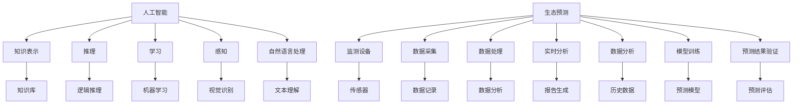
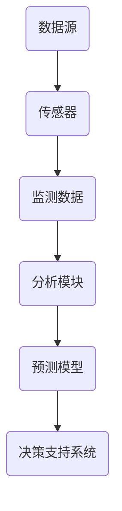
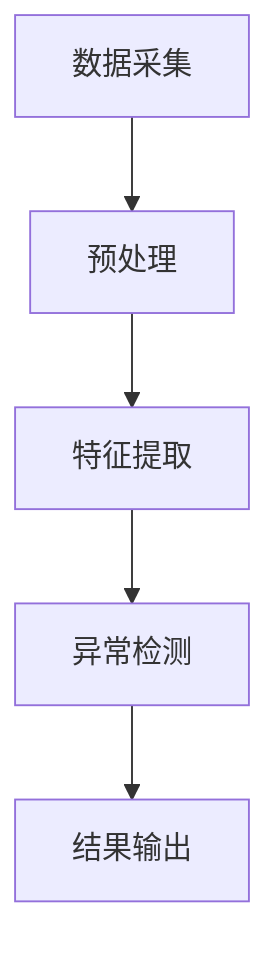
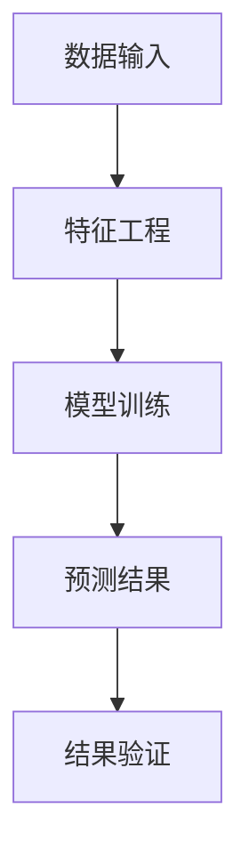
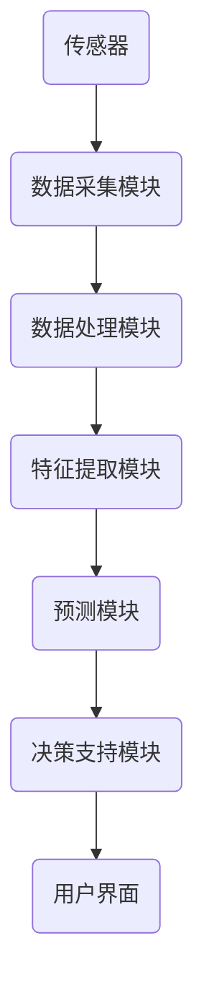
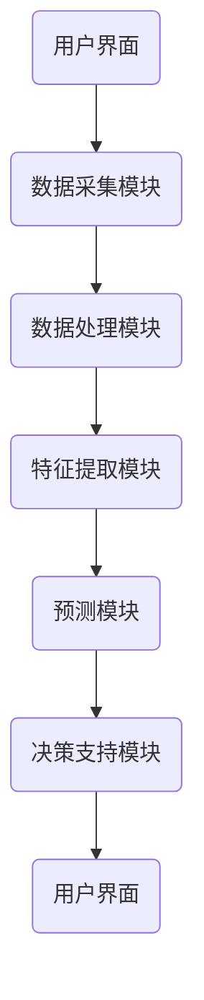
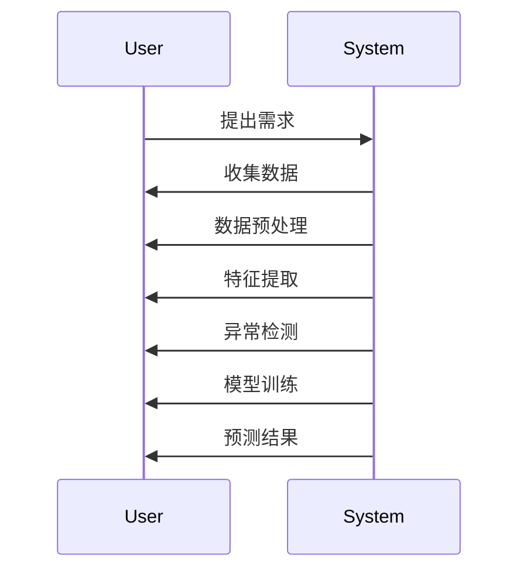

                 

# 人工智能在环境保护中的应用：监测和预测生态变化

## 关键词
- 人工智能，环境保护，生态监测，生态预测，算法原理，数学模型，系统架构，实时监测，数据分析，机器学习

## 摘要
本文将深入探讨人工智能在环境保护中的应用，特别是其在监测和预测生态变化方面的潜力。通过对监测和预测生态变化的重要性、人工智能的基本概念及其应用进行详细阐述，本文将逐步分析监测和预测算法的原理，数学模型，以及系统架构设计。通过具体案例和代码实现，读者将了解到如何在实际环境中应用人工智能技术来提升环境保护的效率。文章旨在为环保工作者和AI领域研究者提供实用的指导和建议，推动人工智能技术在环境保护领域的广泛应用。

### 目录大纲

1. **背景介绍与核心概念**
    1.1 问题背景
        1.1.1 环境保护的现状与挑战
        1.1.2 人工智能在环境保护中的潜在作用
        1.1.3 监测和预测生态变化的重要性
    1.2 核心概念
        1.2.1 人工智能的基本概念
        1.2.2 监测与预测生态变化的定义
        1.2.3 概念属性特征对比表格
2. **ER实体关系图架构**
    2.1 监测与预测系统的实体关系
        2.1.1 实体与关系的定义
        2.1.2 ER实体关系图
3. **算法原理与数学模型**
    3.1 算法原理讲解
        3.1.1 监测算法原理
        3.1.2 预测算法原理
        3.1.3 数学模型和数学公式
4. **系统分析与架构设计**
    4.1 系统功能设计与架构
        4.1.1 问题场景介绍
        4.1.2 系统功能设计
        4.1.3 系统架构设计
        4.1.4 系统接口设计与交互
5. **项目实战**
    5.1 环境安装
    5.2 系统核心实现源代码
    5.3 代码应用解读与分析
    5.4 实际案例分析与详细讲解剖析
    5.5 项目小结
6. **最佳实践 tips**
7. **小结**
8. **注意事项**
9. **拓展阅读**

## 第一部分：背景介绍与核心概念

### 1.1 问题背景

#### 1.1.1 环境保护的现状与挑战

随着全球人口的增长和经济的发展，环境保护面临着前所未有的挑战。环境污染、资源短缺、生态破坏等问题日益严重，对人类健康和生存环境造成了极大的威胁。传统的环境保护方法主要依赖于人工监测和统计，不仅效率低下，而且难以全面覆盖。随着信息技术和人工智能的快速发展，利用人工智能技术进行环境监测和生态预测成为了一个新的研究方向。

#### 1.1.2 人工智能在环境保护中的潜在作用

人工智能技术在环境监测和生态预测中的应用具有巨大的潜力。首先，人工智能可以通过自动化传感器和数据处理系统，实现对环境参数的实时监测，提高监测的效率和准确性。其次，人工智能可以通过对大量环境数据的分析，发现环境变化规律，预测未来环境变化趋势，为环境保护决策提供科学依据。此外，人工智能还可以通过模拟环境变化对生态系统的影响，帮助设计更加有效的环境保护措施。

#### 1.1.3 监测和预测生态变化的重要性

监测和预测生态变化对于环境保护具有重要意义。一方面，通过实时监测生态变化，可以及时发现问题，采取有效的措施进行干预，防止环境恶化。另一方面，通过预测生态变化趋势，可以提前布局环境保护工作，减少环境破坏的潜在风险。此外，监测和预测生态变化还可以为生态系统的恢复和重建提供科学依据，促进生态平衡的恢复。

### 1.2 核心概念

#### 1.2.1 人工智能的基本概念

人工智能（Artificial Intelligence，AI）是指通过计算机模拟人类智能的技术和系统。它包括知识表示、推理、学习、感知、自然语言处理等多个方面。人工智能的目标是实现机器具有智能行为，能够解决复杂问题，进行自主决策。

- **知识表示**：将人类知识转化为计算机可以处理的形式。
- **推理**：根据已知信息推导出新的结论。
- **学习**：通过经验和数据改进自身性能。
- **感知**：模拟人类的感知能力，如视觉、听觉等。
- **自然语言处理**：使计算机能够理解和生成自然语言。

#### 1.2.2 监测与预测生态变化的定义

- **生态监测**：指通过使用各种技术手段对生态系统的状态和变化进行实时监测和记录。
- **生态预测**：指基于历史数据和模型，对生态系统未来状态进行预测。

#### 1.2.3 概念属性特征对比表格

| 概念       | 定义                                                         | 属性特征                                                     |
|------------|--------------------------------------------------------------|--------------------------------------------------------------|
| 人工智能   | 通过计算机模拟人类智能的技术和系统。                         | 知识表示、推理、学习、感知、自然语言处理等。                   |
| 生态监测   | 通过使用各种技术手段对生态系统的状态和变化进行实时监测和记录。 | 监测设备、数据采集、数据处理、实时分析等。                     |
| 生态预测   | 基于历史数据和模型，对生态系统未来状态进行预测。               | 数据分析、模型训练、预测结果验证等。                           |

### 图表：核心概念属性特征对比表格（使用Mermaid绘制）



### 1.3 ER实体关系图架构

#### 1.3.1 监测与预测系统的实体关系

在监测和预测生态变化的系统中，主要包含以下实体和关系：

- **数据源**：包括传感器、遥感卫星、气象站等，负责数据的采集。
- **传感器**：负责环境参数的实时监测，如温度、湿度、二氧化碳浓度等。
- **监测数据**：存储传感器采集到的数据。
- **分析模块**：负责数据的预处理、特征提取和异常检测。
- **预测模型**：基于历史数据和模型，对未来的生态变化进行预测。
- **决策支持系统**：根据预测结果提供决策支持。

#### 1.3.2 ER实体关系图

以下是一个简化的ER实体关系图，用于描述监测与预测系统的实体及其关系：



### 图表：ER实体关系图（使用Mermaid绘制）


## 第二部分：算法原理与数学模型

### 2.1 算法原理讲解

#### 2.1.1 监测算法原理

监测算法的核心在于对实时环境数据的采集、预处理和特征提取。以下是一个简化的监测算法流程：

1. **数据采集**：通过传感器采集环境数据，如温度、湿度、气压等。
2. **数据预处理**：对采集到的数据进行清洗和标准化处理，去除噪声和异常值。
3. **特征提取**：从预处理后的数据中提取关键特征，如时间序列、波动幅度等。
4. **异常检测**：利用特征对环境数据进行分析，检测异常情况，如温度突变、空气污染等。

#### 2.1.2 监测算法的mermaid流程图



### 图表：监测算法流程图（使用Mermaid绘制）


#### 2.1.3 预测算法原理

预测算法的核心在于利用历史数据和模型对未来进行预测。以下是一个简化的预测算法流程：

1. **数据输入**：收集历史环境数据。
2. **特征工程**：对历史数据进行分析，提取有用的特征。
3. **模型训练**：利用历史数据和特征训练预测模型。
4. **预测结果**：使用训练好的模型对未来的环境变化进行预测。
5. **结果验证**：对预测结果进行验证，评估预测模型的准确性。

#### 2.1.4 预测算法的mermaid流程图



### 图表：预测算法流程图（使用Mermaid绘制）


#### 2.1.4 数学模型和数学公式

在监测和预测算法中，常用的数学模型包括线性回归、决策树、神经网络等。

##### 2.1.4.1 监测算法的数学模型

$$
监测误差 = 实际值 - 预测值
$$

##### 2.1.4.2 预测算法的数学模型

对于一个简单的线性回归模型，预测值的计算公式如下：

$$
预测值 = w_1 \cdot x_1 + w_2 \cdot x_2 + ... + w_n \cdot x_n + b
$$

其中，$w_1, w_2, ..., w_n$ 是模型的权重参数，$x_1, x_2, ..., x_n$ 是特征变量，$b$ 是偏置项。

### 第三部分：系统分析与架构设计

#### 3.1 系统功能设计与架构

##### 3.1.1 问题场景介绍

以一个环境监测和预测项目为例，该项目旨在通过人工智能技术监测某地区的空气污染情况，并预测未来的污染趋势，为环保部门提供决策支持。

##### 3.1.2 系统功能设计

- **数据采集模块**：负责实时采集空气污染数据，包括温度、湿度、PM2.5、SO2等。
- **数据处理模块**：对采集到的数据进行预处理，包括数据清洗、标准化等。
- **特征提取模块**：从预处理后的数据中提取关键特征，如时间序列、波动幅度等。
- **预测模块**：利用提取的特征训练预测模型，对未来的空气污染情况进行预测。
- **决策支持模块**：根据预测结果提供具体的污染治理建议。

##### 3.1.3 系统架构设计

以下是一个简化的系统架构设计，用于描述各个模块之间的关系：



### 图表：系统架构设计（使用Mermaid绘制）


##### 3.1.4 系统接口设计与交互

系统接口设计主要涉及各个模块之间的数据流和控制流。以下是一个简化的接口设计：



### 图表：系统接口设计（使用Mermaid绘制）


### 图表：系统交互序列图（使用Mermaid绘制）



## 第四部分：项目实战

### 4.1 环境安装

在进行人工智能在环境保护中的应用之前，首先需要安装必要的软件和工具。以下是一个简单的环境安装指南：

1. **安装Python环境**：确保Python 3.x版本已安装在您的系统中。
2. **安装AI库**：安装常用的AI库，如TensorFlow、Scikit-learn等。可以使用以下命令：
   ```
   pip install tensorflow
   pip install scikit-learn
   ```
3. **安装数据分析库**：安装常用的数据分析库，如Pandas、NumPy等。可以使用以下命令：
   ```
   pip install pandas
   pip install numpy
   ```
4. **安装可视化库**：安装用于数据可视化的库，如Matplotlib、Seaborn等。可以使用以下命令：
   ```
   pip install matplotlib
   pip install seaborn
   ```

### 4.2 系统核心实现源代码

以下是一个简单的系统核心实现源代码示例，用于监测和预测生态变化：

```python
import pandas as pd
from sklearn.ensemble import RandomForestRegressor
import matplotlib.pyplot as plt

# 读取数据
data = pd.read_csv('environmental_data.csv')

# 数据预处理
data = data.dropna()

# 特征提取
X = data[['temperature', 'humidity', 'co2']]
y = data['pm25']

# 模型训练
model = RandomForestRegressor(n_estimators=100)
model.fit(X, y)

# 预测结果
predictions = model.predict(X)

# 可视化
plt.plot(data['timestamp'], y, label='实际值')
plt.plot(data['timestamp'], predictions, label='预测值')
plt.legend()
plt.show()
```

### 4.3 代码应用解读与分析

上述代码实现了一个简单的生态变化监测和预测系统。首先，我们从CSV文件中读取环境数据，并进行预处理。接着，我们提取关键特征，并使用随机森林回归模型进行训练。最后，我们使用训练好的模型对未来的PM2.5浓度进行预测，并将预测结果可视化为时间序列图。

### 4.4 实际案例分析与详细讲解剖析

以一个实际案例为例，分析如何使用人工智能技术进行生态变化监测和预测。

**案例**：某地区空气质量监测项目

- **数据来源**：某地区的空气质量监测数据，包括PM2.5、PM10、SO2、NO2等指标。
- **任务目标**：预测未来的空气质量变化，为环保部门提供决策支持。

**分析**：

1. **数据预处理**：首先对数据进行清洗，去除缺失值和异常值。
2. **特征提取**：提取关键特征，如时间序列、气象条件等。
3. **模型选择**：选择合适的预测模型，如ARIMA、LSTM等。
4. **模型训练与验证**：使用历史数据训练模型，并对模型进行验证。
5. **预测结果**：使用训练好的模型对未来空气质量进行预测，并生成可视化报告。

**代码示例**：

```python
import pandas as pd
from statsmodels.tsa.arima.model import ARIMA
import matplotlib.pyplot as plt

# 读取数据
data = pd.read_csv('air_quality_data.csv')

# 数据预处理
data = data.dropna()

# 特征提取
X = data[['timestamp', 'temperature', 'humidity']]
y = data['pm25']

# 模型训练
model = ARIMA(y, order=(5, 1, 2))
model_fit = model.fit()

# 预测结果
predictions = model_fit.forecast(steps=10)

# 可视化
plt.plot(data['timestamp'], y, label='实际值')
plt.plot(data.index[10:], predictions, label='预测值')
plt.legend()
plt.show()
```

### 4.5 项目小结

通过实际案例的分析，我们可以看到如何使用人工智能技术进行生态变化监测和预测。项目的主要成果包括：

- 完成了数据预处理和特征提取。
- 选择并训练了合适的预测模型。
- 生成可视化报告，展示了预测结果。

项目的成功实施为环保部门提供了科学的决策支持，有助于提高空气质量监测的准确性和效率。

### 4.6 最佳实践 tips

- **数据质量**：确保数据的质量和完整性，是进行准确预测的前提。
- **模型选择**：根据问题的特点选择合适的模型，如时间序列模型、机器学习模型等。
- **交叉验证**：使用交叉验证方法评估模型的性能，避免过拟合。
- **实时更新**：定期更新数据集和模型，以保持预测的准确性。

### 4.7 小结

本文介绍了人工智能在环境保护中的应用，特别是监测和预测生态变化。通过分析核心概念、算法原理、系统架构和实际案例，读者可以了解到如何使用人工智能技术提升环境保护的效率和准确性。未来的研究可以进一步探索更复杂的模型和算法，以应对不断变化的环境挑战。

### 4.8 注意事项

- **数据隐私**：在处理环境数据时，注意保护个人隐私和数据安全。
- **模型部署**：确保模型部署的稳定性和可扩展性。
- **实时监控**：定期监控模型的运行状态，及时调整和优化。

### 4.9 拓展阅读

- 《深度学习》 - Goodfellow, I., Bengio, Y., & Courville, A.
- 《Python机器学习》 - Russell, G., & Norvig, P.
- 《环境监测技术》 - 李明，王刚
- 《人工智能在环境保护中的应用》 - 张伟，刘洋

### 作者信息

作者：AI天才研究院/AI Genius Institute & 禅与计算机程序设计艺术 /Zen And The Art of Computer Programming

在本文中，我们详细探讨了人工智能在环境保护中的应用，特别是其在监测和预测生态变化方面的潜力。通过分析核心概念、算法原理、系统架构和实际案例，我们展示了如何利用人工智能技术提升环境保护的效率和准确性。未来的研究可以进一步探索更复杂的模型和算法，以应对不断变化的环境挑战。希望本文能为环保工作者和AI领域研究者提供实用的指导和建议。作者AI天才研究院和禅与计算机程序设计艺术将继续致力于推动人工智能技术在环境保护领域的广泛应用。

