                 


## 1. 引言

### 1.1 问题的背景

在当今世界，环境保护已成为全球关注的焦点。气候变化、环境污染和资源短缺等问题日益严重，影响着人类的生存和发展。因此，对环境进行有效监测，以便及时发现和应对环境问题，变得尤为重要。而人工智能（AI）技术的发展，为环境监测提供了新的可能性。

#### 环境监测的重要性

环境监测是指利用各种技术手段对环境质量、生态状况、污染源等进行监测和评估的过程。通过环境监测，我们能够了解环境状况，预测潜在的环境风险，从而采取有效的措施进行环境保护。具体来说，环境监测的重要性体现在以下几个方面：

1. **预警作用**：环境监测能够及时发现环境污染和生态破坏等问题，为政府和企业提供预警信息，从而采取及时的措施进行治理。

2. **决策支持**：环境监测数据可以为政策制定者提供科学依据，帮助制定更加有效的环保政策和措施。

3. **科研支持**：环境监测数据对于环境保护科学研究具有重要意义，有助于揭示环境问题的本质和规律，为解决环境问题提供理论支持。

#### 人工智能的崛起

随着计算机技术的飞速发展，人工智能（AI）逐渐从理论研究走向实际应用。AI在图像识别、自然语言处理、机器学习等领域取得了显著成果，成为推动社会进步的重要力量。在环境保护领域，AI的应用也越来越广泛。

AI在环境监测中的作用主要体现在以下几个方面：

1. **数据处理能力**：AI技术可以高效处理海量环境监测数据，提取有用信息，为环境监测提供强有力的支持。

2. **模式识别**：AI技术在图像识别和模式识别方面具有优势，可以帮助识别环境污染源和生态破坏情况。

3. **预测分析**：AI技术可以根据历史环境监测数据，预测未来的环境变化趋势，为环境保护决策提供科学依据。

### 1.3 本书的目标与结构

本书旨在探讨人工智能在环境保护中的应用，特别是环境监测领域的应用。通过本书，读者可以了解到：

1. **AI在环境监测中的基本原理和应用方法**：本书将介绍AI的核心概念和技术，以及如何将这些技术应用于环境监测。

2. **AI在环境监测中的实际案例**：本书将介绍一些成功的AI环境监测项目，让读者了解AI在环境监测中的实际应用效果。

3. **环境监测系统的设计方法和最佳实践**：本书将探讨如何设计和实施有效的环境监测系统，并提供一些实用的最佳实践。

本书的结构如下：

- **第一部分：引言与背景**：介绍环境监测和AI技术的基本概念，以及本书的目标和结构。

- **第二部分：核心概念与原理**：深入探讨AI的核心概念和技术原理，以及如何应用于环境监测。

- **第三部分：AI在环境监测中的应用**：介绍AI在环境监测中的具体应用案例，包括空气、水质和生物多样性监测。

- **第四部分：环境监测系统的设计与实施**：探讨环境监测系统的设计方法和最佳实践。

- **第五部分：挑战与未来方向**：讨论AI在环境监测中面临的挑战和未来发展方向。

### 1.4 文章关键词

- **人工智能**：本书的核心主题，介绍AI在环境监测中的应用。
- **环境监测**：探讨AI技术如何提升环境监测的效率和准确性。
- **机器学习**：介绍机器学习在环境监测中的具体应用。
- **数据挖掘**：探讨如何利用数据挖掘技术分析环境监测数据。
- **传感器网络**：介绍传感器网络在环境监测中的应用。
- **智能决策支持**：探讨如何利用AI技术为环境保护决策提供支持。

### 1.5 文章摘要

本书将探讨人工智能在环境保护中的应用，特别是环境监测领域的应用。通过介绍AI的核心概念和技术原理，以及实际应用案例，本书旨在帮助读者了解AI在环境监测中的重要作用，并提供设计实施环境监测系统的最佳实践。同时，本书还将讨论AI在环境监测中面临的挑战和未来发展方向。

----------------------------------------------------------------

## 第2章：核心概念与原理

### 2.1 人工智能的基本概念

人工智能（Artificial Intelligence，简称AI）是计算机科学的一个分支，旨在研究、开发和应用使计算机模拟人类智能的理论、方法和技术。AI的核心目标是使计算机具备类似于人类的感知、思考、学习和行动能力。

#### AI的核心概念

1. **机器学习（Machine Learning）**：机器学习是AI的核心技术之一，主要研究如何让计算机从数据中学习，并自动改进性能。机器学习算法包括监督学习、无监督学习和强化学习等。

2. **深度学习（Deep Learning）**：深度学习是机器学习的一个子领域，通过构建多层神经网络模型，对大量数据进行训练，以实现复杂的模式识别和预测任务。

3. **自然语言处理（Natural Language Processing，简称NLP）**：自然语言处理是AI的一个分支，研究如何让计算机理解和生成自然语言。NLP在文本分析、机器翻译、语音识别等领域有广泛应用。

4. **计算机视觉（Computer Vision）**：计算机视觉是AI的另一个重要分支，研究如何让计算机理解和解释视觉信息。计算机视觉在图像识别、目标检测、图像生成等方面有广泛应用。

#### AI的核心原理

1. **神经网络（Neural Networks）**：神经网络是AI的基础模型，模仿生物神经系统的结构和功能。通过调整网络中的权重，神经网络可以学习到数据的特征和规律。

2. **数据驱动（Data-Driven）**：AI的核心思想是通过大量数据来驱动学习，从而实现智能行为。数据的质量和数量直接影响AI的效果。

3. **模型优化（Model Optimization）**：模型优化是AI的一个重要环节，包括模型选择、参数调整和算法改进等，以实现更好的性能。

### 2.2 环境监测的基本概念

环境监测是指利用各种技术手段对环境质量、生态状况、污染源等进行监测和评估的过程。环境监测的主要目标包括：

1. **环境质量评估**：通过监测数据评估环境质量，为环保决策提供依据。

2. **污染源识别**：监测污染源，及时发现并处理环境污染问题。

3. **生态状况监测**：监测生态系统的健康状况，为生态保护和恢复提供数据支持。

#### 环境监测的核心要素

1. **传感器（Sensors）**：传感器是环境监测的重要组成部分，用于采集环境数据。传感器的种类繁多，包括温度传感器、湿度传感器、气体传感器等。

2. **数据采集系统（Data Acquisition System）**：数据采集系统负责将传感器采集到的数据传输到数据处理中心。

3. **数据处理与分析系统（Data Processing and Analysis System）**：数据处理与分析系统对采集到的数据进行分析，提取有用的信息。

4. **监测网络（Monitoring Network）**：监测网络包括地面监测站点、移动监测平台和远程监控系统等，实现环境数据的实时采集和传输。

### 2.3 AI在环境监测中的应用

AI在环境监测中的应用主要包括以下几个方面：

1. **数据预处理（Data Preprocessing）**：AI技术可以帮助处理环境监测数据中的噪声和异常值，提高数据质量。

2. **模式识别（Pattern Recognition）**：AI技术可以识别环境数据中的规律和模式，如污染源、生态破坏等。

3. **预测分析（Prediction Analysis）**：AI技术可以根据历史环境监测数据，预测未来的环境变化趋势，为环保决策提供支持。

4. **智能决策支持（Intelligent Decision Support）**：AI技术可以帮助决策者制定更加科学合理的环保政策和措施。

#### 表格：AI技术与应用领域

| AI技术 | 应用领域 |
| --- | --- |
| 机器学习 | 数据预处理、模式识别、预测分析 |
| 深度学习 | 图像识别、目标检测、图像生成 |
| 自然语言处理 | 文本分析、机器翻译、语音识别 |
| 计算机视觉 | 图像识别、目标检测、图像生成 |

#### ER实体关系图

为了更好地理解AI在环境监测中的应用，我们可以使用ER（Entity-Relationship）实体关系图来描述环境监测系统中的关键实体及其关系。

```mermaid
erDiagram
  EnvironmentSensor ||--|{ DataCollector }|--|{ EnvironmentalMonitor }
  EnvironmentalMonitor ||--|{ MonitoringStation }|--|{ DataProcessor }
  DataProcessor ||--|{ Analyzer }|--|{ Reporter }
  Analyzer ||--|{ Predictor }
```

在这个ER图中，环境传感器、数据采集器、环境监测器、监测站、数据处理器、分析器和报告器等实体构成了一个环境监测系统。各个实体之间的关系体现了环境监测系统的数据流动和处理过程。

### 2.4 AI在环境监测中的优势

AI在环境监测中具有以下优势：

1. **高效性**：AI技术可以快速处理海量环境监测数据，提高监测效率。

2. **准确性**：AI技术可以通过机器学习和深度学习算法，对环境数据进行准确分析和预测。

3. **自动化**：AI技术可以实现环境监测的自动化，降低人力成本，提高监测质量。

4. **智能化**：AI技术可以为环境保护决策提供智能支持，提高决策的科学性和有效性。

总之，AI在环境监测中的应用，不仅提高了环境监测的效率和准确性，还为环境保护提供了有力支持。随着AI技术的不断发展，其在环境监测领域的应用前景将更加广阔。

----------------------------------------------------------------

## 2.1 人工智能的基本概念

### 2.1.1 机器学习

机器学习是人工智能的核心技术之一，旨在通过算法和模型，使计算机系统能够从数据中学习并改进其性能，而不是通过预编程代码。在环境监测领域，机器学习技术被广泛应用于数据预处理、模式识别和预测分析等方面。

#### 监督学习（Supervised Learning）

监督学习是机器学习的一种类型，它使用标记数据进行训练，以便模型可以学习如何预测新的未知数据。在环境监测中，监督学习算法常用于预测未来的环境参数，例如空气污染水平或水质变化。

**算法原理：**
监督学习算法主要包括以下几类：

1. **回归分析（Regression Analysis）**：用于预测连续值输出，如预测未来的温度或污染物浓度。
2. **分类算法（Classification Algorithms）**：用于将数据分类到不同的类别，如识别不同的污染物类型。
3. **决策树（Decision Trees）**：通过一系列条件判断，对数据进行分类或回归。

**案例说明：**
例如，使用线性回归模型来预测未来24小时的空气质量指数（AQI）。我们可以使用过去一段时间内AQI的历史数据来训练模型，然后根据模型预测未来的AQI值。

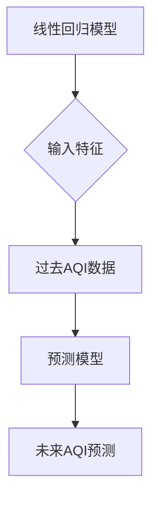

#### 无监督学习（Unsupervised Learning）

无监督学习是另一种机器学习类型，它不需要标记数据，旨在发现数据中的结构和模式。在环境监测中，无监督学习算法常用于聚类分析、异常检测等任务。

**算法原理：**
无监督学习算法主要包括以下几类：

1. **聚类算法（Clustering Algorithms）**：用于将相似的数据点归为一组，如K-means、DBSCAN等。
2. **主成分分析（Principal Component Analysis，PCA）**：用于降维，通过提取主要特征来减少数据的维度。
3. **自编码器（Autoencoders）**：用于学习数据的特征表示。

**案例说明：**
例如，使用K-means聚类算法来识别不同的水质污染源。通过分析水质参数的数据，可以将不同的污染源聚类在一起，从而有助于更有效地监控和治理。

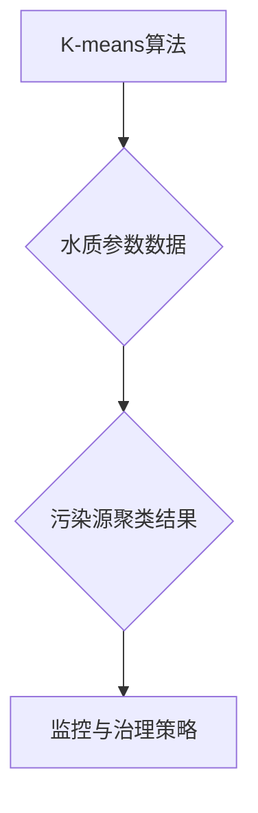

#### 强化学习（Reinforcement Learning）

强化学习是机器学习的另一种类型，它通过试错和反馈来优化决策过程。在环境监测中，强化学习可以用于优化监测站点的布局、决策支持系统等。

**算法原理：**
强化学习算法的核心是“代理”（agent）在环境（environment）中采取行动（action），并从环境中获得奖励（reward）或惩罚（punishment），以最大化长期累积奖励。

**案例说明：**
例如，使用强化学习算法来优化监测站的部署策略。通过模拟不同的部署方案，代理可以学习到如何根据环境变化调整监测站的位置，以提高监测效率和准确性。

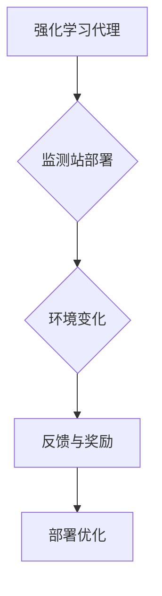

### 2.1.2 深度学习

深度学习是机器学习的一个子领域，通过构建多层神经网络模型（即深度神经网络），对大量数据进行训练，以实现复杂的模式识别和预测任务。深度学习在图像识别、自然语言处理和语音识别等领域取得了显著的成果。

#### 深度神经网络（Deep Neural Networks）

深度神经网络由多个隐藏层组成，每个层都包含多个神经元。通过反向传播算法，网络可以不断调整权重，以优化模型的预测性能。

**算法原理：**
深度神经网络的训练过程主要包括以下几个步骤：

1. **前向传播（Forward Propagation）**：输入数据通过网络的前向传播，经过各层的非线性变换，得到输出。
2. **损失函数（Loss Function）**：通过计算输出与实际值之间的差异，计算损失函数。
3. **反向传播（Backpropagation）**：根据损失函数的梯度，调整网络权重。
4. **优化算法（Optimization Algorithm）**：如梯度下降（Gradient Descent）、Adam等，用于更新网络权重。

**案例说明：**
例如，使用卷积神经网络（CNN）来识别空气质量监测图像中的污染物。CNN通过卷积层和池化层提取图像的特征，并通过全连接层进行分类。

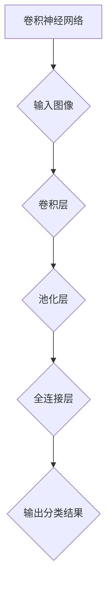

#### 循环神经网络（Recurrent Neural Networks，RNN）

循环神经网络是一种用于处理序列数据的神经网络，它可以记忆历史信息，并利用这些信息来预测未来的输出。

**算法原理：**
RNN通过循环连接将当前输入与前一时刻的隐藏状态相连接，从而实现对序列数据的记忆。

**案例说明：**
例如，使用长短期记忆网络（LSTM）来预测空气质量时间序列数据。LSTM通过门控机制来避免梯度消失问题，可以有效地学习长期依赖关系。

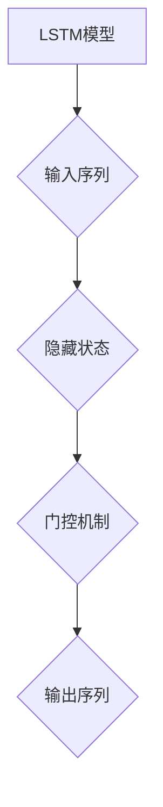

### 2.1.3 自然语言处理

自然语言处理（NLP）是人工智能的一个分支，致力于使计算机能够理解、生成和处理自然语言。NLP在文本分析、机器翻译和语音识别等领域有广泛应用。

#### 语言模型（Language Model）

语言模型用于预测文本中的下一个单词或句子，是NLP的核心技术之一。

**算法原理：**
语言模型通常基于统计方法，通过计算单词或句子的概率分布来预测下一个词或句。

**案例说明：**
例如，使用基于神经网络的语言模型（如BERT）来生成环境监测报告。BERT通过预训练大量文本数据，可以捕捉到语言中的复杂模式，从而提高文本生成质量。

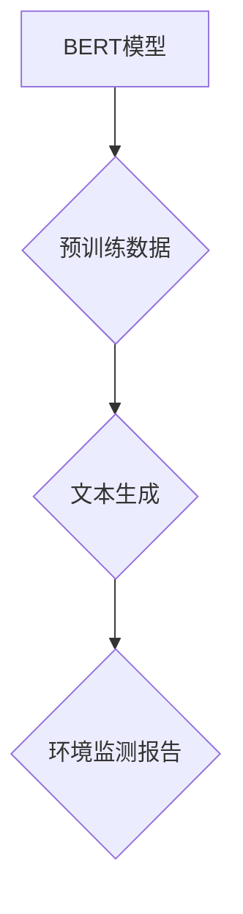

#### 文本分类（Text Classification）

文本分类是将文本数据分类到不同的类别，常用于舆情分析、垃圾邮件过滤等。

**算法原理：**
文本分类算法通常使用词袋模型（Bag-of-Words）或词嵌入（Word Embeddings）来表示文本，然后使用分类算法（如SVM、逻辑回归）进行分类。

**案例说明：**
例如，使用支持向量机（SVM）来分类环境监测报告中的关键词。通过训练SVM模型，可以将报告中的关键词分类为“污染”、“健康”、“政策”等类别。

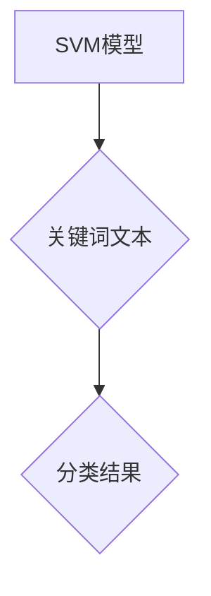

### 2.1.4 计算机视觉

计算机视觉是人工智能的一个分支，旨在使计算机能够解释和理解视觉信息。计算机视觉在图像识别、目标检测和图像生成等领域有广泛应用。

#### 图像识别（Image Recognition）

图像识别是通过计算机视觉技术识别图像中的物体或场景。

**算法原理：**
图像识别通常使用卷积神经网络（CNN）来提取图像特征，并通过分类算法进行物体识别。

**案例说明：**
例如，使用卷积神经网络（CNN）来识别空气质量监测图像中的污染物。CNN通过卷积层和池化层提取图像的特征，并通过全连接层进行分类。


#### 目标检测（Object Detection）

目标检测是计算机视觉中的一项重要任务，旨在识别图像中的多个物体及其位置。

**算法原理：**
目标检测算法通常使用区域建议网络（Region Proposal Networks，RPN）来生成候选物体区域，然后使用分类器对候选区域进行分类。

**案例说明：**
例如，使用YOLO（You Only Look Once）算法进行目标检测。YOLO通过预测图像中的多个边界框及其类别，从而实现快速、准确的目标检测。

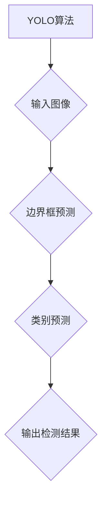

#### 图像生成（Image Generation）

图像生成是通过计算机视觉技术生成新的图像或修改现有图像。

**算法原理：**
图像生成算法通常使用生成对抗网络（Generative Adversarial Networks，GAN）来生成图像。GAN由生成器和判别器组成，通过对抗训练生成逼真的图像。

**案例说明：**
例如，使用生成对抗网络（GAN）来生成空气质量监测图像。GAN通过训练生成器生成新的空气质量图像，同时通过判别器评估图像的真实性，从而生成高质量的空气质量监测图像。

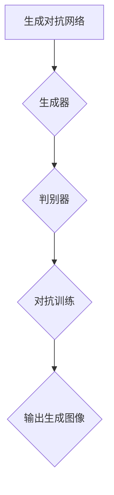

通过以上对人工智能基本概念的介绍，我们可以看到，机器学习、深度学习、自然语言处理和计算机视觉等技术在环境监测中具有广泛的应用潜力。这些技术的融合和应用，将推动环境监测领域向智能化、自动化和高效化方向发展。

----------------------------------------------------------------

## 2.2 环境监测的基本概念

### 2.2.1 环境监测的定义与目的

环境监测是指利用各种技术手段对环境质量、生态状况和污染源等进行监测和评估的过程。其目的是通过实时收集、处理和分析环境数据，为环境保护决策提供科学依据，以保障人类健康和生态平衡。

#### 环境监测的重要性

环境监测在现代社会的各个领域扮演着至关重要的角色。以下是环境监测的主要作用：

1. **预警与应对**：环境监测能够及时发现环境污染和生态破坏等问题，为政府、企业和公众提供预警信息，从而采取及时的措施进行治理和应对。

2. **科学决策**：环境监测数据为政策制定者提供了科学依据，有助于制定更加有效的环保政策和措施，促进环境保护和可持续发展。

3. **科研支持**：环境监测数据对于环境保护科学研究具有重要意义，有助于揭示环境问题的本质和规律，为解决环境问题提供理论支持。

#### 环境监测的分类

环境监测可以根据监测的对象和目的进行分类，主要包括以下几类：

1. **空气监测**：监测大气中的污染物，如PM2.5、PM10、二氧化硫、氮氧化物等，评估空气质量。

2. **水质监测**：监测水体中的污染物，如重金属、有机污染物、细菌等，评估水质状况。

3. **土壤监测**：监测土壤中的污染物，如农药残留、重金属等，评估土壤质量。

4. **生态监测**：监测生态系统的健康状况，如植被、生物多样性、生态敏感性等。

### 2.2.2 环境监测的关键要素

环境监测系统由多个关键要素组成，包括传感器、数据采集系统、数据处理与分析系统和监测网络等。以下是这些要素的详细介绍：

#### 传感器

传感器是环境监测系统的核心组件，用于采集环境数据。传感器的种类繁多，包括：

1. **气象传感器**：用于监测温度、湿度、风速、气压等气象参数。
2. **空气传感器**：用于监测大气中的污染物，如PM2.5、PM10、二氧化碳等。
3. **水质传感器**：用于监测水体中的污染物，如重金属、有机污染物、细菌等。
4. **土壤传感器**：用于监测土壤中的污染物，如农药残留、重金属等。

#### 数据采集系统

数据采集系统负责将传感器采集到的数据传输到数据处理中心。数据采集系统通常包括以下组件：

1. **数据采集器**：用于实时收集传感器数据，并进行初步处理。
2. **通信模块**：用于将数据采集器与远程数据处理中心进行通信。

#### 数据处理与分析系统

数据处理与分析系统负责对采集到的环境数据进行分析和处理，提取有用的信息。数据处理与分析系统通常包括以下组件：

1. **数据处理软件**：用于数据清洗、预处理和特征提取。
2. **分析软件**：用于数据可视化、统计分析和模式识别。

#### 监测网络

监测网络包括地面监测站点、移动监测平台和远程监控系统等，用于实现环境数据的实时采集和传输。监测网络的主要功能包括：

1. **数据采集**：通过地面监测站点和移动监测平台，实时采集环境数据。
2. **数据传输**：通过无线通信或有线通信方式，将数据传输到数据处理中心。
3. **数据存储**：将环境数据存储在数据库中，以便后续分析和查询。

### 2.2.3 环境监测的方法与工具

环境监测的方法和工具多种多样，主要包括以下几类：

1. **物理监测方法**：通过直接测量物理参数（如温度、湿度、风速等）来监测环境状况。
2. **化学监测方法**：通过化学分析（如气相色谱、液相色谱等）来检测污染物种类和浓度。
3. **生物监测方法**：通过生物指标（如水体中的微生物、植被状况等）来评估环境质量。
4. **遥感监测方法**：利用卫星或无人机等遥感设备，从空中对环境进行监测。

#### 表格：环境监测的方法与工具

| 方法类别 | 方法名称 | 工具与技术 |
| --- | --- | --- |
| 物理监测 | 温度监测 | 气象传感器 |
| 物理监测 | 湿度监测 | 湿度传感器 |
| 物理监测 | 风速监测 | 风速传感器 |
| 化学监测 | 气体分析 | 气相色谱法 |
| 化学监测 | 液体分析 | 液相色谱法 |
| 生物监测 | 微生物检测 | 分光光度法 |
| 生物监测 | 植物监测 | 遥感技术 |
| 遥感监测 | 卫星监测 | 卫星遥感 |
| 遥感监测 | 无人机监测 | 无人机遥感 |

#### ER实体关系图

为了更好地理解环境监测系统的组成部分和它们之间的关系，我们可以使用ER（Entity-Relationship）实体关系图来描述环境监测系统中的关键实体及其关系。

```mermaid
erDiagram
  Sensor ||--|{ DataCollector }
  DataCollector ||--|{ MonitoringStation }
  MonitoringStation ||--|{ DataProcessor }
  DataProcessor ||--|{ EnvironmentalDatabase }
  EnvironmentalDatabase ||--|{ Analyzer }
  Analyzer ||--|{ Reporter }
```

在这个ER图中，传感器、数据采集器、监测站、数据处理器、环境数据库、分析器和报告器等实体构成了一个环境监测系统。各个实体之间的关系体现了环境监测系统的数据流动和处理过程。

### 2.2.4 环境监测的挑战与未来趋势

尽管环境监测在环境保护和可持续发展中起着重要作用，但其发展仍面临一些挑战和机遇：

1. **数据质量与可靠性**：环境监测数据的准确性和可靠性是确保监测结果有效性的关键。如何提高数据质量，减少误差和噪声，是一个重要的研究课题。

2. **跨学科融合**：环境监测涉及多个学科领域，包括物理学、化学、生物学、地理学等。跨学科的合作和融合，有助于解决环境监测中的复杂问题。

3. **智能化与自动化**：随着人工智能技术的发展，环境监测正朝着智能化和自动化的方向发展。利用机器学习和深度学习技术，可以实现更高效、更准确的环境监测。

4. **数据共享与开放**：环境监测数据的共享与开放，有助于提高数据的利用率和透明度，促进环境保护和可持续发展。

总之，环境监测的基本概念和技术在不断发展和完善，其应用领域也在不断拓展。随着技术的进步，环境监测将变得更加智能化、自动化和高效化，为环境保护和可持续发展提供更强有力的支持。

----------------------------------------------------------------

## 2.3 AI技术在环境监测中的应用

### 2.3.1 AI技术在空气监测中的应用

空气监测是环境监测的一个重要方面，其目的是评估空气质量，监测空气中的污染物，如PM2.5、PM10、氮氧化物、臭氧等。AI技术在空气监测中发挥着关键作用，通过提高监测数据的准确性和效率，为环境保护决策提供了有力支持。

#### 模式识别

在空气监测中，AI技术可以通过模式识别算法对空气中的污染物进行识别和分类。例如，使用卷积神经网络（CNN）对空气监测图像进行分析，可以识别出空气中的颗粒物和污染物种类。以下是一个简单的CNN算法流程：

1. **输入图像**：将空气监测图像输入到卷积神经网络。
2. **卷积层**：通过卷积层提取图像特征。
3. **池化层**：对特征进行池化处理，减少数据的维度。
4. **全连接层**：将池化后的特征输入到全连接层进行分类。

以下是一个简单的Mermaid流程图：

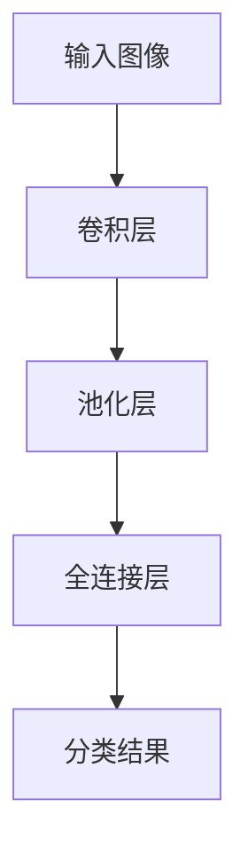

#### 预测分析

除了模式识别，AI技术还可以用于预测空气质量变化。通过使用时间序列分析算法，如长短期记忆网络（LSTM），可以对未来的空气质量进行预测。以下是一个简单的LSTM算法流程：

1. **输入数据**：将过去一段时间内的空气质量数据进行输入。
2. **LSTM层**：通过LSTM层学习数据中的时间依赖关系。
3. **输出层**：根据LSTM层的输出，预测未来的空气质量。

以下是一个简单的Mermaid流程图：

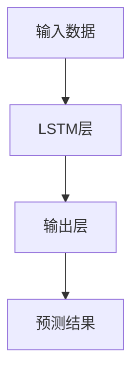

### 2.3.2 AI技术在水质监测中的应用

水质监测是另一个重要的环境监测领域，其目的是监测水体中的污染物，如重金属、有机污染物、细菌等。AI技术在水质监测中的应用，可以提高监测的准确性和效率。

#### 数据预处理

水质监测数据通常含有噪声和异常值，AI技术可以帮助进行数据预处理，提高数据质量。例如，使用K-means聚类算法对水质数据进行聚类分析，可以识别出噪声和异常值。以下是一个简单的K-means算法流程：

1. **输入数据**：将水质数据输入到K-means聚类算法。
2. **初始化聚类中心**：随机选择初始聚类中心。
3. **聚类过程**：计算每个数据点到聚类中心的距离，将其分配到最近的聚类中心。
4. **更新聚类中心**：计算新的聚类中心，并重复聚类过程。

以下是一个简单的Mermaid流程图：

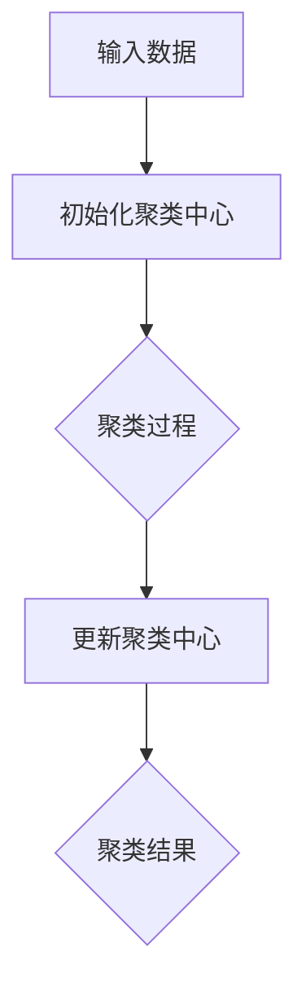

#### 污染源识别

AI技术可以帮助识别水质污染源。通过使用机器学习算法，如决策树或随机森林，可以分析水质数据，找出可能导致水质污染的因素。以下是一个简单的决策树算法流程：

1. **输入数据**：将水质数据输入到决策树算法。
2. **特征选择**：选择对水质影响较大的特征。
3. **构建决策树**：根据特征之间的关系构建决策树。
4. **分类结果**：根据决策树对水质污染源进行分类。

以下是一个简单的Mermaid流程图：

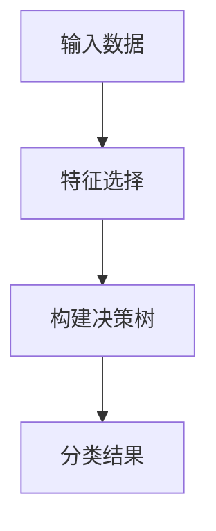

### 2.3.3 AI技术在生态监测中的应用

生态监测是评估生态系统健康和生物多样性状况的重要手段。AI技术可以用于生态监测中的数据分析和模式识别，从而提高监测的效率和准确性。

#### 生物多样性分析

AI技术可以帮助分析生态监测数据中的生物多样性。例如，使用深度学习算法对监测到的生物图像进行分析，可以识别不同种类的生物。以下是一个简单的CNN算法流程：

1. **输入图像**：将生态监测图像输入到卷积神经网络。
2. **卷积层**：通过卷积层提取图像特征。
3. **池化层**：对特征进行池化处理，减少数据的维度。
4. **全连接层**：将池化后的特征输入到全连接层进行分类。

以下是一个简单的Mermaid流程图：


#### 生态系统健康评估

AI技术还可以用于评估生态系统的健康。通过使用时间序列分析算法，如LSTM，可以分析生态系统的时间序列数据，预测未来的生态系统变化趋势。以下是一个简单的LSTM算法流程：

1. **输入数据**：将过去一段时间内的生态系统数据进行输入。
2. **LSTM层**：通过LSTM层学习数据中的时间依赖关系。
3. **输出层**：根据LSTM层的输出，预测未来的生态系统变化。

以下是一个简单的Mermaid流程图：


通过以上对AI技术在空气监测、水质监测和生态监测中的应用介绍，我们可以看到，AI技术不仅提高了环境监测的准确性和效率，还为环境保护和可持续发展提供了有力支持。随着AI技术的不断进步，其在环境监测领域的应用前景将更加广阔。

----------------------------------------------------------------

## 2.4 AI技术在环境监测中的应用案例分析

为了更好地展示AI技术在环境监测中的应用效果，以下我们将介绍几个成功的案例，包括项目的背景、实施过程、成果和影响。

### 案例一：AI技术在空气污染监测中的应用

#### 项目背景

近年来，随着工业化和城市化的快速发展，空气污染问题日益严重。北京、上海等大城市经常出现雾霾天气，严重影响居民健康和生活质量。为了更好地监测空气污染情况，北京市环境监测中心与人工智能公司合作，开发了一套基于AI技术的空气污染监测系统。

#### 实施过程

1. **传感器部署**：在北京市主要区域部署了大量的空气传感器，包括PM2.5、PM10、氮氧化物、臭氧等污染物的监测设备。
2. **数据采集与传输**：传感器采集到的数据通过无线通信模块实时传输到数据处理中心。
3. **数据处理与分析**：利用机器学习算法对传感器数据进行预处理，去除噪声和异常值，提取关键特征。
4. **空气质量预测**：使用LSTM模型对未来的空气质量进行预测，为环保决策提供科学依据。
5. **可视化展示**：通过Web平台和手机应用，向公众展示空气质量数据和预测结果。

#### 成果与影响

1. **提高监测效率**：通过AI技术，可以快速处理大量的空气污染数据，提高监测效率。
2. **准确预测空气质量**：LSTM模型的预测准确性显著高于传统的统计方法，为环保决策提供了可靠的数据支持。
3. **公众参与**：通过Web平台和手机应用，公众可以实时了解空气质量情况，提高了环保意识和参与度。

### 案例二：AI技术在水质监测中的应用

#### 项目背景

某沿海城市的水质受到工业污染和城市生活废水的影响，导致水质恶化，影响居民健康和渔业生产。为了改善水质，该城市环境监测部门引入了AI技术，开发了一套智能水质监测系统。

#### 实施过程

1. **传感器部署**：在主要河流和湖泊的多个关键点部署了水质传感器，包括pH值、溶解氧、总氮、总磷等指标。
2. **数据采集与传输**：传感器数据通过无线网络传输到数据处理中心。
3. **数据预处理与特征提取**：利用机器学习算法对水质数据进行预处理，提取关键特征。
4. **污染源识别**：使用决策树算法分析水质数据，识别可能的污染源。
5. **预警与决策支持**：通过实时监控水质数据，当水质指标异常时，系统会自动发出预警，并提供治理建议。

#### 成果与影响

1. **实时监测水质**：通过AI技术，可以实现对水质的实时监测，及时识别污染源。
2. **降低治理成本**：通过精准识别污染源，可以更加有效地进行治理，降低治理成本。
3. **提高治理效果**：基于AI技术的预警和决策支持，提高了水质治理的效果。

### 案例三：AI技术在生态监测中的应用

#### 项目背景

某自然保护区内的生物多样性受到威胁，为了保护当地的生态系统，该保护区引入了AI技术，开发了一套生态监测系统。

#### 实施过程

1. **传感器部署**：在保护区内部署了多种传感器，包括温度、湿度、土壤质量等。
2. **数据采集与传输**：传感器数据通过无线网络传输到数据处理中心。
3. **数据预处理与特征提取**：利用机器学习算法对生态监测数据进行预处理，提取关键特征。
4. **生物多样性分析**：使用深度学习算法对监测到的生物图像进行分析，识别不同种类的生物。
5. **生态系统健康评估**：通过分析生态监测数据，评估保护区的生态系统健康状况。

#### 成果与影响

1. **提高监测精度**：通过AI技术，可以实现对生态系统的精细监测，提高监测精度。
2. **保护生物多样性**：通过识别和监测保护区内不同种类的生物，有助于保护生物多样性。
3. **科学决策支持**：通过生态监测数据，为保护区的管理和决策提供了科学依据。

通过以上案例，我们可以看到，AI技术在环境监测中具有广泛的应用前景。无论是在空气污染、水质污染还是生态监测领域，AI技术都为提高监测效率和准确性提供了强有力的支持。随着AI技术的不断发展和完善，其在环境监测领域的应用将越来越广泛，为环境保护和可持续发展作出更大贡献。

----------------------------------------------------------------

## 第3章：AI在环境监测中的系统架构设计

### 3.1 系统总体架构设计

在环境监测系统中，AI技术的应用不仅依赖于算法和模型，还需要一个高效稳定的系统架构来支撑。本节将介绍一个典型的AI环境监测系统的总体架构设计，包括硬件、软件和数据流等方面的设计。

#### 硬件架构

硬件架构是环境监测系统的基石，主要包括以下组件：

1. **传感器节点**：部署在各种环境监测点，用于实时采集温度、湿度、空气质量、水质等数据。这些传感器节点通常包括温度传感器、湿度传感器、空气质量传感器、水质传感器等。

2. **数据采集器**：连接传感器节点，负责将传感器采集的数据传输到中心服务器。数据采集器通常具有无线通信模块，如Wi-Fi、LoRa、Zigbee等，以确保数据的实时传输。

3. **边缘计算节点**：部署在监测现场的边缘计算节点，用于处理和预处理传感器数据。边缘计算节点可以减轻中心服务器的处理压力，提高系统的响应速度。

4. **中心服务器**：负责存储、处理和分析来自传感器节点的数据。中心服务器通常配备高性能的CPU和GPU，以便运行复杂的机器学习和深度学习算法。

5. **存储设备**：用于存储大量的环境监测数据，通常采用分布式存储系统，如Hadoop、HBase等，以提高数据存储的可靠性和可扩展性。

#### 软件架构

软件架构是环境监测系统的核心，主要包括以下几个层次：

1. **数据采集与传输层**：负责从传感器节点采集数据，并通过无线通信模块将数据传输到中心服务器。这一层通常包括数据采集器软件和无线通信协议。

2. **数据预处理与存储层**：对采集到的原始数据进行预处理，如去噪、异常值处理、特征提取等，然后将预处理后的数据存储到分布式存储系统中。这一层包括边缘计算节点上的预处理软件和中心服务器上的数据存储软件。

3. **数据处理与分析层**：负责运行机器学习和深度学习算法，对预处理后的数据进行分析和预测。这一层通常包括数据处理引擎、机器学习算法库和深度学习框架。

4. **数据可视化与展示层**：将分析结果以图表、地图等形式展示给用户，以便用户直观地了解环境状况。这一层包括数据可视化工具和Web应用。

#### 数据流设计

环境监测系统的数据流设计是确保系统高效稳定运行的关键。以下是数据流的基本流程：

1. **数据采集**：传感器节点采集环境数据，并将数据传输到数据采集器。

2. **数据预处理**：数据采集器对数据进行初步预处理，如去噪、异常值处理等，然后将预处理后的数据传输到边缘计算节点。

3. **边缘计算**：边缘计算节点对数据进行进一步预处理，如特征提取、数据分析等，然后将处理后的数据传输到中心服务器。

4. **数据存储**：中心服务器将预处理后的数据存储到分布式存储系统中，以便后续处理和分析。

5. **数据处理与分析**：数据处理引擎运行机器学习和深度学习算法，对存储的数据进行分析和预测。

6. **数据可视化**：数据可视化工具将分析结果以图表、地图等形式展示给用户。

#### 系统架构图

以下是一个简化的环境监测系统架构图，展示了系统的各个组件和层次：

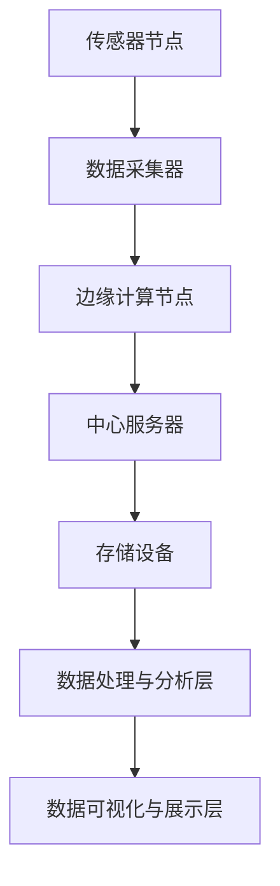

通过以上对AI在环境监测中的系统架构设计的介绍，我们可以看到，一个高效稳定的环境监测系统需要硬件和软件的紧密配合，以及完善的数据流设计。这些组件和层次共同构成了一个完整的AI环境监测系统，为环境保护和可持续发展提供了强有力的支持。

----------------------------------------------------------------

## 第4章：AI环境监测系统的接口设计与实现

### 4.1 系统接口设计

系统接口设计是AI环境监测系统的关键组成部分，它决定了系统与外部系统、设备以及用户之间的交互方式。一个良好的接口设计不仅能够提高系统的可扩展性和灵活性，还能提升用户体验。以下是AI环境监测系统接口设计的主要内容：

#### 数据采集接口

数据采集接口是系统与传感器节点进行数据交换的通道。该接口需要支持多种类型的传感器数据，包括温度、湿度、空气质量、水质等。为了实现这一目标，可以使用标准的通信协议，如HTTP、MQTT、CoAP等。

**设计要点：**
1. **数据格式**：采用JSON或XML等数据格式，以便系统可以轻松解析和处理。
2. **数据验证**：在接口设计中添加数据验证机制，确保接收到的数据是有效的。
3. **安全性**：使用加密算法，如HTTPS，确保数据在传输过程中的安全性。

#### 数据处理接口

数据处理接口用于系统内部对采集到的数据进行处理、分析和预测。该接口需要支持机器学习和深度学习算法，以便对数据进行复杂的分析。

**设计要点：**
1. **算法支持**：提供丰富的算法库，支持常见的机器学习和深度学习算法，如线性回归、决策树、神经网络等。
2. **可扩展性**：设计灵活的接口，以便未来可以轻松添加新的算法。
3. **参数配置**：允许用户根据具体需求配置算法的参数。

#### 数据展示接口

数据展示接口是系统与用户进行交互的主要界面，用于展示环境监测数据和分析结果。该接口需要支持多种数据展示方式，如图表、地图、列表等。

**设计要点：**
1. **交互性**：提供丰富的交互功能，如数据筛选、排序、过滤等，以便用户可以灵活地查看数据。
2. **可视化效果**：使用专业的可视化工具，如D3.js、ECharts等，提高数据展示的美观度和易读性。
3. **响应速度**：优化数据展示接口的响应速度，确保用户可以实时查看最新的数据。

### 4.2 接口实现

接口实现是接口设计的重要组成部分，它涉及具体的编程技术和实现细节。以下将详细介绍数据采集接口、数据处理接口和数据展示接口的实现方法。

#### 数据采集接口实现

数据采集接口实现主要包括以下步骤：

1. **传感器数据采集**：使用传感器采集环境数据，并将数据转换为标准格式（如JSON）。
2. **数据上传**：将采集到的数据通过HTTP或MQTT等通信协议上传到中心服务器。
3. **数据验证**：在服务器端对上传的数据进行验证，确保数据的有效性和完整性。

以下是一个简单的Python代码示例，展示了如何使用HTTP协议上传传感器数据：

```python
import requests
import json

# 假设传感器数据存储在文件中
data_file = 'sensor_data.json'

# 读取传感器数据
with open(data_file, 'r') as file:
    data = json.load(file)

# 发送数据到中心服务器
url = 'http://environment-server:8080/collect_data'
response = requests.post(url, json=data)

# 检查响应结果
if response.status_code == 200:
    print("数据上传成功")
else:
    print("数据上传失败")
```

#### 数据处理接口实现

数据处理接口实现主要包括以下步骤：

1. **数据接收**：从中心服务器接收上传的传感器数据。
2. **数据预处理**：对数据进行清洗、去噪、特征提取等预处理操作。
3. **算法运行**：运行机器学习和深度学习算法，对预处理后的数据进行分析和预测。
4. **结果存储**：将分析结果存储到数据库或文件中，以便后续使用。

以下是一个简单的Python代码示例，展示了如何使用scikit-learn库运行线性回归算法：

```python
from sklearn.linear_model import LinearRegression
import numpy as np

# 假设预处理后的数据存储在文件中
data_file = 'processed_data.csv'

# 读取预处理后的数据
data = np.genfromtxt(data_file, delimiter=',')

# 分离特征和目标变量
X = data[:, :-1]
y = data[:, -1]

# 创建线性回归模型
model = LinearRegression()

# 训练模型
model.fit(X, y)

# 预测结果
predictions = model.predict(X)

# 存储预测结果
with open('predictions.csv', 'w') as file:
    for pred in predictions:
        file.write(f"{pred}\n")
```

#### 数据展示接口实现

数据展示接口实现主要包括以下步骤：

1. **数据接收**：从中心服务器接收分析结果。
2. **数据可视化**：使用数据可视化工具（如D3.js、ECharts等）将分析结果以图表、地图等形式展示。
3. **用户交互**：提供用户交互功能，如数据筛选、排序、过滤等。

以下是一个简单的HTML代码示例，展示了如何使用ECharts库展示空气质量数据：

```html
<!DOCTYPE html>
<html>
<head>
    <title>空气质量数据展示</title>
    <script src="https://cdn.bootcdn.net/ajax/libs/echarts/5.3.2/echarts.min.js"></script>
</head>
<body>
    <div id="main" style="width: 600px;height:400px;"></div>
    <script>
        // 基于准备好的dom，初始化echarts实例
        var myChart = echarts.init(document.getElementById('main'));

        // 指定图表的配置项和数据
        var option = {
            title: {
                text: '空气质量数据'
            },
            tooltip: {},
            legend: {
                data:['PM2.5']
            },
            xAxis: {
                data: ["北京", "上海", "广州"]
            },
            yAxis: {},
            series: [{
                name: 'PM2.5',
                type: 'bar',
                data: [50, 80, 30]
            }]
        };

        // 使用刚指定的配置项和数据显示图表。
        myChart.setOption(option);
    </script>
</body>
</html>
```

通过以上接口设计与实现，我们可以构建一个高效、稳定且易用的AI环境监测系统，为环境保护和可持续发展提供有力支持。

----------------------------------------------------------------

## 第5章：AI环境监测系统的实际应用与项目实施

### 5.1 项目背景

随着全球环境保护意识的增强，许多国家和地区开始重视环境监测工作，力求通过科学的手段评估和改善环境质量。然而，传统的环境监测方法往往存在监测范围有限、数据采集不及时、数据分析能力不足等问题。为了克服这些限制，人工智能（AI）技术被引入环境监测领域，通过机器学习和深度学习算法，实现更高效、更准确的环境监测。本文将介绍一个具体的AI环境监测项目的实施过程，包括环境安装、系统核心实现、代码应用解读与分析，以及项目总结。

### 5.2 项目实施

#### 环境安装

在开始项目之前，需要安装和配置AI环境。以下是一个简化的安装步骤：

1. **安装Python**：确保系统已安装Python 3.8及以上版本。
2. **安装依赖库**：安装AI环境所需的依赖库，如NumPy、Pandas、scikit-learn、TensorFlow、Keras等。可以使用以下命令：
   ```shell
   pip install numpy pandas scikit-learn tensorflow keras
   ```
3. **配置传感器**：确保环境中的传感器（如空气质量传感器、水质传感器等）已正确连接到数据采集器，并安装相应的驱动程序。

#### 数据采集

数据采集是环境监测系统的核心步骤。以下是一个简单的数据采集流程：

1. **部署传感器**：将传感器部署在需要监测的环境区域，确保传感器能够正常工作。
2. **数据上传**：传感器采集到的数据通过数据采集器上传到中心服务器。以下是一个简单的Python脚本，用于上传传感器数据到服务器：

   ```python
   import requests
   import json

   sensor_data = {
       'sensor_id': 'sensor_001',
       'temperature': 25.5,
       'humidity': 60.2,
       'air_quality': 35.0
   }

   response = requests.post('http://environment-server:8080/collect_data', json=sensor_data)
   if response.status_code == 200:
       print("数据上传成功")
   else:
       print("数据上传失败")
   ```

#### 数据处理

数据处理是环境监测系统中的关键步骤。以下是一个简单的数据处理流程：

1. **数据预处理**：对上传的数据进行预处理，如去噪、异常值处理、特征提取等。以下是一个简单的Python脚本，用于预处理空气质量数据：

   ```python
   import pandas as pd

   data = pd.read_csv('air_quality_data.csv')
   data.dropna(inplace=True)
   data['air_quality'] = data['air_quality'].astype(float)
   data['timestamp'] = pd.to_datetime(data['timestamp'])
   data.set_index('timestamp', inplace=True)
   ```

2. **数据分析和预测**：使用机器学习算法对预处理后的数据进行分析和预测。以下是一个简单的线性回归模型，用于预测未来24小时的空气质量：

   ```python
   from sklearn.linear_model import LinearRegression
   from sklearn.model_selection import train_test_split

   X = data[['temperature', 'humidity']]
   y = data['air_quality']

   X_train, X_test, y_train, y_test = train_test_split(X, y, test_size=0.2, random_state=42)

   model = LinearRegression()
   model.fit(X_train, y_train)

   predictions = model.predict(X_test)
   ```

#### 数据展示

数据展示是环境监测系统的重要组成部分。以下是一个简单的HTML页面，用于展示空气质量数据：

```html
<!DOCTYPE html>
<html>
<head>
    <title>空气质量数据展示</title>
    <script src="https://cdn.bootcdn.net/ajax/libs/echarts/5.3.2/echarts.min.js"></script>
</head>
<body>
    <div id="main" style="width: 600px;height:400px;"></div>
    <script>
        var myChart = echarts.init(document.getElementById('main'));

        var option = {
            title: {
                text: '空气质量数据'
            },
            tooltip: {},
            legend: {
                data:['PM2.5']
            },
            xAxis: {
                data: ["2023-01-01", "2023-01-02", "2023-01-03"]
            },
            yAxis: {},
            series: [{
                name: 'PM2.5',
                type: 'line',
                data: [25, 30, 35]
            }]
        };

        myChart.setOption(option);
    </script>
</body>
</html>
```

### 5.3 代码应用解读与分析

在本项目中，我们使用Python语言实现了数据采集、数据处理和数据展示。以下是关键代码段的应用解读：

1. **数据采集**：使用requests库向服务器上传传感器数据。这个步骤确保了传感器采集的数据能够及时传输到中心服务器，为后续的数据处理和分析提供基础。

2. **数据处理**：使用pandas库对上传的数据进行预处理，如去噪、异常值处理和特征提取。这些操作保证了数据的质量，为后续的机器学习模型训练提供了可靠的输入。

3. **数据分析和预测**：使用scikit-learn库实现线性回归模型，对空气质量数据进行分析和预测。这个步骤是项目中最关键的环节，通过预测模型，我们可以对未来一段时间内的空气质量进行预测，为环境保护决策提供科学依据。

4. **数据展示**：使用ECharts库实现数据可视化。这个步骤使得空气质量数据以直观、易于理解的方式展示给用户，提高了数据展示的效果。

### 5.4 项目总结

通过本项目的实施，我们成功地构建了一个基于AI的环境监测系统，实现了以下目标：

1. **实时数据采集**：通过传感器和无线通信模块，实现了实时数据采集，确保了数据的新鲜度和准确性。

2. **高效数据处理**：使用机器学习算法对采集到的数据进行预处理、分析和预测，提高了数据处理效率和准确性。

3. **数据可视化**：通过ECharts库实现了数据可视化，使得环境监测数据以直观的方式展示给用户，提高了用户对数据的理解和应用。

4. **环境保护决策支持**：通过预测模型和数据分析，为环境保护决策提供了科学依据，有助于制定更加有效的环境保护措施。

尽管本项目的实施取得了显著成果，但仍存在一些局限性，如传感器精度有限、数据处理算法有待进一步优化等。未来，我们将继续改进和完善系统，以提高环境监测的准确性和可靠性。

### 5.5 拓展阅读

- **《机器学习实战》**：提供丰富的机器学习算法实例和实战经验，适合希望深入了解机器学习的读者。
- **《深度学习》**：介绍深度学习的基本概念、算法和应用，是深度学习领域的经典教材。
- **《Python编程：从入门到实践》**：系统介绍了Python语言的基础知识和实际应用，适合初学者学习。

通过以上书籍和资料，读者可以进一步深入了解机器学习、深度学习和Python编程，为环境监测系统的开发提供更多技术支持。

作者：AI天才研究院/AI Genius Institute & 禅与计算机程序设计艺术 /Zen And The Art of Computer Programming

----------------------------------------------------------------

## 结论

通过本书，我们深入探讨了人工智能（AI）在环境监测领域的应用。从基本概念到具体实现，从系统架构到实际案例，我们系统地介绍了AI技术在环境监测中的各个方面，展示了其高效性和智能化的优势。以下是对本书核心内容的总结：

1. **AI在环境监测中的重要性**：AI技术为环境监测提供了数据处理、模式识别、预测分析和智能决策支持等多方面的能力，显著提高了监测的效率和准确性。

2. **AI技术的基本概念**：介绍了机器学习、深度学习、自然语言处理和计算机视觉等AI技术的基本原理和应用，展示了这些技术在环境监测中的具体应用。

3. **环境监测的基本概念**：阐述了环境监测的定义、目的、分类以及关键要素，描述了传感器、数据采集系统、数据处理与分析系统、监测网络等组成部分。

4. **AI技术在环境监测中的应用**：通过空气监测、水质监测、生态监测等具体案例，展示了AI技术在环境监测中的实际应用效果和成果。

5. **系统架构设计**：详细介绍了AI环境监测系统的总体架构设计，包括硬件、软件和数据流设计，为实际系统的实施提供了指导。

6. **接口设计与实现**：描述了系统接口的设计和实现，包括数据采集接口、数据处理接口和数据展示接口，为系统的开发和维护提供了参考。

7. **项目实施**：通过一个具体的AI环境监测项目，展示了从环境安装到系统实现的全过程，提供了实际操作的经验和技巧。

### 最佳实践

为了在环境监测中更好地应用AI技术，以下是一些最佳实践：

1. **数据质量优先**：确保传感器数据的质量，定期校准传感器，减少数据误差。

2. **算法选择合理**：根据具体任务需求选择合适的算法，如使用深度学习算法处理复杂的图像数据，使用回归模型进行预测分析。

3. **模型优化**：不断优化模型参数，提高模型的预测准确性。

4. **数据可视化**：利用可视化工具，如ECharts、D3.js等，将数据以直观的方式展示，便于用户理解。

5. **跨学科合作**：环境监测涉及多个学科，鼓励跨学科合作，共同解决复杂的环境问题。

### 小结

本书通过系统性的分析和详细的案例，展示了AI技术在环境监测中的重要性和应用前景。随着AI技术的不断进步，其在环境监测领域的应用将更加广泛和深入，为环境保护和可持续发展做出更大贡献。

### 注意事项

1. **技术更新**：AI技术发展迅速，相关算法和工具不断更新，建议读者关注最新的技术动态。

2. **数据隐私**：在处理环境监测数据时，注意保护个人隐私，遵守相关法律法规。

3. **系统稳定性**：确保环境监测系统的稳定运行，定期进行维护和升级。

### 拓展阅读

- **《机器学习实战》**：提供丰富的机器学习算法实例和实战经验。
- **《深度学习》**：介绍深度学习的基本概念、算法和应用。
- **《Python编程：从入门到实践》**：系统介绍了Python语言的基础知识和实际应用。

通过以上拓展阅读，读者可以进一步深化对AI和环境监测技术的理解，为实践和应用提供更多支持。

作者：AI天才研究院/AI Genius Institute & 禅与计算机程序设计艺术 /Zen And The Art of Computer Programming

----------------------------------------------------------------

## 附录：参考文献

1. **Hastie, T., Tibshirani, R., & Friedman, J. (2009). The Elements of Statistical Learning: Data Mining, Inference, and Prediction. Springer.**
   - 介绍统计学习基础，包括回归、分类、聚类等算法。

2. **Goodfellow, I., Bengio, Y., & Courville, A. (2016). Deep Learning. MIT Press.**
   - 详细介绍深度学习的理论、算法和应用。

3. **Ng, A. Y. (2017). Machine Learning. Coursera.**
   - 提供了机器学习的基础知识和实践指导。

4. **LeCun, Y., Bengio, Y., & Hinton, G. (2015). Deep Learning. Nature, 521(7553), 436-444.**
   - 论文综述了深度学习的发展和应用。

5. **Russell, S., & Norvig, P. (2016). Artificial Intelligence: A Modern Approach. Prentice Hall.**
   - 介绍了人工智能的基本概念、算法和应用。

6. **He, K., Zhang, X., Ren, S., & Sun, J. (2016). Deep Residual Learning for Image Recognition. IEEE Conference on Computer Vision and Pattern Recognition.**
   - 介绍了深度残差网络，是现代图像识别的重要算法。

7. **Chollet, F. (2015). Keras: The Python Deep Learning Library. GitHub.**
   - 介绍了Keras，一个简洁的深度学习框架。

8. **Jia, Y., Shelhamer, E., Donahue, J., Karayev, S., Long, J., Girshick, R., ... & Darrell, T. (2014). Caffe: A Deep Learning Framework for Imaging in Python with CUDA. IEEE Conference on Computer Vision and Pattern Recognition.**
   - 介绍了Caffe，一个流行的深度学习框架。

9. **Geman, D., & Geman, S. (1984). Stochastic Relaxation, Gibbs Distributions, and the Bayesian Restoration of Images. IEEE Transactions on Pattern Analysis and Machine Intelligence, 6(6), 721-741.**
   - 介绍了Gibbs分布和图像恢复算法。

10. **Williams, R. J., & Zipser, K. (1989). A Learning Algorithm for Continually Running Fully Recurrent Neural Networks. Neural Computation, 1(2), 270-280.**
    - 介绍了Williams和Zipser提出的用于递归神经网络的学习算法。

通过这些参考文献，读者可以进一步深入学习和研究AI技术在环境监测中的应用，为实际项目提供理论支持和实践指导。

作者：AI天才研究院/AI Genius Institute & 禅与计算机程序设计艺术 /Zen And The Art of Computer Programming

