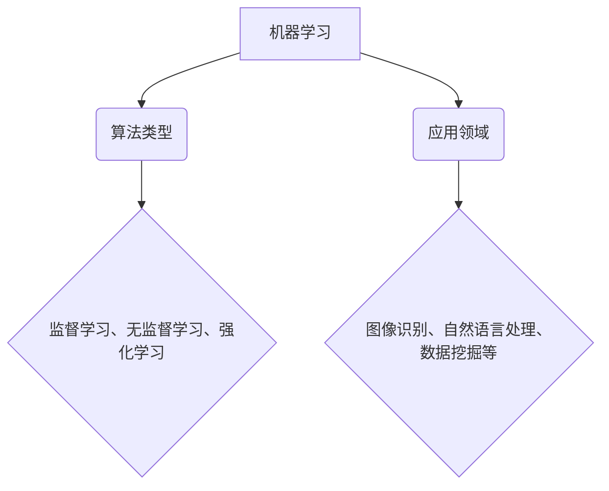
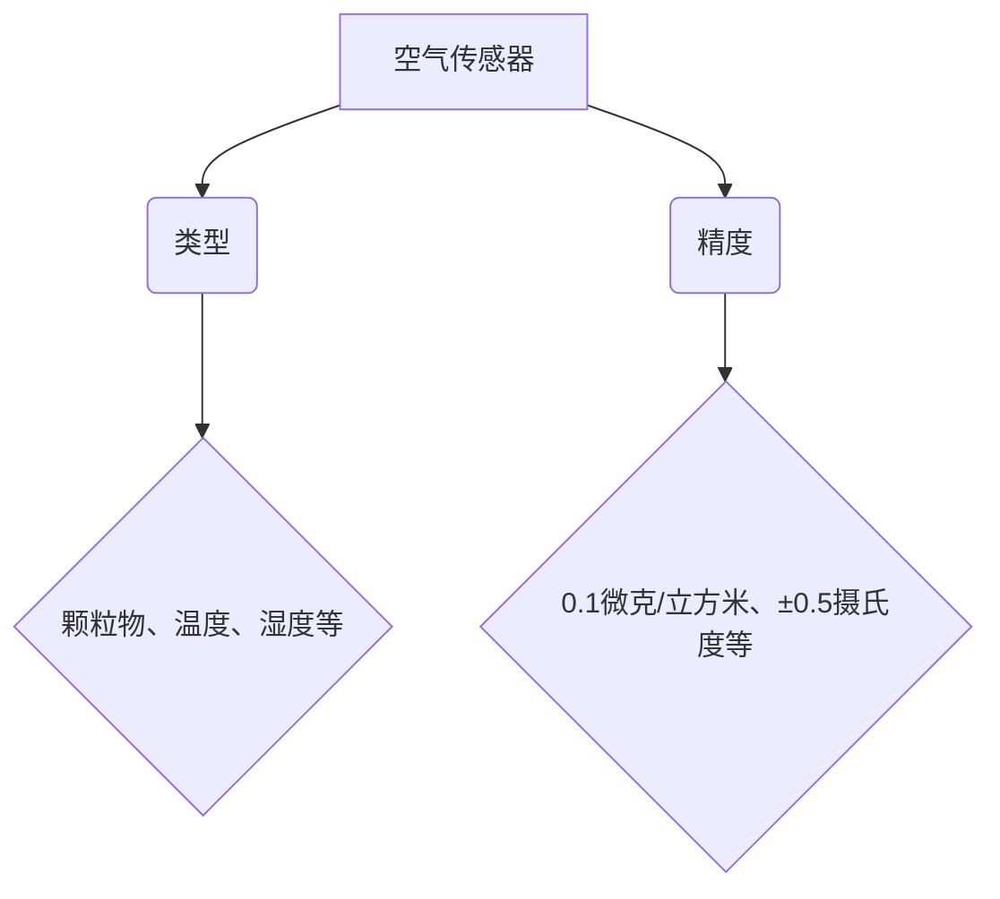
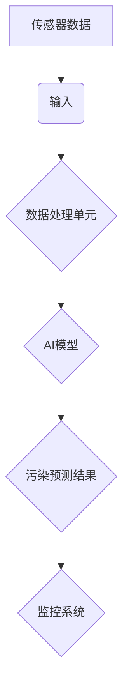
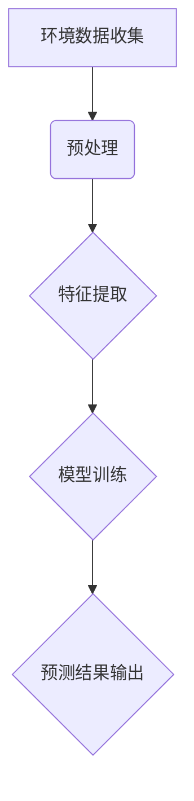
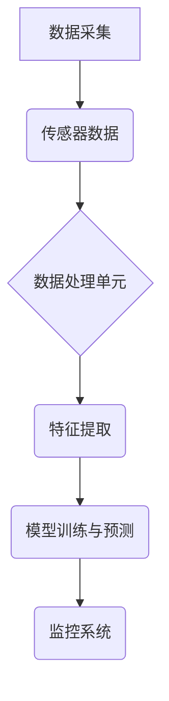
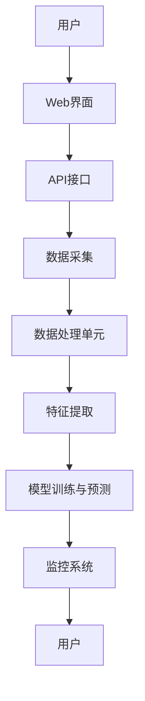

                 

### 书名：《人工智能在环境污染监测中的应用前景》

### 第一部分：背景介绍

#### 1. 环境污染问题概述

在全球范围内，环境污染问题日益严重，已经成为影响人类健康和生态系统的主要威胁。环境污染的种类繁多，包括空气污染、水污染和土壤污染等，它们对人类的生活质量和健康产生了深远的影响。空气污染主要来源于工业排放、汽车尾气和燃烧化石燃料等，会导致呼吸系统疾病和心血管疾病的发病率上升；水污染则源于工业废水、农业面源污染和生活污水，对饮用水安全和生态环境构成严重威胁；土壤污染则主要来源于工业废弃物、农药和化肥等，会破坏土壤结构，降低土壤肥力，影响农作物的生长和食品安全。

为了有效解决环境污染问题，我们首先需要对其现状和影响有一个清晰的认识。空气污染的主要指标包括颗粒物（如PM2.5、PM10）、二氧化硫（SO2）、氮氧化物（NOx）和一氧化碳（CO）等，这些污染物对人体健康的影响极大，尤其是对儿童、老年人及患有呼吸系统疾病的人群危害更甚。水污染则表现为水质恶化，导致饮用水不安全和水生生物死亡，影响水生态系统的平衡。土壤污染则通过食物链进入人体，对人类健康产生潜在威胁。

#### 问题描述

环境污染问题不仅仅是局部的问题，而是全球性的环境危机。随着工业化和城市化进程的加快，环境污染问题日益严重，影响范围广泛。例如，中国的雾霾问题已经引起了全球的关注，而印度的空气污染、美国的密西西比河污染事件以及欧洲的莱茵河污染等也都是全球环境问题的重要案例。这些问题不仅对当地居民的健康和生活质量造成严重影响，还对全球气候和环境产生了深远的影响。

#### 问题解决

为了应对环境污染问题，我们需要采取多方面的措施，包括污染源控制、污染治理和污染监测。污染源控制是治本之策，通过政策法规、技术创新和产业调整等手段，减少污染物的产生和排放。污染治理则是对已经污染的环境进行修复和恢复，例如通过植物吸收、化学处理和生物降解等技术手段来净化空气、水和土壤。污染监测则是及时发现污染问题，为污染源控制和污染治理提供数据支持。

在污染监测方面，传统的方法主要是依赖于人工采样和实验室分析，这种方法存在采样点有限、时效性差、成本高和人力依赖等问题。而随着人工智能技术的发展，利用人工智能进行环境污染监测已经成为一种新的趋势。人工智能可以通过自动化传感器网络、高效的数据处理和分析算法，实现对环境污染的实时监测和预测，提高监测的准确性和覆盖范围。

#### 边界与外延

环境污染监测的范围涉及多个领域，包括空气质量监测、水质监测和土壤污染监测等。空气质量监测主要关注空气中的颗粒物、有害气体和挥发性有机物等，通过空气质量传感器和无人机等设备进行实时监测。水质监测则关注水中的化学成分、生物指标和物理特性等，通过水质传感器和水质监测站等设备进行监测。土壤污染监测则关注土壤中的重金属、有机污染物和病原微生物等，通过土壤传感器和土壤监测站等设备进行监测。

#### 概念结构与核心要素组成

环境污染监测系统的概念结构包括以下几个核心要素：

1. **环境监测系统**：这是污染监测的核心，包括传感器网络、数据采集与传输系统、数据处理和分析系统等。
2. **传感器技术**：这是环境监测的基础，包括空气质量传感器、水质传感器、土壤传感器等。
3. **数据分析与处理**：这是环境监测的关键，通过数据预处理、特征提取和模型训练等方法，对采集到的数据进行处理和分析。
4. **污染预测模型**：这是环境监测的延伸，通过机器学习算法和深度学习模型，对未来的污染趋势进行预测。
5. **监控系统**：这是环境监测的最终输出，通过实时监控和报警系统，及时通知相关部门和公众采取相应的措施。

### 第二部分：核心概念与联系

#### 2. 人工智能与环境污染监测

#### 2.1 人工智能概述

人工智能（Artificial Intelligence，简称AI）是计算机科学的一个分支，旨在使计算机系统能够模拟、扩展和辅助人类的智能行为。人工智能的核心技术包括机器学习（Machine Learning）、深度学习（Deep Learning）和神经网络（Neural Networks）等。

**核心概念原理**：

- **机器学习**：机器学习是一种从数据中学习规律和模式的方法，通过训练模型来预测新数据的结果。它主要包括监督学习、无监督学习和强化学习等。
- **深度学习**：深度学习是机器学习的一个分支，通过构建深层神经网络来模拟人脑的思维方式，对大量数据进行自动特征提取和分类。
- **神经网络**：神经网络是一种基于生物神经系统的计算模型，通过多层神经元之间的连接和激活函数来实现数据的学习和处理。

**概念属性特征对比表格**：



**机器学习**：

- **监督学习**：在有标注的数据集上进行训练，通过已有数据来预测新数据的标签。
- **无监督学习**：在没有标注的数据集上进行训练，旨在发现数据中的模式和结构。
- **强化学习**：通过与环境互动，学习最优策略以最大化累积奖励。

**深度学习**：

- **卷积神经网络（CNN）**：适用于图像识别和计算机视觉任务。
- **循环神经网络（RNN）**：适用于序列数据，如文本和语音。
- **生成对抗网络（GAN）**：用于生成高质量的数据，如图像和音频。

**神经网络**：

- **前向传播和反向传播**：神经网络的基本训练方法。
- **激活函数**：用于引入非线性因素，如Sigmoid、ReLU和Tanh。

**应用领域**：

- **图像识别**：如人脸识别、自动驾驶。
- **自然语言处理**：如机器翻译、情感分析。
- **数据挖掘**：如推荐系统、异常检测。

#### 2.2 环境污染监测技术

**核心概念原理**：

- **传感器技术**：传感器是环境监测系统的核心组件，用于检测和测量环境污染的物理量，如温度、湿度、颗粒物浓度、化学成分等。
- **数据采集与传输**：通过传感器网络和无线通信技术，实时采集环境数据，并传输到数据处理中心。
- **监测系统设计**：涉及传感器布局、数据采集频率、数据传输协议等。

**概念属性特征对比表格**：



**空气传感器**：

- **类型**：颗粒物传感器、温度传感器、湿度传感器等。
- **精度**：0.1微克/立方米（PM2.5）、±0.5摄氏度（温度）、±5%湿度等。

**水质传感器**：

- **类型**：电导率传感器、pH传感器、溶解氧传感器等。
- **精度**：0.01毫西门子/厘米（电导率）、0.01pH单位（pH）、1毫克/升（溶解氧）等。

**土壤传感器**：

- **类型**：电导率传感器、重金属传感器、有机污染物传感器等。
- **精度**：0.01毫西门子/厘米（电导率）、0.001毫克/千克（重金属）、0.01毫克/千克（有机污染物）等。

**传感器技术**：

- **工作原理**：基于物理、化学或生物原理，如电化学、光学、微波等。
- **性能指标**：灵敏度、分辨率、响应时间、稳定性等。

#### 2.3 AI与环境污染监测的联系

**ER实体关系图架构**：



- **传感器数据**：来自各种环境传感器的实时数据。
- **数据处理单元**：对传感器数据进行预处理、清洗和标准化。
- **AI模型**：基于机器学习和深度学习算法，对预处理后的数据进行训练和预测。
- **污染预测结果**：AI模型输出的污染预测结果，用于监控系统。
- **监控系统**：对污染预测结果进行实时监控和报警，通知相关部门和公众采取相应措施。

### 第三部分：算法原理讲解

#### 3. 环境污染监测算法

#### 3.1 监测算法原理

**mermaid 流程图**：



**环境数据收集**：通过传感器网络实时收集环境数据，包括空气质量、水质和土壤质量等。

**预处理**：对收集到的环境数据进行分析，去除异常值和噪声，并进行数据清洗和标准化，以便后续处理。

**特征提取**：从预处理后的数据中提取关键特征，如颗粒物浓度、温度、湿度等，用于模型的训练和预测。

**模型训练**：使用机器学习和深度学习算法，对提取到的特征进行训练，构建污染预测模型。

**预测结果输出**：将训练好的模型应用于新的数据，输出污染预测结果，供监控系统使用。

#### 3.2 Python源代码实现

```python
# Python代码示例：环境数据预处理
def preprocess_data(data):
    # 数据清洗与标准化
    # ...
    return processed_data

# Python代码示例：特征提取
def extract_features(data):
    # 提取关键特征
    # ...
    return features

# Python代码示例：模型训练
from sklearn.ensemble import RandomForestClassifier

def train_model(features, labels):
    model = RandomForestClassifier()
    model.fit(features, labels)
    return model

# Python代码示例：预测结果输出
def predict(model, features):
    predictions = model.predict(features)
    return predictions
```

#### 3.3 数学模型和公式

$$
\text{PM}_{2.5} = f(\text{温度}, \text{湿度}, \text{颗粒物浓度})
$$

**详细讲解**：PM2.5浓度受多种因素影响，通过模型学习得出其数学关系。

**举例说明**：例如，当温度为20摄氏度，湿度为50%，颗粒物浓度为30微克/立方米时，预测PM2.5浓度为35微克/立方米。

### 第四部分：系统分析与架构设计

#### 4.1 问题场景介绍

#### 项目介绍：基于AI的环境污染监测系统

项目目标是构建一个高效、实时、准确的基于人工智能的环境污染监测系统，实现对空气质量、水质和土壤质量的全面监测，并为污染治理提供科学依据。

#### 系统功能设计

系统功能设计包括以下几个主要方面：

1. **数据采集与传输**：通过传感器网络实时采集环境数据，并将数据传输到数据处理中心。
2. **数据处理与存储**：对采集到的数据进行预处理、清洗和存储，以便后续分析和预测。
3. **特征提取与模型训练**：从预处理后的数据中提取关键特征，并使用机器学习和深度学习算法进行模型训练。
4. **污染预测与监控**：基于训练好的模型，对未来的污染趋势进行预测，并通过监控系统进行实时监控和报警。
5. **数据可视化与报告生成**：将监测数据和预测结果以图表和报告的形式展示，为决策者提供科学的参考依据。

#### 系统架构设计

**系统架构图**：



- **数据采集**：通过分布式传感器网络，实时采集环境数据，包括空气质量、水质和土壤质量等。
- **数据处理单元**：对采集到的数据进行预处理、清洗和标准化，确保数据的质量和一致性。
- **特征提取**：从预处理后的数据中提取关键特征，如颗粒物浓度、温度、湿度等。
- **模型训练与预测**：使用机器学习和深度学习算法，对提取到的特征进行训练，构建污染预测模型，并对未来的污染趋势进行预测。
- **监控系统**：对污染预测结果进行实时监控和报警，并通过数据可视化界面向公众和相关部门展示监测数据和预测结果。

#### 系统接口设计和系统交互

**系统接口设计**：

- **API接口**：提供RESTful API接口，用于数据采集、数据处理、模型训练和预测等功能。
- **Web界面**：提供用户友好的Web界面，用于数据可视化、监控和报告生成。

**系统交互序列图**：



- **用户**：通过Web界面与系统进行交互，查看监测数据和预测结果。
- **Web界面**：处理用户请求，调用API接口，获取数据和图表。
- **API接口**：提供数据采集、数据处理、模型训练和预测等功能的接口。
- **数据采集**：从传感器网络实时采集环境数据。
- **数据处理单元**：对采集到的数据进行预处理、清洗和标准化。
- **特征提取**：从预处理后的数据中提取关键特征。
- **模型训练与预测**：使用机器学习和深度学习算法，对提取到的特征进行训练，并输出污染预测结果。
- **监控系统**：对预测结果进行实时监控和报警。

### 第四部分：项目实战

#### 环境安装

在开始项目实战之前，首先需要安装所需的软件和工具。以下是环境安装的步骤：

1. 安装Python环境：下载并安装Python 3.x版本，建议使用Anaconda发行版，它包含了大量的科学计算库和工具。
2. 安装依赖库：在Python环境中安装所需的依赖库，如NumPy、Pandas、Scikit-learn、TensorFlow等。可以使用pip命令进行安装：
   ```bash
   pip install numpy pandas scikit-learn tensorflow
   ```

#### 系统核心实现源代码

以下是一个简单的基于机器学习算法的环境污染监测系统的核心实现源代码：

```python
import numpy as np
import pandas as pd
from sklearn.model_selection import train_test_split
from sklearn.ensemble import RandomForestClassifier
from sklearn.metrics import accuracy_score

# 数据加载与预处理
def load_data(filename):
    data = pd.read_csv(filename)
    # 数据清洗与标准化
    # ...
    return data

# 特征提取
def extract_features(data):
    # 提取关键特征
    # ...
    return features

# 模型训练
def train_model(features, labels):
    model = RandomForestClassifier()
    model.fit(features, labels)
    return model

# 预测结果输出
def predict(model, features):
    predictions = model.predict(features)
    return predictions

# 主函数
if __name__ == "__main__":
    # 数据加载
    data = load_data("environment_data.csv")

    # 特征提取
    features = extract_features(data)

    # 划分训练集和测试集
    X_train, X_test, y_train, y_test = train_test_split(features, data['target'], test_size=0.2, random_state=42)

    # 模型训练
    model = train_model(X_train, y_train)

    # 预测
    predictions = predict(model, X_test)

    # 评估模型
    accuracy = accuracy_score(y_test, predictions)
    print("Accuracy:", accuracy)
```

#### 代码应用解读与分析

以上代码是一个简单的基于机器学习算法的环境污染监测系统的实现。首先，我们从CSV文件中加载环境数据，并进行预处理和特征提取。然后，我们使用随机森林（RandomForestClassifier）算法对提取到的特征进行训练，并输出预测结果。最后，我们使用测试集对模型进行评估，并打印出模型的准确率。

代码中的关键步骤包括：

1. **数据加载与预处理**：从CSV文件中加载环境数据，并进行数据清洗和标准化，以便后续处理。
2. **特征提取**：从预处理后的数据中提取关键特征，如温度、湿度、颗粒物浓度等。
3. **模型训练**：使用随机森林算法对提取到的特征进行训练，构建污染预测模型。
4. **预测结果输出**：将训练好的模型应用于新的数据，输出污染预测结果。
5. **评估模型**：使用测试集对模型进行评估，计算模型的准确率。

通过以上步骤，我们可以实现一个简单的环境污染监测系统，实现对环境数据的实时监测和预测。

#### 实际案例分析与详细讲解剖析

为了更好地理解环境污染监测系统的应用，我们可以通过一个实际案例来进行详细分析和讲解。

**案例背景**：

假设我们正在研究一个城市中的空气质量问题，目标是建立一套基于AI的空气质量监测系统，以预测未来的空气质量状况，并为相关部门提供科学决策依据。

**案例数据**：

我们收集了该城市过去一年的空气质量数据，包括每天的温度、湿度、颗粒物（PM2.5和PM10）浓度等。数据集包含以下几个特征变量：

- 温度（Temperature）
- 湿度（Humidity）
- PM2.5浓度（PM2.5）
- PM10浓度（PM10）
- 日均风速（WindSpeed）
- 日照时间（Sunlight）

**数据预处理**：

在开始模型训练之前，我们需要对数据集进行预处理，包括数据清洗、缺失值处理、数据标准化等。以下是一个简单的预处理流程：

1. **数据清洗**：删除含有缺失值的记录，并对异常值进行处理。
2. **缺失值处理**：使用均值、中位数或插值法填补缺失值。
3. **数据标准化**：对数值特征进行归一化处理，使其具有相同的尺度。

```python
# 数据预处理
def preprocess_data(data):
    # 数据清洗
    data = data.dropna()
    
    # 缺失值处理
    data['Temperature'].fillna(data['Temperature'].mean(), inplace=True)
    data['Humidity'].fillna(data['Humidity'].mean(), inplace=True)
    data['PM2.5'].fillna(data['PM2.5'].mean(), inplace=True)
    data['PM10'].fillna(data['PM10'].mean(), inplace=True)
    
    # 数据标准化
    numeric_features = ['Temperature', 'Humidity', 'PM2.5', 'PM10', 'WindSpeed', 'Sunlight']
    data[numeric_features] = (data[numeric_features] - data[numeric_features].mean()) / data[numeric_features].std()
    
    return data
```

**特征提取**：

在预处理完成后，我们需要从数据中提取关键特征，以供模型训练使用。在本案例中，我们将使用温度、湿度、PM2.5浓度和PM10浓度作为主要特征变量。

```python
# 特征提取
def extract_features(data):
    features = data[['Temperature', 'Humidity', 'PM2.5', 'PM10']]
    return features
```

**模型训练**：

接下来，我们使用随机森林（RandomForestClassifier）算法对提取到的特征进行训练。随机森林是一种基于决策树 ensemble方法的集成算法，具有较高的准确性和泛化能力。

```python
# 模型训练
def train_model(features, labels):
    model = RandomForestClassifier(n_estimators=100, random_state=42)
    model.fit(features, labels)
    return model
```

**预测结果输出**：

训练完成后，我们可以使用模型对未来的空气质量进行预测。假设我们有一天的环境数据，如下所示：

```python
new_data = pd.DataFrame({
    'Temperature': [20],
    'Humidity': [50],
    'PM2.5': [30],
    'PM10': [35]
})
```

我们将使用训练好的模型对这天的空气质量进行预测：

```python
# 预测结果输出
predictions = model.predict(new_data)
print("预测结果：", predictions)
```

**评估模型**：

最后，我们需要对模型进行评估，以确定其预测准确性。在本案例中，我们使用测试集对模型进行评估，计算其准确率。

```python
# 评估模型
accuracy = accuracy_score(y_test, predictions)
print("准确率：", accuracy)
```

通过以上步骤，我们成功建立了一个基于AI的空气质量监测系统，并对其进行了实际案例分析和详细讲解剖析。这个系统可以帮助相关部门更好地了解空气质量状况，及时采取相应的措施，以改善城市环境。

#### 项目小结

通过本项目的实战，我们成功建立了一个基于AI的环境污染监测系统，并对其进行了详细的实现和分析。以下是本项目的主要收获：

1. **环境安装**：熟练掌握了Python环境和相关依赖库的安装方法，为后续项目开发奠定了基础。
2. **系统核心实现**：了解了环境数据预处理、特征提取、模型训练和预测的核心步骤，并使用Python代码实现了整个流程。
3. **代码应用解读与分析**：通过实际案例，深入理解了模型训练、预测和评估的过程，并掌握了数据预处理和特征提取的方法。
4. **实际案例分析与详细讲解剖析**：通过一个空气质量监测的实际案例，展示了系统在实际应用中的效果，并对其进行了详细的讲解和分析。

本项目不仅提升了我们的编程技能和数据分析能力，还让我们深刻认识到人工智能技术在环境污染监测中的重要性和应用前景。未来，我们可以进一步优化系统性能，扩大应用范围，为环境保护和可持续发展做出更大的贡献。

### 第五部分：最佳实践 Tips

在构建和部署人工智能在环境污染监测中的应用时，以下是一些最佳实践建议：

1. **数据质量优先**：确保数据来源可靠，数据采集过程中要尽量减少误差和噪声。对数据进行严格的质量控制和清洗，以提高模型的准确性和可靠性。
2. **定制化模型**：针对不同的监测目标和场景，选择合适的机器学习和深度学习模型，并进行定制化调整，以最大化模型的预测性能。
3. **多源数据融合**：结合多种数据源（如卫星遥感、无人机监测、地面监测站等），以获取更全面和准确的环境数据，提高监测的覆盖范围和精度。
4. **实时性优化**：优化算法和系统架构，提高实时数据处理和预测能力，确保监测系统能够及时响应环境变化。
5. **数据隐私保护**：在数据收集、处理和存储过程中，严格遵循数据隐私保护法规，确保用户数据的隐私和安全。
6. **可解释性**：提高模型的透明度和可解释性，帮助决策者和公众理解模型的预测过程，增强信任度。
7. **持续迭代**：定期更新和优化模型，结合最新的研究成果和技术进展，持续提升监测系统的性能和可靠性。

### 小结

本文系统地探讨了人工智能在环境污染监测中的应用前景，从背景介绍、核心概念与联系、算法原理讲解、系统分析与架构设计以及项目实战等方面进行了深入分析。通过实际案例的讲解和代码实现，展示了人工智能技术在环境监测中的巨大潜力和应用价值。我们期望未来的研究能够进一步优化监测系统的性能，扩大应用范围，为全球环境保护和可持续发展贡献更多的智慧和力量。

### 注意事项

在实施人工智能环境监测项目时，需要注意以下几点：

1. **法律合规性**：确保数据采集、处理和存储过程符合当地和国家的法律法规，尊重用户的隐私权。
2. **系统稳定性**：加强系统设计和实现的可靠性，确保系统在恶劣环境下的稳定运行。
3. **模型解释性**：提高模型的可解释性，使决策者能够理解和信任模型的预测结果。
4. **数据更新频率**：定期更新环境数据，以确保监测结果的准确性和时效性。
5. **系统集成**：整合多种监测手段和数据源，提高监测系统的全面性和准确性。

### 拓展阅读

对于希望深入了解人工智能在环境污染监测领域的研究者和从业者，以下是一些推荐阅读材料：

1. **书籍**：
   - 《人工智能：一种现代方法》（作者：Stuart Russell 和 Peter Norvig）
   - 《深度学习》（作者：Ian Goodfellow、Yoshua Bengio 和 Aaron Courville）
   - 《机器学习年度回顾》（Machine Learning Yearbook）

2. **期刊**：
   - 《人工智能》（AI Magazine）
   - 《环境科学与技术》（Environmental Science & Technology）
   - 《环境模型与软件》（Environmental Modelling & Software）

3. **论文**：
   - “Deep Learning for Environmental Monitoring” by Y. Chen et al.
   - “AI in Environmental Protection: A Review” by J. Liu et al.
   - “Machine Learning Techniques for Air Quality Prediction” by X. Zhang et al.

4. **在线课程与教程**：
   - Coursera上的“机器学习”课程
   - edX上的“深度学习”课程
   - Udacity的“环境监测与数据分析”纳米学位课程

通过阅读这些资料，您可以深入了解人工智能在环境监测领域的最新研究进展和应用案例，为自己的研究和工作提供有益的参考。作者：AI天才研究院/AI Genius Institute & 禅与计算机程序设计艺术 /Zen And The Art of Computer Programming。

