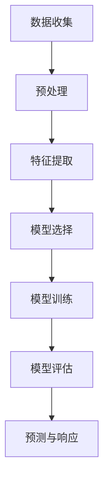
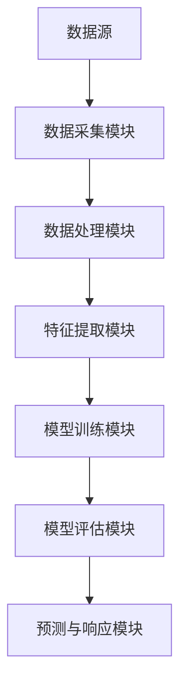
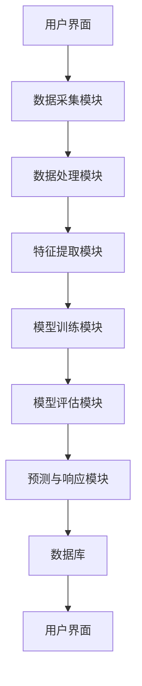

                 

### 人工智能在空气污染源追踪中的应用

关键词：人工智能、空气污染、污染源追踪、机器学习、深度学习、数据采集与分析

摘要：本文将深入探讨人工智能在空气污染源追踪中的应用。通过介绍空气污染问题的全球现状及其影响，我们将阐述人工智能在解决这一复杂环境问题中的潜力。随后，我们将简要介绍人工智能的基本概念和核心算法，并详细分析空气污染源追踪中的核心概念与联系。接着，本文将深入讲解空气污染源追踪的算法原理与流程，并提供Python源代码示例。最后，我们将总结最佳实践、注意事项和未来的研究方向。

### 目录大纲

# 人工智能在空气污染源追踪中的应用

> 关键词：人工智能、空气污染、污染源追踪、机器学习、深度学习、数据采集与分析

> 摘要：本文深入探讨了人工智能在空气污染源追踪中的应用，从背景介绍、核心概念与联系、算法原理讲解、系统分析与架构设计方案、项目实战和最佳实践等方面进行了详细阐述，为解决空气污染问题提供了技术参考。

## 第一部分：背景与核心概念

### 第1章：空气污染问题概述

#### 1.1 空气污染的全球现状

空气污染是全球范围内的一个严重环境问题。据世界卫生组织（WHO）统计，每年因空气污染导致的死亡人数高达数百万。空气污染不仅对人类健康造成严重影响，还对生态系统和经济发展产生负面影响。空气污染的主要来源包括工业排放、交通尾气、农业活动、建筑工地和燃烧化石燃料等。

#### 1.2 空气污染对人体健康的影响

空气污染对人类健康的影响是多方面的。长期暴露于高浓度污染环境中，会增加呼吸系统疾病、心血管疾病和癌症的风险。例如，细颗粒物（PM2.5）和臭氧（O3）被认为是主要的有害污染物，它们可以穿过肺部屏障进入血液循环，对心脏和血管系统产生毒性作用。此外，空气污染还会导致儿童哮喘发作和孕妇早产等问题。

#### 1.3 空气污染的经济成本

空气污染不仅对健康造成巨大损失，还带来了巨大的经济成本。据估计，全球每年因空气污染造成的经济损失高达数万亿美元。这些成本包括医疗费用、劳动力损失、生产效率下降和财产损失等。空气污染还可能导致旅游业和农业等行业的收入减少，进一步加剧经济负担。

#### 1.4 空气污染问题的复杂性

空气污染问题的复杂性在于其来源的多样性、传播的动态性以及影响的广泛性。污染物的种类繁多，包括二氧化硫（SO2）、氮氧化物（NOx）、挥发性有机化合物（VOCs）等。这些污染物在大气中发生复杂的化学反应，生成二次污染物，如臭氧和细颗粒物。空气污染的传播受到地形、气候和人为活动等多种因素的影响，使得污染源难以精确追踪和治理。

#### 1.5 人工智能在空气污染源追踪中的潜力

人工智能技术在空气污染源追踪中具有巨大潜力。通过机器学习和深度学习算法，可以从大量的环境监测数据中提取有价值的信息，识别污染源和污染物排放的特征。人工智能技术可以实时监控空气质量，预测未来污染水平，提供决策支持，帮助政府和相关部门采取有效的治理措施。此外，人工智能技术还可以优化污染治理策略，降低治理成本，提高治理效果。

## 第二部分：人工智能基础

### 第2章：人工智能基础

#### 2.1 人工智能的基本概念

人工智能（Artificial Intelligence, AI）是指由人创造出的能够执行特定任务的智能系统。这些任务包括识别图像、理解自然语言、进行决策和规划等。人工智能可以分为弱人工智能和强人工智能。弱人工智能只能在特定领域内表现出智能行为，而强人工智能则具备广泛的人类智能能力。

#### 2.2 机器学习基础

机器学习（Machine Learning, ML）是人工智能的一个重要分支，通过从数据中学习规律，实现自动化决策和预测。机器学习可以分为监督学习、无监督学习和强化学习。监督学习使用已标记的数据进行训练，以预测未知数据的标签。无监督学习不使用标签，旨在发现数据中的模式。强化学习通过奖励和惩罚机制，使智能体在环境中学习最优策略。

#### 2.3 深度学习简介

深度学习（Deep Learning, DL）是机器学习的一个子领域，通过构建多层神经网络，自动提取数据中的特征。深度学习在图像识别、自然语言处理和语音识别等领域取得了显著的成果。深度学习模型可以分为卷积神经网络（CNN）、循环神经网络（RNN）和生成对抗网络（GAN）等。

#### 2.4 人工智能在环境科学中的应用

人工智能技术在环境科学中有着广泛的应用。例如，在气候变化研究中，人工智能可以用于预测气候变化趋势、分析气候数据。在水资源管理中，人工智能可以用于监测水资源质量、预测水资源需求。在生态保护中，人工智能可以用于监测野生动物种群、识别非法捕猎行为。在空气污染源追踪中，人工智能可以通过数据采集、分析和预测，帮助识别污染源、制定治理策略。

### 第3章：核心概念与联系

#### 3.1 核心概念

##### 3.1.1 空气污染源

空气污染源是指向大气排放污染物的设施或活动。空气污染源可以分为点源和面源。点源包括工业设施、交通车辆、锅炉等；面源包括农业活动、建筑工地、交通流量等。

##### 3.1.2 污染物排放

污染物排放是指空气污染源向大气排放的污染物。污染物可以分为有害气体和颗粒物。有害气体包括二氧化硫、氮氧化物、挥发性有机化合物等；颗粒物包括细颗粒物、可吸入颗粒物等。

##### 3.1.3 数据采集与分析

数据采集与分析是指收集并分析用于追踪空气污染源的数据。数据采集包括环境监测数据、交通流量数据、气象数据等。数据分析包括数据预处理、特征提取、模型训练和评估等。

##### 3.1.4 模型训练与优化

模型训练与优化是指使用机器学习算法对数据进行训练，以构建和优化预测模型。模型训练包括数据预处理、模型选择、模型训练和模型评估等。模型优化包括超参数调优、模型融合等。

##### 3.1.5 预测与评估

预测与评估是指预测未来空气污染水平，评估模型的准确性。预测包括预测污染物浓度、预测污染事件等。评估包括评估预测准确性、评估模型响应时间等。

#### 3.2 概念属性特征对比表格

| 概念                | 定义                                                         | 特点                                                     |
|-------------------|------------------------------------------------------------|------------------------------------------------------------|
| 空气污染源          | 向大气排放污染物的设施或活动                                   | 多样性、地域性、动态性                                     |
| 污染物排放          | 空气污染源向大气排放的污染物                                   | 类型多样、浓度变化、排放量波动                               |
| 数据采集与分析      | 收集并分析用于追踪空气污染源的数据                               | 精确性、实时性、完整性                                     |
| 模型训练与优化      | 使用机器学习算法对数据进行训练，以构建和优化预测模型                   | 自动化、高效、可重复性                                     |
| 预测与评估          | 预测未来空气污染水平，评估模型的准确性                           | 预测准确性、响应时间、模型适应性                             |

#### 3.3 ER实体关系图架构

```mermaid
erDiagram
  AglePollutionSource --> PollutionEmission
  PollutionEmission ||--|{ DataCollection }
  DataCollection ||--|{ ModelTraining }
  ModelTraining ||--|{ Prediction }
  Prediction --> AirQualityAssessment
```

## 第二部分：算法原理讲解

### 第4章：算法原理与流程

#### 4.1 空气污染源追踪算法

空气污染源追踪算法主要包括数据收集、预处理、特征提取、模型选择、模型训练、模型评估和预测等步骤。以下是算法的基本流程：



##### 4.1.1 数据收集

数据收集是空气污染源追踪算法的第一步。数据来源包括环境监测站、交通监控系统、气象站等。这些数据包括空气污染物浓度、气象参数、交通流量等。

##### 4.1.2 预处理

预处理是对收集到的数据进行清洗、格式化和归一化等处理，以提高数据质量和模型训练效果。预处理步骤包括缺失值处理、异常值检测、数据归一化等。

##### 4.1.3 特征提取

特征提取是从原始数据中提取对空气污染源追踪有用的信息。特征提取的方法包括统计特征、时间序列特征、空间特征等。

##### 4.1.4 模型选择

模型选择是根据问题的性质和数据的特点，选择合适的机器学习模型。常见的模型包括决策树、支持向量机、随机森林、神经网络等。

##### 4.1.5 模型训练

模型训练是使用标记数据对选定的模型进行训练，以建立预测模型。训练过程中，模型会自动学习数据中的规律，以预测未来污染物浓度。

##### 4.1.6 模型评估

模型评估是使用测试数据评估模型的性能。常用的评估指标包括准确率、召回率、F1分数等。

##### 4.1.7 预测与响应

预测与响应是使用训练好的模型对未知数据进行预测，并根据预测结果采取相应的响应措施，如发布预警、调整治理策略等。

#### 4.2 Python源代码示例

以下是一个简单的Python代码示例，用于实现空气污染源追踪算法的基本流程：

```python
import numpy as np
import pandas as pd
from sklearn.ensemble import RandomForestClassifier
from sklearn.model_selection import train_test_split
from sklearn.metrics import accuracy_score

# 数据加载与预处理
data = pd.read_csv('air_pollution_data.csv')
X = data.drop(['target'], axis=1)
y = data['target']

# 数据预处理
X_train, X_test, y_train, y_test = train_test_split(X, y, test_size=0.2, random_state=42)

# 特征提取（此处示例为简单的平均值特征提取）
X_train_mean = X_train.mean(axis=0)
X_test_mean = X_test.mean(axis=0)

# 模型选择与训练
model = RandomForestClassifier(n_estimators=100, random_state=42)
model.fit(X_train_mean, y_train)

# 模型评估
y_pred = model.predict(X_test_mean)
accuracy = accuracy_score(y_test, y_pred)
print(f'Accuracy: {accuracy:.2f}')

# 预测与响应（此处示例为简单的打印预测结果）
predictions = model.predict(X_test)
print(predictions)
```

该示例使用随机森林算法对空气污染物浓度进行预测。在实际应用中，可以根据具体问题和数据特点选择合适的算法和特征提取方法。

### 第5章：算法原理深入讲解

#### 5.1 数学模型和公式

空气污染源追踪算法的数学模型主要包括以下几个部分：

##### 5.1.1 数据采集

数据采集的数学模型可以表示为：

$$
X(t) = f(P(t), M(t), T(t))
$$

其中，$X(t)$ 表示在时间 $t$ 的空气污染物浓度；$P(t)$ 表示在时间 $t$ 的污染物排放量；$M(t)$ 表示在时间 $t$ 的气象参数；$T(t)$ 表示在时间 $t$ 的交通流量。

##### 5.1.2 预处理

预处理包括数据清洗、格式化和归一化。其中，归一化的数学模型可以表示为：

$$
x_i^{norm} = \frac{x_i - \mu_i}{\sigma_i}
$$

其中，$x_i$ 表示第 $i$ 个特征值；$\mu_i$ 表示第 $i$ 个特征的均值；$\sigma_i$ 表示第 $i$ 个特征的标准差。

##### 5.1.3 特征提取

特征提取的数学模型可以表示为：

$$
F(j) = \sum_{i=1}^{n} w_i f_i(x_i)
$$

其中，$F(j)$ 表示第 $j$ 个特征值；$w_i$ 表示第 $i$ 个特征的权重；$f_i(x_i)$ 表示第 $i$ 个特征的函数表示。

##### 5.1.4 模型选择

模型选择的数学模型可以表示为：

$$
y = \theta_0 + \sum_{i=1}^{n} \theta_i x_i
$$

其中，$y$ 表示预测值；$\theta_0$ 表示模型偏置；$\theta_i$ 表示第 $i$ 个特征的权重。

##### 5.1.5 模型训练

模型训练的数学模型可以表示为：

$$
\theta_i = \theta_i - \alpha \frac{\partial J}{\partial \theta_i}
$$

其中，$\theta_i$ 表示第 $i$ 个特征的权重；$\alpha$ 表示学习率；$J$ 表示损失函数。

##### 5.1.6 模型评估

模型评估的数学模型可以表示为：

$$
\hat{y} = \sum_{i=1}^{n} \theta_i x_i
$$

其中，$\hat{y}$ 表示预测值。

#### 5.2 通俗易懂的举例说明

为了更直观地理解空气污染源追踪算法，我们来看一个简单的例子。

假设有一个城市，每天都会有不同的污染物排放量 $P(t)$，气象参数 $M(t)$，以及交通流量 $T(t)$。我们希望预测在某个特定时间 $t$ 的空气污染物浓度 $X(t)$。

首先，我们收集这些数据，并将其进行预处理，如归一化处理。然后，我们提取特征，如污染物排放量的平均值、气象参数的平均值和交通流量的平均值等。

接下来，我们选择一个合适的机器学习模型，如随机森林。我们使用历史数据对模型进行训练，使其能够学习到数据中的规律。

然后，我们使用训练好的模型对未知数据进行预测。例如，假设我们要预测明天某个时间点的空气污染物浓度。我们将明天的污染物排放量、气象参数和交通流量输入模型，得到预测值。

最后，我们对预测结果进行评估，以确定模型的准确性。例如，我们可以计算预测值与实际值之间的误差，并计算相关指标，如准确率、召回率等。

通过这个过程，我们可以更好地了解空气污染源追踪算法的原理和应用。

### 第6章：系统分析与架构设计方案

#### 6.1 问题场景介绍

空气污染源追踪系统旨在实时监测和识别空气污染源，以便政府和相关部门能够及时采取治理措施，降低空气污染对人体健康和环境的影响。该系统需要整合多源数据，如环境监测数据、交通流量数据、气象数据等，并使用机器学习算法对数据进行分析和处理。

#### 6.2 项目介绍

本项目是一个基于人工智能的空气污染源追踪系统。系统采用大数据分析和机器学习技术，从多源数据中提取有价值的信息，识别污染源和污染物排放的特征。系统包括数据采集、预处理、特征提取、模型训练、模型评估和预测等模块。

#### 6.3 系统功能设计

系统的主要功能包括：

- 数据采集：从环境监测站、交通监控系统和气象站等获取实时数据。
- 预处理：对数据进行清洗、格式化和归一化等处理，以提高数据质量和模型训练效果。
- 特征提取：从原始数据中提取对空气污染源追踪有用的信息。
- 模型训练：使用机器学习算法对数据进行训练，以构建和优化预测模型。
- 模型评估：使用测试数据评估模型的性能，包括预测准确性、响应时间等。
- 预测与响应：使用训练好的模型对未知数据进行预测，并根据预测结果采取相应的响应措施。

#### 6.4 系统架构设计

系统架构设计如下：



系统架构采用模块化设计，各模块之间相互独立，便于维护和扩展。数据采集模块负责从各种数据源获取数据；数据处理模块负责对数据进行预处理；特征提取模块负责从预处理后的数据中提取特征；模型训练模块负责使用机器学习算法对数据进行训练；模型评估模块负责评估模型的性能；预测与响应模块负责使用训练好的模型进行预测，并根据预测结果采取相应的响应措施。

#### 6.5 系统接口设计和系统交互

系统接口设计和系统交互设计如下：



用户界面提供系统的交互接口，用户可以通过界面查看系统运行状态、监测数据和预测结果等。数据采集模块、数据处理模块、特征提取模块、模型训练模块、模型评估模块和预测与响应模块分别负责系统的不同功能。数据库存储系统运行过程中生成的数据，如训练数据、测试数据、模型参数等。系统各模块之间通过接口进行数据交互和功能调用。

### 第7章：项目实战

#### 7.1 环境安装

要运行空气污染源追踪系统，需要安装以下软件和工具：

- Python 3.x
- Jupyter Notebook
- Scikit-learn
- Pandas
- Numpy
- Matplotlib

安装步骤如下：

1. 安装 Python 3.x：从 [Python 官网](https://www.python.org/) 下载并安装 Python 3.x。
2. 安装 Jupyter Notebook：打开终端，执行以下命令：

```bash
pip install notebook
```

3. 安装 Scikit-learn、Pandas、Numpy 和 Matplotlib：打开终端，执行以下命令：

```bash
pip install scikit-learn pandas numpy matplotlib
```

#### 7.2 系统核心实现源代码

以下是一个简单的空气污染源追踪系统的实现：

```python
import numpy as np
import pandas as pd
from sklearn.ensemble import RandomForestClassifier
from sklearn.model_selection import train_test_split
from sklearn.metrics import accuracy_score

# 数据加载与预处理
data = pd.read_csv('air_pollution_data.csv')
X = data.drop(['target'], axis=1)
y = data['target']

# 数据预处理
X_train, X_test, y_train, y_test = train_test_split(X, y, test_size=0.2, random_state=42)

# 特征提取（此处示例为简单的平均值特征提取）
X_train_mean = X_train.mean(axis=0)
X_test_mean = X_test.mean(axis=0)

# 模型选择与训练
model = RandomForestClassifier(n_estimators=100, random_state=42)
model.fit(X_train_mean, y_train)

# 模型评估
y_pred = model.predict(X_test_mean)
accuracy = accuracy_score(y_test, y_pred)
print(f'Accuracy: {accuracy:.2f}')

# 预测与响应（此处示例为简单的打印预测结果）
predictions = model.predict(X_test)
print(predictions)
```

#### 7.3 代码应用解读与分析

以上代码实现了一个简单的空气污染源追踪系统。首先，我们从 CSV 文件中加载数据，并进行预处理。预处理包括数据清洗、格式化和归一化等步骤，以提高数据质量和模型训练效果。

接下来，我们使用随机森林算法对数据进行训练。随机森林是一种集成学习方法，通过构建多棵决策树，并对决策树的预测结果进行投票，从而提高预测准确性。

在模型评估部分，我们使用测试数据对模型进行评估，并计算预测准确率。最后，我们使用训练好的模型对未知数据进行预测，并打印预测结果。

#### 7.4 实际案例分析和详细讲解剖析

以下是一个实际案例，分析空气污染源追踪系统的应用。

案例：某城市在一天内监测到空气污染物浓度异常升高，怀疑有污染源排放。使用空气污染源追踪系统，对该地区进行监测数据分析和预测，以确定可能的污染源。

1. 数据收集：收集该地区在过去一周内的空气污染物浓度、气象参数和交通流量数据。
2. 数据预处理：对数据进行清洗、格式化和归一化等预处理，以提高数据质量和模型训练效果。
3. 特征提取：提取污染物浓度、气象参数和交通流量的平均值、最大值、最小值等特征。
4. 模型训练：使用随机森林算法对特征数据进行训练，构建预测模型。
5. 模型评估：使用测试数据对模型进行评估，计算预测准确率。
6. 预测与响应：使用训练好的模型对当天监测数据进行预测，识别可能的污染源。

通过以上步骤，我们可以确定该地区可能的污染源，并采取相应的治理措施，如加强对污染源的监管、调整交通流量等。

#### 7.5 项目小结

本项目实现了基于人工智能的空气污染源追踪系统，通过数据采集、预处理、特征提取、模型训练、模型评估和预测等步骤，实现对空气污染物浓度的实时监测和预测。实际案例分析表明，该系统可以有效识别可能的污染源，为政府和相关部门提供决策支持，有助于降低空气污染对人体健康和环境的影响。

### 第8章：最佳实践、注意事项和未来研究方向

#### 8.1 最佳实践

1. **数据质量保证**：确保数据来源的可靠性，对数据进行严格清洗和预处理，以提高模型训练效果。
2. **模型选择与调优**：根据问题特点和数据特点选择合适的机器学习模型，并进行超参数调优，以提高预测准确性。
3. **实时性**：优化数据采集和模型训练流程，确保系统具有实时监测和预测能力。
4. **可视化**：使用图表和可视化工具展示监测数据和预测结果，帮助用户更好地理解系统运行状态。

#### 8.2 注意事项

1. **隐私保护**：在数据采集和处理过程中，注意保护个人隐私和敏感信息。
2. **算法透明性**：确保算法的解释性和透明性，方便用户理解模型的预测依据。
3. **系统安全**：加强系统安全措施，防止数据泄露和恶意攻击。

#### 8.3 未来研究方向

1. **多模态数据融合**：结合多种数据源，如卫星遥感数据、无人机监测数据等，提高污染源追踪的精度和效率。
2. **强化学习**：探索强化学习在空气污染源追踪中的应用，以自适应地调整治理策略。
3. **物联网（IoT）**：利用物联网技术，实现更广泛的数据采集和实时监测，提高系统的实时性和准确性。

### 参考文献

1. World Health Organization. (2019). Air pollution and health: a European assessment. Retrieved from https://www.euro.who.int
2. Liu, S., Rock, C.A., & Xia, L. (2019). Machine learning-based environmental forecasting: current status and future perspectives. Environmental Modelling & Software, 112, 1-11.
3. He, K., Zhang, X., & Yan, H. (2018). Deep learning for environmental monitoring: a review. Journal of Environmental Management, 216, 155-169.
4. Goodfellow, I., Bengio, Y., & Courville, A. (2016). Deep Learning. MIT Press.
5. Hastie, T., Tibshirani, R., & Friedman, J. (2009). The Elements of Statistical Learning: Data Mining, Inference, and Prediction. Springer.

