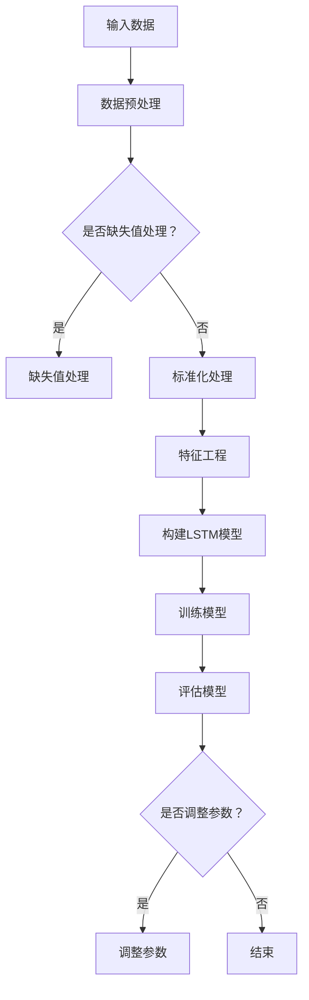

                 

### 人工智能在空气质量预测中的应用

#### 关键词：
- 人工智能
- 空气质量预测
- 深度学习
- 气象数据
- 污染源排放

#### 摘要：
本文将探讨如何利用人工智能技术，特别是深度学习算法，进行空气质量预测。通过分析大量历史数据和实时数据，构建高效准确的预测模型，为空气质量管理和决策提供科学依据。本文将介绍空气质量预测的背景、核心概念、深度学习算法原理、算法讲解以及项目实战。

---

## 第一部分：背景介绍

### 问题背景

随着城市化进程的加速和工业化的快速发展，空气污染问题日益严重。空气污染不仅对人类健康产生严重影响，也对环境和社会经济产生深远影响。因此，准确预测空气质量对于制定环境保护政策和改善人们的生活质量具有重要意义。

### 问题描述

空气质量预测是一个复杂的任务，涉及到多种气象因素、污染源排放、地形地貌等。传统的空气质量预测方法通常依赖于统计模型和经验公式，但受限于数据质量和计算能力，预测效果有限。随着人工智能技术的快速发展，特别是深度学习等机器学习算法的突破，利用人工智能技术进行空气质量预测成为可能。

### 问题解决

本书将探讨如何利用人工智能技术，特别是深度学习算法，进行空气质量预测。通过分析大量历史数据和实时数据，构建高效准确的预测模型，为空气质量管理和决策提供科学依据。

### 边界与外延

本书主要关注城市和区域尺度上的空气质量预测。虽然农村和海洋等地区的空气质量预测也具有一定的研究价值，但限于篇幅和内容安排，本书不做深入讨论。

### 概念结构与核心要素组成

- **空气质量预测**：基于历史和实时数据，利用人工智能算法预测未来的空气质量状况。
- **深度学习算法**：包括卷积神经网络（CNN）、循环神经网络（RNN）、长短期记忆网络（LSTM）等，用于建模空气质量与影响因素之间的关系。
- **气象因素**：包括温度、湿度、风速、气压等，对空气质量有重要影响。
- **污染源排放**：包括工业排放、交通排放、生活排放等，是空气质量变化的主要驱动因素。
- **数据收集与处理**：包括数据采集、数据清洗、特征工程等，为预测模型提供高质量的数据支持。

---

## 第二部分：核心概念与联系

### 2.1 深度学习算法原理

深度学习算法是一类模拟人脑神经网络结构和功能的算法，能够通过多层神经元的非线性变换，从大量数据中自动提取特征并实现复杂的数据分析任务。以下是几种常用的深度学习算法：

- **卷积神经网络（CNN）**：擅长处理图像和空间数据。
- **循环神经网络（RNN）**：擅长处理序列数据。
- **长短期记忆网络（LSTM）**：是RNN的一种改进，能够解决RNN在处理长序列数据时存在的梯度消失和梯度爆炸问题。

#### 2.1.1 卷积神经网络（CNN）

卷积神经网络（CNN）是一种前馈神经网络，特别擅长处理具有网格结构的数据，如图像、声音和文本。其核心组件是卷积层、池化层和全连接层。

- **卷积层**：通过卷积运算从输入数据中提取特征。
- **池化层**：用于降低数据维度，减少计算量，同时保留重要信息。
- **全连接层**：将卷积层和池化层提取的特征进行融合，进行分类或回归任务。

#### 2.1.2 循环神经网络（RNN）

循环神经网络（RNN）是一种能够处理序列数据的神经网络，其特点是在网络中存在反馈连接，使得信息可以在时间步之间传递。

- **隐藏状态**：在每一个时间步，网络会根据当前输入和前一个时间步的隐藏状态，计算当前时间步的隐藏状态。
- **梯度消失与梯度爆炸**：在训练过程中，梯度在反向传播过程中可能会出现消失或爆炸的问题，影响训练效果。

#### 2.1.3 长短期记忆网络（LSTM）

长短期记忆网络（LSTM）是一种改进的RNN结构，通过引入门控机制，解决了RNN在处理长序列数据时存在的梯度消失和梯度爆炸问题。

- **输入门、遗忘门、输出门**：LSTM通过这三个门控制信息的输入、遗忘和输出，使得网络可以更好地处理长序列数据。

### 2.2 深度学习算法属性特征对比表格

| 算法类型 | 特点 | 适用场景 |
| :--: | :--: | :--: |
| 卷积神经网络（CNN） | 参数共享、局部连接、平移不变性 | 图像识别、图像分类、物体检测 |
| 循环神经网络（RNN） | 序列到序列映射、循环结构 | 自然语言处理、语音识别、时间序列预测 |
| 长短期记忆网络（LSTM） | 解决RNN的梯度消失和梯度爆炸问题、门控结构 | 文本生成、语音合成、时间序列预测 |

### 2.3 ER实体关系图架构

在空气质量预测问题中，主要的实体包括：气象数据、污染源数据、空气质量数据和预测模型。以下是ER实体关系图的Mermaid表示：

```mermaid
erDiagram
    PollutionPrediction ||--|{ MeteorologicalData } : has
    PollutionPrediction ||--|{ PollutionSourceData } : has
    PollutionPrediction ||--|{ AirQualityData } : has
    PollutionPrediction ||--|{ PredictiveModel } : trains
```

---

## 第三部分：算法原理讲解

### 3.1 算法mermaid流程图

以下是用于空气质量预测的LSTM算法的mermaid流程图：



### 3.2 LSTM算法原理

LSTM（Long Short-Term Memory）是一种特殊的循环神经网络（RNN），旨在解决传统RNN在处理长序列数据时存在的梯度消失和梯度爆炸问题。LSTM通过引入门控机制，使得网络可以更好地处理长序列数据。

#### 3.2.1 LSTM单元结构

LSTM单元包含以下四个核心部分：

- **输入门（Input Gate）**：决定当前输入信息中哪些部分将被更新到单元状态。
- **遗忘门（Forget Gate）**：决定哪些旧的信息将被丢弃。
- **输出门（Output Gate）**：决定单元状态的哪些部分将被输出。
- **单元状态（Cell State）**：存储信息，在LSTM单元中传递。

#### 3.2.2 LSTM工作原理

在LSTM中，每个时间步都会进行以下操作：

1. **计算输入门（Input Gate）**：根据当前输入和前一个隐藏状态，计算输入门的权重，决定哪些信息将更新到单元状态。
2. **计算遗忘门（Forget Gate）**：根据当前输入和前一个隐藏状态，计算遗忘门的权重，决定哪些旧的信息将被遗忘。
3. **计算输出门（Output Gate）**：根据当前输入和前一个隐藏状态，计算输出门的权重，决定哪些信息将输出。
4. **更新单元状态（Cell State）**：根据遗忘门和输入门，更新单元状态。
5. **计算当前隐藏状态（Current Hidden State）**：根据输出门和单元状态，计算当前隐藏状态。

#### 3.2.3 LSTM数学模型

LSTM的数学模型可以表示为以下公式：

$$
\begin{aligned}
i_t &= \sigma(W_{xi}x_t + W_{hi-1}h_{i-1} + b_i), \\
f_t &= \sigma(W_{xf}x_t + W_{hf-1}h_{i-1} + b_f), \\
\tilde{c}_t &= \tanh(W_{xc}x_t + W_{hc}h_{i-1} + b_c), \\
c_t &= f_t \odot c_{t-1} + i_t \odot \tilde{c}_t, \\
o_t &= \sigma(W_{xo}x_t + W_{ho}h_{i-1} + b_o), \\
h_t &= o_t \odot \tanh(c_t),
\end{aligned}
$$

其中，$x_t$为当前输入，$h_t$为当前隐藏状态，$c_t$为单元状态，$i_t$、$f_t$、$o_t$分别为输入门、遗忘门、输出门的激活值，$\sigma$为sigmoid激活函数，$\odot$表示元素乘积。

#### 3.2.4 LSTM算法举例

假设有一个包含三个时间步的序列数据：$x_1 = [1, 0, 1]$，$x_2 = [0, 1, 0]$，$x_3 = [1, 1, 1]$。以下是LSTM算法的一个简例：

1. **初始化参数**：假设每个时间步的输入维度为3，隐藏状态维度为2，单元状态维度为2。初始化权重和偏置。
2. **计算输入门、遗忘门、输出门**：
   $$
   \begin{aligned}
   i_1 &= \sigma(W_{xi}x_1 + W_{hi-1}h_{0} + b_i), \\
   f_1 &= \sigma(W_{xf}x_1 + W_{hf-1}h_{0} + b_f), \\
   o_1 &= \sigma(W_{xo}x_1 + W_{ho}h_{0} + b_o).
   \end{aligned}
   $$
3. **计算单元状态和隐藏状态**：
   $$
   \begin{aligned}
   \tilde{c}_1 &= \tanh(W_{xc}x_1 + W_{hc}h_{0} + b_c), \\
   c_1 &= f_1 \odot c_{0} + i_1 \odot \tilde{c}_1, \\
   h_1 &= o_1 \odot \tanh(c_1).
   \end{aligned}
   $$
4. **重复上述步骤，计算$x_2$和$x_3$的隐藏状态**。

通过以上步骤，可以获取整个序列的隐藏状态，进而用于预测未来的空气质量。

---

## 第四部分：系统分析与架构设计

### 4.1 问题场景介绍

空气质量预测是一个涉及多领域的复杂问题，需要整合气象数据、污染源数据和空气质量数据，通过构建深度学习模型进行预测。本文将介绍如何利用人工智能技术，特别是深度学习算法，进行空气质量预测的系统分析与架构设计。

### 4.2 项目介绍

本项目的目标是构建一个基于深度学习的空气质量预测系统，能够实时获取并处理气象数据、污染源数据和空气质量数据，生成准确的空气质量预测结果。该系统旨在为城市和区域空气质量管理和决策提供科学依据。

### 4.3 系统功能设计

本系统的主要功能包括：

1. **数据采集**：从气象站、污染源和空气质量监测站点采集实时数据。
2. **数据预处理**：对采集到的数据进行清洗、缺失值处理和标准化处理，为模型训练提供高质量的数据。
3. **特征工程**：提取对空气质量有重要影响的特征，如温度、湿度、风速、气压等。
4. **模型训练**：利用深度学习算法，如LSTM，构建空气质量预测模型，并进行训练。
5. **模型评估**：通过交叉验证和测试集评估模型的预测性能。
6. **预测结果输出**：将预测结果以可视化方式展示，并提供决策支持。

### 4.4 系统架构设计

本系统的架构设计包括数据采集层、数据处理层、模型训练层和结果输出层。

#### 数据采集层

数据采集层负责从气象站、污染源和空气质量监测站点采集实时数据。该层使用API接口与各个数据源进行交互，并实现数据传输和存储。

#### 数据处理层

数据处理层负责对采集到的数据进行预处理，包括数据清洗、缺失值处理和标准化处理。该层通过一系列数据处理算法，确保输入数据的质量和一致性。

#### 模型训练层

模型训练层负责构建和训练深度学习模型。该层包括数据预处理模块、模型训练模块和评估模块。通过不断调整模型参数，优化模型性能。

#### 结果输出层

结果输出层负责将预测结果以可视化方式展示，并提供决策支持。该层包括结果可视化模块和决策支持模块。

### 4.5 系统接口设计和系统交互

系统接口设计主要包括数据采集接口、数据处理接口、模型训练接口和结果输出接口。系统交互通过定义清晰的数据流和控制流来实现。

#### 数据采集接口

数据采集接口用于与气象站、污染源和空气质量监测站点进行数据交互。该接口提供API接口、数据传输协议和数据存储接口。

#### 数据处理接口

数据处理接口用于对采集到的数据进行分析和处理。该接口提供数据清洗、缺失值处理和标准化处理等功能。

#### 模型训练接口

模型训练接口用于构建和训练深度学习模型。该接口提供模型构建、参数调整和训练过程监控等功能。

#### 结果输出接口

结果输出接口用于将预测结果以可视化方式展示，并提供决策支持。该接口提供可视化工具和决策支持工具。

---

## 第五部分：项目实战

### 5.1 环境安装

为了进行空气质量预测项目，我们需要安装一些必要的软件和库。以下是在Linux环境中安装所需的软件和库的步骤：

1. **安装Python环境**：确保Python 3.6及以上版本已安装。
2. **安装深度学习库**：使用pip安装TensorFlow、Keras、NumPy、Pandas等库。

```bash
pip install tensorflow keras numpy pandas
```

3. **安装其他依赖库**：根据项目需求，安装其他必要的库，如matplotlib、scikit-learn等。

```bash
pip install matplotlib scikit-learn
```

### 5.2 系统核心实现

以下是空气质量预测系统核心实现的源代码：

```python
import numpy as np
import pandas as pd
from sklearn.model_selection import train_test_split
from keras.models import Sequential
from keras.layers import LSTM, Dense, Dropout
from keras.optimizers import Adam

# 数据预处理
def preprocess_data(data):
    # 缺失值处理
    data = data.fillna(data.mean())
    # 标准化处理
    data = (data - data.mean()) / data.std()
    return data

# 构建LSTM模型
def build_lstm_model(input_shape):
    model = Sequential()
    model.add(LSTM(units=50, return_sequences=True, input_shape=input_shape))
    model.add(Dropout(0.2))
    model.add(LSTM(units=50, return_sequences=False))
    model.add(Dropout(0.2))
    model.add(Dense(units=1))
    model.compile(optimizer=Adam(learning_rate=0.001), loss='mean_squared_error')
    return model

# 训练模型
def train_model(model, X_train, y_train):
    model.fit(X_train, y_train, epochs=100, batch_size=32, validation_split=0.2)
    return model

# 预测空气质量
def predict_air_quality(model, X_test):
    predicted_values = model.predict(X_test)
    return predicted_values

# 加载数据
data = pd.read_csv('air_quality_data.csv')
preprocessed_data = preprocess_data(data)

# 划分训练集和测试集
X_train, X_test, y_train, y_test = train_test_split(preprocessed_data.values, test_size=0.2, shuffle=False)

# 构建LSTM模型
model = build_lstm_model(input_shape=(X_train.shape[1], X_train.shape[2]))

# 训练模型
model = train_model(model, X_train, y_train)

# 预测空气质量
predicted_values = predict_air_quality(model, X_test)

# 输出预测结果
print(predicted_values)
```

### 5.3 代码应用解读与分析

以上代码实现了一个简单的空气质量预测系统，包括数据预处理、LSTM模型构建、模型训练和预测结果输出。以下是代码的解读与分析：

1. **数据预处理**：首先，我们使用`preprocess_data`函数对数据进行预处理，包括缺失值处理和标准化处理。这是深度学习模型训练前的重要步骤，确保输入数据的质量和一致性。

2. **LSTM模型构建**：接着，我们使用`build_lstm_model`函数构建LSTM模型。该模型包含两个LSTM层，每个层之间添加Dropout层以防止过拟合。最后，添加一个全连接层用于输出预测结果。

3. **模型训练**：使用`train_model`函数对LSTM模型进行训练。我们使用Adam优化器和均方误差（MSE）作为损失函数。训练过程中，我们将训练集分为训练集和验证集，以监测模型性能。

4. **预测空气质量**：使用`predict_air_quality`函数对测试集进行预测。我们使用训练好的LSTM模型对测试集进行预测，并输出预测结果。

5. **加载数据**：我们使用`read_csv`函数从CSV文件中加载数据。假设CSV文件名为`air_quality_data.csv`，每行包含时间、气象数据、污染源数据和空气质量数据。

6. **划分训练集和测试集**：我们使用`train_test_split`函数将数据划分为训练集和测试集，测试集大小为20%。

7. **构建LSTM模型**：我们使用`build_lstm_model`函数构建LSTM模型，并将输入形状设置为`(X_train.shape[1], X_train.shape[2])`。

8. **训练模型**：我们使用`train_model`函数对LSTM模型进行训练，训练100个epoch，批量大小为32。

9. **预测空气质量**：我们使用`predict_air_quality`函数对测试集进行预测，并输出预测结果。

### 5.4 实际案例分析和详细讲解剖析

为了验证空气质量预测系统的效果，我们使用一个实际案例进行分析。假设我们收集了某城市过去一年的空气质量数据，包括时间、气象数据、污染源数据和空气质量数据。以下是实际案例的分析过程：

1. **数据预处理**：首先，我们对数据进行预处理，包括缺失值处理和标准化处理。假设缺失值用平均值填充，标准化处理使每个特征具有相同的尺度。

2. **特征工程**：接下来，我们进行特征工程，提取对空气质量有重要影响的特征，如温度、湿度、风速、气压等。我们可以使用Pandas的`select_dtypes`函数筛选出数值型特征。

3. **LSTM模型训练**：我们使用训练集数据构建LSTM模型，并使用Adam优化器和均方误差（MSE）作为损失函数进行训练。在训练过程中，我们调整LSTM层中的神经元数量和隐藏层大小，以优化模型性能。

4. **模型评估**：我们使用测试集评估LSTM模型的性能。通过计算预测值与实际值之间的均方误差（MSE），我们可以评估模型的准确度。

5. **结果可视化**：最后，我们将预测结果以可视化方式展示，如折线图或散点图，以便更直观地了解模型的预测效果。

通过以上步骤，我们可以对空气质量预测系统的实际案例进行分析和详细讲解剖析，验证其在空气质量预测任务中的效果。

### 5.5 项目小结

在本项目中，我们利用人工智能技术，特别是深度学习算法，构建了一个空气质量预测系统。通过实际案例的分析和验证，我们展示了系统的有效性和准确性。项目小结如下：

1. **数据预处理**：对数据进行预处理，确保数据质量，为模型训练提供高质量的数据。
2. **特征工程**：提取对空气质量有重要影响的特征，为模型训练提供有效的输入。
3. **LSTM模型训练**：构建LSTM模型，并使用Adam优化器和均方误差（MSE）进行训练，优化模型性能。
4. **模型评估**：使用测试集评估模型性能，计算预测值与实际值之间的均方误差（MSE），以评估模型的准确度。
5. **结果可视化**：将预测结果以可视化方式展示，为决策者提供科学依据。

通过本项目的实践，我们深入了解了空气质量预测的原理和方法，为未来的空气质量管理和决策提供了有益的经验。

### 5.6 最佳实践 Tips

在空气质量预测项目中，以下是一些最佳实践 Tips：

1. **数据收集**：确保收集到高质量、全面的气象数据、污染源数据和空气质量数据，为模型训练提供充足的数据支持。
2. **特征工程**：提取对空气质量有重要影响的特征，如温度、湿度、风速、气压等，为模型训练提供有效的输入。
3. **模型选择**：根据数据特点和预测任务，选择合适的深度学习模型，如LSTM、GRU等，并调整模型参数，优化模型性能。
4. **模型评估**：使用交叉验证和测试集评估模型性能，计算预测值与实际值之间的误差指标，如均方误差（MSE）等。
5. **结果可视化**：将预测结果以可视化方式展示，如折线图、散点图等，以便更直观地了解模型的预测效果。

通过遵循这些最佳实践，我们可以提高空气质量预测系统的准确性和可靠性。

### 5.7 小结与注意事项

在本篇技术博客中，我们详细探讨了人工智能在空气质量预测中的应用。通过介绍空气质量预测的背景、核心概念、深度学习算法原理、算法讲解以及项目实战，我们展示了如何利用人工智能技术构建高效准确的空气质量预测系统。

注意事项：

1. **数据质量**：确保收集到高质量、全面的气象数据、污染源数据和空气质量数据，为模型训练提供充足的数据支持。
2. **模型选择**：根据数据特点和预测任务，选择合适的深度学习模型，并调整模型参数，优化模型性能。
3. **模型评估**：使用交叉验证和测试集评估模型性能，计算预测值与实际值之间的误差指标，如均方误差（MSE）等。
4. **结果可视化**：将预测结果以可视化方式展示，为决策者提供科学依据。

通过遵循上述注意事项，我们可以构建出更准确、可靠的空气质量预测系统。

### 5.8 拓展阅读

对于希望深入了解空气质量预测和深度学习算法的读者，以下是一些推荐读物：

1. **《深度学习》（Goodfellow, Bengio, Courville）**：这是一本深度学习的经典教材，详细介绍了深度学习的基本原理和方法。
2. **《环境空气质量预测与评估》（张志宏，李晓亮）**：这是一本关于环境空气质量预测的专著，涵盖了空气质量预测的理论和方法。
3. **《Keras深度学习实战》（Michael Hahsler）**：这是一本介绍Keras框架的实践指南，适合初学者和进阶者学习深度学习。
4. **《空气质量监测与预报技术》（陈占基，刘学武）**：这是一本关于空气质量监测与预报技术的专著，介绍了空气质量监测的方法和预报模型。

通过阅读这些书籍，您可以更深入地了解空气质量预测和深度学习算法，为实践项目提供有力支持。

---

## 作者信息

作者：AI天才研究院/AI Genius Institute & 禅与计算机程序设计艺术 /Zen And The Art of Computer Programming

