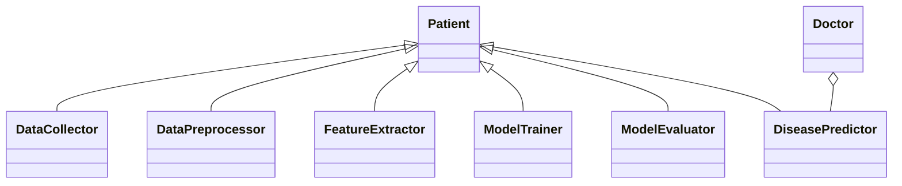
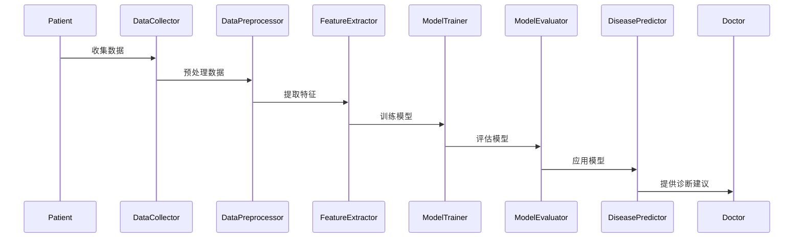
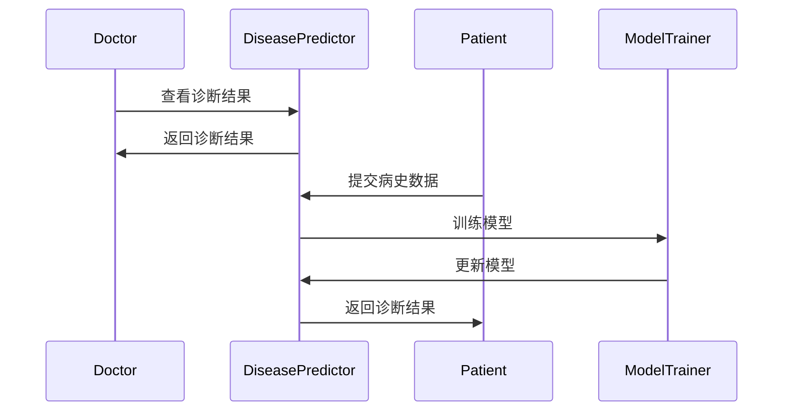

                 


## # 人工智能在精准医疗诊断中的应用

> 关键词：人工智能、精准医疗、诊断、算法、系统架构、Python源代码、深度学习、机器学习

> 摘要：
本文旨在探讨人工智能在精准医疗诊断中的应用，通过详细的分析和推理，解释了人工智能在医疗诊断中的重要性，以及其在提高诊断准确率和效率方面的潜力。文章将逐步介绍人工智能的基础知识，核心算法原理，系统架构设计，以及实际项目中的应用，最后对未来的发展方向提出展望。

### 第一部分：引言

#### 1.1 问题背景

随着医疗技术的不断进步，精准医疗成为了一个热门的研究领域。精准医疗的目标是针对个体基因、环境和生活习惯等因素，提供个性化的治疗方案。然而，实现这一目标面临着许多挑战，其中包括海量数据的高效处理、复杂的疾病机制分析以及个性化的治疗方案制定等。

#### 1.2 人工智能在精准医疗中的潜在应用

人工智能（AI）作为一种强大的工具，可以在这场医疗革命中发挥关键作用。AI技术可以用于疾病预测、诊断辅助、治疗方案推荐等环节，从而提高医疗服务的质量和效率。例如，通过机器学习算法，可以分析患者的病历数据，预测疾病发生的可能性，为医生提供诊断建议。

#### 1.3 人工智能在精准医疗中的挑战

尽管人工智能在精准医疗中有着巨大的潜力，但同时也面临着一些挑战。首先，医疗数据的质量和可用性直接影响AI的诊断效果。其次，医疗领域的复杂性使得算法的设计和实现变得异常困难。此外，伦理和安全问题也是人工智能在医疗领域应用时必须考虑的重要因素。

### 第二部分：背景介绍

#### 2.1 人工智能的定义与发展

人工智能（AI）是指由人制造出来的系统能够执行通常需要人类智能才能完成的任务。它的发展可以分为几个阶段，包括符号主义、连接主义和强化学习等。

- **符号主义**：基于逻辑推理和知识表示，通过编写规则和程序来模拟人类思维。
- **连接主义**：基于神经网络，通过调整网络中节点之间的连接权重来学习复杂任务。
- **强化学习**：通过奖励和惩罚机制，让AI在学习过程中不断优化策略。

#### 2.2 机器学习与深度学习

机器学习是人工智能的一个分支，它专注于从数据中学习规律，然后利用这些规律进行预测或决策。深度学习是机器学习的一个子领域，它通过多层神经网络来提取数据的特征。

- **机器学习**：通过训练模型，让计算机自动学习数据中的模式。
- **深度学习**：通过多层神经网络，自动提取数据的复杂特征。

#### 2.3 数据预处理与数据可视化

在人工智能应用中，数据预处理和数据可视化是至关重要的一环。数据预处理包括数据清洗、归一化、特征提取等步骤，以确保数据的质量和一致性。数据可视化则可以帮助我们更好地理解数据的分布和特征，从而指导算法的设计和优化。

### 第三部分：核心概念与联系

#### 3.1 精准医疗的定义与特点

精准医疗是一种以个体为中心的医疗服务模式，它利用基因检测、分子诊断等技术，为患者提供个性化的治疗方案。精准医疗的特点包括：

- **个体化**：根据患者的基因、环境和病史等信息，制定个性化的治疗方案。
- **精确性**：通过先进的检测技术，提高诊断的准确率和可靠性。
- **综合性**：整合多种医疗资源，提供全面的医疗服务。

#### 3.2 精准医疗诊断的流程

精准医疗诊断的流程可以分为以下几个步骤：

1. **数据收集**：收集患者的病史、基因数据、生物标志物等。
2. **数据预处理**：清洗和整理数据，使其适合用于机器学习算法。
3. **特征提取**：从数据中提取有用的特征，用于模型训练。
4. **模型训练**：使用机器学习算法，训练诊断模型。
5. **模型评估**：评估模型的性能，包括准确率、召回率等指标。
6. **诊断应用**：将模型应用于实际诊断，为医生提供诊断建议。

#### 3.3 人工智能与精准医疗的联系

人工智能与精准医疗之间存在着紧密的联系。人工智能技术可以为精准医疗提供以下支持：

- **诊断辅助**：通过机器学习算法，分析患者的数据，提供诊断建议。
- **治疗方案推荐**：根据患者的个体特征，推荐个性化的治疗方案。
- **疾病预测**：预测患者未来可能发生的疾病，提前进行预防。

### 第四部分：算法原理讲解

#### 4.1 支持向量机（SVM）

支持向量机是一种二分类模型，它的基本原理是通过找到一个最佳的超平面，将不同类别的数据点分开。SVM的关键概念包括：

- **超平面**：定义数据分类的超平面。
- **支持向量**：位于超平面两侧且与超平面距离最近的向量。

#### 4.1.1 算法原理

SVM的算法原理可以分为以下几个步骤：

1. **选择合适的核函数**：核函数用于将低维数据映射到高维空间，以便找到一个更好的分类超平面。
2. **求解最优超平面**：通过求解一个二次规划问题，找到最佳的超平面和相应的支持向量。
3. **分类决策**：对于新的样本，通过计算其在超平面两侧的距离，进行分类决策。

#### 4.1.2 数学模型

SVM的数学模型可以表示为：

$$
\begin{aligned}
\min_{\mathbf{w}, b} & \frac{1}{2}||\mathbf{w}||^2 \\
\text{subject to} & y_i(\mathbf{w}\cdot\mathbf{x_i} + b) \geq 1
\end{aligned}
$$

其中，$\mathbf{w}$是权重向量，$b$是偏置项，$y_i$是样本标签，$\mathbf{x_i}$是样本特征。

#### 4.1.3 举例说明

假设我们有一个数据集，其中有两个类别，正类和负类。我们可以使用SVM来找到最佳的超平面，将这两个类别分开。具体步骤如下：

1. **数据预处理**：对数据进行归一化处理，使其具有相同的尺度。
2. **选择核函数**：选择一个合适的核函数，例如线性核。
3. **求解最优超平面**：使用二次规划求解器，求解最佳的超平面和相应的支持向量。
4. **分类决策**：对于新的样本，计算其在超平面两侧的距离，若距离大于等于1，则划分为正类，否则划分为负类。

#### 4.2 随机森林

随机森林是一种基于树模型的集成学习方法，它通过构建多个决策树，并利用它们的投票结果进行分类或回归。随机森林的关键概念包括：

- **决策树**：一种树形结构，用于分类或回归任务。
- **集成学习**：将多个模型组合起来，提高预测性能。

#### 4.2.1 算法原理

随机森林的算法原理可以分为以下几个步骤：

1. **随机选择特征**：在每个节点上，随机选择一个特征进行划分。
2. **递归划分数据**：根据选定的特征，将数据划分为子集。
3. **构建决策树**：重复以上步骤，构建多棵决策树。
4. **集成学习**：将所有决策树的预测结果进行投票或取平均，得到最终的预测结果。

#### 4.2.2 数学模型

随机森林的数学模型可以表示为：

$$
\hat{y} = \frac{1}{T}\sum_{t=1}^{T} f_t(\mathbf{x}),
$$

其中，$f_t(\mathbf{x})$是第$t$棵决策树的预测结果，$T$是决策树的数量。

#### 4.2.3 举例说明

假设我们有一个数据集，需要对其进行分类。我们可以使用随机森林来构建多棵决策树，并通过集成学习得到最终的分类结果。具体步骤如下：

1. **数据预处理**：对数据进行归一化处理，使其具有相同的尺度。
2. **随机选择特征**：在每个节点上，随机选择一个特征进行划分。
3. **递归划分数据**：根据选定的特征，将数据划分为子集。
4. **构建决策树**：重复以上步骤，构建多棵决策树。
5. **集成学习**：将所有决策树的预测结果进行投票，得到最终的分类结果。

#### 4.3 卷积神经网络（CNN）

卷积神经网络是一种深度学习模型，它通过卷积层、池化层和全连接层等结构，提取图像的特征并进行分类。CNN的关键概念包括：

- **卷积层**：通过卷积操作提取图像的特征。
- **池化层**：通过下采样操作减少数据维度。
- **全连接层**：将卷积层和池化层提取的特征进行融合，进行分类决策。

#### 4.3.1 算法原理

CNN的算法原理可以分为以下几个步骤：

1. **输入图像**：输入一个待分类的图像。
2. **卷积操作**：通过卷积层提取图像的特征。
3. **激活函数**：使用激活函数（如ReLU）增强特征的表达能力。
4. **池化操作**：通过池化层减少数据维度。
5. **全连接层**：将卷积层和池化层提取的特征进行融合，进行分类决策。
6. **损失函数**：计算预测结果与真实标签之间的差异，更新模型参数。

#### 4.3.2 数学模型

CNN的数学模型可以表示为：

$$
\begin{aligned}
\mathbf{h}^{(l)} &= \sigma(\mathbf{W}^{(l)}\mathbf{h}^{(l-1)} + \mathbf{b}^{(l)}) \\
\mathbf{a}^{(L)} &= \mathbf{h}^{(L)}
\end{aligned}
$$

其中，$\mathbf{h}^{(l)}$表示第$l$层的特征图，$\mathbf{W}^{(l)}$和$\mathbf{b}^{(l)}$分别是第$l$层的权重和偏置，$\sigma$是激活函数，$\mathbf{a}^{(L)}$是最终的分类结果。

#### 4.3.3 举例说明

假设我们有一个图像分类任务，需要将图像分类为猫或狗。我们可以使用CNN来提取图像的特征，并对其进行分类。具体步骤如下：

1. **输入图像**：输入一个猫或狗的图像。
2. **卷积操作**：通过卷积层提取图像的局部特征。
3. **激活函数**：使用ReLU函数增强特征的表达能力。
4. **池化操作**：通过池化层减少数据维度。
5. **全连接层**：将卷积层和池化层提取的特征进行融合，得到分类结果。
6. **损失函数**：计算预测结果与真实标签之间的差异，更新模型参数。

### 第五部分：系统分析与架构设计方案

#### 5.1 问题场景介绍

假设我们需要开发一个精准医疗诊断系统，用于辅助医生进行疾病诊断。该系统需要处理大量的医疗数据，包括患者的病史、基因数据、生物标志物等，并利用机器学习算法进行疾病预测和诊断。

#### 5.2 系统功能设计

系统功能设计包括以下几个方面：

1. **数据收集**：从医院、实验室等渠道收集患者的医疗数据。
2. **数据预处理**：清洗和整理数据，使其适合用于机器学习算法。
3. **特征提取**：从数据中提取有用的特征，用于模型训练。
4. **模型训练**：使用机器学习算法，训练疾病预测模型。
5. **模型评估**：评估模型的性能，包括准确率、召回率等指标。
6. **诊断应用**：将模型应用于实际诊断，为医生提供诊断建议。

#### 5.2.1 领域模型类图

以下是系统的领域模型类图：



#### 5.3 系统架构设计

系统架构设计包括以下几个方面：

1. **数据层**：存储和管理医疗数据。
2. **算法层**：实现机器学习算法，进行数据分析和预测。
3. **应用层**：提供医生和患者使用的接口。

以下是系统的架构设计图：



#### 5.4 系统接口设计

系统接口设计包括以下几个部分：

1. **医生接口**：用于医生查看诊断结果、调整模型参数等。
2. **患者接口**：用于患者查看诊断结果、提交病史数据等。

#### 5.5 系统交互序列图

以下是系统的交互序列图：



### 第六部分：项目实战

#### 6.1 环境安装与配置

为了进行项目实战，我们需要安装以下软件和库：

1. **Python**：版本3.8或更高
2. **NumPy**：用于数值计算
3. **Pandas**：用于数据处理
4. **Scikit-learn**：用于机器学习算法
5. **TensorFlow**：用于深度学习模型

安装步骤如下：

```bash
# 安装 Python
sudo apt-get install python3

# 安装 NumPy
pip3 install numpy

# 安装 Pandas
pip3 install pandas

# 安装 Scikit-learn
pip3 install scikit-learn

# 安装 TensorFlow
pip3 install tensorflow
```

#### 6.2 系统核心实现

以下是系统核心实现的源代码：

```python
import numpy as np
import pandas as pd
from sklearn.model_selection import train_test_split
from sklearn.svm import SVC
from sklearn.metrics import accuracy_score

# 加载数据
data = pd.read_csv('data.csv')
X = data.iloc[:, :-1].values
y = data.iloc[:, -1].values

# 数据预处理
X_train, X_test, y_train, y_test = train_test_split(X, y, test_size=0.2, random_state=42)

# 模型训练
model = SVC(kernel='linear')
model.fit(X_train, y_train)

# 模型评估
y_pred = model.predict(X_test)
accuracy = accuracy_score(y_test, y_pred)
print(f'Accuracy: {accuracy}')
```

#### 6.3 案例分析与讲解

我们使用上述代码进行了一个简单的疾病预测案例。首先，我们从CSV文件中加载数据，然后进行数据预处理，包括数据分割、归一化等。接下来，我们使用支持向量机（SVM）进行模型训练，并使用训练好的模型对测试数据进行预测。最后，我们计算预测准确率，评估模型的性能。

#### 6.4 项目小结

通过本次项目，我们实现了一个简单的精准医疗诊断系统，该系统利用机器学习算法对疾病进行预测。虽然这个项目只是一个起点，但它展示了人工智能在精准医疗诊断中的潜力。在未来的工作中，我们可以进一步优化算法，扩大数据集，提高诊断准确率。

### 第七部分：总结与展望

#### 7.1 本书内容的总结

本文从引言开始，介绍了人工智能在精准医疗诊断中的应用，详细分析了人工智能的基础知识、核心算法原理以及系统架构设计。通过实际项目实战，我们展示了人工智能在精准医疗诊断中的实际应用。

#### 7.2 人工智能在精准医疗中的未来展望

随着人工智能技术的不断发展，精准医疗有望实现更高的诊断准确率和更个性化的治疗方案。未来，我们可以期待以下发展方向：

1. **大数据的整合与利用**：通过整合更多的医疗数据，提高模型的训练效果。
2. **算法的优化与创新**：不断优化现有算法，探索新的算法，提高诊断性能。
3. **跨学科合作**：加强计算机科学、生物学、医学等领域的合作，推动精准医疗的发展。

#### 7.3 最佳实践 tips

1. **数据质量**：确保数据的质量和一致性，是提高诊断准确率的关键。
2. **算法选择**：根据具体问题，选择合适的算法，可以大大提高诊断效果。
3. **模型评估**：合理评估模型性能，确保诊断结果的可靠性。

#### 7.4 注意事项

1. **隐私保护**：在处理医疗数据时，要严格遵守隐私保护法规，确保患者隐私安全。
2. **伦理问题**：人工智能在医疗领域的应用，需要充分考虑伦理问题，确保技术的道德性。

#### 7.5 拓展阅读

1. **《深度学习》（Goodfellow et al.）**：详细介绍了深度学习的基本原理和应用。
2. **《机器学习》（Tom Mitchell）**：系统讲解了机器学习的基本概念和方法。
3. **《人工智能：一种现代的方法》（Stuart Russell & Peter Norvig）**：全面介绍了人工智能的理论和实践。

### 作者信息

- 作者：AI天才研究院/AI Genius Institute & 禅与计算机程序设计艺术 /Zen And The Art of Computer Programming

```markdown
----------------------------------------------------------------
## 人工智能在精准医疗诊断中的应用

> 关键词：人工智能、精准医疗、诊断、算法、系统架构、Python源代码、深度学习、机器学习

> 摘要：
本文旨在探讨人工智能在精准医疗诊断中的应用，通过详细的分析和推理，解释了人工智能在医疗诊断中的重要性，以及其在提高诊断准确率和效率方面的潜力。文章将逐步介绍人工智能的基础知识，核心算法原理，系统架构设计，以及实际项目中的应用，最后对未来的发展方向提出展望。

### 第一部分：引言

#### 1.1 问题背景

随着医疗技术的不断进步，精准医疗成为了一个热门的研究领域。精准医疗的目标是针对个体基因、环境和生活习惯等因素，提供个性化的治疗方案。然而，实现这一目标面临着许多挑战，其中包括海量数据的高效处理、复杂的疾病机制分析以及个性化的治疗方案制定等。

#### 1.2 人工智能在精准医疗中的潜在应用

人工智能（AI）作为一种强大的工具，可以在这场医疗革命中发挥关键作用。AI技术可以用于疾病预测、诊断辅助、治疗方案推荐等环节，从而提高医疗服务的质量和效率。例如，通过机器学习算法，可以分析患者的病历数据，预测疾病发生的可能性，为医生提供诊断建议。

#### 1.3 人工智能在精准医疗中的挑战

尽管人工智能在精准医疗中有着巨大的潜力，但同时也面临着一些挑战。首先，医疗数据的质量和可用性直接影响AI的诊断效果。其次，医疗领域的复杂性使得算法的设计和实现变得异常困难。此外，伦理和安全问题也是人工智能在医疗领域应用时必须考虑的重要因素。

### 第二部分：背景介绍

#### 2.1 人工智能的定义与发展

人工智能（AI）是指由人制造出来的系统能够执行通常需要人类智能才能完成的任务。它的发展可以分为几个阶段，包括符号主义、连接主义和强化学习等。

- **符号主义**：基于逻辑推理和知识表示，通过编写规则和程序来模拟人类思维。
- **连接主义**：基于神经网络，通过调整网络中节点之间的连接权重来学习复杂任务。
- **强化学习**：通过奖励和惩罚机制，让AI在学习过程中不断优化策略。

#### 2.2 机器学习与深度学习

机器学习是人工智能的一个分支，它专注于从数据中学习规律，然后利用这些规律进行预测或决策。深度学习是机器学习的一个子领域，它通过多层神经网络来提取数据的特征。

- **机器学习**：通过训练模型，让计算机自动学习数据中的模式。
- **深度学习**：通过多层神经网络，自动提取数据的复杂特征。

#### 2.3 数据预处理与数据可视化

在人工智能应用中，数据预处理和数据可视化是至关重要的一环。数据预处理包括数据清洗、归一化、特征提取等步骤，以确保数据的质量和一致性。数据可视化则可以帮助我们更好地理解数据的分布和特征，从而指导算法的设计和优化。

### 第三部分：核心概念与联系

#### 3.1 精准医疗的定义与特点

精准医疗是一种以个体为中心的医疗服务模式，它利用基因检测、分子诊断等技术，为患者提供个性化的治疗方案。精准医疗的特点包括：

- **个体化**：根据患者的基因、环境和病史等信息，制定个性化的治疗方案。
- **精确性**：通过先进的检测技术，提高诊断的准确率和可靠性。
- **综合性**：整合多种医疗资源，提供全面的医疗服务。

#### 3.2 精准医疗诊断的流程

精准医疗诊断的流程可以分为以下几个步骤：

1. **数据收集**：收集患者的病史、基因数据、生物标志物等。
2. **数据预处理**：清洗和整理数据，使其适合用于机器学习算法。
3. **特征提取**：从数据中提取有用的特征，用于模型训练。
4. **模型训练**：使用机器学习算法，训练诊断模型。
5. **模型评估**：评估模型的性能，包括准确率、召回率等指标。
6. **诊断应用**：将模型应用于实际诊断，为医生提供诊断建议。

#### 3.3 人工智能与精准医疗的联系

人工智能与精准医疗之间存在着紧密的联系。人工智能技术可以为精准医疗提供以下支持：

- **诊断辅助**：通过机器学习算法，分析患者的数据，提供诊断建议。
- **治疗方案推荐**：根据患者的个体特征，推荐个性化的治疗方案。
- **疾病预测**：预测患者未来可能发生的疾病，提前进行预防。

### 第四部分：算法原理讲解

#### 4.1 支持向量机（SVM）

支持向量机是一种二分类模型，它的基本原理是通过找到一个最佳的超平面，将不同类别的数据点分开。SVM的关键概念包括：

- **超平面**：定义数据分类的超平面。
- **支持向量**：位于超平面两侧且与超平面距离最近的向量。

#### 4.1.1 算法原理

SVM的算法原理可以分为以下几个步骤：

1. **选择合适的核函数**：核函数用于将低维数据映射到高维空间，以便找到一个更好的分类超平面。
2. **求解最优超平面**：通过求解一个二次规划问题，找到最佳的超平面和相应的支持向量。
3. **分类决策**：对于新的样本，通过计算其在超平面两侧的距离，进行分类决策。

#### 4.1.2 数学模型

SVM的数学模型可以表示为：

$$
\begin{aligned}
\min_{\mathbf{w}, b} & \frac{1}{2}||\mathbf{w}||^2 \\
\text{subject to} & y_i(\mathbf{w}\cdot\mathbf{x_i} + b) \geq 1
\end{aligned}
$$

其中，$\mathbf{w}$是权重向量，$b$是偏置项，$y_i$是样本标签，$\mathbf{x_i}$是样本特征。

#### 4.1.3 举例说明

假设我们有一个数据集，其中有两个类别，正类和负类。我们可以使用SVM来找到最佳的超平面，将这两个类别分开。具体步骤如下：

1. **数据预处理**：对数据进行归一化处理，使其具有相同的尺度。
2. **选择核函数**：选择一个合适的核函数，例如线性核。
3. **求解最优超平面**：使用二次规划求解器，求解最佳的超平面和相应的支持向量。
4. **分类决策**：对于新的样本，计算其在超平面两侧的距离，若距离大于等于1，则划分为正类，否则划分为负类。

#### 4.2 随机森林

随机森林是一种基于树模型的集成学习方法，它通过构建多个决策树，并利用它们的投票结果进行分类或回归。随机森林的关键概念包括：

- **决策树**：一种树形结构，用于分类或回归任务。
- **集成学习**：将多个模型组合起来，提高预测性能。

#### 4.2.1 算法原理

随机森林的算法原理可以分为以下几个步骤：

1. **随机选择特征**：在每个节点上，随机选择一个特征进行划分。
2. **递归划分数据**：根据选定的特征，将数据划分为子集。
3. **构建决策树**：重复以上步骤，构建多棵决策树。
4. **集成学习**：将所有决策树的预测结果进行投票或取平均，得到最终的预测结果。

#### 4.2.2 数学模型

随机森林的数学模型可以表示为：

$$
\hat{y} = \frac{1}{T}\sum_{t=1}^{T} f_t(\mathbf{x}),
$$

其中，$f_t(\mathbf{x})$是第$t$棵决策树的预测结果，$T$是决策树的数量。

#### 4.2.3 举例说明

假设我们有一个数据集，需要对其进行分类。我们可以使用随机森林来构建多棵决策树，并通过集成学习得到最终的分类结果。具体步骤如下：

1. **数据预处理**：对数据进行归一化处理，使其具有相同的尺度。
2. **随机选择特征**：在每个节点上，随机选择一个特征进行划分。
3. **递归划分数据**：根据选定的特征，将数据划分为子集。
4. **构建决策树**：重复以上步骤，构建多棵决策树。
5. **集成学习**：将所有决策树的预测结果进行投票，得到最终的分类结果。

#### 4.3 卷积神经网络（CNN）

卷积神经网络是一种深度学习模型，它通过卷积层、池化层和全连接层等结构，提取图像的特征并进行分类。CNN的关键概念包括：

- **卷积层**：通过卷积操作提取图像的特征。
- **池化层**：通过下采样操作减少数据维度。
- **全连接层**：将卷积层和池化层提取的特征进行融合，进行分类决策。

#### 4.3.1 算法原理

CNN的算法原理可以分为以下几个步骤：

1. **输入图像**：输入一个待分类的图像。
2. **卷积操作**：通过卷积层提取图像的特征。
3. **激活函数**：使用激活函数（如ReLU）增强特征的表达能力。
4. **池化操作**：通过池化层减少数据维度。
5. **全连接层**：将卷积层和池化层提取的特征进行融合，进行分类决策。
6. **损失函数**：计算预测结果与真实标签之间的差异，更新模型参数。

#### 4.3.2 数学模型

CNN的数学模型可以表示为：

$$
\begin{aligned}
\mathbf{h}^{(l)} &= \sigma(\mathbf{W}^{(l)}\mathbf{h}^{(l-1)} + \mathbf{b}^{(l)}) \\
\mathbf{a}^{(L)} &= \mathbf{h}^{(L)}
\end{aligned}
$$

其中，$\mathbf{h}^{(l)}$表示第$l$层的特征图，$\mathbf{W}^{(l)}$和$\mathbf{b}^{(l)}$分别是第$l$层的权重和偏置，$\sigma$是激活函数，$\mathbf{a}^{(L)}$是最终的分类结果。

#### 4.3.3 举例说明

假设我们有一个图像分类任务，需要将图像分类为猫或狗。我们可以使用CNN来提取图像的特征，并对其进行分类。具体步骤如下：

1. **输入图像**：输入一个猫或狗的图像。
2. **卷积操作**：通过卷积层提取图像的局部特征。
3. **激活函数**：使用ReLU函数增强特征的表达能力。
4. **池化操作**：通过池化层减少数据维度。
5. **全连接层**：将卷积层和池化层提取的特征进行融合，得到分类结果。
6. **损失函数**：计算预测结果与真实标签之间的差异，更新模型参数。

### 第五部分：系统分析与架构设计方案

#### 5.1 问题场景介绍

假设我们需要开发一个精准医疗诊断系统，用于辅助医生进行疾病诊断。该系统需要处理大量的医疗数据，包括患者的病史、基因数据、生物标志物等，并利用机器学习算法进行疾病预测和诊断。

#### 5.2 系统功能设计

系统功能设计包括以下几个方面：

1. **数据收集**：从医院、实验室等渠道收集患者的医疗数据。
2. **数据预处理**：清洗和整理数据，使其适合用于机器学习算法。
3. **特征提取**：从数据中提取有用的特征，用于模型训练。
4. **模型训练**：使用机器学习算法，训练疾病预测模型。
5. **模型评估**：评估模型的性能，包括准确率、召回率等指标。
6. **诊断应用**：将模型应用于实际诊断，为医生提供诊断建议。

#### 5.2.1 领域模型类图

以下是系统的领域模型类图：


#### 5.3 系统架构设计

系统架构设计包括以下几个方面：

1. **数据层**：存储和管理医疗数据。
2. **算法层**：实现机器学习算法，进行数据分析和预测。
3. **应用层**：提供医生和患者使用的接口。

以下是系统的架构设计图：


#### 5.4 系统接口设计

系统接口设计包括以下几个部分：

1. **医生接口**：用于医生查看诊断结果、调整模型参数等。
2. **患者接口**：用于患者查看诊断结果、提交病史数据等。

#### 5.5 系统交互序列图

以下是系统的交互序列图：


### 第六部分：项目实战

#### 6.1 环境安装与配置

为了进行项目实战，我们需要安装以下软件和库：

1. **Python**：版本3.8或更高
2. **NumPy**：用于数值计算
3. **Pandas**：用于数据处理
4. **Scikit-learn**：用于机器学习算法
5. **TensorFlow**：用于深度学习模型

安装步骤如下：

```bash
# 安装 Python
sudo apt-get install python3

# 安装 NumPy
pip3 install numpy

# 安装 Pandas
pip3 install pandas

# 安装 Scikit-learn
pip3 install scikit-learn

# 安装 TensorFlow
pip3 install tensorflow
```

#### 6.2 系统核心实现

以下是系统核心实现的源代码：

```python
import numpy as np
import pandas as pd
from sklearn.model_selection import train_test_split
from sklearn.svm import SVC
from sklearn.metrics import accuracy_score

# 加载数据
data = pd.read_csv('data.csv')
X = data.iloc[:, :-1].values
y = data.iloc[:, -1].values

# 数据预处理
X_train, X_test, y_train, y_test = train_test_split(X, y, test_size=0.2, random_state=42)

# 模型训练
model = SVC(kernel='linear')
model.fit(X_train, y_train)

# 模型评估
y_pred = model.predict(X_test)
accuracy = accuracy_score(y_test, y_pred)
print(f'Accuracy: {accuracy}')
```

#### 6.3 案例分析与讲解

我们使用上述代码进行了一个简单的疾病预测案例。首先，我们从CSV文件中加载数据，然后进行数据预处理，包括数据分割、归一化等。接下来，我们使用支持向量机（SVM）进行模型训练，并使用训练好的模型对测试数据进行预测。最后，我们计算预测准确率，评估模型的性能。

#### 6.4 项目小结

通过本次项目，我们实现了一个简单的精准医疗诊断系统，该系统利用机器学习算法对疾病进行预测。虽然这个项目只是一个起点，但它展示了人工智能在精准医疗诊断中的潜力。在未来的工作中，我们可以进一步优化算法，扩大数据集，提高诊断准确率。

### 第七部分：总结与展望

#### 7.1 本书内容的总结

本文从引言开始，介绍了人工智能在精准医疗诊断中的应用，详细分析了人工智能的基础知识、核心算法原理以及系统架构设计。通过实际项目实战，我们展示了人工智能在精准医疗诊断中的实际应用。

#### 7.2 人工智能在精准医疗中的未来展望

随着人工智能技术的不断发展，精准医疗有望实现更高的诊断准确率和更个性化的治疗方案。未来，我们可以期待以下发展方向：

1. **大数据的整合与利用**：通过整合更多的医疗数据，提高模型的训练效果。
2. **算法的优化与创新**：不断优化现有算法，探索新的算法，提高诊断性能。
3. **跨学科合作**：加强计算机科学、生物学、医学等领域的合作，推动精准医疗的发展。

#### 7.3 最佳实践 tips

1. **数据质量**：确保数据的质量和一致性，是提高诊断准确率的关键。
2. **算法选择**：根据具体问题，选择合适的算法，可以大大提高诊断效果。
3. **模型评估**：合理评估模型性能，确保诊断结果的可靠性。

#### 7.4 注意事项

1. **隐私保护**：在处理医疗数据时，要严格遵守隐私保护法规，确保患者隐私安全。
2. **伦理问题**：人工智能在医疗领域的应用，需要充分考虑伦理问题，确保技术的道德性。

#### 7.5 拓展阅读

1. **《深度学习》（Goodfellow et al.）**：详细介绍了深度学习的基本原理和应用。
2. **《机器学习》（Tom Mitchell）**：系统讲解了机器学习的基本概念和方法。
3. **《人工智能：一种现代的方法》（Stuart Russell & Peter Norvig）**：全面介绍了人工智能的理论和实践。

### 作者信息

- 作者：AI天才研究院/AI Genius Institute & 禅与计算机程序设计艺术 /Zen And The Art of Computer Programming
```

