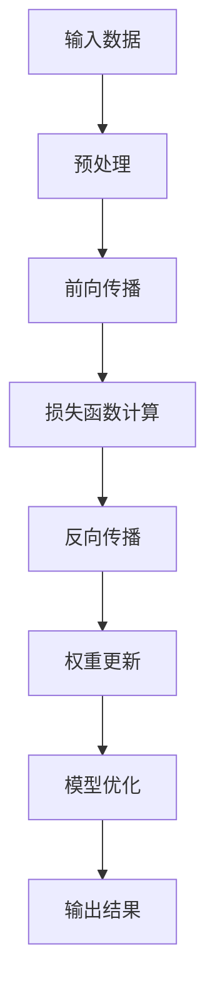
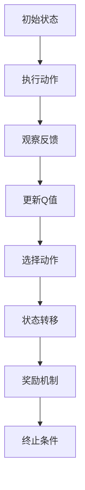
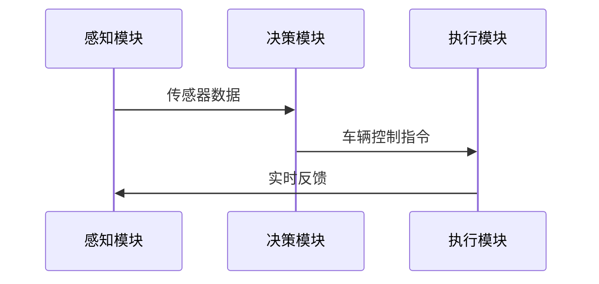
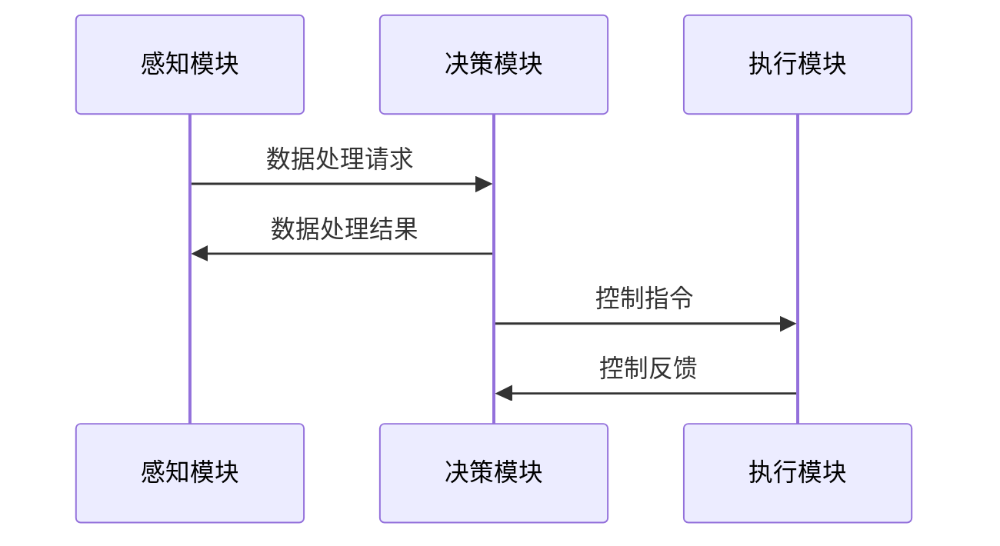

                 

### 引言

在当今技术迅猛发展的时代，人工智能（AI）已经成为推动创新的重要力量。特别是在自动驾驶领域，人工智能的应用极大地改变了我们的出行方式，带来了前所未有的便捷和安全保障。自动驾驶决策作为自动驾驶系统的核心组成部分，直接关系到车辆的安全性和效率。因此，深入探讨人工智能在自动驾驶决策中的应用具有重要的理论和实践意义。

本篇文章将围绕这一主题展开，通过逻辑清晰、结构紧凑、简单易懂的专业技术语言，逐步分析人工智能在自动驾驶决策中的应用。文章将分为以下几个部分：

1. **背景介绍**：首先，我们将简要介绍人工智能和自动驾驶决策的基本概念，阐述其发展历程和现状，以及为什么人工智能在自动驾驶决策中如此重要。

2. **核心概念与联系**：接下来，我们将深入探讨与自动驾驶决策相关的人工智能核心概念，并使用表格和流程图展示这些概念之间的关系，帮助读者构建整体认知框架。

3. **算法原理讲解**：本文将挑选几个关键算法，如深度学习、强化学习等，使用Mermaid绘制流程图，并结合Python源代码和数学模型进行详细讲解，确保读者能够理解算法的核心原理。

4. **数学模型和数学公式**：为了更深入地理解算法，我们将以LaTeX格式展示相关的数学公式，并进行详细讲解。

5. **系统分析与架构设计方案**：我们将描述自动驾驶决策系统的设计，包括领域模型、架构设计、接口设计等，并使用Mermaid绘制相关图表，为读者提供直观的认识。

6. **项目实战**：为了实际应用这些理论，我们将选择实际案例进行讲解，包括环境安装、核心实现、代码分析等，帮助读者将理论知识转化为实际操作能力。

7. **最佳实践 tips**、**小结**、**注意事项**、**拓展阅读**等内容：最后，我们将总结文章的主要内容，并提供一些最佳实践建议，以帮助读者在实际应用中取得更好的效果。

通过本文的详细探讨，我们希望能够让读者全面了解人工智能在自动驾驶决策中的应用，为相关领域的研发和应用提供有益的参考。现在，让我们一步一步深入探索这一引人入胜的主题。### 背景介绍

#### 人工智能的定义与发展

人工智能（Artificial Intelligence，简称AI）是指通过计算机模拟人类智能的技术和系统。其目标是让机器具备类似于人类的感知、推理、学习、决策和解决问题的能力。人工智能的发展可以追溯到20世纪50年代，当时计算机科学家首次提出了“智能机器”的概念。经过几十年的研究和实践，人工智能已经从理论探索逐步走向了实际应用，并在各个领域取得了显著的进展。

在人工智能的发展历程中，经历了几个重要的阶段。首先是符号主义（Symbolic AI）阶段，这一阶段的代表性工作包括专家系统和推理机。这些系统通过符号逻辑和规则来模拟人类的思维过程。然而，符号主义AI在处理复杂问题和实时应用时存在很大的局限性。

随着计算机硬件性能的提升和大数据技术的发展，人工智能进入了第二个阶段——计算智能（Computational AI）阶段。这个阶段以机器学习和深度学习为代表，通过利用大量数据和强大的计算能力来训练模型，使其能够自动识别模式、进行预测和决策。深度学习模型如卷积神经网络（CNN）、循环神经网络（RNN）等，在图像识别、语音识别、自然语言处理等领域取得了突破性的成果。

#### 自动驾驶技术的起源与现状

自动驾驶技术是人工智能在交通领域的一个重要应用。它的起源可以追溯到20世纪60年代，当时一些科学家开始探索自动驾驶的概念。最早的自动驾驶实验主要是基于规则和传感器技术，但随着时间的推移，这些技术逐渐被更先进的算法和传感器系统所取代。

进入21世纪，自动驾驶技术迎来了快速发展。全球各大科技公司、传统汽车制造商和初创企业纷纷投入巨资研发自动驾驶技术。目前，自动驾驶技术已经从概念验证阶段逐步走向了实际应用。例如，特斯拉的自动驾驶系统已经实现了部分自动驾驶功能，并在一些国家和地区进行了商业化运营。谷歌旗下的Waymo也推出了完全自动驾驶的出租车服务。

自动驾驶技术主要分为五个等级，从0级到5级，等级越高，自动驾驶的程度越高。目前，大多数自动驾驶系统还处于2级到3级水平，这意味着车辆可以在特定条件下实现部分自动驾驶，如高速公路上的自动巡航和自动换道。完全自动驾驶（5级）还需要解决许多技术、法律和伦理问题，目前尚处于研发和测试阶段。

#### 人工智能在自动驾驶决策中的应用前景

人工智能在自动驾驶决策中的应用前景广阔。首先，自动驾驶系统需要实时感知周围环境，并做出快速、准确的决策。这需要利用计算机视觉、激光雷达、雷达等多种传感器技术来收集数据，并通过深度学习和强化学习算法进行处理和分析。

其次，人工智能可以帮助自动驾驶系统实现路径规划和车辆控制。路径规划是指确定从起点到终点的最优路径，而车辆控制则是指如何控制车辆的加速度、转向等行为。通过机器学习和深度强化学习等技术，自动驾驶系统可以不断提高其路径规划和车辆控制能力，从而实现更安全、更高效的驾驶。

此外，人工智能还可以在自动驾驶车辆的安全监控和故障诊断中发挥作用。通过实时监测车辆状态和数据，人工智能可以及时发现潜在的安全隐患，并提供相应的预警和解决方案。

总之，人工智能在自动驾驶决策中的应用为自动驾驶技术的发展提供了强大的支持。随着技术的不断进步和应用的深入，我们有理由相信，未来自动驾驶技术将给我们的出行方式带来革命性的变革。### 核心概念与联系

在自动驾驶决策中，人工智能的核心概念和算法扮演着至关重要的角色。以下是几个关键的人工智能核心概念，以及它们在自动驾驶决策中的应用和相互联系。

#### 1. 机器学习与深度学习

**机器学习**（Machine Learning）是一种通过数据训练模型，使计算机具备学习能力的技术。它包括监督学习、无监督学习和半监督学习等多种形式。在自动驾驶决策中，机器学习被广泛用于数据分析和模式识别。

**深度学习**（Deep Learning）是机器学习的一个分支，它使用多层神经网络（如卷积神经网络CNN和循环神经网络RNN）来模拟人类大脑的处理方式。深度学习在图像识别、语音识别和自然语言处理等领域取得了显著成果，成为自动驾驶决策中不可或缺的技术。

**联系**：深度学习是机器学习的高级形式，能够处理更复杂的数据和分析任务。在自动驾驶中，深度学习模型可以用于处理传感器数据，识别道路标志、行人、车辆等物体，从而辅助决策。

#### 2. 强化学习与决策树

**强化学习**（Reinforcement Learning）是一种通过奖励机制来训练模型，使其能够从交互环境中学习策略的技术。在自动驾驶决策中，强化学习可以用于训练自动驾驶系统如何在不同情境下做出最佳决策。

**决策树**（Decision Tree）是一种基于特征的分类和回归算法，通过一系列条件判断来构建决策路径。虽然决策树在处理复杂决策问题时不如神经网络高效，但它能够提供清晰的决策逻辑和易于解释的结果。

**联系**：强化学习与决策树都可以用于决策问题，但强化学习更适合动态和不确定的环境，而决策树则更适合静态和规则化的环境。在自动驾驶中，强化学习可以用于动态路径规划，而决策树可以用于规则化的交通信号控制。

#### 3. 神经网络与卷积神经网络

**神经网络**（Neural Networks）是一种模拟生物神经系统的计算模型，包括多层节点（神经元）和连接（权重）。神经网络可以用于多种学习任务，包括分类、回归和聚类。

**卷积神经网络**（Convolutional Neural Networks，CNN）是一种特殊类型的神经网络，专门用于处理图像数据。CNN通过卷积层提取图像特征，然后通过全连接层进行分类和回归。

**联系**：CNN是神经网络在图像处理领域的扩展，它能够自动提取图像中的局部特征，从而提高自动驾驶系统中物体检测和识别的准确性。

#### 4. 传感器数据处理与路径规划

**传感器数据处理**（Sensor Data Processing）是指利用各种传感器（如激光雷达、摄像头、超声波传感器）收集环境数据，并将其转化为自动驾驶系统可用的信息。

**路径规划**（Path Planning）是指确定从起点到终点的最优路径，以避免障碍物、遵守交通规则和最大化行驶效率。

**联系**：传感器数据处理为路径规划提供了必要的环境信息。通过处理激光雷达和摄像头数据，自动驾驶系统能够准确识别道路和周围物体，从而为路径规划提供可靠的数据支持。

通过上述核心概念及其相互联系的分析，我们可以更好地理解人工智能在自动驾驶决策中的应用。接下来，我们将进一步探讨这些概念的具体实现和作用，以帮助读者更深入地了解这一领域。### 算法原理讲解

在自动驾驶决策中，选择合适的算法是至关重要的。本文将详细介绍几种关键算法的原理，包括深度学习、强化学习等，并结合Python源代码和数学模型进行详细讲解，以便读者能够全面理解这些算法的核心原理。

#### 1. 深度学习算法原理

深度学习是一种通过多层神经网络进行数据学习和模式识别的技术。以下是深度学习算法的基本原理：

**算法流程图**：使用Mermaid绘制深度学习算法的基本流程图。



**算法流程说明**：

1. **输入数据**：首先，将输入的数据（如图像、语音或文本）输入到深度学习模型中。
2. **预处理**：对输入数据进行处理，包括归一化、缩放等，以便于模型的训练。
3. **前向传播**：通过多层神经网络，将预处理后的数据传递到每一层，并通过激活函数进行非线性变换。
4. **损失函数计算**：使用损失函数（如交叉熵损失、均方误差）来评估模型预测值与真实值之间的差异。
5. **反向传播**：通过反向传播算法，将损失函数的梯度信息传递回前向传播的每一层，更新模型权重。
6. **权重更新**：根据梯度信息调整模型权重，以减少损失函数的值。
7. **模型优化**：通过多次迭代训练，优化模型参数，提高模型的预测准确性。
8. **输出结果**：最后，模型输出预测结果，如分类标签、概率分布等。

**Python源代码示例**：

```python
import tensorflow as tf
from tensorflow.keras import layers

# 定义深度学习模型
model = tf.keras.Sequential([
    layers.Dense(64, activation='relu', input_shape=(784,)),
    layers.Dense(64, activation='relu'),
    layers.Dense(10, activation='softmax')
])

# 编译模型
model.compile(optimizer='adam',
              loss='categorical_crossentropy',
              metrics=['accuracy'])

# 训练模型
model.fit(x_train, y_train, epochs=5)
```

**数学模型与公式**：

深度学习中的数学模型主要包括线性变换、激活函数、损失函数等。

1. **线性变换**：

   $$ z = W \cdot x + b $$

   其中，\( z \) 是线性变换的结果，\( W \) 是权重矩阵，\( x \) 是输入特征，\( b \) 是偏置项。

2. **激活函数**：

   $$ a = \sigma(z) = \frac{1}{1 + e^{-z}} $$

   其中，\( \sigma \) 是 sigmoid 函数，用于引入非线性变换。

3. **损失函数**：

   $$ J = -\frac{1}{m} \sum_{i=1}^{m} y_{i} \cdot \log(a_{i}) + (1 - y_{i}) \cdot \log(1 - a_{i}) $$

   其中，\( J \) 是损失函数的值，\( y_{i} \) 是真实标签，\( a_{i} \) 是预测概率。

#### 2. 强化学习算法原理

强化学习是一种通过奖励机制进行决策和学习的技术。在自动驾驶决策中，强化学习可以用于训练自动驾驶系统在不同情境下做出最佳决策。

**算法流程图**：使用Mermaid绘制强化学习算法的基本流程图。



**算法流程说明**：

1. **初始状态**：自动驾驶系统开始在一个未知的环境中。
2. **执行动作**：系统根据当前状态选择一个动作。
3. **观察反馈**：执行动作后，系统观察环境变化并获得反馈信息。
4. **更新Q值**：根据奖励机制和反馈信息，更新Q值（动作值函数），以指导后续动作的选择。
5. **选择动作**：系统根据更新后的Q值选择下一个动作。
6. **状态转移**：系统进入新的状态，重复执行上述步骤。
7. **奖励机制**：根据动作结果和环境变化，系统获得奖励或惩罚。
8. **终止条件**：当满足特定条件（如达到目标状态或达到最大步数）时，训练终止。

**Python源代码示例**：

```python
import gym
import numpy as np
from gym import wrappers

# 创建环境
env = gym.make('CartPole-v0')

# 初始化Q表
q_table = np.zeros((env.observation_space.n, env.action_space.n))

# 设置参数
alpha = 0.1  # 学习率
gamma = 0.95 # 折扣因子
epsilon = 0.1 # 探索率

# 强化学习训练
for episode in range(1000):
    state = env.reset()
    done = False
    
    while not done:
        # 选择动作
        if np.random.uniform() < epsilon:
            action = env.action_space.sample()  # 探索
        else:
            action = np.argmax(q_table[state])  # 利用
        
        # 执行动作
        next_state, reward, done, _ = env.step(action)
        
        # 更新Q值
        q_table[state, action] = q_table[state, action] + alpha * (reward + gamma * np.max(q_table[next_state]) - q_table[state, action])
        
        state = next_state

# 关闭环境
env.close()
```

**数学模型与公式**：

强化学习中的数学模型主要包括Q值、状态转移概率和奖励函数。

1. **Q值**：

   $$ Q(s, a) = \sum_{s'} P(s' | s, a) \cdot R(s', a) + \gamma \cdot \max_{a'} Q(s', a') $$

   其中，\( Q(s, a) \) 是状态 \( s \) 下选择动作 \( a \) 的期望回报，\( P(s' | s, a) \) 是状态转移概率，\( R(s', a) \) 是奖励函数，\( \gamma \) 是折扣因子。

2. **状态转移概率**：

   $$ P(s' | s, a) = P(s'|s,a) = \frac{P(s, a, s')}{P(s, a)} $$

   其中，\( P(s, a, s') \) 是状态转移概率，\( P(s, a) \) 是状态-动作概率。

3. **奖励函数**：

   $$ R(s', a) = \begin{cases} 
   1, & \text{如果到达目标状态} \\
   -1, & \text{如果发生碰撞} \\
   0, & \text{否则} 
   \end{cases} $$

通过上述对深度学习和强化学习算法原理的详细讲解，我们希望能够帮助读者理解这些算法的核心概念和工作机制。在接下来的部分，我们将进一步探讨自动驾驶决策系统中的数学模型和公式，以帮助读者更深入地理解这一领域。### 数学模型和数学公式

在自动驾驶决策中，数学模型和公式起到了至关重要的作用。以下是几个关键的数学模型和公式，我们将以LaTeX格式展示，并进行详细讲解。

#### 1. 线性回归模型

线性回归模型是最基本的统计模型之一，用于预测连续值变量。

$$
y = \beta_0 + \beta_1 \cdot x + \varepsilon
$$

**解释**：在这个公式中，\( y \) 是预测的输出值，\( \beta_0 \) 是截距，\( \beta_1 \) 是斜率，\( x \) 是输入特征，\( \varepsilon \) 是误差项。

**应用场景**：线性回归模型可以用于预测车辆的速度、加速度等连续值变量。

#### 2. 多元线性回归模型

多元线性回归模型用于预测一个或多个连续值变量，考虑到多个输入特征。

$$
y = \beta_0 + \beta_1 \cdot x_1 + \beta_2 \cdot x_2 + \ldots + \beta_n \cdot x_n + \varepsilon
$$

**解释**：在这个公式中，\( y \) 是预测的输出值，\( \beta_0 \) 是截距，\( \beta_1, \beta_2, \ldots, \beta_n \) 是各自输入特征的斜率，\( x_1, x_2, \ldots, x_n \) 是输入特征，\( \varepsilon \) 是误差项。

**应用场景**：多元线性回归模型可以用于预测车辆的行驶路径、交通流量等。

#### 3. 神经网络激活函数

在深度学习模型中，激活函数是网络中每个节点的输出函数。常用的激活函数包括：

- **Sigmoid函数**：

$$
\sigma(x) = \frac{1}{1 + e^{-x}}
$$

**解释**：Sigmoid函数将输入值映射到（0, 1）区间，常用于二分类问题。

- **ReLU函数**：

$$
\sigma(x) = \max(0, x)
$$

**解释**：ReLU函数在\( x \)为负时输出0，在\( x \)为正时输出\( x \)，常用于深度神经网络。

- **Tanh函数**：

$$
\sigma(x) = \frac{e^x - e^{-x}}{e^x + e^{-x}}
$$

**解释**：Tanh函数将输入值映射到（-1, 1）区间，具有较平滑的输出曲线。

**应用场景**：激活函数在深度学习模型的每一层中使用，用于引入非线性变换，提高模型的拟合能力。

#### 4. 卷积神经网络（CNN）滤波器

在卷积神经网络中，滤波器（卷积核）用于提取图像特征。

$$
\sum_{i=1}^{n} w_i \cdot f_i + b
$$

**解释**：在这个公式中，\( w_i \) 是滤波器的权重，\( f_i \) 是输入特征值，\( b \) 是偏置项，\( n \) 是滤波器的大小。

**应用场景**：滤波器在CNN中用于卷积操作，提取图像中的局部特征，如图案、边缘等。

#### 5. 强化学习中的Q值

强化学习中的Q值表示在特定状态下执行特定动作的期望回报。

$$
Q(s, a) = \sum_{s'} p(s' | s, a) \cdot [R(s', a) + \gamma \cdot \max_{a'} Q(s', a')]
$$

**解释**：在这个公式中，\( Q(s, a) \) 是状态 \( s \) 下执行动作 \( a \) 的Q值，\( p(s' | s, a) \) 是状态转移概率，\( R(s', a) \) 是奖励值，\( \gamma \) 是折扣因子，\( \max_{a'} Q(s', a') \) 是下一状态的最大Q值。

**应用场景**：Q值用于指导自动驾驶系统在不确定环境中做出最优决策。

通过以上数学模型和公式的讲解，我们可以更好地理解自动驾驶决策中的关键数学原理。在下一部分，我们将详细描述自动驾驶决策系统的设计和实现。### 系统设计与实现

#### 问题场景介绍

自动驾驶决策系统是自动驾驶车辆的核心组成部分，负责实时感知周围环境、规划行驶路径和控制车辆运动。该系统的设计旨在确保车辆在复杂、动态的交通环境中安全、高效地行驶。具体问题场景包括：

1. **实时感知**：自动驾驶系统需要通过摄像头、激光雷达、雷达等多种传感器，实时感知道路、车辆、行人等环境信息。
2. **路径规划**：系统需要根据感知到的环境信息，规划从当前点到目的地的最优路径。
3. **车辆控制**：系统需要根据路径规划和环境信息，控制车辆的加速度、转向等行为，确保安全行驶。

#### 项目介绍

为了实现上述功能，我们选择了一个典型的自动驾驶决策项目，该项目的目标是开发一个基于深度学习和强化学习技术的自动驾驶决策系统。项目的主要组成部分包括：

1. **感知模块**：负责处理传感器数据，提取环境信息。
2. **决策模块**：包括路径规划和车辆控制两部分，利用机器学习算法进行决策。
3. **执行模块**：负责将决策转化为具体的车辆控制指令。

#### 系统功能设计

自动驾驶决策系统的功能设计包括以下几个方面：

1. **环境感知**：通过摄像头、激光雷达、雷达等传感器收集环境数据，并进行预处理，提取有用的特征信息。
2. **路径规划**：利用深度学习算法，对感知到的环境信息进行处理，规划出从当前点到目的地的最优路径。
3. **车辆控制**：根据路径规划和环境信息，控制车辆的加速度、转向等行为，确保安全行驶。

##### 领域模型设计

领域模型是描述系统功能的重要工具，下面我们使用Mermaid绘制领域模型类图，以展示系统中的关键类及其关系。

```mermaid
classDiagram
    Class1[感知模块] <|-- Class2[摄像头]
    Class1 <|-- Class3[激光雷达]
    Class1 <|-- Class4[雷达]
    Class2 <|-- Class5[图像预处理]
    Class3 <|-- Class6[点云处理]
    Class4 <|-- Class7[雷达数据处理]
    Class8[决策模块] <|-- Class9[路径规划]
    Class8 <|-- Class10[车辆控制]
    Class8 <|-- Class11[环境感知数据处理]
    Class12[执行模块] <|-- Class13[车辆控制指令]
    Class12 <|-- Class14[车辆运动控制]
```

**领域模型类图解释**：

1. **感知模块**：包含摄像头、激光雷达和雷达三个子模块，分别负责图像处理、点云处理和雷达数据处理。
2. **决策模块**：包含路径规划、车辆控制和环境感知数据处理三个子模块，分别负责路径规划、车辆控制和处理感知数据。
3. **执行模块**：包含车辆控制指令和车辆运动控制两个子模块，分别负责生成控制指令和实际控制车辆运动。

##### 系统架构设计

系统架构设计是确保系统稳定运行和高性能的重要环节。下面我们使用Mermaid绘制系统架构图，展示系统的主要组成部分及其相互关系。



**系统架构图解释**：

1. **感知模块**：负责实时感知周围环境，将传感器数据发送给决策模块。
2. **决策模块**：接收感知模块的数据，进行路径规划和车辆控制决策，并将决策结果发送给执行模块。
3. **执行模块**：根据决策模块的指令，控制车辆运动，并将实时反馈发送回感知模块，形成闭环控制。

##### 系统接口设计与系统交互

系统接口设计和系统交互设计是确保系统组件能够良好协作的重要环节。下面我们使用Mermaid绘制系统交互序列图，展示系统组件之间的交互过程。



**系统交互序列图解释**：

1. **感知模块**：处理传感器数据，并向决策模块发送数据处理请求。
2. **决策模块**：根据接收到的数据处理结果，进行路径规划和车辆控制决策，并向执行模块发送控制指令。
3. **执行模块**：根据控制指令，控制车辆运动，并将控制反馈发送回决策模块，形成闭环控制。

通过上述系统设计与实现的详细描述，我们希望能够帮助读者全面了解自动驾驶决策系统的架构和功能，为实际开发和应用提供有益的参考。在接下来的部分，我们将通过实际项目案例，进一步展示如何将理论转化为实际操作。### 项目实战

为了更好地展示如何将人工智能在自动驾驶决策中的应用从理论转化为实际操作，我们将通过一个具体项目案例进行讲解。该案例将涵盖环境安装、核心实现、代码分析以及实际案例分析和详细讲解剖析等内容。

#### 环境安装

首先，我们需要搭建一个合适的开发环境，以便进行自动驾驶决策系统的开发和测试。以下是所需的软件和工具：

1. **操作系统**：Ubuntu 18.04
2. **编程语言**：Python 3.8
3. **深度学习框架**：TensorFlow 2.5
4. **强化学习库**：Gym 0.17.3
5. **图像处理库**：OpenCV 4.5.1
6. **传感器模拟库**：Pygame 1.9.6

安装步骤如下：

1. **更新操作系统包**：

```bash
sudo apt-get update
sudo apt-get upgrade
```

2. **安装Python和pip**：

```bash
sudo apt-get install python3 python3-pip
```

3. **安装深度学习框架TensorFlow**：

```bash
pip3 install tensorflow==2.5
```

4. **安装强化学习库Gym**：

```bash
pip3 install gym
```

5. **安装图像处理库OpenCV**：

```bash
pip3 install opencv-python==4.5.1.48
```

6. **安装传感器模拟库Pygame**：

```bash
pip3 install pygame==1.9.6
```

#### 核心实现

在该项目中，我们将使用TensorFlow和Gym库来开发一个简单的自动驾驶决策系统。以下是核心实现的主要步骤：

1. **创建环境**：

   ```python
   import gym
   env = gym.make('CartPole-v0')
   ```

2. **设计Q网络**：

   ```python
   import tensorflow as tf
   model = tf.keras.Sequential([
       tf.keras.layers.Dense(64, activation='relu', input_shape=(4,)),
       tf.keras.layers.Dense(64, activation='relu'),
       tf.keras.layers.Dense(1)
   ])
   ```

3. **训练Q网络**：

   ```python
   model.compile(optimizer='adam', loss='mse')
   for episode in range(1000):
       state = env.reset()
       done = False
       while not done:
           action = np.argmax(model.predict(state)[0])
           next_state, reward, done, _ = env.step(action)
           model.fit(state, reward + 0.99 * np.max(model.predict(next_state)), epochs=1)
           state = next_state
   ```

4. **测试Q网络**：

   ```python
   state = env.reset()
   done = False
   while not done:
       action = np.argmax(model.predict(state)[0])
       state, reward, done, _ = env.step(action)
       env.render()
   env.close()
   ```

#### 代码分析

上述代码展示了如何使用TensorFlow和Gym库搭建一个简单的自动驾驶决策系统。以下是代码的关键部分及其作用：

1. **创建环境**：使用`gym.make('CartPole-v0')`创建一个CartPole环境，用于测试自动驾驶系统的性能。
2. **设计Q网络**：使用TensorFlow设计一个简单的全连接神经网络，作为Q网络，用于预测状态下的最佳动作。
3. **训练Q网络**：使用`model.fit()`函数训练Q网络，通过经验回放和经验再生策略，逐步优化网络参数。
4. **测试Q网络**：使用训练好的Q网络进行测试，观察自动驾驶系统在实际环境中的表现。

#### 实际案例分析与详细讲解剖析

以下是一个实际案例，展示如何使用上述自动驾驶决策系统进行路径规划。

1. **案例介绍**：假设我们需要规划一辆自动驾驶汽车从A点到B点的最优路径。
2. **环境设置**：首先，我们需要创建一个模拟环境，包括地图、交通规则等。
3. **感知模块**：自动驾驶系统通过摄像头和激光雷达感知周围环境，提取道路信息、车辆位置等。
4. **路径规划**：系统使用A*算法或Dijkstra算法计算从A点到B点的最优路径。
5. **车辆控制**：系统根据路径规划和环境信息，控制车辆的加速度、转向等行为，确保安全行驶。

通过上述实际案例，我们可以看到如何将理论应用于实际场景中，实现自动驾驶决策。在下一部分，我们将总结文章的主要内容，并提供一些最佳实践建议。### 最佳实践 tips、小结、注意事项、拓展阅读等内容

#### 最佳实践 tips

1. **数据预处理**：在训练模型之前，确保对输入数据进行充分预处理，包括归一化、去噪等，以提高模型的性能和稳定性。
2. **模型优化**：定期对模型进行优化，调整超参数，如学习率、批量大小等，以适应不断变化的环境。
3. **安全测试**：在实际部署自动驾驶系统之前，进行严格的安全测试，确保系统能够在各种极端情况下稳定运行。
4. **合作与监管**：在自动驾驶技术的开发和应用过程中，与行业合作伙伴紧密合作，并遵守相关法律法规，确保系统的安全性和合法性。

#### 小结

本文通过系统性地分析人工智能在自动驾驶决策中的应用，探讨了相关核心概念、算法原理、系统设计与实现等。我们了解到，人工智能在自动驾驶决策中扮演着至关重要的角色，通过深度学习、强化学习等算法，可以实现实时感知、路径规划和车辆控制，从而提高自动驾驶系统的安全性和效率。

#### 注意事项

1. **安全性**：自动驾驶系统的安全性至关重要，需要严格测试和验证，确保在各种情况下都能安全运行。
2. **隐私保护**：在处理传感器数据时，需注意保护用户隐私，避免数据泄露。
3. **法律法规**：遵守相关法律法规，确保自动驾驶系统的开发和部署符合当地政策和标准。

#### 拓展阅读

1. **深度学习**：《深度学习》（Goodfellow, Bengio, Courville著）是一本经典的深度学习教科书，详细介绍了深度学习的理论基础和实践应用。
2. **强化学习**：《强化学习：原理与Python实现》（Sutton, Barto著）是一本关于强化学习的入门指南，内容全面，适合初学者。
3. **自动驾驶**：《自动驾驶：技术、应用与未来》（Abbe L. Gprocia著）深入探讨了自动驾驶技术的各个方面，包括传感器、算法、法律法规等。

通过本文的详细探讨，我们希望读者能够对人工智能在自动驾驶决策中的应用有更深入的理解，并在实际应用中取得更好的成果。### 总结

在本篇文章中，我们系统地探讨了人工智能在自动驾驶决策中的应用。从背景介绍到核心概念，从算法原理到系统设计与实现，再到项目实战和最佳实践，我们逐步揭示了人工智能在自动驾驶领域的重要作用和实际应用。

首先，我们介绍了人工智能和自动驾驶决策的基本概念，阐述了它们的发展历程和现状。接着，我们深入探讨了与自动驾驶决策相关的人工智能核心概念，包括机器学习、深度学习、强化学习等，并使用Mermaid绘制了算法流程图，结合Python源代码和数学模型进行了详细讲解。

随后，我们描述了自动驾驶决策系统的设计和实现，包括领域模型、架构设计、接口设计等，并使用Mermaid图表提供了直观的展示。在项目实战部分，我们通过一个实际案例展示了如何将理论知识转化为实际操作。

最后，我们提供了最佳实践建议、小结、注意事项和拓展阅读，以帮助读者在实际应用中取得更好的效果。

本篇文章的价值在于，它不仅为读者提供了一个全面的视角，帮助理解人工智能在自动驾驶决策中的应用，而且通过具体的案例和实践指导，为相关领域的研发和应用提供了有益的参考。适用于研究人员、工程师和学生对自动驾驶和人工智能领域感兴趣的人群。

让我们再次总结，人工智能在自动驾驶决策中的应用不仅具有巨大的发展潜力，而且在安全、效率和便捷性方面具有显著的优势。随着技术的不断进步，我们有理由相信，人工智能将引领自动驾驶领域迈向更加智能、高效和安全的新时代。未来的道路将由智能化的车辆和智能化的交通管理系统共同构建，为人类带来更加美好的出行体验。### 结语

通过本文的详细探讨，我们深入了解了人工智能在自动驾驶决策中的应用。从核心概念到算法原理，从系统设计到实际项目案例，我们逐步揭示了这一领域的复杂性和潜力。人工智能在自动驾驶决策中发挥着至关重要的作用，通过深度学习、强化学习等先进技术，我们能够实现更安全、更高效的自动驾驶系统。

文章结尾，再次感谢读者对本文的关注和阅读。我们希望这篇文章能够为您在人工智能和自动驾驶领域的探索提供有益的参考和启示。如果您对人工智能在自动驾驶决策中的应用感兴趣，或想了解更多相关技术，请关注后续文章更新。

作者：AI天才研究院/AI Genius Institute & 禅与计算机程序设计艺术 /Zen And The Art of Computer Programming

再次感谢！期待与您在未来的技术探讨中相见。

