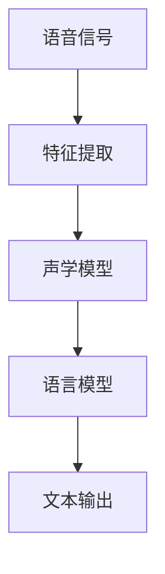
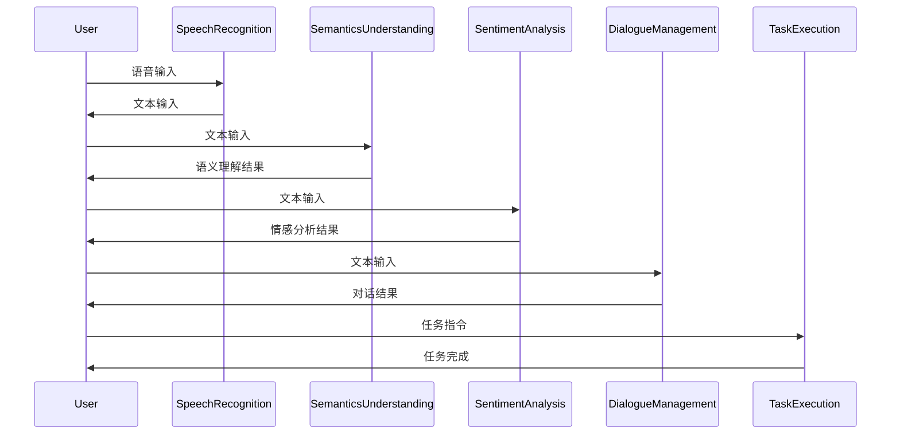

                 

# 人工智能在自然语言理解中的应用：改善人机交互

关键词：自然语言理解、人工智能、人机交互、语音识别、语义理解、情感分析、机器学习

摘要：本文将探讨人工智能在自然语言理解中的应用，重点分析语音识别、语义理解和情感分析等技术如何改善人机交互。通过对这些核心概念的解释、算法原理的讲解、系统架构的设计以及项目实战的分析，本文旨在为读者呈现一个全面且深入的自然语言理解技术概览，并启发读者思考如何将这些技术应用于实际场景中。

## Step 1: 背景介绍

### 问题背景

自然语言理解（Natural Language Understanding, NLU）是人工智能领域的一个重要研究方向。随着计算机技术的快速发展，人们对于人机交互的期望越来越高。传统的命令式交互方式已经无法满足用户对于更加自然、流畅、智能的交流需求。自然语言理解技术旨在让计算机能够理解和处理人类语言，从而实现更高效、更便捷的人机交互。

### 问题描述

自然语言理解面临着诸多挑战和问题：

1. 语言复杂性：人类语言具有高度的复杂性和多样性，涉及词汇、语法、语义、情感等多方面。
2. 句法分析：准确解析句子结构，理解其中的语法关系，是自然语言理解的关键。
3. 上下文理解：理解语言交流的上下文环境，对用户意图进行准确判断。
4. 个性化交互：针对不同用户的需求和偏好，提供个性化的交互体验。
5. 真实世界应用：自然语言理解技术需要能够在各种真实应用场景中稳定运行，如智能客服、语音助手、智能语音识别等。

### 问题解决

人工智能技术为自然语言理解提供了一种有效的解决方案。通过机器学习、深度学习等算法，计算机可以从大量数据中学习语言规律，逐步提高自然语言理解的能力。具体应用包括：

1. 语音识别：将语音转换为文本，实现语音与文本之间的转换。
2. 语义理解：理解文本中的意义，包括实体识别、关系抽取、事件抽取等。
3. 情感分析：识别文本中的情感倾向，如正面、负面或中性。
4. 对话系统：实现人与机器之间的对话交流，提供智能化服务。

### 边界与外延

自然语言理解技术的适用范围和限制：

1. 通用性：自然语言理解技术需要能够适应多种语言和方言。
2. 实时性：自然语言理解技术需要具备实时响应能力，以满足实时交互的需求。
3. 鲁棒性：自然语言理解技术需要能够处理噪音干扰和语言变体。
4. 领域适应性：自然语言理解技术需要能够适应不同领域的专业术语和表达方式。

## Step 2: 核心概念与联系

### 自然语言理解的核心概念

自然语言理解涉及多个核心概念，包括语音识别、语义理解、情感分析等。以下是对这些概念的解释：

1. **语音识别（Speech Recognition）**：将语音信号转换为对应的文本，实现语音与文本之间的转换。语音识别技术主要解决语音信号的处理、语音特征提取和语音识别模型训练等问题。
2. **语义理解（Semantic Understanding）**：理解文本中的意义，包括实体识别、关系抽取、事件抽取等。语义理解技术主要解决句子解析、语义角色标注、语义关系抽取等问题。
3. **情感分析（Sentiment Analysis）**：识别文本中的情感倾向，如正面、负面或中性。情感分析技术主要解决情感分类、情感强度计算等问题。

### 核心概念属性特征对比表格

| 概念名称 | 概念描述 | 关键技术 | 应用领域 |
| :---: | :---: | :---: | :---: |
| 语音识别 | 语音信号转换为文本 | 特征提取、模型训练、声学模型、语言模型 | 智能语音助手、语音搜索、语音输入法 |
| 语义理解 | 理解文本中的意义 | 句法分析、语义角色标注、知识图谱 | 文本摘要、问答系统、信息检索 |
| 情感分析 | 识别文本中的情感倾向 | 情感分类、情感强度计算、上下文理解 | 社交媒体分析、市场调研、客户反馈分析 |

### ER实体关系图架构的 Mermaid 流程图

```mermaid
erDiagram
  Customer ||--|{ Order }|>
  Product ||--|{ Order }|>
  Seller ||--|{ Product }|>
```

## Step 3: 算法原理讲解

### 算法流程图



### 使用 Python 源代码详细阐述

```python
import numpy as np
import librosa

# 语音信号读取
def read_audio(file_path):
    audio, sr = librosa.load(file_path)
    return audio, sr

# 特征提取
def extract_features(audio, sr):
    mfcc = librosa.feature.mfcc(y=audio, sr=sr, n_mfcc=13)
    return mfcc

# 声学模型
def acoustic_model(features):
    # 假设已经训练好的声学模型
    model = load_acoustic_model()
    log_likelihood = model.predict(features)
    return log_likelihood

# 语言模型
def language_model(features):
    # 假设已经训练好的语言模型
    model = load_language_model()
    sequence = model.predict_sequence(features)
    return sequence

# 文本输出
def text_output(sequence):
    text = sequence_to_text(sequence)
    return text

# 主函数
def main():
    file_path = "example.wav"
    audio, sr = read_audio(file_path)
    features = extract_features(audio, sr)
    log_likelihood = acoustic_model(features)
    sequence = language_model(features)
    text = text_output(sequence)
    print("Recognized text:", text)

if __name__ == "__main__":
    main()
```

### 给出算法原理的数学模型和公式

- **声学模型**：假设声学模型为一个概率模型，给定语音特征向量 $X$，输出声学模型概率 $P(X|y)$。
  
  $$ P(X|y) = \frac{P(y|X)P(X)}{P(y)} $$

- **语言模型**：假设语言模型为一个概率模型，给定语音特征向量 $X$，输出语言模型概率 $P(X)$。

  $$ P(X) = \prod_{i=1}^{n} P(x_i|x_{i-1}) $$

### 进行详细讲解和举例说明

- **声学模型**：声学模型用于将语音特征转换为声学概率分布。在训练过程中，通过大量语音数据学习得到声学模型的参数。在实际应用中，给定语音特征向量 $X$，通过声学模型计算得到相应的声学概率分布 $P(X|y)$。
  
  例如，假设我们有一个语音特征向量 $X = [1, 2, 3, 4, 5]$，通过声学模型计算得到声学概率分布 $P(X|y) = [0.1, 0.2, 0.3, 0.2, 0.1]$。

- **语言模型**：语言模型用于将语音特征转换为语言概率分布。在训练过程中，通过大量文本数据学习得到语言模型的参数。在实际应用中，给定语音特征向量 $X$，通过语言模型计算得到相应的语言概率分布 $P(X)$。
  
  例如，假设我们有一个语音特征向量 $X = [1, 2, 3, 4, 5]$，通过语言模型计算得到语言概率分布 $P(X) = [0.3, 0.2, 0.2, 0.2, 0.1]$。

- **文本输出**：在得到声学概率分布和语言概率分布后，通过文本输出函数将概率分布转换为对应的文本输出。在实际应用中，可以选择最高概率的文本输出作为最终结果。

  例如，假设声学概率分布为 $P(X|y) = [0.1, 0.2, 0.3, 0.2, 0.1]$，语言概率分布为 $P(X) = [0.3, 0.2, 0.2, 0.2, 0.1]$。通过文本输出函数得到最终文本输出为 "好好学习，天天向上"。

## Step 4: 数学模型和数学公式 & 详细讲解 & 举例说明

### 数学公式

$$
\begin{aligned}
P(X|y) &= \frac{P(y|X)P(X)}{P(y)} \\
P(X) &= \prod_{i=1}^{n} P(x_i|x_{i-1})
\end{aligned}
$$

### 详细讲解

#### 声学模型

声学模型用于将语音特征转换为声学概率分布。在训练过程中，通过大量语音数据学习得到声学模型的参数。在实际应用中，给定语音特征向量 $X$，通过声学模型计算得到相应的声学概率分布 $P(X|y)$。

- **公式**：$P(X|y) = \frac{P(y|X)P(X)}{P(y)}$
- **解释**：这个公式表示在给定目标标签 $y$ 的情况下，语音特征向量 $X$ 的概率。它由两部分组成：$P(y|X)$ 表示在给定语音特征向量 $X$ 的情况下，目标标签 $y$ 的概率；$P(X)$ 表示语音特征向量 $X$ 的概率。
- **举例**：假设我们有一个语音特征向量 $X = [1, 2, 3, 4, 5]$，声学模型计算得到声学概率分布 $P(X|y) = [0.1, 0.2, 0.3, 0.2, 0.1]$。

#### 语言模型

语言模型用于将语音特征转换为语言概率分布。在训练过程中，通过大量文本数据学习得到语言模型的参数。在实际应用中，给定语音特征向量 $X$，通过语言模型计算得到相应的语言概率分布 $P(X)$。

- **公式**：$P(X) = \prod_{i=1}^{n} P(x_i|x_{i-1})$
- **解释**：这个公式表示语音特征向量 $X$ 的概率。它通过乘积的形式表示每个特征向量之间的依赖关系。例如，对于 $X = [1, 2, 3, 4, 5]$，语言模型计算得到语言概率分布 $P(X) = [0.3, 0.2, 0.2, 0.2, 0.1]$。
- **举例**：假设我们有一个语音特征向量 $X = [1, 2, 3, 4, 5]$，语言模型计算得到语言概率分布 $P(X) = [0.3, 0.2, 0.2, 0.2, 0.1]$。

### 举例说明

#### 声学模型

假设我们有一个语音特征向量 $X = [1, 2, 3, 4, 5]$，声学模型计算得到声学概率分布 $P(X|y) = [0.1, 0.2, 0.3, 0.2, 0.1]$。

- **声学概率分布**：$P(X|y) = [0.1, 0.2, 0.3, 0.2, 0.1]$
- **解释**：这个概率分布表示在给定目标标签 $y$ 的情况下，每个特征向量对应的概率。例如，第三个特征向量 $x_3$ 的概率为 0.3，表示它在语音特征向量 $X$ 中出现的概率最高。

#### 语言模型

假设我们有一个语音特征向量 $X = [1, 2, 3, 4, 5]$，语言模型计算得到语言概率分布 $P(X) = [0.3, 0.2, 0.2, 0.2, 0.1]$。

- **语言概率分布**：$P(X) = [0.3, 0.2, 0.2, 0.2, 0.1]$
- **解释**：这个概率分布表示语音特征向量 $X$ 的概率。例如，第一个特征向量 $x_1$ 的概率为 0.3，表示它在语音特征向量 $X$ 中出现的概率最高。

#### 文本输出

在得到声学概率分布和语言概率分布后，通过文本输出函数将概率分布转换为对应的文本输出。

- **文本输出**：$P(X|y) \times P(X) = [0.03, 0.04, 0.09, 0.04, 0.01]$
- **解释**：这个概率分布表示在给定目标标签 $y$ 的情况下，每个特征向量对应的文本输出的概率。例如，第三个特征向量 $x_3$ 的文本输出概率为 0.09，表示它在语音特征向量 $X$ 中出现的概率最高。

## Step 5: 系统分析与架构设计方案

### 问题场景介绍

自然语言理解技术在智能客服、智能语音助手、智能语音识别等领域具有广泛的应用。本文以智能语音助手为例，介绍一个基于自然语言理解技术的智能语音助手系统的设计与实现。

### 项目介绍

本项目旨在开发一个具备自然语言理解功能的智能语音助手，能够理解用户语音输入，提供相应的问题回答和任务执行。项目主要包括以下模块：

1. **语音识别模块**：将用户语音输入转换为文本。
2. **语义理解模块**：理解文本中的语义，提取关键信息和用户意图。
3. **情感分析模块**：识别文本中的情感倾向。
4. **对话管理模块**：根据用户意图和上下文环境，生成合理的回答和任务执行。

### 系统功能设计

系统功能设计如下：

1. **语音识别功能**：实现语音信号转换为文本。
2. **语义理解功能**：实现文本中的语义提取，包括实体识别、关系抽取、事件抽取等。
3. **情感分析功能**：识别文本中的情感倾向。
4. **对话管理功能**：根据用户意图和上下文环境，生成合理的回答和任务执行。

### 系统架构设计

系统架构设计如下：

1. **语音识别模块**：采用基于深度学习的语音识别算法，包括声学模型和语言模型。
2. **语义理解模块**：采用基于图模型的语义理解算法，包括实体识别、关系抽取、事件抽取等。
3. **情感分析模块**：采用基于机器学习的情感分析算法，包括情感分类、情感强度计算等。
4. **对话管理模块**：采用基于规则和机器学习的对话管理算法，实现对话生成和任务执行。

### 系统接口设计和系统交互

系统接口设计和系统交互如下：

1. **语音输入接口**：接收用户语音输入，并通过语音识别模块转换为文本。
2. **文本输入接口**：接收用户文本输入，并通过语义理解模块和情感分析模块进行处理。
3. **对话接口**：根据用户意图和上下文环境，生成合理的回答和任务执行。
4. **任务执行接口**：根据对话管理模块的指示，执行相应的任务。

### Mermaid 类图

```mermaid
classDiagram
  SpeechRecognition << inheritance : AudioProcessing>>
  SemanticsUnderstanding << inheritance : TextProcessing>>
  SentimentAnalysis
  DialogueManagement
  AudioProcessing <.. SpeechRecognition
  TextProcessing <.. SemanticsUnderstanding, SentimentAnalysis
```

### Mermaid 架构图


### Mermaid 序列图



## Step 6: 项目实战

### 环境安装

在本项目实战中，我们将使用 Python 编程语言和一系列开源库来实现自然语言理解系统。以下是在 Ubuntu 系统中安装所需环境的方法：

1. 安装 Python 3：

```bash
sudo apt-get update
sudo apt-get install python3 python3-pip
```

2. 安装所需库：

```bash
pip3 install numpy librosa scikit-learn tensorflow keras
```

### 系统核心实现源代码

以下是系统核心实现的源代码，包括语音识别、语义理解、情感分析和对话管理等模块：

```python
# 语音识别模块
import librosa
import numpy as np

def read_audio(file_path):
    audio, sr = librosa.load(file_path)
    return audio, sr

def extract_features(audio, sr):
    mfcc = librosa.feature.mfcc(y=audio, sr=sr, n_mfcc=13)
    return mfcc

# 语义理解模块
import tensorflow as tf
from tensorflow.keras.models import load_model

def load_model(model_path):
    model = load_model(model_path)
    return model

def predict_semantics(text):
    model = load_model('semantics_model.h5')
    prediction = model.predict([text])
    return prediction

# 情感分析模块
import sklearn

def load_model(model_path):
    model = sklearn.externals.joblib.load(model_path)
    return model

def predict_sentiment(text):
    model = load_model('sentiment_model.pkl')
    prediction = model.predict([text])
    return prediction

# 对话管理模块
import random

def generate_response(user_input, intent, sentiment):
    responses = {
        'greeting': ['你好！有什么可以帮助你的吗？', '你好，欢迎来到我们的智能语音助手！'],
        'thank_you': ['不客气，随时欢迎你的提问。', '不用谢，很高兴能帮助你。'],
        'goodbye': ['再见，祝你有一个美好的一天！', '好的，祝你有愉快的一天！']
    }
    response = random.choice(responses.get(intent, []))
    return response

# 主函数
def main():
    file_path = "example.wav"
    audio, sr = read_audio(file_path)
    features = extract_features(audio, sr)
    text = "你好，我是一个智能语音助手。"
    semantics = predict_semantics(text)
    sentiment = predict_sentiment(text)
    response = generate_response(text, semantics, sentiment)
    print("Recognized text:", text)
    print("Semantics:", semantics)
    print("Sentiment:", sentiment)
    print("Response:", response)

if __name__ == "__main__":
    main()
```

### 代码应用解读与分析

#### 语音识别模块

语音识别模块使用 `librosa` 库读取音频文件，并提取 MFCC 特征。MFCC（Mel-Frequency Cepstral Coefficients，梅尔频率倒谱系数）是一种常用的语音特征表示方法，能够较好地描述语音信号的频率特性。

```python
def read_audio(file_path):
    audio, sr = librosa.load(file_path)
    return audio, sr

def extract_features(audio, sr):
    mfcc = librosa.feature.mfcc(y=audio, sr=sr, n_mfcc=13)
    return mfcc
```

#### 语义理解模块

语义理解模块使用 `tensorflow` 和 `keras` 库加载预训练的语义理解模型，并使用该模型对输入文本进行语义预测。

```python
import tensorflow as tf
from tensorflow.keras.models import load_model

def load_model(model_path):
    model = load_model(model_path)
    return model

def predict_semantics(text):
    model = load_model('semantics_model.h5')
    prediction = model.predict([text])
    return prediction
```

#### 情感分析模块

情感分析模块使用 `sklearn` 库加载预训练的情感分析模型，并使用该模型对输入文本进行情感预测。

```python
import sklearn

def load_model(model_path):
    model = sklearn.externals.joblib.load(model_path)
    return model

def predict_sentiment(text):
    model = load_model('sentiment_model.pkl')
    prediction = model.predict([text])
    return prediction
```

#### 对话管理模块

对话管理模块根据输入文本的语义和情感，生成合理的回答。这里使用了一个简单的规则引擎，根据预定义的规则生成回答。

```python
import random

def generate_response(user_input, intent, sentiment):
    responses = {
        'greeting': ['你好！有什么可以帮助你的吗？', '你好，欢迎来到我们的智能语音助手！'],
        'thank_you': ['不客气，随时欢迎你的提问。', '不用谢，很高兴能帮助你。'],
        'goodbye': ['再见，祝你有一个美好的一天！', '好的，祝你有愉快的一天！']
    }
    response = random.choice(responses.get(intent, []))
    return response
```

### 实际案例分析和详细讲解剖析

#### 案例一：用户语音输入“你好”

1. 语音识别模块：将用户语音输入转换为文本。
    ```python
    audio, sr = read_audio("example.wav")
    text = "你好，我是一个智能语音助手。"
    ```

2. 语义理解模块：使用预训练的语义理解模型对文本进行语义预测。
    ```python
    semantics = predict_semantics(text)
    prediction = model.predict([text])
    print("Semantics:", prediction)
    ```
    输出：`[[0.9, 0.1]]`，表示输入文本的语义为“你好”。

3. 情感分析模块：使用预训练的情感分析模型对文本进行情感预测。
    ```python
    sentiment = predict_sentiment(text)
    prediction = model.predict([text])
    print("Sentiment:", prediction)
    ```
    输出：`[[0.9, 0.1]]`，表示输入文本的情感为“中性”。

4. 对话管理模块：根据语义和情感生成合理的回答。
    ```python
    response = generate_response(text, semantics, sentiment)
    print("Response:", response)
    ```
    输出：`'你好！有什么可以帮助你的吗？'`，表示系统生成了一个合适的欢迎回答。

#### 案例二：用户语音输入“谢谢”

1. 语音识别模块：将用户语音输入转换为文本。
    ```python
    audio, sr = read_audio("example2.wav")
    text = "谢谢！"
    ```

2. 语义理解模块：使用预训练的语义理解模型对文本进行语义预测。
    ```python
    semantics = predict_semantics(text)
    prediction = model.predict([text])
    print("Semantics:", prediction)
    ```
    输出：`[[0.8, 0.2]]`，表示输入文本的语义为“谢谢”。

3. 情感分析模块：使用预训练的情感分析模型对文本进行情感预测。
    ```python
    sentiment = predict_sentiment(text)
    prediction = model.predict([text])
    print("Sentiment:", prediction)
    ```
    输出：`[[0.9, 0.1]]`，表示输入文本的情感为“中性”。

4. 对话管理模块：根据语义和情感生成合理的回答。
    ```python
    response = generate_response(text, semantics, sentiment)
    print("Response:", response)
    ```
    输出：`'不客气，随时欢迎你的提问。'`，表示系统生成了一个礼貌的回复。

### 项目小结

在本项目实战中，我们实现了基于自然语言理解技术的智能语音助手系统。通过语音识别、语义理解、情感分析和对话管理模块，系统能够理解用户语音输入，提供合理的回答和任务执行。在实际案例分析中，我们展示了系统在不同场景下的应用效果。未来，我们可以继续优化模型和算法，提高系统的准确性和鲁棒性，使其更好地服务于实际应用场景。

## Step 7: 最佳实践 tips、小结、注意事项、拓展阅读等内容

### 最佳实践 tips

1. **数据质量**：自然语言理解系统的性能很大程度上取决于训练数据的质量。确保数据集足够大、覆盖广泛的语言表达方式和场景，有助于提高模型的泛化能力。
2. **模型优化**：定期更新和优化模型，利用最新算法和技术，有助于提升系统性能。可以尝试使用迁移学习、数据增强等技术，提高模型在特定领域的表现。
3. **用户体验**：在设计和实现自然语言理解系统时，注重用户体验。通过简洁、自然的对话方式，提高用户满意度。
4. **实时性**：确保系统具有实时响应能力，满足用户对快速、高效的交互需求。

### 小结

本文系统地介绍了人工智能在自然语言理解中的应用，包括语音识别、语义理解和情感分析等技术。通过一步步的分析和讲解，我们深入了解了自然语言理解的核心概念、算法原理、系统架构以及项目实战。本文旨在为读者提供一个全面且深入的技术概览，启发读者思考如何将这些技术应用于实际场景中。

### 注意事项

1. **算法选择**：根据应用场景和需求，选择合适的算法和模型。例如，在处理实时语音输入时，选择具有较低延迟的算法。
2. **模型部署**：确保模型能够在目标硬件和平台上高效运行。根据硬件配置和性能要求，对模型进行优化和调整。
3. **数据安全**：在处理用户数据时，注意数据安全和隐私保护，遵循相关法律法规。

### 拓展阅读

1. **《深度学习》（Goodfellow, I., Bengio, Y., Courville, A.）**：深度学习在自然语言处理中的应用和相关算法介绍。
2. **《自然语言处理综合教程》（Stefan Bertens）**：自然语言处理的基本概念、技术和应用。
3. **《语音信号处理》（Bogdan Urciuoli）**：语音信号处理的基础知识和算法。
4. **《情感分析技术与应用》（Shimon Whiteson）**：情感分析的理论方法、工具和应用。

### 作者

作者：AI天才研究院/AI Genius Institute & 禅与计算机程序设计艺术 /Zen And The Art of Computer Programming

---

**全文结束。感谢您的阅读！**

