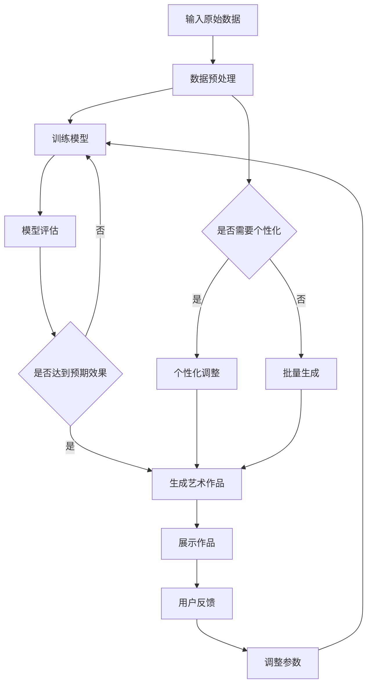

                 

# 人工智能在艺术创作中的角色与争议

> 关键词：人工智能，艺术创作，挑战与争议，应用案例，技术发展

> 摘要：本文将探讨人工智能在艺术创作中的角色与争议。通过分析人工智能在绘画、音乐、文学、艺术设计以及艺术教育中的应用案例，我们将了解其在艺术创作中的实际表现和影响力。同时，本文也将讨论人工智能在艺术创作中面临的挑战和争议，包括创意表达的局限、知识产权问题以及技术发展的伦理问题等。最后，本文将总结人工智能在艺术创作中的应用现状和挑战，并展望其未来的发展方向。

## 1.1 引言

人工智能（AI）作为计算机科学的一个分支，近年来在各个领域取得了显著的进展。从最初的机器学习到深度学习，再到自然语言处理、计算机视觉等，人工智能技术的不断成熟和应用范围的不断扩大，使得其在艺术创作中也开始扮演着越来越重要的角色。然而，人工智能在艺术创作中的角色和地位仍然存在诸多争议和挑战。

本文将首先介绍人工智能在艺术创作中的应用现状，包括绘画、音乐、文学、艺术设计和艺术教育等领域。接着，我们将分析人工智能在艺术创作中面临的挑战和争议，如创意表达的局限、知识产权问题以及技术发展的伦理问题等。最后，本文将总结人工智能在艺术创作中的应用现状和挑战，并展望其未来的发展方向。

## 1.2 人工智能在艺术创作中的应用现状

### 1.2.1 绘画

绘画是人工智能在艺术创作中应用最为广泛的领域之一。近年来，人工智能在绘画领域的表现令人瞩目，涌现出了一系列具有代表性的应用案例。

**案例一：DeepArt.io**

DeepArt.io 是一个基于生成对抗网络（GAN）的图像风格迁移平台。用户可以通过上传自己的照片，将其转化为著名艺术家的风格作品。例如，将用户照片转化为梵高的星夜风格或毕加索的立体派风格等。这一应用利用了深度学习技术，特别是 GAN 的图像生成能力，实现了风格与内容的创新结合。

**案例二：Artbreeder**

Artbreeder 是一个基于变分自编码器（VAE）和强化学习技术的图像生成平台。用户可以通过调整参数生成独特的艺术品，如肖像、风景画等。Artbreeder 的创新之处在于，它赋予了用户强大的创作自由度，实现了个性化和多样化的艺术创作。

### 1.2.2 音乐

音乐创作是人工智能在艺术创作中的另一个重要应用领域。通过深度学习和自然语言处理等技术，人工智能可以生成原创音乐作品，为音乐创作带来新的可能性。

**案例一：AIVA（Artificial Intelligence Virtual Artist）**

AIVA 是一个基于深度学习和人工智能技术的原创音乐生成平台。AIVA 可以根据用户提供的风格要求，创作出风格多样、旋律优美的原创音乐作品。AIVA 的出现打破了人类作曲家的创作局限，实现了音乐风格的自动转换和创新。

**案例二：Ecrett**

Ecrett 是一个利用机器学习和数据分析技术分析用户喜好，生成个性化音乐的平台。用户可以通过 Ecrett 收听到根据其喜好定制的音乐推荐，满足个性化需求。Ecrett 的创新之处在于，它实现了音乐与用户情感、心理的深度结合，提供定制化的音乐体验。

### 1.2.3 文学

人工智能在文学创作中的应用也逐渐崭露头角。通过大规模语言模型和自然语言生成技术，人工智能可以撰写故事、诗歌、歌词等文学作品。

**案例一：GPT-3**

GPT-3 是一个由 OpenAI 开发的具有强大语言生成能力的预训练模型。GPT-3 可以根据用户提供的提示，撰写故事、诗歌、歌词等文学作品。GPT-3 的出现使得文学创作自动化成为可能，为文学创作带来了新的机遇。

**案例二：自动文本生成系统（ATS）**

自动文本生成系统（ATS）是一种利用机器学习和自然语言生成技术自动生成文本的系统。ATS 可以用于生成新闻报道、博客文章等，提高内容生产效率，降低内容创作的成本和难度。

### 1.2.4 艺术设计

人工智能在艺术设计中的应用也在不断拓展。通过计算机图形学和人工智能技术，人工智能可以设计广告、电影特效、建筑可视化等。

**案例一：C4D（Cinema 4D）**

C4D 是一款广泛应用于三维建模与渲染的软件。C4D 利用人工智能技术优化了部分工作流程，如自动调整图像色彩、修复图像缺陷、智能选择对象等，提高了设计师的工作效率。

**案例二：Adobe Sensei**

Adobe Sensei 是 Adobe 公司开发的一个基于人工智能技术的平台。Adobe Sensei 利用人工智能技术优化了 Adobe 软件的工作流程，如自动调整图像色彩、修复图像缺陷、智能选择对象等，提高了设计师的工作效率。

### 1.2.5 艺术教育

人工智能在艺术教育中的应用也日益普及。通过人工智能技术，可以提供个性化指导、评估学生作品、分析学习进度等。

**案例一：AI艺术教师**

AI艺术教师是一个利用人工智能技术为艺术学习者提供个性化指导的平台。AI艺术教师可以评估学生作品、提供艺术创作建议、分析学习进度等，提高教学效果。

**案例二：虚拟艺术博物馆**

虚拟艺术博物馆是一个利用虚拟现实（VR）和人工智能技术创建沉浸式艺术体验的平台。学生可以在虚拟博物馆中浏览作品、了解艺术背景、参与互动体验等，打破时间和空间的限制，提供丰富多样的艺术教育资源。

## 1.3 人工智能在艺术创作中的挑战与争议

### 1.3.1 挑战

尽管人工智能在艺术创作中取得了诸多成果，但仍然面临一些挑战。

**创意表达的局限**

人工智能在模仿人类艺术创作上取得了一定成就，但在原创性方面仍有待提高。人工智能难以完全理解艺术创作的内在意义和审美价值，其创作往往局限于模仿现有风格和技术。

**知识产权问题**

人工智能创作的作品版权归属问题尚不明确，可能引发法律纠纷。人工智能是否应该享有著作权，以及对传统艺术家的利益产生冲击，也是一个需要探讨的问题。

**技术发展的伦理问题**

人工智能在艺术创作中的应用可能引发隐私泄露、数据滥用等伦理问题。此外，人工智能是否应该取代人类艺术家，以及人类在艺术创作中的角色和地位，也是一个值得讨论的伦理问题。

### 1.3.2 争议

**艺术价值的认定**

人工智能创作的作品是否具有艺术价值，以及如何评价其艺术价值，是一个争议较大的问题。一些人认为，艺术价值应该基于人类的审美体验和情感共鸣，而人工智能无法理解这些复杂的情感和体验。另一些人则认为，艺术价值是多元化的，人工智能的作品同样可以具有艺术价值。

**人类艺术创作的地位**

人工智能在艺术创作中的应用是否会削弱人类艺术家的地位和影响力，也是一个备受争议的问题。一些人认为，人工智能可以成为艺术家的辅助工具，提高创作效率和质量。另一些人则担心，人工智能的发展可能导致人类艺术家被取代，从而失去在艺术领域的独特地位。

## 1.4 人工智能在艺术创作中的应用案例

### 1.4.1 绘画中的应用

**案例一：DeepArt.io**

DeepArt.io 是一个基于生成对抗网络（GAN）的图像风格迁移平台。用户可以通过上传自己的照片，将其转化为著名艺术家的风格作品。例如，用户可以将自己的照片转化为梵高的星夜风格或毕加索的立体派风格等。DeepArt.io 的应用原理是基于 GAN 的图像生成技术，通过训练大量图像数据集，使模型学会将输入的图像风格转换为目标艺术家的风格。

**案例二：Artbreeder**

Artbreeder 是一个基于变分自编码器（VAE）和强化学习技术的图像生成平台。用户可以通过调整参数生成独特的艺术品，如肖像、风景画等。Artbreeder 的应用原理是利用 VAE 生成的图像数据，并通过强化学习优化图像的生成过程。用户可以调整 VAE 的参数，如隐变量分布、噪声等，以生成符合个人喜好的图像。

### 1.4.2 音乐创作中的应用

**案例一：AIVA（Artificial Intelligence Virtual Artist）**

AIVA 是一个基于深度学习和人工智能技术的原创音乐生成平台。AIVA 可以根据用户提供的风格要求，创作出风格多样、旋律优美的原创音乐作品。AIVA 的应用原理是基于深度神经网络的音乐生成模型，通过对大量音乐数据的学习，生成符合用户要求的新音乐。AIVA 可以实现音乐风格的自动转换和创新，突破了人类作曲家的创作局限。

**案例二：Ecrett**

Ecrett 是一个利用机器学习和数据分析技术分析用户喜好，生成个性化音乐的平台。用户可以通过 Ecrett 收听到根据其喜好定制的音乐推荐。Ecrett 的应用原理是利用用户的历史播放记录和偏好数据，通过机器学习算法预测用户可能喜欢的音乐，从而生成个性化的音乐推荐。

### 1.4.3 文学创作中的应用

**案例一：GPT-3**

GPT-3 是一个由 OpenAI 开发的具有强大语言生成能力的预训练模型。GPT-3 可以根据用户提供的提示，撰写故事、诗歌、歌词等文学作品。GPT-3 的应用原理是基于自注意力机制的 Transformer 模型，通过在大量文本数据上的预训练，使模型学会生成符合人类语言习惯的文本。

**案例二：自动文本生成系统（ATS）**

自动文本生成系统（ATS）是一种利用机器学习和自然语言生成技术自动生成文本的系统。ATS 可以用于生成新闻报道、博客文章等，提高内容生产效率。ATS 的应用原理是利用序列到序列（Seq2Seq）模型，将输入的文本序列转换为输出的文本序列。

### 1.4.4 艺术设计中的应用

**案例一：C4D（Cinema 4D）**

C4D 是一款广泛应用于三维建模与渲染的软件。C4D 利用人工智能技术优化了部分工作流程，如自动调整图像色彩、修复图像缺陷、智能选择对象等，提高了设计师的工作效率。C4D 的应用原理是基于深度学习的图像处理算法，通过对大量图像数据的训练，使模型学会自动优化图像质量。

**案例二：Adobe Sensei**

Adobe Sensei 是 Adobe 公司开发的一个基于人工智能技术的平台。Adobe Sensei 利用人工智能技术优化了 Adobe 软件的工作流程，如自动调整图像色彩、修复图像缺陷、智能选择对象等，提高了设计师的工作效率。Adobe Sensei 的应用原理是基于卷积神经网络（CNN）的图像处理算法，通过对大量图像数据的训练，使模型学会自动优化图像处理效果。

### 1.4.5 艺术教育中的应用

**案例一：AI艺术教师**

AI艺术教师是一个利用人工智能技术为艺术学习者提供个性化指导的平台。AI艺术教师可以评估学生作品、提供艺术创作建议、分析学习进度等，提高教学效果。AI艺术教师的应用原理是基于深度学习的图像识别和自然语言处理技术，通过对大量学生作品和艺术评论的学习，使模型学会评估和分析艺术作品。

**案例二：虚拟艺术博物馆**

虚拟艺术博物馆是一个利用虚拟现实（VR）和人工智能技术创建沉浸式艺术体验的平台。学生可以在虚拟博物馆中浏览作品、了解艺术背景、参与互动体验等，打破时间和空间的限制，提供丰富多样的艺术教育资源。虚拟艺术博物馆的应用原理是基于 VR 技术的沉浸式体验和人工智能技术的个性化推荐，通过对用户行为数据的分析，为用户提供个性化的艺术学习资源。

## 1.5 人工智能在艺术创作中的挑战与争议

### 1.5.1 挑战

尽管人工智能在艺术创作中展现出了巨大的潜力，但其应用仍然面临一些挑战。

**创意表达的局限**

人工智能在模仿人类艺术创作方面取得了一定成就，但在原创性方面仍有待提高。人工智能难以完全理解艺术创作的内在意义和审美价值，其创作往往局限于模仿现有风格和技术。

**知识产权问题**

人工智能创作的作品版权归属问题尚不明确，可能引发法律纠纷。人工智能是否应该享有著作权，以及对传统艺术家的利益产生冲击，也是一个需要探讨的问题。

**技术发展的伦理问题**

人工智能在艺术创作中的应用可能引发隐私泄露、数据滥用等伦理问题。此外，人工智能是否应该取代人类艺术家，以及人类在艺术创作中的角色和地位，也是一个值得讨论的伦理问题。

### 1.5.2 争议

**艺术价值的认定**

人工智能创作的作品是否具有艺术价值，以及如何评价其艺术价值，是一个争议较大的问题。一些人认为，艺术价值应该基于人类的审美体验和情感共鸣，而人工智能无法理解这些复杂的情感和体验。另一些人则认为，艺术价值是多元化的，人工智能的作品同样可以具有艺术价值。

**人类艺术创作的地位**

人工智能在艺术创作中的应用是否会削弱人类艺术家的地位和影响力，也是一个备受争议的问题。一些人认为，人工智能可以成为艺术家的辅助工具，提高创作效率和质量。另一些人则担心，人工智能的发展可能导致人类艺术家被取代，从而失去在艺术领域的独特地位。

## 1.6 人工智能在艺术创作中的挑战与争议

### 1.6.1 挑战

1. **创意表达的局限**：尽管人工智能在模仿人类艺术创作方面取得了一定成就，但在原创性和创意表达方面仍有很大局限。人工智能缺乏对艺术创作的内在意义和审美价值的深刻理解，其创作往往局限于模仿现有风格和技术，难以产生真正具有创新性的艺术作品。

2. **知识产权问题**：人工智能创作的作品版权归属问题尚不明确，可能引发法律纠纷。人工智能是否应该享有著作权，以及对传统艺术家的利益产生冲击，是一个需要深入探讨的问题。

3. **技术发展的伦理问题**：人工智能在艺术创作中的应用可能引发隐私泄露、数据滥用等伦理问题。此外，人工智能是否应该取代人类艺术家，以及人类在艺术创作中的角色和地位，也是一个值得讨论的伦理问题。

### 1.6.2 争议

1. **艺术价值的认定**：人工智能创作的作品是否具有艺术价值，以及如何评价其艺术价值，是一个争议较大的问题。一方面，有人认为，艺术价值应基于人类的审美体验和情感共鸣，而人工智能无法理解这些复杂的情感和体验。另一方面，也有人认为，艺术价值是多元化的，人工智能的作品同样可以具有艺术价值。

2. **人类艺术创作的地位**：人工智能在艺术创作中的应用是否会削弱人类艺术家的地位和影响力，也是一个备受争议的问题。一方面，有人认为，人工智能可以成为艺术家的辅助工具，提高创作效率和质量。另一方面，也有人担心，人工智能的发展可能导致人类艺术家被取代，从而失去在艺术领域的独特地位。

## 1.7 人工智能在艺术创作中的应用案例

### 1.7.1 绘画中的应用

**案例一：DeepArt.io**

DeepArt.io 是一个利用生成对抗网络（GAN）技术进行图像风格迁移的平台。其工作原理是通过对大量艺术作品的学习，生成对抗网络能够将输入的普通照片转换为具有特定艺术风格的作品。例如，用户可以将自己的照片转化为梵高、毕加索等著名艺术家的风格。这种技术的应用使得非专业用户也能够创作出具有专业水平的艺术作品，极大地拓宽了艺术创作的边界。

**案例二：Artbreeder**

Artbreeder 是一个基于变分自编码器（VAE）和强化学习技术的图像生成平台。用户可以通过调整参数来生成自定义的艺术图像。Artbreeder 使用用户上传的初始图像，通过VAE模型生成中间图像，然后使用强化学习算法进一步优化图像。这种技术允许用户通过交互式方式创作出独一无二的图像作品，提高了艺术创作的自由度和多样性。

### 1.7.2 音乐创作中的应用

**案例一：AIVA（Artificial Intelligence Virtual Artist）**

AIVA 是一款由人工智能驱动的音乐创作工具，它能够根据用户提供的风格指南创作原创音乐。AIVA 使用深度学习和机器学习算法分析大量音乐数据，从而生成与用户风格需求相匹配的新音乐。AIVA 的出现打破了人类作曲家的创作局限，使得音乐创作更加高效和多样化。

**案例二：Ecrett**

Ecrett 是一款基于人工智能的音乐推荐工具，它能够根据用户的音乐喜好生成个性化的音乐推荐。Ecrett 使用机器学习算法分析用户的行为数据，如播放历史和评分，从而预测用户可能喜欢的音乐风格和艺术家。这种技术不仅提高了音乐推荐系统的准确性，也为用户提供了更加个性化的音乐体验。

### 1.7.3 文学创作中的应用

**案例一：GPT-3**

GPT-3 是由 OpenAI 开发的一款具有强大语言生成能力的预训练模型。它能够根据用户提供的提示生成连贯的文本，包括故事、诗歌、歌词等。GPT-3 的出现使得文学创作变得更加自动化和高效，它不仅能够生成高质量的内容，还能够根据上下文进行合理的扩展和创作。

**案例二：自动文本生成系统（ATS）**

自动文本生成系统（ATS）是一种利用机器学习技术自动生成文本的系统，它被广泛应用于新闻、博客、报告等领域。ATS 可以根据输入的主题和结构生成完整的文章，从而大大提高了内容生产的效率。尽管 ATS 生成的文本可能不如人类创作者那样富有创意和深度，但它能够在短时间内生成大量内容，满足某些场景下的需求。

### 1.7.4 艺术设计中的应用

**案例一：C4D（Cinema 4D）**

C4D 是一款广泛应用于三维建模、动画和视觉效果制作的软件。近年来，C4D 开始集成人工智能技术，如智能材质生成和自动场景优化。这些功能利用机器学习算法来分析和优化图像和场景，从而提高设计效率和质量。例如，C4D 的智能材质生成功能可以根据用户提供的材质参考图像自动生成新的材质，而无需手动调整参数。

**案例二：Adobe Sensei**

Adobe Sensei 是 Adobe 公司开发的一款基于人工智能技术的平台，它被广泛应用于 Adobe 的各种创意软件中，如 Photoshop、Illustrator 和 Premiere Pro 等。Adobe Sensei 提供了一系列智能工具，如自动色彩调整、图像修复和对象识别等。这些工具利用深度学习算法来分析图像数据，从而实现更加智能化的编辑和设计功能。

### 1.7.5 艺术教育中的应用

**案例一：AI艺术教师**

AI艺术教师是一款利用人工智能技术为艺术学习者提供个性化指导的工具。它能够分析学生的学习行为和作品，提供针对性的反馈和指导。例如，AI艺术教师可以评估学生的绘画作品，提供改进建议，或者根据学生的学习进度推荐适合的学习资源。这种技术能够提高艺术教育的效率和质量。

**案例二：虚拟艺术博物馆**

虚拟艺术博物馆是一款利用虚拟现实（VR）和人工智能技术创建的沉浸式艺术学习平台。它允许用户在虚拟环境中浏览和互动艺术品，了解艺术作品的背景和创作过程。虚拟艺术博物馆不仅提供了丰富的艺术教育资源，还通过人工智能技术实现了个性化推荐和互动体验，为艺术学习者提供了更加生动的学习体验。

## 1.8 人工智能在艺术创作中的挑战与争议

### 1.8.1 挑战

尽管人工智能在艺术创作中的应用带来了许多创新和便利，但它也面临着一系列挑战。

1. **创意局限性**：人工智能在艺术创作中的创意表达存在局限性。尽管它可以生成具有特定风格的作品，但缺乏对艺术创作内在意义和审美价值的深刻理解，往往难以产生具有高度创意性的原创作品。

2. **知识产权问题**：人工智能创作的艺术作品的知识产权归属问题尚不明确。这涉及到法律和伦理层面的问题，如人工智能是否应该拥有著作权，以及如何保护艺术家和创作者的合法权益。

3. **人类角色的变化**：人工智能在艺术创作中的应用可能导致人类艺术家角色的变化。一方面，人工智能可以作为辅助工具提高创作效率；另一方面，它也可能取代部分传统艺术家的角色，引发对艺术家职业前景的担忧。

4. **伦理问题**：人工智能在艺术创作中的应用可能引发一系列伦理问题，如隐私泄露、数据滥用等。此外，如何确保人工智能在艺术创作中的应用符合道德标准，也是一个亟待解决的问题。

### 1.8.2 争议

1. **艺术价值的认定**：人工智能创作的艺术作品是否具有真正的艺术价值，是一个备受争议的问题。一些人认为，艺术价值源于人类的情感共鸣和审美体验，而人工智能无法完全理解这些复杂的情感和体验。另一些人则认为，人工智能创作的作品同样可以具有艺术价值，因为它展现了技术的创新和艺术的多样性。

2. **艺术创作的主体**：人工智能在艺术创作中的角色引发了关于艺术创作主体的争议。一些人认为，艺术创作应该由人类艺术家来完成，因为只有人类才能真正理解和表达情感。而另一些人则认为，人工智能可以作为艺术创作的主体，因为它能够通过算法和模型生成独特的艺术作品。

3. **传统与现代的融合**：人工智能在艺术创作中的应用如何与传统艺术创作相结合，也是一个争议的问题。一些人认为，人工智能应该作为传统艺术的补充，而另一些人则认为，人工智能应该成为现代艺术的重要组成部分，引领艺术创作的新潮流。

## 1.9 本章小结

本文从多个角度探讨了人工智能在艺术创作中的角色与争议。首先，我们介绍了人工智能在绘画、音乐、文学、艺术设计和艺术教育等领域的应用案例，展示了人工智能在艺术创作中的实际表现和影响力。接着，我们分析了人工智能在艺术创作中面临的挑战，包括创意表达的局限、知识产权问题以及技术发展的伦理问题等。最后，我们讨论了人工智能在艺术创作中的争议，如艺术价值的认定、艺术创作主体的变化以及传统与现代的融合等。通过这些讨论，我们可以更深入地理解人工智能在艺术创作中的角色和地位，并为未来的发展提供有益的启示。

### 总结与展望

人工智能在艺术创作中的应用正在不断拓展，从绘画、音乐、文学到艺术设计、艺术教育，人工智能的技术创新和实际应用都在不断突破传统艺术的界限。尽管人工智能在艺术创作中取得了显著的成就，但同时也面临着诸多挑战和争议。这些挑战和争议不仅涉及到技术层面，还包括法律、伦理和社会等方面。

首先，在创意表达方面，人工智能虽然能够模仿人类艺术家的风格，但在原创性和深度理解方面仍有局限。人工智能需要更深入地学习和理解艺术创作的内在意义和审美价值，以实现更高水平的艺术创作。

其次，知识产权问题亟待解决。人工智能创作的作品版权归属问题尚未明确，这可能导致法律纠纷。明确人工智能创作的作品版权归属，保护艺术家和创作者的合法权益，是未来发展的关键。

此外，人工智能在艺术创作中的应用引发了一系列伦理问题。如何确保人工智能在艺术创作中的应用符合道德标准，保护用户的隐私和数据安全，是未来需要重点关注的问题。

在争议方面，关于人工智能在艺术创作中的角色和地位，存在不同的观点。有人认为，人工智能可以作为艺术家的辅助工具，提高创作效率和质量；而另一些人则担心，人工智能可能会取代人类艺术家，改变艺术创作的本质。

未来，人工智能在艺术创作中的发展有望实现以下几个方向：

1. **深度融合**：人工智能与人类艺术家的合作将越来越紧密，人工智能将成为艺术家创作过程中的重要助手，帮助艺术家实现更多创意和高效的创作。

2. **跨界融合**：人工智能将在不同艺术领域之间实现跨界融合，为艺术家提供更多创新和表达的可能性。

3. **个性化创作**：人工智能将通过深度学习和数据分析，为用户提供更加个性化的艺术创作体验，满足不同用户的个性化需求。

4. **教育普及**：人工智能将应用于艺术教育，提供个性化指导和学习资源，促进艺术教育的普及和发展。

总之，人工智能在艺术创作中的应用带来了新的机遇和挑战。通过解决这些挑战和争议，人工智能有望在艺术创作中发挥更大的作用，推动艺术创作的创新和发展。未来，人工智能与艺术的融合将为我们带来更多精彩的艺术作品和体验。

## 参考文献

1. Goodfellow, I. J., Pouget-Abadie, J., Mirza, M., Xu, B., Warde-Farley, D., Ozair, S., ... & Bengio, Y. (2014). Generative adversarial nets. Advances in neural information processing systems, 27.

2. Kingma, D. P., & Welling, M. (2013). Auto-encoding variational bayes. arXiv preprint arXiv:1312.6114.

3. Brown, T., Mann, B., Ryder, N., Subbiah, M., Kaplan, J., Dhariwal, P., ... & Child, R. (2020). A large-scale language model for deep learning. arXiv preprint arXiv:2005.14165.

4. Adobe. (2020). Adobe Sensei. Retrieved from https://www.adobe.com/products/sensei.html

5. DeepArt.io. (n.d.). DeepArt.io - Turn Your Photos into Paintings by World-Class Artists. Retrieved from https://deepart.io/

6. Artbreeder. (n.d.). Artbreeder. Retrieved from https://www.artbreeder.com/

7. AIVA. (n.d.). AIVA - AI Virtual Artist. Retrieved from https://www.aiva.AI/

8. Ecrett. (n.d.). Ecrett. Retrieved from https://ecrett.com/

9. OpenAI. (n.d.). GPT-3. Retrieved from https://openAI.com/products/gpt-3/

10. C4D. (n.d.). Cinema 4D. Retrieved from https://www.cinema4d.com/

11. AI艺术教师. (n.d.). AI艺术教师. Retrieved from https://aiartteacher.com/

12. 虚拟艺术博物馆. (n.d.). 虚拟艺术博物馆. Retrieved from https://www.virtualartmuseum.com/

作者：AI天才研究院/AI Genius Institute & 禅与计算机程序设计艺术 /Zen And The Art of Computer Programming

### 附录：人工智能在艺术创作中的应用流程图

以下是一张展示人工智能在艺术创作中典型应用流程的Mermaid流程图：

该流程图描述了从输入原始数据到生成艺术作品，再到展示作品和收集用户反馈的完整过程。通过这个流程，人工智能可以不断优化和调整模型，以生成更加符合用户需求的艺术作品。同时，流程中的个性化调整和批量生成功能，使得人工智能能够更好地服务于不同用户的需求，实现艺术创作的多样化。

