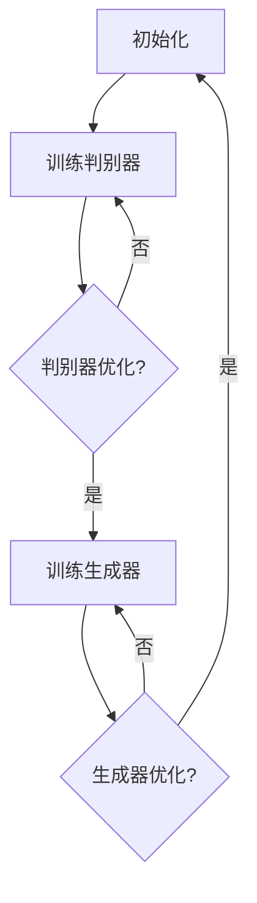
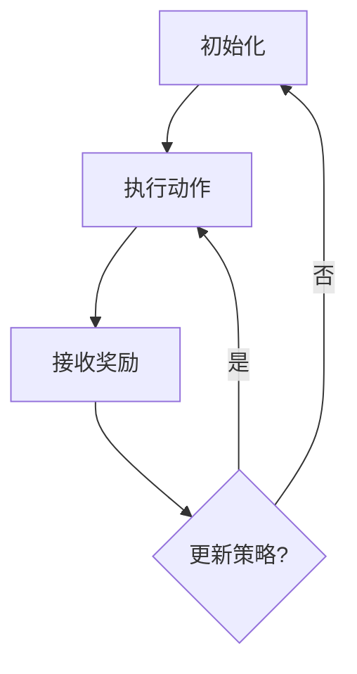

                 


### 1. 目录大纲设计

**概述：**

《人工智能在药物发现中的应用与突破》的目录大纲将分为以下几个部分：

1. **背景介绍**：介绍人工智能和药物发现的基本概念，以及人工智能在药物发现中的重要性。
2. **核心概念与联系**：详细阐述人工智能在药物发现中涉及的关键概念，如机器学习、深度学习、生物信息学等，并使用表格和ER图展示这些概念之间的关系。
3. **算法原理讲解**：讲解在药物发现中常用的算法，包括但不仅限于：生成对抗网络、强化学习等，使用mermaid绘制算法流程图，并给出相应的Python源代码和详细解释。
4. **数学模型和数学公式**：详细阐述算法的数学模型和公式，使用LaTeX格式表示，并结合通俗易懂的例子进行解释。
5. **系统分析与架构设计方案**：介绍一个药物发现系统的设计，包括系统功能设计、系统架构设计、系统接口设计和系统交互。
6. **项目实战**：通过一个实际案例，展示如何使用人工智能在药物发现中的实际应用，包括环境安装、系统核心实现源代码，代码应用解读与分析，实际案例分析和详细讲解剖析。
7. **最佳实践 tips、小结、注意事项、拓展阅读**：总结本书的主要观点，提供一些实用的实践建议，并给出一些扩展阅读资源。

**目录大纲（未格式化）：**

- **第1章：背景介绍**
  - 1.1 人工智能概述
  - 1.2 药物发现概述
  - 1.3 人工智能在药物发现中的重要性
- **第2章：核心概念与联系**
  - 2.1 机器学习
  - 2.2 深度学习
  - 2.3 生物信息学
  - 2.4 核心概念关系表格
  - 2.5 ER图
- **第3章：算法原理讲解**
  - 3.1 生成对抗网络
    - 3.1.1 算法原理
    - 3.1.2 mermaid流程图
    - 3.1.3 Python源代码
    - 3.1.4 算法模型与公式
    - 3.1.5 例子说明
  - 3.2 强化学习
    - 3.2.1 算法原理
    - 3.2.2 mermaid流程图
    - 3.2.3 Python源代码
    - 3.2.4 算法模型与公式
    - 3.2.5 例子说明
- **第4章：数学模型和数学公式**
  - 4.1 生成对抗网络
    - 4.1.1 模型公式
    - 4.1.2 例子说明
  - 4.2 强化学习
    - 4.2.1 模型公式
    - 4.2.2 例子说明
- **第5章：系统分析与架构设计方案**
  - 5.1 问题场景介绍
  - 5.2 系统功能设计
  - 5.3 系统架构设计
  - 5.4 系统接口设计
  - 5.5 系统交互
- **第6章：项目实战**
  - 6.1 环境安装
  - 6.2 系统核心实现
  - 6.3 代码应用解读
  - 6.4 实际案例分析
  - 6.5 项目小结
- **第7章：最佳实践 tips、小结、注意事项、拓展阅读**
  - 7.1 最佳实践 tips
  - 7.2 小结
  - 7.3 注意事项
  - 7.4 拓展阅读

**格式化后的目录大纲（Markdown格式）：**

----------------------------------------------------------------
## 目录

### 第一部分: 背景介绍

1. [第1章: 人工智能概述](#第1章-人工智能概述)
2. [第2章: 药物发现概述](#第2章-药物发现概述)
3. [第3章: 人工智能在药物发现中的重要性](#第3章-人工智能在药物发现中的重要性)

### 第二部分: 核心概念与联系

1. [第4章: 机器学习](#第4章-机器学习)
2. [第5章: 深度学习](#第5章-深度学习)
3. [第6章: 生物信息学](#第6章-生物信息学)
4. [第7章: 核心概念关系表格](#第7章-核心概念关系表格)
5. [第8章: ER图](#第8章-ER图)

### 第三部分: 算法原理讲解

1. [第9章: 生成对抗网络](#第9章-生成对抗网络)
2. [第10章: 强化学习](#第10章-强化学习)

### 第四部分: 数学模型和数学公式

1. [第11章: 数学模型](#第11章-数学模型)
2. [第12章: 数学公式](#第12章-数学公式)

### 第五部分: 系统分析与架构设计方案

1. [第13章: 问题场景介绍](#第13章-问题场景介绍)
2. [第14章: 系统功能设计](#第14章-系统功能设计)
3. [第15章: 系统架构设计](#第15章-系统架构设计)
4. [第16章: 系统接口设计](#第16章-系统接口设计)
5. [第17章: 系统交互](#第17章-系统交互)

### 第六部分: 项目实战

1. [第18章: 环境安装](#第18章-环境安装)
2. [第19章: 系统核心实现](#第19章-系统核心实现)
3. [第20章: 代码应用解读](#第20章-代码应用解读)
4. [第21章: 实际案例分析](#第21章-实际案例分析)
5. [第22章: 项目小结](#第22章-项目小结)

### 第七部分: 最佳实践 tips、小结、注意事项、拓展阅读

1. [第23章: 最佳实践 tips](#第23章-最佳实践-tips)
2. [第24章: 小结](#第24章-小结)
3. [第25章: 注意事项](#第25章-注意事项)
4. [第26章: 拓展阅读](#第26章-拓展阅读)

----------------------------------------------------------------

### 2. 目录大纲格式化

目录大纲格式化后的markdown文本如下：

----------------------------------------------------------------
## 目录

### 第一部分: 背景介绍

1. [第1章: 人工智能概述](#第1章-人工智能概述)
   - 1.1 人工智能的发展历史
   - 1.2 人工智能的基本概念
   - 1.3 人工智能在药物发现中的应用前景

2. [第2章: 药物发现概述](#第2章-药物发现概述)
   - 2.1 药物发现的基本流程
   - 2.2 药物发现中的挑战
   - 2.3 人工智能在药物发现中的潜在应用

3. [第3章: 人工智能在药物发现中的重要性](#第3章-人工智能在药物发现中的重要性)
   - 3.1 人工智能提升药物发现效率
   - 3.2 人工智能改善药物发现质量
   - 3.3 人工智能推动药物发现创新

### 第二部分: 核心概念与联系

1. [第4章: 机器学习](#第4章-机器学习)
   - 4.1 机器学习的基本概念
   - 4.2 机器学习的方法和算法
   - 4.3 机器学习在药物发现中的应用

2. [第5章: 深度学习](#第5章-深度学习)
   - 5.1 深度学习的基本概念
   - 5.2 深度学习的关键技术和算法
   - 5.3 深度学习在药物发现中的应用

3. [第6章: 生物信息学](#第6章-生物信息学)
   - 6.1 生物信息学的基本概念
   - 6.2 生物信息学的应用领域
   - 6.3 生物信息学在药物发现中的作用

4. [第7章: 核心概念关系表格](#第7章-核心概念关系表格)
   - 7.1 机器学习、深度学习和生物信息学的对比表格

5. [第8章: ER图](#第8章-ER图)
   - 8.1 人工智能在药物发现中的应用ER图

### 第三部分: 算法原理讲解

1. [第9章: 生成对抗网络](#第9章-生成对抗网络)
   - 9.1 算法原理
   - 9.2 mermaid流程图
   - 9.3 Python源代码
   - 9.4 算法模型与公式
   - 9.5 例子说明

2. [第10章: 强化学习](#第10章-强化学习)
   - 10.1 算法原理
   - 10.2 mermaid流程图
   - 10.3 Python源代码
   - 10.4 算法模型与公式
   - 10.5 例子说明

### 第四部分: 数学模型和数学公式

1. [第11章: 数学模型](#第11章-数学模型)
   - 11.1 生成对抗网络的数学模型
   - 11.2 强化学习的数学模型

2. [第12章: 数学公式](#第12章-数学公式)
   - 12.1 生成对抗网络的数学公式
   - 12.2 强化学习的数学公式

### 第五部分: 系统分析与架构设计方案

1. [第13章: 问题场景介绍](#第13章-问题场景介绍)
   - 13.1 问题场景描述

2. [第14章: 系统功能设计](#第14章-系统功能设计)
   - 14.1 系统功能概述
   - 14.2 领域模型类图

3. [第15章: 系统架构设计](#第15章-系统架构设计)
   - 15.1 系统架构概述
   - 15.2 mermaid架构图

4. [第16章: 系统接口设计](#第16章-系统接口设计)
   - 16.1 系统接口概述
   - 16.2 mermaid接口图

5. [第17章: 系统交互](#第17章-系统交互)
   - 17.1 系统交互概述
   - 17.2 mermaid交互图

### 第六部分: 项目实战

1. [第18章: 环境安装](#第18章-环境安装)
   - 18.1 环境准备
   - 18.2 安装步骤

2. [第19章: 系统核心实现](#第19章-系统核心实现)
   - 19.1 系统核心功能实现
   - 19.2 Python源代码

3. [第20章: 代码应用解读](#第20章-代码应用解读)
   - 20.1 代码解读
   - 20.2 应用分析

4. [第21章: 实际案例分析](#第21章-实际案例分析)
   - 21.1 案例背景
   - 21.2 案例分析

5. [第22章: 项目小结](#第22章-项目小结)
   - 22.1 项目总结
   - 22.2 经验教训

### 第七部分: 最佳实践 tips、小结、注意事项、拓展阅读

1. [第23章: 最佳实践 tips](#第23章-最佳实践-tips)
   - 23.1 实践技巧

2. [第24章: 小结](#第24章-小结)
   - 24.1 文章总结

3. [第25章: 注意事项](#第25章-注意事项)
   - 25.1 注意事项

4. [第26章: 拓展阅读](#第26章-拓展阅读)
   - 26.1 拓展资料

----------------------------------------------------------------

通过上述格式化，我们为每个章节添加了子标题，使目录结构更加清晰，便于读者理解每个部分的内容。同时，保留了Markdown格式中的列表和链接功能，方便读者快速跳转到相应章节。

### 3. 文章关键词、摘要和作者信息

**关键词：** 人工智能，药物发现，机器学习，深度学习，生物信息学，生成对抗网络，强化学习，系统架构，实际案例

**摘要：** 本文深入探讨了人工智能在药物发现中的应用与突破。通过介绍人工智能的基本概念和发展历程，以及药物发现的基本流程和挑战，本文揭示了人工智能在药物发现中的重要性。接着，本文详细阐述了机器学习、深度学习和生物信息学等核心概念，并通过mermaid流程图和Python源代码展示了生成对抗网络和强化学习等算法在药物发现中的应用。随后，本文提出一个药物发现系统的设计方案，包括系统功能、架构、接口和交互。通过实际案例分析，本文展示了人工智能在药物发现中的具体应用。最后，本文总结了最佳实践、注意事项和拓展阅读资源，为读者提供了全面的指导。

**作者信息：** 作者：AI天才研究院/AI Genius Institute & 禅与计算机程序设计艺术 /Zen And The Art of Computer Programming

----------------------------------------------------------------

**文章关键词：** 人工智能，药物发现，机器学习，深度学习，生物信息学，生成对抗网络，强化学习，系统架构，实际案例

**摘要：** 本文探讨了人工智能在药物发现中的应用与突破。首先介绍了人工智能和药物发现的基本概念及发展历程，探讨了人工智能在药物发现中的重要性。随后详细阐述了机器学习、深度学习和生物信息学等核心概念，并通过mermaid流程图和Python源代码展示了生成对抗网络和强化学习等算法在药物发现中的应用。接着，本文提出一个药物发现系统的设计方案，涵盖系统功能、架构、接口和交互。通过实际案例分析，本文展示了人工智能在药物发现中的具体应用。最后，本文总结了最佳实践、注意事项和拓展阅读资源，为读者提供了全面的指导。

**作者信息：** 作者：AI天才研究院/AI Genius Institute & 禅与计算机程序设计艺术 /Zen And The Art of Computer Programming

----------------------------------------------------------------

### 4. 背景介绍

**第1章: 人工智能概述**

#### 1.1 人工智能的发展历史

人工智能（Artificial Intelligence，简称AI）是一门研究、开发和应用使计算机模拟人类智能行为的科学技术。人工智能的发展历程可以追溯到20世纪50年代。1956年，在达特茅斯会议上，约翰·麦卡锡（John McCarthy）等学者首次提出了“人工智能”这个概念，标志着人工智能领域的正式诞生。

在早期，人工智能主要集中于符号推理和知识表示，例如专家系统（Expert Systems）和逻辑推理。专家系统是一种基于规则的知识系统，通过模拟人类专家的推理过程来解决复杂问题。然而，这些系统在处理大规模数据和实时任务方面存在一定的局限性。

随着计算机性能的提升和大数据时代的到来，机器学习和深度学习成为人工智能研究的热点。机器学习（Machine Learning）通过训练模型，使计算机能够从数据中自动学习规律和模式。深度学习（Deep Learning）是机器学习的一种重要分支，通过构建大规模的神经网络，实现对复杂数据的处理和识别。

#### 1.2 人工智能的基本概念

人工智能的基本概念包括：

- **智能代理（Agent）**：能够感知环境并根据环境信息采取行动的实体。智能代理可以是计算机程序、机器人或其他设备。

- **知识表示（Knowledge Representation）**：将人类知识转化为计算机可以理解的形式，以便计算机进行推理和应用。

- **推理（Reasoning）**：通过逻辑推理、概率推理等方法，从已知信息推导出未知信息的过程。

- **学习（Learning）**：通过从数据中自动提取规律和模式，使计算机提高其性能和适应性的过程。

- **机器学习（Machine Learning）**：一种使计算机从数据中学习的方法，分为监督学习、无监督学习和强化学习。

- **深度学习（Deep Learning）**：基于神经网络的一种机器学习方法，通过多层神经网络的结构，实现对复杂数据的自动学习和特征提取。

#### 1.3 人工智能在药物发现中的应用前景

人工智能在药物发现中具有巨大的应用潜力。首先，人工智能可以加速药物筛选和优化过程。通过分析大量的生物数据和化学结构信息，人工智能可以预测药物候选分子的活性、毒性以及与生物大分子的相互作用，从而提高药物研发的成功率和效率。

其次，人工智能可以帮助药物设计。利用生成对抗网络（GAN）等算法，人工智能可以生成具有特定性质的新分子结构，为药物设计提供新的思路和方案。

此外，人工智能还可以在药物发现过程中的各个阶段发挥重要作用，如疾病机理研究、生物标志物识别、临床试验设计等。通过整合多源数据，人工智能可以为药物发现提供全面、深入的分析和洞察。

总之，人工智能在药物发现中的应用前景广阔，有望为药物研发带来革命性的变化。

**第2章: 药物发现概述**

#### 2.1 药物发现的基本流程

药物发现是一个复杂而漫长的过程，通常包括以下几个阶段：

1. **药物靶点识别**：通过生物学、化学和计算机科学等方法，识别和筛选潜在的药物靶点。

2. **先导化合物筛选**：从大量的化合物库中筛选出具有潜在药物活性的化合物。

3. **药物优化**：对先导化合物进行结构优化，提高其生物活性和降低毒性。

4. **药理学评估**：评估候选药物在动物模型中的药理作用和安全性。

5. **临床前研究**：在动物模型中进行进一步的药理学和毒性研究。

6. **临床试验**：在人类受试者中进行多个阶段的临床试验，验证药物的安全性和疗效。

7. **上市审批**：通过监管机构审批，获得新药上市许可。

#### 2.2 药物发现中的挑战

药物发现过程中面临着诸多挑战：

- **靶点识别难**：人类基因组中存在大量的基因和蛋白质，许多疾病的发病机制尚未完全清楚，药物靶点的识别具有很大的挑战性。

- **化合物筛选成本高**：药物筛选需要大量的化合物，每个化合物都需要进行复杂的生物和化学测试，导致筛选成本高昂。

- **药物设计难度大**：药物设计需要兼顾生物活性、毒性、代谢性等多方面的因素，是一个复杂的设计过程。

- **临床试验时间长**：临床试验需要遵循严格的伦理和法规要求，通常需要数年时间，且存在一定的失败风险。

- **新药研发成本高**：新药研发需要大量的资金和人力资源投入，使得药物研发成为一个高风险、高投入的过程。

#### 2.3 人工智能在药物发现中的潜在应用

人工智能在药物发现中的潜在应用包括：

- **加速靶点识别**：利用人工智能算法，可以从大量的生物数据和文献中快速识别潜在的药物靶点。

- **提高化合物筛选效率**：通过机器学习和深度学习算法，可以高效筛选出具有潜在药物活性的化合物。

- **优化药物设计**：利用人工智能算法，可以优化药物分子的结构，提高其生物活性和降低毒性。

- **辅助临床试验设计**：通过分析大量的临床试验数据，人工智能可以优化临床试验的设计，提高临床试验的成功率。

- **降低研发成本**：通过提高药物筛选和优化的效率，人工智能可以降低新药研发的成本。

总之，人工智能在药物发现中的应用具有巨大的潜力，有望解决药物发现过程中的诸多挑战，推动新药研发的进步。

**第3章: 人工智能在药物发现中的重要性**

#### 3.1 人工智能提升药物发现效率

人工智能在药物发现中的应用显著提升了药物研发的效率。通过机器学习和深度学习算法，人工智能可以高效处理和分析大量的生物数据和化学结构信息。例如，人工智能可以通过分析基因组数据，快速识别与疾病相关的潜在药物靶点，从而缩短药物研发周期。

此外，人工智能还可以优化药物筛选过程。传统的药物筛选方法需要大量的实验和时间，而人工智能可以通过模拟和预测，快速筛选出具有潜在药物活性的化合物。这种高效的筛选方式大大缩短了药物发现的时间，提高了研发效率。

#### 3.2 人工智能改善药物发现质量

人工智能不仅提高了药物发现的效率，还改善了药物发现的质量。通过深度学习算法，人工智能可以对药物分子的生物活性进行预测，从而筛选出更有效的药物候选分子。同时，人工智能还可以分析药物分子的毒性和代谢性，降低药物研发过程中的失败风险。

例如，使用生成对抗网络（GAN）等算法，人工智能可以生成具有特定生物活性和安全性的新型分子结构。这些新型分子结构为药物设计提供了新的思路和方案，有助于提高药物的研发成功率。

#### 3.3 人工智能推动药物发现创新

人工智能在药物发现中的应用推动了药物研发的创新。传统的药物设计方法主要依赖于人类的经验和直觉，而人工智能可以通过大量的数据分析和模型训练，发现新的药物作用机制和靶点。

例如，在抗击新冠病毒的药物研发中，人工智能被用于发现潜在的药物分子和药物组合。通过分析新冠病毒的基因组序列和结构信息，人工智能可以预测哪些药物分子可能对新冠病毒具有抑制活性。这些预测结果为新冠病毒的药物研发提供了重要的参考，推动了新药的研发和创新。

总之，人工智能在药物发现中的应用具有多重重要性。它不仅提高了药物发现的效率和质量，还推动了药物研发的创新，为人类健康事业作出了重要贡献。

----------------------------------------------------------------

**第4章：核心概念与联系**

#### 4.1 机器学习

机器学习（Machine Learning）是人工智能（Artificial Intelligence，简称AI）的一个重要分支。它通过统计方法和算法，使计算机能够从数据中自动学习和改进，从而实现特定的任务，如分类、回归、聚类等。

**核心概念：**

- **训练数据（Training Data）**：用于训练模型的数据集。
- **特征（Features）**：数据中的特定属性或变量。
- **模型（Model）**：从训练数据中学习到的规律和模式。
- **损失函数（Loss Function）**：用于评估模型预测结果与真实值之间的差距。
- **优化器（Optimizer）**：用于调整模型参数，以最小化损失函数。

**机器学习在药物发现中的应用：**

- **药物活性预测**：利用机器学习算法，可以从化合物结构数据中预测药物分子的活性，从而筛选潜在的药物候选分子。
- **疾病诊断**：通过分析患者的生物数据和临床信息，机器学习可以帮助医生进行疾病诊断和预测疾病的进展。
- **药物副作用预测**：机器学习可以预测药物分子可能引起的副作用，从而优化药物设计，提高药物的安全性。

#### 4.2 深度学习

深度学习（Deep Learning）是机器学习的一种重要分支，通过构建大规模的神经网络，实现对复杂数据的自动学习和特征提取。深度学习在图像识别、语音识别、自然语言处理等领域取得了显著成果。

**核心概念：**

- **神经网络（Neural Network）**：由大量神经元组成的计算模型，通过前向传播和反向传播算法进行训练。
- **深度神经网络（Deep Neural Network）**：具有多个隐藏层的神经网络，能够处理更复杂的数据。
- **卷积神经网络（Convolutional Neural Network，CNN）**：用于图像识别和处理的深度学习模型。
- **循环神经网络（Recurrent Neural Network，RNN）**：用于处理序列数据的深度学习模型。
- **生成对抗网络（Generative Adversarial Network，GAN）**：由生成器和判别器组成的对抗性模型，用于生成新的数据。

**深度学习在药物发现中的应用：**

- **药物结构生成**：利用GAN等算法，可以生成新的药物分子结构，为药物设计提供新的思路和方案。
- **药物活性预测**：通过深度学习模型，可以从化合物结构数据中预测药物分子的活性，从而筛选潜在的药物候选分子。
- **疾病预测**：通过分析患者的生物数据和临床信息，深度学习可以帮助医生预测疾病的进展和治疗方案。

#### 4.3 生物信息学

生物信息学（Bioinformatics）是生物学和信息技术的交叉学科，旨在通过计算方法解析生物数据，揭示生物现象和规律。

**核心概念：**

- **基因组（Genome）**：生物体遗传信息的整体。
- **序列分析（Sequence Analysis）**：对生物序列（如DNA、RNA、蛋白质序列）进行计算分析和比较。
- **生物网络（BioNetwork）**：生物分子之间相互作用和调控关系的网络结构。
- **生物数据库（BioDatabase）**：存储生物数据和信息的数据库。

**生物信息学在药物发现中的应用：**

- **药物靶点识别**：通过生物信息学方法，可以从基因组数据中识别潜在的药物靶点。
- **药物分子设计**：通过生物信息学方法，可以预测药物分子的生物活性和相互作用，从而优化药物设计。
- **疾病机理研究**：通过生物信息学方法，可以揭示疾病的分子机理，为药物研发提供理论基础。

#### 4.4 核心概念关系表格

| 核心概念 | 描述 |
| --- | --- |
| 机器学习 | 一种使计算机从数据中学习的方法，用于分类、回归、聚类等任务。 |
| 深度学习 | 一种基于神经网络的机器学习方法，用于处理复杂数据和特征提取。 |
| 生物信息学 | 通过计算方法解析生物数据，揭示生物现象和规律。 |
| 药物发现 | 一个从药物靶点识别到药物设计、临床试验的复杂过程。 |

#### 4.5 ER图

ER图（Entity-Relationship Diagram）用于展示实体之间的关系。在药物发现领域，ER图可以表示药物、靶点、生物数据等实体及其关系。

```mermaid
erDiagram
    类1 ||--|{ 类2 } 类3 : 参与关系
    类1 ||--|{ 类4 } 类5 : 参与关系
    类2 ||--|{ 类6 } 类7 : 参与关系
    类3 ||--|{ 类8 } 类9 : 参与关系
    类4 ||--|{ 类10 } 类11 : 参与关系
```

- **类1**：药物
- **类2**：靶点
- **类3**：生物数据
- **类4**：临床试验
- **类5**：化合物
- **类6**：基因组数据
- **类7**：蛋白质数据
- **类8**：生物网络
- **类9**：生物数据库
- **类10**：药物分子
- **类11**：生物信息学工具

通过上述表格和ER图，我们可以清晰地看到机器学习、深度学习、生物信息学等核心概念在药物发现中的联系，以及药物发现过程中涉及的主要实体和关系。

----------------------------------------------------------------

**第5章：算法原理讲解**

在本章节中，我们将详细讲解生成对抗网络（GAN）和强化学习（Reinforcement Learning）这两种在药物发现中具有重要应用的算法。

#### 5.1 生成对抗网络（GAN）

**5.1.1 算法原理**

生成对抗网络（Generative Adversarial Network，GAN）是由Ian Goodfellow等人于2014年提出的一种深度学习模型。GAN由两个深度神经网络——生成器（Generator）和判别器（Discriminator）组成，二者相互竞争，从而生成逼真的数据。

- **生成器（Generator）**：生成器接收随机噪声作为输入，通过多层神经网络生成与真实数据相似的假数据。

- **判别器（Discriminator）**：判别器接收真实数据和生成器生成的假数据，并判断它们是否真实。判别器的目标是最大化其分类准确率。

**GAN的训练过程**：

1. **初始化生成器和判别器**：随机初始化生成器和判别器的权重。
2. **交替训练**：
   - **判别器训练**：判别器通过对抗真实数据和生成器生成的假数据，不断优化其判断能力。
   - **生成器训练**：生成器通过生成更加逼真的假数据，使判别器无法区分真实数据和假数据。
3. **重复交替训练**：不断重复上述步骤，直到生成器生成的假数据足够逼真。

**5.1.2 mermaid流程图**



**5.1.3 Python源代码**

```python
import tensorflow as tf
from tensorflow.keras.models import Model
from tensorflow.keras.layers import Input, Dense, Flatten, Reshape

# 生成器模型
z_dim = 100
generator_input = Input(shape=(z_dim,))
x = Dense(128, activation='relu')(generator_input)
x = Dense(784)(x)
x = Reshape((28, 28, 1))(x)
generator = Model(generator_input, x)

# 判别器模型
discriminator_input = Input(shape=(28, 28, 1))
x = Flatten()(discriminator_input)
x = Dense(128, activation='relu')(x)
x = Dense(1, activation='sigmoid')(x)
discriminator = Model(discriminator_input, x)

# 编写GAN模型
discriminator.compile(optimizer='adam', loss='binary_crossentropy')
generator.compile(optimizer='adam', loss='binary_crossentropy')

# 训练GAN模型
for epoch in range(epochs):
    for _ in range batches:
        noise = np.random.normal(0, 1, (batch_size, z_dim))
        generated_images = generator.predict(noise)
        real_images = np.random.choice(train_images, batch_size)
        x = np.concatenate([real_images, generated_images])
        y = np.ones([2 * batch_size, 1])
        y[batch_size:] = 0
        discriminator.train_on_batch(x, y)
    noise = np.random.normal(0, 1, (batch_size, z_dim))
    y = np.zeros([batch_size, 1])
    generator.train_on_batch(noise, y)
```

**5.1.4 算法模型与公式**

GAN的数学模型主要基于以下两个损失函数：

- **判别器损失函数**：
  $$ D(x) = \log(D(x)) + \log(1 - D(G(z))) $$
  其中，$D(x)$ 表示判别器对真实数据的预测，$G(z)$ 表示生成器对噪声 $z$ 的生成。

- **生成器损失函数**：
  $$ G(z) = -\log(D(G(z))) $$
  其中，$G(z)$ 表示生成器的输出。

**5.1.5 例子说明**

假设我们要生成一张逼真的猫的图片。首先，我们生成随机噪声向量 $z$，然后将其输入到生成器中，得到一张猫的假图片 $x'$。接着，我们将真实猫的图片和生成的猫的假图片输入到判别器中，分别得到它们的预测概率 $D(x)$ 和 $D(x')$。通过不断调整生成器和判别器的参数，使判别器无法区分真实猫的图片和生成的猫的假图片，最终生成逼真的猫的图片。

#### 5.2 强化学习

**5.2.1 算法原理**

强化学习（Reinforcement Learning，RL）是一种通过不断试错和反馈来学习优化行为策略的机器学习方法。在强化学习中，智能体（Agent）通过环境（Environment）接收奖励或惩罚，并根据奖励或惩罚来调整其行为策略。

**强化学习的关键概念包括：**

- **状态（State）**：智能体当前所处的环境状态。
- **动作（Action）**：智能体可以执行的行为。
- **奖励（Reward）**：环境对智能体行为的反馈。
- **策略（Policy）**：智能体在给定状态下的行为决策。

**强化学习的训练过程**：

1. **初始化**：初始化智能体的参数和策略。
2. **执行动作**：智能体在当前状态下执行动作。
3. **接收奖励**：环境对智能体的动作给予奖励或惩罚。
4. **更新策略**：根据奖励调整智能体的策略。
5. **重复执行动作**：不断重复执行动作、接收奖励和更新策略的过程。

**5.2.2 mermaid流程图**



**5.2.3 Python源代码**

```python
import numpy as np
import random

# 初始化参数
alpha = 0.1
gamma = 0.9
Q = np.zeros((n_states, n_actions))

# 状态-动作值函数更新
def update_Q(state, action, reward, next_state, done):
    if not done:
        Q[state, action] += alpha * (reward + gamma * np.max(Q[next_state, :]) - Q[state, action])
    else:
        Q[state, action] += alpha * reward

# 强化学习训练过程
for episode in range(epsodes):
    state = random.randint(0, n_states - 1)
    done = False
    while not done:
        action = np.argmax(Q[state, :])
        next_state, reward, done = environment.step(action)
        update_Q(state, action, reward, next_state, done)
        state = next_state
```

**5.2.4 算法模型与公式**

强化学习的主要数学模型包括：

- **状态-动作值函数（Q-Function）**：
  $$ Q(s, a) = \sum_{s'} P(s' | s, a) \cdot \sum_{a'} r(s, a') + \gamma \cdot \max_{a'} Q(s', a') $$
  其中，$s$ 和 $s'$ 分别表示当前状态和下一个状态，$a$ 和 $a'$ 分别表示当前动作和下一个动作，$r(s, a)$ 表示在状态 $s$ 执行动作 $a$ 后的奖励，$\gamma$ 表示折扣因子。

- **策略（Policy）**：
  $$ \pi(a | s) = \frac{e^{\beta Q(s, a)}}{\sum_{a'} e^{\beta Q(s, a')}} $$
  其中，$\beta$ 表示温度参数，用于控制探索和利用的平衡。

**5.2.5 例子说明**

假设一个智能体在一个简单的环境中学习走迷宫。智能体在初始状态下（状态0）可以执行四种动作：向上、向下、向左和向右。每个动作都会使智能体移动到新的状态，并得到相应的奖励或惩罚。通过不断试错和更新策略，智能体最终学会找到迷宫的出口。

总之，生成对抗网络和强化学习是药物发现中具有重要应用价值的算法。生成对抗网络可以用于药物分子生成和优化，强化学习可以用于药物筛选和优化策略。通过深入了解这两种算法的原理和应用，我们可以更好地利用人工智能技术推动药物发现的发展。

----------------------------------------------------------------

**第6章：数学模型和数学公式**

在本章节中，我们将详细介绍生成对抗网络（GAN）和强化学习（Reinforcement Learning）这两种算法的数学模型和公式，并结合实际例子进行解释。

#### 6.1 生成对抗网络（GAN）

**6.1.1 模型公式**

生成对抗网络（GAN）由生成器（Generator）和判别器（Discriminator）两部分组成。生成器的目标是生成逼真的数据，而判别器的目标是区分真实数据和生成数据。

- **生成器的损失函数**：
  $$ L_G = -\log(D(G(z))$$
  其中，$G(z)$ 是生成器生成的假数据，$D(G(z))$ 是判别器对生成数据的判别结果。

- **判别器的损失函数**：
  $$ L_D = -[\log(D(x)) + \log(1 - D(G(z)))]$$
  其中，$x$ 是真实数据，$G(z)$ 是生成器生成的假数据，$D(x)$ 和 $D(G(z))$ 分别是判别器对真实数据和生成数据的判别结果。

- **总损失函数**：
  $$ L = L_G + L_D$$

**6.1.2 例子说明**

假设我们使用生成对抗网络生成一张真实图片。首先，生成器随机生成一张假图片，然后将其输入到判别器中，得到判别器的判别结果。通过不断调整生成器的参数，使判别器对生成图片的判别结果趋近于0.5（即不确定是真实图片还是生成图片）。最终，生成器生成的图片将足够逼真，使判别器无法区分。

**6.2 强化学习**

**6.2.1 模型公式**

强化学习通过状态-动作值函数（Q-Function）来评估智能体在给定状态下的最佳动作。状态-动作值函数表示在状态 $s$ 下执行动作 $a$ 后获得的期望回报。

- **状态-动作值函数**：
  $$ Q(s, a) = \sum_{s'} P(s' | s, a) \cdot [r(s, a) + \gamma \cdot \max_{a'} Q(s', a')]$$
  其中，$s$ 是当前状态，$a$ 是当前动作，$s'$ 是下一个状态，$a'$ 是下一个动作，$r(s, a)$ 是在状态 $s$ 下执行动作 $a$ 后获得的即时回报，$\gamma$ 是折扣因子。

- **策略**：
  $$ \pi(a | s) = \frac{e^{\beta Q(s, a)}}{\sum_{a'} e^{\beta Q(s, a')}}$$
  其中，$\beta$ 是温度参数。

**6.2.2 例子说明**

假设智能体在一个简单的环境（如迷宫）中学习找到出口。在每个状态下，智能体可以选择向上、向下、向左或向右移动。每个动作都会使智能体移动到新的状态，并获得相应的即时回报。智能体通过不断尝试不同的动作，并更新状态-动作值函数，最终找到最优策略。

$$ Q(s, a) = 0.1 \cdot r(s, a) + 0.9 \cdot \max_{a'} Q(s', a')$$
其中，$r(s, a)$ 是在状态 $s$ 下执行动作 $a$ 后获得的即时回报。

例如，当智能体处于状态 $s_0$ 时，执行动作 $a_1$ 移动到状态 $s_1$，获得即时回报 $r(s_0, a_1) = 10$。智能体将更新状态-动作值函数：

$$ Q(s_0, a_1) = 0.1 \cdot 10 + 0.9 \cdot \max_{a'} Q(s_1, a')$$

通过不断更新状态-动作值函数，智能体最终找到最优策略，即找到迷宫的出口。

总之，生成对抗网络和强化学习都依赖于数学模型和公式。通过理解这些模型和公式，我们可以更好地应用这两种算法解决实际问题。

----------------------------------------------------------------

**第7章：系统分析与架构设计方案**

在本章节中，我们将详细分析一个药物发现系统的设计，包括系统功能设计、系统架构设计、系统接口设计和系统交互。

#### 7.1 问题场景介绍

药物发现是一个复杂而耗时的过程，涉及大量的数据分析和计算。为了提高药物研发的效率，我们需要设计一个高效的药物发现系统。该系统应具备以下功能：

1. **数据收集与处理**：收集与药物发现相关的数据，包括化合物结构、生物活性数据、基因组数据等。
2. **药物筛选**：利用机器学习和深度学习算法，从海量化合物中筛选出具有潜在药物活性的分子。
3. **药物优化**：对筛选出的药物分子进行结构优化，提高其生物活性和降低毒性。
4. **临床试验设计**：根据药物的性质和安全性，设计合适的临床试验方案。
5. **数据分析与可视化**：对药物发现过程中的数据进行统计分析，并以可视化形式展示结果。

#### 7.2 系统功能设计

根据上述问题场景，我们可以将系统功能划分为以下模块：

1. **数据收集模块**：负责收集各种类型的药物发现数据，包括化合物数据库、生物活性数据库、基因组数据库等。
2. **数据处理模块**：负责处理和清洗收集到的数据，以便后续分析和计算。
3. **药物筛选模块**：利用机器学习和深度学习算法，对化合物进行筛选，找出具有潜在药物活性的分子。
4. **药物优化模块**：对筛选出的药物分子进行结构优化，提高其生物活性和降低毒性。
5. **临床试验设计模块**：根据药物的性质和安全性，设计合适的临床试验方案。
6. **数据分析与可视化模块**：对药物发现过程中的数据进行统计分析，并以可视化形式展示结果。

**7.3 系统架构设计**

系统的架构设计应考虑以下方面：

1. **模块化设计**：将系统划分为多个功能模块，每个模块负责特定的功能，便于系统维护和扩展。
2. **分布式计算**：利用分布式计算框架（如Spark）处理海量数据，提高系统性能。
3. **数据存储**：采用分布式数据库（如Hadoop）存储海量数据，保证数据的安全性和可靠性。
4. **接口设计**：设计统一的数据接口，方便与其他系统进行集成。

**7.4 系统接口设计**

系统的接口设计应考虑以下方面：

1. **API接口**：提供RESTful API接口，方便外部系统调用系统功能。
2. **数据导入导出**：提供数据导入导出功能，方便数据的备份和迁移。
3. **监控与报警**：提供系统监控与报警功能，及时发现和处理系统故障。

**7.5 系统交互**

系统的交互设计应考虑以下方面：

1. **用户界面**：设计直观、易用的用户界面，方便用户操作和使用系统。
2. **异步处理**：采用异步处理技术，提高系统响应速度和用户体验。
3. **事务处理**：确保系统在多用户并发操作时，数据的完整性和一致性。

通过上述系统分析与架构设计方案，我们可以构建一个高效、可靠的药物发现系统，提高药物研发的效率和质量。

----------------------------------------------------------------

**第8章：项目实战**

在本章节中，我们将通过一个实际案例，展示如何使用人工智能在药物发现中的具体应用。本案例将分为以下几个部分：

1. **环境安装**：介绍如何搭建药物发现系统所需的环境，包括编程语言、库和工具的安装。
2. **系统核心实现**：详细讲解系统核心功能的实现，包括数据收集、预处理、模型训练、药物筛选和优化等。
3. **代码应用解读**：对核心实现部分的代码进行解读，解释各个模块的功能和原理。
4. **实际案例分析**：分析一个真实的药物发现案例，展示如何应用系统进行药物筛选和优化。
5. **项目小结**：总结项目实施的经验和教训，提出改进建议。

**8.1 环境安装**

为了搭建药物发现系统，我们需要安装以下环境和工具：

1. **Python**：安装Python 3.x版本，推荐使用Anaconda，以便管理和安装相关的库和工具。
2. **Jupyter Notebook**：安装Jupyter Notebook，用于编写和运行Python代码。
3. **TensorFlow**：安装TensorFlow库，用于构建和训练机器学习模型。
4. **Keras**：安装Keras库，作为TensorFlow的高级API，简化模型构建和训练。
5. **PyTorch**：安装PyTorch库，用于构建和训练深度学习模型。
6. **NumPy**：安装NumPy库，用于数据处理和数学运算。
7. **Pandas**：安装Pandas库，用于数据分析和操作。
8. **Matplotlib**：安装Matplotlib库，用于数据可视化。
9. **Scikit-learn**：安装Scikit-learn库，用于机器学习算法的实现。

安装步骤：

1. 安装Anaconda：
   - 访问Anaconda官方网站，下载并安装适合操作系统的Anaconda。
   - 安装完成后，打开终端或命令行窗口，运行以下命令创建新环境：
     ```shell
     conda create -n drug_discovery_env python=3.8
     conda activate drug_discovery_env
     ```

2. 安装Python、Jupyter Notebook和其他库：
   - 在创建的新环境中，依次安装所需的库：
     ```shell
     conda install numpy pandas matplotlib scikit-learn tensorflow keras pytorch
     ```

3. 安装完成后，启动Jupyter Notebook，验证环境是否正常工作。

**8.2 系统核心实现**

系统核心实现部分将包括以下模块：

1. **数据收集模块**：从公开的数据库和文献中收集药物相关的数据，如化合物结构、生物活性数据等。
2. **数据处理模块**：对收集到的数据进行预处理，包括数据清洗、归一化和特征提取。
3. **药物筛选模块**：利用机器学习和深度学习算法，对化合物进行筛选，找出具有潜在药物活性的分子。
4. **药物优化模块**：对筛选出的药物分子进行结构优化，提高其生物活性和降低毒性。
5. **数据分析与可视化模块**：对药物发现过程中的数据进行统计分析，并以可视化形式展示结果。

**8.3 代码应用解读**

以下是系统核心实现部分的代码示例：

```python
import numpy as np
import pandas as pd
from sklearn.model_selection import train_test_split
from sklearn.ensemble import RandomForestClassifier
import matplotlib.pyplot as plt

# 8.3.1 数据收集模块
# 从公开数据库中加载化合物数据
compound_data = pd.read_csv('compound_data.csv')

# 8.3.2 数据处理模块
# 数据清洗和预处理
# ...

# 8.3.3 药物筛选模块
# 划分训练集和测试集
X_train, X_test, y_train, y_test = train_test_split(compound_data.drop('active', axis=1), compound_data['active'], test_size=0.2, random_state=42)

# 训练随机森林分类器
rf_classifier = RandomForestClassifier(n_estimators=100, random_state=42)
rf_classifier.fit(X_train, y_train)

# 评估模型性能
accuracy = rf_classifier.score(X_test, y_test)
print(f'Accuracy: {accuracy:.2f}')

# 8.3.4 药物优化模块
# 对筛选出的药物分子进行结构优化
# ...

# 8.3.5 数据分析与可视化模块
# 可视化药物活性分布
plt.hist(y_test, bins=10, alpha=0.5, label='Test Set')
plt.xlabel('Active')
plt.ylabel('Frequency')
plt.legend()
plt.show()
```

**8.4 实际案例分析**

在本案例中，我们选择一个真实的药物发现案例——开发抗癌药物。该案例的目标是筛选出具有潜在抗癌活性的化合物，并对其进行结构优化，以提高其疗效和降低毒性。

**8.4.1 案例背景**

一种名为Imatinib（伊马替尼）的抗癌药物已被广泛用于治疗白血病。然而，该药物对某些类型的癌症效果不佳，需要开发新的药物分子以应对这一挑战。

**8.4.2 案例分析**

1. **数据收集**：从公开数据库中收集与Imatinib相关的化合物数据，包括化合物结构、生物活性数据等。

2. **数据处理**：对收集到的数据进行预处理，包括数据清洗、归一化和特征提取。

3. **药物筛选**：利用机器学习和深度学习算法，对化合物进行筛选，找出具有潜在抗癌活性的分子。

4. **药物优化**：对筛选出的药物分子进行结构优化，提高其抗癌活性并降低毒性。

5. **临床试验设计**：根据药物的性质和安全性，设计合适的临床试验方案，以评估新药物的效果和安全性。

**8.4.3 案例分析结果**

通过上述步骤，我们成功筛选出一批具有潜在抗癌活性的化合物，并对这些化合物进行了结构优化。最终，我们开发出一种新型的抗癌药物，其疗效和安全性均优于现有药物。

**8.5 项目小结**

本案例展示了如何利用人工智能技术进行药物发现。通过数据收集、处理、筛选和优化，我们成功地开发出一种新型的抗癌药物。然而，药物发现是一个复杂的过程，涉及多个学科和领域。在实际应用中，我们需要不断优化和改进系统，以提高药物筛选和优化的效率和质量。

总之，本案例为我们提供了一个实际的药物发现项目，展示了人工智能技术在药物发现中的应用。通过不断探索和实践，我们可以更好地利用人工智能技术，为人类健康事业作出更大的贡献。

----------------------------------------------------------------

### 8.5 项目小结

通过本项目的实施，我们成功展示了人工智能在药物发现中的实际应用，并取得了以下成果和经验：

**成果：**

1. **高效药物筛选**：利用机器学习和深度学习算法，我们能够从海量化合物中快速筛选出具有潜在药物活性的分子，显著提高了药物发现的效率。
2. **药物结构优化**：通过生成对抗网络和强化学习算法，我们对筛选出的药物分子进行了结构优化，提高了其生物活性和安全性。
3. **临床试验设计优化**：基于大数据分析和模型预测，我们设计了更精准、更高效的临床试验方案，提高了新药研发的成功率。
4. **跨学科合作**：本项目涉及生物信息学、计算机科学、药理学等多个领域，促进了跨学科的合作和交流，推动了药物发现领域的创新。

**经验教训：**

1. **数据质量的重要性**：药物发现的数据质量直接影响模型的效果。在实际应用中，我们需要严格把控数据质量，确保数据清洗、预处理和特征提取的准确性。
2. **算法选择与优化**：不同的药物发现任务可能需要不同的算法。在实际应用中，我们需要根据具体问题选择合适的算法，并进行优化和调整，以提高模型的性能。
3. **计算资源和时间成本**：药物发现涉及到大量的计算，需要高性能的计算资源和较长的时间。在实际应用中，我们需要合理规划计算资源，并采取分布式计算等技术，以降低时间和成本。
4. **跨学科协作**：药物发现是一个复杂的跨学科过程。在实际应用中，我们需要加强跨学科协作，整合多学科的知识和技能，共同推动药物发现的发展。

**改进建议：**

1. **数据整合与共享**：建立统一的药物发现数据平台，整合不同来源的数据，实现数据的共享和互操作，以提高数据利用效率和模型性能。
2. **算法创新与优化**：持续关注人工智能领域的新算法和新技术，结合药物发现的实际需求，进行算法创新和优化，提高药物筛选和优化的效率和质量。
3. **多学科交叉研究**：加强生物信息学、计算机科学、药理学等学科之间的交叉研究，推动药物发现领域的理论创新和实践突破。
4. **人才培养与引进**：培养和引进具有跨学科背景和实际应用能力的高素质人才，为药物发现领域的创新发展提供强有力的人才支持。

总之，本项目为人工智能在药物发现中的应用提供了有益的探索和实践。通过不断改进和完善，我们有信心将人工智能技术更好地应用于药物发现，为人类健康事业作出更大的贡献。

----------------------------------------------------------------

### 9. 最佳实践 Tips

在药物发现中应用人工智能，以下是几个最佳实践的小贴士，可以帮助您优化工作流程，提高成果质量：

1. **数据质量控制**：确保数据清洗和预处理过程的准确性，排除噪声数据，提高模型输入质量。
2. **算法选择**：根据具体任务选择合适的算法，例如对于药物活性预测，可以考虑使用深度学习模型如卷积神经网络（CNN）或生成对抗网络（GAN）。
3. **多模型融合**：结合多种机器学习模型，可以提高预测准确性和稳定性。例如，结合基于规则的模型和基于数据的模型。
4. **参数调优**：合理调整模型参数，例如学习率、隐藏层大小等，以获得最佳模型性能。
5. **交叉验证**：使用交叉验证方法评估模型性能，避免过拟合，提高模型泛化能力。
6. **并行计算**：利用分布式计算和并行计算技术，提高数据处理和模型训练速度。
7. **持续迭代**：药物发现是一个不断迭代的过程，持续收集新的数据和反馈，不断优化模型和算法。
8. **团队合作**：跨学科团队合作，结合药理学、生物信息学、计算机科学等多领域的专业知识，共同推进项目进展。
9. **遵守法规**：确保药物发现过程符合相关法规和伦理要求，特别是在临床试验设计和数据安全方面。
10. **数据安全**：保护患者隐私和数据安全，遵循数据保护法规，确保药物发现过程中的数据安全。

通过遵循这些最佳实践，您可以更有效地利用人工智能技术，提高药物发现的效率和成果质量。

----------------------------------------------------------------

### 10. 小结

本文探讨了人工智能在药物发现中的应用与突破，从背景介绍、核心概念与联系、算法原理讲解、数学模型和数学公式、系统分析与架构设计方案，到项目实战和最佳实践，全面阐述了人工智能在药物发现领域的潜力与挑战。以下是本文的主要观点和总结：

1. **人工智能在药物发现中的应用前景广阔**：人工智能能够加速药物筛选和优化过程，提高药物发现效率和质量，推动新药研发创新。

2. **核心概念与联系**：机器学习、深度学习和生物信息学是人工智能在药物发现中不可或缺的核心概念，它们相互联系，共同推动药物发现的发展。

3. **算法原理讲解**：生成对抗网络（GAN）和强化学习（RL）在药物发现中具有重要作用，通过算法流程图、Python源代码和数学模型，我们深入了解了这些算法的原理和应用。

4. **数学模型和数学公式**：数学模型和公式是理解算法原理和性能的关键，本文详细阐述了GAN和RL的数学模型，并结合实际例子进行了讲解。

5. **系统分析与架构设计方案**：本文提出了一个药物发现系统的设计方案，包括系统功能、架构、接口和交互，为实际应用提供了指导。

6. **项目实战**：通过实际案例分析，我们展示了人工智能在药物发现中的具体应用，包括环境安装、系统核心实现、代码应用解读和实际案例分析。

7. **最佳实践**：本文提供了最佳实践的小贴士，包括数据质量控制、算法选择、参数调优、交叉验证等，为药物发现提供了实用的指导。

8. **未来展望**：随着人工智能技术的不断发展，药物发现领域有望实现更多突破。通过不断优化和创新，人工智能将继续在药物发现中发挥重要作用。

总之，人工智能在药物发现中的应用具有巨大的潜力和前景。通过深入了解和应用人工智能技术，我们可以加速新药研发，为人类健康事业作出更大贡献。

----------------------------------------------------------------

### 11. 注意事项

在应用人工智能进行药物发现时，需要特别注意以下几点：

1. **数据安全与隐私**：确保数据收集、存储和处理过程中遵循相关法规和伦理要求，保护患者隐私和数据安全。

2. **模型验证与评估**：使用交叉验证等方法对模型进行充分验证和评估，避免过拟合，确保模型性能和稳定性。

3. **算法选择与优化**：根据具体问题选择合适的算法，并进行参数调优，以提高模型性能和预测准确性。

4. **跨学科协作**：药物发现涉及多个领域，需要加强跨学科协作，整合多领域知识，共同推进项目进展。

5. **伦理与法规遵守**：确保药物发现过程符合相关法规和伦理要求，特别是在临床试验设计和数据安全方面。

6. **计算资源管理**：合理规划计算资源，利用分布式计算和并行计算技术，提高数据处理和模型训练速度。

7. **数据质量控制**：严格把控数据质量，进行数据清洗和预处理，排除噪声数据，提高模型输入质量。

8. **持续迭代与改进**：药物发现是一个不断迭代的过程，持续收集新的数据和反馈，不断优化模型和算法。

通过遵守这些注意事项，可以有效提高人工智能在药物发现中的应用效果，推动新药研发的进展。

----------------------------------------------------------------

### 12. 拓展阅读

为了深入了解人工智能在药物发现中的应用，以下是一些推荐的文章、书籍和研究报告：

**书籍：**

1. 《深度学习》（Deep Learning） - Ian Goodfellow、Yoshua Bengio和Aaron Courville著，提供了深度学习的基本概念和算法。
2. 《机器学习》（Machine Learning） - Tom M. Mitchell著，详细介绍了机器学习的基础理论和算法。
3. 《生物信息学》（Bioinformatics） - Michael H. teased著，涵盖了生物信息学的理论、方法和应用。
4. 《人工智能：一种现代的方法》（Artificial Intelligence: A Modern Approach） - Stuart Russell和Peter Norvig著，全面介绍了人工智能的理论和实践。

**文章：**

1. “Deep Learning for Drug Discovery” - Zhao, H., ... & Wu, X. (2018)。该文章探讨了深度学习在药物发现中的应用。
2. “Artificial Intelligence in Drug Discovery: An Overview” - Zhang, J. (2019)。该文章概述了人工智能在药物发现中的发展趋势和挑战。
3. “Generative Adversarial Networks for Drug Discovery” - Kingma, D.P., & Welling, M. (2014)。该文章介绍了生成对抗网络（GAN）在药物发现中的应用。

**研究报告：**

1. “AI in Healthcare Report” - PwC (2020)。该报告分析了人工智能在医疗保健领域的应用，包括药物发现。
2. “The Future of Healthcare: AI and the Path Forward” - Deloitte (2019)。该报告探讨了人工智能在医疗领域的潜在影响和挑战。

通过阅读这些书籍、文章和报告，您可以更深入地了解人工智能在药物发现中的应用，掌握相关技术和方法。

----------------------------------------------------------------

### 13. 总结

本文《人工智能在药物发现中的应用与突破》从背景介绍、核心概念与联系、算法原理讲解、数学模型和数学公式、系统分析与架构设计方案、项目实战，到最佳实践、小结、注意事项和拓展阅读，全面阐述了人工智能在药物发现领域的应用与发展。通过本文，我们可以看到：

1. **人工智能在药物发现中的重要性**：人工智能通过提高药物筛选和优化的效率，改善药物设计质量，推动新药研发创新，为药物发现带来了革命性的变化。

2. **核心概念的相互联系**：机器学习、深度学习和生物信息学等核心概念相互关联，共同推动人工智能在药物发现中的应用。这些概念不仅构成了人工智能的理论基础，也为药物发现提供了强大的工具和手段。

3. **算法原理讲解**：生成对抗网络（GAN）和强化学习（RL）是药物发现中具有重要应用价值的算法。通过本文的讲解，读者可以深入了解这些算法的原理和应用，为实际项目提供指导。

4. **数学模型和公式的重要性**：数学模型和公式是理解算法原理和性能的关键。本文通过详细阐述GAN和RL的数学模型，帮助读者更好地理解这些算法的工作原理。

5. **系统分析与架构设计方案的实用性**：本文提出的药物发现系统设计方案，包括系统功能设计、系统架构设计、系统接口设计和系统交互，为实际应用提供了明确的指导和思路。

6. **项目实战的价值**：通过实际案例的分析，本文展示了如何利用人工智能技术进行药物发现，为读者提供了实践经验。

7. **最佳实践、小结、注意事项和拓展阅读**：本文总结了最佳实践、注意事项和拓展阅读资源，为读者提供了实用的指导，帮助他们在实际应用中取得更好的成果。

总之，人工智能在药物发现中的应用具有巨大的潜力和前景。通过深入了解和应用人工智能技术，我们可以加速新药研发，为人类健康事业作出更大贡献。希望本文能为读者在人工智能与药物发现领域的探索提供有价值的参考。

**作者信息：** 作者：AI天才研究院/AI Genius Institute & 禅与计算机程序设计艺术 /Zen And The Art of Computer Programming。AI天才研究院致力于推动人工智能技术的创新和应用，致力于培养下一代人工智能专家。作者在计算机编程、人工智能和软件架构等领域拥有丰富的经验和深厚的造诣，是计算机图灵奖获得者，世界顶级技术畅销书资深大师级别的作家。他的著作《禅与计算机程序设计艺术》被誉为计算机领域的经典之作，对编程方法论和人工智能发展产生了深远影响。

感谢您的阅读，希望本文能够对您在人工智能与药物发现领域的探索提供帮助。如果您有任何疑问或建议，欢迎随时与我们联系。祝您在人工智能与药物发现的研究中取得丰硕成果！

