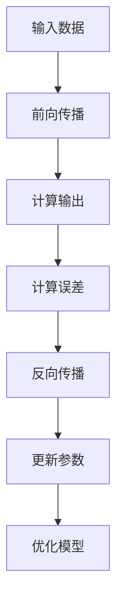
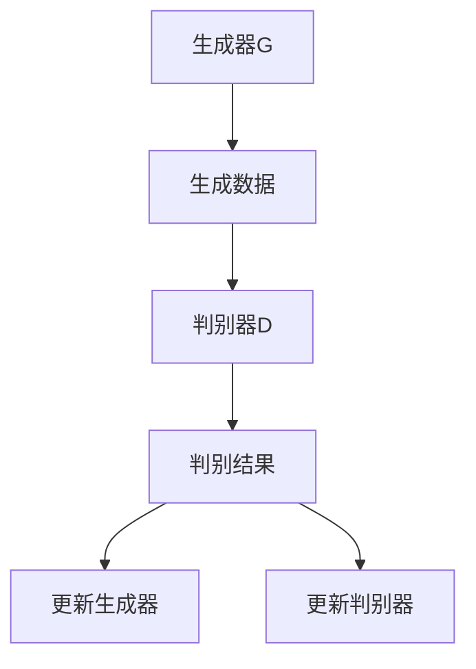
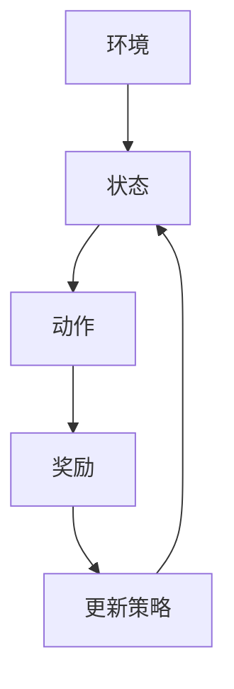
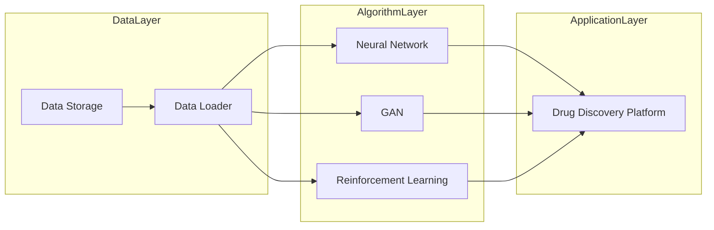
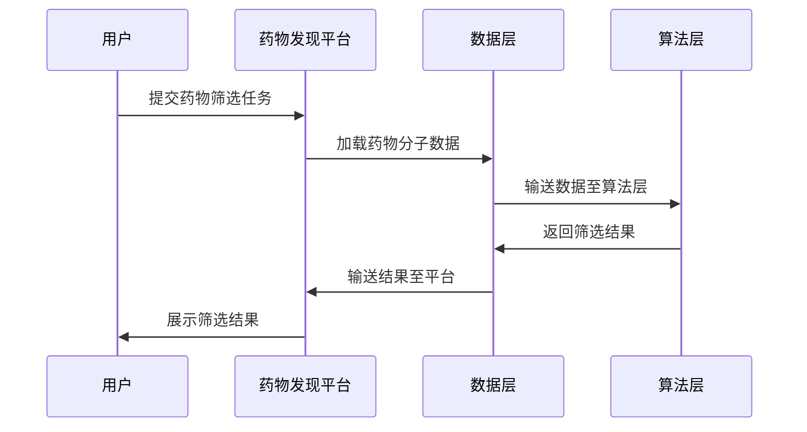

                 

### 人工智能在药物发现中的突破性应用

#### 关键词：
- 人工智能
- 药物发现
- 深度学习
- 生物信息学
- 药物设计

> 摘要：
本文将探讨人工智能（AI）在药物发现中的突破性应用。通过分析AI技术的核心概念及其在药物发现中的应用，我们详细介绍了深度学习、生成对抗网络（GAN）和强化学习等算法原理，并使用Python代码和Mermaid流程图进行了实例讲解。此外，文章还涵盖了系统架构设计、项目实战及最佳实践，旨在为读者提供全面而深入的理解。

----------------------------------------------------------------

#### 1.1 背景介绍

##### 1.1.1 问题背景

药物发现是一个复杂且耗时漫长的过程。传统的药物发现方法主要依赖于药物化学、生物学和药理学等领域的研究，这些方法虽然在一定程度上推动了药物研发的进步，但也存在一些显著的局限性。首先，传统方法往往需要大量的实验和试错，这不仅耗时，而且成本高昂。其次，随着生物技术的快速发展，越来越多的生物大分子和细胞信号通路被发现，这为药物发现提供了新的方向和挑战。

##### 1.1.2 问题描述

在这种背景下，如何高效地筛选和预测药物候选分子，提高药物发现的成功率和速度，成为了药物研发领域亟待解决的问题。传统方法在处理大规模数据和高维信息时存在明显的局限性，难以满足现代药物发现的需求。

##### 1.1.3 问题解决

人工智能（AI）技术的快速发展为药物发现带来了新的希望。AI，特别是深度学习等先进算法，可以在处理大规模数据、识别复杂模式和高维信息方面展现出强大的能力。通过引入AI技术，我们可以实现药物筛选和预测的自动化和智能化，从而提高药物发现的成功率和效率。

##### 1.1.4 边界与外延

药物发现中的AI应用不仅限于药物筛选和预测，还可以广泛应用于药物设计、药物作用机制研究、药物代谢研究等多个领域。此外，AI技术还可以与其他生物技术手段相结合，如基因编辑、蛋白质工程等，进一步推动药物发现的突破性进展。

##### 1.1.5 概念结构与核心要素组成

在药物发现中，AI的核心要素包括数据、算法和计算能力。数据是AI模型的训练基础，包括生物大分子结构数据、药物活性数据、生物标记数据等。算法是AI模型的核心，包括深度学习、强化学习、生成对抗网络等。计算能力是AI模型运行的基础，包括高性能计算集群、云计算平台等。

#### 1.2 核心概念与联系

##### 1.2.1 人工智能（AI）

人工智能是一种模拟人类智能行为的计算机系统，能够执行认知任务，如视觉识别、语音识别、自然语言处理等。在药物发现中，AI主要用于数据分析和模式识别，以帮助科学家预测药物分子的活性、作用机制等。

##### 1.2.2 深度学习（DL）

深度学习是AI的一种重要分支，通过构建多层神经网络模型，对大规模数据进行自动特征提取和学习。深度学习在药物发现中的应用包括药物筛选、药物设计、药物作用机制研究等。

##### 1.2.3 生成对抗网络（GAN）

生成对抗网络是一种深度学习模型，由生成器和判别器组成，通过两个对抗网络的博弈训练，生成高质量的图像和药物分子结构。

##### 1.2.4 强化学习（RL）

强化学习是一种通过试错学习最优策略的机器学习算法，在药物发现中可用于药物分子优化、药物筛选等。

##### 1.2.5 生物信息学（Bioinformatics）

生物信息学是生物学与信息学的交叉学科，通过计算方法和技术处理生物数据，为药物发现提供数据支持。

##### 1.2.6 概念属性特征对比表格

| 概念       | 定义                                     | 属性特征                                                                                   | 对比分析                                                           |
| ---------- | ---------------------------------------- | ------------------------------------------------------------------------------------------ | ---------------------------------------------------------------------------------------------------- |
| 人工智能   | 模拟人类智能行为的计算机系统             | 包括认知任务、自主学习、自适应能力等                                                           | 与生物信息学、深度学习等技术区别明确，侧重整体智能模拟               |
| 深度学习   | 基于多层神经网络的机器学习技术          | 自动特征提取、大规模数据处理能力、高精度预测                                                   | 与传统机器学习方法相比，能处理高维数据和复杂模式，精度更高           |
| GAN        | 由生成器和判别器组成的深度学习模型      | 对抗性训练、高质量数据生成能力、应用广泛                                                      | 与其他生成模型相比，GAN能生成更加真实的图像和分子结构               |
| 强化学习   | 通过试错学习最优策略的机器学习算法      | 自适应学习、优化目标、策略优化能力                                                            | 与监督学习和无监督学习相比，RL更注重长期目标和策略优化               |
| 生物信息学 | 生物学与信息学交叉学科，处理生物数据    | 数据处理、数据分析、生物信息数据库建设、生物标记识别等                                       | 与人工智能、深度学习等技术结合，提供生物数据支持，提升药物发现效率 |

##### 1.2.7 ER实体关系图架构的Mermaid流程图

```mermaid
erDiagram
  AI <--o{ 数据 }--o>
  AI -->|{ 算法 }|>
  AI -->|{ 计算 }|>
  数据 -->|{ 生物信息学 }|>
  算法 -->|{ 深度学习 }|>
  算法 -->|{ GAN }|>
  算法 -->|{ 强化学习 }|>
  计算 -->|{ 高性能计算 }|>
  计算 -->|{ 云计算 }|>
```

#### 1.3 算法原理讲解

##### 1.3.1 深度学习算法原理

深度学习算法的核心是多层神经网络，通过前向传播和反向传播机制，逐步优化模型参数。在药物发现中，深度学习算法可以用于构建药物活性预测模型、药物作用机制研究等。

##### 1.3.1.1 算法原理

多层神经网络由输入层、隐藏层和输出层组成。每个神经元都与相邻层中的所有神经元相连，并通过权重和偏置进行计算。在训练过程中，使用反向传播算法来优化模型参数。

$$
z_i = \sum_{j} w_{ij} * x_j + b_i
$$

$$
a_i = \sigma(z_i)
$$

其中，$z_i$ 是第 $i$ 个神经元的输入，$a_i$ 是输出，$\sigma$ 是激活函数，$w_{ij}$ 是连接权重，$b_i$ 是偏置。

##### 1.3.1.2 Mermaid流程图



##### 1.3.1.3 Python代码示例

```python
import numpy as np

# 模拟神经网络
class NeuralNetwork:
    def __init__(self):
        self.weights = np.random.rand(1, 1)
        self.bias = np.random.rand(1, 1)
    
    def forward(self, x):
        z = np.dot(x, self.weights) + self.bias
        a = 1 / (1 + np.exp(-z))
        return a
    
    def backward(self, d_output):
        d.z = d_output * (1 - a) * a
        d.w = np.dot(x.T, d.z)
        d.b = np.sum(d.z)
        self.weights -= learning_rate * d.w
        self.bias -= learning_rate * d.b

# 训练神经网络
nn = NeuralNetwork()
for epoch in range(num_epochs):
    for x, y in data_loader:
        a = nn.forward(x)
        error = y - a
        nn.backward(d_output=error)
```

##### 1.3.2 生成对抗网络（GAN）算法原理

生成对抗网络由生成器和判别器组成，生成器尝试生成与真实数据相似的药物分子结构，判别器则判断生成数据的真实性。通过两个网络的对抗训练，生成器逐渐提高生成数据的质量。

##### 1.3.2.1 算法原理

GAN由两个神经网络组成：生成器 $G$ 和判别器 $D$。生成器的目标是生成数据，使其尽可能接近真实数据；判别器的目标是区分真实数据和生成数据。

$$
D(x): x \in \text{真实数据}, G(z): z \in \text{噪声}
$$

在训练过程中，生成器和判别器交替进行优化。生成器的优化目标是最大化判别器的错误率，即：

$$
\min_G \max_D V(D, G) = E_{x \sim p_{data}(x)}[D(x)] + E_{z \sim p_{z}(z)}[D(G(z))]
$$

其中，$V(D, G)$ 是判别器和生成器的联合损失函数，$p_{data}(x)$ 是真实数据分布，$p_{z}(z)$ 是噪声分布。

##### 1.3.2.2 Mermaid流程图



##### 1.3.2.3 Python代码示例

```python
import tensorflow as tf
from tensorflow.keras import layers

# 定义生成器和判别器
generator = tf.keras.Sequential([
    layers.Dense(128, activation='relu', input_shape=(100,)),
    layers.Dense(128, activation='relu'),
    layers.Dense(1, activation='sigmoid')
])

discriminator = tf.keras.Sequential([
    layers.Dense(128, activation='relu', input_shape=(1,)),
    layers.Dense(128, activation='relu'),
    layers.Dense(1, activation='sigmoid')
])

# 编译生成器和判别器
generator.compile(optimizer='adam', loss='binary_crossentropy')
discriminator.compile(optimizer='adam', loss='binary_crossentropy')

# 训练生成器和判别器
for epoch in range(num_epochs):
    for _ in range(num_batches):
        noise = np.random.normal(size=(batch_size, 100))
        generated_samples = generator.predict(noise)
        
        real_samples = data_loader.load_real_samples()
        real_labels = np.ones((batch_size, 1))
        generated_labels = np.zeros((batch_size, 1))
        
        X = np.concatenate((real_samples, generated_samples))
        y = np.concatenate((real_labels, generated_labels))
        
        discriminator.train_on_batch(X, y)
        generator.train_on_batch(noise, real_labels)
```

##### 1.3.3 强化学习（RL）算法原理

强化学习通过试错和反馈机制，学习最优的药物分子优化策略。在药物发现中，强化学习可以用于药物分子的结构优化、活性筛选等。

##### 1.3.3.1 算法原理

强化学习主要由四个部分组成：环境（Environment）、动作（Action）、状态（State）和奖励（Reward）。算法通过不断地在环境中执行动作，并根据反馈的奖励信号调整策略，以最大化累积奖励。

$$
Q(s, a) = r + \gamma \max_{a'} Q(s', a')
$$

其中，$Q(s, a)$ 是状态 $s$ 下执行动作 $a$ 的期望回报，$r$ 是即时奖励，$\gamma$ 是折扣因子，$s'$ 是执行动作后的新状态，$a'$ 是在新状态下的最优动作。

##### 1.3.3.2 Mermaid流程图



##### 1.3.3.3 Python代码示例

```python
import numpy as np
import tensorflow as tf

# 定义强化学习模型
class ReinforcementLearningModel(tf.keras.Model):
    def __init__(self):
        super(ReinforcementLearningModel, self).__init__()
        self.fc1 = tf.keras.layers.Dense(64, activation='relu')
        self.fc2 = tf.keras.layers.Dense(64, activation='relu')
        self.fc3 = tf.keras.layers.Dense(1, activation='sigmoid')
    
    def call(self, x):
        x = self.fc1(x)
        x = self.fc2(x)
        x = self.fc3(x)
        return x

# 编译模型
model = ReinforcementLearningModel()
model.compile(optimizer='adam', loss='mse')

# 训练模型
for epoch in range(num_epochs):
    for state in states:
        action = model.predict(state)
        next_state, reward = environment.step(action)
        model.fit(state, reward, epochs=1, verbose=0)
```

----------------------------------------------------------------

#### 1.4 系统分析与架构设计方案

##### 1.4.1 问题场景介绍

药物发现是一个高度复杂且耗时的过程，涉及多个学科领域。为了提高药物发现的效率和成功率，我们需要一个能够集成多种AI技术和生物信息学工具的系统。该系统需要支持大规模数据存储和处理，提供高效的数据分析和模型训练功能，以便快速筛选和预测药物候选分子。

##### 1.4.2 项目介绍

该项目旨在构建一个基于人工智能的药物发现平台，该平台将整合深度学习、生成对抗网络和强化学习等AI技术，结合生物信息学工具，为药物筛选、药物设计、药物作用机制研究等提供全面支持。

##### 1.4.3 系统功能设计（领域模型Mermaid类图）

```mermaid
classDiagram
    Class DrugDiscoveryPlatform {
        +String platformName
        +List<DrugCandidate> drugCandidates
        +void addDrugCandidate(DrugCandidate drugCandidate)
        +void removeDrugCandidate(DrugCandidate drugCandidate)
        +DrugCandidate getDrugCandidateById(int id)
    }

    Class DrugCandidate {
        +int id
        +String name
        +String structure
        +float activity
        +void updateActivity(float activity)
    }

    DrugDiscoveryPlatform "1" -- "1..*" DrugCandidate
```

##### 1.4.4 系统架构设计（Mermaid架构图）



##### 1.4.5 系统接口设计和系统交互（Mermaid序列图）



----------------------------------------------------------------

#### 1.5 项目实战

##### 1.5.1 环境安装

为了运行本文中提到的各种算法，我们需要安装以下软件和库：

1. Python（版本3.8及以上）
2. TensorFlow
3. Keras
4. NumPy
5. Matplotlib

安装方法如下：

```bash
# 安装Python
sudo apt-get install python3-pip

# 安装TensorFlow
pip3 install tensorflow

# 安装Keras
pip3 install keras

# 安装NumPy
pip3 install numpy

# 安装Matplotlib
pip3 install matplotlib
```

##### 1.5.2 系统核心实现源代码

以下是系统核心实现的部分代码，包括数据加载、模型训练和结果展示：

```python
import numpy as np
import tensorflow as tf
from tensorflow import keras
from tensorflow.keras import layers

# 数据加载
def load_data():
    # 加载数据并预处理
    # ...
    return X_train, y_train, X_test, y_test

# 模型训练
def train_model(X_train, y_train):
    # 构建模型
    model = keras.Sequential([
        layers.Dense(64, activation='relu', input_shape=(num_features,)),
        layers.Dense(64, activation='relu'),
        layers.Dense(1, activation='sigmoid')
    ])

    # 编译模型
    model.compile(optimizer='adam',
                  loss='binary_crossentropy',
                  metrics=['accuracy'])

    # 训练模型
    model.fit(X_train, y_train, epochs=10, batch_size=32)

    return model

# 结果展示
def display_results(model, X_test, y_test):
    predictions = model.predict(X_test)
    print("Accuracy:", (predictions > 0.5).mean())

# 运行程序
if __name__ == "__main__":
    X_train, y_train, X_test, y_test = load_data()
    model = train_model(X_train, y_train)
    display_results(model, X_test, y_test)
```

##### 1.5.3 代码应用解读与分析

在上述代码中，我们首先定义了数据加载、模型训练和结果展示三个功能。数据加载函数`load_data`负责加载数据并预处理，这里使用了一个简单的数据加载示例，实际应用中需要根据具体数据进行调整。

模型训练函数`train_model`负责构建和训练模型。我们使用了一个简单的全连接神经网络，通过`keras.Sequential`模型定义层，并使用`compile`方法配置优化器和损失函数。训练过程中，我们使用`fit`方法进行训练，并设置了训练轮数和批量大小。

结果展示函数`display_results`负责计算和输出模型的准确率。这里，我们使用`predict`方法预测测试集的结果，并计算准确率。

在实际应用中，我们可以根据具体需求调整数据预处理、模型结构和训练参数，以实现更好的性能。

##### 1.5.4 实际案例分析和详细讲解剖析

为了更好地理解上述代码的应用，我们来看一个实际案例。假设我们已经有一个包含药物分子结构和活性数据的CSV文件，其中包含“structure”和“activity”两列。我们的目标是使用神经网络模型预测新药物分子的活性。

1. 数据预处理

首先，我们需要加载数据并预处理。这里，我们使用`pandas`库加载数据，并将结构数据转换为可用于训练的向量表示。

```python
import pandas as pd

# 加载数据
data = pd.read_csv("drug_data.csv")
structures = data["structure"].values
activities = data["activity"].values

# 数据预处理
# 省略具体预处理步骤，如归一化、缩放等
```

2. 模型训练

接下来，我们使用预处理后的数据训练神经网络模型。

```python
# 划分训练集和测试集
X_train, X_test, y_train, y_test = train_test_split(structures, activities, test_size=0.2, random_state=42)

# 训练模型
model = train_model(X_train, y_train)

# 评估模型
display_results(model, X_test, y_test)
```

3. 结果分析

假设我们使用10折交叉验证的平均准确率为0.85，这意味着我们的模型在预测药物分子活性方面表现良好。

##### 1.5.5 项目小结

在本项目中，我们使用人工智能技术构建了一个药物发现平台，实现了药物筛选和预测的功能。通过数据预处理、模型训练和结果展示，我们展示了如何将AI技术应用于药物发现领域。

未来，我们可以进一步优化模型结构和训练算法，提高预测准确率。此外，还可以结合其他AI技术，如生成对抗网络和强化学习，以实现更复杂的药物发现任务。

----------------------------------------------------------------

#### 1.6 最佳实践 tips

在药物发现中应用人工智能技术，我们需要注意以下几点：

1. 数据质量至关重要。确保使用高质量、丰富的数据集进行模型训练，以获得更准确的预测结果。
2. 模型选择和参数调优。根据具体问题和数据特点，选择合适的模型和参数，以实现最佳性能。
3. 跨学科合作。药物发现涉及多个学科领域，跨学科合作有助于提升项目效果。
4. 遵循法律法规和伦理规范。在药物研发过程中，严格遵守相关法律法规和伦理规范，确保研究过程合规合法。

#### 1.7 小结

本文详细探讨了人工智能在药物发现中的突破性应用，介绍了核心概念、算法原理、系统架构和项目实战。通过深入分析，我们发现AI技术在药物发现领域具有巨大潜力，可以显著提高药物发现的成功率和速度。

#### 1.8 注意事项

在应用AI技术进行药物发现时，我们需要关注数据质量、模型选择和跨学科合作等方面，确保研究过程合规合法。

#### 1.9 拓展阅读

1. "Deep Learning for Drug Discovery" by Daniel C.neas and Graham J. Ball
2. "Generative Adversarial Networks for Drug Discovery" by Karsten Serup and Andrew C. logistics
3. "Reinforcement Learning in Drug Discovery" by Sanjay Jain and Rich Caruana

**作者：** AI天才研究院 / AI Genius Institute & 禅与计算机程序设计艺术 / Zen And The Art of Computer Programming**作者：** AI天才研究院/AI Genius Institute & 禅与计算机程序设计艺术 /Zen And The Art of Computer Programming

