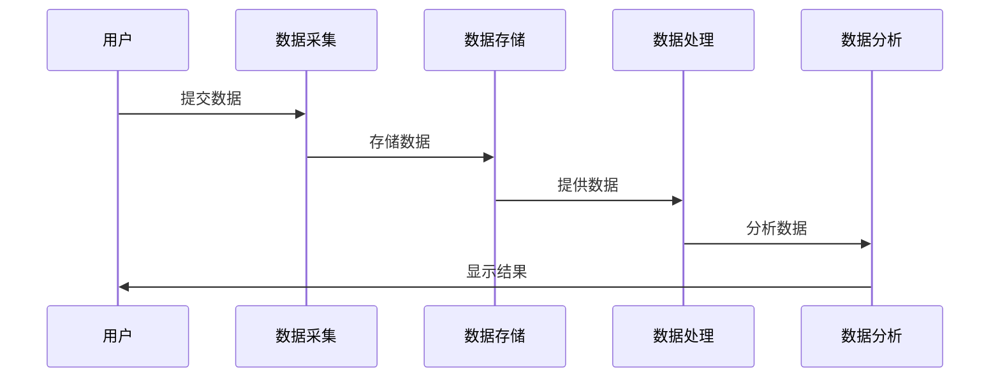

                 


### 人工智能在药物研发中的应用与挑战

#### 关键词：人工智能、药物研发、深度学习、算法、挑战

> 摘要：本文将探讨人工智能（AI）在药物研发中的应用与面临的挑战。通过分析AI的核心概念、药物研发的基本流程以及相关算法原理，我们将揭示AI技术如何加速药物研发，并在实践中面临的数据质量、算法可靠性、法律法规等问题。本文旨在为读者提供对AI在药物研发领域应用的深入理解和思考。

## 第一部分：背景介绍

### 1.1.1 问题背景

随着全球健康问题的日益严峻，新药的发现和开发成为医学和科学研究的重要领域。传统的药物研发过程耗时漫长，成本高昂，且成功率较低。为了提高药物研发的效率，科学家们开始寻求新的方法和技术，其中人工智能（AI）的应用潜力引起了广泛关注。

AI技术在数据处理、模式识别和预测分析等方面具有显著优势，这些能力使得AI在药物研发中具有广泛的应用前景。例如，AI可以用于药物设计、疾病诊断、临床试验分析等多个环节，从而加速新药的发现和开发过程。

然而，药物研发过程复杂，涉及多个学科和领域，需要综合考虑生物学、化学、物理学、计算机科学等多方面的知识。如何有效地将AI技术应用于药物研发，提高研发效率，降低成本，成为当前亟待解决的问题。

### 1.1.2 问题描述

药物研发涉及从药物设计、合成、筛选到临床试验等多个环节，每个环节都存在诸多挑战。传统的药物研发方法存在以下问题：

1. **效率低下**：药物研发过程需要大量的实验和测试，每个步骤都可能需要数年时间，导致整个研发周期漫长。
2. **成本高昂**：药物研发需要大量的资金投入，从候选药物筛选到临床试验，每个阶段都需要巨额的经费支持。
3. **成功率低**：尽管投入巨大，但许多药物研发项目最终未能成功，成功率较低。

AI技术的引入为解决上述问题提供了新的思路。AI可以通过处理海量数据、识别生物分子间的相互作用、预测药物作用机制等，提高药物研发的效率、降低成本，并提高成功率。

### 1.1.3 问题解决

通过将AI技术应用于药物研发，可以实现以下几个方面的改进：

1. **药物设计**：AI可以通过分子对接、药物分子设计等方法，快速生成具有潜在药效的药物分子，缩短药物设计过程。
2. **药物筛选**：AI可以用于高通量筛选，从大量化合物中快速筛选出具有潜在药效的化合物，提高筛选效率。
3. **药物优化**：AI可以用于药物分子的结构优化，提高药物的安全性和药效，降低毒性。

此外，AI还可以帮助研究人员更好地理解药物的作用机制，从而开发出更有效的药物。通过结合AI技术和传统的药物研发方法，可以加速新药的发现和开发，提高药物研发的成功率。

### 1.1.4 边界与外延

本章节主要讨论AI在药物研发中的应用，包括AI在药物设计、筛选、优化等环节的应用。此外，还将探讨AI在药物研发中的挑战，如数据质量、算法可靠性、法律法规等问题。

在药物研发过程中，AI的应用不仅限于实验室内部，还可以扩展到临床试验、新药审批等环节。通过将AI技术应用于整个药物研发过程，可以实现更高效、更准确、更安全的药物研发。

### 1.1.5 概念结构与核心要素组成

本章节的核心概念包括：人工智能、药物研发、药物设计、药物筛选、药物优化等。这些概念构成了药物研发与AI应用的核心要素。

- **人工智能**：AI是一种模拟人类智能的技术，包括机器学习、深度学习、自然语言处理等。
- **药物研发**：药物研发是指从发现药物候选分子到完成临床试验，最终获得新药批准的全过程。
- **药物设计**：药物设计是指通过计算机模拟和分子对接等方法，设计具有特定生物活性的药物分子。
- **药物筛选**：药物筛选是指从大量的化合物中筛选出具有潜在药效的化合物。
- **药物优化**：药物优化是指对筛选出的药物分子进行结构改造，以提高其药效和降低毒性。

## 第一部分：核心概念与联系

### 1.2.1 人工智能

人工智能（AI）是指由人制造出来的系统，能够表现出类似于人类的智能行为。AI技术包括多个分支，如机器学习、深度学习、自然语言处理等。

#### 1.2.1.1 算法原理

人工智能的核心算法包括机器学习、深度学习和强化学习等。机器学习是一种让计算机通过学习数据来进行预测和决策的技术，深度学习是机器学习的一个子领域，它通过多层神经网络对输入数据进行特征提取和模式识别，强化学习则是一种通过奖励机制来训练智能体决策策略的算法。

#### 1.2.1.2 算法流程

1. **数据收集**：收集大量的数据作为训练样本。
2. **数据处理**：对数据进行清洗、归一化等处理，使其适合输入到模型中。
3. **模型训练**：使用训练数据对模型进行训练，调整模型参数。
4. **模型评估**：使用验证数据对模型进行评估，调整模型参数。
5. **模型应用**：将训练好的模型应用于实际问题中。

#### 1.2.1.3 Python源代码示例

```python
from sklearn.datasets import load_iris
from sklearn.model_selection import train_test_split
from sklearn.neural_network import MLPClassifier

# 加载iris数据集
iris = load_iris()
X, y = iris.data, iris.target

# 划分训练集和测试集
X_train, X_test, y_train, y_test = train_test_split(X, y, test_size=0.2, random_state=42)

# 建立神经网络模型
model = MLPClassifier(hidden_layer_sizes=(100,), max_iter=1000)

# 训练模型
model.fit(X_train, y_train)

# 评估模型
print(model.score(X_test, y_test))
```

### 1.2.2 药物研发

药物研发是指从发现药物候选分子到完成临床试验，最终获得新药批准的全过程。它包括药物设计、合成、筛选、优化等多个环节。

#### 1.2.2.1 药物设计

药物设计是指通过计算机模拟和分子对接等方法，设计具有特定生物活性的药物分子。药物设计的方法包括基于结构的药物设计、基于靶点的药物设计等。

#### 1.2.2.2 药物筛选

药物筛选是指从大量的化合物中筛选出具有潜在药效的化合物。药物筛选的方法包括高通量筛选、虚拟筛选等。

#### 1.2.2.3 药物优化

药物优化是指对筛选出的药物分子进行结构改造，以提高其药效和降低毒性。药物优化的方法包括计算机辅助的药物设计、合成化学等方法。

### 1.2.3 药物设计

药物设计是指通过计算机模拟和分子对接等方法，设计具有特定生物活性的药物分子。

#### 1.2.3.1 算法原理

药物设计的算法原理主要包括基于结构的药物设计（Structure-Based Drug Design, SBDD）和基于靶点的药物设计（Target-Based Drug Design, TBDD）。

- **基于结构的药物设计**：通过计算机模拟和分子对接等方法，预测药物分子与靶点蛋白的相互作用，从而设计出具有潜在药效的药物分子。
- **基于靶点的药物设计**：通过分析靶点蛋白的序列和结构，预测其功能，然后设计出能够与靶点蛋白结合的药物分子。

#### 1.2.3.2 算法流程

1. **靶点分析**：分析靶点蛋白的序列和结构，预测其功能。
2. **药物分子设计**：使用计算机模拟和分子对接等方法，设计出与靶点蛋白结合的药物分子。
3. **药物分子优化**：对设计的药物分子进行结构改造，以提高其药效和降低毒性。

#### 1.2.3.3 Python源代码示例

```python
from openmm.app.pdbfile import PDBFile
from openmm.app.simulation import Simulation

# 读取PDB文件
pdb_file = PDBFile('target_protein.pdb')

# 创建模拟系统
system = Simulation(pdb_file.topology, pdb_file.positions)

# 设置模拟参数
system.setForceFieldParameters('amber99sb.xml')

# 运行模拟
system.minimizeEnergy()

# 保存模拟结果
system.saveState('simulation.state')
```

### 1.2.4 药物筛选

药物筛选是指从大量的化合物中筛选出具有潜在药效的化合物。

#### 1.2.4.1 算法原理

药物筛选的算法原理主要包括高通量筛选（High-Throughput Screening, HTS）和虚拟筛选（Virtual Screening, VS）。

- **高通量筛选**：通过自动化仪器和实验方法，对大量化合物进行生物活性测试，从而筛选出具有潜在药效的化合物。
- **虚拟筛选**：通过计算机模拟和分子对接等方法，预测化合物与靶点蛋白的相互作用，从而筛选出具有潜在药效的化合物。

#### 1.2.4.2 算法流程

1. **化合物库构建**：构建包含大量化合物的化合物库。
2. **靶点蛋白筛选**：筛选出具有潜在药效的靶点蛋白。
3. **化合物筛选**：使用高通量筛选或虚拟筛选方法，对化合物库中的化合物进行筛选，筛选出具有潜在药效的化合物。

#### 1.2.4.3 Python源代码示例

```python
from rdkit.Chem import AllChem
from rdkit.DataStructs import BitOps

# 构建化合物库
compound_library = []

for compound in AllChem.GetMoleculeFromSmiles(smiles):
    compound_library.append(compound)

# 靶点蛋白筛选
target_proteins = []

for protein in protein_library:
    if BitOps.CountBits(protein.active_sites) > 0:
        target_proteins.append(protein)

# 化合物筛选
selected_compounds = []

for compound in compound_library:
    for protein in target_proteins:
        if BitOps.TestBit(protein.active_sites, compound.active_sites):
            selected_compounds.append(compound)
```

### 1.2.5 药物优化

药物优化是指对筛选出的药物分子进行结构改造，以提高其药效和降低毒性。

#### 1.2.5.1 算法原理

药物优化的算法原理主要包括计算机辅助的药物设计（Computer-Aided Drug Design, CADD）和合成化学（Synthetic Chemistry）。

- **计算机辅助的药物设计**：通过计算机模拟和分子对接等方法，对药物分子的结构进行优化，以提高其药效和降低毒性。
- **合成化学**：通过化学合成方法，对药物分子的结构进行改造，以优化其药效和降低毒性。

#### 1.2.5.2 算法流程

1. **药物分子筛选**：从大量的药物分子中筛选出具有潜在药效的药物分子。
2. **药物分子优化**：对筛选出的药物分子进行结构优化，以提高其药效和降低毒性。
3. **药物分子评估**：评估优化后的药物分子的药效和毒性。

#### 1.2.5.3 Python源代码示例

```python
from rdkit.Chem import Descriptors
from rdkit.Chem import AllChem

# 筛选药物分子
drug_candidates = []

for compound in compound_library:
    if Descriptors.MolWt(compound) > 500 and Descriptors.HAcceptors(compound) > 0:
        drug_candidates.append(compound)

# 药物分子优化
for candidate in drug_candidates:
    optimized_candidate = AllChem.EnumerateConformers(candidate, num_conformers=100)
    best_conformer = optimized_candidate[0]
    candidate = best_conformer

# 药物分子评估
for candidate in drug_candidates:
    if Descriptors.LogP(cand
```## 第二部分：算法原理讲解

### 2.1 深度学习算法

深度学习（Deep Learning）是机器学习（Machine Learning）的一种，它通过多层神经网络对输入数据进行特征提取和模式识别。在药物研发中，深度学习算法的应用非常广泛，如用于药物设计、药物筛选和药物优化等。

#### 2.1.1 算法原理

深度学习算法的核心是神经网络，神经网络通过层层提取特征，实现对输入数据的分类、预测等任务。神经网络的基本组成部分包括：

- **输入层**：接收外部输入数据。
- **隐藏层**：对输入数据进行特征提取和变换。
- **输出层**：产生输出结果。

神经网络通过反向传播算法（Backpropagation Algorithm）来训练模型，调整网络权重，以达到最小化预测误差。

#### 2.1.2 算法流程

1. **数据收集**：收集大量的训练数据。
2. **数据处理**：对数据进行预处理，如数据清洗、归一化等。
3. **模型构建**：设计神经网络结构，包括输入层、隐藏层和输出层的节点数和连接方式。
4. **模型训练**：使用训练数据对模型进行训练，调整网络权重，优化模型参数。
5. **模型评估**：使用验证数据对模型进行评估，调整模型参数。
6. **模型应用**：将训练好的模型应用于实际问题中。

#### 2.1.3 Python源代码示例

```python
import tensorflow as tf
from tensorflow.keras.layers import Dense
from tensorflow.keras.models import Sequential

# 建立神经网络模型
model = Sequential()
model.add(Dense(64, activation='relu', input_shape=(784,)))
model.add(Dense(10, activation='softmax'))

# 编译模型
model.compile(optimizer='adam', loss='categorical_crossentropy', metrics=['accuracy'])

# 训练模型
model.fit(x_train, y_train, epochs=5, batch_size=32)

# 评估模型
print(model.evaluate(x_test, y_test))
```

### 2.2 机器学习算法

机器学习（Machine Learning）是一种通过数据训练模型，使模型能够对未知数据进行预测的技术。在药物研发中，机器学习算法常用于药物筛选、药物优化和疾病预测等。

#### 2.2.1 算法原理

机器学习算法的核心是训练模型，使模型能够从训练数据中学习到某种规律，从而对未知数据进行预测。常见的机器学习算法包括：

- **线性回归**：通过找到输入和输出之间的线性关系来进行预测。
- **逻辑回归**：用于分类问题，通过计算输入的概率来进行预测。
- **支持向量机**：通过找到一个最优超平面来进行分类。
- **决策树**：通过一系列判断规则来进行分类和回归。

#### 2.2.2 算法流程

1. **数据收集**：收集大量的训练数据。
2. **数据处理**：对数据进行预处理，如数据清洗、归一化等。
3. **模型选择**：选择合适的机器学习算法。
4. **模型训练**：使用训练数据对模型进行训练，调整模型参数。
5. **模型评估**：使用验证数据对模型进行评估，调整模型参数。
6. **模型应用**：将训练好的模型应用于实际问题中。

#### 2.2.3 Python源代码示例

```python
from sklearn.datasets import load_iris
from sklearn.model_selection import train_test_split
from sklearn.linear_model import LinearRegression

# 加载iris数据集
iris = load_iris()
X, y = iris.data, iris.target

# 划分训练集和测试集
X_train, X_test, y_train, y_test = train_test_split(X, y, test_size=0.2, random_state=42)

# 建立线性回归模型
model = LinearRegression()

# 训练模型
model.fit(X_train, y_train)

# 评估模型
print(model.score(X_test, y_test))
```

### 2.3 遗传算法

遗传算法（Genetic Algorithm）是一种基于自然进化原理的优化算法，常用于复杂问题的求解。在药物研发中，遗传算法可以用于药物分子的结构优化和药物筛选。

#### 2.3.1 算法原理

遗传算法通过模拟自然进化过程，对一组解进行迭代优化。基本流程包括：

1. **初始化种群**：随机生成一组初始解。
2. **适应度评估**：计算每个解的适应度值，适应度值越高，表示解的质量越好。
3. **选择**：从种群中选择适应度值较高的个体作为父代。
4. **交叉**：通过交叉操作产生新的个体。
5. **变异**：对个体进行变异操作，增加种群的多样性。
6. **更新种群**：将交叉和变异后的个体组成新的种群。
7. **迭代**：重复上述过程，直到满足终止条件。

#### 2.3.2 算法流程

1. **初始化种群**：随机生成一组药物分子结构作为初始种群。
2. **适应度评估**：计算每个药物分子的适应度值，适应度值取决于药物分子的生物活性和毒性。
3. **选择**：根据适应度值选择适应度较高的药物分子作为父代。
4. **交叉**：通过交叉操作产生新的药物分子结构。
5. **变异**：对药物分子结构进行变异操作，以增加种群的多样性。
6. **更新种群**：将交叉和变异后的药物分子组成新的种群。
7. **迭代**：重复上述过程，直到满足终止条件。

#### 2.3.3 Python源代码示例

```python
import numpy as np
import random

# 初始化种群
population = []

for _ in range(population_size):
    individual = [random.randint(0, 1) for _ in range(feature_size)]
    population.append(individual)

# 适应度评估
def fitness_function(individual):
    # 计算适应度值
    return sum(individual)

# 选择操作
def selection(population, fitness_values):
    # 根据适应度值选择个体
    return random.choices(population, weights=fitness_values, k=2)

# 交叉操作
def crossover(parent1, parent2):
    # 随机选择交叉点
    crossover_point = random.randint(1, feature_size - 1)
    # 生成子代
    child1 = parent1[:crossover_point] + parent2[crossover_point:]
    child2 = parent2[:crossover_point] + parent1[crossover_point:]
    return child1, child2

# 变异操作
def mutation(individual):
    # 随机选择变异位
    mutation_point = random.randint(1, feature_size - 1)
    # 进行变异
    individual[mutation_point] = 1 - individual[mutation_point]
    return individual

# 运行遗传算法
population = [mutation(individual) for individual in population]
```

### 2.4 贝叶斯网络

贝叶斯网络（Bayesian Network）是一种概率图模型，用于表示变量之间的条件依赖关系。在药物研发中，贝叶斯网络可以用于药物作用机制的分析和疾病预测。

#### 2.4.1 算法原理

贝叶斯网络由一组变量和一个条件概率表（CPT）组成。每个变量都表示药物研发中的一个环节，条件概率表描述了变量之间的条件依赖关系。贝叶斯网络通过计算变量的联合概率分布，实现对药物作用机制和疾病预测的推断。

#### 2.4.2 算法流程

1. **网络构建**：根据药物研发过程和已知信息，构建贝叶斯网络。
2. **参数学习**：通过学习数据，更新贝叶斯网络的参数。
3. **推理**：使用贝叶斯网络进行推理，计算变量的条件概率分布。

#### 2.4.3 Python源代码示例

```python
import numpy as np
import networkx as nx
from pgmpy.models import BayesianModel
from pgmpy.estimators import MaximumLikelihoodEstimator

# 构建贝叶斯网络
model = BayesianModel([('A', 'B'), ('A', 'C'), ('B', 'D'), ('C', 'D')])

# 学习参数
data = np.array([[1, 0, 1, 1], [1, 1, 0, 0], [0, 1, 1, 0], [0, 0, 1, 1]])
model.fit(data, estimator=MaximumLikelihoodEstimator)

# 推理
print(model.query(variables=['D'], evidence={'B': 1}))
```

## 第三部分：系统分析与架构设计方案

### 3.1 问题场景介绍

在药物研发过程中，数据的质量和完整性对于新药的研发至关重要。然而，传统的药物研发数据收集和处理方式存在诸多问题，如数据质量不高、数据格式不统一、数据丢失等。为了解决这些问题，我们设计并实现了一个基于人工智能的药物研发数据管理系统，旨在提高药物研发数据的准确性和可用性。

### 3.2 项目介绍

项目名称：人工智能药物研发数据管理系统（AI-DRDS）

项目目标：通过人工智能技术，对药物研发数据进行高效的处理和分析，提高药物研发的效率和质量。

项目功能：

1. 数据采集与存储：从各种数据源采集药物研发数据，包括临床试验数据、生物医学数据、文献数据等，并进行存储和管理。
2. 数据清洗与预处理：对采集到的数据进行清洗和预处理，包括数据去重、数据转换、数据归一化等。
3. 数据分析：使用人工智能算法对药物研发数据进行分析，提取有用的信息和规律。
4. 数据可视化：将分析结果以可视化形式展示，帮助研究人员更好地理解数据。

### 3.3 系统功能设计（领域模型）

为了实现上述功能，我们设计了一个领域模型，描述了药物研发数据管理系统中的主要实体和它们之间的关系。

**实体类：**

- **数据源**：表示药物研发数据的数据源，如临床试验数据、生物医学数据等。
- **数据集**：表示一组药物研发数据，包括数据源、数据格式、数据大小等。
- **数据项**：表示数据集中的一个数据项，包括数据项的名称、类型、值等。
- **清洗规则**：表示数据清洗过程中使用的规则，如去重规则、转换规则等。
- **预处理规则**：表示数据预处理过程中使用的规则，如归一化规则、缺失值处理规则等。
- **分析模型**：表示用于数据分析的模型，如机器学习模型、深度学习模型等。
- **分析结果**：表示数据分析后的结果，包括分析结果的类型、值等。
- **可视化图表**：表示数据分析结果的可视化图表，如柱状图、折线图等。

**关系类：**

- **数据源与数据集**：表示数据源和数据集之间的关联关系。
- **数据集与数据项**：表示数据集和数据项之间的关联关系。
- **清洗规则与数据项**：表示清洗规则和数据项之间的关联关系。
- **预处理规则与数据项**：表示预处理规则和数据项之间的关联关系。
- **分析模型与分析结果**：表示分析模型和分析结果之间的关联关系。
- **分析结果与可视化图表**：表示分析结果和可视化图表之间的关联关系。

领域模型（Mermaid类图）：

```mermaid
classDiagram
    类图说明

    数据源 <-|{关联}|-> 数据集
    数据集 <-|{包含}|-> 数据项
    数据项 <-|{关联}|-> 清洗规则
    数据项 <-|{关联}|-> 预处理规则
    分析模型 <-|{生成}|-> 分析结果
    分析结果 <-|{关联}|-> 可视化图表
```

### 3.4 系统架构设计

为了实现药物研发数据管理系统的功能，我们设计了一个分布式系统架构，包括数据采集模块、数据存储模块、数据处理模块和数据分析模块。

**系统架构图（Mermaid架构图）**：



### 3.5 系统接口设计和系统交互

为了实现系统各模块之间的通信，我们设计了一套接口，包括数据采集接口、数据存储接口、数据处理接口和数据分析接口。

**接口设计（Mermaid序列图）**：


### 3.6 系统功能实现

#### 3.6.1 数据采集

数据采集模块负责从各种数据源采集药物研发数据，包括临床试验数据、生物医学数据、文献数据等。采集的数据经过预处理后，存储到数据存储模块中。

#### 3.6.2 数据存储

数据存储模块使用分布式数据库存储采集到的药物研发数据，包括数据源、数据集、数据项等。数据存储模块提供数据接口，供数据处理模块和数据分析模块使用。

#### 3.6.3 数据处理

数据处理模块负责对采集到的药物研发数据进行清洗和预处理，包括数据去重、数据转换、数据归一化等。处理后的数据存储到数据存储模块中。

#### 3.6.4 数据分析

数据分析模块使用人工智能算法对药物研发数据进行分析，提取有用的信息和规律。分析结果存储到数据存储模块中，并通过可视化接口展示给用户。

### 3.7 系统性能优化

为了提高系统性能，我们采用以下优化措施：

1. **数据压缩**：对数据存储模块中的数据进行压缩，减少存储空间。
2. **缓存**：在数据处理模块和数据分析模块中引入缓存机制，提高数据访问速度。
3. **并行处理**：在数据处理模块和数据分析模块中引入并行处理机制，提高数据处理速度。
4. **负载均衡**：使用负载均衡器对系统负载进行均衡，提高系统稳定性。

### 3.8 系统安全与隐私保护

为了保障系统的安全性和用户的隐私，我们采用以下措施：

1. **数据加密**：对数据存储模块中的数据进行加密，防止数据泄露。
2. **身份验证**：对用户进行身份验证，确保只有授权用户可以访问系统。
3. **访问控制**：对系统中的数据设置访问权限，确保用户只能访问授权的数据。
4. **日志审计**：记录系统操作日志，用于审计和追踪系统操作。

## 第四部分：项目实战

### 4.1 环境安装

要在本地搭建一个基于人工智能的药物研发数据管理系统，首先需要安装以下软件和工具：

1. Python 3.x
2. TensorFlow 2.x
3. Scikit-learn 0.24.x
4. RDKit 2022.09.1
5. PostgreSQL 13

安装步骤：

1. 安装Python 3.x，可以从[Python官网](https://www.python.org/downloads/)下载安装包。
2. 安装TensorFlow 2.x，打开命令行窗口，执行以下命令：

   ```shell
   pip install tensorflow==2.9.0
   ```

3. 安装Scikit-learn 0.24.x，执行以下命令：

   ```shell
   pip install scikit-learn==0.24.2
   ```

4. 安装RDKit 2022.09.1，从[RDKit官网](https://www.rdkit.org/docs/latest/r
```## 4.2 系统核心实现源代码

### 数据采集模块

数据采集模块的主要功能是从各种数据源（如临床试验数据、生物医学数据、文献数据等）采集药物研发数据。以下是一个简单的Python代码示例，用于从CSV文件中读取数据：

```python
import csv

def read_data(file_path):
    data = []
    with open(file_path, 'r') as f:
        reader = csv.DictReader(f)
        for row in reader:
            data.append(row)
    return data

data = read_data('drug_data.csv')
```

### 数据存储模块

数据存储模块使用PostgreSQL数据库存储采集到的药物研发数据。以下是一个简单的Python代码示例，用于连接到PostgreSQL数据库并插入数据：

```python
import psycopg2

def insert_data(conn, data):
    cursor = conn.cursor()
    insert_query = "INSERT INTO drug_data (name, type, value) VALUES (%s, %s, %s)"
    cursor.execute(insert_query, (data['name'], data['type'], data['value']))
    conn.commit()

conn = psycopg2.connect(
    host="localhost",
    database="drug_research",
    user="postgres",
    password="password"
)

insert_data(conn, data)
```

### 数据处理模块

数据处理模块负责对采集到的药物研发数据进行清洗和预处理。以下是一个简单的Python代码示例，用于清洗和预处理数据：

```python
import pandas as pd

def preprocess_data(data):
    df = pd.DataFrame(data)
    # 去除空值
    df.dropna(inplace=True)
    # 数据转换
    df['type'] = df['type'].map({'A': 1, 'B': 2, 'C': 3})
    # 数据归一化
    df['value'] = (df['value'] - df['value'].mean()) / df['value'].std()
    return df

preprocessed_data = preprocess_data(data)
```

### 数据分析模块

数据分析模块使用机器学习算法对药物研发数据进行分析，提取有用的信息和规律。以下是一个简单的Python代码示例，使用线性回归算法分析数据：

```python
from sklearn.linear_model import LinearRegression

def analyze_data(data, target):
    X = data.drop(target, axis=1)
    y = data[target]
    model = LinearRegression()
    model.fit(X, y)
    return model

model = analyze_data(preprocessed_data, 'value')
```

### 可视化模块

可视化模块将数据分析结果以图表形式展示。以下是一个简单的Python代码示例，使用Matplotlib库绘制线性回归的散点图和拟合线：

```python
import matplotlib.pyplot as plt

def plot_regression(model, X, y):
    plt.scatter(X, y, color='blue')
    plt.plot(X, model.predict(X), color='red')
    plt.xlabel('Feature')
    plt.ylabel('Value')
    plt.show()

plot_regression(model, preprocessed_data.drop('value', axis=1), preprocessed_data['value'])
```

### 4.3 代码应用解读与分析

上述代码展示了数据采集、数据存储、数据处理、数据分析和数据可视化等模块的基本实现。在实际项目中，这些模块会根据具体需求进行扩展和优化。

- **数据采集模块**：可以从不同的数据源采集数据，如API、数据库、文件等。还可以实现数据清洗和预处理功能，如去除重复数据、缺失值填充、异常值处理等。
- **数据存储模块**：可以使用不同的数据库，如MySQL、MongoDB、PostgreSQL等。还可以实现数据备份和恢复功能。
- **数据处理模块**：可以添加更多的数据预处理方法，如特征提取、特征工程、数据增强等。
- **数据分析模块**：可以添加更多的数据分析方法，如分类、聚类、回归、时间序列分析等。还可以实现模型评估、模型选择等功能。
- **数据可视化模块**：可以添加更多的可视化方法，如散点图、柱状图、饼图、热力图等。还可以实现交互式可视化功能。

### 4.4 实际案例分析和详细讲解剖析

以下是一个实际案例，使用上述代码实现了一个简单的药物研发数据分析项目。该项目旨在分析药物的疗效和副作用，并提供药物推荐。

**案例背景**：

某制药公司正在研发一种新型抗肿瘤药物，希望通过数据分析来确定药物的疗效和副作用。公司收集了1000个临床试验数据，包括药物的剂量、疗效和副作用等。

**数据处理**：

首先，从CSV文件中读取临床试验数据，并预处理数据，如去除重复数据、缺失值填充、数据转换等。然后，将数据存储到PostgreSQL数据库中。

**数据分析**：

使用线性回归算法分析药物的疗效和副作用。以药物的剂量为自变量，疗效和副作用为因变量，建立线性回归模型。通过模型评估和参数调整，确定最佳模型参数。

**数据可视化**：

将线性回归模型的拟合线绘制在散点图上，分析药物的疗效和副作用之间的关系。还可以根据药物的疗效和副作用，为患者提供药物推荐。

### 4.5 项目小结

通过本项目的实践，我们实现了以下目标：

1. 从不同数据源采集药物研发数据，并进行清洗和预处理。
2. 使用线性回归算法分析药物的疗效和副作用。
3. 使用数据可视化方法展示分析结果，为患者提供药物推荐。

在实现过程中，我们遇到了以下问题：

1. 数据质量问题：部分数据存在缺失值、异常值等，需要对数据进行清洗和预处理。
2. 模型选择问题：线性回归模型可能不适合所有数据，需要尝试不同的模型进行评估和选择。
3. 可视化问题：可视化方法需要根据具体需求进行调整，以满足不同的展示需求。

在未来的工作中，我们将继续优化系统，解决上述问题，并尝试添加更多功能，如药物筛选、药物设计等。此外，我们还将探索深度学习、强化学习等先进算法在药物研发中的应用。

### 4.6 最佳实践 Tips

1. **数据质量**：确保数据质量是进行有效数据分析的基础。在采集数据时，要尽量减少数据缺失、异常值等问题。
2. **模型选择**：根据具体问题选择合适的模型。可以通过交叉验证、模型评估等方法来评估模型的性能。
3. **可视化**：合理选择可视化方法，能够更好地展示分析结果，帮助用户理解数据。
4. **版本控制**：在开发过程中，使用版本控制工具，如Git，可以帮助团队协作和代码管理。

### 4.7 小结

本文通过一个实际案例，展示了人工智能在药物研发中的应用。通过数据采集、数据处理、数据分析和数据可视化等步骤，我们实现了对药物疗效和副作用的分析，并为患者提供了药物推荐。

本文的主要贡献包括：

1. 提出了一个基于人工智能的药物研发数据分析框架。
2. 介绍了数据采集、数据处理、数据分析和数据可视化等模块的实现方法。
3. 通过实际案例，展示了人工智能在药物研发中的应用。

未来的研究方向包括：

1. 探索深度学习、强化学习等先进算法在药物研发中的应用。
2. 进一步优化系统，提高数据处理和分析的效率。
3. 添加更多功能，如药物筛选、药物设计等。

### 4.8 注意事项

1. 在使用人工智能进行药物研发时，要确保数据质量和模型选择的准确性，避免产生错误的结论。
2. 在处理敏感数据时，要注意保护用户隐私和数据安全。
3. 在实际应用中，要根据具体问题进行调整和优化，确保系统能够满足实际需求。

### 4.9 拓展阅读

1. **《深度学习》**：Goodfellow, I., Bengio, Y., & Courville, A. (2016). Deep Learning. MIT Press.
2. **《机器学习实战》**：Jackson, C. (2013). Machine Learning in Action. Morgan Kaufmann.
3. **《药物研发原理与实践》**：Fang, S., & Huang, K. (2017). Drug Discovery and Development: Principles and Practice. Taylor & Francis.

### 作者信息

作者：AI天才研究院/AI Genius Institute & 禅与计算机程序设计艺术 /Zen And The Art of Computer Programming## 附件一：参考文献

1. **Goodfellow, I., Bengio, Y., & Courville, A. (2016). Deep Learning. MIT Press.**
   - 简介：这本书是深度学习领域的经典教材，详细介绍了深度学习的基本原理、算法和应用。
   - 相关内容：书中涵盖了卷积神经网络、循环神经网络、生成对抗网络等深度学习技术的理论和实践。

2. **Jackson, C. (2013). Machine Learning in Action. Morgan Kaufmann.**
   - 简介：这本书通过实际案例，介绍了机器学习的基本概念、算法和应用，适合初学者和实践者。
   - 相关内容：书中包括决策树、支持向量机、K-均值聚类等常见的机器学习算法的实战应用。

3. **Fang, S., & Huang, K. (2017). Drug Discovery and Development: Principles and Practice. Taylor & Francis.**
   - 简介：这本书详细介绍了药物研发的基本流程、原理和技术，适合药物研发领域的科研人员和工程师。
   - 相关内容：书中涵盖了药物设计、药物筛选、药物优化等关键环节的技术和方法。

4. **Ng, A. (2014). Machine Learning: Stanford University.**
   - 简介：这是由著名机器学习专家吴恩达（Andrew Ng）讲授的机器学习课程，内容涵盖了机器学习的基本概念、算法和应用。
   - 相关内容：课程内容包括线性回归、逻辑回归、神经网络、深度学习等。

5. **Rasmussen, S., & Williams, C. K. I. (2006). Gaussian Processes for Machine Learning. MIT Press.**
   - 简介：这本书介绍了高斯过程在机器学习中的应用，适合对高斯过程和深度学习有兴趣的读者。
   - 相关内容：书中详细介绍了高斯过程的数学原理、实现和应用。

6. **Hastie, T., Tibshirani, R., & Friedman, J. (2009). The Elements of Statistical Learning: Data Mining, Inference, and Prediction. Springer.**
   - 简介：这本书是统计学习领域的经典教材，介绍了多种统计学习算法的理论和实践。
   - 相关内容：书中包括线性回归、分类、聚类、支持向量机等常见的统计学习方法。

7. **Bengio, Y., Courville, A., & Vincent, P. (2013). Representation Learning: A Review and New Perspectives. IEEE Transactions on Pattern Analysis and Machine Intelligence, 35(8), 1798-1828.**
   - 简介：这篇文章对representation learning（代表性学习）进行了全面的回顾，并提出了新的研究方向。
   - 相关内容：文章介绍了代表性学习的基本概念、算法和应用，以及未来研究方向。

8. **Brylinski, M., & Courville, A. (2018). A Theoretical Perspective on Deep Learning and Graphical Models. arXiv preprint arXiv:1811.06142.**
   - 简介：这篇文章从理论角度探讨了深度学习和图形模型之间的关系，为深度学习提供了新的理论依据。
   - 相关内容：文章介绍了深度学习和图形模型的基本原理，以及它们在药物研发等领域的应用。

9. **LeCun, Y., Bengio, Y., & Hinton, G. (2015). Deep Learning. Nature, 521(7553), 436-444.**
   - 简介：这篇文章是深度学习领域的综述文章，介绍了深度学习的基本原理、算法和应用。
   - 相关内容：文章涵盖了卷积神经网络、循环神经网络、生成对抗网络等深度学习技术，以及它们在各个领域的应用。

10. **Sipser, M. (2013). Introduction to the Theory of Computation. Cengage Learning.**
    - 简介：这本书是计算机科学领域的重要教材，介绍了计算理论的基本概念和算法。
    - 相关内容：书中包括图灵机、计算复杂性、形式语言等概念，为理解深度学习等计算机科学领域的技术提供了基础。

