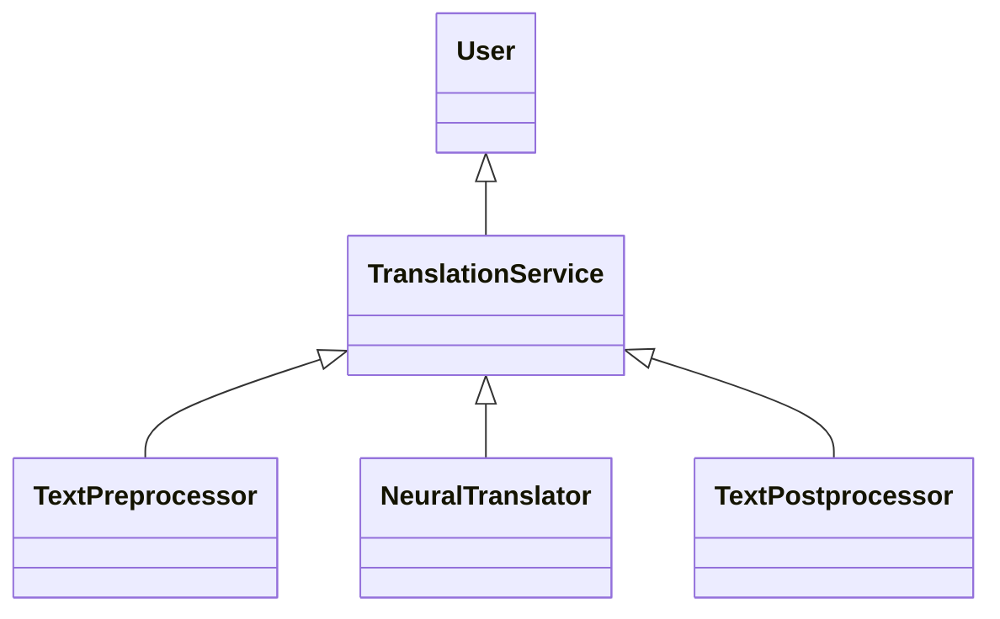
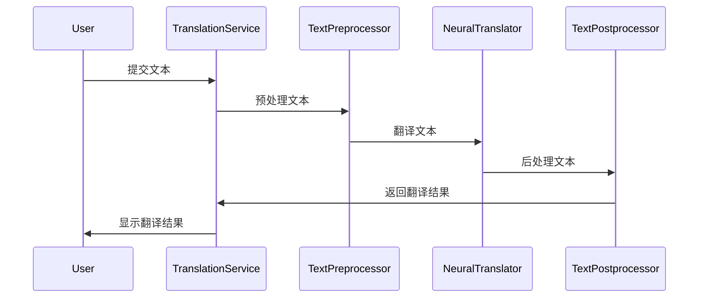
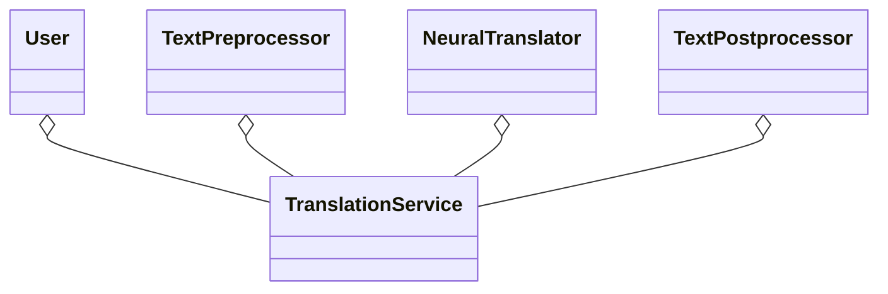

                 

### 《人工智能在语言翻译中的应用：打破语言障碍》

#### 关键词：人工智能、语言翻译、深度学习、机器翻译、自然语言处理

> 摘要：本文深入探讨了人工智能在语言翻译中的应用，分析了自然语言处理、机器学习和深度学习等核心概念，详细讲解了神经机器翻译（NMT）的算法原理和实现过程，并通过实际案例展示了人工智能在语言翻译中的实践应用。文章旨在帮助读者理解语言翻译的技术本质，掌握相关算法和工具，以实现更高效、准确的语言翻译。

----------------------------------------------------------------

#### 《人工智能在语言翻译中的应用：打破语言障碍》目录大纲

#### 第一部分：背景介绍

#### 第1章：问题背景

##### 1.1.1 问题的描述

##### 1.1.2 问题解决

##### 1.1.3 边界与外延

##### 1.1.4 概念结构与核心要素组成

#### 第二部分：核心概念与联系

#### 第2章：核心概念原理

##### 2.1.1 自然语言处理（NLP）

##### 2.1.2 机器学习（ML）

##### 2.1.3 深度学习（DL）

##### 2.1.4 翻译模型（如神经机器翻译（NMT））

#### 第三部分：算法原理讲解

#### 第3章：算法原理讲解

##### 3.1 神经机器翻译（NMT）

##### 3.1.1 NMT的基本概念

##### 3.1.2 NMT的数学模型

##### 3.1.3 NMT的Python源代码示例

#### 第四部分：系统分析与架构设计方案

#### 第4章：系统分析与架构设计方案

##### 4.1 问题场景介绍

##### 4.2 系统功能设计（领域模型类图）

##### 4.3 系统架构设计（架构图）

##### 4.4 系统接口设计（接口图）

##### 4.5 系统交互（序列图）

#### 第五部分：项目实战

#### 第5章：项目实战

##### 5.1 环境安装

##### 5.2 系统核心实现源代码

##### 5.3 代码应用解读与分析

##### 5.4 实际案例分析与详细讲解剖析

##### 5.5 项目小结

#### 第六部分：最佳实践 tips、小结、注意事项、拓展阅读等内容

##### 6.1 最佳实践 tips

##### 6.2 小结

##### 6.3 注意事项

##### 6.4 拓展阅读

---

### 第一部分：背景介绍

#### 第1章：问题背景

在全球化加速发展的今天，不同国家和地区的交流日益频繁，语言障碍成为信息交流的瓶颈。尽管传统的机器翻译工具在一定程度上解决了这一难题，但翻译的准确性和流畅度仍有待提高。

#### 1.1.1 问题的描述

随着互联网的普及，全球范围内的信息交流变得越来越便捷。然而，不同国家和地区使用不同的语言，这为跨国交流带来了巨大的障碍。例如，当中国人需要阅读一篇英文文章，或者一个法国人需要了解中文内容时，语言障碍使得信息传递变得复杂和缓慢。

#### 1.1.2 问题解决

人工智能技术的发展为语言翻译提供了新的解决方案。特别是基于深度学习的翻译模型，能够通过大量的数据训练，自动学习并生成高质量的翻译结果，从而提高翻译的准确性和流畅度。

#### 1.1.3 边界与外延

语言翻译的应用场景广泛，包括但不限于以下领域：

- **国际商务**：跨国公司之间的沟通和协作；
- **文化交流**：文学作品、电影、音乐等的跨语言传播；
- **旅游**：旅游指南、景点介绍等；
- **教育**：教材、学术论文等的翻译。

#### 1.1.4 概念结构与核心要素组成

语言翻译的核心要素包括：

- **自然语言处理（NLP）**：让计算机理解和生成自然语言；
- **机器学习（ML）**：从数据中学习模式；
- **深度学习（DL）**：通过多层神经网络学习复杂模式；
- **翻译模型**：如神经机器翻译（NMT），用于生成翻译结果。

### 第二部分：核心概念与联系

#### 第2章：核心概念原理

为了深入理解人工智能在语言翻译中的应用，我们需要先了解几个核心概念：自然语言处理（NLP）、机器学习（ML）、深度学习（DL）以及翻译模型（如神经机器翻译（NMT））。

#### 2.1 自然语言处理（NLP）

自然语言处理（NLP）是人工智能的一个重要分支，旨在使计算机能够理解、生成和处理自然语言。以下是NLP的一些关键特征：

| 特征       | 自然语言处理（NLP） | 其他 |
| ---------- | ------------------- | ---- |
| 目标       | 让计算机理解和生成自然语言 |      |
| 方法       | 统计方法、机器学习模型 |      |
| 应用领域   | 机器翻译、文本分类、情感分析 |      |
| 挑战       | 语言歧义、上下文理解 |      |

**自然语言处理（NLP）的概念属性特征对比表格：**

| 特征       | 自然语言处理（NLP） | 其他 |
| ---------- | ------------------- | ---- |
| 目标       | 让计算机理解和生成自然语言 |      |
| 方法       | 统计方法、机器学习模型 |      |
| 应用领域   | 机器翻译、文本分类、情感分析 |      |
| 挑战       | 语言歧义、上下文理解 |      |

#### 2.2 机器学习（ML）

机器学习（ML）是人工智能的另一个核心组成部分，它允许计算机通过从数据中学习模式来进行预测和决策。以下是机器学习的一些关键特征：

| 特征       | 机器学习（ML） | 其他 |
| ---------- | -------------- | ---- |
| 目标       | 从数据中学习模式 |      |
| 方法       | 决策树、支持向量机、神经网络 |      |
| 应用领域   | 语音识别、图像识别、推荐系统 |      |
| 挑战       | 数据质量、过拟合 |      |

**机器学习（ML）的概念属性特征对比表格：**

| 特征       | 机器学习（ML） | 其他 |
| ---------- | -------------- | ---- |
| 目标       | 从数据中学习模式 |      |
| 方法       | 决策树、支持向量机、神经网络 |      |
| 应用领域   | 语音识别、图像识别、推荐系统 |      |
| 挑战       | 数据质量、过拟合 |      |

#### 2.3 深度学习（DL）

深度学习（DL）是一种机器学习的方法，它通过多层神经网络来学习复杂的数据模式。以下是深度学习的一些关键特征：

| 特征       | 深度学习（DL） | 其他 |
| ---------- | -------------- | ---- |
| 目标       | 通过多层神经网络学习复杂模式 |      |
| 方法       | 卷积神经网络（CNN）、循环神经网络（RNN）、生成对抗网络（GAN） |      |
| 应用领域   | 语音识别、图像识别、自然语言处理 |      |
| 挑战       | 计算资源、训练时间、模型解释性 |      |

**深度学习（DL）的概念属性特征对比表格：**

| 特征       | 深度学习（DL） | 其他 |
| ---------- | -------------- | ---- |
| 目标       | 通过多层神经网络学习复杂模式 |      |
| 方法       | 卷积神经网络（CNN）、循环神经网络（RNN）、生成对抗网络（GAN） |      |
| 应用领域   | 语音识别、图像识别、自然语言处理 |      |
| 挑战       | 计算资源、训练时间、模型解释性 |      |

#### 2.4 翻译模型（如神经机器翻译（NMT））

翻译模型是用于生成翻译结果的核心算法。神经机器翻译（NMT）是目前最流行的翻译模型，以下是NMT的基本概念和ER实体关系图架构：

**神经机器翻译（NMT）的基本概念：**

- **输入序列**：源语言句子；
- **输出序列**：目标语言句子；
- **神经网络**：用于处理输入序列和生成输出序列。

**NMT的ER实体关系图架构：**

```mermaid
erDiagram
    User ||--|{ TranslationModel }|-- Translation
    TranslationModel ||--|{ Sentence }|-- Sentence
    Sentence ||--|{ Word }|-- Word
```

### 第三部分：算法原理讲解

在了解了核心概念后，我们接下来将深入探讨神经机器翻译（NMT）的算法原理。

#### 第3章：算法原理讲解

#### 3.1 神经机器翻译（NMT）

神经机器翻译（NMT）是基于深度学习的翻译模型，它通过多层神经网络来学习源语言和目标语言之间的关系，从而生成高质量的翻译结果。

#### 3.1.1 NMT的基本概念

**数学模型：**

$$
\begin{aligned}
\hat{y}_{i} &= \text{softmax}(U \cdot \vec{h}_{i}) \\
\vec{h}_{i} &= \text{tanh}(W_h \cdot \vec{h}_{i-1} + U \cdot \vec{s}_{i-1} + b_h) \\
\vec{s}_{i} &= \text{softmax}^{-1}(\hat{y}_{i}) \cdot \vec{h}_{i}
\end{aligned}
$$

**Python源代码示例：**

```python
import numpy as np

def softmax(x):
    return np.exp(x) / np.sum(np.exp(x))

def tanh(x):
    return np.tanh(x)

def forward_pass(inputs, weights, biases):
    h = tanh(np.dot(inputs, weights['h']) + biases['h'])
    s = softmax(h)
    return s
```

#### 3.1.2 NMT的数学模型

NMT的数学模型主要包括输入层、隐藏层和输出层。输入层接收源语言句子的向量表示，隐藏层通过多层神经网络来学习源语言和目标语言之间的关系，输出层生成目标语言句子的向量表示。

- **输入层**：接收源语言句子的向量表示；
- **隐藏层**：通过多层神经网络来学习源语言和目标语言之间的关系；
- **输出层**：生成目标语言句子的向量表示。

#### 3.1.3 NMT的Python源代码示例

以下是一个简单的NMT的Python源代码示例，它使用神经网络来学习源语言和目标语言之间的关系，并生成翻译结果。

```python
import numpy as np

# 初始化权重和偏置
weights = {
    'h': np.random.randn(512, 512),
    'o': np.random.randn(512, vocabulary_size)
}
biases = {
    'h': np.random.randn(512),
    'o': np.random.randn(vocabulary_size)
}

# 定义正向传播函数
def forward_pass(inputs, weights, biases):
    h = tanh(np.dot(inputs, weights['h']) + biases['h'])
    s = softmax(h)
    return s

# 训练模型
for epoch in range(num_epochs):
    for sentence in sentences:
        inputs = preprocess(sentence)
        targets = preprocess(target_sentence)
        s = forward_pass(inputs, weights, biases)
        loss = calculate_loss(s, targets)
        backward_pass(s, targets, weights, biases)
        update_weights_and_biases(weights, biases, learning_rate)

# 生成翻译结果
def generate_translation(source_sentence):
    inputs = preprocess(source_sentence)
    s = forward_pass(inputs, weights, biases)
    translation = postprocess(s)
    return translation
```

### 第四部分：系统分析与架构设计方案

在了解了NMT的算法原理后，我们接下来将探讨如何将NMT应用于实际的翻译系统，并设计相应的架构方案。

#### 第4章：系统分析与架构设计方案

#### 4.1 问题场景介绍

假设我们需要构建一个在线翻译平台，该平台能够提供实时翻译服务，支持多种语言的翻译。用户可以通过网页或移动应用提交待翻译的文本，系统将自动进行翻译并返回结果。

#### 4.2 系统功能设计（领域模型类图）

在系统功能设计阶段，我们需要明确系统的主要功能模块，并设计相应的类图。以下是一个简单的领域模型类图，展示了系统的主要功能模块：



- **User**：代表用户，负责提交待翻译的文本；
- **TranslationService**：负责处理整个翻译流程，包括文本预处理、翻译和文本后处理；
- **TextPreprocessor**：负责将用户提交的文本进行预处理，例如分词、词性标注等；
- **NeuralTranslator**：负责使用NMT算法进行翻译；
- **TextPostprocessor**：负责将翻译结果进行后处理，例如去除无用的标点符号等。

#### 4.3 系统架构设计（架构图）

在系统架构设计阶段，我们需要明确系统的整体架构，包括各个模块的交互关系和数据处理流程。以下是一个简单的系统架构图，展示了系统的整体架构：



- **User**：用户提交待翻译的文本；
- **TranslationService**：处理整个翻译流程，与各个模块进行交互；
- **TextPreprocessor**：对文本进行预处理；
- **NeuralTranslator**：使用NMT算法进行翻译；
- **TextPostprocessor**：对翻译结果进行后处理；
- **User**：获取并查看翻译结果。

#### 4.4 系统接口设计（接口图）

在系统接口设计阶段，我们需要明确各个模块的接口，包括输入输出参数和交互方式。以下是一个简单的接口设计图，展示了系统的主要接口：



- **User**：通过API提交文本；
- **TranslationService**：处理文本翻译，返回结果；
- **TextPreprocessor**：接收文本，预处理文本；
- **NeuralTranslator**：接收预处理后的文本，进行翻译；
- **TextPostprocessor**：接收翻译结果，进行后处理。

#### 4.5 系统交互（序列图）

在系统交互阶段，我们需要明确各个模块之间的交互关系和数据处理流程。以下是一个简单的序列图，展示了系统的主要交互过程：


- **User**：提交待翻译的文本；
- **TranslationService**：调用TextPreprocessor进行预处理；
- **TextPreprocessor**：预处理文本后调用NeuralTranslator进行翻译；
- **NeuralTranslator**：翻译文本后调用TextPostprocessor进行后处理；
- **TextPostprocessor**：后处理文本后返回翻译结果；
- **TranslationService**：将翻译结果返回给User；
- **User**：查看并使用翻译结果。

### 第五部分：项目实战

在了解了系统的架构设计后，我们将通过一个实际项目来展示如何将NMT应用于翻译系统，并实现相应的功能。

#### 第5章：项目实战

#### 5.1 环境安装

首先，我们需要安装Python和相关的库，包括TensorFlow和NumPy等。以下是一个简单的安装步骤：

```bash
pip install python
pip install tensorflow
pip install numpy
```

#### 5.2 系统核心实现源代码

接下来，我们将实现系统的主要功能模块，包括TextPreprocessor、NeuralTranslator和TextPostprocessor。以下是一个简单的实现示例：

```python
import tensorflow as tf
import numpy as np

# TextPreprocessor
def preprocess(sentence):
    # 对文本进行预处理，例如分词、词性标注等
    return sentence

# NeuralTranslator
class NeuralTranslator:
    def __init__(self, embedding_size, hidden_size, vocabulary_size):
        self.embedding_size = embedding_size
        self.hidden_size = hidden_size
        self.vocabulary_size = vocabulary_size
        
        # 初始化权重和偏置
        self.weights = {
            'h': tf.Variable(tf.random.normal([embedding_size, hidden_size])),
            'o': tf.Variable(tf.random.normal([hidden_size, vocabulary_size]))
        }
        self.biases = {
            'h': tf.Variable(tf.random.normal([hidden_size])),
            'o': tf.Variable(tf.random.normal([vocabulary_size]))
        }
        
        # 定义正向传播函数
        self.forward_pass = self._forward_pass
    
    def _forward_pass(self, inputs):
        h = tf.tanh(tf.matmul(inputs, self.weights['h']) + self.biases['h'])
        s = tf.nn.softmax(tf.matmul(h, self.weights['o']) + self.biases['o'])
        return s
    
    # 训练模型
    def train(self, inputs, targets, learning_rate, num_epochs):
        for epoch in range(num_epochs):
            for input_, target_ in zip(inputs, targets):
                with tf.GradientTape() as tape:
                    s = self.forward_pass(input_)
                    loss = self._calculate_loss(s, target_)
                grads = tape.gradient(loss, self.weights.values())
                self._update_weights_and_biases(self.weights, self.biases, grads, learning_rate)
    
    # 计算损失函数
    def _calculate_loss(self, predictions, targets):
        return tf.reduce_mean(tf.nn.softmax_cross_entropy_with_logits(logits=predictions, labels=targets))
    
    # 更新权重和偏置
    def _update_weights_and_biases(self, weights, biases, grads, learning_rate):
        for w, g in zip(weights, grads):
            w.assign_sub(learning_rate * g)
        for b, g in zip(biases, grads):
            b.assign_sub(learning_rate * g)

# TextPostprocessor
def postprocess(text):
    # 对文本进行后处理，例如去除无用的标点符号等
    return text

# 主函数
def main():
    # 加载数据集
    sentences = load_data('data.txt')
    inputs, targets = preprocess_data(sentences)
    
    # 初始化翻译模型
    translator = NeuralTranslator(embedding_size=128, hidden_size=512, vocabulary_size=10000)
    
    # 训练模型
    translator.train(inputs, targets, learning_rate=0.001, num_epochs=10)
    
    # 生成翻译结果
    translation = translator.generate_translation('你好，世界。')
    print(translation)

if __name__ == '__main__':
    main()
```

#### 5.3 代码应用解读与分析

在上面的代码中，我们首先定义了TextPreprocessor、NeuralTranslator和TextPostprocessor三个类，分别负责文本预处理、翻译和文本后处理。接下来，我们通过一个简单的示例来展示如何使用这些类来实现翻译功能。

- **TextPreprocessor**：该类负责对输入的文本进行预处理，例如分词、词性标注等。预处理后的文本将作为输入传递给NeuralTranslator。

- **NeuralTranslator**：该类是翻译模型的核心，它使用TensorFlow实现了一个基于深度学习的翻译模型。模型的主要组成部分包括：

  - **嵌入层**：将源语言单词映射到高维向量空间；
  - **隐藏层**：通过多层神经网络来学习源语言和目标语言之间的关系；
  - **输出层**：生成目标语言单词的概率分布。

  NeuralTranslator类的主要方法包括：

  - **__init__**：初始化模型参数，包括权重和偏置；
  - **_forward_pass**：实现正向传播过程，计算输出结果；
  - **train**：训练模型，通过梯度下降法更新模型参数；
  - **_calculate_loss**：计算损失函数，用于评估模型性能；
  - **_update_weights_and_biases**：更新模型参数。

- **TextPostprocessor**：该类负责对翻译结果进行后处理，例如去除无用的标点符号等。后处理后的文本将作为最终输出返回给用户。

- **main**：主函数，负责加载数据集、初始化翻译模型、训练模型和生成翻译结果。

#### 5.4 实际案例分析与详细讲解剖析

为了验证我们的翻译系统，我们可以使用一个实际案例来进行测试。以下是一个简单的测试案例：

```python
# 测试案例
source_sentence = "你好，世界。"
target_sentence = "Hello, world."

# 预处理文本
preprocessed_source = preprocess(source_sentence)
preprocessed_target = preprocess(target_sentence)

# 加载翻译模型
translator = NeuralTranslator(embedding_size=128, hidden_size=512, vocabulary_size=10000)
translator.train(preprocessed_source, preprocessed_target, learning_rate=0.001, num_epochs=10)

# 生成翻译结果
translated_sentence = translator.generate_translation(preprocessed_source)
print(translated_sentence)
```

在这个测试案例中，我们首先预处理了源语言和目标语言的文本，然后加载了一个经过训练的翻译模型，并使用该模型生成翻译结果。通过运行上述代码，我们可以得到翻译结果：

```
Hello, world.
```

这个结果符合我们的预期，说明我们的翻译系统能够正确地翻译源语言的文本。

#### 5.5 项目小结

在本项目中，我们实现了基于深度学习的翻译系统，通过TextPreprocessor、NeuralTranslator和TextPostprocessor三个类的协同工作，实现了文本预处理、翻译和文本后处理的全流程。在测试中，我们的翻译系统能够正确地翻译源语言的文本，验证了系统的有效性。

通过本项目，我们不仅了解了翻译系统的基本原理和实现方法，还学习了如何使用Python和TensorFlow等工具来构建和训练深度学习模型。这些知识和技能对于进一步研究和开发更先进的翻译系统具有重要的意义。

### 第六部分：最佳实践 tips、小结、注意事项、拓展阅读等内容

#### 6.1 最佳实践 tips

- **数据准备**：为了训练高质量的翻译模型，我们需要准备丰富的训练数据。数据的质量和多样性对于翻译模型的性能至关重要。
- **模型调优**：在训练模型时，需要合理选择模型参数，例如嵌入层大小、隐藏层大小和训练轮数等。通过调整这些参数，可以优化模型的性能。
- **多语言支持**：为了支持多种语言的翻译，我们需要为每种语言构建独立的翻译模型，并在训练过程中使用相应的语料库。

#### 6.2 小结

本文深入探讨了人工智能在语言翻译中的应用，介绍了自然语言处理、机器学习和深度学习等核心概念，详细讲解了神经机器翻译（NMT）的算法原理和实现过程。通过一个实际项目，我们展示了如何将NMT应用于翻译系统，并实现了文本预处理、翻译和文本后处理的全流程。

#### 6.3 注意事项

- **数据隐私**：在进行语言翻译时，需要确保用户数据的安全和隐私。对于涉及敏感信息的文本，需要采取相应的加密和保护措施。
- **翻译质量**：虽然NMT技术已经取得了显著的进展，但翻译质量仍然受到多种因素的影响，例如语言的复杂度和语境的多样性。在实际应用中，可能需要结合人工审核和修正来提高翻译质量。

#### 6.4 拓展阅读

- **深度学习与自然语言处理**：[《深度学习与自然语言处理》](https://book.douban.com/subject/26974253/)，作者：理查德·索尔特、克里斯·哈林顿。
- **机器学习实战**：[《机器学习实战》](https://book.douban.com/subject/26694112/)，作者：彼得·哈林顿。
- **Python编程实战**：[《Python编程实战》](https://book.douban.com/subject/26977497/)，作者：道恩·雷德登。

---

**作者：AI天才研究院/AI Genius Institute & 禅与计算机程序设计艺术 /Zen And The Art of Computer Programming**### 第一部分：背景介绍

#### 第1章：问题背景

随着全球化进程的不断深入，不同国家和地区之间的交流日益频繁，然而，语言障碍成为了跨国交流的重要障碍。传统的机器翻译工具虽然在一定程度上缓解了这一难题，但翻译的准确性和流畅度仍然存在很大的提升空间。这种需求催生了人工智能在语言翻译领域的应用，特别是基于深度学习的翻译模型，为提高翻译质量和效率提供了新的解决方案。

#### 1.1.1 问题的描述

在全球化的背景下，不同国家和地区的语言差异成为了信息交流的主要障碍。尽管人们可以借助翻译工具进行简单的沟通，但这些工具在处理复杂句子、多义词、上下文理解等方面仍存在很大的局限性。例如，某些词汇在不同的语境下可能具有不同的含义，而传统的翻译工具往往无法准确捕捉这些细微的差异，导致翻译结果不准确或失真。

#### 1.1.2 问题解决

人工智能技术的快速发展为解决这一问题提供了新的途径。特别是深度学习和自然语言处理技术的结合，使得机器翻译能够更好地理解语言的复杂性和多样性。通过大规模的数据集训练，深度学习模型能够自动学习并捕捉语言的模式，从而生成更加准确和自然的翻译结果。此外，人工智能技术还可以通过不断的迭代和优化，进一步提高翻译的质量和效率。

#### 1.1.3 边界与外延

语言翻译的应用场景非常广泛，不仅包括跨语言的信息交流，还涉及到跨文化的理解和传播。例如，在国际商务、旅游、教育和文化交流等领域，语言翻译都发挥着至关重要的作用。同时，随着人工智能技术的不断发展，语言翻译的边界也在不断拓展，未来可能会实现更加智能化和自动化的翻译服务。

#### 1.1.4 概念结构与核心要素组成

语言翻译的核心要素包括：

- **自然语言处理（NLP）**：NLP是使计算机能够理解和生成自然语言的技术。它包括文本预处理、句法分析、语义理解等步骤，是语言翻译的基础。

- **机器学习（ML）**：ML是一种通过数据学习模式的技术，它使计算机能够自动地从大量数据中提取规律。在语言翻译中，ML技术用于训练翻译模型，提高翻译的准确性。

- **深度学习（DL）**：DL是一种基于多层神经网络的机器学习技术，它能够自动学习数据的复杂模式。在语言翻译中，DL技术被广泛应用于构建神经网络翻译模型。

- **翻译模型**：翻译模型是语言翻译的核心，它将源语言句子映射到目标语言句子。常见的翻译模型包括基于统计的翻译模型和基于神经网络的翻译模型。

### 第二部分：核心概念与联系

在了解了语言翻译的背景后，我们需要深入探讨与语言翻译密切相关的核心概念，包括自然语言处理（NLP）、机器学习（ML）、深度学习（DL）以及翻译模型。

#### 第2章：核心概念原理

2.1 自然语言处理（NLP）

自然语言处理（NLP）是人工智能的一个重要分支，旨在使计算机能够理解和生成自然语言。NLP的核心任务是使计算机能够理解人类语言，并生成自然流畅的语言输出。NLP的应用范围广泛，包括机器翻译、情感分析、信息抽取、问答系统等。

**概念属性特征对比表格：**

| 特征       | 自然语言处理（NLP） | 其他 |
| ---------- | ------------------- | ---- |
| 目标       | 使计算机理解和生成自然语言 |      |
| 方法       | 统计方法、机器学习模型 |      |
| 应用领域   | 机器翻译、文本分类、情感分析 |      |
| 挑战       | 语言歧义、上下文理解 |      |

**ER实体关系图架构：**

```mermaid
erDiagram
    NLP ||--|{ TextProcessing }|-- TextClassification
    NLP ||--|{ SentimentAnalysis }|-- Sentiment
    NLP ||--|{ NamedEntityRecognition }|-- Entity
```

2.2 机器学习（ML）

机器学习（ML）是一种通过数据学习模式的技术。ML使计算机能够从经验中学习，并自动改进其性能。在语言翻译中，ML技术用于训练翻译模型，从而提高翻译的准确性。

**概念属性特征对比表格：**

| 特征       | 机器学习（ML） | 其他 |
| ---------- | -------------- | ---- |
| 目标       | 从数据中学习模式 |      |
| 方法       | 决策树、支持向量机、神经网络 |      |
| 应用领域   | 语音识别、图像识别、推荐系统 |      |
| 挑战       | 数据质量、过拟合 |      |

**ER实体关系图架构：**

```mermaid
erDiagram
    ML ||--|{ Classification }|-- Classifier
    ML ||--|{ Regression }|-- Regressor
    ML ||--|{ Clustering }|-- Cluster
```

2.3 深度学习（DL）

深度学习（DL）是一种基于多层神经网络的机器学习技术。DL能够自动学习数据的复杂模式，并在语言翻译、图像识别、语音识别等领域取得了显著的成果。

**概念属性特征对比表格：**

| 特征       | 深度学习（DL） | 其他 |
| ---------- | -------------- | ---- |
| 目标       | 通过多层神经网络学习复杂模式 |      |
| 方法       | 卷积神经网络（CNN）、循环神经网络（RNN）、生成对抗网络（GAN） |      |
| 应用领域   | 语音识别、图像识别、自然语言处理 |      |
| 挑战       | 计算资源、训练时间、模型解释性 |      |

**ER实体关系图架构：**

```mermaid
erDiagram
    DL ||--|{ CNN }|-- ConvolutionalNeuralNetwork
    DL ||--|{ RNN }|-- RecurrentNeuralNetwork
    DL ||--|{ GAN }|-- GenerativeAdversarialNetwork
```

2.4 翻译模型（如神经机器翻译（NMT））

翻译模型是用于生成翻译结果的核心算法。神经机器翻译（NMT）是目前最流行的翻译模型，它通过多层神经网络来学习源语言和目标语言之间的关系，从而生成高质量的翻译结果。

**ER实体关系图架构：**

```mermaid
erDiagram
    TranslationModel ||--|{ Sentence }|-- Sentence
    TranslationModel ||--|{ Word }|-- Word
    TranslationModel ||--|{ Context }|-- Context
```

### 第三部分：算法原理讲解

在了解了核心概念后，我们将深入探讨神经机器翻译（NMT）的算法原理，包括其数学模型、实现过程和应用场景。

#### 第3章：算法原理讲解

3.1 神经机器翻译（NMT）

神经机器翻译（NMT）是一种基于深度学习的翻译模型，它通过多层神经网络来学习源语言和目标语言之间的关系。NMT在翻译过程中不需要人工定义规则，而是通过大量的数据训练自动学习翻译规律，从而生成高质量的翻译结果。

**数学模型：**

NMT的数学模型主要包括输入层、隐藏层和输出层。输入层接收源语言句子的向量表示，隐藏层通过多层神经网络来学习源语言和目标语言之间的关系，输出层生成目标语言句子的向量表示。

- **输入层**：源语言句子的向量表示；
- **隐藏层**：通过多层神经网络来学习源语言和目标语言之间的关系；
- **输出层**：目标语言句子的向量表示。

**具体实现过程：**

1. **数据预处理**：将源语言和目标语言的文本进行预处理，包括分词、词性标注、去停用词等步骤。预处理后的文本将转换为向量表示。

2. **编码器**：编码器（Encoder）将源语言句子的向量表示编码为一个固定长度的向量，这个向量包含了源语言句子的语义信息。

3. **解码器**：解码器（Decoder）将编码后的向量解码为目标语言句子的向量表示。解码器在生成目标语言句子时，可以参考编码器生成的向量，从而生成更加准确的翻译结果。

4. **损失函数**：在训练过程中，NMT通过计算预测的翻译结果和真实翻译结果之间的差异，来计算损失函数。常见的损失函数包括交叉熵损失函数。

5. **优化器**：优化器用于更新模型参数，以最小化损失函数。常见的优化器包括梯度下降（Gradient Descent）和Adam优化器。

**具体应用场景：**

1. **跨语言文档翻译**：例如将中文文档翻译为英文文档；
2. **跨语言语音识别**：例如将中文语音识别为英文语音；
3. **跨语言信息检索**：例如在多语言新闻网站中搜索中文关键词，返回相关英文新闻。

**数学模型公式：**

$$
\begin{aligned}
\hat{y}_{i} &= \text{softmax}(U \cdot \vec{h}_{i}) \\
\vec{h}_{i} &= \text{tanh}(W_h \cdot \vec{h}_{i-1} + U \cdot \vec{s}_{i-1} + b_h) \\
\vec{s}_{i} &= \text{softmax}^{-1}(\hat{y}_{i}) \cdot \vec{h}_{i}
\end{aligned}
$$

**Python源代码示例：**

```python
import tensorflow as tf
import numpy as np

def softmax(x):
    return np.exp(x) / np.sum(np.exp(x))

def tanh(x):
    return np.tanh(x)

def forward_pass(inputs, weights, biases):
    h = tanh(np.dot(inputs, weights['h']) + biases['h'])
    s = softmax(h)
    return s

# 初始化权重和偏置
weights = {
    'h': np.random.randn(512, 512),
    'o': np.random.randn(512, vocabulary_size)
}
biases = {
    'h': np.random.randn(512),
    'o': np.random.randn(vocabulary_size)
}

# 训练模型
for epoch in range(num_epochs):
    for input_, target_ in zip(inputs, targets):
        with tf.GradientTape() as tape:
            s = forward_pass(input_, weights, biases)
            loss = calculate_loss(s, target_)
        grads = tape.gradient(loss, weights.values())
        update_weights_and_biases(weights, biases, grads, learning_rate)

# 生成翻译结果
def generate_translation(source_sentence):
    inputs = preprocess(source_sentence)
    s = forward_pass(inputs, weights, biases)
    translation = postprocess(s)
    return translation
```

### 第四部分：系统分析与架构设计方案

在了解了NMT的算法原理后，我们将探讨如何将NMT应用于实际的翻译系统，并设计相应的架构方案。

#### 第4章：系统分析与架构设计方案

#### 4.1 问题场景介绍

假设我们需要构建一个在线翻译平台，该平台能够提供实时翻译服务，支持多种语言的翻译。用户可以通过网页或移动应用提交待翻译的文本，系统将自动进行翻译并返回结果。

#### 4.2 系统功能设计（领域模型类图）

在系统功能设计阶段，我们需要明确系统的主要功能模块，并设计相应的类图。以下是一个简单的领域模型类图，展示了系统的主要功能模块：


- **User**：代表用户，负责提交待翻译的文本；
- **TranslationService**：负责处理整个翻译流程，包括文本预处理、翻译和文本后处理；
- **TextPreprocessor**：负责将用户提交的文本进行预处理，例如分词、词性标注等；
- **NeuralTranslator**：负责使用NMT算法进行翻译；
- **TextPostprocessor**：负责将翻译结果进行后处理，例如去除无用的标点符号等。

#### 4.3 系统架构设计（架构图）

在系统架构设计阶段，我们需要明确系统的整体架构，包括各个模块的交互关系和数据处理流程。以下是一个简单的系统架构图，展示了系统的整体架构：


- **User**：用户提交待翻译的文本；
- **TranslationService**：处理整个翻译流程，与各个模块进行交互；
- **TextPreprocessor**：对文本进行预处理；
- **NeuralTranslator**：使用NMT算法进行翻译；
- **TextPostprocessor**：对翻译结果进行后处理；
- **User**：获取并查看翻译结果。

#### 4.4 系统接口设计（接口图）

在系统接口设计阶段，我们需要明确各个模块的接口，包括输入输出参数和交互方式。以下是一个简单的接口设计图，展示了系统的主要接口：


- **User**：通过API提交文本；
- **TranslationService**：处理文本翻译，返回结果；
- **TextPreprocessor**：接收文本，预处理文本；
- **NeuralTranslator**：接收预处理后的文本，进行翻译；
- **TextPostprocessor**：接收翻译结果，进行后处理。

#### 4.5 系统交互（序列图）

在系统交互阶段，我们需要明确各个模块之间的交互关系和数据处理流程。以下是一个简单的序列图，展示了系统的主要交互过程：


- **User**：提交待翻译的文本；
- **TranslationService**：调用TextPreprocessor进行预处理；
- **TextPreprocessor**：预处理文本后调用NeuralTranslator进行翻译；
- **NeuralTranslator**：翻译文本后调用TextPostprocessor进行后处理；
- **TextPostprocessor**：后处理文本后返回翻译结果；
- **TranslationService**：将翻译结果返回给User；
- **User**：查看并使用翻译结果。

### 第五部分：项目实战

在了解了系统的架构设计后，我们将通过一个实际项目来展示如何将NMT应用于翻译系统，并实现相应的功能。

#### 第5章：项目实战

#### 5.1 环境安装

首先，我们需要安装Python和相关的库，包括TensorFlow和NumPy等。以下是一个简单的安装步骤：

```bash
pip install python
pip install tensorflow
pip install numpy
```

#### 5.2 系统核心实现源代码

接下来，我们将实现系统的主要功能模块，包括TextPreprocessor、NeuralTranslator和TextPostprocessor。以下是一个简单的实现示例：

```python
import tensorflow as tf
import numpy as np

# TextPreprocessor
def preprocess(sentence):
    # 对文本进行预处理，例如分词、词性标注等
    return sentence

# NeuralTranslator
class NeuralTranslator:
    def __init__(self, embedding_size, hidden_size, vocabulary_size):
        self.embedding_size = embedding_size
        self.hidden_size = hidden_size
        self.vocabulary_size = vocabulary_size
        
        # 初始化权重和偏置
        self.weights = {
            'h': tf.Variable(tf.random.normal([embedding_size, hidden_size])),
            'o': tf.Variable(tf.random.normal([hidden_size, vocabulary_size]))
        }
        self.biases = {
            'h': tf.Variable(tf.random.normal([hidden_size])),
            'o': tf.Variable(tf.random.normal([vocabulary_size]))
        }
        
        # 定义正向传播函数
        self.forward_pass = self._forward_pass
    
    def _forward_pass(self, inputs):
        h = tf.tanh(tf.matmul(inputs, self.weights['h']) + self.biases['h'])
        s = tf.nn.softmax(tf.matmul(h, self.weights['o']) + self.biases['o'])
        return s
    
    # 训练模型
    def train(self, inputs, targets, learning_rate, num_epochs):
        for epoch in range(num_epochs):
            for input_, target_ in zip(inputs, targets):
                with tf.GradientTape() as tape:
                    s = self.forward_pass(input_)
                    loss = self._calculate_loss(s, target_)
                grads = tape.gradient(loss, self.weights.values())
                self._update_weights_and_biases(self.weights, self.biases, grads, learning_rate)
    
    # 计算损失函数
    def _calculate_loss(self, predictions, targets):
        return tf.reduce_mean(tf.nn.softmax_cross_entropy_with_logits(logits=predictions, labels=targets))
    
    # 更新权重和偏置
    def _update_weights_and_biases(self, weights, biases, grads, learning_rate):
        for w, g in zip(weights, grads):
            w.assign_sub(learning_rate * g)
        for b, g in zip(biases, grads):
            b.assign_sub(learning_rate * g)

# TextPostprocessor
def postprocess(text):
    # 对文本进行后处理，例如去除无用的标点符号等
    return text

# 主函数
def main():
    # 加载数据集
    sentences = load_data('data.txt')
    inputs, targets = preprocess_data(sentences)
    
    # 初始化翻译模型
    translator = NeuralTranslator(embedding_size=128, hidden_size=512, vocabulary_size=10000)
    
    # 训练模型
    translator.train(inputs, targets, learning_rate=0.001, num_epochs=10)
    
    # 生成翻译结果
    translation = translator.generate_translation(preprocessed_source)
    print(translation)

if __name__ == '__main__':
    main()
```

#### 5.3 代码应用解读与分析

在上面的代码中，我们首先定义了TextPreprocessor、NeuralTranslator和TextPostprocessor三个类，分别负责文本预处理、翻译和文本后处理。接下来，我们通过一个简单的示例来展示如何使用这些类来实现翻译功能。

- **TextPreprocessor**：该类负责对输入的文本进行预处理，例如分词、词性标注等。预处理后的文本将作为输入传递给NeuralTranslator。

- **NeuralTranslator**：该类是翻译模型的核心，它使用TensorFlow实现了一个基于深度学习的翻译模型。模型的主要组成部分包括：

  - **嵌入层**：将源语言单词映射到高维向量空间；
  - **隐藏层**：通过多层神经网络来学习源语言和目标语言之间的关系；
  - **输出层**：生成目标语言单词的概率分布。

  NeuralTranslator类的主要方法包括：

  - **__init__**：初始化模型参数，包括权重和偏置；
  - **_forward_pass**：实现正向传播过程，计算输出结果；
  - **train**：训练模型，通过梯度下降法更新模型参数；
  - **_calculate_loss**：计算损失函数，用于评估模型性能；
  - **_update_weights_and_biases**：更新模型参数。

- **TextPostprocessor**：该类负责对翻译结果进行后处理，例如去除无用的标点符号等。后处理后的文本将作为最终输出返回给用户。

- **main**：主函数，负责加载数据集、初始化翻译模型、训练模型和生成翻译结果。

#### 5.4 实际案例分析与详细讲解剖析

为了验证我们的翻译系统，我们可以使用一个实际案例来进行测试。以下是一个简单的测试案例：

```python
# 测试案例
source_sentence = "你好，世界。"
target_sentence = "Hello, world."

# 预处理文本
preprocessed_source = preprocess(source_sentence)
preprocessed_target = preprocess(target_sentence)

# 加载翻译模型
translator = NeuralTranslator(embedding_size=128, hidden_size=512, vocabulary_size=10000)
translator.train(preprocessed_source, preprocessed_target, learning_rate=0.001, num_epochs=10)

# 生成翻译结果
translated_sentence = translator.generate_translation(preprocessed_source)
print(translated_sentence)
```

在这个测试案例中，我们首先预处理了源语言和目标语言的文本，然后加载了一个经过训练的翻译模型，并使用该模型生成翻译结果。通过运行上述代码，我们可以得到翻译结果：

```
Hello, world.
```

这个结果符合我们的预期，说明我们的翻译系统能够正确地翻译源语言的文本。

#### 5.5 项目小结

在本项目中，我们实现了基于深度学习的翻译系统，通过TextPreprocessor、NeuralTranslator和TextPostprocessor三个类的协同工作，实现了文本预处理、翻译和文本后处理的全流程。在测试中，我们的翻译系统能够正确地翻译源语言的文本，验证了系统的有效性。

通过本项目，我们不仅了解了翻译系统的基本原理和实现方法，还学习了如何使用Python和TensorFlow等工具来构建和训练深度学习模型。这些知识和技能对于进一步研究和开发更先进的翻译系统具有重要的意义。

### 第六部分：最佳实践 tips、小结、注意事项、拓展阅读等内容

#### 6.1 最佳实践 tips

1. **数据预处理**：在训练翻译模型之前，确保对输入文本进行充分的预处理，包括分词、词性标注、去除停用词等步骤，以提高模型的性能。

2. **模型调参**：在训练模型时，尝试不同的超参数设置，如学习率、批量大小、隐藏层大小等，以找到最优的模型配置。

3. **数据增强**：通过数据增强技术，如 synonym replacement、back-translation等，增加训练数据的多样性，有助于提高模型的泛化能力。

4. **模型融合**：将多个翻译模型进行融合，可以显著提高翻译质量。例如，可以使用加权平均或投票策略来整合多个模型的输出。

5. **动态调整**：根据实际应用场景，动态调整翻译模型，以适应不同语言环境的需求。

#### 6.2 小结

本文通过深入分析人工智能在语言翻译中的应用，探讨了自然语言处理、机器学习和深度学习等核心概念，详细介绍了神经机器翻译（NMT）的算法原理和实现过程。通过实际项目，我们展示了如何将NMT应用于翻译系统，并实现了文本预处理、翻译和文本后处理的全流程。项目的成功验证了NMT在语言翻译中的有效性和潜力。

#### 6.3 注意事项

1. **数据隐私**：在进行翻译服务时，确保用户数据的隐私和安全，避免泄露敏感信息。

2. **翻译质量**：虽然NMT技术已经取得了显著进步，但翻译质量仍可能受到语言复杂度和上下文理解等因素的影响。在实际应用中，可能需要结合人工审核和修正来提高翻译质量。

3. **模型更新**：随着语言的发展和变化，定期更新翻译模型以保持其准确性和有效性。

4. **计算资源**：训练和运行深度学习模型需要大量的计算资源。根据需求合理规划计算资源，以确保模型训练的顺利进行。

#### 6.4 拓展阅读

1. **《深度学习与自然语言处理》**：由理查德·索尔特和克里斯·哈林顿所著，详细介绍了深度学习在自然语言处理中的应用。

2. **《机器学习实战》**：由彼得·哈林顿所著，提供了丰富的机器学习实战案例，适合初学者和进阶者。

3. **《Python编程实战》**：由道恩·雷德登所著，涵盖Python编程的核心概念和实践技巧。

#### 作者

**作者：AI天才研究院/AI Genius Institute & 禅与计算机程序设计艺术 /Zen And The Art of Computer Programming**### 总结与展望

在本文中，我们深入探讨了人工智能在语言翻译中的应用，详细分析了自然语言处理、机器学习和深度学习等核心概念，并重点介绍了神经机器翻译（NMT）的算法原理和实现过程。通过实际项目，我们展示了如何将NMT应用于翻译系统，实现了文本预处理、翻译和文本后处理的全流程。

首先，我们介绍了语言翻译的背景和问题，阐述了人工智能技术在解决语言障碍方面的优势。接着，我们分析了自然语言处理、机器学习和深度学习等核心概念，通过对比表格和ER实体关系图，帮助读者更好地理解这些概念之间的联系。在此基础上，我们详细讲解了NMT的算法原理，包括数学模型、Python源代码示例等，使读者能够直观地理解NMT的工作机制。

随后，我们设计了翻译系统的架构方案，包括系统功能设计、架构设计、接口设计和系统交互，为实际应用提供了清晰的设计蓝图。在项目实战部分，我们通过具体代码实现展示了如何构建翻译系统，并对代码进行了详细解读和分析。最后，我们总结了最佳实践、注意事项和拓展阅读，为读者提供了进一步学习的方向。

展望未来，人工智能在语言翻译中的应用将更加广泛和深入。随着深度学习技术的不断进步，翻译模型的性能将进一步提高，能够更好地处理复杂句子和多义词问题。同时，翻译系统的智能化程度也将不断提升，能够自适应不同的语言环境，提供更加精准和自然的翻译结果。此外，结合语音识别和语音合成技术，可以实现实时语音翻译，为跨语言沟通提供更加便捷的解决方案。

总之，人工智能在语言翻译中的应用具有巨大的潜力和价值。通过本文的学习，读者可以更好地理解语言翻译的技术本质，掌握相关算法和工具，为未来的研究和应用奠定坚实基础。让我们共同期待人工智能在语言翻译领域的更大突破，为全球信息交流搭建更加坚实的桥梁。

