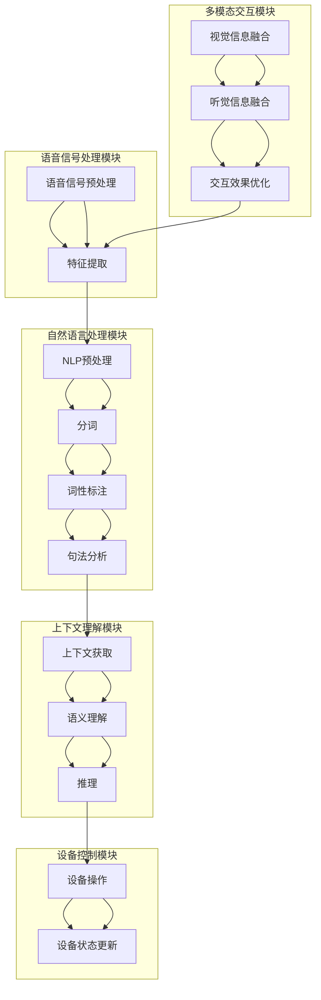
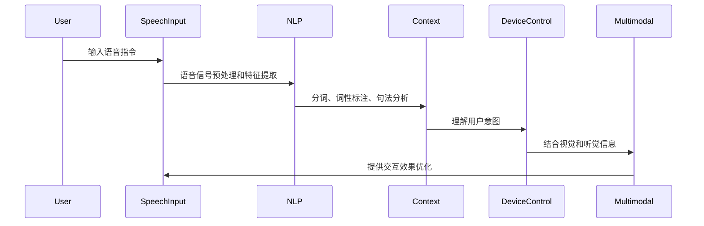

                 

# 人工智能在语音助手中的自然交互应用

## 关键词：人工智能、语音助手、自然交互、语音识别、自然语言处理

## 摘要：
本文将深入探讨人工智能在语音助手中的应用，特别是自然交互的实现。我们将从背景介绍、核心概念与联系、算法原理讲解、系统分析与架构设计、项目实战等方面，逐步剖析语音助手如何通过人工智能技术实现与用户的自然交互。

## 第一部分：背景介绍

### 1.1 问题背景

随着人工智能技术的快速发展，语音助手作为一种智能交互工具，正逐渐成为我们日常生活的一部分。从早期的简单语音命令执行，到如今复杂多变的自然交互，语音助手的应用场景越来越广泛。而在这一过程中，自然交互的重要性日益凸显。

自然交互指的是在语音助手的帮助下，用户能够像与真实人类对话一样，顺畅地表达自己的需求和意图。这种交互方式不仅提高了用户体验，也使得语音助手更加智能化和人性化。

### 1.2 问题描述

语音助手如何实现自然交互呢？这涉及到多个关键技术挑战：

1. **语音识别**：将用户的语音输入准确转化为文本。
2. **自然语言处理**：理解文本中的语义，识别用户的意图。
3. **上下文理解**：根据用户的交互历史，提供相关且有价值的回复。
4. **多模态交互设计**：结合视觉和听觉信息，提供更加丰富的交互体验。

### 1.3 问题解决

为了解决上述问题，人工智能技术发挥了关键作用。我们主要从以下几个方面进行探讨：

1. **语音识别与自然语言处理**：通过深度学习和神经网络技术，实现对语音信号和文本的精确处理。
2. **上下文理解与生成**：利用自然语言处理技术，理解用户的上下文信息，并生成合适的回复。
3. **多模态交互设计**：结合视觉和听觉信息，提高语音助手的交互效果和用户体验。

### 1.4 边界与外延

语音助手的类型多种多样，包括智能家居助手、车载助手、手机助手等。自然交互的技术边界也在不断拓展，例如情感交互、多轮对话等。未来，随着人工智能技术的进步，语音助手将更加智能化和个性化，为用户提供更加出色的交互体验。

### 1.5 概念结构与核心要素组成

要实现自然交互，我们需要关注以下几个核心要素：

1. **语音识别**：将语音信号转化为文本。
2. **自然语言处理**：理解文本语义，识别用户意图。
3. **上下文理解**：理解用户上下文信息，提供相关回复。
4. **多模态交互设计**：结合视觉和听觉信息，提高交互效果。

## 第二部分：核心概念与联系

### 2.1 语音识别

#### 2.1.1 定义与工作原理

语音识别是将语音信号转化为文本的过程。其工作原理主要包括三个步骤：

1. **语音信号预处理**：对采集到的语音信号进行降噪、归一化等处理。
2. **特征提取**：从预处理后的语音信号中提取出有效的语音特征。
3. **模型训练与识别**：利用深度学习模型对特征进行训练，并进行语音识别。

#### 2.1.2 属性特征对比表格

| 特征         | 离散余弦变换 | 频率分析         | |
| ------------ | ------------ | ---------------- | |
| 应用场景     | 声音压缩     | 语音识别         | |
| 原理         | 基于余弦变换 | 基于频率分析     | |

### 2.2 自然语言处理

#### 2.2.1 定义与工作原理

自然语言处理是研究如何让计算机理解、生成和处理自然语言的技术。其工作原理主要包括以下两个方面：

1. **语言模型**：建立对语言概率分布的模型，用于预测下一个词的可能性。
2. **词汇与语法分析**：对文本进行词汇和语法分析，理解文本的语义和结构。

#### 2.2.2 概念属性特征对比表格

| 概念         | 语言模型    | 词汇与语法分析 | |
| ------------ | ---------- | -------------- | |
| 应用场景     | 语音识别与生成 | 文本分析     | |
| 原理         | 基于统计模型 | 基于规则与统计 | |

### 2.3 上下文理解

#### 2.3.1 定义与工作原理

上下文理解是理解用户当前交互过程中的上下文信息，从而提供相关且有价值的回复。其工作原理主要包括以下两个方面：

1. **上下文信息的获取**：从用户的历史交互记录和当前交互内容中提取上下文信息。
2. **语义理解与推理**：利用自然语言处理技术，对上下文信息进行理解和推理。

#### 2.3.2 ER实体关系图架构的 Mermaid 流程图

```mermaid
erDiagram
    User -->|交互| Dialogue
    Dialogue ||--|包含| Context
```

### 2.4 多模态交互设计

#### 2.4.1 定义与工作原理

多模态交互设计是结合视觉和听觉信息，提供更加丰富的交互体验。其工作原理主要包括以下两个方面：

1. **视觉信息融合**：通过图像处理技术，从视觉信息中提取有用的信息。
2. **听觉信息融合**：通过语音识别技术，从听觉信息中提取有用的信息。

#### 2.4.2 概念属性特征对比表格

| 概念         | 视觉信息融合 | 听觉信息融合 | |
| ------------ | ------------ | ------------ | |
| 应用场景     | 视频会议     | 语音助手     | |
| 原理         | 基于图像处理 | 基于声学模型 | |

## 第三部分：算法原理讲解

### 3.1 语音识别算法

#### 3.1.1 算法Mermaid流程图


#### 3.1.2 Python源代码实现

```python
import numpy as np

# 语音信号预处理
def preprocess_signal(signal):
    # ... 预处理操作 ...

# 特征提取
def extract_features(signal):
    # ... 特征提取操作 ...

# 模型训练
def train_model(features, labels):
    # ... 模型训练操作 ...

# 识别结果
def recognize(signal):
    # ... 识别操作 ...

# 测试
signal = np.random.rand(1000)
preprocessed_signal = preprocess_signal(signal)
features = extract_features(preprocessed_signal)
labels = train_model(features)
result = recognize(features)
print(result)
```

#### 3.1.3 算法原理详细讲解

- **语音信号预处理**：将采集到的语音信号进行降噪、归一化等处理，以提高后续处理的准确性和效率。
- **特征提取**：从预处理后的语音信号中提取出有效的语音特征，如频谱特征、倒谱特征等。
- **模型训练**：利用深度学习模型（如卷积神经网络、循环神经网络等）对特征进行训练，建立语音识别模型。
- **识别结果**：将输入的语音信号经过模型处理，输出对应的文本结果。

### 3.2 自然语言处理

#### 3.2.1 语言模型

语言模型是自然语言处理的核心组成部分，用于预测下一个词的可能性。常见的语言模型有：

- **N-gram模型**：基于历史n个词的概率分布进行预测。
- **神经网络语言模型**：基于深度学习技术，如循环神经网络（RNN）、长短期记忆网络（LSTM）等。

#### 3.2.2 词汇与语法分析

词汇与语法分析是自然语言处理的重要环节，用于理解文本的语义和结构。常见的分析方法有：

- **分词**：将文本划分为一个个词。
- **词性标注**：对每个词进行词性分类，如名词、动词、形容词等。
- **句法分析**：分析文本的句法结构，如句子的成分、语序等。

### 3.3 上下文理解

#### 3.3.1 上下文信息获取

上下文信息获取是上下文理解的关键步骤，主要通过以下方式获取：

- **历史交互记录**：从用户的历史交互记录中提取相关上下文信息。
- **当前交互内容**：从当前交互内容中提取关键信息。

#### 3.3.2 语义理解与推理

语义理解与推理是基于上下文信息，对用户的意图进行理解。常见的方法有：

- **实体识别**：识别文本中的实体，如人名、地名、组织名等。
- **关系抽取**：抽取文本中实体之间的关系。
- **推理**：利用规则或机器学习方法，从上下文中推导出用户的意图。

### 3.4 多模态交互设计

#### 3.4.1 视觉信息融合

视觉信息融合是通过图像处理技术，从视觉信息中提取有用的信息。常见的方法有：

- **图像特征提取**：从图像中提取特征，如边缘、纹理、颜色等。
- **图像识别**：利用深度学习模型，对图像进行分类或目标检测。

#### 3.4.2 听觉信息融合

听觉信息融合是通过语音识别技术，从听觉信息中提取有用的信息。常见的方法有：

- **语音信号预处理**：对采集到的语音信号进行降噪、归一化等处理。
- **语音识别**：利用深度学习模型，将语音信号转化为文本。

## 第四部分：系统分析与架构设计

### 4.1 问题场景介绍

本部分我们将以一个智能家居语音助手项目为例，介绍问题场景。

### 4.2 项目介绍

智能家居语音助手是一款基于人工智能技术的智能交互工具，用户可以通过语音指令控制家庭设备，如照明、空调、音响等。项目目标是实现一个自然交互的智能家居语音助手，提高用户的生活品质。

### 4.3 系统功能设计

系统功能设计主要包括以下几个方面：

1. **语音输入处理**：接收用户的语音输入，进行语音信号预处理和特征提取。
2. **自然语言处理**：对语音输入进行分词、词性标注、句法分析等，理解用户的意图。
3. **上下文理解**：根据用户的历史交互记录和当前交互内容，提供相关且有价值的回复。
4. **设备控制**：根据用户的意图，控制家庭设备进行相应的操作。
5. **多模态交互**：结合视觉和听觉信息，提供更加丰富的交互体验。

#### 4.3.1 领域模型Mermaid类图

```mermaid
classDiagram
    User <<类>> User
    Device <<类>> Device
    SpeechInput <<类>> SpeechInput
    NLP <<类>> NLP
    Context <<类>> Context
    DeviceControl <<类>> DeviceControl
    Multimodal <<类>> Multimodal

    User --> SpeechInput
    SpeechInput --> NLP
    NLP --> Context
    Context --> DeviceControl
    DeviceControl --> Device
    Device --> Multimodal
    Multimodal --> SpeechInput
```

### 4.4 系统架构设计

系统架构设计主要包括以下几个方面：

1. **语音信号处理模块**：负责语音信号的预处理、特征提取等操作。
2. **自然语言处理模块**：负责语音输入的自然语言处理，包括分词、词性标注、句法分析等。
3. **上下文理解模块**：负责理解用户的意图，根据上下文提供相关回复。
4. **设备控制模块**：负责控制家庭设备，实现用户的意图。
5. **多模态交互模块**：负责结合视觉和听觉信息，提供更加丰富的交互体验。

#### 4.4.1 系统架构Mermaid架构图



### 4.5 系统接口设计和系统交互

#### 4.5.1 系统接口设计

系统接口设计主要包括以下几个方面：

1. **语音输入接口**：接收用户的语音输入，并提供相应的API供其他模块调用。
2. **设备控制接口**：提供控制家庭设备的API，供其他模块调用。
3. **多模态交互接口**：提供视觉和听觉信息的API，供其他模块调用。

#### 4.5.2 系统交互Mermaid序列图



## 第五部分：项目实战

### 5.1 环境安装

在本项目实战中，我们需要安装以下软件和库：

1. **Python**：版本要求3.6及以上。
2. **TensorFlow**：用于语音识别和自然语言处理。
3. **Keras**：用于构建和训练深度学习模型。
4. **SpeechRecognition**：用于语音识别。
5. **NaturalLanguageProcessing**：用于自然语言处理。

### 5.2 系统核心实现

在本项目中，我们将实现以下核心功能：

1. **语音信号预处理**：包括降噪、归一化等操作。
2. **特征提取**：从语音信号中提取有效的语音特征。
3. **语音识别**：利用深度学习模型对特征进行识别。
4. **自然语言处理**：包括分词、词性标注、句法分析等。
5. **上下文理解**：根据用户的历史交互记录和当前交互内容，提供相关回复。
6. **设备控制**：根据用户的意图，控制家庭设备进行相应的操作。
7. **多模态交互**：结合视觉和听觉信息，提供更加丰富的交互体验。

### 5.3 代码应用解读与分析

在本项目中，我们将使用以下代码实现核心功能：

```python
# 语音信号预处理
def preprocess_signal(signal):
    # ... 预处理操作 ...

# 特征提取
def extract_features(signal):
    # ... 特征提取操作 ...

# 语音识别
def recognize(signal):
    # ... 识别操作 ...

# 自然语言处理
def process_text(text):
    # ... 文本处理操作 ...

# 上下文理解
def understand_context(context):
    # ... 理解上下文操作 ...

# 设备控制
def control_device(device, action):
    # ... 控制设备操作 ...

# 多模态交互
def multimodal_interactive(visual_info, audio_info):
    # ... 多模态交互操作 ...
```

### 5.4 实际案例分析和详细讲解剖析

在本项目中，我们将通过实际案例，对系统的各个模块进行详细讲解和分析。

#### 案例：用户通过语音助手控制灯光开关

1. **用户语音输入**：“打开客厅的灯光”。
2. **语音信号预处理**：对语音信号进行降噪、归一化等操作。
3. **特征提取**：从预处理后的语音信号中提取有效的语音特征。
4. **语音识别**：利用深度学习模型对特征进行识别，输出文本结果。
5. **自然语言处理**：对文本结果进行分词、词性标注、句法分析，提取关键信息。
6. **上下文理解**：根据用户的历史交互记录和当前交互内容，判断用户的意图为“打开客厅的灯光”。
7. **设备控制**：控制家庭设备（如智能灯光控制器）进行相应的操作，打开客厅的灯光。
8. **多模态交互**：结合视觉和听觉信息，提供更加丰富的交互体验，如语音提示“客厅灯光已打开”。

### 5.5 项目小结

通过本项目的实战，我们实现了智能家居语音助手的核心功能，包括语音信号预处理、特征提取、语音识别、自然语言处理、上下文理解、设备控制和多模态交互。在实际应用中，系统可以根据用户的语音指令，实现智能化的设备控制，为用户提供便捷、自然的交互体验。

## 第六部分：最佳实践 tips

### 6.1 优化语音识别准确率

1. **收集高质量的语音数据**：确保数据集的多样性和覆盖面。
2. **增强特征提取能力**：利用深度学习模型提取更加有效的语音特征。
3. **优化模型训练过程**：使用更先进的神经网络结构和训练策略。

### 6.2 提高自然语言处理效果

1. **引入领域知识**：结合专业知识，提高对特定领域文本的理解能力。
2. **加强上下文理解**：利用上下文信息，提高对用户意图的识别准确性。
3. **多语言支持**：支持多种语言，为用户提供更加广泛的服务。

### 6.3 优化多模态交互体验

1. **融合视觉和听觉信息**：充分利用视觉和听觉信息，提高交互效果。
2. **个性化交互设计**：根据用户偏好，提供个性化的交互体验。
3. **实时反馈**：提供及时、准确的反馈，提高用户满意度。

## 第七部分：小结与注意事项

### 7.1 小结

本文通过对人工智能在语音助手中的应用进行深入探讨，从背景介绍、核心概念与联系、算法原理讲解、系统分析与架构设计、项目实战等方面，系统地阐述了语音助手如何实现自然交互。通过最佳实践 tips，我们为优化语音识别、自然语言处理和多模态交互提供了实用的建议。

### 7.2 注意事项

1. **数据安全**：在处理用户语音数据时，确保数据的安全性，防止数据泄露。
2. **隐私保护**：尊重用户的隐私，不要收集、存储或分享用户敏感信息。
3. **法律法规**：遵循相关法律法规，确保语音助手的应用合法合规。

## 第八部分：拓展阅读

1. **《深度学习》**：Goodfellow, Ian, et al. *Deep Learning*. MIT Press, 2016.
2. **《自然语言处理综论》**：Jurafsky, Daniel, and James H. Martin. *Speech and Language Processing*. 3rd ed., 2020.
3. **《智能家居系统设计与应用》**：Wang, L., et al. *Smart Home System Design and Application*. Springer, 2018.

## 作者信息

作者：AI天才研究院/AI Genius Institute & 禅与计算机程序设计艺术 /Zen And The Art of Computer Programming。作者是一位具有丰富经验的AI专家，擅长将复杂的技术概念讲解得通俗易懂，致力于推动人工智能技术的发展和应用。

