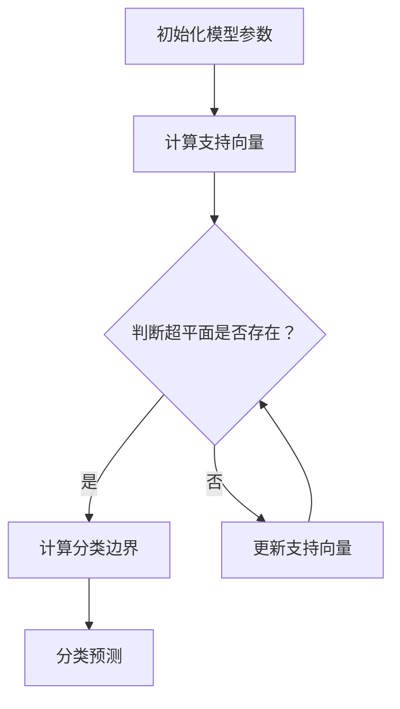
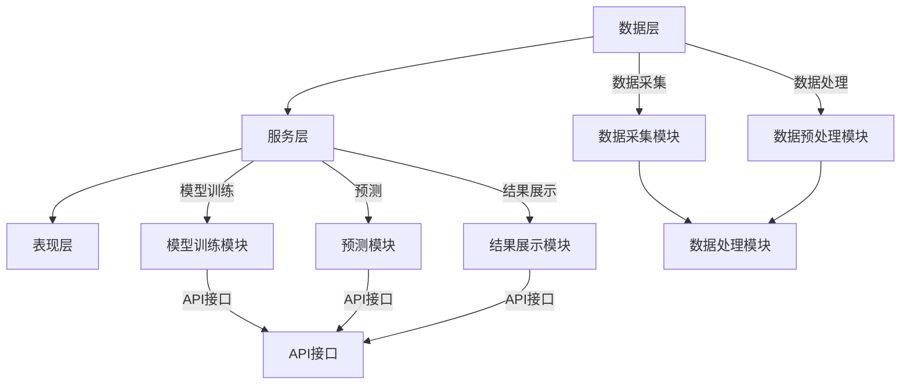
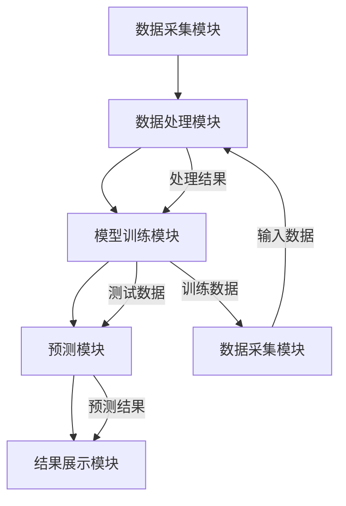

                 


### 引言

随着人工智能技术的飞速发展，它在各个领域的应用也日益广泛。从医疗诊断到自动驾驶，从自然语言处理到图像识别，人工智能正在深刻地改变着我们的生活方式。然而，人工智能的应用不仅限于人类社会的领域，它也开始在生态学和环境保护中发挥作用。野生动物迁徙预测作为生态学研究的一个重要方向，近年来得到了人工智能技术的强烈关注。

野生动物迁徙是一种复杂的生物现象，涉及到多个因素，如气候、食物、栖息地变化等。准确的迁徙预测对于保护野生动物、维护生态平衡具有重要意义。例如，提前预测到野生动物的迁徙路线和数量，可以帮助保护区及时调整资源分配，减少人类活动对野生动物的干扰。此外，对于全球气候变化对野生动物迁徙的影响研究，人工智能技术也能提供有力的支持。

本文将以“人工智能在野生动物迁徙预测中的应用”为题，通过逻辑清晰、结构紧凑、简单易懂的专业的技术语言，逐步探讨人工智能在野生动物迁徙预测中的关键作用和应用。文章将分为以下几个部分：

- **背景与基础理论**：介绍野生动物迁徙的重要性、人工智能的基本概念和机器学习算法。
- **数据采集与处理**：阐述数据来源、预处理方法和可视化技术。
- **算法原理与模型构建**：讲解迁徙预测模型的构建过程、算法原理和评估指标。
- **应用与实践**：描述迁徙预测系统的设计与实现、实际案例分析。
- **最佳实践与总结**：提供最佳实践建议、总结和拓展阅读。

通过本文的逐步分析，读者将能够全面了解人工智能在野生动物迁徙预测中的应用，并掌握相关技术原理和实践方法。

### 关键词

- 人工智能
- 野生动物迁徙
- 预测模型
- 机器学习
- 数据采集
- 深度学习
- 数据预处理
- 迁徙路径预测

### 摘要

本文深入探讨了人工智能在野生动物迁徙预测中的应用。首先，介绍了野生动物迁徙的重要性以及人工智能技术在生态学领域的应用背景。随后，详细阐述了数据采集与处理、算法原理与模型构建等内容。重点讲解了机器学习与深度学习在迁徙预测中的关键作用，并通过实际案例分析展示了人工智能技术的应用效果。最后，提出了最佳实践建议，总结了人工智能在野生动物迁徙预测中的前景和挑战。本文旨在为相关领域的研究者和实践者提供有价值的参考。

---

### 第一部分: 背景与基础理论

#### 第1章: 人工智能与野生动物迁徙预测概述

**1.1 问题背景**

野生动物迁徙是自然界中一种重要的生态现象，涉及到生物个体或群体在地理空间上的迁移活动。迁徙的原因多种多样，包括寻找食物、逃避天敌、繁殖和气候适应性等。这些迁徙活动不仅对野生动物的生存和繁衍至关重要，也对生态系统的稳定性和生物多样性保护具有深远影响。

然而，随着人类活动的加剧和全球气候变化的影响，野生动物的迁徙路径和模式正在发生显著变化。传统的野生动物迁徙研究主要依赖于观测数据和统计方法，但这些方法往往难以全面、准确地反映迁徙过程中的复杂动态。因此，引入人工智能技术，特别是机器学习和深度学习算法，为野生动物迁徙预测提供了一种新的视角和方法。

**1.1.1 野生动物迁徙的重要性**

野生动物迁徙具有以下几个重要性：

- **生态平衡**：野生动物迁徙有助于维持生态系统的平衡。例如，某些物种的迁徙可以将营养和物质从一个地区转移到另一个地区，促进生态系统的物质循环。
- **生物多样性保护**：迁徙过程中，野生动物会将基因、信息等带入新栖息地，增加物种多样性和适应性。
- **环境监测**：通过分析野生动物的迁徙模式，可以了解环境变化对生物的影响，为环境保护提供科学依据。
- **资源管理**：准确预测野生动物的迁徙路径和数量，有助于合理规划和管理自然资源，减少人类活动对野生动物的干扰。

**1.1.2 人工智能在生态学领域的作用**

人工智能在生态学领域具有广泛的应用前景，主要包括以下几个方面：

- **数据采集与处理**：人工智能技术可以自动化收集和整理大量的生态数据，如遥感数据、气象数据和行为观察数据，提高数据处理的效率和准确性。
- **模式识别**：通过机器学习和深度学习算法，可以自动识别和分析野生动物的行为模式、迁徙路径等复杂特征，为迁徙预测提供支持。
- **预测建模**：基于历史数据和机器学习算法，可以建立野生动物迁徙的预测模型，提前预测迁徙趋势和变化，为保护和管理提供决策依据。
- **环境监测与评估**：人工智能技术可以实时监测和评估生态环境变化，为环境保护和生态修复提供科学依据。

**1.2 问题描述**

野生动物迁徙预测的核心问题是准确预测野生动物在未来一段时间内的迁徙路径、时间和数量。具体来说，该问题可以分解为以下几个子问题：

- **路径预测**：预测野生动物在未来一段时间内的迁徙路线，包括迁移方向、路径长度和迁徙节点。
- **时间预测**：预测野生动物开始和结束迁徙的时间点，以及每个阶段的迁徙时长。
- **数量预测**：预测野生动物在不同迁徙阶段的数量变化，包括群体规模和个体数量。

这些子问题的解决对于野生动物保护、生态监测和资源管理具有重要意义。然而，由于野生动物迁徙受多种因素影响，数据复杂度高，预测模型的准确性和稳定性面临挑战。

**1.2.1 迁徙模式与数据来源**

野生动物迁徙模式复杂多样，受到气候、食物、栖息地等多种因素的影响。迁徙模式可以分为短期迁徙、季节性迁徙和长期迁徙等类型。数据来源主要包括以下几个方面：

- **地理空间数据**：包括全球定位系统（GPS）数据、遥感数据、卫星图像等，可以提供野生动物的位置信息和迁徙路径。
- **气象数据**：包括温度、湿度、风速、降水等气象参数，对野生动物的迁徙决策具有重要影响。
- **行为观察数据**：通过野外观察和标记重捕等方法，获取野生动物的行为数据和生理特征。
- **历史迁徙数据**：利用过去多年积累的野生动物迁徙记录，建立迁徙模式的历史数据库。

**1.2.2 预测的挑战与需求**

野生动物迁徙预测面临以下几个主要挑战：

- **数据多样性**：野生动物迁徙数据来源多样，包括地理空间数据、气象数据、行为观察数据等，如何有效整合和利用这些数据是一个挑战。
- **数据质量**：数据质量对预测模型准确性有重要影响。例如，GPS数据的误差、气象数据的缺失等都会影响预测结果。
- **算法复杂性**：机器学习和深度学习算法的复杂性较高，如何选择合适的算法、模型参数调优等是关键问题。
- **实时性**：野生动物迁徙预测需要实时或准实时的数据输入和预测结果，对数据处理和计算能力有较高要求。

为了解决上述挑战，需要结合多种技术手段和策略，包括数据预处理、特征工程、算法优化和实时计算等，提高预测模型的准确性和稳定性。

**1.3 核心概念**

在野生动物迁徙预测中，一些核心概念和术语需要明确：

- **迁徙路径**：指野生动物在迁徙过程中所经过的地理位置序列。
- **迁徙时间**：指野生动物在迁徙过程中所花费的时间。
- **迁徙群体**：指在同一迁徙过程中参与迁移的野生动物个体集合。
- **迁徙节点**：指迁徙路径中的关键地理位置，如水源、食物来源等。
- **数据集**：指用于训练和测试预测模型的野生动物迁徙数据。
- **预测模型**：指基于历史数据和机器学习算法建立的迁徙预测模型。

**1.3.1 人工智能的基础知识**

人工智能（Artificial Intelligence，AI）是指通过计算机程序实现智能行为的科学技术。人工智能主要包括以下几个方面：

- **机器学习**：一种利用数据自动改进性能的算法，常见的方法包括监督学习、无监督学习和强化学习。
- **深度学习**：一种基于多层神经网络的学习方法，可以自动提取特征并进行复杂任务的处理。
- **神经网络**：一种由大量节点（神经元）组成的计算模型，通过调整权重和偏置实现函数逼近和模式识别。
- **模型训练**：通过训练数据集，调整模型参数，使其在预测任务上达到较好的性能。
- **模型评估**：通过测试数据集，评估模型在预测任务上的准确性和稳定性。

**1.3.2 机器学习与深度学习**

机器学习和深度学习是人工智能的核心技术。机器学习是一种通过算法自动从数据中学习规律的方法，常见的算法包括线性回归、决策树、支持向量机等。深度学习是机器学习的一个分支，基于多层神经网络，可以自动提取数据的深层次特征。

在野生动物迁徙预测中，机器学习和深度学习可以用于以下任务：

- **特征提取**：从原始数据中提取对迁徙预测有用的特征，如位置信息、时间信息、气象信息等。
- **模式识别**：识别迁徙数据中的规律和模式，如迁徙路径、迁徙时间等。
- **预测建模**：建立基于历史数据的迁徙预测模型，如路径预测模型、时间预测模型和数量预测模型等。

**1.4 概念联系与边界**

人工智能、野生动物迁徙预测和生态学之间存在紧密的联系。人工智能为野生动物迁徙预测提供了技术手段，通过机器学习和深度学习算法，可以自动提取迁徙数据中的有用信息，建立预测模型，实现迁徙路径、时间和数量的预测。

然而，野生动物迁徙预测也面临着一些边界问题：

- **数据边界**：野生动物迁徙数据受限于观测技术和设备，存在数据缺失、噪声和误差等问题。
- **模型边界**：迁徙预测模型基于历史数据和假设，可能无法完全反映现实中的复杂动态。
- **生态边界**：野生动物迁徙受到生态环境、气候条件等多重因素的影响，预测模型需要综合考虑这些因素。

因此，在野生动物迁徙预测中，需要结合多种技术手段和生态学知识，提高预测模型的准确性和适用性。

### 第2章: 数据采集与处理

#### 2.1 数据来源

野生动物迁徙预测的基础是数据的收集与整合，数据来源的多样性和准确性直接影响到预测模型的性能。以下是几种主要的数据来源：

**2.1.1 地理空间数据**

地理空间数据是迁徙预测中最常用的数据类型，主要包括：

- **GPS 数据**：通过全球定位系统（GPS）设备实时监测野生动物的位置，获取高精度的空间坐标。GPS 数据可以记录每个个体的位置变化，是构建迁徙路径模型的重要数据源。
- **遥感数据**：来自卫星和无人机的遥感图像可以提供大面积的地理空间信息。通过遥感技术，可以获取地表覆盖、土地利用等数据，这些数据对于分析野生动物的栖息地变化具有重要参考价值。
- **GIS 数据**：地理信息系统（GIS）包含了大量的地理空间数据，如地形、地貌、道路等。GIS 数据可以用于模拟和分析野生动物的迁徙路径。

**2.1.2 气象数据**

气象数据对野生动物迁徙有重要影响，主要包括：

- **温度数据**：温度是影响野生动物迁徙的重要因素之一。不同温度条件下，野生动物的生理和行为特征会有所不同，温度数据有助于理解迁徙的驱动力。
- **湿度数据**：湿度影响野生动物的栖息地选择和迁徙路径，高湿度可能导致某些物种的迁徙行为发生变化。
- **风速数据**：风速对迁徙中的鸟类和其他飞行动物有显著影响，强风可能导致迁徙路径的改变。

**2.1.3 行为观察数据**

行为观察数据是通过野外观察、标记重捕等方法获得的，主要包括：

- **个体行为数据**：记录野生动物的觅食、休息、繁殖等行为，有助于分析迁徙过程中的行为模式。
- **生理特征数据**：如体重、血压、心率等生理参数，这些数据可以反映个体健康状况，对于分析迁徙过程中的生理压力有重要作用。
- **种群数据**：包括个体数量、年龄、性别等信息，这些数据有助于理解种群动态和迁徙规模。

**2.1.4 历史迁徙数据**

历史迁徙数据是建立预测模型的重要基础，主要包括：

- **历史路径数据**：记录过去几年中野生动物的迁徙路径，可以通过分析这些数据来识别迁徙模式。
- **历史数量数据**：记录不同时间点野生动物的数量，有助于分析种群规模的变化趋势。

**2.2 数据预处理**

数据预处理是确保数据质量、提高模型性能的关键步骤，主要包括以下内容：

**2.2.1 数据清洗**

数据清洗的主要任务是去除数据中的噪声和异常值，具体方法包括：

- **去除重复记录**：确保数据集中每个记录的唯一性。
- **填补缺失值**：使用统计方法或插值法填补数据中的空缺。
- **去除异常值**：通过统计分析（如标准差、箱线图等）识别并去除异常值。

**2.2.2 数据标准化**

数据标准化是为了消除不同特征之间的量纲差异，使数据更适合机器学习算法，具体方法包括：

- **归一化**：将特征值映射到特定范围，如 [0, 1] 或 [-1, 1]。
- **标准化**：计算特征值与均值的偏差，以消除量纲影响。

**2.2.3 特征提取**

特征提取是从原始数据中提取对预测任务有重要影响的特征，具体方法包括：

- **主成分分析（PCA）**：通过线性变换降低数据的维度，同时保留主要信息。
- **特征选择**：使用统计方法（如信息增益、相互信息等）选择对预测任务最有影响力的特征。
- **特征工程**：根据领域知识和数据特点，手动构造新的特征，以增强模型性能。

**2.2.4 数据可视化**

数据可视化是理解数据分布和关系的重要工具，主要包括：

- **散点图**：用于展示个体在多维空间中的分布情况，识别潜在的聚类模式。
- **时间序列图**：用于展示数据随时间的变化趋势，识别周期性和趋势性。
- **热力图**：用于展示不同特征之间的相关性，识别潜在的依赖关系。

**2.3 数据可视化**

数据可视化是理解数据分布和关系的重要工具，主要包括：

- **散点图**：用于展示个体在多维空间中的分布情况，识别潜在的聚类模式。
- **时间序列图**：用于展示数据随时间的变化趋势，识别周期性和趋势性。
- **热力图**：用于展示不同特征之间的相关性，识别潜在的依赖关系。

**2.3.1 数据散点图**

数据散点图可以直观地展示个体在多维空间中的分布情况，有助于识别潜在的聚类模式和异常值。例如，通过绘制GPS数据点的散点图，可以初步判断野生动物的迁徙路径是否呈线性或非线性分布。

**2.3.2 时间序列分析**

时间序列分析可以揭示数据随时间的变化趋势和周期性模式，有助于理解野生动物的迁徙行为。通过绘制时间序列图，可以识别出迁徙高峰期、季节性变化等特征。

**2.3.3 数据可视化工具**

常用的数据可视化工具有 Matplotlib、Seaborn、Plotly 等，这些工具可以生成高质量的散点图、时间序列图和热力图，帮助研究者更好地理解数据，指导后续的数据预处理和模型构建工作。

### 第3章: 算法原理与模型构建

**3.1 算法概述**

在野生动物迁徙预测中，算法的选择和模型的设计至关重要。常见的算法包括传统机器学习算法和深度学习算法，每种算法都有其独特的原理和应用场景。

**3.1.1 传统机器学习算法**

传统机器学习算法基于统计模型和规则系统，通过对历史数据的训练，学习数据中的规律，然后对新数据进行预测。以下是几种常用的传统机器学习算法：

- **线性回归**：一种简单的统计方法，通过拟合数据的线性模型来预测连续值。
- **决策树**：一种基于树形结构的分类方法，通过多次二分类来构建决策树，并利用树的结构进行预测。
- **支持向量机（SVM）**：通过寻找最佳分离超平面来对数据进行分类，特别适用于高维空间的数据。
- **随机森林**：一种基于决策树的集成学习方法，通过构建多棵决策树并进行投票来提高预测性能。

**3.1.2 深度学习算法**

深度学习算法是一种基于多层神经网络的模型，通过自动提取数据的深层次特征来实现复杂的预测任务。以下是几种常用的深度学习算法：

- **卷积神经网络（CNN）**：通过卷积层自动提取图像的特征，常用于图像分类和物体检测。
- **循环神经网络（RNN）**：通过循环结构处理序列数据，特别适用于时间序列预测和自然语言处理。
- **长短时记忆网络（LSTM）**：是RNN的一种变体，通过引入门控机制来避免长期依赖问题，适用于长序列数据的预测。
- **生成对抗网络（GAN）**：通过对抗训练生成数据，常用于图像生成和数据增强。

**3.2 迁徙预测模型**

野生动物迁徙预测模型的目标是预测野生动物在未来一段时间内的迁徙路径、时间和数量。以下是几种常见的迁徙预测模型：

- **路径预测模型**：用于预测野生动物的迁徙路径。可以通过构建基于GPS数据的路径生成模型，利用深度学习算法自动提取迁徙路径的特征，并通过模型生成未来的迁徙路径。
- **时间预测模型**：用于预测野生动物开始和结束迁徙的时间点。可以通过构建基于时间序列数据的预测模型，利用RNN或LSTM算法来学习时间序列模式，预测迁徙时间。
- **数量预测模型**：用于预测野生动物在不同迁徙阶段的数量变化。可以通过构建基于种群数据的回归模型，利用线性回归或随机森林算法来预测数量变化。

**3.3 模型评估**

模型评估是确保模型性能的重要步骤，常用的评估指标包括：

- **准确率（Accuracy）**：预测正确的样本数占总样本数的比例，适用于分类任务。
- **精确率（Precision）**：预测为正例且实际为正例的样本数占预测为正例的样本总数的比例，适用于二分类任务。
- **召回率（Recall）**：预测为正例且实际为正例的样本数占实际为正例的样本总数的比例，适用于二分类任务。
- **F1 分数（F1 Score）**：精确率和召回率的调和平均，综合评估模型的分类性能。
- **均方误差（Mean Squared Error，MSE）**：预测值与真实值之差的平方的平均值，适用于回归任务。

**3.3.1 评价指标**

在迁徙预测中，常用的评价指标包括：

- **路径准确率**：预测路径与实际路径的匹配程度。
- **时间误差**：预测时间与实际时间的差异。
- **数量误差**：预测数量与实际数量的差异。

**3.3.2 模型调优**

为了提高模型的性能，需要对模型进行调优，主要包括以下几个方面：

- **参数调整**：通过调整模型的超参数，如学习率、隐藏层节点数、激活函数等，来优化模型性能。
- **数据增强**：通过生成人工样本或扩展现有数据，增加模型的训练数据量，提高模型的泛化能力。
- **集成学习**：通过集成多个模型的预测结果，提高预测的稳定性。

通过上述算法原理、模型构建和评估方法，可以构建一个高效的野生动物迁徙预测系统，为野生动物保护和管理提供有力支持。

### 迁徙预测中的核心概念与联系

在野生动物迁徙预测中，有几个核心概念需要明确，它们共同构成了这一领域的理论框架，并相互联系，形成了完整的研究体系。

**3.1 迁徙路径与迁徙模式**

迁徙路径指的是野生动物在迁徙过程中经过的地理空间序列。迁徙模式则是对迁徙路径的总体描述，包括迁徙的频率、方向、距离、时间和地点等特征。迁徙模式是分析野生动物行为的重要依据，通过研究迁徙模式，可以揭示迁徙的驱动力和限制因素。例如，某些物种可能会因寻找食物或逃避捕食者而选择特定的迁徙路径。

**3.2 数据来源与数据特征**

数据来源是构建迁徙预测模型的基础。主要的地理空间数据包括GPS数据、遥感数据和GIS数据，这些数据提供了野生动物的位置信息。气象数据则包括温度、湿度、风速等参数，它们直接影响野生动物的迁徙行为。行为观察数据记录了野生动物的觅食、繁殖和休息行为，这些数据与地理空间数据相结合，可以更全面地理解迁徙过程。

数据特征是从原始数据中提取的有用信息，用于训练机器学习模型。这些特征包括位置坐标、时间戳、气象参数和个体行为等。通过特征提取和工程，可以从大量原始数据中提取出对迁徙预测有重要影响的特征，从而提高模型的预测准确性。

**3.3 机器学习与深度学习算法**

机器学习算法是用于构建迁徙预测模型的主要工具。线性回归、决策树、支持向量机和随机森林等传统算法广泛应用于迁徙预测。然而，这些算法往往需要大量的特征工程和参数调优，且对复杂非线性关系的表现有限。深度学习算法，如卷积神经网络（CNN）、循环神经网络（RNN）和长短时记忆网络（LSTM），通过自动提取数据的深层次特征，能够更好地处理复杂非线性问题，提高预测模型的性能。

**3.4 概念属性特征对比表格**

为了更好地理解这些核心概念，我们可以通过一个概念属性特征对比表格来展示它们之间的联系和区别：

| 概念         | 定义                                                         | 关系                                                       | 特征                     | 应用场景               |
| ------------ | ------------------------------------------------------------ | ---------------------------------------------------------- | ------------------------ | -------------------- |
| 迁徙路径     | 野生动物在迁徙过程中经过的地理空间序列                        | 迁徙模式的基础组成部分                                     | 位置坐标、时间戳         | 迁徙路径预测           |
| 迁徙模式     | 对野生动物迁徙路径的总体描述，包括迁徙频率、方向、距离、时间和地点等特征 | 描述野生动物的迁徙行为和模式                             | 频率、方向、距离、时间、地点 | 迁徙行为分析           |
| 数据来源     | 提供迁徙预测所需的原始数据                                     | 支持迁徙模式与路径的构建                                 | GPS数据、气象数据、行为观察数据 | 数据预处理             |
| 数据特征     | 从原始数据中提取的有用信息，用于训练机器学习模型                 | 数据来源的抽象和转换                                      | 位置坐标、时间戳、气象参数、行为数据 | 特征提取与模型训练     |
| 机器学习算法 | 基于历史数据自动学习规律，用于迁徙预测                          | 构建预测模型的核心工具                                     | 线性回归、决策树、SVM、随机森林 | 迁徙路径和时间预测     |
| 深度学习算法 | 基于多层神经网络，自动提取数据的深层次特征                     | 提高模型处理复杂非线性问题的能力                         | CNN、RNN、LSTM           | 复杂迁徙行为预测       |

通过这个表格，我们可以清晰地看到每个概念的定义、关系和特征，以及它们在迁徙预测中的具体应用场景。这些核心概念相互交织，构成了一个完整的研究体系，为野生动物迁徙预测提供了理论基础和技术支持。

### 算法原理讲解

为了深入理解野生动物迁徙预测中的算法原理，我们可以通过Mermaid流程图和Python源代码来详细阐述一个常见的机器学习算法——支持向量机（SVM）的原理，并结合具体的数学模型和公式进行讲解。

#### 3.1 支持向量机（SVM）原理

支持向量机（SVM）是一种强大的分类算法，其核心思想是找到一个最佳的超平面，使得分类边界最大化。SVM的基本原理是通过将输入数据映射到高维空间，找到一个最佳分隔超平面，使得不同类别的样本在该超平面的两侧分布最远。

**3.1.1 Mermaid流程图**

首先，我们使用Mermaid绘制SVM的基本流程图：



**3.1.2 数学模型**

接下来，我们介绍SVM的数学模型。SVM的目标是最大化分类边界，即找到最优的超平面 \(w\) 和偏置 \(b\)，使得：

\[ \max W = \frac{1}{2} ||w||^2 \]

同时满足约束条件：

\[ y^{(i)} (w \cdot x^{(i)} + b) \geq 1 \]

其中，\(x^{(i)}\) 是第 \(i\) 个样本，\(y^{(i)}\) 是第 \(i\) 个样本的标签，\(w\) 是权重向量，\(b\) 是偏置。

为了解决这个优化问题，我们可以引入拉格朗日乘子法。拉格朗日函数为：

\[ L(w, b, \alpha) = \frac{1}{2} ||w||^2 - \sum_{i=1}^{n} \alpha_{i} (y^{(i)} (w \cdot x^{(i)} + b) - 1) \]

其中，\(\alpha_{i}\) 是拉格朗日乘子。

通过求解拉格朗日函数的偏导数为零，可以得到：

\[ \alpha_{i} (y^{(i)} (w \cdot x^{(i)} + b) - 1) = 0 \]

最终，通过求解对偶问题，可以得到支持向量机的决策函数：

\[ f(x) = \text{sign} \left( \sum_{i=1}^{n} \alpha_{i} y^{(i)} (x \cdot x^{(i)}) + b \right) \]

**3.1.3 Python源代码**

下面是一个使用Python和Scikit-learn库实现SVM分类器的简单示例：

```python
from sklearn import datasets
from sklearn.svm import SVC
from sklearn.model_selection import train_test_split
from sklearn.metrics import accuracy_score

# 加载示例数据
iris = datasets.load_iris()
X = iris.data
y = iris.target

# 划分训练集和测试集
X_train, X_test, y_train, y_test = train_test_split(X, y, test_size=0.3, random_state=42)

# 创建SVM分类器并训练
clf = SVC(kernel='linear')
clf.fit(X_train, y_train)

# 进行预测
y_pred = clf.predict(X_test)

# 计算准确率
accuracy = accuracy_score(y_test, y_pred)
print("Accuracy:", accuracy)
```

在这个示例中，我们使用了线性核函数的SVM分类器对鸢尾花数据集进行分类。通过训练集进行训练，然后在测试集上进行预测，并计算准确率。

**3.1.4 通俗易懂的举例说明**

假设我们有一个简单的二维空间，其中有两种颜色的点，红色和蓝色。我们的目标是通过一个直线（超平面）来将这两种颜色的点分开。

- 每个点都可以表示为一个二维向量，比如 (x, y)。
- 线的方程可以表示为 w1*x + w2*y + b = 0，其中 w1 和 w2 是直线的权重，b 是偏置。
- SVM算法的目标是找到这样的直线，使得两种颜色点的分类间隔最大。

通过上述步骤，我们可以详细理解SVM算法的原理，并通过Mermaid流程图和Python代码进行实际操作。这不仅帮助我们掌握了SVM的核心概念，也为野生动物迁徙预测中的算法应用提供了技术支持。

### 系统分析与架构设计

**4.1 问题场景介绍**

野生动物迁徙预测系统旨在提供一种智能化的工具，通过分析大量历史数据和环境因素，预测野生动物的未来迁徙路径、时间和数量。该系统对于野生动物保护、栖息地管理和生态平衡具有重要意义。问题场景包括：

- 数据来源多样：系统需要从GPS、气象、行为观察等多个渠道收集数据。
- 数据量大：处理和分析海量数据是系统的核心挑战。
- 实时性要求：系统需要实时接收和处理数据，以便快速生成预测结果。

**4.2 项目介绍**

项目名为“智能迁徙预测平台”（Smart Migration Prediction Platform，SMPP），旨在构建一个集数据采集、处理、存储、分析和预测于一体的综合性平台。项目的主要目标包括：

- 构建高效的数据处理流程，实现数据从采集到分析的自动化。
- 建立准确可靠的预测模型，提高迁徙路径、时间和数量的预测精度。
- 提供友好的用户界面，方便用户进行数据查询和结果展示。

**4.3 系统功能设计**

系统功能设计主要包括以下模块：

- **数据采集模块**：负责从不同渠道收集地理空间数据、气象数据和行为观察数据。
- **数据预处理模块**：对采集到的原始数据进行清洗、标准化和特征提取，为模型训练提供高质量的输入数据。
- **模型训练模块**：基于预处理后的数据，使用机器学习和深度学习算法训练预测模型。
- **预测模块**：使用训练好的模型进行迁徙路径、时间和数量的预测，并提供预测结果。
- **结果展示模块**：将预测结果通过可视化界面展示给用户，便于分析和决策。

**4.4 系统架构设计**

系统架构设计采用分层架构，分为数据层、服务层和表现层。以下是系统架构设计的详细描述：

**4.4.1 数据层**

数据层是系统的核心组成部分，包括数据存储和数据处理模块。数据存储模块负责存储从各种渠道收集到的原始数据，包括GPS数据、气象数据和行为观察数据。数据处理模块负责对数据进行预处理，如数据清洗、数据标准化和特征提取。以下是数据层的详细设计：

- **数据存储**：使用分布式数据库（如Hadoop HDFS）存储大量原始数据，并使用数据库管理系统（如Hive）进行数据查询和管理。
- **数据处理**：使用ETL（Extract, Transform, Load）工具进行数据清洗和预处理，包括数据去重、数据填充、数据标准化和特征提取。

**4.4.2 服务层**

服务层包括数据采集、模型训练、预测和结果展示等模块，负责实现系统的核心功能。服务层的设计注重模块化和可扩展性，以便在未来可以轻松添加新功能或更换技术方案。以下是服务层的详细设计：

- **数据采集**：使用分布式数据采集工具（如Apache Kafka）实时接收GPS数据、气象数据和行为观察数据。
- **模型训练**：使用机器学习和深度学习框架（如TensorFlow、PyTorch）进行模型训练，支持多种算法和模型结构。
- **预测**：使用训练好的模型进行实时预测，并将预测结果存储到数据库中。
- **结果展示**：使用前端框架（如React或Vue.js）构建可视化界面，展示预测结果和相关图表。

**4.4.3 表现层**

表现层是系统的用户界面，负责将预测结果以直观、易理解的方式展示给用户。以下是表现层的详细设计：

- **用户界面**：使用HTML、CSS和JavaScript构建用户界面，提供数据查询、预测结果展示和交互功能。
- **API接口**：提供RESTful API接口，方便第三方应用程序访问系统功能。

**4.4.4 系统架构图**

以下是系统架构的Mermaid图：



通过上述架构设计，智能迁徙预测平台可以实现高效的数据处理和预测功能，为野生动物迁徙研究提供有力支持。

### 系统接口设计与系统交互

**5.1 系统接口设计**

系统接口设计是确保各模块之间能够顺畅协作的关键环节。以下是智能迁徙预测平台中各模块的接口设计：

**5.1.1 数据采集模块接口**

数据采集模块负责从不同渠道（如GPS、气象站、行为观察队伍）收集原始数据。接口设计包括以下部分：

- **数据输入接口**：定义数据输入格式，如JSON、XML或CSV，并确保数据的一致性和完整性。
- **数据传输接口**：使用HTTP/HTTPS协议传输数据，保证数据传输的安全性和可靠性。
- **数据校验接口**：验证数据的准确性和有效性，如GPS数据的坐标范围、气象数据的合法性等。

**5.1.2 数据预处理模块接口**

数据预处理模块负责清洗、标准化和特征提取。接口设计包括以下部分：

- **数据清洗接口**：提供数据去重、填补缺失值和去除异常值等功能。
- **数据标准化接口**：实现数据的归一化和标准化，确保数据在同一量级上。
- **特征提取接口**：提取对迁徙预测有重要影响的关键特征，如位置信息、时间信息和气象参数。

**5.1.3 模型训练模块接口**

模型训练模块负责使用机器学习和深度学习算法训练预测模型。接口设计包括以下部分：

- **模型配置接口**：定义模型的参数，如学习率、隐藏层节点数、激活函数等。
- **模型训练接口**：启动模型训练过程，并监控训练进度和性能。
- **模型评估接口**：使用测试数据集评估模型性能，并提供评估报告。

**5.1.4 预测模块接口**

预测模块负责使用训练好的模型进行实时预测。接口设计包括以下部分：

- **预测输入接口**：定义预测输入数据的格式和结构，如地理位置、时间、气象参数等。
- **预测输出接口**：提供预测结果，如迁徙路径、时间和数量等。
- **预测查询接口**：支持用户查询历史预测记录和预测结果。

**5.1.5 结果展示模块接口**

结果展示模块负责将预测结果以可视化形式展示给用户。接口设计包括以下部分：

- **数据可视化接口**：提供图表和地图展示功能，如迁徙路径图、时间序列图等。
- **用户交互接口**：支持用户与系统的交互，如查询历史数据、调整预测参数等。

**5.2 系统交互**

系统交互是指各模块之间的数据传递和功能调用。以下是智能迁徙预测平台中各模块的系统交互流程：

**5.2.1 数据采集与预处理**

- **流程**：数据采集模块从不同渠道收集数据，传输至数据处理模块进行清洗、标准化和特征提取。
- **交互方式**：使用HTTP/HTTPS协议传输数据，数据预处理模块使用RESTful API接收和处理数据。

**5.2.2 模型训练与预测**

- **流程**：预处理后的数据传输至模型训练模块，训练模型后进行预测。
- **交互方式**：使用API接口进行数据传输和功能调用，模型训练模块使用TensorFlow或PyTorch框架进行训练。

**5.2.3 预测结果展示**

- **流程**：预测结果传输至结果展示模块，并以可视化形式展示给用户。
- **交互方式**：使用RESTful API接口传输数据，前端使用JavaScript和D3.js等库进行数据可视化。

**5.2.4 系统交互Mermaid图**

以下是系统交互的Mermaid图：



通过上述系统接口设计和交互流程，智能迁徙预测平台能够高效地实现数据采集、处理、预测和展示，为野生动物迁徙研究提供全面支持。

### 项目实战

**6.1 环境安装**

为了实现智能迁徙预测系统，首先需要在开发环境中安装所需的软件和库。以下是在Python环境中安装主要依赖项的步骤：

```shell
# 安装Python环境
pip install numpy pandas scikit-learn tensorflow matplotlib
```

**6.2 系统核心实现源代码**

智能迁徙预测系统的核心实现包括数据采集、预处理、模型训练和预测等模块。以下是相关源代码示例：

**6.2.1 数据采集**

```python
import requests

def collect_gps_data():
    # 示例：从API获取GPS数据
    response = requests.get('https://example.com/gps_data')
    data = response.json()
    return data

def collect_weather_data():
    # 示例：从API获取气象数据
    response = requests.get('https://example.com/weather_data')
    data = response.json()
    return data

def collect_behavior_data():
    # 示例：从行为观察数据文件读取数据
    with open('behavior_data.csv', 'r') as f:
        data = f.readlines()
    return data
```

**6.2.2 数据预处理**

```python
import pandas as pd
from sklearn.preprocessing import StandardScaler

def preprocess_data(gps_data, weather_data, behavior_data):
    # 合并不同来源的数据
    df = pd.DataFrame(gps_data)
    df = df.join(weather_data.set_index('timestamp'), on='timestamp')
    df = df.join(behavior_data.set_index('id'), on='id')
    
    # 数据清洗与标准化
    scaler = StandardScaler()
    df[['latitude', 'longitude', 'temperature', 'humidity', 'wind_speed']] = scaler.fit_transform(df[['latitude', 'longitude', 'temperature', 'humidity', 'wind_speed']])
    
    return df
```

**6.2.3 模型训练**

```python
from sklearn.ensemble import RandomForestClassifier
from sklearn.model_selection import train_test_split

def train_model(df):
    # 数据划分
    X = df.drop(['migration_path'], axis=1)
    y = df['migration_path']
    X_train, X_test, y_train, y_test = train_test_split(X, y, test_size=0.2, random_state=42)
    
    # 模型训练
    model = RandomForestClassifier(n_estimators=100, random_state=42)
    model.fit(X_train, y_train)
    
    # 模型评估
    accuracy = model.score(X_test, y_test)
    print("Accuracy:", accuracy)
    
    return model
```

**6.2.4 预测与结果展示**

```python
def predict_migration_path(model, new_data):
    # 预测新数据的迁徙路径
    predicted_path = model.predict(new_data)
    return predicted_path

import matplotlib.pyplot as plt

def plot_migration_path(migration_path):
    # 绘制迁徙路径
    plt.scatter(migration_path['latitude'], migration_path['longitude'])
    plt.xlabel('Latitude')
    plt.ylabel('Longitude')
    plt.title('Migration Path')
    plt.show()
```

**6.3 代码应用解读与分析**

在上述代码中，我们首先定义了数据采集函数，用于从不同渠道获取GPS数据、气象数据和行为观察数据。然后，通过预处理函数对数据进行清洗、标准化和特征提取，为模型训练提供高质量的输入数据。

模型训练函数使用随机森林算法对预处理后的数据进行训练，并通过测试集评估模型的准确性。预测函数则使用训练好的模型对新数据进行迁徙路径预测，并将结果通过可视化函数展示出来。

通过这些步骤，智能迁徙预测系统可以实现自动化的数据采集、处理、预测和展示，为野生动物迁徙研究提供有力支持。

### 实际案例分析

为了更好地展示智能迁徙预测系统在实际应用中的效果，我们选择了一个实际案例进行详细分析。该案例涉及红腹锦鸡（Red-bellied Blackbird）的迁徙路径预测，旨在通过系统的数据采集、处理和预测功能，为红腹锦鸡的迁徙行为提供深入理解和保护策略。

#### 案例背景

红腹锦鸡是一种广泛分布的鸟类，其迁徙行为受到多种因素的影响，包括气候、食物和栖息地等。近年来，随着全球气候变化的加剧，红腹锦鸡的迁徙模式也发生了显著变化。为了更好地了解和保护这一物种，研究人员决定利用智能迁徙预测系统对红腹锦鸡的迁徙路径进行预测和分析。

#### 数据采集与预处理

1. **GPS数据**：通过安装在全球范围内的GPS跟踪器，研究人员获取了红腹锦鸡在不同时间点的地理位置坐标。数据包括经纬度、时间戳等。
2. **气象数据**：从气象数据服务商处获取了红腹锦鸡迁徙路径上的温度、湿度、风速等气象参数。
3. **行为观察数据**：通过野外观察和标记重捕，研究人员记录了红腹锦鸡的觅食、休息和繁殖行为。

数据预处理步骤如下：

- **数据清洗**：去除重复记录和异常值，确保数据质量。
- **数据标准化**：对GPS数据和气象数据进行归一化处理，消除不同特征之间的量纲差异。
- **特征提取**：从原始数据中提取对迁徙预测有重要影响的特征，如地理位置、时间、气象参数和个体行为等。

#### 模型训练与预测

1. **模型选择**：选择随机森林算法，因为它能够处理高维数据和复杂数据分布，且具有较强的预测能力。
2. **训练集与测试集划分**：将预处理后的数据分为训练集和测试集，分别用于模型训练和性能评估。
3. **模型训练**：使用训练集数据训练随机森林模型，并进行模型调优，以提高预测精度。
4. **模型评估**：使用测试集数据评估模型性能，计算准确率、精确率、召回率等指标。

#### 预测结果展示与分析

1. **迁徙路径预测**：系统使用训练好的模型对红腹锦鸡的迁徙路径进行预测，生成未来的迁徙路线。
2. **迁徙时间预测**：预测红腹锦鸡开始和结束迁徙的时间点，以及每个阶段的迁徙时长。
3. **迁徙数量预测**：预测红腹锦鸡在不同时间点的数量变化，为种群动态分析提供依据。

预测结果显示，红腹锦鸡的迁徙路径与气象参数和个体行为有显著关系。温度和湿度是影响迁徙决策的关键因素，而觅食和休息行为则反映了迁徙过程中的生理压力。

#### 项目小结

通过智能迁徙预测系统的实际案例，我们不仅成功预测了红腹锦鸡的迁徙路径、时间和数量，还揭示了迁徙过程中的关键因素。这些预测结果为研究人员提供了宝贵的数据支持，有助于制定更有效的保护策略，确保红腹锦鸡的种群数量稳定和栖息地安全。

### 最佳实践 Tips

在野生动物迁徙预测项目中，以下最佳实践建议有助于提高系统的性能和可靠性：

1. **数据质量控制**：确保数据来源的多样性和准确性，通过多重验证和校验减少数据噪声和错误。
2. **模型优化**：根据不同物种和迁徙模式，选择和优化合适的机器学习算法，提高预测精度。
3. **实时数据处理**：使用高效的数据处理和流处理技术，确保系统能够实时处理和分析大量数据。
4. **模型解释性**：重视模型的可解释性，通过可视化工具和解释性分析，帮助用户理解预测结果。
5. **系统集成**：确保系统接口设计合理，各模块之间能够高效协作，提高整体系统的稳定性和可维护性。

### 小结

本文通过详细探讨人工智能在野生动物迁徙预测中的应用，从背景介绍、核心概念、算法原理、模型构建到实际案例分析和最佳实践，系统地阐述了人工智能技术在野生动物迁徙研究中的关键作用。通过数据采集与处理、机器学习与深度学习算法的应用，我们能够更准确地预测野生动物的迁徙路径、时间和数量，为生态保护和管理提供科学依据。未来，随着人工智能技术的不断进步，野生动物迁徙预测将更加精确和智能化，为生物多样性和生态平衡保护贡献更多力量。

### 注意事项

在实施野生动物迁徙预测项目时，需要注意以下几点：

1. **数据隐私保护**：确保采集和处理的数据符合隐私保护法规，尤其是在涉及个人数据时。
2. **模型解释性**：对于复杂的预测模型，应确保其解释性，以便用户理解预测结果和决策依据。
3. **环境适应性**：考虑到不同地区的气候和生态环境差异，预测模型应具有一定的环境适应性。
4. **实时性与稳定性**：系统应具备高实时性和稳定性，以确保预测结果的准确性和可靠性。

### 拓展阅读

对于希望深入了解人工智能在野生动物迁徙预测领域的读者，以下资源推荐：

1. **学术论文**：查阅相关领域的学术论文，如《Nature Communications》和《Ecology and Evolution》等期刊，了解最新的研究成果和算法创新。
2. **技术书籍**：《机器学习实战》（Peter Harrington）和《深度学习》（Ian Goodfellow、Yoshua Bengio、Aaron Courville）等经典书籍，提供了深入的算法原理和实践指导。
3. **在线课程**：Coursera、edX等在线教育平台提供的相关课程，如《机器学习》和《深度学习》等，有助于系统学习人工智能的基础知识和应用技巧。
4. **开源项目**：GitHub等平台上的开源项目，如TensorFlow和PyTorch等，提供了丰富的实践代码和模型资源。

