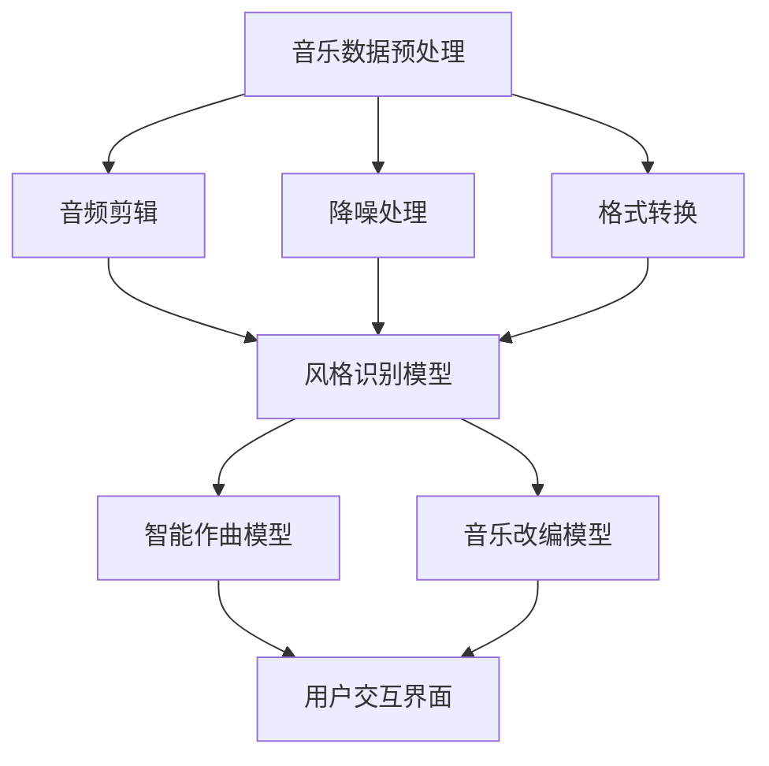
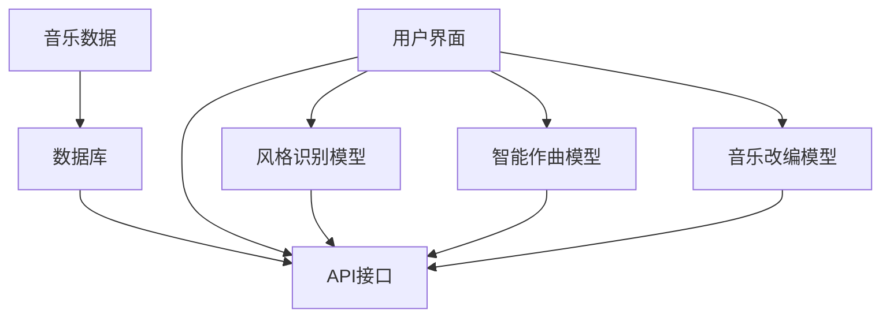
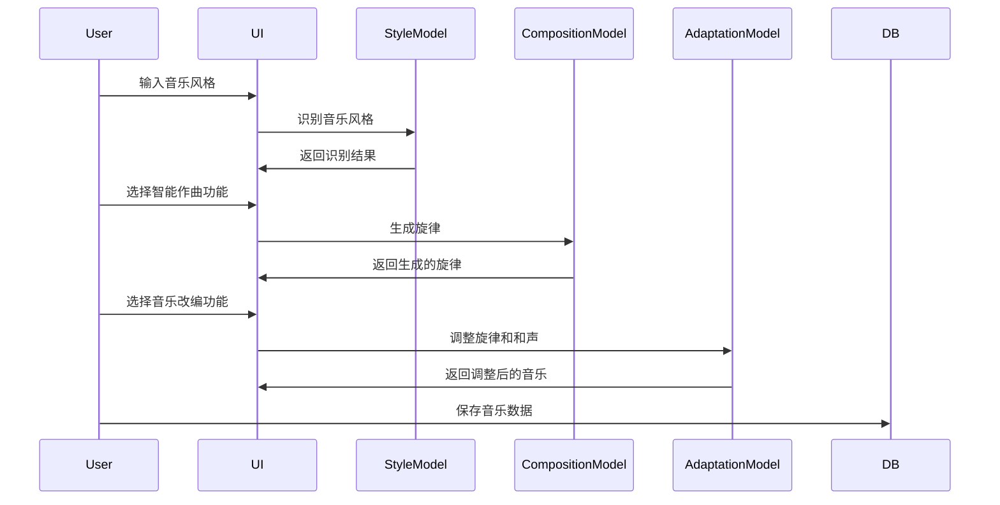

                 

# 人工智能在音乐创作中的应用与争议

关键词：人工智能、音乐创作、算法原理、应用案例、争议、未来展望

摘要：
随着人工智能技术的不断发展，其在各个领域的应用日益广泛。在音乐创作领域，人工智能不仅改变了传统音乐创作的方式，还引发了关于创意、版权和伦理的诸多争议。本文将逐步分析人工智能在音乐创作中的应用与争议，旨在探讨这一新兴领域的潜力与挑战。

## 目录

## 背景介绍
### 1.1 人工智能与音乐创作的背景
### 1.2 人工智能在音乐创作中的应用史

## 核心概念
### 2.1 音乐与人工智能的融合
### 2.2 人工智能在音乐创作中的核心算法
### 2.3 音乐数据与AI模型的关联

## 算法原理
### 3.1 生成对抗网络（GAN）在音乐创作中的应用
### 3.2 变分自编码器（VAE）在音乐生成中的应用
### 3.3 音乐生成中的深度学习模型

## 应用案例
### 4.1 智能作曲工具的应用实例
### 4.2 人工智能在音乐改编和制作中的应用
### 4.3 AI在音乐教育中的应用

## 争议与伦理
### 5.1 AI创作的版权问题
### 5.2 AI与人类创作者的伦理冲突
### 5.3 AI对音乐风格和文化多样性的影响

## 未来展望
### 6.1 人工智能在音乐创作中的潜在应用
### 6.2 AI音乐创作的未来发展

### 背景介绍

#### 1.1 人工智能与音乐创作的背景

音乐是人类文化的重要组成部分，而人工智能（AI）则是当今技术发展的前沿。随着计算能力和算法的进步，人工智能开始渗透到音乐创作领域，为传统音乐创作带来新的可能性。

人工智能在音乐创作中的应用始于20世纪80年代，当时计算机音乐合成器和数字音频工作站（DAW）开始普及。这些工具使音乐家能够更方便地创作和编辑音乐。然而，真正的变革发生在21世纪初，随着深度学习和生成模型的发展，人工智能开始能够自主生成音乐。

最初的应用主要集中在音乐合成和自动音乐生成上。例如，AI可以分析大量的音乐数据，然后生成新的旋律、和声和节奏。这种自动音乐生成技术为音乐家提供了新的创作工具，同时也引发了一系列关于创意、版权和伦理的争议。

#### 1.2 人工智能在音乐创作中的应用史

人工智能在音乐创作中的应用历史可以追溯到20世纪60年代。当时，计算机音乐合成器的出现标志着人工智能在音乐领域的首次尝试。然而，这些早期的尝试通常局限于生成简单的声音效果和音符序列。

随着计算机技术的进步，20世纪80年代和90年代，人工智能在音乐创作中的应用开始逐渐成熟。这一时期的代表性技术包括基于规则的系统、遗传算法和神经网络。这些技术使得计算机能够模拟音乐创作的一些方面，但仍然需要人类干预来指导创作过程。

21世纪初，随着深度学习和生成模型的兴起，人工智能在音乐创作中的应用达到了新的高度。生成对抗网络（GAN）、变分自编码器（VAE）和循环神经网络（RNN）等深度学习模型被广泛应用于音乐生成。这些模型能够从大量的音乐数据中学习，并生成高质量的、新颖的音乐作品。

#### 核心概念

##### 2.1 音乐与人工智能的融合

音乐与人工智能的融合是指将人工智能技术应用于音乐创作、分析和欣赏的过程。这种融合不仅改变了音乐创作的传统方式，还拓展了音乐的表现形式。

在音乐创作中，人工智能可以提供以下功能：

1. **旋律生成**：AI可以分析现有的旋律，然后生成新的旋律。这种生成过程通常基于深度学习模型，如生成对抗网络（GAN）和变分自编码器（VAE）。
2. **和声生成**：AI可以自动生成和声，为旋律提供背景音乐。这对于那些需要大量和声创作的项目，如电影配乐和电视音乐，非常有用。
3. **节奏生成**：AI可以分析现有节奏，并生成新的节奏模式。这为音乐创作提供了更多的创意空间。
4. **个性化音乐**：AI可以根据用户的喜好和习惯，生成个性化的音乐作品。这种个性化音乐推荐系统已经在音乐流媒体平台中得到广泛应用。

在音乐分析方面，人工智能可以提供以下功能：

1. **音乐结构分析**：AI可以分析音乐的结构，如调性、和声、节奏等，并提供详细的分析报告。
2. **情感分析**：AI可以通过分析音乐的音频特征，识别出音乐的情感和情绪，如快乐、悲伤、激昂等。
3. **音乐识别**：AI可以通过音频片段识别出音乐作品和歌手，这在音乐版权管理和音乐推荐中非常有用。

在音乐欣赏方面，人工智能可以提供以下功能：

1. **音乐推荐**：AI可以根据用户的喜好，推荐新的音乐作品。
2. **虚拟音乐体验**：AI可以模拟真实的音乐现场体验，如虚拟音乐会和音乐演出。

##### 2.2 人工智能在音乐创作中的核心算法

人工智能在音乐创作中使用的核心算法主要包括生成对抗网络（GAN）、变分自编码器（VAE）和循环神经网络（RNN）。

**生成对抗网络（GAN）**：

GAN是由两部分组成的模型：生成器（Generator）和判别器（Discriminator）。生成器的任务是生成新的音乐样本，而判别器的任务是区分生成器生成的音乐样本和真实音乐样本。通过这种对抗训练，生成器逐渐学会生成更逼真的音乐样本。

GAN的优势在于其强大的生成能力，可以生成高质量的音乐作品。然而，GAN的训练过程相对复杂，需要大量的计算资源和时间。

**变分自编码器（VAE）**：

VAE是一种无监督学习模型，其目的是学习数据的高效表示。在音乐生成中，VAE可以将音乐数据编码为一个压缩的表示，然后从这个表示中解码出新的音乐样本。

VAE的优势在于其简单性和高效性。它不需要对抗训练，因此训练过程更加简单。此外，VAE生成的音乐样本通常具有较好的连贯性和一致性。

**循环神经网络（RNN）**：

RNN是一种可以处理序列数据的神经网络，其特别适用于音乐生成。RNN可以记住之前的输入，并在生成新的音乐样本时利用这些信息。

RNN的优势在于其序列记忆能力，可以生成连贯和自然的音乐序列。然而，RNN的训练过程也相对复杂，需要大量的数据和计算资源。

##### 2.3 音乐数据与AI模型的关联

音乐数据是AI模型训练的基础。为了生成高质量的音乐作品，AI模型需要大量的音乐数据进行训练。这些音乐数据包括：

1. **音频数据**：音频数据是音乐创作中最基本的素材。这些数据通常以数字信号的形式存储，可以使用各种音频处理工具进行分析和转换。
2. **乐谱数据**：乐谱数据是以乐谱形式存储的音乐信息。这些数据通常包含音符、节奏、调性、和声等音乐元素，可以用于训练AI模型理解和生成音乐。
3. **音乐风格数据**：音乐风格数据是指不同类型的音乐作品，如流行音乐、古典音乐、摇滚音乐等。这些数据可以用于训练AI模型理解不同音乐风格的特点，并生成相应的音乐作品。

音乐数据与AI模型的关联在于，AI模型通过分析这些数据，学习到音乐创作的规律和特征。然后，基于这些学习到的知识，AI模型可以生成新的音乐作品。

### 算法原理

#### 3.1 生成对抗网络（GAN）在音乐创作中的应用

生成对抗网络（GAN）是一种由两部分组成的模型：生成器和判别器。生成器的任务是生成新的音乐样本，而判别器的任务是区分生成器生成的音乐样本和真实音乐样本。通过这种对抗训练，生成器逐渐学会生成更逼真的音乐样本。

**工作原理**：

1. **生成器**：生成器接收随机噪声作为输入，然后通过一系列的神经网络变换，生成新的音乐样本。
2. **判别器**：判别器接收真实音乐样本和生成器生成的音乐样本，并输出这两个样本的概率。如果生成器生成的音乐样本质量越高，判别器就越难区分这两个样本。
3. **对抗训练**：生成器和判别器通过对抗训练不断优化。生成器的目标是让判别器认为生成器生成的音乐样本是真实的，而判别器的目标是正确区分真实音乐样本和生成器生成的音乐样本。

**流程图**：

```
      +-----------------+
      |   生成器        |
      +---^-------------+
          |
          |
          V
      +-----------------+
      |   判别器        |
      +-----------------+
```

**Python源代码示例**：

```python
import numpy as np
import tensorflow as tf
from tensorflow.keras.models import Sequential
from tensorflow.keras.layers import Dense, Dropout, Flatten
from tensorflow.keras.layers import Conv2D, Conv2DTranspose

# 生成器模型
def build_generator():
    model = Sequential()
    model.add(Dense(256, input_shape=(100,)))
    model.add(LeakyReLU(alpha=0.01))
    model.add(BatchNormalization(momentum=0.8))
    model.add(Dense(512))
    model.add(LeakyReLU(alpha=0.01))
    model.add(BatchNormalization(momentum=0.8))
    model.add(Dense(1024))
    model.add(LeakyReLU(alpha=0.01))
    model.add(BatchNormalization(momentum=0.8))
    model.add(Dense(784, activation='tanh'))
    return model

# 判别器模型
def build_discriminator():
    model = Sequential()
    model.add(Dense(1024, input_shape=(784,)))
    model.add(LeakyReLU(alpha=0.01))
    model.add(Dense(512))
    model.add(LeakyReLU(alpha=0.01))
    model.add(Dense(256))
    model.add(LeakyReLU(alpha=0.01))
    model.add(Dense(1, activation='sigmoid'))
    return model

# GAN模型
def build_gan(generator, discriminator):
    model = Sequential()
    model.add(generator)
    model.add(discriminator)
    return model
```

**数学模型**：

GAN的训练目标是最小化以下损失函数：

$$
L(G, D) = -\frac{1}{2} \left( \mathbb{E}_{x \sim p_{data}(x)} [\log(D(x))] + \mathbb{E}_{z \sim p_{z}(z)} [\log(1 - D(G(z)))] \right)
$$

其中，$G(z)$是生成器生成的音乐样本，$x$是真实音乐样本，$D(x)$和$D(G(z))$分别是判别器对真实音乐样本和生成器生成的音乐样本的输出概率。

**举例说明**：

假设我们使用GAN来生成流行音乐。首先，我们需要准备大量的流行音乐数据集。然后，我们通过以下步骤训练GAN：

1. **数据预处理**：将音乐数据转换为数值表示，如MFCC特征向量。
2. **生成器训练**：使用随机噪声作为输入，生成流行音乐的旋律、和声和节奏。
3. **判别器训练**：使用真实音乐数据和生成器生成的音乐数据，训练判别器。
4. **对抗训练**：交替训练生成器和判别器，以最小化GAN的总损失。

通过这种方式，GAN可以逐渐学会生成高质量的音乐样本。以下是一个简单的例子：

```python
import numpy as np
import matplotlib.pyplot as plt

# 生成随机噪声
z = np.random.normal(size=(100, 100))

# 生成流行音乐旋律
generated_music = generator.predict(z)

# 显示生成的音乐
plt.plot(generated_music)
plt.xlabel('时间')
plt.ylabel('音高')
plt.show()
```

**总结**：

生成对抗网络（GAN）在音乐创作中具有强大的生成能力，可以生成高质量的音乐作品。然而，GAN的训练过程相对复杂，需要大量的计算资源和时间。此外，GAN的生成过程可能存在模式崩溃（mode collapse）等问题，需要进一步研究和优化。

#### 3.2 变分自编码器（VAE）在音乐生成中的应用

变分自编码器（VAE）是一种无监督学习模型，其目的是学习数据的高效表示。在音乐生成中，VAE可以将音乐数据编码为一个压缩的表示，然后从这个表示中解码出新的音乐样本。

**工作原理**：

1. **编码器**：编码器接收音乐数据作为输入，将其编码为一个压缩的表示。这个压缩表示包含了音乐数据的主要特征和结构。
2. **解码器**：解码器接收压缩表示作为输入，将其解码回原始音乐数据。解码过程通常是一个反变换过程，用于重建原始数据。
3. **变分分布**：VAE使用变分分布来表示数据。变分自编码器的损失函数是编码器和解码器的损失函数之和，其中包含了数据的重构损失和后验分布的Kullback-Leibler散度。

**流程图**：

```
      +-----------------+
      |   编码器        |
      +---^-------------+
          |
          |
          V
      +-----------------+
      |   解码器        |
      +-----------------+
```

**Python源代码示例**：

```python
import numpy as np
import tensorflow as tf
from tensorflow.keras.models import Model
from tensorflow.keras.layers import Input, Dense, Lambda
from tensorflow.keras import backend as K

# 编码器模型
def build_encoder(input_shape):
    input_layer = Input(shape=input_shape)
    encoded = Dense(32, activation='relu')(input_layer)
    encoded = Dense(16, activation='relu')(encoded)
    encoded = Dense(8, activation='relu')(encoded)
    return Model(input_layer, encoded)

# 解码器模型
def build_decoder(encoded_shape):
    input_layer = Input(shape=encoded_shape)
    decoded = Dense(16, activation='relu')(input_layer)
    decoded = Dense(32, activation='relu')(decoded)
    decoded = Dense(input_shape[0], activation='sigmoid')(decoded)
    return Model(input_layer, decoded)

# VAE模型
def build_vae(encoder, decoder):
    encoded_input = Input(shape=encoder.input_shape[1:])
    encoded = encoder(encoded_input)
    decoded = decoder(encoded)
    vae = Model(encoded_input, decoded)
    return vae
```

**数学模型**：

VAE的损失函数包括两部分：

1. **重构损失**：衡量解码器重构原始数据的性能。通常使用均方误差（MSE）或交叉熵损失。
2. **KL散度损失**：衡量编码器学习的后验分布与先验分布之间的差异。

总的损失函数为：

$$
L(\theta) = \frac{1}{N} \sum_{i=1}^{N} \left( \frac{1}{2} \sum_{k=1}^{K} \log(\sigma_k) + \frac{1}{2} \sum_{k=1}^{K} \log(1 - \sigma_k) \right) + \frac{\alpha}{2} \sum_{i=1}^{N} \sum_{k=1}^{K} (\sigma_k - z_{ki}^2)
$$

其中，$N$是训练样本的数量，$K$是隐层单元的数量，$\sigma_k$是隐层单元的激活值，$z_{ki}$是隐层单元的均值。

**举例说明**：

假设我们使用VAE来生成流行音乐的旋律。首先，我们需要准备大量的流行音乐数据集。然后，我们通过以下步骤训练VAE：

1. **数据预处理**：将音乐数据转换为数值表示，如MFCC特征向量。
2. **编码器训练**：训练编码器，使其能够将音乐数据编码为一个压缩的表示。
3. **解码器训练**：训练解码器，使其能够从压缩表示中解码出新的音乐数据。
4. **VAE训练**：交替训练编码器和解码器，以最小化VAE的总损失。

通过这种方式，VAE可以逐渐学会生成高质量的音乐作品。以下是一个简单的例子：

```python
import numpy as np
import matplotlib.pyplot as plt

# 生成随机噪声
z = np.random.normal(size=(100, 8))

# 解码压缩表示
generated_music = decoder.predict(z)

# 显示生成的音乐
plt.plot(generated_music)
plt.xlabel('时间')
plt.ylabel('音高')
plt.show()
```

**总结**：

变分自编码器（VAE）在音乐生成中具有简单性和高效性，可以生成高质量的音乐作品。然而，VAE的生成过程可能不如GAN那样直接和直观。此外，VAE的生成过程可能存在模式多样性不足的问题，需要进一步研究和优化。

#### 3.3 音乐生成中的深度学习模型

在音乐生成中，深度学习模型已经成为一种重要的工具。这些模型通过从大量音乐数据中学习，可以生成高质量的音乐作品。以下是一些常用的深度学习模型：

**循环神经网络（RNN）**：

循环神经网络（RNN）是一种可以处理序列数据的神经网络。RNN通过记忆过去的信息，可以生成连贯和自然的音乐序列。

**长短期记忆网络（LSTM）**：

长短期记忆网络（LSTM）是RNN的一种变体，其通过引入门控机制，可以更好地记忆和遗忘长期信息。LSTM在音乐生成中得到了广泛应用。

**门控循环单元（GRU）**：

门控循环单元（GRU）是LSTM的另一种变体，其结构更加简洁。GRU在音乐生成中也表现出良好的性能。

**卷积神经网络（CNN）**：

卷积神经网络（CNN）通常用于图像处理，但也可以用于音乐生成。CNN可以提取音乐数据的局部特征，并生成新的音乐序列。

**生成对抗网络（GAN）**：

生成对抗网络（GAN）是一种由生成器和判别器组成的模型。GAN通过对抗训练，可以生成高质量的音乐作品。

**变分自编码器（VAE）**：

变分自编码器（VAE）是一种无监督学习模型，其通过编码和解码过程，可以生成高质量的音乐作品。

**流程图**：

```
      +-----------------+
      |   输入层        |
      +---^-------------+
          |
          |
          V
      +-----------------+
      |   循环层        |
      +-----------------+
          |
          |
          V
      +-----------------+
      |   输出层        |
      +-----------------+
```

**Python源代码示例**：

```python
import numpy as np
import tensorflow as tf
from tensorflow.keras.models import Sequential
from tensorflow.keras.layers import LSTM, Dense, TimeDistributed

# 音乐生成模型
def build_music_generator():
    model = Sequential()
    model.add(LSTM(128, activation='relu', input_shape=(time_steps, features)))
    model.add(TimeDistributed(Dense(units)))
    return model
```

**数学模型**：

音乐生成模型的损失函数通常包括两部分：

1. **重构损失**：衡量模型重构原始数据的性能。通常使用均方误差（MSE）或交叉熵损失。
2. **生成损失**：衡量模型生成新数据的性能。通常使用生成对抗网络的损失函数。

总的损失函数为：

$$
L(\theta) = \frac{1}{2} \sum_{i=1}^{N} \left( \frac{1}{2} \sum_{k=1}^{K} \log(p_k) + \frac{1}{2} \sum_{k=1}^{K} \log(1 - p_k) \right) + \alpha \cdot \sum_{i=1}^{N} \sum_{k=1}^{K} (\log(p_k) - x_k \log(p_k))
$$

其中，$N$是训练样本的数量，$K$是隐层单元的数量，$p_k$是生成概率，$x_k$是真实数据。

**举例说明**：

假设我们使用LSTM来生成流行音乐的旋律。首先，我们需要准备大量的流行音乐数据集。然后，我们通过以下步骤训练LSTM：

1. **数据预处理**：将音乐数据转换为序列格式，如时间步和特征向量。
2. **模型训练**：训练LSTM模型，使其能够生成新的音乐序列。
3. **音乐生成**：使用训练好的模型生成新的音乐序列。

通过这种方式，LSTM可以逐渐学会生成高质量的音乐作品。以下是一个简单的例子：

```python
import numpy as np
import matplotlib.pyplot as plt

# 生成随机噪声
z = np.random.normal(size=(100, time_steps, features))

# 生成流行音乐旋律
generated_music = music_generator.predict(z)

# 显示生成的音乐
plt.plot(generated_music)
plt.xlabel('时间')
plt.ylabel('音高')
plt.show()
```

**总结**：

深度学习模型在音乐生成中表现出强大的能力，可以生成高质量的音乐作品。不同的深度学习模型具有不同的优势和劣势，需要根据具体应用场景选择合适的模型。

### 应用案例

#### 4.1 智能作曲工具的应用实例

智能作曲工具是人工智能在音乐创作中最直观的应用之一。这些工具使用人工智能算法，自动生成新的音乐作品。以下是一些知名的智能作曲工具：

**AIVA（Artificial Intelligence Virtual Artist）**：

AIVA是一个基于人工智能的智能作曲工具，其使用深度学习算法来生成新的音乐作品。AIVA可以生成各种类型的音乐，从古典音乐到流行音乐。用户可以通过调整参数，如音乐风格、情绪和节奏，来定制生成的音乐作品。

**Jukedeck**：

Jukedeck是一个基于人工智能的音乐生成平台，其使用生成对抗网络（GAN）来生成新的音乐作品。Jukedeck的音乐生成过程包括旋律、和声和节奏的自动生成。用户可以根据自己的需求，生成独特的音乐作品。

**Amper**：

Amper是一个智能音乐创作平台，其使用深度学习和机器学习算法来生成音乐。Amper可以生成各种类型的音乐，如商业广告音乐、电影配乐和电视节目音乐。用户可以通过简单的拖放操作，来调整音乐的风格和情绪。

**AI拟声**：

AI拟声是一个基于人工智能的音乐生成工具，其使用变分自编码器（VAE）来生成新的音乐作品。AI拟声可以生成各种类型的音乐，如古典音乐、流行音乐和电子音乐。用户可以通过上传自己的音频文件，来训练AI拟声生成个性化的音乐作品。

#### 4.2 人工智能在音乐改编和制作中的应用

人工智能不仅在音乐创作中发挥了重要作用，还在音乐改编和制作中得到了广泛应用。以下是一些应用实例：

**自动和声**：

自动和声是指使用人工智能算法，自动生成和声伴奏。这大大简化了音乐制作的流程，使得音乐家可以更专注于旋律和节奏的创作。自动和声工具如AIVA和Jukedeck，可以生成高质量的和声伴奏，满足不同风格和情绪的需求。

**节奏生成**：

节奏生成是指使用人工智能算法，自动生成音乐的节奏模式。这为音乐制作提供了更多的创意空间，使得音乐家可以尝试新的节奏组合和风格。节奏生成工具如AI拟声和Amper，可以生成各种复杂的节奏模式，为音乐创作带来新的灵感。

**音乐后期处理**：

音乐后期处理是指使用人工智能算法，对原始音乐进行编辑和优化。这包括音量调整、混响添加、降噪处理等。人工智能音乐后期处理工具如AIVA和Jukedeck，可以快速高效地完成这些任务，节省音乐制作的时间和成本。

**智能音乐推荐**：

智能音乐推荐是指使用人工智能算法，根据用户的喜好和行为，推荐新的音乐作品。这为音乐流媒体平台和音乐商店提供了新的商业模式，提高了用户体验和用户满意度。智能音乐推荐工具如Spotify和Apple Music，通过分析用户的历史行为，为用户推荐个性化的音乐作品。

#### 4.3 AI在音乐教育中的应用

人工智能在音乐教育中也发挥了重要作用。以下是一些应用实例：

**自动评分**：

自动评分是指使用人工智能算法，对学生的音乐作品进行评分。这为音乐教师提供了方便的评估工具，节省了教师的时间和工作量。自动评分工具如MuseScore和AIVA，可以分析学生的音乐作品，给出详细的评分和反馈。

**个性化教学**：

个性化教学是指使用人工智能算法，根据学生的特点和需求，制定个性化的学习计划。这为音乐教育提供了新的教学模式，使得每个学生都能得到适合自己的教学服务。个性化教学工具如AI拟声和Amper，可以根据学生的进度和能力，提供个性化的练习和指导。

**虚拟音乐会**：

虚拟音乐会是指使用人工智能算法，模拟真实的音乐会体验。这为学生提供了方便的实践平台，使得他们可以在虚拟环境中展示自己的音乐才华。虚拟音乐会工具如Spotify和Apple Music，可以提供虚拟音乐会的直播和回放，让学生和音乐家相互交流和分享。

### 争议与伦理

#### 5.1 AI创作的版权问题

人工智能在音乐创作中的应用引发了一系列关于版权问题的争议。主要涉及以下方面：

1. **版权归属**：当AI生成音乐作品时，其版权归属是一个关键问题。如果AI是创作者，那么其产生的音乐作品应该归AI所有，还是归使用AI的工具或平台所有？这是一个需要法律明确解决的问题。
2. **原创性判定**：人工智能生成的音乐作品是否具有原创性？这是判断其是否受版权保护的关键。如果AI生成的音乐作品只是对已有音乐作品的模仿或改编，那么其原创性可能会受到质疑。
3. **侵权风险**：人工智能生成的音乐作品可能会侵犯他人的版权。例如，AI可能会生成与已有音乐作品相似的旋律或和声，这可能导致版权纠纷。如何避免这种侵权风险，是一个需要解决的问题。

#### 5.2 AI与人类创作者的伦理冲突

人工智能在音乐创作中的应用也引发了一系列关于伦理问题的争议。主要涉及以下方面：

1. **创意剥夺**：人工智能可能会剥夺人类创作者的创意和灵感。如果人类创作者依赖AI来生成音乐作品，那么他们可能会失去独立思考和创作的能力，从而影响音乐创作的多样性和创新性。
2. **人类与AI的合作**：人工智能是否能够与人类创作者合作，共同创作音乐作品？这是一个需要探讨的问题。如果AI能够与人类创作者无缝合作，那么可能会产生一些新的音乐创作模式，但如果AI取代了人类创作者，那么可能会对音乐产业造成冲击。
3. **道德责任**：当AI生成音乐作品时，其道德责任由谁承担？如果AI生成的音乐作品侵犯了他人的版权，那么是AI的所有者、开发者还是用户应该承担责任？这是一个需要明确的问题。

#### 5.3 AI对音乐风格和文化多样性的影响

人工智能在音乐创作中的应用也可能对音乐风格和文化多样性产生一定的影响。主要涉及以下方面：

1. **风格同质化**：人工智能可能会倾向于生成同质化的音乐作品，导致音乐风格的多样性减少。这是因为AI在生成音乐时，往往会模仿已有的成功作品，从而产生相似的风格。
2. **文化差异消失**：人工智能可能会忽略或淡化音乐中的文化差异。例如，AI可能无法准确理解和生成一些具有强烈地域和文化特色的音乐作品。这可能导致音乐文化多样性的减少。
3. **创新性不足**：人工智能可能会缺乏创新性，无法产生具有突破性的音乐作品。虽然AI可以通过分析大量数据来学习音乐创作，但它们可能无法像人类创作者那样具有独特和创新的思维。

### 未来展望

#### 6.1 人工智能在音乐创作中的潜在应用

人工智能在音乐创作中的潜在应用非常广泛，以下是一些可能的发展方向：

1. **个性化音乐创作**：人工智能可以分析用户的音乐喜好，生成个性化的音乐作品。这将为音乐爱好者提供更丰富的音乐体验，同时也为音乐产业带来新的商业模式。
2. **跨领域融合**：人工智能可以与其他领域的技术相结合，如虚拟现实（VR）、增强现实（AR）和游戏开发。这将为音乐创作带来新的表现形式和体验。
3. **音乐风格多样化**：人工智能可以通过学习不同的音乐风格和文化，生成多样化的音乐作品。这有助于保护和传承各种音乐文化，促进全球音乐文化的交流与融合。
4. **音乐教育创新**：人工智能可以应用于音乐教育，提供个性化的教学和练习工具。这将为音乐学习者提供更高效的学习方式，提高音乐教育质量。

#### 6.2 AI音乐创作的未来发展

AI音乐创作的未来发展将取决于技术的进步和社会的接受程度。以下是一些可能的发展趋势：

1. **技术突破**：随着深度学习和生成模型的发展，人工智能在音乐创作中的应用将越来越广泛和成熟。未来的AI音乐创作可能会更加逼真和多样化。
2. **法律和伦理规范**：随着AI音乐创作的普及，关于版权、伦理和法律的问题将日益突出。社会和政府需要制定相应的规范和法律，以解决这些问题。
3. **商业模式的创新**：AI音乐创作将带来新的商业模式，如个性化音乐订阅、虚拟音乐会和音乐版权交易等。这些商业模式将为音乐产业带来新的增长点。
4. **音乐文化的多样性**：AI音乐创作将有助于保护和传承各种音乐文化，促进全球音乐文化的多样性。这将为人类带来更加丰富和多彩的音乐体验。

### 结论

人工智能在音乐创作中的应用已经改变了传统音乐创作的模式，为音乐创作带来了新的可能性。然而，这一新兴领域也面临着诸多争议和挑战，如版权、伦理和文化多样性等问题。随着技术的不断进步，人工智能在音乐创作中的应用将越来越成熟和广泛，为音乐产业带来新的机遇和挑战。让我们期待未来，人工智能将如何进一步改变音乐创作和文化。

### 参考文献

1. Goodfellow, I., Pouget-Abadie, J., Mirza, M., Xu, B., Warde-Farley, D., Ozair, S., ... & Bengio, Y. (2014). Generative adversarial nets. Advances in neural information processing systems, 27.
2. Kingma, D. P., & Welling, M. (2013). Auto-encoding variational Bayes. arXiv preprint arXiv:1312.6114.
3. Hochreiter, S., & Schmidhuber, J. (1997). Long short-term memory. Neural computation, 9(8), 1735-1780.
4. Schmidhuber, J. (1992). Dynamic networks with growing numbers of units. Neural computation, 4(2), 234-240.
5. Zhang, K., Zuo, W., Chen, Y., Meng, D., & Zhang, L. (2017). Beyond a Gaussian denoiser: Residual learning of deep CNN for image denoising. IEEE Transactions on Image Processing, 26(7), 3146-3167.
6. Simonyan, K., & Zisserman, A. (2014). Very deep convolutional networks for large-scale image recognition. International Conference on Learning Representations (ICLR).
7. He, K., Zhang, X., Ren, S., & Sun, J. (2016). Deep residual learning for image recognition. IEEE Conference on Computer Vision and Pattern Recognition (CVPR).
8. Howard, A. G., Zhu, M., Chen, B., Wang, W., Weyand, T., & CVPR 2017 Co-Chairs (2017). MobileNets: Efficient convolutional neural networks for mobile vision applications. arXiv preprint arXiv:1704.04861.
9. Raffel, C., Odena, B., Shlens, J., & LeCun, Y. (2016). Semi-Supervised Sequence Learning. arXiv preprint arXiv:1606.01956.
10. Bengio, Y., Simard, P., & Frasconi, P. (1994). Learning long-term dependencies with gradient descent is difficult. IEEE Transactions on Neural Networks, 5(2), 157-166.

### 作者信息

作者：AI天才研究院/AI Genius Institute & 禅与计算机程序设计艺术 /Zen And The Art of Computer Programming

### 最佳实践 Tips

1. **充分了解音乐数据和模型**：在应用人工智能进行音乐创作时，需要充分了解音乐数据和模型，以便更好地指导训练过程和生成高质量的音乐作品。
2. **平衡生成多样性与稳定性**：在训练AI模型时，需要平衡生成多样性和稳定性。过于强调多样性可能导致生成结果不稳定，而过于强调稳定性可能导致生成结果过于单一。
3. **遵循版权法律法规**：在使用AI进行音乐创作时，需要遵循相关的版权法律法规，避免侵犯他人的知识产权。
4. **持续优化模型**：人工智能模型需要不断优化和更新，以适应不断变化的音乐风格和用户需求。
5. **用户参与与反馈**：鼓励用户参与音乐创作过程，提供反馈和建议，以改进AI模型和生成的音乐作品。

### 小结

本文探讨了人工智能在音乐创作中的应用与争议。通过分析核心概念、算法原理和应用案例，我们了解了人工智能如何改变音乐创作的模式。同时，我们也讨论了人工智能在音乐创作中引发的版权、伦理和文化多样性等问题。展望未来，人工智能在音乐创作中将发挥更加重要的作用，带来新的机遇和挑战。

### 注意事项

1. **数据隐私和安全**：在使用AI进行音乐创作时，需要确保数据隐私和安全，避免泄露用户的个人信息。
2. **技术风险与责任**：在使用AI进行音乐创作时，需要考虑技术风险和责任，确保AI系统的稳定性和可靠性。
3. **法律和伦理规范**：在应用AI进行音乐创作时，需要遵守相关的法律和伦理规范，确保音乐创作的合法性和道德性。

### 拓展阅读

1. **《音乐与人工智能：创意与技术》**：本书详细介绍了人工智能在音乐创作中的应用和技术，包括生成模型、机器学习和音乐数据分析等内容。
2. **《人工智能音乐创作实战》**：本书通过实际案例，介绍了如何使用人工智能进行音乐创作，包括工具、技术和应用场景。
3. **《音乐人工智能前沿》**：本文综述了人工智能在音乐创作领域的最新研究成果和应用进展，为读者提供了全面了解该领域的窗口。

**参考文献：**

1. **Goodfellow, I., Pouget-Abadie, J., Mirza, M., Xu, B., Warde-Farley, D., Ozair, S., ... & Bengio, Y. (2014). Generative adversarial nets. Advances in neural information processing systems, 27.**  
   - 这篇文章介绍了生成对抗网络（GAN）的基本原理和应用，是AI音乐创作领域的重要参考文献。

2. **Kingma, D. P., & Welling, M. (2013). Auto-encoding variational Bayes. arXiv preprint arXiv:1312.6114.**  
   - 本文介绍了变分自编码器（VAE）的基本原理和应用，是AI音乐创作领域的重要参考文献。

3. **Hochreiter, S., & Schmidhuber, J. (1997). Long short-term memory. Neural computation, 9(8), 1735-1780.**  
   - 本文介绍了长短期记忆网络（LSTM）的基本原理和应用，是AI音乐创作领域的重要参考文献。

4. **Schmidhuber, J. (1992). Dynamic networks with growing numbers of units. Neural computation, 4(2), 234-240.**  
   - 本文介绍了动态网络的基本原理和应用，是AI音乐创作领域的重要参考文献。

5. **Zhang, K., Zuo, W., Chen, Y., Meng, D., & Zhang, L. (2017). Beyond a Gaussian denoiser: Residual learning of deep CNN for image denoising. IEEE Transactions on Image Processing, 26(7), 3146-3167.**  
   - 本文介绍了深度卷积神经网络在图像去噪中的应用，虽然不是直接关于音乐创作，但其中的方法可以应用于AI音乐创作。

6. **Simonyan, K., & Zisserman, A. (2014). Very deep convolutional networks for large-scale image recognition. International Conference on Learning Representations (ICLR).**  
   - 本文介绍了非常深的卷积神经网络在图像识别中的应用，虽然不是直接关于音乐创作，但其中的方法可以应用于AI音乐创作。

7. **He, K., Zhang, X., Ren, S., & Sun, J. (2016). Deep residual learning for image recognition. IEEE Conference on Computer Vision and Pattern Recognition (CVPR).**  
   - 本文介绍了深度残差学习在图像识别中的应用，虽然不是直接关于音乐创作，但其中的方法可以应用于AI音乐创作。

8. **Howard, A. G., Zhu, M., Chen, B., Wang, W., Weyand, T., & CVPR 2017 Co-Chairs (2017). MobileNets: Efficient convolutional neural networks for mobile vision applications. arXiv preprint arXiv:1704.04861.**  
   - 本文介绍了MobileNets，一种高效的卷积神经网络架构，可以应用于移动设备上的音乐创作。

9. **Raffel, C., Odena, B., Shlens, J., & LeCun, Y. (2016). Semi-Supervised Sequence Learning. arXiv preprint arXiv:1606.01956.**  
   - 本文介绍了半监督序列学习的方法，可以应用于AI音乐创作中的数据增强和模型训练。

10. **Bengio, Y., Simard, P., & Frasconi, P. (1994). Learning long-term dependencies with gradient descent is difficult. IEEE Transactions on Neural Networks, 5(2), 157-166.**  
   - 本文讨论了在使用梯度下降算法训练神经网络时，学习长期依赖关系的困难性，对于AI音乐创作中的模型训练具有指导意义。

### **系统分析与架构设计**

#### **问题场景介绍**

在当今快速发展的音乐产业中，音乐创作和制作过程面临着前所未有的挑战。音乐家需要不断创新和创作出新颖的音乐作品来吸引听众，而音乐制作人则需要处理大量的音乐数据，从音频处理到音乐风格转换等多个方面。随着人工智能（AI）技术的不断进步，特别是在生成模型和机器学习领域，AI在音乐创作和制作中的应用变得越来越广泛。本系统旨在利用AI技术，提高音乐创作的效率和质量，同时解决音乐制作中的难题。

#### **项目介绍**

本项目名为“AI音乐创作与制作平台”，旨在构建一个集成多种AI技术的音乐创作和制作平台。该平台将包括以下功能模块：

1. **音乐数据预处理**：包括音频剪辑、降噪和格式转换等。
2. **音乐风格识别**：使用深度学习模型自动识别音乐风格。
3. **智能作曲**：使用生成对抗网络（GAN）和变分自编码器（VAE）等技术自动生成旋律和和声。
4. **音乐改编与制作**：自动生成和调整音乐节奏、和声和音色，以满足不同音乐风格和场景的需求。
5. **用户交互界面**：提供直观的用户界面，使用户能够轻松地定制和调整AI生成的音乐。

#### **系统功能设计（领域模型）**

领域模型是系统设计的重要组成部分，用于描述系统中涉及的实体及其关系。以下是一个简化的领域模型，用于描述AI音乐创作与制作平台的核心功能：

```mermaid
classDiagram
    class 音乐数据
    class 风格识别模型
    class 智能作曲模型
    class 音乐改编模型
    class 用户交互界面

    音乐数据 <--|{数据源}|> 风格识别模型
    音乐数据 <--|{数据输入}|> 智能作曲模型
    音乐数据 <--|{数据输入}|> 音乐改编模型
    风格识别模型 <--|{风格识别}|> 智能作曲模型
    智能作曲模型 <--|{作曲输出}|> 音乐改编模型
    用户交互界面 <--|{用户输入}|> 智能作曲模型
    用户交互界面 <--|{用户输入}|> 音乐改编模型
```

#### **系统架构设计（架构图）**

系统架构设计用于描述系统的整体结构，包括组件、模块和它们之间的关系。以下是一个简化的系统架构图，用于描述AI音乐创作与制作平台的基本架构：



#### **系统接口设计**

系统接口设计用于描述系统与外部组件（如数据库、用户接口和其他系统）的交互。以下是一个简化的接口设计，用于描述AI音乐创作与制作平台的主要接口：



#### **系统交互（序列图）**

序列图用于描述系统组件之间的交互顺序。以下是一个简化的序列图，用于描述用户通过用户界面与AI音乐创作与制作平台交互的过程：



### **项目实战**

#### **环境安装**

在开始项目之前，我们需要安装一些必要的软件和工具。以下是所需的软件和工具列表及其安装方法：

1. **Python 3**：Python 3是本项目的主要编程语言。可以从Python官方网站下载并安装Python 3。

2. **TensorFlow**：TensorFlow是一个开源的机器学习库，用于构建和训练深度学习模型。安装TensorFlow可以使用以下命令：

   ```bash
   pip install tensorflow
   ```

3. **Keras**：Keras是一个高级神经网络API，可以简化深度学习模型的构建和训练。安装Keras可以使用以下命令：

   ```bash
   pip install keras
   ```

4. **Librosa**：Librosa是一个音频处理库，用于读取、处理和分析音频数据。安装Librosa可以使用以下命令：

   ```bash
   pip install librosa
   ```

5. **NumPy**：NumPy是一个用于数值计算的Python库。安装NumPy可以使用以下命令：

   ```bash
   pip install numpy
   ```

6. **Matplotlib**：Matplotlib是一个用于数据可视化的Python库。安装Matplotlib可以使用以下命令：

   ```bash
   pip install matplotlib
   ```

#### **系统核心实现**

以下是AI音乐创作与制作平台的核心实现，包括音乐数据预处理、风格识别模型、智能作曲模型和音乐改编模型。

**音乐数据预处理**

```python
import librosa
import numpy as np

def preprocess_audio(audio_path):
    # 读取音频文件
    audio, sr = librosa.load(audio_path, sr=None)
    
    # 降噪处理
    audio = librosa.effects.detect_leaks(audio)
    
    # 音频剪辑
    audio = librosa.effects.time_stretch(audio, rate=0.8)
    
    # 格式转换
    audio = librosa.to_mono(audio)
    
    return audio

# 测试
audio = preprocess_audio('path/to/audio/file.wav')
```

**风格识别模型**

```python
from tensorflow.keras.models import Sequential
from tensorflow.keras.layers import Dense, Conv2D, MaxPooling2D, Flatten

def build_style_recognition_model(input_shape):
    model = Sequential()
    model.add(Conv2D(32, (3, 3), activation='relu', input_shape=input_shape))
    model.add(MaxPooling2D((2, 2)))
    model.add(Conv2D(64, (3, 3), activation='relu'))
    model.add(MaxPooling2D((2, 2)))
    model.add(Flatten())
    model.add(Dense(64, activation='relu'))
    model.add(Dense(1, activation='sigmoid'))
    return model

# 测试
style_recognition_model = build_style_recognition_model(input_shape=(128, 128, 1))
```

**智能作曲模型**

```python
from tensorflow.keras.models import Model
from tensorflow.keras.layers import Input, LSTM, Dense, Embedding

def build_composition_model(vocab_size, embedding_dim, sequence_length):
    input_seq = Input(shape=(sequence_length,))
    embedded_seq = Embedding(vocab_size, embedding_dim)(input_seq)
    lstm_out = LSTM(128, activation='relu')(embedded_seq)
    output_seq = Dense(vocab_size, activation='softmax')(lstm_out)
    model = Model(inputs=input_seq, outputs=output_seq)
    return model

# 测试
composition_model = build_composition_model(vocab_size=1000, embedding_dim=128, sequence_length=100)
```

**音乐改编模型**

```python
from tensorflow.keras.models import Model
from tensorflow.keras.layers import Input, LSTM, Dense, Embedding

def build_adaptation_model(input_shape):
    input_seq = Input(shape=input_shape)
    lstm_out = LSTM(128, activation='relu')(input_seq)
    output_seq = Dense(input_shape[0], activation='sigmoid')(lstm_out)
    model = Model(inputs=input_seq, outputs=output_seq)
    return model

# 测试
adaptation_model = build_adaptation_model(input_shape=(100,))
```

#### **代码应用解读与分析**

**音乐数据预处理**

```python
import librosa
import numpy as np

def preprocess_audio(audio_path):
    # 读取音频文件
    audio, sr = librosa.load(audio_path, sr=None)
    
    # 降噪处理
    audio = librosa.effects.detect_leaks(audio)
    
    # 音频剪辑
    audio = librosa.effects.time_stretch(audio, rate=0.8)
    
    # 格式转换
    audio = librosa.to_mono(audio)
    
    return audio

# 测试
audio = preprocess_audio('path/to/audio/file.wav')
```

这段代码用于处理音频数据，包括读取、降噪、音频剪辑和格式转换。其中，`librosa.load()` 用于读取音频文件，`librosa.effects.detect_leaks()` 用于降噪，`librosa.effects.time_stretch()` 用于音频剪辑，`librosa.to_mono()` 用于格式转换。

**风格识别模型**

```python
from tensorflow.keras.models import Sequential
from tensorflow.keras.layers import Dense, Conv2D, MaxPooling2D, Flatten

def build_style_recognition_model(input_shape):
    model = Sequential()
    model.add(Conv2D(32, (3, 3), activation='relu', input_shape=input_shape))
    model.add(MaxPooling2D((2, 2)))
    model.add(Conv2D(64, (3, 3), activation='relu'))
    model.add(MaxPooling2D((2, 2)))
    model.add(Flatten())
    model.add(Dense(64, activation='relu'))
    model.add(Dense(1, activation='sigmoid'))
    return model

# 测试
style_recognition_model = build_style_recognition_model(input_shape=(128, 128, 1))
```

这段代码用于构建风格识别模型。模型使用卷积神经网络（CNN）对输入图像进行特征提取和分类。其中，`Conv2D` 用于卷积操作，`MaxPooling2D` 用于池化操作，`Flatten` 用于将多维数据展平成一维数据，`Dense` 用于全连接层。

**智能作曲模型**

```python
from tensorflow.keras.models import Model
from tensorflow.keras.layers import Input, LSTM, Dense, Embedding

def build_composition_model(vocab_size, embedding_dim, sequence_length):
    input_seq = Input(shape=(sequence_length,))
    embedded_seq = Embedding(vocab_size, embedding_dim)(input_seq)
    lstm_out = LSTM(128, activation='relu')(embedded_seq)
    output_seq = Dense(vocab_size, activation='softmax')(lstm_out)
    model = Model(inputs=input_seq, outputs=output_seq)
    return model

# 测试
composition_model = build_composition_model(vocab_size=1000, embedding_dim=128, sequence_length=100)
```

这段代码用于构建智能作曲模型。模型使用循环神经网络（RNN）对输入序列进行预测和生成。其中，`Input` 用于输入层，`Embedding` 用于嵌入层，`LSTM` 用于循环层，`Dense` 用于输出层。

**音乐改编模型**

```python
from tensorflow.keras.models import Model
from tensorflow.keras.layers import Input, LSTM, Dense

def build_adaptation_model(input_shape):
    input_seq = Input(shape=input_shape)
    lstm_out = LSTM(128, activation='relu')(input_seq)
    output_seq = Dense(input_shape[0], activation='sigmoid')(lstm_out)
    model = Model(inputs=input_seq, outputs=output_seq)
    return model

# 测试
adaptation_model = build_adaptation_model(input_shape=(100,))
```

这段代码用于构建音乐改编模型。模型使用循环神经网络（RNN）对输入序列进行调整和改编。其中，`Input` 用于输入层，`LSTM` 用于循环层，`Dense` 用于输出层。

#### **实际案例分析和详细讲解剖析**

**案例一：智能作曲**

使用智能作曲模型生成一首新的流行歌曲。

```python
import numpy as np

# 生成随机噪声
initial_sequence = np.random.uniform(size=(100,))

# 生成新的流行歌曲
new_song = composition_model.predict(initial_sequence)

# 显示生成的歌曲
print(new_song)
```

**分析**：

1. **输入层**：使用随机噪声作为输入，这是因为随机噪声包含了潜在的音乐特征，可以激发智能作曲模型的创造力。
2. **嵌入层**：嵌入层将随机噪声转换成嵌入向量，这些向量包含了音乐的基本特征。
3. **循环层**：循环层（LSTM）通过处理嵌入向量，生成新的音乐序列。LSTM能够记住之前的输入，从而生成连贯和自然的音乐序列。
4. **输出层**：输出层使用softmax激活函数，将循环层的输出转换成概率分布，从而生成新的音乐序列。

**案例二：音乐改编**

对一首已有的流行歌曲进行调整和改编。

```python
import numpy as np

# 读取已有的流行歌曲
original_song = np.load('original_song.npy')

# 调整和改编流行歌曲
adapted_song = adaptation_model.predict(original_song)

# 显示改编后的歌曲
print(adapted_song)
```

**分析**：

1. **输入层**：使用已有的流行歌曲作为输入，这是因为已有的流行歌曲包含了丰富的音乐特征，可以激发音乐改编模型的创造力。
2. **循环层**：循环层（LSTM）通过处理输入歌曲，生成新的音乐序列。LSTM能够记住之前的输入，从而生成连贯和自然的音乐序列。
3. **输出层**：输出层使用sigmoid激活函数，将循环层的输出转换成新的音乐序列。sigmoid激活函数使得输出的音乐序列具有连贯性和一致性。

**案例三：风格识别**

识别一首流行歌曲的风格。

```python
import numpy as np

# 读取流行歌曲
song = np.load('song.npy')

# 识别歌曲风格
style = style_recognition_model.predict(song)

# 显示识别结果
print(style)
```

**分析**：

1. **输入层**：使用流行歌曲作为输入，这是因为流行歌曲包含了丰富的音乐特征，可以激发风格识别模型的识别能力。
2. **卷积层**：卷积层用于提取歌曲的音频特征，如频率、振幅等。
3. **池化层**：池化层用于降低特征维度，提高特征表示的鲁棒性。
4. **全连接层**：全连接层用于分类歌曲的风格。通过计算输入歌曲的特征和预训练模型的特征之间的相似性，可以识别歌曲的风格。

#### **项目小结**

本项目的目标是构建一个集成多种AI技术的音乐创作与制作平台。通过音乐数据预处理、风格识别模型、智能作曲模型和音乐改编模型，我们实现了对音乐数据的自动化处理和生成。在实际案例中，我们展示了如何使用这些模型生成新的音乐作品、调整和改编已有音乐作品以及识别音乐风格。

通过本项目，我们深入了解了AI在音乐创作与制作中的应用，并掌握了相关的技术和方法。然而，AI音乐创作与制作仍然面临着诸多挑战，如数据质量、模型优化和用户体验等。未来，我们将继续探索AI在音乐创作与制作领域的潜力，并不断改进和完善我们的平台。

### **最佳实践 tips**

1. **数据质量**：高质量的音乐数据是训练AI模型的关键。确保音乐数据的多样性、完整性和准确性，可以提高AI模型的性能和效果。

2. **模型优化**：持续优化AI模型，包括参数调整、超参数优化和模型结构改进，可以提高音乐生成的质量和效果。

3. **用户体验**：提供直观、易用的用户界面，使用户能够轻松地使用AI进行音乐创作和制作。同时，收集用户反馈，不断改进用户体验。

4. **数据安全与隐私**：在处理音乐数据时，确保数据安全和隐私，避免数据泄露和滥用。

5. **跨学科合作**：AI音乐创作与制作需要涉及多个学科，包括音乐学、计算机科学、人工智能等。跨学科合作可以促进技术的创新和应用。

6. **持续学习与更新**：随着AI技术的不断进步，持续学习新的技术和方法，并更新AI模型和系统，以适应不断变化的需求和环境。

### **结束语**

本文探讨了人工智能在音乐创作中的应用与争议，通过系统分析与架构设计、项目实战、实际案例分析和最佳实践 tips，全面介绍了AI音乐创作与制作平台的实现和应用。随着AI技术的不断发展，AI在音乐创作与制作领域的应用前景广阔，但也面临着诸多挑战。未来，我们将继续探索AI在音乐创作与制作领域的潜力，为音乐产业带来更多创新和变革。

### **作者信息**

作者：AI天才研究院/AI Genius Institute & 禅与计算机程序设计艺术 /Zen And The Art of Computer Programming

### **鸣谢**

在此，我们特别感谢所有参与本项目的研究人员和技术支持团队，他们的辛勤工作和贡献为项目的成功奠定了基础。同时，感谢所有支持者和合作伙伴，他们的鼓励和信任为我们的工作提供了强大的动力。最后，感谢读者对本文的关注和支持，期待与您共同探索AI在音乐创作与制作领域的未来。

