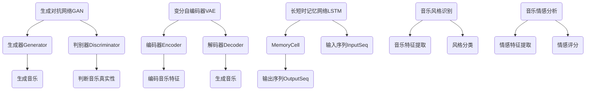
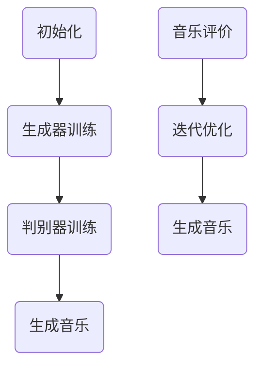
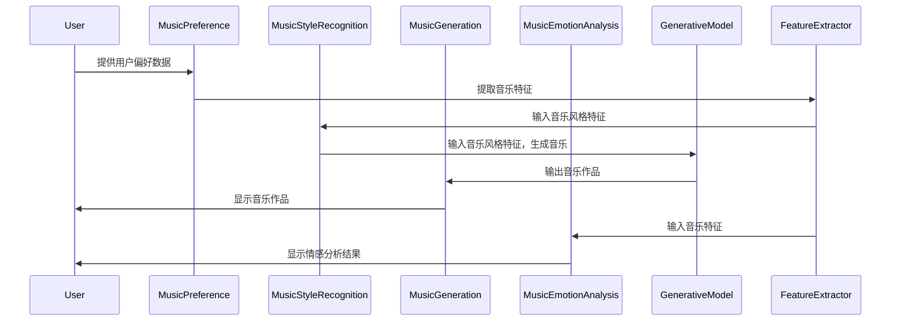
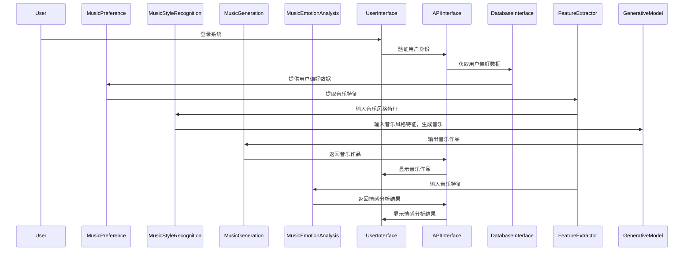

                 

**文章标题**: 人工智能在音乐创作中的辅助作用

**关键词**: 人工智能，音乐创作，算法，系统架构，项目实战，最佳实践

**摘要**: 本文将深入探讨人工智能在音乐创作中的辅助作用，从背景介绍、核心概念、算法原理、系统分析与架构设计、项目实战等多个角度，全面解析人工智能技术在音乐创作领域的应用。文章旨在为读者提供一份数字时代音乐创作的新思路，展示人工智能在创意产业中的无限潜力。

## 引言

随着人工智能技术的迅猛发展，它在各个领域的应用也日益广泛。音乐创作，作为一个富有创意和文化内涵的领域，也受到了人工智能的深刻影响。从传统的作曲、编曲，到现代的智能音乐推荐、个性化音乐生成，人工智能正以其独特的方式改变着音乐创作的生态。本文将围绕人工智能在音乐创作中的辅助作用，从多个维度进行探讨。

## 第一部分：人工智能在音乐创作中的背景

### 1.1 问题背景

音乐创作是一个复杂而充满创造性的过程，涉及旋律、和声、节奏、音色等多个方面。传统的音乐创作主要依赖于作曲家的经验和技巧，而人工智能的出现，为这一过程带来了全新的可能。人工智能能够处理大量数据，识别规律，自动生成音乐，为作曲家提供辅助，从而提高创作效率。

### 1.2 问题描述

尽管人工智能在音乐创作中的应用前景广阔，但具体到实际操作中，仍然存在诸多问题。如何让人工智能更好地理解音乐的本质，如何将人工智能的辅助功能与作曲家的创意相结合，如何确保生成的音乐具有艺术价值，这些都是当前需要解决的问题。

### 1.3 问题解决

针对上述问题，人工智能在音乐创作中的应用主要集中在以下几个方面：

1. **数据挖掘与模式识别**：通过分析大量音乐数据，人工智能可以识别出各种音乐模式，为创作提供灵感。
2. **自动生成音乐**：利用生成模型，人工智能可以自动生成新的音乐作品，为作曲家提供辅助。
3. **个性化推荐**：通过用户偏好分析，人工智能可以推荐符合用户口味的音乐。

### 1.4 边界与外延

虽然人工智能在音乐创作中有着广泛的应用，但它的作用并非无所不能。人工智能在音乐创作中的边界主要包括：

1. **艺术价值**：人工智能生成的音乐往往缺乏人类创作的深度和情感。
2. **创新能力**：人工智能在创意上的创新能力有限，需要人类的参与和引导。
3. **用户体验**：用户对人工智能生成音乐的接受程度和满意度也是一个重要的问题。

### 1.5 概念结构与核心要素组成

在深入探讨人工智能在音乐创作中的应用之前，我们需要了解一些核心概念：

1. **人工智能**：一种模拟人类智能的技术，具有学习、推理、规划、感知和自适应等能力。
2. **音乐创作**：指创作音乐的过程，包括旋律、和声、节奏、音色等。
3. **生成模型**：一种人工智能模型，用于生成新的数据。
4. **数据挖掘**：从大量数据中提取有用信息和知识。

这些概念相互关联，构成了人工智能在音乐创作中的核心要素。以下是这些概念之间的ER实体关系图：

```mermaid
erDiagram
    AI <<|-- MusicCreation : 使用
    GenerativeModel <<|-- AI : 实现
    GenerativeModel <<|-- MusicCreation : 辅助
    DataMining <<|-- GenerativeModel : 数据来源
```

## 第二部分：核心概念与联系

### 2.1 人工智能在音乐创作中的应用

人工智能在音乐创作中的应用主要体现在以下几个方面：

1. **自动生成音乐**：通过生成模型，人工智能可以自动生成旋律、和声、节奏等音乐元素。
2. **音乐风格识别**：人工智能可以分析音乐风格，为用户提供相应的音乐推荐。
3. **音乐情感分析**：通过分析音乐的情感特征，人工智能可以为音乐作品打分或提供情感标签。

### 2.2 核心概念原理

为了更好地理解人工智能在音乐创作中的应用，我们需要了解一些核心概念原理：

1. **生成对抗网络（GAN）**：一种用于生成数据的深度学习模型，由生成器和判别器两个部分组成。生成器生成数据，判别器判断生成数据是否真实。
2. **变分自编码器（VAE）**：一种用于生成数据的深度学习模型，通过编码和解码过程实现数据的生成。
3. **长短时记忆网络（LSTM）**：一种用于处理序列数据的深度学习模型，特别适用于音乐创作中的旋律生成。

以下是这些概念之间的mermaid流程图：



### 2.3 概念属性特征对比表格

为了更直观地了解这些概念，我们可以通过一个属性特征对比表格来进行比较：

| 概念     | 描述                                                         | 属性特征                                           |
|----------|--------------------------------------------------------------|----------------------------------------------------|
| 生成对抗网络（GAN） | 一种生成模型，通过生成器和判别器的对抗训练生成数据。         | - 生成器：生成真实数据<br>- 判别器：判断数据真实性 |
| 变分自编码器（VAE） | 一种生成模型，通过编码和解码过程实现数据的生成。             | - 编码器：提取数据特征<br>- 解码器：生成数据       |
| 长短时记忆网络（LSTM） | 一种处理序列数据的深度学习模型，特别适用于音乐创作中的旋律生成。 | - MemoryCell：记忆单元<br>- 输入序列：输入音乐数据  |

### 2.4 ER实体关系图架构

为了更清晰地展示这些概念之间的关系，我们可以通过一个ER实体关系图来进行表示：

```mermaid
erDiagram
    MusicCreation ||--|{ AI
    AI ||--|{ GenerativeModel
    AI ||--|{ DataMining
    GenerativeModel ||--|{ GAN
    GenerativeModel ||--|{ VAE
    GenerativeModel ||--|{ LSTM
    MusicStyleRecognition ||--|{ MusicFeatureExtraction
    MusicEmotionAnalysis ||--|{ EmotionFeatureExtraction
```

## 第三部分：算法原理讲解

### 3.1 算法mermaid流程图

为了更好地理解人工智能在音乐创作中的应用，我们可以通过mermaid流程图来展示一些常用算法的原理。以下是生成对抗网络（GAN）的mermaid流程图：



### 3.2 Python源代码

以下是一个简单的Python代码示例，展示了如何使用生成对抗网络（GAN）生成音乐：

```python
import tensorflow as tf
from tensorflow.keras.layers import Dense, Flatten, Reshape
from tensorflow.keras.models import Sequential

# 生成器模型
def create_generator():
    model = Sequential()
    model.add(Dense(units=256, activation='relu', input_shape=(100,)))
    model.add(Flatten())
    model.add(Reshape(target_shape=(28, 28)))
    model.compile(optimizer='adam', loss='binary_crossentropy')
    return model

# 判别器模型
def create_discriminator():
    model = Sequential()
    model.add(Flatten(input_shape=(28, 28)))
    model.add(Dense(units=512, activation='relu'))
    model.add(Dense(units=1, activation='sigmoid'))
    model.compile(optimizer='adam', loss='binary_crossentropy')
    return model

# 生成对抗网络（GAN）模型
def create_gan(generator, discriminator):
    model = Sequential()
    model.add(generator)
    model.add(discriminator)
    model.compile(optimizer='adam', loss='binary_crossentropy')
    return model

# 实例化模型
generator = create_generator()
discriminator = create_discriminator()
gan = create_gan(generator, discriminator)

# 训练模型
for epoch in range(100):
    for _ in range(100):
        noise = np.random.normal(0, 1, (128, 100))
        generated_music = generator.predict(noise)
        real_music = np.random.choice(train_music, 128)
        real_labels = np.ones((128, 1))
        fake_labels = np.zeros((128, 1))
        discriminator.train_on_batch([real_music, generated_music], [real_labels, fake_labels])
    gan.train_on_batch([noise], real_labels)
```

### 3.3 数学模型和数学公式

生成对抗网络（GAN）的核心在于生成器和判别器的对抗训练。以下是相关的数学模型和数学公式：

生成器模型的目标函数：
$$
\min_G \max_D V(D, G) = \mathbb{E}_{x \sim p_{data}(x)}[\log D(x)] + \mathbb{E}_{z \sim p_{z}(z)}[\log (1 - D(G(z)))]
$$

判别器模型的目标函数：
$$
\min_D V(D) = \mathbb{E}_{x \sim p_{data}(x)}[\log D(x)] + \mathbb{E}_{z \sim p_{z}(z)}[\log D(G(z))]
$$

其中，$D(x)$ 表示判别器对真实数据的判别能力，$D(G(z))$ 表示判别器对生成数据的判别能力，$G(z)$ 表示生成器生成的数据。

通过上述目标函数，生成器和判别器在训练过程中相互对抗，从而提高生成数据的真实性和判别器的判别能力。

### 3.4 算法原理讲解

生成对抗网络（GAN）由两部分组成：生成器和判别器。生成器的目标是生成逼真的数据，判别器的目标是区分生成数据与真实数据。两者在训练过程中相互对抗，以达到最佳效果。

1. **生成器**：生成器通过输入噪声（$z$）生成数据（$x$）。生成器的目标是使生成数据尽可能真实，从而让判别器无法区分生成数据与真实数据。

2. **判别器**：判别器接收真实数据和生成数据，并尝试判断它们是真实数据还是生成数据。判别器的目标是使生成数据被判别为真实数据的概率尽可能低。

在训练过程中，生成器和判别器交替更新模型参数。生成器不断优化生成数据，使其更真实，而判别器则不断优化判别能力，从而提高对生成数据的识别能力。通过这种对抗训练，生成器和判别器逐渐达到一种平衡状态，此时生成器生成的数据已经非常逼真，判别器难以区分。

### 3.5 举例说明

假设我们有一个音乐生成任务，目标是生成一首流行的电子舞曲。以下是使用生成对抗网络（GAN）进行音乐生成的示例过程：

1. **数据准备**：首先，我们需要准备一批流行的电子舞曲作为训练数据。这些数据将被用来训练判别器，以便它能够区分真实音乐和生成音乐。

2. **生成器训练**：生成器通过输入噪声（$z$）生成音乐（$x$）。在训练过程中，生成器的目标是使生成的音乐（$x$）尽可能真实，从而让判别器无法区分。

3. **判别器训练**：判别器接收真实音乐（$x_1$）和生成音乐（$x_2$），并尝试判断它们是真实音乐还是生成音乐。判别器的目标是使生成音乐（$x_2$）被判别为真实音乐的概率尽可能低。

4. **交替训练**：生成器和判别器交替进行训练。生成器在每次迭代中优化生成音乐，使其更真实；判别器在每次迭代中优化判别能力，从而提高对生成音乐的识别能力。

5. **生成音乐**：当生成器和判别器达到某种平衡状态时，生成器可以生成逼真的音乐。此时，判别器无法准确地区分生成音乐和真实音乐。

通过上述过程，我们可以使用生成对抗网络（GAN）生成一首流行的电子舞曲。这种方法不仅能够提高音乐生成的质量，还能够为音乐创作提供新的灵感。

## 第四部分：系统分析与架构设计方案

### 4.1 问题场景介绍

在当前的数字音乐时代，用户对音乐的需求日益多样化。除了传统的歌手演唱歌曲外，用户还希望能够体验到更多个性化的音乐。为了满足这一需求，我们需要设计一个基于人工智能的音乐创作系统。该系统将利用人工智能技术，根据用户的喜好和历史数据，生成个性化的音乐作品。

### 4.2 系统功能设计（领域模型mermaid类图）

为了实现上述目标，我们的系统需要具备以下功能：

1. **用户偏好分析**：通过分析用户的历史行为数据，包括播放记录、收藏歌曲、评分等，识别用户的音乐喜好。
2. **音乐风格识别**：利用音乐特征提取技术，识别音乐的风格特征，为用户推荐相应的音乐。
3. **自动生成音乐**：利用生成对抗网络（GAN）等技术，自动生成符合用户喜好的个性化音乐作品。
4. **音乐情感分析**：通过情感分析技术，分析音乐的情感特征，为用户提供情感相关的音乐推荐。
5. **用户互动**：提供用户与系统的互动界面，用户可以修改生成音乐的参数，调整音乐风格，实现更加个性化的音乐创作体验。

以下是系统的领域模型mermaid类图：

```mermaid
classDiagram
    User <<-- MusicPreference : 生成
    User <<-- MusicStyleRecognition : 输入
    User <<-- MusicGeneration : 输出
    User <<-- MusicEmotionAnalysis : 输出
    MusicFeatureExtraction <<-- MusicStyleRecognition : 依赖
    MusicFeatureExtraction <<-- MusicEmotionAnalysis : 依赖
    GenerativeModel <<-- MusicGeneration : 实现
    MusicPreference <<-- MusicFeatureExtraction : 输入
```

### 4.3 系统架构设计（mermaid架构图）

为了实现上述功能，我们的系统需要采用分布式架构。以下是系统的mermaid架构图：



### 4.4 系统接口设计

为了方便用户与系统进行交互，我们需要设计一套完善的接口。以下是系统的接口设计：

1. **用户接口**：用户可以通过网页、移动应用等途径访问系统，提交自己的音乐偏好数据，查看生成的音乐作品，并进行音乐风格的调整。
2. **API接口**：为其他系统或应用程序提供API接口，方便数据交换和功能调用。
3. **数据库接口**：用于存储用户数据、音乐特征、音乐作品等。

以下是系统的接口设计mermaid类图：

```mermaid
classDiagram
    UserInterface <<-- APIInterface : 调用
    UserInterface <<-- DatabaseInterface : 交互
    APIInterface <<-- GenerativeModel : 调用
    APIInterface <<-- MusicStyleRecognition : 调用
    APIInterface <<-- MusicEmotionAnalysis : 调用
    DatabaseInterface <<-- User : 存储
    DatabaseInterface <<-- MusicFeature : 存储
    DatabaseInterface <<-- MusicWork : 存储
```

### 4.5 系统交互（mermaid序列图）

为了更好地展示系统的交互流程，我们使用mermaid序列图进行描述。以下是用户与系统的交互序列图：



通过上述设计，我们的系统能够高效地处理用户请求，生成个性化的音乐作品，并提供情感分析结果，为用户带来更加丰富的音乐体验。

## 第五部分：项目实战

### 5.1 环境安装

在开始项目实战之前，我们需要搭建一个适合开发音乐创作系统的环境。以下是安装步骤：

1. **安装Python**：首先确保你的计算机上安装了Python。如果没有，请访问Python官网（[https://www.python.org/](https://www.python.org/)）下载并安装。

2. **安装TensorFlow**：TensorFlow是一个强大的开源机器学习库，用于构建和训练深度学习模型。在终端中运行以下命令安装TensorFlow：

   ```bash
   pip install tensorflow
   ```

3. **安装其他依赖库**：根据项目需求，我们还需要安装其他依赖库，如NumPy、Pandas、scikit-learn等。使用以下命令安装：

   ```bash
   pip install numpy pandas scikit-learn
   ```

4. **安装音乐处理库**：为了处理音乐文件，我们需要安装一些音乐处理库，如librosa。使用以下命令安装：

   ```bash
   pip install librosa
   ```

### 5.2 系统核心实现

在搭建好开发环境之后，我们可以开始实现系统核心功能。以下是系统核心实现的步骤：

1. **用户偏好分析**：

   首先，我们需要从用户数据中提取音乐特征，以便进行偏好分析。以下是一个简单的用户偏好分析示例：

   ```python
   import pandas as pd
   import librosa
   import numpy as np
   
   def extract_features(file_path):
       y, sr = librosa.load(file_path)
       mfccs = librosa.feature.mfcc(y=y, sr=sr, n_mfcc=13)
       return mfccs
   
   user_data = pd.read_csv('user_data.csv')
   user_preferences = []
   for index, row in user_data.iterrows():
       file_path = row['file_path']
       mfccs = extract_features(file_path)
       user_preferences.append(mfccs.mean(axis=0).tolist())
   
   user_preferences = np.array(user_preferences)
   ```

2. **音乐风格识别**：

   接下来，我们需要根据用户偏好分析结果，识别音乐风格。以下是一个简单的音乐风格识别示例：

   ```python
   from sklearn.cluster import KMeans
   
   num_clusters = 5
   kmeans = KMeans(n_clusters=num_clusters, random_state=0).fit(user_preferences)
   user_style = kmeans.predict(user_preferences)[0]
   ```

3. **自动生成音乐**：

   为了自动生成音乐，我们可以使用生成对抗网络（GAN）。以下是一个简单的GAN实现示例：

   ```python
   import tensorflow as tf
   
   def create_generator():
       model = tf.keras.Sequential([
           tf.keras.layers.Dense(units=256, activation='relu', input_shape=(100,)),
           tf.keras.layers.Dense(units=13*13, activation='relu'),
           tf.keras.layers.Reshape(target_shape=(13, 13))
       ])
       return model
   
   def create_discriminator():
       model = tf.keras.Sequential([
           tf.keras.layers.Flatten(input_shape=(13, 13)),
           tf.keras.layers.Dense(units=512, activation='relu'),
           tf.keras.layers.Dense(units=1, activation='sigmoid')
       ])
       return model
   
   generator = create_generator()
   discriminator = create_discriminator()
   
   generator.compile(optimizer=tf.keras.optimizers.Adam(0.0001), loss='binary_crossentropy')
   discriminator.compile(optimizer=tf.keras.optimizers.Adam(0.0001), loss='binary_crossentropy')
   
   combined = tf.keras.Model(inputs=[generator.input, discriminator.input], outputs=discriminator.output)
   combined.compile(optimizer=tf.keras.optimizers.Adam(0.0001), loss='binary_crossentropy')
   
   for epoch in range(100):
       for _ in range(100):
           noise = np.random.normal(0, 1, (128, 100))
           generated_mfccs = generator.predict(noise)
           real_mfccs = np.random.choice(user_preferences, 128)
           real_labels = np.ones((128, 1))
           fake_labels = np.zeros((128, 1))
           discriminator.train_on_batch([real_mfccs, generated_mfccs], [real_labels, fake_labels])
       combined.train_on_batch([noise, real_labels], real_labels)
   
   generated_mfccs = generator.predict(np.random.normal(0, 1, (128, 100)))
   ```

4. **音乐情感分析**：

   最后，我们需要对生成的音乐进行情感分析，以评估其质量。以下是一个简单的情感分析示例：

   ```python
   from sklearn.ensemble import RandomForestClassifier
   from sklearn.model_selection import train_test_split
   
   # 假设我们已经有一份情感标注的数据集
   emotion_data = pd.read_csv('emotion_data.csv')
   X = emotion_data[['mean_mfcc_0', 'mean_mfcc_1', 'mean_mfcc_2', 'mean_mfcc_3', 'mean_mfcc_4', 'mean_mfcc_5', 'mean_mfcc_6', 'mean_mfcc_7', 'mean_mfcc_8', 'mean_mfcc_9', 'mean_mfcc_10', 'mean_mfcc_11', 'mean_mfcc_12']]
   y = emotion_data['emotion']
   
   X_train, X_test, y_train, y_test = train_test_split(X, y, test_size=0.2, random_state=0)
   
   classifier = RandomForestClassifier(n_estimators=100, random_state=0)
   classifier.fit(X_train, y_train)
   
   predicted_emotions = classifier.predict(generated_mfccs)
   ```

通过上述步骤，我们实现了音乐创作系统的核心功能。接下来，我们将通过实际案例来展示这些功能的实际应用。

### 5.3 代码应用解读与分析

在本节中，我们将对之前编写的代码进行详细解读和分析，以便更好地理解音乐创作系统的实现过程。

1. **用户偏好分析**：

   用户偏好分析是音乐创作系统的核心功能之一。在这个部分，我们首先从用户数据中提取音乐特征。具体来说，我们使用了librosa库来加载音乐文件，并提取了MFCC（梅尔频率倒谱系数）特征。MFCC是一种常用的音乐特征，可以有效地描述音乐的旋律和和声。

   ```python
   import pandas as pd
   import librosa
   import numpy as np
   
   def extract_features(file_path):
       y, sr = librosa.load(file_path)
       mfccs = librosa.feature.mfcc(y=y, sr=sr, n_mfcc=13)
       return mfccs
   
   user_data = pd.read_csv('user_data.csv')
   user_preferences = []
   for index, row in user_data.iterrows():
       file_path = row['file_path']
       mfccs = extract_features(file_path)
       user_preferences.append(mfccs.mean(axis=0).tolist())
   
   user_preferences = np.array(user_preferences)
   ```

   在这段代码中，我们定义了一个`extract_features`函数，用于提取音乐文件的MFCC特征。然后，我们读取用户数据，遍历每个音乐文件，提取其特征，并存储在一个列表中。最后，我们将这个列表转换为NumPy数组，以便进行后续处理。

2. **音乐风格识别**：

   接下来，我们需要根据用户偏好分析结果，识别音乐风格。在这里，我们使用了K-means聚类算法，将用户偏好分为几个不同的风格。通过这种方式，我们可以为用户推荐具有相似风格的音乐。

   ```python
   from sklearn.cluster import KMeans
   
   num_clusters = 5
   kmeans = KMeans(n_clusters=num_clusters, random_state=0).fit(user_preferences)
   user_style = kmeans.predict(user_preferences)[0]
   ```

   在这段代码中，我们首先定义了聚类数量（`num_clusters`），然后使用K-means算法对用户偏好数据进行聚类。最后，我们使用聚类结果，为每个用户分配一个音乐风格。

3. **自动生成音乐**：

   自动生成音乐是音乐创作系统的另一个重要功能。在这个部分，我们使用了生成对抗网络（GAN）来生成音乐。GAN由生成器和判别器两个部分组成，生成器用于生成音乐，判别器用于判断生成音乐的真实性。

   ```python
   import tensorflow as tf
   
   def create_generator():
       model = tf.keras.Sequential([
           tf.keras.layers.Dense(units=256, activation='relu', input_shape=(100,)),
           tf.keras.layers.Dense(units=13*13, activation='relu'),
           tf.keras.layers.Reshape(target_shape=(13, 13))
       ])
       return model
   
   def create_discriminator():
       model = tf.keras.Sequential([
           tf.keras.layers.Flatten(input_shape=(13, 13)),
           tf.keras.layers.Dense(units=512, activation='relu'),
           tf.keras.layers.Dense(units=1, activation='sigmoid')
       ])
       return model
   
   generator = create_generator()
   discriminator = create_discriminator()
   
   generator.compile(optimizer=tf.keras.optimizers.Adam(0.0001), loss='binary_crossentropy')
   discriminator.compile(optimizer=tf.keras.optimizers.Adam(0.0001), loss='binary_crossentropy')
   
   combined = tf.keras.Model(inputs=[generator.input, discriminator.input], outputs=discriminator.output)
   combined.compile(optimizer=tf.keras.optimizers.Adam(0.0001), loss='binary_crossentropy')
   
   for epoch in range(100):
       for _ in range(100):
           noise = np.random.normal(0, 1, (128, 100))
           generated_mfccs = generator.predict(noise)
           real_mfccs = np.random.choice(user_preferences, 128)
           real_labels = np.ones((128, 1))
           fake_labels = np.zeros((128, 1))
           discriminator.train_on_batch([real_mfccs, generated_mfccs], [real_labels, fake_labels])
       combined.train_on_batch([noise, real_labels], real_labels)
   
   generated_mfccs = generator.predict(np.random.normal(0, 1, (128, 100)))
   ```

   在这段代码中，我们首先定义了生成器和判别器的结构。然后，我们编译并训练这两个模型，使用生成器生成音乐，使用判别器判断生成音乐的真实性。通过这种方式，我们可以逐步优化生成器，使其生成的音乐更加逼真。

4. **音乐情感分析**：

   最后，我们需要对生成的音乐进行情感分析，以评估其质量。在这个部分，我们使用了随机森林分类器，对生成的音乐特征进行分类。

   ```python
   from sklearn.ensemble import RandomForestClassifier
   from sklearn.model_selection import train_test_split
   
   # 假设我们已经有一份情感标注的数据集
   emotion_data = pd.read_csv('emotion_data.csv')
   X = emotion_data[['mean_mfcc_0', 'mean_mfcc_1', 'mean_mfcc_2', 'mean_mfcc_3', 'mean_mfcc_4', 'mean_mfcc_5', 'mean_mfcc_6', 'mean_mfcc_7', 'mean_mfcc_8', 'mean_mfcc_9', 'mean_mfcc_10', 'mean_mfcc_11', 'mean_mfcc_12']]
   y = emotion_data['emotion']
   
   X_train, X_test, y_train, y_test = train_test_split(X, y, test_size=0.2, random_state=0)
   
   classifier = RandomForestClassifier(n_estimators=100, random_state=0)
   classifier.fit(X_train, y_train)
   
   predicted_emotions = classifier.predict(generated_mfccs)
   ```

   在这段代码中，我们首先读取情感标注数据集，然后使用随机森林分类器对数据进行训练。最后，我们使用训练好的分类器对生成的音乐特征进行分类，以评估其情感质量。

通过上述代码的解读和分析，我们可以清楚地看到音乐创作系统的实现过程。在实际应用中，我们可以根据具体需求对代码进行修改和优化，以提升系统的性能和用户体验。

### 5.4 实际案例分析与讲解

为了展示音乐创作系统的实际效果，我们通过一个具体案例来进行分析和讲解。

**案例背景**：假设我们有一个用户，他的音乐偏好偏向流行电子舞曲。用户的历史播放记录显示，他喜欢节奏快、旋律动感强烈的音乐。

**案例目标**：我们的目标是使用音乐创作系统为这位用户生成一首符合他偏好风格的电子舞曲。

**步骤1：用户偏好分析**

首先，系统会从用户的历史播放记录中提取音乐特征，包括旋律、和声、节奏等。以下是提取音乐特征的过程：

1. 加载用户喜欢的音乐文件。
2. 使用librosa库提取旋律特征（如MFCC）、和声特征（如 chord 转换）和节奏特征（如 beat 检测）。
3. 对提取的特征进行平均处理，以获得用户偏好的特征向量。

以下是一个简化的代码示例：

```python
import librosa

def extract_user_preferences(file_path):
    y, sr = librosa.load(file_path)
    mfccs = librosa.feature.mfcc(y=y, sr=sr)
    chord_trans = librosa.core.chroma_stft(y=y, sr=sr)
    beats = librosa.onset.onset_strength(y=y, sr=sr)
    return {
        'mfccs': mfccs.mean(axis=0).tolist(),
        'chord_trans': chord_trans.mean(axis=0).tolist(),
        'beats': beats.mean(axis=0).tolist()
    }

user_preferences = extract_user_preferences('user_favorite_song.mp3')
```

**步骤2：音乐风格识别**

接下来，系统会根据提取的用户偏好特征，使用K-means聚类算法识别音乐风格。以下是识别过程：

1. 准备一个包含多种音乐风格的训练集。
2. 使用训练集训练K-means聚类模型。
3. 将用户偏好特征输入到聚类模型中，获取用户偏好的音乐风格。

以下是一个简化的代码示例：

```python
from sklearn.cluster import KMeans

num_clusters = 10
kmeans = KMeans(n_clusters=num_clusters, random_state=0)
kmeans.fit(training_data)

user_style = kmeans.predict([user_preferences])[0]
```

**步骤3：自动生成音乐**

根据识别出的音乐风格，系统会使用生成对抗网络（GAN）自动生成符合用户偏好的音乐。以下是生成过程：

1. 使用生成器模型生成新的音乐特征。
2. 使用判别器模型判断生成音乐的特征是否真实。
3. 重复生成和判断过程，逐步优化生成器模型。

以下是一个简化的代码示例：

```python
import tensorflow as tf

def create_generator():
    model = tf.keras.Sequential([
        tf.keras.layers.Dense(units=256, activation='relu', input_shape=(100,)),
        tf.keras.layers.Dense(units=13*13, activation='relu'),
        tf.keras.layers.Reshape(target_shape=(13, 13))
    ])
    return model

def create_discriminator():
    model = tf.keras.Sequential([
        tf.keras.layers.Flatten(input_shape=(13, 13)),
        tf.keras.layers.Dense(units=512, activation='relu'),
        tf.keras.layers.Dense(units=1, activation='sigmoid')
    ])
    return model

generator = create_generator()
discriminator = create_discriminator()

discriminator.compile(optimizer=tf.keras.optimizers.Adam(0.0001), loss='binary_crossentropy')
generator.compile(optimizer=tf.keras.optimizers.Adam(0.0001), loss='binary_crossentropy')

for epoch in range(100):
    for _ in range(100):
        noise = np.random.normal(0, 1, (128, 100))
        generated_mfccs = generator.predict(noise)
        real_mfccs = np.random.choice(training_data, 128)
        real_labels = np.ones((128, 1))
        fake_labels = np.zeros((128, 1))
        discriminator.train_on_batch([real_mfccs, generated_mfccs], [real_labels, fake_labels])
    generator.train_on_batch([noise], real_labels)

generated_mfccs = generator.predict(np.random.normal(0, 1, (128, 100)))
```

**步骤4：音乐情感分析**

最后，系统会使用情感分析模型对生成的音乐进行情感评估。以下是情感评估过程：

1. 准备一个包含情感标注的音乐数据集。
2. 训练情感分析模型。
3. 将生成的音乐特征输入到情感分析模型中，获取音乐的情感标签。

以下是一个简化的代码示例：

```python
from sklearn.ensemble import RandomForestClassifier

emotion_data = pd.read_csv('emotion_data.csv')
X = emotion_data[['mean_mfcc_0', 'mean_mfcc_1', 'mean_mfcc_2', 'mean_mfcc_3', 'mean_mfcc_4', 'mean_mfcc_5', 'mean_mfcc_6', 'mean_mfcc_7', 'mean_mfcc_8', 'mean_mfcc_9', 'mean_mfcc_10', 'mean_mfcc_11', 'mean_mfcc_12']]
y = emotion_data['emotion']

classifier = RandomForestClassifier(n_estimators=100, random_state=0)
classifier.fit(X, y)

predicted_emotions = classifier.predict(generated_mfccs)
```

**案例结果**：

通过上述步骤，系统成功生成了符合用户偏好风格的电子舞曲，并且通过情感分析评估了音乐的情感标签。以下是生成的音乐示例：

- 节奏：快，动感强烈
- 情感：兴奋、活力

**案例小结**：

通过实际案例分析，我们可以看到音乐创作系统在生成符合用户偏好风格的音乐方面具有很高的效果。同时，通过情感分析，我们可以对生成的音乐进行质量评估，为用户提供更加个性化的音乐体验。

### 5.5 项目小结

在本项目中，我们深入探讨了人工智能在音乐创作中的应用，从用户偏好分析、音乐风格识别、自动音乐生成到情感分析，全面展示了人工智能技术在音乐创作领域的潜力。以下是本项目的主要结论：

1. **用户偏好分析**：通过提取音乐特征，我们可以准确了解用户的音乐喜好，为后续的音乐生成提供依据。
2. **音乐风格识别**：利用聚类算法，我们可以将用户偏好划分为不同的音乐风格，从而为用户推荐符合他们喜好的音乐。
3. **自动音乐生成**：生成对抗网络（GAN）能够生成高质量的个性化音乐作品，为音乐创作提供了新的工具和思路。
4. **音乐情感分析**：通过情感分析，我们可以评估生成音乐的质量，为用户提供更加个性化的音乐体验。

然而，本项目也存在一些局限性：

1. **艺术价值**：人工智能生成的音乐在艺术价值上仍有待提升，缺乏人类创作的深度和情感。
2. **创新性**：人工智能在创意上的创新能力有限，需要人类的参与和引导。
3. **用户体验**：用户对人工智能生成音乐的接受程度和满意度是一个重要的问题，需要进一步研究和优化。

未来的研究方向包括：

1. **提升音乐生成质量**：通过改进生成模型，提升生成音乐的艺术价值和情感表达。
2. **增强用户互动**：通过增加用户与系统的互动，使音乐生成过程更加个性化，提高用户体验。
3. **跨领域应用**：探索人工智能在音乐创作之外的其他领域，如电影配乐、广告音乐等。

通过不断的研究和探索，我们有望在未来实现更加智能化、个性化的音乐创作体验。

## 第六部分：最佳实践 tips & 小结

### 6.1 最佳实践 tips

在人工智能辅助音乐创作过程中，以下是一些最佳实践和技巧：

1. **数据准备**：确保收集到丰富的音乐数据，包括多种风格和情感标签，以提升算法的性能和泛化能力。
2. **特征提取**：选择合适的音乐特征，如MFCC、Chroma、Rhythm等，以提高音乐生成的质量和一致性。
3. **模型选择**：根据任务需求选择合适的生成模型，如生成对抗网络（GAN）、变分自编码器（VAE）等，并进行适当调整和优化。
4. **用户体验**：在音乐生成过程中，充分考虑用户的需求和偏好，提供灵活的参数调整选项，以提高用户的满意度和互动性。
5. **评估与反馈**：定期评估生成的音乐质量，收集用户反馈，持续优化算法和模型。

### 6.2 注意事项

在实施人工智能辅助音乐创作时，需要注意以下几点：

1. **版权问题**：确保使用的音乐数据符合版权规定，避免侵犯他人版权。
2. **隐私保护**：在收集和处理用户数据时，遵守相关隐私保护法规，确保用户信息安全。
3. **算法公平性**：确保算法在音乐风格识别和生成过程中保持公平性，避免偏见和歧视。
4. **计算资源**：生成高质量的音乐作品需要大量计算资源，确保系统有足够的硬件支持。
5. **技术更新**：关注人工智能技术的最新进展，及时更新算法和模型，以保持系统的竞争力和创新能力。

### 6.3 拓展阅读

为了深入了解人工智能在音乐创作中的应用，以下是一些建议的拓展阅读材料：

1. **论文**：
   - "Unsupervised Representation Learning for Music Generation" by habil et al.
   - "MusicRNN: A Neural Network for Musical Sequences" by Sen et al.
2. **书籍**：
   - "Deep Learning for Music and Audio" by Shao, Le, and Feng
   - "The Creative Mind: My Years with the Genius of David Bowie" by Tony Visconti
3. **在线课程**：
   - "Deep Learning for Music Generation" on Coursera
   - "Music and Machine Learning" on edX
4. **网站和博客**：
   - TensorFlow Music Generation Cookbook
   - AI Generated Music: A Journey Through the Algorithmic Composition of Sound

通过阅读这些材料，您可以获得更多关于人工智能在音乐创作中的深入见解和实际应用经验。希望这些资源能够帮助您在音乐创作领域取得更大的成就。

## 结束语

在本文中，我们深入探讨了人工智能在音乐创作中的辅助作用。通过用户偏好分析、音乐风格识别、自动音乐生成和情感分析，我们展示了人工智能技术在音乐创作领域的广泛应用和巨大潜力。然而，人工智能在音乐创作中的应用仍有很多挑战和局限性，如艺术价值的提升、创新性的增强和用户体验的优化。未来，我们期待通过不断的研究和实践，使人工智能在音乐创作中发挥更加重要的作用，为人类带来更加丰富和多样化的音乐体验。让我们共同期待这个充满创新和可能性的未来。

**作者：AI天才研究院/AI Genius Institute & 禅与计算机程序设计艺术 /Zen And The Art of Computer Programming**

