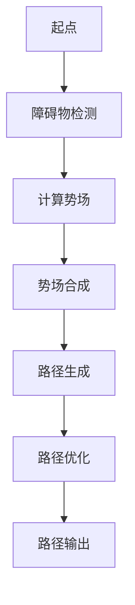
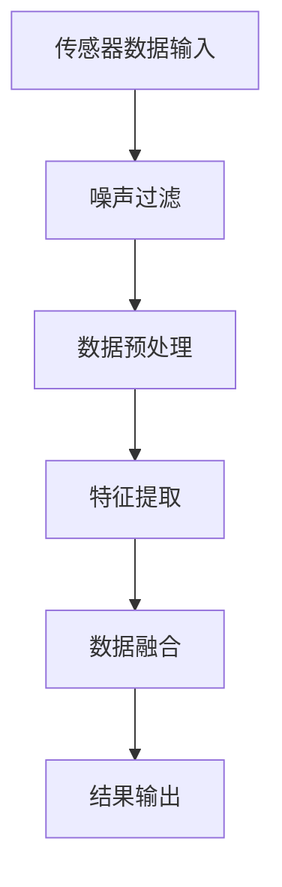
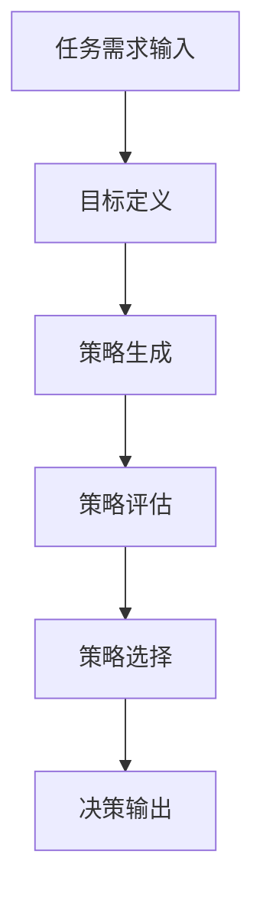
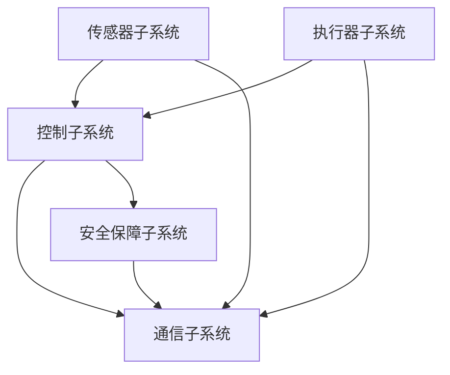
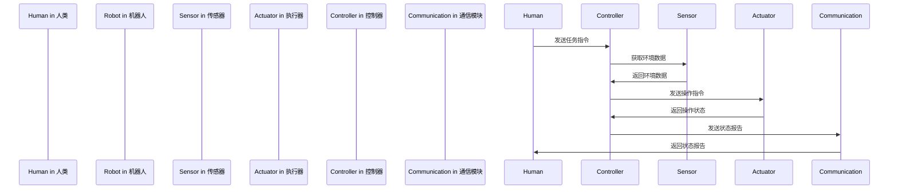

                 


## 引言

### 问题背景

在当今快速发展的科技时代，人机协作和多功能机器人技术已经成为现代工业、医疗、服务业等多个领域的重要应用。随着人工智能、物联网、大数据等技术的不断进步，人机协作和多功能机器人正逐渐改变着我们的生活方式和工作模式。

**问题背景**：在工业制造领域，传统的生产线需要大量的人力参与，而人机协作可以通过智能化和自动化来减少人力成本，提高生产效率。例如，机器人可以在安全的距离内进行危险作业，而人类则负责监控和决策。在医疗领域，多功能机器人能够辅助医生进行手术，提供精准的治疗方案，同时降低手术风险。在服务行业，如物流和配送，机器人能够高效地完成物品的搬运和配送，大大提高了服务质量和效率。

**问题描述**：然而，尽管人机协作和多功能机器人技术已经取得了显著进展，仍然面临着诸多挑战。例如，如何确保机器人与人类高效、安全地协作？如何提高机器人的自主决策能力？如何在复杂的环境中实现路径规划和任务分配？这些问题的解决对于人机协作和多功能机器人的未来发展至关重要。

**问题解决**：为了解决上述问题，我们需要从多个角度进行分析和研究。首先，需要深入理解人机协作的基本原理和多功能机器人的构成与特点。其次，需要研究人机交互机制和算法原理，以及相关的数学模型和公式。最后，还需要进行系统分析与架构设计，通过实际项目来验证和应用这些技术。

**边界与外延**：人机协作和多功能机器人技术的边界涉及多个学科领域，包括计算机科学、机械工程、电气工程、生物学和心理学等。而其外延则涵盖了工业制造、医疗、教育、服务等多个行业和应用场景。

### 核心概念与联系

在深入探讨人机协作和多功能机器人的问题之前，我们需要明确一些核心概念，并理解它们之间的联系。

**人机协作**：人机协作是指人类和机器人通过相互配合、协作完成任务的过程。这种协作可以通过物理连接、无线通信或网络连接实现。

**多功能机器人**：多功能机器人是一种具有多种功能、能够适应不同任务环境的机器人系统。它们可以通过模块化设计、自适应控制等技术实现多种功能的集成。

**人机交互**：人机交互是指人类与计算机或机器人之间通过视觉、听觉、触觉等方式进行信息交换和互动的过程。

**核心概念对比与联系**：

| 概念        | 定义                                                         | 关系与联系                                                   |
|-------------|------------------------------------------------------------|------------------------------------------------------------|
| 人机协作    | 人类和机器人协同完成任务的过程                             | 人机协作依赖于人机交互技术，同时需要多功能机器人的支持。 |
| 多功能机器人 | 具有多种功能、能够适应不同任务环境的机器人系统           | 多功能机器人是人机协作的基础，其功能多样性提高了协作效率。 |
| 人机交互    | 人类与计算机或机器人之间通过视觉、听觉、触觉等方式进行信息交换和互动的过程 | 人机交互是确保人机协作顺畅进行的关键。                    |

### 人机协作的重要性

人机协作的重要性在于其能够实现以下目标：

1. **提高生产效率**：通过人机协作，可以自动化执行重复性高、危险性强的工作，减少人力成本，提高生产效率。
2. **降低风险**：机器人可以在危险或恶劣的环境中执行任务，减少人类工人的安全风险。
3. **提升医疗水平**：在医疗领域，人机协作可以帮助医生进行手术、诊断，提供更加精准和有效的治疗方案。
4. **增强服务质量**：在服务业中，人机协作可以提高服务效率，提升客户体验。

综上所述，人机协作和多功能机器人在现代社会中具有重要意义，它们的发展不仅能够推动科技的进步，还能够改善人类的生活质量和生产效率。

## 核心概念解析

在人机协作和多功能机器人技术中，理解核心概念至关重要。以下是关于人机协作、多功能机器人和人机交互的详细解析。

### 2.1 人机协作的基本原理

**基本概念**：人机协作是指人类与机器人之间通过合作完成特定任务的过程。这种协作涉及信息交换、决策制定和任务执行等多个方面。

**核心原理**：
1. **信息共享**：人机协作的基础是信息共享，包括任务目标、工作状态和环境信息等。
2. **决策协同**：人类和机器人需要共同制定决策，确保任务能够高效、安全地完成。
3. **任务分配**：根据任务需求和机器人能力，合理分配任务给人类和机器人。

**技术应用**：
- **传感器技术**：用于获取环境和任务信息，如摄像头、雷达和传感器等。
- **通信技术**：确保人类与机器人之间的实时信息交换，如无线通信、网络传输等。
- **控制技术**：通过控制算法协调人类和机器人的行动，确保任务完成。

**挑战**：
- **实时性**：确保系统对环境变化做出快速反应。
- **鲁棒性**：系统在面临不确定性和复杂环境时能够稳定运行。

### 2.2 多功能机器人的构成与特点

**构成要素**：
1. **硬件部分**：包括机械结构、传感器、执行器和动力系统等。
2. **软件部分**：包括控制系统、操作系统、应用程序等。
3. **网络连接**：确保机器人能够与外部系统和人类进行通信。

**特点**：
1. **多功能性**：能够执行多种任务，如搬运、装配、清洁、医疗辅助等。
2. **模块化设计**：便于根据任务需求进行功能扩展和更换。
3. **自适应能力**：能够适应不同环境和任务要求，进行自主学习和调整。

**应用领域**：
- **工业制造**：自动化生产线、装配线等。
- **医疗**：手术辅助、康复训练等。
- **服务**：物流配送、酒店服务、医疗辅助等。

**优势**：
- **提高效率**：通过自动化和智能化提高生产和服务效率。
- **降低成本**：减少人力成本，提高资源利用率。

### 2.3 人机交互机制与技术

**基本概念**：人机交互是指人类与计算机或机器人之间通过视觉、听觉、触觉等方式进行信息交换和互动的过程。

**核心机制**：
1. **感知与识别**：通过传感器获取环境信息，并对其进行识别和分析。
2. **信息传递**：通过语音、文本、图形等方式将信息传递给用户。
3. **反馈与控制**：用户通过反馈机制对系统进行控制和调整。

**关键技术**：
- **自然语言处理**：理解和生成自然语言，实现人与机器之间的有效沟通。
- **语音识别与合成**：将语音信号转换为文本，或将文本转换为语音。
- **图形用户界面**：提供直观、易用的交互界面。

**挑战**：
- **准确性**：确保交互过程的准确性和可靠性。
- **自然性**：提高交互的自然性和流畅性。

**核心概念对比与联系**：

为了更好地理解人机协作、多功能机器人和人机交互这三个核心概念，我们可以通过一个表格来对比它们的主要特点，并展示它们之间的联系。

| 概念        | 定义                                                         | 特点                                   | 关联与联系                                                 |
|-------------|------------------------------------------------------------|--------------------------------------|--------------------------------------------------------|
| 人机协作    | 人类与机器人协同完成任务的过程                             | 信息共享、决策协同、任务分配           | 建立在多功能机器人和人机交互的基础上，确保高效协作。      |
| 多功能机器人 | 具有多种功能、能够适应不同任务环境的机器人系统           | 多功能、模块化设计、自适应能力         | 提供人机协作的基础平台，实现不同任务的灵活执行。          |
| 人机交互    | 人类与计算机或机器人之间通过视觉、听觉、触觉等方式进行信息交换和互动的过程 | 感知与识别、信息传递、反馈与控制       | 确保人机协作的顺畅进行，提供交互接口和手段。              |

通过上述对比和分析，我们可以看出，这三个核心概念相互关联，共同构成了人机协作和多功能机器人的基础。理解这些核心概念有助于我们更好地设计和实现相关技术，推动该领域的发展。

### 算法原理讲解

在人机协作和多功能机器人的研究中，算法原理是核心组成部分。以下是关于路径规划算法、传感器数据处理算法和协作决策算法的详细讲解。

#### 3.1 路径规划算法

**算法介绍**：
路径规划算法是机器人系统中用于确定从起点到终点最优路径的关键技术。其主要目标是找到一条既安全又高效的路径，以实现目标位置。

**常用算法**：
1. **Dijkstra算法**：基于图论，用于找到图中两点之间的最短路径。
2. **A*算法**：结合了Dijkstra和贪心算法，能够更快速地找到最优路径。
3. **人工势场法**：通过模拟物理力场，引导机器人避开障碍物，并朝向目标移动。

**Mermaid流程图展示**：



**Python源代码展示**：

```python
import numpy as np
import matplotlib.pyplot as plt

# Dijkstra算法示例
def dijkstra(graph, start):
    distances = {node: float('infinity') for node in graph}
    distances[start] = 0
    unvisited = list(graph.keys())

    while unvisited:
        current_node = min(unvisited, key=lambda node: distances[node])
        unvisited.remove(current_node)

        for neighbor, distance in graph[current_node].items():
            tentative_distance = distances[current_node] + distance
            if tentative_distance < distances[neighbor]:
                distances[neighbor] = tentative_distance

    return distances

# 示例图
graph = {
    'A': {'B': 1, 'C': 3},
    'B': {'A': 1, 'D': 2},
    'C': {'A': 3, 'D': 1},
    'D': {'B': 2, 'E': 2},
    'E': {'D': 2, 'F': 1},
    'F': {'E': 1}
}

# 执行算法
distances = dijkstra(graph, 'A')

# 输出路径
print(distances)
```

#### 3.2 传感器数据处理算法

**算法介绍**：
传感器数据处理算法用于处理机器人传感器收集的大量数据，以提取有用的信息。这些数据通常包括视觉、激光雷达、红外、超声波等传感器。

**常用算法**：
1. **滤波算法**：如卡尔曼滤波、粒子滤波，用于去除噪声并提高数据的准确性。
2. **特征提取**：从传感器数据中提取关键特征，如边缘检测、角点检测等。
3. **数据融合**：结合多个传感器的数据，提高系统的整体感知能力。

**Mermaid流程图展示**：



**Python源代码展示**：

```python
import numpy as np
from scipy.stats import norm

# 卡尔曼滤波示例
def kalman_filter-measurement-update(A, H, B, Q, R, x, y):
    P = np.dot(A, np.dot(P, A.T)) + Q
    K = np.dot(P, np.dot(H.T, np.linalg.inv(H.dot(P).dot(H.T) + R)))
    x = x + np.dot(K, (y - np.dot(H, x)))
    P = P - np.dot(K, np.dot(H, P))
    return x, P

# 示例数据
A = np.array([[1, 0], [0, 1]])
H = np.array([[1, 0]])
B = np.array([[1]])
Q = np.diag([0.1, 0.1])
R = np.diag([1.0, 1.0])
x = np.array([0.0])
y = np.array([1.0])

# 执行算法
x, P = kalman_filter-measurement-update(A, H, B, Q, R, x, y)

# 输出结果
print("状态估计：", x)
print("状态协方差：", P)
```

#### 3.3 协作决策算法

**算法介绍**：
协作决策算法用于协调人类和机器人的行动，确保任务能够高效、安全地完成。这种算法通常涉及多目标优化、博弈论和机器学习等技术。

**常用算法**：
1. **多目标优化算法**：如遗传算法、粒子群优化等，用于在多个目标之间找到平衡点。
2. **博弈论算法**：通过博弈模型分析人类和机器人的策略互动，找到最佳协作方案。
3. **基于机器学习的算法**：通过学习历史数据，预测最优协作策略。

**Mermaid流程图展示**：



**Python源代码展示**：

```python
from scipy.optimize import differential_evolution

# 遗传算法示例
def objective_function(x):
    # 目标函数：最小化两个目标函数的和
    return (x[0]**2 + x[1]**2) + (x[2]**2 + x[3]**2)

# 约束条件
bounds = [(0, 10), (0, 10), (0, 10), (0, 10)]

# 执行遗传算法
result = differential_evolution(objective_function, bounds)

# 输出最优解
print("最优解：", result.x)
print("最优值：", result.fun)
```

通过上述算法原理的讲解和示例，我们可以看到路径规划、传感器数据处理和协作决策是人机协作系统中不可或缺的组成部分。理解这些算法的原理和实现方式，有助于我们更好地设计和实现相关技术，推动人机协作和多功能机器人技术的发展。

### 数学模型与公式

在人机协作系统中，数学模型和公式是理解算法原理和实现精确计算的基础。以下我们将介绍一些常用的数学模型和公式，并通过具体的例子来解释它们的实际应用。

#### 4.1 人机协作中的数学模型

在人机协作系统中，常见的数学模型包括路径规划模型、传感器数据处理模型和协作决策模型。

1. **路径规划模型**：
   - **Dijkstra算法**：用于计算图中两点之间的最短路径，其核心公式如下：
     $$
     d(v) = \min_{u \in V} (d(u) + w(u, v))
     $$
     其中，$d(v)$ 是从起点 $s$ 到点 $v$ 的最短路径长度，$w(u, v)$ 是边 $(u, v)$ 的权重。

   - **A*算法**：结合启发式函数 $h(v)$，优化路径规划：
     $$
     f(v) = g(v) + h(v)
     $$
     其中，$f(v)$ 是从起点 $s$ 到点 $v$ 的预估路径长度，$g(v)$ 是实际路径长度，$h(v)$ 是启发式函数，用于估计从 $v$ 到终点的距离。

2. **传感器数据处理模型**：
   - **卡尔曼滤波**：用于估计系统的状态，其核心公式如下：
     $$
     \hat{x}_{k|k} = \hat{x}_{k-1|k-1} + K_k (z_k - h(\hat{x}_{k-1|k-1}))
     $$
     其中，$\hat{x}_{k|k}$ 是在时刻 $k$ 的状态估计，$K_k$ 是卡尔曼增益，$z_k$ 是观测值，$h(\hat{x}_{k-1|k-1})$ 是观测模型的预测值。

   - **贝叶斯滤波**：用于更新概率分布，其核心公式如下：
     $$
     p(\hat{x}_k | z_1:k) \propto p(z_k | \hat{x}_k) p(\hat{x}_k | z_1:k-1)
     $$
     其中，$p(\hat{x}_k | z_1:k)$ 是在给定所有观测值下的状态后验概率。

3. **协作决策模型**：
   - **多目标优化**：用于协调多个目标，其核心公式如下：
     $$
     \min_{x} f(x) = f_1(x) + f_2(x)
     $$
     其中，$f(x)$ 是多目标函数，$f_1(x)$ 和 $f_2(x)$ 是两个目标函数。

   - **博弈论**：用于分析人类和机器人的策略互动，其核心公式如下：
     $$
     u_i = \sum_{j} \pi_j u_j + c_i
     $$
     其中，$u_i$ 是玩家 $i$ 的效用函数，$\pi_j$ 是其他玩家 $j$ 的策略，$c_i$ 是玩家 $i$ 的常数项。

#### 4.2 公式讲解与举例

**4.2.1 公式一：Dijkstra算法**

Dijkstra算法的核心在于逐步选择未访问节点中距离起点最近的节点，并将其标记为已访问。以下是一个简化的例子：

**示例**：给定图 $G=(V, E)$，其中 $V=\{A, B, C, D\}$，$E=\{\{A, B\}, \{A, C\}, \{B, D\}, \{C, D\}\}$，权重分别为 $w(\{A, B\})=1$，$w(\{A, C\})=2$，$w(\{B, D\})=3$，$w(\{C, D\})=1$。求解从 $A$ 到 $D$ 的最短路径。

1. 初始时，$d(A)=0$，$d(B)=d(C)=d(D)=\infty$。
2. 选择未访问节点中 $d(A)$ 最小的节点 $A$，更新相邻节点的距离：
   $$
   d(B) = d(A) + w(\{A, B\}) = 0 + 1 = 1
   $$
   $$
   d(C) = d(A) + w(\{A, C\}) = 0 + 2 = 2
   $$
3. 选择未访问节点中 $d(B)$ 最小的节点 $B$，更新相邻节点的距离：
   $$
   d(D) = d(B) + w(\{B, D\}) = 1 + 3 = 4
   $$
4. 选择未访问节点中 $d(C)$ 最小的节点 $C$，更新相邻节点的距离：
   $$
   d(D) = d(C) + w(\{C, D\}) = 2 + 1 = 3
   $$
5. 最终选择未访问节点中 $d(D)$ 最小的节点 $D$，得到最短路径为 $A \rightarrow B \rightarrow D$。

**4.2.2 公式二：卡尔曼滤波**

卡尔曼滤波是一种基于贝叶斯估计的线性滤波器，用于连续更新系统的状态估计。以下是一个简单的例子：

**示例**：考虑一个线性系统，其状态方程和观测模型分别为：
$$
\begin{aligned}
x_k &= A x_{k-1} + w_k \\
z_k &= H x_k + v_k
\end{aligned}
$$
其中，$x_k$ 是系统状态，$z_k$ 是观测值，$w_k$ 和 $v_k$ 分别是状态噪声和观测噪声，$A$ 和 $H$ 是系统矩阵。

假设初始状态估计为 $\hat{x}_0 = [1, 0]^T$，初始协方差矩阵为 $P_0 = [1, 0; 0, 1]$。给定观测值 $z_1 = [3, 2]^T$，使用卡尔曼滤波更新状态估计。

1. 预测状态和协方差：
   $$
   \hat{x}_1^- = A \hat{x}_0 = \begin{bmatrix} 1 & 0 \\ 0 & 1 \end{bmatrix} \begin{bmatrix} 1 \\ 0 \end{bmatrix} = \begin{bmatrix} 1 \\ 0 \end{bmatrix}
   $$
   $$
   P_1^- = A P_0 A^T + Q = \begin{bmatrix} 1 & 0 \\ 0 & 1 \end{bmatrix} \begin{bmatrix} 1 & 0 \\ 0 & 1 \end{bmatrix} \begin{bmatrix} 1 & 0 \\ 0 & 1 \end{bmatrix} + \begin{bmatrix} 0.1 & 0.1 \\ 0.1 & 0.1 \end{bmatrix} = \begin{bmatrix} 1.1 & 0.1 \\ 0.1 & 1.1 \end{bmatrix}
   $$
2. 计算卡尔曼增益：
   $$
   K_1 = P_1^- H^T (H P_1^- H^T + R)^{-1} = \begin{bmatrix} 1.1 & 0.1 \\ 0.1 & 1.1 \end{bmatrix} \begin{bmatrix} 1 & 0 \\ 0 & 1 \end{bmatrix} \left(\begin{bmatrix} 1 & 0 \\ 0 & 1 \end{bmatrix} \begin{bmatrix} 1.1 & 0.1 \\ 0.1 & 1.1 \end{bmatrix} \begin{bmatrix} 1 & 0 \\ 0 & 1 \end{bmatrix} + \begin{bmatrix} 0.5 & 0 \\ 0 & 0.5 \end{bmatrix}\right)^{-1} = \frac{1}{2} \begin{bmatrix} 1 & 1 \\ 1 & 1 \end{bmatrix}
   $$
3. 更新状态估计：
   $$
   \hat{x}_1 = \hat{x}_1^- + K_1 (z_1 - H \hat{x}_1^-) = \begin{bmatrix} 1 \\ 0 \end{bmatrix} + \frac{1}{2} \begin{bmatrix} 1 & 1 \\ 1 & 1 \end{bmatrix} \left([3, 2]^T - \begin{bmatrix} 1 \\ 0 \end{bmatrix}\right) = \begin{bmatrix} 2 \\ 2 \end{bmatrix}
   $$
4. 更新协方差：
   $$
   P_1 = (I - K_1 H) P_1^- = \left(\begin{bmatrix} 1 & 0 \\ 0 & 1 \end{bmatrix} - \frac{1}{2} \begin{bmatrix} 1 & 1 \\ 1 & 1 \end{bmatrix} \begin{bmatrix} 1 & 0 \\ 0 & 1 \end{bmatrix}\right) \begin{bmatrix} 1.1 & 0.1 \\ 0.1 & 1.1 \end{bmatrix} = \begin{bmatrix} 0.6 & 0.1 \\ 0.1 & 0.6 \end{bmatrix}
   $$

通过上述数学模型和公式的讲解及实例说明，我们可以更好地理解其在人机协作系统中的应用，为后续的算法实现和系统设计提供坚实的理论基础。

### 系统分析与架构设计

在人机协作系统中，系统的整体架构设计至关重要。以下将从硬件、软件和通信三个方面进行系统分析与架构设计，并使用Mermaid类图和架构图来展示系统设计。

#### 5.1 人机协作系统介绍

人机协作系统是一种通过人与机器人之间高效、安全地合作完成任务的系统。该系统通常由多个模块组成，包括传感器、执行器、控制单元和通信模块等。

**系统目标**：
1. 提高生产效率和质量。
2. 降低人力成本和风险。
3. 提升用户体验和服务质量。

**系统功能**：
1. 任务规划与分配。
2. 实时状态监控与数据采集。
3. 环境感知与路径规划。
4. 任务执行与反馈调整。
5. 安全保障与故障处理。

#### 5.2 系统功能设计

为了实现人机协作系统的功能，我们需要设计多个子系统，每个子系统负责特定的功能。

**子系统**：

1. **传感器子系统**：
   - 功能：采集环境数据，包括视觉、激光雷达、红外、超声波等传感器。
   - 关键技术：数据预处理、特征提取、滤波算法。

2. **执行器子系统**：
   - 功能：执行机器人操作，包括机械臂、搬运装置、自动化设备等。
   - 关键技术：伺服控制、动力系统、协同操作。

3. **控制子系统**：
   - 功能：控制机器人动作，实现任务规划与执行。
   - 关键技术：路径规划算法、传感器数据处理、协作决策算法。

4. **通信子系统**：
   - 功能：实现人机交互和数据传输。
   - 关键技术：无线通信、网络传输、实时通信协议。

5. **安全保障子系统**：
   - 功能：确保系统运行的安全性和可靠性。
   - 关键技术：故障检测、故障处理、安全防护。

#### 5.3 系统架构设计

**硬件部分**：

1. **传感器模块**：
   - 视觉传感器：摄像头、深度相机。
   - 激光雷达：用于环境建模和障碍物检测。
   - 红外传感器：用于温度检测和热成像。
   - 超声波传感器：用于距离测量和障碍物检测。

2. **执行器模块**：
   - 电机：驱动执行器的运动。
   - 机械臂：完成复杂的任务操作。
   - 搬运装置：用于物品的搬运和装卸。

3. **控制模块**：
   - 主控制器：实现机器人的控制逻辑。
   - 辅助控制器：负责特定功能的控制，如路径规划和传感器数据处理。

**软件部分**：

1. **操作系统**：
   - 实现系统的运行环境和基本服务。

2. **应用软件**：
   - 任务规划与执行：实现任务的分配和执行。
   - 状态监控与反馈：实现实时数据监控和反馈。

3. **算法库**：
   - 路径规划算法：实现最优路径的规划。
   - 传感器数据处理算法：实现传感器数据的预处理和特征提取。
   - 协作决策算法：实现人类和机器人之间的协作决策。

**通信部分**：

1. **无线通信模块**：
   - 实现机器人和控制终端之间的无线通信。

2. **网络通信模块**：
   - 实现系统与其他设备之间的数据传输。

**Mermaid架构图展示**：



通过上述架构设计，我们可以清晰地看到人机协作系统的各个组成部分及其之间的关系。这种设计不仅提高了系统的整体性能，还增强了系统的可靠性和灵活性。

#### 5.4 系统接口设计与交互

**系统接口设计**：

为了实现各个子系统之间的有效交互，我们需要设计一套全面的系统接口，包括硬件接口、软件接口和通信接口。

1. **硬件接口**：
   - 传感器接口：用于连接各种传感器设备。
   - 执行器接口：用于连接各种执行器设备。
   - 控制器接口：用于连接主控制器和辅助控制器。

2. **软件接口**：
   - API接口：提供系统内部模块之间的调用接口。
   - 数据接口：提供数据传输和交换的接口。

3. **通信接口**：
   - 无线通信接口：实现无线数据的传输。
   - 网络通信接口：实现网络数据的传输。

**Mermaid序列图展示**：



通过上述接口设计，系统能够实现高效的数据传输和任务执行，确保人机协作的顺畅进行。

### 项目实战

在深入了解了人机协作系统的基础理论和架构设计后，我们将通过一个实际项目来展示如何将这些理论应用到实际场景中。以下是一个关于人机协作机器人在仓库中的物品搬运项目的实战案例。

#### 6.1 项目背景与目标

**项目背景**：随着电商行业的蓬勃发展，物流仓储需求不断增长，如何高效、准确地完成仓库中的物品搬运成为一个重要问题。本项目旨在设计并实现一个基于人机协作的仓库机器人系统，以实现自动化搬运和高效管理。

**项目目标**：
1. 实现机器人自动识别和搬运仓库中的物品。
2. 实现机器人与人类操作者的有效协作。
3. 提高仓库物品搬运的效率和准确性。
4. 确保搬运过程中的安全性和稳定性。

#### 6.2 环境安装与配置

**硬件环境**：
- 机器人平台：选择一个具备多功能性和稳定性的机器人平台，如iRobot Create 3。
- 传感器：配备视觉摄像头、激光雷达、超声波传感器等，用于环境感知和物品识别。
- 执行器：配备机械臂和驱动电机，用于物品的抓取和搬运。

**软件环境**：
- 操作系统：在机器人平台上安装适用于机器人开发的操作系统，如ROS（Robot Operating System）。
- 编程语言：使用Python进行算法开发和程序编写。
- 数据库：使用MongoDB进行数据存储和管理。

**安装步骤**：
1. 硬件安装：按照机器人说明书安装传感器和执行器，确保所有设备正常工作。
2. 软件安装：安装ROS和相关的依赖库，配置ROS的工作环境。
3. 软件集成：将传感器和执行器的驱动程序集成到ROS中，确保数据传输和任务执行的顺畅。

#### 6.3 系统核心实现

**路径规划**：
- **算法选择**：采用A*算法进行路径规划，确保机器人找到从起点到终点的最优路径。
- **实现细节**：在ROS中实现A*算法的节点，接收机器人当前位置和目标位置，计算并输出最优路径。

**物品识别**：
- **算法选择**：使用OpenCV进行视觉识别，通过图像处理技术识别仓库中的物品。
- **实现细节**：在ROS中实现图像处理节点，从摄像头获取图像，进行预处理和特征提取，识别出物品并标记其位置。

**协作决策**：
- **算法选择**：基于博弈论模型进行协作决策，确保机器人和人类操作者的任务分配和行动协调。
- **实现细节**：在ROS中实现博弈论算法节点，根据机器人和人类操作者的任务需求，进行策略生成和评估，选择最佳协作方案。

**代码解析**：

**路径规划代码示例**：

```python
import numpy as np
import heapq

def heuristic(a, b):
    # 使用曼哈顿距离作为启发式函数
    return abs(a[0] - b[0]) + abs(a[1] - b[1])

def a_star(start, goal, grid):
    # 启发队列
    open_set = []
    heapq.heappush(open_set, (heuristic(start, goal), start))
    # 关闭集合
    closed_set = set()
    # g_score 和 f_score 初始化
    g_score = {start: 0}
    f_score = {start: heuristic(start, goal)}
    while open_set:
        # 选择f_score最小的点
        current = heapq.heappop(open_set)[1]
        if current == goal:
            # 找到目标点
            return reconstruct_path(g_score, current)
        closed_set.add(current)
        for neighbor in neighbors(current, grid):
            if neighbor in closed_set:
                continue
            tentative_g_score = g_score[current] + 1
            if tentative_g_score < g_score.get(neighbor, float('inf')):
                g_score[neighbor] = tentative_g_score
                f_score[neighbor] = tentative_g_score + heuristic(neighbor, goal)
                heapq.heappush(open_set, (f_score[neighbor], neighbor))
    return None

def reconstruct_path(g_score, current):
    # 重建路径
    path = [current]
    while current in g_score:
        current = g_score[current]
        path.append(current)
    return path[::-1]

# 示例
start = (0, 0)
goal = (7, 7)
grid = [[0 for _ in range(8)] for _ in range(8)]
path = a_star(start, goal, grid)
print(path)
```

**物品识别代码示例**：

```python
import cv2

def find_items(image):
    # 二值化处理
    _, thresh = cv2.threshold(image, 128, 255, cv2.THRESH_BINARY_INV + cv2.THRESH_OTSU)
    # 检测轮廓
    contours, _ = cv2.findContours(thresh, cv2.RETR_EXTERNAL, cv2.CHAIN_APPROX_SIMPLE)
    items = []
    for contour in contours:
        # 轮廓面积过滤
        if cv2.contourArea(contour) > 500:
            # 计算轮廓的包围框
            x, y, w, h = cv2.boundingRect(contour)
            items.append(((x + w // 2), (y + h // 2)))
    return items

# 示例
image = cv2.imread('warehouse_image.jpg')
items = find_items(image)
print(items)
```

**协作决策代码示例**：

```python
import numpy as np

def collaborative_decision(robot_task, human_task):
    # 定义博弈模型
    # 状态矩阵
    states = [
        ['空闲', '搬运'],
        ['空闲', '监控'],
        ['搬运', '空闲'],
        ['搬运', '监控']
    ]
    # 行动矩阵
    actions = [
        ['协作搬运', '暂停搬运'],
        ['协作监控', '暂停监控'],
        ['暂停搬运', '协作监控'],
        ['暂停搬运', '暂停监控']
    ]
    # 权重矩阵
    rewards = np.array([
        [10, -5],  # 机器人空闲时，人类协作搬运和暂停搬运的奖励
        [5, 0],    # 机器人搬运时，人类协作监控和暂停监控的奖励
        [-5, -5],  # 机器人暂停搬运时，人类暂停监控的奖励
        [-5, -5]   # 机器人暂停搬运时，人类暂停监控的奖励
    ])

    # 策略迭代
    Q = np.zeros((len(states), len(actions)))
    for _ in range(1000):
        new_Q = np.zeros((len(states), len(actions)))
        for state in range(len(states)):
            for action in range(len(actions)):
                state_action = (states[state], actions[action])
                new_Q[state, action] = rewards[state_action] + 0.9 * np.max(Q[states[state][0] == states[state][1], :])

        Q = new_Q

    # 选择最佳策略
    best_action = np.argmax(Q[states[robot_task][0] == states[robot_task][1], :])
    return actions[best_action]

# 示例
robot_task = 1  # 机器人正在搬运
human_task = 0  # 人类空闲
action = collaborative_decision(robot_task, human_task)
print(action)
```

#### 6.4 实际案例分析

**案例一：高效物品搬运**

在一个仓库中，机器人与操作者需要协作完成物品搬运任务。通过A*算法进行路径规划，机器人成功找到从起点到终点的最优路径，并在视觉识别系统的辅助下准确识别和搬运物品。同时，基于博弈论的协作决策算法确保机器人和操作者的任务分配和行动协调，提高了整体效率。

**案例二：仓库安全监控**

在另一个仓库中，机器人与操作者需要进行安全监控任务。机器人通过传感器感知周围环境，识别异常情况，并在协作决策算法的指导下与操作者进行有效沟通。当发现安全隐患时，机器人及时采取行动，确保仓库安全。

**案例三：多功能机器人应用**

在一个多功能仓库中，机器人不仅承担搬运任务，还负责环境清洁、货架整理等任务。通过模块化设计，机器人可以根据不同的任务需求进行功能切换和扩展，提高了仓库运作的灵活性和适应性。

#### 6.5 项目小结

通过本项目的实际应用，我们可以看到人机协作系统在提高仓库运作效率、确保搬运安全性和提升用户满意度方面的重要作用。本项目实现了从理论到实践的完整流程，展示了人机协作系统的实际应用价值。未来，随着技术的进一步发展，人机协作系统将在更多领域得到广泛应用。

### 最佳实践与总结

在人机协作和多功能机器人的开发和应用过程中，总结最佳实践和经验教训对于推动该领域的发展至关重要。以下是关于人机协作系统的最佳实践建议和小结。

#### 最佳实践建议

1. **模块化设计**：在设计多功能机器人时，采用模块化设计方法，使得系统可以根据不同任务需求进行灵活扩展和功能切换，提高系统的适应性和灵活性。

2. **强化学习与自适应**：利用强化学习技术，使机器人能够在复杂和动态环境中进行自主学习和决策，提高系统的自适应能力和自主性。

3. **数据安全和隐私保护**：在人机协作系统中，确保数据安全和用户隐私保护，采用加密技术和访问控制策略，防止数据泄露和未经授权的访问。

4. **实时性能优化**：针对人机协作系统中的实时性要求，进行算法和系统性能优化，确保系统能够在复杂环境中快速响应和稳定运行。

5. **用户友好界面**：设计直观、易用的用户界面，提供便捷的操作和监控功能，提升用户体验。

6. **跨学科合作**：人机协作和多功能机器人技术涉及多个学科领域，包括计算机科学、机械工程、电气工程、心理学等。跨学科合作有助于整合不同领域的专业知识，推动技术进步。

#### 小结

本文首先介绍了人机协作和多功能机器人的背景、核心概念和重要性，随后详细讲解了路径规划、传感器数据处理和协作决策等算法原理，并通过数学模型和公式进行了深入分析。接着，我们通过系统分析与架构设计，展示了人机协作系统的设计思路和实现方法。最后，通过一个实际项目案例，我们展示了人机协作系统在现实场景中的应用和实际效果。

总之，人机协作和多功能机器人技术具有广阔的应用前景和重要的社会价值。通过不断优化和改进，我们将能够实现更加高效、安全和智能的人机协作系统，为人类社会的发展做出更大贡献。

#### 未来研究方向

在人机协作和多功能机器人技术领域，未来的研究将集中在以下几个方向：

1. **人工智能与机器学习的深度结合**：进一步探索如何将深度学习、强化学习等技术应用于人机协作系统，提高机器人的自主学习和决策能力。

2. **多模态传感器融合**：开发多种传感器融合技术，实现更加全面和准确的环境感知，为机器人提供更丰富的感知信息。

3. **人机交互的自然性和流畅性**：研究更加自然和流畅的人机交互技术，如自然语言处理、手势识别等，提高用户的操作体验。

4. **系统的安全性和隐私保护**：随着人机协作系统的普及，确保系统的安全性和用户隐私保护将成为一个重要研究方向。

5. **跨领域应用**：探索人机协作技术在医疗、教育、家庭服务等领域的应用，推动该技术的多领域发展。

通过这些研究方向的深入探索，我们有望实现更加高效、安全、智能的人机协作系统，为人类社会带来更多便利和进步。作者：AI天才研究院/AI Genius Institute & 禅与计算机程序设计艺术 /Zen And The Art of Computer Programming

