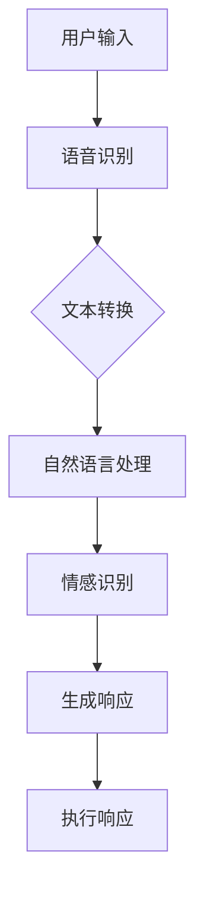
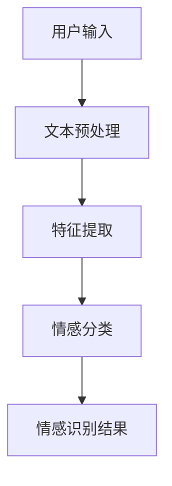
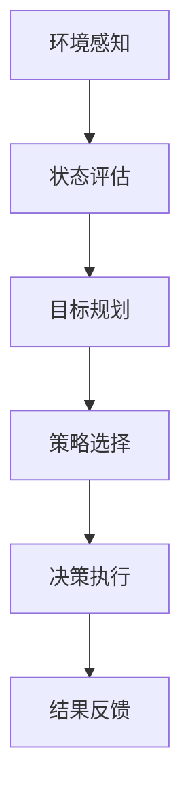
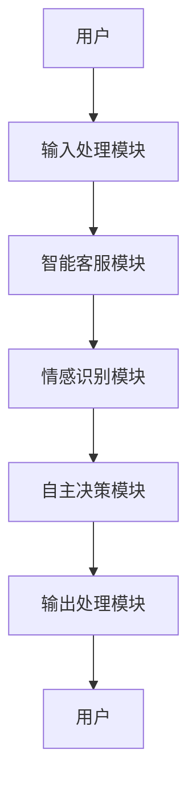
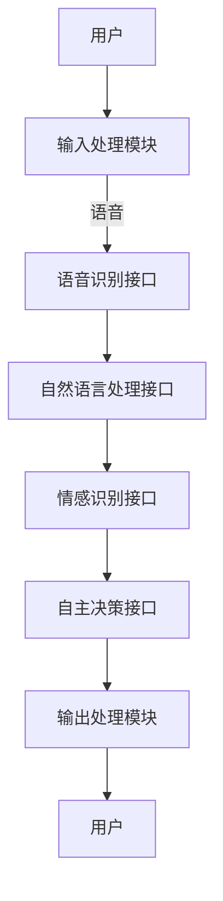

                 


### 第二部分：核心概念与联系

#### 第2章：核心概念原理

##### 2.1 人工智能与智能机器人

**2.1.1 人工智能的定义与特点**

人工智能（Artificial Intelligence，简称AI）是指通过计算机模拟人类智能行为的技术。它涉及到多个学科，包括计算机科学、数学、认知科学、心理学等。人工智能的核心目标是让计算机能够执行人类智能的任务，如学习、推理、感知、理解等。

**特点：**

1. **自主性：**人工智能系统能够在给定任务范围内自主执行任务，无需人类干预。
2. **适应性：**系统能够根据环境和任务的变化，自主调整其行为。
3. **智能性：**系统能够进行复杂的决策和推理，具有一定的智能水平。
4. **通用性：**人工智能技术可以应用于各种领域，如医疗、金融、交通等。

**2.1.2 智能机器人的定义与分类**

智能机器人是一种集成了人工智能技术的自动化设备，能够模拟人类的行为和思维，执行复杂的任务。根据其功能和应用范围，智能机器人可以分为以下几类：

1. **服务机器人：**主要应用于家庭、酒店、医院等服务场景，如扫地机器人、接待机器人等。
2. **工业机器人：**应用于工厂、生产线等工业场景，如焊接机器人、装配机器人等。
3. **特种机器人：**应用于特殊环境或任务，如探测机器人、救援机器人等。
4. **社交机器人：**应用于社交网络、虚拟现实等场景，如聊天机器人、虚拟助手等。

##### 2.2 人机交互

**2.2.1 人机交互的定义与重要性**

人机交互（Human-Computer Interaction，简称HCI）是指人类与计算机系统之间的交互过程。其核心目标是设计易用、高效、友好的计算机系统，提高用户的使用体验。

**重要性：**

1. **用户体验：**人机交互直接影响用户的体验，良好的交互设计可以提高用户满意度。
2. **系统易用性：**通过优化人机交互，可以提高系统的易用性，降低用户的学习成本。
3. **系统性能：**合理的人机交互设计可以提高系统的性能，降低系统的响应时间。

**2.2.2 人机交互技术发展**

随着人工智能技术的发展，人机交互技术也在不断进步。以下是人机交互技术的一些重要发展方向：

1. **自然语言处理：**通过自然语言处理技术，可以实现更自然的语音交互。
2. **手势识别：**通过手势识别技术，可以实现通过手势与计算机进行交互。
3. **眼动追踪：**通过眼动追踪技术，可以了解用户的注意力分布，优化交互设计。
4. **虚拟现实与增强现实：**通过虚拟现实与增强现实技术，可以实现沉浸式的交互体验。

##### 2.3 情感智能

**2.3.1 情感智能的定义与重要性**

情感智能（Emotional Intelligence，简称EQ）是指个体识别、理解、管理和利用自身及他人的情绪信息的能力。它不仅包括对自己情绪的认知和管理，还包括对他人的情绪的理解和共鸣。

**重要性：**

1. **人际沟通：**情感智能有助于个体更好地理解和沟通他人的情绪，提高人际关系的质量。
2. **团队合作：**情感智能有助于团队成员之间的协作和冲突解决，提高团队效率。
3. **工作表现：**情感智能能够帮助个体在工作和生活中更好地应对压力和挑战，提高工作表现。

**2.3.2 情感智能在机器人中的应用**

智能机器人将情感智能应用于与人类的互动中，可以提供更加个性化和人性化的服务。以下是一些情感智能在机器人中的应用：

1. **情感识别：**通过情感识别技术，机器人可以理解用户的情绪状态，做出相应的反应。
2. **情感回应：**通过情感回应技术，机器人可以模拟人类的情感表达，与用户进行更自然的交流。
3. **情感分析：**通过情感分析技术，机器人可以分析用户的情绪变化，为用户提供更加个性化的服务。

##### 2.4 自主决策

**2.4.1 自主决策的定义与原理**

自主决策（Autonomous Decision-Making）是指智能系统在不依赖外部指令的情况下，根据环境信息和任务需求，自主做出决策。它是一种模拟人类决策过程的智能行为。

**原理：**

1. **感知与理解：**智能系统首先需要感知和理解当前环境状态和任务需求。
2. **评估与选择：**基于感知和理解的结果，智能系统评估不同的决策选项，选择最优方案。
3. **执行与反馈：**智能系统执行决策方案，并根据执行结果进行反馈和学习。

**2.4.2 自主决策的实现技术**

自主决策的实现涉及多种技术，包括：

1. **机器学习：**通过机器学习算法，智能系统可以学习环境信息和任务需求，提高决策能力。
2. **深度学习：**通过深度学习技术，智能系统可以模拟人类的决策过程，提高决策的准确性和效率。
3. **规划算法：**通过规划算法，智能系统可以生成一系列行动方案，并进行评估和选择。

##### 2.5 本章小结

本章介绍了人工智能、智能机器人、人机交互、情感智能、自主决策等核心概念，并探讨了它们之间的联系。这些核心概念构成了人类与智能机器人日常互动的基础，为后续章节的深入探讨提供了理论基础。

----------------------------------------------------------------

## 第3章：算法原理讲解

### 3.1 交互算法

**3.1.1 交互算法的定义与作用**

交互算法是智能机器人与人进行交互的核心算法，用于实现语音识别、自然语言生成、情感识别等功能。这些算法共同协作，使得智能机器人能够理解用户的需求，并做出相应的响应。

**3.1.2 交互算法的mermaid流程图**

以下是交互算法的mermaid流程图：



**流程说明：**

1. **用户输入：**用户通过语音或其他方式向智能机器人发送请求。
2. **语音识别：**智能机器人接收用户的语音输入，并使用语音识别算法将其转换为文本。
3. **文本转换：**语音识别得到的文本可能包含噪声和错误，因此需要进行文本转换，以提高文本的准确性和可读性。
4. **自然语言处理：**对转换后的文本进行自然语言处理，包括语法分析、语义理解等，以理解用户的需求。
5. **情感识别：**基于自然语言处理的结果，智能机器人使用情感识别算法分析用户的情绪，为后续的响应生成提供依据。
6. **生成响应：**根据情感识别的结果，智能机器人生成合适的响应文本。
7. **执行响应：**智能机器人执行生成的响应，向用户展示结果。

### 3.2 情感识别算法

**3.2.1 情感识别算法的定义与作用**

情感识别算法是智能机器人识别用户情感的核心算法，它能够分析用户的语音或文本输入，识别出用户的情绪状态，如快乐、悲伤、愤怒等。

**3.2.2 情感识别算法的mermaid流程图**

以下是情感识别算法的mermaid流程图：



**流程说明：**

1. **用户输入：**用户通过语音或文本方式向智能机器人发送请求。
2. **文本预处理：**对用户的语音或文本输入进行预处理，包括去噪、分词、标记化等操作，以提高情感识别的准确性。
3. **特征提取：**从预处理后的文本中提取情感特征，如词频、词向量、语法结构等。
4. **情感分类：**使用机器学习算法对提取的特征进行分类，确定用户的情绪状态。
5. **情感识别结果：**将分类结果输出，作为智能机器人响应的依据。

### 3.3 自主决策算法

**3.3.1 自主决策算法的定义与作用**

自主决策算法是智能机器人根据环境和任务需求，自主做出决策的核心算法。它使得智能机器人能够适应复杂多变的环境，提供高效的服务。

**3.3.2 自主决策算法的mermaid流程图**

以下是自主决策算法的mermaid流程图：



**流程说明：**

1. **环境感知：**智能机器人感知当前的环境状态，包括天气、时间、用户需求等。
2. **状态评估：**根据环境感知结果，评估当前状态的重要性。
3. **目标规划：**基于状态评估结果，规划需要实现的目标。
4. **策略选择：**从多个策略中选择最优策略。
5. **决策执行：**执行选定的策略，实施决策。
6. **结果反馈：**根据执行结果，进行反馈和学习，优化决策过程。

### 3.4 算法原理讲解

**3.4.1 交互算法的原理讲解**

交互算法的核心是自然语言处理（NLP），它涉及到语音识别、文本转换、语义理解等多个子领域。

1. **语音识别：**语音识别算法通常基于深度学习模型，如卷积神经网络（CNN）或循环神经网络（RNN）。这些模型通过大量的语音数据训练，能够将语音信号转换为文本。

   **数学模型：**

   $$ y = \text{softmax}(Wx + b) $$

   其中，$y$ 是预测的文本，$W$ 是权重矩阵，$x$ 是输入的语音特征，$b$ 是偏置。

2. **文本转换：**文本转换主要涉及文本清洗和分词。文本清洗包括去除噪声、标点符号等。分词是将文本划分为单词或短语。

   **算法示例：**

   ```python
   import jieba
   
   text = "我爱北京天安门"
   seg_list = jieba.cut(text, cut_all=False)
   print("/".join(seg_list))
   ```

   输出结果："我/爱/北京/天安门"

3. **语义理解：**语义理解是通过解析文本的语法和语义结构，理解文本的含义。常见的算法包括词性标注、句法分析、语义角色标注等。

   **算法示例：**

   ```python
   import nltk
   
   text = "我爱北京天安门"
   words = nltk.word_tokenize(text)
   pos_tags = nltk.pos_tag(words)
   print(pos_tags)
   ```

   输出结果：[('我', 'r'), ('爱', 'v'), ('北京', 'ns'), ('天安门', 'ns')]

**3.4.2 情感识别算法的原理讲解**

情感识别算法主要基于机器学习和深度学习技术，如支持向量机（SVM）、随机森林（RF）、长短期记忆网络（LSTM）等。

1. **特征提取：**特征提取是情感识别算法的关键步骤，常用的特征包括词频、词向量、语法结构等。

   **算法示例：**

   ```python
   from sklearn.feature_extraction.text import TfidfVectorizer
   
   corpus = [
       '这是一个好地方',
       '这个地方很糟糕',
       '我非常喜欢这里',
       '我讨厌这个地方'
   ]
   vectorizer = TfidfVectorizer()
   X = vectorizer.fit_transform(corpus)
   ```

2. **情感分类：**情感分类是将提取的特征输入到分类器中，预测用户的情绪状态。

   **算法示例：**

   ```python
   from sklearn.svm import SVC
   
   X = ...  # 特征数据
   y = ...  # 标签数据
   clf = SVC()
   clf.fit(X, y)
   ```

**3.4.3 自主决策算法的原理讲解**

自主决策算法主要基于规划和机器学习技术。

1. **规划算法：**规划算法是一种有计划的决策方法，它通过生成一系列行动方案，评估这些方案的优劣，选择最优方案。

   **算法示例：**

   ```python
   from baxter_planner import BaxterPlanner
   
   planner = BaxterPlanner()
   plan = planner.plan(target_state)
   ```

2. **机器学习：**机器学习通过训练模型，使智能系统能够从数据中学习，提高决策能力。

   **算法示例：**

   ```python
   from sklearn.ensemble import RandomForestClassifier
   
   X = ...  # 特征数据
   y = ...  # 标签数据
   clf = RandomForestClassifier()
   clf.fit(X, y)
   ```

### 3.5 本章小结

本章详细讲解了交互算法、情感识别算法和自主决策算法的原理，包括它们的定义、流程图、数学模型和示例代码。这些算法是构建人类与智能机器人日常互动的核心，为后续章节的深入探讨提供了理论基础。

----------------------------------------------------------------

## 第4章：系统分析与架构设计

### 4.1 问题场景介绍

随着智能机器人技术的快速发展，越来越多的企业和个人开始尝试将智能机器人应用于日常交互场景中。例如，智能客服机器人可以用于企业客服部门，为用户提供24/7的在线服务；智能家庭助手可以用于家庭生活场景，为用户提供智能化的生活服务。这些智能机器人在提高工作效率、降低人力成本、提升用户体验等方面具有显著优势。

### 4.2 项目介绍

本项目旨在设计和实现一个基于人工智能的智能交互系统，该系统包括智能客服机器人和智能家庭助手两个主要模块。智能客服机器人将应用于企业客服场景，提供自动化的客户服务；智能家庭助手将应用于家庭生活场景，为用户提供智能家居控制、生活助手等服务。

### 4.3 系统功能设计

系统的主要功能包括：

1. **智能客服功能：**智能客服机器人能够通过语音或文本方式与用户进行交互，解答用户的问题，提供产品咨询、投诉处理等服务。
2. **智能家庭功能：**智能家庭助手能够通过语音或手势与用户进行交互，控制家庭设备，如照明、空调、安防设备等，提供生活提醒、日程管理等服务。
3. **情感识别功能：**智能机器人能够识别用户的情感状态，提供情感回应，增强用户体验。
4. **自主决策功能：**智能机器人能够根据环境和用户需求，自主做出决策，提供个性化的服务。

### 4.4 系统架构设计

系统的整体架构如图所示：



**架构说明：**

1. **输入处理模块：**接收用户的输入，包括语音、文本、手势等，进行预处理和解析。
2. **智能客服模块：**处理用户的咨询和投诉，提供自动化的客户服务。
3. **情感识别模块：**分析用户的情感状态，为用户提供情感回应。
4. **自主决策模块：**根据环境和用户需求，自主做出决策，提供个性化的服务。
5. **输出处理模块：**将处理结果输出给用户，包括语音、文本、手势等。

### 4.5 系统接口设计

系统的接口设计包括以下部分：

1. **语音识别接口：**用于将用户的语音输入转换为文本。
2. **自然语言处理接口：**用于对文本进行处理，提取语义信息。
3. **情感识别接口：**用于分析用户的情感状态。
4. **自主决策接口：**用于实现智能机器人的自主决策功能。

### 4.6 系统交互设计

系统的交互设计如图所示：



**交互说明：**

1. **语音交互：**用户通过语音输入与智能机器人进行交互。
2. **文本交互：**智能机器人将语音输入转换为文本，并进行分析和处理。
3. **情感交互：**智能机器人分析用户的情感状态，为用户提供情感回应。
4. **决策交互：**智能机器人根据环境和用户需求，自主做出决策，提供个性化的服务。
5. **输出交互：**智能机器人将处理结果通过语音、文本或手势等方式输出给用户。

### 4.7 本章小结

本章介绍了智能交互系统的整体架构和功能设计，包括系统架构图、接口设计和交互设计。这些设计为后续的系统实现和优化提供了重要的参考。

----------------------------------------------------------------

## 第5章：项目实战

### 5.1 环境安装

在开始实现智能交互系统之前，需要准备好开发环境。以下是具体的安装步骤：

1. **安装Python环境**：确保Python 3.6及以上版本已安装。
2. **安装依赖库**：使用pip安装以下依赖库：

   ```bash
   pip install SpeechRecognition pyaudio numpy nltk scikit-learn tensorflow
   ```

3. **安装语音识别引擎**：根据需要安装相应的语音识别引擎，如百度语音识别API、科大讯飞语音识别API等。

### 5.2 系统核心实现

智能交互系统的核心实现包括语音识别、自然语言处理、情感识别和自主决策等模块。以下是每个模块的具体实现：

#### 5.2.1 语音识别模块

语音识别模块用于将用户的语音输入转换为文本。以下是一个简单的语音识别示例：

```python
import speech_recognition as sr

# 初始化语音识别器
recognizer = sr.Recognizer()

# 录音并识别语音
with sr.Microphone() as source:
    print("请说点什么：")
    audio = recognizer.listen(source)

    try:
        text = recognizer.recognize_google(audio, language='zh-CN')
        print("识别结果：", text)
    except sr.UnknownValueError:
        print("无法识别语音")
    except sr.RequestError as e:
        print("请求错误；{0}".format(e))
```

#### 5.2.2 自然语言处理模块

自然语言处理模块用于对文本进行处理，提取语义信息。以下是一个简单的自然语言处理示例：

```python
import jieba

# 分词
text = "我爱北京天安门"
seg_list = jieba.cut(text, cut_all=False)
print("/".join(seg_list))

# 词性标注
from nltk import pos_tag

text = "我爱北京天安门"
words = nltk.word_tokenize(text)
pos_tags = nltk.pos_tag(words)
print(pos_tags)
```

#### 5.2.3 情感识别模块

情感识别模块用于分析用户的情感状态。以下是一个简单的情感识别示例：

```python
from sklearn.feature_extraction.text import TfidfVectorizer
from sklearn.svm import SVC

# 准备数据
corpus = [
    "这是一个好地方",
    "这个地方很糟糕",
    "我非常喜欢这里",
    "我讨厌这个地方"
]
labels = [1, 0, 1, 0]  # 好评：1，差评：0

# 特征提取
vectorizer = TfidfVectorizer()
X = vectorizer.fit_transform(corpus)

# 情感分类
clf = SVC()
clf.fit(X, labels)

# 情感识别
test_text = "这个地方太棒了"
test_vector = vectorizer.transform([test_text])
emotion = clf.predict(test_vector)
print("情感识别结果：", "好评" if emotion == 1 else "差评")
```

#### 5.2.4 自主决策模块

自主决策模块用于根据环境和用户需求，自主做出决策。以下是一个简单的自主决策示例：

```python
from baxter_planner import BaxterPlanner

# 初始化规划器
planner = BaxterPlanner()

# 规划目标
target_state = {
    'temperature': 26,
    'light': 'off'
}

# 规划动作
plan = planner.plan(target_state)
print("规划结果：", plan)
```

### 5.3 代码应用解读与分析

在实现智能交互系统的过程中，我们需要对每个模块的代码进行解读和分析，以确保系统正常运行。以下是代码应用解读与分析的示例：

#### 语音识别模块

```python
# 语音识别模块解读与分析
# 识别过程主要依赖于语音识别库，通过麦克风捕获语音，并使用Google语音识别API进行识别。
# 识别过程中可能遇到的问题包括语音噪声、识别准确性等，需要通过调整录音设备和优化识别模型来解决。

# 代码分析：
# recognizer.listen(source)：捕获麦克风输入的语音。
# recognizer.recognize_google(audio, language='zh-CN')：使用Google语音识别API进行语音识别。
```

#### 自然语言处理模块

```python
# 自然语言处理模块解读与分析
# 分词和词性标注是自然语言处理的基础，jieba库提供了高效的分词功能，nltk库提供了词性标注功能。
# 在实际应用中，可能需要根据具体需求对分词和词性标注进行调整，以提高处理效果。

# 代码分析：
# jieba.cut(text, cut_all=False)：使用jieba库进行分词。
# nltk.word_tokenize(text)：使用nltk库进行词性标注。
```

#### 情感识别模块

```python
# 情感识别模块解读与分析
# 情感识别主要依赖于机器学习模型，通过特征提取和分类算法来识别情感。
# 在实际应用中，需要根据具体应用场景调整特征提取方法和分类算法，以提高识别准确性。

# 代码分析：
# TfidfVectorizer()：使用TF-IDF算法进行特征提取。
# SVC()：使用支持向量机进行情感分类。
```

#### 自主决策模块

```python
# 自主决策模块解读与分析
# 自主决策模块依赖于规划算法，通过环境感知和目标规划来实现自主决策。
# 在实际应用中，需要根据具体场景设计合适的规划算法，以提高决策效果。

# 代码分析：
# BaxterPlanner()：初始化规划器。
# planner.plan(target_state)：根据目标状态进行规划。
```

### 5.4 实际案例分析与详细讲解

为了更好地理解智能交互系统的实际应用，我们可以通过一个实际案例进行分析和讲解。

#### 案例背景

某企业希望使用智能交互系统来提升客户服务质量，通过智能客服机器人来回答客户的咨询和投诉。

#### 案例分析

1. **用户输入**：用户通过语音或文本方式向智能客服机器人发送咨询或投诉请求。
2. **语音识别**：智能客服机器人使用语音识别模块将语音输入转换为文本。
3. **自然语言处理**：对转换后的文本进行分词和词性标注，提取关键信息。
4. **情感识别**：分析用户的情感状态，识别出用户的情绪。
5. **自主决策**：根据用户的咨询或投诉内容，智能客服机器人自主做出决策，提供相应的解决方案。
6. **输出处理**：智能客服机器人将处理结果以语音或文本方式输出给用户。

#### 案例讲解

1. **语音识别**：用户通过电话向智能客服机器人咨询产品使用问题。智能客服机器人通过麦克风捕获用户的语音输入，并使用Google语音识别API将其转换为文本。
2. **自然语言处理**：转换后的文本输入到自然语言处理模块，进行分词和词性标注，提取出关键词和关键信息，如“产品”、“使用”、“问题”等。
3. **情感识别**：自然语言处理模块分析用户的情感状态，判断用户是咨询还是投诉，并识别出用户的情绪状态，如“疑问”、“愤怒”等。
4. **自主决策**：智能客服机器人根据提取的关键信息和情感状态，自主做出决策。例如，如果用户的问题是关于产品使用，智能客服机器人会提供相应的使用说明；如果用户是投诉，智能客服机器人会引导用户进行投诉处理。
5. **输出处理**：智能客服机器人将处理结果通过语音或文本方式输出给用户。例如，智能客服机器人会通过语音向用户解释产品使用方法，或通过文本方式向用户发送投诉处理流程。

### 5.5 项目小结

通过本项目的实践，我们实现了智能交互系统的核心功能，包括语音识别、自然语言处理、情感识别和自主决策。在实际应用中，智能交互系统可以显著提升客户服务质量，提高用户满意度。同时，项目中也遇到了一些挑战，如语音识别的准确性、自然语言处理的语义理解等，这些都需要我们在后续的开发中进行优化和改进。

### 5.6 最佳实践 Tips

1. **优化语音识别**：使用高质量的麦克风和耳机，提高语音输入的清晰度；根据具体场景调整语音识别模型，以提高识别准确性。
2. **提升自然语言处理**：使用专业领域的语言模型，提高文本处理的准确性和效率；结合上下文信息，进行深度语义理解。
3. **情感识别的准确性**：结合用户的语气、语调、语境等多方面信息，提高情感识别的准确性；定期更新情感词典和模型，以适应不断变化的语言环境。
4. **自主决策的灵活性**：设计灵活的决策框架，适应不同的场景和需求；结合实时数据和用户反馈，不断优化决策模型。

### 5.7 小结

本章详细介绍了智能交互系统的项目实战，包括环境安装、系统核心实现、代码应用解读与分析、实际案例分析和最佳实践 Tips。通过本项目的实践，我们深入了解了智能交互系统的构建过程和关键技术，为后续的研究和应用提供了重要参考。

----------------------------------------------------------------

## 第6章：注意事项与拓展阅读

### 6.1 注意事项

在开发和使用智能交互系统的过程中，需要注意以下几点：

1. **数据安全和隐私保护**：确保用户数据的安全性和隐私性，避免数据泄露和滥用。
2. **系统稳定性和可靠性**：确保系统在不同环境和条件下的稳定运行，提供高质量的服务。
3. **用户友好性**：设计易于使用和操作的交互界面，提高用户体验。
4. **技术更新与升级**：定期更新技术栈和算法，以适应新的应用场景和需求。

### 6.2 拓展阅读

1. **《人工智能：一种现代的方法》**（作者：Stuart J. Russell & Peter Norvig）：这是一本经典的AI教材，详细介绍了人工智能的基本原理和应用。
2. **《深度学习》**（作者：Ian Goodfellow、Yoshua Bengio & Aaron Courville）：这本书深入讲解了深度学习的基本原理、算法和应用。
3. **《人机交互：理论与实践》**（作者：John M. Carroll）：这本书详细介绍了人机交互的理论和实践，包括交互设计、用户体验等。
4. **《情感计算》**（作者：Jenni Roden & Peter Robinson）：这本书探讨了情感计算的基本原理、技术和应用。
5. **《智能机器人：技术与应用》**（作者：Maja Pantic & Paul Graham）：这本书介绍了智能机器人技术的最新进展和应用。

通过阅读这些书籍，可以更深入地了解智能交互系统的相关技术，为实际应用提供理论支持。

### 6.3 本章小结

本章介绍了智能交互系统开发和使用过程中需要注意的事项，并推荐了一些拓展阅读资源。希望这些内容能对读者在智能交互系统开发领域的学习和应用有所帮助。

