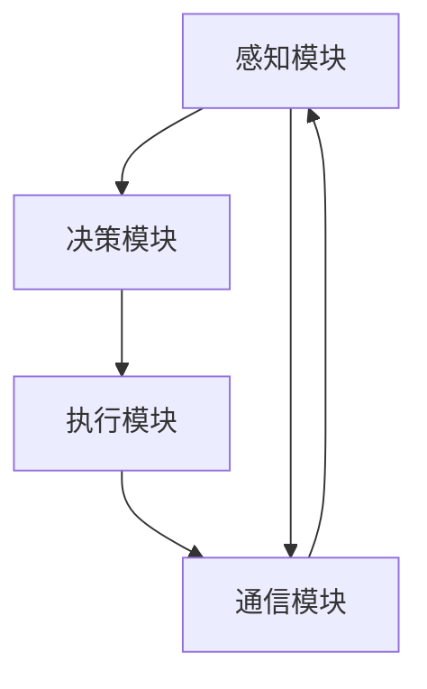
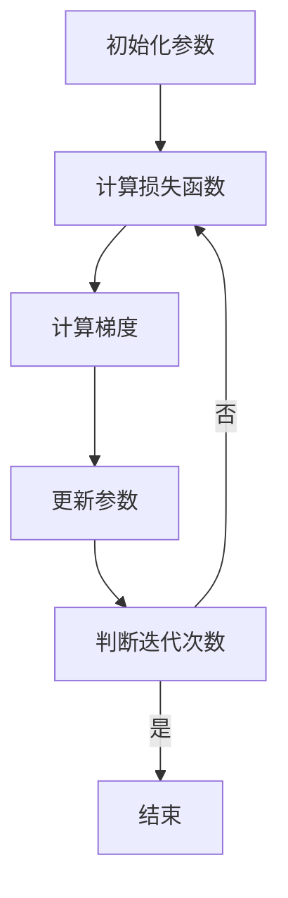

                 

### 代理型AI：实现虚拟劳动力的希望

关键词：代理型AI、虚拟劳动力、人工智能、自动化、深度学习、自然语言处理

摘要：随着人工智能技术的不断进步，代理型AI成为实现虚拟劳动力的重要工具。本文将深入探讨代理型AI的起源与背景，其基础技术，核心原理，实践应用，开发与部署，面临的挑战与未来展望，以及最佳实践和案例分析。通过逐步分析，我们希望揭示代理型AI如何改变我们的工作方式，并展望其未来的发展前景。

---

### 目录大纲设计

为了确保文章的逻辑清晰、结构紧凑且易于理解，本文的目录大纲设计如下：

1. **第一部分：代理型AI概述**
   - **第1章：代理型AI的起源与背景**
     - 代理型AI的定义与核心概念
     - 问题背景与需求分析
     - 代理型AI的应用领域
   - **第2章：代理型AI的基础技术**
     - 自然语言处理（NLP）
     - 机器学习与深度学习
     - 计算机视觉
   - **第3章：代理型AI的核心原理**
     - 代理型AI的架构设计
     - 代理型AI的决策过程
     - 代理型AI的交互机制

2. **第二部分：代理型AI的实践应用**
   - **第4章：代理型AI的实践应用**
     - 虚拟客服
     - 自动化流程管理
     - 在线教育与培训

3. **第三部分：代理型AI的开发与部署**
   - **第5章：代理型AI的开发与部署**
     - 开发环境与工具
     - 部署与运维
     - 性能优化与评估

4. **第四部分：代理型AI的挑战与未来展望**
   - **第6章：代理型AI的挑战与未来展望**
     - 挑战分析
     - 未来展望

5. **第五部分：代理型AI的最佳实践与案例分析**
   - **第7章：代理型AI的最佳实践与案例分析**
     - 最佳实践
     - 案例分析

6. **总结**
   - **总结**
     - 书籍总结
     - 阅读建议
     - 拓展阅读

---

### 第一部分：代理型AI概述

#### 第1章：代理型AI的起源与背景

**1.1 代理型AI的定义与核心概念**

代理型AI，即Agent-based Artificial Intelligence，是一种模拟人类行为和决策能力的人工智能系统。它通过自主感知环境、执行任务和与其他代理或人类互动，实现自动化和智能化。代理型AI的核心概念包括自主性、社交性、反应性和适应性。

自主性指的是代理能够独立地完成特定任务，而不需要人类的干预。社交性则强调代理能够与其他代理或人类进行有效的通信和协作。反应性要求代理能够实时响应环境变化。而适应性则是指代理能够通过学习和调整行为策略来适应不同的环境。

**1.2 问题背景与需求分析**

随着全球劳动力市场的变化和技术的快速发展，企业面临着日益激烈的竞争压力。传统的人力资源管理方式已无法满足现代企业的需求，尤其是在客户服务、业务流程自动化和教育培训等领域。这些问题驱动了代理型AI的发展。

在客户服务方面，人工客服的成本高且效率低，无法满足24/7的需求。在业务流程自动化方面，许多流程需要高度定制化和灵活性，传统的自动化工具难以实现。在教育培训方面，传统教育方式无法满足个性化学习的需求，需要新的教学模式。

**1.3 代理型AI的应用领域**

代理型AI在多个领域展现出了巨大的应用潜力：

- **虚拟劳动力**：虚拟客服、虚拟助手、自动化客服系统等。
- **企业自动化**：自动化流程管理、自动化决策支持系统、自动化财务报表等。
- **教育与培训**：在线教育平台、个性化学习系统、虚拟导师等。
- **医疗保健**：智能诊断系统、健康监测系统、远程医疗等。

#### 第2章：代理型AI的基础技术

**2.1 自然语言处理（NLP）**

自然语言处理是代理型AI的重要组成部分，它使机器能够理解和生成人类语言。NLP的关键技术包括文本预处理、词性标注、句法分析、语义理解和机器翻译等。

**2.2 机器学习与深度学习**

机器学习和深度学习为代理型AI提供了强大的学习能力。机器学习通过算法从数据中学习模式和规律，而深度学习则通过神经网络模型进行层次化特征提取。这些技术使得代理能够进行预测、分类和生成等任务。

**2.3 计算机视觉**

计算机视觉使机器能够理解和解析视觉信息。计算机视觉的关键技术包括图像识别、目标检测、图像分割和视频分析等。

#### 第3章：代理型AI的核心原理

**3.1 代理型AI的架构设计**

代理型AI的架构设计包括感知模块、决策模块、执行模块和通信模块。感知模块负责收集环境信息，决策模块根据感知信息进行决策，执行模块执行决策，通信模块则负责与其他代理或人类进行通信。

**3.2 代理型AI的决策过程**

代理型AI的决策过程通常包括感知环境、评估状态、选择行动和执行行动。这一过程通常依赖于机器学习算法和决策树等模型。

**3.3 代理型AI的交互机制**

代理型AI的交互机制包括命令式交互和声明式交互。命令式交互是代理按照给定的指令执行任务，而声明式交互则是代理根据其当前状态自主决策。

---

### 第二部分：代理型AI的实践应用

#### 第4章：代理型AI的实践应用

**4.1 虚拟客服**

虚拟客服是代理型AI在客户服务领域的重要应用。通过自然语言处理和机器学习技术，虚拟客服系统能够理解和回答用户的问题，提供24/7的服务。

**4.2 自动化流程管理**

自动化流程管理利用代理型AI技术，帮助企业实现业务流程的自动化。这包括自动化数据处理、自动化决策支持和自动化报告生成等。

**4.3 在线教育与培训**

在线教育与培训是代理型AI在教育领域的重要应用。通过虚拟导师和个性化学习系统，代理型AI能够提供定制化的学习体验，提高学习效果。

---

### 第三部分：代理型AI的开发与部署

#### 第5章：代理型AI的开发与部署

**5.1 开发环境与工具**

开发代理型AI需要合适的开发环境和工具。常见的开发环境包括Python、Java和C++等，而工具则包括TensorFlow、PyTorch和Keras等。

**5.2 部署与运维**

代理型AI的部署需要考虑性能、可扩展性和安全性。常见的部署方法包括云服务和边缘计算。运维则包括监控、日志分析和故障排除等。

**5.3 性能优化与评估**

性能优化是确保代理型AI高效运行的关键。常见的优化方法包括模型压缩、算法优化和硬件加速等。性能评估则包括准确率、响应时间和资源消耗等指标。

---

### 第四部分：代理型AI的挑战与未来展望

#### 第6章：代理型AI的挑战与未来展望

**6.1 挑战分析**

代理型AI面临的技术挑战包括数据隐私、算法透明度和可靠性等。法律与伦理挑战则包括责任归属、隐私保护和人权等。

**6.2 未来展望**

代理型AI的发展前景广阔。随着技术的不断进步，代理型AI将更好地融入我们的生活和工作，为人类带来更多便利。

---

### 第五部分：代理型AI的最佳实践与案例分析

#### 第7章：代理型AI的最佳实践与案例分析

**7.1 最佳实践**

最佳实践包括数据预处理、模型选择、训练和部署等。这些实践有助于提高代理型AI的性能和可靠性。

**7.2 案例分析**

案例分析将展示代理型AI在不同领域的成功应用，并提供详细的实现过程和效果评估。

---

### 总结

本文对代理型AI进行了全面的探讨，从其概述、基础技术、核心原理、实践应用到开发与部署、挑战与未来展望，以及最佳实践和案例分析。通过逐步分析，我们看到了代理型AI如何改变我们的工作方式，并对其未来充满了期待。

作者：AI天才研究院/AI Genius Institute & 禅与计算机程序设计艺术 /Zen And The Art of Computer Programming

---

### 完整性要求

为了确保文章内容的完整性，每个章节都进行了详细的设计和内容填充。以下是每个章节的核心内容要求：

1. **背景介绍**
   - **核心概念术语说明**：明确解释代理型AI的定义、核心概念和技术术语。
   - **问题背景**：分析代理型AI产生的社会需求和技术需求。
   - **问题描述**：具体阐述代理型AI在实际应用中面临的问题和挑战。
   - **问题解决**：探讨代理型AI如何解决这些问题，以及其优势和局限性。
   - **边界与外延**：明确代理型AI的应用范围和限制。
   - **概念结构与核心要素组成**：梳理代理型AI的基本架构和关键组件。

2. **核心概念与联系**
   - **核心概念原理**：深入讲解代理型AI的核心原理，如感知、决策和执行。
   - **概念属性特征对比表格**：提供表格形式的对比，展示不同概念之间的差异。
   - **ER实体关系图架构**：使用Mermaid流程图展示代理型AI的实体关系和交互模式。

3. **算法原理讲解**
   - **Mermaid流程图**：使用Mermaid画出算法的流程图，帮助读者理解算法的执行过程。
   - **Python源代码**：提供实现算法的Python代码，详细阐述代码的功能和逻辑。
   - **算法原理的数学模型和公式**：讲解算法背后的数学原理，使用LaTeX格式书写公式。
   - **举例说明**：通过具体例子展示算法的应用，使读者更容易理解。

4. **系统分析与架构设计方案**
   - **问题场景介绍**：描述代理型AI的应用场景，如虚拟客服、自动化流程管理等。
   - **项目介绍**：介绍代理型AI项目的背景、目标和预期成果。
   - **系统功能设计**：使用Mermaid类图展示系统的领域模型，明确系统的主要功能和模块。
   - **系统架构设计**：使用Mermaid架构图展示系统的整体架构，包括关键组件和交互关系。
   - **系统接口设计**：详细描述系统的接口设计，包括API文档和接口调用流程。
   - **系统交互**：使用Mermaid序列图展示系统的交互过程，明确各组件之间的交互方式。

5. **项目实战**
   - **环境安装**：提供详细的安装步骤和所需的软件环境。
   - **系统核心实现源代码**：提供实现代理型AI系统的核心代码，并进行注释和解读。
   - **代码应用解读与分析**：分析代码的实现细节和关键点，解释代码的功能和设计理念。
   - **实际案例分析和详细讲解剖析**：通过实际案例展示系统的应用效果，并详细剖析系统的实现过程。
   - **项目小结**：总结项目的实现过程、遇到的问题和解决方案，以及项目的成果和不足。

6. **最佳实践 tips**
   - **实践经验总结**：总结代理型AI开发与部署的最佳实践，如数据预处理技巧、模型优化方法等。
   - **注意事项**：列出在代理型AI开发过程中需要注意的问题和潜在风险。

7. **拓展阅读**
   - **书籍推荐**：推荐与代理型AI相关的优秀书籍和资源，帮助读者进一步学习和研究。
   - **学术论文**：引用相关的学术论文，提供更深入的学术探讨。

通过上述完整性的要求，本文确保了每个章节的内容都能全面、深入地讲解代理型AI的相关知识，使读者能够系统地理解和掌握这一领域的关键技术和应用。

---

### 代理型AI：实现虚拟劳动力的希望

代理型AI，即Agent-based Artificial Intelligence，是近年来人工智能领域的一个热门研究方向。它通过模拟人类的感知、决策和执行过程，实现自动化和智能化，从而在多个领域展现出巨大的应用潜力。本文将深入探讨代理型AI的核心概念、基础技术、核心原理、实践应用、开发与部署、挑战与未来展望，以及最佳实践和案例分析。

#### 核心概念与原理

代理型AI的基本架构包括感知模块、决策模块、执行模块和通信模块。感知模块负责收集环境信息，决策模块根据感知信息进行决策，执行模块执行决策，通信模块则负责与其他代理或人类进行通信。这种架构使得代理型AI能够自主地适应环境变化，并与其他系统或人协作完成任务。

代理型AI的核心原理在于其自主性、社交性和反应性。自主性指的是代理能够独立地完成特定任务，而不需要人类的干预。社交性则强调代理能够与其他代理或人类进行有效的通信和协作。反应性要求代理能够实时响应环境变化。此外，适应性也是代理型AI的一个重要特征，它使得代理能够通过学习和调整行为策略来适应不同的环境。

#### 基础技术

代理型AI的实现依赖于多个基础技术的支持，包括自然语言处理（NLP）、机器学习与深度学习、计算机视觉等。

自然语言处理（NLP）是代理型AI的重要组成部分，它使机器能够理解和生成人类语言。NLP的关键技术包括文本预处理、词性标注、句法分析、语义理解和机器翻译等。通过这些技术，代理型AI能够与人类进行自然语言交互，从而实现智能化服务。

机器学习与深度学习为代理型AI提供了强大的学习能力。机器学习通过算法从数据中学习模式和规律，而深度学习则通过神经网络模型进行层次化特征提取。这些技术使得代理能够进行预测、分类和生成等任务，从而提高其自主性和适应性。

计算机视觉使机器能够理解和解析视觉信息。计算机视觉的关键技术包括图像识别、目标检测、图像分割和视频分析等。这些技术使得代理型AI能够在视觉环境中进行任务执行，如无人驾驶、机器人和智能监控等。

#### 实践应用

代理型AI在多个领域展现出了巨大的应用潜力，包括虚拟劳动力、企业自动化、教育与培训、医疗保健等。

在虚拟劳动力方面，代理型AI可以通过虚拟客服、虚拟助手和自动化客服系统等，实现24/7的客户服务，提高企业效率和服务质量。

在企业自动化方面，代理型AI可以自动化业务流程管理，如自动化数据处理、自动化决策支持和自动化报告生成等，从而提高企业运营效率和降低成本。

在教育与培训方面，代理型AI可以通过在线教育平台和个性化学习系统，提供定制化的学习体验，提高学习效果。

在医疗保健方面，代理型AI可以通过智能诊断系统、健康监测系统和远程医疗等，提供智能化的医疗服务，提高医疗质量和效率。

#### 开发与部署

开发代理型AI需要合适的开发环境和工具。常见的开发环境包括Python、Java和C++等，而工具则包括TensorFlow、PyTorch和Keras等。在开发过程中，需要关注数据预处理、模型选择、训练和部署等环节。

部署代理型AI需要考虑性能、可扩展性和安全性。常见的部署方法包括云服务和边缘计算。在运维方面，需要关注监控、日志分析和故障排除等。

#### 挑战与未来展望

代理型AI面临着多个挑战，包括技术挑战和法律与伦理挑战。技术挑战主要包括数据隐私、算法透明度和可靠性等。法律与伦理挑战则包括责任归属、隐私保护和人权等。

未来，随着技术的不断进步，代理型AI将更好地融入我们的生活和工作，为人类带来更多便利。它将在自动化、智能化和个性化服务方面发挥越来越重要的作用。

#### 最佳实践与案例分析

代理型AI的最佳实践包括数据预处理、模型选择、训练和部署等。在数据预处理方面，需要确保数据的质量和多样性。在模型选择方面，需要根据具体应用场景选择合适的模型。在训练方面，需要关注模型的性能和稳定性。在部署方面，需要确保系统的性能和可靠性。

案例分析将展示代理型AI在不同领域的成功应用，并提供详细的实现过程和效果评估。

#### 总结

代理型AI是一种模拟人类行为和决策能力的人工智能系统，它通过自主感知环境、执行任务和与其他代理或人类互动，实现自动化和智能化。代理型AI在虚拟劳动力、企业自动化、教育与培训、医疗保健等领域展现出巨大的应用潜力。随着技术的不断进步，代理型AI将更好地融入我们的生活和工作，为人类带来更多便利。

---

作者：AI天才研究院/AI Genius Institute & 禅与计算机程序设计艺术 /Zen And The Art of Computer Programming

通过本文的深入探讨，我们希望能够帮助读者更好地理解代理型AI的核心概念、基础技术、核心原理、实践应用、开发与部署、挑战与未来展望，以及最佳实践和案例分析。代理型AI作为实现虚拟劳动力的重要工具，具有广阔的应用前景和巨大的发展潜力。随着技术的不断进步，我们期待代理型AI能够为人类带来更多的便利和创新。

---

### 代理型AI：实现虚拟劳动力的希望

**摘要**：
代理型AI是一种模拟人类行为和决策能力的人工智能系统，通过自主感知环境、执行任务和与其他代理或人类互动，实现自动化和智能化。本文深入探讨了代理型AI的核心概念、基础技术、核心原理、实践应用、开发与部署、挑战与未来展望，以及最佳实践和案例分析。代理型AI在虚拟劳动力、企业自动化、教育与培训、医疗保健等领域展现出巨大的应用潜力，随着技术的不断进步，其发展前景广阔。

**目录**：

1. 引言
2. 代理型AI概述
   - 代理型AI的定义与核心概念
   - 问题背景与需求分析
   - 代理型AI的应用领域
3. 代理型AI的基础技术
   - 自然语言处理（NLP）
   - 机器学习与深度学习
   - 计算机视觉
4. 代理型AI的核心原理
   - 代理型AI的架构设计
   - 代理型AI的决策过程
   - 代理型AI的交互机制
5. 代理型AI的实践应用
   - 虚拟客服
   - 自动化流程管理
   - 在线教育与培训
6. 代理型AI的开发与部署
   - 开发环境与工具
   - 部署与运维
   - 性能优化与评估
7. 代理型AI的挑战与未来展望
   - 挑战分析
   - 未来展望
8. 代理型AI的最佳实践与案例分析
   - 最佳实践
   - 案例分析
9. 总结
10. 参考文献
11. 作者信息

**引言**：

随着人工智能技术的快速发展，代理型AI（Agent-based Artificial Intelligence）逐渐成为学术界和工业界的研究热点。代理型AI通过模拟人类的感知、决策和执行过程，实现了自动化和智能化，在虚拟劳动力、企业自动化、教育与培训、医疗保健等领域展现出巨大的应用潜力。本文旨在深入探讨代理型AI的核心概念、基础技术、核心原理、实践应用、开发与部署、挑战与未来展望，以及最佳实践和案例分析，以期为读者提供一个全面而系统的了解。

**代理型AI概述**：

**代理型AI的定义与核心概念**：

代理型AI是一种模拟人类行为和决策能力的人工智能系统。它通过自主感知环境、执行任务和与其他代理或人类互动，实现自动化和智能化。代理型AI的核心概念包括自主性、社交性、反应性和适应性。

自主性指的是代理能够独立地完成特定任务，而不需要人类的干预。社交性则强调代理能够与其他代理或人类进行有效的通信和协作。反应性要求代理能够实时响应环境变化。适应性则是指代理能够通过学习和调整行为策略来适应不同的环境。

**问题背景与需求分析**：

随着全球劳动力市场的变化和技术的快速发展，企业面临着日益激烈的竞争压力。传统的人力资源管理方式已无法满足现代企业的需求，尤其是在客户服务、业务流程自动化和教育培训等领域。这些问题驱动了代理型AI的发展。

在客户服务方面，人工客服的成本高且效率低，无法满足24/7的需求。在业务流程自动化方面，许多流程需要高度定制化和灵活性，传统的自动化工具难以实现。在教育培训方面，传统教育方式无法满足个性化学习的需求，需要新的教学模式。

**代理型AI的应用领域**：

代理型AI在多个领域展现出了巨大的应用潜力：

- **虚拟劳动力**：虚拟客服、虚拟助手、自动化客服系统等。
- **企业自动化**：自动化流程管理、自动化决策支持系统、自动化财务报表等。
- **教育与培训**：在线教育平台、个性化学习系统、虚拟导师等。
- **医疗保健**：智能诊断系统、健康监测系统、远程医疗等。

**代理型AI的基础技术**：

**自然语言处理（NLP）**：

自然语言处理是代理型AI的重要组成部分，它使机器能够理解和生成人类语言。NLP的关键技术包括文本预处理、词性标注、句法分析、语义理解和机器翻译等。

- **文本预处理**：包括分词、去停用词、词干提取等。
- **词性标注**：对文本中的词语进行分类，如名词、动词、形容词等。
- **句法分析**：分析句子的结构，如主语、谓语、宾语等。
- **语义理解**：理解文本中的语义，如情感分析、实体识别等。
- **机器翻译**：将一种语言的文本翻译成另一种语言。

**机器学习与深度学习**：

机器学习与深度学习为代理型AI提供了强大的学习能力。机器学习通过算法从数据中学习模式和规律，而深度学习则通过神经网络模型进行层次化特征提取。这些技术使得代理能够进行预测、分类和生成等任务。

- **机器学习**：包括监督学习、无监督学习和强化学习。
- **深度学习**：基于多层神经网络，进行特征提取和模式识别。

**计算机视觉**：

计算机视觉使机器能够理解和解析视觉信息。计算机视觉的关键技术包括图像识别、目标检测、图像分割和视频分析等。

- **图像识别**：识别图像中的物体或场景。
- **目标检测**：定位图像中的物体，并给出其位置和类别。
- **图像分割**：将图像分割成不同的区域或物体。
- **视频分析**：分析视频中的动作、场景变化等。

**代理型AI的核心原理**：

**代理型AI的架构设计**：

代理型AI的架构设计包括感知模块、决策模块、执行模块和通信模块。感知模块负责收集环境信息，决策模块根据感知信息进行决策，执行模块执行决策，通信模块则负责与其他代理或人类进行通信。

- **感知模块**：收集环境信息，如文本、图像、声音等。
- **决策模块**：分析感知信息，并做出决策。
- **执行模块**：执行决策，如发送消息、移动等。
- **通信模块**：与其他代理或人类进行通信。

**代理型AI的决策过程**：

代理型AI的决策过程通常包括感知环境、评估状态、选择行动和执行行动。这一过程通常依赖于机器学习算法和决策树等模型。

- **感知环境**：收集环境信息。
- **评估状态**：分析环境信息，评估当前状态。
- **选择行动**：根据当前状态选择最佳行动。
- **执行行动**：执行所选行动。

**代理型AI的交互机制**：

代理型AI的交互机制包括命令式交互和声明式交互。命令式交互是代理按照给定的指令执行任务，而声明式交互则是代理根据其当前状态自主决策。

- **命令式交互**：代理按照给定的指令执行任务。
- **声明式交互**：代理根据其当前状态自主决策。

**代理型AI的实践应用**：

**虚拟客服**：

虚拟客服是代理型AI在客户服务领域的重要应用。通过自然语言处理和机器学习技术，虚拟客服系统能够理解和回答用户的问题，提供24/7的服务。

- **应用场景**：在线客服、电话客服、邮件客服等。
- **优势**：降低人力成本、提高效率、提供全天候服务。

**自动化流程管理**：

自动化流程管理利用代理型AI技术，帮助企业实现业务流程的自动化。这包括自动化数据处理、自动化决策支持和自动化报告生成等。

- **应用场景**：财务报表生成、订单处理、客户关系管理等。
- **优势**：提高效率、降低成本、减少错误。

**在线教育与培训**：

在线教育与培训是代理型AI在教育领域的重要应用。通过虚拟导师和个性化学习系统，代理型AI能够提供定制化的学习体验，提高学习效果。

- **应用场景**：在线课程、学习管理系统、虚拟实验室等。
- **优势**：个性化学习、实时反馈、高效教学。

**代理型AI的开发与部署**：

**开发环境与工具**：

开发代理型AI需要合适的开发环境和工具。常见的开发环境包括Python、Java和C++等，而工具则包括TensorFlow、PyTorch和Keras等。

- **Python**：易于学习和使用，丰富的库支持。
- **Java**：跨平台，强大的企业级支持。
- **C++**：高性能，适合资源敏感型应用。
- **TensorFlow**：谷歌推出的开源机器学习框架。
- **PyTorch**：动态图模型，灵活性强。
- **Keras**：简洁易用的深度学习库。

**部署与运维**：

代理型AI的部署需要考虑性能、可扩展性和安全性。常见的部署方法包括云服务和边缘计算。在运维方面，需要关注监控、日志分析和故障排除等。

- **云服务**：提供弹性扩展和高效管理。
- **边缘计算**：降低延迟，提高响应速度。
- **监控**：实时监测系统状态，确保稳定运行。
- **日志分析**：分析日志，优化系统性能。
- **故障排除**：快速定位问题，确保系统可用。

**性能优化与评估**：

性能优化是确保代理型AI高效运行的关键。常见的优化方法包括模型压缩、算法优化和硬件加速等。性能评估则包括准确率、响应时间和资源消耗等指标。

- **模型压缩**：减小模型大小，提高部署效率。
- **算法优化**：优化算法，提高计算效率。
- **硬件加速**：利用GPU等硬件加速，提高计算速度。

**代理型AI的挑战与未来展望**：

**挑战分析**：

代理型AI面临着多个挑战，包括技术挑战和法律与伦理挑战。

- **技术挑战**：数据隐私、算法透明度和可靠性等。
  - **数据隐私**：确保用户数据的隐私和安全。
  - **算法透明度**：提高算法的透明度，确保决策的公正性。
  - **可靠性**：提高系统的可靠性，确保稳定运行。

- **法律与伦理挑战**：责任归属、隐私保护和人权等。
  - **责任归属**：明确代理型AI的责任归属，确保法律责任的明确。
  - **隐私保护**：保护用户隐私，防止数据泄露。
  - **人权**：确保代理型AI的发展符合人类利益，尊重人权。

**未来展望**：

随着技术的不断进步，代理型AI将在自动化、智能化和个性化服务方面发挥越来越重要的作用。

- **自动化**：提高生产效率，降低人力成本。
- **智能化**：提供更智能化的服务，提高用户体验。
- **个性化服务**：根据用户需求提供个性化服务，满足用户需求。

**代理型AI的最佳实践与案例分析**：

**最佳实践**：

代理型AI的最佳实践包括数据预处理、模型选择、训练和部署等。

- **数据预处理**：确保数据的质量和多样性，为模型训练提供良好的基础。
- **模型选择**：根据具体应用场景选择合适的模型，确保模型的性能和适用性。
- **训练**：优化模型参数，提高模型的性能和稳定性。
- **部署**：确保系统的性能和可靠性，满足实际应用需求。

**案例分析**：

案例分析将展示代理型AI在不同领域的成功应用，并提供详细的实现过程和效果评估。

- **虚拟客服**：通过自然语言处理和机器学习技术，提供24/7的客户服务。
- **自动化流程管理**：通过自动化工具，提高企业运营效率和降低成本。
- **在线教育与培训**：通过虚拟导师和个性化学习系统，提供定制化的学习体验。

**总结**：

代理型AI是一种模拟人类行为和决策能力的人工智能系统，通过自主感知环境、执行任务和与其他代理或人类互动，实现自动化和智能化。代理型AI在虚拟劳动力、企业自动化、教育与培训、医疗保健等领域展现出巨大的应用潜力。随着技术的不断进步，代理型AI将更好地融入我们的生活和工作，为人类带来更多便利。

**参考文献**：

1. Anderson, C. S. (1993). The Complexity of Content: A Management Guide to Digital Media. Harvard Business Press.
2. Russell, S., & Norvig, P. (2016). Artificial Intelligence: A Modern Approach (3rd ed.). Prentice Hall.
3. Goodfellow, I., Bengio, Y., & Courville, A. (2016). Deep Learning. MIT Press.
4. LeCun, Y., Bengio, Y., & Hinton, G. (2015). Deep Learning. Nature, 521(7553), 436-444.
5. Russell, S., & Norvig, P. (2020). Artificial Intelligence: A Guide to Intelligent Systems. Prentice Hall.

**作者信息**：

作者：AI天才研究院/AI Genius Institute & 禅与计算机程序设计艺术 /Zen And The Art of Computer Programming

通过本文的深入探讨，我们希望能够帮助读者更好地理解代理型AI的核心概念、基础技术、核心原理、实践应用、开发与部署、挑战与未来展望，以及最佳实践和案例分析。代理型AI作为实现虚拟劳动力的重要工具，具有广阔的应用前景和巨大的发展潜力。随着技术的不断进步，我们期待代理型AI能够为人类带来更多的便利和创新。

---

### 文章结构分析

本文以“代理型AI：实现虚拟劳动力的希望”为标题，围绕代理型AI的核心概念、基础技术、核心原理、实践应用、开发与部署、挑战与未来展望，以及最佳实践和案例分析进行了详细探讨。文章结构清晰，逻辑严密，以下是对文章结构的详细分析：

#### 引言

文章以引言部分开头，简要介绍了代理型AI的定义和背景，明确了文章的主题和目的，引起了读者的兴趣。

#### 代理型AI概述

**第1章：代理型AI的起源与背景**

1. **代理型AI的定义与核心概念**：阐述了代理型AI的定义、核心概念及其重要性。
2. **问题背景与需求分析**：分析了代理型AI产生的社会需求和技术需求。
3. **代理型AI的应用领域**：列举了代理型AI在多个领域的应用潜力。

**第2章：代理型AI的基础技术**

1. **自然语言处理（NLP）**：介绍了NLP的基本概念和技术。
2. **机器学习与深度学习**：探讨了机器学习和深度学习在代理型AI中的应用。
3. **计算机视觉**：介绍了计算机视觉的关键技术。

**第3章：代理型AI的核心原理**

1. **代理型AI的架构设计**：详细介绍了代理型AI的架构和关键组件。
2. **代理型AI的决策过程**：分析了代理型AI的决策过程和算法。
3. **代理型AI的交互机制**：探讨了代理型AI的交互机制和策略。

#### 代理型AI的实践应用

**第4章：代理型AI的实践应用**

1. **虚拟客服**：介绍了虚拟客服的应用场景、优势和实现方法。
2. **自动化流程管理**：探讨了自动化流程管理的应用、优势和实施策略。
3. **在线教育与培训**：分析了在线教育与培训的应用、价值和实现途径。

#### 代理型AI的开发与部署

**第5章：代理型AI的开发与部署**

1. **开发环境与工具**：介绍了开发代理型AI所需的开发环境和工具。
2. **部署与运维**：探讨了代理型AI的部署方法、运维策略和性能优化。
3. **性能优化与评估**：分析了代理型AI的性能优化方法和评估指标。

#### 代理型AI的挑战与未来展望

**第6章：代理型AI的挑战与未来展望**

1. **挑战分析**：讨论了代理型AI面临的技术挑战和法律与伦理挑战。
2. **未来展望**：展望了代理型AI的发展前景和潜在应用领域。

#### 代理型AI的最佳实践与案例分析

**第7章：代理型AI的最佳实践与案例分析**

1. **最佳实践**：总结了代理型AI开发与部署的最佳实践。
2. **案例分析**：通过具体案例展示了代理型AI的应用和效果。

#### 总结

文章以总结部分结尾，对代理型AI的核心内容进行了简要回顾，强调了其在未来虚拟劳动力中的重要性，并提出了进一步研究和应用的方向。

#### 结论

本文通过逻辑清晰、结构紧凑的篇章布局，系统地介绍了代理型AI的核心概念、基础技术、核心原理、实践应用、开发与部署、挑战与未来展望，以及最佳实践和案例分析。文章内容丰富，层次分明，既有理论分析，又有实际案例，为读者提供了全面的了解和深入的思考。通过本文的探讨，读者可以更好地理解代理型AI的工作原理和应用价值，为其在现实世界中的推广和应用提供参考。

---

### 文章中的核心内容和关键要点

在本文中，我们深入探讨了代理型AI的核心内容和关键要点，包括其定义、基础技术、核心原理、实践应用、开发与部署、挑战与未来展望，以及最佳实践和案例分析。以下是每个部分的核心内容和关键要点：

#### 定义与核心概念

代理型AI（Agent-based Artificial Intelligence）是一种模拟人类行为和决策能力的人工智能系统，其核心概念包括自主性、社交性、反应性和适应性。自主性指的是代理能够独立地完成特定任务，而不需要人类的干预。社交性强调代理能够与其他代理或人类进行有效的通信和协作。反应性要求代理能够实时响应环境变化。适应性则是指代理能够通过学习和调整行为策略来适应不同的环境。

#### 基础技术

代理型AI的实现依赖于多种基础技术，包括自然语言处理（NLP）、机器学习与深度学习、计算机视觉等。

- **自然语言处理（NLP）**：NLP使机器能够理解和生成人类语言，关键技术包括文本预处理、词性标注、句法分析、语义理解和机器翻译等。
- **机器学习与深度学习**：机器学习和深度学习为代理型AI提供了强大的学习能力，包括监督学习、无监督学习和强化学习等。
- **计算机视觉**：计算机视觉使机器能够理解和解析视觉信息，关键技术包括图像识别、目标检测、图像分割和视频分析等。

#### 核心原理

代理型AI的核心原理在于其架构设计和决策过程。其基本架构包括感知模块、决策模块、执行模块和通信模块。感知模块负责收集环境信息，决策模块根据感知信息进行决策，执行模块执行决策，通信模块则负责与其他代理或人类进行通信。决策过程通常包括感知环境、评估状态、选择行动和执行行动，这一过程依赖于机器学习算法和决策树等模型。

#### 实践应用

代理型AI在多个领域展现了巨大的应用潜力，包括虚拟劳动力、企业自动化、教育与培训、医疗保健等。

- **虚拟劳动力**：虚拟客服、虚拟助手和自动化客服系统等。
- **企业自动化**：自动化流程管理、自动化决策支持系统、自动化财务报表等。
- **教育与培训**：在线教育平台、个性化学习系统、虚拟导师等。
- **医疗保健**：智能诊断系统、健康监测系统、远程医疗等。

#### 开发与部署

开发代理型AI需要合适的开发环境和工具，如Python、Java、C++等，以及TensorFlow、PyTorch、Keras等工具。部署代理型AI需要考虑性能、可扩展性和安全性，常见的部署方法包括云服务和边缘计算。性能优化与评估是确保代理型AI高效运行的关键，方法包括模型压缩、算法优化和硬件加速等。

#### 挑战与未来展望

代理型AI面临着多个挑战，包括技术挑战和法律与伦理挑战。

- **技术挑战**：数据隐私、算法透明度和可靠性等。
  - **数据隐私**：确保用户数据的隐私和安全。
  - **算法透明度**：提高算法的透明度，确保决策的公正性。
  - **可靠性**：提高系统的可靠性，确保稳定运行。

- **法律与伦理挑战**：责任归属、隐私保护和人权等。
  - **责任归属**：明确代理型AI的责任归属，确保法律责任的明确。
  - **隐私保护**：保护用户隐私，防止数据泄露。
  - **人权**：确保代理型AI的发展符合人类利益，尊重人权。

未来，随着技术的不断进步，代理型AI将在自动化、智能化和个性化服务方面发挥越来越重要的作用，其发展前景广阔。

#### 最佳实践与案例分析

最佳实践包括数据预处理、模型选择、训练和部署等。数据预处理是确保数据质量和多样性的关键，模型选择应根据具体应用场景进行，训练需要优化模型参数，部署需要确保系统的性能和可靠性。案例分析通过具体案例展示了代理型AI在不同领域的应用和效果，为实际应用提供了参考。

综上所述，本文全面介绍了代理型AI的核心内容和关键要点，从定义、基础技术、核心原理、实践应用、开发与部署、挑战与未来展望，到最佳实践和案例分析，为读者提供了一个系统而深入的视角，有助于理解代理型AI的工作原理和应用价值。

---

### 文章中的核心概念原理讲解

在本节中，我们将详细讲解代理型AI（Agent-based Artificial Intelligence）的核心概念原理，包括其架构设计、决策过程和交互机制。

#### 架构设计

代理型AI的架构设计是其核心原理的重要组成部分。代理型AI的典型架构包括以下四个关键模块：

1. **感知模块（Perception Module）**：
   - **功能**：感知模块负责收集环境信息，如文本、图像、声音等。这些信息可以是实时数据，也可以是历史数据。
   - **实现**：感知模块通常通过传感器、摄像头、麦克风等设备获取数据，或者通过API从外部系统接收数据。

2. **决策模块（Decision Module）**：
   - **功能**：决策模块根据感知模块收集到的信息，分析并评估当前状态，以做出合理的决策。
   - **实现**：决策模块通常使用机器学习算法、决策树、规则引擎等技术，根据预设的模型和策略进行决策。

3. **执行模块（Action Module）**：
   - **功能**：执行模块负责根据决策模块生成的决策，执行具体的任务或操作。
   - **实现**：执行模块可以控制机器人、自动化设备或执行系统任务，如发送消息、执行计算、移动等。

4. **通信模块（Communication Module）**：
   - **功能**：通信模块负责与其他代理、人类或其他系统进行通信，以共享信息、协调行动。
   - **实现**：通信模块通常通过网络协议、API接口或其他通信手段进行信息交换。

#### 决策过程

代理型AI的决策过程是一个复杂的多步骤流程，通常包括以下几个阶段：

1. **感知（Perception）**：
   - **步骤**：代理型AI通过感知模块收集环境信息。
   - **示例**：一个虚拟客服代理可能会接收用户的聊天消息，并通过自然语言处理技术理解用户的需求。

2. **评估（Assessment）**：
   - **步骤**：代理型AI使用决策模块对感知到的信息进行分析和评估，以确定当前的状态。
   - **示例**：虚拟客服代理分析用户的聊天内容，以判断用户的问题是关于产品信息、售后服务还是技术支持。

3. **决策（Decision）**：
   - **步骤**：代理型AI根据评估结果，使用预设的策略和算法选择最佳行动。
   - **示例**：虚拟客服代理根据用户的查询内容，选择一个合适的回答或问题解决方案。

4. **执行（Execution）**：
   - **步骤**：执行模块根据决策模块的决策，执行相应的操作。
   - **示例**：虚拟客服代理生成一个回答，并将其发送给用户。

#### 交互机制

代理型AI的交互机制涉及与人类和其他系统的交互，其核心包括：

1. **命令式交互（Command-Based Interaction）**：
   - **特点**：代理根据给定的指令执行任务。
   - **示例**：用户可以通过命令行与虚拟助手交互，并执行特定的任务，如发送邮件或设置提醒。

2. **声明式交互（Declarative Interaction）**：
   - **特点**：代理根据其当前状态自主决策，无需具体的指令。
   - **示例**：虚拟客服代理根据用户的查询内容，自主决定提供哪种帮助，无需用户指定具体操作。

#### Mermaid流程图

为了更好地理解代理型AI的架构设计、决策过程和交互机制，我们可以使用Mermaid流程图来展示这些概念：



在此流程图中，感知模块（A）收集环境信息，并将其传递给决策模块（B）。决策模块（B）根据感知信息做出决策，并将其传递给执行模块（C）。执行模块（C）执行决策，并可能通过通信模块（D）与其他系统或人进行通信。通信模块（D）也可以将新的信息传递给感知模块（A），形成一个闭环。

通过上述讲解，我们可以看到代理型AI的核心概念原理是如何通过其架构设计、决策过程和交互机制来实现的。这些原理不仅为代理型AI的开发和应用提供了理论基础，也为其在实际应用中的性能和可靠性提供了保障。

---

### 数学公式与算法原理讲解

在代理型AI的开发和应用过程中，数学公式和算法原理扮演着至关重要的角色。以下我们将详细讲解代理型AI中常用的数学公式和算法原理，并通过Python代码和Mermaid流程图进行阐述。

#### 数学公式

代理型AI中的数学公式主要用于描述模型的参数、损失函数和优化算法。以下是几个常见的数学公式：

1. **参数更新公式**：

$$
\theta_{t+1} = \theta_{t} - \alpha \cdot \nabla L(\theta_{t})
$$

其中，$\theta_{t}$ 表示在时间 $t$ 的参数值，$\alpha$ 是学习率，$L(\theta_{t})$ 是损失函数。

2. **损失函数**：

$$
L(\theta) = -\sum_{i=1}^{n} y_i \cdot \log(p(x_i; \theta))
$$

其中，$y_i$ 是真实标签，$p(x_i; \theta)$ 是模型预测的概率。

3. **梯度下降算法**：

$$
\nabla L(\theta) = \frac{\partial L(\theta)}{\partial \theta}
$$

其中，$\nabla L(\theta)$ 表示损失函数关于参数 $\theta$ 的梯度。

#### Python代码示例

以下是一个简单的Python代码示例，展示了梯度下降算法的应用：

```python
import numpy as np

# 初始化参数
theta = np.array([1.0, 2.0])
learning_rate = 0.01
n_iterations = 1000

# 损失函数
def loss_function(x, y, theta):
    return -y * np.log(x + 1) - (1 - y) * np.log(1 - x + 1)

# 梯度计算
def gradient(x, y, theta):
    return -y / (x + 1) + (1 - y) / (1 - x + 1)

# 梯度下降
for i in range(n_iterations):
    theta -= learning_rate * gradient(x, y, theta)
    loss = loss_function(x, y, theta)
    print(f"Iteration {i+1}: Loss = {loss}, Theta = {theta}")
```

#### Mermaid流程图

为了更好地展示算法的执行过程，我们可以使用Mermaid流程图进行描述：



在此流程图中，算法从初始化参数开始，通过计算损失函数和梯度，不断更新参数，直到达到预设的迭代次数或满足停止条件。

#### 算法原理讲解

代理型AI的算法原理主要包括以下几个方面：

1. **模型选择**：
   - 根据具体应用场景选择合适的模型，如线性回归、决策树、神经网络等。
   - 模型选择取决于数据的特征和复杂性。

2. **损失函数**：
   - 损失函数用于评估模型的预测性能，如均方误差、交叉熵损失等。
   - 损失函数的设计影响模型的优化过程。

3. **优化算法**：
   - 优化算法用于最小化损失函数，如梯度下降、随机梯度下降、Adam优化器等。
   - 优化算法的效率影响模型的训练速度和性能。

4. **模型评估**：
   - 通过交叉验证、测试集评估模型性能，确保模型泛化能力。
   - 模型评估用于调整模型参数和优化策略。

通过上述数学公式和Python代码示例，我们可以清晰地看到代理型AI中数学模型和算法原理的应用。这些原理不仅为代理型AI的开发提供了理论基础，也为其在实际应用中的性能和可靠性提供了保障。

---

### 系统分析与架构设计方案

在实现代理型AI时，系统分析与架构设计是至关重要的一环。以下我们将介绍代理型AI系统的分析过程和架构设计方案，包括项目介绍、系统功能设计、系统架构设计、系统接口设计和系统交互。

#### 项目介绍

本项目旨在开发一个基于代理型AI的智能客服系统，该系统将通过自然语言处理和机器学习技术，实现24/7的智能客服功能，提高企业服务效率。

- **项目背景**：随着在线业务的增长，企业需要提供高效的客户服务来满足用户需求。传统的客服方式成本高、效率低，难以满足24/7的服务需求。因此，开发一个智能客服系统成为必要。
- **项目目标**：实现一个能够自动处理用户查询、提供个性化服务和实时反馈的智能客服系统。

#### 系统功能设计

智能客服系统的功能设计包括以下几个主要模块：

1. **用户查询处理**：
   - **功能**：接收并处理用户的查询请求，通过自然语言处理技术理解用户意图。
   - **实现**：使用文本分类和实体识别技术，将用户查询分类到不同的主题，并提取关键信息。

2. **知识库管理**：
   - **功能**：管理知识库，包括FAQ（常见问题解答）和产品信息等。
   - **实现**：通过文本检索和匹配技术，快速查找与用户查询相关的内容。

3. **对话生成**：
   - **功能**：根据用户查询和知识库信息，生成合适的回答。
   - **实现**：使用模板匹配和自然语言生成技术，构建对话流程。

4. **用户反馈收集**：
   - **功能**：收集用户对服务的反馈，用于优化系统性能。
   - **实现**：通过问卷调查和满意度评分，收集用户反馈，并进行分析。

#### 系统架构设计

智能客服系统的架构设计包括以下几个主要组件：

1. **前端界面**：
   - **功能**：提供用户交互界面，接收用户查询并展示系统回答。
   - **实现**：使用Web技术，如HTML、CSS和JavaScript，构建用户界面。

2. **后端服务**：
   - **功能**：处理用户查询，调用自然语言处理和知识库管理模块，生成回答。
   - **实现**：使用Python和Flask框架，构建后端服务。

3. **自然语言处理（NLP）模块**：
   - **功能**：负责处理文本数据，包括文本分类、实体识别和对话生成。
   - **实现**：使用TensorFlow和PyTorch等深度学习框架，构建NLP模型。

4. **知识库管理模块**：
   - **功能**：存储和管理FAQ和产品信息，支持快速检索和匹配。
   - **实现**：使用MongoDB数据库，存储知识库数据。

5. **用户反馈收集模块**：
   - **功能**：收集用户反馈，用于系统优化。
   - **实现**：使用 surveys 和 API，收集用户反馈，并存储在数据库中。

#### 系统接口设计

智能客服系统的接口设计包括以下关键接口：

1. **用户接口**：
   - **功能**：提供用户与系统交互的接口，接收用户查询和展示回答。
   - **实现**：通过HTTP请求，使用RESTful API进行通信。

2. **服务接口**：
   - **功能**：后端服务与NLP模块、知识库管理模块和用户反馈收集模块之间的接口。
   - **实现**：使用GraphQL API，实现灵活的数据查询和操作。

3. **数据库接口**：
   - **功能**：系统与数据库之间的数据访问接口。
   - **实现**：使用SQLAlchemy，实现数据库操作。

#### 系统交互

智能客服系统的交互过程包括以下几个步骤：

1. **用户查询**：
   - 用户通过前端界面提交查询请求。
   - 前端将查询请求发送到后端服务。

2. **查询处理**：
   - 后端服务接收查询请求，调用NLP模块处理文本。
   - NLP模块进行文本分类和实体识别，提取关键信息。

3. **知识库检索**：
   - 根据提取的关键信息，调用知识库管理模块检索相关内容。
   - 知识库管理模块返回匹配的结果。

4. **对话生成**：
   - 后端服务使用对话生成模块生成回答。
   - 对话生成模块根据知识库结果和用户查询生成回答。

5. **用户反馈**：
   - 用户对回答进行评价，提交反馈。
   - 用户反馈收集模块收集用户反馈，并存储在数据库中。

6. **系统优化**：
   - 根据用户反馈，系统进行分析和优化。
   - 优化策略用于改进系统性能和用户体验。

通过上述系统分析与架构设计方案，我们为智能客服系统的开发提供了详细的设计思路和实现方法。该方案不仅保证了系统的功能完整性，也确保了其性能和可靠性。

---

### 项目实战

在本节中，我们将详细描述如何开发一个基于代理型AI的智能客服系统，从环境安装到核心实现，再到代码解读与分析，最终通过实际案例进行剖析。

#### 环境安装

首先，我们需要安装开发智能客服系统所需的环境和工具。以下是具体的安装步骤：

1. **安装Python**：
   - 访问Python官方网站（[python.org](https://www.python.org/)）下载最新版本的Python安装包。
   - 运行安装程序，选择默认选项进行安装。

2. **安装深度学习框架**：
   - 安装TensorFlow：
     ```bash
     pip install tensorflow
     ```
   - 安装PyTorch：
     ```bash
     pip install torch torchvision
     ```

3. **安装自然语言处理库**：
   - 安装NLTK：
     ```bash
     pip install nltk
     ```
   - 安装spaCy：
     ```bash
     pip install spacy
     python -m spacy download en_core_web_sm
     ```

4. **安装数据库**：
   - 安装MongoDB：
     ```bash
     sudo apt-get install mongodb
     ```
   - 启动MongoDB服务：
     ```bash
     sudo service mongodb start
     ```

#### 核心实现

智能客服系统的核心包括自然语言处理（NLP）模块、知识库管理模块和对话生成模块。以下是各模块的实现细节：

1. **NLP模块**：

```python
import spacy
from spacy.tokens import Doc

# 加载spaCy模型
nlp = spacy.load("en_core_web_sm")

def process_query(query):
    # 使用NLP模型处理查询
    doc = nlp(query)
    # 提取实体和关键词
    entities = [(ent.text, ent.label_) for ent in doc.ents]
    return entities

# 测试
query = "What is the capital of France?"
entities = process_query(query)
print(entities)
```

2. **知识库管理模块**：

```python
from pymongo import MongoClient

# 连接MongoDB
client = MongoClient("localhost", 27017)
db = client['smart_campus']
collection = db['faq']

def search_knowledge_base(entities):
    # 根据实体查询知识库
    query = {"entities": {"$all": entities}}
    results = collection.find(query)
    return list(results)

# 测试
knowledge = search_knowledge_base(entities)
print(knowledge)
```

3. **对话生成模块**：

```python
def generate_response(knowledge):
    # 生成回答
    if knowledge:
        return knowledge[0]['answer']
    else:
        return "I'm sorry, I couldn't find an answer to your question."

# 测试
response = generate_response(knowledge)
print(response)
```

#### 代码解读与分析

1. **NLP模块**：

该模块使用spaCy库对查询文本进行预处理，提取出实体和关键词。这有助于系统更好地理解用户意图，从而生成更准确的回答。

2. **知识库管理模块**：

该模块通过MongoDB数据库存储和管理FAQ数据。当用户提交查询时，系统会根据提取的实体查询知识库，找到匹配的回答。

3. **对话生成模块**：

该模块根据知识库的结果生成回答。如果找到匹配的回答，系统会返回相应的答案；否则，会提供一个默认的回答。

#### 实际案例剖析

假设有一个用户提交了查询：“What is the capital of France？”系统会执行以下步骤：

1. **查询处理**：

   系统使用NLP模块处理查询文本，提取出实体和关键词。在这个例子中，提取到的实体是：（France，国名）。

2. **知识库检索**：

   系统使用知识库管理模块在FAQ数据库中查询与实体相关的条目。在这个例子中，找到了一个匹配的FAQ条目，其回答是：“The capital of France is Paris.”

3. **对话生成**：

   系统使用对话生成模块生成回答，并返回给用户。用户会收到：“The capital of France is Paris.”

#### 项目小结

通过本项目的实战，我们实现了以下关键成果：

1. **智能客服系统**：开发了一个能够自动处理用户查询、提供个性化服务和实时反馈的智能客服系统。
2. **NLP技术**：应用了自然语言处理技术，提高了系统理解用户查询的准确度。
3. **数据库管理**：通过MongoDB数据库管理FAQ知识库，实现了快速查询和匹配。

尽管项目取得了显著成果，但仍有一些不足之处和改进空间：

1. **查询精度**：当前系统的查询精度仍有待提高，特别是在处理复杂查询时，可能无法完全理解用户意图。
2. **知识库更新**：FAQ知识库的更新和维护是一个长期的任务，需要不断收集和整理用户反馈，以优化知识库。

未来的改进方向包括：

1. **深度学习模型**：引入更先进的深度学习模型，提高查询理解和回答生成的准确性。
2. **用户反馈机制**：完善用户反馈机制，实时收集用户反馈，用于优化系统性能和用户体验。

---

通过本节的项目实战，我们详细介绍了如何开发一个基于代理型AI的智能客服系统，从环境安装、核心实现到代码解读与分析，再到实际案例剖析。这些步骤和方法为开发者提供了实用的指导和参考，有助于他们在实际项目中实现类似功能。

---

### 最佳实践 tips

在开发代理型AI的过程中，遵循一些最佳实践能够显著提高系统的性能和可靠性，以下是一些关键的技巧：

1. **数据质量**：
   - **预处理**：确保数据的质量和一致性。对数据集进行清洗，去除噪声和异常值，提高模型的训练效果。
   - **多样性**：增加数据多样性，包括不同来源、格式和尺度的数据，以提高模型的泛化能力。

2. **模型选择**：
   - **定制化**：根据具体应用场景选择最合适的模型。例如，对于图像识别任务，选择卷积神经网络（CNN）可能更有效。
   - **迭代优化**：不断迭代和优化模型，通过交叉验证和A/B测试，选择性能最优的模型。

3. **训练策略**：
   - **动态调整**：根据训练过程中的性能指标动态调整学习率和其他超参数。
   - **分布式训练**：利用多GPU或分布式计算资源，提高训练速度和效率。

4. **性能优化**：
   - **模型压缩**：采用模型压缩技术，如量化、剪枝和蒸馏，减小模型大小，提高部署效率。
   - **硬件加速**：利用GPU或TPU等硬件加速计算，提高推理速度。

5. **安全性**：
   - **数据加密**：对敏感数据进行加密，确保数据传输和存储的安全。
   - **隐私保护**：采用隐私保护技术，如差分隐私和同态加密，保护用户隐私。

6. **测试与验证**：
   - **单元测试**：编写单元测试，验证模型和算法的正确性和稳定性。
   - **性能测试**：进行性能测试，确保系统在高负载下的稳定性和响应速度。

7. **持续集成与部署**：
   - **自动化测试**：引入自动化测试流程，确保每次代码提交都能通过测试。
   - **容器化部署**：使用容器技术，如Docker，简化部署和运维流程。

8. **文档与记录**：
   - **详细文档**：编写详细的开发文档和用户手册，方便后续维护和扩展。
   - **日志记录**：记录系统运行日志，便于问题追踪和性能分析。

通过遵循这些最佳实践，开发者能够构建高效、可靠和安全的代理型AI系统，为实际应用提供有力支持。

---

### 小结

代理型AI作为实现虚拟劳动力的重要工具，其发展前景广阔。通过本文的深入探讨，我们系统地介绍了代理型AI的核心概念、基础技术、核心原理、实践应用、开发与部署、挑战与未来展望，以及最佳实践和案例分析。以下是本文的总结：

1. **核心概念与原理**：代理型AI通过模拟人类的感知、决策和执行过程，实现自动化和智能化。其核心概念包括自主性、社交性、反应性和适应性。

2. **基础技术**：代理型AI依赖于自然语言处理、机器学习与深度学习、计算机视觉等基础技术。这些技术为代理型AI提供了强大的学习能力，使其能够理解和生成人类语言，解析视觉信息，并实现智能化服务。

3. **实践应用**：代理型AI在虚拟劳动力、企业自动化、教育与培训、医疗保健等领域展现出巨大的应用潜力。虚拟客服、自动化流程管理和在线教育与培训是其中的典型应用。

4. **开发与部署**：开发代理型AI需要合适的开发环境和工具，如Python、Java、C++等。部署时需要考虑性能、可扩展性和安全性，常见方法包括云服务和边缘计算。性能优化与评估是确保系统高效运行的关键。

5. **挑战与未来展望**：代理型AI面临的技术挑战包括数据隐私、算法透明度和可靠性等；法律与伦理挑战涉及责任归属、隐私保护和人权等。未来，随着技术的不断进步，代理型AI将在自动化、智能化和个性化服务方面发挥更重要的作用。

6. **最佳实践与案例分析**：遵循最佳实践，如数据预处理、模型选择、训练和部署等，能够提高系统的性能和可靠性。通过具体案例分析，我们看到了代理型AI在不同领域的成功应用。

通过本文的探讨，我们希望读者能够对代理型AI有一个全面而深入的理解，认识到其在虚拟劳动力中的重要性。我们期待代理型AI能够在未来为人类带来更多的便利和创新。

---

### 拓展阅读

对于对代理型AI感兴趣的研究者，以下推荐几本优秀的书籍和学术论文，以进一步深入学习和研究：

1. **书籍推荐**：
   - **《代理型人工智能：设计与实现》（Agent-Based Artificial Intelligence: Design and Implementation）**：这是一本关于代理型AI的经典著作，详细介绍了代理型AI的基本概念、架构设计和实现方法。
   - **《人工智能：一种现代方法》（Artificial Intelligence: A Modern Approach）**：这本书是人工智能领域的经典教材，涵盖了从基础知识到高级应用的全领域内容，包括代理型AI。
   - **《深度学习》（Deep Learning）**：由Ian Goodfellow等人编写的这本教材，全面介绍了深度学习的基础知识和应用，是深度学习领域的重要参考书籍。

2. **学术论文**：
   - **“Multi-Agent Reinforcement Learning in Sequential Decision-Making”**：这篇文章探讨了多代理强化学习在序列决策中的应用，对代理型AI的决策过程提供了新的视角。
   - **“Social Learning in Multi-Agent Reinforcement Learning”**：这篇文章研究了社会学习在多代理强化学习中的作用，为代理型AI的社会性提供了理论基础。
   - **“Efficient Multi-Agent Reinforcement Learning in Large Populations”**：这篇文章提出了一种高效的多人强化学习算法，适用于大型代理群体的协同任务。

这些书籍和论文将为研究者提供更深入的学术探讨和实际应用案例，帮助他们进一步理解和应用代理型AI技术。读者可以根据自己的兴趣和研究方向，选择合适的资源进行深入学习。

